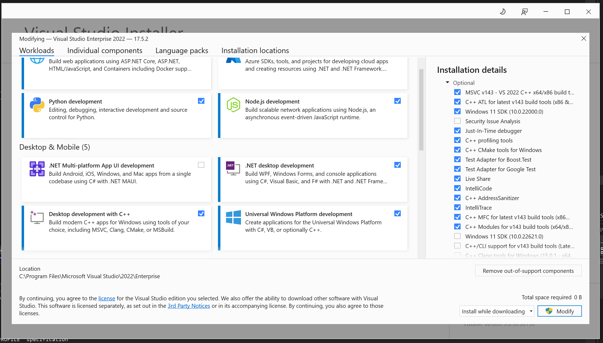

# For developers

Currently supported: MSVC 2022 (Microsoft Visual Studio 2022) ::

- `/platform/win32/mupdf.sln` (**main project/repository Visual Studio solution**)
- `/platform/win32/mupdf_dev.sln`  (**primarily for qiqqa backend tooling devs, but when you get here, that's who you are 😉 **)

# Prerequisites

## NASM (Assembler) + Visual Studio add-on

> When missing, you'll see "*missing `nasm.props`*" errors when attempting a build.

You need to install the *NASM for Visual Studio add-on*:

- First, you'll first need to **install NASM** by way of https://github.com/netwide-assembler/nasm --> https://nasm.us/ --> https://www.nasm.us/pub/nasm/releasebuilds/2.16.01/win64/

- Then you can install the required Visual Studio 2022 add-on (VSNASM), which can be found at: https://github.com/ShiftMediaProject/VSNASM -- for install instruction, see the README there.

## Visual Studio ATL/MFC C++ SDK component

(rewrite)

> error: "*missing `afxres.h`*"

Definitely a case of von Moltke ("no plan survives first contact")  :-) 

The `afxres.h` one is resolved by installing the MFC component in Microsoft Developer Studio, as it is obtained from there. We don't use MFC otherwise, not yet anyway. Turns out I don't suffer from this error as I always install the MFC SDK out of old habit.

You can fix this by having a look in the Visual Studio installer and see if you can get the MFC SDK/component installed.

This is a view of the Visual Studio 2022 Installer (which sits in your Windows Start menu): note the blue checks for C++ and .NET development; when you fold the right side open (as shown) for the C++ development entry, you'll notice I've got ATL + MFC ticked ON: that combo is what produces the `afxres.h` file. (And I think these might be expected as well when we start to include wxWidgets GUI work later on, so it's good to install those anyway, if they aren't already.)

# Building the tools & libraries

- Open the `mupdf.sln` solution in `Qiqqa/MuPDF/platform/win32/`

- In Visual Studio, make sure one of these build modes is selected (as shown in the Visual Studio toolbar below the main menu):

  + Debug / x64          (our preferred dev/debug build mode)
  + Release / x64       
  
  + Debug / Win32        (for 32bit machines. Not tested often, so MAY fail.)
  + Release / Win32
  
  **ANY OTHER build mode (such as 'Debug/Any CPU') WILL NOT work as expected!**
  
- select the project named `__build_target_mupdf` and right-click for pop-up menu.

- select 'Build' or 'Rebuild All', depending on whether you updated the repo / source tree or wish to build everything again from scratch.

- all compiled binaries (executables, etc.) will be produced in the directory

        Qiqqa/MuPDF/platform/win32/bin/<Debug|Release>-Unicode-<32|64>bit-x<86/64>/
	
  (Some test files and the tesseract-required trained data file sets will have been copied there too.)

- use as desired.  

## /TBD/ *Make sure to read the [detailed DEVELOPER NOTES](Qiqqa/MuPDF/docs/Notes/DEVELOPERS-README.md)* /TBD/ 

> Those notes are managed using [Obsidian](https://obsidian.md/); it might be handy to install that tool as it simplifies browsing through those wiki-style Markdown notes stored in `/docs/Notes/`.

