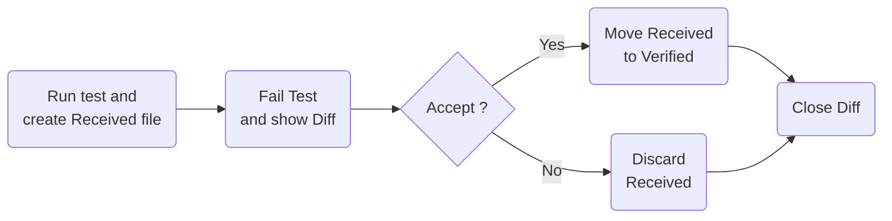
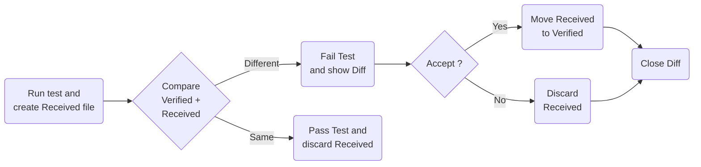

- **A-MNS_TemplateMatching** [📁](./A-MNS_TemplateMatching) [🌐](https://github.com/GerHobbelt/A-MNS_TemplateMatching)

# A-MNS_TemplateMatching
This is the official code for the PatternRecognition2020 paper: Fast and robust template matching with majority neighbour similarity and annulus projection transformation.

Authors: Jinxiang Lai, Liang Lei, Kaiyuan Deng, Runming Yan, Yang Ruan, Zhou Jinyun

Paper download: https://www.sciencedirect.com/science/article/abs/pii/S0031320319303322

Directory "A-MNS_Qt" is the Qt creator version. (Qt download: https://download.qt.io/official_releases/qtcreator/4.5/4.5.0/)

VS version will be updated soon.

Fast and robust template matching with majority neighbour similarity and annulus projection transformation

1. Examples of the A-MNS template matching results


2. MNS similarity


3. The A-MNS method


4. Performance


5. More visulizations


                              


- **ApprovalTestsCpp** [📁](./ApprovalTestsCpp) [🌐](https://github.com/GerHobbelt/ApprovalTests.cpp)

<a id="top"></a>

#  Approval Tests for C++

[](https://github.com/approvals/ApprovalTests.cpp/actions?query=branch%3Amaster+workflow%3Abuild)
[](https://github.com/approvals/ApprovalTests.cpp/actions?query=branch%3Amaster+workflow%3Acygwin)
[](https://github.com/approvals/ApprovalTests.cpp/actions?query=branch%3Amaster+workflow%3Amingw)
[](https://github.com/approvals/ApprovalTests.cpp/actions?query=branch%3Amaster+workflow%3Apython-tests)  
[](https://conan.io/center/approvaltests.cpp)
[](https://vcpkg.io/en/packages.html?query=approval-tests-cpp)  
[](https://approvaltestscpp.readthedocs.io/en/latest/?badge=latest)  
[](https://opensource.org/licenses/Apache-2.0)
[](/CODE_OF_CONDUCT.md#top)

:arrow_down: <a href="https://github.com/approvals/ApprovalTests.cpp/releases/download/v.10.12.2/ApprovalTests.v.10.12.2.hpp">
Download the latest version (v.10.12.2) of the **single header file** here.</a>

:book: [**Read the Docs**](https://approvaltestscpp.readthedocs.io/en/latest/)

<!-- toc -->
## Contents

  * [What are Approval Tests?](#what-are-approval-tests)
  * [Requirements](#requirements)
  * [Getting Started](#getting-started)
  * [ToString (ostream insertion)](#tostring-ostream-insertion)
  * [What's new?](#whats-new)
  * [Feedback](#feedback)<!-- endToc -->

## What are Approval Tests?

Also known as **Golden Master Tests** or **Snapshot Testing**, Approval Tests are an alternative to asserts. If you are unfamiliar with them, we have an [overview](/doc/Overview.md#top) and a [tutorial](/doc/Tutorial.md#top).

They are great for testing objects with lots of fields, or lists of objects.

## Requirements

* C++11 (or above) compiler
* Mac/Linux/Windows
* One of:  [GoogleTest](https://github.com/google/googletest), [Catch2](https://github.com/catchorg/Catch2), [CppUTest](http://cpputest.github.io/), [doctest](https://github.com/onqtam/doctest), [Boost.Test](https://www.boost.org/doc/libs/1_72_0/libs/test/doc/html/index.html), [\[Boost\].UT](https://github.com/boost-experimental/ut)

## Getting Started

* Download [The Approval.cpp Starter Project](https://github.com/approvals/ApprovalTests.Cpp.StarterProject)
* Read the [Getting Started](/doc/GettingStarted.md#top) page
* [Set up your main file.](/doc/GettingStarted.md#main-file)
* Read the [**User Guide on Read the Docs**](https://approvaltestscpp.readthedocs.io/en/latest/) or
[**on GitHub**](/doc/README.md#top).
* Watch the [Videos](/doc/Videos.md#top)

## ToString (ostream insertion)
Often, you will need to create functions to allow objects to print their state. This is commonly done with an ostream `<< operator`.
You can find examples here: [To String](/doc/ToString.md#top)

## What's new?

Check out the [Features](/doc/Features.md#top) page or [upcoming release notes](https://github.com/approvals/ApprovalTests.cpp/blob/master/build/relnotes_x.y.z.md) to see what we've been working on lately, or browse the [past release notes](https://github.com/approvals/ApprovalTests.cpp/releases).

## Feedback

If you have any comment or suggestion on this documentation, please email Llewellyn or Clare via the details in the [Contributing page](/doc/Contributing.md#top).


- **BoxFort** [📁](./BoxFort) [🌐](https://github.com/GerHobbelt/BoxFort)

# BoxFort

[](https://cirrus-ci.com/github/Snaipe/BoxFort)
[](https://github.com/diacritic/BoxFort/blob/master/LICENSE) 
[](https://github.com/diacritic/BoxFort/releases) 

A simple, cross-platform sandboxing C library powering [Criterion][criterion].

**Warning**: This library is experimental. APIs may change without notice until Beta is hit. Use at your own risk.

BoxFort provides a simple API to run user code in isolated processes.

Although BoxFort provides some kind of security of the parent process
from spawned sandboxes, a sandbox has by default the same system
permissions and access than its parent, and is hence, without care,
ill-fitted for security purposes.

The main goal of this project **is not** security, but portable code
isolation -- if you want complete system isolation, consider using
properly configured containers.

[criterion]: https://github.com/Snaipe/Criterion


- **CLBlast** [📁](./CLBlast) [🌐](https://github.com/GerHobbelt/CLBlast)


CLBlast: The tuned OpenCL BLAS library
================

| Platform | Build status |
|-----|-----|
| Windows | [](https://ci.appveyor.com/project/CNugteren/clblast) |
| Linux | [](https://travis-ci.org/CNugteren/CLBlast/branches) |
| OS X | [](https://travis-ci.org/CNugteren/CLBlast/branches) |

| Test machine (thanks to [ArrayFire](https://ci.arrayfire.org:8010/#/builders)) | Test status |
|-----|-----|
| clblast-linux-nvidia-a100 | [](http://ci.arrayfire.org:8010/#/builders/clblast-linux-nvidia-a100) |
| clblast-linux-nvidia-k80 | [](http://ci.arrayfire.org:8010/#/builders/clblast-linux-nvidia-k80) |
| clblast-linux-nvidia-p100 | [](http://ci.arrayfire.org:8010/#/builders/clblast-linux-nvidia-p100) |
| clblast-linux-nvidia-t4 | [](http://ci.arrayfire.org:8010/#/builders/clblast-linux-nvidia-t4) |
| clblast-linux-nvidia-v100 | [](http://ci.arrayfire.org:8010/#/builders/clblast-linux-nvidia-v100) |
| clblast-windows-amd-r9 | [](http://ci.arrayfire.org:8010/#/builders/clblast-windows-amd-r9) |
| clblast-windows-nvidia-m6000 | [](http://ci.arrayfire.org:8010/#/builders/clblast-windows-nvidia-m6000) |

CLBlast is a modern, lightweight, performant and tunable OpenCL BLAS library written in C++11. It is designed to leverage the full performance potential of a wide variety of OpenCL devices from different vendors, including desktop and laptop GPUs, embedded GPUs, and other accelerators. CLBlast implements BLAS routines: basic linear algebra subprograms operating on vectors and matrices. See [the CLBlast website](https://cnugteren.github.io/clblast) for performance reports on various devices as well as the latest CLBlast news.

The library is not tuned for all possible OpenCL devices: __if out-of-the-box performance is poor, please run the tuners first__. See below for a list of already tuned devices and instructions on how to tune yourself and contribute to future releases of the CLBlast library. See also the [CLBlast feature roadmap](ROADMAP.md) to get an indication of the future of CLBlast.


Why CLBlast and not clBLAS or cuBLAS?
-------------

Use CLBlast instead of clBLAS:

* When you care about achieving maximum performance.
* When you want to be able to inspect the BLAS kernels or easily customize them to your needs.
* When you run on exotic OpenCL devices for which you need to tune yourself.
* When you are still running on OpenCL 1.1 hardware.
* When you prefer a C++ API over a C API (C API also available in CLBlast).
* When you value an organized and modern C++ codebase.
* When you target Intel CPUs and GPUs or embedded devices.
* When you can benefit from the increased performance of half-precision fp16 data-types.

Use CLBlast instead of cuBLAS:

* When you want your code to run on devices other than NVIDIA CUDA-enabled GPUs.
* When you want to tune for a specific configuration (e.g. rectangular matrix-sizes).
* When you sleep better if you know that the library you use is open-source.
* When you are using OpenCL rather than CUDA.

When not to use CLBlast:

* When you run on NVIDIA's CUDA-enabled GPUs only and can benefit from cuBLAS's assembly-level tuned kernels.


Getting started
-------------

CLBlast can be compiled with minimal dependencies (apart from OpenCL) in the usual CMake-way, e.g.:

    mkdir build && cd build
    cmake ..
    make

Detailed instructions for various platforms can be found are [here](doc/installation.md).

Like clBLAS and cuBLAS, CLBlast also requires OpenCL device buffers as arguments to its routines. This means you'll have full control over the OpenCL buffers and the host-device memory transfers. CLBlast's API is designed to resemble clBLAS's C API as much as possible, requiring little integration effort in case clBLAS was previously used. Using CLBlast starts by including the C++ header:

    #include <clblast.h>

Or alternatively the plain C version:

    #include <clblast_c.h>

Afterwards, any of CLBlast's routines can be called directly: there is no need to initialize the library. The available routines and the required arguments are described in the above mentioned include files and the included [API documentation](doc/api.md). The API is kept as close as possible to the Netlib BLAS and the cuBLAS/clBLAS APIs. For an overview of the supported routines, see [here](doc/routines.md).

To get started quickly, a couple of stand-alone example programs are included in the `samples` subfolder. They can optionally be compiled using the CMake infrastructure of CLBlast by providing the `-DSAMPLES=ON` flag, for example as follows:

    cmake -DSAMPLES=ON ..

Afterwards, you can optionally read more about running proper [benchmarks](doc/benchmarking.md) and [tuning the library](doc/tuning.md).


Full documentation
-------------

More detailed documentation is available in separate files:

* [Building and installing](doc/installation.md)
* [Supported routines overview](doc/routines.md)
* [Performance measuring and benchmarking](doc/benchmarking.md)
* [Tuning for better performance](doc/tuning.md)
* [Testing the library for correctness](doc/testing.md)
* [Bindings / wrappers for other languages](doc/bindings.md)
* [More details on the GEMM kernel](doc/details_gemm.md)
* [More details on the convolution implementation](doc/details_conv.md)
* [Glossary with some terms explained](doc/glossary.md)
* [Frequently asked questions (FAQ) and their answers](doc/faq.md)


Known issues
-------------

Known performance related issues:

* Severe performance issues with Beignet v1.3.0 due to missing support for local memory. Please downgrade to v1.2.1 or upgrade to v1.3.1 or newer.

* Performance issues on Qualcomm Adreno GPUs.

Other known issues:

* Routines returning an integer are currently not properly tested for half-precision FP16: IHAMAX/IHAMIN/IHMAX/IHMIN

* Half-precision FP16 tests might sometimes fail based on order multiplication, i.e. (a * b) * c != (c * b) * a

* The AMD APP SDK has a bug causing a conflict with libstdc++, resulting in a segfault when initialising static variables. This has been reported to occur with the CLBlast tuners.

* The AMD run-time compiler has a bug causing it to get stuck in an infinite loop. This is reported to happen occasionally when tuning the CLBlast GEMM routine.

* AMD Southern Island GPUs might cause wrong results with the amdgpu-pro drivers. Do configure CMake with `AMD_SI_EMPTY_KERNEL_WORKAROUND` to resolve the issue, [see issue #301](https://github.com/CNugteren/CLBlast/issues/301).

* Tests might fail on an Intel IvyBridge GPU with the latest Beignet. Please downgrade Beignet to 1.2.1, [see issue #231](https://github.com/CNugteren/CLBlast/issues/231).


Contributing
-------------

Contributions are welcome in the form of tuning results for OpenCL devices previously untested or pull requests. See [the contributing guidelines](CONTRIBUTING.md) for more details.

The main contributing authors (code, pull requests, testing) are:

* [Cedric Nugteren](http://cnugteren.github.io) - main author
* [Anton Lokhmotov](https://github.com/psyhtest)
* [Dragan Djuric](https://github.com/blueberry)
* [Marco Hutter](http://marco-hutter.de/)
* [Hugh Perkins](https://github.com/hughperkins)
* [Gian-Carlo Pascutto](https://github.com/gcp)
* [Ivan Shapovalov](https://github.com/intelfx)
* [Dimitri Van Assche](https://github.com/dvasschemacq)
* [Shehzan Mohammed](https://shehzan10.github.io)
* [Marco Cianfriglia](https://github.com/mcian)
* [Kodonnell](https://github.com/kodonnell)
* [Koichi Akabe](https://github.com/vbkaisetsu)
* Everyone else listed as a [GitHub contributor](https://github.com/CNugteren/CLBlast/graphs/contributors)

Tuning and testing on a variety of OpenCL devices was made possible by:

* [TU/e ES research group](http://www.es.ele.tue.nl/)
* [ASCI DAS4 and DAS5](http://www.cs.vu.nl/das4/)
* [dividiti](http://www.dividiti.com)
* [SURFsara HPC center](http://www.surfsara.com)
* [ArrayFire](http://arrayfire.org)
* [TomTom](http://www.tomtom.com)
* Everyone reporting [tuning results](https://github.com/CNugteren/CLBlast/issues/1)

Hardware/software for this project was contributed by:

* [HPC research group at the University of Bristol](http://uob-hpc.github.io/zoo/) for access to their GPU zoo
* [ArrayFire](http://arrayfire.org) for settings up and supporting Buildbot correctness tests on multiple platforms
* [JetBrains](https://www.jetbrains.com/clion/) for supply a free CLion IDE license for CLBlast developers
* [Travis CI](https://travis-ci.org/CNugteren/CLBlast/branches) and [AppVeyor](https://ci.appveyor.com/project/CNugteren/clblast) for free automated build tests for open-source projects


More information
-------------

Further information on CLBlast is available through the following links:

* A 20-minute presentation of CLBlast was given at the GPU Technology Conference in May 2017. A recording is available on the [GTC on-demand website](http://on-demand.gputechconf.com/gtc/2017/video/s7280-nugteren-clblast.mp4) (poor audio quality however) and a full slide-set is also available [as PDF](http://on-demand.gputechconf.com/gtc/2017/presentation/s7280-cedric-nugteren-clblast.pdf). An updated version was also presented at IWOCL in May 2018. The slide set can be found [here as PDF](https://cnugteren.github.io/downloads/CLBlastIWOCL18.pdf).
* More in-depth information and experimental results are also available in a scientific paper titled [CLBlast: A Tuned OpenCL BLAS Library](https://arxiv.org/abs/1705.05249) (v1 May 2017, updated to v2 in April 2018). For CLTune, the inspiration for the included auto-tuner, see also the [CLTune: A Generic Auto-Tuner for OpenCL Kernels](https://arxiv.org/abs/1703.06503) paper.

How to cite this work:

    Cedric Nugteren. CLBlast: A Tuned OpenCL BLAS Library. In IWOCL'18: International Workshop
    on OpenCL. ACM, New York, NY, USA, 10 pages. 2018. https://doi.org/10.1145/3204919.3204924


Support us
-------------

This project started in March 2015 as an evenings and weekends free-time project next to a full-time job for Cedric Nugteren. If you are in the position to support the project by OpenCL-hardware donations or otherwise, please find contact information on the [website of the main author](http://cnugteren.github.io).


- **CLBlast-database** [📁](./CLBlast-database) [🌐](https://github.com/GerHobbelt/CLBlast-database)


The tuning database for CLBlast
================

This repository contains the full database of tuning results for the [CLBlast OpenCL BLAS library](https://github.com/CNugteren/CLBlast). Tuning results are obtained using CLBlast and the [CLTune auto-tuner](https://github.com/CNugteren/CLTune). For more information see the CLBlast repository.


- **CLTune** [📁](./CLTune) [🌐](https://github.com/GerHobbelt/CLTune)


CLTune: Automatic OpenCL kernel tuning
================

| | master |
|-----|-----|
| Linux/OS X | [](https://travis-ci.org/CNugteren/CLTune/branches) |
| Windows | [](https://ci.appveyor.com/project/CNugteren/cltune) |

CLTune is a C++ library which can be used to automatically tune your OpenCL and CUDA kernels. The only thing you'll need to provide is a tuneable kernel and a list of allowed parameters and values.

For example, if you would perform loop unrolling or local memory tiling through a pre-processor define, just remove the define from your kernel code, pass the kernel to CLTune and tell it what the name of your parameter(s) are and what values you want to try. CLTune will take care of the rest: it will iterate over all possible permutations, test them, and report the best combination.


Compilation
-------------

CLTune can be compiled as a shared library using CMake. The pre-requisites are:

* CMake version 2.8.10 or higher
* A C++11 compiler, for example:
  - GCC 4.7.0 or newer
  - Clang 3.3 or newer
  - AppleClang 5.0 or newer
  - ICC 14.0 or newer
  - MSVC (Visual Studio) 2013 or newer
* An OpenCL library. CLTune has been tested with:
  - Apple OpenCL
  - NVIDIA CUDA SDK (requires version 7.5 or newer for the CUDA back-end)
  - AMD APP SDK
  - Intel OpenCL
  - Beignet

An example of an out-of-source build (starting from the root of the CLTune folder):

    mkdir build
    cd build
    cmake ..
    make
    sudo make install

A custom installation folder can be specified when calling CMake:

    cmake -DCMAKE_INSTALL_PREFIX=/path/to/install/directory ..

You can then link your own programs against the CLTune library. An example for a Linux-system with OpenCL:

    export LD_LIBRARY_PATH=$LD_LIBRARY_PATH:/path/to/libcltune.so
    g++ example.cc -o example -L/path/to/libcltune.so -lcltune -lOpenCL

Furthermore, it is possible to optionally set an OS environmental variable `CLTUNE_BUILD_OPTIONS` to pass specific build options to the OpenCL compiler at run-time.


Example of using the tuner
-------------

Before we start using the tuner, we'll have to create one. The constructor takes two arguments: the first specifying the OpenCL platform number, and the second the device ID on that platform:

    cltune::Tuner my_tuner(0, 1); // Tuner on device 1 of OpenCL platform 0

For the CUDA back-end use 0 as the platform ID. Now that we have a tuner, we can add a tuning kernel. This is done by providing a list of paths to kernel files (first argument), the name of the kernel (second argument), a list of global thread dimensions (third argument), and a list of local thread or workgroup dimensions (fourth argument). Note that the thread configuration can be dynamic as well, see the included samples. Here is an example of a more basic usage using a static configuration:

    size_t id = my_tuner.AddKernel({"path/to/kernel.opencl"}, "my_kernel", {1024,512}, {16,8});

Notice that the AddKernel function returns an integer: it is the ID of the added kernel. We'll need this ID when we want to add tuning parameters to this kernel. Let's say that our kernel has two pre-processor parameters named `PARAM_1` with allowed values 16 and 24 and `PARAM_2` with allowed values 0 through 4:

    my_tuner.AddParameter(id, "PARAM_1", {16, 24});
    my_tuner.AddParameter(id, "PARAM_2", {0, 1, 2, 3, 4});

Now that we've added a kernel and its parameters, we can add another one if we wish. When we're satisfied with the kernels and their parameters, there are a couple of things left to be done. Let's start by adding a reference kernel. This reference kernel can provide the tuner with the ground-truth and is optional - the tuner will only perform verification checks to ensure correctness when it is provided.

    my_tuner.SetReference({"path/to/reference.opencl"}, "my_reference", {8192}, {128});

The tuner also needs to know which arguments the kernels take. Scalar arguments can be provided as-is and are passed-by-value, whereas arrays have to be provided as C++ `std::vector`s. That's right, you don't have to create device buffers yourself, CLTune will handle that! Here is an example:

    int my_variable = 900;
    std::vector<float> input_vector(8192);
    std::vector<float> output_vector(8192);
    my_tuner.AddArgumentScalar(my_variable);
    my_tuner.AddArgumentScalar(3.7);
    my_tuner.AddArgumentInput(input_vector);
    my_tuner.AddArgumentOutput(output_vector);

Now that we've configured the tuner, it is time to start it and ask it to report the results:

    my_tuner.Tune(); // Starts the tuner
    my_tuner.PrintToScreen(); // Prints the results


Other examples
-------------

Several examples are included as part of the CLTune distribution. They illustrate based and more advanced features, such as modifying the thread dimensions based on the parameters and adding user-defined parameter constraints. The examples are compiled when setting `ENABLE_SAMPLES` to `ON` in CMake (default option). All examples have both CUDA and OpenCL kernels. The included examples are:

* `simple.cc` The simplest possible example: tuning the work-group/thread-block size of a vector-addition kernel.
* `conv_simple.cc` A simple example of a 2D convolution kernel.
* `multiple_kernels.cc` A simple example with two different matrix-vector multiplication kernels, also showing the verification of output data.
* `gemm.cc` An advanced and heavily tunable implementation of matrix-matrix multiplication (GEMM).
* `conv.cc` An advanced and heavily tunable implementation of 2D convolution. This also demonstrates advanced search strategies including machine learning models.

The latter two optionally take command-line arguments. The first argument is an integer to select the platform (NVIDIA, AMD, etc.), the second argument is an integer for the device to run on, the third argument is an integer to select a search strategy (0=random, 1=annealing, 2=PSO, 3=fullsearch), and the fourth an optional search-strategy parameter.

Other examples are found in the [CLTuneDemos repository](https://github.com/williamjshipman/CLTuneDemos). CLTune is also used in the [CLBlast library](https://github.com/CNugteren/CLBlast).


Search strategies and machine-learning
-------------

The GEMM and 2D convolution examples are additionally configured to use one of the four supported search strategies. More details can be found in the corresponding CLTune paper (see below). These search-strategies can be used for any example as follows:

    tuner.UseFullSearch(); // Default
    tuner.UseRandomSearch(double fraction);
    tuner.UseAnnealing(double fraction, double max_temperature);
    tuner.UsePSO(double fraction, size_t swarm_size, double influence_global, double influence_local, double influence_random);

The 2D convolution example is additionally configured to use machine-learning to predict the quality of parameters based on a limited set of 'training' data. The supported models are linear regression and a 3-layer neural network. These machine-learning models are still experimental, but can be used as follows:

    // Trains a machine learning model based on the search space explored so far. Then, all the
    // missing data-points are estimated based on this model. This is only useful if a fraction of
    // the search space is explored, as is the case when doing random-search.
    tuner.ModelPrediction(Model model_type, float validation_fraction, size_t test_top_x_configurations);


Experimental CUDA support
-------------

CLTune was originally developed for OpenCL kernels, but since it uses the high-level C++ API `CLCudaAPI`, it can also work with CUDA kernels. To compile CLTune with CUDA as a back-end, set the `USE_OPENCL` CMake flag to `OFF`, for example as follows:

    cmake -DUSE_OPENCL=OFF ..

The samples ship with a basic header to convert the included OpenCL samples to CUDA (`cl_to_cuda.h`). This header file is automatically included when CLTune is built with CUDA as a back-end. It has been tested with the `simple` example, but doesn't work with the more advanced kernels. Nevertheless, CLTune should work with any proper CUDA kernel.


Development and tests
-------------

The CLTune project follows the Google C++ styleguide (with some exceptions) and uses a tab-size of two spaces and a max-width of 100 characters per line. It is furthermore based on practises from the third edition of Effective C++ and the first edition of Effective Modern C++. The project is licensed under the APACHE 2.0 license by SURFsara, (c) 2014.

CLTune is packaged with Catch 1.2.1 and a custom test suite. No external dependencies are needed. The tests will be compiled when providing the `TESTS=ON` option to CMake. Running the tests goes as follows:

    ./unit_tests

However, the more useful tests are the provided examples, since they include a verification kernel. Running the examples on device Y on platform X goes as follows:

    ./sample_conv X Y
    ./sample_gemm X Y


More information
-------------

Further information on CLTune is available below:

* The full [CLTune API reference](doc/api.md) is available in the current repository.

* A 19-minute presentation of CLTune was given at the GPU Technology Conference in April 2016. A recording is available on [the GTC on-demand website](http://on-demand.gputechconf.com/gtc/2016/video/S6206.html) and a full slideset is [also available as PDF](http://www.cedricnugteren.nl/downloads/handouts2016a.pdf).

* A how-to-use CLTune tutorial written by William J Shipman is available on [his blog](https://williamjshipman.wordpress.com/2016/01/31/autotuning-opencl-kernels-cltune-on-windows-7/).

* More in-depth information and experimental results are also available in a scientific paper. If you refer to this work in a scientific publication, please cite the corresponding CLTune paper published in MCSoC '15:

> Cedric Nugteren and Valeriu Codreanu. CLTune: A Generic Auto-Tuner for OpenCL Kernels. In: MCSoC: 9th International Symposium on Embedded Multicore/Many-core Systems-on-Chip. IEEE, 2015.


Related projects
-------------

A simpler but perhaps easier-to-use Python-based OpenCL auto-tuner was made by Ben van Werkhoven and is [also available on GitHub](https://github.com/benvanwerkhoven/kernel_tuner).

KTT is another C++ kernel tuner with a similar API to CLTune but with more advanced features including online autotuning and more. It is [available on GitHub](https://github.com/Fillo7/KTT).


- **CRFpp** [📁](./CRFpp) [🌐](https://github.com/GerHobbelt/crfpp)

see doc/index.html


- **CRFsuite-extended** [📁](./CRFsuite-extended) [🌐](https://github.com/GerHobbelt/CRFSuiteEx)

CRFSuite (0.13)
==============

[](https://travis-ci.org/WladimirSidorenko/CRFSuite)

Table of Contents
-----------------

  * [CRFSuite (0.13)](#crfsuite-013)
	* [Introduction](#introduction)
	* [Installation](#installation)
	* [Version 0.13](#version-013)
	* [Format](#format)
	* [Warnings](#warnings)
	* [Copyright and Licensing](#copyright-and-licensing)
	* [Acknowledgment](#acknowledgment)

Introduction
------------

CRFSuite 0.13 is a fork of [Naoaki Okazaki's](http://www.chokkan.org/)
implementation of conditional random fields (CRFs).  Please refer to
the [web site](http://www.chokkan.org/software/crfsuite/) for more
information about the original software.

Installation
------------

In order to install the current version of the program, you need to
execute the following commands in the root directory of the
downloaded project:

```shell
autoreconf -f -i

./configure

make all check

sudo make install
```

Version 0.13
------------

This version of `CRFSuite` has been extended with the following
variants of CRFs:

* tree-structured CRFs;
* semi-Markov CRFs of arbitrary orders;
* linear-chain CRFs  of arbitrary orders.

To invoke tree-structured CRFs, you should provide the option
`--type=tree` when running `crfsuite learn` and also specify this
option when you later envoke `crfsuite tag` with the trained model.

To use higher-order linear-chain and semi-markov CRFs, you should specify the
option `--type=semim` both during the training and during the tagging, e.g.:

`crfsuite learn --type=semim -p feature.max_seg_len=-1 -m semim.model tests/test_sm_1.input`

`crfsuite tag --type=semim -m semim.model tests/test_sm_1.input`

Setting the option `-p feature.max_seg_len=` to a negative value will envoke the
semi-Markov variant of CRF, providing a non-negative integer will activate the
linear-chain model.  To specify the maximum order of transition features, use
the option `-p feature.max_order=`, e.g.:

`crfsuite learn --type=semim -p feature.max_seg_len=1 -p feature.max_order=4
-m semim.model tests/test_sm_1.input`

will train a 4-th order linear-chain model.

Format
------
The format for the first and higher order linear-chain and semi-Markov
looks as follows:

`label1 \t feat_name1:value1 \t feat_name2:value2 \t feat_name3:value3`

`label2 \t feat_name4:value4 \t feat_name5:value5 \t feat_name6:value6`

`label3 \t feat_name7:value7 \t feat_name8:value8`

`label4 \t feat_name9:value9 \t feat_name10:value10 \t feat_name11:value11`

` `

For testing, you can either specify a valid label as the first field or
put any value (e.g `_` underscore ) which does not coincide with any known
tagset label.  This first field is skipped during the testing.  Empty lines
delimit the sequences.

For the tree-structured CRFs, you should specify the id of the node as the
second field and the id of the parent node as the third field, e.g:

`label1 \t node_id1 \t node_id2 \t feat_name1:value1`

`label2 \t node_id2 \t _ \t feat_name2:value2`

`label3 \t node_id3 \t node_id4`

`label4 \t node_id4 \t node_id2 \t feat_name3:value3 \t feat_name4:value4`

` `

The parent of the root node should be specified as `_` (underscore) (see file
`tests/test_tree_2.input` for an example).

Warnings
--------
1. Only `l-BFGS` is supported so far for the higher-order and
   semi-markov models;
2. Semi-Markov and higher-order linear-chain models do not support the options
`-i` and `-p` for tagging yet;
3. No speed optimization was done for the higher-order semi-Markov and linear-
chain models;
4. C++ interface has not been updated to support the new types.

Copyright and Licensing
-----------------------

This program is distributed under the modified BSD license. Refer to
COPYING file for the precise description of the license.


Portions of this software are based on libLBFGS.

The MIT License

Copyright (c) 1990 Jorge Nocedal
Copyright (c) 2007 Naoaki Okazaki

Permission is hereby granted, free of charge, to any person obtaining a
copy of this software and associated documentation files (the "Software"),
to deal in the Software without restriction, including without limitation
the rights to use, copy, modify, merge, publish, distribute, sublicense,
and/or sell copies of the Software, and to permit persons to whom the
Software is furnished to do so, subject to the following conditions:

The above copyright notice and this permission notice shall be included in
all copies or substantial portions of the Software.

THE SOFTWARE IS PROVIDED "AS IS", WITHOUT WARRANTY OF ANY KIND, EXPRESS OR
IMPLIED, INCLUDING BUT NOT LIMITED TO THE WARRANTIES OF MERCHANTABILITY,
FITNESS FOR A PARTICULAR PURPOSE AND NONINFRINGEMENT. IN NO EVENT SHALL THE
AUTHORS OR COPYRIGHT HOLDERS BE LIABLE FOR ANY CLAIM, DAMAGES OR OTHER
LIABILITY, WHETHER IN AN ACTION OF CONTRACT, TORT OR OTHERWISE, ARISING FROM,
OUT OF OR IN CONNECTION WITH THE SOFTWARE OR THE USE OR OTHER DEALINGS IN
THE SOFTWARE.


Portions of this software are based on Constant Quark Database (CQDB).

The BSD license.

Copyright (c) 2007, Naoaki Okazaki
All rights reserved.

Redistribution and use in source and binary forms, with or without
modification, are permitted provided that the following conditions are met:
    * Redistributions of source code must retain the above copyright
      notice, this list of conditions and the following disclaimer.
    * Redistributions in binary form must reproduce the above copyright
      notice, this list of conditions and the following disclaimer in the
      documentation and/or other materials provided with the distribution.
    * Neither the name of the Northwestern University, University of Tokyo,
      nor the names of its contributors may be used to endorse or promote
      products derived from this software without specific prior written
      permission.

THIS SOFTWARE IS PROVIDED BY THE COPYRIGHT HOLDERS AND CONTRIBUTORS
"AS IS" AND ANY EXPRESS OR IMPLIED WARRANTIES, INCLUDING, BUT NOT
LIMITED TO, THE IMPLIED WARRANTIES OF MERCHANTABILITY AND FITNESS FOR
A PARTICULAR PURPOSE ARE DISCLAIMED. IN NO EVENT SHALL THE COPYRIGHT OWNER
OR CONTRIBUTORS BE LIABLE FOR ANY DIRECT, INDIRECT, INCIDENTAL, SPECIAL,
EXEMPLARY, OR CONSEQUENTIAL DAMAGES (INCLUDING, BUT NOT LIMITED TO,
PROCUREMENT OF SUBSTITUTE GOODS OR SERVICES; LOSS OF USE, DATA, OR
PROFITS; OR BUSINESS INTERRUPTION) HOWEVER CAUSED AND ON ANY THEORY OF
LIABILITY, WHETHER IN CONTRACT, STRICT LIABILITY, OR TORT (INCLUDING
NEGLIGENCE OR OTHERWISE) ARISING IN ANY WAY OUT OF THE USE OF THIS
SOFTWARE, EVEN IF ADVISED OF THE POSSIBILITY OF SUCH DAMAGE.


Portions of this software are based on RumAVL.

MIT/X Consortium License.

Copyright (c) 2005-2007 Jesse Long <jpl@unknown.za.net>
All rights reserved.

Permission is hereby granted, free of charge, to any person obtaining a
copy of this software and associated documentation files (the "Software"),
to deal in the Software without restriction, including without limitation
the rights to use, copy, modify, merge, publish, distribute, sublicense,
and/or sell copies of the Software, and to permit persons to whom the
Software is furnished to do so, subject to the following conditions:

   1. The above copyright notice and this permission notice shall be
      included in all copies or substantial portions of the Software.
   2. The origin of the Software must not be misrepresented; you must not
      claim that you wrote the original Software.
   3. Altered source versions of the Software must be plainly marked as
      such, and must not be misrepresented as being the original Software.

THE SOFTWARE IS PROVIDED "AS IS", WITHOUT WARRANTY OF ANY KIND, EXPRESS OR
IMPLIED, INCLUDING BUT NOT LIMITED TO THE WARRANTIES OF MERCHANTABILITY,
FITNESS FOR A PARTICULAR PURPOSE AND NONINFRINGEMENT. IN NO EVENT SHALL THE
AUTHORS OR COPYRIGHT HOLDERS BE LIABLE FOR ANY CLAIM, DAMAGES OR OTHER
LIABILITY, WHETHER IN AN ACTION OF CONTRACT, TORT OR OTHERWISE, ARISING
FROM, OUT OF OR IN CONNECTION WITH THE SOFTWARE OR THE USE OR OTHER
DEALINGS IN THE SOFTWARE.


Portions of this software are based on a portable stdint.h (for MSVC).

Copyright (c) 2005-2007 Paul Hsieh

Redistribution and use in source and binary forms, with or without
modification, are permitted provided that the following conditions
are met:

    Redistributions of source code must retain the above copyright
    notice, this list of conditions and the following disclaimer.

    Redistributions in binary form must not misrepresent the orignal
    source in the documentation and/or other materials provided
    with the distribution.

    The names of the authors nor its contributors may be used to
    endorse or promote products derived from this software without
    specific prior written permission.

THIS SOFTWARE IS PROVIDED BY THE COPYRIGHT HOLDERS AND CONTRIBUTORS
"AS IS" AND ANY EXPRESS OR IMPLIED WARRANTIES, INCLUDING, BUT NOT
LIMITED TO, THE IMPLIED WARRANTIES OF MERCHANTABILITY AND FITNESS
FOR A PARTICULAR PURPOSE ARE DISCLAIMED. IN NO EVENT SHALL THE
COPYRIGHT OWNER OR CONTRIBUTORS BE LIABLE FOR ANY DIRECT, INDIRECT,
INCIDENTAL, SPECIAL, EXEMPLARY, OR CONSEQUENTIAL DAMAGES
(INCLUDING, BUT NOT LIMITED TO, PROCUREMENT OF SUBSTITUTE GOODS OR
SERVICES; LOSS OF USE, DATA, OR PROFITS; OR BUSINESS INTERRUPTION)
HOWEVER CAUSED AND ON ANY THEORY OF LIABILITY, WHETHER IN CONTRACT,
STRICT LIABILITY, OR TORT (INCLUDING NEGLIGENCE OR OTHERWISE)
ARISING IN ANY WAY OUT OF THE USE OF THIS SOFTWARE, EVEN IF ADVISED
OF THE POSSIBILITY OF SUCH DAMAGE.


Portions of this software are based on Mersenne Twister.

Copyright (C) 1997 - 2002, Makoto Matsumoto and Takuji Nishimura,
All rights reserved.

Redistribution and use in source and binary forms, with or without
modification, are permitted provided that the following conditions are
met:

  1. Redistributions of source code must retain the above copyright
     notice, this list of conditions and the following disclaimer.

  2. Redistributions in binary form must reproduce the above copyright
     notice, this list of conditions and the following disclaimer in the
     documentation and/or other materials provided with the distribution.

  3. The names of its contributors may not be used to endorse or
     promote products derived from this software without specific
     prior written permission.

THIS SOFTWARE IS PROVIDED BY THE COPYRIGHT HOLDERS AND CONTRIBUTORS
"AS IS" AND ANY EXPRESS OR IMPLIED WARRANTIES, INCLUDING, BUT NOT
LIMITED TO, THE IMPLIED WARRANTIES OF MERCHANTABILITY AND FITNESS FOR
A PARTICULAR PURPOSE ARE DISCLAIMED.  IN NO EVENT SHALL THE COPYRIGHT OWNER OR
CONTRIBUTORS BE LIABLE FOR ANY DIRECT, INDIRECT, INCIDENTAL, SPECIAL,
EXEMPLARY, OR CONSEQUENTIAL DAMAGES (INCLUDING, BUT NOT LIMITED TO,
PROCUREMENT OF SUBSTITUTE GOODS OR SERVICES; LOSS OF USE, DATA, OR
PROFITS; OR BUSINESS INTERRUPTION) HOWEVER CAUSED AND ON ANY THEORY OF
LIABILITY, WHETHER IN CONTRACT, STRICT LIABILITY, OR TORT (INCLUDING
NEGLIGENCE OR OTHERWISE) ARISING IN ANY WAY OUT OF THE USE OF THIS
SOFTWARE, EVEN IF ADVISED OF THE POSSIBILITY OF SUCH DAMAGE.

Acknowledgment
--------------

Special thanks goes to:

* Olivier Grisel
* Andreas Holzbach
* Baoli Li
* Yoshimasa Tsuruoka
* Hiroshi Manabe
* Riza Theresa B. Batista-Navarro


- **ColorSpace** [📁](./ColorSpace) [🌐](https://github.com/GerHobbelt/ColorSpace)

# ColorSpace
[](https://ci.appveyor.com/project/berendeanicolae/colorspace/branch/master)

C++ library for converting between color spaces and comparing colors.

## Color Conversion
You can convert between any supported color spaces using the ```To``` template method:
```c++
ColorSpace::Lab lab(100, 0, 0);
ColorSpace::Cmy cmy;
lab.To<ColorSpace::Cmy>(&cmy);
```
## Color Comparison
You can compare colors by using the ```Compare``` method of each comparison class:
```c++
ColorSpace::Lab a(100, 0, 0);
ColorSpace::Rgb b(255, 255, 255);
ColorSpace::Cie2000Comparison::Compare(&a, &b);
```

## Currently Supported Color Spaces
* CMY
* CMYK
* HSL
* HSB
* HSV
* CIE L*AB
* Hunter LAB
* LCH
* LUV
* RGB
* XYZ
* YXY

## Currently Supported Comparisons
* Euclidean
* CIE1976
* CIE94
* CIE2000
* CMC

## License
ColorSpace is licenced under the MIT License, see LICENSE for more information.


- **Criterion** [📁](./Criterion) [🌐](https://github.com/GerHobbelt/Criterion)

<h1></h1>

[](https://cirrus-ci.com/github/Snaipe/Criterion)
[](https://codecov.io/github/Snaipe/Criterion?branch=bleeding)
[](https://github.com/Snaipe/Criterion/blob/master/LICENSE)
[](https://github.com/Snaipe/Criterion/releases/latest)
[][online-docs]
[][online-docs-latest]

A dead-simple, yet extensible, C and C++ unit testing framework.


## Philosophy

Most test frameworks for C require a lot of boilerplate code to
set up tests and test suites -- you need to create a main,
then register new test suites, then register the tests within
these suites, and finally call the right functions.

This gives the user great control, at the unfortunate cost of simplicity.

Criterion follows the KISS principle, while keeping the control
the user would have with other frameworks:

* [x] C99 and C++11 compatible.
* [x] Tests are automatically registered when declared.
* [x] Implements a xUnit framework structure.
* [x] A default entry point is provided, no need to declare a main
  unless you want to do special handling.
* [x] Test are isolated in their own process, crashes and signals can be
  reported and tested.
* [x] Unified interface between C and C++: include the criterion header and it *just* works.
* [x] Supports parameterized tests and theories.
* [x] Progress and statistics can be followed in real time with report hooks.
* [x] TAP output format can be enabled with an option.
* [x] Runs on Linux, FreeBSD, macOS, and Windows (Compiling with MinGW GCC and Visual Studio 2015+).

## Downloads

### Packages

| Platform | Command |
| --- | --- |
**Ubuntu** (>=21.04) / **Debian** (>=11) | `apt-get install libcriterion-dev`
**Gentoo** | `emerge -a dev-libs/criterion`
**Arch Linux** ([AUR][aur]) | `pacaur -S criterion`
**macOS** | `brew install criterion`
**Nix** | `nix-env -iA nixpkgs.criterion`
**FreeBSD** | `pkg install criterion`

If you'd like to see Criterion included in your favorite distribution, please reach out to their package maintainers team.

### Binary archives

Binary releases for Linux x86\_64 are available [on the release page](https://github.com/Snaipe/Criterion/releases).

If you have a different platform, you can still [build the library from source](http://criterion.readthedocs.org/en/latest/setup.html#installation).

## Developer Resources

### Documentation

An online documentation is available on [ReadTheDocs][online-docs]
([PDF][pdf-docs] | [Zip][zip-docs] | [Epub][epub-docs])

### Samples

Sample tests can be found in the [sample directory][samples].

* [A simple test][sample-simple]
* [Using multiple suites][sample-suites]
* [Writing assertions][sample-asserts]
* [Adding test fixtures][sample-fixtures]
* [Tests with signals][sample-signal]
* [Using report hooks][sample-report]

### Getting help

| Channel | Description |
| --- | --- |
[][gh-discussions] | Ask a question in GitHub discussions
[][mailing-list] | Criterion mailing list on freelists.org

### Misc

* [autotools skeleton for projects with criterion tests][autotools]
* [CMake find module for Criterion][find-module]

## Credits

Criterion is built with the following projects:

* [boxfort](https://github.com/diacritic/BoxFort)
* [debugbreak](https://github.com/scottt/debugbreak)
* [libffi](https://sourceware.org/libffi/)
* [klib](http://attractivechaos.github.io/klib/)
* [libcsptr](https://github.com/Snaipe/libcsptr)
* [nanomsg](http://nanomsg.org/)
* [nanopb](http://koti.kapsi.fi/jpa/nanopb/)

Logo made by [Paul Bouigue](http://www.cargocollective.com/pbouigue).

[online-docs]: http://criterion.readthedocs.org/
[online-docs-latest]: http://criterion.readthedocs.org/en/latest
[pdf-docs]: http://readthedocs.org/projects/criterion/downloads/pdf/latest/
[zip-docs]: http://readthedocs.org/projects/criterion/downloads/htmlzip/latest/
[epub-docs]: http://readthedocs.org/projects/criterion/downloads/epub/latest/

[samples]: ./samples/
[sample-simple]: ./samples/simple.c
[sample-suites]: ./samples/suites.c
[sample-asserts]: ./samples/asserts.c
[sample-fixtures]: ./samples/fixtures.c
[sample-signal]: ./samples/signal.c
[sample-report]: ./samples/report.c

[autotools]: ./dev/autotools
[find-module]: ./dev/FindCriterion.cmake

[aur]: https://aur.archlinux.org/packages/criterion/

[mailing-list]: http://www.freelists.org/list/criterion
[gh-discussions]: https://github.com/Snaipe/Criterion/discussions/new?category=q-a


- **CryptSync** [📁](./CryptSync) [🌐](https://github.com/GerHobbelt/CryptSync)

# CryptSync
CryptSync is a small utility that synchronizes two folders while encrypting the contents in one folder. That means one of the two folders has all files unencrypted (the files you work with) and the other folder has all the files encrypted.

[](https://tortoisesvn.visualstudio.com/tortoisesvnGitHub/_build/latest?definitionId=12&branchName=main)

The synchronization works both ways: a change in one folder gets synchronized to the other folder. If a file is added or modified in the unencrypted folder, it gets encrypted. If a file is added or modified in the encrypted folder, it gets decrypted to the other folder.

This is best used together with cloud storage tools like OneDrive, DropBox or Google Drive.

Please see the [Homepage](https://tools.stefankueng.com/CryptSync.html) for more details.


- **Cysboard** [📁](./Cysboard) [🌐](https://github.com/GerHobbelt/Cysboard)

Cysboard 
=========
A lightweight system monitor similar to conky but with html and css for themes


## Usage
1. Create a theme file called main.html in ~/.config/cysboard/ (There must be a file name 'main.html').
2. Add your html code with any of the listed ids below in html tags for device info.
3. Run cysboard.

If a 'main.html' file does not exist in the config directory cysboard will start with a default theme.

## Compiling  
You must have cmake >= 3.1 and gcc >= 5.4 in order to compile

1. mkdir build
2. cmake .
3. make


## Examples
<div align=center>


</div>

Use ids like the following 

```html
<html>
<head>
    <title>Cysboard</title>
    <meta name="position_x" content="3400">
    <meta name="position_y" content="50">
    <meta name="width"  content="350">
    <meta name="height" content="350">
    <meta name="time" content="1">
    <link rel=stylesheet href="path/to/style.css" />
</head>
<body>
    <div
       <!-- os info -->
        <div class="section" #osinfo>
            <div >SYSTEM</div>
            <div class="section-content-child">
                <p>name:   <span id="os_name"></span></p>
                <p>distro: <span id="os_distro_name"></span></p>
                <p>uptime: <span id="os_uptime"></span></p>
            </div>
        </div>
        <!-- cpu info -->
        <div id="cpuinfo">
            <div>CPU</div>
            <p>model:  <span id="cpu_name"></span></p>
            <p>vendor: <span id="cpu_vendor"></span></p>
            <p>arch:   <span id="cpu_arch"></span></p>
            <p>usage:  <span id="cpu_usage"></span> %</p>
        </div>
        <!-- mem info -->
        <div id="meminfo">
            <div>RAM</div>
            <p>free: <span id="mem_free"></span> KB</p>
            <p>used: <span id="mem_used"></span> KB</p>
        </div>
        <div>
            <p>Program 1 Output: <span id="exec_1" cmd="path/to/program"></span></p>
            <p>Program 2 Output: <span id="exec_2" cmd="path/to/program"></span></p>	    	
        </div>
        <!-- album art and other stuff -->
        <!-- you can change the img src tag with shell scripts like this -->
        <div>
            
        </div>
    </div>
</body>
</html>
```
Please see sources/resources/default.html for a working theme. 

## IDs
A list of currently supported information from sources. Add any of
them as an *id* attribute for a tag in your theme file.

ID             | Info
-------------- | -----------------
cpu_name       | The CPU's name                                 
cpu_usage      | The total usage of the CPU in percentages      
cpu_arch       | The CPU's architecture                         
cpu_vendor     | The CPU vendor eg. Intel, AMD                  
cpu_num_cores  | The number of physical cores                
mem_free       | The amount of free memory in KB, MB or GB                
mem_used       | The amount of used memory in KB, MB or GB                
mem_swap_total | The amount of swap memory in KB, MB or GB                
mem_total      | The total amount of physical memory available
os_name        | The name of the OS        
os_distro_name | The distribution name (*Linux only*)       
os_uptime      | The total amount of time since last boot
os_num_procs    | The number of running processes
exec_#         | Execute a program and display its output eg. *exec_0, exec_1* etc.
cpu_usage_#    | Get a cpu core's usage percentage eg. *cpu_usage_0, cpu_usage_1* etc.

Some IDs require attributes and can be used like this

```html
<p>Free RAM: <span id="mem_free" mul="MB"></span></p>
```

Atrribute       | Description                       | Applicable ID(s)
----------------| --------------------------------- | ---------------------------------------------
mul             | Display value in MB, KB or GB     | mem_free, mem_used, mem_swap_total, mem_total
cmd             | Path of program to execute        | exec_#

## Project structure
The source code for the project is located in the source directory.
The header file `cysboard.h` contains the main update function for the program. 
Objects for information from or about the cpu, os, memory and others are initialized in this class. 
All the other files house classes for gathering information from various sources. For example `cpuinfo_linux.cpp` has functions for gathering cpu info on a system. The header file `util.h` holds functions for common and repetitive tasks. 

## Known Issues
1. Program crashes sometimes when editing themes.

## Todo
1. GPU, Disk and Network information.
2. Add graph and bar controls like conky. 
3. Run commands from theme file.


- **DGM-CRF** [📁](./DGM-CRF) [🌐](https://github.com/GerHobbelt/DGM)


# Direct Graphical Models C++ library

[](License.txt)
[](https://github.com/Project-10/DGM/releases)
[](https://www.codefactor.io/repository/github/project-10/dgm)
[](https://ci.appveyor.com/project/Creator/dgm-qmd8n)

DGM is a cross-platform C++ library implementing various tasks in probabilistic graphical models with pairwise and complete (dense) dependencies. The library aims to be used for the Markov and Conditional Random Fields (MRF / CRF),
Markov Chains, Bayesian Networks, _etc_. Specifically, it includes a variety of methods for the following tasks:
* __Learning__: Training of unary and pairwise potentials
* __Inference / Decoding__: Computing the conditional probabilities and the most likely configuration
* __Parameter Estimation__: Computing maximum likelihood (or MAP) estimates of the parameters
* __Evaluation / Visualization__: Evaluation and visualization of the classification results
* __Data Analysis__: Extraction, analysis and visualization of valuable knowlage from training data
* __Feature Engineering__: Extraction of various descriptors from images, which are useful for classification

These tasks are optimized for speed, _i.e._ high-efficient calculations. The code is written in optimized C++17, compiled with Microsoft Visual Studio, Xcode or GCC and can take advantage of multi-core processing as well as GPU computing. DGM is released under a BSD license and hence it is free for both academic and commercial use.

Check out the [project site](http://research.project-10.de/dgm/) for all the details like

- [Online documentation](http://research.project-10.de/dgmdoc/)
- [Installation guide](http://research.project-10.de/dgmdoc/a01843.html)
- [Tutorials](http://research.project-10.de/dgmdoc/a01844.html)

Please join the [DGM-user Q&A forum](http://project-10.de/forum/viewforum.php?f=31) to ask questions and talk about methods and models.
Framework development discussions and thorough bug reports are collected on [Issues](https://github.com/Project-10/DGM/issues).

## Modules:

- __DGM__ - the main library
- __FEX__ - feature extraction module
- __VIS__ - visualization module

## License and Citation

DGM is released under the [BSD 3-Clause license](https://github.com/Project-10/DGM/blob/master/License.txt).
The Project-X reference models are released for unrestricted use.

If the DGM library helps you in your research, please cite it in your publications:

    @MISC{DGM,
    	author = {Kosov, Sergey},
    	title = {Direct Graphical Models {C++} library},
    	year = {2013},
    	howpublished={http://research.project-10.de/dgm/}
    }

and / or the PhD thesis, wich describes all the theory lying behind the DGM library:

    @PHDTHESIS{KosovPhdThesis,
    	author = {Kosov, Sergey},
    	title = {Multi-Layer Conditional Random Fields for Revealing Unobserved Entities},
    	school = {Siegen University},
    	year = {2018},
    	doi = {10.13140/RG.2.2.12409.31844},
    	urn = {urn:nbn:de:hbz:467-13434},
    	url = {http://dokumentix.ub.uni-siegen.de/opus/volltexte/2018/1343}
    }


- **GoldFish-CBOR** [📁](./GoldFish-CBOR) [🌐](https://github.com/GerHobbelt/GoldFish)

# GoldFish
## A fast JSON and CBOR streaming library, without using memory

## Why GoldFish?
GoldFish can parse and generate very large [JSON](http://json.org) or [CBOR](http://cbor.io) documents.
It has some similarities to a [SAX](https://en.wikipedia.org/wiki/Simple_API_for_XML) parser, but doesn't use an event driven API, instead the user of the GoldFish interface is in control.
GoldFish intends to be the easiest and one of the fastest JSON and CBOR streaming parser and serializer to use.

## Quick tutorial
### Converting a JSON stream to a CBOR stream
```cpp
#include <goldfish/json_reader.h>
#include <goldfish/cbor_writer.h>

int main()
{
	using namespace goldfish;

	// Read the string literal as a stream and parse it as a JSON document
	// This doesn't really do any work, the stream will be read as we parse the document
	auto document = json::read(stream::read_string("{\"A\":[1,2,3],\"B\":true}"));

	// Generate a stream on a vector, a CBOR writer around that stream and write
	// the JSON document to it
	// Note that all the streams need to be flushed to ensure that any potentially
	// buffered data is serialized.
	auto cbor_document = cbor::create_writer(stream::vector_writer{}).write(document);
	assert(cbor_document == std::vector<byte>{
		0xbf,                    // start map
		0x61,0x41,               // key: "A"
		0x9f,0x01,0x02,0x03,0xff,// value : [1, 2, 3]
		0x61,0x42,               // key : "B"
		0xf5,                    // value : true
		0xff                     // end map
	});
}
```

### Parsing a JSON document with a schema
SAX parsers are notoriously more complicated to use than DOM parser. The order of the fields in a JSON object matters for a SAX parser.
Defining a schema (which is simply an ordering of the expected key names in the object) helps keep the code simple.
Note that the example below is O(1) in memory (meaning the amount of memory used does not depend on the size of the document)

```cpp
#include <goldfish/json_reader.h>

int main()
{
	using namespace goldfish;

	auto document = json::read(stream::read_string("{\"a\":1,\"c\":3.5}")).as_map("a", "b", "c");
	assert(document.read("a")->as_uint64() == 1);
	assert(document.read("b") == nullopt);
	assert(document.read("c")->as_double() == 3.5);
	seek_to_end(document);
}
```

How about a more complicated example. Note again that this program doesn't allocate memory to parse the document and could run on very large documents backed by file (using `stream::file_reader`) or other type of stream, even on resource constrained machines.

```cpp
#include <goldfish/json_reader.h>
#include <goldfish/iostream_adaptor.h> // to be able to output streams to cout
#include <iostream>

int main()
{
	using namespace goldfish;

	auto document = json::read(stream::read_string(
		R"([
			{"name":"Alice","friends":["Bob","Charlie"]},
			{"name":"Bob","friends":["Alice"]}
		])")).as_array();

	while (auto entry_document = document.read())
	{
		auto entry = entry_document->as_map("name", "friends");
		std::cout << entry.read("name").value().as_string() << " has the following friends: ";

		auto friends = entry.read("friends").value().as_array();
		while (auto friend_name = friends.read())
			std::cout << friend_name->as_string() << " ";

		std::cout << "\n";
		seek_to_end(entry);
	}
	
	/*
	This program outputs:
		Alice has the following friends: Bob Charlie
		Bob has the following friends: Alice
	*/
}
```

### Generating a JSON or CBOR document
You can get a JSON or CBOR writer by calling `json::create_writer` or `cbor::create_writer` on an output stream.

```cpp
#include <goldfish/json_writer.h>

int main()
{
	using namespace goldfish;
	
	auto map = json::create_writer(stream::string_writer{}).start_map();
	map.write("A", 1);
	map.write("B", "text");
	// Streams are serialized as binary 64 data in JSON
	map.write("C", stream::read_string("Hello world!"));

	assert(map.flush() == "{\"A\":1,\"B\":\"text\",\"C\":\"SGVsbG8gd29ybGQh\"}");
}
```

Note how similar the code is to generate a CBOR document. The only change is the creation of the writer (`cbor::create_writer` instead of `json::create_writer`) and the type of output_stream (vector<byte> is better suited to storing the binary data than std::string).
CBOR leads to some significant reduction in document size, in particular when binary data is involved. The JSON document is 41 bytes but the CBOR one is only 27.

```cpp
#include <goldfish/cbor_writer.h>

int main()
{
	using namespace goldfish;

	auto map = cbor::create_writer(stream::vector_writer{}).start_map();
	map.write("A", 1);
	map.write("B", "text");
	map.write("C", stream::read_string("Hello world!"));

	assert(map.flush() == std::vector<byte>{
		0xbf,                               // start map marker
		0x61,0x41,                          // key: "A"
		0x01,                               // value : uint 1
		0x61,0x42,                          // key : "B"
		0x64,0x74,0x65,0x78,0x74,           // value : "text"
		0x61,0x43,                          // key : "C"
		0x4c,0x48,0x65,0x6c,0x6c,0x6f,0x20,
		0x77,0x6f,0x72,0x6c,0x64,0x21,      // value : binary blob "Hello world!"
		0xff                                // end of map
	});
}
```

## Comparison with other libraries
### Parsing performance
We measured the performance of a trivial task: compute the sum of all the integers in a large JSON document. The rapidjson implementation uses the SAX model of that library. For Casablanca, we had no choice but to load the document as a DOM.
This test was compiled using Visual C++ 2015, ran on an Intel Core i7 CPU, both in 32 and 64 bits, on a 16MB JSON document.
This chart shows the time it took to complete the task, normalized in MB of JSON per second (16MB/duration)


Goldfish achieves similar performance to rapidjson (slower on x86 but faster on x64). Both Goldfish and rapidjson are significantly faster than Casablanca, simply because Casablance only offers a DOM interface and couldn't do the job in streaming mode.

### Serialization performance
We loaded the JSON document in a data structure in memory and used the various libraries to regenerate the document in a file on disk.
Both rapidjson and Goldfish used a file stream with a 64kB buffer.


Again, Goldfish and rapidjson achieve similar performance (this time Goldfish is faster on x86 but slower on x64).
Those two libraries are again faster than Casablanca mostly because Casablanca doesn't offer a way to generate a JSON document without first creating a DOM in memory.

## Documentation
### Streams
Goldfish parses documents from read streams and serializes documents to write streams.

Goldfish comes with a few readers: a reader over an in memory buffer (see `stream::read_buffer_ref`) or over a file (see `stream::file_reader`). It also provides a buffering (see `stream::buffer`). You might find yourself in a position where you want to implement your own stream, for example, as a network stream on top of your favorite network library.
Not to worry, the interface for a read stream is fairly straightforward, with a single read_partial_buffer API:
```cpp
struct read_stream
{
	// Copies some bytes from the stream to the "buffer"
	// Returns the number of bytes copied, which might be less than buffer.size() if not all the data is immediately available
	// Returns 0 if the buffer is empty or if the stream was at the end before the call was made.
	//
	// buffer_ref is an object that contains a pointer to the buffer (buffer.data() is the pointer)
	// as well as the number of bytes in the buffer (buffer.size())
	size_t read_partial_buffer(buffer_ref buffer);
}
```

Write streams have the following interface:
```cpp
struct write_stream
{
	// Write some data to the stream
	void write_buffer(const_buffer_ref data);

	// Finish writing to the stream
	// This API must be called once the end of stream is reached.
	// It may return some data. For example, a vector_writer returns
	// the data written to the stream (in the form of an std::vector<byte>).
	auto flush();
}
```

There are a few helper APIs that you can use to ease the consumption of streams:
```cpp
// Seek forward in the stream up to cb bytes
// This API returns the number of bytes skipped from the stream, which can be less
// than cb if the end of the stream is reached
// It is implemented in terms of read_partial_buffer, unless the reader_stream has a seek
//  method on it (in which case that method is used)
uint64_t stream::seek(reader_stream&, uint64_t cb);

// Read the entire stream in memory
std::vector<byte> stream::read_all(reader_stream&);
std::string stream::read_all_as_string(reader_stream&);

// Read an object of type T from the stream
// The object must be a POD
// This API is implemented in terms of read_partial_buffer, unless the reader_stream has a
// read method on it (in which case that method is used)
// If the end of stream is reached before sizeof(T) bytes could be read, this method
// throws unexpected_end_of_stream
template <class T> T stream::read(reader_stream&);

// Write an object of type T to the stream
// The object must be a POD
// This API is implemented in terms of write_buffer, unless the writer_stream has a
// write method on it (in which case that method is used)
template <class T> void stream::write(writer_stream&, const T&);

// Copy a reader stream to an output stream
// Note that this API doesn't flush the output stream and returns the writer stream as a convenience
template <class Reader, class Writer> Writer copy(Reader&&, Writer&&);
```

Here is the exhaustive list of readers provided by the library:
* `stream::ref_reader<reader_stream>` (created using `stream::ref(reader_stream&)`): copyable stream that stores a non owning reference to an existing stream
* `stream::const_buffer_ref_reader` (created using `stream::read_buffer_ref`, `stream::read_string_ref` or `stream::read_string` with a string literal): a stream that reads a buffer, without owning that buffer
* `stream::vector_reader` (created using `stream::read_buffer`): a stream that reads an `std::vector<byte>`, owning that vector
* `stream::string_reader` (created using `stream::read_string`): a stream that reads an `std::string`, owning that string
* `stream::base64_reader<reader_stream>` (created using `stream::decode_base64(reader_stream)`): convert a base64 stream into a binary stream
* `stream::buffered_reader<N, reader_stream>` (created using `stream::buffer<N>(reader_stream)`): add an N byte buffer to the reader_stream
* `stream::file_reader`: a reader stream on a file
* `stream::reader_on_reader_writer` (created using `create_reader_writer_stream`): the reader end of a reader/writer (or producer/consumer) stream

Note that those streams can be composed. For example, `stream::decode_base64(stream::buffer<8192>(stream::file_reader("foo.txt")))` opens the file "foo.txt", buffers that stream using an 8kB buffer and decodes the content of the file assuming it is base64 encoded.

Here is the list of writers provided by the library:
* `stream::ref_writer<writer_stream>` (created using `stream::ref(writer_stream&)`): copyable stream that stores a non owning reference to an existing stream
* `stream::vector_writer`: stores the data in memory, in an std::vector<byte>
* `stream::string_writer`: stores the data in memory, in an std::string
* `stream::base64_writer<writer_stream>` (created using `stream::encode_base64_to(writer_stream)`): data written to that stream is base64 encoded before being written to the writer_stream
* `stream::buffered_writer<N, writer_stream>` (created using `stream::buffer<N>(writer_stream)`): add an N byte buffer to the writer_stream
* `stream::file_writer`: a writer stream on a file
* `stream::writer_on_reader_writer` (created using `create_reader_writer_stream`): the writer end of a reader/writer (or producer/consumer) stream

### JSON/CBOR parser
To start the parsing of a read stream use json::read or cbor::read (for JSON or CBOR documents respectively). Those APIs return "document reader" objects.
A document reader offers the following APIs:
* `as_string()`: if the document is a text (for example `"Hello"` in JSON, or an object of major type 3 in CBOR), return a reader stream on the text, otherwise throw `goldfish::bad_variant_access`
* `as_binary()`:
	* For CBOR documents, return a stream on the data of a byte string document (major type 2), or throw `goldfish::bad_variant_access` if the document is not of major type 2.
	* For JSON documents, return a stream that decodes the base64 encoded text if the document is text (for example, if the document is `"SGVsbG8="`, this API returns a stream that reads `Hello`)
* `as_array()`: if the document is an array (for example `[1,"Hello"]` in JSON, or an object of major type 4 in CBOR), return an `array reader` object, otherwise throw `goldfish::bad_variant_access`
* `as_map()`, `as_object()`: if the document is an object (for example `{"Hello":1}` in JSON, or an object of major type 5 in CBOR), return a `map reader` object, otherwise throw `goldfish::bad_variant_access`
* `as_map(...)`, `as_object(...)`: if parameters are specified to `as_map` or `as_object`, a `map reader with schema` object is returned. This allows for simpler parsing of documents when the keys and their order is known in advance.
* `as_double`:
	* if the document is an integer or a floating point (for example `1`, `-1` or `1.0` in JSON), return a double that represents the value of the document.
	* Strings are parsed, which means the JSON document `"8000"` can be read as either the text `8000` using as_text, the text `�M4` using as_binary, the double `8000`, the signed integer `8000` or the unsigned integer `8000`
	* otherwise, `goldfish::bad_variant_access` is thrown
* `as_uint64`, `as_uint32`, `as_uint16`, `as_uint8`:
	* if the document is a positive integer (for example `1` in JSON), return an integer that represents the value of the document
	* if the document is a negative integer (for example `-1` in JSON), or if the if the integer is too large to be represented as the requested type, throws `goldfish::integer_overflow_while_casting`
	* Strings are parsed
	* otherwise, `goldfish::bad_variant_access` is thrown
* `as_int64`, `as_int32`, `as_int16`, `as_int8`:
	* if the document is an integer (for example `1` in JSON), return an integer that represents the value of the document, or throws `goldfish::integer_overflow_while_casting` if the value is not representable in the requested type
	* Strings are parsed
	* otherwise, `goldfish::bad_variant_access` is thrown
* `as_bool`: if the document is `true` or `false`, `"true"` or `"false"` return the corresponding boolean value
* `is_null`: return true if the document is `null` in JSON or the equivalent in CBOR (major type 7 and additional information 22).
* `is_undefined_or_null`: return true if the document is null or, for CBOR, undefined

In addition, the document reader implements the visitor pattern and exposes a visit API.
That API calls the provided callback with the object and a tag that represents the semantic type of the object.
Here is an example on how to use that API:

```cpp
#include <iostream>
#include <goldfish/json_reader.h>

using namespace goldfish;

struct my_handler
{
	template <class Stream> const char* operator()(Stream& s, tags::binary) { return "binary"; }
	template <class Stream> const char* operator()(Stream& s, tags::string) { return "string"; }
	template <class ArrayReader> const char* operator()(ArrayReader& s, tags::array) { return "array"; }
	template <class MapReader> const char* operator()(MapReader& s, tags::map) { return "map"; }
	const char* operator()(undefined, tags::undefined) { return "undefined"; }
	const char* operator()(double, tags::floating_point) { return "floating point"; }
	const char* operator()(uint64_t, tags::unsigned_int) { return "uint"; }
	const char* operator()(int64_t, tags::signed_int) { return "int"; }
	const char* operator()(bool, tags::boolean) { return "bool"; }
	const char* operator()(nullptr_t, tags::null) { return "null"; }
};
int main()
{
	my_handler sink;
	std::cout << json::read(stream::read_string("true")).visit(sink);
	// outputs bool, the result of calling sink(true, tags::boolean{})
}
```

For simplicity, you can use `goldfish::best_match` and work with lambdas. `best_match` is an API that takes any number of lambdas and forwards any call to the lambda that has the best matching signature (using the C++ overload resolution rules).

```cpp
#include <iostream>
#include <goldfish/json_reader.h>

int main()
{
	using namespace goldfish;

	std::cout << json::read(stream::read_string("true")).visit(best_match(
		[](auto&&, tags::binary) { return "binary"; },
		[](auto&&, tags::string) { return "string"; },
		[](auto&&, tags::array) { return "array"; },
		[](auto&&, tags::map) { return "map"; },
		[](undefined, tags::undefined) { return "undefined"; },
		[](double, tags::floating_point) { return "floating point"; },
		[](uint64_t, tags::unsigned_int) { return "uint"; },
		[](int64_t, tags::signed_int) { return "int"; },
		[](bool, tags::boolean) { return "bool"; },
		[](nullptr_t, tags::null) { return "null"; }
	));
	// outputs "bool"
}
```

Finally, you could also use `first_match`, which will forward to the first callable lambda. This allows specifying only some of the options:

```cpp
#include <iostream>
#include <goldfish/json_reader.h>

int main()
{
	using namespace goldfish;

	std::cout << json::read(stream::read_string("true")).visit(best_match(
		[](bool, tags::boolean) { return "bool"; },
		[](auto&&, auto) { return "not bool"; }
	));
	// outputs "bool"
}
```


- **JamSpell** [📁](./JamSpell) [🌐](https://github.com/GerHobbelt/JamSpell)

# JamSpell

[![Build Status][travis-image]][travis] [![Release][release-image]][releases]

[travis-image]: https://travis-ci.org/bakwc/JamSpell.svg?branch=master
[travis]: https://travis-ci.org/bakwc/JamSpell

[release-image]: https://img.shields.io/badge/release-0.0.12-blue.svg?style=flat
[releases]: https://github.com/bakwc/JamSpell/releases

JamSpell is a spell checking library with following features:

- **accurate** - it considers words surroundings (context) for better correction
- **fast** - near 5K words per second
- **multi-language** - it's written in C++ and available for many languages with swig bindings

[Colab example](https://colab.research.google.com/drive/1aFk8-7nq3oAp402jjLGLpEb2Nzq210Eo)

## JamSpellPro
[jamspell.com](https://jamspell.com) - check out a new jamspell version with following features
 - Improved accuracy ([catboost](https://catboost.ai) gradient boosted decision trees candidates ranking model)
 - Splits merged words
 - Pre-trained models for many languages (small, medium, large) for:  
`en, ru, de, fr, it, es, tr, uk, pl, nl, pt, hi, no`
 - Ability to add words / sentences at runtime
 - Fine-tuning / additional training
 - Memory optimization for training large models
 - Static dictionary support
 - Built-in `Java, C#, Ruby` support
 - Windows support

## Content
- [Benchmarks](#benchmarks)
- [Usage](#usage)
  - [Python](#python)
  - [C++](#c)
  - [Other languages](#other-languages)
  - [HTTP API](#http-api)
- [Train](#train)

## Benchmarks

<table>
  <tr>
    <td></td>
    <td>Errors</td>
    <td>Top 7 Errors</td>
    <td>Fix Rate</td>
    <td>Top 7 Fix Rate</td>
    <td>Broken</td>
    <td>Speed<br>
(words/second)</td>
  </tr>
  <tr>
    <td>JamSpell</td>
    <td>3.25%</td>
    <td>1.27%</td>
    <td>79.53%</td>
    <td>84.10%</td>
    <td>0.64%</td>
    <td>4854</td>
  </tr>
  <tr>
    <td>Norvig</td>
    <td>7.62%</td>
    <td>5.00%</td>
    <td>46.58%</td>
    <td>66.51%</td>
    <td>0.69%</td>
    <td>395</td>
  </tr>
  <tr>
    <td>Hunspell</td>
    <td>13.10%</td>
    <td>10.33%</td>
    <td>47.52%</td>
    <td>68.56%</td>
    <td>7.14%</td>
    <td>163</td>
  </tr>
  <tr>
    <td>Dummy</td>
    <td>13.14%</td>
    <td>13.14%</td>
    <td>0.00%</td>
    <td>0.00%</td>
    <td>0.00%</td>
    <td>-</td>
  </tr>
</table>

Model was trained on [300K wikipedia sentences + 300K news sentences (english)](http://wortschatz.uni-leipzig.de/en/download/). 95% was used for train, 5% was used for evaluation. [Errors model](https://github.com/bakwc/JamSpell/blob/master/evaluate/typo_model.py) was used to generate errored text from the original one. JamSpell corrector was compared with [Norvig's one](http://norvig.com/spell-correct.html), [Hunspell](http://hunspell.github.io/) and a dummy one (no corrections).

We used following metrics:
- **Errors** - percent of words with errors after spell checker processed
- **Top 7 Errors** - percent of words missing in top7 candidated
- **Fix Rate** - percent of errored words fixed by spell checker
- **Top 7 Fix Rate** - percent of errored words fixed by one of top7 candidates
- **Broken** - percent of non-errored words broken by spell checker
- **Speed** - number of words per second

To ensure that our model is not too overfitted for wikipedia+news we checked it on "The Adventures of Sherlock Holmes" text:

<table>
  <tr>
    <td></td>
    <td>Errors</td>
    <td>Top 7 Errors</td>
    <td>Fix Rate</td>
    <td>Top 7 Fix Rate</td>
    <td>Broken</td>
    <td>Speed
(words per second)</td>
  </tr>
  <tr>
    <td>JamSpell</td>
    <td>3.56%</td>
    <td>1.27%</td>
    <td>72.03%</td>
    <td>79.73%</td>
    <td>0.50%</td>
    <td>5524</td>
  </tr>
  <tr>
    <td>Norvig</td>
    <td>7.60%</td>
    <td>5.30%</td>
    <td>35.43%</td>
    <td>56.06%</td>
    <td>0.45%</td>
    <td>647</td>
  </tr>
  <tr>
    <td>Hunspell</td>
    <td>9.36%</td>
    <td>6.44%</td>
    <td>39.61%</td>
    <td>65.77%</td>
    <td>2.95%</td>
    <td>284</td>
  </tr>
  <tr>
    <td>Dummy</td>
    <td>11.16%</td>
    <td>11.16%</td>
    <td>0.00%</td>
    <td>0.00%</td>
    <td>0.00%</td>
    <td>-</td>
  </tr>
</table>

More details about reproducing available in "[Train](#train)" section.

## Usage
### Python
1. Install ```swig3``` (usually it is in your distro package manager)

2. Install ```jamspell```:
```bash
pip install jamspell
```
3. [Download](#download-models) or [train](#train) language model

4. Use it:

```python
import jamspell

corrector = jamspell.TSpellCorrector()
corrector.LoadLangModel('en.bin')

corrector.FixFragment('I am the begt spell cherken!')
# u'I am the best spell checker!'

corrector.GetCandidates(['i', 'am', 'the', 'begt', 'spell', 'cherken'], 3)
# (u'best', u'beat', u'belt', u'bet', u'bent', ... )

corrector.GetCandidates(['i', 'am', 'the', 'begt', 'spell', 'cherken'], 5)
# (u'checker', u'chicken', u'checked', u'wherein', u'coherent', ...)
```

### C++
1. Add `jamspell` and `contrib` dirs to your project

2. Use it:

```cpp
#include <jamspell/spell_corrector.hpp>

int main(int argc, const char** argv) {

    NJamSpell::TSpellCorrector corrector;
    corrector.LoadLangModel("model.bin");

    corrector.FixFragment(L"I am the begt spell cherken!");
    // "I am the best spell checker!"

    corrector.GetCandidates({L"i", L"am", L"the", L"begt", L"spell", L"cherken"}, 3);
    // "best", "beat", "belt", "bet", "bent", ... )

    corrector.GetCandidates({L"i", L"am", L"the", L"begt", L"spell", L"cherken"}, 3);
    // "checker", "chicken", "checked", "wherein", "coherent", ... )
    return 0;
}
```

### Other languages
You can generate extensions for other languages using [swig tutorial](http://www.swig.org/tutorial.html). The swig interface file is `jamspell.i`. Pull requests with build scripts are welcome.

## HTTP API
* Install ```cmake```

* Clone and build jamspell (it includes http server):
```bash
git clone https://github.com/bakwc/JamSpell.git
cd JamSpell
mkdir build
cd build
cmake ..
make
```
* [Download](#download-models) or [train](#train) language model
* Run http server:
```bash
./web_server/web_server en.bin localhost 8080
```
* **GET** Request example:
```bash
$ curl "http://localhost:8080/fix?text=I am the begt spell cherken"
I am the best spell checker
```
* **POST** Request example
```bash
$ curl -d "I am the begt spell cherken" http://localhost:8080/fix
I am the best spell checker
```
* Candidate example
```bash
curl "http://localhost:8080/candidates?text=I am the begt spell cherken"
# or
curl -d "I am the begt spell cherken" http://localhost:8080/candidates
```
```javascript
{
    "results": [
        {
            "candidates": [
                "best",
                "beat",
                "belt",
                "bet",
                "bent",
                "beet",
                "beit"
            ],
            "len": 4,
            "pos_from": 9
        },
        {
            "candidates": [
                "checker",
                "chicken",
                "checked",
                "wherein",
                "coherent",
                "cheered",
                "cherokee"
            ],
            "len": 7,
            "pos_from": 20
        }
    ]
}
```
Here `pos_from` - misspelled word first letter position, `len` - misspelled word len

## Train
To train custom model you need:

1. Install ```cmake```

2. Clone and build jamspell:
```bash
git clone https://github.com/bakwc/JamSpell.git
cd JamSpell
mkdir build
cd build
cmake ..
make
```

3. Prepare a utf-8 text file with sentences to train at (eg. [```sherlockholmes.txt```](https://github.com/bakwc/JamSpell/blob/master/test_data/sherlockholmes.txt)) and another file with language alphabet (eg. [```alphabet_en.txt```](https://github.com/bakwc/JamSpell/blob/master/test_data/alphabet_en.txt))

4. Train model:
```bash
./main/jamspell train ../test_data/alphabet_en.txt ../test_data/sherlockholmes.txt model_sherlock.bin
```
5. To evaluate spellchecker you can use ```evaluate/evaluate.py``` script:
```bash
python evaluate/evaluate.py -a alphabet_file.txt -jsp your_model.bin -mx 50000 your_test_data.txt
```
6. You can use ```evaluate/generate_dataset.py``` to generate you train/test data. It supports txt files, [Leipzig Corpora Collection](http://wortschatz.uni-leipzig.de/en/download/) format and fb2 books.

## Download models
Here is a few simple models. They trained on 300K news + 300k wikipedia sentences. We strongly recommend to train your own model, at least on a few million sentences to achieve better quality. See [Train](#train) section above.

 - [en.tar.gz](https://github.com/bakwc/JamSpell-models/raw/master/en.tar.gz) (35Mb)
 - [fr.tar.gz](https://github.com/bakwc/JamSpell-models/raw/master/fr.tar.gz) (31Mb)
 - [ru.tar.gz](https://github.com/bakwc/JamSpell-models/raw/master/ru.tar.gz) (38Mb)


- **LightGBM** [📁](./LightGBM) [🌐](https://github.com/GerHobbelt/LightGBM)


Light Gradient Boosting Machine
===============================

[](https://github.com/microsoft/LightGBM/actions)
[](https://github.com/microsoft/LightGBM/actions)
[](https://github.com/microsoft/LightGBM/actions)
[](https://github.com/microsoft/LightGBM/actions)
[](https://lightgbm-ci.visualstudio.com/lightgbm-ci/_build/latest?definitionId=1)
[](https://ci.appveyor.com/project/guolinke/lightgbm/branch/master)
[](https://lightgbm.readthedocs.io/)
[](https://github.com/microsoft/LightGBM/actions?query=workflow%3A%22Link+checks%22)
[](https://github.com/microsoft/LightGBM/blob/master/LICENSE)
[](https://pypi.org/project/lightgbm)
[](https://pypi.org/project/lightgbm)
[](https://cran.r-project.org/package=lightgbm)

LightGBM is a gradient boosting framework that uses tree based learning algorithms. It is designed to be distributed and efficient with the following advantages:

- Faster training speed and higher efficiency.
- Lower memory usage.
- Better accuracy.
- Support of parallel, distributed, and GPU learning.
- Capable of handling large-scale data.

For further details, please refer to [Features](https://github.com/microsoft/LightGBM/blob/master/docs/Features.rst).

Benefiting from these advantages, LightGBM is being widely-used in many [winning solutions](https://github.com/microsoft/LightGBM/blob/master/examples/README.md#machine-learning-challenge-winning-solutions) of machine learning competitions.

[Comparison experiments](https://github.com/microsoft/LightGBM/blob/master/docs/Experiments.rst#comparison-experiment) on public datasets show that LightGBM can outperform existing boosting frameworks on both efficiency and accuracy, with significantly lower memory consumption. What's more, [distributed learning experiments](https://github.com/microsoft/LightGBM/blob/master/docs/Experiments.rst#parallel-experiment) show that LightGBM can achieve a linear speed-up by using multiple machines for training in specific settings.

Get Started and Documentation
-----------------------------

Our primary documentation is at https://lightgbm.readthedocs.io/ and is generated from this repository. If you are new to LightGBM, follow [the installation instructions](https://lightgbm.readthedocs.io/en/latest/Installation-Guide.html) on that site.

Next you may want to read:

- [**Examples**](https://github.com/microsoft/LightGBM/tree/master/examples) showing command line usage of common tasks.
- [**Features**](https://github.com/microsoft/LightGBM/blob/master/docs/Features.rst) and algorithms supported by LightGBM.
- [**Parameters**](https://github.com/microsoft/LightGBM/blob/master/docs/Parameters.rst) is an exhaustive list of customization you can make.
- [**Distributed Learning**](https://github.com/microsoft/LightGBM/blob/master/docs/Parallel-Learning-Guide.rst) and [**GPU Learning**](https://github.com/microsoft/LightGBM/blob/master/docs/GPU-Tutorial.rst) can speed up computation.
- [**Laurae++ interactive documentation**](https://sites.google.com/view/lauraepp/parameters) is a detailed guide for hyperparameters.
- [**FLAML**](https://www.microsoft.com/en-us/research/project/fast-and-lightweight-automl-for-large-scale-data/articles/flaml-a-fast-and-lightweight-automl-library/) provides automated tuning for LightGBM ([code examples](https://microsoft.github.io/FLAML/docs/Examples/AutoML-for-LightGBM/)).
- [**Optuna Hyperparameter Tuner**](https://medium.com/optuna/lightgbm-tuner-new-optuna-integration-for-hyperparameter-optimization-8b7095e99258) provides automated tuning for LightGBM hyperparameters ([code examples](https://github.com/optuna/optuna-examples/blob/main/lightgbm/lightgbm_tuner_simple.py)).
- [**Understanding LightGBM Parameters (and How to Tune Them using Neptune)**](https://neptune.ai/blog/lightgbm-parameters-guide).

Documentation for contributors:

- [**How we update readthedocs.io**](https://github.com/microsoft/LightGBM/blob/master/docs/README.rst).
- Check out the [**Development Guide**](https://github.com/microsoft/LightGBM/blob/master/docs/Development-Guide.rst).

News
----

Please refer to changelogs at [GitHub releases](https://github.com/microsoft/LightGBM/releases) page.

Some old update logs are available at [Key Events](https://github.com/microsoft/LightGBM/blob/master/docs/Key-Events.md) page.

External (Unofficial) Repositories
----------------------------------

FLAML (AutoML library for hyperparameter optimization): https://github.com/microsoft/FLAML

Optuna (hyperparameter optimization framework): https://github.com/optuna/optuna

Julia-package: https://github.com/IQVIA-ML/LightGBM.jl

JPMML (Java PMML converter): https://github.com/jpmml/jpmml-lightgbm

Nyoka (Python PMML converter): https://github.com/SoftwareAG/nyoka

Treelite (model compiler for efficient deployment): https://github.com/dmlc/treelite

lleaves (LLVM-based model compiler for efficient inference): https://github.com/siboehm/lleaves

Hummingbird (model compiler into tensor computations): https://github.com/microsoft/hummingbird

cuML Forest Inference Library (GPU-accelerated inference): https://github.com/rapidsai/cuml

daal4py (Intel CPU-accelerated inference): https://github.com/intel/scikit-learn-intelex/tree/master/daal4py

m2cgen (model appliers for various languages): https://github.com/BayesWitnesses/m2cgen

leaves (Go model applier): https://github.com/dmitryikh/leaves

ONNXMLTools (ONNX converter): https://github.com/onnx/onnxmltools

SHAP (model output explainer): https://github.com/slundberg/shap

Shapash (model visualization and interpretation): https://github.com/MAIF/shapash

dtreeviz (decision tree visualization and model interpretation): https://github.com/parrt/dtreeviz

SynapseML (LightGBM on Spark): https://github.com/microsoft/SynapseML

Kubeflow Fairing (LightGBM on Kubernetes): https://github.com/kubeflow/fairing

Kubeflow Operator (LightGBM on Kubernetes): https://github.com/kubeflow/xgboost-operator

lightgbm_ray (LightGBM on Ray): https://github.com/ray-project/lightgbm_ray

Mars (LightGBM on Mars): https://github.com/mars-project/mars

ML.NET (.NET/C#-package): https://github.com/dotnet/machinelearning

LightGBM.NET (.NET/C#-package): https://github.com/rca22/LightGBM.Net

Ruby gem: https://github.com/ankane/lightgbm-ruby

LightGBM4j (Java high-level binding): https://github.com/metarank/lightgbm4j

lightgbm-rs (Rust binding): https://github.com/vaaaaanquish/lightgbm-rs

MLflow (experiment tracking, model monitoring framework): https://github.com/mlflow/mlflow

`{treesnip}` (R `{parsnip}`-compliant interface): https://github.com/curso-r/treesnip

`{mlr3extralearners}` (R `{mlr3}`-compliant interface): https://github.com/mlr-org/mlr3extralearners

lightgbm-transform (feature transformation binding): https://github.com/microsoft/lightgbm-transform

Support
-------

- Ask a question [on Stack Overflow with the `lightgbm` tag](https://stackoverflow.com/questions/ask?tags=lightgbm), we monitor this for new questions.
- Open **bug reports** and **feature requests** (not questions) on [GitHub issues](https://github.com/microsoft/LightGBM/issues).

How to Contribute
-----------------

Check [CONTRIBUTING](https://github.com/microsoft/LightGBM/blob/master/CONTRIBUTING.md) page.

Microsoft Open Source Code of Conduct
-------------------------------------

This project has adopted the [Microsoft Open Source Code of Conduct](https://opensource.microsoft.com/codeofconduct/). For more information see the [Code of Conduct FAQ](https://opensource.microsoft.com/codeofconduct/faq/) or contact [opencode@microsoft.com](mailto:opencode@microsoft.com) with any additional questions or comments.

Reference Papers
----------------

Guolin Ke, Qi Meng, Thomas Finley, Taifeng Wang, Wei Chen, Weidong Ma, Qiwei Ye, Tie-Yan Liu. "[LightGBM: A Highly Efficient Gradient Boosting Decision Tree](https://papers.nips.cc/paper/6907-lightgbm-a-highly-efficient-gradient-boosting-decision-tree)". Advances in Neural Information Processing Systems 30 (NIPS 2017), pp. 3149-3157.

Qi Meng, Guolin Ke, Taifeng Wang, Wei Chen, Qiwei Ye, Zhi-Ming Ma, Tie-Yan Liu. "[A Communication-Efficient Parallel Algorithm for Decision Tree](http://papers.nips.cc/paper/6380-a-communication-efficient-parallel-algorithm-for-decision-tree)". Advances in Neural Information Processing Systems 29 (NIPS 2016), pp. 1279-1287.

Huan Zhang, Si Si and Cho-Jui Hsieh. "[GPU Acceleration for Large-scale Tree Boosting](https://arxiv.org/abs/1706.08359)". SysML Conference, 2018.

**Note**: If you use LightGBM in your GitHub projects, please add `lightgbm` in the `requirements.txt`.

License
-------

This project is licensed under the terms of the MIT license. See [LICENSE](https://github.com/microsoft/LightGBM/blob/master/LICENSE) for additional details.


- **MNN** [📁](./MNN) [🌐](https://github.com/GerHobbelt/MNN)


[中文版本](README_CN.md)

[MNN Homepage](http://www.mnn.zone)

## Intro
MNN is a highly efficient and lightweight deep learning framework. It supports inference and training of deep learning models, and has industry leading performance for inference and training on-device. At present, MNN has been integrated in more than 30 apps of Alibaba Inc, such as Taobao, Tmall, Youku, Dingtalk, Xianyu and etc., covering more than 70 usage scenarios such as live broadcast, short video capture, search recommendation, product searching by image, interactive marketing, equity distribution, security risk control. In addition, MNN is also used on embedded devices, such as IoT.


Inside Alibaba, [MNN](https://mp.weixin.qq.com/s/5I1ISpx8lQqvCS8tGd6EJw) works as the basic module of the compute container in the [Walle](https://mp.weixin.qq.com/s/qpeCETty0BqqNJV9CMJafA) System, the first end-to-end, general-purpose, and large-scale production system for device-cloud collaborative machine learning, which has been published in the top system conference OSDI’22. The key design principles of MNN and the extensive benchmark testing results (vs. TensorFlow, TensorFlow Lite, PyTorch, PyTorch Mobile, TVM) can be found in the OSDI paper. The scripts and instructions for benchmark testing are put in the path “/benchmark”. If MNN or the design of Walle helps your research or production use, please cite our OSDI paper as follows:

    @inproceedings {proc:osdi22:walle,
        author = {Chengfei Lv and Chaoyue Niu and Renjie Gu and Xiaotang Jiang and Zhaode Wang and Bin Liu and Ziqi Wu and Qiulin Yao and Congyu Huang and Panos Huang and Tao Huang and Hui Shu and Jinde Song and Bin Zou and Peng Lan and Guohuan Xu and Fei Wu and Shaojie Tang and Fan Wu and Guihai Chen},
        title = {Walle: An {End-to-End}, {General-Purpose}, and {Large-Scale} Production System for {Device-Cloud} Collaborative Machine Learning},
        booktitle = {16th USENIX Symposium on Operating Systems Design and Implementation (OSDI 22)},
        year = {2022},
        isbn = {978-1-939133-28-1},
        address = {Carlsbad, CA},
        pages = {249--265},
        url = {https://www.usenix.org/conference/osdi22/presentation/lv},
        publisher = {USENIX Association},
        month = jul,
    }


## Documentation and Workbench
MNN's docs are in placed in [Yuque docs here](https://www.yuque.com/mnn/en) and [Read the docs](https://mnn-docs.readthedocs.io/en/latest).

MNN Workbench could be downloaded from [MNN's homepage](http://www.mnn.zone), which provides pretrained models, visualized training tools, and one-click deployment of models to devices.

## Key Features
### Lightweight
- Optimized for devices, no dependencies, can be easily deployed to mobile devices and a variety of embedded devices.
- iOS platform: static library size will full option for armv7+arm64 platforms is about 12MB, size increase of linked executables is about 2M.
- Android platform: core so size is about 800KB (armv7a - c++_shared).
- Use MNN_BUILD_MINI can reduce package size about 25% , with limit of fix model input size
- Support FP16 / Int8 qunatize, can reduce model size 50%-70%

### Versatility
- Supports `Tensorflow`, `Caffe`, `ONNX`,`Torchscripts` and supports common neural networks such as `CNN`, `RNN`, `GAN`, `Transformork`.
- Supports AI model with multi-inputs or multi-outputs, every kind of dimenstion format, dynamic inputs, controlflow.
- MNN supports approximate full OPs used for AI Model. The converter supports 178 `Tensorflow` OPs, 52 `Caffe` OPs, 163 `Torchscripts` OPs, 158 `ONNX` OPs.
- Supports iOS 8.0+, Android 4.3+ and embedded devices with POSIX interface.
- Supports hybrid computing on multiple devices. Currently supports CPU and GPU.


### High performance
- Implements core computing with lots of optimized assembly code to make full use of the ARM / x64 CPU.
- Use Metal / OpenCL / Vulkan to support GPU inference on mobile.
- Use CUDA and tensorcore to support NVIDIA GPU for better performance
- Convolution and transposition convolution algorithms are efficient and stable. The Winograd convolution algorithm is widely used to better symmetric convolutions such as 3x3,4x4,5x5,6x6,7x7.
- Twice speed increase for the new architecture ARM v8.2 with FP16 half-precision calculation support. 2.5 faster to use sdot for ARM v8.2 and VNNI.

### Ease of use
- Support use MNN's OP to do numerical calculating like numpy.
- Support lightweight image process module like OpenCV, which is only 100k.
- Support build model and train it on PC / mobile.
- MNN Python API helps ML engineers to easily use MNN to inference, train, process image, without dipping their toes in C++ code.

The Architecture / Precision MNN supported is shown below:

- S ：Support and work well, deeply optimized, recommend to use
- A ：Support and work well, can use
- B ：Support but has bug or not optimized, no recommend to use
- C ：Not Support

| Architecture / Precision |  | Normal | FP16 | BF16 | Int8 |
| --- | --- | --- | --- | --- | --- |
| CPU | Native | B | C | B | B |
|  | x86/x64-SSE4.1 | A | B | B | A |
|  | x86/x64-AVX2 | S | B | B | A |
|  | x86/x64-AVX512 | S | B | B | S |
|  | ARMv7a | S | S (ARMv8.2) | S | S |
|  | ARMv8 | S | S (ARMv8.2) | S(ARMv8.6) | S |
| GPU | OpenCL | A | S | C | C |
|  | Vulkan | A | A | C | C |
|  | Metal | A | S | C | C |
|  | CUDA | A | S | C | C |
| NPU | CoreML | B | B | C | C |
|  | HIAI | B | C | C | B |
|  | NNAPI | B | B | C | C |


## Tools

Base on MNN (Tensor compute engine), we provided a series of tools for inference, train and general computation.

- MNN-Converter: Convert other model to MNN model for inference, such as Tensorflow(lite), Caffe, ONNX, Torchscripts. And do graph optimization to reduce computation.
- MNN-Compress: Compress model to reduce size and increase performance / speed
- MNN-Express: Support model with controlflow, use MNN's OP to do general-purpose compute.
- MNN-CV: An OpenCV liked library, but based on MNN and then much more lightweight.
- MNN-Train: Support train MNN model.

## How to Discuss and Get Help From MNN Community

The group discussions are predominantly Chinese. But we welcome and will help English speakers.

Dingtalk discussion groups:

Group #1 (Full): 23329087

Group #2 (Full): 23350225

Group #3: https://h5.dingtalk.com/circle/healthCheckin.html?dtaction=os&corpId=ding8989a1d6ae6ef130b177420cc0e366ea&f0c81=1b93a&cbdbhh=qwertyuiop

## Historical Paper

The preliminary version of MNN, as mobile inference engine and with the focus on manual optimization, has also been published in MLSys 2020. Please cite the paper, if MNN previously helped your research:


    @inproceedings{alibaba2020mnn,
      author = {Jiang, Xiaotang and Wang, Huan and Chen, Yiliu and Wu, Ziqi and Wang, Lichuan and Zou, Bin and Yang, Yafeng and Cui, Zongyang and Cai, Yu and Yu, Tianhang and Lv, Chengfei and Wu, Zhihua},
      title = {MNN: A Universal and Efficient Inference Engine},
      booktitle = {MLSys},
      year = {2020}
    }


## License
Apache 2.0

## Acknowledgement
MNN participants: Taobao Technology Department, Search Engineering Team, DAMO Team, Youku and other Alibaba Group employees.

MNN refers to the following projects:
- [Caffe](https://github.com/BVLC/caffe)
- [flatbuffer](https://github.com/google/flatbuffers)
- [gemmlowp](https://github.com/google/gemmlowp)
- [Google Vulkan demo](http://www.github.com/googlesamples/android-vulkan-tutorials)
- [Halide](https://github.com/halide/Halide)
- [Mace](https://github.com/XiaoMi/mace)
- [ONNX](https://github.com/onnx/onnx)
- [protobuffer](https://github.com/protocolbuffers/protobuf)
- [skia](https://github.com/google/skia)
- [Tensorflow](https://github.com/tensorflow/tensorflow)
- [ncnn](https://github.com/Tencent/ncnn)
- [paddle-mobile](https://github.com/PaddlePaddle/paddle-mobile)
- [stb](https://github.com/nothings/stb)
- [rapidjson](https://github.com/Tencent/rapidjson)
- [pybind11](https://github.com/pybind/pybind11)
- [pytorch](https://github.com/pytorch/pytorch)
- [bolt](https://github.com/huawei-noah/bolt)
- [libyuv](https://chromium.googlesource.com/libyuv/libyuv)
- [libjpeg](https://github.com/libjpeg-turbo/libjpeg-turbo)
- [opencv](https://github.com/opencv/opencv)


- **NSIS-OBSInstallerUtils** [📁](./NSIS-OBSInstallerUtils) [🌐](https://github.com/GerHobbelt/OBSInstallerUtils)

# OBSInstallerUtils
This library is designed to be used with NSIS (Unicode version). It provides the following features:

```
OBSInstallerUtils::IsProcessRunning
OBSInstallerUtils::IsDLLLoaded
OBSInstallerUtils::AddInUseFileCheck
OBSInstallerUtils::ResetInUseFileChecks
OBSInstallerUtils::GetAppNameForInUseFiles
OBSInstallerUtils::KillProcess
OBSInstallerUtils::AddAllApplicationPackages
```

AddInUseFileCheck expects a full path. Can be called multiple times. Afterwards, call GetAppNameForInUseFiles and $R0 will be a nicely formatted list of applications that are using the specified files.

KillProcess takes a substring match on the full path.

Other functions sets $R0 to 1 if true.

Build the .dll with: 
```
git clone https://github.com/notr1ch/OBSInstallerUtils.git
cd OBSInstallerUtils
mkdir build
cd build
cmake -DCMAKE_GENERATOR_PLATFORM="Win32" ..
cmake --build . --config Release
```


Example usage: https://github.com/jp9000/obs-studio/blob/master/UI/installer/mp-installer.nsi


- **NSISDotNetChecker** [📁](./NSISDotNetChecker) [🌐](https://github.com/GerHobbelt/NsisDotNetChecker)

# .NET Framework Checker NSIS plugin
The .NET Framework Checker NSIS plugin is used to detect if the required .NET Framework is installed and if it is not - plugin will download and install the required package. The plugin's C++ source code is based on the [work of Aaron Stebner](http://blogs.msdn.com/b/astebner/archive/2009/06/16/9763379.aspx).

## Structure:
 - `bin` - compiled NSIS plugin (ready-to-use)
 - `plugin` - contains source code for building DotNetChecker plugin in Visual Studio 2010
 - `nsis` - contains CheckNetFramework macros (DotNetChecker.nsh) and example NSIS installation file

## Installation

### All Users
1. Copy `DotNetChecker.dll` to NSIS plugins directory (usually `C:\Program Files\Nsis\Plugins\` or `C:\Program Files (x86)\Nsis\Plugins\`)
2. Add to your installer project `DotNetChecker.nsh` file
3. Reference `DotNetChecker.nsh` in your main NSI file like this:
		`!include "DotNetChecker.nsh"`
4. Insert macros with the version of required .NET framework.

### Local
1. Copy the whole project in to the same folder as your NSIS Script.
2. Refrence the Plugin DLL like this: `!addplugindir "NsisDotNetChecker\bin"`
3. Reference `DotNetChecker.nsh` in your main NSI file like this: `!include "NsisDotNetChecker\nsis\DotNetChecker.nsh"`

## Usage

The Plugin and its Macro(s) can be invoked by any Function or within any Section of the NSI script.
Only one macro needs to be used:
`CheckNetFramework` will reboot if required in the middle of the macro
`CheckNetFrameworkDelayRestart` overrides a reboot, and returns "true" if an installer was run.

### .NET 4.8.1

	!insertmacro CheckNetFramework 481
	!insertmacro CheckNetFrameworkDelayRestart 481 $0 ; Returns if an install was performed

### .NET 4.8

	!insertmacro CheckNetFramework 48
	!insertmacro CheckNetFrameworkDelayRestart 48 $0 ; Returns if an install was performed

### .NET 4.7.2

	!insertmacro CheckNetFramework 472
	!insertmacro CheckNetFrameworkDelayRestart 472 $0 ; Returns if an install was performed

### .NET 4.7.1

	!insertmacro CheckNetFramework 471
	!insertmacro CheckNetFrameworkDelayRestart 471 $0 ; Returns if an install was performed

### .NET 4.7

	!insertmacro CheckNetFramework 47
	!insertmacro CheckNetFrameworkDelayRestart 47 $0 ; Returns if an install was performed

### .NET 4.6.2

	!insertmacro CheckNetFramework 462
	!insertmacro CheckNetFrameworkDelayRestart 462 $0 ; Returns if an install was performed

### .NET 4.6.1

	!insertmacro CheckNetFramework 461
	!insertmacro CheckNetFrameworkDelayRestart 461 $0 ; Returns if an install was performed
	
### .NET 4.6

	!insertmacro CheckNetFramework 46
	!insertmacro CheckNetFrameworkDelayRestart 46 $0 ; Returns if an install was performed

### .NET 4.5.2

	!insertmacro CheckNetFramework 452
	!insertmacro CheckNetFrameworkDelayRestart 452 $0 ; Returns if an install was performed

### .NET 4.5.1

	!insertmacro CheckNetFramework 451
	!insertmacro CheckNetFrameworkDelayRestart 451 $0 ; Returns if an install was performed

### .NET 4.5

	!insertmacro CheckNetFramework 45
	!insertmacro CheckNetFrameworkDelayRestart 45 $0 ; Returns if an install was performed

### .NET 4.0 Client

	!insertmacro CheckNetFramework 40Client
	!insertmacro CheckNetFrameworkDelayRestart 40Client $0 ; Returns if an install was performed

### .NET 4. Full

	!insertmacro CheckNetFramework 40Full
	!insertmacro CheckNetFrameworkDelayRestart 40Full $0 ; Returns if an install was performed

### .NET 3.5

	!insertmacro CheckNetFramework 35 ; if your application targets .NET 3.5 Framework
	!insertmacro CheckNetFrameworkDelayRestart 35 $0 ; Returns if an install was performed

### .NET 3.0

	!insertmacro CheckNetFramework 30 ; if your application targets .NET 3.0 Framework
	!insertmacro CheckNetFrameworkDelayRestart 30 $0 ; Returns if an install was performed

### .NET 2.0

	!insertmacro CheckNetFramework 20 ; if your application targets .NET 2.0 Framework
	!insertmacro CheckNetFrameworkDelayRestart 20 $0 ; Returns if an install was performed

### .NET 1.1

	!insertmacro CheckNetFramework 11 ; if your application targets .NET 1.1 Framework
	!insertmacro CheckNetFrameworkDelayRestart 11 $0 ; Returns if an install was performed

### .NET 1.0

	!insertmacro CheckNetFramework 10 ; if your application targets .NET 1.0 Framework
	!insertmacro CheckNetFrameworkDelayRestart 10 $0 ; Returns if an install was performed

---

*NB:* Script will download .NET 3.5 for both .NET 3.0 and .NET 3.5 requirements. The same rule applies to .NET 1.1 and .NET 1.0. If you want to change this behavior - feel free to edit DotNetChecker.nsh.

*NB2:* Plugin is also capable of detecting Framework Service Pack Level. To use this functionality, just call one of the corresponding functions (i.e. DotNetChecker::GetDotNet11ServicePack). 

The return value (Pop $0) will be:

- -2 if framework is not installed

- -1 if no service pack installed for this framework

- some positive int value otherwise

*NB3:* Plugin works not only in UNICODE but also in ANSI scripts.

*NB4:* The plugin can be called more than once for installing two (or more) different versions of framework.


- **NSISFileCheck** [📁](./NSISFileCheck) [🌐](https://github.com/GerHobbelt/nsisfilecheck)

# NSIS FileCheck [](https://github.com/past-due/nsisfilecheck/actions?query=workflow%3ACI+branch%3Amaster) [](https://opensource.org/licenses/MIT) [](https://en.wikipedia.org/wiki/Nullsoft_Scriptable_Install_System)
[NSIS (Nullsoft Scriptable Install System)](https://en.wikipedia.org/wiki/Nullsoft_Scriptable_Install_System) plugin that enables:
- [Calculating a file's hash (SHA1, SHA2)](#calcfilehash)
- [Verifying a file's Authenticode code signature (including details)](#verifyfilesignature)
- [Obtaining a file's string version info](#getfileversioninfostring)

### Supports:
- **Windows**: Windows XP -> Windows 10
- **NSIS**: 3.0+ (ANSI or Unicode)

### General Compatibility Notes:
The resulting `filecheck.dll`:
- Does **not** have a dependency on the CRT, and should run on systems that do not yet have the VCRedist / CRT installed.
- Dynamically loads all libraries except `kernel32.dll` and `user32.dll`, and handles differing OS / patch-level support of the underlying Windows APIs used automatically.

# Usage

## calcFileHash

`filecheck::calcFileHash local_file ALGORITHM`

If successful, this call returns the `ALGORITHM` hash of the contents of the file `local_file` as a hex-encoded string; otherwise, it returns an error description string.

- **ALGORITHM**
  - Must be one of: `sha1`, `sha256`, `sha384`, `sha512`

> Note: SHA-2 algorithms (`sha256`, `sha384`, `sha512`) require Windows XP SP3+.

### Examples:

- Calculate a file's SHA-256 hash
```NSIS
filecheck::calcFileHash "path_to_file" sha256
Pop $R0 ; Get the return value
```

## verifyFileSignature

`filecheck::verifyFileSignature local_file [/ROOT microsoft] [/CERTNAME NAME] [/CERTISSUERNAME ISSUERNAME]`

This call returns "OK" if the file's Authenticode signature is valid (and passes any additional checks); otherwise, it returns an error description string.

- **/ROOT microsoft**
  - Specify the requirement for a particular root. The only supported value is `microsoft` which checks for a Microsoft root certificate.
- **/CERTNAME**
  - Check that the first valid signature is associated with a certificate with name NAME.
- **/CERTISSUERNAME**
  - Check that the first valid signature is associated with a certificate with _issuer_ name ISSUERNAME.

### Examples:

- Check for any valid code signature
> NOTE: This simply checks that the file has a valid code signature. It does *not* perform any additional validation on _what_ code signature it has. **You should not use this as the only check for file authenticity**, or any file with a valid code signature could be substituted and pass the check.
```NSIS
filecheck::verifyFileSignature "path_to_file"
Pop $R0 ; Get the return value
${If} $R0 == "OK"
  ; Verification succeeded
${Else}
  MessageBox MB_OK|MB_ICONSTOP "Code signature verification failed: $R0"
${EndIf}
```

- Check for a valid Microsoft code-signature
```NSIS
filecheck::verifyFileSignature "path_to_file" /ROOT "microsoft" /CERTNAME "Microsoft Corporation" /CERTISSUERNAME "Microsoft Code Signing PCA"
Pop $R0 ; Get the return value
${If} $R0 == "OK"
  ; Verification succeeded
${Else}
  MessageBox MB_OK|MB_ICONSTOP "Code signature verification failed: $R0"
${EndIf}
```

## getFileVersionInfoString

`filecheck::getFileVersionInfoString local_file STRINGNAME [/LANGUAGE LANGNUM=1033] [/CODEPAGE CODEPAGENUM=1252]`

This call returns returns the string info value corresponding to `STRINGNAME` in `local_file`'s version information (specifically, at the path: `\StringFileInfo\LANGNUM-CODEPAGENUM\STRINGNAME`). If there is an error, it returns an error description string.

### Examples:

- Get the FileDescription from a file's version info
```NSIS
filecheck::getFileVersionInfoString "path_to_file" "FileDescription" /LANGUAGE 1033 /CODEPAGE 1252
Pop $R0 ; Get the return value
```

# Security Tips

### Avoid SHA-1 if possible

> [Since 2005 SHA-1 has not been considered secure against well-funded opponents, and since 2010 many organizations have recommended its replacement by SHA-2 or SHA-3.](https://en.wikipedia.org/wiki/SHA-1)

This plugin supports SHA-2 on Windows XP SP3 and above. For almost all cases, there is zero reason to use SHA-1.

### Avoid TOCTOU

[Time of check to time of use (TOCTOU / TOCTTOU)](https://en.wikipedia.org/wiki/Time_of_check_to_time_of_use) bugs can lead to security vulnerabilities.

Do not assume that a file that has been checked has not been modified between the time of the check and the time of the use. Use proper security permissions on any containing / temporary folders to ensure that nothing unprivileged can modify a file between a check and any use.

# Development

### Compilation Requirements:
- Visual Studio 2017-2019
- CMake 3.5+ (3.15+ recommended)


- **NSISMultiUser** [📁](./NSISMultiUser) [🌐](https://github.com/GerHobbelt/NsisMultiUser)

# NSIS Multi User Plugin
NSIS plugin that allows "per-user" (no admin required) and "per-machine" (asks elevation *only when necessary*) installations. This plugin was inspired by [MultiUser.nsh (by Joost Verburg)](http://nsis.sourceforge.net/Docs/MultiUser/Readme.html), but supports a lot of new features and is easier to use.

## How It Works

### Installer
The plugin creates a custom Install Options page based on the nsDisalogs library that is displayed before the Components page. The page is displayed always and has two options: install for all users (per-machine) and install for current user only (per-user). When the user starts the setup, he is not forced to elevate in the beginning. If the user selects per-user install, he can install only for himself without being asked for elevation (except when there is per-machine installation that needs to be removed first). If the user selects per-machine install, the Windows shield is displayed on the Next button and elevation is required. Limited users can also install per-machine as long as they know the administrator credentials. 

### Uninstaller
The plugin creates the same custom page and shows it in the beginning of the uninstaller if there are two installations. Elevation is required only when per-machine version is uninstalled. If there is only one installed version or if command-line parameters are passed specifying which version to uninstall, the page is not displayed. In this case, the uninstaller asks for elevation if per-machine version is to be uninstalled. When invoked from the Windows Uninstall dialog or from the Start menu, a parameter to the uninstaller is passed, so that it detects which verion to uninstall, and the page is not displayed.

### Both
An option (`MULTIUSER_INSTALLMODE_ALLOW_ELEVATION`) defines whether elevation if allowed. If elevation is disabled, the per-machine option becomes available only if the (un)installer is started elevated from Windows and is disabled otherwise.

An option (`MULTIUSER_INSTALLMODE_ALLOW_BOTH_INSTALLATIONS`) defines whether simultaneous per-user and per-machine installations on the same machine are allowed. If set to disallow, the installer alaways requires elevation when there's per-machine installation in order to remove it first.

## Features
- Not tied or dependant on any particular user interface. Supports Modern UI 1/2, ModernUIEx, Ultra Modern UI,  the native NSIS interface, as well as any other interface that supports nsDialogs pages.
- Includes fully functional demos for all supported interfaces that you can use as skeletons to start your scripts from.
- Support for 64-bit installations
- Correctly creates and removes full registry uninstall information like icon and estimated size (separate per-user and per-machine entries)
- Fully supports silent mode, command-line switches and error level handling
- Fully documented

## Screenshots

When `MULTIUSER_INSTALLMODE_ALLOW_ELEVATION` is `1`, there is no existing istallation and running as a regular user (Ultra Modern UI).
Installation for current user requires no elevation:


Installation for all users requires elevation:


When running as admin, no elevation is required:


When there is an existing installation, it is always selected (Modern UI 2):


When `MULTIUSER_INSTALLMODE_ALLOW_BOTH_INSTALLATIONS` is `0`, there is existing per-machine installation and running as a regular user, elevation to install per-user is required (Modern UI 2):


When `MULTIUSER_INSTALLMODE_ALLOW_ELEVATION` is `0` and running as a regular user, per-machine option is disabled (native NSIS interface):


When invoked with the `/allusers` parameter and `MULTIUSER_INSTALLMODE_ALLOW_ELEVATION` is `1` (native NSIS interface):


When invoked with the `/allusers` parameter and `MULTIUSER_INSTALLMODE_ALLOW_ELEVATION` is `0`:


When there are both per-user and per-machine installations and uninstaller is invoked without parameters, page is displayed (Ultra Modern UI):


The Windows Uninstall list of programs will show individual entries when there are both per-machine and per-user installations (one is stored in `HKLM` and other in `HKCU`):


The help dialog, invoked with the `/?` parameter:


## Usage

Please look at the fully functional demos in the `Demos` folder.

## Documentation

The full NsisMultiUser documentation is avaialable on the [Wiki](https://github.com/Drizin/NsisMultiUser/wiki).

You can also look at:
- [UAC plugin page](http://nsis.sourceforge.net/UAC_plug-in)
- [The original MultiUser.nsh plugin](http://nsis.sourceforge.net/Docs/MultiUser/Readme.html)
- [nsDialogs plugin](http://nsis.sourceforge.net/Docs/nsDialogs/Readme.html)
- [Modern UI](http://nsis.sourceforge.net/Docs/Modern%20UI/Readme.html)
- [Ultra Modern UI](http://ultramodernui.sourceforge.net/)
- [MSDN documentation](https://msdn.microsoft.com/en-us/library/windows/desktop/dd765197.aspx)


- **NiuTrans.NMT** [📁](./NiuTrans.NMT) [🌐](https://github.com/GerHobbelt/NiuTrans.NMT)

# NiuTrans.NMT

- [NiuTrans.NMT](#niutransnmt)
  - [Features](#features)
  - [Recent Updates](#recent-updates)
  - [Installation](#installation)
    - [Requirements](#requirements)
    - [Build from Source](#build-from-source)
      - [Configure with cmake](#configure-with-cmake)
      - [Configuration Example](#configuration-example)
      - [Compile on Linux](#compile-on-linux)
      - [Compile on Windows](#compile-on-windows)
  - [Usage](#usage)
    - [Training](#training)
      - [Commands](#commands)
      - [An Example](#an-example)
    - [Translating](#translating)
      - [Commands](#commands-1)
      - [An Example](#an-example-1)
  - [Low Precision Inference](#low-precision-inference)
  - [Converting Models from Fairseq](#converting-models-from-fairseq)
  - [A Model Zoo](#a-model-zoo)
  - [Papers](#papers)
  - [Team Members](#team-members)

## Features
NiuTrans.NMT is a lightweight and efficient Transformer-based neural machine translation system. [中文介绍](./README_zh.md)


Its main features are:
* Few dependencies. It is implemented with pure C++, and all dependencies are optional.
* High efficiency. It is heavily optimized for fast decoding, see [our WMT paper](https://arxiv.org/pdf/2109.08003.pdf) for more details.
* Flexible running modes. The system can run with various systems and devices (Linux vs. Windows, CPUs vs. GPUs, and FP32 vs. FP16, etc.).
* Framework agnostic. It supports various models trained with other tools, e.g., fairseq models.

## Recent Updates
November 2021: Released the code of our submissions to the [WMT21 efficiency task](http://statmt.org/wmt21/efficiency-task.html). We speed up the inference by 3 times on the GPU (up to 250k words/s on a single NVIDIA A100 GPU card)!

December 2020: Added support for the training of [DLCL](https://arxiv.org/abs/1906.01787) and [RPR Attention](https://arxiv.org/abs/1803.02155)

December 2020: Heavily reduced the memory footprint of training by optimizing the backward functions

## Installation

### Requirements
* OS: Linux or Windows

* [GCC/G++](https://gcc.gnu.org/) >=4.8.5 (on Linux)

* [VC++](https://www.microsoft.com/en-us/download/details.aspx?id=48145) >=2015 (on Windows)

* [cmake](https://cmake.org/download/) >= 3.5

* [CUDA](https://developer.nvidia.com/cuda-92-download-archive) >= 10.2 (optional)

* [MKL](https://software.intel.com/content/www/us/en/develop/tools/math-kernel-library.html) latest version (optional)

* [OpenBLAS](https://github.com/xianyi/OpenBLAS) latest version (optional)


### Build from Source

#### Configure with cmake

The default configuration enables compiling for the **pure CPU** version.

```bash
# Download the code
git clone https://github.com/NiuTrans/NiuTrans.NMT.git
git clone https://github.com/NiuTrans/NiuTensor.git
# Merge with NiuTrans.Tensor
mv NiuTensor/source NiuTrans.NMT/source/niutensor
rm NiuTrans.NMT/source/niutensor/Main.cpp
rm -rf NiuTrans.NMT/source/niutensor/sample NiuTrans.NMT/source/niutensor/tensor/test
mkdir NiuTrans.NMT/build && cd NiuTrans.NMT/build
# Run cmake
cmake ..
```

You can add compilation options to the cmake command to support accelerations with MKL, OpenBLAS, or CUDA.

*Please note that you can only select at most one of MKL or OpenBLAS.*

* Use CUDA (required for training)

  Add ``-DUSE_CUDA=ON``, ``-DCUDA_TOOLKIT_ROOT=$CUDA_PATH`` and ``DGPU_ARCH=$GPU_ARCH`` to the cmake command, where ``$CUDA_PATH`` is the path of the CUDA toolkit and ``$GPU_ARCH`` is the GPU architecture.

  Supported GPU architectures are listed as below:
  K：Kepler
  M：Maxwell
  P：Pascal
  V：Volta
  T：Turing
  A：Ampere

  See the [NVIDIA's official page](https://developer.nvidia.com/cuda-gpus#compute) for more details.

  You can also add ``-DUSE_HALF_PRECISION=ON`` to the cmake command to get half-precision supported.

* Use MKL (optional)

  Add ``-DUSE_MKL=ON`` and ``-DINTEL_ROOT=$MKL_PATH`` to the cmake command, where ``$MKL_PATH`` is the path of MKL.

* Use OpenBLAS (optional)

  Add ``-DUSE_OPENBLAS=ON`` and ``-DOPENBLAS_ROOT=$OPENBLAS_PATH`` to the cmake command, where ``$OPENBLAS_PATH`` is the path of OpenBLAS.


*Note that half-precision requires Pascal or newer GPU architectures.*

#### Configuration Example

We provide [several examples](./sample/compile/README.md) to build the project with different options. 

#### Compile on Linux

```bash
make -j && cd ..
```

#### Compile on Windows

Add ``-A 64`` to the cmake command and it will generate a visual studio project on windows, i.e., ``NiuTrans.NMT.sln`` so you can open & build it with Visual Studio (>= Visual Studio 2015).

If it succeeds, you will get an executable file **`NiuTrans.NMT`** in the 'bin' directory.


## Usage

### Training

#### Commands

*Make sure compiling the program with CUDA because training on CPUs is not supported now.*

Step 1: Prepare the training data.

```bash
# Convert the BPE vocabulary
python3 tools/GetVocab.py \
  -raw $bpeVocab \
  -new $niutransVocab
```

Description:
* `raw` - Path of the BPE vocabulary.
* `new` - Path of the NiuTrans.NMT vocabulary to be saved.

```bash
# Binarize the training data
python3 tools/PrepareParallelData.py \ 
  -src $srcFile \
  -tgt $tgtFile \
  -sv $srcVocab \
  -tv $tgtVocab \
  -maxsrc 200 \
  -maxtgt 200 \
  -output $trainingFile 
```

Description:

* `src` - Path of the source language data. One sentence per line with tokens separated by spaces or tabs.
* `tgt` - Path of the target language data. The same format as the source language data.
* `sv` - Path of the source language vocabulary. Its first line is the vocabulary size and the first index, followed by a word and its index in each following line.
* `tv` - Path of the target language vocabulary. The same format as the source language vocabulary.
* `maxsrc` - The maximum length of a source sentence. Default: 200.
* `maxtgt` - The maximum length of a target sentence. Default: 200.
* `output` - Path of the training data to be saved. 


Step 2: Train the model

```bash
bin/NiuTrans.NMT \
  -dev 0 \
  -nepoch 50 \
  -model model.bin \
  -ncheckpoint 10 \
  -train train.data \
  -valid valid.data
```

Description:

* `dev` - Device id (>= 0 for GPUs). Default: 0.
* `model` - Path of the model to be saved.
* `train` - Path to the training file. The same format as the output file in step 1.
* `valid` - Path to the validation file. The same format as the output file in step 1.
* `wbatch` - Word batch size. Default: 4096.
* `sbatch` - Sentence batch size. Default: 32.
* `dropout` - Dropout rate for the model. Default: 0.3.
* `fnndrop` - Dropout rate for fnn layers. Default: 0.1.
* `attdrop` - Dropout rate for attention layers. Default: 0.1.
* `lrate`- Learning rate. Default: 0.0015.
* `minlr` - The minimum learning rate for training. Default: 1e-9.
* `warmupinitlr` - The initial learning rate for warm-up. Default: 1e-7.
* `weightdecay` - The weight decay factor. Default: 0.
* `nwarmup` - Step number of warm-up for training. Default: 8000.
* `adam` - Indicates whether Adam is used. Default: true.
* `adambeta1` - Hyper parameters of Adam. Default: 0.9.
* `adambeta2` - Hyper parameters of Adam. Default: 0.98.
* `adambeta` - Hyper parameters of Adam. Default: 1e-9.
* `labelsmoothing` - Label smoothing factor. Default: 0.1.
* `updatefreq` - Update the model every `updatefreq` step. Default: 1.
* `nepoch` - The maximum training epoch. Default: 50.
* `nstep` - The maximum traing step. Default: 100000.
* `ncheckpoint` - The maximum checkpoint to be saved. Default: 0.1.


#### Training Example

Refer to [this page for the training example.](./sample/train/)

### Translating

*Make sure compiling the program with CUDA and FP16 if you want to translate with FP16 on GPUs.*

#### Commands

```bash
bin/NiuTrans.NMT \
 -dev $deviceID \
 -input $inputFile \
 -model $modelPath \
 -wbatch $wordBatchSize \
 -sbatch $sentenceBatchSize \
 -beamsize $beamSize \
 -srcvocab $srcVocab \
 -tgtvocab $tgtVocab \
 -output $outputFile
```


Description:


* `model` - Path of the model.
* `sbatch` - Sentence batch size. Default: 32.
* `dev` - Device id (-1 for CPUs, and >= 0 for GPUs). Default: 0.
* `beamsize` - Size of the beam. 1 for the greedy search.
* `input` - Path of the input file. One sentence per line with tokens separated by spaces.
* `output` - Path of the output file to be saved. The same format as the input file.
* `srcvocab` - Path of the source language vocabulary. Its first line is the vocabulary size, followed by a word and its index in each following line.
* `tgtvocab` - Path of the target language vocabulary. The same format as the source language vocabulary.
* `fp16 (optional)` - Inference with FP16. This will not work if the model is stored in FP32. Default: false.
* `lenalpha` - The alpha parameter controls the length preference. Default: 0.6.
* `maxlenalpha` - Scalar of the input sequence (for the max number of search steps). Default: 1.2.


#### An Example

Refer to [this page for the translating example.](./sample/translate/)

## Low Precision Inference

NiuTrans.NMT supports inference with FP16 and INT8, you can convert the model to FP16 with our tools:

```bash
python3 tools/FormatConverter.py \
  -input $inputModel \
  -output $outputModel \ 
  -format $targetFormat
```

Description:

* `input` - Path of the raw model file.
* `output` - Path of the new model file.
* `format` - Target storage format, FP16 (Default) or FP32.

## Converting Models from Fairseq

The core implementation is framework agnostic, so we can easily convert models trained with other frameworks to a binary format for efficient inference. 

The following frameworks and models are currently supported:

|     | [fairseq (>=0.6.2)](https://github.com/pytorch/fairseq/tree/v0.6.2) |
| --- | :---: |
| Transformer ([Vaswani et al. 2017](https://arxiv.org/abs/1706.03762)) | ✓ |
| RPR attention ([Shaw et al. 2018](https://arxiv.org/abs/1803.02155)) | ✓ |
| Deep Transformer ([Wang et al. 2019](https://www.aclweb.org/anthology/P19-1176/)) | ✓ |

*Refer to [this page](https://fairseq.readthedocs.io/en/latest/getting_started.html#training-a-new-model) for the details about training models with fairseq.*

After training, you can convert the fairseq checkpoint and vocabulary with the following steps.

Step 1: Convert parameters of a single fairseq model
```bash
python3 tools/ModelConverter.py -i $fairseqCheckpoint -o $niutransModel
```
Description:

* `raw` - Path of the fairseq checkpoint, [refer to this for more details](https://fairseq.readthedocs.io/en/latest/).
* `new` - Path to save the converted model parameters. All parameters are stored in a binary format.
* `fp16 (optional)` - Save the parameters with 16-bit data type. Default: disabled.

Step 2: Convert the vocabulary:
```bash
python3 tools/VocabConverter.py -raw $fairseqVocabPath -new $niutransVocabPath
```
Description:

* `raw` - Path of the fairseq vocabulary, [refer to this for more details](https://fairseq.readthedocs.io/en/latest/).
* `new` - Path to save the converted vocabulary. Its first line is the vocabulary size, followed by a word and its index in each following line.

*You may need to convert both the source language vocabulary and the target language vocabulary if they are not shared.*

## A Model Zoo

We provide several pre-trained models to test the system.
All models and runnable systems are packaged into docker files so that one can easily reproduce our result.

Refer to [this page](./sample/translate) for more details.

## Papers

Here are the papers related to this project:

[Learning Deep Transformer Models for Machine Translation.](https://www.aclweb.org/anthology/P19-1176) Qiang Wang, Bei Li, Tong Xiao, Jingbo Zhu, Changliang Li, Derek F. Wong, Lidia S. Chao. 2019. Proceedings of the 57th Annual Meeting of the Association for Computational Linguistics.

[The NiuTrans System for WNGT 2020 Efficiency Task.](https://arxiv.org/abs/2109.08008)  Chi Hu, Bei Li, Yinqiao Li, Ye Lin, Yanyang Li, Chenglong Wang, Tong Xiao, Jingbo Zhu. 2020. Proceedings of the Fourth Workshop on Neural Generation and Translation.

[The NiuTrans System for the WMT21 Efficiency Task.](https://arxiv.org/abs/2109.08003) Chenglong Wang, Chi Hu, Yongyu Mu, Zhongxiang Yan, Siming Wu, Minyi Hu, Hang Cao, Bei Li, Ye Lin, Tong Xiao, Jingbo Zhu. 2020. 


## Team Members

This project is maintained by a joint team from NiuTrans Research and NEU NLP Lab. Current team members are

*Chi Hu, Chenglong Wang, Siming Wu, Bei Li, Yinqiao Li, Ye Lin, Quan Du, Tong Xiao and Jingbo Zhu*

Feel free to contact huchinlp[at]gmail.com or niutrans[at]mail.neu.edu.cn if you have any questions.


- **OpenBLAS** [📁](./OpenBLAS) [🌐](https://github.com/GerHobbelt/OpenBLAS)

# OpenBLAS

[](https://gitter.im/xianyi/OpenBLAS?utm_source=badge&utm_medium=badge&utm_campaign=pr-badge&utm_content=badge)

Travis CI: [](https://travis-ci.com/xianyi/OpenBLAS)

AppVeyor: [](https://ci.appveyor.com/project/xianyi/openblas/branch/develop)

Drone CI: [](https://cloud.drone.io/xianyi/OpenBLAS/)

[](https://dev.azure.com/xianyi/OpenBLAS/_build/latest?definitionId=1&branchName=develop)


## Introduction

OpenBLAS is an optimized BLAS (Basic Linear Algebra Subprograms) library based on GotoBLAS2 1.13 BSD version.

Please read the documentation on the OpenBLAS wiki pages: <https://github.com/xianyi/OpenBLAS/wiki>.

For a general introduction to the BLAS routines, please refer to the extensive documentation of their reference implementation hosted at netlib:
<https://www.netlib.org/blas>. On that site you will likewise find documentation for the reference implementation of the higher-level library LAPACK - the **L**inear **A**lgebra **Pack**age that comes included with OpenBLAS. If you are looking for a general primer or refresher on Linear Algebra, the set of six
20-minute lecture videos by Prof. Gilbert Strang on either MIT OpenCourseWare <https://ocw.mit.edu/resources/res-18-010-a-2020-vision-of-linear-algebra-spring-2020/> or Youtube <https://www.youtube.com/playlist?list=PLUl4u3cNGP61iQEFiWLE21EJCxwmWvvek> may be helpful.

## Binary Packages

We provide official binary packages for the following platform:

  * Windows x86/x86_64

You can download them from [file hosting on sourceforge.net](https://sourceforge.net/projects/openblas/files/) or from the Releases section of the github project page, [https://github.com/xianyi/OpenBLAS/releases](https://github.com/xianyi/OpenBLAS/releases).

## Installation from Source

Download from project homepage, https://xianyi.github.com/OpenBLAS/, or check out the code
using Git from https://github.com/xianyi/OpenBLAS.git. (If you want the most up to date version, be
sure to use the develop branch - master is several years out of date due to a change of maintainership.)
Buildtime parameters can be chosen in Makefile.rule, see there for a short description of each option.
Most can also be given directly on the make or cmake command line.

### Dependencies

Building OpenBLAS requires the following to be installed:

* GNU Make
* A C compiler, e.g. GCC or Clang
* A Fortran compiler (optional, for LAPACK)
* IBM MASS (optional, see below)

### Normal compile

Simply invoking `make` (or `gmake` on BSD) will detect the CPU automatically.
To set a specific target CPU, use `make TARGET=xxx`, e.g. `make TARGET=NEHALEM`.
The full target list is in the file `TargetList.txt`. For building with `cmake`, the
usual conventions apply, i.e. create a build directory either underneath the toplevel
OpenBLAS source directory or separate from it, and invoke `cmake` there with the path
to the source tree and any build options you plan to set.

### Cross compile

Set `CC` and `FC` to point to the cross toolchains, and set `HOSTCC` to your host C compiler.
The target must be specified explicitly when cross compiling.

Examples:

* On an x86 box, compile this library for a loongson3a CPU:
  ```sh
  make BINARY=64 CC=mips64el-unknown-linux-gnu-gcc FC=mips64el-unknown-linux-gnu-gfortran HOSTCC=gcc TARGET=LOONGSON3A
  ```
  or same with the newer mips-crosscompiler put out by Loongson that defaults to the 32bit ABI:
  ```sh
  make HOSTCC=gcc CC='/opt/mips-loongson-gcc7.3-linux-gnu/2019.06-29/bin/mips-linux-gnu-gcc -mabi=64' FC='/opt/mips-loongson-gcc7.3-linux-gnu/2019.06-29/bin/mips-linux-gnu-gfortran -mabi=64' TARGET=LOONGSON3A
  ```

* On an x86 box, compile this library for a loongson3a CPU with loongcc (based on Open64) compiler:
  ```sh
  make CC=loongcc FC=loongf95 HOSTCC=gcc TARGET=LOONGSON3A CROSS=1 CROSS_SUFFIX=mips64el-st-linux-gnu-   NO_LAPACKE=1 NO_SHARED=1 BINARY=32
  ```

### Debug version

A debug version can be built using `make DEBUG=1`.

### Compile with MASS support on Power CPU (optional)

The [IBM MASS](https://www.ibm.com/support/home/product/W511326D80541V01/other_software/mathematical_acceleration_subsystem) library consists of a set of mathematical functions for C, C++, and Fortran applications that are tuned for optimum performance on POWER architectures.
OpenBLAS with MASS requires a 64-bit, little-endian OS on POWER.
The library can be installed as shown:

* On Ubuntu:
  ```sh
  wget -q http://public.dhe.ibm.com/software/server/POWER/Linux/xl-compiler/eval/ppc64le/ubuntu/public.gpg -O- | sudo apt-key add -
  echo "deb http://public.dhe.ibm.com/software/server/POWER/Linux/xl-compiler/eval/ppc64le/ubuntu/ trusty main" | sudo tee /etc/apt/sources.list.d/ibm-xl-compiler-eval.list
  sudo apt-get update
  sudo apt-get install libxlmass-devel.8.1.5
  ```

* On RHEL/CentOS:
  ```sh
  wget http://public.dhe.ibm.com/software/server/POWER/Linux/xl-compiler/eval/ppc64le/rhel7/repodata/repomd.xml.key
  sudo rpm --import repomd.xml.key
  wget http://public.dhe.ibm.com/software/server/POWER/Linux/xl-compiler/eval/ppc64le/rhel7/ibm-xl-compiler-eval.repo
  sudo cp ibm-xl-compiler-eval.repo /etc/yum.repos.d/
  sudo yum install libxlmass-devel.8.1.5
  ```

After installing the MASS library, compile OpenBLAS with `USE_MASS=1`.
For example, to compile on Power8 with MASS support: `make USE_MASS=1 TARGET=POWER8`.

### Install to a specific directory (optional)

Use `PREFIX=` when invoking `make`, for example

```sh
make install PREFIX=your_installation_directory
```

The default installation directory is `/opt/OpenBLAS`.

## Supported CPUs and Operating Systems

Please read `GotoBLAS_01Readme.txt` for older CPU models already supported by the 2010 GotoBLAS.

### Additional supported CPUs

#### x86/x86-64

- **Intel Xeon 56xx (Westmere)**: Used GotoBLAS2 Nehalem codes.
- **Intel Sandy Bridge**: Optimized Level-3 and Level-2 BLAS with AVX on x86-64.
- **Intel Haswell**: Optimized Level-3 and Level-2 BLAS with AVX2 and FMA on x86-64.
- **Intel Skylake-X**: Optimized Level-3 and Level-2 BLAS with AVX512 and FMA on x86-64.
- **Intel Cooper Lake**: as Skylake-X with improved BFLOAT16 support.
- **AMD Bobcat**: Used GotoBLAS2 Barcelona codes.
- **AMD Bulldozer**: x86-64 ?GEMM FMA4 kernels. (Thanks to Werner Saar)
- **AMD PILEDRIVER**: Uses Bulldozer codes with some optimizations.
- **AMD STEAMROLLER**: Uses Bulldozer codes with some optimizations.
- **AMD ZEN**: Uses Haswell codes with some optimizations.

#### MIPS32

- **MIPS 1004K**: uses P5600 codes
- **MIPS 24K**: uses P5600 codes

#### MIPS64

- **ICT Loongson 3A**: Optimized Level-3 BLAS and the part of Level-1,2.
- **ICT Loongson 3B**: Experimental

#### ARM

- **ARMv6**: Optimized BLAS for vfpv2 and vfpv3-d16 (e.g. BCM2835, Cortex M0+)
- **ARMv7**: Optimized BLAS for vfpv3-d32 (e.g. Cortex A8, A9 and A15)

#### ARM64

- **ARMv8**: Basic ARMV8 with small caches, optimized Level-3 and Level-2 BLAS
- **Cortex-A53**: same as ARMV8 (different cpu specifications)
- **Cortex-A55**: same as ARMV8 (different cpu specifications)
- **Cortex A57**: Optimized Level-3 and Level-2 functions
- **Cortex A72**: same as A57 ( different cpu specifications)
- **Cortex A73**: same as A57 (different cpu specifications)
- **Falkor**: same as A57 (different cpu specifications)
- **ThunderX**: Optimized some Level-1 functions
- **ThunderX2T99**: Optimized Level-3 BLAS and parts of Levels 1 and 2
- **ThunderX3T110**
- **TSV110**: Optimized some Level-3 helper functions
- **EMAG 8180**: preliminary support based on A57
- **Neoverse N1**: (AWS Graviton2) preliminary support
- **Apple Vortex**: preliminary support based on ARMV8

#### PPC/PPC64

- **POWER8**: Optimized BLAS, only for PPC64LE (Little Endian), only with `USE_OPENMP=1`
- **POWER9**: Optimized Level-3 BLAS (real) and some Level-1,2. PPC64LE with OpenMP only. 
- **POWER10**:

#### IBM zEnterprise System

- **Z13**: Optimized Level-3 BLAS and Level-1,2
- **Z14**: Optimized Level-3 BLAS and (single precision) Level-1,2

#### RISC-V

- **C910V**: Optimized Level-3 BLAS (real) and Level-1,2 by RISC-V Vector extension 0.7.1.
  ```sh
  make HOSTCC=gcc TARGET=C910V CC=riscv64-unknown-linux-gnu-gcc FC=riscv64-unknown-linux-gnu-gfortran
  ```
  (also known to work on C906)

### Support for multiple targets in a single library

OpenBLAS can be built for multiple targets with runtime detection of the target cpu by specifiying `DYNAMIC_ARCH=1` in Makefile.rule, on the gmake command line or as `-DDYNAMIC_ARCH=TRUE` in cmake.

For **x86_64**, the list of targets this activates contains Prescott, Core2, Nehalem, Barcelona, Sandybridge, Bulldozer, Piledriver, Steamroller, Excavator, Haswell, Zen, SkylakeX. For cpu generations not included in this list, the corresponding older model is used. If you also specify `DYNAMIC_OLDER=1`, specific support for Penryn, Dunnington, Opteron, Opteron/SSE3, Bobcat, Atom and Nano is added. Finally there is an option `DYNAMIC_LIST` that allows to specify an individual list of targets to include instead of the default.

`DYNAMIC_ARCH` is also supported on **x86**, where it translates to Katmai, Coppermine, Northwood, Prescott, Banias,
Core2, Penryn, Dunnington, Nehalem, Athlon, Opteron, Opteron_SSE3, Barcelona, Bobcat, Atom and Nano.

On **ARMV8**, it enables support for CortexA53, CortexA57, CortexA72, CortexA73, Falkor, ThunderX, ThunderX2T99, TSV110 as well as generic ARMV8 cpus.

For **POWER**, the list encompasses POWER6, POWER8 and POWER9, on **ZARCH** it comprises Z13 and Z14.

The `TARGET` option can be used in conjunction with `DYNAMIC_ARCH=1` to specify which cpu model should be assumed for all the
common code in the library, usually you will want to set this to the oldest model you expect to encounter.
Please note that it is not possible to combine support for different architectures, so no combined 32 and 64 bit or x86_64 and arm64 in the same library.

### Supported OS

- **GNU/Linux**
- **MinGW or Visual Studio (CMake)/Windows**: Please read <https://github.com/xianyi/OpenBLAS/wiki/How-to-use-OpenBLAS-in-Microsoft-Visual-Studio>.
- **Darwin/macOS/OSX/iOS**: Experimental. Although GotoBLAS2 already supports Darwin, we are not OSX/iOS experts.
- **FreeBSD**: Supported by the community. We don't actively test the library on this OS.
- **OpenBSD**: Supported by the community. We don't actively test the library on this OS.
- **NetBSD**: Supported by the community. We don't actively test the library on this OS.
- **DragonFly BSD**: Supported by the community. We don't actively test the library on this OS.
- **Android**: Supported by the community. Please read <https://github.com/xianyi/OpenBLAS/wiki/How-to-build-OpenBLAS-for-Android>.
- **AIX**: Supported on PPC up to POWER8
- **Haiku**: Supported by the community. We don't actively test the library on this OS.
- **SunOS**: Supported by the community. We don't actively test the library on this OS.
- **Cortex-M**: Supported by the community. Please read <https://github.com/xianyi/OpenBLAS/wiki/How-to-use-OpenBLAS-on-Cortex-M>.

## Usage

Statically link with `libopenblas.a` or dynamically link with `-lopenblas` if OpenBLAS was
compiled as a shared library.

### Setting the number of threads using environment variables

Environment variables are used to specify a maximum number of threads.
For example,

```sh
export OPENBLAS_NUM_THREADS=4
export GOTO_NUM_THREADS=4
export OMP_NUM_THREADS=4
```

The priorities are `OPENBLAS_NUM_THREADS` > `GOTO_NUM_THREADS` > `OMP_NUM_THREADS`.

If you compile this library with `USE_OPENMP=1`, you should set the `OMP_NUM_THREADS`
environment variable; OpenBLAS ignores `OPENBLAS_NUM_THREADS` and `GOTO_NUM_THREADS` when
compiled with `USE_OPENMP=1`.

### Setting the number of threads at runtime

We provide the following functions to control the number of threads at runtime:

```c
void goto_set_num_threads(int num_threads);
void openblas_set_num_threads(int num_threads);
```
Note that these are only used once at library initialization, and are not available for
fine-tuning thread numbers in individual BLAS calls. 
If you compile this library with `USE_OPENMP=1`, you should use the above functions too.

## Reporting bugs

Please submit an issue in https://github.com/xianyi/OpenBLAS/issues.

## Contact

* OpenBLAS users mailing list: https://groups.google.com/forum/#!forum/openblas-users
* OpenBLAS developers mailing list: https://groups.google.com/forum/#!forum/openblas-dev

## Change log

Please see Changelog.txt to view the differences between OpenBLAS and GotoBLAS2 1.13 BSD version.

## Troubleshooting

* Please read the [FAQ](https://github.com/xianyi/OpenBLAS/wiki/Faq) first.
* Please use GCC version 4.6 and above to compile Sandy Bridge AVX kernels on Linux/MinGW/BSD.
* Please use Clang version 3.1 and above to compile the library on Sandy Bridge microarchitecture.
  Clang 3.0 will generate the wrong AVX binary code.
* Please use GCC version 6 or LLVM version 6 and above to compile Skylake AVX512 kernels.
* The number of CPUs/cores should be less than or equal to 256. On Linux `x86_64` (`amd64`),
  there is experimental support for up to 1024 CPUs/cores and 128 numa nodes if you build
  the library with `BIGNUMA=1`.
* OpenBLAS does not set processor affinity by default.
  On Linux, you can enable processor affinity by commenting out the line `NO_AFFINITY=1` in
  Makefile.rule. However, note that this may cause
  [a conflict with R parallel](https://stat.ethz.ch/pipermail/r-sig-hpc/2012-April/001348.html).
* On Loongson 3A, `make test` may fail with a `pthread_create` error (`EAGAIN`).
  However, it will be okay when you run the same test case on the shell.

## Contributing

1. [Check for open issues](https://github.com/xianyi/OpenBLAS/issues) or open a fresh issue
   to start a discussion around a feature idea or a bug.
2. Fork the [OpenBLAS](https://github.com/xianyi/OpenBLAS) repository to start making your changes.
3. Write a test which shows that the bug was fixed or that the feature works as expected.
4. Send a pull request. Make sure to add yourself to `CONTRIBUTORS.md`.

## Donation

Please read [this wiki page](https://github.com/xianyi/OpenBLAS/wiki/Donation).


- **OpenCL-CTS** [📁](./OpenCL-CTS) [🌐](https://github.com/GerHobbelt/OpenCL-CTS)

# OpenCL Conformance Test Suite (CTS)

This it the OpenCL CTS for all versions of the Khronos
[OpenCL](https://www.khronos.org/opencl/) standard.

## Building the CTS

The CTS supports Linux, Windows, macOS, and Android platforms. In particular,
GitHub Actions CI builds against Ubuntu 20.04, Windows-latest, and
macos-latest.

Compiling the CTS requires the following CMake configuration options to be set:

* `CL_INCLUDE_DIR` Points to the unified
  [OpenCL-Headers](https://github.com/KhronosGroup/OpenCL-Headers).
* `CL_LIB_DIR` Directory containing the OpenCL library to build against.
* `OPENCL_LIBRARIES` Name of the OpenCL library to link.

It is advised that the [OpenCL ICD-Loader](https://github.com/KhronosGroup/OpenCL-ICD-Loader)
is used as the OpenCL library to build against. Where `CL_LIB_DIR` points to a
build of the ICD loader and `OPENCL_LIBRARIES` is "OpenCL".

### Example Build

Steps on a Linux platform to clone dependencies from GitHub sources, configure
a build, and compile.

```sh
git clone https://github.com/KhronosGroup/OpenCL-CTS.git
git clone https://github.com/KhronosGroup/OpenCL-Headers.git
git clone https://github.com/KhronosGroup/OpenCL-ICD-Loader.git

mkdir OpenCL-ICD-Loader/build
cmake -S OpenCL-ICD-Loader -B OpenCL-ICD-Loader/build \
      -DOPENCL_ICD_LOADER_HEADERS_DIR=$PWD/OpenCL-Headers
cmake --build ./OpenCL-ICD-Loader/build --config Release

mkdir OpenCL-CTS/build
cmake -S OpenCL-CTS -B OpenCL-CTS/build \
      -DCL_INCLUDE_DIR=$PWD/OpenCL-Headers \
      -DCL_LIB_DIR=$PWD/OpenCL-ICD-Loader/build \
      -DOPENCL_LIBRARIES=OpenCL
cmake --build OpenCL-CTS/build --config Release
```

## Running the CTS

A build of the CTS contains multiple executables representing the directories in
the `test_conformance` folder. Each of these executables contains sub-tests, and
possibly smaller granularities of testing within the sub-tests.

See the `--help` output on each executable for the list of sub-tests available,
as well as other options for configuring execution.

If the OpenCL library built against is the ICD Loader, and the vendor library to
be tested is not registered in the
[default ICD Loader location](https://github.com/KhronosGroup/OpenCL-ICD-Loader#registering-icds)
then the [OCL_ICD_FILENAMES](https://github.com/KhronosGroup/OpenCL-ICD-Loader#table-of-debug-environment-variables)
environment variable will need to be set for the ICD Loader to detect the OpenCL
library to use at runtime. For example, to run the basic tests on a Linux
platform:

```sh
OCL_ICD_FILENAMES=/path/to/vendor_lib.so ./test_basic
```

### Offline Compilation

Testing OpenCL drivers which do not have a runtime compiler can be done by using
additional command line arguments provided by the test harness for tests which
require compilation, these are:

* `--compilation-mode` Selects if OpenCL-C source code should be compiled using
  an external tool before being passed on to the OpenCL driver in that form for
  testing. Online is the default mode, but also accepts the values `spir-v`, and
  `binary`.

* `--compilation-cache-mode` Controls how the compiled OpenCL-C source code
  should be cached on disk.

* `--compilation-cache-path` Accepts a path to a directory where the compiled
  binary cache should be stored on disk.

* `--compilation-program` Accepts a path to an executable (default:
   cl_offline_compiler) invoked by the test harness to perform offline
   compilation of OpenCL-C source code.  This executable must match the
   [interface description](test_common/harness/cl_offline_compiler-interface.txt).

## Generating a Conformance Report

The Khronos [Conformance Process Document](https://members.khronos.org/document/dl/911)
details the steps required for a conformance submissions.
In this repository [opencl_conformance_tests_full.csv](test_conformance/submission_details_template.txt)
defines the full list of tests which must be run for conformance. The output log
of which must be included alongside a filled in
[submission details template](test_conformance/submission_details_template.txt).

Utility script [run_conformance.py](test_conformance/run_conformance.py) can be
used to help generating the submission log, although it is not required.

Git [tags](https://github.com/KhronosGroup/OpenCL-CTS/tags) are used to define
the version of the repository conformance submissions are made against.

## Contributing

Contributions are welcome to the project from Khronos members and non-members
alike via GitHub Pull Requests (PR). Alternatively, if you've found a bug or have
a questions please file an issue in the GitHub project. First time contributors
will be required to sign the Khronos Contributor License Agreement (CLA) before
their PR can be merged.

PRs to the repository are required to be `clang-format` clean to pass CI.
Developers can either use the `git-clang-format` tool locally to verify this
before contributing, or update their PR based on the diff provided by a failing
CI job.


- **OpenCL-Headers** [📁](./OpenCL-Headers) [🌐](https://github.com/GerHobbelt/OpenCL-Headers)

# OpenCL<sup>TM</sup> API Headers

This repository contains C language headers for the OpenCL API.

The authoritative public repository for these headers is located at:

https://github.com/KhronosGroup/OpenCL-Headers

Issues, proposed fixes for issues, and other suggested changes should be
created using Github.

## Build instructions

> While the OpenCL Headers can be built and installed in isolation, it is part of the [OpenCL SDK](https://github.com/KhronosGroup/OpenCL-SDK). If looking for streamlined build experience and a complete development package, refer to the SDK build instructions instead of the following guide.

### Dependencies

- The OpenCL Headers CMake package support uses CMake for its build system.
If CMake is not provided by your build system or OS package manager, please consult the [CMake website](https://cmake.org).

### Example Build
While the headers may just be copied as-is, this repository also contains a
CMake script with an install rule to allow for packaging the headers.

```bash
cmake -S . -B build -DCMAKE_INSTALL_PREFIX=/chosen/install/prefix
cmake --build build --target install
```
 
### Example Use

Example CMake invocation

```bash
cmake -D CMAKE_PREFIX_PATH=/chosen/install/prefix /path/to/opencl/app 
```

and sample `CMakeLists.txt`

```cmake
cmake_minimum_required(VERSION 3.0)
cmake_policy(VERSION 3.0...3.18.4)
project(proj)
add_executable(app main.cpp)
find_package(OpenCLHeaders REQUIRED)
target_link_libraries(app PRIVATE OpenCL::Headers)
```

## Branch Structure

The OpenCL API headers in this repository are Unified headers and are designed
to work with all released OpenCL versions. This differs from previous OpenCL
API headers, where version-specific API headers either existed in separate
branches, or in separate folders in a branch.

## Compiling for a Specific OpenCL Version

By default, the OpenCL API headers in this repository are for the latest
OpenCL version (currently OpenCL 3.0).  To use these API headers to target
a different OpenCL version, an application may `#define` the preprocessor
value `CL_TARGET_OPENCL_VERSION` before including the OpenCL API headers.
The `CL_TARGET_OPENCL_VERSION` is a three digit decimal value representing
the OpenCL API version.

For example, to enforce usage of no more than the OpenCL 1.2 APIs, you may
include the OpenCL API headers as follows:

```c
#define CL_TARGET_OPENCL_VERSION 120
#include <CL/opencl.h>
```

## Directory Structure

```
README.md               This file
LICENSE                 Source license for the OpenCL API headers
CL/                     Unified OpenCL API headers tree
```

## License

See [LICENSE](LICENSE).

---

OpenCL and the OpenCL logo are trademarks of Apple Inc. used by permission by Khronos.


- **OpenCL-SDK** [📁](./OpenCL-SDK) [🌐](https://github.com/GerHobbelt/OpenCL-SDK)

# OpenCL<sup>TM</sup> SDK (in development)

This is the Khronos OpenCL SDK. It brings together all the components needed to
develop OpenCL applications:

- OpenCL Headers (`include/api`)
- OpenCL C++ bindings (`include/cpp`)
- OpenCL Loader
- OpenCL utility library (`include/utils`)

It also contains resources useful to OpenCL developers:

- Code samples (`samples/`)
- Documentation (`docs/`)

## Build Instructions

### Dependencies

- This repository uses sub-modules for the OpenCL Headers, OpenCL C++ bindings, and OpenCL ICD Loader and some of their transitive dependencies.

  - To clone a new repository with all sub-modules included, use the `--recursive` option. Note that this option clones all sub-modules and their dependencies, which are not strictly required for the OpenCL SDK:

        git clone --recursive https://github.com/KhronosGroup/OpenCL-SDK.git

  - Alternatively, to clone only the sub-modules for the OpenCL SDK, first clone this repository without sub-modules included then setup submodules non-recursively:

        git clone https://github.com/KhronosGroup/OpenCL-SDK.git
        git submodule init
        git submodule update

- The SDK uses CMake for its build system.
If CMake is not provided by your build system or OS package manager, please consult the [CMake website](https://cmake.org).

- The SDK samples depend on

  - [Templatized C++ Command Line Parser Library](http://tclap.sourceforge.net/) (aka. TCLAP)
  - [Simple and Fast Multimedia Library](https://www.sfml-dev.org/) (aka. SFML)
  - [OpenGL Mathematics](https://glm.g-truc.net/0.9.9/index.html) (aka. GLM)

### Example Build

> The example build guide uses [Vcpkg](https://vcpkg.io/en/index.html) to fetch all dependencies. Note that Vcpkg is _not_ a requirement and is only used for convenience. One may provide dependencies through any other CMake mechanism. For details on how to install Vcpkg, refer to it's [Getting Started Guide](https://vcpkg.io/en/getting-started.html). The example build assumes targeting 64-bit Windows.

1. Clone this repo with the rest of the OpenCL SDK components:

       git clone https://github.com/KhronosGroup/OpenCL-SDK.git
       git submodule init
       git submodule update

1. Install dependencies

       vcpkg --triplet x64-windows install sfml tclap glm

1. Build and install SDK with samples and no downstream unit tests

       cmake -A x64 `
             -D BUILD_TESTING=OFF `
             -D BUILD_DOCS=OFF `
             -D BUILD_EXAMPLES=OFF `
             -D BUILD_TESTS=OFF `
             -D OPENCL_SDK_BUILD_SAMPLES=ON `
             -D OPENCL_SDK_TEST_SAMPLES=OFF `
             -D CMAKE_TOOLCHAIN_FILE=/vcpkg/install/root/scripts/buildsystems/vcpkg.cmake `
             -D VCPKG_TARGET_TRIPLET=x64-windows
             -B ./OpenCL-SDK/build -S ./OpenCL-SDK
       cmake --build ./OpenCL-SDK/build --target install

_(Note: on Linux paths to dependent libraries are automatically handled by RPATH in both the build and install tree. On Windows all DLLs have to be on the `PATH`. Vcpkg copies dependent DLLs to the build tree, but in order to do the same in the install tree, sufficiently new CMake version is required. CMake 3.21 instroduces `install(IMPORTED_RUNTIME_ARTIFACTS)`.)_


- **OpenFST-utils** [📁](./OpenFST-utils) [🌐](https://github.com/GerHobbelt/openfst-utils)

Utilities for OpenFst
---------------------
Benoit Favre <benoit.favre@lif.univ-mrs.fr>
released under Apache License Version 2.0

This is a set of useful programs for manipulating Finite State Transducer with the OpenFst library.

* fstcompile-nolex [-t]: compile an acceptor [transducer], generate symbol lexicons on the fly and save them with the fst. Useful for quick hacks on a single fst.

* fstcompose-maplex <fst1> <fst2>: compose after mapping symbol tables (for use with fstcompile-nolex which generates different symbol tables) fst1 or fst2 can be "" (empty string) which means stdin.

* fstminimize-transducer: encode input/output, rmepsilon, determinize, minimize and decode in one pass.

* fstdeterminize-tc-lex: keep the best output for each input sequence in a transducer using determinization in the (Tropical, Categorial)-Lexicographic semiring. See "Efficient Determinization of Tagged Word Lattices using Categorial and Lexicographic Semirings", by Izhak Shafran et al, ASRU 2011.

* fstsuperfinal-noepsilon: add a superfinal state without adding epsilon arcs

* fstoracle <fst1> <fst2>: compute the shortest distance alignment between two transducers

* fstcompose-specials <fst1> <fst2>: compose two transducers using special <phi>, <rho> and <sigma> transitions. <sigma> can replace any input symbol; <rho> is like sigma but only if no other path can be followed; <phi> is an epsilon transition which can be followed if no other transition matches an input symbol. Note that lexicons from the two fsts are mapped.

fstprint sentence.fst:
0   1   the
1   2   boy
2   3   is
3   4   here
4

fstprint model.fst:
0   0   <rho> <eps>
0   1   boy XXX
1   2   is YYY
2   2   <rho> <eps>
2

./fstcompose-specials model.fst < sentence.fst | fstprint
0   1   the <eps>
1   2   boy XXX
2   3   is YYY
3   4   here <eps>
4

* fstposteriors: compute arc-level posterior probabilities from an automaton where weights are -log probs in the tropical semiring.

* fstprint-nbest-strings <n>: compute nbest and print string of input/output symbols (or input if input == output)

--- less useful / non-working stuff ---

* add-tags <dict>: generate a tagging transducer from a word acceptor according to a tab-separated, one-word-per-line tag dictionary

* ngram-expand: expand transducer so that each arc has a fixed context of up to n-1 arcs (so called ngramize) -- non functional at this time


- **PGM-index** [📁](./PGM-index) [🌐](https://github.com/GerHobbelt/PGM-index)

<p align="center">
  
</p>

<p align="center">The Piecewise Geometric Model index (PGM-index) is a data structure that enables fast lookup, predecessor, range searches and updates in arrays of billions of items using orders of magnitude less space than traditional indexes while providing the same worst-case query time guarantees.</p>

<p align="center">
    <a href="https://pgm.di.unipi.it/">Website</a>
    | <a href="https://pgm.di.unipi.it/docs">Documentation</a>
    | <a href="http://www.vldb.org/pvldb/vol13/p1162-ferragina.pdf">Paper</a>
    | <a href="https://pgm.di.unipi.it/slides-pgm-index-vldb.pdf">Slides</a>
    | <a href="https://github.com/gvinciguerra/PyGM">Python wrapper</a>
    | <a href="http://acube.di.unipi.it">A³ Lab</a>
</p>

<p align="center">
    <a href="https://github.com/gvinciguerra/PGM-index/actions?query=workflow%3Abuild"></a>
    <a href="https://lgtm.com/projects/g/gvinciguerra/PGM-index/context:cpp"></a>
    <a href="https://github.com/gvinciguerra/PGM-index/blob/master/LICENSE"></a>
    <a href="https://github.com/gvinciguerra/PGM-index/stargazers"></a>
    <a href="https://github.com/gvinciguerra/PGM-index/network/members"></a>
    <a href="https://repl.it/github/gvinciguerra/PGM-index"></a>
</p>

## Quickstart

This is a header-only library. It does not need to be installed. Just clone the repo with

```bash
git clone https://github.com/gvinciguerra/PGM-index.git
cd PGM-index
```

and copy the `include/pgm` directory to your system's or project's include path.
                                                                          
The `examples/simple.cpp` file shows how to index and query a vector of random integers with the PGM-index: 

```cpp
#include <vector>
#include <cstdlib>
#include <iostream>
#include <algorithm>
#include "pgm/pgm_index.hpp"

int main() {
    // Generate some random data
    std::vector<int> data(1000000);
    std::generate(data.begin(), data.end(), std::rand);
    data.push_back(42);
    std::sort(data.begin(), data.end());

    // Construct the PGM-index
    const int epsilon = 128; // space-time trade-off parameter
    pgm::PGMIndex<int, epsilon> index(data);

    // Query the PGM-index
    auto q = 42;
    auto range = index.search(q);
    auto lo = data.begin() + range.lo;
    auto hi = data.begin() + range.hi;
    std::cout << *std::lower_bound(lo, hi, q);

    return 0;
}
```

[Run and edit this and other examples on Repl.it](https://repl.it/github/gvinciguerra/PGM-index). Or run it locally via:

```bash
g++ examples/simple.cpp -std=c++17 -I./include -o simple
./simple
```

## Classes overview

Other than the `pgm::PGMIndex` class in the example above, this library provides the following classes:

- `pgm::DynamicPGMIndex` supports insertions and deletions.
- `pgm::MultidimensionalPGMIndex` stores points in k dimensions and supports orthogonal range queries. 
- `pgm::MappedPGMIndex` stores data on disk and uses a PGMIndex for fast search operations.
- `pgm::CompressedPGMIndex` compresses the segments to reduce the space usage of the index.
- `pgm::OneLevelPGMIndex` uses a binary search on the segments rather than a recursive structure.
- `pgm::BucketingPGMIndex` uses a top-level lookup table to speed up the search on the segments. 
- `pgm::EliasFanoPGMIndex` uses a top-level succinct structure to speed up the search on the segments.

The full documentation is available [here](https://pgm.di.unipi.it/docs/).

## Compile the tests and the tuner

After cloning the repository, build the project with

```bash
cmake . -DCMAKE_BUILD_TYPE=Release
make -j8
```

The test runner will be placed in `test/`. The [tuner](https://pgm.di.unipi.it/docs/tuner/) executable will be placed in `tuner/`. The [benchmark](https://pgm.di.unipi.it/docs/benchmark/) executable will be placed in `benchmark/`.

## License

This project is licensed under the terms of the Apache License 2.0.

If you use the library please put a link to the [website](https://pgm.di.unipi.it) and cite the following paper:

> Paolo Ferragina and Giorgio Vinciguerra. The PGM-index: a fully-dynamic compressed learned index with provable worst-case bounds. PVLDB, 13(8): 1162-1175, 2020.

```tex
@article{Ferragina:2020pgm,
  Author = {Paolo Ferragina and Giorgio Vinciguerra},
  Title = {The {PGM-index}: a fully-dynamic compressed learned index with provable worst-case bounds},
  Year = {2020},
  Volume = {13},
  Number = {8},
  Pages = {1162--1175},
  Doi = {10.14778/3389133.3389135},
  Url = {https://pgm.di.unipi.it},
  Issn = {2150-8097},
  Journal = {{PVLDB}}}
```


- **PaddlePaddle** [📁](./PaddlePaddle) [🌐](https://github.com/GerHobbelt/Paddle)

<p align="center">

<p>

--------------------------------------------------------------------------------

English | [简体中文](./README_cn.md)

[](https://travis-ci.org/PaddlePaddle/Paddle)
[](https://paddlepaddle.org.cn/documentation/docs/en/guides/index_en.html)
[](https://paddlepaddle.org.cn/documentation/docs/zh/guides/index_cn.html)
[](https://github.com/PaddlePaddle/Paddle/releases)
[](LICENSE)

Welcome to the PaddlePaddle GitHub.

PaddlePaddle, as the first independent R&D deep learning platform in China, has been officially open-sourced to professional communities since 2016. It is an industrial platform with advanced technologies and rich features that cover core deep learning frameworks, basic model libraries, end-to-end development kits, tools & components as well as service platforms.
PaddlePaddle is originated from industrial practices with dedication and commitments to industrialization. It has been widely adopted by a wide range of sectors including manufacturing, agriculture, enterprise service, and so on while serving more than 4.7 million developers, 180,000 companies and generating 560,000 models. With such advantages, PaddlePaddle has helped an increasing number of partners commercialize AI.


## Installation

### Latest PaddlePaddle Release: [v2.3](https://github.com/PaddlePaddle/Paddle/tree/release/2.3)

Our vision is to enable deep learning for everyone via PaddlePaddle.
Please refer to our [release announcement](https://github.com/PaddlePaddle/Paddle/releases) to track the latest features of PaddlePaddle.
### Install Latest Stable Release:
```
# CPU
pip install paddlepaddle
# GPU
pip install paddlepaddle-gpu

```
For more information about installation, please view [Quick Install](https://www.paddlepaddle.org.cn/install/quick)

Now our developers can acquire Tesla V100 online computing resources for free. If you create a program by AI Studio, you will obtain 8 hours to train models online per day. [Click here to start](https://aistudio.baidu.com/aistudio/index).

## FOUR LEADING TECHNOLOGIES

- **Agile Framework for Industrial Development of Deep Neural Networks**

    The PaddlePaddle deep learning framework facilitates the development while lowering the technical burden, through leveraging a programmable scheme to architect the neural networks. It supports both declarative programming and imperative programming with both development flexibility and high runtime performance preserved.  The neural architectures could be automatically designed by algorithms with better performance than the ones designed by human experts.


-  **Support Ultra-Large-Scale Training of Deep Neural Networks**

    PaddlePaddle has made breakthroughs in ultra-large-scale deep neural networks training. It launched the world's first large-scale open-source training platform that supports the training of deep networks with 100 billion features and trillions of parameters using data sources distributed over hundreds of nodes. PaddlePaddle overcomes the online deep learning challenges for ultra-large-scale deep learning models, and further achieved real-time model updating with more than 1 trillion parameters.
     [Click here to learn more](https://github.com/PaddlePaddle/Fleet)


- **High-Performance Inference Engines for Comprehensive Deployment Environments**

   PaddlePaddle is not only compatible with models trained in 3rd party open-source frameworks , but also offers complete inference products for various production scenarios. Our inference product line includes [Paddle Inference](https://paddle-inference.readthedocs.io/en/master/guides/introduction/index_intro.html): Native inference library for high-performance server and cloud inference; [Paddle Serving](https://github.com/PaddlePaddle/Serving): A service-oriented framework suitable for distributed and pipeline productions; [Paddle Lite](https://github.com/PaddlePaddle/Paddle-Lite): Ultra-Lightweight inference engine for mobile and IoT environments; [Paddle.js](https://www.paddlepaddle.org.cn/paddle/paddlejs): A frontend inference engine for browser and mini-apps. Furthermore, by great amounts of optimization with leading hardware in each scenario, Paddle inference engines outperform most of the other mainstream frameworks.


- **Industry-Oriented Models and Libraries with Open Source Repositories**

     PaddlePaddle includes and maintains more than 100 mainstream models that have been practiced and polished for a long time in the industry. Some of these models have won major prizes from key international competitions. In the meanwhile, PaddlePaddle has further more than 200 pre-training models (some of them with source codes) to facilitate the rapid development of industrial applications.
     [Click here to learn more](https://github.com/PaddlePaddle/models)


## Documentation

We provide [English](https://www.paddlepaddle.org.cn/documentation/docs/en/guides/index_en.html) and
[Chinese](https://www.paddlepaddle.org.cn/documentation/docs/zh/guide/index_cn.html) documentation.

- [Guides](https://www.paddlepaddle.org.cn/documentation/docs/en/guides/index_en.html)

  You might want to start from how to implement deep learning basics with PaddlePaddle.

- [Practice](https://www.paddlepaddle.org.cn/documentation/docs/zh/tutorial/index_cn.html)

  So far you have already been familiar with Fluid. And the next step should be building a more efficient model or inventing your original Operator.

- [API Reference](https://www.paddlepaddle.org.cn/documentation/docs/en/api/index_en.html)

   Our new API enables much shorter programs.

- [How to Contribute](https://www.paddlepaddle.org.cn/documentation/docs/en/guides/08_contribution/index_en.html)

   We appreciate your contributions!

## Communication

- [Github Issues](https://github.com/PaddlePaddle/Paddle/issues): bug reports, feature requests, install issues, usage issues, etc.
- QQ discussion group: 441226485 (PaddlePaddle).
- [Forums](https://aistudio.baidu.com/paddle/forum): discuss implementations, research, etc.

## Courses

- [Server Deployments](https://aistudio.baidu.com/aistudio/course/introduce/19084): Courses introducing high performance server deployments via local and remote services.
- [Edge Deployments](https://aistudio.baidu.com/aistudio/course/introduce/22690): Courses introducing edge deployments from mobile, IoT to web and applets.

## Copyright and License
PaddlePaddle is provided under the [Apache-2.0 license](LICENSE).


- **PlatformFolders** [📁](./PlatformFolders) [🌐](https://github.com/GerHobbelt/PlatformFolders)

# PlatformFolders [](https://travis-ci.org/sago007/PlatformFolders) [](https://ci.appveyor.com/project/sago007/platformfolders) [](https://raw.githubusercontent.com/sago007/PlatformFolders/master/LICENSE) [](https://gitter.im/PlatformFolders/Lobby?utm_source=badge&utm_medium=badge&utm_campaign=pr-badge&utm_content=badge) [](https://www.codacy.com/app/github_43/PlatformFolders?utm_source=github.com&amp;utm_medium=referral&amp;utm_content=sago007/PlatformFolders&amp;utm_campaign=Badge_Grade)

A C++ library to look for directories like `My Documents`, `~/.config`, `%APPDATA%`, etc. so that you do not need to write platform-specific code

[Source code](https://github.com/sago007/PlatformFolders) • [Latest release](https://github.com/sago007/PlatformFolders/releases/latest) • [Doxygen documentation](https://sago007.github.io/PlatformFolders/html/doxygen/)

## Rationale

There are a lot of platform abstraction libraries available. You can get graphics abstraction libraries, GUI abstraction libraries and file abstraction libraries.

But folder abstraction seems to be more difficult.
My problem was that the code that found the place to save data was platform dependent. This cluttered my code and often I would not discover that it did not compile until moving it to the different platforms.

[I have written a bit more about it here.](https://sago007.blogspot.dk/2015/10/abstraction-for-special-folders.html)

There are some alternatives that you might consider instead:

* [QStandardPaths](https://doc.qt.io/qt-5/qstandardpaths.html)
* [glib](https://developer.gnome.org/glib/stable/glib-Miscellaneous-Utility-Functions.html)

Both are properly more mature than this library. However they are both parts of large frameworks and using them with libraries outside the framework may not be that simple.

## Operating System Support

### Windows

For Windows, the current version fetches the folders using SHGetKnownFolderPath. This requires Vista or newer.

### Linux

This library uses the [XDG user-dirs.](https://specifications.freedesktop.org/basedir-spec/basedir-spec-latest.html)

It should work on any Unix system that has the following headers available: `pwd.h`, `unistd.h`, and `sys/types.h`

### macOS

Version 4.0.0 and forward uses hardcoded values for the directories on Mac OS X. Unlike the other operating systems the folders cannot be moved on a Mac and the translation is done in the UI.
The versions 2.X and 3.X uses the deprecated FSFindFolder, which requires the CoreServices framework during linking.
Version 1.X simple used the XDG specification.

## Usage

This project should be compatible with things like [Cmake's ExternalProject_Add](https://cmake.org/cmake/help/latest/module/ExternalProject.html?highlight=externalproject_add#command:externalproject_add) if you wish to use it in your project.

You can also follow the [build step](#building) below to install at a system level, and use [Cmake's find_package](https://cmake.org/cmake/help/latest/command/find_package.html).

```cmake
# Specifying a version is optional -- note it follows Semver
find_package(platform_folders 3.1.0 REQUIRED)
# Which imports the linkable library "sago::platform_folders"
# Use it like so...
target_link_libraries(EXEORLIBNAME PRIVATE sago::platform_folders)
```

Alternatively, you can just copy the [sago](https://github.com/sago007/PlatformFolders/tree/master/sago) folder into your program and manually link everything.
If you use the last option and are using a library version from before 4.0.0: Remember to link to the CoreServices lib when compiling on Mac. This typically means passing "-framework CoreServices" during the linking phase.

Note that if you build in-tree, you can link against the Cmake alias `sago::platform_folders` just like if you had used find_package.

### Building

**Notes:**

* Until 4.0.0 macOS required the CoreServices framework during linking.
* If you don't want to install, remove the `--target install` command.

Linux/macOS:

```
mkdir -p build && cd build
cmake -DBUILD_TESTING=OFF -DCMAKE_BUILD_TYPE=Release ..
sudo cmake --build . --target install
```

Windows:

```
mkdir build && cd build
cmake -DBUILD_TESTING=OFF ..
runas /user:Administrator "cmake --build . --config Release --target install"
```

## Example Usage

This sample program gets all folders from the system:

```cpp
#include <sago/platform_folders.h>
#include <iostream>
#include <string>

int main()
{
	std::cout << "Config: " << sago::getConfigHome() << "\n";
	std::cout << "Data: " << sago::getDataHome() << "\n";
	std::cout << "State: " << sago::getStateDir() << "\n";
	std::cout << "Cache: " << sago::getCacheDir() << "\n";
	std::cout << "Documents: " << sago::getDocumentsFolder() << "\n";
	std::cout << "Desktop: " << sago::getDesktopFolder() << "\n";
	std::cout << "Pictures: " << sago::getPicturesFolder() << "\n";
	std::cout << "Music: " << sago::getMusicFolder() << "\n";
	std::cout << "Video: " << sago::getVideoFolder() << "\n";
	std::cout << "Download: " << sago::getDownloadFolder() << "\n";
	std::cout << "Save Games 1: " << sago::getSaveGamesFolder1() << "\n";
	std::cout << "Save Games 2: " << sago::getSaveGamesFolder2() << "\n";
	return 0;
}
```

### Example Output

#### On Linux

```
Config: /home/poul/.config
Data: /home/poul/.local/share
State: /home/poul/.local/state
Cache: /home/poul/.cache
Documents: /home/poul/Dokumenter
Desktop: /home/poul/Skrivebord
Pictures: /home/poul/Billeder
Music: /home/poul/Musik
Video: /home/poul/Videoklip
Download: /home/poul/Hentede filer
Save Games 1: /home/poul/.local/share
Save Games 2: /home/poul/.local/share
```

#### On Windows

```
Config: C:\users\poul\Application Data
Data: C:\users\poul\Application Data
State: C:\users\poul\Local Settings\Application Data
Cache: C:\users\poul\Local Settings\Application Data
Documents: C:\users\poul\Mine dokumenter
Desktop: C:\users\poul\Skrivebord
Pictures: C:\users\poul\Mine Billeder
Music: C:\users\poul\Min Musik
Video: C:\users\poul\Mine Film
Download: C:\users\poul\Downloads
Save Games 1: C:\users\poul\Mine dokumenter\My Games
Save Games 2: C:\users\poul\Saved Games
```

#### On macOS

```
Config: /Users/poul/Library/Application Support
Data: /Users/poul/Library/Application Support
State: /Users/poul/Library/Application Support
Cache: /Users/poul/Library/Caches
Documents: /Users/poul/Documents
Desktop: /Users/poul/Desktop
Pictures: /Users/poul/Pictures
Music: /Users/poul/Music
Video: /Users/poul/Movies
Download: /Users/poul/Downloads
Save Games 1: /Users/poul/Library/Application Support
Save Games 2: /Users/poul/Library/Application Support
```

## Compiler Compatibility

Versions up to 3.X.X should compile with any C++98 compiler.\
Versions from 4.0.0 and up require a C++11 compatible compiler.

The aim is to always support the default C++ compiler on the oldest supported version of Ubuntu. This is a very basic library and it is not supposed to force you to upgrade.

## Encoding

From version 3.0, Windows always encodes to UTF-8, and this will be the default on almost any other system.
Before version 3.0, Windows was encoded in ANSI.
Although the user may use any characters they want, I recommend that the program should have only ASCII characters in the source code itself.

# Licence

Provided under the MIT license for the same reason XDG is licensed under it. So that you can quickly copy-paste the methods you need or just include the "sago"-folder.


- **QCBOR** [📁](./QCBOR) [🌐](https://github.com/GerHobbelt/QCBOR)


**QCBOR** is a powerful, commercial-quality CBOR encoder/decoder that
implements these RFCs:

* [RFC8949](https://tools.ietf.org/html/rfc8949) The CBOR Standard. (Everything
except sorting of encoded maps)
* [RFC7049](https://tools.ietf.org/html/rfc7049) The previous CBOR standard.
Replaced by RFC 8949.
* [RFC8742](https://tools.ietf.org/html/rfc8742) CBOR Sequences
* [RFC8943](https://tools.ietf.org/html/rfc8943) CBOR Dates

## QCBOR Characteristics

**Implemented in C with minimal dependency** – Dependent only 
 on C99, <stdint.h>, <stddef.h>, <stdbool.h> and <string.h> making
  it highly portable. <math.h> and <fenv.h> are used too, but their
  use can disabled. No #ifdefs or compiler options need to be set for
  QCBOR to run correctly.

**Focused on C / native data representation** – Careful conversion of
  CBOR data types in to C data types,  handling over and
  underflow, strict typing and such so the caller doesn't have to
  worry so much about this and so code using QCBOR passes static
  analyzers easier.  Simpler code because there is no support for
  encoding/decoding to/from JSON, pretty printing, diagnostic
  notation... Only encoding from native C representations and decoding
  to native C representations is supported.

**Small simple memory model** – Malloc is not needed. The encode
  context is 176 bytes, decode context is 312 bytes and the
  description of decoded data item is 56 bytes. Stack use is light and
  there is no recursion. The caller supplies the memory to hold the
  encoded CBOR and encode/decode contexts so caller has full control
  of memory usage making it good for embedded implementations that
  have to run in small fixed memory.
  
**Easy decoding of maps** – The "spiffy decode" functions allow
  fetching map items directly by label. Detection of duplicate map
  items is automatically performed. This makes decoding of complex
  protocols much simpler, say when compared to TinyCBOR.

**Supports most of RFC 8949** – With some size limits, all data types
  and formats in the specification are supported. Map sorting is main
  CBOR feature that is not supported.  The same decoding API supports
  both definite and indefinite-length map and array decoding. Decoding
  indefinite length strings is supported but requires a string
  allocator be set up. Encoding of indefinite length strings is
  planned, but not yet supported.

**Extensible and general** – Provides a way to handle data types that
  are not directly supported.

**Secure coding style** – Uses a construct called UsefulBuf as a
  discipline for very safe coding and handling of binary data.

**Small code size** – In the smallest configuration the object
  code is less than 4KB on 64-bit x86 CPUs. The design is such that
  object code for QCBOR APIs not used is not referenced.

**Clear documented public interface** – The public interface is
  separated from the implementation. It can be put to use without
  reading the source.

**Comprehensive test suite** – Easy to verify on a new platform or OS
  with the test suite. The test suite dependencies are minimal and the
  same as the library's.

## Spiffy Decode

These are functions to decode particular data types. They are an
alternative to and built on top of QCBORDecode_GetNext(). They do type
checking and in some cases sophisticated type conversion.

Spiffy decode supports easier map and array decoding. A map can be
descended into with QCBORDecode_EnterMap(). When a map has been
entered, members can be retrieved by label.  Detection of duplicate
map labels, an error, is automatically performed.

An internal error state is maintained. This simplifies the decode
implementation as an error check is only needed at the end of the
decode, rather than on every function.

An outcome is that decoding implementations are simple and involve
many fewer lines of code. They also tend to parallel the encoding
implementations as seen in the following example.

     /* Encode */
     QCBOREncode_Init(&EncodeCtx, Buffer);
     QCBOREncode_OpenMap(&EncodeCtx);
     QCBOREncode_AddTextToMap(&EncodeCtx, "Manufacturer", pE->Manufacturer);
     QCBOREncode_AddInt64ToMap(&EncodeCtx, "Displacement", pE->uDisplacement);
     QCBOREncode_AddInt64ToMap(&EncodeCtx, "Horsepower", pE->uHorsePower);
     QCBOREncode_CloseMap(&EncodeCtx);
     uErr = QCBOREncode_Finish(&EncodeCtx, &EncodedEngine);
  
     /* Decode */
     QCBORDecode_Init(&DecodeCtx, EncodedEngine, QCBOR_DECODE_MODE_NORMAL);
     QCBORDecode_EnterMap(&DecodeCtx);
     QCBORDecode_GetTextStringInMapSZ(&DecodeCtx, "Manufacturer", &(pE->Manufacturer));
     QCBORDecode_GetInt64InMapSZ(&DecodeCtx, "Displacement", &(pE->uDisplacement));
     QCBORDecode_GetInt64InMapSZ(&DecodeCtx, "Horsepower", &(pE->uHorsePower));
     QCBORDecode_ExitMap(&DecodeCtx);
     uErr = QCBORDecode_Finish(&DecodeCtx);

The spiffy decode functions will handle definite and indefinite length
maps and arrays without the caller having to do anything. This
includes mixed definite and indefinte maps and arrays. (Some work
remains to support map searching with indefinite length strings.)

## Comparison to TinyCBOR

TinyCBOR is a popular widely used implementation. Like QCBOR,
it is a solid, well-maintained commercial quality implementation. This
section is for folks trying to understand the difference in
the approach between QCBOR and TinyCBOR.

TinyCBOR's API is more minimalist and closer to the CBOR
encoding mechanics than QCBOR's. QCBOR's API is at a somewhat higher
level of abstraction.

QCBOR really does implement just about everything described in
RFC 8949. The main part missing is sorting of maps when encoding.
TinyCBOR implements a smaller part of the standard.

No detailed code size comparison has been made, but in a spot check
that encodes and decodes a single integer shows QCBOR about 25%
larger.  QCBOR encoding is actually smaller, but QCBOR decoding is
larger. This includes the code to call the library, which is about the
same for both libraries, and the code linked from the libraries. QCBOR
is a bit more powerful, so you get value for the extra code brought
in, especially when decoding more complex protocols.

QCBOR tracks encoding and decoding errors internally so the caller
doesn't have to check the return code of every call to an encode or
decode function. In many cases the error check is only needed as the
last step or an encode or decode. TinyCBOR requires an error check on
each call.

QCBOR provides a substantial feature that allows searching for data
items in a map by label. It works for integer and text string labels
(and at some point byte-string labels). This includes detection of
items with duplicate labels. This makes the code for decoding CBOR
simpler, similar to the encoding code and easier to read. TinyCBOR
supports search by string, but no integer, nor duplicate detection.

QCBOR provides explicit support many of the registered CBOR tags. For
example, QCBOR supports big numbers and decimal fractions including
their conversion to floats, uint64_t and such.

Generally, QCBOR supports safe conversion of most CBOR number formats
into number formats supported in C. For example, a data item can be
fetched and converted to a C uint64_t whether the input CBOR is an
unsigned 64-bit integer, signed 64-bit integer, floating-point number,
big number, decimal fraction or a big float. The conversion is
performed with full proper error detection of overflow and underflow.

QCBOR has a special feature for decoding byte-string wrapped CBOR. It
treats this similar to entering an array with one item. This is
particularly use for CBOR protocols like COSE that make use of
byte-string wrapping.  The implementation of these protocols is
simpler and uses less memory.

QCBOR's test suite is written in the same portable C that QCBOR is
where TinyCBOR requires Qt for its test. QCBOR's test suite is
designed to be able to run on small embedded devices the same as
QCBOR.

## Code Status

The current version is v1.1, a small feature addition and bug fix
release over QCBOR 1.0.

Code has been stable for over a year. The last major change was in
fall of 2020. 

QCBOR was originally developed by Qualcomm. It was [open sourced
through CAF](https://source.codeaurora.org/quic/QCBOR/QCBOR/) with a
permissive Linux license, September 2018 (thanks Qualcomm!).

## Building

There is a simple makefile for the UNIX style command line binary that
compiles everything to run the tests.

These eleven files, the contents of the src and inc directories, make
up the entire implementation.

* inc
   * UsefulBuf.h
   * qcbor_private.h
   * qcbor_common.h
   * qcbor_encode.h
   * qcbor_decode.h
   * qcbor_spiffy_decode.h
* src
   * UsefulBuf.c
   * qcbor_encode.c
   * qcbor_decode.c
   * ieee754.h
   * ieee754.c

For most use cases you should just be able to add them to your
project. Hopefully the easy portability of this implementation makes
this work straight away, whatever your development environment is.

The test directory includes the tests that are nearly as portable as
the main implementation.  If your development environment doesn't
support UNIX style command line and make, you should be able to make a
simple project and add the test files to it.  Then just call
RunTests() to invoke them all.

While this code will run fine without configuration, there are several
C pre processor macros that can be #defined in order to:

 * use a more efficient implementation 
 * to reduce code size
 * to improve performance (a little)
 * remove features to reduce code size

See the comment sections on "Configuration" in inc/UsefulBuf.h and 
the pre processor defines that start with QCBOR_DISABLE_XXX.

### Floating Point Support & Configuration

By default, all QCBOR floating-point features are enabled:

* Encoding and decoding of basic float types, single and double-precision
* Encoding and decoding of half-precision with conversion to/from single
  and double-precision
* Preferred serialization of floating-point
* Floating point dates
* Methods that can convert big numbers, decimal fractions and other numbers
  to/from floating-point

If full floating-point is not needed, the following #defines can be
used to reduce object code size and dependency.

See discussion in qcbor_encode.h for other details.

### #define QCBOR_DISABLE_FLOAT_HW_USE

This removes dependency on:

* Floating-point hardware and floating-point instructions
* `<math.h>` and `<fenv.h>`
* The math library (libm, -lm)

For most limited environments, this removes enough floating-point
dependencies to be able to compile and run QCBOR.

Note that this does not remove use of the types double and float from
QCBOR, but it limits QCBOR's use of them to converting the encoded
byte stream to them and copying them. Converting and copying them
usually don't require any hardware, libraries or includes. The C
compiler takes care of it on its own.

QCBOR uses its own implementation of half-precision float-pointing
that doesn't depend on math libraries. It uses masks and shifts
instead. Thus, even with this define, half-precision encoding and
decoding works.

When this is defined, the QCBOR functionality lost is minimal and only
for decoding:

* Decoding floating-point format dates are not handled
* There is no conversion between floats and integers when decoding. For
  example, QCBORDecode_GetUInt64ConvertAll() will be unable to convert
  to and from float-point.
* Floats will be unconverted to double when decoding.

No interfaces are disabled or removed with this define.  If input that
requires floating-point conversion or functions are called that
request floating-point conversion, an error code like
`QCBOR_ERR_HW_FLOAT_DISABLED` will be returned.

This saves only a small amount of object code. The primary purpose for
defining this is to remove dependency on floating point hardware and
libraries.

#### #define QCBOR_DISABLE_PREFERRED_FLOAT 

This eliminates support for half-precision
and CBOR preferred serialization by disabling
QCBOR's shift and mask based implementation of
half-precision floating-point.

With this defined, single and double-precision floating-point
numbers can still be encoded and decoded. Conversion
of floating-point to and from integers, big numbers and 
such is also supported. Floating-point dates are still
supported. 

The primary reason to define this is to save object code.
Roughly 900 bytes are saved, though about half of this
can be saved just by not calling any functions that
encode floating-point numbers.

#### #define USEFULBUF_DISABLE_ALL_FLOAT

This eliminates floating point support completely (along with related function
headers). This is useful if the compiler options deny the usage of floating
point operations completely, and the usage soft floating point ABI is not
possible.

#### Compiler options

Compilers support a number of options that control
which float-point related code is generated. For example,
it is usually possible to give options to the compiler to avoid all
floating-point hardware and instructions, to use software
and replacement libraries instead. These are usually
bigger and slower, but these options may still be useful
in getting QCBOR to run in some environments in 
combination with `QCBOR_DISABLE_FLOAT_HW_USE`.
In particular, `-mfloat-abi=soft`, disables use of 
 hardware instructions for the float and double
 types in C for some architectures. 


## Code Size

These are approximate sizes on a 64-bit x86 CPU with the -Os optimization.

    |               | smallest | largest |  
    |---------------|----------|---------|
    | encode only   |      900 |    2100 |
    | decode only   |     1550 |   13300 |
    | combined      |     2450 |   15500 |
    
 From the table above, one can see that the amount of code pulled in
 from the QCBOR library varies a lot, ranging from 1KB to 15KB.  The
 main factor is in this is the number of QCBOR functions called and
 which ones they are. QCBOR is constructed with less internal
 interdependency so only code necessary for the called functions is
 brought in.
 
 Encoding is simpler and smaller. An encode-only implementation may
 bring in only 1KB of code.
 
 Encoding of floating-point brings in a little more code as does
 encoding of tagged types and encoding of bstr wrapping.
 
 Basic decoding using QCBORDecode_GetNext() brings in 3KB.
 
 Use of the supplied MemPool by calling  QCBORDecode_SetMemPool() to
 setup to decode indefinite-length strings adds 0.5KB.
 
 Basic use of spiffy decode to brings in about 3KB. Using more spiffy
 decode functions, such as those for tagged types bstr wrapping brings
 in more code.
 
 Finally, use of all of the integer conversion functions will bring in
 about 5KB, though you can use the simpler ones like
 QCBORDecode_GetInt64() without bringing in very much code.
 
 In addition to using fewer QCBOR functions, the following are some
 ways to make the code smaller.

 The gcc compiler output is usually smaller than llvm because stack
 guards are off by default (be sure you actually have gcc and not llvm
 installed to be invoked by the gcc command). You can also turn off
 stack gaurds with llvm. It is safe to turn off stack gaurds with this
 code because Usefulbuf provides similar defenses and this code was
 carefully written to be defensive.

 If QCBOR is installed as a shared library, then of course only one
 copy of the code is in memory no matter how many applications use it.
 
### Disabling Features

Here's the list of all features that can be disabled to save object
code. The amount saved is an approximation.

    | #define                                 | Saves | 
    | ----------------------------------------| ------| 
    | QCBOR_DISABLE_ENCODE_USAGE_GUARDS       |   150 | 
    | QCBOR_DISABLE_INDEFINITE_LENGTH_STRINGS |   400 | 
    | QCBOR_DISABLE_INDEFINITE_LENGTH_ARRAYS  |   200 | 
    | QCBOR_DISABLE_UNCOMMON_TAGS             |   100 | 
    | QCBOR_DISABLE_EXP_AND_MANTISSA          |   400 | 
    | QCBOR_DISABLE_PREFERRED_FLOAT           |   900 | 
    | QCBOR_DISABLE_FLOAT_HW_USE              |    50 | 
    | QCBOR_DISABLE_TAGS                      |   400 | 
    | USEFULBUF_DISABLE_ALL_FLOAT             |   950 | 

QCBOR_DISABLE_ENCODE_USAGE_GUARDS affects encoding only.  It doesn't
disable any encoding features, just some error checking.  Disable it
when you are confident that an encoding implementation is complete and
correct.

Indefinite lengths are a feature of CBOR that makes encoding simpler
and the decoding more complex. They allow the encoder to not have to
know the length of a string, map or array when they start encoding
it. Their main use is when encoding has to be done on a very
constrained device.  Conversely when decoding on a very constrained
device, it is good to prohibit use of indefinite lengths so the
decoder can be smaller.

The QCBOR decode API processes both definite and indefinite lengths
with the same API, except to decode indefinite-length strings a
storage allocator must be configured.

To reduce the size of the decoder define
QCBOR_DISABLE_INDEFINITE_LENGTH_STRINGS particularly if you are not
configuring a storage allocator.

Further reduction can be by defining
QCBOR_DISABLE_INDEFINITE_LENGTH_ARRAYS which will result in an error
when an indefinite-length map or array arrives for decoding.

QCBOR_DISABLE_UNCOMMON_TAGS disables the decoding of explicit tags for
base 64, regex, UUID and MIME data. This just disables the automatic
recognition of these from a major type 6 tag.

QCBOR_DISABLE_EXP_AND_MANTISSA disables the decoding of decimal
fractions and big floats.

QCBOR_DISABLE_TAGS disables all decoding of CBOR tags. If the input has
a single tag, the error is unrecoverable so it is suitable only for protocols that 
have no tags. "Borrowed" tag content formats (e.g. an epoch-based date
without the tag number), can still be processed.

See the discussion above on floating-point.

 ### Size of spiffy decode
 
 When creating a decode implementation, there is a choice of whether
 or not to use spiffy decode features or to just use
 QCBORDecode_GetNext().
 
 The implementation using spiffy decode will be simpler resulting in
 the calling code being smaller, but the amount of code brought in
 from the QCBOR library will be larger. Basic use of spiffy decode
 brings in about 2KB of object code.  If object code size is not a
 concern, then it is probably better to use spiffy decode because it
 is less work, there is less complexity and less testing to worry
 about.
 
 If code size is a concern, then use of QCBORDecode_GetNext() will
 probably result in smaller overall code size for simpler CBOR
 protocols. However, if the CBOR protocol is complex then use of
 spiffy decode may reduce overall code size.  An example of a complex
 protocol is one that involves decoding a lot of maps or maps that
 have many data items in them.  The overall code may be smaller
 because the general purpose spiffy decode map processor is the one
 used for all the maps.

 
## Other Software Using QCBOR

* [t_cose](https://github.com/laurencelundblade/t_cose) implements enough of
[COSE, RFC 8152](https://tools.ietf.org/html/rfc8152) to support
[CBOR Web Token (CWT)](https://tools.ietf.org/html/rfc8392) and
[Entity Attestation Token (EAT)](https://tools.ietf.org/html/draft-ietf-rats-eat-06). 
Specifically it supports signing and verification of the COSE_Sign1 message.

* [ctoken](https://github.com/laurencelundblade/ctoken) is an implementation of
EAT and CWT.

## Credits
* Ganesh Kanike for porting to QSEE
* Mark Bapst for sponsorship and release as open source by Qualcomm
* Sachin Sharma for release through CAF
* Tamas Ban for porting to TF-M and 32-bit ARM
* Michael Eckel for Makefile improvements
* Jan Jongboom for indefinite length encoding
* Peter Uiterwijk for error strings and other
* Michael Richarson for CI set up and fixing some compiler warnings
* Máté Tóth-Pál for float-point disabling and other
* Dave Thaler for portability to Windows

## Copyright and License

QCBOR is available under what is essentially the 3-Clause BSD License.

Files created inside Qualcomm and open-sourced through CAF (The Code
Aurora Forum) have a slightly modified 3-Clause BSD License. The
modification additionally disclaims NON-INFRINGEMENT.

Files created after release to CAF use the standard 3-Clause BSD
License with no modification. These files have the SPDX license
identifier, "SPDX-License-Identifier: BSD-3-Clause" in them.

### BSD-3-Clause license

* Redistributions of source code must retain the above copyright
notice, this list of conditions and the following disclaimer.

* Redistributions in binary form must reproduce the above copyright
notice, this list of conditions and the following disclaimer in the
documentation and/or other materials provided with the distribution.

* Neither the name of the copyright holder nor the names of its
contributors may be used to endorse or promote products derived from
this software without specific prior written permission.

THIS SOFTWARE IS PROVIDED BY THE COPYRIGHT HOLDERS AND CONTRIBUTORS
"AS IS" AND ANY EXPRESS OR IMPLIED WARRANTIES, INCLUDING, BUT NOT
LIMITED TO, THE IMPLIED WARRANTIES OF MERCHANTABILITY AND FITNESS FOR
A PARTICULAR PURPOSE ARE DISCLAIMED. IN NO EVENT SHALL THE COPYRIGHT
HOLDER OR CONTRIBUTORS BE LIABLE FOR ANY DIRECT, INDIRECT, INCIDENTAL,
SPECIAL, EXEMPLARY, OR CONSEQUENTIAL DAMAGES (INCLUDING, BUT NOT
LIMITED TO, PROCUREMENT OF SUBSTITUTE GOODS OR SERVICES; LOSS OF USE,
DATA, OR PROFITS; OR BUSINESS INTERRUPTION) HOWEVER CAUSED AND ON ANY
THEORY OF LIABILITY, WHETHER IN CONTRACT, STRICT LIABILITY, OR TORT
(INCLUDING NEGLIGENCE OR OTHERWISE) ARISING IN ANY WAY OUT OF THE USE
OF THIS SOFTWARE, EVEN IF ADVISED OF THE POSSIBILITY OF SUCH DAMAGE.

### Copyright for this README

Copyright (c) 2018-2021, Laurence Lundblade. All rights reserved.
Copyright (c) 2021, Arm Limited. All rights reserved.


- **RuntimeCompiledCPlusPlus** [📁](./RuntimeCompiledCPlusPlus) [🌐](https://github.com/GerHobbelt/RuntimeCompiledCPlusPlus)

Support development of Runtime Compiled C++ through [Github Sponsors](https://github.com/sponsors/dougbinks) or our [Patreon](https://www.patreon.com/enkisoftware)

[](https://github.com/sponsors/dougbinks)    [](https://www.patreon.com/enkisoftware)

# Runtime Compiled C++ sample code

- Wiki: https://github.com/RuntimeCompiledCPlusPlus/RuntimeCompiledCPlusPlus/wiki
- Blog: https://www.enkisoftware.com/devlog-rcc++ (Old Blog at: http://runtimecompiledcplusplus.blogspot.com/)
- Group: http://groups.google.com/group/runtimecompiledcplusplus
- Code: https://github.com/RuntimeCompiledCPlusPlus/RuntimeCompiledCPlusPlus
- Further examples:
    - https://github.com/juliettef/RCCpp-DearImGui-GLFW-example (Cross platform)
    - https://github.com/dougbinks/RCCpp_DX11_Example (Windows only)

Runtime-Compiled C++ (RCC++) is a way to reliably make major changes to your C++ code at runtime and see the results immediately. It's aimed at games development but could be useful in any industry where turnaround times are a bottleneck.

RCC++ is primarily designed to shorten iteration times in development - developers can build their project, run it, make changes during runtime and see the results almost immediately. If needed, shipping code can [disable runtime compilation](https://github.com/RuntimeCompiledCPlusPlus/RuntimeCompiledCPlusPlus/wiki/Disabling-runtime-compilation) in a number of ways. RCC++ is not intended as a method to allow end users of a shipped binary to compile modifications, though with some work it can be used this way.

## Features

- Cross platform, supporting MSVC on Windows, Clang and GCC or any compiler which understands GCC options on Linux and Mac OSX, and relatively easy to port to new compilers and platforms.
- Simple in memory serialization so you can preserve object state in a safe way between compiles.
- [Error protection](https://github.com/RuntimeCompiledCPlusPlus/RuntimeCompiledCPlusPlus/wiki/Error-protection) so that when you make a mistake during programming which would normally crash your application you can correct and recover.
- [Undo and Redo](https://github.com/RuntimeCompiledCPlusPlus/RuntimeCompiledCPlusPlus/wiki/Undo-and-Redo-via-the-Object-Constructor-History) which allows you to quickly swap between changes at runtime, great for testing whether a subtle code change helps.
- [Control over optimization levels](https://github.com/RuntimeCompiledCPlusPlus/RuntimeCompiledCPlusPlus/wiki/Controlling-Optimization-Levels) so you can switch one file into debug, add a break point and see the state in more clarity than when it's fully optimized.

## Supported OS / Compilers:

- Linux, Windows, Mac OS X suported through cmake files (many thanks to user join_the_fun from reddit)
- Visual Studio projects for Windows are also provided.
- MinGW is not supported in this repository, but a port exists here: https://github.com/BobSmun/RuntimeCompiledCPlusPlus/tree/MinGWw64_Support

For Visual Studio the main project file is found in the Aurora directory. All dependencies should be normally present.

Linux requires the following dependencies installed for the SimpleTest project (use "sudo apt-get install NAME"):
- libfreetype6-dev
- libx11-dev
- libgl1-mesa-dev
- libglu1-mesa-dev
- g++, if you're already doing C++ development you should have this
- libglfw-dev, if using system glfw, otherwise this comes prebuilt for 64bit Linux. To use the system glfw set the option GLFW_SYSTEM to ON - cmake .. -DGLFW_SYSTEM=ON

For cmake, create a folder called build in the Aurora directory and run cmake from there followed by make: on Linux run "mkdir build && cd build && cmake .. && make" from Aurora dir.

## License (zlib)

Copyright (c) 2010-2020 Matthew Jack and Doug Binks

This software is provided 'as-is', without any express or implied
warranty.  In no event will the authors be held liable for any damages
arising from the use of this software.

Permission is granted to anyone to use this software for any purpose,
including commercial applications, and to alter it and redistribute it
freely, subject to the following restrictions:

1. The origin of this software must not be misrepresented; you must not
   claim that you wrote the original software. If you use this software
   in a product, an acknowledgment in the product documentation would be
   appreciated but is not required.

2. Altered source versions must be plainly marked as such, and must not be
   misrepresented as being the original software.

3. This notice may not be removed or altered from any source distribution.


- **RxCpp** [📁](./RxCpp) [🌐](https://github.com/GerHobbelt/RxCpp)

The Reactive Extensions for C++ (__RxCpp__) is a library of algorithms for values-distributed-in-time. The [__Range-v3__](https://github.com/ericniebler/range-v3) library does the same for values-distributed-in-space.

Task    | Status | 
----------- | :------------ |
rxcpp CI | [](https://github.com/ReactiveX/RxCpp/actions/workflows/rxcpp-ci.yml)

Source        | Badges |
------------- | :--------------- |
Github | [](https://github.com/ReactiveX/RxCpp) <br/> [](https://github.com/ReactiveX/RxCpp/releases) <br/> [](https://github.com/ReactiveX/RxCpp)
Gitter.im | [](https://gitter.im/ReactiveX/RxCpp?utm_source=badge&utm_medium=badge&utm_campaign=pr-badge&utm_content=badge)
Packages | [](http://www.nuget.org/packages/RxCpp/) [](https://github.com/Microsoft/vcpkg/tree/master/ports/rxcpp)
Documentation | [](http://reactivex.github.io/RxCpp) <br/> [](http://reactivex.io/intro.html) [](http://rxmarbles.com/)

# Usage

__RxCpp__ is a header-only C++ library that only depends on the standard library. The CMake build generates documentation and unit tests. The unit tests depend on a git submodule for the [Catch](https://github.com/philsquared/Catch) library.

# Example
Add `Rx/v2/src` to the include paths

[](http://kirkshoop.github.io/async/rxcpp/c++/2015/07/07/rxcpp_-_parsing_bytes_to_lines_of_text.html)

```cpp
#include "rxcpp/rx.hpp"
namespace Rx {
using namespace rxcpp;
using namespace rxcpp::sources;
using namespace rxcpp::operators;
using namespace rxcpp::util;
}
using namespace Rx;

#include <regex>
#include <random>
using namespace std;
using namespace std::chrono;

int main()
{
    random_device rd;   // non-deterministic generator
    mt19937 gen(rd());
    uniform_int_distribution<> dist(4, 18);

    // for testing purposes, produce byte stream that from lines of text
    auto bytes = range(0, 10) |
        flat_map([&](int i){
            auto body = from((uint8_t)('A' + i)) |
                repeat(dist(gen)) |
                as_dynamic();
            auto delim = from((uint8_t)'\r');
            return from(body, delim) | concat();
        }) |
        window(17) |
        flat_map([](observable<uint8_t> w){
            return w |
                reduce(
                    vector<uint8_t>(),
                    [](vector<uint8_t> v, uint8_t b){
                        v.push_back(b);
                        return v;
                    }) |
                as_dynamic();
        }) |
        tap([](const vector<uint8_t>& v){
            // print input packet of bytes
            copy(v.begin(), v.end(), ostream_iterator<long>(cout, " "));
            cout << endl;
        });

    //
    // recover lines of text from byte stream
    //
    
    auto removespaces = [](string s){
        s.erase(remove_if(s.begin(), s.end(), ::isspace), s.end());
        return s;
    };

    // create strings split on \r
    auto strings = bytes |
        concat_map([](vector<uint8_t> v){
            string s(v.begin(), v.end());
            regex delim(R"/(\r)/");
            cregex_token_iterator cursor(&s[0], &s[0] + s.size(), delim, {-1, 0});
            cregex_token_iterator end;
            vector<string> splits(cursor, end);
            return iterate(move(splits));
        }) |
        filter([](const string& s){
            return !s.empty();
        }) |
        publish() |
        ref_count();

    // filter to last string in each line
    auto closes = strings |
        filter(
            [](const string& s){
                return s.back() == '\r';
            }) |
        Rx::map([](const string&){return 0;});

    // group strings by line
    auto linewindows = strings |
        window_toggle(closes | start_with(0), [=](int){return closes;});

    // reduce the strings for a line into one string
    auto lines = linewindows |
        flat_map([&](observable<string> w) {
            return w | start_with<string>("") | sum() | Rx::map(removespaces);
        });

    // print result
    lines |
        subscribe<string>(println(cout));

    return 0;
}
```

# Reactive Extensions

>The ReactiveX Observable model allows you to treat streams of asynchronous events with the same sort of simple, composable operations that you use for collections of data items like arrays. It frees you from tangled webs of callbacks, and thereby makes your code more readable and less prone to bugs.

Credit [ReactiveX.io](http://reactivex.io/intro.html)

### Other language implementations

* Java: [RxJava](https://github.com/ReactiveX/RxJava)
* JavaScript: [rxjs](https://github.com/ReactiveX/rxjs)
* C#: [Rx.NET](https://github.com/Reactive-Extensions/Rx.NET)
* [More..](http://reactivex.io/languages.html)

### Resources

* [Intro](http://reactivex.io/intro.html)
* [Tutorials](http://reactivex.io/tutorials.html)
* [Marble Diagrams](http://rxmarbles.com/)
* [twitter stream analysis app](https://github.com/kirkshoop/twitter)
  * [](https://www.youtube.com/watch?v=QkvCzShHyVU)
* _Algorithm Design For Values Distributed In Time_
  * [](https://www.youtube.com/watch?v=Re6DS5Ff0uE)
  * [](https://www.youtube.com/watch?v=FcQURwM806o)

# Cloning RxCpp

RxCpp uses a git submodule (in `ext/catch`) for the excellent [Catch](https://github.com/philsquared/Catch) library. The easiest way to ensure that the submodules are included in the clone is to add `--recursive` in the clone command.

```shell
git clone --recursive https://github.com/ReactiveX/RxCpp.git
cd RxCpp
```

# Installing

To install RxCpp into your OS you need to follow standart procedure:
```shell
mkdir build
cd build
cmake ..
make install 
```

If you're using the vcpkg dependency manager, you can install RxCpp using a single one-line command:

```
vcpkg install rxcpp
```

Vcpkg will acquire RxCpp, build it from source in your computer, and provide CMake integration support for your projects.

See the [vcpkg repository](https://github.com/Microsoft/vcpkg) for more information.

# Importing

After you have successfully installed RxCpp you can import it into any project by simply adding to your CMakeLists.txt:
```cmake
find_package(rxcpp CONFIG)
``` 

# Building RxCpp Unit Tests

* RxCpp is regularly tested on OSX and Windows.
* RxCpp is regularly built with Clang, Gcc and VC
* RxCpp depends on the latest compiler releases.

RxCpp uses CMake to create build files for several platforms and IDE's

### ide builds

#### XCode
```shell
mkdir projects/build
cd projects/build
cmake -G"Xcode" -DRXCPP_DISABLE_TESTS_AND_EXAMPLES=0 ../CMake -B.
```

#### Visual Studio 2017
```batch
mkdir projects\build
cd projects\build
cmake -G "Visual Studio 15" -DRXCPP_DISABLE_TESTS_AND_EXAMPLES=0 ..\CMake\
msbuild Project.sln
```

### makefile builds

#### OSX
```shell
mkdir projects/build
cd projects/build
cmake -G"Unix Makefiles" -DCMAKE_BUILD_TYPE=RelWithDebInfo -DRXCPP_DISABLE_TESTS_AND_EXAMPLES=0 -B. ../CMake
make
```

#### Linux --- Clang
```shell
mkdir projects/build
cd projects/build
cmake -G"Unix Makefiles" -DCMAKE_C_COMPILER=clang -DCMAKE_CXX_COMPILER=clang++ -DCMAKE_BUILD_TYPE=RelWithDebInfo -DCMAKE_EXE_LINKER_FLAGS="-stdlib=libc++" -DRXCPP_DISABLE_TESTS_AND_EXAMPLES=0 -B. ../CMake
make
```

#### Linux --- GCC
```shell
mkdir projects/build
cd projects/build
cmake -G"Unix Makefiles" -DCMAKE_C_COMPILER=gcc -DCMAKE_CXX_COMPILER=g++ -DCMAKE_BUILD_TYPE=RelWithDebInfo -DRXCPP_DISABLE_TESTS_AND_EXAMPLES=0 -B. ../CMake
make
```

#### Windows
```batch
mkdir projects\build
cd projects\build
cmake -G"NMake Makefiles" -DCMAKE_BUILD_TYPE=RelWithDebInfo -DRXCPP_DISABLE_TESTS_AND_EXAMPLES=0 -B. ..\CMake
nmake
```

The build only produces test and example binaries.

# Running tests

* You can use the CMake test runner `ctest`
* You can run the test binaries directly `rxcpp_test_*`
* Tests can be selected by name or tag
Example of by-tag

`rxcpp_test_subscription [perf]`

# Documentation

RxCpp uses Doxygen to generate project [documentation](http://reactivex.github.io/RxCpp).

When Doxygen+Graphviz is installed, CMake creates a special build task named `doc`. It creates actual documentation and puts it to `projects/doxygen/html/` folder, which can be published to the `gh-pages` branch. Each merged pull request will build the docs and publish them.

[Developers Material](DeveloperManual.md)

# Contributing Code

Before submitting a feature or substantial code contribution please  discuss it with the team and ensure it follows the product roadmap. Note that all code submissions will be rigorously reviewed and tested by the Rx Team, and only those that meet an extremely high bar for both quality and design/roadmap appropriateness will be merged into the source.

# Microsoft Open Source Code of Conduct
This project has adopted the [Microsoft Open Source Code of Conduct](https://opensource.microsoft.com/codeofconduct/). For more information see the [Code of Conduct FAQ](https://opensource.microsoft.com/codeofconduct/faq/) or contact [opencode@microsoft.com](mailto:opencode@microsoft.com) with any additional questions or comments. 


- **Signals** [📁](./Signals) [🌐](https://github.com/GerHobbelt/Signals)

# Signals

## Overview

A lightweight "signals and slots" implementation using fast delegates.

When GUI programming in C++, delegates and the signals and slots paradigm can vastly simplify your code. It implements the Observer pattern while avoiding all the boilerplate code. I needed a lightweight and efficient implementation that I could just drop into my projects and use without adding weird macros, inheriting from crazy templates or having external dependencies. I wanted something simpler and more efficient than libsigc++, sigslot, and boost.signals.

So I was overjoyed when I discovered a very novel and efficient implementation of delegates in C++ and I realized I could make use of these to create a signals and slots implementation that would be very non-intrusive.

## Features

* Extremely efficient (based on delegates that generate only two lines of ASM code).
* No inheritance required.
* No third-party preprocessor required.
* Works seamlessly with global functions, object methods, virtual methods and static class methods.
* Very portable. This should work on any reasonable C++ compiler.
* Really simple to drop in and use.
* Implemented fully in templates.

## Requires

Signals.h does require STL for std::set, although this could probably be replaced with a custom set class fairly easily if you have one on hand. :)

## Examples

See Example.cpp for more detailed examples. Here is a very simple one:

	// Using Delegate.h

	void MyFunc( int x )
	{
		printf( "MyFunc( %d )", x );
	}


	// Using Signal.h

	class Button
	{	
	public:
		Signal2< int, float > updateLabel;

		void Click( void )
		{
			updateLabel( 2, 34.5 );
		}
	};

	class Label
	{
	public:
		virtual void Update( int i, float f )
		{
			printf( "Update( %d, %.1f )", i, f );
		}
	};

	int main()
	{
		Delegate1< int > delegate;
		delegate.Bind( & MyFunc );
		delegate( 5 );

		Button myButton;
		Label myLabel1;
		Label myLabel2;
		myButton.updateLabel.Connect( & myLabel1, & Label::Update );
		myButton.updateLabel.Connect( & myLabel2, & Label::Update );
		myButton.Click();

		return 0;
	}

## Meta

Written by Patrick Hogan

This project includes a modified version of FastDelegates by Don Clugston. Please see Delegates.h for more information on FastDelegates.

Signals.h is released under the MIT License: http://www.opensource.org/licenses/mit-license.php  
Delegates.h is released into the public domain by the author and may be used for any purpose.

[http://github.com/pbhogan](http://github.com/pbhogan)  
[http://www.gallantgames.com](http://www.gallantgames.com)


- **StarSpace** [📁](./StarSpace) [🌐](https://github.com/GerHobbelt/StarSpace)

<p align="center"></p>

# StarSpace

StarSpace is a general-purpose neural model for efficient learning of entity embeddings for solving a wide variety of problems: 
- Learning word, sentence or document level embeddings.
- Information retrieval: ranking of sets of entities/documents or objects, e.g. ranking web documents.
- Text classification, or any other labeling task.
- Metric/similarity learning, e.g. learning sentence or document similarity.
- Content-based or Collaborative filtering-based Recommendation, e.g. recommending music or videos.
- Embedding graphs, e.g. multi-relational graphs such as Freebase.
- Image classification, ranking or retrieval (e.g. by using existing ResNet features).

In the general case, it learns to represent objects of different types into a common vectorial embedding space,
hence the star ('*', wildcard) and space in the name, and in that space compares them against each other.
It learns to rank a set of entities/documents or objects given a query entity/document or object, which is not necessarily the same type as the items in the set.

See the [paper](https://arxiv.org/abs/1709.03856) for more details on how it works.

# News
-  StarSpace is available in Python: check out the <a href="https://github.com/facebookresearch/StarSpace#building-starspace">Building StarSpace</a> section for details. 
-  Support reading from compressed file: check out the <a href="https://github.com/facebookresearch/StarSpace/#compressed-file">Compressed File</a> section for more details.
-  New license and patents: now StarSpace is under MIT license. Checkout <a href="https://github.com/facebookresearch/StarSpace/blob/master/LICENSE.md">LICENSE</a> for details.
- StarSpace training is much faster now with mini batch training (setting batch size by "-batchSize" argument). Details in [#190](https://github.com/facebookresearch/StarSpace/pull/190).
- We added support for real-valued input and label weights: checkout the <a href="https://github.com/facebookresearch/StarSpace/#file-format">File Format</a> and <a href="https://github.com/facebookresearch/StarSpace/#imagespace-learning-image-and-label-embeddings">ImageSpace</a> section for more details on how to use weights in input and label.

# Requirements

StarSpace builds on modern Mac OS, Windows, and Linux distributions. Since it uses C++11 features, it requires a compiler with good C++11 support. These include :

* (gcc-4.6.3 or newer), (Visual Studio 2015), or (clang-3.3 or newer) 

Compilation is carried out using a Makefile, so you will need to have a working **make**.

You need to install <a href=http://www.boost.org/>Boost</a> library and specify the path of boost library in makefile in order to run StarSpace. Basically:

    $wget https://dl.bintray.com/boostorg/release/1.63.0/source/boost_1_63_0.zip
    $unzip boost_1_63_0.zip
    $sudo mv boost_1_63_0 /usr/local/bin

Optional: if one wishes to run the unit tests in src directory, <a href=https://github.com/google/googletest>google test</a> is required and its path needs to be specified in 'TEST_INCLUDES' in the makefile.

# Building StarSpace

In order to build StarSpace on Mac OS or Linux, use the following:

    git clone https://github.com/facebookresearch/Starspace.git
    cd Starspace
    make

In order to build StarSpace on Windows, open the following in Visual Studio:

    MVS\StarSpace.sln
In order to build StarSpace python wrapper, please refer <a href="https://github.com/facebookresearch/StarSpace/tree/master/python">README</a> inside the directory <a href="https://github.com/facebookresearch/StarSpace/tree/master/python">python</a>.

# File Format

StarSpace takes input files of the following format. 
Each line will be one input example, in the simplest case the input has k words, and each
labels 1..r is a single word:

    word_1 word_2 ... word_k __label__1 ... __label__r

This file format is the same as in <a href="https://github.com/facebookresearch/fastText">fastText</a>. It assumes by default that labels are words that are prefixed by the string \_\_label\_\_, and the prefix string can be set by "-label" argument. 

In order to learn the embeddings, do:

    $./starspace train -trainFile data.txt -model modelSaveFile

where data.txt is a training file containing utf-8 encoded text. At the end of optimization the program will save two files: model and modelSaveFile.tsv. modelSaveFile.tsv is a standard tsv format file containing the entity embedding vectors, one per line. modelSaveFile is a binary file containing the parameters of the model along with the dictionary and all hyper parameters. The binary file can be used later to compute entity embedding vectors or to run evaluation tasks.

In the more general case, each label also consists of words:

    word_1 word_2 ... word_k <tab> label_1_word_1 label_1_word_2 ... <tab> label_r_word_1 .. 

Embedding vectors will be learned for each word and label to group similar inputs and labels together. 

In order to learn the embeddings in the more general case where each label consists of words, one needs to specify the -fileFormat flag to be 'labelDoc', as follows:

    $./starspace train -trainFile data.txt -model modelSaveFile -fileFormat labelDoc

We also extend the file format to support real-valued weights (in both input and label space) by setting argument "-useWeight" to true (default is false). If "-useWeight" is true, we support weights by the following format

    word_1:wt_1 word_2:wt_2 ... word_k:wt_k __label__1:lwt_1 ...    __label__r:lwt_r
    
e.g.,

    dog:0.1 cat:0.5 ...
    
The default weight is 1 for any word / label that does not contain weights. 

# Compressed File

StarSpace can also read from compressed file (currently only support gzip files). You can skip this part if you do not plan to use compressed input files. To run StarSpace with compressed input, first compile StarSpace using makefile_compress instead of makefile:

    make -f makefile_compress

Then in the train config, specify
    
    ./starspace -trainFile input -compressFile gzip -numGzFile 10 ...
    
It assumes that there are input files with names 

    input00.gz, input01.gz, ..., input09.gz 
    
and reads from those files.

To prepare data in this format, one can use the standard 'split' function to first split input file into multiple chunks, then compress them. For instance:

    split -d -l xxx original_input.txt input && gzip input*


## Training Mode

To explain how it works in different train modes, we call the input of a particular example as "LHS" (stands for left-hand-side) and the label as "RHS" (stands for right-hand-side). StarSpace supports the following training modes (the default is the first one): 

* trainMode = 0:
    * Each example contains both input and labels.
    * If fileFormat is 'fastText' then the labels are individuals features/words specified (e.g. with a prefix __label__, see file format above).
    * **Use case:**  classification tasks, see _tagspace_ example below.
    * If fileFormat is 'labelDoc' then the labels are bags of features, and one of those bags is selected (see file format, above).
    * **Use case:**  retrieval/search tasks, each example consists of a query followed by a set of relevant documents.
* trainMode = 1:
    * Each example contains a collection of labels. At training time, one label from the collection is randomly picked as the RHS, and the rest of the labels in the collection become the LHS.
    * **Use case:**  content-based or collaborative filtering-based recommendation, see _pagespace_ example below.
* trainMode = 2:
    * Each example contains a collection of labels. At training time, one label from the collection is randomly picked as the LHS, and the rest of the labels in the collection become the RHS.
    * **Use case:** learning a mapping from an object to a set of objects of which it is a part, e.g. sentence (from within document) to document.
* trainMode = 3:
    * Each example contains a collection of labels. At training time, two labels from the collection are randomly picked as the LHS and RHS.
    * **Use case:** learn pairwise similarity from collections of similar objects, e.g. sentence similiarity.
* trainMode = 4:
    * Each example contains two labels. At training time, the first label from the collection will be picked as the LHS and the second label will be picked as the RHS.
    * **Use case:** learning from multi-relational graphs.
* trainMode = 5:
    * Each example contains only input. At training time, it generates multiple training examples: each feature from input is picked as the RHS, and other features surronding it (up to distance ws) are picked as the LHS.
    * **Use case:** learn word embeddings in unsupervised way.

# Example use cases

## TagSpace word / tag embeddings

**Setting:** Learning the mapping from a short text to relevant hashtags, e.g. as in <a href="https://research.fb.com/publications/tagspace-semantic-embeddings-from-hashtags/">this paper</a>. This is a classical classification setting.

**Model:** the mapping learnt goes from bags of words to bags of tags, by learning an embedding of both. 
For instance,  the input “restaurant has great food <\tab> #restaurant <\tab> #yum” will be translated into the following graph. (Nodes in the graph are entities for which embeddings will be learned, and edges in the graph are relationships between the entities).


**Input file format**:

    restaurant has great food #yum #restaurant

**Command:**

    $./starspace train -trainFile input.txt -model tagspace -label '#'

### Example scripts:
We apply the model to the problem of text classification on <a href="https://github.com/mhjabreel/CharCNN/tree/master/data/ag_news_csv">AG's News Topic Classification Dataset</a>. Here our tags are news article categories, and we use the hits@1 metric to measure classification accuracy. <a href="https://github.com/facebookresearch/Starspace/blob/master/examples/classification_ag_news.sh">This example script</a> downloads the data and run StarSpace model on it under the examples directory:

    $bash examples/classification_ag_news.sh
    
## PageSpace user / page embeddings 

**Setting:** On Facebook, users can fan (follow) public pages they're interested in. When a user fans a page, the user can receive all things the page posts on Facebook. We want to learn page embeddings based on users' fanning data, and use it to recommend users new pages they might be interested to fan (follow). This setting can be generalized to other recommendation problems: for instance, embedding and recommending movies to users based on movies watched in the past; embed and recommend restaurants to users based on the restaurants checked-in by users in the past, etc.

**Model：** Users are represented as the bag of pages that they follow (fan). That is, we do not learn a direct embedding of users, instead, each user will have an embedding which is the average embedding of pages fanned by the user. Pages are embedded directly (with a unique feature in the dictionary). This setup can work better in the case where the number of users is larger than the number of pages, and the number of pages fanned by each user is small on average (i.e. the edges between user and page is relatively sparse). It also generalizes to new users without retraining. However, the more traditional recommendation setting can also be used.


Each user is represented by the bag-of-pages fanned by the user, and each training example is a single user.

**Input file format:**

    page_1 page_2 ... page_M

At training time, at each step for each example (user), one random page is selected as a label and the rest of bag of pages are selected as input. This can be achieved by setting flag -trainMode to 1. 

**Command:**

    $./starspace train -trainFile input.txt -model pagespace -label 'page' -trainMode 1

### Example scripts:
To provide an example script, we choose the Last.FM (http://www.lastfm.com)
 dataset from <a href="https://grouplens.org/datasets/hetrec-2011/">HectRec 2011</a> and model it similarly as in the PageSpace setting: user is represented by the bag-of-artitsts listened by the user. 
 
     $bash examples/recomm_user_artists.sh

## DocSpace document recommendation

**Setting:** We want to embed and recommend web documents for users based on their historical likes/click data. 

**Model:** Each document is represented by a bag-of-words of the document. Each user is represented as a (bag of) the documents that they liked/clicked in the past. 
At training time, at each step one random document is selected as the label and the rest of the bag of documents are selected as input. 


**Input file format:**

    roger federer loses <tab> venus williams wins <tab> world series ended
    i love cats <tab> funny lolcat links <tab> how to be a petsitter  
    
Each line is a user, and each document (documents separated by tabs) are documents that they liked.
So the first user likes sports, and the second is interested in pets in this case.
    
**Command:**

    ./starspace train -trainFile input.txt -model docspace -trainMode 1 -fileFormat labelDoc
    
    
## GraphSpace: Link Prediction in Knowledge Bases ##

**Setting:** Learning the mapping between entities and relations in <a href="http://www.freebase.com">Freebase</a>. In freebase, data comes in the format 

    (head_entity, relation_type, tail_entity)

Performing link prediction can be formalized as filling in incomplete triples like 

    (head_entity, relation_type, ?) or (?, relation_type, tail_entity)

**Model:** We learn the embeddings of all entities and relation types. For each relation_type, we learn two embeddings: one for predicting tail_entity given head_entity, one for predicting head_entity given tail_entity.


### Example scripts:
<a href="https://github.com/facebookresearch/Starspace/blob/master/examples/multi_relation_example.sh">This example script</a> downloads the Freebase15k data from <a href="https://everest.hds.utc.fr/doku.php?id=en:transe">here</a> and runs the StarSpace model on it:

    $bash examples/multi_relation_example.sh
   
    
## SentenceSpace: Learning Sentence Embeddings

**Setting:** Learning the mapping between sentences. Given the embedding of one sentence, one can find semantically similar/relevant sentences.

**Model:** Each example is a collection of sentences which are semantically related. Two are picked at random using trainMode 3: one as the input and one as the label, other sentences are picked as random negatives. One easy way to obtain semantically related sentences without labeling is to consider all sentences in the same document are related, and then train on those documents.


### Example scripts:
<a href="https://github.com/facebookresearch/Starspace/blob/master/examples/wikipedia_sentence_matching.sh">This example script</a> downloads data where each example is a set of sentences from the same Wikipedia page and runs the StarSpace model on it:

    $bash examples/wikipedia_sentence_matching.sh
    
To run the full experiment on Wikipedia Sentence Matching presented in [this paper](https://arxiv.org/abs/1709.03856), 
use <a href="https://github.com/facebookresearch/Starspace/blob/master/examples/wikipedia_sentence_matching_full.sh">this script</a> (warning: it takes a long time to download data and train the model):

    $bash examples/wikipedia_sentence_matching_full.sh
    
    
## ArticleSpace: Learning Sentence and Article Embeddings

**Setting:** Learning the mapping between sentences and articles. Given the embedding of one sentence, one can find the most relevant articles.

**Model:** Each example is an article which contains multiple sentences. At training time, one sentence is picked at random as the input, the remaining sentences in the article becomes the label, other articles are picked as random negatives (trainMode 2).

### Example scripts:
<a href="https://github.com/facebookresearch/Starspace/blob/master/examples/wikipedia_article_search.sh">This example script</a> downloads data where each example is a Wikipedia article and runs the StarSpace model on it:

    $bash examples/wikipedia_article_search.sh
    
To run the full experiment on Wikipedia Article Search presented in [this paper](https://arxiv.org/abs/1709.03856), 
use <a href="https://github.com/facebookresearch/Starspace/blob/master/examples/wikipedia_article_search_full.sh">this script</a> (warning: it takes a long time to download data and train the model):

    $bash examples/wikipedia_article_search_full.sh
    
## ImageSpace: Learning Image and Label Embeddings

With the most recent update, StarSpace can also be used to learn joint embeddings with images and other entities. For instance, one can use ResNet features (the last layer of a pre-trained ResNet model) to represent an image, and embed images with other entities (words, hashtags, etc.). Just like other entities in Starspace, images can be either on the input or the label side, depending on your task.

Here we give an example using <a href="https://www.cs.toronto.edu/~kriz/cifar.html">CIFAR-10</a> to illustrate how we train images with other entities (in this example, image class): we train a <a href="https://github.com/facebookresearch/ResNeXt">ResNeXt</a> model on CIFAR-10  which achieves 96.34% accuracy on test dataset, and use the last layer of ResNeXt as the features for each image. We embed 10 image classes together with image features in the same space using StarSpace. For an example image from class 1 with last layer (0.8, 0.5, ..., 1.2), we convert it to the following format:
    
    d0:0.8  d1:0.5   ...    d1023:1.2   __label__1

After converting train and test examples of CIFAR-10 to the above format, we ran <a href="https://github.com/facebookresearch/StarSpace/blob/master/examples/image_feature_example_cifar10.sh">this example script</a>:

    $bash examples/image_feature_example_cifar10.sh

and achieved 96.40% accuracy on an average of 5 runs.

# Full Documentation of Parameters
    
    Run "starspace train ..."  or "starspace test ..."

    The following arguments are mandatory for train: 
      -trainFile       training file path
      -model           output model file path

    The following arguments are mandatory for test: 
      -testFile        test file path
      -model           model file path

    The following arguments for the dictionary are optional:
      -minCount        minimal number of word occurences [1]
      -minCountLabel   minimal number of label occurences [1]
      -ngrams          max length of word ngram [1]
      -bucket          number of buckets [2000000]
      -label           labels prefix [__label__]. See file format section.

    The following arguments for training are optional:
      -initModel       if not empty, it loads a previously trained model in -initModel and carry on training.
      -trainMode       takes value in [0, 1, 2, 3, 4, 5], see Training Mode Section. [0]
      -fileFormat      currently support 'fastText' and 'labelDoc', see File Format Section. [fastText]
      -validationFile  validation file path
      -validationPatience    number of iterations of validation where does not improve before we stop training [10]
      -saveEveryEpoch  save intermediate models after each epoch [false]
      -saveTempModel   save intermediate models after each epoch with an unique name including epoch number [false]
      -lr              learning rate [0.01]
      -dim             size of embedding vectors [100]
      -epoch           number of epochs [5]
      -maxTrainTime    max train time (secs) [8640000]
      -negSearchLimit  number of negatives sampled [50]
      -maxNegSamples   max number of negatives in a batch update [10]
      -loss            loss function {hinge, softmax} [hinge]
      -margin          margin parameter in hinge loss. It's only effective if hinge loss is used. [0.05]
      -similarity      takes value in [cosine, dot]. Whether to use cosine or dot product as similarity function in  hinge loss.
                       It's only effective if hinge loss is used. [cosine]
      -p               normalization parameter: we normalize sum of embeddings by deviding Size^p, when p=1, it's equivalent to taking average of embeddings; when p=0, it's equivalent to taking sum of embeddings. [0.5]
      -adagrad         whether to use adagrad in training [1]
      -shareEmb        whether to use the same embedding matrix for LHS and RHS. [1]
      -ws              only used in trainMode 5, the size of the context window for word level training. [5]
      -dropoutLHS      dropout probability for LHS features. [0]
      -dropoutRHS      dropout probability for RHS features. [0]
      -initRandSd      initial values of embeddings are randomly generated from normal distribution with mean=0, standard deviation=initRandSd. [0.001]
      -trainWord       whether to train word level together with other tasks (for multi-tasking). [0]
      -wordWeight      if trainWord is true, wordWeight specifies example weight for word level training examples. [0.5]
      -batchSize       size of mini batch in training. [5]

    The following arguments for test are optional:
      -basedoc         file path for a set of labels to compare against true label. It is required when -fileFormat='labelDoc'.
                       In the case -fileFormat='fastText' and -basedoc is not provided, we compare true label with all other labels in the dictionary.
      -predictionFile  file path for save predictions. If not empty, top K predictions for each example will be saved.
      -K               if -predictionFile is not empty, top K predictions for each example will be saved.
      -excludeLHS      exclude elements in the LHS from predictions

    The following arguments are optional:
      -normalizeText   whether to run basic text preprocess for input files [0]
      -useWeight       whether input file contains weights [0]
      -verbose         verbosity level [0]
      -debug           whether it's in debug mode [0]
      -thread          number of threads [10]


Note: We use the same implementation of word n-grams for words as in <a href="https://github.com/facebookresearch/fastText">fastText</a>. When "-ngrams" is set to be larger than 1, a hashing map of size specified by the "-bucket" argument is used for n-grams; when "-ngrams" is set to 1, no hash map is used, and the dictionary contains all words within the minCount and minCountLabel constraints.


## Utility Functions

We also provide a few utility functions for StarSpace:
### Show Predictions for Queries

A simple way to check the quality of a trained embedding model is to inspect the predictions when typing in an input. To build and use this utility function, run the following commands:

    make query_predict
    ./query_predict <model> k [basedocs]
    
where "\<model\>" specifies a trained StarSpace model and the optional K specifies how many of the top predictions to show (top ranked first). "basedocs" points to the file of documents to rank, see also the argument of the same name in the starspace main above. If "basedocs" is not provided, the labels in the dictionary are used instead.

After loading the model, it reads a line of entities (can be either a single word or a sentence / document), and outputs the predictions.

### Nearest Neighbor Queries

Another simple way to check the quality of a trained embedding model is to inspect nearest neighbors of entities. To build and use this utility function, run the following commands:

    make query_nn
    ./query_nn <model> [k]
    
where "\<model\>" specifies a trained StarSpace model and the optional K (default value is 5) specifies how many nearest neighbors to search for.

After loading the model, it reads a line of entities (can be either a single word or a sentence / document), and output the nearest entities in embedding space.

### Print Ngrams

As the ngrams used in the model are not saved in tsv format, we also provide a separate function to output n-grams embeddings from the model. To use that, run the following commands:

    make print_ngrams
    ./print_ngrams <model>
    
where "\<model\>" specifies a trained StarSpace model with argument -ngrams > 1.

### Print Sentence / Document Embedding

Sometimes it is useful to print out sentence / document embeddings from a trained model. To use that, run the following commands:

    make embed_doc
    ./embed_doc <model> [filename]
    
where "\<model\>" specifies a trained StarSpace model. If filename is provided, it reads each sentence / document from file, line by line, and outputs vector embeddings accordingly. If the filename is not provided, it reads each sentence / document from stdin.


## Citation

Please cite the [arXiv paper](https://arxiv.org/abs/1709.03856) if you use StarSpace in your work:

```
@article{wu2017starspace,
  title={StarSpace: Embed All The Things!},
  author = {{Wu}, L. and {Fisch}, A. and {Chopra}, S. and {Adams}, K. and {Bordes}, A. and {Weston}, J.},
  journal={arXiv preprint arXiv:{1709.03856}},
  year={2017}
}
```
## Contact
* Facebook group: [StarSpace Users](https://www.facebook.com/groups/532005453808326)
* emails: ledell@fb.com, jase@fb.com


- **SymSpell** [📁](./SymSpell) [🌐](https://github.com/GerHobbelt/SymSpell)

SymSpell<br>
[](https://badge.fury.io/nu/symspell)
[](https://ci.appveyor.com/project/wolfgarbe/SymSpell)
[](https://github.com/wolfgarbe/SymSpell/blob/master/LICENSE)
========

Spelling correction & Fuzzy search: **1 million times faster** through Symmetric Delete spelling correction algorithm
 
The Symmetric Delete spelling correction algorithm reduces the complexity of edit candidate generation and dictionary lookup for a given Damerau-Levenshtein distance. It is six orders of magnitude faster ([than the standard approach with deletes + transposes + replaces + inserts](http://norvig.com/spell-correct.html)) and language independent.

Opposite to other algorithms only deletes are required, no transposes + replaces + inserts.
Transposes + replaces + inserts of the input term are transformed into deletes of the dictionary term.
Replaces and inserts are expensive and language dependent: e.g. Chinese has 70,000 Unicode Han characters!

The speed comes from the inexpensive **delete-only edit candidate generation** and the **pre-calculation**.<br>
An average 5 letter word has about **3 million possible spelling errors** within a maximum edit distance of 3,<br>
but SymSpell needs to generate **only 25 deletes** to cover them all, both at pre-calculation and at lookup time. Magic!

<br>

```
Copyright (c) 2022 Wolf Garbe
Version: 6.7.2
Author: Wolf Garbe <wolf.garbe@seekstorm.com>
Maintainer: Wolf Garbe <wolf.garbe@seekstorm.com>
URL: https://github.com/wolfgarbe/symspell
Description: https://seekstorm.com/blog/1000x-spelling-correction/

MIT License

Copyright (c) 2022 Wolf Garbe

Permission is hereby granted, free of charge, to any person obtaining a copy of this software and associated 
documentation files (the "Software"), to deal in the Software without restriction, including without limitation 
the rights to use, copy, modify, merge, publish, distribute, sublicense, and/or sell copies of the Software, 
and to permit persons to whom the Software is furnished to do so, subject to the following conditions:

The above copyright notice and this permission notice shall be included in all
copies or substantial portions of the Software.

https://opensource.org/licenses/MIT
```

---

## Single word spelling correction

**Lookup** provides a very fast spelling correction of single words.
* A **Verbosity parameter** allows to control the number of returned results:<br>
Top: Top suggestion with the highest term frequency of the suggestions of smallest edit distance found.<br>
Closest: All suggestions of smallest edit distance found, suggestions ordered by term frequency.<br>
All: All suggestions within maxEditDistance, suggestions ordered by edit distance, then by term frequency.
* The **Maximum edit distance parameter** controls up to which edit distance words from the dictionary should be treated as suggestions.
* The required **Word frequency dictionary** can either be directly loaded from text files (**LoadDictionary**) or generated from a large text corpus (**CreateDictionary**).

#### Applications

* Spelling correction,
* Query correction (10–15% of queries contain misspelled terms),
* Chatbots,
* OCR post-processing,
* Automated proofreading.
* Fuzzy search & approximate string matching

#### Performance (single term)

0.033 milliseconds/word (edit distance 2) and 0.180 milliseconds/word (edit distance 3) (single core on 2012 Macbook Pro)<br>


<br><br>
**1,870 times faster than [BK-tree](https://en.wikipedia.org/wiki/BK-tree)** (see [Benchmark 1](https://seekstorm.com/blog/symspell-vs-bk-tree/): dictionary size=500,000, maximum edit distance=3, query terms with random edit distance = 0...maximum edit distance, verbose=0)<br><br>
**1 million times faster than [Norvig's algorithm](http://norvig.com/spell-correct.html)** (see [Benchmark 2](http://blog.faroo.com/2015/03/24/fast-approximate-string-matching-with-large-edit-distances/): dictionary size=29,157, maximum edit distance=3, query terms with fixed edit distance = maximum edit distance, verbose=0)<br>

#### Blog Posts: Algorithm, Benchmarks, Applications
[1000x Faster Spelling Correction algorithm](https://seekstorm.com/blog/1000x-spelling-correction/)<br>
[Fast approximate string matching with large edit distances in Big Data](https://seekstorm.com/blog/fast-approximate-string-matching/)<br> 
[Very fast Data cleaning of product names, company names & street names](https://seekstorm.com/blog/very-data-cleaning-of-product-names-company-names-street-names/)<br>
[Sub-millisecond compound aware automatic spelling correction](https://seekstorm.com/blog/sub-millisecond-compound-aware-automatic.spelling-correction/)<br>
[SymSpell vs. BK-tree: 100x faster fuzzy string search & spell checking](https://seekstorm.com/blog/symspell-vs-bk-tree/)<br>
[Fast Word Segmentation for noisy text](https://seekstorm.com/blog/fast-word-segmentation-noisy-text/)<br>
[The Pruning Radix Trie — a Radix trie on steroids](https://seekstorm.com/blog/pruning-radix-trie/)<br>

---

## Compound aware multi-word spelling correction

**LookupCompound** supports __compound__ aware __automatic__ spelling correction of __multi-word input__ strings. 

__1. Compound splitting & decompounding__

Lookup() assumes every input string as _single term_. LookupCompound also supports _compound splitting / decompounding_ with three cases:
1. mistakenly __inserted space within a correct word__ led to two incorrect terms 
2. mistakenly __omitted space between two correct words__ led to one incorrect combined term
3. __multiple input terms__ with/without spelling errors

Splitting errors, concatenation errors, substitution errors, transposition errors, deletion errors and insertion errors can by mixed within the same word.

__2. Automatic spelling correction__

* Large document collections make manual correction infeasible and require unsupervised, fully-automatic spelling correction. 
* In conventional spelling correction of a single token, the user is presented with multiple spelling correction suggestions. <br>For automatic spelling correction of long multi-word text the algorithm itself has to make an educated choice.

__Examples:__

```diff
- whereis th elove hehad dated forImuch of thepast who couqdn'tread in sixthgrade and ins pired him
+ where is the love he had dated for much of the past who couldn't read in sixth grade and inspired him  (9 edits)

- in te dhird qarter oflast jear he hadlearned ofca sekretplan
+ in the third quarter of last year he had learned of a secret plan  (9 edits)

- the bigjest playrs in te strogsommer film slatew ith plety of funn
+ the biggest players in the strong summer film slate with plenty of fun  (9 edits)

- Can yu readthis messa ge despite thehorible sppelingmsitakes
+ can you read this message despite the horrible spelling mistakes  (9 edits)
```
#### Performance (compounds)

0.2 milliseconds / word (edit distance 2)
5000 words / second (single core on 2012 Macbook Pro)

---

## Word Segmentation of noisy text

**WordSegmentation** divides a string into words by inserting missing spaces at appropriate positions.<br>
* Misspelled words are corrected and do not prevent segmentation.<br>
* Existing spaces are allowed and considered for optimum segmentation.<br>
* SymSpell.WordSegmentation uses a [**Triangular Matrix approach**](https://seekstorm.com/blog/fast-word-segmentation-noisy-text/) instead of the conventional Dynamic Programming: It uses an array instead of a dictionary for memoization, loops instead of recursion and incrementally optimizes prefix strings instead of remainder strings.<br>
* The Triangular Matrix approach is faster than the Dynamic Programming approach. It has a lower memory consumption, better scaling (constant O(1) memory consumption vs. linear O(n)) and is GC friendly.
* While each string of length n can be segmented into **2^n−1** possible [compositions](https://en.wikipedia.org/wiki/Composition_(combinatorics)),<br> 
   SymSpell.WordSegmentation has a **linear runtime O(n)** to find the optimum composition.

__Examples:__

```diff
- thequickbrownfoxjumpsoverthelazydog
+ the quick brown fox jumps over the lazy dog

- itwasabrightcolddayinaprilandtheclockswerestrikingthirteen
+ it was a bright cold day in april and the clocks were striking thirteen

- itwasthebestoftimesitwastheworstoftimesitwastheageofwisdomitwastheageoffoolishness
+ it was the best of times it was the worst of times it was the age of wisdom it was the age of foolishness 
```

__Applications:__

* Word Segmentation for CJK languages for Indexing Spelling correction, Machine translation, Language understanding, Sentiment analysis
* Normalizing English compound nouns for search & indexing (e.g. ice box = ice-box = icebox; pig sty = pig-sty = pigsty) 
* Word segmentation for compounds if both original word and split word parts should be indexed.
* Correction of missing spaces caused by Typing errors.
* Correction of Conversion errors: spaces between word may get lost e.g. when removing line breaks.
* Correction of OCR errors: inferior quality of original documents or handwritten text may prevent that all spaces are recognized.
* Correction of Transmission errors: during the transmission over noisy channels spaces can get lost or spelling errors introduced.
* Keyword extraction from URL addresses, domain names, #hashtags, table column descriptions or programming variables written without spaces.
* For password analysis, the extraction of terms from passwords can be required.
* For Speech recognition, if spaces between words are not properly recognized in spoken language.
* Automatic CamelCasing of programming variables.
* Applications beyond Natural Language processing, e.g. segmenting DNA sequence into words

__Performance:__

4 milliseconds for segmenting an 185 char string into 53 words (single core on 2012 Macbook Pro)
<br>

---

#### Usage SymSpell Demo
single word + Enter:  Display spelling suggestions<br>
Enter without input:  Terminate the program

#### Usage SymSpellCompound Demo
multiple words + Enter: Display spelling suggestions<br>
Enter without input: Terminate the program

#### Usage Segmentation Demo
string without spaces + Enter: Display word segmented text<br>
Enter without input: Terminate the program

*Demo, DemoCompound and SegmentationDemo projects can be built with the free [Visual Studio Code](https://code.visualstudio.com/), which runs on Windows, MacOS and Linux.*

#### Usage SymSpell Library
```csharp
//create object
int initialCapacity = 82765;
int maxEditDistanceDictionary = 2; //maximum edit distance per dictionary precalculation
var symSpell = new SymSpell(initialCapacity, maxEditDistanceDictionary);
      
//load dictionary
string baseDirectory = AppDomain.CurrentDomain.BaseDirectory;
string dictionaryPath= baseDirectory + "../../../../SymSpell/frequency_dictionary_en_82_765.txt";
int termIndex = 0; //column of the term in the dictionary text file
int countIndex = 1; //column of the term frequency in the dictionary text file
if (!symSpell.LoadDictionary(dictionaryPath, termIndex, countIndex))
{
  Console.WriteLine("File not found!");
  //press any key to exit program
  Console.ReadKey();
  return;
}

//lookup suggestions for single-word input strings
string inputTerm="house";
int maxEditDistanceLookup = 1; //max edit distance per lookup (maxEditDistanceLookup<=maxEditDistanceDictionary)
var suggestionVerbosity = SymSpell.Verbosity.Closest; //Top, Closest, All
var suggestions = symSpell.Lookup(inputTerm, suggestionVerbosity, maxEditDistanceLookup);

//display suggestions, edit distance and term frequency
foreach (var suggestion in suggestions)
{ 
  Console.WriteLine(suggestion.term +" "+ suggestion.distance.ToString() +" "+ suggestion.count.ToString("N0"));
}


//load bigram dictionary
string dictionaryPath= baseDirectory + "../../../../SymSpell/frequency_bigramdictionary_en_243_342.txt";
int termIndex = 0; //column of the term in the dictionary text file
int countIndex = 2; //column of the term frequency in the dictionary text file
if (!symSpell.LoadBigramDictionary(dictionaryPath, termIndex, countIndex))
{
  Console.WriteLine("File not found!");
  //press any key to exit program
  Console.ReadKey();
  return;
}

//lookup suggestions for multi-word input strings (supports compound splitting & merging)
inputTerm="whereis th elove hehad dated forImuch of thepast who couqdn'tread in sixtgrade and ins pired him";
maxEditDistanceLookup = 2; //max edit distance per lookup (per single word, not per whole input string)
suggestions = symSpell.LookupCompound(inputTerm, maxEditDistanceLookup);

//display suggestions, edit distance and term frequency
foreach (var suggestion in suggestions)
{ 
  Console.WriteLine(suggestion.term +" "+ suggestion.distance.ToString() +" "+ suggestion.count.ToString("N0"));
}


//word segmentation and correction for multi-word input strings with/without spaces
inputTerm="thequickbrownfoxjumpsoverthelazydog";
maxEditDistance = 0;
suggestion = symSpell.WordSegmentation(input);

//display term and edit distance
Console.WriteLine(suggestion.correctedString + " " + suggestion.distanceSum.ToString("N0"));


//press any key to exit program
Console.ReadKey();
```
#### Three ways to add SymSpell to your project:
1. Add **[SymSpell.cs](https://github.com/wolfgarbe/SymSpell/blob/master/SymSpell/SymSpell.cs), [EditDistance.cs](https://github.com/wolfgarbe/SymSpell/blob/master/SymSpell/EditDistance.cs) and [frequency_dictionary_en_82_765.txt](https://github.com/wolfgarbe/SymSpell/blob/master/SymSpell/frequency_dictionary_en_82_765.txt)** to your project. All three files are located in the [SymSpell folder](https://github.com/wolfgarbe/SymSpell/tree/master/SymSpell). Enabling the compiler option **"Prefer 32-bit"** will significantly **reduce the memory consumption** of the precalculated dictionary.
2. Add **[SymSpell NuGet](https://www.nuget.org/packages/symspell)** to your **Net Framework** project: Visual Studio / Tools / NuGet Packager / Manage Nuget packages for solution / Select "Browse tab"/ Search for SymSpell / Select SymSpell / Check your project on the right hand windows / Click install button. The [frequency_dictionary_en_82_765.txt](https://github.com/wolfgarbe/SymSpell/blob/master/SymSpell/frequency_dictionary_en_82_765.txt) is **automatically installed**. 
3. Add **[SymSpell NuGet](https://www.nuget.org/packages/symspell)** to your **Net Core** project: Visual Studio / Tools / NuGet Packager / Manage Nuget packages for solution / Select "Browse tab"/ Search for SymSpell / Select SymSpell / Check your project on the right hand windows / Click install button. The [frequency_dictionary_en_82_765.txt](https://github.com/wolfgarbe/SymSpell/blob/master/SymSpell/frequency_dictionary_en_82_765.txt) must be **copied manually** to your project.

SymSpell targets [.NET Standard v2.0](https://blogs.msdn.microsoft.com/dotnet/2016/09/26/introducing-net-standard/) and can be used  in:
1. NET Framework (**Windows** Forms, WPF, ASP.NET), 
2. NET Core (UWP, ASP.NET Core, **Windows**, **OS X**, **Linux**),
3. XAMARIN (**iOS**, **OS X**, **Android**) projects.

*The SymSpell, Demo,  DemoCompound and Benchmark projects can be built with the free [Visual Studio Code](https://code.visualstudio.com/), which runs on Windows, MacOS and Linux.*

---

#### Frequency dictionary
Dictionary quality is paramount for correction quality. In order to achieve this two data sources were combined by intersection: Google Books Ngram data which provides representative word frequencies (but contains many entries with spelling errors) and SCOWL — Spell Checker Oriented Word Lists which ensures genuine English vocabulary (but contained no word frequencies required for ranking of suggestions within the same edit distance).

The [frequency_dictionary_en_82_765.txt](https://github.com/wolfgarbe/SymSpell/blob/master/SymSpell/frequency_dictionary_en_82_765.txt) was created by intersecting the two lists mentioned below. By reciprocally filtering only those words which appear in both lists are used. Additional filters were applied and the resulting list truncated to &#8776; 80,000 most frequent words.
* [Google Books Ngram data](http://storage.googleapis.com/books/ngrams/books/datasetsv2.html)   [(License)](https://creativecommons.org/licenses/by/3.0/) : Provides representative word frequencies
* [SCOWL - Spell Checker Oriented Word Lists](http://wordlist.aspell.net/)   [(License)](http://wordlist.aspell.net/scowl-readme/) : Ensures genuine English vocabulary    

#### Dictionary file format
* Plain text file in UTF-8 encoding.
* Word and Word Frequency are separated by space or tab. Per default, the word is expected in the first column and the frequency in the second column. But with the termIndex and countIndex parameters in LoadDictionary() the position and order of the values can be changed and selected from a row with more than two values. This allows to augment the dictionary with additional information or to adapt to existing dictionaries without reformatting.
* Every word-frequency-pair in a separate line. A line is defined as a sequence of characters followed by a line feed ("\n"), a carriage return ("\r"), or a carriage return immediately followed by a line feed ("\r\n").
* Both dictionary terms and input term are expected to be in **lower case**.

You can build your own frequency dictionary for your language or your specialized technical domain.
The SymSpell spelling correction algorithm supports languages with non-latin characters, e.g Cyrillic, Chinese or [Georgian](https://github.com/irakli97/Frequency_Dictionary_GE_363_202).

#### Frequency dictionaries in other languages

SymSpell includes an [English frequency dictionary](https://github.com/wolfgarbe/SymSpell/blob/master/SymSpell/frequency_dictionary_en_82_765.txt) 

Dictionaries for Chinese, English, French, German, Hebrew, Italian, Russian and Spanish are located here:<br>
[SymSpell.FrequencyDictionary](SymSpell.FrequencyDictionary)  

Frequency dictionaries in many other languages can be found here:<br>
[FrequencyWords repository](https://github.com/hermitdave/FrequencyWords)<br>
[Frequency dictionaries](https://github.com/dataiku/dss-plugin-nlp-preparation/tree/master/resource/dictionaries)<br>
[Frequency dictionaries](https://github.com/LuminosoInsight/wordfreq/tree/master/wordfreq/data)

---

**C#** (original source code)<br>
https://github.com/wolfgarbe/symspell

**.NET** (NuGet package)<br>
https://www.nuget.org/packages/symspell

#### Ports
The following third party ports or reimplementations to other programming languages have not been tested by myself whether they are an exact port, error free, provide identical results or are as fast as the original algorithm. 

Most ports target SymSpell **version 3.0**. But **version 6.1.** provides **much higher speed & lower memory consumption!**

**WebAssembly**<br>
https://github.com/justinwilaby/spellchecker-wasm<br>

**WEB API (Docker)**<br>
https://github.com/LeonErath/SymSpellAPI (Version 6.3)<br>

**C++**<br>
https://github.com/AtheS21/SymspellCPP (Version 6.5)<br>
https://github.com/erhanbaris/SymSpellPlusPlus (Version 6.1)

**Crystal**<br>
https://github.com/chenkovsky/aha/blob/master/src/aha/sym_spell.cr

**Go**<br>
https://github.com/sajari/fuzzy<br>
https://github.com/eskriett/spell

**Haskell**<br>
https://github.com/cbeav/symspell

**Java**<br>
https://github.com/MighTguY/customized-symspell (Version 6.6)<br>
https://github.com/rxp90/jsymspell (Version 6.6)<br>
https://github.com/Lundez/JavaSymSpell (Version 6.4)<br>
https://github.com/rxp90/jsymspell<br>
https://github.com/gpranav88/symspell<br>
https://github.com/searchhub/preDict<br>
https://github.com/jpsingarayar/SpellBlaze

**Javascript**<br>
https://github.com/MathieuLoutre/node-symspell (Version 6.6, needs Node.js)<br>
https://github.com/itslenny/SymSpell.js<br>
https://github.com/dongyuwei/SymSpell<br>
https://github.com/IceCreamYou/SymSpell<br>
https://github.com/Yomguithereal/mnemonist/blob/master/symspell.js

**Julia**<br>
https://github.com/Arkoniak/SymSpell.jl

**Objective-C**<br>
https://github.com/AmitBhavsarIphone/SymSpell (Version 6.3)

**Python**<br>
https://github.com/mammothb/symspellpy  (Version 6.7)<br>
https://github.com/viig99/SymSpellCppPy  (Version 6.5)<br>
https://github.com/zoho-labs/symspell (Python bindings of Rust version)<br>
https://github.com/ne3x7/pysymspell/ (Version 6.1)<br>
https://github.com/Ayyuriss/SymSpell<br>
https://github.com/ppgmg/github_public/blob/master/spell/symspell_python.py<br>
https://github.com/rcourivaud/symspellcompound<br>
https://github.com/Esukhia/sympound-python<br>
https://www.kaggle.com/yk1598/symspell-spell-corrector

**Ruby**<br>
https://github.com/PhilT/symspell

**Rust**<br>
https://github.com/reneklacan/symspell (Version 6.6, compiles to WebAssembly)<br>
https://github.com/luketpeterson/fuzzy_rocks (persistent datastore backed by RocksDB)

**Scala**<br>
https://github.com/semkath/symspell

**Swift**<br>
https://github.com/Archivus/SymSpell

---

#### Upcoming changes

1. Utilizing the [pigeonhole principle](https://en.wikipedia.org/wiki/Pigeonhole_principle) by partitioning both query and dictionary terms will result in 5x less memory consumption and 3x faster precalculation time. 
2. Option to preserve case (upper/lower case) of input term.
3. Open source the code for creating custom frequency dictionaries in any language and size as intersection between Google Books Ngram data (Provides representative word frequencies) and SCOWL Spell Checker Oriented Word Lists (Ensures genuine English vocabulary).

#### Changes in v6.7.2

1. Exception fixed in WordSegmentation
2. Platform changed from netcore 2.1 to netcore 3.0

#### Changes in v6.7.1

1. Framework target changed from net472 to net47<br>
2. Framework target added netcoreapp3.0<br>
3. More common contractions added to frequency_dictionary_en_82_765.txt<br>

#### Changes in v6.7

1. WordSegmentation did not work correctly if input string contained words in uppercase.<br>
2. WordSegmentation now retains/preserves case.<br>
3. WordSegmentation now keeps punctuation or apostrophe adjacent to previous word.<br>
4. WordSegmentation now normalizes ligatures: "scientific" -> "scientific".<br>
5. WordSegmentation now removes hyphens prior to word segmentation (as they might be caused by syllabification).<br>
6. American English word forms added to dictionary in addition to British English e.g. favourable -> favorable.<br>

#### Changes in v6.6

1. IMPROVEMENT: LoadDictionary and LoadBigramDictionary now have an optional separator parameter, which defines the separator characters (e.g. '\t') between term(s) and count. Default is defaultSeparatorChars=null for white space.<br>
This allows the dictionaries to contain space separated phrases.<br>
If in LoadBigramDictionary no separator parameter is stated or defaultSeparatorChars (whitespace) is stated as separator parameter, then take two term parts, otherwise take only one (which then itself is a space separated bigram).

#### Changes in v6.5

1. IMPROVEMENT: Better SymSpell.LookupCompound correction quality with existing single term dictionary by using Naive Bayes probability for selecting best word splitting.<br>
`bycycle` -> `bicycle` (instead of  `by cycle` )<br>
`inconvient` -> `inconvenient` (instead of `i convent`)<br>
2. IMPROVEMENT: Even better SymSpell.LookupCompound correction quality, when using the optional bigram dictionary in order to use sentence level context information for selecting best spelling correction.<br>
3. IMPROVEMENT: English bigram frequency dictionary included

#### Changes in v6.4

1.	LoadDictioary(Stream, ...) and CreateDictionary(Stream) methods added (contibution by [ccady](https://github.com/ccady))<br>
	Allows to get dictionaries from network streams, memory streams, and resource streams in addition to previously supported files.

#### Changes in v6.3

1. IMPROVEMENT: WordSegmentation added:<br>
   WordSegmentation divides a string into words by inserting missing spaces at appropriate positions.<br>
   Misspelled words are corrected and do not prevent segmentation.<br>
   Existing spaces are allowed and considered for optimum segmentation.<br>
   SymSpell.WordSegmentation uses a [novel approach to word segmentation **without** recursion](https://seekstorm.com/blog/fast-word-segmentation-noisy-text/).<br>
   While each string of length n can be segmented into **2^n−1** possible [compositions](https://en.wikipedia.org/wiki/Composition_(combinatorics)),<br> 
   SymSpell.WordSegmentation has a **linear runtime O(n)** to find the optimum composition.
2. IMPROVEMENT: New CommandLine parameters:<br>
   LookupType: lookup, lookupcompound, wordsegment.<br>
   OutputStats: switch to show only corrected string or corrected string, edit distance, word frequency/probability.
3. IMPROVEMENT: Lookup with maxEditDistance=0 faster.

#### Changes in v6.2

1. IMPROVEMENT: SymSpell.CommandLine project added. Allows pipes and redirects for Input & Output.
   Dictionary/Copus file, MaxEditDistance, Verbosity, PrefixLength can be specified via Command Line. 
   No programming required.
2. IMPROVEMENT: DamerauOSA edit distance updated, Levenshtein edit distance added (in SoftWx.Match by [Steve Hatchett](https://github.com/softwx))
3. CHANGE: Other projects in the SymSpell solution now use references to SymSpell instead of links to the source files.

#### Changes in v6.1

1. IMPROVEMENT: [SymSpellCompound](https://github.com/wolfgarbe/SymSpellCompound) has been refactored from static to instantiated class and integrated into [SymSpell](https://github.com/wolfgarbe/SymSpell)
   Therefore SymSpellCompound is now also based on the latest SymSpell version with all fixes and performance improvements
2. IMPROVEMENT: symspell.demo.csproj, symspell.demoCompound.csproj, symspell.Benchmark.csproj have been recreated from scratch 
   and target now .Net Core instead of .Net Framework for improved compatibility with other platforms like MacOS and Linux
3. CHANGE: The testdata directory has been moved from the demo folder into the benchmark folder
4. CHANGE: License changed from LGPL 3.0 to the more permissive MIT license to allow frictionless commercial usage.

#### Changes in v6.0

1. IMPROVEMENT: SymSpell internal dictionary has been refactored by [Steve Hatchett](https://github.com/softwx).<br>
   2x faster dictionary precalculation and 2x lower memory consumption.

#### Changes in v5.1

1. IMPROVEMENT: SymSpell has been refactored from static to instantiated class by [Steve Hatchett](https://github.com/softwx).
2. IMPROVEMENT: Added benchmarking project. 
3. IMPROVEMENT: Added unit test project.
4. IMPROVEMENT:	Different maxEditDistance for dictionary precalculation and for Lookup. 
5. CHANGE: Removed language feature (use separate SymSpell instances instead).
6. CHANGE: Verbosity parameter changed from Int to Enum
7. FIX: Incomplete lookup results, if maxEditDistance=1 AND input.Length>prefixLength.
8. FIX: count overflow protection fixed.

#### Changes in v5.0
1. FIX: Suggestions were not always complete for input.Length <= editDistanceMax.
2. FIX: Suggestions were not always complete/best for verbose < 2.
3. IMPROVEMENT: Prefix indexing implemented: more than 90% memory reduction, depending on prefix length and edit distance.
   The discriminatory power of additional chars is decreasing with word length. 
   By restricting the delete candidate generation to the prefix, we can save space, without sacrificing filter efficiency too much. 
   Longer prefix length means higher search speed at the cost of higher index size.
4. IMPROVEMENT: Algorithm for DamerauLevenshteinDistance() changed for a faster one.
5. ParseWords() without LINQ
6. CreateDictionaryEntry simplified, AddLowestDistance() removed.
7. Lookup() improved.
8. Benchmark() added: Lookup of 1000 terms with random spelling errors.

#### Changes in v4.1
1. symspell.csproj Generates a [SymSpell NuGet package](https://www.nuget.org/packages/symspell) (which can be added to your project)
2. symspelldemo.csproj Shows how SymSpell can be used in your project (by using symspell.cs directly or by adding the [SymSpell NuGet package](https://www.nuget.org/packages/symspell) )

#### Changes in v4.0
1. Fix: previously not always all suggestions within edit distance (verbose=1) or the best suggestion (verbose=0) were returned : e.g. "elove" did not return "love"
2. Regex will not anymore split words at apostrophes
3. Dictionary<string, object> dictionary   changed to   Dictionary<string, Int32> dictionary
4. LoadDictionary() added to load a frequency dictionary. CreateDictionary remains and can be used alternatively to create a dictionary from a large text corpus.
5. English word frequency dictionary added (wordfrequency_en.txt). Dictionary quality is paramount for correction quality. In order to achieve this two data sources were combined by intersection:
   Google Books Ngram data which provides representative word frequencies (but contains many entries with spelling errors) and SCOWL — Spell Checker Oriented Word Lists which ensures genuine English vocabulary (but contained no word frequencies required for ranking of suggestions within the same edit distance).
6. dictionaryItem.count was changed from Int32 to Int64 for compatibility with dictionaries derived from Google Ngram data.

---

**SymSpell** is contributed by [**SeekStorm** - the high performance Search as a Service & search API](https://seekstorm.com)


- **VQMT** [📁](./VQMT) [🌐](https://github.com/GerHobbelt/VQMT)

# VQMT - Video Quality Measurement Tool

This software provides fast implementations of the following objective metrics:

* **PSNR**: Peak Signal-to-Noise Ratio,
* **SSIM**: Structural Similarity,
* **MS-SSIM**: Multi-Scale Structural Similarity,
* **VIFp**: Visual Information Fidelity, pixel domain version
* **PSNR-HVS**: Peak Signal-to-Noise Ratio taking into account Contrast
  Sensitivity Function (CSF),
* **PSNR-HVS-M**: Peak Signal-to-Noise Ratio taking into account Contrast
  Sensitivity Function (CSF) and between-coefficient contrast masking of DCT
  basis functions.

In this software, the above metrics are implemented in C++ with the help of
OpenCV and are based on the original Matlab implementations provided by their
developers.
The source code of this software can be compiled on any platform and
only requires the OpenCV library (core and imgproc modules).
This software allows performing video quality assessment without using Matlab
and shows better performance than Matlab in terms of run time.

# PREREQUISITE

The OpenCV library (http://opencv.willowgarage.com/wiki/) needs to be installed
to be able to compile this code. Only the core and imgproc modules are required.

# BUILD

CMake is required in order to build VQMT. A Makefile is provided to ease the
building step:

	make

This command has the effect of creating the `build` directory, calling
`cmake` within it and building VQMT. The binary may then be found in
`build/bin/Release`.

# USAGE

```
vqmt (or VQMT.exe on Windows) OriginalVideo ProcessedVideo Height Width NumberOfFrames ChromaFormat Output Metrics
```

- **OriginalVideo**: the original video as raw YUV video file, progressively
  scanned, and 8 bits per sample
- **ProcessedVideo**: the processed video as raw YUV video file, progressively
  scanned, and 8 bits per sample
- **Height**: the height of the video
- **Width**: the width of the video
- **NumberOfFrames**: the number of frames to process
- **ChromaFormat**: the chroma subsampling format. 0: YUV400, 1: YUV420,
  2: YUV422, 3: YUV444
- **Output**: the name of the output file(s)
- **Metrics**: the list of metrics to use

Available metrics:
- **PSNR**: Peak Signal-to-Noise Ratio (PNSR)
- **SSIM**: Structural Similarity (SSIM)
- **MSSSIM**: Multi-Scale Structural Similarity (MS-SSIM)
- **VIFP**: Visual Information Fidelity, pixel domain version (VIFp)
- **PSNRHVS**: Peak Signal-to-Noise Ratio taking into account Contrast
  Sensitivity Function (CSF) (PSNR-HVS)
- **PSNRHVSM**: Peak Signal-to-Noise Ratio taking into account Contrast
  Sensitivity Function (CSF) and between-coefficient contrast masking of DCT
  basis functions (PSNR-HVS-M)

Example:

VQMT.exe original.yuv processed.yuv 1088 1920 250 1 results PSNR SSIM MSSSIM
VIFP

will create the following output files in CSV (comma-separated values) format:
- results_pnsr.csv
- results_ssim.csv
- results_msssim.csv
- results_vifp.csv

Notes:
- SSIM comes for free when MSSSIM is computed (but you still need to specify it
  to get the output)
- PSNRHVS and PSNRHVSM are always computed at the same time (but you still need
  to specify both to get the two outputs)
- When using MSSSIM, the height and width of the video have to be multiple of 16
- When using VIFP, the height and width of the video have to be multiple of 8

# COPYRIGHT

Permission is hereby granted, without written agreement and without license or
royalty fees, to use, copy, modify, and distribute the software provided and its
documentation for research purpose only, provided that this copyright notice and
the original authors' names appear on all copies and supporting documentation.
The software provided may not be commercially distributed. In no event shall the
Ecole Polytechnique Fédérale de Lausanne (EPFL) be liable to any party for
direct, indirect, special, incidental, or consequential damages arising out of
the use of the software and its documentation.
The Ecole Polytechnique Fédérale de Lausanne (EPFL) specifically disclaims any
warranties.
The software provided hereunder is on an "as is" basis and the Ecole
Polytechnique Fédérale de Lausanne (EPFL) has no obligation to provide
maintenance, support, updates, enhancements, or modifications.

# REFERENCES

- Z. Wang, A.C. Bovik, H.R. Sheikh, and E.P. Simoncelli, "Image quality
  assessment: from error visibility to structural similarity," IEEE
  Transactions on Image Processing, vol. 13, no. 4, pp. 600–612, April 2004.
- Z. Wang, E.P. Simoncelli, and A.C. Bovik, "Multiscale structural similarity
  for image quality assessment," in IEEE Asilomar Conference on Signals,
  Systems and Computers, November 2003, vol. 2, pp. 1398–1402.
- H.R. Sheikh and A.C. Bovik, "Image information and visual quality," IEEE
  Transactions on Image Processing, vol. 15, no. 2, pp. 430-444, February 2006.
- K. Egiazarian, J. Astola, N. Ponomarenko, V. Lukin, F. Battisti, and M.
  Carli, "New full-reference quality metrics based on HVS," in Proceedings of
  the Second International Workshop on Video Processing and Quality Metrics,
  2006.
- N. Ponomarenko, F. Silvestri, K. Egiazarian, M. Carli, J. Astola, and V.
  Lukin, "On between-coefficient contrast masking of DCT basis functions," in
  Proceedings of the Third International Workshop on Video Processing and
  Quality Metrics for Consumer Electronics, January 2007.


- **VSNASM** [📁](./VSNASM) [🌐](https://github.com/GerHobbelt/VSNASM)

VSNASM
=============
[](https://github.com/ShiftMediaProject/VSNASM/releases)
[](https://github.com/ShiftMediaProject/VSNASM/releases/latest)
[](https://github.com/ShiftMediaProject/VSNASM/issues)
[](https://github.com/ShiftMediaProject/VSNASM)
[](https://shiftmediaproject.github.io/8-donate/)

## About

This project provides a set of build customisations that can be used within Visual Studio to compile assembly code using NASM.
Provides Visual Studio integration for the NASM assembler.
Supports Visual Studio 2010, 2012, 2013, 2015, 2017 and 2019.

## NASM

The Netwide Assembler (NASM) is an assembler and disassembler for the Intel x86 architecture. It can be used to write 16-bit, 32-bit (IA-32) and 64-bit (x86-64) programs.
For more information on NASM refer to the official site: [www.nasm.us](https://www.nasm.us/).

## Installation

The project provides a basic installer script that can automatically detect any installed Visual Studio 2013, 2015, 2017 or 2019 installation and then install the required components.
To use this script simply run '**install_script.bat**' from an elevated (i.e administrator) command prompt.

## Manual Installation (optional)

Alternatively, to manually install the extension you will first need to download the required win32 or win64 binary (depending on your system) from the official NASM website [www.nasm.us](https://www.nasm.us/).

From the download archive you will need to extract nasm.exe into a location that Visual Studio can see.
To tell Visual Studio where to find nasm.exe you have several options:

1. Find the directory where the Visual Studio C++ compiler is installed.
This can be determined from within Visual Studio by checking the contents of the VCInstallDir macro.
For example the location for Visual Studio 2015 would be:

    1. C:\Program Files (x86)\Microsoft Visual Studio 14.0\VC\         -- For a 64 bit system
    2. C:\Program Files\Microsoft Visual Studio 14.0\VC\               -- For a 32 bit system

2. You can install nasm to any directory and then set environment variable NASMPATH to point to the absolute directory of the installed nasm.exe (this path should include the final backslash).

To use the build customisation in Visual Studio you need to copy the 3 provided files (nasm.props, nasm.xml, nasm.targets) into a location where they can be found by the Visual Studio build customisation processes.
There are several ways to do this:

1. Copy these files to the MSBuild customisations directory.
This can be determined from within Visual Studio by checking the contents of the VCTargetsPath macro.
For example the location for various Visual Studio versions on a 64 bit system would be:

    1. Visual Studio 2013: C:\Program Files (x86)\MSBuild\Microsoft.Cpp\v4.0\V120\BuildCustomizations
    2. Visual Studio 2015: C:\Program Files (x86)\MSBuild\Microsoft.Cpp\v4.0\V140\BuildCustomizations
    3. Visual Studio 2017: C:\Program Files (x86)\Microsoft Visual Studio\2017\Community\Common7\IDE\VC\VCTargets\BuildCustomizations
    4. Visual Studio 2019: C:\Program Files (x86)\Microsoft Visual Studio\2019\Community\MSBuild\Microsoft\VC\v160\BuildCustomizations

2. Copy these files to a convenient location and set that path in the 'Build Customisations Search Path' in the Visual Studio 'Projects and Solutions|VC++ Project Settings' item in the 'Tools|Options' menu.

3. Copy these files to a convenient location and set this path in the 'Build Customisation dialogue (discussed later).

To use NASM in a project you must enable the customisation by right clicking on the project in the Solution Explorer and select 'Build Customisations..'. This will give you a dialog box that allows you to select NASM as an assembler (note that your assembly files need to have the extension '.asm').  If you have used option **3** above, you will need to let the dialogue find them using the 'Find Existing' button below the dialogue.

To assemble a file with NASM, select the Property Page for the file and ensure that 'Nasm Assembler' is selected in the Tool dialog entry.
The additional NASM property page can then be used to change various options supported by NASM.


- **Verify** [📁](./Verify) [🌐](https://github.com/GerHobbelt/Verify)

<!--
GENERATED FILE - DO NOT EDIT
This file was generated by [MarkdownSnippets](https://github.com/SimonCropp/MarkdownSnippets).
Source File: /readme.source.md
To change this file edit the source file and then run MarkdownSnippets.
-->

#  Verify

[](https://github.com/orgs/VerifyTests/discussions)
[](https://ci.appveyor.com/project/SimonCropp/Verify)
[](https://www.nuget.org/packages/Verify.Xunit/)
[](https://www.nuget.org/packages/Verify.NUnit/)
[](https://www.nuget.org/packages/Verify.Expecto/)
[](https://www.nuget.org/packages/Verify.MSTest/)
[](https://www.nuget.org/packages/Verify.ClipboardAccept/)

Verify is a snapshot tool that simplifies the assertion of complex data models and documents.

Verify is called on the test result during the assertion phase. It serializes that result and stores it in a file that matches the test name. On the next test execution, the result is again serialized and compared to the existing file. The test will fail if the two snapshots do not match: either the change is unexpected, or the reference snapshot needs to be updated to the new result.


## NuGet packages

 * https://nuget.org/packages/Verify.Xunit/
 * https://nuget.org/packages/Verify.NUnit/
 * https://nuget.org/packages/Verify.Expecto/
 * https://nuget.org/packages/Verify.MSTest/


## Snapshot management

Accepting or declining a snapshot file is part of the core workflow of Verify. There are several ways to do this and the approach(s) selected is a personal preference.

 * In the Windows Tray via [DiffEngineTray](https://github.com/VerifyTests/DiffEngine/blob/main/docs/tray.md)
 * [ReSharper test runner support](https://plugins.jetbrains.com/plugin/17241-verify-support) ([Source](https://github.com/matkoch/resharper-verify))
 * [Rider test runner support](https://plugins.jetbrains.com/plugin/17240-verify-support) ([Source](https://github.com/matkoch/resharper-verify))
 * [Via the clipboard](/docs/clipboard.md).
 * Manually making the change in the [launched diff tool](https://github.com/VerifyTests/DiffEngine#supported-tools). Either with a copy paste, or some tools have commands to automate this via a shortcut or a button.
 * Manually on the file system. By renaming the `.received.` file to `.verified.`. This can be automated via a scripted to bulk accept all (by matching a pattern) `.received.` files.
 * Using the dotnet tool [Verify.Terminal](https://github.com/VerifyTests/Verify.Terminal).


## Usage


### ImplicitUsings

**All examples use [ImplicitUsings](https://docs.microsoft.com/en-us/dotnet/core/project-sdk/msbuild-props#implicitusings). Ensure the following is set to have examples compile correctly `<ImplicitUsings>enable</ImplicitUsings>`**

If `ImplicitUsings` are not enabled, substitute usages of `Verify()` with `Verifier.Verify()`.


### Class being tested

Given a class to be tested:

<!-- snippet: ClassBeingTested -->
<a id='snippet-classbeingtested'></a>
```cs
public static class ClassBeingTested
{
    public static Person FindPerson() =>
        new()
        {
            Id = new("ebced679-45d3-4653-8791-3d969c4a986c"),
            Title = Title.Mr,
            GivenNames = "John",
            FamilyName = "Smith",
            Spouse = "Jill",
            Children = new()
            {
                "Sam",
                "Mary"
            },
            Address = new()
            {
                Street = "4 Puddle Lane",
                Country = "USA"
            }
        };
}
```
<sup><a href='/src/TargetLibrary/ClassBeingTested.cs#L1-L26' title='Snippet source file'>snippet source</a> | <a href='#snippet-classbeingtested' title='Start of snippet'>anchor</a></sup>
<!-- endSnippet -->


### xUnit

Support for [xUnit](https://xunit.net/)

<!-- snippet: SampleTestXunit -->
<a id='snippet-sampletestxunit'></a>
```cs
[UsesVerify]
public class Sample
{
    [Fact]
    public Task Test()
    {
        var person = ClassBeingTested.FindPerson();
        return Verify(person);
    }
}
```
<sup><a href='/src/Verify.Xunit.Tests/Snippets/Sample.cs#L1-L14' title='Snippet source file'>snippet source</a> | <a href='#snippet-sampletestxunit' title='Start of snippet'>anchor</a></sup>
<!-- endSnippet -->

 * [Verify Xunit Intro](https://www.youtube.com/watch?v=uGVogEltSkY)


### NUnit

Support for [NUnit](https://nunit.org/)

<!-- snippet: SampleTestNUnit -->
<a id='snippet-sampletestnunit'></a>
```cs
[TestFixture]
public class Sample
{
    [Test]
    public Task Test()
    {
        var person = ClassBeingTested.FindPerson();
        return Verify(person);
    }
}
```
<sup><a href='/src/Verify.NUnit.Tests/Snippets/Sample.cs#L1-L14' title='Snippet source file'>snippet source</a> | <a href='#snippet-sampletestnunit' title='Start of snippet'>anchor</a></sup>
<!-- endSnippet -->


### Expecto

Support for [Expecto](https://github.com/haf/expecto)

<!-- snippet: SampleTestExpecto -->
<a id='snippet-sampletestexpecto'></a>
```fs
open Expecto
open VerifyTests
open VerifyExpecto

[<Tests>]
let tests =
    testTask "findPerson" {
        let person = ClassBeingTested.FindPerson()
        do! Verifier.Verify("findPerson", person)
    }
```
<sup><a href='/src/Verify.Expecto.FSharpTests/Tests.fs#L2-L13' title='Snippet source file'>snippet source</a> | <a href='#snippet-sampletestexpecto' title='Start of snippet'>anchor</a></sup>
<!-- endSnippet -->


#### Caveats

Due to the nature of the Expecto implementation, the following APIs in Verify are not supported.

 * `settings.UseParameters()`
 * `settings.UseTextForParameters()`


### MSTest

Support for [MSTest](https://github.com/Microsoft/testfx-docs)

<!-- snippet: SampleTestMSTest -->
<a id='snippet-sampletestmstest'></a>
```cs
[TestClass]
public class Sample :
    VerifyBase
{
    [TestMethod]
    public Task Test()
    {
        var person = ClassBeingTested.FindPerson();
        return Verify(person);
    }
}
```
<sup><a href='/src/Verify.MSTest.Tests/Snippets/Sample.cs#L3-L17' title='Snippet source file'>snippet source</a> | <a href='#snippet-sampletestmstest' title='Start of snippet'>anchor</a></sup>
<!-- endSnippet -->


### Initial Verification

No existing `.verified.` file.



When the test is initially run will fail. If a [Diff Tool](https://github.com/VerifyTests/DiffEngine) is detected it will display the diff.


To verify the result:

 * Execute the command from the [Clipboard](/docs/clipboard.md), or
 * Accept with [DiffEngineTray tool](https://github.com/VerifyTests/DiffEngine/blob/master/docs/tray.md),
 * Accept with [ReSharper Addin](https://plugins.jetbrains.com/plugin/17241-verify-support) or [Rider Addin](https://plugins.jetbrains.com/plugin/17240-verify-support)
 * Use the diff tool to accept the changes, or
 * Manually copy the text to the new file


#### Verified result

This will result in the `Sample.Test.verified.txt` being created:

<!-- snippet: Verify.Xunit.Tests/Snippets/Sample.Test.verified.txt -->
<a id='snippet-Verify.Xunit.Tests/Snippets/Sample.Test.verified.txt'></a>
```txt
{
  GivenNames: John,
  FamilyName: Smith,
  Spouse: Jill,
  Address: {
    Street: 4 Puddle Lane,
    Country: USA
  },
  Children: [
    Sam,
    Mary
  ],
  Id: Guid_1
}
```
<sup><a href='/src/Verify.Xunit.Tests/Snippets/Sample.Test.verified.txt#L1-L14' title='Snippet source file'>snippet source</a> | <a href='#snippet-Verify.Xunit.Tests/Snippets/Sample.Test.verified.txt' title='Start of snippet'>anchor</a></sup>
<!-- endSnippet -->


### Subsequent Verification

Existing `.verified.` file.



If the implementation of `ClassBeingTested` changes:

<!-- snippet: ClassBeingTestedChanged -->
<a id='snippet-classbeingtestedchanged'></a>
```cs
public static class ClassBeingTested
{
    public static Person FindPerson() =>
        new()
        {
            Id = new("ebced679-45d3-4653-8791-3d969c4a986c"),
            Title = Title.Mr,
            // Middle name added
            GivenNames = "John James",
            FamilyName = "Smith",
            Spouse = "Jill",
            Children = new()
            {
                "Sam",
                "Mary"
            },
            Address = new()
            {
                // Address changed
                Street = "64 Barnett Street",
                Country = "USA"
            }
        };
}
```
<sup><a href='/src/TargetLibrary/ClassBeingTestedChanged.cs#L3-L30' title='Snippet source file'>snippet source</a> | <a href='#snippet-classbeingtestedchanged' title='Start of snippet'>anchor</a></sup>
<!-- endSnippet -->

And the test is re run it will fail.


#### The [Diff Tool](https://github.com/VerifyTests/DiffEngine) will display the diff:


The same approach can be used to verify the results and the change to `Sample.Test.verified.txt` is committed to source control along with the change to `ClassBeingTested`.


### VerifyJson

`VerifyJson` performs the following actions

 * Convert to `JToken` (if necessary).
 * Apply [ignore member by name](/docs/serializer-settings.md#ignore-member-by-name) for keys.
 * PrettyPrint the resulting text.

<!-- snippet: VerifyJson -->
<a id='snippet-verifyjson'></a>
```cs
[Fact]
public Task VerifyJsonString()
{
    var json = "{'key': {'msg': 'No action taken'}}";
    return VerifyJson(json);
}

[Fact]
public Task VerifyJsonStream()
{
    var json = "{'key': {'msg': 'No action taken'}}";
    var stream = new MemoryStream(Encoding.UTF8.GetBytes(json));
    return VerifyJson(stream);
}

[Fact]
public Task VerifyJsonJToken()
{
    var json = "{'key': {'msg': 'No action taken'}}";
    var target = JToken.Parse(json);
    return Verify(target);
}
```
<sup><a href='/src/Verify.Tests/JsonTests.cs#L169-L194' title='Snippet source file'>snippet source</a> | <a href='#snippet-verifyjson' title='Start of snippet'>anchor</a></sup>
<!-- endSnippet -->

Results in:

<!-- snippet: JsonTests.VerifyJsonString.verified.txt -->
<a id='snippet-JsonTests.VerifyJsonString.verified.txt'></a>
```txt
{
  key: {
    msg: No action taken
  }
}
```
<sup><a href='/src/Verify.Tests/JsonTests.VerifyJsonString.verified.txt#L1-L5' title='Snippet source file'>snippet source</a> | <a href='#snippet-JsonTests.VerifyJsonString.verified.txt' title='Start of snippet'>anchor</a></sup>
<!-- endSnippet -->


## Source control: Received and Verified files


### Received

 * **All `*.received.*` files should be excluded from source control.**

eg. add the following to `.gitignore`

```
*.received.*
```

If using [UseSplitModeForUniqueDirectory](/docs/naming.md#usesplitmodeforuniquedirectory) also include:

`*.received/`


### Verified

All `*.verified.*` files should be committed to source control.

All text extensions of  `*.verified.*` and have eol set to `lf`.

eg add the following to `.gitattributes`

```
*.verified.txt text eol=lf
*.verified.xml text eol=lf
*.verified.json text eol=lf
```


## Static settings

Most settings are available at the both global level and at the instance level.

When modifying settings at the both global level it should be done using a Module Initializer:

<!-- snippet: StaticSettings.cs -->
<a id='snippet-StaticSettings.cs'></a>
```cs
[UsesVerify]
public class StaticSettings
{
    [Fact]
    public Task Test() =>
        Verify("String to verify");
}

public static class StaticSettingsUsage
{
    [ModuleInitializer]
    public static void Initialize() =>
        VerifierSettings.AddScrubber(_ => _.Replace("String to verify", "new value"));
}
```
<sup><a href='/src/Verify.Tests/StaticSettings.cs#L1-L14' title='Snippet source file'>snippet source</a> | <a href='#snippet-StaticSettings.cs' title='Start of snippet'>anchor</a></sup>
<!-- endSnippet -->


## VerifyResult

In some scenarios it can be helpful to get access to the resulting `*.verified.*` files after a successful run. For example to do an explicit check for contains or not-contains in the resulting text. To allow this all Verify methods return a `VerifyResult`.

<!-- snippet: VerifyResult -->
<a id='snippet-verifyresult'></a>
```cs
var result = await Verify(
    new
    {
        Property = "Value To Check"
    });
Assert.Contains("Value To Check", result.Text);
```
<sup><a href='/src/Verify.Tests/Tests.cs#L310-L319' title='Snippet source file'>snippet source</a> | <a href='#snippet-verifyresult' title='Start of snippet'>anchor</a></sup>
<!-- endSnippet -->

If using `Verifier.Throws`, the resulting `Exception` will also be accessible

<!-- snippet: ExceptionResult -->
<a id='snippet-exceptionresult'></a>
```cs
var result = await Verifier.Throws(MethodThatThrows);
Assert.NotNull(result.Exception);
```
<sup><a href='/src/Verify.Tests/ThrowsTests.cs#L100-L105' title='Snippet source file'>snippet source</a> | <a href='#snippet-exceptionresult' title='Start of snippet'>anchor</a></sup>
<!-- endSnippet -->


## CurrentFile

Utility for finding paths based on the current file.

<!-- snippet: CurrentFile.cs -->
<a id='snippet-CurrentFile.cs'></a>
```cs
using IOPath = System.IO.Path;

namespace VerifyTests;

public static class CurrentFile
{
    public static string Path([CallerFilePath] string file = "") =>
        file;

    public static string Directory([CallerFilePath] string file = "") =>
        IOPath.GetDirectoryName(file)!;

    public static string Relative(string relative, [CallerFilePath] string file = "")
    {
        var directory = IOPath.GetDirectoryName(file)!;
        return IOPath.Combine(directory, relative);
    }
}
```
<sup><a href='/src/Verify/CurrentFile.cs#L1-L18' title='Snippet source file'>snippet source</a> | <a href='#snippet-CurrentFile.cs' title='Start of snippet'>anchor</a></sup>
<!-- endSnippet -->


## Versioning

Verify follows [Semantic Versioning](https://semver.org/). The same applies for [extensions to Verify](#extensions). Small changes in the resulting snapshot files may be deployed in a minor version. As such nuget updates to `Verify.*` should be done as follows:

 * Updates all `Verify.*`packages in isolation
 * Re-run all tests.
 * If there are changes, ensure they look correct given the release notes. If the changes do not look correct, raise an issue.
 * Accept those changes.

Snapshot changes do not trigger a major version change to avoid causing [Diamond dependency](https://en.wikipedia.org/wiki/Dependency_hell#Problems) issues for downstream extensions.


## Media

 * [Compare object values in xUnit C# with Verify - Pierre Belin](https://goatreview.com/compare-object-values-xunit-csharp-verify/)
 * [Unit testing assertions are now easier than ever with Verify Snapshot tool - 
Rana Krishnrajsinh (20 October 2022)](https://www.youtube.com/watch?v=T1ZPGi_dHFM)
 * [The easiest way to Unit Test with Verify in C# - 
Tomasz Juszczak (6 September 2022)](https://prographers.com/blog/the-easiest-way-to-unit-test-with-verify-in-c)
 * [Testing C# code reliably by freezing it in time - 
Nick Chapsas (1 August 2022)](https://www.youtube.com/watch?v=Q1_YkcPwpqY)
 * [Snapshot Testing in .NET with Verify - Dan Clarke (21 July 2022)](https://www.youtube.com/watch?v=wA7oJDyvn4c&t=1s)
 * [Testing an incremental generator with snapshot testing (14 Dec 2021)](https://andrewlock.net/creating-a-source-generator-part-2-testing-an-incremental-generator-with-snapshot-testing/)
 * [Snapshot Testing with Verify - Dan Clarke (10 Dec 2021)](https://www.danclarke.com/snapshot-testing-with-verify)
 * [OSS Power-Ups: Verify (14 Jul 2021)](https://www.youtube.com/watch?v=ZD5-51iCmU0)
 * [Unhandled Exception podcast: Snapshot Testing (26 Nov 2021)](https://unhandledexceptionpodcast.com/posts/0029-snapshottesting/)
 * [5 helpful Nuget package for Unit Testing in .NET (16 Oct 2021)](https://medium.com/@niteshsinghal85/5-helpful-nuget-package-for-unit-testing-in-net-87c2e087c6d)
 * [5 open source .NET projects that deserve more attention (9 Sep 2021)](https://www.youtube.com/watch?v=mwHWPoKEmyY&t=515s)
 * [Verify: Snapshot Testing for C# (23rd Nov. 2020)](https://rowell.heria.uk/blog/2020/11/23/verify-snapshot-testing-for-c)
 * [Verify Xunit Intro (26 Apr 2020)](https://www.youtube.com/watch?v=uGVogEltSkY)


## Extensions

 * [Verify.AngleSharp](https://github.com/VerifyTests/Verify.AngleSharp): Html verification utilities via [AngleSharp](https://github.com/AngleSharp/AngleSharp).
 * [Verify.AspNetCore](https://github.com/VerifyTests/Verify.AspNetCore): Verification of AspNetCore bits.
 * [Verify.Aspose](https://github.com/VerifyTests/Verify.Aspose): Verification of documents (pdf, docx, xslx, and pptx) via Aspose.
 * [Verify.Blazor](https://github.com/VerifyTests/Verify.Blazor): Verification of [Blazor Component](https://docs.microsoft.com/en-us/aspnet/core/blazor/#components) via [bunit](https://bunit.egilhansen.com) or via raw Blazor rendering.
 * [Verify.Cosmos](https://github.com/VerifyTests/Verify.Cosmos): Verification of [Azure CosmosDB](https://docs.microsoft.com/en-us/azure/cosmos-db/).
 * [Verify.DiffPlex](https://github.com/VerifyTests/Verify.DiffPlex): Comparison of text via [DiffPlex](https://github.com/mmanela/diffplex).
 * [Verify.DocNet](https://github.com/VerifyTests/Verify.DocNet): Verification of pdfs via [DocNet](https://github.com/GowenGit/docnet).
 * [Verify.EntityFramework](https://github.com/VerifyTests/Verify.EntityFramework): Verification of EntityFramework bits.
 * [Verify.FakeItEasy](https://github.com/VerifyTests/Verify.FakeItEasy): Verification of [FakeItEasy](https://fakeiteasy.github.io/) bits.
 * [Verify.HeadlessBrowsers](https://github.com/VerifyTests/Verify.HeadlessBrowsers): Verification of Web UIs using [Playwright](https://github.com/microsoft/playwright-sharp), [Puppeteer Sharp](https://github.com/hardkoded/puppeteer-sharp), or [Selenium](https://www.selenium.dev).
 * [Verify.Http](https://github.com/VerifyTests/Verify.Http): Verification of Http bits.
 * [Verify.ICSharpCode.Decompiler](https://github.com/VerifyTests/Verify.ICSharpCode.Decompiler): Comparison of assemblies and types via [ICSharpCode.Decompiler](https://github.com/icsharpcode/ILSpy/wiki/Getting-Started-With-ICSharpCode.Decompiler).
 * [Verify.ImageHash](https://github.com/VerifyTests/Verify.ImageHash): Comparison of images via [ImageHash](https://github.com/coenm/ImageHash).
 * [Verify.ImageSharp.Compare](https://github.com/VerifyTests/Verify.ImageSharp.Compare): Verification and comparison of images via [Codeuctivity.ImageSharp.Compare](https://github.com/Codeuctivity/ImageSharp.Compare).
 * [Verify.ImageMagick](https://github.com/VerifyTests/Verify.ImageMagick): Verification and comparison of images via [Magick.NET](https://github.com/dlemstra/Magick.NET).
 * [Verify.ImageSharp](https://github.com/VerifyTests/Verify.ImageSharp): Verification of images via [ImageSharp](https://github.com/SixLabors/ImageSharp).
 * [Verify.MassTransit](https://github.com/VerifyTests/Verify.MassTransit): Support for MassTransit test helpers.
 * [Verify.MicrosoftLogging](https://github.com/VerifyTests/Verify.MicrosoftLogging): Verify MicrosoftLogging.
 * [Verify.MongoDB](https://github.com/flcdrg/Verify.MongoDB): Verification of [MongoDB](https://www.mongodb.com/) bits.
 * [Verify.Moq](https://github.com/VerifyTests/Verify.Moq): Verification of [Moq](https://github.com/moq/moq4) bits.
 * [Verify.NodaTime](https://github.com/VerifyTests/Verify.NodaTime): Support for [NodaTime](https://nodatime.org/).
 * [Verify.NewtonsoftJson](https://github.com/VerifyTests/Verify.NewtonsoftJson): Support for converting [Newtonsoft.Json](https://github.com/JamesNK/Newtonsoft.Json) types (JObject and JArray).
 * [Verify.NServiceBus](https://github.com/VerifyTests/Verify.NServiceBus): Verify NServiceBus Test Contexts.
 * [Verify.NSubstitute](https://github.com/VerifyTests/Verify.NSubstitute): Support for [NSubstitute](https://nsubstitute.github.io/) types
 * [Verify.PdfPig](https://github.com/VerifyTests/Verify.PdfPig): Verification of pdfs via [PdfPig](https://github.com/UglyToad/PdfPig).
 * [Verify.Phash](https://github.com/VerifyTests/Verify.Phash): Comparison of images via [Phash](https://github.com/pgrho/phash).
 * [Verify.Quibble](https://github.com/VerifyTests/Verify.Quibble): Comparison of objects via [Quibble](https://github.com/nrkno/Quibble).
 * [Verify.QuestPDF](https://github.com/VerifyTests/Verify.QuestPDF): Verification of pdf documents via [QuestPDF](https://www.questpdf.com/).
 * [Verify.RavenDb](https://github.com/VerifyTests/Verify.RavenDb): Verification of [RavenDb](https://ravendb.net) bits.
 * [Verify.Serilog](https://github.com/VerifyTests/Verify.Serilog): Verification of Serilog bits.
 * [Verify.SqlServer](https://github.com/VerifyTests/Verify.SqlServer): Verification of SqlServer bits.
 * [Verify.SourceGenerators](https://github.com/VerifyTests/Verify.SourceGenerators): Verification of C# Source Generators.
 * [Verify.SystemJson](https://github.com/VerifyTests/Verify.SystemJson): Support for converting System.Text.Json types.
 * [Verify.Terminal](https://github.com/VerifyTests/Verify.Terminal): A dotnet tool for managing Verify snapshots.
 * [Verify.WinForms](https://github.com/VerifyTests/Verify.WinForms): Verification of WinForms UIs.
 * [Verify.Xamarin](https://github.com/VerifyTests/Verify.Xamarin): Verification of Xamarin UIs.
 * [Verify.Xaml](https://github.com/VerifyTests/Verify.Xaml): Verification of Xaml UIs.
 * [Spectre.Verify.Extensions](https://github.com/spectresystems/spectre.verify.extensions): Add an attribute driven file naming convention to Verify.
 * [Verify.Syncfusion](https://github.com/VerifyTests/Verify.Syncfusion): Verification of documents (pdf, docx, xslx, and pptx) via [Syncfusion File Formats](https://help.syncfusion.com/file-formats/introduction).


## More Documentation

  * [Clipboard](/docs/clipboard.md) <!-- include: doc-index. path: /docs/mdsource/doc-index.include.md -->
  * [Compared to assertions](/docs/compared-to-assertion.md)
  * [Verify options](/docs/verify-options.md)
  * [VerifyDirectory](/docs/verify-directory.md)
  * [VerifyFile](/docs/verify-file.md)
  * [VerifyXml](/docs/verify-xml.md)
  * [Serializer Settings](/docs/serializer-settings.md)
  * [File naming](/docs/naming.md)
  * [Parameterised tests](/docs/parameterised.md)
  * [Named Tuples](/docs/named-tuples.md)
  * [Scrubbers](/docs/scrubbers.md)
  * [Diff Engine](https://github.com/VerifyTests/DiffEngine)
  * [Diff Tools](https://github.com/VerifyTests/DiffEngine/blob/master/docs/diff-tool.md)
  * [Diff Tool Order](https://github.com/VerifyTests/DiffEngine/blob/master/docs/diff-tool.order.md)
  * [Custom Diff Tool](https://github.com/VerifyTests/DiffEngine/blob/master/docs/diff-tool.custom.md)
  * [Using anonymous types](/docs/anonymous-types.md)
  * [Verifying binary data](/docs/binary.md)
  * [Build server](/docs/build-server.md)
  * [Comparers](/docs/comparer.md)
  * [Converters](/docs/converter.md)
  * [Explicit Targets](/docs/explicit.ms)
  * [FSharp Usage](/docs/fsharp.md)
  * [Compared to ApprovalTests](/docs/compared-to-approvaltests.md) <!-- endInclude -->


## Icon

[Helmet](https://thenounproject.com/term/helmet/9554/) designed by [Leonidas Ikonomou](https://thenounproject.com/alterego) from [The Noun Project](https://thenounproject.com).


- **Win32_read_directory_changes** [📁](./Win32_read_directory_changes) [🌐](https://github.com/GerHobbelt/readdirectorychanges)

# ReadDirectoryChanges

Status:		Release candidate. This code has been tested, but not exhaustively.

This sample code goes with my blog entry titled, [Understanding ReadDirectoryChangesW](
http://qualapps.blogspot.com/2010/05/understanding-readdirectorychangesw.html)

Please create a new issue or pull request for issues with this code.

This project is for Visual Studio 2010. It should build and work fine under
Visual Studio 2005 through 2015, although you'll need new solution and
project files for older versions. All project options were left at the default.

## Usage

When the application starts, it immediately starts monitoring your home
directory, including children, as well as C:\, not including children.
The application exits when you hit Esc.

You can add a directory to the monitoring list by typing the directory
name and hitting Enter. Notifications will pause while you type.

## Code overview

This sample includes four classes and a `main()` function to drive them.

CReadDirectoryChanges

This is the public interface.  It starts the worker thread and shuts it down,
provides a waitable queue, and allows you to add directories.

CReadChangesServer

This is the server class that runs in the worker thread.  One instance of this
object is allocated for each instance of CReadDirectoryChanges.  This class is
responsible for thread startup, orderly thread shutdown, and shimming the
various C-style callback functions to C++ member functions.

CReadChangesRequest

One instance of CReadChangesRequest is created for each monitored directory.
It contains the OVERLAPPED structure, the data buffer, the completion
notification function, and code to unpack the notification buffer.  When
a notification arrives, the data is unpacked and each change is sent to
the queue in CReadDirectoryChanges. All instances of this class run in
the worker thread

CThreadSafeQueue

Generic template class that provides a thread-safe, bounded queue that
can be waited on using any of the Win32 WaitXxx functions.


## Implementation notes

This is a Unicode project. I haven't tried to build it single-byte, but
it should work fine.

The only notably missing function is RemoveDirectory.  This is straightforward
to implement.  Create the appropriate shim and member functions in
CReadChangesServer. In the member function, search `m_pBlocks` for the directory,
call `RequestTermination()` on that block, and delete the block from the `m_pBlocks` vector.


- **Win32_read_directory_changes_IOCP** [📁](./Win32_read_directory_changes_IOCP) [🌐](https://github.com/GerHobbelt/ReadDirectoryChangesIOCP)

# ReadDirectoryChanges
Inspired from jimbeveridge's artical [Understanding ReadDirectoryChangesW](http://qualapps.blogspot.com/2010/05/understanding-readdirectorychangesw.html)! The project shows how to read directory changes by IO completion port on windows platform.

More details refer to https://www.jianshu.com/p/9f6529127f1a.


- **Xoshiro-cpp** [📁](./Xoshiro-cpp) [🌐](https://github.com/GerHobbelt/Xoshiro-cpp)

# Xoshiro-cpp <a href="https://github.com/Reputeless/Xoshiro-cpp/blob/master/LICENSE"></a> <a href="https://github.com/sponsors/Reputeless"></a>
**Xoshiro-cpp** is a header-only pseudorandom number generator library for modern C++.  
Based on **David Blackman and Sebastiano Vigna's [xoshiro/xoroshiro generators](http://prng.di.unimi.it/)**.


## Features
- Meets the **`std::uniform_random_bit_generator` concept** (C++20)
  - Works with `std::uniform_int_distribution`, `std::shuffle` and the other standard library functions
- Mostly **`constexpr`** in C++17
- Serialize / deserialize
- Utility function `double DoubleFromBits(uint64 v);`
  - Converts given uint64 value `v` into a 64-bit floating point value in the range of [0.0, 1.0)

PRNG | Output bits | Period | Footprint
--|--|--|--
SplitMix64   | 64 bits | 2^64    | 8 bytes
xoshiro256+  | 64 bits | 2^256-1 | 32 bytes
xoshiro256++ | 64 bits | 2^256-1 | 32 bytes
xoshiro256** | 64 bits | 2^256-1 | 32 bytes
xoroshiro128+  | 64 bits | 2^128-1 | 16 bytes
xoroshiro128++ | 64 bits | 2^128-1 | 16 bytes
xoroshiro128** | 64 bits | 2^128-1 | 16 bytes
xoshiro128+  | 32 bits | 2^128-1 | 16 bytes
xoshiro128++ | 32 bits | 2^128-1 | 16 bytes
xoshiro128** | 32 bits | 2^128-1 | 16 bytes

## Examples

```C++
# include <iostream>
# include "XoshiroCpp.hpp"

int main()
{
    using namespace XoshiroCpp;

    const std::uint64_t seed = 12345;

    Xoshiro256PlusPlus rng(seed);

    for (int i = 0; i < 5; ++i)
    {
        std::cout << rng() << '\n';
    }
}
```
```
10201931350592234856
3780764549115216544
1570246627180645737
3237956550421933520
4899705286669081817
```

----

```C++
# include <iostream>
# include <random>
# include "XoshiroCpp.hpp"

int main()
{
    using namespace XoshiroCpp;

    const std::uint64_t seed = 12345;

    Xoshiro256PlusPlus rng(seed);

    std::uniform_int_distribution<int> dist(1, 6);

    for (int i = 0; i < 5; ++i)
    {
        std::cout << dist(rng) << '\n';
    }
}
```
```
1
5
4
3
6
```

----

```C++
# include <algorithm>
# include <iostream>
# include "XoshiroCpp.hpp"

int main()
{
    using namespace XoshiroCpp;

    const std::uint64_t seed = 12345;

    Xoshiro256PlusPlus rng(seed);

    std::array<int, 10> ar = { 0,1,2,3,4,5,6,7,8,9 };

    std::shuffle(ar.begin(), ar.end(), rng);

    for (const auto& x : ar)
    {
        std::cout << x << '\n';
    }
}
```
```
6
3
7
2
8
5
4
9
1
0
```

----


```C++
# include <iostream>
# include "XoshiroCpp.hpp"

int main()
{
    using namespace XoshiroCpp;

    const std::uint64_t seed = 12345;

    Xoshiro256PlusPlus rng(seed);

    for (int i = 0; i < 5; ++i)
    {
        std::cout << DoubleFromBits(rng()) << '\n';
    }
}
```
```
0.553048
0.204956
0.0851232
0.17553
0.265614
```

----

```C++
# include <iostream>
# include "XoshiroCpp.hpp"

int main()
{
    using namespace XoshiroCpp;

    // This example seed sequence { 111, 222, 333, 444 } is poorly
    // distributed (has a lot of '0' bits) and it is not suitable
    // for directly use in the generator's internal state.
    // SplitMix64 PRNG can be used to increase entropy.
    const Xoshiro256Plus::state_type initialStateA =
    {
        SplitMix64{ 111 }(),
        SplitMix64{ 222 }(),
        SplitMix64{ 333 }(),
        SplitMix64{ 444 }(),
    };

    Xoshiro256PlusPlus rngA(initialStateA);

    for (int i = 0; i < 3; ++i)
    {
        std::cout << rngA() << '\n';
    }

    const Xoshiro256Plus::state_type state = rngA.serialize();

    Xoshiro256PlusPlus rngB(state);

    for (int i = 0; i < 3; ++i)
    {
        std::cout << std::boolalpha << (rngA() == rngB()) << '\n';
    }

    rngB.deserialize(initialStateA);

    for (int i = 0; i < 3; ++i)
    {
        std::cout << rngB() << '\n';
    }
}
```
```
9228892280983206813
11892737616047535485
12786908792686548306
true
true
true
9228892280983206813
11892737616047535485
12786908792686548306
```

## Roadmap

- [x] SplitMix64
- [x] xoshiro256+
- [x] xoshiro256++
- [x] xoshiro256** 
- [x] xoroshiro128+
- [x] xoroshiro128++
- [x] xoroshiro128**
- [x] xoshiro128+
- [x] xoshiro128++
- [x] xoshiro128**
- [ ] xoroshiro64*
- [ ] xoroshiro64**

## License
Xoshiro-cpp is distributed under the MIT license.


- **abseil-cpp** [📁](./abseil-cpp) [🌐](https://github.com/GerHobbelt/abseil-cpp)

# Abseil - C++ Common Libraries

The repository contains the Abseil C++ library code. Abseil is an open-source
collection of C++ code (compliant to C++11) designed to augment the C++
standard library.

## Table of Contents

- [About Abseil](#about)
- [Quickstart](#quickstart)
- [Building Abseil](#build)
- [Support](#support)
- [Codemap](#codemap)
- [Releases](#releases)
- [License](#license)
- [Links](#links)

<a name="about"></a>
## About Abseil

Abseil is an open-source collection of C++ library code designed to augment
the C++ standard library. The Abseil library code is collected from Google's
own C++ code base, has been extensively tested and used in production, and
is the same code we depend on in our daily coding lives.

In some cases, Abseil provides pieces missing from the C++ standard; in
others, Abseil provides alternatives to the standard for special needs
we've found through usage in the Google code base. We denote those cases
clearly within the library code we provide you.

Abseil is not meant to be a competitor to the standard library; we've
just found that many of these utilities serve a purpose within our code
base, and we now want to provide those resources to the C++ community as
a whole.

<a name="quickstart"></a>
## Quickstart

If you want to just get started, make sure you at least run through the
[Abseil Quickstart](https://abseil.io/docs/cpp/quickstart). The Quickstart
contains information about setting up your development environment, downloading
the Abseil code, running tests, and getting a simple binary working.

<a name="build"></a>
## Building Abseil

[Bazel](https://bazel.build) and [CMake](https://cmake.org/) are the official
build systems for Abseil.

See the [quickstart](https://abseil.io/docs/cpp/quickstart) for more information
on building Abseil using the Bazel build system.

If you require CMake support, please check the [CMake build
instructions](CMake/README.md) and [CMake
Quickstart](https://abseil.io/docs/cpp/quickstart-cmake).

## Support

Abseil is officially supported on many platforms. See the [Abseil
platform support
guide](https://abseil.io/docs/cpp/platforms/platforms) for details on
supported operating systems, compilers, CPUs, etc.

## Codemap

Abseil contains the following C++ library components:

* [`base`](absl/base/) Abseil Fundamentals
  <br /> The `base` library contains initialization code and other code which
  all other Abseil code depends on. Code within `base` may not depend on any
  other code (other than the C++ standard library).
* [`algorithm`](absl/algorithm/)
  <br /> The `algorithm` library contains additions to the C++ `<algorithm>`
  library and container-based versions of such algorithms.
* [`cleanup`](absl/cleanup/)
  <br /> The `cleanup` library contains the control-flow-construct-like type
  `absl::Cleanup` which is used for executing a callback on scope exit.
* [`container`](absl/container/)
  <br /> The `container` library contains additional STL-style containers,
  including Abseil's unordered "Swiss table" containers.
* [`debugging`](absl/debugging/)
  <br /> The `debugging` library contains code useful for enabling leak
  checks, and stacktrace and symbolization utilities.
* [`hash`](absl/hash/)
  <br /> The `hash` library contains the hashing framework and default hash
  functor implementations for hashable types in Abseil.
* [`memory`](absl/memory/)
  <br /> The `memory` library contains C++11-compatible versions of
  `std::make_unique()` and related memory management facilities.
* [`meta`](absl/meta/)
  <br /> The `meta` library contains C++11-compatible versions of type checks
  available within C++14 and C++17 versions of the C++ `<type_traits>` library.
* [`numeric`](absl/numeric/)
  <br /> The `numeric` library contains C++11-compatible 128-bit integers.
* [`status`](absl/status/)
  <br /> The `status` library contains abstractions for error handling, specifically
  `absl::Status` and `absl::StatusOr<T>`.
* [`strings`](absl/strings/)
  <br /> The `strings` library contains a variety of strings routines and
  utilities, including a C++11-compatible version of the C++17
  `std::string_view` type.
* [`synchronization`](absl/synchronization/)
  <br /> The `synchronization` library contains concurrency primitives (Abseil's
  `absl::Mutex` class, an alternative to `std::mutex`) and a variety of
  synchronization abstractions.
* [`time`](absl/time/)
  <br /> The `time` library contains abstractions for computing with absolute
  points in time, durations of time, and formatting and parsing time within
  time zones.
* [`types`](absl/types/)
  <br /> The `types` library contains non-container utility types, like a
  C++11-compatible version of the C++17 `std::optional` type.
* [`utility`](absl/utility/)
  <br /> The `utility` library contains utility and helper code.

## Releases

Abseil recommends users "live-at-head" (update to the latest commit from the
master branch as often as possible). However, we realize this philosophy doesn't
work for every project, so we also provide [Long Term Support
Releases](https://github.com/abseil/abseil-cpp/releases) to which we backport
fixes for severe bugs. See our [release
management](https://abseil.io/about/releases) document for more details.

## License

The Abseil C++ library is licensed under the terms of the Apache
license. See [LICENSE](LICENSE) for more information.

## Links

For more information about Abseil:

* Consult our [Abseil Introduction](https://abseil.io/about/intro)
* Read [Why Adopt Abseil](https://abseil.io/about/philosophy) to understand our
  design philosophy.
* Peruse our
  [Abseil Compatibility Guarantees](https://abseil.io/about/compatibility) to
  understand both what we promise to you, and what we expect of you in return.


- **arangodb** [📁](./arangodb) [🌐](https://github.com/GerHobbelt/arangodb)


ArangoDB
========

Slack: [](https://slack.arangodb.com)

ArangoDB is a scalable open-source multi-model database natively supporting graph, document and search. All supported data models & access patterns can be combined in queries allowing for maximal flexibility. ArangoDB runs on prem, in the cloud – anywhere.

ArangoDB Cloud Service
------------------------

Oasis is the simplest way to run ArangoDB. Users can make deployments on all major cloud providers in many regions. Test [ArangoDBs Cloud Service Oasis](https://cloud.arangodb.com/home) for free.

Getting Started
------------------------

- [ArangoDB University](https://university.arangodb.com/)
- [Free Udemy Course](https://www.udemy.com/course/getting-started-with-arangodb)
- [Training Center](https://www.arangodb.com/learn/)
- [Documentation](https://www.arangodb.com/docs/stable/)

For the impatient:

- Start the ArangoDB Docker container

      docker run -e ARANGO_ROOT_PASSWORD=test123 -p 8529:8529 -d arangodb/arangodb

- Alternatively, [download](https://www.arangodb.com/download) and install ArangoDB.
  Start the server `arangod` if the installer did not do it for you.

- Point your browser to `http://127.0.0.1:8529/`

Key Features in ArangoDB
------------------------

- **Multi-Model**: Documents, graphs and key-value pairs — model your data as
  you see fit for your application.
- **Joins**: Conveniently join what belongs together for flexible ad-hoc
  querying, less data redundancy.
- **Transactions**: Easy application development keeping your data consistent
  and safe. No hassle in your client.

Here is an AQL query that makes use of all those features:


Joins and transactions are key features for flexible, secure data designs,
widely used in relational databases but lacking in many NoSQL products. However,
there is no need to forgo them in ArangoDB. You decide how and when to use joins
and strong consistency guarantees, without sacrificing performance and scalability. 

Furthermore, ArangoDB offers a JavaScript framework called [Foxx](https://www.arangodb.com/community-server/foxx/)
that is executed in the database server with direct access to the data. Build your
own data-centric microservices with a few lines of code. By extending the HTTP API
with user code written in JavaScript, ArangoDB can be turned into a strict
schema-enforcing persistence engine.

Other features of ArangoDB include:

- **Horizontal scalability**: ArangoDB will seamlessly shard your data horizontally across multiple machines.
- Use a **data-centric microservices** approach with ArangoDB Foxx and fuse your
  application-logic and database together for maximal throughput
- JavaScript for all: **no language zoo**, you can use one language from your
  browser to your back-end
- **Flexible data modeling**: model your data as combination of key-value pairs,
  documents or graphs - perfect for social relations
- **Powerful query language** (AQL) to retrieve and modify data 
- **Transactions**: run queries on multiple documents or collections with
  optional transactional consistency and isolation
- **Replication** and **Sharding**: set up the database in a master-slave
  configuration or spread bigger datasets across multiple servers
- Configurable **durability**: let the application decide if it needs more
  durability or more performance
- **Schema-free schemata** let you combine the space efficiency of MySQL with the
  performance power of NoSQL
- **index support**: exploit the perfect index types for your different use cases, including document queries, graph queries, geo location queries, and fulltext searches
- ArangoDB is **multi-threaded** - exploit the power of all your cores
- Easy to use **web interface** and **command-line client tools** for interaction
  with the server
- It is **open source** (Apache License 2.0)

For more in-depth information read the
[design goals of ArangoDB](https://www.arangodb.com/2012/03/avocadodbs-design-objectives/)

Latest Release
--------------

Packages for all supported platforms can be downloaded from
[https://www.arangodb.com/download](https://www.arangodb.com/download/).

Please also check [what's new in ArangoDB](https://www.arangodb.com/docs/stable/release-notes.html).

More Information
----------------

See our documentation for detailed
[installation & compilation instructions](https://www.arangodb.com/docs/stable/installation.html).

There is an [introductory chapter](https://www.arangodb.com/docs/stable/getting-started.html)
showing the basic operation of ArangoDB. To learn ArangoDB's query language check out the
[AQL tutorial](https://www.arangodb.com/docs/stable/aql/tutorial.html).

Stay in Contact
---------------

We really appreciate feature requests and bug reports. Please use our Github
issue tracker for reporting them:

[https://github.com/arangodb/arangodb/issues](https://github.com/arangodb/arangodb/issues)

You can use our Google group for improvements, feature requests, comments:

[https://www.arangodb.com/community](https://www.arangodb.com/community/)

StackOverflow is great for questions about AQL, usage scenarios etc.

[https://stackoverflow.com/questions/tagged/arangodb](https://stackoverflow.com/questions/tagged/arangodb)

To chat with the community and the developers we offer a Slack chat:

[https://slack.arangodb.com/](https://slack.arangodb.com/)

Learn more about ArangoDB with our YouTube channel: 

[https://www.youtube.com/@ArangoDB](https://www.youtube.com/@ArangoDB)

Follow us on Twitter to stay up to date: 

[https://twitter.com/arangodb](https://twitter.com/arangodb)


- **argparse** [📁](./argparse) [🌐](https://github.com/GerHobbelt/argparse)

<p align="center">
  
</p>

<p align="center">
  
  <a href="https://github.com/p-ranav/argparse/blob/master/LICENSE">
    
  </a>
  
</p>

## Highlights

* Single header file
* Requires C++17
* MIT License

## Table of Contents

*    [Quick Start](#quick-start)
     *    [Positional Arguments](#positional-arguments)
     *    [Optional Arguments](#optional-arguments)
          *    [Requiring optional arguments](#requiring-optional-arguments)
          *    [Accessing optional arguments without default values](#accessing-optional-arguments-without-default-values)
          *    [Deciding if the value was given by the user](#deciding-if-the-value-was-given-by-the-user)
          *    [Joining values of repeated optional arguments](#joining-values-of-repeated-optional-arguments)
          *    [Repeating an argument to increase a value](#repeating-an-argument-to-increase-a-value)
     *    [Negative Numbers](#negative-numbers)
     *    [Combining Positional and Optional Arguments](#combining-positional-and-optional-arguments)
     *    [Printing Help](#printing-help)
     *    [Adding a description and an epilog to help](#adding-a-description-and-an-epilog-to-help)
     *    [List of Arguments](#list-of-arguments)
     *    [Compound Arguments](#compound-arguments)
     *    [Converting to Numeric Types](#converting-to-numeric-types)
     *    [Default Arguments](#default-arguments)
     *    [Gathering Remaining Arguments](#gathering-remaining-arguments)
     *    [Parent Parsers](#parent-parsers)
     *    [Subcommands](#subcommands)
     *    [Parse Known Args](#parse-known-args)
     *    [ArgumentParser in bool Context](#argumentparser-in-bool-context)
     *    [Custom Prefix Characters](#custom-prefix-characters)
     *    [Custom Assignment Characters](#custom-assignment-characters)
*    [Further Examples](#further-examples)
     *    [Construct a JSON object from a filename argument](#construct-a-json-object-from-a-filename-argument)
     *    [Positional Arguments with Compound Toggle Arguments](#positional-arguments-with-compound-toggle-arguments)
     *    [Restricting the set of values for an argument](#restricting-the-set-of-values-for-an-argument)
     *    [Using `option=value` syntax](#using-optionvalue-syntax)
*    [CMake Integration](#cmake-integration)
*    [Building, Installing, and Testing](#building-installing-and-testing)
*    [Supported Toolchains](#supported-toolchains)
*    [Contributing](#contributing)
*    [License](#license)

## Quick Start

Simply include argparse.hpp and you're good to go.

```cpp
#include <argparse/argparse.hpp>
```

To start parsing command-line arguments, create an ```ArgumentParser```.

```cpp
argparse::ArgumentParser program("program_name");
```

**NOTE:** There is an optional second argument to the `ArgumentParser` which is the program version. Example: `argparse::ArgumentParser program("libfoo", "1.9.0");`

To add a new argument, simply call ```.add_argument(...)```. You can provide a variadic list of argument names that you want to group together, e.g., ```-v``` and ```--verbose```

```cpp
program.add_argument("foo");
program.add_argument("-v", "--verbose"); // parameter packing
```

Argparse supports a variety of argument types including positional, optional, and compound arguments. Below you can see how to configure each of these types:

### Positional Arguments

Here's an example of a ***positional argument***:

```cpp
#include <argparse/argparse.hpp>

int main(int argc, char *argv[]) {
  argparse::ArgumentParser program("program_name");

  program.add_argument("square")
    .help("display the square of a given integer")
    .scan<'i', int>();

  try {
    program.parse_args(argc, argv);
  }
  catch (const std::runtime_error& err) {
    std::cerr << err.what() << std::endl;
    std::cerr << program;
    std::exit(1);
  }

  auto input = program.get<int>("square");
  std::cout << (input * input) << std::endl;

  return 0;
}
```

And running the code:

```console
foo@bar:/home/dev/$ ./main 15
225
```

Here's what's happening:

* The ```add_argument()``` method is used to specify which command-line options the program is willing to accept. In this case, I’ve named it square so that it’s in line with its function.
* Command-line arguments are strings. To square the argument and print the result, we need to convert this argument to a number. In order to do this, we use the ```.scan``` method to convert user input into an integer.
* We can get the value stored by the parser for a given argument using ```parser.get<T>(key)``` method.

### Optional Arguments

Now, let's look at ***optional arguments***. Optional arguments start with ```-``` or ```--```, e.g., ```--verbose``` or ```-a```. Optional arguments can be placed anywhere in the input sequence.


```cpp
argparse::ArgumentParser program("test");

program.add_argument("--verbose")
  .help("increase output verbosity")
  .default_value(false)
  .implicit_value(true);

try {
  program.parse_args(argc, argv);
}
catch (const std::runtime_error& err) {
  std::cerr << err.what() << std::endl;
  std::cerr << program;
  std::exit(1);
}

if (program["--verbose"] == true) {
  std::cout << "Verbosity enabled" << std::endl;
}
```

```console
foo@bar:/home/dev/$ ./main --verbose
Verbosity enabled
```

Here's what's happening:
* The program is written so as to display something when --verbose is specified and display nothing when not.
* Since the argument is actually optional, no error is thrown when running the program without ```--verbose```. Note that by using ```.default_value(false)```, if the optional argument isn’t used, it's value is automatically set to false.
* By using ```.implicit_value(true)```, the user specifies that this option is more of a flag than something that requires a value. When the user provides the --verbose option, it's value is set to true.

#### Requiring optional arguments

There are scenarios where you would like to make an optional argument ***required***. As discussed above, optional arguments either begin with `-` or `--`. You can make these types of arguments required like so:

```cpp
program.add_argument("-o", "--output")
  .required()
  .help("specify the output file.");
```

If the user does not provide a value for this parameter, an exception is thrown.

Alternatively, you could provide a default value like so:

```cpp
program.add_argument("-o", "--output")
  .default_value(std::string("-"))
  .required()
  .help("specify the output file.");
```

#### Accessing optional arguments without default values

If you require an optional argument to be present but have no good default value for it, you can combine testing and accessing the argument as following:

```cpp
if (auto fn = program.present("-o")) {
    do_something_with(*fn);
}
```

Similar to `get`, the `present` method also accepts a template argument.  But rather than returning `T`, `parser.present<T>(key)` returns `std::optional<T>`, so that when the user does not provide a value to this parameter, the return value compares equal to `std::nullopt`.

#### Deciding if the value was given by the user

If you want to know whether the user supplied a value for an argument that has a ```.default_value```, check whether the argument ```.is_used()```.

```cpp
program.add_argument("--color")
  .default_value(std::string{"orange"})   // might otherwise be type const char* leading to an error when trying program.get<std::string>
  .help("specify the cat's fur color");

try {
  program.parse_args(argc, argv);    // Example: ./main --color orange
}
catch (const std::runtime_error& err) {
  std::cerr << err.what() << std::endl;
  std::cerr << program;
  std::exit(1);
}

auto color = program.get<std::string>("--color");  // "orange"
auto explicit_color = program.is_used("--color");  // true, user provided orange
```

#### Joining values of repeated optional arguments

You may want to allow an optional argument to be repeated and gather all values in one place.

```cpp
program.add_argument("--color")
  .default_value<std::vector<std::string>>({ "orange" })
  .append()
  .help("specify the cat's fur color");

try {
  program.parse_args(argc, argv);    // Example: ./main --color red --color green --color blue
}
catch (const std::runtime_error& err) {
  std::cerr << err.what() << std::endl;
  std::cerr << program;
  std::exit(1);
}

auto colors = program.get<std::vector<std::string>>("--color");  // {"red", "green", "blue"}
```

Notice that ```.default_value``` is given an explicit template parameter to match the type you want to ```.get```.

#### Repeating an argument to increase a value

A common pattern is to repeat an argument to indicate a greater value.

```cpp
int verbosity = 0;
program.add_argument("-V", "--verbose")
  .action([&](const auto &) { ++verbosity; })
  .append()
  .default_value(false)
  .implicit_value(true)
  .nargs(0);

program.parse_args(argc, argv);    // Example: ./main -VVVV

std::cout << "verbose level: " << verbosity << std::endl;    // verbose level: 4
```

### Negative Numbers

Optional arguments start with ```-```. Can ```argparse``` handle negative numbers? The answer is yes!

```cpp
argparse::ArgumentParser program;

program.add_argument("integer")
  .help("Input number")
  .scan<'i', int>();

program.add_argument("floats")
  .help("Vector of floats")
  .nargs(4)
  .scan<'g', float>();

try {
  program.parse_args(argc, argv);
}
catch (const std::runtime_error& err) {
  std::cerr << err.what() << std::endl;
  std::cerr << program;
  std::exit(1);
}

// Some code to print arguments
```

```console
foo@bar:/home/dev/$ ./main -5 -1.1 -3.1415 -3.1e2 -4.51329E3
integer : -5
floats  : -1.1 -3.1415 -310 -4513.29
```

As you can see here, ```argparse``` supports negative integers, negative floats and scientific notation.

### Combining Positional and Optional Arguments

```cpp
argparse::ArgumentParser program("main");

program.add_argument("square")
  .help("display the square of a given number")
  .scan<'i', int>();

program.add_argument("--verbose")
  .default_value(false)
  .implicit_value(true);

try {
  program.parse_args(argc, argv);
}
catch (const std::runtime_error& err) {
  std::cerr << err.what() << std::endl;
  std::cerr << program;
  std::exit(1);
}

int input = program.get<int>("square");

if (program["--verbose"] == true) {
  std::cout << "The square of " << input << " is " << (input * input) << std::endl;
}
else {
  std::cout << (input * input) << std::endl;
}
```

```console
foo@bar:/home/dev/$ ./main 4
16

foo@bar:/home/dev/$ ./main 4 --verbose
The square of 4 is 16

foo@bar:/home/dev/$ ./main --verbose 4
The square of 4 is 16
```

### Printing Help

`std::cout << program` prints a help message, including the program usage and information about the arguments registered with the `ArgumentParser`. For the previous example, here's the default help message:

```
foo@bar:/home/dev/$ ./main --help
Usage: main [-h] [--verbose] square

Positional arguments:
  square       	display the square of a given number

Optional arguments:
  -h, --help   	shows help message and exits
  -v, --version	prints version information and exits
  --verbose
```

You may also get the help message in string via `program.help().str()`.

#### Adding a description and an epilog to help

`ArgumentParser::add_description` will add text before the detailed argument
information. `ArgumentParser::add_epilog` will add text after all other help output.

```cpp
#include <argparse/argparse.hpp>

int main(int argc, char *argv[]) {
  argparse::ArgumentParser program("main");
  program.add_argument("thing").help("Thing to use.").metavar("THING");
  program.add_argument("--member").help("The alias for the member to pass to.").metavar("ALIAS");
  program.add_argument("--verbose").default_value(false).implicit_value(true);

  program.add_description("Forward a thing to the next member.");
  program.add_epilog("Possible things include betingalw, chiz, and res.");

  program.parse_args(argc, argv);

  std::cout << program << std::endl;
}
```

```console
Usage: main [-h] [--member ALIAS] [--verbose] THING

Forward a thing to the next member.

Positional arguments:
  THING         	Thing to use.

Optional arguments:
  -h, --help    	shows help message and exits
  -v, --version 	prints version information and exits
  --member ALIAS	The alias for the member to pass to.
  --verbose     	

Possible things include betingalw, chiz, and res.
```

### List of Arguments

ArgumentParser objects usually associate a single command-line argument with a single action to be taken. The ```.nargs``` associates a different number of command-line arguments with a single action. When using ```nargs(N)```, N arguments from the command line will be gathered together into a list.

```cpp
argparse::ArgumentParser program("main");

program.add_argument("--input_files")
  .help("The list of input files")
  .nargs(2);

try {
  program.parse_args(argc, argv);   // Example: ./main --input_files config.yml System.xml
}
catch (const std::runtime_error& err) {
  std::cerr << err.what() << std::endl;
  std::cerr << program;
  std::exit(1);
}

auto files = program.get<std::vector<std::string>>("--input_files");  // {"config.yml", "System.xml"}
```

```ArgumentParser.get<T>()``` has specializations for ```std::vector``` and ```std::list```. So, the following variant, ```.get<std::list>```, will also work.

```cpp
auto files = program.get<std::list<std::string>>("--input_files");  // {"config.yml", "System.xml"}
```

Using ```.scan```, one can quickly build a list of desired value types from command line arguments. Here's an example:

```cpp
argparse::ArgumentParser program("main");

program.add_argument("--query_point")
  .help("3D query point")
  .nargs(3)
  .default_value(std::vector<double>{0.0, 0.0, 0.0})
  .scan<'g', double>();

try {
  program.parse_args(argc, argv); // Example: ./main --query_point 3.5 4.7 9.2
}
catch (const std::runtime_error& err) {
  std::cerr << err.what() << std::endl;
  std::cerr << program;
  std::exit(1);
}

auto query_point = program.get<std::vector<double>>("--query_point");  // {3.5, 4.7, 9.2}
```

You can also make a variable length list of arguments with the ```.nargs```.
Below are some examples.

```cpp
program.add_argument("--input_files")
  .nargs(1, 3);  // This accepts 1 to 3 arguments.
```

Some useful patterns are defined like "?", "*", "+" of argparse in Python.

```cpp
program.add_argument("--input_files")
  .nargs(argparse::nargs_pattern::any);  // "*" in Python. This accepts any number of arguments including 0.
```
```cpp
program.add_argument("--input_files")
  .nargs(argparse::nargs_pattern::at_least_one);  // "+" in Python. This accepts one or more number of arguments.
```
```cpp
program.add_argument("--input_files")
  .nargs(argparse::nargs_pattern::optional);  // "?" in Python. This accepts an argument optionally.
```

### Compound Arguments

Compound arguments are optional arguments that are combined and provided as a single argument. Example: ```ps -aux```

```cpp
argparse::ArgumentParser program("test");

program.add_argument("-a")
  .default_value(false)
  .implicit_value(true);

program.add_argument("-b")
  .default_value(false)
  .implicit_value(true);

program.add_argument("-c")
  .nargs(2)
  .default_value(std::vector<float>{0.0f, 0.0f})
  .scan<'g', float>();

try {
  program.parse_args(argc, argv);                  // Example: ./main -abc 1.95 2.47
}
catch (const std::runtime_error& err) {
  std::cerr << err.what() << std::endl;
  std::cerr << program;
  std::exit(1);
}

auto a = program.get<bool>("-a");                  // true
auto b = program.get<bool>("-b");                  // true
auto c = program.get<std::vector<float>>("-c");    // {1.95, 2.47}

/// Some code that prints parsed arguments
```

```console
foo@bar:/home/dev/$ ./main -ac 3.14 2.718
a = true
b = false
c = {3.14, 2.718}

foo@bar:/home/dev/$ ./main -cb
a = false
b = true
c = {0.0, 0.0}
```

Here's what's happening:
* We have three optional arguments ```-a```, ```-b``` and ```-c```.
* ```-a``` and ```-b``` are toggle arguments.
* ```-c``` requires 2 floating point numbers from the command-line.
* argparse can handle compound arguments, e.g., ```-abc``` or ```-bac``` or ```-cab```. This only works with short single-character argument names.
  - ```-a``` and ```-b``` become true.
  - argv is further parsed to identify the inputs mapped to ```-c```.
  - If argparse cannot find any arguments to map to c, then c defaults to {0.0, 0.0} as defined by ```.default_value```

### Converting to Numeric Types

For inputs, users can express a primitive type for the value.

The ```.scan<Shape, T>``` method attempts to convert the incoming `std::string` to `T` following the `Shape` conversion specifier. An `std::invalid_argument` or `std::range_error` exception is thrown for errors.

```cpp
program.add_argument("-x")
       .scan<'d', int>();

program.add_argument("scale")
       .scan<'g', double>();
```

`Shape` specifies what the input "looks like", and the type template argument specifies the return value of the predefined action. Acceptable types are floating point (i.e float, double, long double) and integral (i.e. signed char, short, int, long, long long).

The grammar follows `std::from_chars`, but does not exactly duplicate it. For example, hexadecimal numbers may begin with `0x` or `0X` and numbers with a leading zero may be handled as octal values.

| Shape      | interpretation                            |
| :--------: | ----------------------------------------- |
| 'a' or 'A' | hexadecimal floating point                |
| 'e' or 'E' | scientific notation (floating point)      |
| 'f' or 'F' | fixed notation (floating point)           |
| 'g' or 'G' | general form (either fixed or scientific) |
|            |                                           |
| 'd'        | decimal                                   |
| 'i'        | `std::from_chars` grammar with base == 0  |
| 'o'        | octal (unsigned)                          |
| 'u'        | decimal (unsigned)                        |
| 'x' or 'X' | hexadecimal (unsigned)                    |

### Default Arguments

`argparse` provides predefined arguments and actions for `-h`/`--help` and `-v`/`--version`. These default actions exit the program after displaying a help or version message, respectively. These defaults arguments can be disabled during `ArgumentParser` creation so that you can handle these arguments in your own way. (Note that a program name and version must be included when choosing default arguments.)

```cpp
argparse::ArgumentParser program("test", "1.0", default_arguments::none);

program.add_argument("-h", "--help")
  .action([=](const std::string& s) {
    std::cout << help().str();
  })
  .default_value(false)
  .help("shows help message")
  .implicit_value(true)
  .nargs(0);
```

The above code snippet outputs a help message and continues to run. It does not support a `--version` argument.

The default is `default_arguments::all` for included arguments. No default arguments will be added with `default_arguments::none`. `default_arguments::help` and `default_arguments::version` will individually add `--help` and `--version`.

### Gathering Remaining Arguments

`argparse` supports gathering "remaining" arguments at the end of the command, e.g., for use in a compiler:

```console
foo@bar:/home/dev/$ compiler file1 file2 file3
```

To enable this, simply create an argument and mark it as `remaining`. All remaining arguments passed to argparse are gathered here.

```cpp
argparse::ArgumentParser program("compiler");

program.add_argument("files")
  .remaining();

try {
  program.parse_args(argc, argv);
}
catch (const std::runtime_error& err) {
  std::cerr << err.what() << std::endl;
  std::cerr << program;
  std::exit(1);
}

try {
  auto files = program.get<std::vector<std::string>>("files");
  std::cout << files.size() << " files provided" << std::endl;
  for (auto& file : files)
    std::cout << file << std::endl;
} catch (std::logic_error& e) {
  std::cout << "No files provided" << std::endl;
}
```

When no arguments are provided:

```console
foo@bar:/home/dev/$ ./compiler
No files provided
```

and when multiple arguments are provided:

```console
foo@bar:/home/dev/$ ./compiler foo.txt bar.txt baz.txt
3 files provided
foo.txt
bar.txt
baz.txt
```

The process of gathering remaining arguments plays nicely with optional arguments too:

```cpp
argparse::ArgumentParser program("compiler");

program.add_arguments("-o")
  .default_value(std::string("a.out"));

program.add_argument("files")
  .remaining();

try {
  program.parse_args(argc, argv);
}
catch (const std::runtime_error& err) {
  std::cerr << err.what() << std::endl;
  std::cerr << program;
  std::exit(1);
}

auto output_filename = program.get<std::string>("-o");
std::cout << "Output filename: " << output_filename << std::endl;

try {
  auto files = program.get<std::vector<std::string>>("files");
  std::cout << files.size() << " files provided" << std::endl;
  for (auto& file : files)
    std::cout << file << std::endl;
} catch (std::logic_error& e) {
  std::cout << "No files provided" << std::endl;
}

```

```console
foo@bar:/home/dev/$ ./compiler -o main foo.cpp bar.cpp baz.cpp
Output filename: main
3 files provided
foo.cpp
bar.cpp
baz.cpp
```

***NOTE***: Remember to place all optional arguments BEFORE the remaining argument. If the optional argument is placed after the remaining arguments, it too will be deemed remaining:

```console
foo@bar:/home/dev/$ ./compiler foo.cpp bar.cpp baz.cpp -o main
5 arguments provided
foo.cpp
bar.cpp
baz.cpp
-o
main
```

### Parent Parsers

Sometimes, several parsers share a common set of arguments. Rather than repeating the definitions of these arguments, a single parser with all the common arguments can be added as a parent to another ArgumentParser instance. The ```.add_parents``` method takes a list of ArgumentParser objects, collects all the positional and optional actions from them, and adds these actions to the ArgumentParser object being constructed:

```cpp
argparse::ArgumentParser parent_parser("main");
parent_parser.add_argument("--parent")
  .default_value(0)
  .scan<'i', int>();

argparse::ArgumentParser foo_parser("foo");
foo_parser.add_argument("foo");
foo_parser.add_parents(parent_parser);
foo_parser.parse_args({ "./main", "--parent", "2", "XXX" });   // parent = 2, foo = XXX

argparse::ArgumentParser bar_parser("bar");
bar_parser.add_argument("--bar");
bar_parser.parse_args({ "./main", "--bar", "YYY" });           // bar = YYY
```

Note You must fully initialize the parsers before passing them via ```.add_parents```. If you change the parent parsers after the child parser, those changes will not be reflected in the child.

### Subcommands

Many programs split up their functionality into a number of sub-commands, for example, the `git` program can invoke sub-commands like `git checkout`, `git add`, and `git commit`. Splitting up functionality this way can be a particularly good idea when a program performs several different functions which require different kinds of command-line arguments. `ArgumentParser` supports the creation of such sub-commands with the `add_subparser()` member function.

```cpp
#include <argparse/argparse.hpp>

int main(int argc, char *argv[]) {
  argparse::ArgumentParser program("git");

  // git add subparser
  argparse::ArgumentParser add_command("add");
  add_command.add_description("Add file contents to the index");
  add_command.add_argument("files")
    .help("Files to add content from. Fileglobs (e.g.  *.c) can be given to add all matching files.")
    .remaining();

  // git commit subparser
  argparse::ArgumentParser commit_command("commit");
  commit_command.add_description("Record changes to the repository");
  commit_command.add_argument("-a", "--all")
    .help("Tell the command to automatically stage files that have been modified and deleted.")
    .default_value(false)
    .implicit_value(true);

  commit_command.add_argument("-m", "--message")
    .help("Use the given <msg> as the commit message.");

  // git cat-file subparser
  argparse::ArgumentParser catfile_command("cat-file");
  catfile_command.add_description("Provide content or type and size information for repository objects");
  catfile_command.add_argument("-t")
    .help("Instead of the content, show the object type identified by <object>.");

  catfile_command.add_argument("-p")
    .help("Pretty-print the contents of <object> based on its type.");

  // git submodule subparser
  argparse::ArgumentParser submodule_command("submodule");
  submodule_command.add_description("Initialize, update or inspect submodules");
  argparse::ArgumentParser submodule_update_command("update");
  submodule_update_command.add_description("Update the registered submodules to match what the superproject expects");
  submodule_update_command.add_argument("--init")
    .default_value(false)
    .implicit_value(true);
  submodule_update_command.add_argument("--recursive")
    .default_value(false)
    .implicit_value(true);
  submodule_command.add_subparser(submodule_update_command);

  program.add_subparser(add_command);
  program.add_subparser(commit_command);
  program.add_subparser(catfile_command);
  program.add_subparser(submodule_command);

  try {
    program.parse_args(argc, argv);
  }
  catch (const std::runtime_error& err) {
    std::cerr << err.what() << std::endl;
    std::cerr << program;
    std::exit(1);
  }

  // Use arguments
}
```

```console
foo@bar:/home/dev/$ ./git --help
Usage: git [-h] {add,cat-file,commit,submodule}

Optional arguments:
  -h, --help   	shows help message and exits
  -v, --version	prints version information and exits

Subcommands:
  add           Add file contents to the index
  cat-file      Provide content or type and size information for repository objects
  commit        Record changes to the repository
  submodule     Initialize, update or inspect submodules

foo@bar:/home/dev/$ ./git add --help
Usage: add [-h] files

Add file contents to the index

Positional arguments:
  files        	Files to add content from. Fileglobs (e.g.  *.c) can be given to add all matching files.

Optional arguments:
  -h, --help   	shows help message and exits
  -v, --version	prints version information and exits

foo@bar:/home/dev/$ ./git commit --help
Usage: commit [-h] [--all] [--message VAR]

Record changes to the repository

Optional arguments:
  -h, --help   	shows help message and exits
  -v, --version	prints version information and exits
  -a, --all    	Tell the command to automatically stage files that have been modified and deleted.
  -m, --message	Use the given <msg> as the commit message.

foo@bar:/home/dev/$ ./git submodule --help
Usage: submodule [-h] {update}

Initialize, update or inspect submodules

Optional arguments:
  -h, --help   	shows help message and exits
  -v, --version	prints version information and exits

Subcommands:
  update        Update the registered submodules to match what the superproject expects
```

When a help message is requested from a subparser, only the help for that particular parser will be printed. The help message will not include parent parser or sibling parser messages.

Additionally, every parser has the `.is_subcommand_used("<command_name>")` and `.is_subcommand_used(subparser)` member functions to check if a subcommand was used. 

### Getting Argument and Subparser Instances

```Argument``` and ```ArgumentParser``` instances added to an ```ArgumentParser``` can be retrieved with ```.at<T>()```. The default return type is ```Argument```.

```cpp
argparse::ArgumentParser program("test");

program.add_argument("--dir");
program.at("--dir").default_value(std::string("/home/user"));

program.add_subparser(argparse::ArgumentParser{"walk"});
program.at<argparse::ArgumentParser>("walk").add_argument("depth");
```

### Parse Known Args

Sometimes a program may only parse a few of the command-line arguments, passing the remaining arguments on to another script or program. In these cases, the `parse_known_args()` function can be useful. It works much like `parse_args()` except that it does not produce an error when extra arguments are present. Instead, it returns a list of remaining argument strings.

```cpp
#include <argparse/argparse.hpp>
#include <cassert>

int main(int argc, char *argv[]) {
  argparse::ArgumentParser program("test");
  program.add_argument("--foo").implicit_value(true).default_value(false);
  program.add_argument("bar");

  auto unknown_args =
    program.parse_known_args({"test", "--foo", "--badger", "BAR", "spam"});

  assert(program.get<bool>("--foo") == true);
  assert(program.get<std::string>("bar") == std::string{"BAR"});
  assert((unknown_args == std::vector<std::string>{"--badger", "spam"}));
}
```

### ArgumentParser in bool Context

An `ArgumentParser` is `false` until it (or one of its subparsers) have extracted
known value(s) with `.parse_args` or `.parse_known_args`. When using `.parse_known_args`,
unknown arguments will not make a parser `true`.

### Custom Prefix Characters

Most command-line options will use `-` as the prefix, e.g. `-f/--foo`. Parsers that need to support different or additional prefix characters, e.g. for options like `+f` or `/foo`, may specify them using the `set_prefix_chars()`.

The default prefix character is `-`.

```cpp
#include <argparse/argparse.hpp>
#include <cassert>

int main(int argc, char *argv[]) {
  argparse::ArgumentParser program("test");
  program.set_prefix_chars("-+/");

  program.add_argument("+f");
  program.add_argument("--bar");
  program.add_argument("/foo");

  try {
    program.parse_args(argc, argv);
  }
  catch (const std::runtime_error& err) {
    std::cerr << err.what() << std::endl;
    std::cerr << program;
    std::exit(1);
  }

  if (program.is_used("+f")) {
    std::cout << "+f    : " << program.get("+f") << "\n";
  }

  if (program.is_used("--bar")) {
    std::cout << "--bar : " << program.get("--bar") << "\n";
  }

  if (program.is_used("/foo")) {
    std::cout << "/foo  : " << program.get("/foo") << "\n";
  }  
}
```

```console
foo@bar:/home/dev/$ ./main +f 5 --bar 3.14f /foo "Hello"
+f    : 5
--bar : 3.14f
/foo  : Hello
```

### Custom Assignment Characters 

In addition to prefix characters, custom 'assign' characters can be set. This setting is used to allow invocations like `./test --foo=Foo /B:Bar`.

The default assign character is `=`.

```cpp
#include <argparse/argparse.hpp>
#include <cassert>

int main(int argc, char *argv[]) {
  argparse::ArgumentParser program("test");
  program.set_prefix_chars("-+/");
  program.set_assign_chars("=:");

  program.add_argument("--foo");
  program.add_argument("/B");

  try {
    program.parse_args(argc, argv);
  }
  catch (const std::runtime_error& err) {
    std::cerr << err.what() << std::endl;
    std::cerr << program;
    std::exit(1);
  }

  if (program.is_used("--foo")) {
    std::cout << "--foo : " << program.get("--foo") << "\n";
  }

  if (program.is_used("/B")) {
    std::cout << "/B    : " << program.get("/B") << "\n";
  }
}
```

```console
foo@bar:/home/dev/$ ./main --foo=Foo /B:Bar
--foo : Foo
/B    : Bar
```

## Further Examples

### Construct a JSON object from a filename argument

```cpp
argparse::ArgumentParser program("json_test");

program.add_argument("config")
  .action([](const std::string& value) {
    // read a JSON file
    std::ifstream stream(value);
    nlohmann::json config_json;
    stream >> config_json;
    return config_json;
  });

try {
  program.parse_args({"./test", "config.json"});
}
catch (const std::runtime_error& err) {
  std::cerr << err.what() << std::endl;
  std::cerr << program;
  std::exit(1);
}

nlohmann::json config = program.get<nlohmann::json>("config");
```

### Positional Arguments with Compound Toggle Arguments

```cpp
argparse::ArgumentParser program("test");

program.add_argument("numbers")
  .nargs(3)
  .scan<'i', int>();

program.add_argument("-a")
  .default_value(false)
  .implicit_value(true);

program.add_argument("-b")
  .default_value(false)
  .implicit_value(true);

program.add_argument("-c")
  .nargs(2)
  .scan<'g', float>();

program.add_argument("--files")
  .nargs(3);

try {
  program.parse_args(argc, argv);
}
catch (const std::runtime_error& err) {
  std::cerr << err.what() << std::endl;
  std::cerr << program;
  std::exit(1);
}

auto numbers = program.get<std::vector<int>>("numbers");        // {1, 2, 3}
auto a = program.get<bool>("-a");                               // true
auto b = program.get<bool>("-b");                               // true
auto c = program.get<std::vector<float>>("-c");                 // {3.14f, 2.718f}
auto files = program.get<std::vector<std::string>>("--files");  // {"a.txt", "b.txt", "c.txt"}

/// Some code that prints parsed arguments
```

```console
foo@bar:/home/dev/$ ./main 1 2 3 -abc 3.14 2.718 --files a.txt b.txt c.txt
numbers = {1, 2, 3}
a = true
b = true
c = {3.14, 2.718}
files = {"a.txt", "b.txt", "c.txt"}
```

### Restricting the set of values for an argument

```cpp
argparse::ArgumentParser program("test");

program.add_argument("input")
  .default_value(std::string{"baz"})
  .action([](const std::string& value) {
    static const std::vector<std::string> choices = { "foo", "bar", "baz" };
    if (std::find(choices.begin(), choices.end(), value) != choices.end()) {
      return value;
    }
    return std::string{ "baz" };
  });

try {
  program.parse_args(argc, argv);
}
catch (const std::runtime_error& err) {
  std::cerr << err.what() << std::endl;
  std::cerr << program;
  std::exit(1);
}

auto input = program.get("input");
std::cout << input << std::endl;
```

```console
foo@bar:/home/dev/$ ./main fex
baz
```

## Using `option=value` syntax

```cpp
#include "argparse.hpp"
#include <cassert>

int main(int argc, char *argv[]) {
  argparse::ArgumentParser program("test");
  program.add_argument("--foo").implicit_value(true).default_value(false);
  program.add_argument("--bar");

  try {
    program.parse_args(argc, argv);
  }
  catch (const std::runtime_error& err) {
    std::cerr << err.what() << std::endl;
    std::cerr << program;
    std::exit(1);
  }

  if (program.is_used("--foo")) {
    std::cout << "--foo: " << std::boolalpha << program.get<bool>("--foo") << "\n";
  }

  if (program.is_used("--bar")) {
    std::cout << "--bar: " << program.get("--bar") << "\n";
  }  
}
```

```console
foo@bar:/home/dev/$ ./test --bar=BAR --foo
--foo: true
--bar: BAR
```

## CMake Integration 

Use the latest argparse in your CMake project without copying any content.  

```cmake
cmake_minimum_required(VERSION 3.14)

PROJECT(myproject)

# fetch latest argparse
include(FetchContent)
FetchContent_Declare(
    argparse
    GIT_REPOSITORY https://github.com/p-ranav/argparse.git
)
FetchContent_MakeAvailable(argparse)

add_executable(myproject main.cpp)
target_link_libraries(myproject argparse)
```

## Building, Installing, and Testing

```bash
# Clone the repository
git clone https://github.com/p-ranav/argparse
cd argparse

# Build the tests
mkdir build
cd build
cmake -DARGPARSE_BUILD_SAMPLES=on -DARGPARSE_BUILD_TESTS=on ..
make

# Run tests
./test/tests

# Install the library
sudo make install
```

## Supported Toolchains

| Compiler             | Standard Library | Test Environment   |
| :------------------- | :--------------- | :----------------- |
| GCC >= 8.3.0         | libstdc++        | Ubuntu 18.04       |
| Clang >= 7.0.0       | libc++           | Xcode 10.2         |
| MSVC >= 14.16        | Microsoft STL    | Visual Studio 2017 |

## Contributing
Contributions are welcome, have a look at the [CONTRIBUTING.md](CONTRIBUTING.md) document for more information.

## License
The project is available under the [MIT](https://opensource.org/licenses/MIT) license.


- **arrayfire** [📁](./arrayfire) [🌐](https://github.com/GerHobbelt/arrayfire)


<p align="center"><a href="http://arrayfire.com/"></a></p>

ArrayFire is a general-purpose tensor library that simplifies the process of
software development for the parallel architectures found in CPUs, GPUs, and
other hardware acceleration devices. The library serves users in every technical
computing market.

Several of ArrayFire's benefits include:

* Hundreds of accelerated [tensor computing functions](https://arrayfire.org/docs/group__arrayfire__func.htm), in the following areas:
    * Array handling
    * Computer vision
    * Image processing
    * Linear algebra
    * Machine learning
    * Standard math
    * Signal Processing
    * Statistics
    * Vector algorithms
* [Easy to use](http://arrayfire.org/docs/gettingstarted.htm), stable,
  [well-documented](http://arrayfire.org/docs) API
* Rigorous benchmarks and tests ensuring top performance and numerical accuracy
* Cross-platform compatibility with support for CUDA, OpenCL, and native CPU on Windows, Mac, and Linux
* Built-in visualization functions through [Forge](https://github.com/arrayfire/forge)
* Commercially friendly open-source licensing
* Enterprise support from [ArrayFire](http://arrayfire.com)

ArrayFire provides software developers with a high-level abstraction of data
that resides on the accelerator, the `af::array` object. Developers write code
that performs operations on ArrayFire arrays, which, in turn, are automatically
translated into near-optimal kernels that execute on the computational device.

ArrayFire runs on devices ranging from low-power mobile phones to high-power
GPU-enabled supercomputers. ArrayFire runs on CPUs from all major vendors
(Intel, AMD, ARM), GPUs from the prominent manufacturers (NVIDIA, AMD, and
Qualcomm), as well as a variety of other accelerator devices on Windows, Mac,
and Linux.

# Getting ArrayFire

Instructions to [install][32] or to build ArrayFire from source can be found on the [wiki][1].

### Conway's Game of Life Using ArrayFire

Visit the [Wikipedia page][2] for a description of Conway's Game of Life.


```cpp
static const float h_kernel[] = { 1, 1, 1, 1, 0, 1, 1, 1, 1 };
static const array kernel(3, 3, h_kernel, afHost);

array state = (randu(128, 128, f32) > 0.5).as(f32); // Init state
Window myWindow(256, 256);
while(!myWindow.close()) {
    array nHood = convolve(state, kernel); // Obtain neighbors
    array C0 = (nHood == 2);  // Generate conditions for life
    array C1 = (nHood == 3);
    state = state * C0 + C1;  // Update state
    myWindow.image(state);    // Display
}
```
The complete source code can be found [here][3].

### Perceptron


```cpp
array predict(const array &X, const array &W) {
    return sigmoid(matmul(X, W));
}

array train(const array &X, const array &Y,
        double alpha = 0.1, double maxerr = 0.05,
        int maxiter = 1000, bool verbose = false) {
    array Weights = constant(0, X.dims(1), Y.dims(1));

    for (int i = 0; i < maxiter; i++) {
        array P   = predict(X, Weights);
        array err = Y - P;
        if (mean<float>(abs(err) < maxerr) break;
        Weights += alpha * matmulTN(X, err);
    }
    return Weights;
}
...

array Weights = train(train_feats, train_targets);
array test_outputs  = predict(test_feats, Weights);
display_results<true>(test_images, test_outputs,
                      test_targets, 20);
```

The complete source code can be found [here][31].

For more code examples, visit the [`examples/`][4] directory.

# Documentation

You can find the complete documentation [here](http://www.arrayfire.com/docs/index.htm).

Quick links:

* [List of functions](http://www.arrayfire.org/docs/group__arrayfire__func.htm)
* [Tutorials](http://arrayfire.org/docs/tutorials.htm)
* [Examples](http://www.arrayfire.org/docs/examples.htm)
* [Blog](http://arrayfire.com/blog/)

# Language support

ArrayFire has several official and community maintained language API's:

[![C++][5]][6] [![Python][7]][8] [![Rust][9]][10] [![Julia][27]][28]<sub><span>&#8224;</span></sub>
[![Nim][29]][30]<sub><span>&#8224;</span></sub>

<sup><span>&#8224;</span></sup>&nbsp; Community maintained wrappers

__In-Progress Wrappers__

[![.NET][11]][12] [![Fortran][13]][14] [![Go][15]][16]
[![Java][17]][18] [![Lua][19]][20] [![NodeJS][21]][22] [![R][23]][24] [![Ruby][25]][26]

# Contributing

The community of ArrayFire developers invites you to build with us if you are
interested and able to write top-performing tensor functions. Together we can
fulfill [The ArrayFire
Mission](https://github.com/arrayfire/arrayfire/wiki/The-ArrayFire-Mission-Statement)
for fast scientific computing for all.

Contributions of any kind are welcome! Please refer to [the
wiki](https://github.com/arrayfire/arrayfire/wiki) and our [Code of Conduct](33)
to learn more about how you can get involved with the ArrayFire Community
through [Sponsorship](https://github.com/arrayfire/arrayfire/wiki/Sponsorship),
[Developer
Commits](https://github.com/arrayfire/arrayfire/wiki/Contributing-Code-to-ArrayFire),
or [Governance](https://github.com/arrayfire/arrayfire/wiki/Governance).

# Citations and Acknowledgements

If you redistribute ArrayFire, please follow the terms established in [the
license](LICENSE). If you wish to cite ArrayFire in an academic publication,
please use the following [citation document](.github/CITATION.md).

ArrayFire development is funded by AccelerEyes LLC and several third parties,
please see the list of [acknowledgements](ACKNOWLEDGEMENTS.md) for an expression
of our gratitude.

# Support and Contact Info

* [Slack Chat](https://join.slack.com/t/arrayfire-org/shared_invite/MjI4MjIzMDMzMTczLTE1MDI5ODg4NzYtN2QwNGE3ODA5OQ)
* [Google Groups](https://groups.google.com/forum/#!forum/arrayfire-users)
* ArrayFire Services:  [Consulting](http://arrayfire.com/consulting)  |  [Support](http://arrayfire.com/download)   |  [Training](http://arrayfire.com/training)

# Trademark Policy

The literal mark "ArrayFire" and ArrayFire logos are trademarks of
AccelerEyes LLC (dba ArrayFire).
If you wish to use either of these marks in your own project, please consult
[ArrayFire's Trademark Policy](http://arrayfire.com/trademark-policy/)

[1]: https://github.com/arrayfire/arrayfire/wiki
[2]: https://en.wikipedia.org/wiki/Conway%27s_Game_of_Life
[3]: https://github.com/arrayfire/arrayfire/blob/master/examples/graphics/conway_pretty.cpp
[4]: https://github.com/arrayfire/arrayfire/blob/master/examples/
[5]: https://img.shields.io/badge/c++-%2300599C.svg?style=for-the-badge&logo=c%2B%2B&logoColor=white
[6]: http://arrayfire.org/docs/gettingstarted.htm#gettingstarted_api_usage
[7]: https://img.shields.io/badge/python-%2314354C.svg?style=for-the-badge&logo=python&logoColor=white
[8]: https://github.com/arrayfire/arrayfire-python
[9]: https://img.shields.io/badge/rust-%23000000.svg?style=for-the-badge&logo=rust&logoColor=white
[10]: https://github.com/arrayfire/arrayfire-rust
[11]: https://img.shields.io/badge/.NET-5C2D91?style=for-the-badge&logo=.net&logoColor=white
[12]: https://github.com/arrayfire/arrayfire-dotnet
[13]: https://img.shields.io/badge/F-Fortran-734f96?style=for-the-badge
[14]: https://github.com/arrayfire/arrayfire-fortran
[15]: https://img.shields.io/badge/go-%2300ADD8.svg?style=for-the-badge&logo=go&logoColor=white
[16]: https://github.com/arrayfire/arrayfire-go
[17]: https://img.shields.io/badge/java-%23ED8B00.svg?style=for-the-badge&logo=java&logoColor=white
[18]: https://github.com/arrayfire/arrayfire-java
[19]: https://img.shields.io/badge/lua-%232C2D72.svg?style=for-the-badge&logo=lua&logoColor=white
[20]: https://github.com/arrayfire/arrayfire-lua
[21]: https://img.shields.io/badge/javascript-%23323330.svg?style=for-the-badge&logo=javascript&logoColor=%23F7DF1E
[22]: https://github.com/arrayfire/arrayfire-js
[23]: https://img.shields.io/badge/r-%23276DC3.svg?style=for-the-badge&logo=r&logoColor=white
[24]: https://github.com/arrayfire/arrayfire-r
[25]: https://img.shields.io/badge/ruby-%23CC342D.svg?style=for-the-badge&logo=ruby&logoColor=white
[26]: https://github.com/arrayfire/arrayfire-rb
[27]: https://img.shields.io/badge/j-Julia-cb3c33?style=for-the-badge&labelColor=4063d8
[28]: https://github.com/JuliaComputing/ArrayFire.jl
[29]: https://img.shields.io/badge/n-Nim-000000?style=for-the-badge&labelColor=efc743
[30]: https://github.com/bitstormGER/ArrayFire-Nim
[31]: https://github.com/arrayfire/arrayfire/blob/master/examples/machine_learning/perceptron.cpp
[32]: https://github.com/arrayfire/arrayfire/wiki/Getting-ArrayFire
[33]: https://github.com/arrayfire/arrayfire/wiki/Code-Of-Conduct


- **asyncplusplus** [📁](./asyncplusplus) [🌐](https://github.com/GerHobbelt/asyncplusplus)

Async++
=======

Async++ is a lightweight concurrency framework for C++11. The concept was inspired by the [Microsoft PPL library](http://msdn.microsoft.com/en-us/library/dd492418.aspx) and the [N3428](http://www.open-std.org/jtc1/sc22/wg21/docs/papers/2012/n3428.pdf) C++ standard proposal.

Example
-------
Here is a short example which shows some features of Async++:

```c++
#include <iostream>
#include <async++.h>

int main()
{
    auto task1 = async::spawn([] {
        std::cout << "Task 1 executes asynchronously" << std::endl;
    });
    auto task2 = async::spawn([]() -> int {
        std::cout << "Task 2 executes in parallel with task 1" << std::endl;
        return 42;
    });
    auto task3 = task2.then([](int value) -> int {
        std::cout << "Task 3 executes after task 2, which returned "
                  << value << std::endl;
        return value * 3;
    });
    auto task4 = async::when_all(task1, task3);
    auto task5 = task4.then([](std::tuple<async::task<void>,
                                          async::task<int>> results) {
        std::cout << "Task 5 executes after tasks 1 and 3. Task 3 returned "
                  << std::get<1>(results).get() << std::endl;
    });

    task5.get();
    std::cout << "Task 5 has completed" << std::endl;

    async::parallel_invoke([] {
        std::cout << "This is executed in parallel..." << std::endl;
    }, [] {
        std::cout << "with this" << std::endl;
    });

    async::parallel_for(async::irange(0, 5), [](int x) {
        std::cout << x;
    });
    std::cout << std::endl;

    int r = async::parallel_reduce({1, 2, 3, 4}, 0, [](int x, int y) {
        return x + y;
    });
    std::cout << "The sum of {1, 2, 3, 4} is " << r << std::endl;
}

// Output (order may vary in some places):
// Task 1 executes asynchronously
// Task 2 executes in parallel with task 1
// Task 3 executes after task 2, which returned 42
// Task 5 executes after tasks 1 and 3. Task 3 returned 126
// Task 5 has completed
// This is executed in parallel...
// with this
// 01234
// The sum of {1, 2, 3, 4} is 10
```

Supported Platforms
-------------------

The only requirement to use Async++ is a C++11 compiler and standard library. Unfortunately C++11 is not yet fully implemented on most platforms. Here is the list of OS and compiler combinations which are known to work.

- Linux: Works with GCC 4.7+, Clang 3.2+ and Intel compiler 15+.
- Mac: Works with Apple Clang (using libc++). GCC also works but you must get a recent version (4.7+).
- iOS: Works with Apple Clang (using libc++). Note: because iOS has no thread local support, the library uses a workaround based on pthreads.
- Windows: Works with GCC 4.8+ (with pthread-win32) and Visual Studio 2013+.

Building and Installing
-----------------------
Instructions for compiling Async++ and using it in your code are available on the [Building and Installing](https://github.com/Amanieu/asyncplusplus/wiki/Building-and-Installing) page.

Documentation
------------
The Async++ documentation is split into four parts:
- [Tasks](https://github.com/Amanieu/asyncplusplus/wiki/Tasks): This describes task objects which are the core Async++. Reading this first is strongly recommended.
- [Parallel algorithms](https://github.com/Amanieu/asyncplusplus/wiki/Parallel-algorithms): This describes functions to run work on ranges in parallel.
- [Schedulers](https://github.com/Amanieu/asyncplusplus/wiki/Schedulers): This describes the low-level details of Async++ and how to customize it.
- [API Reference](https://github.com/Amanieu/asyncplusplus/wiki/API-Reference): This gives detailed descriptions of all the classes and functions available in Async++.

Contact
-------
You can contact me by email at amanieu@gmail.com.


- **basez** [📁](./basez) [🌐](https://github.com/GerHobbelt/basez)

BaseZ
======
1. Description
2. License
3. Compile and Install Guide
4. Build, Install deb Package
5. Build, Install rpm Package
6. Quick Start Usage Guide


DESCRIPTION
===========
Encode  data into/decode data from base16, base32, base32hex, base64 or
base64url stream per RFC 4648;  MIME  base64  Content-Transfer-Encoding
per RFC 2045; or PEM Printable Encoding per RFC 1421.


LICENSE
=======
The BaseZ package: GPLv3+
Documentation files: GPLv3+ or CC-BY-SA-3.0+
Core files: 2-clause BSD

For more details see the LICENSE file included in the package.


COMPILE AND INSTALL GUIDE
=========================
Use the standard building tools freely available in Linux and BSD
distributions, gratis "Command Line Tools for Xcode" on Mac, or free Mingw
with MSYS on MS Windows.

Unpack the `basez-<version>.tar.gz` source package in a src directory and `cd`
into it.

For building configuration options type:
```
  ./configure --help
```
To compile the software, type:
```
  ./configure
  make
```
To install, type:
```
  make install
```  
or
```
  sudo make install
```

To uninstall, cd into the src/basez-x.x directory and type:
```
  make uninstall
```
or
```
  sudo make uninstall
```


BUILD, INSTALL DEB PACKAGE
==========================
Install the standard development and package building tools distributed with
Debian, Ubuntu or a Debian-based distribution.

Unpack the `basez-<version>.tar.gz` source package in a src directory and `cd`
into it.

Build the package:
```
  ./configure
  make debfiles
  debuild -us -uc -b
```
Install the package:
```
  dpkg -i basez_<version>_<arch>.deb
```

BUILD, INSTALL RPM PACKAGE
==========================
Set up the standard development and package building tools distributed with
Red Hat, CentOS, Fedora or a RPM-based distribution.

Build the package:
```
  rpmbuild -tb basez-<version>.tar.gz
```
Install the package:
```
  rpm -Uvh basez-<version>-<arch>.rpm
```

QUICK START USAGE GUIDE
=======================
For list of program options, install the software and type:
```
  basez --help
```
or
```
  man basez
```


Copyright (C) 2013, 2015, 2016  Milan Kupcevic
==============================================
Copying and distribution of this file are permitted under the terms of the
GNU General Public License version 3, or any later version, or alternatively
under the terms of the Creative Commons Attribution-ShareAlike 3.0 license,
or a later version.


- **bitsery** [📁](./bitsery) [🌐](https://github.com/GerHobbelt/bitsery)

# Bitsery

[](https://github.com/fraillt/bitsery/actions/workflows/on_windows.yml)
[](https://github.com/fraillt/bitsery/actions/workflows/on_mac.yml)
[](https://github.com/fraillt/bitsery/actions/workflows/on_linux.yml)
[](https://gitter.im/bitsery/Lobby)

Header only C++ binary serialization library.
It is designed around the networking requirements for real-time data delivery, especially for games.

All cross-platform requirements are enforced at compile time, so serialized data do not store any meta-data information and is as small as possible.

> **bitsery** is looking for your feedback on [gitter](https://gitter.im/bitsery/Lobby)

## Features

* Cross-platform compatible.
* Optimized for speed and space.
* No code generation required: no IDL or metadata, just use your types directly.
* Configurable runtime error checking on deserialization.
* Can read/write from any source: stream (file, network stream. etc... ), or buffer (vector, c-array, etc...).
* Don't pay for what you don't use! - customize your serialization via **extensions**. Some notable *extensions* allow:
  * fine-grained bit-level serialization control.
  * forward/backward compatibility for your types.
  * smart and raw pointers with allocators support and customizable runtime polymorphism.
* Easily extendable for any type.
* Allows brief (similar to [cereal](https://uscilab.github.io/cereal/)) or/and verbose syntax for better serialization control.
* Configurable endianness support.
* No macros.

## Why use bitsery

Look at the numbers and features list, and decide yourself.

| library     | data size | ser time | des time |
| ----------- | --------- | -------- | -------- |
| bitsery     | 6913B     | 1119ms   | 1166ms   |
| boost       | 11037B    | 15391ms  | 12912ms  |
| cereal      | 10413B    | 10518ms  | 10245ms  |
| flatbuffers | 14924B    | 9075ms   | 3701ms   |
| msgpack     | 8857B     | 3340ms   | 13842ms  |
| protobuf    | 10018B    | 21229ms  | 22077ms  |
| yas         | 10463B    | 2107ms   | 1554ms   |

*benchmarked on Ubuntu with GCC 10.3.0, more details can be found [here](https://github.com/fraillt/cpp_serializers_benchmark.git)*

If still not convinced read more in library [motivation](doc/design/README.md) section.

## Usage example
```cpp
#include <bitsery/bitsery.h>
#include <bitsery/adapter/buffer.h>
#include <bitsery/traits/vector.h>

enum class MyEnum:uint16_t { V1,V2,V3 };
struct MyStruct {
    uint32_t i;
    MyEnum e;
    std::vector<float> fs;
};

template <typename S>
void serialize(S& s, MyStruct& o) {
    s.value4b(o.i);
    s.value2b(o.e);
    s.container4b(o.fs, 10);
}

using Buffer = std::vector<uint8_t>;
using OutputAdapter = bitsery::OutputBufferAdapter<Buffer>;
using InputAdapter = bitsery::InputBufferAdapter<Buffer>;

int main() {
    MyStruct data{8941, MyEnum::V2, {15.0f, -8.5f, 0.045f}};
    MyStruct res{};

    Buffer buffer;

    auto writtenSize = bitsery::quickSerialization<OutputAdapter>(buffer, data);
    auto state = bitsery::quickDeserialization<InputAdapter>({buffer.begin(), writtenSize}, res);

    assert(state.first == bitsery::ReaderError::NoError && state.second);
    assert(data.fs == res.fs && data.i == res.i && data.e == res.e);
}
```
For more details go directly to [quick start](doc/tutorial/hello_world.md) tutorial.

## How to use it
This documentation comprises these parts:
* [Tutorial](doc/tutorial/README.md) - getting started.
* [Reference section](doc/README.md) - all the details.

*documentation is in progress, most parts are empty, but [contributions](CONTRIBUTING.md) are welcome.*

## Requirements

Works with C++11 compiler, no additional dependencies, include `<bitsery/bitsery.h>` and you're done.

> some **bitsery** extensions might require higher C++ standard (e.g. `StdVariant`)

## Platforms

Library is tested on all major compilers on Windows, Linux and macOS.

There is a patch that allows using bitsery with non-fully compatible C++11 compilers.
* CentOS 7 with gcc 4.8.2.

## License

**bitsery** is licensed under the [MIT license](LICENSE).


- **boringssl** [📁](./boringssl) [🌐](https://github.com/GerHobbelt/boringssl)

# BoringSSL

BoringSSL is a fork of OpenSSL that is designed to meet Google's needs.

Although BoringSSL is an open source project, it is not intended for general
use, as OpenSSL is. We don't recommend that third parties depend upon it. Doing
so is likely to be frustrating because there are no guarantees of API or ABI
stability.

Programs ship their own copies of BoringSSL when they use it and we update
everything as needed when deciding to make API changes. This allows us to
mostly avoid compromises in the name of compatibility. It works for us, but it
may not work for you.

BoringSSL arose because Google used OpenSSL for many years in various ways and,
over time, built up a large number of patches that were maintained while
tracking upstream OpenSSL. As Google's product portfolio became more complex,
more copies of OpenSSL sprung up and the effort involved in maintaining all
these patches in multiple places was growing steadily.

Currently BoringSSL is the SSL library in Chrome/Chromium, Android (but it's
not part of the NDK) and a number of other apps/programs.

Project links:

  * [API documentation](https://commondatastorage.googleapis.com/chromium-boringssl-docs/headers.html)
  * [Bug tracker](https://bugs.chromium.org/p/boringssl/issues/list)
  * [CI](https://ci.chromium.org/p/boringssl/g/main/console)
  * [Code review](https://boringssl-review.googlesource.com)

There are other files in this directory which might be helpful:

  * [PORTING.md](./PORTING.md): how to port OpenSSL-using code to BoringSSL.
  * [BUILDING.md](./BUILDING.md): how to build BoringSSL
  * [INCORPORATING.md](./INCORPORATING.md): how to incorporate BoringSSL into a project.
  * [API-CONVENTIONS.md](./API-CONVENTIONS.md): general API conventions for BoringSSL consumers and developers.
  * [STYLE.md](./STYLE.md): rules and guidelines for coding style.
  * include/openssl: public headers with API documentation in comments. Also [available online](https://commondatastorage.googleapis.com/chromium-boringssl-docs/headers.html).
  * [FUZZING.md](./FUZZING.md): information about fuzzing BoringSSL.
  * [CONTRIBUTING.md](./CONTRIBUTING.md): how to contribute to BoringSSL.
  * [BREAKING-CHANGES.md](./BREAKING-CHANGES.md): notes on potentially-breaking changes.
  * [SANDBOXING.md](./SANDBOXING.md): notes on using BoringSSL in a sandboxed environment.


- **cairo** [📁](./cairo) [🌐](https://github.com/GerHobbelt/cairo)

# Cairo: Multi-platform 2D graphics library

- https://cairographics.org

What is cairo
-------------

Cairo is a 2D graphics library with support for multiple output
devices. Currently supported output targets include the X Window
System (via both Xlib and XCB), quartz, win32, and image buffers,
as well as PDF, PostScript, and SVG file output. Experimental backends
include OpenGL.

Cairo is designed to produce consistent output on all output media
while taking advantage of display hardware acceleration when available
(for example, through the X Render Extension).

The cairo API provides operations similar to the drawing operators of
PostScript and PDF. Operations in cairo include stroking and filling
cubic Bézier splines, transforming and compositing translucent images,
and antialiased text rendering. All drawing operations can be
transformed by any affine transformation (scale, rotation, shear,
etc.).

Cairo has been designed to let you draw anything you want in a modern
2D graphical user interface.  At the same time, the cairo API has been
designed to be as fun and easy to learn as possible. If you're not
having fun while programming with cairo, then we have failed
somewhere---let us know and we'll try to fix it next time around.

Cairo is free software and is available to be redistributed and/or
modified under the terms of either the GNU Lesser General Public
License (LGPL) version 2.1 or the Mozilla Public License (MPL) version
1.1.

Where to get more information about cairo
-----------------------------------------

The primary source of information about cairo is its website:

- https://cairographics.org/

The latest versions of cairo can always be found at:

- https://cairographics.org/download

Documentation on using cairo and frequently-asked questions:

- https://cairographics.org/documentation
- https://cairographics.org/FAQ

Mailing lists for contacting cairo users and developers:

- https://cairographics.org/lists

Roadmap and unscheduled things to do, (please feel free to help out):

- https://cairographics.org/roadmap
- https://cairographics.org/todo

Dependencies
------------

The set of libraries needed to compile cairo depends on which backends are
enabled when cairo is configured. So look at the list below to determine
which dependencies are needed for the backends of interest.

For the surface backends, we have both "supported" and "experimental"
backends. Further, the supported backends can be divided into the "standard"
backends which can be easily built on any platform, and the "platform"
backends which depend on some underlying platform-specific system, (such as
the X Window System or some other window system).

As an example, for a standard Linux build similar to what's shipped by your
distro, (with image, png, pdf, PostScript, svg, and xlib surface backends,
and the freetype font backend), the following sample commands will install
necessary dependencies:

- Debian (and similar):
  - `apt-get build-dep cairo`

- Fedora (and similar):
  - `dnf builddep cairo`

Technically you probably don't need pixman from the distribution since if
you're manually compiling Cairo you probably want an updated pixman as well.
However, if you follow the default settings and install pixman to
/usr/local, your Cairo build should properly use it in preference to the
system pixman.


### Supported, "standard" surface backends

#### image backend (required)

- [pixman](https://cairographics.org/releases) >= 0.30.0 

#### PNG support (preferred)

- [libpng](http://www.libpng.org/pub/png/libpng.html)

#### PDF backend

- [zlib](http://www.gzip.org/zlib)

#### PostScript backend

- [zlib](http://www.gzip.org/zlib)

#### SVG backend

- none

### Supported, "platform" surface backends

#### Xlib backend

- [X11](https://freedesktop.org/Software/xlibs)

#### xlib-xrender backend

- [Xrender](https://freedesktop.org/Software/xlibs) >= 0.6

#### Quartz backend

- macOS >= 10.4 with Xcode >= 2.5

#### Windows backend

- Microsoft Windows 2000 or newer.

#### XCB backend

- [XCB](https://xcb.freedesktop.org)

### Font backends (required)

#### freetype font backend

- [freetype](https://freetype.org) >= 2.1.9
- [fontconfig](https://www.freedesktop.org/wiki/Software/fontconfig/)

#### Quartz-font backend

- MacOS X >= 10.4 with Xcode >= 2.5

#### Windows GDI font backend

- Microsoft Windows 2000 or newer

#### Windows DirectWrite font backend

- Microsoft Windows 7 or newer

Compiling
---------

See the [`INSTALL`](./INSTALL) document for build instructions.

Licensing
---------

Cairo is released under the terms of either the GNU Lesser General Public
License version 2.1, or the terms of the Mozilla Public License version 1.1.

See the [`COPYING`](./COPYING) document for more information.

History
-------

Cairo was originally developed by Carl Worth <cworth@cworth.org> and Keith
Packard <keithp@keithp.com>. Many thanks are due to Lyle Ramshaw without
whose patient help our ignorance would be much more apparent.

Since the original development, many more people have contributed to cairo.
See the [`AUTHORS`](./AUTHORS) document for as complete a list as we've been
able to compile so far.


- **cairo-demos** [📁](./cairo-demos) [🌐](https://github.com/GerHobbelt/cairo-demos)

Cairo demonstration programs.

Here are several simple programs intended to demonstrate some of the
features of the CAiro graphics library (http://cairographics.org).

After installing Cairo, it is quite simple to compile these demo
programs. Just type:

	make

The demos in the png each draw to an in-memory image, then save that
image as a PNG file. These demos were created for the Cairo (Xr) paper
presented at the 2003 Ottawa Linux Symposium. They were intentionally
designed to showcase individual features of Cairo in a very simple
way. As such, the source code should be very easy to understand and
can make a good introduction to Cairo. More explanation can be found
in the paper which is available online:

	http://cairographics.org/xr_ols2003/

	(Note, the paper was written before Xr was renamed to Cairo,
	but with a simple mental substitution, it should still be easy
	to understand).

The demos in the X11 directory use Cairo's X11 backend to draw to a
window. Some of the examples (eg. cairo-freq and cairo-knockout)
automatically scale the drawing to fit the window. The cairo-spline
demo allows the user to interact with a mouse.

Questions or comments may be directed to the cairo@cairographics.org
mailing list:

	http://cairographics.org/cgi-bin/mailman/listinfo/cairo

Have fun.


- **calibre** [📁](./calibre) [🌐](https://github.com/GerHobbelt/calibre)

# calibre


calibre is an e-book manager. It can view, convert, edit and catalog e-books 
in all of the major e-book formats. It can also talk to e-book reader 
devices. It can go out to the internet and fetch metadata for your books. 
It can download newspapers and convert them into e-books for convenient 
reading. It is cross platform, running on Linux, Windows and macOS.

For more information, see the [calibre About page](https://calibre-ebook.com/about).

[](https://github.com/kovidgoyal/calibre/actions?query=workflow%3ACI)

## Screenshots  

[Screenshots page](https://calibre-ebook.com/demo)

## Usage

See the [User Manual](https://manual.calibre-ebook.com).

## Development

[Setting up a development environment for calibre](https://manual.calibre-ebook.com/develop.html).

A [tarball of the source code](https://calibre-ebook.com/dist/src) for the 
current calibre release.

## Bugs

Bug reports and feature requests should be made in the calibre bug tracker at [Launchpad](https://bugs.launchpad.net/calibre).
GitHub is only used for code hosting and pull requests.

## Support calibre

calibre is a result of the efforts of many volunteers from all over the world.
If you find it useful, please consider contributing to support its development.
[Donate to support calibre development](https://calibre-ebook.com/donate).

## Building calibre binaries

See [Build instructions](bypy/README.rst) for instructions on how to build the
calibre binaries and installers for all the platforms calibre supports.

## calibre package versions in various repositories

[](https://repology.org/project/calibre/versions)


- **cctz** [📁](./cctz) [🌐](https://github.com/GerHobbelt/cctz)

This is not an official Google product.

# Overview

CCTZ contains two libraries that cooperate with `<chrono>` to give C++
programmers all the necessary tools for computing with dates, times, and time
zones in a simple and correct manner. The libraries in CCTZ are:

*   **The Civil-Time Library** &mdash; This is a header-only library that
    supports computing with human-scale time, such as dates (which are
    represented by the `cctz::civil_day` class). This library is declared in
    [`include/cctz/civil_time.h`](https://github.com/google/cctz/blob/master/include/cctz/civil_time.h).
*   **The Time-Zone Library** &mdash; This library uses the IANA time zone
    database that is installed on the system to convert between *absolute time*
    and *civil time*. This library is declared in
    [`include/cctz/time_zone.h`](https://github.com/google/cctz/blob/master/include/cctz/time_zone.h).

These libraries are currently known to work on **Linux**, **Mac OS X**, and
**Android**.

They will also work on **Windows** if you install the zoneinfo files. We are
interested, though, in an implementation of the cctz::TimeZoneIf interface that
calls the Windows time APIs instead. Please contact us if you're interested in
contributing.

# Getting Started

CCTZ is best built and tested using the [Bazel](https://bazel.io) build system
and the [Google Test](https://github.com/google/googletest) framework. (There is
also a simple [`Makefile`](https://github.com/google/cctz/blob/master/Makefile)
and a
[`CMakeLists.txt`](https://github.com/google/cctz/blob/master/CMakeLists.txt)
that should work if you're unable to use Bazel.)

1.  Download/install
    [Bazel](https://docs.bazel.build/versions/master/install.html)
2.  Get the cctz source: `git clone https://github.com/google/cctz.git` then `cd
    cctz`
3.  Build cctz and run the tests: `bazel test :all`

With CMake:

1.  Make sure you have CMake >= 2.8.12 installed.
2.  Get the cctz source: `git clone https://github.com/google/cctz.git` then `cd
    cctz`.
3.  Build cctz so that is can be used by shared libraries and run the tests (use
    `-DBUILD_TESTING=OFF` to skip the tests):

        mkdir mybuild
        cd mybuild
        cmake -DCMAKE_BUILD_TYPE=Release -DCMAKE_POSITION_INDEPENDENT_CODE=ON ..
        cmake --build . --config Release
        ctest
        cmake --build . --config Release --target install

4.  Use in your CMake-based project with:

    ```cmake
    find_package(cctz REQUIRED)
    add_executable(mytarget file.cc)
    target_link_libraries(mytarget cctz::cctz)
    ```

Note: When using CCTZ in your own project, you might find it easiest to compile
the sources using your existing build system.

Next Steps:

1.  See the documentation for the libraries in CCTZ:
    *   Civil Time:
        [`include/cctz/civil_time.h`](https://github.com/google/cctz/blob/master/include/cctz/civil_time.h)
    *   Time Zone:
        [`include/cctz/time_zone.h`](https://github.com/google/cctz/blob/master/include/cctz/time_zone.h)
2.  Look at the examples in https://github.com/google/cctz/tree/master/examples
3.  Join our mailing list to ask questions and keep informed of changes:
    *   https://groups.google.com/forum/#!forum/cctz

# Fundamental Concepts

*[The concepts presented here describe general truths about the problem domain
and are library and language agnostic. An understanding of these concepts helps
the programmer correctly reason about even the most-complicated time-programming
challenges and produce the simplest possible solutions.]*

There are two main ways to think about time in a computer program: as *absolute
time*, and as *civil time*. Both have their uses and it is important to
understand when each is appropriate. Absolute and civil times may be converted
back and forth using a *time zone* &mdash; this is the only way to correctly
convert between them. Let us now look more deeply at the three main concepts of
time programming: Absolute Time, Civil Time, and Time Zone.

*Absolute time* uniquely and universally represents a specific instant in time.
It has no notion of calendars, or dates, or times of day. Instead, it is a
measure of the passage of real time, typically as a simple count of ticks since
some epoch. Absolute times are independent of all time zones and do not suffer
from human-imposed complexities such as daylight-saving time (DST). Many C++
types exist to represent absolute times, classically `time_t` and more recently
`std::chrono::time_point`.

*Civil time* is the legally recognized representation of time for ordinary
affairs (cf. https://www.merriam-webster.com/dictionary/civil). It is a
human-scale representation of time that consists of the six fields &mdash; year,
month, day, hour, minute, and second (sometimes shortened to "YMDHMS") &mdash;
and it follows the rules of the Proleptic Gregorian Calendar, with 24-hour days
divided into 60-minute hours and 60-second minutes. Like absolute times, civil
times are also independent of all time zones and their related complexities
(e.g., DST). While `std::tm` contains the six civil-time fields (YMDHMS), plus a
few more, it does not have behavior to enforce the rules of civil time.

*Time zones* are geo-political regions within which human-defined rules are
shared to convert between the absolute-time and civil-time domains. A time
zone's rules include things like the region's offset from the UTC time standard,
daylight-saving adjustments, and short abbreviation strings. Time zones often
have a history of disparate rules that apply only for certain periods, because
the rules may change at the whim of a region's local government. For this
reason, time-zone rules are usually compiled into data snapshots that are used
at runtime to perform conversions between absolute and civil times. There is
currently no C++ standard library supporting arbitrary time zones.

In order for programmers to reason about and program applications that correctly
deal with these concepts, they must have a library that correctly implements the
above concepts. CCTZ adds to the existing C++11 `<chrono>` library to fully
implement the above concepts.

*   Absolute time &mdash; This is implemented by the existing C++11
    [`<chrono>`](https://en.cppreference.com/w/cpp/chrono) library without
    modification. For example, an absolute point in time is represented by a
    `std::chrono::time_point`.
*   Civil time &mdash; This is implemented by the
    [`include/cctz/civil_time.h`](https://github.com/google/cctz/blob/master/include/cctz/civil_time.h)
    library that is provided as part of CCTZ. For example, a "date" is
    represented by a `cctz::civil_day`.
*   Time zone &mdash; This is implemented by the
    [`include/cctz/time_zone.h`](https://github.com/google/cctz/blob/master/include/cctz/time_zone.h)
    library that is provided as part of CCTZ. For example, a time zone is
    represented by an instance of the class `cctz::time_zone`.

# Examples

## Hello February 2016

This "hello world" example uses a for-loop to iterate the days from the first of
February until the month of March. Each day is streamed to output, and if the
day happens to be the 29th, we also output the day of the week.

```
#include <iostream>
#include "cctz/civil_time.h"

int main() {
  for (cctz::civil_day d(2016, 2, 1); d < cctz::civil_month(2016, 3); ++d) {
    std::cout << "Hello " << d;
    if (d.day() == 29) {
      std::cout << " <- leap day is a " << cctz::get_weekday(d);
    }
    std::cout << "\n";
  }
}
```

The output of the above program is

```
Hello 2016-02-01
Hello 2016-02-02
Hello 2016-02-03
[...]
Hello 2016-02-27
Hello 2016-02-28
Hello 2016-02-29 <- leap day is a Monday
```

## One giant leap

This example shows how to use all three libraries (`<chrono>`, civil time, and
time zone) together. In this example, we know that viewers in New York watched
Neil Armstrong's first walk on the moon on July 20, 1969 at 10:56 PM. But we'd
like to see what time it was for our friend watching in Sydney, Australia.

```
#include <iostream>
#include "cctz/civil_time.h"
#include "cctz/time_zone.h"

int main() {
  cctz::time_zone nyc;
  cctz::load_time_zone("America/New_York", &nyc);

  // Converts the input civil time in NYC to an absolute time.
  const auto moon_walk =
    cctz::convert(cctz::civil_second(1969, 7, 20, 22, 56, 0), nyc);

  std::cout << "Moon walk in NYC: "
            << cctz::format("%Y-%m-%d %H:%M:%S %Ez\n", moon_walk, nyc);

  cctz::time_zone syd;
  if (!cctz::load_time_zone("Australia/Sydney", &syd)) return -1;
  std::cout << "Moon walk in SYD: "
            << cctz::format("%Y-%m-%d %H:%M:%S %Ez\n", moon_walk, syd);
}
```

The output of the above program is

```
Moon walk in NYC: 1969-07-20 22:56:00 -04:00
Moon walk in SYD: 1969-07-21 12:56:00 +10:00
```

This example shows that the absolute time (the `std::chrono::time_point`) of the
first walk on the moon is the same no matter the time zone of the viewer (the
same time point is used in both calls to `format()`). The only difference is the
time zone in which the `moon_walk` time point is rendered. And in this case we
can see that our friend in Sydney was probably eating lunch while watching that
historic event.

# References

*   CCTZ [FAQ](https://github.com/google/cctz/wiki/FAQ)
*   See also the [Time Programming Fundamentals](https://youtu.be/2rnIHsqABfM)
    talk from CppCon 2015 ([slides available here](https://goo.gl/ofof4N)). This
    talk mostly describes the older CCTZ v1 API, but the *concepts* are the
    same.
*   ISO C++ proposal to standardize the Civil-Time Library:
    https://github.com/devjgm/papers/blob/master/d0215r1.md
*   ISO C++ proposal to standardize the Time-Zone Library:
    https://github.com/devjgm/papers/blob/master/d0216r1.md


- **cef-pdf** [📁](./cef-pdf) [🌐](https://github.com/GerHobbelt/cef-pdf)

# cef-pdf

`cef-pdf` is a command line utility (with embedded HTTP server as an optional mode) for creating PDF documents from HTML content. It uses Google Chrome browser's [Chromium Embedded Framework (CEF)](https://bitbucket.org/chromiumembedded/cef/overview) library for all it's internal work; loading urls, rendering HTML & CSS pages and PDF printing, therefore, it produces perfect, accurate, excellent quality PDF documents.

### Usage:

    cef-pdf [options] --url=<url>|--file=<path> [output]

    Options:
      --help -h        This help screen.
      --url=<url>      URL to load, may be http, file, data, anything supported by Chromium.
      --file=<path>    File path to load using file:// scheme. May be relative to current directory.
      --stdin          Read content from standard input until EOF (Unix: Ctrl+D, Windows: Ctrl+Z).
      --size=<spec>    Size (format) of the paper: A3, B2.. or custom <width>x<height> in mm.
                       A4 is the default.
      --list-sizes     Show all defined page sizes.
      --landscape      Wheather to print with a landscape page orientation.
                       Default is portrait.
      --margin=<spec>  Paper margins in mm (much like CSS margin but without units)
                       If omitted some default margin is applied.
      --javascript     Enable JavaScript.
      --backgrounds    Print with backgrounds. Default is without.

    Server options:
      --server         Start HTTP server
      --host=<host>    If starting server, specify ip address to bind to.
                       Default is 127.0.0.1
      --port=<port>    Specify server port number. Default is 9288

    Output:
      PDF file name to create. Default is to write binary data to standard output.

### HTTP server usage

Execute `cef-pdf` with `--server` option and visit `localhost:9288` with web browser. Default json response, with status and version number, should indicate the server is up and running on local machine:

    {
        "status": "ok",
        "version": "0.2.0"
    }

To receive a PDF, just make POST request to `localhost:9288/foo.pdf`with some HTML content as the request body. `foo` may be any name you choose, `.pdf` suffix is always required. The response will contain the PDF data, with `application/pdf` as the content type.

In addition to POSTing content inside the request body, special HTTP header `Content-Location` is supported, which should be an URL to some external content. `cef-pdf` will try to grab the content from this URL and use it just like it was the request's body.

### Building

`cef-pdf` should compile without problems with cmake/ninja on Windows (7, x64), Linux (tested on Debian 8.5.0, x64) and Mac OS X (10.11.6) using decent C++11 compiler. In order to build, [CEF build distribution files](http://opensource.spotify.com/cefbuilds/index.html) must be downloaded and placed in some directory, like `/path/to/cef/release` in the example below.

```
$ mkdir ~/build
$ cd ~/build
$ cmake -G "Ninja" -DCMAKE_BUILD_TYPE=Release -DCEF_ROOT=/path/to/cef/release /path/to/cef-pdf
$ ninja
```

### License

`cef-pdf` is licensed under the MIT license.


- **ceres-solver** [📁](./ceres-solver) [🌐](https://github.com/GerHobbelt/ceres-solver)

[](https://github.com/ceres-solver/ceres-solver/actions/workflows/android.yml)
[](https://github.com/ceres-solver/ceres-solver/actions/workflows/linux.yml)
[](https://github.com/ceres-solver/ceres-solver/actions/workflows/macos.yml)
[](https://github.com/ceres-solver/ceres-solver/actions/workflows/windows.yml)

Ceres Solver
============

Ceres Solver is an open source C++ library for modeling and solving
large, complicated optimization problems. It is a feature rich, mature
and performant library which has been used in production at Google
since 2010. Ceres Solver can solve two kinds of problems.

1. Non-linear Least Squares problems with bounds constraints.
2. General unconstrained optimization problems.

Please see [ceres-solver.org](http://ceres-solver.org/) for more
information.


- **comdb2-bdb** [📁](./comdb2-bdb) [🌐](https://github.com/GerHobbelt/comdb2)

## Overview

Comdb2 is a clustered RDBMS built on Optimistic Concurrency Control techniques. 
It provides multiple isolation levels, including Snapshot and Serializable Isolation. 
Read/Write transactions run on any node, with the client library transparently negotiating connections to lowest cost (latency) node which is available.
The client library provides transparent reconnect.

Work on Comdb2 was started at Bloomberg LP in 2004 and it has been under heavy development since.
More information about the architecture of the project can be found in our [VLDB 2016 paper](http://www.vldb.org/pvldb/vol9/p1377-scotti.pdf) and for more information on usage please look in the [Docs](https://bloomberg.github.io/comdb2/overview_home.html).

## Documentation

[Comdb2 documentation](http://bloomberg.github.io/comdb2) is included in the `docs` directory. 
It can be hosted locally with jekyll by running `jekyll serve` from the `docs` directory.

## Contributing

Please refer to our [contribution guide](https://bloomberg.github.io/comdb2/contrib.html) for instructions.
We welcome code and idea contributions.

## Quick Start

On every machine in the cluster:

1. Make sure all machines in the cluster can talk to each other via ssh.  
   Copy keys around if needed.  

2. Install prerequisites: 
   
   **Debian/Ubuntu**
        
   ```
   sudo apt-get install -y  \
       bison                \
       build-essential      \
       cmake                \
       flex                 \
       libevent-dev         \
       liblz4-dev           \
       libprotobuf-c-dev    \
       libreadline-dev      \
       libsqlite3-dev       \
       libssl-dev           \
       libunwind-dev        \
       ncurses-dev          \
       protobuf-c-compiler  \
       tcl                  \
       uuid-dev             \
       zlib1g-dev
   ```

   **CentOS 7/8**

   On CentOS 8, enable the PowerTools repository first:

   ```
   dnf config-manager --set-enabled powertools
   ```

   ```
   yum install -y       \
       byacc            \
       cmake            \
       epel-release     \
       flex             \
       gawk             \
       gcc              \
       gcc-c++          \
       libevent-devel   \
       libunwind        \
       libunwind-devel  \
       libuuid          \
       libuuid-devel    \
       lz4              \
       lz4-devel        \
       make             \
       openssl          \
       openssl-devel    \
       openssl-libs     \
       protobuf-c       \
       protobuf-c-devel \
       readline-devel   \
       rpm-build        \
       sqlite           \
       sqlite-devel     \
       tcl              \
       which            \
       zlib             \
       zlib-devel
   ```

   **macOS High Sierra (experimental)**

   Install Xcode and Homebrew. Then install required libraries:

   ```
   brew install cmake lz4 openssl protobuf-c readline libevent
   ```

   To run tests, install following:

   ```
   brew install coreutils bash gawk jq
   export PATH="/usr/local/opt/coreutils/libexec/gnubin:$PATH"
   ```

   It is recommended to increase the open file limits, at least in the sessions which start pmux and server.


3. Build and Install Comdb2:

   ```
   mkdir build && cd build && cmake .. && make && sudo make install
   ```

4. Add */opt/bb/bin* to your PATH

   ```
   export PATH=$PATH:/opt/bb/bin
   ```

5. Start pmux:

   ```
   pmux -n
   ```

6. _(optional)_ Comdb2 nodes identify each other by their hostnames.  If the hostname 
   of each node isn't resolvable from other nodes, we should tell Comdb2 the full 
   domain name to use for the current node.  Most setups won't have this issue.

   Tell comdb2 our FQDN.
   ```bash
   vi /opt/bb/etc/cdb2/config/comdb2.d/hostname.lrl
   add current machine's name, e.g.
   hostname machine-1.comdb2.example.com
   ```

7. On one machine (say machine-1), create a database - this example creates a database 
   called _testdb_ stored in _~/db_.

   ```
   comdb2 --create --dir ~/db testdb
   ```
   
   Note: the `--dir PATH` parameter is optional, and if it is omitted comdb2 uses a default root of */opt/bb/var/cdb2/* for creating a database directory to contain the database files, which is named as per the database name parameter; hence in this case  */opt/bb/var/cdb2/testdb*.  
   The default root will have to be created explicitly with the desired permissions before invoking `comdb2 --create` for a database.  
   In this quick start, we use the home directory to avoid obfuscating the key steps of the process. 
   
   
8. Configure the nodes in the cluster:
   ```
   vi ~/db/testdb.lrl
   add
   cluster nodes machine-1.comdb2.example.com machine-2.comdb2.example.com
   ```
   
9. On other nodes, copy the database over:
   ```
   copycomdb2 mptest-1.comdb2.example.com:${HOME}/db/testdb.lrl
   ```
   
0. On all nodes, start the database.
   ```
   comdb2 --lrl ~/db/testdb.lrl testdb
   ```
   All nodes will say 'I AM READY.' when ready.
   
   Note: the log dir comdb2 uses by default is */opt/bb/var/log/cdb2/* 
   If this directory does not have permissions allowing the user to create file, there will be diagnostics output such as:  
   > [ERROR] error opening '/opt/bb/var/log/cdb2/testdb.longreqs' for logging: 13 Permission denied  
   
   This condition will not impact operation of the database for the purposes of this quick start.  
   

1. On any node, start using the database.  You don't have any tables yet.  You can add them with *cdb2sql* 
   Example -
   ```sql
   cdb2sql testdb local 'CREATE TABLE t1 {
        schema {
            int a
        }
   }'
   ```

   Database can be queried/updated with cdb2sql:
   ```sql
   cdb2sql testdb local 'insert into t1(a) values(1)'
   (rows inserted=1)
   cdb2sql testdb local 'select * from t1'
   (a=1)
   ```

## Comdb2 Directory Contents

| Directory | Description |
| --- | --- |
| bbinc/        | Header & Generic include files |
| bdb/          | Table layer |
| berkdb/       | Btrees layer |
| cdb2api/      | Client code |
| cdb2jdbc/     | JDBC driver |
| cmake/        | cmake configuration files |
| comdb2rle/    | Run length encoding |
| contrib/      | Misc useful programs that aren't part of core Comdb2 |
| crc32c/       | Checksum component |
| csc2/         | csc2 processing |
| csc2files/    | csc2 config files |
| cson/         | JSON library |
| datetime/     | Datetime component |
| db/           | Types layer and overall glue |
| dfp/          | Decimal number component |
| dlmalloc/     | Local malloc version |
| docs/         | Documentation |
| lua/          | All things pertaining to lua VM used for stored procedures |
| mem/          | Memory accounting subsystem |
| net/          | Network component |
| pkg/          | deb and rpm packaging rules |
| plugin/       | Plugin subsystem |
| protobuf/     | API to communicate with the server |
| schemachange/ | Code for table create/alter/truncate/etc |
| sockpool/     | sockpool related files  |
| sqlite/       | Sqlite VM SQL engine  |
| tcl/          | Tcl language bindings |
| tests/        | Comdb2 test suite |
| tools/        | Tools that are part of Comdb2 core |
| util/         | Useful generic modules |


- **completesearch** [📁](./completesearch) [🌐](https://github.com/GerHobbelt/completesearch)

# CompleteSearch

[](https://travis-ci.com/ad-freiburg/completesearch)

CompleteSearch is a fast and interactive search engine for *context-sensitive prefix search* on a given collection of documents.
It does not only provide search results, like a regular search engine,
but also completions for the last (maybe only partially typed) query word that lead to a hit.
This can be used to provide very efficient support for a variety of features:
query autocompletion, faceted search, synonym search, error-tolerant search, semantic search.
A list of publications on the techniques behind CompleteSearch and its many applications is provided at the end of this page.

For a demo on various datasets, just checkout this repository and follow the instructions below.
With a single command line, you get a working demo (you can choose from several datasets,
each of the size of a few million documents, so not paticularly large, but also not small).
CompleteSearch scales to collections with tens or even hundreds of millions of documents,
without losing its interactivity.

## 1. Checkout

Checkout the repository and build the docker image

    git clone https://github.com/ad-freiburg/completesearch
    cd completesearch
    docker build -t completesearch .

## 2. Quickstart by Demo

The following command line builds a search index and then starts the search server
for the dataset specified via the `DB` variable (the name of any subdirectory of [applications](applications/) works).
Under the specified `PORT` you then have a generic UI, as well as an API (see Section 4 below).

        export DB=movies && PORT=1622 && docker run -it --rm -e DB=${DB} -p ${PORT}:8080 -v $(pwd)/applications:/applications -v $(pwd)/data/:/data -v $(pwd)/ui:/ui --name completesearch.${DB} completesearch -c "make DATA_DIR=/data/${DB} DB=${DB} csv pall start"

This command line downloads and uncompresses the CSV, builds the index, and starts the server, all in one go.
If you have already downloaded the CSV, it will not be downloaded again (the Makefile target `csv:` then has no effect).
If you have already built the index once, you can omit the Makefile target `pall:` (which stand for precompute all).

## 3. Relevant files

Read this section if you want to understand a little deeper of what's going on with the fancy command line above.
The command line first builds a docker image from the code in this repository.
So far so good.
It then runs a docker container, which mounts three volumes, which we briefly explain next:

**applications** This folder contains the configuration for each application.
Each configuration just contains two files.
A `Makefile` that specifies how to build the index (this is highly customizable, see below).
And a `config.js` for customizing the generic UI.

**data** This folder contains the CSV file with the original data (one record per line, in columns) and the index files.
They all have a common prefix. See below for more information on the index.

**ui** This folder contains the code for the generic UI.
If you just want to use CompleteSearch as backend and build your own UI,
you don't have to mount this volume.
It's nice, however, to always have a working UI available for testing, without any extra work.

## 4. The CompleteSearch index

Like all search engines, CompleteSearch builds an index with the help of which it can then answer queries efficiently.
It is not an ordinary inverted index, but something more fancy: a half-inverted index or *hybird (HYB)* index.
You don't have to understand this if you just want to use CompleteSearch.
But if you are interested, you can learn more about it in the publications below.

To build the index, CompleteSearch requires two input files, one with suffix `.words` and one with suffix `.docs`.
The first contains the contents of your documents split into words.
The second contains the data that you want to display as search engine hits.
The two are usually related, but not exactly the same.
The format is very simple and is described by example [here](https://ad-wiki.informatik.uni-freiburg.de/completesearch/QuickIntro).

If you have special wishes, you can build these two input files yourself, from whatever your data is.
Then you have full control over what CompleteSearch will and can do for you.
However, in most applications, you can use our *generic CSV parser*.
It takes a CSV file (one record per line, with a fixed number of columns per line) as input,
and from that produce the *.words* and the *.docs* file.

The CSV parse is very powerful and highly customizable.
You can see how it is used in the *Makefile* of the various example applications
(in the subdirectories of the directory `applications`).
A subset of the options is described in more detail [here](https://ad-wiki.informatik.uni-freiburg.de/completesearch/CsvParser).
For a complete list, look at the [code that parses the options](https://github.com/ad-freiburg/completesearch/blob/master/src/parser/CsvParserOptions.cpp).

## 4. The CompleteSearch engine

The binary to start the CompleteSearch engine is called `startCompletionServer`.
It is very powerful and has a lot of options.
For some example uses, you can have a look at the `Makefile` in the director
`applications` and at the included `Makefile` of one of the example applications.
A detailed documentation of all the options can be found in the [README.md in the src directory](https://github.com/ad-freiburg/completesearch/tree/master/src).

Once started, you can either ask queries using our generic and customizable UI (see above).
Or you can ask the backend directly, via the HTTP API provided by `startCompletionServer`.
The API is very simple and described [at the end of this page](https://ad-wiki.informatik.uni-freiburg.de/completesearch/QuickIntro).
Play around with it for one the example applications to get a feeling for what it does.
You can also look at the (rather simple) JavaScript code of the generic UI
to get a feeling for how it works and what it can be used for.

## 5. (Optional) Setup a subdomain

To show off your CompleteSearch instance to your friends, you may want it to run
under a fancy URL, and not `http://my.weird.hostname.somewhere:76154`.
Let us assume you have an Apache webserver running on your machine.
Then you can add the following section in your `apache.conf` or in a separte
config file included by `apache.conf`.
You have to replace `servername` by the
[fully qualified domain name (FQDN)](https://en.wikipedia.org/wiki/Fully_qualified_domain_name) of the
machine on which your Apache webserver is running.
You have to replace `hostname` by the FQDN of the machine on which the CompleteSearch frontend is running.
This can be the same machine as `servername`, but does not have to be.

```xml
<VirtualHost *:80>
  ServerName example.cs.uni-freiburg.de
  ServerAlias dblp example.cs.uni-freiburg.de
  ServerAdmin webmaster@localhost

  ProxyPreserveHost On
  ProxyRequests Off

  ProxyPass / http://<hostname>:5000/
  ProxyPassReverse / http://<hostname>:5000>/

  ...
</VirtualHost>
```

## 6. Publications

Here are some of the publications explaining the techniques behind CompleteSearch and what it can be used for.
This work was done at the [Max-Planck-Institute for Informatics](https://www.mpi-inf.mpg.de/departments/algorithms-complexity).
It's already a while ago, but turns out that the features and the efficiency
provided by CompleteSearch are still very much state of the art.

[Type Less, Find More: Fast Autocompletion with a Succinct Index](https://www.researchgate.net/publication/47841931_Type_Less_Find_More_Fast_Autocompletion_Search_with_a_Succinct_Index) @ SIGIR 2006

[The CompleteSearch Engine: Interactive, Efficient, and Towards IR&DB Integration](http://cidrdb.org/cidr2007/papers/cidr07p09.pdf) @ CIDR 2007

[ESTER: efficient search on text, entities, and relations](http://researchgate.net/publication/47842303_ESTER_efficient_search_on_Text_Entities_and_Relations) @ SIGIR 2007

[Efficient interactive query expansion with complete search](https://dl.acm.org/doi/10.1145/1321440.1321560) @ CIKM 2007

[Output-Sensitive Autocompletion Search](https://link.springer.com/article/10.1007/s10791-008-9048-x) @ Information Retrieval 2008

[Semantic Full-Text Search with ESTER: Scalable, Easy, Fast](https://www.suchanek.name/work/publications/icdm2008.pdf) @ ICDM 2008 


- **cppjieba** [📁](./cppjieba) [🌐](https://github.com/GerHobbelt/cppjieba)

# CppJieba [English](README_EN.md)

[](https://github.com/yanyiwu/cppjieba/actions/workflows/cmake.yml)
[](http://yanyiwu.com/) 
[](https://github.com/yanyiwu/cppjieba)
[](http://yanyiwu.com/work/2015/06/14/jieba-series-performance-test.html) 
[](https://github.com/yanyiwu/cppjieba/releases)
[](http://yanyiwu.mit-license.org)
[](https://ci.appveyor.com/project/yanyiwu/cppjieba/branch/master)

## 简介

CppJieba是"结巴(Jieba)"中文分词的C++版本

## 特性

+ 源代码都写进头文件`include/cppjieba/*.hpp`里，`include`即可使用。
+ 支持`utf8`编码。
+ 项目自带较为完善的单元测试，核心功能中文分词(utf8)的稳定性接受过线上环境检验。
+ 支持载自定义用户词典，多路径时支持分隔符'|'或者';'分隔。
+ 支持 `Linux` , `Mac OSX`, `Windows` 操作系统。

## 用法

### 依赖软件

* `g++ (version >= 4.1 is recommended) or clang++`;
* `cmake (version >= 2.6 is recommended)`;

### 下载和编译

```sh
git clone --depth=10 --branch=master git://github.com/yanyiwu/cppjieba.git
cd cppjieba
mkdir build
cd build
cmake ..
make
```

有兴趣的可以跑跑测试(可选):

```
make test
```

## Demo

```
./demo
```

结果示例：

```
[demo] Cut With HMM
他/来到/了/网易/杭研/大厦
[demo] Cut Without HMM
他/来到/了/网易/杭/研/大厦
我来到北京清华大学
[demo] CutAll
我/来到/北京/清华/清华大学/华大/大学
小明硕士毕业于中国科学院计算所，后在日本京都大学深造
[demo] CutForSearch
小明/硕士/毕业/于/中国/科学/学院/科学院/中国科学院/计算/计算所/，/后/在/日本/京都/大学/日本京都大学/深造
[demo] Insert User Word
男默/女泪
男默女泪
[demo] CutForSearch Word With Offset
[{"word": "小明", "offset": 0}, {"word": "硕士", "offset": 6}, {"word": "毕业", "offset": 12}, {"word": "于", "offset": 18}, {"word": "中国", "offset": 21}, {"word": "科学", "offset": 27}, {"word": "学院", "offset": 30}, {"word": "科学院", "offset": 27}, {"word": "中国科学院", "offset": 21}, {"word": "计算", "offset": 36}, {"word": "计算所", "offset": 36}, {"word": "，", "offset": 45}, {"word": "后", "offset": 48}, {"word": "在", "offset": 51}, {"word": "日本", "offset": 54}, {"word": "京都", "offset": 60}, {"word": "大学", "offset": 66}, {"word": "日本京都大学", "offset": 54}, {"word": "深造", "offset": 72}]
[demo] Tagging
我是拖拉机学院手扶拖拉机专业的。不用多久，我就会升职加薪，当上CEO，走上人生巅峰。
[我:r, 是:v, 拖拉机:n, 学院:n, 手扶拖拉机:n, 专业:n, 的:uj, 。:x, 不用:v, 多久:m, ，:x, 我:r, 就:d, 会:v, 升职:v, 加薪:nr, ，:x, 当上:t, CEO:eng, ，:x, 走上:v, 人生:n, 巅峰:n, 。:x]
[demo] Keyword Extraction
我是拖拉机学院手扶拖拉机专业的。不用多久，我就会升职加薪，当上CEO，走上人生巅峰。
[{"word": "CEO", "offset": [93], "weight": 11.7392}, {"word": "升职", "offset": [72], "weight": 10.8562}, {"word": "加薪", "offset": [78], "weight": 10.6426}, {"word": "手扶拖拉机", "offset": [21], "weight": 10.0089}, {"word": "巅峰", "offset": [111], "weight": 9.49396}]
```

详细请看 `test/demo.cpp`.

### 分词结果示例

**MPSegment**

Output:
```
我来到北京清华大学
我/来到/北京/清华大学

他来到了网易杭研大厦
他/来到/了/网易/杭/研/大厦

小明硕士毕业于中国科学院计算所，后在日本京都大学深造
小/明/硕士/毕业/于/中国科学院/计算所/，/后/在/日本京都大学/深造

```

**HMMSegment**

```
我来到北京清华大学
我来/到/北京/清华大学

他来到了网易杭研大厦
他来/到/了/网易/杭/研大厦

小明硕士毕业于中国科学院计算所，后在日本京都大学深造
小明/硕士/毕业于/中国/科学院/计算所/，/后/在/日/本/京/都/大/学/深/造

```

**MixSegment**

```
我来到北京清华大学
我/来到/北京/清华大学

他来到了网易杭研大厦
他/来到/了/网易/杭研/大厦

小明硕士毕业于中国科学院计算所，后在日本京都大学深造
小明/硕士/毕业/于/中国科学院/计算所/，/后/在/日本京都大学/深造

```

**FullSegment**

```
我来到北京清华大学
我/来到/北京/清华/清华大学/华大/大学

他来到了网易杭研大厦
他/来到/了/网易/杭/研/大厦

小明硕士毕业于中国科学院计算所，后在日本京都大学深造
小/明/硕士/毕业/于/中国/中国科学院/科学/科学院/学院/计算/计算所/，/后/在/日本/日本京都大学/京都/京都大学/大学/深造

```

**QuerySegment**

```
我来到北京清华大学
我/来到/北京/清华/清华大学/华大/大学

他来到了网易杭研大厦
他/来到/了/网易/杭研/大厦

小明硕士毕业于中国科学院计算所，后在日本京都大学深造
小明/硕士/毕业/于/中国/中国科学院/科学/科学院/学院/计算所/，/后/在/中国/中国科学院/科学/科学院/学院/日本/日本京都大学/京都/京都大学/大学/深造

```

以上依次是MP,HMM,Mix三种方法的效果。  

可以看出效果最好的是Mix，也就是融合MP和HMM的切词算法。即可以准确切出词典已有的词，又可以切出像"杭研"这样的未登录词。

Full方法切出所有字典里的词语。

Query方法先使用Mix方法切词，对于切出来的较长的词再使用Full方法。

### 自定义用户词典

自定义词典示例请看`dict/user.dict.utf8`。

没有使用自定义用户词典时的结果:

```
令狐冲/是/云/计算/行业/的/专家
```

使用自定义用户词典时的结果:

```
令狐冲/是/云计算/行业/的/专家
```

### 关键词抽取

```
我是拖拉机学院手扶拖拉机专业的。不用多久，我就会升职加薪，当上CEO，走上人生巅峰。
["CEO:11.7392", "升职:10.8562", "加薪:10.6426", "手扶拖拉机:10.0089", "巅峰:9.49396"]
```

详细请见 `test/demo.cpp`.

### 词性标注

```
我是蓝翔技工拖拉机学院手扶拖拉机专业的。不用多久，我就会升职加薪，当上总经理，出任CEO，迎娶白富美，走上人生巅峰。
["我:r", "是:v", "拖拉机:n", "学院:n", "手扶拖拉机:n", "专业:n", "的:uj", "。:x", "不用:v", "多久:m", "，:x", "我:r", "就:d", "会:v", "升职:v", "加薪:nr", "，:x", "当上:t", "CEO:eng", "，:x", "走上:v", "人生:n", "巅峰:n", "。:x"]
```

详细请看 `test/demo.cpp`.

支持自定义词性。
比如在(`dict/user.dict.utf8`)增加一行

```
蓝翔 nz
```

结果如下：

```
["我:r", "是:v", "蓝翔:nz", "技工:n", "拖拉机:n", "学院:n", "手扶拖拉机:n", "专业:n", "的:uj", "。:x", "不用:v", "多久:m", "，:x", "我:r", "就:d", "会:v", "升职:v", "加薪:nr", "，:x", "当:t", "上:f", "总经理:n", "，:x", "出任:v", "CEO:eng", "，:x", "迎娶:v", "白富美:x", "，:x", "走上:v", "人生:n", "巅峰:n", "。:x"]
```

## 其它词典资料分享

+ [dict.367W.utf8] iLife(562193561 at qq.com)

## 应用

+ [GoJieba] go语言版本的结巴中文分词。
+ [NodeJieba] Node.js 版本的结巴中文分词。
+ [simhash] 中文文档的的相似度计算
+ [exjieba] Erlang 版本的结巴中文分词。
+ [jiebaR] R语言版本的结巴中文分词。
+ [cjieba] C语言版本的结巴分词。
+ [jieba_rb] Ruby 版本的结巴分词。
+ [iosjieba] iOS 版本的结巴分词。
+ [SqlJieba] MySQL 全文索引的结巴中文分词插件。
+ [pg_jieba] PostgreSQL 数据库的分词插件。
+ [simple] SQLite3 FTS5 数据库的分词插件。
+ [gitbook-plugin-search-pro] 支持中文搜索的 gitbook 插件。
+ [ngx_http_cppjieba_module] Nginx 分词插件。
+ [cppjiebapy] 由 [jannson] 开发的供 python 模块调用的项目 [cppjiebapy], 相关讨论 [cppjiebapy_discussion] .
+ [cppjieba-py] 由 [bung87] 基于 pybind11 封装的 python 模块,使用体验上接近于原jieba。
+ [KeywordServer] 50行搭建一个中文关键词抽取服务。
+ [cppjieba-server] CppJieba HTTP 服务器。
+ [phpjieba] php版本的结巴分词扩展。
+ [perl5-jieba] Perl版本的结巴分词扩展。
+ [jieba-dlang] D 语言的结巴分词 Deimos Bindings。

## 线上演示

[Web-Demo](http://cppjieba-webdemo.herokuapp.com/)
(建议使用chrome打开)

## 性能评测

[Jieba中文分词系列性能评测]

## Sponsorship

[](https://tracking.gitads.io/?campaign=gitads&repo=cppjieba&redirect=gitads.io)

## Contributors

### Code Contributors

This project exists thanks to all the people who contribute.
<a href="https://github.com/yanyiwu/cppjieba/graphs/contributors"></a>

[GoJieba]:https://github.com/yanyiwu/gojieba
[CppJieba]:https://github.com/yanyiwu/cppjieba
[jannson]:https://github.com/jannson
[cppjiebapy]:https://github.com/jannson/cppjiebapy
[bung87]:https://github.com/bung87
[cppjieba-py]:https://github.com/bung87/cppjieba-py
[cppjiebapy_discussion]:https://github.com/yanyiwu/cppjieba/issues/1
[NodeJieba]:https://github.com/yanyiwu/nodejieba
[jiebaR]:https://github.com/qinwf/jiebaR
[simhash]:https://github.com/yanyiwu/simhash
[代码详解]:https://github.com/yanyiwu/cppjieba/wiki/CppJieba%E4%BB%A3%E7%A0%81%E8%AF%A6%E8%A7%A3
[issue25]:https://github.com/yanyiwu/cppjieba/issues/25
[exjieba]:https://github.com/falood/exjieba
[KeywordServer]:https://github.com/yanyiwu/keyword_server
[ngx_http_cppjieba_module]:https://github.com/yanyiwu/ngx_http_cppjieba_module
[dict.367W.utf8]:https://github.com/qinwf/BigDict
[cjieba]:http://github.com/yanyiwu/cjieba
[jieba_rb]:https://github.com/altkatz/jieba_rb
[iosjieba]:https://github.com/yanyiwu/iosjieba
[SqlJieba]:https://github.com/yanyiwu/sqljieba
[Jieba中文分词系列性能评测]:http://yanyiwu.com/work/2015/06/14/jieba-series-performance-test.html
[pg_jieba]:https://github.com/jaiminpan/pg_jieba
[gitbook-plugin-search-pro]:https://plugins.gitbook.com/plugin/search-pro
[cppjieba-server]:https://github.com/yanyiwu/cppjieba-server
[phpjieba]:https://github.com/jonnywang/phpjieba
[perl5-jieba]:https://metacpan.org/pod/distribution/Lingua-ZH-Jieba/lib/Lingua/ZH/Jieba.pod
[jieba-dlang]:https://github.com/shove70/jieba
[simple]:https://github.com/wangfenjin/simple


- **cpptoml** [📁](./cpptoml) [🌐](https://github.com/GerHobbelt/cpptoml)

# cpptoml
A header-only library for parsing [TOML][toml] configuration files.

Targets: [TOML v0.5.0][currver] as of August 2018.

This includes support for the new DateTime format, inline tables,
multi-line basic and raw strings, digit separators, hexadecimal integers,
octal integers, binary integers, and float special values.

Alternatives:
- [Boost.toml][boost.toml] is a C++ implementation of a TOML parser using
  the Boost library. As of writing, it supports v0.5.0 as well.
- [ctoml][ctoml] is a C++11 implementation of a TOML parser, but only
  supports v0.2.0.
- [libtoml][libtoml] is a C implementation of a TOML parser, which can be
  linked to from your C++ programs easily. As of April 2016, it supports
  v0.4.0.
- [tinytoml][tinytoml] is a C++11 implementation of a TOML parser, which
  also supports v0.4.0 as of November 2015.

## Build Status
[](https://travis-ci.org/skystrife/cpptoml)

## Test Results

From [the toml-test suite][toml-test]:

```
126 passed, 0 failed
```

We also currently maintain (but hopefully not indefinitely!) a [fork of the
toml-test suite][toml-test-fork] that adds tests for features and
clarifications that have been added to the TOML spec more recently than
toml-test has been updated. We pass every test there.

```
148 passed, 0 failed
```

# Compilation
Requires a well conforming C++11 compiler. On OSX this means clang++ with
libc++ and libc++abi (the default clang installed with XCode's command line
tools is sufficient).

On Linux, you should be able to use g++ >= 4.8.x, or clang++ with libc++
and libc++abi (if your package manager supplies this; most don't).

Compiling the examples can be done with cmake:

```
mkdir build
cd build
cmake ../
make
```

# Example Usage
To parse a configuration file from a file, you can do the following:

```cpp
auto config = cpptoml::parse_file("config.toml");
```

`parse_file()` returns a (shared pointer to a) `cpptoml::table`, which you
can then query. It will throw an instance of `cpptoml::parse_exception` in
the event that the file failed to parse, and the exception message should
contain the line number the error occurred as well as a description of the
error.

## Obtaining Basic Values
You can find basic values like so:

```cpp
auto val = config->get_as<int64_t>("my-int");
// val is a cpptoml::option<int64_t>

if (val)
{
    // *val is the integer value for the key "my-int"
}
else
{
    // "my-int" either did not exist or was not an integer
}
```

To simplify things, you can specify default a default value using the
`value_or` function on the `option`:

```cpp
auto baz = config->get_as<double>("baz").value_or(0.5);
// baz is now the double value for key "baz", if it exists, or 0.5 otherwise
```

cpptoml has extended support for dates and times beyond the TOML v0.4.0
spec. Specifically, it supports

- Local Date (`local_date`), which simply represents a date and lacks any time
  information, e.g. `1980-08-02`;
- Local Time (`local_time`), which simply represents a time and lacks any
  date or zone information, e.g. `12:10:03.001`;
- Local Date-time (`local_datetime`), which represents a date and a time,
  but lacks zone information, e.g. `1980-08-02T12:10:03.001`;
- and Offset Date-time (`offset_datetime`), which represents a date, a
  time, and timezone information, e.g. `1980-08-02T12:10:03.001-07:00`

Here are the fields of the date/time objects in cpptoml:

- year (`local_date`, `local_datetime`, `offset_datetime`)
- month (`local_date`, `local_datetime`, `offset_datetime`)
- day (`local_date`, `local_datetime`, `offset_datetime`)
- hour (`local_time`, `local_datetime`, `offset_datetime`)
- minute (`local_time`, `local_datetime`, `offset_datetime`)
- second (`local_time`, `local_datetime`, `offset_datetime`)
- microsecond (`local_time`, `local_datetime`, `offset_datetime`)
- hour\_offset (`offset_datetime`)
- minute\_offset (`offset_datetime`)

There are convenience functions `cpptoml::offset_datetime::from_zoned()` and
`cpptoml::offset_datetime::from_utc()` to convert `struct tm`s to
`cpptoml::offset_datetime`s.

## Nested Tables
If you want to look up things in nested tables, there are two ways of doing
this. Suppose you have the following structure:

```toml
[first-table]
key1 = 0.1
key2 = 1284

[first-table.inner]
key3 = "hello world"
```

Here's an idiomatic way of obtaining all three keys' values:

```cpp
auto config = cpptoml::parse_file("config.toml");
auto key1 = config->get_qualified_as<double>("first-table.key1");
auto key2 = config->get_qualified_as<int>("first-table.key2");
auto key3 = config->get_qualified_as<std::string>("first-table.inner.key3");
```

(Note that, because the TOML spec allows for "." to occur in a table name,
you won't *always* be able to do this for any nested key, but in practice
you should be fine.)

A slightly more verbose way of getting them would be to first obtain the
individual tables, and then query those individual tables for their keys
like so:

```cpp
auto config = cpptoml::parse_file("config.toml");

auto first = config->get_table("first-table");
auto key1 = first->get_as<double>("key1");
auto key2 = first->get_as<int>("key2");

auto inner = first->get_table("inner");
auto key3 = inner->get_as<std::string>("key3");
```

The function `get_table_qualified` also exists, so obtaining the inner
table could be written as

```cpp
auto inner2 = config->get_table_qualified("first-table.inner");
```

## Arrays of Values
Suppose you had a configuration file like the following:

```toml
arr = [1, 2, 3, 4, 5]
mixed-arr = [[1, 2, 3, 4, 5], ["hello", "world"], [0.1, 1.1, 2.1]]
```

To obtain an array of values, you can do the following:

```cpp
auto config = cpptoml::parse_file("config.toml");

auto vals = config->get_array_of<int64_t>("arr");
// vals is a cpptoml::option<std::vector<int64_t>>

for (const auto& val : *vals)
{
    // val is an int64_t
}
```

`get_array_of` will return an `option<vector<T>>`, which will be empty if
the key does not exist, is not of the array type, or contains values that
are not of type `T`.

For nested arrays, it looks like the following:

```cpp
auto nested = config->get_array_of<cpptoml::array>("mixed-arr");

auto ints = (*nested)[0]->get_array_of<int64_t>();
// ints is a cpptoml::option<std::vector<int64_t>>

auto strings = (*nested)[1]->get_array_of<std::string>();
auto doubles = (*nested)[2]->get_array_of<double>();
```

There is also a `get_qualified_array_of` for simplifying arrays located
inside nested tables.

## Arrays of Tables
Suppose you had a configuration file like the following:

```toml
[[table-array]]
key1 = "hello"

[[table-array]]
key1 = "can you hear me"
```

Arrays of tables are represented as a separate type in `cpptoml`. They can
be obtained like so:

```cpp
auto config = cpptoml::parse_file("config.toml");

auto tarr = config->get_table_array("table-array");

for (const auto& table : *tarr)
{
    // *table is a cpptoml::table
    auto key1 = table->get_as<std::string>("key1");
}
```

## More Examples
You can look at the files files `parse.cpp`, `parse_stdin.cpp`, and
`build_toml.cpp` in the root directory for some more examples.

`parse_stdin.cpp` shows how to use the visitor pattern to traverse an
entire `cpptoml::table` for serialization.

`build_toml.cpp` shows how to construct a TOML representation in-memory and
then serialize it to a stream.

[currver]: https://github.com/toml-lang/toml/blob/master/versions/en/toml-v0.5.0.md
[toml]: https://github.com/toml-lang/toml
[toml-test]: https://github.com/BurntSushi/toml-test
[toml-test-fork]: https://github.com/skystrife/toml-test
[ctoml]: https://github.com/evilncrazy/ctoml
[libtoml]: https://github.com/ajwans/libtoml
[tinytoml]: https://github.com/mayah/tinytoml
[boost.toml]: https://github.com/ToruNiina/Boost.toml


- **cpuinfo** [📁](./cpuinfo) [🌐](https://github.com/GerHobbelt/cpuinfo)

# CPU INFOrmation library

[](https://github.com/pytorch/cpuinfo/blob/master/LICENSE)
[](https://travis-ci.org/pytorch/cpuinfo)
[](https://ci.appveyor.com/project/MaratDukhan/cpuinfo/branch/master)

cpuinfo is a library to detect essential for performance optimization information about host CPU.

## Features

- **Cross-platform** availability:
  - Linux, Windows, macOS, Android, and iOS operating systems
  - x86, x86-64, ARM, and ARM64 architectures
- Modern **C/C++ interface**
  - Thread-safe
  - No memory allocation after initialization
  - No exceptions thrown
- Detection of **supported instruction sets**, up to AVX512 (x86) and ARMv8.3 extensions
- Detection of SoC and core information:
  - **Processor (SoC) name**
  - Vendor and **microarchitecture** for each CPU core
  - ID (**MIDR** on ARM, **CPUID** leaf 1 EAX value on x86) for each CPU core
- Detection of **cache information**:
  - Cache type (instruction/data/unified), size and line size
  - Cache associativity
  - Cores and logical processors (hyper-threads) sharing the cache
- Detection of **topology information** (relative between logical processors, cores, and processor packages)
- Well-tested **production-quality** code:
  - 60+ mock tests based on data from real devices
  - Includes work-arounds for common bugs in hardware and OS kernels
  - Supports systems with heterogenous cores, such as **big.LITTLE** and Max.Med.Min
- Permissive **open-source** license (Simplified BSD)

## Examples

Log processor name:

```c
cpuinfo_initialize();
printf("Running on %s CPU\n", cpuinfo_get_package(0)->name);
```

Detect if target is a 32-bit or 64-bit ARM system:

```c
#if CPUINFO_ARCH_ARM || CPUINFO_ARCH_ARM64
    /* 32-bit ARM-specific code here */
#endif
```

Check if the host CPU supports ARM NEON

```c
cpuinfo_initialize();
if (cpuinfo_has_arm_neon()) {
    neon_implementation(arguments);
}
```

Check if the host CPU supports x86 AVX

```c
cpuinfo_initialize();
if (cpuinfo_has_x86_avx()) {
    avx_implementation(arguments);
}
```

Check if the thread runs on a Cortex-A53 core

```c
cpuinfo_initialize();
switch (cpuinfo_get_current_core()->uarch) {
    case cpuinfo_uarch_cortex_a53:
        cortex_a53_implementation(arguments);
        break;
    default:
        generic_implementation(arguments);
        break;
}
```

Get the size of level 1 data cache on the fastest core in the processor (e.g. big core in big.LITTLE ARM systems):

```c
cpuinfo_initialize();
const size_t l1_size = cpuinfo_get_processor(0)->cache.l1d->size;
```

Pin thread to cores sharing L2 cache with the current core (Linux or Android)

```c
cpuinfo_initialize();
cpu_set_t cpu_set;
CPU_ZERO(&cpu_set);
const struct cpuinfo_cache* current_l2 = cpuinfo_get_current_processor()->cache.l2;
for (uint32_t i = 0; i < current_l2->processor_count; i++) {
    CPU_SET(cpuinfo_get_processor(current_l2->processor_start + i)->linux_id, &cpu_set);
}
pthread_setaffinity_np(pthread_self(), sizeof(cpu_set_t), &cpu_set);
```

## Use via pkg-config

If you would like to provide your project's build environment with the necessary compiler and linker flags in a portable manner, the library by default when built enables `CPUINFO_BUILD_PKG_CONFIG` and will generate a [pkg-config](https://www.freedesktop.org/wiki/Software/pkg-config/) manifest (_libcpuinfo.pc_). Here are several examples of how to use it:

### Command Line

If you used your distro's package manager to install the library, you can verify that it is available to your build environment like so:

```console
$ pkg-config --cflags --libs libcpuinfo
-I/usr/include/x86_64-linux-gnu/ -L/lib/x86_64-linux-gnu/ -lcpuinfo
```

If you have installed the library from source into a non-standard prefix, pkg-config may need help finding it:

```console
$ PKG_CONFIG_PATH="/home/me/projects/cpuinfo/prefix/lib/pkgconfig/:$PKG_CONFIG_PATH" pkg-config --cflags --libs libcpuinfo
-I/home/me/projects/cpuinfo/prefix/include -L/home/me/projects/cpuinfo/prefix/lib -lcpuinfo
```

### GNU Autotools

To [use](https://autotools.io/pkgconfig/pkg_check_modules.html) with the GNU Autotools include the following snippet in your project's `configure.ac`:

```makefile
# CPU INFOrmation library...
PKG_CHECK_MODULES(
    [libcpuinfo], [libcpuinfo], [],
    [AC_MSG_ERROR([libcpuinfo missing...])])
YOURPROJECT_CXXFLAGS="$YOURPROJECT_CXXFLAGS $libcpuinfo_CFLAGS"
YOURPROJECT_LIBS="$YOURPROJECT_LIBS $libcpuinfo_LIBS"
```

### Meson

To use with Meson you just need to add `dependency('libcpuinfo')` as a dependency for your executable.

```meson
project(
    'MyCpuInfoProject',
    'cpp',
    meson_version: '>=0.55.0'
)

executable(
    'MyCpuInfoExecutable',
    sources: 'main.cpp',
    dependencies: dependency('libcpuinfo')
)
```

### Bazel

This project can be built using [Bazel](https://bazel.build/install). 

You can also use this library as a dependency to your Bazel project. Add to the `WORKSPACE` file:

```python
load("@bazel_tools//tools/build_defs/repo:git.bzl", "git_repository")

git_repository(
    name = "org_pytorch_cpuinfo",
    branch = "master",
    remote = "https://github.com/Vertexwahn/cpuinfo.git",
)
```

And to your `BUILD` file:

```python
cc_binary(
    name = "cpuinfo_test",
    srcs = [
        # ...
    ],
    deps = [
        "@org_pytorch_cpuinfo//:cpuinfo",
    ],
)
```

### CMake

To use with CMake use the [FindPkgConfig](https://cmake.org/cmake/help/latest/module/FindPkgConfig.html) module. Here is an example:

```cmake
cmake_minimum_required(VERSION 3.6)
project("MyCpuInfoProject")

find_package(PkgConfig)
pkg_check_modules(CpuInfo REQUIRED IMPORTED_TARGET libcpuinfo)

add_executable(${PROJECT_NAME} main.cpp)
target_link_libraries(${PROJECT_NAME} PkgConfig::CpuInfo)
```

### Makefile

To use within a vanilla makefile, you can call pkg-config directly to supply compiler and linker flags using shell substitution.

```makefile
CFLAGS=-g3 -Wall -Wextra -Werror ...
LDFLAGS=-lfoo ...
...
CFLAGS+= $(pkg-config --cflags libcpuinfo)
LDFLAGS+= $(pkg-config --libs libcpuinfo)
```

## Exposed information
- [x] Processor (SoC) name
- [x] Microarchitecture
- [x] Usable instruction sets
- [ ] CPU frequency
- [x] Cache
  - [x] Size
  - [x] Associativity
  - [x] Line size
  - [x] Number of partitions
  - [x] Flags (unified, inclusive, complex hash function)
  - [x] Topology (logical processors that share this cache level)
- [ ] TLB
  - [ ] Number of entries
  - [ ] Associativity
  - [ ] Covered page types (instruction, data)
  - [ ] Covered page sizes
- [x] Topology information
  - [x] Logical processors
  - [x] Cores
  - [x] Packages (sockets)

## Supported environments:
- [x] Android
  - [x] x86 ABI
  - [x] x86_64 ABI
  - [x] armeabi ABI
  - [x] armeabiv7-a ABI
  - [x] arm64-v8a ABI
  - [ ] ~~mips ABI~~
  - [ ] ~~mips64 ABI~~
- [x] Linux
  - [x] x86
  - [x] x86-64
  - [x] 32-bit ARM (ARMv5T and later)
  - [x] ARM64
  - [ ] PowerPC64
- [x] iOS
  - [x] x86 (iPhone simulator)
  - [x] x86-64 (iPhone simulator)
  - [x] ARMv7
  - [x] ARM64
- [x] macOS
  - [x] x86
  - [x] x86-64
  - [x] ARM64 (Apple silicon)
- [x] Windows
  - [x] x86
  - [x] x86-64
  - [x] arm64

## Methods

- Processor (SoC) name detection
  - [x] Using CPUID leaves 0x80000002–0x80000004 on x86/x86-64
  - [x] Using `/proc/cpuinfo` on ARM
  - [x] Using `ro.chipname`, `ro.board.platform`, `ro.product.board`, `ro.mediatek.platform`, `ro.arch` properties (Android)
  - [ ] Using kernel log (`dmesg`) on ARM Linux
  - [x] Using Windows registry on ARM64 Windows
- Vendor and microarchitecture detection
  - [x] Intel-designed x86/x86-64 cores (up to Sunny Cove, Goldmont Plus, and Knights Mill)
  - [x] AMD-designed x86/x86-64 cores (up to Puma/Jaguar and Zen 2)
  - [ ] VIA-designed x86/x86-64 cores
  - [ ] Other x86 cores (DM&P, RDC, Transmeta, Cyrix, Rise)
  - [x] ARM-designed ARM cores (up to Cortex-A55, Cortex-A77, and Neoverse E1/N1/V1/N2)
  - [x] Qualcomm-designed ARM cores (Scorpion, Krait, and Kryo)
  - [x] Nvidia-designed ARM cores (Denver and Carmel)
  - [x] Samsung-designed ARM cores (Exynos)
  - [x] Intel-designed ARM cores (XScale up to 3rd-gen)
  - [x] Apple-designed ARM cores (up to Lightning and Thunder)
  - [x] Cavium-designed ARM cores (ThunderX)
  - [x] AppliedMicro-designed ARM cores (X-Gene)
- Instruction set detection
  - [x] Using CPUID (x86/x86-64)
  - [x] Using `/proc/cpuinfo` on 32-bit ARM EABI (Linux)
  - [x] Using microarchitecture heuristics on (32-bit ARM)
  - [x] Using `FPSID` and `WCID` registers (32-bit ARM)
  - [x] Using `getauxval` (Linux/ARM)
  - [x] Using `/proc/self/auxv` (Android/ARM)
  - [ ] Using instruction probing on ARM (Linux)
  - [ ] Using CPUID registers on ARM64 (Linux)
  - [x] Using IsProcessorFeaturePresent on ARM64 Windows
- Cache detection
  - [x] Using CPUID leaf 0x00000002 (x86/x86-64)
  - [x] Using CPUID leaf 0x00000004 (non-AMD x86/x86-64)
  - [ ] Using CPUID leaves 0x80000005-0x80000006 (AMD x86/x86-64)
  - [x] Using CPUID leaf 0x8000001D (AMD x86/x86-64)
  - [x] Using `/proc/cpuinfo` (Linux/pre-ARMv7)
  - [x] Using microarchitecture heuristics (ARM)
  - [x] Using chipset name (ARM)
  - [x] Using `sysctlbyname` (Mach)
  - [x] Using sysfs `typology` directories (ARM/Linux)
  - [ ] Using sysfs `cache` directories (Linux)
  - [x] Using `GetLogicalProcessorInformationEx` on ARM64 Windows
- TLB detection
  - [x] Using CPUID leaf 0x00000002 (x86/x86-64)
  - [ ] Using CPUID leaves 0x80000005-0x80000006 and 0x80000019 (AMD x86/x86-64)
  - [x] Using microarchitecture heuristics (ARM)
- Topology detection
  - [x] Using CPUID leaf 0x00000001 on x86/x86-64 (legacy APIC ID)
  - [x] Using CPUID leaf 0x0000000B on x86/x86-64 (Intel APIC ID)
  - [ ] Using CPUID leaf 0x8000001E on x86/x86-64 (AMD APIC ID)
  - [x] Using `/proc/cpuinfo` (Linux)
  - [x] Using `host_info` (Mach)
  - [x] Using `GetLogicalProcessorInformationEx` (Windows)
  - [x] Using sysfs (Linux)
  - [x] Using chipset name (ARM/Linux)


- **cpython** [📁](./cpython) [🌐](https://github.com/GerHobbelt/cpython)

This is Python version 3.12.0 alpha 3
=====================================

.. image:: https://github.com/python/cpython/workflows/Tests/badge.svg
   :alt: CPython build status on GitHub Actions
   :target: https://github.com/python/cpython/actions

.. image:: https://dev.azure.com/python/cpython/_apis/build/status/Azure%20Pipelines%20CI?branchName=main
   :alt: CPython build status on Azure DevOps
   :target: https://dev.azure.com/python/cpython/_build/latest?definitionId=4&branchName=main

.. image:: https://img.shields.io/badge/discourse-join_chat-brightgreen.svg
   :alt: Python Discourse chat
   :target: https://discuss.python.org/


Copyright © 2001-2022 Python Software Foundation.  All rights reserved.

See the end of this file for further copyright and license information.

.. contents::

General Information
-------------------

- Website: https://www.python.org
- Source code: https://github.com/python/cpython
- Issue tracker: https://github.com/python/cpython/issues
- Documentation: https://docs.python.org
- Developer's Guide: https://devguide.python.org/

Contributing to CPython
-----------------------

For more complete instructions on contributing to CPython development,
see the `Developer Guide`_.

.. _Developer Guide: https://devguide.python.org/

Using Python
------------

Installable Python kits, and information about using Python, are available at
`python.org`_.

.. _python.org: https://www.python.org/

Build Instructions
------------------

On Unix, Linux, BSD, macOS, and Cygwin::

    ./configure
    make
    make test
    sudo make install

This will install Python as ``python3``.

You can pass many options to the configure script; run ``./configure --help``
to find out more.  On macOS case-insensitive file systems and on Cygwin,
the executable is called ``python.exe``; elsewhere it's just ``python``.

Building a complete Python installation requires the use of various
additional third-party libraries, depending on your build platform and
configure options.  Not all standard library modules are buildable or
useable on all platforms.  Refer to the
`Install dependencies <https://devguide.python.org/getting-started/setup-building.html#build-dependencies>`_
section of the `Developer Guide`_ for current detailed information on
dependencies for various Linux distributions and macOS.

On macOS, there are additional configure and build options related
to macOS framework and universal builds.  Refer to `Mac/README.rst
<https://github.com/python/cpython/blob/main/Mac/README.rst>`_.

On Windows, see `PCbuild/readme.txt
<https://github.com/python/cpython/blob/main/PCbuild/readme.txt>`_.

If you wish, you can create a subdirectory and invoke configure from there.
For example::

    mkdir debug
    cd debug
    ../configure --with-pydebug
    make
    make test

(This will fail if you *also* built at the top-level directory.  You should do
a ``make clean`` at the top-level first.)

To get an optimized build of Python, ``configure --enable-optimizations``
before you run ``make``.  This sets the default make targets up to enable
Profile Guided Optimization (PGO) and may be used to auto-enable Link Time
Optimization (LTO) on some platforms.  For more details, see the sections
below.

Profile Guided Optimization
^^^^^^^^^^^^^^^^^^^^^^^^^^^

PGO takes advantage of recent versions of the GCC or Clang compilers.  If used,
either via ``configure --enable-optimizations`` or by manually running
``make profile-opt`` regardless of configure flags, the optimized build
process will perform the following steps:

The entire Python directory is cleaned of temporary files that may have
resulted from a previous compilation.

An instrumented version of the interpreter is built, using suitable compiler
flags for each flavor. Note that this is just an intermediary step.  The
binary resulting from this step is not good for real-life workloads as it has
profiling instructions embedded inside.

After the instrumented interpreter is built, the Makefile will run a training
workload.  This is necessary in order to profile the interpreter's execution.
Note also that any output, both stdout and stderr, that may appear at this step
is suppressed.

The final step is to build the actual interpreter, using the information
collected from the instrumented one.  The end result will be a Python binary
that is optimized; suitable for distribution or production installation.


Link Time Optimization
^^^^^^^^^^^^^^^^^^^^^^

Enabled via configure's ``--with-lto`` flag.  LTO takes advantage of the
ability of recent compiler toolchains to optimize across the otherwise
arbitrary ``.o`` file boundary when building final executables or shared
libraries for additional performance gains.


What's New
----------

We have a comprehensive overview of the changes in the `What's New in Python
3.12 <https://docs.python.org/3.12/whatsnew/3.12.html>`_ document.  For a more
detailed change log, read `Misc/NEWS
<https://github.com/python/cpython/tree/main/Misc/NEWS.d>`_, but a full
accounting of changes can only be gleaned from the `commit history
<https://github.com/python/cpython/commits/main>`_.

If you want to install multiple versions of Python, see the section below
entitled "Installing multiple versions".


Documentation
-------------

`Documentation for Python 3.12 <https://docs.python.org/3.12/>`_ is online,
updated daily.

It can also be downloaded in many formats for faster access.  The documentation
is downloadable in HTML, PDF, and reStructuredText formats; the latter version
is primarily for documentation authors, translators, and people with special
formatting requirements.

For information about building Python's documentation, refer to `Doc/README.rst
<https://github.com/python/cpython/blob/main/Doc/README.rst>`_.


Converting From Python 2.x to 3.x
---------------------------------

Significant backward incompatible changes were made for the release of Python
3.0, which may cause programs written for Python 2 to fail when run with Python
3.  For more information about porting your code from Python 2 to Python 3, see
the `Porting HOWTO <https://docs.python.org/3/howto/pyporting.html>`_.


Testing
-------

To test the interpreter, type ``make test`` in the top-level directory.  The
test set produces some output.  You can generally ignore the messages about
skipped tests due to optional features which can't be imported.  If a message
is printed about a failed test or a traceback or core dump is produced,
something is wrong.

By default, tests are prevented from overusing resources like disk space and
memory.  To enable these tests, run ``make testall``.

If any tests fail, you can re-run the failing test(s) in verbose mode.  For
example, if ``test_os`` and ``test_gdb`` failed, you can run::

    make test TESTOPTS="-v test_os test_gdb"

If the failure persists and appears to be a problem with Python rather than
your environment, you can `file a bug report
<https://github.com/python/cpython/issues>`_ and include relevant output from
that command to show the issue.

See `Running & Writing Tests <https://devguide.python.org/testing/run-write-tests.html>`_
for more on running tests.

Installing multiple versions
----------------------------

On Unix and Mac systems if you intend to install multiple versions of Python
using the same installation prefix (``--prefix`` argument to the configure
script) you must take care that your primary python executable is not
overwritten by the installation of a different version.  All files and
directories installed using ``make altinstall`` contain the major and minor
version and can thus live side-by-side.  ``make install`` also creates
``${prefix}/bin/python3`` which refers to ``${prefix}/bin/python3.X``.  If you
intend to install multiple versions using the same prefix you must decide which
version (if any) is your "primary" version.  Install that version using ``make
install``.  Install all other versions using ``make altinstall``.

For example, if you want to install Python 2.7, 3.6, and 3.12 with 3.12 being the
primary version, you would execute ``make install`` in your 3.12 build directory
and ``make altinstall`` in the others.


Issue Tracker and Mailing List
------------------------------

Bug reports are welcome!  You can use Github to `report bugs
<https://github.com/python/cpython/issues>`_, and/or `submit pull requests
<https://github.com/python/cpython/pulls>`_.

You can also follow development discussion on the `python-dev mailing list
<https://mail.python.org/mailman/listinfo/python-dev/>`_.


Proposals for enhancement
-------------------------

If you have a proposal to change Python, you may want to send an email to the
`comp.lang.python`_ or `python-ideas`_ mailing lists for initial feedback.  A
Python Enhancement Proposal (PEP) may be submitted if your idea gains ground.
All current PEPs, as well as guidelines for submitting a new PEP, are listed at
`peps.python.org <https://peps.python.org/>`_.

.. _python-ideas: https://mail.python.org/mailman/listinfo/python-ideas/
.. _comp.lang.python: https://mail.python.org/mailman/listinfo/python-list


Release Schedule
----------------

See :pep:`693` for Python 3.12 release details.


Copyright and License Information
---------------------------------


Copyright © 2001-2022 Python Software Foundation.  All rights reserved.

Copyright © 2000 BeOpen.com.  All rights reserved.

Copyright © 1995-2001 Corporation for National Research Initiatives.  All
rights reserved.

Copyright © 1991-1995 Stichting Mathematisch Centrum.  All rights reserved.

See the `LICENSE <https://github.com/python/cpython/blob/main/LICENSE>`_ for
information on the history of this software, terms & conditions for usage, and a
DISCLAIMER OF ALL WARRANTIES.

This Python distribution contains *no* GNU General Public License (GPL) code,
so it may be used in proprietary projects.  There are interfaces to some GNU
code but these are entirely optional.

All trademarks referenced herein are property of their respective holders.


- **cr** [📁](./cr) [🌐](https://github.com/GerHobbelt/cr)

# cr.h

A single file header-only live reload solution for C, written in C++:

- simple public API, 3 functions to use only (and another to export);
- works and tested on Linux, MacOSX and Windows;
- automatic crash protection;
- automatic static state transfer;
- based on dynamic reloadable binary (.so/.dylib/.dll);
- support multiple plugins;
- MIT licensed;

### Build Status:

|Platform|Build Status|
|--------|------|
|Linux|[](https://travis-ci.org/fungos/cr)|
|Windows|[](https://ci.appveyor.com/project/fungos/cr)|

Note that the only file that matters is `cr.h`.

This file contains the documentation in markdown, the license, the implementation and the public api.
All other files in this repository are supporting files and can be safely ignored.

### Building cr - Using vcpkg

You can download and install cr using the [vcpkg](https://github.com/Microsoft/vcpkg) dependency manager:

    git clone https://github.com/Microsoft/vcpkg.git
    cd vcpkg
    ./bootstrap-vcpkg.sh
    ./vcpkg integrate install
    ./vcpkg install cr

The cr port in vcpkg is kept up to date by Microsoft team members and community contributors. If the version is out of date, please [create an issue or pull request](https://github.com/Microsoft/vcpkg) on the vcpkg repository.

### Example

A (thin) host application executable will make use of `cr` to manage
live-reloading of the real application in the form of dynamic loadable binary, a host would be something like:

```c
#define CR_HOST // required in the host only and before including cr.h
#include "../cr.h"

int main(int argc, char *argv[]) {
    // the host application should initalize a plugin with a context, a plugin
    cr_plugin ctx;

    // the full path to the live-reloadable application
    cr_plugin_open(ctx, "c:/path/to/build/game.dll");

    // call the update function at any frequency matters to you, this will give
    // the real application a chance to run
    while (!cr_plugin_update(ctx)) {
        // do anything you need to do on host side (ie. windowing and input stuff?)
    }

    // at the end do not forget to cleanup the plugin context
    cr_plugin_close(ctx);
    return 0;
}
```

While the guest (real application), would be like:

```c
CR_EXPORT int cr_main(struct cr_plugin *ctx, enum cr_op operation) {
    assert(ctx);
    switch (operation) {
        case CR_LOAD:   return on_load(...); // loading back from a reload
        case CR_UNLOAD: return on_unload(...); // preparing to a new reload
        case CR_CLOSE: ...; // the plugin will close and not reload anymore
    }
    // CR_STEP
    return on_update(...);
}
```

### Changelog

#### 2020-01-09

- Deprecated `cr_plugin_load` in favor to `cr_plugin_open` for consistency with `cr_plugin_close`. See issue #49.
- Minor documentation improvements.

#### 2018-11-17

- Support to OSX finished, thanks to MESH Consultants Inc.
- Added a new possible failure `CR_BAD_IMAGE` in case the binary file is stil not ready even if its timestamp changed. This could happen if generating the file (compiler or copying) was slow.
- Windows: Fix issue with too long paths causing the PDB patch process to fail, causing the reload process to fail.
- **Possible breaking change:** Fix rollback flow. Before, during a rollback (for any reason) two versions were decremented one-shot so that the in following load, the version would bump again getting us effectively on the previous version, but in some cases not related to crashes this wasn't completely valid (see `CR_BAD_IMAGE`). Now the version is decremented one time in the crash handler and then another time during the rollback and then be bumped again. A rollback due an incomplete image will not incorrectly rollback two versions, it will continue at the same version retrying the load until the image is valid (copy or compiler finished writing to it). This may impact current uses of `cr` if the `version` info is used during `CR_UNLOAD` as it will now be a different value.

### Samples

Two simple samples can be found in the `samples` directory.

The first is one is a simple console application that demonstrate some basic static
states working between instances and basic crash handling tests. Print to output
is used to show what is happening.

The second one demonstrates how to live-reload an opengl application using
 [Dear ImGui](https://github.com/ocornut/imgui). Some state lives in the host
 side while most of the code is in the guest side.

 

#### Running Samples and Tests

The samples and tests uses the [fips build system](https://github.com/floooh/fips). It requires Python and CMake.

```
$ ./fips build            # will generate and build all artifacts
$ ./fips run crTest       # To run tests
$ ./fips run imgui_host   # To run imgui sample
# open a new console, then modify imgui_guest.cpp
$ ./fips make imgui_guest # to build and force imgui sample live reload
```

### Documentation

#### `int (*cr_main)(struct cr_plugin *ctx, enum cr_op operation)`

This is the function pointer to the dynamic loadable binary entry point function.

Arguments

- `ctx` pointer to a context that will be passed from `host` to the `guest` containing valuable information about the current loaded version, failure reason and user data. For more info see `cr_plugin`.
- `operation` which operation is being executed, see `cr_op`.

Return

- A negative value indicating an error, forcing a rollback to happen and failure
 being set to `CR_USER`. 0 or a positive value that will be passed to the
  `host` process.

#### `bool cr_plugin_open(cr_plugin &ctx, const char *fullpath)`

Loads and initialize the plugin.

Arguments

- `ctx` a context that will manage the plugin internal data and user data.
- `fullpath` full path with filename to the loadable binary for the plugin or
 `NULL`.

Return

- `true` in case of success, `false` otherwise.

#### `void cr_set_temporary_path(cr_plugin& ctx, const std::string &path)`

Sets temporary path to which temporary copies of plugin will be placed. Should be called
immediately after `cr_plugin_open()`. If `temporary` path is not set, temporary copies of
the file will be copied to the same directory where the original file is located.

Arguments

- `ctx` a context that will manage the plugin internal data and user data.
- `path` a full path to an existing directory which will be used for storing temporary plugin copies.

#### `int cr_plugin_update(cr_plugin &ctx, bool reloadCheck = true)`

This function will call the plugin `cr_main` function. It should be called as
 frequently as the core logic/application needs.

Arguments

- `ctx` the current plugin context data.
- `reloadCheck` optional: do a disk check (stat()) to see if the dynamic library needs a reload.

Return

- -1 if a failure happened during an update;
- -2 if a failure happened during a load or unload;
- anything else is returned directly from the plugin `cr_main`.

#### `void cr_plugin_close(cr_plugin &ctx)`

Cleanup internal states once the plugin is not required anymore.

Arguments

- `ctx` the current plugin context data.

#### `cr_op`

Enum indicating the kind of step that is being executed by the `host`:

- `CR_LOAD` A load caused by reload is being executed, can be used to restore any
 saved internal state. This does not happen when a plugin is loaded for the first
 time as there is no state to restore;
- `CR_STEP` An application update, this is the normal and most frequent operation;
- `CR_UNLOAD` An unload for reloading the plugin will be executed, giving the 
 application one chance to store any required data;
- `CR_CLOSE` Used when closing the plugin, This works like `CR_UNLOAD` but no `CR_LOAD` 
 should be expected afterwards;

#### `cr_plugin`

The plugin instance context struct.

- `p` opaque pointer for internal cr data;
- `userdata` may be used by the user to pass information between reloads;
- `version` incremetal number for each succeded reload, starting at 1 for the
 first load. **The version will change during a crash handling process**;
- `failure` used by the crash protection system, will hold the last failure error
 code that caused a rollback. See `cr_failure` for more info on possible values;

#### `cr_failure`

If a crash in the loadable binary happens, the crash handler will indicate the
 reason of the crash with one of these:

- `CR_NONE` No error;
- `CR_SEGFAULT` Segmentation fault. `SIGSEGV` on Linux/OSX or
 `EXCEPTION_ACCESS_VIOLATION` on Windows;
- `CR_ILLEGAL` In case of illegal instruction. `SIGILL` on Linux/OSX or
 `EXCEPTION_ILLEGAL_INSTRUCTION` on Windows;
- `CR_ABORT` Abort, `SIGBRT` on Linux/OSX, not used on Windows;
- `CR_MISALIGN` Bus error, `SIGBUS` on Linux/OSX or `EXCEPTION_DATATYPE_MISALIGNMENT`
 on Windows;
- `CR_BOUNDS` Is `EXCEPTION_ARRAY_BOUNDS_EXCEEDED`, Windows only;
- `CR_STACKOVERFLOW` Is `EXCEPTION_STACK_OVERFLOW`, Windows only;
- `CR_STATE_INVALIDATED` Static `CR_STATE` management safety failure;
- `CR_BAD_IMAGE` The plugin is not a valid image (i.e. the compiler may still
writing it);
- `CR_OTHER` Other signal, Linux only;
- `CR_USER` User error (for negative values returned from `cr_main`);

#### `CR_HOST` define

This define should be used before including the `cr.h` in the `host`, if `CR_HOST`
 is not defined, `cr.h` will work as a public API header file to be used in the
  `guest` implementation.

Optionally `CR_HOST` may also be defined to one of the following values as a way
 to configure the `safety` operation mode for automatic static state management
  (`CR_STATE`):

- `CR_SAFEST` Will validate address and size of the state data sections during
 reloads, if anything changes the load will rollback;
- `CR_SAFE` Will validate only the size of the state section, this mean that the
 address of the statics may change (and it is best to avoid holding any pointer
  to static stuff);
- `CR_UNSAFE` Will validate nothing but that the size of section fits, may not
 be necessarelly exact (growing is acceptable but shrinking isn't), this is the
 default behavior;
- `CR_DISABLE` Completely disable automatic static state management;

#### `CR_STATE` macro

Used to tag a global or local static variable to be saved and restored during a reload.

Usage

`static bool CR_STATE bInitialized = false;`

#### Overridable macros

You can define these macros before including cr.h in host (CR_HOST) to customize cr.h
 memory allocations and other behaviours:

- `CR_MAIN_FUNC`: changes 'cr_main' symbol to user-defined function name. default: #define CR_MAIN_FUNC "cr_main"
- `CR_ASSERT`: override assert. default: #define CA_ASSERT(e) assert(e)
- `CR_REALLOC`: override libc's realloc. default: #define CR_REALLOC(ptr, size) ::realloc(ptr, size)
- `CR_MALLOC`: override libc's malloc. default: #define CR_MALLOC(size) ::malloc(size)
- `CR_FREE`: override libc's free. default: #define CR_FREE(ptr) ::free(ptr)
- `CR_DEBUG`: outputs debug messages in CR_ERROR, CR_LOG and CR_TRACE
- `CR_ERROR`: logs debug messages to stderr. default (CR_DEBUG only): #define CR_ERROR(...) fprintf(stderr, __VA_ARGS__)
- `CR_LOG`: logs debug messages. default (CR_DEBUG only): #define CR_LOG(...) fprintf(stdout, __VA_ARGS__)
- `CR_TRACE`: prints function calls. default (CR_DEBUG only): #define CR_TRACE(...) fprintf(stdout, "CR_TRACE: %s\n", __FUNCTION__)

### FAQ / Troubleshooting

#### Q: Why?

A: Read about why I made this [here](https://fungos.github.io/blog/2017/11/20/cr.h-a-simple-c-hot-reload-header-only-library/).

#### Q: My application asserts/crash when freeing heap data allocated inside the dll, what is happening?

A: Make sure both your application host and your dll are using the dynamic
 run-time (/MD or /MDd) as any data allocated in the heap must be freed with
  the same allocator instance, by sharing the run-time between guest and
   host you will guarantee the same allocator is being used.

#### Q: Can we load multiple plugins at the same time?

A: Yes. This should work without issues on Windows. On Linux and OSX there may be
issues with crash handling

#### Q: You said this wouldn't lock my PDB, but it still locks! Why?

If you had to load the dll before `cr` for any reason, Visual Studio may still hold a lock to the PDB. You may be having [this issue](https://github.com/fungos/cr/issues/12) and the solution is [here](https://stackoverflow.com/questions/38427425/how-to-force-visual-studio-2015-to-unlock-pdb-file-after-freelibrary-call).

#### Q: Hot-reload is not working at all, what I'm doing wrong?

First, be sure that your build system is not interfering by somewhat still linking to your shared library. There are so many things that can go wrong and you need to be sure only `cr` will deal with your shared library. On linux, for more info on how to find what is happening, check [this issue](https://github.com/fungos/cr/issues/9).

#### Q: How much can I change things in the plugin without risking breaking everything?

`cr` is `C` reloader and dealing with C it assume simple things will mostly work.

The problem is how the linker will decide do rearrange things accordingly the amount of changes you do in the code. For incremental and localized changes I never had any issues, in general I hardly had any issues at all by writing normal C code. Now, when things start to become more complex and bordering C++, it becomes riskier. If you need do complex things, I suggest checking [RCCPP](https://github.com/RuntimeCompiledCPlusPlus/RuntimeCompiledCPlusPlus) and reading [this PDF](http://www.gameaipro.com/GameAIPro/GameAIPro_Chapter15_Runtime_Compiled_C++_for_Rapid_AI_Development.pdf) and my original blog post about `cr` [here](https://fungos.github.io/blog/2017/11/20/cr.h-a-simple-c-hot-reload-header-only-library/).

With all these information you'll be able to decide which is better to your use case.

### `cr` Sponsors


#### [MESH Consultants Inc.](http://meshconsultants.ca/)
**For sponsoring the port of `cr` to the MacOSX.**

### Contributors

[Danny Grein](https://github.com/fungos)

[Rokas Kupstys](https://github.com/rokups)

[Noah Rinehart](https://github.com/noahrinehart)

[Niklas Lundberg](https://github.com/datgame)

[Sepehr Taghdisian](https://github.com/septag)

[Robert Gabriel Jakabosky](https://github.com/neopallium)

[@pixelherodev](https://github.com/pixelherodev)

### Contributing

We welcome *ALL* contributions, there is no minor things to contribute with, even one letter typo fixes are welcome.

The only things we require is to test thoroughly, maintain code style and keeping documentation up-to-date.

Also, accepting and agreeing to release any contribution under the same license.

----

### License

The MIT License (MIT)

Copyright (c) 2017 Danny Angelo Carminati Grein

Permission is hereby granted, free of charge, to any person obtaining a copy of
this software and associated documentation files (the "Software"), to deal in
the Software without restriction, including without limitation the rights to
use, copy, modify, merge, publish, distribute, sublicense, and/or sell copies of
the Software, and to permit persons to whom the Software is furnished to do so,
subject to the following conditions:

The above copyright notice and this permission notice shall be included in all
copies or substantial portions of the Software.

THE SOFTWARE IS PROVIDED "AS IS", WITHOUT WARRANTY OF ANY KIND, EXPRESS OR
IMPLIED, INCLUDING BUT NOT LIMITED TO THE WARRANTIES OF MERCHANTABILITY, FITNESS
FOR A PARTICULAR PURPOSE AND NONINFRINGEMENT. IN NO EVENT SHALL THE AUTHORS OR
COPYRIGHT HOLDERS BE LIABLE FOR ANY CLAIM, DAMAGES OR OTHER LIABILITY, WHETHER
IN AN ACTION OF CONTRACT, TORT OR OTHERWISE, ARISING FROM, OUT OF OR IN
CONNECTION WITH THE SOFTWARE OR THE USE OR OTHER DEALINGS IN THE SOFTWARE.

----

### Source

<details>
<summary>View Source Code</summary>

```c
*/
#ifndef __CR_H__
#define __CR_H__

//
// Global OS specific defines/customizations
//
#if defined(_WIN32)
#define CR_WINDOWS
#define CR_PLUGIN(name) "" name ".dll"
#elif defined(__linux__)
#define CR_LINUX
#define CR_PLUGIN(name) "lib" name ".so"
#elif defined(__APPLE__)
#define CR_OSX
#define CR_PLUGIN(name) "lib" name ".dylib"
#else
#error "Unknown/unsupported platform, please open an issue if you think this \
platform should be supported."
#endif // CR_WINDOWS || CR_LINUX || CR_OSX

//
// Global compiler specific defines/customizations
//
#if defined(_MSC_VER)
#if defined(__cplusplus)
#define CR_EXPORT extern "C" __declspec(dllexport)
#define CR_IMPORT extern "C" __declspec(dllimport)
#else
#define CR_EXPORT __declspec(dllexport)
#define CR_IMPORT __declspec(dllimport)
#endif
#endif // defined(_MSC_VER)

#if defined(__GNUC__) // clang & gcc
#if defined(__cplusplus)
#define CR_EXPORT extern "C" __attribute__((visibility("default")))
#else
#define CR_EXPORT __attribute__((visibility("default")))
#endif
#define CR_IMPORT
#endif // defined(__GNUC__)

// cr_mode defines how much we validate global state transfer between
// instances. The default is CR_UNSAFE, you can choose another mode by
// defining CR_HOST, ie.: #define CR_HOST CR_SAFEST
enum cr_mode {
    CR_SAFEST = 0, // validate address and size of the state section, if
                   // anything changes the load will rollback
    CR_SAFE = 1,   // validate only the size of the state section, this means
                   // that address is assumed to be safe if avoided keeping
                   // references to global/static states
    CR_UNSAFE = 2, // don't validate anything but that the size of the section
                   // fits, may not be identical though
    CR_DISABLE = 3 // completely disable the auto state transfer
};

// cr_op is passed into the guest process to indicate the current operation
// happening so the process can manage its internal data if it needs.
enum cr_op {
    CR_LOAD = 0,
    CR_STEP = 1,
    CR_UNLOAD = 2,
    CR_CLOSE = 3,
};

enum cr_failure {
    CR_NONE,     // No error
    CR_SEGFAULT, // SIGSEGV / EXCEPTION_ACCESS_VIOLATION
    CR_ILLEGAL,  // illegal instruction (SIGILL) / EXCEPTION_ILLEGAL_INSTRUCTION
    CR_ABORT,    // abort (SIGBRT)
    CR_MISALIGN, // bus error (SIGBUS) / EXCEPTION_DATATYPE_MISALIGNMENT
    CR_BOUNDS,   // EXCEPTION_ARRAY_BOUNDS_EXCEEDED
    CR_STACKOVERFLOW, // EXCEPTION_STACK_OVERFLOW
    CR_STATE_INVALIDATED, // one or more global data section changed and does
                          // not safely match basically a failure of
                          // cr_plugin_validate_sections
    CR_BAD_IMAGE, // The binary is not valid - compiler is still writing it
    CR_OTHER,    // Unknown or other signal,
    CR_USER = 0x100,
};

struct cr_plugin;

typedef int (*cr_plugin_main_func)(struct cr_plugin *ctx, enum cr_op operation);

// public interface for the plugin context, this has some user facing
// variables that may be used to manage reload feedback.
// - userdata may be used by the user to pass information between reloads
// - version is the reload counter (after loading the first instance it will
//   be 1, not 0)
// - failure is the (platform specific) last error code for any crash that may
//   happen to cause a rollback reload used by the crash protection system
struct cr_plugin {
    void *p;
    void *userdata;
    unsigned int version;
    enum cr_failure failure;
    unsigned int next_version;
    unsigned int last_working_version;
};

#ifndef CR_HOST

// Guest specific compiler defines/customizations
#if defined(_MSC_VER)
#pragma section(".state", read, write)
#define CR_STATE __declspec(allocate(".state"))
#endif // defined(_MSC_VER)

#if defined(CR_OSX)
#define CR_STATE __attribute__((used, section("__DATA,__state")))
#else
#if defined(__GNUC__) // clang & gcc
#define CR_STATE __attribute__((section(".state")))
#endif // defined(__GNUC__)
#endif

#else // #ifndef CR_HOST

// Overridable macros
#ifndef CR_LOG
#   ifdef CR_DEBUG
#       include <stdio.h>
#       define CR_LOG(...)     fprintf(stdout, __VA_ARGS__)
#   else
#       define CR_LOG(...)
#   endif
#endif

#ifndef CR_ERROR
#   ifdef CR_DEBUG
#       include <stdio.h>
#       define CR_ERROR(...)     fprintf(stderr, __VA_ARGS__)
#   else
#       define CR_ERROR(...)
#   endif
#endif

#ifndef CR_TRACE
#   ifdef CR_DEBUG
#       include <stdio.h>
#       define CR_TRACE        fprintf(stdout, "CR_TRACE: %s\n", __FUNCTION__);
#   else
#       define CR_TRACE
#   endif
#endif

#ifndef CR_MAIN_FUNC
#   define CR_MAIN_FUNC "cr_main"
#endif

#ifndef CR_ASSERT
#   include <assert.h>
#   define CR_ASSERT(e)             assert(e)
#endif

#ifndef CR_REALLOC
#   include <stdlib.h>
#   define CR_REALLOC(ptr, size)   ::realloc(ptr, size)
#endif

#ifndef CR_FREE
#   include <stdlib.h>
#   define CR_FREE(ptr)            ::free(ptr)
#endif

#ifndef CR_MALLOC
#   include <stdlib.h>
#   define CR_MALLOC(size)         ::malloc(size)
#endif

#if defined(_MSC_VER)
// we should probably push and pop this
#   pragma warning(disable:4003) // not enough actual parameters for macro 'identifier'
#endif

#define CR_DO_EXPAND(x) x##1337
#define CR_EXPAND(x) CR_DO_EXPAND(x)

#if CR_EXPAND(CR_HOST) == 1337
#define CR_OP_MODE CR_UNSAFE
#else
#define CR_OP_MODE CR_HOST
#endif

#include <algorithm>
#include <chrono>  // duration for sleep
#include <cstring> // memcpy
#include <string>
#include <thread> // this_thread::sleep_for

#if defined(CR_WINDOWS)
#define CR_PATH_SEPARATOR '\\'
#define CR_PATH_SEPARATOR_INVALID '/'
#else
#define CR_PATH_SEPARATOR '/'
#define CR_PATH_SEPARATOR_INVALID '\\'
#endif

static void cr_split_path(std::string path, std::string &parent_dir,
                          std::string &base_name, std::string &ext) {
    std::replace(path.begin(), path.end(), CR_PATH_SEPARATOR_INVALID,
                 CR_PATH_SEPARATOR);
    auto sep_pos = path.rfind(CR_PATH_SEPARATOR);
    auto dot_pos = path.rfind('.');

    if (sep_pos == std::string::npos) {
        parent_dir = "";
        if (dot_pos == std::string::npos) {
            ext = "";
            base_name = path;
        } else {
            ext = path.substr(dot_pos);
            base_name = path.substr(0, dot_pos);
        }
    } else {
        parent_dir = path.substr(0, sep_pos + 1);
        if (dot_pos == std::string::npos || sep_pos > dot_pos) {
            ext = "";
            base_name = path.substr(sep_pos + 1);
        } else {
            ext = path.substr(dot_pos);
            base_name = path.substr(sep_pos + 1, dot_pos - sep_pos - 1);
        }
    }
}

static std::string cr_version_path(const std::string &basepath,
                                   unsigned version,
                                   const std::string &temppath) {
    std::string folder, fname, ext;
    cr_split_path(basepath, folder, fname, ext);
    std::string ver = std::to_string(version);
#if defined(_MSC_VER)
    // When patching PDB file path in library file we will drop path and leave only file name.
    // Length of path is extra space for version number. Trim file name only if version number
    // length exceeds pdb folder path length. This is not relevant on other platforms.
    if (ver.size() > folder.size()) {
        fname = fname.substr(0, fname.size() - (ver.size() - folder.size()));
    }
#endif
    if (!temppath.empty()) {
        folder = temppath;
    }
    return folder + fname + ver + ext;
}

namespace cr_plugin_section_type {
enum e { state, bss, count };
}

namespace cr_plugin_section_version {
enum e { backup, current, count };
}

struct cr_plugin_section {
    cr_plugin_section_type::e type = {};
    intptr_t base = 0;
    char *ptr = 0;
    int64_t size = 0;
    void *data = nullptr;
};

struct cr_plugin_segment {
    char *ptr = 0;
    int64_t size = 0;
};

// keep track of some internal state about the plugin, should not be messed
// with by user
struct cr_internal {
    std::string fullname = {};
    std::string temppath = {};
    time_t timestamp = {};
    void *handle = nullptr;
    cr_plugin_main_func main = nullptr;
    cr_plugin_segment seg = {};
    cr_plugin_section data[cr_plugin_section_type::count]
                          [cr_plugin_section_version::count] = {};
    cr_mode mode = CR_SAFEST;
};

static bool cr_plugin_section_validate(cr_plugin &ctx,
                                       cr_plugin_section_type::e type,
                                       intptr_t vaddr, intptr_t ptr,
                                       int64_t size);
static void cr_plugin_sections_reload(cr_plugin &ctx,
                                      cr_plugin_section_version::e version);
static void cr_plugin_sections_store(cr_plugin &ctx);
static void cr_plugin_sections_backup(cr_plugin &ctx);
static void cr_plugin_reload(cr_plugin &ctx);
static int cr_plugin_unload(cr_plugin &ctx, bool rollback, bool close);
static bool cr_plugin_changed(cr_plugin &ctx);
static bool cr_plugin_rollback(cr_plugin &ctx);
static int cr_plugin_main(cr_plugin &ctx, cr_op operation);

void cr_set_temporary_path(cr_plugin &ctx, const std::string &path) {
    auto pimpl = (cr_internal *)ctx.p;
    pimpl->temppath = path;
}

#if defined(CR_WINDOWS)

// clang-format off
#ifndef WIN32_LEAN_AND_MEAN
#   define WIN32_LEAN_AND_MEAN
#endif
#include <windows.h>
#include <dbghelp.h>
// clang-format on
#if defined(_MSC_VER)
#pragma comment(lib, "dbghelp.lib")
#endif
using so_handle = HMODULE;

#ifdef UNICODE
#   define CR_WINDOWS_ConvertPath(_newpath, _path)     std::wstring _newpath(cr_utf8_to_wstring(_path))

static std::wstring cr_utf8_to_wstring(const std::string &str) {
    int wlen = MultiByteToWideChar(CP_UTF8, 0, str.c_str(), -1, 0, 0);
    wchar_t wpath_small[MAX_PATH];
    std::unique_ptr<wchar_t[]> wpath_big;
    wchar_t *wpath = wpath_small;
    if (wlen > _countof(wpath_small)) {
        wpath_big = std::unique_ptr<wchar_t[]>(new wchar_t[wlen]);
        wpath = wpath_big.get();
    }

    if (MultiByteToWideChar(CP_UTF8, 0, str.c_str(), -1, wpath, wlen) != wlen) {
        return L"";
    }

    return wpath;
}
#else
#   define CR_WINDOWS_ConvertPath(_newpath, _path)     const std::string &_newpath = _path
#endif  // UNICODE

static time_t cr_last_write_time(const std::string &path) {
    CR_WINDOWS_ConvertPath(_path, path);
    WIN32_FILE_ATTRIBUTE_DATA fad;
    if (!GetFileAttributesEx(_path.c_str(), GetFileExInfoStandard, &fad)) {
        return -1;
    }

    if (fad.nFileSizeHigh == 0 && fad.nFileSizeLow == 0) {
        return -1;
    }

    LARGE_INTEGER time;
    time.HighPart = fad.ftLastWriteTime.dwHighDateTime;
    time.LowPart = fad.ftLastWriteTime.dwLowDateTime;

    return static_cast<time_t>(time.QuadPart / 10000000 - 11644473600LL);
}

static bool cr_exists(const std::string &path) {
    CR_WINDOWS_ConvertPath(_path, path);
    return GetFileAttributes(_path.c_str()) != INVALID_FILE_ATTRIBUTES;
}

static bool cr_copy(const std::string &from, const std::string &to) {
    CR_WINDOWS_ConvertPath(_from, from);
    CR_WINDOWS_ConvertPath(_to, to);
    return CopyFile(_from.c_str(), _to.c_str(), FALSE) ? true : false;
}

static void cr_del(const std::string& path) {
    CR_WINDOWS_ConvertPath(_path, path);
    DeleteFile(_path.c_str());
}

// If using Microsoft Visual C/C++ compiler we need to do some workaround the
// fact that the compiled binary has a fullpath to the PDB hardcoded inside
// it. This causes a lot of headaches when trying compile while debugging as
// the referenced PDB will be locked by the debugger.
// To solve this problem, we patch the binary to rename the PDB to something
// we know will be unique to our in-flight instance, so when debugging it will
// lock this unique PDB and the compiler will be able to overwrite the
// original one.
#if defined(_MSC_VER)
#include <crtdbg.h>
#include <limits.h>
#include <stdio.h>
#include <tchar.h>

static std::string cr_replace_extension(const std::string &filepath,
                                        const std::string &ext) {
    std::string folder, filename, old_ext;
    cr_split_path(filepath, folder, filename, old_ext);
    return folder + filename + ext;
}

template <class T>
static T struct_cast(void *ptr, LONG offset = 0) {
    return reinterpret_cast<T>(reinterpret_cast<intptr_t>(ptr) + offset);
}

// RSDS Debug Information for PDB files
using DebugInfoSignature = DWORD;
#define CR_RSDS_SIGNATURE 'SDSR'
struct cr_rsds_hdr {
    DebugInfoSignature signature;
    GUID guid;
    long version;
    char filename[1];
};

static bool cr_pe_debugdir_rva(PIMAGE_OPTIONAL_HEADER optionalHeader,
                               DWORD &debugDirRva, DWORD &debugDirSize) {
    if (optionalHeader->Magic == IMAGE_NT_OPTIONAL_HDR64_MAGIC) {
        auto optionalHeader64 =
            struct_cast<PIMAGE_OPTIONAL_HEADER64>(optionalHeader);
        debugDirRva =
            optionalHeader64->DataDirectory[IMAGE_DIRECTORY_ENTRY_DEBUG]
                .VirtualAddress;
        debugDirSize =
            optionalHeader64->DataDirectory[IMAGE_DIRECTORY_ENTRY_DEBUG].Size;
    } else {
        auto optionalHeader32 =
            struct_cast<PIMAGE_OPTIONAL_HEADER32>(optionalHeader);
        debugDirRva =
            optionalHeader32->DataDirectory[IMAGE_DIRECTORY_ENTRY_DEBUG]
                .VirtualAddress;
        debugDirSize =
            optionalHeader32->DataDirectory[IMAGE_DIRECTORY_ENTRY_DEBUG].Size;
    }

    if (debugDirRva == 0 && debugDirSize == 0) {
        return true;
    } else if (debugDirRva == 0 || debugDirSize == 0) {
        return false;
    }

    return true;
}

static bool cr_pe_fileoffset_rva(PIMAGE_NT_HEADERS ntHeaders, DWORD rva,
                                 DWORD &fileOffset) {
    bool found = false;
    auto *sectionHeader = IMAGE_FIRST_SECTION(ntHeaders);
    for (int i = 0; i < ntHeaders->FileHeader.NumberOfSections;
         i++, sectionHeader++) {
        auto sectionSize = sectionHeader->Misc.VirtualSize;
        if ((rva >= sectionHeader->VirtualAddress) &&
            (rva < sectionHeader->VirtualAddress + sectionSize)) {
            found = true;
            break;
        }
    }

    if (!found) {
        return false;
    }

    const int diff = static_cast<int>(sectionHeader->VirtualAddress -
                                sectionHeader->PointerToRawData);
    fileOffset = rva - diff;
    return true;
}

static char *cr_pdb_find(LPBYTE imageBase, PIMAGE_DEBUG_DIRECTORY debugDir) {
    CR_ASSERT(debugDir && imageBase);
    LPBYTE debugInfo = imageBase + debugDir->PointerToRawData;
    const auto debugInfoSize = debugDir->SizeOfData;
    if (debugInfo == 0 || debugInfoSize == 0) {
        return nullptr;
    }

    if (IsBadReadPtr(debugInfo, debugInfoSize)) {
        return nullptr;
    }

    if (debugInfoSize < sizeof(DebugInfoSignature)) {
        return nullptr;
    }

    if (debugDir->Type == IMAGE_DEBUG_TYPE_CODEVIEW) {
        auto signature = *(DWORD *)debugInfo;
        if (signature == CR_RSDS_SIGNATURE) {
            auto *info = (cr_rsds_hdr *)(debugInfo);
            if (IsBadReadPtr(debugInfo, sizeof(cr_rsds_hdr))) {
                return nullptr;
            }

            if (IsBadStringPtrA((const char *)info->filename, UINT_MAX)) {
                return nullptr;
            }

            return info->filename;
        }
    }

    return nullptr;
}

static bool cr_pdb_replace(const std::string &filename, const std::string &pdbname,
                           std::string &orig_pdb) {
    CR_WINDOWS_ConvertPath(_filename, filename);

    HANDLE fp = nullptr;
    HANDLE filemap = nullptr;
    LPVOID mem = 0;
    bool result = false;
    do {
        fp = CreateFile(_filename.c_str(), GENERIC_READ | GENERIC_WRITE,
                        FILE_SHARE_READ, nullptr, OPEN_EXISTING,
                        FILE_ATTRIBUTE_NORMAL, nullptr);
        if ((fp == INVALID_HANDLE_VALUE) || (fp == nullptr)) {
            break;
        }

        filemap = CreateFileMapping(fp, nullptr, PAGE_READWRITE, 0, 0, nullptr);
        if (filemap == nullptr) {
            break;
        }

        mem = MapViewOfFile(filemap, FILE_MAP_ALL_ACCESS, 0, 0, 0);
        if (mem == nullptr) {
            break;
        }

        auto dosHeader = struct_cast<PIMAGE_DOS_HEADER>(mem);
        if (dosHeader == 0) {
            break;
        }

        if (IsBadReadPtr(dosHeader, sizeof(IMAGE_DOS_HEADER))) {
            break;
        }

        if (dosHeader->e_magic != IMAGE_DOS_SIGNATURE) {
            break;
        }

        auto ntHeaders =
            struct_cast<PIMAGE_NT_HEADERS>(dosHeader, dosHeader->e_lfanew);
        if (ntHeaders == 0) {
            break;
        }

        if (IsBadReadPtr(ntHeaders, sizeof(ntHeaders->Signature))) {
            break;
        }

        if (ntHeaders->Signature != IMAGE_NT_SIGNATURE) {
            break;
        }

        if (IsBadReadPtr(&ntHeaders->FileHeader, sizeof(IMAGE_FILE_HEADER))) {
            break;
        }

        if (IsBadReadPtr(&ntHeaders->OptionalHeader,
                         ntHeaders->FileHeader.SizeOfOptionalHeader)) {
            break;
        }

        if (ntHeaders->OptionalHeader.Magic != IMAGE_NT_OPTIONAL_HDR32_MAGIC &&
            ntHeaders->OptionalHeader.Magic != IMAGE_NT_OPTIONAL_HDR64_MAGIC) {
            break;
        }

        auto sectionHeaders = IMAGE_FIRST_SECTION(ntHeaders);
        if (IsBadReadPtr(sectionHeaders,
                         ntHeaders->FileHeader.NumberOfSections *
                             sizeof(IMAGE_SECTION_HEADER))) {
            break;
        }

        DWORD debugDirRva = 0;
        DWORD debugDirSize = 0;
        if (!cr_pe_debugdir_rva(&ntHeaders->OptionalHeader, debugDirRva,
                                debugDirSize)) {
            break;
        }

        if (debugDirRva == 0 || debugDirSize == 0) {
            break;
        }

        DWORD debugDirOffset = 0;
        if (!cr_pe_fileoffset_rva(ntHeaders, debugDirRva, debugDirOffset)) {
            break;
        }

        auto debugDir =
            struct_cast<PIMAGE_DEBUG_DIRECTORY>(mem, debugDirOffset);
        if (debugDir == 0) {
            break;
        }

        if (IsBadReadPtr(debugDir, debugDirSize)) {
            break;
        }

        if (debugDirSize < sizeof(IMAGE_DEBUG_DIRECTORY)) {
            break;
        }

        int numEntries = debugDirSize / sizeof(IMAGE_DEBUG_DIRECTORY);
        if (numEntries == 0) {
            break;
        }

        for (int i = 1; i <= numEntries; i++, debugDir++) {
            char *pdb = cr_pdb_find((LPBYTE)mem, debugDir);
            if (pdb) {
                auto len = strlen(pdb);
                if (len >= strlen(pdbname.c_str())) {
                    orig_pdb = pdb;
                    memcpy_s(pdb, len, pdbname.c_str(), pdbname.length());
                    pdb[pdbname.length()] = 0;
                    result = true;
                }
            }
        }
    } while (0);

    if (mem != nullptr) {
        UnmapViewOfFile(mem);
    }

    if (filemap != nullptr) {
        CloseHandle(filemap);
    }

    if ((fp != nullptr) && (fp != INVALID_HANDLE_VALUE)) {
        CloseHandle(fp);
    }

    return result;
}

bool static cr_pdb_process(const std::string &source,
                           const std::string &desination) {
    std::string folder, fname, ext, orig_pdb;
    cr_split_path(desination, folder, fname, ext);
    bool result = cr_pdb_replace(desination, fname + ".pdb", orig_pdb);
    result &= cr_copy(orig_pdb, cr_replace_extension(desination, ".pdb"));
    return result;
}
#endif // _MSC_VER

static void cr_pe_section_save(cr_plugin &ctx, cr_plugin_section_type::e type,
                               int64_t vaddr, int64_t base,
                               IMAGE_SECTION_HEADER &shdr) {
    const auto version = cr_plugin_section_version::current;
    auto p = (cr_internal *)ctx.p;
    auto data = &p->data[type][version];
    const size_t old_size = data->size;
    data->base = base;
    data->ptr = (char *)vaddr;
    data->size = shdr.SizeOfRawData;
    data->data = CR_REALLOC(data->data, shdr.SizeOfRawData);
    if (old_size < shdr.SizeOfRawData) {
        memset((char *)data->data + old_size, '\0',
               shdr.SizeOfRawData - old_size);
    }
}

static bool cr_plugin_validate_sections(cr_plugin &ctx, so_handle handle,
                                        const std::string &imagefile,
                                        bool rollback) {
    (void)imagefile;
    CR_ASSERT(handle);
    auto p = (cr_internal *)ctx.p;
    if (p->mode == CR_DISABLE) {
        return true;
    }
    auto ntHeaders = ImageNtHeader(handle);
    auto base = ntHeaders->OptionalHeader.ImageBase;
    auto sectionHeaders = (IMAGE_SECTION_HEADER *)(ntHeaders + 1);
    bool result = true;
    for (int i = 0; i < ntHeaders->FileHeader.NumberOfSections; ++i) {
        auto sectionHeader = sectionHeaders[i];
        const int64_t size = sectionHeader.SizeOfRawData;
        if (!strcmp((const char *)sectionHeader.Name, ".state")) {
            if (ctx.version || rollback) {
                result &= cr_plugin_section_validate(
                    ctx, cr_plugin_section_type::state,
                    base + sectionHeader.VirtualAddress, base, size);
            }
            if (result) {
                auto sec = cr_plugin_section_type::state;
                cr_pe_section_save(ctx, sec,
                                   base + sectionHeader.VirtualAddress, base,
                                   sectionHeader);
            }
        } else if (!strcmp((const char *)sectionHeader.Name, ".bss")) {
            if (ctx.version || rollback) {
                result &= cr_plugin_section_validate(
                    ctx, cr_plugin_section_type::bss,
                    base + sectionHeader.VirtualAddress, base, size);
            }
            if (result) {
                auto sec = cr_plugin_section_type::bss;
                cr_pe_section_save(ctx, sec,
                                   base + sectionHeader.VirtualAddress, base,
                                   sectionHeader);
            }
        }
    }
    return result;
}

static void cr_so_unload(cr_plugin &ctx) {
    auto p = (cr_internal *)ctx.p;
    CR_ASSERT(p->handle);
    FreeLibrary((HMODULE)p->handle);
}

static so_handle cr_so_load(const std::string &filename) {
    CR_WINDOWS_ConvertPath(_filename, filename);
    auto new_dll = LoadLibrary(_filename.c_str());
    if (!new_dll) {
        CR_ERROR("Couldn't load plugin: %d\n", GetLastError());
    }
    return new_dll;
}

static cr_plugin_main_func cr_so_symbol(so_handle handle) {
    CR_ASSERT(handle);
    auto new_main = (cr_plugin_main_func)GetProcAddress(handle, CR_MAIN_FUNC);
    if (!new_main) {
        CR_ERROR("Couldn't find plugin entry point: %d\n",
                GetLastError());
    }
    return new_main;
}

static void cr_plat_init() {
}

static int cr_seh_filter(cr_plugin &ctx, unsigned long seh) {
    if (ctx.version == 1) {
        return EXCEPTION_CONTINUE_SEARCH;
    }

    ctx.version = ctx.last_working_version;
    switch (seh) {
    case EXCEPTION_ACCESS_VIOLATION:
        ctx.failure = CR_SEGFAULT;
        return EXCEPTION_EXECUTE_HANDLER;
    case EXCEPTION_ILLEGAL_INSTRUCTION:
        ctx.failure = CR_ILLEGAL;
        return EXCEPTION_EXECUTE_HANDLER;
    case EXCEPTION_DATATYPE_MISALIGNMENT:
        ctx.failure = CR_MISALIGN;
        return EXCEPTION_EXECUTE_HANDLER;
    case EXCEPTION_ARRAY_BOUNDS_EXCEEDED:
        ctx.failure = CR_BOUNDS;
        return EXCEPTION_EXECUTE_HANDLER;
    case EXCEPTION_STACK_OVERFLOW:
        ctx.failure = CR_STACKOVERFLOW;
        return EXCEPTION_EXECUTE_HANDLER;
    default:
        break;
    }
    return EXCEPTION_CONTINUE_SEARCH;
}

static int cr_plugin_main(cr_plugin &ctx, cr_op operation) {
    auto p = (cr_internal *)ctx.p;
#ifndef __MINGW32__
    __try {
#endif
        if (p->main) {
            return p->main(&ctx, operation);
        }
#ifndef __MINGW32__
    } __except (cr_seh_filter(ctx, GetExceptionCode())) {
        return -1;
    }
#endif
    return -1;
}

#endif // CR_WINDOWS

#if defined(CR_LINUX) || defined(CR_OSX)

#include <csignal>
#include <cstring>
#include <dlfcn.h>
#include <fcntl.h>
#include <setjmp.h>
#include <sys/mman.h>
#include <sys/stat.h>
#include <sys/ucontext.h>
#include <unistd.h>

#if defined(CR_LINUX)
#   include <sys/sendfile.h>    // sendfile
#elif defined(CR_OSX)
#   include <copyfile.h>        // copyfile
#endif

using so_handle = void *;

static time_t cr_last_write_time(const std::string &path) {
    struct stat stats;
    if (stat(path.c_str(), &stats) == -1) {
        return -1;
    }

    if (stats.st_size == 0) {
        return -1;
    }

#if defined(CR_OSX)
    return stats.st_mtime;
#else
    return stats.st_mtim.tv_sec;
#endif
}

static bool cr_exists(const std::string &path) {
    struct stat stats {};
    return stat(path.c_str(), &stats) != -1;
}

static bool cr_copy(const std::string &from, const std::string &to) {
#if defined(CR_LINUX)
    // Reference: http://www.informit.com/articles/article.aspx?p=23618&seqNum=13
    int input, output;
    struct stat src_stat;
    if ((input = open(from.c_str(), O_RDONLY)) == -1) {
        return false;
    }
    fstat(input, &src_stat);

    if ((output = open(to.c_str(), O_WRONLY|O_CREAT, O_NOFOLLOW|src_stat.st_mode)) == -1) {
        close(input);
        return false;
    }

    int result = sendfile(output, input, NULL, src_stat.st_size);
    close(input);
    close(output);
    return result > -1;
#elif defined(CR_OSX)
    return copyfile(from.c_str(), to.c_str(), NULL, COPYFILE_ALL|COPYFILE_NOFOLLOW_DST) == 0;
#endif
}

static void cr_del(const std::string& path) {
    unlink(path.c_str());
}

// unix,internal
// a helper function to validate that an area of memory is empty
// this is used to validate that the data in the .bss haven't changed
// and that we are safe to discard it and uses the new one.
bool cr_is_empty(const void *const buf, int64_t len) {
    if (!buf || !len) {
        return true;
    }

    bool r = false;
    auto c = (const char *const)buf;
    for (int i = 0; i < len; ++i) {
        r |= c[i];
    }
    return !r;
}

#if defined(CR_LINUX)
#include <elf.h>
#include <link.h>

static size_t cr_file_size(const std::string &path) {
    struct stat stats;
    if (stat(path.c_str(), &stats) == -1) {
        return 0;
    }
    return static_cast<size_t>(stats.st_size);
}

// unix,internal
// save section information to be used during load/unload when copying
// around global state (from .bss and .state binary sections).
// vaddr = is the in memory loaded address of the segment-section
// base = is the in file section address
// shdr = the in file section header
template <class H>
void cr_elf_section_save(cr_plugin &ctx, cr_plugin_section_type::e type,
                         int64_t vaddr, int64_t base, H shdr) {
    const auto version = cr_plugin_section_version::current;
    auto p = (cr_internal *)ctx.p;
    auto data = &p->data[type][version];
    const size_t old_size = data->size;
    data->base = base;
    data->ptr = (char *)vaddr;
    data->size = shdr.sh_size;
    data->data = CR_REALLOC(data->data, shdr.sh_size);
    if (old_size < shdr.sh_size) {
        memset((char *)data->data + old_size, '\0', shdr.sh_size - old_size);
    }
}

// unix,internal
// validates that the sections being loaded are compatible with the previous
// one accordingly with desired `cr_mode` mode. If this is a first load, a
// validation is not necessary. At the same time it will initialize the
// section tracking information and alloc the required temporary space to use
// during unload.
template <class H>
bool cr_elf_validate_sections(cr_plugin &ctx, bool rollback, H shdr, int shnum,
                              const char *sh_strtab_p) {
    CR_ASSERT(sh_strtab_p);
    auto p = (cr_internal *)ctx.p;
    bool result = true;
    for (int i = 0; i < shnum; ++i) {
        const char *name = sh_strtab_p + shdr[i].sh_name;
        auto sectionHeader = shdr[i];
        const int64_t addr = sectionHeader.sh_addr;
        const int64_t size = sectionHeader.sh_size;
        const int64_t base = (intptr_t)p->seg.ptr + p->seg.size;
        if (!strcmp(name, ".state")) {
            const int64_t vaddr = base - size;
            auto sec = cr_plugin_section_type::state;
            if (ctx.version || rollback) {
                result &=
                    cr_plugin_section_validate(ctx, sec, vaddr, addr, size);
            }
            if (result) {
                cr_elf_section_save(ctx, sec, vaddr, addr, sectionHeader);
            }
        } else if (!strcmp(name, ".bss")) {
            // .bss goes past segment filesz, but it may be just padding
            const int64_t vaddr = base;
            auto sec = cr_plugin_section_type::bss;
            if (ctx.version || rollback) {
                // this is kinda hack to skip bss validation if our data is zero
                // this means we don't care scrapping it, and helps skipping
                // validating a .bss that serves only as padding in the segment.
                if (!cr_is_empty(p->data[sec][0].data, p->data[sec][0].size)) {
                    result &=
                        cr_plugin_section_validate(ctx, sec, vaddr, addr, size);
                }
            }
            if (result) {
                cr_elf_section_save(ctx, sec, vaddr, addr, sectionHeader);
            }
        }
    }
    return result;
}

struct cr_ld_data {
    cr_plugin *ctx = nullptr;
    int64_t data_segment_address = 0;
    int64_t data_segment_size = 0;
    const char *fullname = nullptr;
};

// Iterate over all loaded shared objects and then for each one, iterates
// over each segment.
// So we find our plugin by filename and try to find the segment that
// contains our data sections (.state and .bss) to find their virtual
// addresses.
// We search segments with type PT_LOAD (1), meaning it is a loadable
// segment (anything that really matters ie. .text, .data, .bss, etc...)
// The segment where the p_memsz is bigger than p_filesz is the segment
// that contains the section .bss (if there is one or there is padding).
// Also, the segment will have sensible p_flags value (PF_W for exemple).
//
// Some useful references:
// http://www.skyfree.org/linux/references/ELF_Format.pdf
// https://eli.thegreenplace.net/2011/08/25/load-time-relocation-of-shared-libraries/
static int cr_dl_header_handler(struct dl_phdr_info *info, size_t size,
                                void *data) {
    CR_ASSERT(info && data);
    auto p = (cr_ld_data *)data;
    auto ctx = p->ctx;
    if (strcasecmp(info->dlpi_name, p->fullname)) {
        return 0;
    }

    for (int i = 0; i < info->dlpi_phnum; i++) {
        auto phdr = info->dlpi_phdr[i];
        if (phdr.p_type != PT_LOAD) {
            continue;
        }

        // assume the first writable segment is the one that contains our
        // sections this may not be true I imagine, but if this becomes an
        // issue we fix it by comparing against section addresses, but this
        // will require some rework on the code flow.
        if (phdr.p_flags & PF_W) {
            auto pimpl = (cr_internal *)ctx->p;
            pimpl->seg.ptr = (char *)(info->dlpi_addr + phdr.p_vaddr);
            pimpl->seg.size = phdr.p_filesz;
            break;
        }
    }
    return 0;
}

static bool cr_plugin_validate_sections(cr_plugin &ctx, so_handle handle,
                                        const std::string &imagefile,
                                        bool rollback) {
    CR_ASSERT(handle);
    cr_ld_data data;
    data.ctx = &ctx;
    auto pimpl = (cr_internal *)ctx.p;
    if (pimpl->mode == CR_DISABLE) {
        return true;
    }
    data.fullname = imagefile.c_str();
    dl_iterate_phdr(cr_dl_header_handler, (void *)&data);

    const auto len = cr_file_size(imagefile);
    char *p = nullptr;
    bool result = false;
    do {
        int fd = open(imagefile.c_str(), O_RDONLY);
        p = (char *)mmap(0, len, PROT_READ, MAP_PRIVATE, fd, 0);
        close(fd);

        auto ehdr32 = (Elf32_Ehdr *)p;
        if (ehdr32->e_ident[EI_MAG0] != ELFMAG0 ||
            ehdr32->e_ident[EI_MAG1] != ELFMAG1 ||
            ehdr32->e_ident[EI_MAG2] != ELFMAG2 ||
            ehdr32->e_ident[EI_MAG3] != ELFMAG3) {
            break;
        }

        if (ehdr32->e_ident[EI_CLASS] == ELFCLASS32) {
            auto shdr = (Elf32_Shdr *)(p + ehdr32->e_shoff);
            auto sh_strtab = &shdr[ehdr32->e_shstrndx];
            const char *const sh_strtab_p = p + sh_strtab->sh_offset;
            result = cr_elf_validate_sections(ctx, rollback, shdr,
                                              ehdr32->e_shnum, sh_strtab_p);
        } else {
            auto ehdr64 = (Elf64_Ehdr *)p;
            auto shdr = (Elf64_Shdr *)(p + ehdr64->e_shoff);
            auto sh_strtab = &shdr[ehdr64->e_shstrndx];
            const char *const sh_strtab_p = p + sh_strtab->sh_offset;
            result = cr_elf_validate_sections(ctx, rollback, shdr,
                                              ehdr64->e_shnum, sh_strtab_p);
        }
    } while (0);

    if (p) {
        munmap(p, len);
    }

    if (!result) {
        ctx.failure = CR_STATE_INVALIDATED;
    }

    return result;
}

#elif defined(CR_OSX)
#include <dlfcn.h>
#include <mach-o/dyld.h>
#include <mach-o/getsect.h>
#include <mach-o/ldsyms.h>
#include <stdlib.h>     // realpath
#include <limits.h>     // PATH_MAX

#if __LP64__
typedef struct mach_header_64 macho_hdr;
#define CR_MH_MAGIC MH_MAGIC_64
#else
typedef struct mach_header macho_hdr;
#define CR_MH_MAGIC MH_MAGIC
#endif

// osx,internal
// save section information to be used during load/unload when copying
// around global state (from .bss and .state binary sections).
// vaddr = is the in memory loaded address of the segment-section
void cr_macho_section_save(cr_plugin &ctx, cr_plugin_section_type::e type,
                           intptr_t addr, size_t size) {
    const auto version = cr_plugin_section_version::current;
    auto p = (cr_internal *)ctx.p;
    auto data = &p->data[type][version];
    const size_t old_size = data->size;
    data->base = 0;
    data->ptr = (char *)addr;
    data->size = size;
    data->data = CR_REALLOC(data->data, size);
    if (old_size < size) {
        memset((char *)data->data + old_size, '\0', size - old_size);
    }
}

// Iterate over all loaded shared objects and then for each one to find
// our plugin by filename. Then knowing its image index we can get our
// data sections (__state and __bss) and calculate their virtual
// addresses.
//
// Some useful references:
// man 3 dyld
static bool cr_plugin_validate_sections(cr_plugin &ctx, so_handle handle,
                                        const std::string &imagefile,
                                        bool rollback) {
    bool result = true;
    auto pimpl = (cr_internal *)ctx.p;
    if (pimpl->mode == CR_DISABLE) {
        return result;
    }
    CR_TRACE

    // resolve absolute path of the image, because _dyld_get_image_name returns abs path
    char imageAbsPath[PATH_MAX+1];
    if (!::realpath(imagefile.c_str(), imageAbsPath)) {
        CR_ASSERT(0 && "resolving absolute path for plugin failed");
        return false;
    }

    const int count = (int)_dyld_image_count();
    for (int i = 0; i < count; i++) {
        const char *name = _dyld_get_image_name(i);

        if (strcasecmp(name, imageAbsPath)) {
            // match loaded image filename
            continue;
        }

        const auto hdr = _dyld_get_image_header(i);
        if (hdr->filetype != MH_DYLIB) {
            // assure it is a valid dylib
            continue;
        }

        intptr_t vaddr = _dyld_get_image_vmaddr_slide(i);
        (void)vaddr;
        //auto cmd_stride = sizeof(struct mach_header);
        if (hdr->magic != CR_MH_MAGIC) {
            // check for conforming mach-o header
            continue;
        }

        auto validate_and_save = [&](cr_plugin_section_type::e sec,
            intptr_t addr, unsigned long size) {
            if (addr != 0 && size != 0) {
                if (ctx.version || rollback) {
                    result &= cr_plugin_section_validate(ctx, sec, addr, 0, size);
                }
                if (result) {
                    cr_macho_section_save(ctx, sec, addr, size);
                }
            }
        };

        auto mhdr = (macho_hdr *)hdr;
        unsigned long size = 0;
        auto ptr = (intptr_t)getsectiondata(mhdr, SEG_DATA, "__bss", &size);
        validate_and_save(cr_plugin_section_type::bss, ptr, (size_t)size);
        if (result) {
            ptr = (intptr_t)getsectiondata(mhdr, SEG_DATA, "__state", &size);
            validate_and_save(cr_plugin_section_type::state, ptr, (size_t)size);
        }
        break;
    }

    return result;
}

#endif

static void cr_so_unload(cr_plugin &ctx) {
    CR_ASSERT(ctx.p);
    auto p = (cr_internal *)ctx.p;
    CR_ASSERT(p->handle);

    const int r = dlclose(p->handle);
    if (r) {
        CR_ERROR("Error closing plugin: %d\n", r);
    }

    p->handle = nullptr;
    p->main = nullptr;
}

static so_handle cr_so_load(const std::string &new_file) {
    dlerror();
    auto new_dll = dlopen(new_file.c_str(), RTLD_NOW);
    if (!new_dll) {
        CR_ERROR("Couldn't load plugin: %s\n", dlerror());
    }
    return new_dll;
}

static cr_plugin_main_func cr_so_symbol(so_handle handle) {
    CR_ASSERT(handle);
    dlerror();
    auto new_main = (cr_plugin_main_func)dlsym(handle, CR_MAIN_FUNC);
    if (!new_main) {
        CR_ERROR("Couldn't find plugin entry point: %s\n", dlerror());
    }
    return new_main;
}

sigjmp_buf env;

static void cr_signal_handler(int sig, siginfo_t *si, void *uap) {
    CR_TRACE
    (void)uap;
    CR_ASSERT(si);
    siglongjmp(env, sig);
}

static void cr_plat_init() {
    CR_TRACE
    static bool initialized = false;
    if (initialized) {
        return;
    }
    initialized = true;
    struct sigaction sa;
    sa.sa_flags = SA_SIGINFO | SA_RESTART | SA_NODEFER;
    sigemptyset(&sa.sa_mask);
    sa.sa_sigaction = cr_signal_handler;
#if defined(CR_LINUX)
    sa.sa_restorer = nullptr;
#endif

    if (sigaction(SIGILL, &sa, nullptr) == -1) {
        CR_ERROR("Failed to setup SIGILL handler\n");
    }
    if (sigaction(SIGBUS, &sa, nullptr) == -1) {
        CR_ERROR("Failed to setup SIGBUS handler\n");
    }
    if (sigaction(SIGSEGV, &sa, nullptr) == -1) {
        CR_ERROR("Failed to setup SIGSEGV handler\n");
    }
    if (sigaction(SIGABRT, &sa, nullptr) == -1) {
        CR_ERROR("Failed to setup SIGABRT handler\n");
    }
}

static cr_failure cr_signal_to_failure(int sig) {
    switch (sig) {
    case 0:
        return CR_NONE;
    case SIGILL:
        return CR_ILLEGAL;
    case SIGBUS:
        return CR_MISALIGN;
    case SIGSEGV:
        return CR_SEGFAULT;
    case SIGABRT:
        return CR_ABORT;
    }
    return static_cast<cr_failure>(CR_OTHER + sig);
}

static int cr_plugin_main(cr_plugin &ctx, cr_op operation) {
    if (int sig = sigsetjmp(env, 1)) {
        ctx.version = ctx.last_working_version;
        ctx.failure = cr_signal_to_failure(sig);
        CR_LOG("1 FAILURE: %d (CR: %d)\n", sig, ctx.failure);
        return -1;
    } else {
        auto p = (cr_internal *)ctx.p;
        CR_ASSERT(p);
        if (p->main) {
            return p->main(&ctx, operation);
        }
    }

    return -1;
}

#endif // CR_LINUX || CR_OSX

static bool cr_plugin_load_internal(cr_plugin &ctx, bool rollback) {
    CR_TRACE
    auto p = (cr_internal *)ctx.p;
    const auto file = p->fullname;
    if (cr_exists(file) || rollback) {
        const auto old_file = cr_version_path(file, ctx.version, p->temppath);
        CR_LOG("unload '%s' with rollback: %d\n", old_file.c_str(), rollback);
        int r = cr_plugin_unload(ctx, rollback, false);
        if (r < 0) {
            return false;
        }

        auto new_version = rollback ? ctx.version : ctx.next_version;
        auto new_file = cr_version_path(file, new_version, p->temppath);
        if (rollback) {
            // Don't rollback to this version again, if it crashes.
            ctx.last_working_version = ctx.version > 0 ? ctx.version - 1 : 0;
        } else {
            // Save current version for rollback.
            ctx.last_working_version = ctx.version;
            cr_copy(file, new_file);

            // Update `next_version` for use by the next reload.
            ctx.next_version = new_version + 1;

#if defined(_MSC_VER)
            if (!cr_pdb_process(file, new_file)) {
                CR_ERROR("Couldn't process PDB, debugging may be "
                         "affected and/or reload may fail\n");
            }
#endif // defined(_MSC_VER)
        }

        auto new_dll = cr_so_load(new_file);
        if (!new_dll) {
            ctx.failure = CR_BAD_IMAGE;
            return false;
        }

        if (!cr_plugin_validate_sections(ctx, new_dll, new_file, rollback)) {
            return false;
        }

        if (rollback) {
            cr_plugin_sections_reload(ctx, cr_plugin_section_version::backup);
        } else if (ctx.version) {
            cr_plugin_sections_reload(ctx, cr_plugin_section_version::current);
        }

        auto new_main = cr_so_symbol(new_dll);
        if (!new_main) {
            return false;
        }

        auto p2 = (cr_internal *)ctx.p;
        p2->handle = new_dll;
        p2->main = new_main;
        if (ctx.failure != CR_BAD_IMAGE) {
            p2->timestamp = cr_last_write_time(file);
        }
        ctx.version = new_version;
        CR_LOG("loaded: %s (version: %d)\n", new_file.c_str(), ctx.version);
    } else {
        CR_ERROR("Error loading plugin.\n");
        return false;
    }
    return true;
}

static bool cr_plugin_section_validate(cr_plugin &ctx,
                                       cr_plugin_section_type::e type,
                                       intptr_t ptr, intptr_t base,
                                       int64_t size) {
    CR_TRACE
    (void)ptr;
    auto p = (cr_internal *)ctx.p;
    switch (p->mode) {
    case CR_SAFE:
        return (p->data[type][0].size == size);
    case CR_UNSAFE:
        return (p->data[type][0].size <= size);
    case CR_DISABLE:
        return true;
    default:
        break;
    }
    // CR_SAFEST
    return (p->data[type][0].base == base && p->data[type][0].size == size);
}

// internal
static void cr_plugin_sections_backup(cr_plugin &ctx) {
    auto p = (cr_internal *)ctx.p;
    if (p->mode == CR_DISABLE) {
        return;
    }
    CR_TRACE

    for (int i = 0; i < cr_plugin_section_type::count; ++i) {
        auto cur = &p->data[i][cr_plugin_section_version::current];
        if (cur->ptr) {
            auto bkp = &p->data[i][cr_plugin_section_version::backup];
            bkp->data = CR_REALLOC(bkp->data, cur->size);
            bkp->ptr = cur->ptr;
            bkp->size = cur->size;
            bkp->base = cur->base;

            if (bkp->data) {
                std::memcpy(bkp->data, cur->data, bkp->size);
            }
        }
    }
}

// internal
// Before unloading iterate over possible global static state and keeps an
// internal copy to be used in next version load and a backup copy as a known
// valid state checkpoint. This is mostly due that a new load may want to
// modify the state and if anything bad happens we are sure to have a valid
// and compatible copy of the state for the previous version of the plugin.
static void cr_plugin_sections_store(cr_plugin &ctx) {
    auto p = (cr_internal *)ctx.p;
    if (p->mode == CR_DISABLE) {
        return;
    }
    CR_TRACE

    auto version = cr_plugin_section_version::current;
    for (int i = 0; i < cr_plugin_section_type::count; ++i) {
        if (p->data[i][version].ptr && p->data[i][version].data) {
            const char *ptr = p->data[i][version].ptr;
            const int64_t len = p->data[i][version].size;
            std::memcpy(p->data[i][version].data, ptr, len);
        }
    }

    cr_plugin_sections_backup(ctx);
}

// internal
// After a load happens reload the global state from previous version from our
// internal copy created during the unload step.
static void cr_plugin_sections_reload(cr_plugin &ctx,
                                      cr_plugin_section_version::e version) {
    CR_ASSERT(version < cr_plugin_section_version::count);
    auto p = (cr_internal *)ctx.p;
    if (p->mode == CR_DISABLE) {
        return;
    }
    CR_TRACE

    for (int i = 0; i < cr_plugin_section_type::count; ++i) {
        if (p->data[i][version].data) {
            const int64_t len = p->data[i][version].size;
            // restore backup into the current section address as it may
            // change due aslr and backup address may be invalid
            const auto current = cr_plugin_section_version::current;
            auto dest = (void *)p->data[i][current].ptr;
            if (dest) {
                std::memcpy(dest, p->data[i][version].data, len);
            }
        }
    }
}

// internal
// Cleanup and frees any temporary memory used to keep global static data
// between sessions, used during shutdown.
static void cr_so_sections_free(cr_plugin &ctx) {
    CR_TRACE
    auto p = (cr_internal *)ctx.p;
    for (int i = 0; i < cr_plugin_section_type::count; ++i) {
        for (int v = 0; v < cr_plugin_section_version::count; ++v) {
            if (p->data[i][v].data) {
                CR_FREE(p->data[i][v].data);
            }
            p->data[i][v].data = nullptr;
        }
    }
}

static bool cr_plugin_changed(cr_plugin &ctx) {
    auto p = (cr_internal *)ctx.p;
    const auto src = cr_last_write_time(p->fullname);
    const auto cur = p->timestamp;
    return src > cur;
}

// internal
// Unload current running plugin, if it is not a rollback it will trigger a
// last update with `cr_op::CR_UNLOAD` (that may crash and cause another
// rollback, etc.) storing global static states to use with next load. If the
// unload is due a rollback, no `cr_op::CR_UNLOAD` is called neither any state
// is saved, giving opportunity to the previous version to continue with valid
// previous state.
static int cr_plugin_unload(cr_plugin &ctx, bool rollback, bool close) {
    CR_TRACE
    auto p = (cr_internal *)ctx.p;
    int r = 0;
    if (p->handle) {
        if (!rollback) {
            r = cr_plugin_main(ctx, close ? CR_CLOSE : CR_UNLOAD);
            // Don't store state if unload crashed.  Rollback will use backup.
            if (r < 0) {
                CR_LOG("4 FAILURE: %d\n", r);
            } else {
                cr_plugin_sections_store(ctx);
            }
        }
        cr_so_unload(ctx);
        p->handle = nullptr;
        p->main = nullptr;
    }
    return r;
}

// internal
// Force a version rollback, causing a partial-unload and a load with the
// previous version, also triggering an update with `cr_op::CR_LOAD` that
// in turn may also cause more rollbacks.
static bool cr_plugin_rollback(cr_plugin &ctx) {
    CR_TRACE
    auto loaded = cr_plugin_load_internal(ctx, true);
    if (loaded) {
        loaded = cr_plugin_main(ctx, CR_LOAD) >= 0;
        if (loaded) {
            ctx.failure = CR_NONE;
        }
    }
    return loaded;
}

// internal
// Checks if a rollback or a reload is needed, do the unload/loading and call
// update one time with `cr_op::CR_LOAD`. Note that this may fail due to crash
// handling during this first update, effectivelly rollbacking if possible and
// causing a consecutive `CR_LOAD` with the previous version.
static void cr_plugin_reload(cr_plugin &ctx) {
    if (cr_plugin_changed(ctx)) {
        CR_TRACE
        if (!cr_plugin_load_internal(ctx, false)) {
            return;
        }
        int r = cr_plugin_main(ctx, CR_LOAD);
        if (r < 0 && !ctx.failure) {
            CR_LOG("2 FAILURE: %d\n", r);
            ctx.failure = CR_USER;
        }
    }
}

// This is basically the plugin `main` function, should be called as
// frequently as your core logic/application needs. -1 and -2 are the only
// possible return values from cr meaning a fatal error (causes rollback),
// other return values are returned directly from `cr_main`.
extern "C" int cr_plugin_update(cr_plugin &ctx, bool reloadCheck = true) {
    if (ctx.failure) {
        CR_LOG("1 ROLLBACK version was %d\n", ctx.version);
        cr_plugin_rollback(ctx);
        CR_LOG("1 ROLLBACK version is now %d\n", ctx.version);
    } else {
        if (reloadCheck) {
            cr_plugin_reload(ctx);
        }
    }

    // -2 to differentiate from crash handling code path, meaning the crash
    // happened probably during load or unload and not update
    if (ctx.failure) {
        CR_LOG("3 FAILURE: -2\n");
        return -2;
    }

    int r = cr_plugin_main(ctx, CR_STEP);
    if (r < 0 && !ctx.failure) {
        CR_LOG("4 FAILURE: CR_USER\n");
        ctx.failure = CR_USER;
    }
    return r;
}

// Loads a plugin from the specified full path (or current directory if NULL).
extern "C" bool cr_plugin_open(cr_plugin &ctx, const char *fullpath) {
    CR_TRACE
    CR_ASSERT(fullpath);
    if (!cr_exists(fullpath)) {
        return false;
    }
    auto p = new(CR_MALLOC(sizeof(cr_internal))) cr_internal;
    p->mode = CR_OP_MODE;
    p->fullname = fullpath;
    ctx.p = p;
    ctx.next_version = 1;
    ctx.last_working_version = 0;
    ctx.version = 0;
    ctx.failure = CR_NONE;
    cr_plat_init();
    return true;
}

// 20200109 [DEPRECATED] Use `cr_plugin_open` instead.
extern "C" bool cr_plugin_load(cr_plugin &ctx, const char *fullpath) {
    return cr_plugin_open(ctx, fullpath);
}

// Call to cleanup internal state once the plugin is not required anymore.
extern "C" void cr_plugin_close(cr_plugin &ctx) {
    CR_TRACE
    const bool rollback = false;
    const bool close = true;
    cr_plugin_unload(ctx, rollback, close);
    cr_so_sections_free(ctx);
    auto p = (cr_internal *)ctx.p;

    // delete backups
    const auto file = p->fullname;
    for (unsigned int i = 0; i < ctx.version; i++) {
        cr_del(cr_version_path(file, i, p->temppath));
#if defined(_MSC_VER)
        cr_del(cr_replace_extension(cr_version_path(file, i, p->temppath), ".pdb"));
#endif
    }

    p->~cr_internal();
    CR_FREE(p);
    ctx.p = nullptr;
    ctx.version = 0;
}

#endif // #ifndef CR_HOST

#endif // __CR_H__
// clang-format off
/*
```

</details>


- **crfsuite** [📁](./crfsuite) [🌐](https://github.com/GerHobbelt/crfsuite)

                               CRFsuite
                              Version 0.12
                 http://www.chokkan.org/software/crfsuite/


* INTRODUCTION
CRFSuite is an implementation of Conditional Random Fields (CRFs) for
labeling sequential data. Please refer to the web site for more
information about this software.


* COPYRIGHT AND LICENSING INFORMATION

This program is distributed under the modified BSD license. Refer to
COPYING file for the precise description of the license.


Portions of this software are based on libLBFGS.

The MIT License

Copyright (c) 1990 Jorge Nocedal
Copyright (c) 2007 Naoaki Okazaki

Permission is hereby granted, free of charge, to any person obtaining a
copy of this software and associated documentation files (the "Software"),
to deal in the Software without restriction, including without limitation
the rights to use, copy, modify, merge, publish, distribute, sublicense,
and/or sell copies of the Software, and to permit persons to whom the
Software is furnished to do so, subject to the following conditions:

The above copyright notice and this permission notice shall be included in
all copies or substantial portions of the Software.

THE SOFTWARE IS PROVIDED "AS IS", WITHOUT WARRANTY OF ANY KIND, EXPRESS OR
IMPLIED, INCLUDING BUT NOT LIMITED TO THE WARRANTIES OF MERCHANTABILITY,
FITNESS FOR A PARTICULAR PURPOSE AND NONINFRINGEMENT. IN NO EVENT SHALL THE
AUTHORS OR COPYRIGHT HOLDERS BE LIABLE FOR ANY CLAIM, DAMAGES OR OTHER
LIABILITY, WHETHER IN AN ACTION OF CONTRACT, TORT OR OTHERWISE, ARISING FROM,
OUT OF OR IN CONNECTION WITH THE SOFTWARE OR THE USE OR OTHER DEALINGS IN
THE SOFTWARE.


Portions of this software are based on Constant Quark Database (CQDB).

The BSD license.

Copyright (c) 2007, Naoaki Okazaki
All rights reserved.

Redistribution and use in source and binary forms, with or without
modification, are permitted provided that the following conditions are met:
    * Redistributions of source code must retain the above copyright
      notice, this list of conditions and the following disclaimer.
    * Redistributions in binary form must reproduce the above copyright
      notice, this list of conditions and the following disclaimer in the
      documentation and/or other materials provided with the distribution.
    * Neither the name of the Northwestern University, University of Tokyo,
      nor the names of its contributors may be used to endorse or promote
      products derived from this software without specific prior written
      permission.

THIS SOFTWARE IS PROVIDED BY THE COPYRIGHT HOLDERS AND CONTRIBUTORS
"AS IS" AND ANY EXPRESS OR IMPLIED WARRANTIES, INCLUDING, BUT NOT
LIMITED TO, THE IMPLIED WARRANTIES OF MERCHANTABILITY AND FITNESS FOR
A PARTICULAR PURPOSE ARE DISCLAIMED. IN NO EVENT SHALL THE COPYRIGHT OWNER
OR CONTRIBUTORS BE LIABLE FOR ANY DIRECT, INDIRECT, INCIDENTAL, SPECIAL,
EXEMPLARY, OR CONSEQUENTIAL DAMAGES (INCLUDING, BUT NOT LIMITED TO,
PROCUREMENT OF SUBSTITUTE GOODS OR SERVICES; LOSS OF USE, DATA, OR
PROFITS; OR BUSINESS INTERRUPTION) HOWEVER CAUSED AND ON ANY THEORY OF
LIABILITY, WHETHER IN CONTRACT, STRICT LIABILITY, OR TORT (INCLUDING
NEGLIGENCE OR OTHERWISE) ARISING IN ANY WAY OUT OF THE USE OF THIS
SOFTWARE, EVEN IF ADVISED OF THE POSSIBILITY OF SUCH DAMAGE.


Portions of this software are based on RumAVL.

MIT/X Consortium License.

Copyright (c) 2005-2007 Jesse Long <jpl@unknown.za.net>
All rights reserved.

Permission is hereby granted, free of charge, to any person obtaining a
copy of this software and associated documentation files (the "Software"),
to deal in the Software without restriction, including without limitation
the rights to use, copy, modify, merge, publish, distribute, sublicense,
and/or sell copies of the Software, and to permit persons to whom the
Software is furnished to do so, subject to the following conditions:

   1. The above copyright notice and this permission notice shall be
      included in all copies or substantial portions of the Software.
   2. The origin of the Software must not be misrepresented; you must not
      claim that you wrote the original Software.
   3. Altered source versions of the Software must be plainly marked as
      such, and must not be misrepresented as being the original Software.

THE SOFTWARE IS PROVIDED "AS IS", WITHOUT WARRANTY OF ANY KIND, EXPRESS OR
IMPLIED, INCLUDING BUT NOT LIMITED TO THE WARRANTIES OF MERCHANTABILITY,
FITNESS FOR A PARTICULAR PURPOSE AND NONINFRINGEMENT. IN NO EVENT SHALL THE
AUTHORS OR COPYRIGHT HOLDERS BE LIABLE FOR ANY CLAIM, DAMAGES OR OTHER
LIABILITY, WHETHER IN AN ACTION OF CONTRACT, TORT OR OTHERWISE, ARISING
FROM, OUT OF OR IN CONNECTION WITH THE SOFTWARE OR THE USE OR OTHER
DEALINGS IN THE SOFTWARE.


Portions of this software are based on a portable stdint.h (for MSVC).

Copyright (c) 2005-2007 Paul Hsieh

Redistribution and use in source and binary forms, with or without
modification, are permitted provided that the following conditions
are met:

    Redistributions of source code must retain the above copyright
    notice, this list of conditions and the following disclaimer.

    Redistributions in binary form must not misrepresent the orignal
    source in the documentation and/or other materials provided
    with the distribution.

    The names of the authors nor its contributors may be used to
    endorse or promote products derived from this software without
    specific prior written permission.

THIS SOFTWARE IS PROVIDED BY THE COPYRIGHT HOLDERS AND CONTRIBUTORS
"AS IS" AND ANY EXPRESS OR IMPLIED WARRANTIES, INCLUDING, BUT NOT
LIMITED TO, THE IMPLIED WARRANTIES OF MERCHANTABILITY AND FITNESS
FOR A PARTICULAR PURPOSE ARE DISCLAIMED. IN NO EVENT SHALL THE
COPYRIGHT OWNER OR CONTRIBUTORS BE LIABLE FOR ANY DIRECT, INDIRECT,
INCIDENTAL, SPECIAL, EXEMPLARY, OR CONSEQUENTIAL DAMAGES
(INCLUDING, BUT NOT LIMITED TO, PROCUREMENT OF SUBSTITUTE GOODS OR
SERVICES; LOSS OF USE, DATA, OR PROFITS; OR BUSINESS INTERRUPTION)
HOWEVER CAUSED AND ON ANY THEORY OF LIABILITY, WHETHER IN CONTRACT,
STRICT LIABILITY, OR TORT (INCLUDING NEGLIGENCE OR OTHERWISE)
ARISING IN ANY WAY OUT OF THE USE OF THIS SOFTWARE, EVEN IF ADVISED
OF THE POSSIBILITY OF SUCH DAMAGE.


Portions of this software are based on Mersenne Twister.

Copyright (C) 1997 - 2002, Makoto Matsumoto and Takuji Nishimura,
All rights reserved.                          

Redistribution and use in source and binary forms, with or without
modification, are permitted provided that the following conditions
are met:

  1. Redistributions of source code must retain the above copyright
     notice, this list of conditions and the following disclaimer.

  2. Redistributions in binary form must reproduce the above copyright
     notice, this list of conditions and the following disclaimer in the
     documentation and/or other materials provided with the distribution.

  3. The names of its contributors may not be used to endorse or promote 
     products derived from this software without specific prior written 
     permission.

THIS SOFTWARE IS PROVIDED BY THE COPYRIGHT HOLDERS AND CONTRIBUTORS
"AS IS" AND ANY EXPRESS OR IMPLIED WARRANTIES, INCLUDING, BUT NOT
LIMITED TO, THE IMPLIED WARRANTIES OF MERCHANTABILITY AND FITNESS FOR
A PARTICULAR PURPOSE ARE DISCLAIMED.  IN NO EVENT SHALL THE COPYRIGHT OWNER OR
CONTRIBUTORS BE LIABLE FOR ANY DIRECT, INDIRECT, INCIDENTAL, SPECIAL,
EXEMPLARY, OR CONSEQUENTIAL DAMAGES (INCLUDING, BUT NOT LIMITED TO,
PROCUREMENT OF SUBSTITUTE GOODS OR SERVICES; LOSS OF USE, DATA, OR
PROFITS; OR BUSINESS INTERRUPTION) HOWEVER CAUSED AND ON ANY THEORY OF
LIABILITY, WHETHER IN CONTRACT, STRICT LIABILITY, OR TORT (INCLUDING
NEGLIGENCE OR OTHERWISE) ARISING IN ANY WAY OUT OF THE USE OF THIS
SOFTWARE, EVEN IF ADVISED OF THE POSSIBILITY OF SUCH DAMAGE.


* SPECIAL THANKS GOES TO...
Olivier Grisel
Andreas Holzbach
Baoli Li
Yoshimasa Tsuruoka
Hiroshi Manabe
Riza Theresa B. Batista-Navarro


- **csv-parser** [📁](./csv-parser) [🌐](https://github.com/GerHobbelt/csv-parser)

# Vince's CSV Parser
[](https://travis-ci.com/vincentlaucsb/csv-parser)

 * [Motivation](#motivation)
 * [Documentation](#documentation)
 * [Integration](#integration)
   * [C++ Version](#c-version)
   * [Single Header](#single-header)
   * [CMake Instructions](#cmake-instructions)
 * [Features & Examples](#features--examples)
   * [Reading an Arbitrarily Large File (with Iterators)](#reading-an-arbitrarily-large-file-with-iterators)
      * [Memory Mapped Files vs. Streams](#memory-mapped-files-vs-streams)
   * [Indexing by Column Names](#indexing-by-column-names)
   * [Numeric Conversions](#numeric-conversions)
   * [Specifying the CSV Format](#specifying-the-csv-format)
      * [Trimming Whitespace](#trimming-whitespace)
      * [Handling Variable Numbers of Columns](#handling-variable-numbers-of-columns)
      * [Setting Column Names](#setting-column-names)
   * [Converting to JSON](#converting-to-json)
   * [Parsing an In-Memory String](#parsing-an-in-memory-string)
   * [Writing CSV Files](#writing-csv-files)
 * [Contributing](#contributing)

## Motivation
There's plenty of other CSV parsers in the wild, but I had a hard time finding what I wanted. Inspired by Python's `csv` module, I wanted a library with **simple, intuitive syntax**. Furthermore, I wanted support for special use cases such as calculating statistics on very large files. Thus, this library was created with these following goals in mind.

### Performance and Memory Requirements
With the deluge of large datasets available, a performant CSV parser is a necessity. By using overlapped threads, memory mapped IO, and 
efficient data structures, this parser can quickly tackle large CSV files. Furthermore, this parser has a minimal memory footprint and
can handle larger-than-RAM files.

#### Show me the numbers
On my computer (Intel Core i7-8550U @ 1.80GHz/Toshiba XG5 SSD), this parser can read
 * the [69.9 MB 2015_StateDepartment.csv](https://github.com/vincentlaucsb/csv-data/tree/master/real_data) in 0.26 seconds (269 MBps)
 * a [1.4 GB Craigslist Used Vehicles Dataset](https://www.kaggle.com/austinreese/craigslist-carstrucks-data/version/7) in 2.1 seconds (667 MBps)
 * a [1.24GB Car Accidents Dataset](https://www.kaggle.com/sobhanmoosavi/us-accidents) in 5 seconds (248 MBps)

### Robust Yet Flexible
#### RFC 4180 and Beyond
This CSV parser is much more than a fancy string splitter, and parses all files following [RFC 4180](https://www.rfc-editor.org/rfc/rfc4180.txt).

However, in reality we know that RFC 4180 is just a suggestion, and there's many "flavors" of CSV such as tab-delimited files. Thus, this library has:
 * Automatic delimiter guessing
 * Ability to ignore comments in leading rows and elsewhere
 * Ability to handle rows of different lengths

By default, rows of variable length are silently ignored, although you may elect to keep them or throw an error.

#### Encoding
This CSV parser is encoding-agnostic and will handle ANSI and UTF-8 encoded files.
It does not try to decode UTF-8, except for detecting and stripping UTF-8 byte order marks.

### Well Tested
This CSV parser has an extensive test suite and is checked for memory safety with Valgrind. If you still manage to find a bug,
do not hesitate to report it.

## Documentation

In addition to the [Features & Examples](#features--examples) below, a [fully-fledged online documentation](https://vincentlaucsb.github.io/csv-parser/html/) contains more examples, details, interesting features, and instructions for less common use cases.

## Integration

This library was developed with Microsoft Visual Studio and is compatible with >g++ 7.5 and clang.
All of the code required to build this library, aside from the C++ standard library, is contained under `include/`.

### C++ Version
While C++17 is recommended, C++11 is the minimum version required. This library makes extensive use of string views, and uses
[Martin Moene's string view library](https://github.com/martinmoene/string-view-lite) if `std::string_view` is not available.

### Single Header
This library is available as a single `.hpp` file under [`single_include/csv.hpp`](single_include/csv.hpp).

### CMake Instructions
If you're including this in another CMake project, you can simply clone this repo into your project directory, 
and add the following to your CMakeLists.txt:

```
# Optional: Defaults to C++ 17
# set(CSV_CXX_STANDARD 11)
add_subdirectory(csv-parser)

# ...

add_executable(<your program> ...)
target_link_libraries(<your program> csv)

```

## Features & Examples
### Reading an Arbitrarily Large File (with Iterators)
With this library, you can easily stream over a large file without reading its entirety into memory.

**C++ Style**
```cpp
# include "csv.hpp"

using namespace csv;

...

CSVReader reader("very_big_file.csv");

for (CSVRow& row: reader) { // Input iterator
    for (CSVField& field: row) {
        // By default, get<>() produces a std::string.
        // A more efficient get<string_view>() is also available, where the resulting
        // string_view is valid as long as the parent CSVRow is alive
        std::cout << field.get<>() << ...
    }
}

...
```

**Old-Fashioned C Style Loop**
```cpp
...

CSVReader reader("very_big_file.csv");
CSVRow row;
 
while (reader.read_row(row)) {
    // Do stuff with row here
}

...
```

#### Memory-Mapped Files vs. Streams
By default, passing in a file path string to the constructor of `CSVReader`
causes memory-mapped IO to be used. In general, this option is the most
performant.

However, `std::ifstream` may also be used as well as in-memory sources via `std::stringstream`.

**Note**: Currently CSV guessing only works for memory-mapped files. The CSV dialect
must be manually defined for other sources.

```cpp
CSVFormat format;
// custom formatting options go here

CSVReader mmap("some_file.csv", format);

std::ifstream infile("some_file.csv", std::ios::binary);
CSVReader ifstream_reader(infile, format);

std::stringstream my_csv;
CSVReader sstream_reader(my_csv, format);
```

### Indexing by Column Names
Retrieving values using a column name string is a cheap, constant time operation.

```cpp
# include "csv.hpp"

using namespace csv;

...

CSVReader reader("very_big_file.csv");
double sum = 0;

for (auto& row: reader) {
    // Note: Can also use index of column with [] operator
    sum += row["Total Salary"].get<double>();
}

...
```

### Numeric Conversions
If your CSV has lots of numeric values, you can also have this parser (lazily)
convert them to the proper data type.

 * Type checking is performed on conversions to prevent undefined behavior and integer overflow
   * Negative numbers cannot be blindly converted to unsigned integer types
 * `get<float>()`, `get<double>()`, and `get<long double>()` are capable of parsing numbers written in scientific notation.
 * **Note:** Conversions to floating point types are not currently checked for loss of precision.

```cpp
# include "csv.hpp"

using namespace csv;

...

CSVReader reader("very_big_file.csv");

for (auto& row: reader) {
    if (row["timestamp"].is_int()) {
        // Can use get<>() with any integer type, but negative
        // numbers cannot be converted to unsigned types
        row["timestamp"].get<int>();
        
        // You can also attempt to parse hex values
        int value;
        if (row["hexValue"].try_parse_hex(value)) {
            std::cout << "Hex value is " << value << std::endl;
        }

        // ..
    }
}

```

### Converting to JSON
You can serialize individual rows as JSON objects, where the keys are column names, or as 
JSON arrays (which don't contain column names). The outputted JSON contains properly escaped
strings with minimal whitespace and no quoting for numeric values. How these JSON fragments are 
assembled into a larger JSON document is an exercise left for the user.

```cpp
# include <sstream>
# include "csv.hpp"

using namespace csv;

...

CSVReader reader("very_big_file.csv");
std::stringstream my_json;

for (auto& row: reader) {
    my_json << row.to_json() << std::endl;
    my_json << row.to_json_array() << std::endl;

    // You can pass in a vector of column names to
    // slice or rearrange the outputted JSON
    my_json << row.to_json({ "A", "B", "C" }) << std::endl;
    my_json << row.to_json_array({ "C", "B", "A" }) << std::endl;
}

```

### Specifying the CSV Format
Although the CSV parser has a decent guessing mechanism, in some cases it is preferrable to specify the exact parameters of a file.

```cpp
# include "csv.hpp"
# include ...

using namespace csv;

CSVFormat format;
format.delimiter('\t')
      .quote('~')
      .header_row(2);   // Header is on 3rd row (zero-indexed)
      // .no_header();  // Parse CSVs without a header row
      // .quote(false); // Turn off quoting 

// Alternatively, we can use format.delimiter({ '\t', ',', ... })
// to tell the CSV guesser which delimiters to try out

CSVReader reader("wierd_csv_dialect.csv", format);

for (auto& row: reader) {
    // Do stuff with rows here
}

```

#### Trimming Whitespace
This parser can efficiently trim off leading and trailing whitespace. Of course,
make sure you don't include your intended delimiter or newlines in the list of characters
to trim.

```cpp
CSVFormat format;
format.trim({ ' ', '\t'  });
```

#### Handling Variable Numbers of Columns
Sometimes, the rows in a CSV are not all of the same length. Whether this was intentional or not,
this library is built to handle all use cases.

```cpp
CSVFormat format;

// Default: Silently ignoring rows with missing or extraneous columns
format.variable_columns(false); // Short-hand
format.variable_columns(VariableColumnPolicy::IGNORE);

// Case 2: Keeping variable-length rows
format.variable_columns(true); // Short-hand
format.variable_columns(VariableColumnPolicy::KEEP);

// Case 3: Throwing an error if variable-length rows are encountered
format.variable_columns(VariableColumnPolicy::THROW);
```

#### Setting Column Names
If a CSV file does not have column names, you can specify your own:

```cpp
std::vector<std::string> col_names = { ... };
CSVFormat format;
format.column_names(col_names);
```

### Parsing an In-Memory String

```cpp
# include "csv.hpp"

using namespace csv;

...

// Method 1: Using parse()
std::string csv_string = "Actor,Character\r\n"
    "Will Ferrell,Ricky Bobby\r\n"
    "John C. Reilly,Cal Naughton Jr.\r\n"
    "Sacha Baron Cohen,Jean Giard\r\n";

auto rows = parse(csv_string);
for (auto& r: rows) {
    // Do stuff with row here
}
    
// Method 2: Using _csv operator
auto rows = "Actor,Character\r\n"
    "Will Ferrell,Ricky Bobby\r\n"
    "John C. Reilly,Cal Naughton Jr.\r\n"
    "Sacha Baron Cohen,Jean Giard\r\n"_csv;

for (auto& r: rows) {
    // Do stuff with row here
}

```

### Writing CSV Files

```cpp
# include "csv.hpp"
# include ...

using namespace csv;
using namespace std;

...

stringstream ss; // Can also use ofstream, etc.

auto writer = make_csv_writer(ss);
// auto writer = make_tsv_writer(ss);               // For tab-separated files
// DelimWriter<stringstream, '|', '"'> writer(ss);  // Your own custom format
// set_decimal_places(2);                           // How many places after the decimal will be written for floats

writer << vector<string>({ "A", "B", "C" })
    << deque<string>({ "I'm", "too", "tired" })
    << list<string>({ "to", "write", "documentation." });

writer << array<string, 2>({ "The quick brown", "fox", "jumps over the lazy dog" });
writer << make_tuple(1, 2.0, "Three");
...
```

You can pass in arbitrary types into `DelimWriter` by defining a conversion function
for that type to `std::string`.

## Contributing
Bug reports, feature requests, and so on are always welcome. Feel free to leave a note in the Issues section.


- **ctsa** [📁](./ctsa) [🌐](https://github.com/GerHobbelt/ctsa)

# CTSA

## A Univariate Time Series Analysis and ARIMA Modeling Package in ANSI C

CTSA is a C software package for univariate time series analysis. 
ARIMA and Seasonal ARIMA models have been added as of 10/30/2014. Other functionality will be added soon 

*07/24/2020 Update : SARIMAX and Auto ARIMA added. Documentation will be added in the coming days. Software is still in beta stage and older ARIMA
and SARIMA functions are now superseded by SARIMAX.*

## Dependencies

Git and CMake

## Getting Started
```
git clone https://github.com/rafat/ctsa.git
cd ctsa
cmake .
make
```


|**[Auto ARIMA](https://github.com/rafat/ctsa/wiki/AUTO-ARIMA)**| Auto ARIMA Class + Examples        |
|:-----------------------------------------------------|:----------------------------------|
|**[SARIMAX](https://github.com/rafat/ctsa/wiki/SARIMAX/)**| SARIMAX Class + Examples             |
|**[ARIMA](https://github.com/rafat/ctsa/wiki/ARIMA)**| ARIMA Class + Example             |
|**[Seasonal ARIMA](https://github.com/rafat/ctsa/wiki/SARIMA)**| Seasonal ARIMA Class + Example    |
|**[AR](https://github.com/rafat/ctsa/wiki/AR)**      | AR Class + Example                |
|**[ACF](https://github.com/rafat/ctsa/wiki/ACF)**    | Autocovariance, Autocorrelation and Partial Autocorrelation + Examples|
|**[References](https://github.com/rafat/ctsa/wiki/References)**| References (List Being Updated)   |

Wiki is available at 

https://github.com/rafat/ctsa/wiki

License : BSD 3- Clause Check COPYRIGHT file

Contact rafat.hsn@gmail.com


- **curl-impersonate** [📁](./curl-impersonate) [🌐](https://github.com/GerHobbelt/curl-impersonate)

# curl-impersonate    
[](https://github.com/lwthiker/curl-impersonate/actions/workflows/build-and-test-make.yml)
[](https://github.com/lwthiker/curl-impersonate/actions/workflows/build-and-test-docker.yml)

A special build of [curl](https://github.com/curl/curl) that can impersonate the four major browsers: Chrome, Edge, Safari & Firefox. curl-impersonate is able to perform TLS and HTTP handshakes that are identical to that of a real browser.

curl-impersonate can be used either as a command line tool, similar to the regular curl, or as a library that can be integrated instead of the regular libcurl. See [Usage](#Basic-usage) below.

## Why?
When you use an HTTP client with a TLS website, it first performs a TLS handshake. The first message of that handshake is called Client Hello. The Client Hello message that most HTTP clients and libraries produce differs drastically from that of a real browser.

If the server uses HTTP/2, then in addition to the TLS handshake there is also an HTTP/2 handshake where various settings are exchanged. The settings that most HTTP clients and libraries use differ as well from those of any real browsers.

For these reasons, some web services use the TLS and HTTP handshakes to fingerprint which client is accessing them, and then present different content for different clients. These methods are known as [TLS fingerprinting](https://lwthiker.com/networks/2022/06/17/tls-fingerprinting.html) and [HTTP/2 fingerprinting](https://lwthiker.com/networks/2022/06/17/http2-fingerprinting.html) respectively. Their widespread use has led to the web becoming less open, less private and much more restrictive towards specific web clients

With the modified curl in this repository, the TLS and HTTP handshakes look *exactly* like those of a real browser.

## How?

To make this work, `curl` was patched significantly to resemble a browser. Specifically, The modifications that were needed to make this work:
* Compiling curl with nss, the TLS library that Firefox uses, instead of OpenSSL. For the Chrome version, compiling with BoringSSL, Google's TLS library.
* Modifying the way curl configures various TLS extensions and SSL options.
* Adding support for new TLS extensions.
* Changing the settings that curl uses for its HTTP/2 connections.
* Running curl with some non-default flags, for example `--ciphers`, `--curves` and some `-H` headers.

The resulting curl looks, from a network perspective, identical to a real browser.

Read the full technical description in the blog posts: [part a](https://lwthiker.com/reversing/2022/02/17/curl-impersonate-firefox.html), [part b](https://lwthiker.com/reversing/2022/02/20/impersonating-chrome-too.html).

## Supported browsers
The following browsers can be impersonated.
| Browser | Version | Build | OS | Target name | Wrapper script |
| --- | --- | --- | --- | --- | --- |
|  | 99 | 99.0.4844.51 | Windows 10 | `chrome99` | [curl_chrome99](chrome/curl_chrome99) |
|  | 100 | 100.0.4896.75 | Windows 10 | `chrome100` | [curl_chrome100](chrome/curl_chrome100) |
|  | 101 | 101.0.4951.67 | Windows 10 | `chrome101` | [curl_chrome101](chrome/curl_chrome101) |
|  | 104 | 104.0.5112.81 | Windows 10 | `chrome104` | [curl_chrome104](chrome/curl_chrome104) |
|  | 107 | 107.0.5304.107 | Windows 10 | `chrome107` | [curl_chrome107](chrome/curl_chrome107) |
|  | 99 | 99.0.4844.73 | Android 12 | `chrome99_android` | [curl_chrome99_android](chrome/curl_chrome99_android) |
|  | 99 | 99.0.1150.30 | Windows 10 | `edge99` | [curl_edge99](chrome/curl_edge99) |
|  | 101 | 101.0.1210.47 | Windows 10 | `edge101` | [curl_edge101](chrome/curl_edge101) |
|  | 91 ESR | 91.6.0esr | Windows 10 | `ff91esr` | [curl_ff91esr](firefox/curl_ff91esr) |
|  | 95 | 95.0.2 | Windows 10 | `ff95` | [curl_ff95](firefox/curl_ff95) |
|  | 98 | 98.0 | Windows 10 | `ff98` | [curl_ff98](firefox/curl_ff98) |
|  | 100 | 100.0 | Windows 10 | `ff100` | [curl_ff100](firefox/curl_ff100) |
|  | 102 | 102.0 | Windows 10 | `ff102` | [curl_ff102](firefox/curl_ff102) |
|  | 109 | 109.0 | Windows 10 | `ff109` | [curl_ff109](firefox/curl_ff109) |
|  | 15.3 | 16612.4.9.1.8 | MacOS Big Sur | `safari15_3` | [curl_safari15_3](chrome/curl_safari15_3) |
|  | 15.5 | 17613.2.7.1.8 | MacOS Monterey | `safari15_5` | [curl_safari15_5](chrome/curl_safari15_5) |

This list is also available in the [browsers.json](browsers.json) file.

## Basic usage

For each supported browser there is a wrapper script that launches `curl-impersonate` with all the needed headers and flags. For example:
```
curl_chrome101 https://www.wikipedia.org
```
You can add command line flags and they will be passed on to curl. However, some flags change curl's TLS signature which may cause it to be detected.

Please note that the wrapper scripts use a default set of HTTP headers. If you want to change these headers, you may want to modify the wrapper scripts to fit your own purpose.

See [Advanced usage](#Advanced-usage) for more options, including using `libcurl-impersonate` as a library.

## Documentation

More documentation is available in the [docs/](docs/README.md) directory.

## Installation
There are two versions of `curl-impersonate` for technical reasons. The **chrome** version is used to impersonate Chrome, Edge and Safari. The **firefox** version is used to impersonate Firefox.

### Pre-compiled binaries
Pre-compiled binaries for Linux and macOS (Intel) are available at the [GitHub releases](https://github.com/lwthiker/curl-impersonate/releases) page. Before you use them you need to install nss (Firefox's TLS library) and CA certificates:
* Ubuntu - `sudo apt install libnss3 nss-plugin-pem ca-certificates`
* Red Hat/Fedora/CentOS - `yum install nss nss-pem ca-certificates`
* Archlinux - `pacman -S nss ca-certificates`
* macOS - `brew install nss ca-certificates`

The pre-compiled binaries contain libcurl-impersonate and a statically compiled curl-impersonate for ease of use.

The pre-compiled Linux binaries are built for Ubuntu systems. On other distributions if you have errors with certificate verification you may have to tell curl where to find the CA certificates. For example:
```
curl_chrome101 https://www.wikipedia.org --cacert /etc/ssl/certs/ca-bundle.crt
```

Also make sure to read [Notes on Dependencies](#notes-on-dependencies).

### Building from source
See [INSTALL.md](INSTALL.md).

### Docker images
Docker images based on Alpine Linux and Debian with `curl-impersonate` compiled and ready to use are available on [Docker Hub](https://hub.docker.com/r/lwthiker/curl-impersonate). The images contain the binary and all the wrapper scripts. Use like the following:
```bash
# Firefox version, Alpine Linux
docker pull lwthiker/curl-impersonate:0.5-ff
docker run --rm lwthiker/curl-impersonate:0.5-ff curl_ff100 https://www.wikipedia.org

# Chrome version, Alpine Linux
docker pull lwthiker/curl-impersonate:0.5-chrome
docker run --rm lwthiker/curl-impersonate:0.5-chrome curl_chrome101 https://www.wikipedia.org
```

### Distro packages
AUR packages are available to Archlinux users:
* Pre-compiled package: [curl-impersonate-bin](https://aur.archlinux.org/packages/curl-impersonate-bin), [libcurl-impersonate-bin](https://aur.archlinux.org/packages/libcurl-impersonate-bin).
* Build from source code: [curl-impersonate-chrome](https://aur.archlinux.org/packages/curl-impersonate-chrome), [curl-impersonate-firefox](https://aur.archlinux.org/packages/curl-impersonate-firefox).

## Advanced usage
### libcurl-impersonate
`libcurl-impersonate.so` is libcurl compiled with the same changes as the command line `curl-impersonate`.
It has an additional API function:
```c
CURLcode curl_easy_impersonate(struct Curl_easy *data, const char *target,
                               int default_headers);
```
You can call it with the target names, e.g. `chrome101`, and it will internally set all the options and headers that are otherwise set by the wrapper scripts.
If `default_headers` is set to 0, the built-in list of  HTTP headers will not be set, and the user is expected to provide them instead using the regular [`CURLOPT_HTTPHEADER`](https://curl.se/libcurl/c/CURLOPT_HTTPHEADER.html) libcurl option.

Calling the above function sets the following libcurl options:
* `CURLOPT_HTTP_VERSION`
* `CURLOPT_SSLVERSION`, `CURLOPT_SSL_CIPHER_LIST`, `CURLOPT_SSL_EC_CURVES`, `CURLOPT_SSL_ENABLE_NPN`, `CURLOPT_SSL_ENABLE_ALPN`
* `CURLOPT_HTTPBASEHEADER`, if `default_headers` is non-zero (this is a non-standard HTTP option created for this project).
* `CURLOPT_HTTP2_PSEUDO_HEADERS_ORDER`, `CURLOPT_HTTP2_NO_SERVER_PUSH` (non-standard HTTP/2 options created for this project).
* `CURLOPT_SSL_ENABLE_ALPS`, `CURLOPT_SSL_SIG_HASH_ALGS`, `CURLOPT_SSL_CERT_COMPRESSION`, `CURLOPT_SSL_ENABLE_TICKET` (non-standard TLS options created for this project).

Note that if you call `curl_easy_setopt()` later with one of the above it will override the options set by `curl_easy_impersonate()`.

### Using CURL_IMPERSONATE env var
If your application uses `libcurl` already, you can replace the existing library at runtime with `LD_PRELOAD` (Linux only). You can then set the `CURL_IMPERSONATE` env var. For example:
```bash
LD_PRELOAD=/path/to/libcurl-impersonate.so CURL_IMPERSONATE=chrome101 my_app
```
The `CURL_IMPERSONATE` env var has two effects:
* `curl_easy_impersonate()` is called automatically for any new curl handle created by `curl_easy_init()`.
* `curl_easy_impersonate()` is called automatically after any `curl_easy_reset()` call.

This means that all the options needed for impersonation will be automatically set for any curl handle.

If you need precise control over the HTTP headers, set `CURL_IMPERSONATE_HEADERS=no` to disable the built-in list of HTTP headers, then set them yourself with `curl_easy_setopt()`. For example:
```bash
LD_PRELOAD=/path/to/libcurl-impersonate.so CURL_IMPERSONATE=chrome101 CURL_IMPERSONATE_HEADERS=no my_app
```

Note that the `LD_PRELOAD` method will NOT WORK for `curl` itself because the curl tool overrides the TLS settings. Use the wrapper scripts instead.

### Notes on dependencies 

If you intend to copy the self-compiled artifacts to another system, or use the [Pre-compiled binaries](#pre-compiled-binaries) provided by the project, make sure that all the additional dependencies are met on the target system as well. 
In particular, see the [note about the Firefox version](INSTALL.md#a-note-about-the-firefox-version).

## Contents

This repository contains two main folders:
* [chrome](chrome) - Scripts and patches for building the Chrome version of `curl-impersonate`.
* [firefox](firefox) - Scripts and patches for building the Firefox version of `curl-impersonate`.

The layout is similar for both. For example, the Firefox directory contains:
* [Dockerfile](firefox/Dockerfile) - Used to build `curl-impersonate` with all dependencies.
* [curl_ff91esr](firefox/curl_ff91esr), [curl_ff95](firefox/curl_ff95), [curl_ff98](firefox/curl_ff98) - Wrapper scripts that launch `curl-impersonate` with the correct flags.
* [curl-impersonate.patch](firefox/patches/curl-impersonate.patch) - The main patch that makes curl use the same TLS extensions as Firefox. Also makes curl compile statically with libnghttp2 and libnss.

Other files of interest:
* [tests/signatures](tests/signatures) - YAML database of known browser signatures that can be impersonated.

## Contributing
If you'd like to help, please check out the [open issues](https://github.com/lwthiker/curl-impersonate/issues). You can open a pull request with your changes.

This repository contains the build process for `curl-impersonate`. The actual patches to `curl` are maintained in a [separate repository](https://github.com/lwthiker/curl) forked from the upstream curl. The changes are maintained in the [impersonate-firefox](https://github.com/lwthiker/curl/tree/impersonate-firefox)  and [impersonate-chrome](https://github.com/lwthiker/curl/tree/impersonate-chrome) branches.

## Sponsors
Sponsors help keep this project open and maintained. If you wish to become a sponsor, please contact me directly at: lwt at lwthiker dot com.

<a href="https://serpapi.com/">
  
</a>


- **curl-www** [📁](./curl-www) [🌐](https://github.com/GerHobbelt/curl-www)

# curl-www

This is (most of) the curl.se web site contents. It mostly builds static
HTML files that are preprocessed.

## Prerequisites

The web site is a on old custom made setup that mostly builds static HTML
files from a set of source files using (GNU) `make`. The sources files are
preprocessed with what is basically a souped-up C preprocessor called `fcpp`
and a set of `perl` scripts. The man pages get converted to HTML with
`roffit`.

Markdown is converted to HTML with `pandoc`.

Make sure the following tools are in your $PATH.

 - curl
 - [fcpp](https://daniel.haxx.se/projects/fcpp/)
 - GNU make
 - pandoc
 - perl (with CPAN packages: CGI, HTML::Entities)
 - roffit
 - GNU date

## Build

Once you've cloned the Git repo the first time, invoke `sh bootstrap.sh` once
to get a symlink and some some initial local files setup, and then you can
build the web site locally by invoking make in the source root tree.

Note that this doesn't make you a complete web site mirror, as some scripts
and files are only available on the real actual site, but should give you
enough to let you load most HTML pages locally.

## Edit the web

[Web editing guidelines](https://curl.se/web-editing.html)

# curl.local

To run a local copy of the curl website, have a local Apache or python
to serve `curl.local` on `127.0.0.1`. Add this line to `/etc/hosts`:

    127.0.0.1 curl.local

## Apache httpd config

A config file for apache2 to run a virtual server for `curl.local` on your
local machine might look like this:

~~~
<VirtualHost *:80>
    ServerName curl.local
    ServerAdmin [my email address]
    DocumentRoot [full path to the curl-www build]

    ErrorLog ${APACHE_LOG_DIR}/curllocal-error.log
    CustomLog ${APACHE_LOG_DIR}/curllocal-access.log combined
</VirtualHost>

<Directory [full path to the curl-www build]>
   Options Indexes Includes FollowSymLinks ExecCGI
   AllowOverride All
   AddHandler cgi-script .cgi
   Require all granted
</Directory>
~~~

## Python3

From the directory containing the website, run:

    python3 -m http.server --cgi -b curl.local 8000


- **cxxopts** [📁](./cxxopts) [🌐](https://github.com/GerHobbelt/cxxopts)

[](https://travis-ci.org/jarro2783/cxxopts)

# Release versions

Note that `master` is generally a work in progress, and you probably want to use a
tagged release version.

## Version 3 breaking changes

If you have used version 2, there are a couple of breaking changes in version 3
that you should be aware of. If you are new to `cxxopts` you can skip this
section.

The parser no longer modifies its arguments, so you can pass a const `argc` and
`argv` and expect them not to be changed.

The `ParseResult` object no longer depends on the parser. So it can be returned
from a scope outside the parser and still work. Now that the inputs are not
modified, `ParseResult` stores a list of the unmatched arguments. These are
retrieved like follows:

```cpp
auto result = options.parse(argc, argv);
result.unmatched(); // get the unmatched arguments
```

# Quick start

This is a lightweight C++ option parser library, supporting the standard GNU
style syntax for options.

Options can be given as:

    --long
    --long=argument
    --long argument
    -a
    -ab
    -abc argument

where c takes an argument, but a and b do not.

Additionally, anything after `--` will be parsed as a positional argument.

## Basics

```cpp
#include <cxxopts.hpp>
```

Create a `cxxopts::Options` instance.

```cpp
cxxopts::Options options("MyProgram", "One line description of MyProgram");
```

Then use `add_options`.

```cpp
options.add_options()
  ("d,debug", "Enable debugging") // a bool parameter
  ("i,integer", "Int param", cxxopts::value<int>())
  ("f,file", "File name", cxxopts::value<std::string>())
  ("v,verbose", "Verbose output", cxxopts::value<bool>()->default_value("false"))
  ;
```

Options are declared with a long and an optional short option. A description
must be provided. The third argument is the value, if omitted it is boolean.
Any type can be given as long as it can be parsed, with operator>>.

To parse the command line do:

```cpp
auto result = options.parse(argc, argv);
```

To retrieve an option use `result.count("option")` to get the number of times
it appeared, and

```cpp
result["opt"].as<type>()
```

to get its value. If "opt" doesn't exist, or isn't of the right type, then an
exception will be thrown.

Note that the result of `options.parse` should only be used as long as the
`options` object that created it is in scope.

## Unrecognised arguments

You can allow unrecognised arguments to be skipped. This applies to both
positional arguments that are not parsed into another option, and `--`
arguments that do not match an argument that you specify. This is done by
calling:

```cpp
options.allow_unrecognised_options();
```

and in the result object they are retrieved with:

```cpp
result.unmatched()
```

## Exceptions

Exceptional situations throw C++ exceptions. There are two types of
exceptions: errors defining the options, and errors when parsing a list of
arguments. All exceptions derive from `cxxopts::exceptions::exception`. Errors
defining options derive from `cxxopts::exceptions::specification` and errors
parsing arguments derive from `cxxopts::exceptions::parsing`.

All exceptions define a `what()` function to get a printable string
explaining the error.

## Help groups

Options can be placed into groups for the purposes of displaying help messages.
To place options in a group, pass the group as a string to `add_options`. Then,
when displaying the help, pass the groups that you would like displayed as a
vector to the `help` function.

## Positional Arguments

Positional arguments are those given without a preceding flag and can be used
alongside non-positional arguments. There may be multiple positional arguments,
and the final positional argument may be a container type to hold a list of all
remaining positionals.

To set up positional arguments, first declare the options, then configure a
set of those arguments as positional like:

```cpp
options.add_options()
  ("script", "The script file to execute", cxxopts::value<std::string>())
  ("server", "The server to execute on", cxxopts::value<std::string>())
  ("filenames", "The filename(s) to process", cxxopts::value<std::vector<std::string>>());

options.parse_positional({"script", "server", "filenames"});

// Parse options the usual way
options.parse(argc, argv);
```

For example, parsing the following arguments:
~~~
my_script.py my_server.com file1.txt file2.txt file3.txt
~~~
will result in parsed arguments like the following table:

| Field         | Value                                     |
| ------------- | ----------------------------------------- |
| `"script"`    | `"my_script.py"`                          |
| `"server"`    | `"my_server.com"`                         |
| `"filenames"` | `{"file1.txt", "file2.txt", "file3.txt"}` |

## Default and implicit values

An option can be declared with a default or an implicit value, or both.

A default value is the value that an option takes when it is not specified
on the command line. The following specifies a default value for an option:

```cpp
cxxopts::value<std::string>()->default_value("value")
```

An implicit value is the value that an option takes when it is given on the
command line without an argument. The following specifies an implicit value:

```cpp
cxxopts::value<std::string>()->implicit_value("implicit")
```

If an option had both, then not specifying it would give the value `"value"`,
writing it on the command line as `--option` would give the value `"implicit"`,
and writing `--option=another` would give it the value `"another"`.

Note that the default and implicit value is always stored as a string,
regardless of the type that you want to store it in. It will be parsed as
though it was given on the command line.

Default values are not counted by `Options::count`.

## Boolean values

Boolean options have a default implicit value of `"true"`, which can be
overridden. The effect is that writing `-o` by itself will set option `o` to
`true`. However, they can also be written with various strings using `=value`.
There is no way to disambiguate positional arguments from the value following
a boolean, so we have chosen that they will be positional arguments, and
therefore, `-o false` does not work.

## `std::vector<T>` values

Parsing of list of values in form of an `std::vector<T>` is also supported, as long as `T`
can be parsed. To separate single values in a list the definition `CXXOPTS_VECTOR_DELIMITER`
is used, which is ',' by default. Ensure that you use no whitespaces between values because
those would be interpreted as the next command line option. Example for a command line option
that can be parsed as a `std::vector<double>`:

~~~
--my_list=1,-2.1,3,4.5
~~~

## Options specified multiple times

The same option can be specified several times, with different arguments, which will all
be recorded in order of appearance. An example:

~~~
--use train --use bus --use ferry
~~~

this is supported through the use of a vector of value for the option:

~~~
options.add_options()
  ("use", "Usable means of transport", cxxopts::value<std::vector<std::string>>())
~~~

## Custom help

The string after the program name on the first line of the help can be
completely replaced by calling `options.custom_help`. Note that you might
also want to override the positional help by calling `options.positional_help`.


## Example

Putting all together:
```cpp
int main(int argc, char** argv)
{
    cxxopts::Options options("test", "A brief description");

    options.add_options()
        ("b,bar", "Param bar", cxxopts::value<std::string>())
        ("d,debug", "Enable debugging", cxxopts::value<bool>()->default_value("false"))
        ("f,foo", "Param foo", cxxopts::value<int>()->default_value("10"))
        ("h,help", "Print usage")
    ;

    auto result = options.parse(argc, argv);

    if (result.count("help"))
    {
      std::cout << options.help() << std::endl;
      exit(0);
    }
    bool debug = result["debug"].as<bool>();
    std::string bar;
    if (result.count("bar"))
      bar = result["bar"].as<std::string>();
    int foo = result["foo"].as<int>();

    return 0;
}
```

# Linking

This is a header only library.

# Requirements

The only build requirement is a C++ compiler that supports C++11 features such as:

* regex
* constexpr
* default constructors

GCC >= 4.9 or clang >= 3.1 with libc++ are known to work.

The following compilers are known not to work:

* MSVC 2013

# TODO list

* Allow unrecognised options.


- **cxxtest** [📁](./cxxtest) [🌐](https://github.com/GerHobbelt/cxxtest)

Overview
--------

CxxTest is a unit testing framework for C++ that is similar in
spirit to JUnit, CppUnit, and xUnit. CxxTest is easy to use because
it does not require precompiling a CxxTest testing library, it
employs no advanced features of C++ (e.g. RTTI) and it supports a
very flexible form of test discovery.

CxxTest is available under the GNU Lesser General Public Licence (LGPL).

A user guide can be downloaded from http://cxxtest.com.


A Simple Example
----------------

1. Create a test suite header file:

MyTestSuite.h:

  #include <cxxtest/TestSuite.h>

  class MyTestSuite : public CxxTest::TestSuite
  {
  public:
      void testAddition( void )
      {
          TS_ASSERT( 1 + 1 > 1 );
          TS_ASSERT_EQUALS( 1 + 1, 2 );
      }
  };


2. Generate the tests file:

 # cxxtestgen --error-printer -o tests.cpp MyTestSuite.h

3. Compile and run!

  # g++ -o main tests.cpp
  # ./main
  Running cxxtest tests (1 test).OK!


- **date** [📁](./date) [🌐](https://github.com/GerHobbelt/date)

# Date

[](https://travis-ci.org/HowardHinnant/date)
[](https://gitter.im/HowardHinnant/date?utm_source=badge&utm_medium=badge&utm_campaign=pr-badge&utm_content=badge)

---

**[Try it out on wandbox!](https://wandbox.org/permlink/oyXjibyF680HHoyS)**

## Summary

This is actually several separate C++11/C++14/C++17 libraries:

1. `"date.h"` is a header-only library which builds upon `<chrono>`.  It adds some new `duration` types, and new `time_point` types.  It also adds "field" types such as `year_month_day` which is a struct `{year, month, day}`.  And it provides convenient means to convert between the "field" types and the `time_point` types.

    * Documentation: http://howardhinnant.github.io/date/date.html
    * Video: https://www.youtube.com/watch?v=tzyGjOm8AKo
    * Slides: http://schd.ws/hosted_files/cppcon2015/43/hinnant_dates.pdf

1. `"tz.h"` / `"tz.cpp"`  are a timezone library built on top of the `"date.h"` library.  This timezone library is a complete parser of the IANA timezone database.  It provides for an easy way to access all of the data in this database, using the types from `"date.h"` and `<chrono>`.  The IANA database also includes data on leap seconds, and this library provides utilities to compute with that information as well.

    * Documentation: http://howardhinnant.github.io/date/tz.html
    * Video: https://www.youtube.com/watch?v=Vwd3pduVGKY
    * Slides: http://schd.ws/hosted_files/cppcon2016/0f/Welcome%20To%20The%20Time%20Zone%20-%20Howard%20Hinnant%20-%20CppCon%202016.pdf

1. `"iso_week.h"` is a header-only library built on top of the `"date.h"` library which implements the ISO week date calendar.

    * Documentation: http://howardhinnant.github.io/date/iso_week.html

1. `"julian.h"` is a header-only library built on top of the `"date.h"` library which implements a proleptic Julian calendar which is fully interoperable with everything above.

    * Documentation: http://howardhinnant.github.io/date/julian.html

1. `"islamic.h"` is a header-only library built on top of the `"date.h"` library which implements a proleptic Islamic calendar which is fully interoperable with everything above.

    * Documentation: http://howardhinnant.github.io/date/islamic.html

## Standardization

Slightly modified versions of `"date.h"` and `"tz.h"` were voted into the C++20 working draft at the Jacksonville FL meeting on 2018-03-17:

* http://howardhinnant.github.io/date/d0355r7.html

## Build & Test

The recommended way to use any of these libraries besides `"tz.h"` is to just include it.  These are header-only libraries (except `"tz.h"`).

To use `"tz.h"`, there is a single source file (`src/tz.cpp`) that needs to be compiled. Here are the recommended directions:  https://howardhinnant.github.io/date/tz.html#Installation.

One can run tests by cd'ing into the `test` subdirectory and running `testit`.  There are known failures on all platforms except for macOS.  And even on macOS if C++11 is used.  If any of these failures present problems for you, there exist workarounds.

Additionally there is _unsupported_ support for [vcpkg](https://github.com/Microsoft/vcpkg) and [CMake](https://cmake.org/).  I don't personally use or maintain these systems as for me they cause more problems than they solve (for this small project).  If you would like to contribute to these build systems please feel free to file a PR.

You can download and install Date using the [vcpkg](https://github.com/Microsoft/vcpkg) dependency manager:

    git clone https://github.com/Microsoft/vcpkg.git
    cd vcpkg
    ./bootstrap-vcpkg.sh
    ./vcpkg integrate install
    vcpkg install date

The Date port in vcpkg is updated by Microsoft team members and community contributors. If the version falls behind, please [create an issue or pull request](https://github.com/Microsoft/vcpkg) on the vcpkg repository.

You can optionally build using [CMake](https://cmake.org/). Here is a guide of how to build and test using the CMake Makefile generator.

```bash
mkdir build
cd build
cmake -DENABLE_DATE_TESTING=ON -DBUILD_TZ_LIB=ON ../
cmake --build . --target testit # Consider '-- -j4' for multithreading
```
## Projects using this library

* www.safe.com
* www.webtoolkit.eu/wt
* https://github.com/ViewTouch/viewtouch
* https://routinghub.com
* https://github.com/valhalla
* https://github.com/siodb/siodb
* https://github.com/KomodoPlatform/atomicDEX-Pro
* https://github.com/Kotlin/kotlinx-datetime
* https://github.com/royalbee/jewish_date
* https://github.com/apache/arrow/

If you would like your project (or product) on this list, just let me know.


- **datetimepp** [📁](./datetimepp) [🌐](https://github.com/GerHobbelt/datetimepp)

datetime ++
===========

An attempt to port [Python Datetime](https://docs.python.org/3/library/datetime.html) in C++. Finally easy datetime management in C++ ! 

It consists of a header-only file [datetime.h](/datetime.h) which relies on [Howard Hinnant's date libraries](https://github.com/HowardHinnant/date), precisely [date](https://howardhinnant.github.io/date/date.html) and [tz](https://howardhinnant.github.io/date/tz.html).

This is an ongoing work! So expect mistakes for the moment and changes. 


### A little showcase

You can get the [C++ source code](/examples/00-showcase.cpp) and the equivalent [Python code](/examples/00-showcase.py).

```c++
auto x1 = Date::today();
cout << "Today's date is " << x1 << endl;

auto x2 = DateTime<>::now(); // same result as DateTime<>::today()
cout << "Today's datetime is " << x2 << endl;

auto time_delta = TimeDelta(date::weeks(1), date::days(2), hours(3), seconds(240), microseconds(10000)); // arguments order does not matter
cout << "Here the delta time we want to add " << time_delta << endl;

cout << "Here the added result " << x2 + time_delta << endl;

// The C++ version can allow seconds only precision and can directly take a timezone string
auto x3 = DateTime<std::chrono::seconds>::now("Asia/Tehran");
cout << "Time in " << x3.tzinfo() << " is " << x3 << endl;

auto x4 = DateTime<>::strptime("21/11/92 16:30", "%d/%m/%y %H:%M");
cout << "datime from strptime is " << x4 << endl;

auto x5 = DateTime<>::utcfromtimestamp(1497252490.0282006);
std::cout << "UTC datetime from timestamp is " << x5 << ". Check timestamp back: " << x5.timestamp() << std::endl;

std::cout << "You can substract two datetimes into a timedelta " << x5 - x4 << std::endl;
```

outputs for me: 

> Today's date is 2017-06-14  
> Today's datetime is 2017-06-14 10:12:35.651158550 CEST  
> Here the delta time we want to add 9 days, 03:04:00.010000  
> Here the added result 2017-06-23 13:16:35.661158550 CEST  
> Time in Asia/Tehran is 2017-06-14 12:42:36 +0430  
> datime from strptime is 1992-11-21 16:30:00.000000000 UTC  
> UTC datetime from timestamp is 2017-06-12 07:28:10.028200626 UTC. Check timestamp back: 1497252490.028201  
> You can substract two datetimes into a timedelta 8968 days, 14:58:10.028200  


### Class `datetime::TimeDelta` public interface

__Constructors__

```c++
    template <class Duration>
    TimeDelta(const Duration& d);

    template<class Duration, class ... Durations>
    TimeDelta(const Duration& d, const Durations&... durations);
```

__Member functions__

```c++
    const date::days::rep                   days()          const
    const std::chrono::seconds::rep         seconds()       const
    const std::chrono::microseconds::rep    microseconds()  const
    const std::chrono::seconds::rep         total_seconds() const
```

__Non member functions__

```c++
    TimeDelta operator+(const TimeDelta&  x, const TimeDelta& y);
    TimeDelta operator-(const TimeDelta&  x, const TimeDelta& y);

    template<class Scalar, typename std::enable_if<std::is_floating_point<Scalar>::value>::type* = nullptr>
    TimeDelta operator*(Scalar s, const TimeDelta& x);

    template<class Scalar, typename std::enable_if<std::is_integral<Scalar>::value>::type* = nullptr>
    TimeDelta operator*(Scalar s, const TimeDelta& x);

    template<class Scalar, typename std::enable_if<std::is_floating_point<Scalar>::value>::type* = nullptr>
    TimeDelta operator*(const TimeDelta& x, Scalar s);

    template<class Scalar, typename std::enable_if<std::is_integral<Scalar>::value>::type* = nullptr>
    TimeDelta operator*(const TimeDelta& x, Scalar s);

    template<class CharT, class Traits>
    std::basic_ostream<CharT, Traits>&
    operator<<(std::basic_ostream<CharT, Traits>& os, const TimeDelta& td);
```

_Not implemented (yet)_

`operator/`, 
`operator%`, 
`divmod`, 
`min`,
`max`,
`resolution`


__Remarks__

+ Currently, negative timedeltas do not follow Python unusual behaviour. For instance, in Python, `timedelta(hours=-1)` gives `-1 day, 23:00:00` whereas in C++, `auto x = TimeDelta(std::chrono::hours(-1))` will output `0 days, -01:00:00.00`


### Class `datetime::Date` public interface


__Constructors__

```c++
    Date() = default;
    Date(const date::year_month_day& ymd);
    Date(const date::year& y, const date::month& m, const date::day& d);
```

__Member functions__

```c++
    const date::year            year()              const;
    const date::month           month()             const;
    const date::day             day()               const;
    const date::year_month_day& year_month_day()    const;

    date::weekday   objweekday()    const; // extra method : no equivalent in Python
    unsigned        weekday()       const;
    unsigned        isoweekday()    const;
    std::string     ctime()         const;
    std::string     isoformat()     const;
    std::string     strftime(const std::string& format) const;
```

__Non member functions__

```c++
    Date operator+(const Date& d, const TimeDelta& td);
    Date operator+(const TimeDelta& td, const Date& d);
    Date operator-(const Date& d, const TimeDelta& td);
    TimeDelta operator-(const Date& x, const Date& y);

    template<class CharT, class Traits>
    std::basic_ostream<CharT, Traits>&
    operator<<(std::basic_ostream<CharT, Traits>& os, const Date& date);
```

_Not implemented (yet)_

`fromordinal`, 
`replace`,
`timetuple`,
`toordinal`,
`isocalendar`,
`min`,
`max`,
`resolution`


__Remarks__

+ `objweekday()` returns a date::weekday object


### Class `datetime::DateTime` public interface


__Constructor__

```c++
DateTime(const date::zoned_time<common_duration>& zt)
```


__Member functions__

```c++
    const date::zoned_time<common_duration>& zoned_time() const;  // extra method : no equivalent in Python

    Date        date()  const;
    const date::year  year()  const;
    const date::month month() const;
    const date::day   day()   const;

    const date::time_zone* time_zone() const; // extra method : no equivalent in Python
    const std::string& tzinfo() const; // differs from Python

    TimeDelta utcoffset() const;

    std::string timestamp() const;

    std::string ctime() const;
    std::string isoformat(const std::string& sep="T") const;
    std::string strftime(const std::string& format) const;
```


__Non member functions__

```c++
    static DateTime<typename std::common_type<Duration, std::chrono::seconds>::type> 
    today();
    
    static DateTime<typename std::common_type<Duration, std::chrono::seconds>::type> 
    now(const std::string& timezone_name = "");

    static DateTime<typename std::common_type<Duration, std::chrono::seconds>::type> 
    utcnow();
    
    template <class Rep>
    static DateTime<typename std::common_type<Duration, std::chrono::seconds>::type> 
    fromtimestamp(Rep timestamp, const std::string& timezone_name = "");

    template <class Rep>
    static DateTime<typename std::common_type<Duration, std::chrono::seconds>::type> 
    utcfromtimestamp(Rep timestamp);

    template <class Duration>
    DateTime<Duration> operator+(const DateTime<Duration>&  x, const TimeDelta& y);

    template <class Duration>
    DateTime<Duration> operator+(const DateTime<Duration>&  x, const TimeDelta& y);

    template <class Duration>
    DateTime<Duration> operator-(const TimeDelta& y, const DateTime<Duration>&  x);

    template <class Duration>
    TimeDelta operator-(const DateTime<Duration>&  x, const DateTime<Duration>& y);

    template <class Duration>
    bool operator<(const DateTime<Duration>&  x, const DateTime<Duration>& y);

    template<class CharT, class Traits, class Duration>
    std::basic_ostream<CharT, Traits>&
    operator<<(std::basic_ostream<CharT, Traits>& os, const DateTime<Duration>& date);
```


_Not implemented (yet)_

`fromordinal`, 
`combine`,
`fold`,
`replace`,
`utcoffset`,
`dst`,
`timetuple`,
`utctimetuple`,
`toordinal`,
`min`,
`max`,
`resolution`,
`tzset`


__Remarks__

+ The C++ version allows an optional `Duration` template parameter which will represents the time precision (e.g. `std::chrono::milliseconds`)
+ The C++ version of `tzinfo` returns a string which is the time zone name
+ `time_zone()` method gives `time_zone*` object from [tz](https://howardhinnant.github.io/date/tz.html#time_zone).


### To work on

* Time class
* Tests
* Constexpr compile time possibilities
* No exception safety?


- **dateutils** [📁](./dateutils) [🌐](https://github.com/GerHobbelt/dateutils)

Dateutils
=========

[](http://travis-ci.org/hroptatyr/dateutils)
[](https://gitlab.com/hroptatyr/dateutils/commits/master)
[](https://scan.coverity.com/projects/2197)

Dateutils are a bunch of tools that revolve around fiddling with dates
and times on the command line with a strong focus on use cases that
arise when dealing with large amounts of financial data.

Dateutils are hosted primarily on github:

+ github page: <https://github.com/hroptatyr/dateutils>
+ project homepage: <http://www.fresse.org/dateutils/>
+ downloads: <https://bitbucket.org/hroptatyr/dateutils/downloads>

Below is a short list of examples that demonstrate what dateutils can
do, for full specs refer to the info and man pages.  For installation
instructions refer to the INSTALL file.

Dateutils commands are prefixed with a `date` but otherwise resemble
known unix commands for reasons of intuition.  The only exception being
`strptime` which is analogous to the libc function of the same name.

+ `strptime`            Command line version of the C function
+ `dateadd`             Add durations to dates or times
+ `dateconv`            Convert dates or times between calendars
+ `datediff`            Compute durations between dates or times
+ `dategrep`            Grep dates or times in input streams
+ `dateround`           Round dates or times to "fuller" values
+ `dateseq`             Generate sequences of dates or times
+ `datesort`            Sort chronologically.
+ `datetest`            Compare dates or times
+ `datezone`            Convert date/times to timezones in bulk



Examples
========

I love everything explained by example to get a first impression.
So here it comes.

dateseq
-------
  A tool mimicking seq(1) but whose inputs are from the domain of dates
  rather than integers.  Typically scripts use something like

    $ for i in $(seq 0 9); do
        date -d "2010-01-01 +${i} days" "+%F"
      done

  which now can be shortened to

    $ dateseq 2010-01-01 2010-01-10

  with the additional benefit that the end date can be given directly
  instead of being computed from the start date and an interval in
  days.  Also, it provides date specific features that would be a PITA
  to implement using the above seq(1)/date(1) approach, like skipping
  certain weekdays:

    $ dateseq 2010-01-01 2010-01-10 --skip sat,sun
    =>  
      2010-01-01
      2010-01-04
      2010-01-05
      2010-01-06
      2010-01-07
      2010-01-08

  dateseq also works on times:

    $ dateseq 12:00:00 5m 12:17:00
    =>
      12:00:00
      12:05:00
      12:10:00
      12:15:00

  and also date-times:

    $ dateseq --compute-from-last 2012-01-02T12:00:00 5m 2012-01-02T12:17:00
    =>
      2012-01-02T12:02:00
      2012-01-02T12:07:00
      2012-01-02T12:12:00
      2012-01-02T12:17:00

dateconv
--------
  A tool to convert dates between different calendric systems and/or
  time zones.  While other such tools usually focus on converting
  Gregorian dates to, say, the Chinese calendar, dconv aims at
  supporting calendric systems which are essential in financial
  contexts.

  To convert a (Gregorian) date into the so called ymcw representation:

    $ dateconv 2012-03-04 -f "%Y-%m-%c-%w"
    =>
      2012-03-01-00

  and vice versa:

    $ dateconv 2012-03-01-Sun -i "%Y-%m-%c-%a" -f '%F'
    =>
      2012-03-04

  where the ymcw representation means, the `%c`-th `%w` of the month in
  a given year.  This is useful if dates are specified like, the third
  Thursday in May for instance.

  dateconv can also be used to convert occurrences of dates, times or
  date-times in an input stream on the fly

    $ dateconv -S -i '%b/%d %Y at %I:%M %P' <<EOF
    Remember we meet on Mar/03 2012 at 02:30 pm
    EOF
    =>
      Remember we meet on 2012-03-03T14:30:00

  and most prominently to convert between time zones:

    $ dateconv --from-zone "America/Chicago" --zone "Asia/Tokyo" 2012-01-04T09:33:00
    =>
      2012-01-05T00:33:00

    $ dateconv --zone "America/Chicago" now -f "%d %b %Y %T"
    =>
      05 Apr 2012 11:11:57

datetest
--------
  A tool to perform date comparison in the shell, it's modelled after
  `test(1)` but with proper command line options.

    $ if datetest today --gt 2010-01-01; then
        echo "yes"
      fi
    =>
      yes

dateadd
-------
  A tool to perform date arithmetic (date maths) in the shell.  Given
  a date and a list of durations this will compute new dates.  Given a
  duration and a list of dates this will compute new dates.

    $ dateadd 2010-02-02 +4d
    =>
      2010-02-06

    $ dateadd 2010-02-02 +1w
    =>
      2010-02-09

    $ dateadd -1d <<EOF
    2001-01-05
    2001-01-01
    EOF
    =>
      2001-01-04
      2000-12-31

  Adding durations to times:

    $ dateadd 12:05:00 +10m
    =>
      12:15:00

  and even date-times:

    $ dateadd 2012-03-12T12:05:00 -1d4h
    =>
      2012-03-11T08:05:00

  If supported by the system's zoneinfo database leap-second adjusted
  calculations are possible.  Use the unit `rs` to denote "real" seconds:

    $ dateadd '2012-06-30 23:59:30' +30rs
    =>
      2012-06-30T23:59:60

  as opposed to:

    $ dateadd '2012-06-30 23:59:30' +30s
    =>
      2012-07-01T00:00:00

datediff
--------
  A tool to calculate the difference between two (or more) dates.  This
  is somewhat the converse of dadd.  Outputs will be durations that,
  when added to the first date, give the second date.

  Get the number of days between two dates:

    $ datediff 2001-02-08 2001-03-02
    =>
      22

  The duration format can be controlled through the `-f` switch:

    $ datediff 2001-02-08 2001-03-09 -f "%m month and %d day"
    =>
      1 month and 1 day

  datediff also accepts time stamps as input:

    $ datediff 2012-03-01T12:17:00 2012-03-02T14:00:00
    =>
      92580s

  The `-f` switch does the right thing:

    $ datediff 2012-03-01T12:17:00 2012-03-02T14:00:00 -f '%dd %Ss'
    =>
      1d 6180s

  compare to:

    $ datediff 2012-03-01T12:17:00 2012-03-02T14:00:00 -f '%dd %Hh %Ss'
    =>
      1d 1h 2580s

  If supported by the system's zoneinfo database leap-second adjusted
  calculations can be made.  Use the format specifier `%rS` to get the
  elapsed time in "real" seconds:

    datediff '2012-06-30 23:59:30' '2012-07-01 00:00:30' -f '%rS'
    =>
      61

dategrep
--------
  A tool to extract lines from an input stream that match certain
  criteria, showing either the line or the match:

    $ dategrep '<2012-03-01' <<EOF
    Feb	2012-02-28
    Feb	2012-02-29	leap day
    Mar	2012-03-01
    Mar	2012-03-02
    EOF
    =>
      Feb	2012-02-28
      Feb	2012-02-29	leap day

dateround
---------
  A tool to "round" dates or time stamps to a recurring point in time,
  like the next/previous January or the next/previous Thursday.

  Round (backwards) to the first of the current month:

    $ dateround '2011-08-22' -1
    =>
      2011-08-01

  Find the next Monday from the current date (today is 2016-01-08):

    $ dateround today Mon
    =>
      2015-01-11

  Go back to last September, then round to the end of the month:

    $ dateround today -- -Sep +31d
    =>
      2015-09-30

  Round a stream of dates strictly to the next month's first:

    $ dateround -S -n 1 <<EOF
    pay cable	2012-02-28
    pay gas	2012-02-29
    pay rent	2012-03-01
    redeem loan	2012-03-02
    EOF
    =>
      pay cable	2012-03-01
      pay gas	2012-03-01
      pay rent	2012-04-01
      redeem loan	2012-04-01

  Round a timeseries to the next minute (i.e. the seconds part is 00)
  and then to the next half-past time (and convert to ISO):

    $ dateround -S 0s30m -i '%d/%m/%Y %T' -f '%F %T' <<EOF
    06/03/2012 14:27:12	eventA
    06/03/2012 14:29:59	eventA
    06/03/2012 14:30:00	eventB
    06/03/2012 14:30:01	eventB
    EOF
    =>
      2012-03-06 14:30:00	eventA
      2012-03-06 14:30:00	eventA
      2012-03-06 14:30:00	eventB
      2012-03-06 15:30:00	eventB

  Alternatively, if you divide the day into half-hours you can round to
  one of those using the co-class notation:

    $ dateround -S /30m -i '%d/%m/%Y %T' -f '%F %T' <<EOF
    06/03/2012 14:27:12	eventA
    06/03/2012 14:29:59	eventA
    06/03/2012 14:30:00	eventB
    06/03/2012 14:30:01	eventB
    EOF
    =>
      2012-03-06 14:30:00	eventA
      2012-03-06 14:30:00	eventA
      2012-03-06 14:30:00	eventB
      2012-03-06 15:00:00	eventB

  This is largely identical to the previous example except, that a full
  hour (being an even multiple of half-hours) is a possible rounding
  target.


datesort
-----
  A tool to bring the lines of a file into chronological order.

  At the moment the `datesort` tool depends on `sort(1)` with support
  for fields, in particular `-t` to select a separator and `-k` to sort
  by a particular field.

    $ datesort <<EOF
    2009-06-03 caev="DVCA" secu="VOD" exch="XLON" xdte="2009-06-03" nett/GBX="5.2"
    2011-11-16 caev="DVCA" secu="VOD" exch="XLON" xdte="2011-11-16" nett/GBX="3.05"
    2013-11-20 caev="DVCA" secu="VOD" exch="XLON" xdte="2013-11-20" nett/GBX="3.53"
    2012-06-06 caev="DVCA" secu="VOD" exch="XLON" xdte="2012-06-06" nett/GBX="6.47"
    2013-06-12 caev="DVCA" secu="VOD" exch="XLON" xdte="2013-06-12" nett/GBX="6.92"
    2010-11-17 caev="DVCA" secu="VOD" exch="XLON" xdte="2010-11-17" nett/GBX="2.85"
    EOF
    =>
      2009-06-03 caev="DVCA" secu="VOD" exch="XLON" xdte="2009-06-03" nett/GBX="5.2"
      2010-11-17 caev="DVCA" secu="VOD" exch="XLON" xdte="2010-11-17" nett/GBX="2.85"
      2011-11-16 caev="DVCA" secu="VOD" exch="XLON" xdte="2011-11-16" nett/GBX="3.05"
      2012-06-06 caev="DVCA" secu="VOD" exch="XLON" xdte="2012-06-06" nett/GBX="6.47"
      2013-06-12 caev="DVCA" secu="VOD" exch="XLON" xdte="2013-06-12" nett/GBX="6.92"
      2013-11-20 caev="DVCA" secu="VOD" exch="XLON" xdte="2013-11-20" nett/GBX="3.53"


datezone
--------
  A tool to quickly inspect date/time values in different timezones.
  The result will be a matrix that shows every date-time value in every
  timezone:

    $ datezone Europe/Berlin Australia/Sydney now 2014-06-30T05:00:00
    =>
      2014-01-30T17:37:13+01:00	Europe/Berlin
      2014-01-31T03:37:13+11:00	Australia/Sydney
      2014-06-30T07:00:00+02:00	Europe/Berlin
      2014-06-30T15:00:00+10:00	Australia/Sydney

  The `datezone` tool can also be used to obtain the next or previous DST
  transition relative to a given date/time:

    $ datezone --next Europe/Berlin Australia/Sydney 2013-02-19
    =>
      2013-03-31T02:00:00+01:00 -> 2013-03-31T03:00:00+02:00	Europe/Berlin
      2013-04-07T03:00:00+11:00 -> 2013-04-07T02:00:00+10:00	Australia/Sydney

  where the left time stamp denotes the current zone offset and the
  right side is the zone offset after the transition.  The date/time
  indicates the exact moment when the transition is about to take
  place.

  In essence `datezone` is a better [`zdump(8)`][3].


strptime
--------
  A tool that brings the flexibility of [`strptime(3)`][1] to the
  command line.  While (at least GNU) [`date(1)`][2] has support for
  output formats, it lacks any kind of support to read arbitrary input
  from the domain of dates, in particular when the input format is
  specifically known beforehand and only matching dates/times shall be
  considered.

  With the `strptime` tool reading weird dates like `Mon, May-01/2000`
  becomes a matter of

    strptime -i "%a, %b-%d/%Y" "Mon, May-01/2000"
    =>
      2000-05-01

  just as you would have done in C.

  Note that `strptime` actually uses the system libc's strptime routine,
  and for output the system's strftime routine.  Input and output
  modifiers will therefore vary between systems.

  For a portable parser/printer combination use `dateconv` as described
  above.  Its input and output format specifiers are independent of the
  C runtime.


Similar projects
================

In no particular order and without any claim to completeness:

+ dateexpr: <http://www.eskimo.com/~scs/src/#dateexpr>
+ allanfalloon's dateutils: <https://github.com/alanfalloon/dateutils>
+ yest <http://yest.sourceforge.net/>
+ pdd <https://github.com/jarun/pdd>

Use the one that best fits your purpose.  And in case you happen to like
mine, vote: [dateutils' openhub page](https://www.openhub.net/p/dateutils)


  [1]: http://linux.die.net/man/3/strptime
  [2]: http://linux.die.net/man/1/date
  [3]: http://linux.die.net/man/8/zdump

<!--
  Local variables:
  mode: auto-fill
  fill-column: 72
  filladapt-mode: t
  End:
-->


- **debugbreak** [📁](./debugbreak) [🌐](https://github.com/GerHobbelt/debugbreak)

# Debug Break

[debugbreak.h](https://github.com/scottt/debugbreak/blob/master/debugbreak.h) allows you to put breakpoints in your C/C++ code with a call to **debug_break()**:
```C
#include <stdio.h>
#include "debugbreak.h"

int main()
{
	debug_break(); /* will break into debugger */
	printf("hello world\n");
	return 0;
}
```
* Include one header file and insert calls to `debug_break()` in the code where you wish to break into the debugger.
* Supports GCC, Clang and MSVC.
* Works well on ARM, AArch64, i686, x86-64, POWER and has a fallback code path for other architectures.
* Works like the **DebugBreak()** fuction provided by [Windows](http://msdn.microsoft.com/en-us/library/ea9yy3ey.aspx) and [QNX](http://www.qnx.com/developers/docs/6.3.0SP3/neutrino/lib_ref/d/debugbreak.html).

**License**: the very permissive [2-Clause BSD](https://github.com/scottt/debugbreak/blob/master/COPYING).

Known Problem: if continuing execution after a debugbreak breakpoint hit doesn't work (e.g. on ARM or POWER), see [HOW-TO-USE-DEBUGBREAK-GDB-PY.md](HOW-TO-USE-DEBUGBREAK-GDB-PY.md) for a workaround.

Implementation Notes
================================

The requirements for the **debug_break()** function are:
* Act as a compiler code motion barrier
* Don't cause the compiler optimizers to think the code following it can be removed
* Trigger a software breakpoint hit when executed (e.g. **SIGTRAP** on Linux)
* GDB commands like **continue**, **next**, **step**, **stepi** must work after a **debug_break()** hit

Ideally, both GCC and Clang would provide a **__builtin_debugtrap()** that satisfies the above on all architectures and operating systems. Unfortunately, that is not the case (yet).
GCC's [__builtin_trap()](http://gcc.gnu.org/onlinedocs/gcc/Other-Builtins.html#index-g_t_005f_005fbuiltin_005ftrap-3278) causes the optimizers to think the code follwing can be removed ([test/trap.c](https://github.com/scottt/debugbreak/blob/master/test/trap.c)):
```C
#include <stdio.h>

int main()
{
	__builtin_trap();
	printf("hello world\n");
	return 0;
}
```
compiles to:
```
main
0x0000000000400390 <+0>:     0f 0b	ud2    
```
Notice how the call to `printf()` is not present in the assembly output. 

Further, on i386 / x86-64 **__builtin_trap()** generates an **ud2** instruction which triggers **SIGILL** instead of **SIGTRAP**. This makes it necessary to change GDB's default behavior on **SIGILL** to not terminate the process being debugged:
```
(gdb) handle SIGILL stop nopass
```
Even after this, continuing execution in GDB doesn't work well on some GCC, GDB combinations. See [GCC Bugzilla 84595](https://gcc.gnu.org/bugzilla/show_bug.cgi?id=84595).

On ARM, **__builtin_trap()** generates a call to **abort()**, making it even less suitable.

**debug_break()** generates an **int3** instruction on i386 / x86-64 ([test/break.c](https://github.com/scottt/debugbreak/blob/master/test/break.c)):
```C
#include <stdio.h>
#include "debugbreak.h"
   
int main()
{
	debug_break();
	printf("hello world\n");
	return 0;
}
```
compiles to:
```
main
0x00000000004003d0 <+0>:     50	push   %rax
0x00000000004003d1 <+1>:     cc	int3   
0x00000000004003d2 <+2>:     bf a0 05 40 00	mov    $0x4005a0,%edi
0x00000000004003d7 <+7>:     e8 d4 ff ff ff	callq  0x4003b0 <puts@plt>
0x00000000004003dc <+12>:    31 c0	xor    %eax,%eax
0x00000000004003de <+14>:    5a	pop    %rdx
0x00000000004003df <+15>:    c3	retq   
```
which correctly trigges **SIGTRAP** and single-stepping in GDB after a **debug_break()** hit works well.

Clang / LLVM also has a **__builtin_trap()** that generates **ud2** but further provides **__builtin_debugtrap()** that generates **int3** on i386 / x86-64 ([original LLVM intrinsic](http://lists.llvm.org/pipermail/llvm-commits/Week-of-Mon-20120507/142621.html), [further fixes](https://reviews.llvm.org/rL166300#96cef7d3), [Clang builtin support](https://reviews.llvm.org/rL166298)).

On ARM, **debug_break()** generates **.inst 0xe7f001f0** in ARM mode and **.inst 0xde01** in Thumb mode which correctly triggers **SIGTRAP** on Linux. Unfortunately, stepping in GDB after a **debug_break()** hit doesn't work and requires a workaround like:
```
(gdb) set $l = 2
(gdb) tbreak *($pc + $l)
(gdb) jump   *($pc + $l)
(gdb) # Change $l from 2 to 4 for ARM mode
```
to jump over the instruction.
A new GDB command, **debugbreak-step**, is defined in [debugbreak-gdb.py](https://github.com/scottt/debugbreak/blob/master/debugbreak-gdb.py) to automate the above. See [HOW-TO-USE-DEBUGBREAK-GDB-PY.md](HOW-TO-USE-DEBUGBREAK-GDB-PY.md) for sample usage.
```
$ arm-none-linux-gnueabi-gdb -x debugbreak-gdb.py test/break-c++
<...>
(gdb) run
Program received signal SIGTRAP, Trace/breakpoint trap.
main () at test/break-c++.cc:6
6		debug_break();

(gdb) debugbreak-step

7		std::cout << "hello, world\n";
```

On AArch64, **debug_break()** generates **.inst 0xd4200000**.

See table below for the behavior of **debug_break()** on other architecturs.

Behavior on Different Architectures
----------------

| Architecture       | debug_break() |
| -------------      | ------------- |
| x86/x86-64         | `int3`  |
| ARM mode, 32-bit   | `.inst 0xe7f001f0`  |
| Thumb mode, 32-bit | `.inst 0xde01`  |
| AArch64, ARMv8     | `.inst 0xd4200000` |
| POWER              | `.4byte 0x7d821008` |
| RISC-V             | `.4byte 0x00100073` |
| MSVC compiler      | `__debugbreak` |
| Apple compiler on AArch64     | `__builtin_trap()` |
| Otherwise          | `raise(SIGTRAP)` |


- **diffutils** [📁](./diffutils) [🌐](https://github.com/GerHobbelt/diffutils)

README for GNU DIFF

This directory contains the GNU diff, diff3, sdiff, and cmp utilities.
Their features are a superset of the Unix features and they are
significantly faster.

Please see the file COPYING for copying conditions.

Please see the file doc/version.texi for version information.

Please see the file doc/diffutils.texi (or doc/diffutils.info) for
documentation that can be printed with TeX, or read with the 'info'
program or with Emacs's 'M-x info'.  Brief man pages are in man/*,
but they are no substitute for the documentation.

Please see the file ABOUT-NLS for notes about translations.

Please see the file INSTALL for generic compilation and installation
instructions.  Briefly, you can run "./configure; make install".  The
command "./configure --help" lists the supported --enable and --with
options.

If you have a problem with internationalization, you might be able to
work around it as described in ABOUT-NLS by invoking './configure
--disable-nls'.  Many of the problems arise from dynamic linking
issues on non-GNU platforms (e.g. with the iconv library).  Such
problems tend to be shared by other GNU applications on these
platforms, and can usually be fixed by carefully tweaking your non-GNU
installation.  If you have an older version of libiconv, please
upgrade to the latest one; see <ftp://ftp.gnu.org/gnu/libiconv/>.  If
the problem seems isolated to diffutils, though, please report a bug.

This program requires a Standard C compiler (C89 or later).  If you
have a nonstandard compiler, please install GCC first.

If you make changes to the source code, you may need appropriate
versions of GNU build tools to regenerate the intermediate files.  The
following versions were used to generate the intermediate files in
this distribution:

* Autoconf 2.59   <ftp://ftp.gnu.org/gnu/autoconf/autoconf-2.59.tar.gz>
* Automake 1.8.3  <ftp://ftp.gnu.org/gnu/automake/automake-1.8.3.tar.gz>
* gettext 0.14.1  <ftp://ftp.gnu.org/gnu/gettext/gettext-0.14.1.tar.gz>
* help2man 1.33   <ftp://ftp.gnu.org/gnu/help2man/help2man-1.33.1.tar.gz>
* Texinfo 4.7     <ftp://ftp.gnu.org/gnu/texinfo/texinfo-4.7.tar.gz>

For any copyright year range specified as YYYY-ZZZZ in this package
note that the range specifies every single year in that closed interval.

Please report bugs to <bug-diffutils@gnu.org>.

-----

Copyright (C) 1992, 1998, 2001-2002, 2004, 2009-2013, 2015-2022 Free Software
Foundation, Inc.

This file is part of GNU Diffutils.

Permission is granted to copy, distribute and/or modify this document
under the terms of the GNU Free Documentation License, Version 1.3 or
any later version published by the Free Software Foundation; with no
Invariant Sections, with no Front-Cover Texts, and with no Back-Cover
Texts.  A copy of the license is included in the "GNU Free
Documentation License" file as part of this distribution.


- **dlfcn-win32** [📁](./dlfcn-win32) [🌐](https://github.com/GerHobbelt/dlfcn-win32)

dlfcn-win32 [](https://ci.appveyor.com/project/dlfcn-win32/dlfcn-win32/branch/master)
===========

dlfcn-win32 is an implementation of dlfcn for Windows.

dlfcn is a set of functions that allows runtime dynamic library loading. It is
standardized in the POSIX. Windows also provide similar routines, but not in a
POSIX-compatible way. This library attempts to implement a wrapper around the
Windows functions to make programs written for POSIX that use dlfcn work in
Windows without any modifications.

It follows the standard as described here:

http://www.opengroup.org/onlinepubs/009695399/basedefs/dlfcn.h.html
http://www.opengroup.org/onlinepubs/009695399/functions/dlerror.html
http://www.opengroup.org/onlinepubs/009695399/functions/dlsym.html
http://www.opengroup.org/onlinepubs/009695399/functions/dlclose.html
http://www.opengroup.org/onlinepubs/009695399/functions/dlopen.html

Using This Library
------------------

### Using CMake 
Once the library has been installed, add to your project `CMakeLists.txt` : 
~~~
...
find_package(dlfcn-win32 REQUIRED)
...
target_link_libraries(<target> dlfcn-win32::dl)
...
~~~
If you want to use this library in a cross-platform project, a convenient way 
to proceed is to define the CMake variable [`CMAKE_DL_LIBS`](https://cmake.org/cmake/help/latest/variable/CMAKE_DL_LIBS.html)
(that is normally empty on Windows) and then use it for linking: 
~~~
...
if (WIN32)
  find_package(dlfcn-win32 REQUIRED)
  set(CMAKE_DL_LIBS dlfcn-win32::dl)
endif ()  
...
target_link_libraries(<target> ${CMAKE_DL_LIBS})
...
~~~

When cross-compiling you might want to set CMAKE_CROSSCOMPILING_EMULATOR to the path of wine to run tests.

Author
------

Written by Ramiro Polla in 2007.
Maintained by Tiancheng "Timothy" Gu from 2013.

License
-------

Permission is hereby granted, free of charge, to any person obtaining a copy
of this software and associated documentation files (the "Software"), to deal
in the Software without restriction, including without limitation the rights
to use, copy, modify, merge, publish, distribute, sublicense, and/or sell
copies of the Software, and to permit persons to whom the Software is
furnished to do so, subject to the following conditions:

The above copyright notice and this permission notice shall be included in
all copies or substantial portions of the Software.

THE SOFTWARE IS PROVIDED "AS IS", WITHOUT WARRANTY OF ANY KIND, EXPRESS OR
IMPLIED, INCLUDING BUT NOT LIMITED TO THE WARRANTIES OF MERCHANTABILITY,
FITNESS FOR A PARTICULAR PURPOSE AND NONINFRINGEMENT. IN NO EVENT SHALL
THE AUTHORS OR COPYRIGHT HOLDERS BE LIABLE FOR ANY CLAIM, DAMAGES OR OTHER
LIABILITY, WHETHER IN AN ACTION OF CONTRACT, TORT OR OTHERWISE, ARISING FROM,
OUT OF OR IN CONNECTION WITH THE SOFTWARE OR THE USE OR OTHER DEALINGS IN
THE SOFTWARE.


- **doh** [📁](./doh) [🌐](https://github.com/GerHobbelt/doh)

# doh

[](https://travis-ci.org/curl/doh)

 A libcurl-using application that resolves a host name using DNS-over-HTTPS
 (DoH).

 This code uses POST requests unconditionally for this.

## Install

    make
    sudo make install


## Usage

    doh [options] host [DoH URL]

If DoH URL is left out, the Cloudflare DoH server will be used. See also [list
of public
servers](https://github.com/curl/curl/wiki/DNS-over-HTTPS#publicly-available-servers)

## Examples

    $ doh www.example.com
    www.example.com from https://dns.cloudflare.com/dns-query
    TTL: 2612 seconds
    A: 93.184.216.34
    AAAA: 2606:2800:0220:0001:0248:1893:25c8:1946

    $ doh www.yahoo.com https://dns.google/dns-query
    www.yahoo.com from https://dns.google/dns-query
    TTL: 36 seconds
    A: 87.248.98.8
    A: 87.248.98.7
    AAAA: 2a00:1288:0110:001c:0000:0000:0000:0004
    AAAA: 2a00:1288:0110:001c:0000:0000:0000:0003
    CNAME: atsv2-fp.wg1.b.yahoo.com
    CNAME: atsv2-fp.wg1.b.yahoo.com


- **eventpp** [📁](./eventpp) [🌐](https://github.com/GerHobbelt/eventpp)

# eventpp -- C++ library for event dispatcher and callback list

- [eventpp -- C++ library for event dispatcher and callback list](#eventpp----c-library-for-event-dispatcher-and-callback-list)
  - [Facts and features](#facts-and-features)
  - [License](#license)
  - [Version 0.1.2](#version-012)
  - [Source code](#source-code)
  - [Supported compilers](#supported-compilers)
  - [C++ standard requirements](#c-standard-requirements)
  - [Quick start](#quick-start)
    - [Namespace](#namespace)
    - [Use eventpp in your project](#use-eventpp-in-your-project)
    - [Using CallbackList](#using-callbacklist)
    - [Using EventDispatcher](#using-eventdispatcher)
    - [Using EventQueue](#using-eventqueue)
  - [Documentations](#documentations)
  - [Build the test code](#build-the-test-code)
  - [Motivations](#motivations)
  - [Change log](#change-log)
  - [Contributors](#contributors)

eventpp is a C++ event library for callbacks, event dispatcher, and event queue. With eventpp you can easily implement signal and slot mechanism, publisher and subscriber pattern, or observer pattern.


## Facts and features

- **Powerful**
    - Supports synchronous event dispatching and asynchronous event queue.
    - Configurable and extensible with policies and mixins.
    - Supports event filter via mixins.
- **Robust**
    - Supports nested event. During the process of handling an event, a listener can safely dispatch event and append/prepend/insert/remove other listeners.
    - Thread safety. Supports multi-threading.
    - Exception safety. Most operations guarantee strong exception safety.
    - Well tested. Backed by unit tests.
- **Fast**
    - The EventQueue can process 10M events in 1 second (10K events per millisecond).
    - The CallbackList can invoke 100M callbacks in 1 second (100K callbacks per millisecond).
    - The CallbackList can add/remove 5M callbacks in 1 second (5K callbacks per millisecond).
- **Flexible and easy to use**
    - Listeners and events can be of any type and do not need to be inherited from any base class.
    - Utilities that can ease the usage, such as auto disconnecting, one shot listener, argument type adapter, etc.
    - Header only, no source file, no need to build. Does not depend on other libraries.
    - Requires C++ 11.
    - Written in portable and standard C++, no hacks or quirks.

## License

Apache License, Version 2.0  

## Version 0.1.2

The master branch is usable and stable.  
There are some releases on Github, but usually the releases are far behind the latest code.  
You should prefer to clone or fork the master branch instead of downloading the releases.  
Don't worry about the large timespan between commits and releases. The library is actively maintained.  
The master branch is currently fully back compatible with the first version. So your project won't get any back compatible issues.  
If you find any back compatible issue which is not announced, please report a bug.

## Source code

[https://github.com/wqking/eventpp](https://github.com/wqking/eventpp)

## Supported compilers

Tested with MSVC 2022 and 2019, MinGW (Msys) GCC 7.2, Ubuntu GCC 5.4, Intel C++ 2022, and MacOS GCC.
GCC 4.8.3 can compile the library, but I don't support or maintain for GCC prior to GCC 5.
In brief, MSVC, GCC, Clang that has well support for C++11, or released after 2019, should be able to compile the library.

## C++ standard requirements
* To Use the library  
    * The library: C++11.  
* To develop the library
    * Unit tests: C++17.
    * Tutorials: C++11.
    * Benchmarks: C++11.

## Quick start

### Namespace

`eventpp`

### Use eventpp in your project

There are various methods to use eventpp

1, Include the source code in your project directly.

eventpp is header only library. Just clone the source code, then add the 'include' folder inside eventpp to your project include directory, then you can use the library.  
You don't need to link to any source code.  

2, Or use vcpkg

```
vcpkg install eventpp
```

Then in your project CMakeLists.txt file, put below code, remember to replace ${TARGET} with your target,

```
find_package(eventpp CONFIG REQUIRED)
target_link_libraries(${TARGET} PRIVATE eventpp::eventpp)
find_path(EVENTPP_INCLUDE_DIR eventpp/eventqueue.h)
include_directories(${EVENTPP_INCLUDE_DIR})
```

Then run cmake, note you need -DCMAKE_TOOLCHAIN_FILE to specify vcpkg, and replace -G with your generator
```
cmake .. -DCMAKE_TOOLCHAIN_FILE=VCPKGDIR/vcpkg/scripts/buildsystems/vcpkg.cmake -G"MinGW Makefiles"
```

Note with vcpkg, only the released version can be used, which may be behind the latest update. You can't use the minor update on the master branch.

3, Or install using CMake and use it in CMake

If you are going to use eventpp in CMake managed project, you can install eventpp then use it in CMake.  
In eventpp root folder, run the commands,  
```
mkdir build
cd build
cmake ..
sudo make install
```

Then in the project CMakeLists.txt,   
```
# the project target is mytest, just for example
add_executable(mytest test.cpp)

find_package(eventpp)
if(eventpp_FOUND)
    target_link_libraries(mytest eventpp::eventpp)
else(eventpp_FOUND)
    message(FATAL_ERROR "eventpp library is not found")
endif(eventpp_FOUND)
```

Note: when using the method 3 with MingW on Windows, by default CMake will install eventpp in system folder which is not writable. You should specify another folder to install. To do so, replace `cmake ..` with `cmake .. -DCMAKE_INSTALL_PREFIX="YOUR_NEW_LIB_FOLDER"`.

4, If you use Hunter package manager

You may follow the example code on [Hunter document](https://hunter.readthedocs.io/en/latest/packages/pkg/eventpp.html). Below is the code snippet I grabbed from that link,  

```
hunter_add_package(eventpp)
find_package(eventpp CONFIG REQUIRED)

add_executable(main main.cpp)
target_link_libraries(main eventpp::eventpp)
include_directories(${EVENTPP_INCLUDE_DIR})
```

### Using CallbackList
```c++
#include "eventpp/callbacklist.h"
eventpp::CallbackList<void (const std::string &, const bool)> callbackList;
callbackList.append([](const std::string & s, const bool b) {
    std::cout << std::boolalpha << "Got callback 1, s is " << s << " b is " << b << std::endl;
});
callbackList.append([](std::string s, int b) {
    std::cout << std::boolalpha << "Got callback 2, s is " << s << " b is " << b << std::endl;
});
callbackList("Hello world", true);
```

### Using EventDispatcher
```c++
#include "eventpp/eventdispatcher.h"
eventpp::EventDispatcher<int, void ()> dispatcher;
dispatcher.appendListener(3, []() {
    std::cout << "Got event 3." << std::endl;
});
dispatcher.appendListener(5, []() {
    std::cout << "Got event 5." << std::endl;
});
dispatcher.appendListener(5, []() {
    std::cout << "Got another event 5." << std::endl;
});
// dispatch event 3
dispatcher.dispatch(3);
// dispatch event 5
dispatcher.dispatch(5);
```

### Using EventQueue
```c++
eventpp::EventQueue<int, void (const std::string &, const bool)> queue;

queue.appendListener(3, [](const std::string s, bool b) {
    std::cout << std::boolalpha << "Got event 3, s is " << s << " b is " << b << std::endl;
});
queue.appendListener(5, [](const std::string s, bool b) {
    std::cout << std::boolalpha << "Got event 5, s is " << s << " b is " << b << std::endl;
});

// The listeners are not triggered during enqueue.
queue.enqueue(3, "Hello", true);
queue.enqueue(5, "World", false);

// Process the event queue, dispatch all queued events.
queue.process();
```

## Documentations

* Core classes and functions
    * [Overview](doc/introduction.md)
    * [Tutorials of CallbackList](doc/tutorial_callbacklist.md)
    * [Tutorials of EventDispatcher](doc/tutorial_eventdispatcher.md)
    * [Tutorials of EventQueue](doc/tutorial_eventqueue.md)
    * [Class CallbackList reference](doc/callbacklist.md)
    * [Class EventDispatcher reference](doc/eventdispatcher.md)
    * [Class EventQueue reference](doc/eventqueue.md)
    * [Policies -- configure eventpp](doc/policies.md)
    * [Mixins -- extend eventpp](doc/mixins.md)
* Utilities
    * [Utility argumentAdapter -- adapt pass-in argument types to the types of the functioning being called](doc/argumentadapter.md)
    * [Utility conditionalFunctor -- pre-check the condition before calling a function](doc/conditionalfunctor.md)
    * [Utility class CounterRemover -- auto remove listeners after triggered certain times](doc/counterremover.md)
    * [Utility class ConditionalRemover -- auto remove listeners when certain condition is satisfied](doc/conditionalremover.md)
    * [Utility class ScopedRemover -- auto remove listeners when out of scope](doc/scopedremover.md)
    * [Utility class OrderedQueueList -- make EventQueue ordered](doc/orderedqueuelist.md)
    * [Utility class AnyId -- use various data types as EventType in EventDispatcher and EventQueue](doc/anyid.md)
    * [Utility header eventmaker.h -- auto generate event classes](doc/eventmaker.md)
    * [Document of utilities functions](doc/eventutil.md)
* Miscellaneous
    * [Performance benchmarks](doc/benchmark.md)
    * [FAQs, tricks, and tips](doc/faq.md)
* Heterogeneous classes and functions, for proof of concept, usually you don't need them
    * [Overview of heterogeneous classes](doc/heterogeneous.md)
    * [Class HeterCallbackList](doc/hetercallbacklist.md)
    * [Class HeterEventDispatcher](doc/hetereventdispatcher.md)
    * [Class HeterEventQueue](doc/hetereventqueue.md)
* Translated documents
    * [Chinese version 中文版](doc/cn/readme.md), thanks @marsCatXdu for the translation.

## Build the test code

The library itself is header only and doesn't need building.  
There are three parts of code to test the library,

- unittests: tests the library. They require C++17 since it uses generic lambda and `std::any` (the library itself only requires C++11).
- tutorials: sample code to demonstrate how to use the library. They require C++11. If you want to have a quick study on how to use the library, you can look at the tutorials.
- benchmarks: measure the library performance.

All parts are in the `tests` folder.

All three parts require CMake to build, and there is a makefile to ease the building.  
Go to folder `tests/build`, then run `make` with different target.
- `make vc19` #generate solution files for Microsoft Visual Studio 2019, then open eventpptest.sln in folder project_vc19
- `make vc17` #generate solution files for Microsoft Visual Studio 2017, then open eventpptest.sln in folder project_vc17
- `make vc15` #generate solution files for Microsoft Visual Studio 2015, then open eventpptest.sln in folder project_vc15
- `make mingw` #build using MinGW
- `make linux` #build on Linux
- `make mingw_coverage` #build using MinGW and generate code coverage report

## Motivations

I (wqking) am a big fan of observer pattern (publish/subscribe pattern), and I used this pattern extensively in my code. I either used GCallbackList in my [cpgf library](https://github.com/cpgf/cpgf) which is too simple and unsafe (not support multi-threading or nested events), or repeated coding event dispatching mechanism such as I did in my [Gincu game engine](https://github.com/wqking/gincu) (the latest version has be rewritten to use eventpp). Both methods are not fun nor robust.  
Thanking to C++11, now it's quite easy to write a reusable event library with beautiful syntax (it's a nightmare to simulate the variadic template in C++03), so here is `eventpp`.

## Change log

**Version 0.1.2**  Mar 11, 2022  
Bug fix.  
Added more unit tests.  
Added utilities argumentAdapter and conditionalFunctor.  
Added utilities AnyId.  
Added event maker macros.  
  
**Version 0.1.1**  Dec 13, 2019  
Added HeterCallbackList, HeterEventDispatcher, and HeterEventQueue.

**Version 0.1.0**  Sep 1, 2018  
First version.  
Added CallbackList, EventDispatcher, EventQueue, CounterRemover, ConditionalRemover, ScopedRemover, and utilities.

## Contributors

<table>
<tr>
<td align="center"><a href="https://github.com/wqking/"></a><span>wqking</span></td>
<td align="center"><a href="https://github.com/rotolof/"></a><span>rotolof</span></td>
<td align="center"><a href="https://github.com/OlivierLDff/"></a><span>OlivierLDff</span></td>
<td align="center"><a href="https://github.com/devbharat/"></a><span>devbharat</span></td>
<td align="center"><a href="https://github.com/mpiccolino-tealblue/"></a><span>mpiccolino-tealblue</span></td>
<td align="center"><a href="https://github.com/bazfp/"></a><span>bazfp</span></td>
<td align="center"><a href="https://github.com/Martinii89/"></a><span>Martinii89</span></td>
</tr>
<tr>
<td align="center"><a href="https://github.com/ludekvodicka/"></a><span>ludekvodicka</span></td>
<td align="center"><a href="https://github.com/Volatus/"></a><span>Volatus</span></td>
<td align="center"><a href="https://github.com/wallel/"></a><span>wallel</span></td>
<td align="center"><a href="https://github.com/mangrooveforest/"></a><span>mangrooveforest</span></td>
<td align="center"><a href="https://github.com/haberturdeur/"></a><span>haberturdeur</span></td>
<td align="center"><a href="https://github.com/shellinspector/"></a><span>shellinspector</span></td>
<td align="center"><a href="https://github.com/bd1es/"></a><span>bd1es</span></td>
</tr>
<tr>
<td align="center"><a href="https://github.com/qgyhd1234/"></a><span>qgyhd1234</span></td>
<td align="center"><a href="https://github.com/frostius/"></a><span>frostius</span></td>
<td align="center"><a href="https://github.com/gelijian/"></a><span>gelijian</span></td>
<td align="center"><a href="https://github.com/MH2033/"></a><span>MH2033</span></td>
<td align="center"><a href="https://github.com/zhllxt/"></a><span>zhllxt</span></td>
<td align="center"><a href="https://github.com/marsCatXdu/"></a><span>marsCatXdu</span></td>
</tr>
</table>

I (wqking) would like to sincerely thank all participants for the contributions. Your contributions makes `eventpp` better and bright future.
I maintain the contributors list manually, according to the criteria below,

1. Your Pull Request is approved and merged to any branch.
2. Or there is commit or work related to your reported issue. That's to say, the bug you reported is fixed, or the advice you suggested is adopted.

If you  think you should be on the contributors list, such as I miss out your work, or you have work not technology related but can help
`eventpp` growing (such as posting review in social network with large amount of readers), please contact me, I'm happy to get the contributors
list larger.


- **everything-curl** [📁](./everything-curl) [🌐](https://github.com/GerHobbelt/everything-curl)

# Introduction

*Everything curl* is an extensive guide for all things curl. The project, the
command-line tool, the library, how everything started and how it came to be
the useful tool it is today. It explains how we work on developing it further,
what it takes to use it, how you can contribute with code or bug reports and
why millions of existing users use it.

This book is meant to be interesting and useful to both casual readers and
somewhat more experienced developers. It offers something for everyone to pick
and choose from. 

Do not try to read it from front to back. Read the chapters or content you are
curious about and flip back and forth as you see fit.

I hope to run this book project as I do all other projects I work on: in the
open, completely free to download and read. I want it to be free for anyone to
comment on, and available for everyone to contribute to and help out with.

Send your bug reports, pull requests or critiques to me and I will improve
this book accordingly.

This book will never be finished. I intend to keep working on it. While I
may at some point consider it fairly complete, covering most aspects of the
project (even if only that seems like an insurmountable goal), the curl
project will continue to move so there will always be things to update in the
book as well.

This book project started at the end of September 2015.

## Site

[https://everything.curl.dev](https://everything.curl.dev) is the home of this
book. It features accessible links to read the book online in a web version,
or download a PDF version for offline reading. Unfortunately, the previously
provided ebook formats are no longer provided by gitbook.com that we use to
produce the book.

(The "export PDF" option menu is only visible if the used web browser is wide
enough.)

## Content

All book content is hosted on GitHub in the
[https://github.com/bagder/everything-curl](https://github.com/bagder/everything-curl)
repository.

## Author

With the hope of becoming just a co-author of this material, I am Daniel
Stenberg. I founded the curl project and I am a developer at heart—for fun and
profit. I live and work in Stockholm, Sweden.

All there is to know about Daniel can be found on [daniel.haxx.se](https://daniel.haxx.se/).

## Contribute

If you find mistakes, omissions, errors or blatant lies in this document,
please send us a refreshed version of the affected paragraph and we will amend
and update. We give credits to and recognize everyone who helps out!

Preferably, you could submit
[errors](https://github.com/bagder/everything-curl/issues) or [pull
requests](https://github.com/bagder/everything-curl/pulls) on the book's
GitHub page.

## Contributors

Lots of people have reported bugs, improved sections or otherwise helped
making this book the success it is. These friends include the following:

AaronChen0 on github,
alawvt on github,
Amin Khoshnood,
amnkh on github,
Anders Roxell,
Angad Gill,
Aris (Karim) Merchant,
auktis on github,
Ben Bodenmiller
Ben Peachey,
bookofportals on github,
Bruno Baguette,
Carlton Gibson,
Chris DeLuca,
Citizen Esosa,
Dan Fandrich,
Daniel Brown,
Daniel Sabsay,
David Piano,
DrDoom74 at GitHub,
Emil Hessman,
enachos71 on github,
ethomag on github,
Fabian Keil,
faterer on github,
Frank Dana,
Frank Hassanabad,
Gautham B A,
Geir Hauge,
Harry Wright,
Helena Udd,
Hubert Lin,
i-ky on github,
infinnovation-dev on GitHub,
Jay Ottinger,
Jay Satiro,
Jeroen Ooms,
Johan Wigert,
John Simpson,
JohnCoconut on github,
Jonas Forsberg,
Josh Vanderhook,
JoyIfBam5,
KJM on github,
knorr3 on github,
lowttl on github,
Luca Niccoli,
Manuel on github,
Marius Žilėnas,
Mark Koester,
Martin van den Nieuwelaar,
mehandes on github,
Michael Kaufmann,
Ms2ger,
Nick Travers,
Nicolas Brassard,
Oscar on github,
Oskar Köök,
Patrik Lundin,
RekGRpth on github,
Ryan McQuen,
Saravanan Musuwathi Kesavan,
Senthil Kumaran,
Shusen Liu,
Sonia Hamilton,
Spiros Georgaras,
Stephen,
Steve Holme,
Stian Hvatum,
strupo on github,
Viktor Szakats,
Vitaliy T,
Wayne Lai,
Wieland Hoffmann,
谭九鼎

## License

This document is licensed under the [Creative Commons Attribution 4.0
license](https://creativecommons.org/licenses/by/4.0/).


- **exiv2** [📁](./exiv2) [🌐](https://github.com/GerHobbelt/exiv2)

|                           Codecov                            |                           OSS-Fuzz                           |                           Repology                           |                             Chat                             |
| :----------------------------------------------------------: | :----------------------------------------------------------: | :----------------------------------------------------------: | :----------------------------------------------------------: |
| [](https://codecov.io/gh/Exiv2/exiv2) | [](https://bugs.chromium.org/p/oss-fuzz/issues/list?sort=-opened&can=1&q=proj:exiv2) | [](https://repology.org/metapackage/exiv2/versions) | [](https://matrix.to/#/#exiv2-chat:matrix.org) |


| **CI Status:**    |      |      |
|:--                |:--   |:--   |
| [](https://github.com/Exiv2/exiv2/actions/workflows/on_push_BasicWinLinMac.yml) |  [](https://github.com/Exiv2/exiv2/actions/workflows/nightly_Linux_distributions.yml) | [](https://github.com/Exiv2/exiv2/actions/workflows/on_push_ExtraJobsForMain.yml) |

<div id="Welcome">

# Welcome to Exiv2


Exiv2 is a C++ library and a command-line utility to read,
write, delete and modify Exif, IPTC, XMP and ICC image metadata.

| Exiv2 Resource | Location |
|:----------     |:------    |
| Releases and Documentation<br>Prereleases:<br>Project Resources<br>License (GPLv2)<br>CMake Downloads  | [https://exiv2.org](https://exiv2.org)<br>[https://pre-release.exiv2.org](https://pre-release.exiv2.org)<br>[https://github.com/Exiv2/exiv2](https://github.com/Exiv2/exiv2)<br>[COPYING](COPYING)<br>[https://cmake.org/download/](https://cmake.org/download/) |
| README.md<br>README-CONAN.md<br>README-SAMPLES.md | User Manual. _This document_<br>Conan User Manual _[click here](README-CONAN.md)_<br>Sample Code Manual. _[click here](README-SAMPLES.md)_ |

The file ReadMe.txt in a build bundle describes how to install the library on the platform.  ReadMe.txt also documents how to compile and link code on the platform.

<div id="TOC">

# TABLE  OF  CONTENTS

- [Welcome to Exiv2](#Welcome)
- [Building, Installing, Using and Uninstalling Exiv2](#B_I_U)
    - [Build, Install, Use and Uninstall Exiv2 on a UNIX-like system](#B_I_U_Unix)
    - [Build and Install Exiv2 with Visual Studio](#B_I_U_VisualStudio)
    - [Configure the project with CMake presets](#CMakePresets)
    - [Build Options](#BuildOptions)
    - [Dependencies](#Dependencies)
    - [Building and linking your code with Exiv2](#BuildAndLinkYourCode)
    - [Consuming Exiv2 with CMake](#ConsumeExiv2WithCmake)
    - [Using pkg-config to compile and link your code with Exiv2](#ConsumeWithPkgConfig)
    - [Localisation](#Localisation)
    - [Building Exiv2 Documentation](#BuildDoc)
    - [Building Exiv2 Tag Webpages](#BuildTagWebpages)
    - [Building Exiv2 Packages](#GeneratePackages)
    - [Debugging Exiv2](#Debugging)
    - [Building  Exiv2 with Clang and other build chains](#BuildWithClangAndOthers)
    - [Building  Exiv2 with ccache](#CCache)
    - [Thread Safety](#ThreadSafety)
    - [Library Initialisation and Cleanup](#InitAndCleanup)
    - [Cross Platform Build and Test on Linux for MinGW](#CrossPlatformSupport)
    - [Static and Shared Libraries](#StaticShared)
    - [Support for BMFF files (e.g., CR3, HEIF, HEIC, AVIF, and JPEG XL)](#BMFF)
- [License and Support](#LicenseSupport)
    - [License](#License)
    - [Support](#Support)
- [Test Suite](#TestSuite)
    - [Exiv2 Environment Variables](#EnvironmentVariables)
    - [Running tests on a UNIX-like system](#TestsOnUnix)
    - [Running tests on Visual Studio builds](#TestsOnVisualStudio)
    - [Unit Tests](#UnitTests)
    - [Bugfix Tests](#BugfixTests)
    - [Fuzzing](#FuzzingTests)
        - [OSS-Fuzz](#OssFuzz)
- [Platform Notes](#PlatformNotes)
    - [Linux](#PlatformLinux)
    - [macOS](#PlatformMacOs)
    - [MinGW/msys2](#PlatformMinGWMSYS)
    - [Cygwin](#PlatformCygwin)
    - [Visual Studio](#PlatformVisualStudio)
    - [Unix](#PlatformUnix)

[TOC](#TOC)
<div id="B_I_U">

# Building, Installing, Using and Uninstalling Exiv2

You need [CMake](https://cmake.org/download/) to configure the Exiv2 project, any C++ compiler implementing the C++ 17 standard and the associated tool chain.

<div id="B_I_U_Unix">

## Build, Install, Use Exiv2 on a UNIX-like system

```bash
$ cd ~/gnu/github/exiv2                     # Location of the project code
$ mkdir build && cd build                   # Create a build directory
$ cmake -DCMAKE_BUILD_TYPE=Release ..       # Configure the project with CMake
$ cmake --build .                           # Compile the project
$ ctest --verbose                           # Run tests
$ cmake --install .                         # Run the install target (install library, public headers, application and CMake files)
```

This will install the library into the "standard locations".  The library will be installed in `/usr/local/lib`, executables (including the exiv2 command-line program) in `/usr/local/bin/` and header files in `/usr/local/include/exiv2`. The target directory for the installation can be modified by using the CMake option `-DCMAKE_INSTALL_PREFIX`. 

CMake analyzes the project configuration from the source code directory and generates files into the build directory. It generates the project/solution/makefiles required to build the exiv2 library and command line application (and optionally sample applications and test runners). CMake also creates the files `exv_conf.h` and `exiv2lib_export.h` which contain compiler directives about the build options you have chosen and the availability of libraries on your machine.

### Using the exiv2 command-line program

To execute the exiv2 command line program, you should update your path to search /usr/local/bin/

```bash
$ export PATH="/usr/local/bin:$PATH"
```

You will also need to locate libexiv2 at run time:

```bash
$ export LD_LIBRARY_PATH="/usr/local/lib:$LD_LIBRARY_PATH"      # Linux, Cygwin, MinGW/msys2
$ export DYLD_LIBRARY_PATH="/usr/local/lib:$DYLD_LIBRARY_PATH"  # macOS
```

### Uninstall

I don't know why anybody would uninstall Exiv2.

```bash
$ cd ~/gnu/github/exiv2  # location of the project code
$ cd build
$ cmake --build . --target uninstall
```

These commands will run the `uninstall` target and remove all the files which were installed by the `install` target.
Note that this mechanism is not perfect and it is not able to remove the sub-directories created in the installation
path.

[TOC](#TOC)
<div id="B_I_U_VisualStudio">

## Build and Install Exiv2 with Visual Studio

We recommend to use conan to download the Exiv2 external dependencies on Windows. On other platforms (macOS, Linux and others), traditionally the platform package managers have been used. However, conan can be used in any platform/architecture to bring the project dependencies. These are discussed at [Platform Notes](#PlatformNotes). The options to configure and compile the project using Visual Studio are similar to UNIX like systems.
See [README-CONAN](README-CONAN.md) for more information about Conan.

When you build, you may install with the following command.

```cmd
> cmake --install .
```
This will create and copy the exiv2 build artefacts to `%ProgramFiles%/exiv2`. To be able to run the `exiv2` command line application from any terminal you should modify your path to include `%ProgramFiles%/exiv2/bin`.

[TOC](#TOC)
<div id="CMakePresets">

## Configure the project with the CMake presets

CMake presets (see documentation [here](https://cmake.org/cmake/help/latest/manual/cmake-presets.7.html)) were added recently to the project to ease the CMake configuration process for typical configurations. The presets are defined in the file `CMakePresets.json` and they can be used from the terminal or interpreted by different IDEs. Please note that one needs to use a recent version of CMake (>= 3.21) supporting the presets feature.

One can list the available presets using the `--list-presets` option:

```bash
# Running the command from a Windows terminal
$ cmake --list-presets
Available configure presets:

  "msvc"        - Visual Studio cl toolchain (also usable from VS Code)
  "win-debug"   - Windows Debug with configured architecture
  "win-release" - Windows Release with configured architecture

# Running the command from a Linux terminal
$ cmake --list-presets
Available configure presets:

  "linux-debug"   - Linux Debug with default architecture
  "linux-release" - Linux Release with default architecture
```

The project configuration with a specific preset can be choosen with the CMake `--preset` option. In the following terminal output we comment out some interesting things happening during the project configuration:

```bash
# Configuring the project using a preset
$ cmake --preset win-release
Preset CMake variables:

# Note that with the usage of a preset, we pass many different options to CMake.
  BUILD_SHARED_LIBS:BOOL="TRUE"
  CMAKE_BUILD_TYPE="Release"
  CMAKE_INSTALL_PREFIX:PATH="C:/dev/personal/exiv2/build-win-release/install"
  # A build & install directory are configured with the preset
  CONAN_AUTO_INSTALL:BOOL="TRUE"
  EXIV2_BUILD_SAMPLES:BOOL="TRUE"
  EXIV2_BUILD_UNIT_TESTS:BOOL="TRUE"
  EXIV2_ENABLE_BMFF:BOOL="TRUE"
  EXIV2_ENABLE_CURL:BOOL="TRUE"
  EXIV2_ENABLE_NLS:BOOL="FALSE"
  EXIV2_ENABLE_PNG:BOOL="TRUE"
  EXIV2_ENABLE_WEBREADY:BOOL="TRUE"
  EXIV2_TEAM_WARNINGS_AS_ERRORS:BOOL="TRUE"

# Conan can be automatically detected in your system and it is run automatically to bring the
# project dependencies
-- Conan: Detected VS runtime: MD
-- Conan: checking conan executable
-- Conan: Found program C:/dev/envs/conan/Scripts/conan.exe
-- Conan: Version found Conan version 1.47.0
-- Conan executing: C:/dev/envs/conan/Scripts/conan.exe install .. --remote conancenter --build missing --options webready=True --settings arch=x86_64 --settings build_type=Release --settings compiler=Visual Studio --settings compiler.version=17 --settings compiler.runtime=MD
...

# CMake finds the project dependencies which were automatically handled by conan
-- Conan: Using autogenerated FindZLIB.cmake
-- Library zlib found C:/Users/luis/.conan/data/zlib/1.2.11/_/_/package/
-- Conan: Using autogenerated FindCURL.cmake
-- Library libcurl_imp found C:/Users/luis/.conan/data/libcurl/7.79.0/_/_/package/
...

# CMake finish the project configuration and prints a report
-- Install prefix:    C:/dev/personal/exiv2/build-win-release/install
-- ------------------------------------------------------------------
-- CMake Generator:   Ninja
-- CMAKE_BUILD_TYPE:  Release
-- Compiler info: MSVC (C:/Program Files/Microsoft Visual Studio/2022/Professional/VC/Tools/MSVC/14.30.30705/bin/Hostx64/x64/cl.exe) ; version: 19.30.30705.0
-- CMAKE_CXX_STANDARD:17
--  --- Compiler flags ---
-- General:           /DWIN32 /D_WINDOWS /W3 /GR /EHsc
         /MP
         /utf-8
         /WX
-- Extra:
-- Debug:             /MDd /Zi /Ob0 /Ox /Zo
-- Release:           /MD /O2  /DNDEBUG
-- RelWithDebInfo:    /MD /Zi /O2  /DNDEBUG
-- MinSizeRel:        /MD /O1  /DNDEBUG
--  --- Linker flags ---
-- General:           /machine:x64 /WX
-- Debug:             /debug /INCREMENTAL
-- Release:           /INCREMENTAL:NO
-- RelWithDebInfo:    /debug /INCREMENTAL
-- MinSizeRel:        /INCREMENTAL:NO
--
...
-- Build files have been written to: C:/dev/personal/exiv2/build-win-release
```

Note that the usage of CMake presets allow the project contributors to use the same set of options easily in different environments (using terminal, IDEs or CI).

[TOC](#TOC)
<div id="BuildOptions">

## Build options

There are two groups of CMake options which are relevant to the project: global CMake options and project specific ones. Here are some of the global options which are particularly useful:

| Options       | Purpose (_default_)       |
|:------------- |:------------- |
| CMAKE\_INSTALL\_PREFIX<br/>CMAKE\_BUILD\_TYPE<br/>BUILD\_SHARED\_LIBS | Where to install on your computer _**(/usr/local)**_<br/>Type of build _**(Release)**_ See: [Debugging Exiv2](#Debugging) <br/>Build exiv2lib as SHARED or STATIC |

Options defined at `exiv2/CMakeLists.txt` include:

```bash
576 rmills@rmillsmm:~/gnu/github/exiv2/exiv2 $ grep ^option CMakeLists.txt
option( BUILD_SHARED_LIBS          "Build exiv2lib as a shared library"              ON  )
option( EXIV2_ENABLE_XMP           "Build with XMP metadata support"                 ON  )
option( EXIV2_ENABLE_EXTERNAL_XMP  "Use external version of XMP"                     OFF )
option( EXIV2_ENABLE_PNG           "Build with png support (requires libz)"          ON  )
...
option( EXIV2_ENABLE_BMFF          "Build with BMFF support (brotli recommended)"    ON  )
option( EXIV2_ENABLE_BROTLI        "Use Brotli for JPEG XL compressed boxes (BMFF)"  ON  )
577 rmills@rmillsmm:~/gnu/github/exiv2/exiv2 $
```

Using the command-line, these variables can be set/updated using the option `-D`:

```bash
$ cmake -DBUILD_SHARED_LIBS=ON -DEXIV2_ENABLE_NLS=OFF
```

[TOC](#TOC)
<div id="Dependencies">

## Dependencies

The following Exiv2 features require external libraries:

| Feature                  | Package  | Default | To change default           | Availability |
|:------------------------ |:-------- |:-------:|:--------------------------- |:------------ |
| PNG image support        | zlib     | ON      | -DEXIV2\_ENABLE\_PNG=OFF    | [http://zlib.net/](http://zlib.net/) |
| XMP support              | expat    | ON      | -DEXIV2\_ENABLE\_XMP=OFF    | [http://expat.sourceforge.net](http://expat.sourceforge.net)/<br/>Use _**Expat 2.2.6**_ and later |
| Natural language system  | gettext  | OFF     | -DEXIV2\_ENABLE\_NLS=ON     | [http://www.gnu.org/software/gettext/](http://www.gnu.org/software/gettext/) |
| JPEG XL brob support     | brotli   | ON      | -DEXIV2\_ENABLE\_BROTLI=OFF | [https://github.com/google/brotli](https://github.com/google/brotli) |
| Character set conversion | libiconv |         | Disabled for Visual Studio.<br>Linked when installed on UNIX like platforms. | [https://www.gnu.org/software/libiconv/](https://www.gnu.org/software/libiconv/) |

On UNIX systems, you may install the dependencies using the distribution's package management system. Install the
development package of a dependency to install the header files and libraries required to build Exiv2. The script
`ci/install_dependencies.sh` is used to setup the CI images on which we build and test Exiv2.  You may find that helpful in setting up your platform dependencies.

Natural language system is discussed in more detail here: [Localisation](#Localisation)

Notes about different platforms are included here: [Platform Notes](#PlatformNotes)

You may choose to install dependences with conan.  This is supported on all platforms and is especially useful for users of Visual Studio.
See [README-CONAN](README-CONAN.md) for more information.

### Libiconv

The library libiconv is used to perform character set encoding in the tags Exif.Photo.UserComment, Exif.GPSInfo.GPSProcessingMethod and Exif.GPSInfo.GPSAreaInformation.  This is documented in the [exiv2 man page](exiv2.md).

CMake will detect libiconv of all UNIX like systems including Linux, macOS, UNIX, Cygwin64 and MinGW/msys2.  If you have installed libiconv on your machine, Exiv2 will link and use it.

The library libiconv is a GNU library and we do not recommend using libiconv with Exiv2 when building with Visual Studio.

Exiv2 includes the file cmake/FindIconv.cmake which contains a guard to prevent CMake from finding libiconv when you build with Visual Studio.  This was added because of issues reported when Visual Studio attempted to link libiconv libraries installed by Cygwin, or MinGW or gnuwin32. [https://github.com/Exiv2/exiv2/issues/1250](https://github.com/Exiv2/exiv2/issues/1250)

There are build instructions about Visual Studio in libiconv-1.16/INSTALL.window require you to install Cygwin.  There is an article here about building libiconv with Visual Studio. [https://www.codeproject.com/Articles/302012/How-to-Build-libiconv-with-Microsoft-Visual-Studio](https://www.codeproject.com/Articles/302012/How-to-Build-libiconv-with-Microsoft-Visual-Studio).  

If you wish to use libiconv with Visual Studio you will have to build libiconv and remove the "guard" in cmake/FindIconv.cmake.  Team Exiv2 will not provide support concerning libiconv and Visual Studio.

[TOC](#TOC)
<div id="BuildAndLinkYourCode">

## Building and linking your code with Exiv2

There are detailed platform notes about compiling and linking in `releasenotes/{platform}/ReadMe.txt`

where `platform: { CYGWIN | Darwin | Linux | MinGW | msvc | Unix }`

In general you need to do the following:

1) Application code should be written in C++98 and include exiv2 headers:

```cpp
#include <exiv2/exiv2.hpp>
```

2) Compile your C++ code with the directive: **`-I/usr/local/include`**

3) Link your code with libexiv2 using the linker options: **`-lexiv2`** and **`-L/usr/local/lib`**

The following is a typical command to build and link with libexiv2:

```bash
$ g++ -std=c++17 myprog.cpp -o myprog -I/usr/local/include -L/usr/local/lib -lexiv2
```

[TOC](#TOC)
<div id="ConsumeExiv2WithCmake">

## Consuming Exiv2 with CMake

When exiv2 is installed, the files required to consume Exiv2 with CMake are installed in `${CMAKE_INSTALL_PREFIX}/lib/cmake/exiv2`

You can build samples/exifprint.cpp as follows:

```bash
$ cd <exiv2dir>
$ mkdir exifprint
$ cd    exifprint
$ cat - > CMakeLists.txt <<EOF
cmake_minimum_required(VERSION 3.11)
project(exifprint VERSION 0.0.1 LANGUAGES CXX)

set(CMAKE_CXX_STANDARD 17)
set(CMAKE_CXX_EXTENSIONS OFF)

find_package(exiv2 REQUIRED CONFIG NAMES exiv2)    # search ${CMAKE_INSTALL_PREFIX}/lib/cmake/exiv2/
add_executable(exifprint ../samples/exifprint.cpp) # Create exifprint target
target_link_libraries(exifprint PRIVATE exiv2lib)  # link exiv2lib
EOF
$ cmake .                                          # generate the makefile
$ cmake --build .                                  # build the code
$ ./exifprint                                      # test your executable
Usage: bin/exifprint [ path | --version | --version-test ]
$
```

[TOC](#TOC)
<div id="ConsumeWithPkgConfig">

## Using pkg-config to compile and link your code with Exiv2

When exiv2 is installed, the file exiv2.pc used by pkg-config is installed in `${CMAKE_INSTALL_PREFIX}/lib/pkgconfig`  You will need to set the following in your environment:

```bash
$ export PKG_CONFIG_PATH="/usr/local/lib/pkgconfig:$PKG_CONFIG_PATH"
```

To compile and link using exiv2.pc, you usually add the following to your Makefile.

```bash
PKGCONFIG=pkg-config
CPPFLAGS := `pkg-config exiv2 --cflags`
LDFLAGS := `pkg-config exiv2 --libs`
```

If you are not using make, you can use pkg-config as follows:

```bash
g++ -std=c++17 myprogram.cpp -o myprogram $(pkg-config exiv2 --libs --cflags)
```

[TOC](#TOC)
<div id="Localisation">

## Localisation

Localisation is supported on a UNIX-like platform:  Linux, macOS, Cygwin and MinGW/msys2.  Localisation is not supported for Visual Studio builds.

Crowdin have provided Exiv2 with a free open-source license to use their services.  The Exiv2 localisation project is located at [https://crowdin.com/project/exiv2](https://crowdin.com/project/exiv2).  You will also need to register to have a free user account on Crowdin.  The Crowdin setup is discussed here: [https://github.com/Exiv2/exiv2/issues/1510](https://github.com/Exiv2/exiv2/issues/1510).  It is recommended that you coordinate with Leonardo before contributing localisation changes on Crowdin.  You can contact Leonardo by via GitHub.

To build localisation support, use the CMake option `-DEXIV2_ENABLE_NLS=ON`.  You must install the `gettext` package with your package manager or from source.  The `gettext` package is available from [http://www.gnu.org/software/gettext/](http://www.gnu.org/software/gettext/) and includes the library `libintl` and utilities to build localisation files.  If CMake produces error messages which mention libintl or gettext, you should verify that the package `gettext` has been correctly built and installed.

You must install the build to test localisation.  This ensures that the localisation message files can be found at run-time.  You cannot test localisation in the directory `build\bin`.

1) Running exiv2 in another language

```bash
$ env LANG=fr_FR exiv2    # env LANGUAGE=fr_FR exiv2 on Linux!
exiv2: Une action doit être spécifié
exiv2: Au moins un fichier est nécessaire
Utilisation : exiv2 [ option [ arg ] ]+ [ action ] fichier ...

Image metadata manipulation tool.
$
```

2) Adding additional languages to exiv2

To support a new language which we'll designate 'xy' for this discussion:

2.1) Generate a po file from the po template:

```bash
$ cd <exiv2dir>
$ mkdir -p po/xy
$ msginit --input=po/exiv2.pot --locale=xy --output=po/xy.po
```
2.2) Edit/Translate the strings in po/xy.po

I edited the following:

```bash
#: src/exiv2.cpp:237
msgid "Image metadata manipulation tool.\n"
msgstr ""
```
to:

```bash
#: src/exiv2.cpp:237
msgid "Image metadata manipulation tool.\n"
msgstr "Manipulate image metadata.\n"
```

2.3) Generate the messages file:

```bash
$ mkdir -p             po/xy/LC_MESSAGES
$ msgfmt --output-file=po/xy/LC_MESSAGES/exiv2.mo po/xy.po
```

2.4) Install and test your messages:

You have to install your messages to test them.  It's not possible to test a messages file by executing build/bin/exiv2.

```bash
$ sudo mkdir -p                          /usr/local/share/locale/xy/LC_MESSAGES
$ sudo cp -R  po/xy/LC_MESSAGES/exiv2.mo /usr/local/share/locale/xy/LC_MESSAGES
$ env LANG=xy exiv2                      # env LANGUAGE=xy on Linux!
exiv2: An action must be specified
exiv2: At least one file is required
Usage: exiv2 [ option [ arg ] ]+ [ action ] file ...

Manipulate image metadata.   <--------- Edited message!
$
```

2.5) Submitting your new language file for inclusion in future versions of Exiv2:

You may submit a PR which contains po/xy.po AND a modification to po/CMakeLists.txt

Or, open a new issue on https://github.com/exiv2/exiv2 and attach the file xy.po.zip which can be created as follows:

```
$ zip xy.po.zip po/xy.po
  adding: po/xy.po (deflated 78%)
ls -l xy.po.zip
-rw-r--r--+ 1 rmills  staff  130417 25 Jun 10:15 xy.po.zip
$
```

[TOC](#TOC)
<div id="BuildDoc">

## Building Exiv2 Documentation

Building documentation requires installing special tools.  You will probably prefer to
read the documentation on-line from the project website: https://exiv2.org

To build documentation, use the CMake option **`-DEXIV2_BUILD_DOC=ON`**.
Additionally, you will require an additional build step to actually build the documentation.

```bash
$ cmake ..options.. -DEXIV2_BUILD_DOC=ON
$ cmake --build . --target doc
```

To build the documentation, you must install the following products:

| Product      | Availability |
|:------------ |:------------ |
| doxygen<br/>graphviz<br/>python<br/>xsltproc<br/>md5sum  | [http://www.doxygen.org/](http://www.doxygen.org/)<br/>[http://www.graphviz.org/](http://www.graphviz.org/)<br/>[http://www.python.org/](http://www.python.org/)<br/>[http://xmlsoft.org/XSLT/](http://xmlsoft.org/XSLT/)<br/>[http://www.microbrew.org/tools/md5sha1sum/](http://www.microbrew.org/tools/md5sha1sum/) |

[TOC](#TOC)
<div id="BuildTagWebpages">

## Building Exiv2 Tag Webpages

Exiv2 provides many built-in metadata tags which are listed in the sub-pages of https://exiv2.org/metadata.html 
and https://pre-release.exiv2.org/metadata.html. Those tag webpages are generated using tag information 
extracted from the Exiv2 source code.

The tag webpage build files are in the `<exiv2dir>/doc/templates` directory. If changes are made to 
tag groups in the Exiv2 source code then the build files need to be updated. Any changes made 
to individual tags in an existing tag group are automatically included.

Building the tag webpages requires building the Exiv2 sample programs and using scripts which have additional dependancies on 
[BASH](https://www.gnu.org/software/bash/), [make](https://manpages.org/make), [xsltproc](https://manpages.org/xsltproc) 
and [Python3](https://www.python.org/).

To build the tag webpages, first [build Exiv2 from source](#TOC) with the `-DEXIV2_BUILD_SAMPLES=ON` 
option enabled. This is required as the [taglist](README-SAMPLES.md#taglist) sample program is used by one of the scripts.

Next, set the `EXIV2_BINDIR` environment variable (see [Exiv2 environment variables](#EnvironmentVariables)).

Then, change directory to `doc/templates` and run `make`.

```bash
$ cd <exiv2dir>/doc/templates
$ make
```

After processing, the generated webpages are stored in the `<exiv2dir>/doc/templates` directory. 
When the Exiv2 websites are updated, the generated tag webpages are reformatted before use.

[TOC](#TOC)
<div id="GeneratePackages">

## Building Exiv2 Packages

To enable the building of Exiv2 packages, use the CMake option `-DEXIV2_TEAM_PACKAGING=ON`.

You should not build Exiv2 Packages.  This feature is intended for use by Team Exiv2 to create Platform and Source Packages on the buildserver.

There are two types of Exiv2 packages which are generated by cpack from the CMake command-line.

1) Platform Package (header files, binary library and samples.  Some documentation and release notes)

Create and build exiv2 for your platform.

```bash
$ git clone https://github.com/exiv2/exiv2
$ mkdir -p exiv2/build
$ cd       exiv2/build
$ cmake .. -G "Unix Makefiles" -DEXIV2_TEAM_PACKAGING=ON
...
-- Build files have been written to: .../build
$ cmake --build . --config Release
...
[100%] Built target addmoddel
$ cmake --build . --target package
...
CPack: - package: /path/to/exiv2/build/exiv2-0.27.1-Linux.tar.gz generated.
```

2) Source Package

```bash
$ cmake --build . --target package_source
Run CPack packaging tool for source...
...
CPack: - package: /path/to/exiv2/build/exiv2-0.27.1-Source.tar.gz generated.
```

[TOC](#TOC)
<div id="Debugging">

## Debugging Exiv2

1) Generating and installing a debug library

In general to generate a debug library, you should use the *CMake* option `-DCMAKE_RELEASE_TYPE=Debug` and build in the usual way.

```bash
$ cd <exiv2dir>
$ mkdir build
$ cd build
$ cmake .. -G "Unix Makefiles" "-DCMAKE_BUILD_TYPE=Debug"
$ cmake --build .

```

You must install the library to ensure that your code is linked to the debug library.

You can check that you have generated a debug build with the command:

```bash
$ exiv2 -vVg debug
exiv2 0.27.1
debug=1
$
```
2) About preprocessor symbols `NDEBUG` and `EXIV2_DEBUG_MESSAGES`

Exiv2 respects the symbol `NDEBUG` which is set only for Release builds. There are sequences of code which are defined within:

```cpp
#ifdef EXIV2_DEBUG_MESSAGES
....
#endif
```

Those blocks of code are not compiled unless you define `EXIV2_DEBUG_MESSAGES`. They are provided for additional debugging information. For example, if you are interested in additional output from webpimage.cpp, you can update your build as follows:

```bash
$ cd <exiv2dir> && cd build
$ cmake -DCMAKE_CXX_FLAGS=-DEXIV2_DEBUG_MESSAGES ..
$ cmake --build .
$ bin/exiv2 ...
-- or --
$ cmake --install .
$ exiv2     ...
```

If you are debugging library code, it is recommended that you use the exiv2 command-line program as your test harness as Team Exiv2 is very familiar with this tool and able to give support.

3) Starting the debugger

This is platform specific.  On Linux:

```bash
$ gdb exiv2
```

4) Using Debugger IDEs such as Xcode, CLion, Visual Studio, Eclipse or QtCreator

I have used all those IDEs to debug the Exiv2 library and applications.  All of them work.  You may find it takes initial effort, however I assure you that they all work well.

I work on macOS and use Xcode to develop Exiv2.  For a couple of years, Team Exiv2 had free
open-source licences from JetBrains for CLion.  I really liked CLion as it is cross platform
and runs on Windows, Mac and Linux.  It has excellent integration with CMake and will automatically
add **`-DCMAKE_BUILD_TYPE=Debug`** to the CMake command.  It keeps build types in separate directories
such as **`<exiv2dir>/cmake-build-debug`**.

5) cmake --build . options **`--config Release|Debug`** and **`--target install`**

Visual Studio and Xcode can build debug or release builds without using the option **`-DCMAKE_BUILD_TYPE`** because the generated project files can build multiple types.  The option **`--config Debug`** can be specified on the CMake command-line to specify the build type.  Alternatively, if you prefer to build in the IDE, the UI provides options to select the configuration and target.

With the Unix Makefile generator, the targets can be listed:

```bash
$ cmake --build . --target help
The following are some of the valid targets for this Makefile:
... all (the default if no target is provided)
... clean
... depend
... install/local
.........
```

[TOC](#TOC)
<div id="BuildWithClangAndOthers">

## Building Exiv2 with **clang** and other build chains

1) On Linux

```bash
$ cd <exiv2dir>
$ rm -rf build ; mkdir build ; cd build
$ cmake .. -DCMAKE_C_COMPILER=$(which clang) -DCMAKE_CXX_COMPILER=$(which clang++)
$ cmake --build .
```

**_OR_**

```bash
$ export CC=$(which clang)
$ export CXX=$(which clang++)
$ cd <exiv2dir>
$ rm -rf build ; mkdir build ; cd build
$ cmake ..
$ cmake --build .
```

2) On macOS

Apple provide clang with Xcode.  GCC has not been supported by Apple since 2013.  The _"normal unix build"_ uses Clang.

3) On Cygwin, MinGW/msys2, Windows (using clang-cl) and Visual Studio.

I have been unable to get clang to work on any of those platforms.

[TOC](#TOC)
<div id="CCache">

## Building Exiv2 with ccache

To speed up compilation, the utility ccache can be installed to cache the output of the compiler.  This greatly speeds up the build when you frequently built code that has not been modified.

Installing and using ccache (and other similar utilities), is platform dependent.  On Ubuntu:

```bash
$ sudo apt install --yes ccache
```

To build with ccache, use the CMake option **-DBUILD\_WITH\_CCACHE=ON**

```bash
$ cd <exiv2dir>
$ mkdir build ; cd build ; cd build
$ cmake .. -G "Unix Makefiles" -DBUILD_WITH_CCACHE=ON
$ cmake --build .
# Build again to appreciate the performance gain
$ cmake --build . --target clean
$ cmake --build .
```

Due to the way in which ccache is installed in Fedora (and other Linux distros), ccache effectively replaces the compiler.  A default build or **-DBUILD\_WITH\_CCACHE=OFF** is not effective and the environment variable CCACHE_DISABLE is required to disable ccache. [https://github.com/Exiv2/exiv2/issues/361](https://github.com/Exiv2/exiv2/issues/361)

[TOC](#TOC)
<div id="ThreadSafety">

## Thread Safety

Exiv2 heavily relies on standard C++ containers. Static or global variables are used read-only, with the exception of the XMP namespace registration function (see below). Thus Exiv2 is thread safe in the same sense as C++ containers:
Different instances of the same class can safely be used concurrently in multiple threads.

In order to use the same instance of a class concurrently in multiple threads the application must serialize all write access to the object.

The level of thread safety within Exiv2 varies depending on the type of metadata: The Exif and IPTC code is reentrant. The XMP code uses the Adobe XMP toolkit (XMP SDK), which according to its documentation is thread-safe. It actually uses mutexes to serialize critical sections. However, the XMP SDK initialisation function is not mutex protected, thus Exiv2::XmpParser::initialize is not thread-safe. In addition, Exiv2::XmpProperties::registerNs writes to a static class variable, and is also not thread-safe.

Therefore, multi-threaded applications need to ensure that these two XMP functions are serialized, e.g., by calling them from an initialization section which is run before any threads are started.  All exiv2 sample applications begin with:

```cpp
#include <exiv2/exiv2.hpp>
int main(int argc, const char* argv[])
{
    Exiv2::XmpParser::initialize();
    ::atexit(Exiv2::XmpParser::terminate);
#ifdef EXV_ENABLE_BMFF
    Exiv2::enableBMFF(true);
#endif
    ...
}
```
The use of the _**thread unsafe function**_ Exiv2::enableBMFF(true) is discussed in [Support for BMFF files (e.g., CR3, HEIF, HEIC, AVIF, and JPEG XL)](#BMFF)

[TOC](#TOC)
<div id="InitAndCleanup">

## Library Initialisation and Cleanup

As discussed in the section on Thread Safety, Exiv2 classes for Exif and IPTC metadata are fully reentrant and require no initialisation or cleanup.

Adobe's XMPsdk is generally thread-safe, however it has to be initialized and terminated before and after starting any threads to access XMP metadata. The Exiv2 library will initialize this if necessary, however it does not terminate the XMPsdk.

The exiv2 command-line program and sample applications call the following at the outset:

```cpp
    Exiv2::XmpParser::initialize();
    ::atexit(Exiv2::XmpParser::terminate);
#ifdef EXV_ENABLE_BMFF
    Exiv2::enableBMFF(true);
#endif
```

[TOC](#TOC)
<div id="CrossPlatformSupport">

## Cross Platform Build and Test on Linux for MinGW

You can cross compile Exiv2 on Linux for MinGW.  We have used the following method on **Fedora** and believe this is also possible on Ubuntu and other distros.  Detailed instructions are provided here for **Fedora**.

### Cross Build and Test On Fedora

#### 1 Install the cross platform build tools

```bash
$ sudo dnf install mingw64-gcc-c++ mingw64-filesystem mingw64-expat mingw64-zlib cmake make
```

#### 2 Install Dependencies

You will need to install x86_64 libraries to support the options you wish to use.  By default, you will need libz and expat.  Your `dnf` command above has installed them for you.  If you wish to use features such as `webready` you should install openssl and libcurl as follows:

```bash
[rmills@rmillsmm-fedora 0.27-maintenance]$ sudo yum install libcurl.x86_64 openssl.x86_64
Last metadata expiration check: 0:00:18 ago on Fri 10 Apr 2020 10:50:30 AM BST.
Dependencies resolved.
=========================
Package                          Architecture                                        Version                                                      Repository                       Size
=========================
Installing:
...
```

#### 3 Get the code and build

```bash
$ git clone://github.com/exiv2/exiv2 --branch 0.27-maintenance exiv2
$ cd exiv2
$ mkdir build_mingw_fedora
$ mingw64-cmake ..
$ make
```

Note, you may wish to choose to build with optional features and/or build static libraries.  To do this, request appropriately on the mingw64-cmake command:

```bash
$ mingw64-cmake .. -DEXIV2_TEAM_EXTRA_WARNINGS=ON \
                   -DEXIV2_ENABLE_WEBREADY=ON     \
                   -DBUILD_SHARED_LIBS=OFF
```
The options available for cross-compiling are the same as provided for all builds.  See: [Build Options](#BuildOptions)


#### 4 Copy "system dlls" in the bin directory

These DLLs are required to execute the cross-platform build in the bin from Windows

```bash
for i in libexpat-1.dll libgcc_s_seh-1.dll libstdc++-6.dll libwinpthread-1.dll zlib1.dll ; do
    cp -v /usr/x86_64-w64-mingw32/sys-root/mingw/bin/$i bin
done
```

#### 5 Executing exiv2 in wine

You may wish to use wine to execute exiv2 from the command prompt.  To do this:

```bash
[rmills@rmillsmm-fedora build_mingw_fedora]$ wine cmd
Microsoft Windows 6.1.7601

Z:\Home\gnu\github\exiv2\main\build_mingw_fedora>bin\exiv2
exiv2: An action must be specified
exiv2: At least one file is required
Usage: exiv2 [ option [ arg ] ]+ [ action ] file ...

Image metadata manipulation tool.
```

If you have not installed wine, Fedora will offer to install it for you.

#### 6 Running the test suite

On a default wine installation, you are in the MSDOS/cmd.exe prompt.  You cannot execute the exiv2 test suite in this environment as you require python3 and MSYS/bash to run the suite.

You should mount the your Fedora exiv2/ directory on a Windows machine on which you have installed MinGW/msys2.  You will need python3 and make.

My build machines is a MacMini with VMs for Windows, Fedora and other platforms.  On Fedora, I build in a Mac directory which is shared to all VMs.

```bash
[rmills@rmillsmm-fedora 0.27-maintenance]$ pwd
/media/psf/Home/gnu/github/exiv2/0.27-maintenance
[rmills@rmillsmm-fedora 0.27-maintenance]$ ls -l build_mingw_fedora/bin/exiv2.exe
-rwxrwxr-x. 1 rmills rmills 754944 Apr 10 07:44 build_mingw_fedora/bin/exiv2.exe
[rmills@rmillsmm-fedora 0.27-maintenance]$
```

On MinGW/msys2, I can directly access the share:

```bash
$ cd //Mac/Home/gnu/github/exiv2/0.27/maintenance/build_mingw_fedora
$ mingw64-ctest
```

You will find that 3 tests fail at the end of the test suite.  It is safe to ignore those minor exceptions.

[TOC](#TOC)
<div id="StaticShared">

## Static and Shared Libraries

You can build either static or shared libraries.  Both can be linked with either static or shared run-time libraries.  You specify the shared/static with the option `-BUILD_SHARED_LIBS=ON|OFF` You specify the run-time with the option `-DEXIV2_ENABLE_DYNAMIC_RUNTIME=ON|OFF`.  The default for both options default is ON.  So you build shared and use the shared libraries which are `.dll` on Windows (msvc, Cygwin and MinGW/msys), `.dylib` on macOS and `.so` on Linux and UNIX.  

CMake creates your build artefacts in the directories `bin` and `lib`.  The `bin` directory contains your executables and .DLLs.  The `lib` directory contains your static libraries.  When you install exiv2, the build artefacts are copied to your system's prefix directory which by default is `/usr/local/`.  If you wish to test and use your build without installing, you will have to set you PATH appropriately.  Linux/Unix users should also set `LD_LIBRARY_PATH` and macOS users should set `DYLD_LIBRARY_PATH`.

The default build is SHARED/DYNAMIC and this arrangement treats all executables and shared libraries in a uniform manner.

**Caution:** _The following discussion only applies if you are linking to a static version of the exiv2 library._  You may get the following error from CMake:

```bash
CMake Error at src/CMakeLists.txt:30 (add_library):
Target "my-app-or-library" links to target "Iconv::Iconv" but the target was
not found. Perhaps a find_package() call is missing for an IMPORTED
target, or an ALIAS target is missing?
```

Be aware that the warning concerning `src/CMakeLists.txt:30 (add_library)` refers to your file src/CMakeLists.txt.  Although exiv2 has statically linked `Iconv()`, your code also needs to link.  You achieve that in your src/CMakeLists.txt with the code:

```cmake
find_package(Iconv)
if( ICONV_FOUND )
    target_link_libraries( my-app-or-library PRIVATE Iconv::Iconv )
endif()
```

This is discussed: [https://github.com/Exiv2/exiv2/issues/1230](https://github.com/Exiv2/exiv2/issues/1230)

[TOC](#TOC)
<div id="BMFF">

## Support for BMFF files (e.g., CR3, HEIF, HEIC, AVIF, and JPEG XL)

**Attention is drawn to the possibility that BMFF support may be the subject of patent rights. _Exiv2 shall not be held responsible for identifying any or all such patent rights.  Exiv2 shall not be held responsible for the legal consequences of the use of this code_.**

Access to the BMFF code is guarded in two ways.  Firstly, you have to build the library with the CMake option: `-DEXIV2_ENABLE_BMFF=ON`.  Secondly, the application must enable BMFF support at run-time by calling the following function.

```cpp
EXIV2API bool enableBMFF(bool enable);
```

The return value from `enableBMFF()` is true if the library has been build with BMFF support (CMake option -DEXIV2_ENABLE_BMFF=ON).

Applications may wish to provide a preference setting to enable BMFF support and thereby place the responsibility for the use of this code with the user of the application.

[TOC](#TOC)
<div id="LicenseSupport">

# License and Support

All project resources are accessible from the project website.
    https://github.com/Exiv2/exiv2

<div id="License">

## License

Copyright (C) 2004-2021 Exiv2 authors.
You should have received a copy of the file [COPYING](COPYING) which details the GPLv2 license.

Exiv2 is free software; you can redistribute it and/or modify
it under the terms of the GNU General Public License as published by
the Free Software Foundation; either version 2 of the License, or
(at your option) any later version.

Exiv2 program is distributed in the hope that it will be useful,
but WITHOUT ANY WARRANTY; without even the implied warranty of
MERCHANTABILITY or FITNESS FOR A PARTICULAR PURPOSE.  See the
GNU General Public License for more details.

You should have received a copy of the GNU General Public License along
with this program; if not, write to the Free Software Foundation, Inc.,
51 Franklin Street, Fifth Floor, Boston, MA 02110-1301 USA.


[TOC](#TOC)
<div id="Support">

## Support

For new bug reports, feature requests and support:  Please open an issue in Github.  [https://github.com/exiv2/exiv2](https://github.com/exiv2/exiv2)

[TOC](#TOC)
<div id="TestSuite">

# Test Suite

You execute the Test Suite using CTest with the command `$ ctest`.

The build creates 6 tests: bashTests, bugfixTests, lensTests, tiffTests, unitTests and versionTests.  You can run all tests or a subset. To list all available tests, execute ctest with the `-N` or `--show-only` option, which disables execution:

```bash
.../main/build $ ctest -N
Test project ...main/build
  Test #1: bashTests
  Test #2: bugfixTests
  Test #3: lensTests
  Test #4: tiffTests
  Test #5: versionTests
  Test #6: unitTests

Total Tests: 6
.../main/build $
```

ctest provides many option and the following show common use-case scenarios:

```bash
$ ctest                              # run all tests and display summary
$ ctest --output-on-failure          # run all tests and output failures
$ ctest -R bugfix                    # run only bugfixTests and display summary
$ ctest -R bugfix --verbose          # run only bugfixTests and display all output
```

Except for the `unitTests`,  CMake needs to find a python3 interpreter in the system to be able to run the rest of the test targets with CTest:

| Name               | Language  | Location    | Command<br>_(in build directory)_ | CMake Option to Build          |
|:--                 |:--        |:--                      |:--                    |:--                             |
| bashTests          | python    | tests/bash_tests       | $ ctest -R bash        | -DEXIV2_BUILD_SAMPLES=ON       |
| bugfixTests        | python    | tests/bugfixes          | $ ctest -R bugfix     |                                |
| lensTest           | C++       | tests/lens_tests        | $ ctest -R lens       |                                |
| tiffTests          | python    | tests/tiff_test         | $ ctest -R tiff       |                                |
| unitTests          | C++       | unitTests/              | $ ctest -R unit       | -DEXIV2_BUILD_UNIT_TESTS=ON    |
| versionTests       | C++       | src/version.cpp         | $ ctest -R version    | Always in library              |

The term _**bashTests**_ is historical.  These tests were originally bash scripts and have been rewritten in python.
Visual Studio Users will appreciate the python implementation as it avoids the installation of mingw/cygwin and special PATH settings.

If you build the code in the directory `<exiv2dir>/build`, tests will run using the default values of Environment Variables.

[TOC](#TOC)
<div id="EnvironmentVariables">

## Exiv2 Environment Variables

Exiv2 optionally uses several different environment variables when building or testing.

| Variable           | Default                    | Platforms          | Purpose |
|:--                 |:--                         |:--                 |:--      |
| EXIV2_BINDIR       | **\<exiv2dir\>/build/bin** | All Platforms      | Path of built binaries (e.g., exiv2.exe) |
| EXIV2_PORT         | **12762**<br>**12671**<br>**12760**             | Cygwin<br>MinGW/msys2<br>Other Platforms | Test TCP/IP Port   |
| EXIV2_HTTP         | **http://localhost**       | All Platforms      | Test http server   |
| EXIV2_ECHO         | _**not set**_              | All Platforms      | For debugging bashTests |
| VALGRIND           | _**not set**_              | All Platforms      | For debugging bashTests |
| VERBOSE            | _**not set**_              | Makefile platforms | Instructs make to report its actions |
| PATH<br>DYLD\_LIBRARY\_PATH<br>LD\_LIBRARY\_PATH    | $EXIV2\_BINDIR/../lib | Windows<br>macOS<br>Other platforms | Path of dynamic libraries |

The Variable EXIV2\_PORT or EXIV2\_HTTP can be set to None to skip http tests.  The http server is started with the command `python3 -m http.server $port`.  On Windows, you will need to run this manually _**once**_ to authorise the firewall to permit python to use the port.

[TOC](#TOC)
<div id="TestsOnUnix">

## Running tests on Unix-like systems

You can run tests directly from the build:

```bash
$ cmake .. -G "Unix Makefiles" -DEXIV2_BUILD_UNIT_TESTS=ON 
... lots of output and build summary ...
$ cmake --build .
... lots of output ...
$ ctest
... test summary ...
$
```

You can run individual tests in the `test` directory.  **Caution:** If you build in a directory other than \<exiv2dir\>/build, you must set EXIV2\_BINDIR to run tests from the `test` directory.

```bash
$ cd <exiv2dir>/build
$ ctest -R bash --verbose
addmoddel_test (testcases.TestCases) ... ok
....
Ran 176 tests in 9.526s
OK (skipped=6)

$ ctest -R bugfix --verbose
... lots of output ...
test_run (tiff_test.test_tiff_test_program.TestTiffTestProg) ... ok
----------------------------------------------------------------------
Ran 176 tests in 9.526s
OK (skipped=6)
$
```

[TOC](#TOC)
<div id="TestsOnVisualStudio">

## Running tests on Visual Studio builds from cmd.exe

**Caution:** _The python3 interpreter must be on the PATH, build for DOS, and called python3.exe._  I copied the python.exe program:

```cmd
> copy c:\Python37\python.exe c:\Python37\python3.exe
> set PATH=c:\Python37;%PATH%
```

You can execute the test suite in a similar manner to that described for UNIX-like systems.  You _**must**_ provide the `-C` config option to ctest for Visual Studio builds.  

```cmd
> cd <exiv2dir>/build
> ctest -C Release
> ctest -C Release -R bugfix --verbose
```
Visual Studio can build different configs as follows:

```cmd
> cmake --build . --config Release        # or Debug or MinSizeRel or RelWithDebInfo
> ctest -C Release
```
The default for **CMake** config option `--config` is `Release`.  **ctest** does not have a default for config option `-C`.

### Running tests from cmd.exe

You can build with Visual Studio using Conan.  The is described in detail in [README-CONAN.md](README-CONAN.md)

As a summary, the procedure is:

```
c:\...\exiv2>mkdir build
c:\...\exiv2>cd build
c:\...\exiv2\build>conan install .. --build missing --profile msvc2019Release
c:\...\exiv2\build>cmake .. -DEXIV2_BUILD_UNIT_TESTS=ON -G "Visual Studio 16 2019"
c:\...\exiv2\build>cmake --build . --config Release
... lots of output from compiler and linker ...
c:\...\exiv2\build>ctest -C Release
```

If you wish to use an environment variables, use set:

```
set EXIV2_PORT=54321
ctest -C Release --verbose -R bash
set EXIV2_PORT=
```

[TOC](#TOC)
<div id="UnitTests">

## Unit Tests

The code for the unit tests is in `<exiv2dir>/unitTests`.  To include unit tests in the build, use the *CMake* option `-DEXIV2_BUILD_UNIT_TESTS=ON`.

There is a discussion on the web about installing GTest: [https://github.com/Exiv2/exiv2/issues/575](https://github.com/Exiv2/exiv2/issues/575)

```bash
$ pushd /tmp
$ curl -LO https://github.com/google/googletest/archive/release-1.8.0.tar.gz
$ tar xzf   release-1.8.0.tar.gz
$ mkdir -p  googletest-release-1.8.0/build
$ pushd     googletest-release-1.8.0/build
$ cmake .. ; make ; make install
$ popd
$ popd
```

[TOC](#TOC)
<div id="BugfixTests">

## Bugfix Tests

You can run the bugfix tests from the build directory:

```bash
$ cd <exiv2dir>/build
$ ctest -R bugfix  
```

If you wish to run in verbose mode:

```bash
$ cd <exiv2dir>/build
$ ctest -R bugfix --verbose
```

The bugfix tests are stored in directory tests/ and you can run them all with the command:

```bash
$ cd <exiv2dir>/tests
$ export LD_LIBRARY_PATH="$PWD/../build/lib:$LD_LIBRARY_PATH"
$ python3 runner.py
```

You can run them individually with the commands such as:

```bash
$ cd <exiv2dir>/tests
$ python3 runner.py --verbose bugfixes/redmine/test_issue_841.py  # or $(find . -name "*841*.py")
```

You may wish to get a brief summary of failures with commands such as:

```bash
$ cd <exiv2dir>/build
$ ctest -R bugfix --verbose 2>&1 | grep FAIL
```

[TOC](#TOC)
<div id="FuzzingTests">

## Fuzzing

The code for the fuzzers is in `exiv2dir/fuzz`

To build the fuzzers, use the *cmake* option `-DEXIV2_BUILD_FUZZ_TESTS=ON` and `-DEXIV2_TEAM_USE_SANITIZERS=ON`.
Note that it only works with clang compiler as libFuzzer is integrated with clang > 6.0

To build the fuzzers:

```bash
$ cd <exiv2dir>
$ rm -rf build-fuzz ; mkdir build-fuzz ; cd build-fuzz
$ cmake .. -DCMAKE_CXX_COMPILER=$(which clang++) -DEXIV2_BUILD_FUZZ_TESTS=ON -DEXIV2_TEAM_USE_SANITIZERS=ON
$ cmake --build .
```

To execute a fuzzer:

```bash
cd <exiv2dir>/build-fuzz
mkdir corpus
./bin/fuzz-read-print-write corpus ../test/data/ -jobs=$(nproc) -workers=$(nproc) -max_len=4096
```

For more information about fuzzing see [`fuzz/README.md`](fuzz/README.md).

[TOC](#TOC)
<div id="OssFuzz">

### OSS-Fuzz

Exiv2 is enrolled in [OSS-Fuzz](https://google.github.io/oss-fuzz/), which is a fuzzing service for open-source projects, run by Google.

The build script used by OSS-Fuzz to build Exiv2 can be found [here](https://github.com/google/oss-fuzz/tree/master/projects/exiv2/build.sh). It uses the same fuzz target ([`fuzz-read-print-write`](fuzz/fuzz-read-print-write.cpp)) as mentioned above, but with a slightly different build configuration to integrate with OSS-Fuzz. In particular, it uses the CMake option `-DEXIV2_TEAM_OSS_FUZZ=ON`, which builds the fuzz target without adding the `-fsanitize=fuzzer` flag, so that OSS-Fuzz can control the sanitizer flags itself.

[TOC](#TOC)
<div id="PlatformNotes">

# Platform Notes

There are many ways to set up and configure your platform.  The following notes are provided as a guide.

<div id="PlatformLinux">

## Linux

Update your system and install the build tools and dependencies (zlib, expat, gtest and others)

```bash
$ sudo apt --yes update
$ sudo apt install --yes build-essential git clang ccache python3 libxml2-utils cmake python3 libexpat1-dev libz-dev zlib1g-dev libbrotli-dev libssh-dev libcurl4-openssl-dev libgtest-dev google-mock
```

For users of other platforms, the script <exiv2dir>/ci/install_dependencies.sh has code used to configure many platforms.  The code in that file is a useful guide to configuring your platform.

Get the code from GitHub and build

```bash
$ mkdir -p ~/gnu/github/exiv2
$ cd ~/gnu/github/exiv2
$ git clone https://github.com/exiv2/exiv2
$ cd exiv2
$ mkdir build ; cd build ;
$ cmake .. -G "Unix Makefiles"
$ make
```

[TOC](#TOC)
<div id="PlatformMacOs">

## macOS

You will need to install Xcode and the Xcode command-line tools to build on macOS.

You should build and install libexpat and zlib.  You may use brew, macports, build from source, or use conan.

I recommend that you build and install CMake from source.

[TOC](#TOC)
<div id="PlatformMinGWMSYS">

## MinGW/msys2

Please note that the 32bit MinGW platform is obsolete and superceded by the 64bit MSYS2 distribution. It is important to highlight that we rely on using the Universal C Runtime (UCRT) and its relatively new support for UTF-8. Check this [PR](https://github.com/Exiv2/exiv2/pull/2090) for more information. Therefore you will need to use the [MSYS2 URCT64 environment](https://www.msys2.org/docs/environments/).

Install the latest version of [MSYS2](https://repo.msys2.org/distrib/msys2-x86_64-latest.exe), and follow the installation instructions available [here](https://www.msys2.org/).

The CI workflow file `.github/workflows/on_PR_windows_matrix.yml` has a build job named `msys2` with instructions showing how to configure Exiv2 on MSYS2.

### Install exiv2 Dependencies

Please note that you will need to install the `ucrt-x86_64` package version of the exiv2 dependencies:

```bash
pacman -S --needed mingw-w64-ucrt-x86_64-{brotli,cc,cmake,curl,expat,gettext,gtest,libiconv,libwinpthread,ninja,zlib}
```

### Download exiv2 from github and build

Use the Windows start menu to open the terminal customized for the UCRT64 environment: `MSYS2 MinGW UCRT x64`. Then run the following commands to download exiv2, configure the project and build it:

```bash
mkdir -p ~/gnu/github/exiv2
cd       ~/gnu/github/exiv2
git clone https://github.com/exiv2/exiv2
cd exiv2
mkdir build && cd build
cmake -G Ninja
      -DCMAKE_CXX_FLAGS=-Wno-deprecated
      -DCMAKE_BUILD_TYPE=Release
      -DBUILD_SHARED_LIBS=ON
      -DEXIV2_BUILD_SAMPLES=ON
      -DEXIV2_ENABLE_NLS=OFF
      -DEXIV2_ENABLE_WEBREADY=ON
      -DEXIV2_ENABLE_BMFF=ON
      -DEXIV2_BUILD_UNIT_TESTS=ON
      ..

cmake --build .
```

The binaries generated at this point can be executed from the MSYS2 UCRT64 terminal, but they will not run from a Windows Command Prompt or PowerShell. The reason is that the MSYS2 UCRT64 terminal is properly configured to find some needed DLLs. In case you want to be able to run the generated **exiv2** binary from any Windows terminal, you'll need to deploy the needed DLLs with the application.

[TOC](#TOC)
<div id="PlatformCygwin">

## Cygwin/64

Please note that the platform Cygwin/32 is obsolete and superceded by Cygwin/64.

Download: [https://cygwin.com/install.html](https://cygwin.com/install.html) and run setup-x86_64.exe.  I install into c:\\cygwin64

You need:
make, cmake, curl, gcc, gettext-devel pkg-config, dos2unix, tar, zlib-devel, libexpat1-devel, git, libxml2-devel python3-interpreter, libiconv, libxml2-utils, libncurses, libxml2-devel libxslt-devel python38 python38-pip python38-libxml2

The CI workflow file `.github/workflows/on_PR_windows_matrix.yml` has a build job named `cygwin` with instructions showing how to configure Exiv2 on  Cygwin/64.

To build unit tests, you should install googletest-release-1.8.0 as discussed at [Unit tests](#UnitTests)

I use the following batch file "cygwin64.bat" to start the Cygwin/64 bash shell from the Dos Command Prompt (cmd.exe).

```bat
@echo off
setlocal
set "PATH=c:\cygwin64\usr\local\bin;c:\cygwin64\bin;c:\cygwin64\usr\bin;c:\cygwin64\usr\sbin;"
if NOT EXIST %HOME% mkdir %HOME%
set "HOME=c:\cygwin64\home\rmills"
cd  %HOME%
set "PS1=\! CYGWIN64:\u@\h:\w \$ "
bash.exe -norc
endlocal
```

[TOC](#TOC)
<div id="PlatformVisualStudio">

## Visual Studio

We recommend that you use Conan to get the Exiv2 dependencies when using Visual Studio. Exiv2 v0.27 can be built with Visual Studio versions 2008 and later. For the `main` branch we actively support and build with Visual Studio 2019 and 2022.

As well as Visual Studio, you will need to install CMake, Python3, and Conan.

1) Binary installers for CMake on Windows are availably from [https://cmake.org/download/](https://cmake.org/download/).<br/>
2) Binary installers for Python3 are available from [python.org](https://python.org)<br/>
3) Conan can be installed using python/pip.  Details in [README-CONAN.md](README-CONAN.md)


```
..>copy c:\Python37\python.exe c:\Python37\python3.exe
```

The python3 interpreter must be on your PATH.

It is important to highlight that we rely on using of the Universal C Runtime (UCRT) and its relatively new support for UTF-8. Check this [PR](https://github.com/Exiv2/exiv2/pull/2090) for more information.

[TOC](#TOC)
<div id="PlatformUnix">

## Unix

Exiv2 can be built on many Unix and Linux distros.  With v0.27.2, we are starting to actively support the Unix Distributions NetBSD and FreeBSD.  For v0.27.3, I have added support for Solaris 11.4

We do not have CI support for these platforms on GitHub.  However, I regularly build and test them on my MacMini Buildserver.  The device is private and not on the internet.

I have provided notes here based on my experience with these platforms.   Feedback is welcome.  I am willing to support Exiv2 on other commercial Unix distributions such as AIX, HP-UX and OSF/1 if you provide with an ssh account for your platform.  I will require super-user privileges to install software.

For all platforms you will need the following components to build:

1. gcc or clang
2. cmake
3. bash
4. sudo
5. gettext

To run the test suite, you need:

1. python3
2. chksum
3. dos2unix
4. xmllint

### NetBSD

You can build exiv2 from source using the methods described for linux.  I built and installed exiv2 using "Pure CMake" and didn't require conan.

You will want to use the package manager `pkgsrc` to build/install the build and test components listed above.

I entered links into the file system

```
# ln -s /usr/pkg/bin/python37 /usr/local/bin/python3
# ln -s /usr/pkg/bin/bash /bin/bash`
```

It's important to ensure that `LD_LIBRARY_PATH` includes `/usr/local/lib` and `/usr/pkg/lib`.

It's important to ensure that `PATH` includes `/usr/local/bin`, `/usr/pkg/bin` and `/usr/pkg/sbin`.

### FreeBSD

Clang is pre-installed as ``/usr/bin/{cc|c++}` as well as libz and expat.  FreeBSD uses pkg as the package manager which I used to install CMake and git.

```bash
$ su root
Password:
# pkg install cmake
# pkg install git
# pkg install bash
# pkg install python
```

**Caution**: _The package manager *pkg* is no longer working on FreeBSD 12.0.  I will move to 12.1 for future work.  Others have reported this issue on 12.1.  Broken package manager is very bad news.  There are other package managers (such as ports), however installing and getting it to work is formidable._

```
634 rmills@rmillsmm-freebsd:~/gnu/github/exiv2/0.27-maintenance/build $ sudo pkg install libxml2
Updating FreeBSD repository catalogue...
pkg: repository meta /var/db/pkg/FreeBSD.meta has wrong version 2
pkg: Repository FreeBSD load error: meta cannot be loaded No error: 0
Fetching meta.txz: 100%    916 B   0.9kB/s    00:01
pkg: repository meta /var/db/pkg/FreeBSD.meta has wrong version 2
repository FreeBSD has no meta file, using default settings
Fetching packagesite.txz: 100%    6 MiB 340.2kB/s    00:19
pkg: repository meta /var/db/pkg/FreeBSD.meta has wrong version 2
pkg: Repository FreeBSD load error: meta cannot be loaded No error: 0
Unable to open created repository FreeBSD
Unable to update repository FreeBSD
Error updating repositories!
635 rmills@rmillsmm-freebsd:~/gnu/github/exiv2/0.27-maintenance/build $
```

### Solaris

Solaris uses the package manager pkg.  To get a list of packages:

```bash
$ pkg list
```

To install a package:

```bash
$ sudo pkg install developer/gcc-7
```


[TOC](#TOC)

Written by Robin Mills<br>robin@clanmills.com<br>Updated: 2022-02-22


- **fastPRNG** [📁](./fastPRNG) [🌐](https://github.com/GerHobbelt/fastPRNG)

# fastPRNG

**fastPRNG** is a single header-only FAST 32/64 bit PRNG (pseudo-random generator), highly optimized to obtain faster code from compilers, it's based on **xoshiro** / **xoroshiro** ([**Blackman/Vigna**](http://prng.di.unimi.it/)), **xorshift** and other [**Marsaglia**](https://en.wikipedia.org/wiki/George_Marsaglia) algorithms.

### 64bit algorithms
- [**Blackman/Vigna**](http://prng.di.unimi.it/)
  - xoshiro256+ / xoshiro256++ / xoshiro256**
  - xoroshiro128+ / xoroshiro128++ / xoroshiro128**
- [**Marsaglia**](https://en.wikipedia.org/wiki/George_Marsaglia)
  - xorshift
  - znew / wnew / MWC / CNG / FIB / XSH / KISS

### 32bit algorithms
- [**Blackman/Vigna**](http://prng.di.unimi.it/)
  - xoshiro128+ / xoshiro128++ / xoshiro128**
  - xoroshiro64+ / xoroshiro64++
- [**Marsaglia**](https://en.wikipedia.org/wiki/George_Marsaglia)
  - xorshift
  - znew / wnew / MWC / CNG / FIB / XSH / KISS
  - LFIB4 / SWB

<p>&nbsp;<br></p>

## fastPRNG distribution tests - live WebGL
All functions are tested, below the distribution test screenshots in a cube with [-1.0, 1.0] side (OpenGL/WebGL)

| 30M dots/spheres<br> | 30M dots/spheres<br> clipping planes| 3 thin boards<br>from 30M cube dots/spheres |
| :---: | :---: |  :---: |
| |  |  |

==>&nbsp; **view the [**Live WebGL distribution test**](#Distribution-Test) section.*
 
<p>&nbsp;<br></p>


## Return values and floating point
All base functions return integers: 
- 32bit ==> `uint32_t` in `[0, UINT32_MAX]` interval 
- 64bit ==> `uint64_t` in `[0, UINT64_MAX]` interval. 

**If you need (e.g.) values between `[INT32_MIN, INT32_MAX]`, just cast result to `int32_t`, same for 64bit (cast to `int64_t`): look at the examples below*

**Floating point** helpers
- There are a single/double precision *floating point* template functions, to generate fast numbers in:\
 &nbsp; *(they have same base name, but with the following suffix)*
  - `[-1.0, 1.0]` interval ==> suffix **_VNI\<T\>** (Vector Normalized Interval)
  - `[ 0.0, 1.0]` interval ==> suffix **_UNI\<T\>** (Unity Normalized Interval)
  - `[ min, max]` interval ==> suffix **_Range\<T\>(min, max)** 

**look at the examples below*

<p>&nbsp;<br></p>

## How to use - Examples
To use it just include `fastPRNG.h` in your code:
```C++
#include "fastPRNG.h"
```

It contains following classes and member functions, inside the namespace `fastPRNG`:
#### 64bit classes and members
- **fastXS64** ==> contains xor-shift algorithms
    - xoshiro256p / xoshiro256pp / xoshiro256xx
    - xoroshiro128p / xoroshiro128pp / xoroshiro128xx
    - xorShift  
- **fastXS64s** ==> same as before, but class with static members, to use directly w/o declaration
    - fastXS64s::xoshiro256p / fastXS64s::xoshiro256pp / fastXS64s::xoshiro256xx
    - fastXS64s::xoroshiro128p / fastXS64s::xoroshiro128pp / fastXS64s::xoroshiro128xx
    - fastXS64s::xorShift  
- **fastRand64** ==> other Marsaglia algorithms
    - znew / wnew / MWC / CNG / FIB / XSH / KISS
#### 32bit classes and members
- **fastXS32** ==> contains xor-shift algorithms
    - xoshiro128p / xoshiro128pp / xoshiro128xx
    - xoroshiro64p / xoroshiro64pp
    - xorShift  
- **fastXS32s** ==> same as before, but class with static members, to use directly w/o declaration 
    - fastXS32s::xoshiro128p / fastXS32s::xoshiro128pp / fastXS32s::xoshiro128xx
    - fastXS32s::xoroshiro64p / fastXS32s::xoroshiro64pp
    - fastXS32s::xorShift  
- **fastRand32** ==> other Marsaglia algorithms
    - znew / wnew / MWC / CNG / FIB / XSH / KISS
    - LFIB4 / SWB


### Examples

- Example: use xoshiro256+ 64bit algorithm:
``` C++
    using fastPRNG;

    fastXS64 fastR; // default "chrono" seed
//  fastXS64 fastR(0x123456789ABCDEF0); // personal seed also to (re)generate a specific random numbers sequence

    for(int i=0; i<10000; i++) {
        cout <<         fastR.xoshiro256p()  << endl;    // returns number in [0, UINT64_MAX] interval
        cout << int64_t(fastR.xoshiro256p()) << endl;    // returns number in [INT64_MIN, INT32_MAX] interval
        cout << fastR.xoshiro256p_VNI<float>()) << endl; // returns number in [-1.0, 1.0] interval in single precision
        cout << fastR.xoshiro256p_UNI<float>()) << endl; // returns number in [ 0.0, 1.0] interval in single precision
        cout << fastR.xoshiro256p_Range<double>(-3.0, 7.0)) << endl; // returns number in [-3.0, 7.0] interval in double precision
    }
//  N.B. all members/functions share same seed and subsequent xor & shift operations on it.
//       it is usually not a problem, but if need different seeds (or separate PRNG) have to declare 
//       more/different fastXS64 objects

//  or you can also use static members from fastXS64s class w/o declaration: the seed is always "chrono"
    for(int i=0; i<10000; i++) {
        cout <<         fastXS64s::xoshiro256p()  << endl;   // returns number in [0, UINT64_MAX] interval
        cout << int64_t(fastXS64s::xoshiro256p()) << endl;   // returns number in [INT64_MIN, INT32_MAX] interval
        cout << fastXS64s::xoshiro256p_VNI<float>()) << endl;// returns number in [-1.0, 1.0] interval in single precision from 64bit PRNG
        cout << fastXS64s::xoshiro256p_UNI<float>()) << endl;// returns number in [ 0.0, 1.0] interval in single precision from 64bit PRNG
        cout << fastXS64s::xoshiro256p_Range<double>(-5.0, 5.0)) << endl; // returns number in [-5.0, 5.0] interval in double precision from 64bit PRNG
    }
//  N.B. all members/functions share same seed, and subsequent xor & shift operations on it.
//       it is usually not a problem, but if need different seeds (or separate PRNG) have to use 
//       fastXS64 (non static) class, and have to declare different fastXS64 objects.

// static declaration of a non static class (e.g. if you need to initialize it to specific seed)
    for(int i=0; i<10000; i++) {
        static fastXS64 fastR(0x123456789ABCDEF0); // personal seed also to (re)generate a specific random numbers sequence
        cout <<         fastR.xoshiro256p()  << endl;    // returns number in [0, UINT64_MAX] interval
        cout << int64_t(fastR.xoshiro256p()) << endl;    // returns number in [INT64_MIN, INT32_MAX] interval
        cout << fastR.xoshiro256p_VNI<float>()) << endl; // returns number in [-1.0, 1.0] interval in single precision
        cout << fastR.xoshiro256p_UNI<float>()) << endl; // returns number in [ 0.0, 1.0] interval in single precision
        cout << fastR.xoshiro256p_Range<double>(-3.0, 7.0)) << endl; // returns number in [-3.0, 7.0] interval in double precision
    }


```


- Example: use KISS 32bit algorithm:
``` C++
    fastPRNG::fastRand32 fastRandom; // for 32bit
//  fstRnd::fastRand32 fastRandom(0x12345678); or with seed initialization: to (re)generate a specific random numbers sequence 
    for(int i=0; i<10000; i++) {
        cout <<         fastRandom.KISS()  << endl;   // returns number in [0, UINT32_MAX] interval
        cout << int32_t(fastRandom.KISS()) << endl;   // returns number in [INT32_MIN, INT32_MAX] interval
        cout << fastRandom.KISS_VNI<float>()) << endl;// returns number in [-1.0, 1.0] interval in single precision from 32bit PRNG
        cout << fastRandom.KISS_UNI<float>()) << endl;// returns number in [ 0.0, 1.0] interval in single precision  from 32bit PRNG
        cout << fastRandom.KISS_Range<double>(-3.0, 7.0)) << endl; // returns number in [-3.0, 7.0] interval in from 32bit PRNG
    }
```


- Any class object can to re-initialized with a new seed calling `seed()`
``` C++
    fastPRNG::fastXS32 fastR(0x12345678); // seed to specific value

    for(int i=0; i<10000; i++) 
        cout << fastR.xoshiro256p()  << endl;   // returns number in [0, UINT64_MAX] interval

    fastR.seed(0x12345678); // same seed to obtain same sequence
    for(int i=0; i<10000; i++) 
        cout << fastR.xoshiro256p()  << endl;   // returns same number sequence in [0, UINT64_MAX] interval

    fastR.seed(); // new seed to 'chrono" to obtain different sequence
    for(int i=0; i<10000; i++) 
        cout << fastR.xoshiro256p()  << endl;   // returns number in [0, UINT64_MAX] interval
```
**classes **fastXS32s** and **fastXS64s** don't have `seed()` function: they have/are only static members.*

For more details look at the source file: it's well documented.

<p>&nbsp;<br></p>

## Where it is used
Classes and functions are currently used

- [x] [**glChAoS.P / wglChAoS.P**](https://github.com/BrutPitt/glChAoS.P) Realtime 3D GPUs Strange Attractors and Hypercomplex Fractals scout

| Hypercomplex fractals with stochastic IIM <br>(Inverse Iteration Method) algorithm | DLA 3D (Diffusion Limited Aggregation) algorithm |
| :---: | :---: |
[](https://twitter.com/i/status/1120431893818769409)|[](https://www.michelemorrone.eu/glchaosp/DLA3D.html)|

- [x] [**DLAf-optimized**](https://github.com/BrutPitt/DLAf-optimized) fast DLA (Diffusion Limited Aggregation) 2D/3D

<p>&nbsp;<br></p>

## Distribution Test

All functions are tested, below the distribution test in a cube with [-1.0, 1.0] side.

Live **WebGL 2** / **WebAssemly** ==> [**fastPRNG** distribution test](https://brutpitt.github.io/myRepos/fastPRNG/testPRNG/testPRNG.html?width=1440&height=1024&maxbuffer=15&lowprec=0&intbuffer=10&tabletmode=0&glowOFF=1&lightGUI=0)\
**Only FireFox and Chromium based web-browsers (Chrome / Opera / new Edge / etc.) are supported*


| 30M dots/spheres cube | 30M dots/spheres cube <br> with clipping planes| 3 thin boards<br>from 30M dots cube |
| :---: | :---: |  :---: |
| |  | |
| **thin board<br>from a 10M dots cube** | **2.5M dots/spheres<br> with clipping planes**| **3 thin boards<br>from 5M dots cube** |
| |  |  |


**It's builded on the rendering  particles engine of [**glChAoS.P / wglChAoS.P**](https://github.com/BrutPitt/glChAoS.P)*

****N.B.*** *it's a distribution test, **NOT** a speed/benchmark test, since the rendering time/calculus is preeminent*

### Using distribution live WebGL test
The **JavaScript** / **WebGL** version is slower of Desktop one, so the test starts with 2.5M of particles, and a pre-allocated `maxbuffer` of 15M (for slow / low memory GPUs)


**Particles panel**\
**A)** Start / Stop particles emitter\
**B)** Continue / FullStop: continue endless (circular buffer) / stop when buffer is full\
**C)** Endless / Restart: rewrite circular buffer / restart deleting all circular buffer\
**D)** Set circular buffer size (drag with mouse)\
&nbsp; &nbsp; &nbsp; &nbsp; &nbsp; from .01M (10'000) to `maxbuffer` (default 15M pre-allocated) particles

**You can resize pre-allocated buffer changing the URL value of `maxbuffer` (in your browser address box) 
(e.g. `maxbuffer=30` pre allocate a 30M particles memory buffer)* 

#### Desktop
If you want use the desktop version (available for Windows / Linux / MacOS), please download [**glChAoS.P / wglChAoS.P**](https://github.com/BrutPitt/glChAoS.P) and build it with `-DGLCHAOSP_TEST_RANDOM_DISTRIBUTION` or enable the `#define GLCHAOSP_TEST_RANDOM_DISTRIBUTION` in [attractorsBase.h](https://github.com/BrutPitt/glChAoS.P/blob/e7787a25957ee04674cddc852d7aca8d5af4b5ab/src/src/attractorsBase.h#L1653) file


- **fatal** [📁](./fatal) [🌐](https://github.com/GerHobbelt/fatal)

# Facebook Template Library [](https://opensource.fb.com/support-ukraine) [](https://travis-ci.org/facebook/fatal)

Fatal (Facebook Template Library) is a library for fast prototyping software in modern C++.

It provides facilities heavily based on template meta-programming, while keeping most of the complexity under-the-hood, to enhance the expressive power of C++.

Fatal also provides lessons on how to write meta-programs, as well as on how to make the best use of the library, starting at beginner levels.

The goal is make its benefits available to a wider audience other than just hard-core library writers.


## Documentation and Examples

A learn-by-example guide is available under the [`lesson/`](lesson/) directory.

Demo programs are also available under the [`demo/`](demo/) directory.

Extensive documentation with examples can be found inline in the source header files.


## Building Fatal

Fatal is a header only library, therefore no building is required.


## Requirements

A compliant C++14 compiler. Currently tested under Clang {[3.5](https://packages.debian.org/sid/clang-3.5), [3.6](https://packages.debian.org/sid/clang-3.6), [3.7](https://packages.debian.org/sid/clang-3.7), [3.8](https://packages.debian.org/sid/clang-3.8), [3.9](https://packages.debian.org/sid/clang-3.9), [5.0](https://packages.debian.org/sid/clang-5.0)} and GCC {[5](https://packages.debian.org/sid/g++-5), [6](https://packages.debian.org/sid/g++-6)}.

There are no other external dependencies.


## Links

[Discussions group](https://www.facebook.com/groups/libfatal/) on [Facebook](https://code.facebook.com/)

[Try it online](http://metashell.org/about/demo/index.html) using [Metashell](https://github.com/metashell/metashell).


## Philosophy

Fatal moves fast, therefore it uses the latest and greatest in C++ standards. It aims to adopt new standard features as soon as they're officially out, as long as they provide benefits like performance, productivity and usability improvements.

Stable versions are tagged and can be found under the [list of releases](https://github.com/facebook/fatal/releases). Look out for breaking changes whenever a new release is made (see below) - they should be listed on the release notes.

The [`master`](https://github.com/facebook/fatal/) branch is considered the development version of the library and experiences frequent updates. If you want the bleeding edge, that's the branch for you. Be advised, though, that it is under heavy development: breaking changes might be introduced without notice. They'll be tagged with the string `[break]` in the first line of the commit message.


## Installation

There's no need to install Fatal, as long as you add its base directory to the include directories list.

For Clang and GCC, it suffices to either:
- use the `-I path/to/fatal` flag
- set the environment variable `CPLUS_INCLUDE_PATH=path/to/fatal`


## Building Benchmarks and Unit Tests

```sh
$ clang++ -Wall -Werror -O2 -std=c++14 -I path/to/fatal \
  -o path/to/output/binary path/to/test/or/benchmark.cpp \
```
or
```sh
$ g++ -Wall -Werror -O2 -std=c++14 -I path/to/fatal \
  -o path/to/output/binary path/to/test/or/benchmark.cpp \
```


## Join the Fatal community

- Website: https://github.com/facebook/fatal/
- Facebook Group: https://www.facebook.com/groups/libfatal/
- Talk at CppCon 2014: https://www.youtube.com/watch?v=0A9pYr8wevk

See the CONTRIBUTING file for how to help out.


## License

Fatal is BSD-licensed. We also provide an additional patent grant.


- **fftw3** [📁](./fftw3) [🌐](https://github.com/GerHobbelt/fftw3)

*DO NOT CHECK OUT THESE FILES FROM GITHUB UNLESS YOU KNOW WHAT YOU ARE
DOING.*  (See below.)

This is the git repository for the FFTW library for computing Fourier
transforms (version 3.x), maintained by the FFTW authors.

Unlike most other programs, most of the FFTW source code (in C) is
generated automatically.  This repository contains the *generator* and
it does not contain the *generated code*.  *YOU WILL BE UNABLE TO
COMPILE CODE FROM THIS REPOSITORY* unless you have special tools and
know what you are doing.   In particular, do not expect things to
work by simply executing `configure; make` or `cmake`.

Most users should ignore this repository, and should instead download
official tarballs from http://fftw.org/, which contain the generated
code, do not require any special tools or knowledge, and can be
compiled on any system with a C compiler.

Advanced users and FFTW maintainers may obtain code from github and
run the generation process themselves.  See [README](README) for
details.


- **fluent-bit** [📁](./fluent-bit) [🌐](https://github.com/GerHobbelt/fluent-bit)

# 

### CI Status

| CI Workflow       | Status             |
|-------------------|--------------------|
| Unit Tests (master) | [](https://github.com/fluent/fluent-bit/actions/workflows/unit-tests.yaml) |
| Integration Tests (master) | [](https://github.com/fluent/fluent-bit/actions/workflows/master-integration-test.yaml)|
| Latest release |  [](https://github.com/fluent/fluent-bit/actions/workflows/staging-release.yaml)|

## About


[Fluent Bit](http://fluentbit.io) is a fast Log Processor and Forwarder for Linux, Windows, Embedded Linux, MacOS and BSD family operating systems. It's part of the Graduated [Fluentd](http://fluentd.org) Ecosystem and a [CNCF](https://cncf.io) sub-project.

Fluent Bit allows to collect log events or metrics from different sources, process them and deliver them to different backends such as [Fluentd](http://fluentd.org), Elasticsearch, Splunk, DataDog, Kafka, New Relic, Azure services, AWS services, Google services, NATS, InfluxDB or any custom HTTP end-point.

Fluent Bit comes with full SQL [Stream Processing](https://docs.fluentbit.io/manual/stream-processing/introduction) capabilities: data manipulation and analytics using SQL queries.

Fluent Bit runs on x86_64, x86, arm32v7, and arm64v8 architectures.


## Features

- High Performance at low CPU and Memory footprint
- Data Parsing
  - Convert your unstructured messages using our parsers: [JSON](https://docs.fluentbit.io/manual/pipeline/parsers/json), [Regex](https://docs.fluentbit.io/manual/pipeline/parsers/regular-expression), [LTSV](https://docs.fluentbit.io/manual/pipeline/parsers/ltsv) and [Logfmt](https://docs.fluentbit.io/manual/pipeline/parsers/logfmt)
- Reliability and Data Integrity
  - [Backpressure](https://docs.fluentbit.io/manual/administration/backpressure) Handling
  - [Data Buffering](https://docs.fluentbit.io/manual/administration/buffering-and-storage) in memory and file system
- Networking
  - Security: built-in TLS/SSL support
  - Asynchronous I/O
- Pluggable Architecture and [Extensibility](https://docs.fluentbit.io/manual/development): Inputs, Filters and Outputs
  - More than 70 built-in plugins available
  - Extensibility
    - Write any input, filter or output plugin in C language
    - Write [Filters in Lua](https://docs.fluentbit.io/manual/filter/lua) or [Output plugins in Golang](https://docs.fluentbit.io/manual/development/golang-output-plugins)
- [Monitoring](https://docs.fluentbit.io/manual/administration/monitoring): expose internal metrics over HTTP in JSON and [Prometheus](https://prometheus.io/) format
- [Stream Processing](https://docs.fluentbit.io/manual/stream-processing/introduction): Perform data selection and transformation using simple SQL queries
  - Create new streams of data using query results
  - Aggregation Windows
  - Data analysis and prediction: Timeseries forecasting
- Portable: runs on Linux, MacOS, Windows and BSD systems

## Fluent Bit in Production

[Fluent Bit](https://fluentbit.io) is used widely in production environments. As of 2022, [Fluent Bit surpasses 3 Billion downloads](https://www.cncf.io/blog/2022/10/13/fluent-bit-surpasses-three-billion-downloads/) and continues to be deployed over **10 million times a day**. The following is a preview of who uses Fluent Bit heavily in production:

> If your company uses Fluent Bit and is not listed, feel free to open a GitHub issue and we will add the logo.


## [Documentation](https://docs.fluentbit.io)

Our official project documentation for [installation](https://docs.fluentbit.io/manual/installation), [configuration](https://docs.fluentbit.io/manual/administration/configuring-fluent-bit), deployment and development topics is located here:

- [https://docs.fluentbit.io](https://fluentbit.io)

### Quick Start

#### Build from Scratch

If you aim to build Fluent Bit from sources, you can go ahead and start with the following commands.

```bash
cd build
cmake ..
make
bin/fluent-bit -i cpu -o stdout -f 1
```

If you are interested into more details, please refer to the [Build & Install](https://docs.fluentbit.io/manual/installation/sources/build-and-install) section.

#### Requirements

- CMake >= 3.0
- Flex
- Bison
- YAML library/headers
- OpenSSL library/headers

#### Linux Packages

We provide packages for most common Linux distributions:

- [Debian](https://docs.fluentbit.io/manual/installation/linux/debian)
- [Raspbian](https://docs.fluentbit.io/manual/installation/linux/raspbian-raspberry-pi)
- [Ubuntu](https://docs.fluentbit.io/manual/installation/linux/ubuntu)
- [CentOS](https://docs.fluentbit.io/manual/installation/linux/redhat-centos)

#### Linux / Docker Container Images

Our Linux containers images are the most common deployment model, thousands of
new installation happen every day, learn more about the available images and
tags [here](https://docs.fluentbit.io/manual/installation/docker).

#### Windows Packages

Fluent Bit is fully supported on Windows environments, get started with [these instructions](https://docs.fluentbit.io/manual/installation/windows).

### Plugins: Inputs, Filters and Outputs

[Fluent Bit](http://fluentbit.io) is based in a pluggable architecture where different plugins plays a major role in the data pipeline:

#### Input Plugins

| name | title | description |
| :--- | :--- | :--- |
| [collectd](https://docs.fluentbit.io/manual/pipeline/inputs/collectd) | Collectd | Listen for UDP packets from Collectd. |
| [cpu](https://docs.fluentbit.io/manual/pipeline/inputs/cpu-metrics) | CPU Usage | measure total CPU usage of the system. |
| [disk](https://docs.fluentbit.io/manual/pipeline/inputs/disk-io-metrics) | Disk Usage | measure Disk I/Os. |
| [dummy](https://docs.fluentbit.io/manual/pipeline/inputs/dummy) | Dummy | generate dummy event. |
| [exec](https://docs.fluentbit.io/manual/pipeline/inputs/exec) | Exec | executes external program and collects event logs. |
| [forward](https://docs.fluentbit.io/manual/pipeline/inputs/forward) | Forward | Fluentd forward protocol. |
| [head](https://docs.fluentbit.io/manual/pipeline/inputs/head) | Head | read first part of files. |
| [health](https://docs.fluentbit.io/manual/pipeline/inputs/health) | Health | Check health of TCP services. |
| [kmsg](https://docs.fluentbit.io/manual/pipeline/inputs/kernel-logs) | Kernel Log Buffer | read the Linux Kernel log buffer messages. |
| [mem](https://docs.fluentbit.io/manual/pipeline/inputs/memory-metrics) | Memory Usage | measure the total amount of memory used on the system. |
| [mqtt](https://docs.fluentbit.io/manual/pipeline/inputs/mqtt) | MQTT | start a MQTT server and receive publish messages. |
| [netif](https://docs.fluentbit.io/manual/pipeline/inputs/network-io-metrics) | Network Traffic | measure network traffic. |
| [proc](https://docs.fluentbit.io/manual/pipeline/inputs/process) | Process | Check health of Process. |
| [random](https://docs.fluentbit.io/manual/pipeline/inputs/random) | Random | Generate Random samples. |
| [serial](https://docs.fluentbit.io/manual/pipeline/inputs/serial-interface) | Serial Interface | read data information from the serial interface. |
| [stdin](https://docs.fluentbit.io/manual/pipeline/inputs/standard-input) | Standard Input | read data from the standard input. |
| [syslog](https://docs.fluentbit.io/manual/pipeline/inputs/syslog) | Syslog | read syslog messages from a Unix socket. |
| [systemd](https://docs.fluentbit.io/manual/pipeline/inputs/systemd) | Systemd | read logs from Systemd/Journald. |
| [tail](https://docs.fluentbit.io/manual/pipeline/inputs/tail) | Tail | Tail log files. |
| [tcp](https://docs.fluentbit.io/manual/pipeline/inputs/tcp) | TCP | Listen for JSON messages over TCP. |
| [thermal](https://docs.fluentbit.io/manual/pipeline/inputs/thermal) | Thermal | measure system temperature(s). |

#### Filter Plugins

| name | title | description |
| :--- | :--- | :--- |
| [aws](https://docs.fluentbit.io/manual/pipeline/filters/aws-metadata) | AWS Metadata | Enrich logs with AWS Metadata. |
| [expect](https://docs.fluentbit.io/manual/pipeline/filters/expect) | Expect | Validate records match certain criteria in structure. |
| [grep](https://docs.fluentbit.io/manual/pipeline/filters/grep) | Grep | Match or exclude specific records by patterns. |
| [kubernetes](https://docs.fluentbit.io/manual/pipeline/filters/kubernetes) | Kubernetes | Enrich logs with Kubernetes Metadata. |
| [lua](https://docs.fluentbit.io/manual/pipeline/filters/lua) | Lua | Filter records using Lua Scripts. |
| [parser](https://docs.fluentbit.io/manual/pipeline/filters/parser) | Parser | Parse record. |
| [record\_modifier](https://docs.fluentbit.io/manual/pipeline/filters/record-modifier) | Record Modifier | Modify record. |
| [rewrite\_tag](https://docs.fluentbit.io/manual/pipeline/filters/rewrite-tag) | Rewrite Tag | Re-emit records under new tag. |
| [stdout](https://docs.fluentbit.io/manual/pipeline/filters/standard-output) | Stdout | Print records to the standard output interface. |
| [throttle](https://docs.fluentbit.io/manual/pipeline/filters/throttle) | Throttle | Apply rate limit to event flow. |
| [nest](https://docs.fluentbit.io/manual/pipeline/filters/nest) | Nest | Nest records under a specified key |
| [modify](https://docs.fluentbit.io/manual/pipeline/filters/modify) | Modify | Modifications to record. |

#### Output Plugins

| name | title | description |
| :--- | :--- | :--- |
| [azure](https://docs.fluentbit.io/manual/pipeline/outputs/azure) | Azure Log Analytics | Ingest records into Azure Log Analytics |
| [bigquery](https://docs.fluentbit.io/manual/pipeline/outputs/bigquery) | BigQuery | Ingest records into Google BigQuery |
| [counter](https://docs.fluentbit.io/manual/pipeline/outputs/counter) | Count Records | Simple records counter. |
| [datadog](https://docs.fluentbit.io/manual/pipeline/outputs/datadog) | Datadog | Ingest logs into Datadog. |
| [es](https://docs.fluentbit.io/manual/pipeline/outputs/elasticsearch) | Elasticsearch | flush records to a Elasticsearch server. |
| [file](https://docs.fluentbit.io/manual/pipeline/outputs/file) | File | Flush records to a file. |
| [flowcounter](https://docs.fluentbit.io/manual/pipeline/outputs/flowcounter) | FlowCounter | Count records. |
| [forward](https://docs.fluentbit.io/manual/pipeline/outputs/forward) | Forward | Fluentd forward protocol. |
| [gelf](https://docs.fluentbit.io/manual/pipeline/outputs/gelf) | GELF | Flush records to Graylog |
| [http](https://docs.fluentbit.io/manual/pipeline/outputs/http) | HTTP | Flush records to an HTTP end point. |
| [influxdb](https://docs.fluentbit.io/manual/pipeline/outputs/influxdb) | InfluxDB | Flush records to InfluxDB time series database. |
| [kafka](https://docs.fluentbit.io/manual/pipeline/outputs/kafka) | Apache Kafka | Flush records to Apache Kafka |
| [kafka-rest](https://docs.fluentbit.io/manual/pipeline/outputs/kafka-rest-proxy) | Kafka REST Proxy | Flush records to a Kafka REST Proxy server. |
| [loki](https://docs.fluentbit.io/manual/pipeline/outputs/loki) | Loki | Flush records to Loki server. |
| [nats](https://docs.fluentbit.io/manual/pipeline/outputs/nats) | NATS | Flush records to a NATS server. |
| [null](https://docs.fluentbit.io/manual/pipeline/outputs/null) | NULL | Throw away events. |
| [s3](https://docs.fluentbit.io/manual/pipeline/outputs/s3) | S3 | Flush records to s3 |
| [stackdriver](https://docs.fluentbit.io/manual/pipeline/outputs/stackdriver) | Google Stackdriver Logging | Flush records to Google Stackdriver Logging service. |
| [stdout](https://docs.fluentbit.io/manual/pipeline/outputs/standard-output) | Standard Output | Flush records to the standard output. |
| [splunk](https://docs.fluentbit.io/manual/pipeline/outputs/splunk) | Splunk | Flush records to a Splunk Enterprise service |
| [tcp](https://docs.fluentbit.io/manual/pipeline/outputs/tcp-and-tls) | TCP & TLS | Flush records to a TCP server. |
| [td](https://docs.fluentbit.io/manual/pipeline/outputs/treasure-data) | [Treasure Data](http://www.treasuredata.com) | Flush records to the [Treasure Data](http://www.treasuredata.com) cloud service for analytics. |

## Contributing

[Fluent Bit](https://fluentbit.io) is an open project, several individuals and companies contribute in different forms like coding, documenting, testing, spreading the word at events within others. If you want to learn more about contributing opportunities please reach out to us through our [Community Channels](https://fluentbit.io/community/).

If you are interested in contributing to Fluent bit with bug fixes, new features or coding in general, please refer to the code [CONTRIBUTING](CONTRIBUTING.md) guidelines. You can also refer the Beginners Guide to contributing to Fluent Bit [here.](DEVELOPER_GUIDE.md)

## Community & Contact

Feel free to join us on our Slack channel, Mailing List or IRC:

- [Slack](http://slack.fluentd.org) (#fluent-bit channel)
- [Twitter](http://twitter.com/fluentbit)

## License

This program is under the terms of the [Apache License v2.0](http://www.apache.org/licenses/LICENSE-2.0).

## Authors

[Fluent Bit](http://fluentbit.io) is sponsored and maintained by several companies in the Cloud Native community, including all the major cloud providers.

You can see a list of contributors [here](https://github.com/fluent/fluent-bit/graphs/contributors).


- **folly** [📁](./folly) [🌐](https://github.com/GerHobbelt/folly)

Folly: Facebook Open-source Library
===================================

<a href="https://opensource.facebook.com/support-ukraine">
  
</a>

# What is `folly`?


Folly (acronymed loosely after Facebook Open Source Library) is a
library of C++14 components designed with practicality and efficiency
in mind. **Folly contains a variety of core library components used extensively
at Facebook**. In particular, it's often a dependency of Facebook's other
open source C++ efforts and place where those projects can share code.

It complements (as opposed to competing against) offerings
such as Boost and of course `std`. In fact, we embark on defining our
own component only when something we need is either not available, or
does not meet the needed performance profile. We endeavor to remove
things from folly if or when `std` or Boost obsoletes them.

Performance concerns permeate much of Folly, sometimes leading to
designs that are more idiosyncratic than they would otherwise be (see
e.g. `PackedSyncPtr.h`, `SmallLocks.h`). Good performance at large
scale is a unifying theme in all of Folly.

## Check it out in the intro video
[](https://www.youtube.com/watch?v=Wr_IfOICYSs)

# Logical Design

Folly is a collection of relatively independent components, some as
simple as a few symbols. There is no restriction on internal
dependencies, meaning that a given folly module may use any other
folly components.

All symbols are defined in the top-level namespace `folly`, except of
course macros. Macro names are ALL_UPPERCASE and should be prefixed
with `FOLLY_`. Namespace `folly` defines other internal namespaces
such as `internal` or `detail`. User code should not depend on symbols
in those namespaces.

Folly has an `experimental` directory as well. This designation connotes
primarily that we feel the API may change heavily over time. This code,
typically, is still in heavy use and is well tested.

# Physical Design

At the top level Folly uses the classic "stuttering" scheme
`folly/folly` used by Boost and others. The first directory serves as
an installation root of the library (with possible versioning a la
`folly-1.0/`), and the second is to distinguish the library when
including files, e.g. `#include <folly/FBString.h>`.

The directory structure is flat (mimicking the namespace structure),
i.e. we don't have an elaborate directory hierarchy (it is possible
this will change in future versions). The subdirectory `experimental`
contains files that are used inside folly and possibly at Facebook but
not considered stable enough for client use. Your code should not use
files in `folly/experimental` lest it may break when you update Folly.

The `folly/folly/test` subdirectory includes the unittests for all
components, usually named `ComponentXyzTest.cpp` for each
`ComponentXyz.*`. The `folly/folly/docs` directory contains
documentation.

# What's in it?

Because of folly's fairly flat structure, the best way to see what's in it
is to look at the headers in [top level `folly/` directory](https://github.com/facebook/folly/tree/main/folly). You can also
check the [`docs` folder](folly/docs) for documentation, starting with the
[overview](folly/docs/Overview.md).

Folly is published on GitHub at https://github.com/facebook/folly

# Build Notes

Because folly does not provide any ABI compatibility guarantees from commit to
commit, we generally recommend building folly as a static library.

folly supports gcc (5.1+), clang, or MSVC. It should run on Linux (x86-32,
x86-64, and ARM), iOS, macOS, and Windows (x86-64). The CMake build is only
tested on some of these platforms; at a minimum, we aim to support macOS and
Linux (on the latest Ubuntu LTS release or newer.)

## `getdeps.py`

This script is used by many of Meta's OSS tools.  It will download and build all of the necessary dependencies first, and will then invoke cmake etc to build folly.  This will help ensure that you build with relevant versions of all of the dependent libraries, taking into account what versions are installed locally on your system.

It's written in python so you'll need python3.6 or later on your PATH.  It works on Linux, macOS and Windows.

The settings for folly's cmake build are held in its getdeps manifest `build/fbcode_builder/manifests/folly`, which you can edit locally if desired.

### Dependencies

If on Linux or MacOS (with homebrew installed) you can install system dependencies to save building them:

    # Clone the repo
    git clone https://github.com/facebook/folly
    # Install dependencies
    cd folly
    sudo ./build/fbcode_builder/getdeps.py install-system-deps --recursive

If you'd like to see the packages before installing them:

    ./build/fbcode_builder/getdeps.py install-system-deps --dry-run --recursive

On other platforms or if on Linux and without system dependencies `getdeps.py` will mostly download and build them for you during the build step.

Some of the dependencies `getdeps.py` uses and installs are:

  * a version of boost compiled with C++14 support.
  * googletest is required to build and run folly's tests

### Build

This script will download and build all of the necessary dependencies first,
and will then invoke cmake etc to build folly.  This will help ensure that you build with relevant versions of all of the dependent libraries, taking into account what versions are installed locally on your system.

`getdeps.py` currently requires python 3.6+ to be on your path.

`getdeps.py` will invoke cmake etc

    # Clone the repo
    git clone https://github.com/facebook/folly
    cd folly
    # Build, using system dependencies if available
    python3 ./build/fbcode_builder/getdeps.py --allow-system-packages build

It puts output in its scratch area:

  * `installed/folly/lib/libfolly.a`: Library

You can also specify a `--scratch-path` argument to control
the location of the scratch directory used for the build. You can find the default scratch install location from logs or with `python3 ./build/fbcode_builder/getdeps.py show-inst-dir`

There are also
`--install-dir` and `--install-prefix` arguments to provide some more
fine-grained control of the installation directories. However, given that
folly provides no compatibility guarantees between commits we generally
recommend building and installing the libraries to a temporary location, and
then pointing your project's build at this temporary location, rather than
installing folly in the traditional system installation directories.  e.g., if you are building with CMake you can use the `CMAKE_PREFIX_PATH` variable to allow CMake to find folly in this temporary installation directory when
building your project.

If you want to invoke `cmake` again to iterate, there is a helpful `run_cmake.py` script output in the scratch build directory.  You can find the scratch build directory from logs or with `python3 ./build/fbcode_builder/getdeps.py show-build-dir`

### Run tests

By default `getdeps.py` will build the tests for folly. To run them:

    cd folly
    python3 ./build/fbcode_builder/getdeps.py --allow-system-packages test

### `build.sh`/`build.bat` wrapper

`build.sh` can be used on Linux and MacOS, on Windows use
the `build.bat` script instead. Its a wrapper around `getdeps.py`

## Build with cmake directly

If you don't want to let getdeps invoke cmake for you then by default, building the tests is disabled as part of the CMake `all` target.
To build the tests, specify `-DBUILD_TESTS=ON` to CMake at configure time.

NB if you want to invoke `cmake` again to iterate on a `getdeps.py` build, there is a helpful `run_cmake.py` script output in the scratch-path build directory. You can find the scratch build directory from logs or with `python3 ./build/fbcode_builder/getdeps.py show-build-dir`

Running tests with ctests also works if you cd to the build dir, e.g. `
`(cd $(python3 ./build/fbcode_builder/getdeps.py show-build-dir) && ctest)`

### Finding dependencies in non-default locations

If you have boost, gtest, or other dependencies installed in a non-default
location, you can use the `CMAKE_INCLUDE_PATH` and `CMAKE_LIBRARY_PATH`
variables to make CMAKE look also look for header files and libraries in
non-standard locations.  For example, to also search the directories
`/alt/include/path1` and `/alt/include/path2` for header files and the
directories `/alt/lib/path1` and `/alt/lib/path2` for libraries, you can invoke
`cmake` as follows:

```
cmake \
  -DCMAKE_INCLUDE_PATH=/alt/include/path1:/alt/include/path2 \
  -DCMAKE_LIBRARY_PATH=/alt/lib/path1:/alt/lib/path2 ...
```

## Ubuntu LTS, CentOS Stream, Fedora

Use the `getdeps.py` approach above. We test in CI on Ubuntu LTS, and occasionally on other distros.

If you find the set of system packages is not quite right for your chosen distro,  you can specify distro version specific overrides in the dependency manifests (e.g. https://github.com/facebook/folly/blob/main/build/fbcode_builder/manifests/boost ).   You could probably make it work on most recent Ubuntu/Debian or Fedora/Redhat derived distributions.

At time of writing (Dec 2021) there is a build break on GCC 11.x based systems in lang_badge_test.  If you don't need badge functionality you can work around by commenting it out from CMakeLists.txt (unfortunately fbthrift does need it)

## Windows (Vcpkg)

Note that many tests are disabled for folly Windows builds,  you can see them in the log from the cmake configure step, or by looking for WINDOWS_DISABLED in `CMakeLists.txt`

That said, `getdeps.py` builds work on Windows and are tested in CI.

If you prefer, you can try Vcpkg.  folly is available in [Vcpkg](https://github.com/Microsoft/vcpkg#vcpkg) and releases may be built via `vcpkg install folly:x64-windows`.

You may also use `vcpkg install folly:x64-windows --head` to build against `main`.

## macOS

`getdeps.py` builds work on macOS and are tested in CI, however if you prefer, you can try one of the macOS package managers

### Homebrew

folly is available as a Formula and releases may be built via `brew install folly`.

You may also use `folly/build/bootstrap-osx-homebrew.sh` to build against `main`:

```
  ./folly/build/bootstrap-osx-homebrew.sh
```

This will create a build directory `_build` in the top-level.

### MacPorts

Install the required packages from MacPorts:

```
  sudo port install \
    boost \
    cmake \
    gflags \
    git \
    google-glog \
    libevent \
    libtool \
    lz4 \
    lzma \
    openssl \
    snappy \
    xz \
    zlib
```

Download and install double-conversion:

```
  git clone https://github.com/google/double-conversion.git
  cd double-conversion
  cmake -DBUILD_SHARED_LIBS=ON .
  make
  sudo make install
```

Download and install folly with the parameters listed below:

```
  git clone https://github.com/facebook/folly.git
  cd folly
  mkdir _build
  cd _build
  cmake ..
  make
  sudo make install
```


- **fribidi** [📁](./fribidi) [🌐](https://github.com/GerHobbelt/fribidi)

# GNU FriBidi

The Free Implementation of the [Unicode Bidirectional Algorithm].

## Background

One of the missing links stopping the penetration of free software in Middle
East is the lack of support for the Arabic and Hebrew alphabets. In order to
have proper Arabic and Hebrew support, the bidi algorithm needs to be implemented. It is our hope that this library will stimulate more free software in the Middle Eastern countries.

See [`HISTORY`](./HISTORY) on how the project started and evolved.


## Audience

It is our hope that this library will stimulate the implementation of Hebrew and
Arabic support in lots of Free Software. 

GNU FriBidi is already being used in projects like Pango (resulting in [GTK+] and [GNOME] using GNU FriBidi), AbiWord, MLTerm, MPlayer, BiCon, and vlc.

See [`USERS`](./USERS) for a list of projects using GNU FriBidi.


## Dependencies

GNU FriBidi does not depend on any other library. It uses either the GNU Build System or meson for build and installation.


## Downloading

The latest version of GNU FriBidi may be found at:
<https://github.com/fribidi/fribidi>


## Building

Start with running the [`autogen.sh`](./autogen.sh) script and follow the
instructions. Alternatively use `meson`.


## License

GNU FriBidi is Free Software; you can redistribute it and/or modify it under the
terms of the [GNU Lesser General Public License] as published by the Free Software

Foundation; either version 2.1 of the License, or (at your option) any later
version.

GNU FriBidi is distributed in the hope that it will be useful, but WITHOUT ANY
WARRANTY; without even the implied warranty of MERCHANTABILITY or FITNESS FOR A
PARTICULAR PURPOSE. See the GNU Lesser General Public License for more details.

You should have received a copy of the GNU Lesser General Public License along
with GNU FriBidi, in a file named COPYING; if not, write to the Free Software
Foundation, Inc., 51 Franklin Street, Fifth Floor, Boston, MA 02110-1301 USA

### Commercial licensing

For commercial licensing options, contact <fribidi.license@gmail.com>.

## Implementation

The library implements the algorithm described in the "Unicode Standard Annex
\#9, The Bidirectional Algorithm", available at
<http://www.unicode.org/unicode/reports/tr9/>.

The library uses Unicode (UTF-32) entirely. The character properties are
automatically extracted from the Unicode data files, available from
<http://www.unicode.org/Public/UNIDATA/>. This means that every Unicode
character is treated in strict accordance with the Unicode specification.

There is a limited support for character set conversion from/to the UTF-32
encoding. Data in these character sets must be converted into UTF-32 before the
library may be used. iconv(3) can always do a better job on that, so you may
find that the character sets conversion code is typically turned off on POSIX
machines.


### Conformance Status

GNU FriBidi has been tested exhaustively against the [Unicode Reference Code],
and to the best of our knowledge, it completely conforms to the specification,
always producing the same result as the Reference Code.


### API

The simplest way of accessing the API is through the convenience function `fribidi_log2vis` which has the following signature:

```c
fribidi_boolean fribidi_log2vis(
    /* input */
    FriBidiChar     *str,
    FriBidiStrIndex len,
    FriBidiCharType *pbase_dir,
    /* output */
    FriBidiChar     *visual_str,
    FriBidiStrIndex *position_L_to_V_list,
    FriBidiStrIndex *position_V_to_L_list,
    FriBidiLevel    *embedding_level_list
)
```

Where...

* `str` is the Unicode input string.
* `len` is the length of the Unicode string (`str`).
* `pbase_dir` is the input and output base direction. If `pbase_dir ==
  FRIBIDI_TYPE_ON` then `fribidi_log2vis()` calculates the base direction on its
  own, according to the bidi algorithm.
* `visual_str` is the reordered output unicode string.
* `position_L_to_V_list` maps the positions in the logical string to positions
  in the visual string.
* `position_V_to_L_list` maps the positions in the visual string to the
  positions in the logical string.
* `embedding_level_list` returns the classification of each character. Here,
  even numerical levels indicate LTR characters, and odd levels indicate RTL
  characters. The main use of this list is in interactive applications where,
  for example, the embedding level determines cursor display.

If any of the output pointers is equal to `NULL`, then that information is not
calculated.

Note that a call to `fribidi_log2vis()` is a convenience function to calling the following three functions in order:

1. `fribidi_get_bidi_types()`
2. `fribidi_get_par_embedding_levels_ex()`
3. `fribidi_reorder_line()`

## How it looks like

Have a look at [`test/`](./test) directory, to see some input and outputs.

The `CapRTL` charset means that CAPITAL letters are right to left, and digits
6, 7, 8, 9 are Arabic digits, try 'fribidi --charsetdesc CapRTL' for the full
description.


## Executable

There is also a command-line utilitity called `fribidi` that loops over the text
of a file and performs the bidi algorithm on each line, also used for testing
the algorithm.

Run `fribidi --help` to learn about usage.

The command-line utility is known to have problems with line-breaking and
logical-to-vertical/vertical-to-logical lists.


## Bug Reports and Feedback

Report bugs and general feedback at: <https://github.com/fribidi/fribidi/issues>

The mailing list is the place for additional technical discussions and user
questions: <https://lists.freedesktop.org/mailman/listinfo/fribidi>


## Maintainers and Contributors

* Dov Grobgeld <dov.grobgeld@gmail.com> - Original author and current maintainer
* Behdad Esfahbod <behdad@gnu.org> - Author of most of the code

See also [`AUTHORS`](./AUTHORS) and [`THANKS`](./THANKS) for the complete list
of contributors.


[Unicode Bidirectional Algorithm]: https://www.unicode.org/reports/tr9/
[Unicode Reference Code]: https://www.unicode.org/reports/tr9/#Reference_Code
[Mirroring]: https://www.unicode.org/reports/tr9/#Mirroring
[GTK+]: https://www.gtk.org/
[GNOME]: https://www.gnome.org/
[GNU Lesser General Public License]: https://www.gnu.org/licenses/old-licenses/lgpl-2.1.en.html


- **gettext** [📁](./gettext) [🌐](https://github.com/GerHobbelt/gettext)

This is the GNU gettext package.  It is interesting for authors or
maintainers of other packages or programs which they want to see
internationalized.  As one step the handling of messages in different
languages should be implemented.  For this task GNU gettext provides
the needed tools and library functions.

It is also interesting for translators, because GNU gettext provides
the 'msgmerge' program, which prepares a message catalog before a
translation update.

Users of GNU packages should also install GNU gettext because some
other GNU packages will use the gettext program included in this
package to internationalize the messages given by shell scripts.


The homepage of this package is at

           https://www.gnu.org/software/gettext/

The primary FTP site for its distribution is

           https://ftp.gnu.org/pub/gnu/gettext/


Report bugs
  - in the bug tracker at <https://savannah.gnu.org/projects/gettext>
  - or by email to <bug-gettext@gnu.org>.


The configure script provides a non-standard option.  It is also
available in other packages that use the functionality of GNU gettext.
Use

        --disable-nls

if you absolutely don't want to have messages handling code.  You will
always get the original messages (mostly English).  You could consider
using NLS support even when you do not need other tongues.  If you do
not install any messages catalogs or do not specify to use another but
the C locale you will not get translations.

The set of languages for which catalogs should be installed can also be
specified while configuring.  Of course they must be available but the
intersection of these two sets are computed automatically.  You could
once and for all define in your profile/cshrc the variable LINGUAS:

(Bourne Shell)          LINGUAS="de fr nl"; export LINGUAS

(C Shell)               setenv LINGUAS "de fr nl"

or specify it directly while configuring

        env LINGUAS="de fr nl" ./configure

Consult the manual for more information on language names.


Other files you might look into:

COPYING      - copying conditions
DEPENDENCIES - list of prerequisite packages, to be installed before this one
INSTALL      - general compilation and installation rules
NEWS         - major changes in the current version
THANKS       - list of contributors
JOIN-GNU     - invitation to join the GNU project


- **gtn** [📁](./gtn) [🌐](https://github.com/GerHobbelt/gtn)

<div align="center">
</img>
</div>

# GTN: Automatic Differentiation with WFSTs

[**Quickstart**](#quickstart)
| [**Installation**](#installation)
| [**Documentation**](https://gtn.readthedocs.io/en/latest/)

[](https://circleci.com/gh/facebookresearch/gtn)
[](https://gtn.readthedocs.io/en/latest/)

## What is GTN?

GTN is a framework for automatic differentiation with weighted finite-state
transducers. The framework is written in C++ and has bindings to
Python.

The goal of GTN is to make adding and experimenting with structure in learning
algorithms much simpler. This structure is encoded as weighted automata, either
acceptors (WFSAs) or transducers (WFSTs). With `gtn` you can dynamically construct complex
graphs from operations on simpler graphs. Automatic differentiation gives gradients with respect to any input or intermediate graph
with a single call to `gtn.backward`.

Also checkout the repository [gtn_applications](https://github.com/facebookresearch/gtn_applications) which consists of GTN applications to Handwriting Recognition (HWR), Automatic Speech Recognition (ASR) etc.   

## Quickstart

First [install](#installation) the python bindings.

The following is a minimal example of building two WFSAs with `gtn`, constructing a simple function on the graphs, and computing gradients. [](https://colab.research.google.com/github/facebookresearch/gtn/blob/master/examples/notebooks/quick-start.ipynb)


```python
import gtn

# Make some graphs:
g1 = gtn.Graph()
g1.add_node(True)  # Add a start node
g1.add_node()  # Add an internal node
g1.add_node(False, True)  # Add an accepting node

# Add arcs with (src node, dst node, label):
g1.add_arc(0, 1, 1)
g1.add_arc(0, 1, 2)
g1.add_arc(1, 2, 1)
g1.add_arc(1, 2, 0)

g2 = gtn.Graph()
g2.add_node(True, True)
g2.add_arc(0, 0, 1)
g2.add_arc(0, 0, 0)

# Compute a function of the graphs:
intersection = gtn.intersect(g1, g2)
score = gtn.forward_score(intersection)

# Visualize the intersected graph:
gtn.draw(intersection, "intersection.pdf")

# Backprop:
gtn.backward(score)

# Print gradients of arc weights 
print(g1.grad().weights_to_list()) # [1.0, 0.0, 1.0, 0.0]
```

## Installation

### Requirements

- A C++ compiler with good C++14 support (e.g. g++ >= 5)
- `cmake` >= 3.5.1, and `make`

### Python

Install the Python bindings with

```
pip install gtn
```

### Building C++ from source

First, clone the project:

```
git clone https://github.com/gtn-org/gtn.git && cd gtn
```

Create a build directory and run CMake and make:

```
mkdir -p build && cd build
cmake ..
make -j $(nproc)
```

Run tests with:

```
make test
```

Run `make install` to install.

### Python bindings from source

Setting up your environment:
```
conda create -n gtn_env
conda activate gtn_env
```

Required dependencies:
```
cd bindings/python
conda install setuptools
```

Use one of the following commands for installation:

```
python setup.py install
```

or, to install in editable mode (for dev):

```
python setup.py develop
```

Python binding tests can be run with `make test`, or with
```
python -m unittest discover bindings/python/test
```

Run a simple example:
```
python bindings/python/examples/simple_graph.py
```


### Citing this Repository

If you use the code in this repository, please cite:

Awni Hannun, Vineel Pratap, Jacob Kahn and Wei-Ning Hsu. Differentiable Weighted Finite-State Transducers. 
[arXiv 2010.01003](https://arxiv.org/abs/2010.01003), 2020.

```
@article{hannun2020dwfst,
  title={Differentiable Weighted Finite-State Transducers},
  author={Hannun, Awni and Pratap, Vineel and Kahn, Jacob and Hsu, Wei-Ning},
  journal={arXiv preprint arXiv:2010.01003},
  year={2020}
}
```

### License

GTN is licensed under a MIT license. See [LICENSE](LICENSE).


- **harbour-core** [📁](./harbour-core) [🌐](https://github.com/GerHobbelt/core)

# Welcome to Harbour [](https://travis-ci.org/harbour/core)

Harbour is the free software implementation of a multi-platform,
multi-threading, object-oriented, scriptable programming language,
backward compatible with Clipper/xBase. Harbour consists of
a compiler and runtime libraries with multiple UI and database
backends, its own make system and a large collection of libraries
and interfaces to many popular APIs.

# Table of Content

1. [Guarantees and Liability](#guarantees-and-liability)
2. [How to Participate](#how-to-participate)
3. [How to Get](#how-to-get)
4. [How to Build](#how-to-build)
5. [How to Do a Partial Build](#how-to-do-a-partial-build)
6. [How to Create Distributable Packages](#how-to-create-distributable-packages)
7. [How to Enable Optional Components](#how-to-enable-optional-components)
8. [Build Options](#build-options)
9. [Build Examples](#build-examples)
10. [Build Your Own Harbour App](#build-your-own-harbour-app)
11. [Debugging Options](#debugging-options)
12. [Troubleshooting](#troubleshooting)
13. [Supported Platforms and C Compilers](#supported-platforms-and-c-compilers)
14. [Platform Matrix](#platform-matrix)
15. [External links](#external-links)
16. [Harbour Links](#harbour-links)

---

# Guarantees and Liability

   This document and all other parts of Harbour are distributed in the
   hope they will be useful, but there is NO GUARANTEE that they are
   complete, accurate, non-infringing or usable for any purpose whatsoever.
   Contributors are NOT LIABLE for any damages that result from using
   Harbour in any ways. For more legal details, see [LICENSE](LICENSE.txt).

   If you think you can make Harbour better, start to contribute.
   See [How to Participate](#how-to-participate).

   The information this document is subject to change without notice
   and does not represent any future commitment by the participants
   of the project.


# How to Participate

There are several ways to help making Harbour better:

- You can give feedback/suggestions to developers on available
  channels, see [Harbour Links](#harbour-links).
- Submit a change:
  1. Fork Harbour
  2. Create a branch: `git checkout -b my_mod`
  3. Do commit pre-check and new log entry: `hbrun bin/commit`
  4. Commit your changes: `git commit -am "Added my feature"`
  5. Push to the branch: `git push origin my_mod`
  6. Open a Pull Request
- Always use the same coding/formatting style as you find in
  the files you're modifying. The easiest way to achieve this
  is to use these commands to format the sources:

        $ uncrustify -c <harbour_dir>/bin/harbour.ucf <source(.c|.h)>
        $ <harbour_dir>/bin/hbformat <source(.prg|.hb|.ch)>

- Text editor setting for Harbour files
  - Encoding is either 7-bit ASCII or UTF-8 (without [BOM](https://en.wikipedia.org/wiki/Byte_order_mark))
  - Always use spaces, never tabs
  - Remove trailing spaces from lines
  - Always keep one (not zero or multiple) newline at the end of file
  - Use platform native newline (CRLF or LF)
- In the rare case you need to send something large (> 100KB),
  use this [free service](http://dropcanvas.com).
- Of course, there is more into Harbour contribution than writing
  code, so you're welcome to do so in other areas like documentation,
  helping fellow users, giving input on decisions, testing in
  various environments, volunteering in administration tasks, etc.
- Participate in localization:<br />
  [](https://www.transifex.com/projects/p/harbour/)


# How to Get

## Stable versions

### Harbour stable binary download

Download binary archive from this page and unpack or install:

* <http://sourceforge.net/projects/harbour-project/files/><br />
(choose the highest version number)

### Harbour stable source download

Download source archive from this page and unpack:

* <http://sourceforge.net/projects/harbour-project/files/source/><br />
(choose the highest version number)


## Unstable versions

> WARNING:
> Recommended
> [for](https://groups.google.com/forum/#!msg/harbour-users/2fwUzdKwpKA/32nI4WhZLfYJ)
> [users](https://groups.google.com/forum/#!msg/harbour-users/Ro99f8S6my0/KvfjhCx_jE4J)
> contributing to Harbour development, following the development mailing list,
> commits and reading [ChangeLog.txt](ChangeLog.txt?raw=true).

### Harbour live source repository

You'll need Git version control software installed on your system,
and issue this command:

    git clone https://github.com/harbour/core.git harbour-core

You can get subsequent updates using this command:

    git pull

### Harbour unstable sources

Download source archive from any of these links and unpack:

* <https://github.com/harbour/core/archive/master.zip>
* <https://github.com/harbour/core/archive/master.tar.gz>

### Harbour unstable binaries (updated once a day from live source repository)

Windows (unified):

* <http://sourceforge.net/projects/harbour-project/files/binaries-windows/nightly/harbour-nightly-win.exe/download><br />
* <http://sourceforge.net/projects/harbour-project/files/binaries-windows/nightly/harbour-nightly-win.7z/download>

### Follow commits using any of these facilities

* [Web](https://github.com/harbour/core/commits/master)
* [RSS](https://github.com/harbour/core/commits/master.atom)
* [Twitter](https://twitter.com/harbourdev)
* [E-mail](https://groups.google.com/forum/?fromgroups=#!forum/harbour-commits)
* [Mac app](https://itunes.apple.com/us/app/committed/id560767719)
* [Mac tool](https://github.com/marcocampana/git-notifier)


# How to Build

> Before reporting a problem to developers, make sure to read
> [Troubleshooting](#troubleshooting) and try the suggestions
> you find there.

For all platforms you'll need:

* Supported ANSI C compiler
* GNU Make (3.81 recommended, minimum 3.79 required, see also platform details)
* Harbour sources (2.0.0 or upper)

## on Windows hosts (possible cross-build targets: Windows CE, MS-DOS, OS/2, Linux)

Platform specific prerequisites:

1. Windows XP or upper system is recommended to build Harbour.
2. Make sure to have your C compiler of choice properly installed
   in PATH. Refer to your C compiler installation and setup
   instructions for details. It's recommended to make sure no tools
   in your PATH belonging to other C compilers are interfering with
   your setup. It's also highly discouraged to keep multiple copies
   of the same compiler, or different versions of the same compiler
   in PATH at the same time. For the list of supported compilers,
   look up [Supported Platforms and C Compilers](#supported-platforms-and-c-compilers).
3. GNU Make 3.81 or upper is required. A copy of this tool
   is included in all Harbour packages, so you don't have to do
   anything.
   If you want to get it separately, you can find it [here](http://sourceforge.net/projects/mingw/files/MinGW/Extension/make/)
   Unpack it to your PATH or Harbour source root directory,
   and run it as `mingw32-make`.

To build:

    > win-make [install]

To test it, type:

    > cd tests
    > ..\bin\hbmk2 hello.prg
    > hello

You should see ``Hello, world!`` on screen.

## on Windows hosts with POSIX shells (MSYS/Cygwin)

> Though you can use these alternative shells to build Harbour on Windows,
> it's generally recommended to use the native one.

To build:

    > sh -c make [install]

To test it, type:

    > cd tests
    > ..\bin\hbmk2 hello.prg
    > hello

You should see ``Hello, world!`` on screen.

> When building for Borland C++ make sure that GNU Make
> is executed when typing ``make``, Borland Make has the same name.

## on MS-DOS hosts (possible cross-build targets: Windows, OS/2, Linux)

Make sure to have your C compiler of choice properly installed in PATH.

To build:

    > dos-make [install]

To test it, type:

    > cd tests
    > ..\bin\hbmk2 hello.prg
    > hello

 You should see ``Hello, world!`` on screen.

## on OS/2 hosts (possible cross-build targets: MS-DOS, OS/2, Linux)

To build:

    > os2-make [install]

To test it, type:

    > cd tests
    > ..\bin\hbmk2 hello.prg
    > hello

You should see ``Hello, world!`` on screen.

## on Linux hosts (possible cross-build targets: Windows, Windows CE, MS-DOS, OS/2)

To build:

    $ make [install] [HB_PLATFORM=<...>]

To test it, type:

    $ cd tests
    $ hbmk2 hello.prg
    $ ./hello

You should see ``Hello, world!`` on screen.

## on Darwin (OS X) hosts (possible cross-build targets: Windows, Windows CE, MS-DOS)

Platform specific prerequisite:
   Xcode or Command Line Tools for Xcode installed

To build:

    $ make [install] [HB_PLATFORM=<...>]

To test it, type:

    $ cd tests
    $ hbmk2 hello.prg
    $ ./hello

You should see ``Hello, world!`` on screen.

> You can override default (host) architecture by adding
> values below to `HB_USER_CFLAGS`, `HB_USER_LDFLAGS` envvars,
> you can use multiple values:<br />
> <br />
> Intel 32-bit: `-arch i386`<br />
> Intel 64-bit: `-arch x86_64`<br />
> PPC 32-bit:   `-arch ppc`<br />
> PPC 64-bit:   `-arch ppc64`

## on FreeBSD hosts

Platform specific prerequisites:

1. You'll need to have the developer tools installed.
2. Then you'll need to install gmake and optionally bison.
   If you installed the ports collection, then all you need
   to do to install bison and gmake is to run the following
   commands, which may require that you run su root first to
   get the correct permissions:

        $ cd /usr/ports/devel/gmake
        $ make
        $ make install
        $ make clean
        $ cd /usr/ports/devel/bison
        $ make
        $ make install
        $ make clean

To build:

    $ gmake install

To test it, type:

    $ cd tests
    $ hbmk2 hello.prg
    $ ./hello

You should see ``Hello, world!`` on screen.

## on Minix hosts

Install GNU make from the Minix pkgsrc repository; for details see [here](http://wiki.minix3.org/en/UsersGuide/InstallingBinaryPackages).

Optionally, GCC may also be installed if you wish to use that instead
of Clang, the Minix system compiler.

## on other *nix hosts (possible cross-build targets: Windows, Windows CE, MS-DOS)

To build:

    $ gmake [install] [HB_PLATFORM=<...>]

Or

    $ make [install] [HB_PLATFORM=<...>]

To test it, type:

    $ cd tests
    $ hbmk2 hello.prg
    $ ./hello

You should see ``Hello, world!`` on screen.

> For sunpro on Solaris:<br />
> If you have any GNU binutils stuff installed, do make sure
> `/usr/ccs/bin` (the location of the native Sun C compilation
> system tools) come *before* the GNU binutils components in
> your `$PATH`.


# How to Do a Partial Build

If you want to build only a specific part of Harbour, like
one core library or all core libraries, or all contrib packages,
you have to do everything the same way as for a full build, the
only difference is that you first have to go into the specific
source directory you want to build. When starting GNU Make,
all components under that dir will be built:

    cd src/rtl
    <make> [clean] [install]

If you want to rebuild one specific contrib package, use this:

    cd contrib
    hbmk2 make.hb <name> [clean] [custom hbmk2 options]


# How to Create Distributable Packages

## Source .tgz on *nix

    $ package/mpkg_src.sh

## Binary .tgz on *nix

    $ export HB_BUILD_PKG=yes
    $ make clean install

## Binary .deb on Linux

    $ fakeroot debian/rules binary

## Binary .rpm on Linux

    $ package/mpkg_rpm.sh

You can fine-tune the build with these options:

    --with static      - link all binaries with static libs
    --with ads         - build components dependent on ads (rddads)
    --with allegro     - build components dependent on allegro (gtalleg)
    --with cups        - build components dependent on cups (hbcups)
    --with cairo       - build components dependent on cairo (hbcairo)
    --with curl        - build components dependent on libcurl (hbcurl)
    --with firebird    - build components dependent on firebird (hbfbird, sddfb)
    --with freeimage   - build components dependent on freeimage (hbfimage)
    --with gd          - build components dependent on gd (hbgd)
    --with mysql       - build components dependent on mysql (hbmysql, sddmy)
    --with odbc        - build components dependent on odbc (hbodbc, sddodbc)
    --with pgsql       - build components dependent on pgsql (hbpgsql, sddpg)
    --with localzlib   - build local copy of zlib library
    --with localpcre   - build local copy of pcre library
    --without x11      - do not build components dependent on x11 (gtxwc)
    --without curses   - do not build components dependent on curses (gtcrs)
    --without slang    - do not build components dependent on slang (gtsln)
    --without gpllib   - do not build components dependent on GPL 3rd party code
    --without gpm      - build components without gpm support (gttrm, gtsln, gtcrs)

## Binary .rpm on Linux (cross-builds)

### for Windows:

    $ package/mpkg_rpm_win.sh

### for Windows CE:

    $ package/mpkg_rpm_wce.sh

## Binary .zip and .exe on Windows for all targets (except Linux)

    $ set HB_DIR_NSIS=%ProgramFiles%\NSIS\
    $ set HB_DIR_ZIP=C:\info-zip\
    $ set HB_BUILD_PKG=yes

Then run build as usual with `clean install` options.
See: [How to Build](#how-to-build)

## Binary .zip on MS-DOS for all targets (except Linux)

    $ set HB_DIR_ZIP=C:\info-zip\
    $ set HB_BUILD_PKG=yes

Then run build as usual with `clean install` options.
See: [How to Build](#how-to-build)

## Unified .7z and .exe installer for Windows

    $ package\winuni\mpkg_win_uni.bat

> Carefully read in-file instructions and do the necessary
> steps before calling the script.


# How to Enable Optional Components

Certain Harbour parts &ndash; typically contrib packages &ndash; depend
on 3rd party components. To make these Harbour parts built,you need
to tell Harbour where to find the headers for these 3rd party
components.

On *nix systems most of these 3rd party components will
automatically be picked up if installed on well-known standard
system locations.

You only need to use manual setup if the dependency isn't available
on your platform on a system location, or you wish to use
a non-standard location. Typically you need to do this on non-*nix
(Windows, MS-DOS, OS/2) systems for all packages and for a few packages
on *nix which aren't available through official package managers
(f.e. ADS Client).

Note that Harbour is tuned to use 3rd party binary packages in their
default, unmodified &ndash; "vanilla" &ndash; install layout created by their
official/mainstream install kits. If you manually move, rename,
delete or add files under the 3rd party packages' root directory,
the default Harbour build process (especially Windows implib
generation) might not work as expected.

You can set these environment variables before starting
the build. Make sure to adjust them to your own directories:

    HB_WITH_ADS=C:\ads\acesdk
    HB_WITH_ALLEGRO=C:\allegro\include
    HB_WITH_BLAT=C:\blat\full\source
    HB_WITH_BZIP2=C:\bzip2 (defaults to locally hosted version if not found)
    HB_WITH_CAIRO=C:\cairo\include\cairo
    HB_WITH_CUPS= (on *nix only)
    HB_WITH_CURL=C:\curl\include
    HB_WITH_CURSES= (on *nix systems and DJGPP, where it's autodetected)
    HB_WITH_EXPAT=C:\expat\lib (defaults to locally hosted version)
    HB_WITH_FIREBIRD=C:\Firebird\include
    HB_WITH_FREEIMAGE=C:\FreeImage\Dist
    HB_WITH_GD=C:\gd\include
    HB_WITH_GPM= (on Linux only)
    HB_WITH_GS=C:\ghostscript-9.01\psi
    HB_WITH_GS_BIN=C:\ghostscript-9.01\bin (on Windows)
    HB_WITH_JPEG=C:\jpeglib (defaults to locally hosted version if not found)
    HB_WITH_LIBHARU=C:\libharu\include (defaults to locally hosted version)
    HB_WITH_LIBMAGIC= (currently on *nix systems)
    HB_WITH_LZF=C:\liblzf (defaults to locally hosted version if not found)
    HB_WITH_MINILZO=C:\minilzo\ (defaults to locally hosted version if not found)
    HB_WITH_MINIZIP=C:\zlib\contrib\minizip (defaults to locally hosted version if not found)
    HB_WITH_MXML=C:\minixml (defaults to locally hosted version if not found)
    HB_WITH_MYSQL=C:\mysql\include
    HB_WITH_OCILIB=C:\ocilib\include
    HB_WITH_ODBC= (may only be needed on non-Windows systems)
    HB_WITH_OPENSSL=C:\openssl\inc32 OR C:\openssl\include
    HB_WITH_PCRE=C:\pcre (defaults to locally hosted version if not found)
    HB_WITH_PGSQL=C:\pgsql\include
    HB_WITH_PNG=C:\libpng (defaults to locally hosted version if not found)
    HB_WITH_QT=C:\Qt\include (version 4.5.0 or upper is required)
    HB_WITH_SLANG= (on *nix systems)
    HB_WITH_SQLITE3=C:\sqlite3 (defaults to locally hosted version if not found)
    HB_WITH_TIFF=C:\libtiff (defaults to locally hosted version if not found)
    HB_WITH_TINYMT=C:\tinymt\tinymt (defaults to locally hosted version)
    HB_WITH_WATT= (on MS-DOS systems)
    HB_WITH_X11= (on *nix systems)
    HB_WITH_XDIFF=C:\libxdiff-0.23\xdiff (defaults to locally hosted version if not found)
    HB_WITH_ZLIB=C:\zlib (defaults to locally hosted version if not found)

To explicitly disable any given components, use the value `no`.
This may be useful to avoid autodetection of installed packages
on *nix systems. You may also use the value `local` to force using the
locally hosted copy (inside Harbour source repository) of these packages,
where applicable. `nolocal` will explicitly disable using locally hosted
copy.

You can override autodetection of QT 'moc' tool by using HB_QTPATH and
optionally HB_QTPOSTFIX envvars. This may only be necessary on some *nix
systems. F.e.:

   HB_QTPATH=/opt/qt5/bin/
   HB_QTPOSTFIX=

Certain contribs can be instructed &ndash; when using .hbc files &ndash; to
link against static build of their 3rd party lib dependencies (for
advanced users only):

    HB_STATIC_ALLEGRO=yes
    HB_STATIC_CURL=yes
    HB_STATIC_OPENSSL=yes

> NOTES:
>
>    * you need to use native path format to your shell/OS
>    * spaces in directory names aren't currently supported
>      (you *can* use 8.3 name alias on Windows platform, though)
>    * don't put directory names inside double quotes
>    * use absolute paths

## Darwin (OS X)

1. Install [Homebrew](http://mxcl.github.com/homebrew/)
2. Install packages:

        $ brew install pcre slang cairo freeimage libgd mysql postgresql qt5
        $ brew install upx uncrustify ack optipng jpegoptim

## Linux (generic)

### For contrib/rddads lib:
   Download and install *Advantage Client Engine API for Linux* package
   (f.e. `aceapi-10.00.0.3.tar.gz`)

### For contrib/hbhpdf lib, if you don't wish to use locally hosted version:
   Download libharu from <http://libharu.org/> -> `./configure` -> `make install`

## Linux (.deb based distros: Debian, Ubuntu)

You'll need these base packages to build/package/test/use Harbour:

    $ sudo apt-get install bash git gcc binutils fakeroot debhelper valgrind upx uncrustify

You'll need these packages to compile certain contribs and optional Harbour features:

      for gtcrs terminal lib:    $ sudo apt-get install libncurses-dev
      for gtsln terminal lib:    $ sudo apt-get install libslang2-dev OR
                                 $ sudo apt-get install libslang1-dev
      for gtxwc terminal lib:    $ sudo apt-get install libx11-dev
      for console mouse support: $ sudo apt-get install libgpm-dev OR
                                 $ sudo apt-get install libgpmg1-dev
      for contrib/gtalleg lib:   $ sudo apt-get install liballegro4.2-dev
      for contrib/hbcairo lib:   $ sudo apt-get install libcairo2-dev
      for contrib/hbcups lib:    $ sudo apt-get install libcups2-dev
      for contrib/hbcurl lib:    $ sudo apt-get install libcurl4-openssl-dev OR
                                 $ sudo apt-get install libcurl4-gnutls-dev
      for contrib/hbfbird lib:   $ sudo apt-get install firebird2.1-dev OR
                                 $ sudo apt-get install libfirebird2.0-dev
      for contrib/hbfimage lib:  $ sudo apt-get install libfreeimage-dev
      for contrib/hbgd lib:      $ sudo apt-get install libgd2-xpm-dev OR
                                 $ sudo apt-get install libgd-xpm-dev
      for contrib/hbgs lib:      $ sudo apt-get install libgs-dev
      for contrib/hbmagic lib:   $ sudo apt-get install libmagic-dev
      for contrib/hbmysql lib:   $ sudo apt-get install libmysqlclient15-dev
      for contrib/hbodbc lib:    $ sudo apt-get install unixodbc-dev
      for contrib/hbpgsql lib:   $ sudo apt-get install libpq-dev
      for contrib/hbqt lib:      $ sudo apt-get install libqt5-dev

Optional, to override locally hosted sources:

      for bzip2 support:         $ sudo apt-get install libbz2-dev
      for zlib support:          $ sudo apt-get install zlib1g-dev
      for pcre (regex) support:  $ sudo apt-get install libpcre3-dev
      for contrib/hbsqlit3 lib:  $ sudo apt-get install libsqlite3-dev
      for contrib/hbexpat lib:   $ sudo apt-get install libexpat1-dev

## Linux (.rpm based distros: openSUSE, Fedora, CentOS, Mandriva)

You'll need these base packages to build/package/test/use Harbour:

    bash git gcc make glibc-devel rpm valgrind upx uncrustify

You'll need these packages to compile certain contribs and optional Harbour features:

      for gtcrs terminal lib:    ncurses-devel ncurses
      for gtsln terminal lib:    slang-devel slang
      for gtxwc terminal lib:    xorg-x11-devel
                                 XFree86-devel
      for console mouse support: gpm-devel OR
                                 gpm
      for contrib/gtalleg lib:   allegro-devel
      for contrib/hbcairo lib:   cairo-devel
      for contrib/hbcups lib:    libcups2-devel
      for contrib/hbcurl lib:    curl-devel
      for contrib/hbfbird lib:   firebird-devel
      for contrib/hbfimage lib:  freeimage-devel
      for contrib/hbgd lib:      gd-devel
      for contrib/hbmysql lib:   libmysqlclient-devel OR
                                 mysql-devel OR
                                 MySQL-devel
      for contrib/hbodbc lib:    unixodbc-devel OR
                                 unixODBC-devel
      for contrib/hbpgsql lib:   postgresql-devel
      for contrib/hbqt lib:      qt5-devel

> NOTES:
>
>    * You can use following commands on different distros to install packages:
>
>         openSUSE:       $ sudo zypper install <pkg>
>         Fedora, CentOS: $ sudo yum install <pkg>
>         Mandriva:       $ sudo urpmi <pkg>
>
>   * Check [this](http://distrowatch.com/dwres.php?resource=package-management) for more
>   * On openSUSE, if you want to build 32-bit Harbour on a 64-bit host, install
>       above packages with `-32bit` appended to their names, f.e. `slang-devel-32bit`

## OpenSolaris

    $ pkg install SUNWgit SUNWgcc SUNWgmake

## FreeBSD

If you want to use the gtsln library instead of gtstd or gtcrs,
then you also need to install libslang. If you installed the ports
collection, then all you need to do to install libslang is to run
the following commands, which may require that you run su first to
get the correct permissions:

    $ cd /usr/ports/devel/libslang
    $ make
    $ make install
    $ make clean


# Build Options

You can fine-tune Harbour builds with below listed
environment variables. You can add most of these via the
GNU Make command line also, using `make VARNAME=value` syntax.
All of these settings are optional and all settings are case
sensitive.

## General

   - `HB_INSTALL_PREFIX`

     Target root directory to install Harbour files.
     On \*nix systems the default is set to `/usr/local/`
     or `$(PREFIX)` if specified, and
     `/usr/local/harbour-<arch>-<comp>` for cross-builds.
     It's always set to `./pkg/<arch>/<comp>` when
     `HB_BUILD_PKG` is set to `yes`. On non-*nix systems,
     you must set it to a valid directory when using
     ``install``. Use absolute paths only. For a peace of
     mind, avoid using spaces and quotes in the name.
     You have to use path format native to your shell.
     F.e. to specify `C:\dir` on Windows, with Cygwin
     you should use `/cygdrive/c/dir`, with MSYS `/c/dir`.

   - `HB_USER_PRGFLAGS`        User Harbour compiler options
   - `HB_USER_CFLAGS`          User C compiler options
   - `HB_USER_RESFLAGS`        User resource compiler options (on win, wce, os2)
   - `HB_USER_LDFLAGS`         User linker options for executables
   - `HB_USER_AFLAGS`          User linker options for libraries
   - `HB_USER_DFLAGS`          User linker options for dynamic libraries

   Set these only if autodetection doesn't suit your purpose:

   - `HB_PLATFORM`             Override platform autodetection
   - `HB_COMPILER`             Override C compiler autodetection

     See this for possible values:
     [Supported Platforms and C Compilers](#supported-platforms-and-c-compilers)
     See also: `HB_CC*` settings.

## Special

   - `HB_BUILD_NAME=[<name>]`

     Create named build. This allows to keep multiple builds in parallel for any
     given platform/compiler. F.e. debug / release.

     > In current implementation it's appended to compiler directory name, so
     > all filesystem/platform name rules and limits apply. (Back)slashes will be
     > stripped from the name though.

   - `HB_BUILD_PKG=yes`

     Create release package. Default: `no`
     Requires `clean install` in root source dir.

   - `HB_BUILD_DYN=no`

     Create Harbour dynamic libraries. Default: `yes`

   - `HB_BUILD_CONTRIB_DYN=no`

     Create contrib dynamic libraries. Default: `yes`

   - `HB_BUILD_SHARED=yes`

     Create Harbour executables in shared mode.
     Default: `yes` when `HB_INSTALL_PREFIX` points
     to a *nix system location, otherwise `no`.

   - `HB_BUILD_DEBUG=yes`

     Create a debug build. Default: `no`

   - `HB_BUILD_STRIP=[all|bin|lib|no]`

     Strip symbols and debug information from binaries.
     Default: `no`

   - `HB_BUILD_OPTIM=no`

     Enable C compiler optimizations. Default: `yes`

   - `HB_BUILD_MODE=[cpp|c]`

     Change default build mode to C++ or C.
     Default: `c`, except for msvc* compilers, where it's `cpp`.

   - `HB_BUILD_PARTS=[all|compiler|lib]`

     Build only specific part of Harbour.

   - `HB_BUILD_NOGPLLIB=yes`

     Disable components dependent on GPL 3rd party code,
     to allow Harbour for commercial (closed source)
     projects. Default: `no`

   - `HB_BUILD_3RDEXT=no`

     Enable autodetection of 3rd party components
     on default system locations. Default: `yes`

   - `HB_BUILD_CONTRIBS=no [<l>]`

     Don't build any, or space separated `<l>` list of,
     contrib packages. Please note it won't prevent
     building packages which are dependencies of
     other &ndash; enabled &ndash; packages.

   - `HB_BUILD_CONTRIBS=[<l>]`

     Build space separated `<l>` list of contrib
     libraries. Build all if left empty (default).

   - `HB_BUILD_ADDONS=<l>`

     Build space separated <l> list of additional .hbp
     projects.

   - `HB_COMPILER_VER=[<ver>]`

     Set C compiler version. This is used with win/msvc,
     win/mingw and cygwin/gcc targets currently.
     `<ver>` format:

         <15><0>[<0>] = <major><minor>[.<revision>]

     Default: filled by compiler autodetection or empty

   - `HB_USER_LIBS=[<list>]`

     Add space separated `<list>` of libs to link process.
     Lib names should be without extension and path.
     You only need this in special cases, like CodeGuard
     build with win/bcc.

   - `HB_INSTALL_IMPLIB=no`

     Copy import libraries created for external .dll
     dependencies to the library install directory in
     ``install`` build phase. Default: `yes`
     For Windows/OS/2 targets only. Please note
     that this feature doesn't work with all possible
     binary distributions of 3rd party packages.
     We test only the official/mainstream ones. Also
     note that the generated implibs will require .dlls
     compatible with the ones used at build time.

   - `HB_INSTALL_3RDDYN=yes`

     Copy dynamic libraries of external .dll dependencies
     to the dynamic library directory in ``install`` build
     phase. Default: no

   - `HB_SRC_ROOTPATH=<dir>`

     When using GNU Make older than 3.81, you shall set
     the root directory of Harbour source tree as an
     absolute path. If not set, some build functionality
     may fail, like detection of 3rd party packages with
     locally hosted sources.
     With newer make versions, this variable is ignored.

   - `HB_REBUILD_EXTERN=yes`

     Rebuild extern headers. This is typically used by
     developers after code modifications or before
     release. Default: no

   - `HB_REBUILD_PARSER=yes`

     Rebuild language parser sources. Typically
     you only need this if your are Harbour core
     developer modifying grammar rules (.y).
     Requires GNU Bison 1.28 or upper in PATH.
     Default: no

   - `HB_CCPATH=[<dir>/]`

     Used with non-*nix gcc family compilers (and
     sunpro) to specify path to compiler/linker/archive
     tool to help them run from *nix hosts as cross-build
     tools. Ending slash must be added.

   - `HB_CCPREFIX=[<prefix>]`

     Used with gcc compiler family to specify
     compiler/linker/archive tool name prefix.

   - `HB_CCSUFFIX=[<suffix>]`

     Used with gcc compiler family to specify
     compiler/linker tool name suffix &ndash; usually
     version number.

## Cross-building

You can build Harbour for target platforms different than host
platform. F.e. you can create Windows build on *nix systems, Linux
builds on Windows systems, etc. It's also possible to build targets
for different than host CPU architectures. F.e. you can create
Windows 64-bit build on 32-bit Windows platform, or Linux x86-64
build on x86 hosts, or Linux MIPS build on x86 host, etc.

Point this envvar to the directory where native Harbour executables
for your host platform can be found:

      HB_HOST_BIN=<harbour_native_build_dir>\bin

If you leave this value empty, the make system will try to autodetect it,
so in practice all you have to do is to create a native build first (no
``install`` required), then create the cross-build. If you set this value
manually, it may be useful to know that harbour, hbpp and hbmk2
executables are required for a cross-build process to succeed.


# Build Examples

## on Windows 32-bit hosts

> NOTES:
>
> - All code below should be copied to batch files or typed at command
>   line.
> - Naturally, you'll need to adapt dirs to valid ones on your system.
>   Don't use spaces in dirs.
> - You can use additional `clean`, `install` or `clean install`
>   make parameters depending on what you want to do.
> - To redirect all output to a log file, append this after the make
>   command: `> log.txt 2>&1`

```batchfile
rem MSVC 2012
call "%ProgramFiles%\Microsoft Visual Studio 11.0\VC\vcvarsall.bat"
win-make
```

```batchfile
rem MSVC 2012 for Windows x86-64
rem (requires preceding build for native target)
call "%ProgramFiles%\Microsoft Visual Studio 11.0\VC\vcvarsall.bat" x86_amd64
win-make
```

```batchfile
rem MSVC 2010 and Windows SDK 7.1
call "%ProgramFiles%\Microsoft Visual Studio 10.0\VC\vcvarsall.bat"
win-make
```

```batchfile
rem MSVC 2010 (Professional or above) and Windows SDK 7.1 for Windows x86-64
rem (requires preceding build for native target)
call "%ProgramFiles%\Microsoft Visual Studio 10.0\VC\vcvarsall.bat" x86_amd64
win-make
```

```batchfile
rem Windows SDK 7
call "%ProgramFiles%\Microsoft Visual Studio 9.0\VC\bin\vcvars32.bat"
win-make
```

```batchfile
rem Windows SDK 7 for Windows x86-64
rem (requires preceding build for native target)
call "%ProgramFiles%\Microsoft Visual Studio 9.0\VC\bin\vcvarsx86_amd64.bat"
win-make
```

```batchfile
rem MSVC 2008 + SDK
set WindowsSDKDir=%ProgramFiles%\Microsoft SDKs\Windows\v6.0A\
call "%ProgramFiles%\Microsoft Visual Studio 9.0\VC\vcvarsall.bat"
win-make
```

```batchfile
rem MSVC 2008
call "%ProgramFiles%\Microsoft Visual Studio 9.0\VC\vcvarsall.bat"
win-make
```

```batchfile
rem MSVC 2008 (Standard or above) for Windows x86-64
rem (requires preceding build for native target)
call "%ProgramFiles%\Microsoft Visual Studio 9.0\VC\vcvarsall.bat" x86_amd64
win-make
```

```batchfile
rem MSVC 2008 (Team Suite) for Windows IA-64 Itanium
rem (requires preceding build for native target)
call "%ProgramFiles%\Microsoft Visual Studio 9.0\VC\vcvarsall.bat" x86_ia64
win-make
```

```batchfile
rem MSVC 2008 for Windows CE ARM
rem (requires preceding build for native target)
set INCLUDE=%ProgramFiles%\Microsoft Visual Studio 9.0\VC\ce\include;%ProgramFiles%\Windows Mobile 5.0 SDK R2\PocketPC\Include\Armv4i
set LIB=%ProgramFiles%\Microsoft Visual Studio 9.0\VC\ce\lib\armv4i;%ProgramFiles%\Windows Mobile 5.0 SDK R2\PocketPC\Lib\ARMV4I
set PATH=%ProgramFiles%\Microsoft Visual Studio 9.0\VC\ce\bin\x86_arm;%ProgramFiles%\Microsoft Visual Studio 9.0\Common7\IDE;%PATH%
win-make
```

```batchfile
rem MSVC 2005
call "%ProgramFiles%\Microsoft Visual Studio 8\VC\vcvarsall.bat"
win-make
```

```batchfile
rem MSVC 2005 for Windows CE ARM
rem (requires preceding build for native target)
set INCLUDE=%ProgramFiles%\Microsoft Visual Studio 8\VC\ce\include;%ProgramFiles%\Windows Mobile 5.0 SDK R2\PocketPC\Include\Armv4i
set LIB=%ProgramFiles%\Microsoft Visual Studio 8\VC\ce\lib\armv4i;%ProgramFiles%\Windows Mobile 5.0 SDK R2\PocketPC\Lib\ARMV4I
set PATH=%ProgramFiles%\Microsoft Visual Studio 8\VC\ce\bin\x86_arm;%ProgramFiles%\Microsoft Visual Studio 8\Common7\IDE;%PATH%
win-make
```

```batchfile
rem MSVC .NET 2003 (untested)
call "%ProgramFiles%\Microsoft Visual Studio .NET 2003\VC7\vcvarsall.bat"
win-make
```

```batchfile
rem MinGW GCC
set PATH=C:\mingw\bin;%PATH%
win-make
```

```batchfile
rem MinGW GCC using MSYS shell
set PATH=C:\msys\1.0.11\bin;C:\mingw\bin;%PATH%
sh -c make
```

```batchfile
rem MinGW GCC for Windows x86-64
rem (requires preceding build for native target)
set PATH=C:\mingw64\bin;%PATH%
win-make
```

```batchfile
rem MinGW GCC for Windows CE ARM
rem (requires Cygwin + preceding build for native target)
set PATH=C:\mingwce\opt\mingw32ce\bin;C:\cygwin\bin;%PATH%
rem optional:
set CYGWIN=nodosfilewarning
win-make
```

```batchfile
rem Intel(R) C++
call "%ProgramFiles%\Intel\Compiler\C++\10.1.014\IA32\Bin\iclvars.bat"
win-make
```

```batchfile
rem Intel(R) C++ for Windows IA-64 Itanium
rem (requires preceding build for native target)
call "%ProgramFiles%\Intel\Compiler\C++\10.1.025\Itanium\Bin\iclvars.bat"
win-make
```

```batchfile
rem Borland C++ 5.5.1
set PATH=C:\Borland\BCC55\Bin;%PATH%
win-make
```

```batchfile
rem Pelles C
set PATH=%ProgramFiles%\PellesC\Bin;%PATH%
set INCLUDE=%ProgramFiles%\PellesC\Include;%ProgramFiles%\PellesC\Include\Win;%INCLUDE%
set LIB=%ProgramFiles%\PellesC\Lib;%ProgramFiles%\PellesC\Lib\Win;%LIB%
win-make
```

```batchfile
rem Pelles C for Windows x86-64
rem (requires preceding build for native target)
set PATH=%ProgramFiles%\PellesC\Bin;%PATH%
set INCLUDE=%ProgramFiles%\PellesC\Include;%ProgramFiles%\PellesC\Include\Win;%INCLUDE%
set LIB=%ProgramFiles%\PellesC\Lib;%ProgramFiles%\PellesC\Lib\Win64;%LIB%
win-make
```

```batchfile
rem Pelles C for Windows CE ARM
rem (requires preceding build for native target)
set PATH=%ProgramFiles%\PellesC\Bin;%PATH%
set INCLUDE=%ProgramFiles%\PellesC\Include\WinCE;%ProgramFiles%\PellesC\Include;%INCLUDE%
set LIB=%ProgramFiles%\PellesC\Lib;%ProgramFiles%\PellesC\Lib\WinCE;%LIB%
win-make
```

```batchfile
rem Delorie GNU C for MS-DOS (on Intel 32-bit Windows hosts only)
set DJGPP=C:\djgpp\djgpp.env
set PATH=C:\djgpp\bin;%PATH%
win-make
```

```batchfile
rem Open Watcom C/C++
SET WATCOM=C:\watcom
SET PATH=%WATCOM%\BINNT;%WATCOM%\BINW;%PATH%
SET EDPATH=%WATCOM%\EDDAT
SET INCLUDE=%WATCOM%\H;%WATCOM%\H\NT
win-make
```

```batchfile
rem Open Watcom C/C++ for MS-DOS
SET WATCOM=C:\watcom
SET PATH=%WATCOM%\BINNT;%PATH%
SET EDPATH=%WATCOM%\EDDAT
SET INCLUDE=%WATCOM%\H
win-make
```

```batchfile
rem Open Watcom C/C++ for OS/2
rem (requires preceding build for Windows target)
SET WATCOM=C:\watcom
SET PATH=%WATCOM%\BINNT;%WATCOM%\BINW;%PATH%
SET BEGINLIBPATH=%WATCOM%\BINP\DLL
SET EDPATH=%WATCOM%\EDDAT
SET INCLUDE=%WATCOM%\H;%WATCOM%\H\OS2
win-make
```

```batchfile
rem Open Watcom C/C++ for Linux
rem (requires preceding build for Windows target)
SET WATCOM=C:\watcom
SET PATH=%WATCOM%\BINNT;%WATCOM%\BINW;%PATH%
SET EDPATH=%WATCOM%\EDDAT
SET INCLUDE=%WATCOM%\LH
win-make
```

```batchfile
rem VxWorks GCC x86
rem (requires preceding build for Windows target)
wrenv -p vxworks-6.8
set HB_COMPILER=gcc
win-make
```

```batchfile
rem VxWorks GCC ARM
rem (requires preceding build for Windows target)
wrenv -p vxworks-6.8
set HB_COMPILER=gcc
set HB_CPU=arm
set HB_BUILD_NAME=arm
win-make
```

```batchfile
rem VxWorks Wind River Compiler x86
rem (requires preceding build for Windows target)
wrenv -p vxworks-6.8
set HB_COMPILER=diab
win-make
```

```batchfile
rem Symbian OS
rem (requires preceding build for Windows target)
set PATH=C:\Symbian\CSL Arm Toolchain\bin;%PATH%
set HB_PLATFORM=symbian
set HB_COMPILER=gcc
set HB_CCPREFIX=arm-none-symbianelf-
set HB_USER_CFLAGS=-IC:\Symbian\SDK\S60\devices\S60_5th_Edition_SDK_v1.0\epoc32\include\stdapis -IC:\Symbian\SDK\S60\devices\S60_5th_Edition_SDK_v1.0\epoc32\include -D__GCC32__ -D__SYMBIAN32__
win-make
```

```batchfile
rem Cygwin GCC using Cygwin shell
set PATH=C:\cygwin\bin
sh -c make
```

```batchfile
rem Add these *before* above sample scripts to configure 3rd party dependencies.
rem When using MSYS or Cygwin shell you'll have to use forward slashes and
rem also Cygwin drive notation for Cygwin.
set HB_WITH_ADS=C:\ads\acesdk
set HB_WITH_ALLEGRO=C:\allegro\include
set HB_WITH_BLAT=C:\blat\full\source
set HB_WITH_CAIRO=C:\cairo\include\cairo
set HB_WITH_CURL=C:\curl\include
set HB_WITH_FIREBIRD=C:\Firebird\include
set HB_WITH_FREEIMAGE=C:\FreeImage\Dist
set HB_WITH_GD=C:\gd\include
set HB_WITH_MYSQL=C:\mysql\include
set HB_WITH_OCILIB=C:\ocilib\include
set HB_WITH_OPENSSL=C:\openssl\inc32
set HB_WITH_PGSQL=C:\pgsql\include
set HB_WITH_QT=C:\Qt\include
```

## on Windows x86-64 (64-bit) hosts

Same as 32-bit Windows, but, you'll have to change `%ProgramFiles%` to
`%ProgramFiles(x86)%` for 32-bit and mixed tools, you can build for
both x86 and x64 without building a native target first, and potential
differences with some compilers in using native binaries if
they are available.

```batchfile
rem MinGW GCC for Windows x86-64
set PATH=C:\mingw64\bin;%PATH%
win-make
```

```batchfile
rem MSVC 2012 for Windows x86
call "%ProgramFiles(x86)%\Microsoft Visual Studio 11.0\VC\vcvarsall.bat"
win-make
```

```batchfile
rem MSVC 2012 for Windows x86-64
rem (requires preceding build for native target)
call "%ProgramFiles(x86)%\Microsoft Visual Studio 11.0\VC\vcvarsall.bat" x86_amd64
win-make
```

```batchfile
rem MSVC 2010 and Windows SDK 7.1 for Windows x86
call "%ProgramFiles(x86)%\Microsoft Visual Studio 10.0\VC\vcvarsall.bat"
win-make
```

```batchfile
rem MSVC 2010 (Professional or above) and Windows SDK 7.1 for Windows x86-64
call "%ProgramFiles(x86)%\Microsoft Visual Studio 10.0\VC\vcvarsall.bat" amd64
win-make
```

```batchfile
rem Windows SDK 7 for Windows x86
call "%ProgramFiles(x86)%\Microsoft Visual Studio 9.0\VC\bin\vcvars32.bat"
win-make
```

```batchfile
rem Windows SDK 7 for Windows x86-64
call "%ProgramFiles(x86)%\Microsoft Visual Studio 9.0\VC\bin\vcvars64.bat"
win-make
```

```batchfile
rem MSVC 2008 for Windows x86
call "%ProgramFiles(x86)%\Microsoft Visual Studio 9.0\VC\vcvarsall.bat"
win-make
```

```batchfile
rem MSVC 2008 (Standard or above) for Windows x86-64
call "%ProgramFiles(x86)%\Microsoft Visual Studio 9.0\VC\vcvarsall.bat" amd64
win-make
```

```batchfile
rem MSVC 2008 (Team Suite) for Windows IA-64 Itanium
rem (requires preceding build for native target)
call "%ProgramFiles(x86)%\Microsoft Visual Studio 9.0\VC\vcvarsall.bat" x86_ia64
win-make
```

## on MS-DOS hosts

```batchfile
rem Delorie GNU C
set DJGPP=C:\djgpp\djgpp.env
set PATH=C:\djgpp\bin;%PATH%
dos-make
```

```batchfile
rem Open Watcom C/C++
SET WATCOM=C:\watcom
SET PATH=%WATCOM%\BINW;%PATH%
SET EDPATH=%WATCOM%\EDDAT
SET INCLUDE=%WATCOM%\H
dos-make
```

```batchfile
rem Add these *before* above sample scripts to configure 3rd party dependencies.
rem You have to use 8.3 path notation.
set HB_WITH_ALLEGRO=C:\ALLEGR~1.2\include
set HB_WITH_FIREBIRD=C:\FIREBI~1.4\include
set HB_WITH_GD=C:\GD-20~1.34\include
set HB_WITH_MYSQL=C:\MYSQL-~1.67\include
set HB_WITH_PGSQL=C:\PGSQL-~1.3\include
set HB_WITH_WATT=C:\WATT\inc
```

## on OS/2 hosts

```batchfile
rem GCC 3.3.4 and GCC 3.3.5
C:\usr\bin\gccenv.cmd
os2-make
```

```batchfile
rem GCC 4.x
C:\usr\local433\gcc440.cmd
set HB_COMPILER=gccomf
os2-make
```

```batchfile
rem Open Watcom C/C++
SET WATCOM=C:\watcom
SET PATH=%WATCOM%\BINP;%WATCOM%\BINW;%PATH%
SET BEGINLIBPATH=%WATCOM%\BINP\DLL
SET EDPATH=%WATCOM%\EDDAT
SET INCLUDE=%WATCOM%\H;%WATCOM%\H\OS2
SET HELP=%WATCOM%\BINP\HELP;%HELP%
SET BOOKSHELF=%WATCOM%\BINP\HELP;%BOOKSHELF%
os2-make
```

## on Linux hosts

```bash
# Open Watcom C/C++ for OS/2
# (requires preceding build for Linux target)
export WATCOM="/opt/lng/watcom"
export INCLUDE="${WATCOM}/h:${WATCOM}/h/os2"
export PATH="${WATCOM}/binl:$PATH"
export HB_BUILD_3RDEXT=no
make "$@"
```

```bash
# Borland C++ 5.5.1
export PATH=~/.wine/drive_c/Borland/BCC55/Bin:$PATH
export HB_PLATFORM=win
export HB_COMPILER=bcc
export HB_BUILD_3RDEXT=no
make
```

## on Darwin (OS X) hosts

```bash
# To create "Universal" binaries, compatible with pre-Snow Leopard PowerPC and Intel systems
export HB_USER_LDFLAGS="-arch i386 -arch ppc"
export HB_USER_CFLAGS="$HB_USER_LDFLAGS"
export HB_COMPILER=gcc
make
```

## on *nix hosts in general

```bash
[g]make
```

```bash
# MinGW GCC for Windows x86
[g]make HB_PLATFORM=win
```

```bash
# MinGW GCC for Windows CE ARM
[g]make HB_PLATFORM=wce
```


# Build Your Own Harbour App

For all platforms you'll need two things:

* Harbour binaries

    Either a Harbour binary distribution or a local Harbour
    build will be okay. If you're reading this text, it's
    very likely you have one of these already.

* Supported ANSI C compiler

    Your compiler of choice has to be placed in the PATH &ndash; and
    configured appropriately according to instructions.
    If you use official Harbour binary distribution on Windows,
    you already have MinGW compiler embedded in the installation,
    which will automatically be used, so you don't have to
    make any extra steps here.

Use hbmk2 to build your app from source. It's recommended to put
it in the PATH (f.e. by using `set PATH=C:\harbour\bin;%PATH%` on Windows).

See hbmk2 [documentation, with examples](utils/hbmk2/doc/hbmk2.en.md).


# Debugging Options

## Tracing

Build Harbour with:

    HB_BUILD_DEBUG=yes

Run app with:

    HB_TR_LEVEL=debug
    # to override default stderr output:
    HB_TR_OUTPUT=<filename>
    # to enable additional system specific logging output,
    # OutputDebugString() on Windows, syslog() on *nix systems:
    HB_TR_SYSOUT=yes

## Memory statistics/tracking

Build Harbour with:

    HB_USER_CFLAGS=-DHB_FM_STATISTICS

## Valgrind (on linux and darwin targets)

Build Harbour with:

    HB_BUILD_DEBUG=yes

Build app with:

    $ hbmk2 myapp -debug

Run app with:

    $ valgrind --tool=memcheck --leak-check=yes --num-callers=16 -v ./myapp 2> myapp.log

## CodeGuard (on win/bcc target only)

Build Harbour with:

    HB_USER_CFLAGS=-vG
    HB_USER_LIBS=cg32

## Harbour Debugger

Build app with:

    $ hbmk2 myapp -b -run

or run script with:

    $ hbrun myapp --hb:debug

Press `<Alt+D>` in the app.


# Troubleshooting

Always evaluate these points before reporting an issue on the developers'
mailing list.

1.  Make sure to have carefully read this document.
2.  Make sure to do a ``make clean`` before doing a build after refreshing
    the sources.
3.  If that still fails, make sure to install fresh source tree in a new
    local directory and start over. See [How to Get](#how-to-get)
    for instructions to get the source.
    In case you installed Harbour into system locations (this used to be
    the case with some *nix users, albeit mostly completely unnecessarily
    or wrongly - f.e. for unstable versions), you will need to remember
    cleaning off Harbour from all of these locations, too.
    Advice: Never install unstable Harbour versions to system locations.
4.  If you are doing a cross-build, make sure to have rebuilt the native
    Harbour executables for your host platform. See `HB_HOST_BIN`
    build messages to find their location.
5.  Keep your PATH clean from old, mixed compiler tools or other Harbour
    versions when building Harbour. The surest way to achieve this is to
    leave only C compiler directory in PATH:

        set PATH=C:\<c_compiler_bin_dir>

    > If you use Harbour official binary distro on Windows, even above is
    > unnecessary and not recommended.
6.  Remove all old, unnecessary environment variables (for both Harbour
    and C compiler) from your environment. Also remove any custom settings
    for your C compiler.
    Use only those documented in this file.
    Follows some environment variable settings which are commonly believed
    by users to be useful, but which in reality are either not needed or
    not even used by Harbour build process and hbmk2.
7.  Remove any Harbour build settings documented in [Build Options](#build-options).
8.  Try to do no or only small modifications at once to examples
    included in [Build Examples](#build-examples).
    If it doesn't work, fall back to documented examples _as is_.
9.  If everything fails and you are to report a build problem to Harbour
    developers, make sure to include your OS version/language/CPU architecture,
    Harbour revision, C compiler name/release and version, environment
    variables and verbose log output containing **both stderr and stdout in
    one combined stream** (use `make > log.txt 2>&1`). Enable verbose
    mode using `HB_BUILD_VERBOSE=yes`.
    Complete log output is rarely necessary, but always make sure to include
    the top of the output (lines starting with ``!``) and the area where
    problematic behavior occurred _first_. Make sure to not only include
    a link failure or a make tool failure, as it's most of the time not
    enough information. Compress your log using zip if it is larger
    than 25KB. (use the extension `.zip`)
    With these, you have much better chance to get useful or any response.
10. Do not alter the directory layout and files in Harbour and 3rd party
    packages.
11. If you are to report a build problem with a Harbour application,
    all of the above points apply, plus make sure to use ``-trace``
    command line option when running hbmk2 and redirect the result to
    a file (see above how).
    It's good idea to first remove all manual references to Harbour
    core components from makefiles and custom environment. F.e. it's
    commom mistake to add C compiler header and/or lib dirs, Harbour core
    header and/or lib dirs, built-in constants to makefiles or environment.
    No such thing is necessary as all of these are automatically handled
    by hbmk2. IOW start simple and don't be overbusy with *fine-tuning*
    your configuration. If you need to, the problem is most probably
    elsewhere. It's also good idea to try with Harbour nightly binary or
    official stable release first.
12. If you are to report a problem with Harbour itself, always provide
    self-contained, minimal source code example. Do not use xhb contrib
    library, or any 3rd party Harbour libraries. The example shall reproduce
    the problem using official stable or nightly Harbour build.
    Do not post executables and other binary files. If your source contains
    non-ASCII (national, accented, special) chars, clearly mark the
    codepage/encoding used (UTF-8 recommended) and attach the files
    compressed with zip. (use the extension `.zip`)<br />
    See more on self-contained examples:
       <http://sscce.org/>
13. If your example involves compatibility components, make sure to test
    it against original implementation (for example, test legacy Clipper
    core language elements against real CA-Clipper 5.2e or 5.3b, or hbct
    functions against CT3 library, etc)


# Supported Platforms and C Compilers

## You can override target platform autodetection with these `HB_PLATFORM` values:

* linux    - Linux
* darwin   - OS X
* bsd      - FreeBSD / OpenBSD / NetBSD / DragonFly BSD / *BSD
* beos     - BeOS / Haiku
* hpux     - HP-UX
* sunos    - Sun Solaris / OpenSolaris
* qnx      - QNX
* android  - Android
* vxworks  - VxWorks
* symbian  - Symbian OS (experimental)
* minix    - Minix 3 (tested on 3.2.1; earlier releases won't work)
* aix      - IBM AIX
* win      - MS Windows (all flavors)
             (see [External links](#external-links) for Win9x requirements)
* wce      - MS Windows CE
* dos      - MS-DOS (32-bit protected mode only)
             (MS-DOS compatible systems also work, like dosemu)
* os2      - OS/2 Warp 4 / eComStation

## You can override C compiler autodetection with these `HB_COMPILER` values:

### linux
* gcc      - GNU C
* clang    - Clang
* watcom   - Open Watcom C/C++
* icc      - Intel(R) C/C++
* sunpro   - Sun Studio C/C++
* open64   - Open64 C/C++

### darwin
* gcc      - GNU C
* clang    - Clang
* icc      - Intel(R) C/C++

### bsd
* gcc      - GNU C
* clang    - Clang
* pcc      - Portable C Compiler (experimental)

### hpux
* gcc      - GNU C

### beos
* gcc      - GNU C

### qnx
* gcc      - GNU C

### android
* gcc      - GNU C x86
* gccarm   - GNU C ARM

### vxworks
* gcc      - GNU C
* diab     - Wind River Compiler

### symbian
* gcc      - GNU C

### minix
* clang    - Clang
* gcc      - GNU C

### aix
* gcc      - GNU C

### cygwin
* gcc      - GNU C

### sunos
* gcc      - GNU C
* sunpro   - Sun Studio C/C++

### win
* mingw    - MinGW GNU C 3.4.2 and above
* mingw64  - MinGW GNU C x86-64
* msvc     - Microsoft Visual C++
* msvc64   - Microsoft Visual C++ x86-64
* msvcia64 - Microsoft Visual C++ IA-64 (Itanium)

### win (partial support, some features may be missing)

* clang    - Clang
* watcom   - Open Watcom C/C++
* bcc      - Borland/CodeGear/Embarcadero C++ 4.x and above
* bcc64    - Embarcadero C++ 6.5 and above
* icc      - Intel(R) C/C++
* iccia64  - Intel(R) C/C++ IA-64 (Itanium)
* pocc     - Pelles C 4.5 and above
* pocc64   - Pelles C x86-64 5.0 and above
* xcc      - Pelles C for xhb

### wce
* mingw    - MinGW GNU C x86
* mingwarm - MinGW GNU C ARM (CEGCC 0.55 and above)
* msvcarm  - Microsoft Visual C++ ARM
* poccarm  - Pelles C ARM 5.0 and above

### dos
* djgpp    - Delorie GNU C
* watcom   - Open Watcom C/C++

### os2
* gcc      - EMX GNU C 3.3.5 or lower
* gccomf   - EMX GNU C 3.3.5 or upper
* watcom   - Open Watcom C/C++


# Platform Matrix

 &nbsp;| host<br />platform | target<br />platform/compiler | target cpu
 :---- | :------- | :---------------- | :---------------------------------------
       | win      | win/bcc           | x86
       | win      | win/bcc64         | x86-64
       | win      | win/gcc           | x86
       | win      | win/global        | x86
       | win      | win/icc           | x86
       | win      | win/icc64         | x86-64 (not supported yet)
       | win      | win/iccia64       | ia64
       | win      | win/mingw         | x86
       | win      | win/mingw64       | x86-64
       | win      | win/msvc          | x86
       | win      | win/msvc64        | x86-64
       | win      | win/msvcia64      | ia64
       | win      | win/pocc          | x86
       | win      | win/pocc64        | x86-64
       | win      | win/watcom        | x86
       | win      | win/xcc           | x86
     x | win      | wce/mingwarm      | arm
     x | win      | wce/mingw         | x86   (not fully supported yet)
     x | win      | wce/poccarm       | arm
     x | win      | wce/msvcarm       | arm
     x | win      | wce/msvcmips      | mips  (not supported yet)
     x | win      | wce/msvcsh        | sh    (not supported yet)
     x | win      | wce/msvc          | x86   (not supported yet)
     x | win      | dos/djgpp         | x86   (on Windows x86 hosts only)
     x | win      | dos/watcom        | x86
     x | win      | os2/watcom        | x86
     x | win      | linux/watcom      | x86
     x | win      | android/gcc       | x86
     x | win      | android/gccarm    | arm
     x | win      | vxworks/gcc       | (CPU cross-builds possible: x86, arm, mips, ppc)
     x | win      | vxworks/diab      | (CPU cross-builds possible: x86, arm, mips, ppc, sparc)
     x | win      | symbian/gcc       | arm
     x | win      | cygwin/gcc        | x86
       | dos      | dos/djgpp         | x86
       | dos      | dos/watcom        | x86
     x | dos      | win/watcom        | x86
     x | dos      | os2/watcom        | x86
     x | dos      | linux/watcom      | x86
       | os2      | os2/gcc           | x86
       | os2      | os2/watcom        | x86
     x | os2      | win/watcom        | x86
     x | os2      | dos/watcom        | x86
     x | os2      | linux/watcom      | x86
       | linux    | linux/gcc         | (CPU cross-builds possible)
       | linux    | linux/clang       | (CPU cross-builds possible)
       | linux    | linux/icc         | (CPU cross-builds possible: x86, x86-64, ia64)
       | linux    | linux/sunpro      | (CPU cross-builds possible: x86, x86-64)
       | linux    | linux/open64      | (CPU cross-builds possible: x86-64, ia64, ...)
     x | linux    | wce/mingwarm      | arm
     x | linux    | wce/mingw         | x86
     x | linux    | win/mingw         | x86
     x | linux    | win/mingw64       | x86-64
     x | linux    | win/watcom        | x86
     x | linux    | win/bcc           | x86 (requires WINE)
     x | linux    | win/bcc64         | x86-64 (requires WINE)
     x | linux    | os2/watcom        | x86
     x | linux    | dos/watcom        | x86
     x | linux    | dos/djgpp         | x86
     x | linux    | android/gcc       | x86
     x | linux    | android/gccarm    | arm
     x | linux    | vxworks/gcc       | (CPU cross-builds possible: x86, arm, mips, ppc)
     x | linux    | vxworks/diab      | (CPU cross-builds possible: x86, arm, mips, ppc, sparc)
       | bsd      | bsd/gcc           | (CPU cross-builds possible)
       | bsd      | bsd/clang         | (CPU cross-builds possible)
       | bsd      | bsd/pcc           | (experimental)
     x | bsd      | wce/mingwarm      | arm
     x | bsd      | wce/mingw         | x86
     x | bsd      | win/mingw         | x86
     x | bsd      | dos/djgpp         | x86
       | darwin   | darwin/clang      | (CPU cross-builds possible: x86, x86-64, unibin)
       | darwin   | darwin/gcc        | (CPU cross-builds possible: x86, x86-64, ppc, ppc64, unibin)
       | darwin   | darwin/icc        | (CPU cross-builds possible: x86, x86-64)
     x | darwin   | wce/mingwarm      | arm
     x | darwin   | wce/mingw         | x86
     x | darwin   | win/mingw         | x86
     x | darwin   | win/mingw64       | x86-64
     x | darwin   | dos/djgpp         | x86
     x | darwin   | android/gcc       | x86
     x | darwin   | android/gccarm    | arm
       | hpux     | hpux/gcc          | (CPU cross-builds possible)
       | qnx      | qnx/gcc           | (CPU cross-builds possible - no tested)
       | beos     | beos/gcc          | x86
     x | hpux     | wce/mingwarm      | arm
     x | hpux     | wce/mingw         | x86
     x | hpux     | win/mingw         | x86
     x | hpux     | dos/djgpp         | x86
       | minix    | minix/clang       | x86
       | minix    | minix/gcc         | x86
       | aix      | aix/gcc           | (CPU cross-builds possible: ppc, ppc64)
       | sunos    | sunos/gcc         | (CPU cross-builds possible)
       | sunos    | sunos/sunpro      | (CPU cross-builds possible: x86, x86-64, sparc32, sparc64)
     x | sunos    | wce/mingwarm      | arm
     x | sunos    | wce/mingw         | x86
     x | sunos    | win/mingw         | x86
     x | sunos    | dos/djgpp         | x86
     x | sunos    | vxworks/gcc       | (CPU cross-builds possible: x86, arm, mips, ppc)
     x | sunos    | vxworks/diab      | (CPU cross-builds possible: x86, arm, mips, ppc, sparc)

> Leading **x** marks cross-platform scenarios.

Supported shells per host platforms:

* win  / NT shell (cmd.exe)
* win  / POSIX shell (MSYS or Cygwin sh.exe)
* win  / MS-DOS shell (command.com)
* dos  / MS-DOS shell (command.com)
* dos  / POSIX shell (bash.exe)
* os/2 / OS/2 shell (cmd.exe)
* os/2 / POSIX shell (bash.exe)
* *nix / POSIX shell


# External links

* C/C++ Compilers/Shells:

     * MinGW/MinGW-64 [win, *nix, free, open-source]
        * <http://sourceforge.net/projects/mingwbuilds/> (unofficial, recommended)
        * <http://tdm-gcc.tdragon.net/>, <http://sourceforge.net/projects/tdm-gcc/> (unofficial) [NOTE: 4.5.1 is broken, 4.5.2, 4.6.1 x86 OK, for x64 use the official release]
        * <http://www.mingw.org/>, <http://sourceforge.net/projects/mingw/> (official 32-bit, MSYS home, broken as of 4.5.0-1)
        * <http://mingw-w64.sourceforge.net/>, <http://sourceforge.net/projects/mingw-w64/> (official 64-bit, MSYS home)
        * <http://nuwen.net/mingw.html> (unofficial)
     * MinGW CEGCC [win, *nix, free, open-source]
        * <http://cegcc.sourceforge.net/>
     * Cygwin [win, free, open-source]
        * <http://www.cygwin.com/>
     * OS/2 GCC [os2, free, open-source]
        * <ftp://ftp.netlabs.org/pub/gcc/>
        * <ftp://ftp.netlabs.org/pub/gcc/GCC-3.3.5-csd3.zip>
        * <ftp://ftp.netlabs.org/pub/gcc/libc-0_6_3-csd3.exe>
        * <http://os2ports.smedley.info/index.php?page=gcc>
        * <http://os2ports.smedley.info/index.php?page=gcc44>
        * <http://download.smedley.info/gcc-4.4.5-os2-20101004.zip>
        * <https://dl.dropboxusercontent.com/u/76425158/gcc-4.5.4-os2-20130803.zip>
     * DJGPP [dos, *nix, free, open-source]
        * <http://www.delorie.com/djgpp/>
     * Open Watcom [win, dos, os2, linux, free, open-source]
        * <http://www.openwatcom.org/>
     * Xcode / Command Line Tools for Xcode [darwin, free, hybrid-source]
        * <https://itunes.apple.com/us/app/xcode/id497799835>
        * <http://developer.apple.com/downloads/>
     * MS Windows SDK [win, free, closed-source]
        * <http://msdn.microsoft.com/en-us/windowsserver/bb980924.aspx>
         (7.0 and above contains compilers for x86, x86_64 and IA-64)
     * MS Windows Mobile SDK [wce, free]
        * <http://www.microsoft.com/downloads/details.aspx?familyid=83A52AF2-F524-4EC5-9155-717CBE5D25ED>
     * MS Visual Studio Express [win, free, closed-source]
        * <http://www.microsoft.com/express/>
     * MS Visual Studio [win, commercial, closed-source]
        * <http://www.microsoft.com/visualstudio/>
     * Pelles C [win, wce, free, closed-source]
        * <http://www.smorgasbordet.com/pellesc/>
     * Borland/CodeGear/Embarcadero Compiler [win, free, closed-source]
        * <https://downloads.embarcadero.com/free/c_builder>
     * Intel Compiler [win, linux, darwin, commercial, closed-source]
        * <http://software.intel.com/en-us/intel-compilers/>

* Libraries:

     * HB_WITH_ADS - Advantage Client Engine API [win, linux, free, closed-source]
        * <https://devzone.advantagedatabase.com/dz/content.aspx?key=20&Release=19&Product=5>
     * HB_WITH_ALLEGRO - Allegro (GUI) [multiplatform, free, open-source]
        * <http://alleg.sourceforge.net/>
     * HB_WITH_BLAT - Blat (SMTP client) [win, free, open-source]
        * <https://www.blat.net/>
     * HB_WITH_BZIP2 - libbzip2 [multiplatform, free, open-source]
        * <http://www.bzip.org/>
     * HB_WITH_CAIRO - Cairo [multiplatform, open-source]
        * <https://www.gtk.org/download/windows.php><br />
        GTK for Windows has a side effect of including a build of Cairo libs.
        After installation look for: libcairo-*.dll, libpng*.dll, zlib*.dll
     * HB_WITH_CUPS - libcups (printing) [*nix, free, open-source]
        * <https://www.cups.org/>
     * HB_WITH_CURL - libcurl (file transfer) [multiplatform, free, open-source]
        * <https://curl.haxx.se/>
     * HB_WITH_EXPAT - Expat (XML parser) [multiplatform, free, open-source]
        * <http://expat.sourceforge.net/>
     * HB_WITH_FIREBIRD - firebird SQL [multiplatform, free, open-source]
        * <https://www.firebirdsql.org/>
     * HB_WITH_FREEIMAGE - FreeImage [multiplatform, free, open-source]
        * <http://freeimage.sourceforge.net/>
     * HB_WITH_GD - GD Graphics Library [multiplatform, free, open-source]
        * <http://www.libgd.org/>
     * HB_WITH_GS - Ghostscript [multiplatform, free, open-source]
        * <https://www.ghostscript.com/>
        * <http://pages.cs.wisc.edu/~ghost/>
     * HB_WITH_JPEG - jpeglib [multiplatform, free, open-source]
        * <https://www.ijg.org/>
     * HB_WITH_LIBHARU - libharu (PDF creation) [multiplatform, free, open-source]
        * <http://libharu.org/>
     * HB_WITH_LIBMAGIC - libmagic, file recognition [multiplatform, free, open-source]
        * <ftp://ftp.astron.com/pub/file/>
     * HB_WITH_LZF - lzf library (RT data compression) [multiplatform, free, open-source]
        * <http://liblzf.plan9.de/>
     * HB_WITH_MINILZO - miniLZO library (RT data compression) [multiplatform, free, open-source]
        * <https://www.oberhumer.com/opensource/lzo/>
     * HB_WITH_MINIZIP - minizip library [multiplatform, free, open-source]
        * <https://www.winimage.com/zLibDll/minizip.html>
     * HB_WITH_MXML - miniXML library (small XML library) [multiplatform, free, open-source]
        * <https://www.msweet.org/mxml/>
     * HB_WITH_MYSQL - MySQL [multiplatform, free, open-source]
        * <https://dev.mysql.com/downloads/>
     * HB_WITH_OCILIB - OCILIB (C Driver for Oracle) [multiplatform, free, open-source]
        * <https://vrogier.github.io/ocilib/>
        * <https://www.oracle.com/technetwork/database/database-technologies/instant-client/overview/index.html>
     * HB_WITH_OPENSSL - OpenSSL [multiplatform, free, open-source]
        * <https://www.openssl.org/>
        * <https://wiki.openssl.org/index.php/Binaries>
        * <https://wiki.openssl.org/index.php/Main_Page>
     * HB_WITH_PCRE - Perl Compatible Regular Expressions [multiplatform, free, open-source]
        * <https://www.pcre.org/>
     * HB_WITH_PGSQL - PostgreSQL [multiplatform, free, open-source]
        * <https://www.postgresql.org/>
     * HB_WITH_PNG - libpng [multiplatform, free, open-source]
        * <http://www.libpng.org/pub/png/libpng.html>
     * HB_WITH_QT - QT (GUI) [multiplatform, free, open-source]
        * <https://qt-project.org/>
        * <https://download.qt-project.org/official_releases/qt/>
     * HB_WITH_SQLITE3 - sqlite3 [multiplatform, free, open-source]
        * <https://www.sqlite.org/>
     * HB_WITH_TIFF - libtiff [multiplatform, free, open-source]
        * <http://www.libtiff.org/>
     * HB_WITH_TINYMT - TinyMT (Mersenne Twister) [multiplatform, free, open-source]
        * <http://www.math.sci.hiroshima-u.ac.jp/~m-mat/MT/TINYMT/>
     * HB_WITH_WATT - Watt-32 (TCP/IP sockets) [dos, free, open-source]
        * <http://www.watt-32.net/>
     * HB_WITH_ZLIB - zlib [multiplatform, free, open-source]
        * <https://www.zlib.net/>
     * HB_WITH_XDIFF - libxdiff (file differences/patches) [multiplatform, free, open-source]
        * <http://www.xmailserver.org/xdiff-lib.html>

     * Windows 95 Winsock2 [win, free, closed-source]
        * Information: Microsoft KB182108 "Availability of Windows Sockets 2.0 for Windows 95"
        * Search for `w95ws2setup.exe`
            (required for Win95 support to run applications built with Harbour)
     * Windows UNICOWS .dll [win, free, closed-source]
        * <https://go.microsoft.com/fwlink/?LinkId=14851>
            (required for Win9x/ME support to run applications built with Harbour in UNICODE mode)
     * Windows UNICOWS runtime/import library [win, free, open-source]
        * <http://libunicows.sourceforge.net/>
            (required for Win9x/ME support at application built-time)

* Tools:

     * Git (1.7 or upper) [multiplatform, free, open-source]
        * <http://git-scm.com/>
        * <https://code.google.com/p/msysgit/downloads/list?q=full+installer+official+git> (Windows binaries)
     * GitHub Client [multiplatform, free]
        * <http://windows.github.com/>
        * <http://mac.github.com/>
     * GNU Bison (grammer paser generator) [multiplatform, free, open-source]
        * Windows binary:
           * <http://gnuwin32.sourceforge.net/packages/bison.htm>
               (not verified with current Harbour version)
     * Valgrind (dynamic executable analysis tool) [linux, darwin-x86, free, open-source]
        * <http://valgrind.org/>
     * ack (programmer grep) [multiplatform, free, open-source]
        * <http://beyondgrep.com/>
     * Uncrustify (source formatter) [multiplatform, free, open-source]
        * <http://uncrustify.sourceforge.net/>
     * UPX (executable compressor) [win, dos, *nix, free, open-source]
        * <http://upx.sourceforge.net/>
     * Nullsoft Installer [win, free, open-source]
        * <http://nsis.sourceforge.net/>
     * 7-Zip [multiplatform, free, open-source]
        * <http://www.7-zip.org/>
     * Info-ZIP [multiplatform, free, open-source]
        * <http://www.info-zip.org/>
     * bzip2 [multiplatform, free, open-source]
         Windows binary:
           * <http://www.bzip.org/downloads.html>
     * Chocolatey (Windows package manager) [free, open-source]
        * <http://chocolatey.org/>
     * GNU Make

        Windows binary + source:

         * <http://sourceforge.net/projects/mingw/files/MinGW/Extension/make/>
         * <http://sourceforge.net/projects/mingw/files/MinGW/Extension/make/make-3.82-mingw32/make-3.82-5-mingw32-bin.tar.lzma/download>
         * <http://sourceforge.net/projects/mingw/files/MinGW/Extension/make/make-3.82-mingw32/make-3.82-5-mingw32-src.tar.lzma/download>
         * `cvs -z3 -d:pserver:anonymous@cvs.savannah.gnu.org:/sources/make co make`
          <br />(included in Harbour as [win-make.exe](win-make.exe))

        MS-DOS binary + source:

         * <ftp://ftp.delorie.com/pub/djgpp/beta/v2gnu/>
         * <ftp://ftp.delorie.com/pub/djgpp/beta/v2gnu/mak381b.zip>
         * <ftp://ftp.delorie.com/pub/djgpp/beta/v2gnu/mak381s.zip>
          <br />(included in Harbour as [dos-make.exe](dos-make.exe))

        OS/2 binary + source (3.81r3 or upper):

         * <ftp://hobbes.nmsu.edu/pub/os2/dev/util/make-3.81-r3-bin-static.zip>
         * <ftp://hobbes.nmsu.edu/pub/os2/dev/util/>
          <br />(included in Harbour as [os2-make.exe](os2-make.exe))
     * GNU core utils (mkdir, rm, cp, echo)

        MS-DOS binary + source:

         * <ftp://ftp.delorie.com/pub/djgpp/current/v2gnu/>
         * <ftp://ftp.delorie.com/pub/djgpp/current/v2gnu/fil41b.zip>
         * <ftp://ftp.delorie.com/pub/djgpp/current/v2gnu/fil41s.zip>
         * <ftp://ftp.delorie.com/pub/djgpp/current/v2gnu/shl2011b.zip>
         * <ftp://ftp.delorie.com/pub/djgpp/current/v2gnu/shtl208s.zip>
         * <ftp://ftp.delorie.com/pub/djgpp/current/v2/djdev203.zip>
         * <ftp://ftp.delorie.com/pub/djgpp/current/v2/djlsr203.zip>
          <br />(included in Harbour as [dosmkdir.exe](config/dosmkdir.exe), [dosrm.exe](config/dosrm.exe), [doscp.exe](config/doscp.exe), [dosecho.exe](config/dosecho.exe))

        OS/2 binary:

         * <http://os2ports.smedley.info/index.php?page=build-environment>
         * <http://download.smedley.info/buildenv_20071022.zip>
          <br />(included in Harbour as [os2mkdir.exe](config/os2mkdir.exe), [os2rm.exe](config/os2rm.exe), [os2cp.exe](config/os2cp.exe))

* Documentation:

     * [Netiquette Guidelines](http://tools.ietf.org/html/rfc1855)
     * [Setting up Git](https://help.github.com/articles/set-up-git)
     * [Git book](http://git-scm.com/book) [free]
     * [Git crash course for Subversion users](http://git.or.cz/course/svn.html)
     * Using gettext (.po files)
       * <http://help.transifex.com/features/formats.html#po-files>
       * <http://www.heiner-eichmann.de/autotools/using_gettext.html>


# Harbour Links

  * [Homepage](https://harbour.github.io/)
  * [Users' Mailing List](https://groups.google.com/group/harbour-users/) (English language)
  * [Development Mailing List](https://groups.google.com/group/harbour-devel/) (English language)
  * [Source code](https://github.com/harbour/core)
  * [Localization](https://www.transifex.com/projects/p/harbour/)
  * [Issues](https://github.com/harbour/core/issues)
  * Documents:
     * [hbmk2 documentation](utils/hbmk2/doc/hbmk2.en.md)
     * [hbrun documentation](contrib/hbrun/doc/hbrun.en.md)
     * [ChangeLog](ChangeLog.txt?raw=true)
     * Comparing [Harbour to xHarbour](doc/xhb-diff.txt?raw=true)
     * CA-Cl*pper 5.3 [online documentation](http://x-hacker.org/ng/53guide/)
     * Harbour [online documentation](http://harbour.github.io/doc/)
     * Harbour [internal documents](doc/)
     * [Wikipedia](https://en.wikipedia.org/wiki/Harbour_compiler)

---
This document Copyright &copy;&nbsp;2009&ndash;present Viktor Szakats (vszakats.net/harbour)<br />
[](https://creativecommons.org/licenses/by-sa/4.0/)


- **hikyuu** [📁](./hikyuu) [🌐](https://github.com/GerHobbelt/hikyuu)

.. image:: http://fasiondog.gitee.io/hikyuu/images/00000_title.png
    :target: http://fasiondog.gitee.io/hikyuu
    :align: left
    :alt: Hikyuu

-----------

.. image:: https://github.com/fasiondog/hikyuu/workflows/win-build/badge.svg
    :target: https://github.com/fasiondog/hikyuu/actions

.. image:: https://img.shields.io/github/license/mashape/apistatus.svg
    :target: https://github.com/fasiondog/hikyuu/blob/master/LICENSE.txt
    :alt: GitHub


Hikyuu Quant Framework是一款基于C++/Python的开源量化交易研究框架，用于策略分析及回测（仅受限于数据，如有数据也可用于期货等）。其核心思想基于当前成熟的系统化交易方法，将整个系统化交易抽象为由市场环境判断策略、系统有效条件、信号指示器、止损/止盈策略、资金管理策略、盈利目标策略、移滑价差算法七大组件，你可以分别构建这些组件的策略资产库，在实际研究中对它们自由组合来观察系统的有效性、稳定性以及单一种类策略的效果。

详细文档： `<https://hikyuu.org/>`_

如果上述网站无法访问，请戳这里： `<http://fasiondog.gitee.io/hikyuu/>`_

祝贺 HIKYUU 入选 GITEE 最有价值开源项目 GVP
-----------------------------------------------

.. image:: http://fasiondog.gitee.io/hikyuu/images/gitee_GVP.jpg
    :target: https://gitee.com/gvp
    :alt: Gitee
    

**给作者加点油，每天扫扫红包，或者请作者喝杯咖啡**

.. image:: http://fasiondog.gitee.io/hikyuu/images/juanzeng.jpg


示例：

::

    #创建模拟交易账户进行回测，初始资金30万
    my_tm = crtTM(init_cash = 300000)

    #创建信号指示器（以5日EMA为快线，5日EMA自身的10日EMA作为慢线，快线向上穿越慢线时买入，反之卖出）
    my_sg = SG_Flex(OP(EMA(n=5)), slow_n=10)

    #固定每次买入1000股
    my_mm = MM_FixedCount(1000)

    #创建交易系统并运行
    sys = SYS_Simple(tm = my_tm, sg = my_sg, mm = my_mm)
    sys.run(sm['sz000001'], Query(-150))

.. figure:: http://fasiondog.gitee.io/hikyuu/images/10000-overview.png
        :width: 600px

完整示例参见：`<https://nbviewer.jupyter.org/github/fasiondog/hikyuu/blob/master/hikyuu/examples/notebook/000-Index.ipynb?flush_cache=True>`_


为什么选择 Hikyuu？
--------------------

- **组合灵活，分类构建策略资产库** Hikyuu对系统化交易方法进行了良好的抽象，包含了九大策略组件：市场环境判断策略、系统有效条件、信号指示器、止损/止盈策略、资金管理策略、盈利目标策略、移滑价差算法、交易对象选择策略、资金分配策略。可以在此基础上构建自己的策略库，并进行灵活的组合和测试。在进行策略探索时，可以更加专注于某一方面的策略性能与影响。其主要功能模块如下：

  .. figure:: http://fasiondog.gitee.io/hikyuu/images/10002-function-arc.png
        :width: 600px

- **性能保障，打造自己的专属应用** 目前项目包含了3个主要组成部分：基于C++的核心库、对C++进行包装的Python库(hikyuu)、基于Python的交互式工具。

    - C++核心库，提供了整体的策略框架，在保证性能的同时，已经考虑了对多线程和多核处理的支持，在未来追求更高运算速度提供便利。C++核心库，可以单独剥离使用，自行构建自己的客户端工具。

    - Python库（hikyuu），提供了对C++库的包装，同时集成了talib库（如TA_SMA，对应talib.SMA），可以与numpy、pandas数据结构进行互相转换，为使用其他成熟的python数据分析工具提供了便利。
    
    - hikyuu.interactive 交互式探索工具，提供了K线、指标、系统信号等的基本绘图功能，用于对量化策略的探索和回测。

- **代码简洁，探索更便捷、自由** 同时支持面向对象和命令行编程范式。其中，命令行在进行策略探索时，代码简洁、探索更便捷、自由。
    
- **安全、自由、隐私，搭建自己的专属云量化平台** 结合 Python + Jupyter 的强大能力与云服务器，可以搭建自己专属的云量化平台。将Jupyter部署在云服务器上，随时随地的访问自己的云平台，即刻实现自己新的想法，如下图所示通过手机访问自己的云平台。结合Python强大成熟的数据分析、人工智能工具（如 numpy、scipy、pandas、TensorFlow)搭建更强大的人工智能平台。
 
- **数据存储方式可扩展** 目前支持本地HDF5格式、MySQL存储。默认使用HDF5，数据文件体积小、速度更快、备份更便利。截止至2017年4月21日，沪市日线数据文件149M、深市日线数据文件184M、5分钟线数据各不到2G。


- **honggfuzz** [📁](./honggfuzz) [🌐](https://github.com/GerHobbelt/honggfuzz)

# Honggfuzz

## Description

A security oriented, feedback-driven, evolutionary, easy-to-use fuzzer with interesting analysis options. See the [Usage document](https://github.com/google/honggfuzz/blob/master/docs/USAGE.md) for a primer on Honggfuzz use.

## Code

  * Latest stable version: [2.5](https://github.com/google/honggfuzz/releases)
  * [Changelog](https://github.com/google/honggfuzz/blob/master/CHANGELOG)

## Installation
```
sudo apt-get install binutils-dev libunwind-dev libblocksruntime-dev clang
make
```

## Features

  * It's __multi-process__ and __multi-threaded__: there's no need to run multiple copies of your fuzzer, as honggfuzz can unlock potential of all your available CPU cores with a single running instance. The file corpus is automatically shared and improved between all fuzzed processes.
  * It's blazingly fast when the [persistent fuzzing mode](https://github.com/google/honggfuzz/blob/master/docs/PersistentFuzzing.md) is used. A simple/empty _LLVMFuzzerTestOneInput_ function can be tested with __up to 1mo iterations per second__ on a relatively modern CPU (e.g. i7-6700K).
  * Has a [solid track record](#trophies) of uncovered security bugs: the __only__ (to the date) __vulnerability in OpenSSL with the [critical](https://www.openssl.org/news/secadv/20160926.txt) score mark__ was discovered by honggfuzz. See the [Trophies](#trophies) paragraph for the summary of findings to the date.
  * Uses low-level interfaces to monitor processes (e.g. _ptrace_ under Linux and NetBSD). As opposed to other fuzzers, it __will discover and report hijacked/ignored signals from crashes__ (intercepted and potentially hidden by a fuzzed program).
  * Easy-to-use, feed it a simple corpus directory (can even be empty for the [feedback-driven fuzzing](https://github.com/google/honggfuzz/blob/master/docs/FeedbackDrivenFuzzing.md)), and it will work its way up, expanding it by utilizing feedback-based coverage metrics.
  * Supports several (more than any other coverage-based feedback-driven fuzzer) hardware-based (CPU: branch/instruction counting, __Intel BTS__, __Intel PT__) and software-based [feedback-driven fuzzing](https://github.com/google/honggfuzz/blob/master/docs/FeedbackDrivenFuzzing.md) modes. Also, see the new __[qemu mode](https://github.com/google/honggfuzz/tree/master/qemu_mode)__ for blackbox binary fuzzing.
  * Works (at least) under GNU/Linux, FreeBSD, NetBSD, Mac OS X, Windows/CygWin and [Android](https://github.com/google/honggfuzz/blob/master/docs/Android.md).
  * Supports the __persistent fuzzing mode__ (long-lived process calling a fuzzed API repeatedly). More on that can be found [here](https://github.com/google/honggfuzz/blob/master/docs/PersistentFuzzing.md).
  * It comes with the __[examples](https://github.com/google/honggfuzz/tree/master/examples) directory__, consisting of real world fuzz setups for widely-used software (e.g. Apache HTTPS, OpenSSL, libjpeg etc.).
  * Provides a __[corpus minimization](https://github.com/google/honggfuzz/blob/master/docs/USAGE.md#corpus-minimization--m)__ mode.

---

<p align="center">
 
</p>

---

## Requirements

  * **Linux** - The BFD library (libbfd-dev) and libunwind (libunwind-dev/libunwind8-dev), clang-5.0 or higher for software-based coverage modes
  * **FreeBSD** - gmake, clang-5.0 or newer
  * **NetBSD** - gmake, clang, capstone, libBlocksRuntime
  * **Android** - Android SDK/NDK. Also see [this detailed doc](https://github.com/google/honggfuzz/blob/master/docs/Android.md) on how to build and run it
  * **Windows** - CygWin
  * **Darwin/OS X** - Xcode 10.8+
  * if **Clang/LLVM** is used to compile honggfuzz - link it with the BlocksRuntime Library (libblocksruntime-dev)

## Trophies

Honggfuzz has been used to find a few interesting security problems in major software packages; An incomplete list:

  * Dozens of security problems via the [OSS-Fuzz](https://bugs.chromium.org/p/oss-fuzz/issues/list?q=honggfuzz&can=1) project
  * [Pre-auth remote crash in __OpenSSH__](https://anongit.mindrot.org/openssh.git/commit/?id=28652bca29046f62c7045e933e6b931de1d16737)
  * __Apache HTTPD__
    * [Remote crash in __mod\_http2__ • CVE-2017-7659](http://seclists.org/oss-sec/2017/q2/504)
    * [Use-after-free in __mod\_http2__ • CVE-2017-9789](http://cve.mitre.org/cgi-bin/cvename.cgi?name=CVE-2017-9789)
    * [Memory leak in __mod\_auth\_digest__ • CVE-2017-9788](http://cve.mitre.org/cgi-bin/cvename.cgi?name=CVE-2017-9788)
    * [Out of bound access • CVE-2018-1301](http://seclists.org/oss-sec/2018/q1/265)
    * [Write after free in HTTP/2 • CVE-2018-1302](http://seclists.org/oss-sec/2018/q1/268)
    * [Out of bound read • CVE-2018-1303](http://seclists.org/oss-sec/2018/q1/266)
  * Various __SSL__ libs
    * [Remote OOB read in __OpenSSL__ • CVE-2015-1789]( https://cve.mitre.org/cgi-bin/cvename.cgi?name=CVE-2015-1789)
    * [Remote Use-after-Free (potential RCE, rated as __critical__) in __OpenSSL__ • CVE-2016-6309](https://www.openssl.org/news/secadv/20160926.txt)
    * [Remote OOB write in __OpenSSL__ • CVE-2016-7054](https://www.openssl.org/news/secadv/20161110.txt)
    * [Remote OOB read in __OpenSSL__ • CVE-2017-3731](https://www.openssl.org/news/secadv/20170126.txt)
    * [Uninitialized mem use in __OpenSSL__](https://github.com/openssl/openssl/commit/bd5d27c1c6d3f83464ddf5124f18a2cac2cbb37f)
    * [Crash in __LibreSSL__](https://github.com/openbsd/src/commit/c80d04452814d5b0e397817ce4ed34edb4eb520d)
    * [Invalid free in __LibreSSL__](https://ftp.openbsd.org/pub/OpenBSD/LibreSSL/libressl-2.6.2-relnotes.txt)
    * [Uninitialized mem use in __BoringSSL__](https://github.com/boringssl/boringssl/commit/7dccc71e08105b100c3acd56fa5f6fc1ba9b71d3)
  * [Adobe __Flash__ memory corruption • CVE-2015-0316](http://cve.mitre.org/cgi-bin/cvename.cgi?name=CVE-2015-0316)
  * [Multiple bugs in the __libtiff__ library](http://bugzilla.maptools.org/buglist.cgi?query_format=advanced;emailreporter1=1;email1=robert@swiecki.net;product=libtiff;emailtype1=substring)
  * [Multiple bugs in the __librsvg__ library](https://bugzilla.gnome.org/buglist.cgi?query_format=advanced;emailreporter1=1;email1=robert%40swiecki.net;product=librsvg;emailtype1=substring)
  * [Multiple bugs in the __poppler__ library](http://lists.freedesktop.org/archives/poppler/2010-November/006726.html)
  * [Multiple exploitable bugs in __IDA-Pro__](https://www.hex-rays.com/bugbounty.shtml)
  * [Remote DoS in __Crypto++__ • CVE-2016-9939](http://www.openwall.com/lists/oss-security/2016/12/12/7)
  * Programming language interpreters
    * [__PHP/Python/Ruby__](https://github.com/dyjakan/interpreter-bugs)
    * [PHP WDDX](https://bugs.php.net/bug.php?id=74145)
    * [PHP](https://bugs.php.net/bug.php?id=74194)
    * Perl: [#1](https://www.nntp.perl.org/group/perl.perl5.porters/2018/03/msg250072.html), [#2](https://github.com/Perl/perl5/issues/16468), [#3](https://github.com/Perl/perl5/issues/16015)
  * [Double-free in __LibXMP__](https://github.com/cmatsuoka/libxmp/commit/bd1eb5cfcd802820073504c234c3f735e96c3355)
  * [Heap buffer overflow in SAPCAR • CVE-2017-8852](https://www.coresecurity.com/blog/sapcar-heap-buffer-overflow-crash-exploit)
  * [Crashes in __libbass__](http://seclists.org/oss-sec/2017/q4/185)
  * __FreeType 2__:
    * [CVE-2010-2497](https://bugzilla.redhat.com/show_bug.cgi?id=CVE-2010-2497)
    * [CVE-2010-2498](https://bugzilla.redhat.com/show_bug.cgi?id=CVE-2010-2498)
    * [CVE-2010-2499](https://bugzilla.redhat.com/show_bug.cgi?id=CVE-2010-2499)
    * [CVE-2010-2500](https://bugzilla.redhat.com/show_bug.cgi?id=CVE-2010-2500)
    * [CVE-2010-2519](https://bugzilla.redhat.com/show_bug.cgi?id=CVE-2010-2519)
    * [CVE-2010-2520](https://bugzilla.redhat.com/show_bug.cgi?id=CVE-2010-2520)
    * [CVE-2010-2527](https://bugzilla.redhat.com/show_bug.cgi?id=CVE-2010-2527)
  * Stack corruption issues in the Windows OpenType parser: [#1](https://github.com/xinali/AfdkoFuzz/blob/4eadcb19eacb2fb73e4b0f0b34f382a9331bb3b4/CrashesAnalysis/CrashesAnalysis_3/README.md), [#2](https://github.com/xinali/AfdkoFuzz/blob/master/CVE-2019-1117/README.md), [#3](https://github.com/xinali/AfdkoFuzz/tree/f6d6562dd19403cc5a1f8cef603ee69425b68b20/CVE-2019-1118)
  * [Infinite loop in __NGINX Unit__](https://github.com/nginx/unit/commit/477e8177b70acb694759e62d830b8a311a736324)
  * A couple of problems in the [__MATLAB MAT File I/O Library__](https://sourceforge.net/projects/matio): [#1](https://github.com/tbeu/matio/commit/406438f497931f45fb3edf6de17d3a59a922c257), [#2](https://github.com/tbeu/matio/commit/406438f497931f45fb3edf6de17d3a59a922c257), [#3](https://github.com/tbeu/matio/commit/a55b9c2c01582b712d5a643699a13b5c41687db1), [#4](https://github.com/tbeu/matio/commit/3e6283f37652e29e457ab9467f7738a562594b6b), [#5](https://github.com/tbeu/matio/commit/783ee496a6914df68e77e6019054ad91e8ed6420)
  * [__NASM__](https://github.com/netwide-assembler/nasm) [#1](https://bugzilla.nasm.us/show_bug.cgi?id=3392501), [#2](https://bugzilla.nasm.us/show_bug.cgi?id=3392750), [#3](https://bugzilla.nasm.us/show_bug.cgi?id=3392751), [#4](https://bugzilla.nasm.us/show_bug.cgi?id=3392760),  [#5](https://bugzilla.nasm.us/show_bug.cgi?id=3392761), [#6](https://bugzilla.nasm.us/show_bug.cgi?id=3392762), [#7](https://bugzilla.nasm.us/show_bug.cgi?id=3392792), [#8](https://bugzilla.nasm.us/show_bug.cgi?id=3392793), [#9](https://bugzilla.nasm.us/show_bug.cgi?id=3392795), [#10](https://bugzilla.nasm.us/show_bug.cgi?id=3392796)
  * __Samba__ [tdbdump + tdbtool](http://seclists.org/oss-sec/2018/q2/206), [#2](https://github.com/samba-team/samba/commit/183da1f9fda6f58cdff5cefad133a86462d5942a), [#3](https://github.com/samba-team/samba/commit/33e9021cbee4c17ee2f11d02b99902a742d77293), [#4](https://github.com/samba-team/samba/commit/ac1be895d2501dc79dcff2c1e03549fe5b5a930c), [#5](https://github.com/samba-team/samba/commit/b1eda993b658590ebb0a8225e448ce399946ed83), [#6](https://github.com/samba-team/samba/commit/f7f92803f600f8d302cdbb668c42ca8b186a797f) [CVE-2019-14907](https://www.samba.org/samba/security/CVE-2019-14907.html) [CVE-2020-10745](https://www.samba.org/samba/security/CVE-2020-10745.html) [CVE-2021-20277](https://www.samba.org/samba/security/CVE-2021-20277.html) [LPRng_time](https://github.com/smokey57/samba/commit/fc267567a072c9483bbcc5cc18e150244bc5376b)
  * [Crash in __djvulibre__](https://github.com/barak/djvulibre/commit/89d71b01d606e57ecec2c2930c145bb20ba5bbe3)
  * [Multiple crashes in __VLC__](https://www.pentestpartners.com/security-blog/double-free-rce-in-vlc-a-honggfuzz-how-to/)
  * [Buffer overflow in __ClassiCube__](https://github.com/UnknownShadow200/ClassiCube/issues/591)
  * [Heap buffer-overflow (or UAF) in __MPV__](https://github.com/mpv-player/mpv/issues/6808)
  * [Heap buffer-overflow in __picoc__](https://gitlab.com/zsaleeba/picoc/issues/44)
  * Crashes in __OpenCOBOL__: [#1](https://sourceforge.net/p/open-cobol/bugs/586/), [#2](https://sourceforge.net/p/open-cobol/bugs/587/)
  * DoS in __ProFTPD__: [#1](https://twitter.com/SecReLabs/status/1186548245553483783) • [#2](https://cve.mitre.org/cgi-bin/cvename.cgi?name=CVE-2019-18217)
  * [Multiple security problems in ImageIO (iOS/MacOS)](https://googleprojectzero.blogspot.com/2020/04/fuzzing-imageio.html)
  * [Memory corruption in __htmldoc__](https://github.com/michaelrsweet/htmldoc/issues/370)
  * [Memory corruption in __OpenDetex__](https://github.com/pkubowicz/opendetex/issues/60)
  * [Memory corruption in __Yabasic__](https://github.com/marcIhm/yabasic/issues/36)
  * [Memory corruption in __Xfig__](https://sourceforge.net/p/mcj/tickets/67/)
  * [Memory corruption in __LibreOffice__](https://github.com/LibreOffice/core/commit/0754e581b0d8569dd08cf26f88678754f249face)
  * [Memory corruption in __ATasm__](https://sourceforge.net/p/atasm/bugs/8/)
  * [Memory corruption in __oocborrt__](https://warcollar.com/cve-2020-24753.html) • [CVE-2020-24753](https://nvd.nist.gov/vuln/detail/CVE-2020-24753)
  * [Memory corruption in __LibRaw__](https://github.com/LibRaw/LibRaw/issues/309)
  * [NULL-ptr deref in __peg-markdown__](https://github.com/jgm/peg-markdown/issues/43)
  * [Uninitialized value in __MD4C__](https://github.com/mity/md4c/issues/130) • [CVE-2020-26148](https://cve.mitre.org/cgi-bin/cvename.cgi?name=CVE-2020-26148)
  * [17 new bugs in __fwupd__](https://github.com/google/oss-fuzz/pull/4823#issue-537143670)
  * [Assertion in __libvips__](https://github.com/libvips/libvips/issues/1890)
  * [Crash in __libocispec__)(https://github.com/containers/libocispec/commit/6079cd9490096cfb46752bd7491c71253418a02c)
  * __Rust__:
    * panic() in regex [#1](https://github.com/rust-lang/regex/issues/464), [#2](https://github.com/rust-lang/regex/issues/465), [#3](https://github.com/rust-lang/regex/issues/465#issuecomment-381412816)
    * panic() in h2 [#1](https://github.com/carllerche/h2/pull/260), [#2](https://github.com/carllerche/h2/pull/261), [#3](https://github.com/carllerche/h2/pull/262)
    * panic() in sleep-parser [#1](https://github.com/datrs/sleep-parser/issues/3)
    * panic() in lewton [#1](https://github.com/RustAudio/lewton/issues/27)
    * panic()/DoS in Ethereum-Parity [#1](https://srlabs.de/bites/ethereum_dos/)
    * crash() in Parts - a GPT partition manager [#1](https://github.com/DianaNites/parts/commit/d8ab05d48d87814f362e94f01c93d9eeb4f4abf4)
    * crashes in rust-bitcoin/rust-lightning [#1](https://github.com/rust-bitcoin/rust-lightning/commit/a9aa3c37fe182dd266e0faebc788e0c9ee724783)
  * ... and more

## Projects utilizing or inspired-by Honggfuzz

  * [__QuickFuzz__ by CIFASIS](http://quickfuzz.org)
  * [__OSS-Fuzz__](https://github.com/google/oss-fuzz)
  * [__Frog And Fuzz__](https://github.com/warsang/FrogAndFuzz/tree/develop)
  * [__interpreters fuzzing__: by dyjakan](https://github.com/dyjakan/interpreter-bugs)
  * [__riufuzz__: honggfuzz with AFL-like UI](https://github.com/riusksk/riufuzz)
  * [__h2fuzz__: fuzzing Apache's HTTP/2 implementation](https://github.com/icing/h2fuzz)
  * [__honggfuzz-dharma__: honggfuzz with dharma grammar fuzzer](https://github.com/Sbouber/honggfuzz-dharma)
  * [__Owl__: a system for finding concurrency attacks](https://github.com/hku-systems/owl)
  * [__honggfuzz-docker-apps__](https://github.com/skysider/honggfuzz_docker_apps)
  * [__FFW__: Fuzzing For Worms](https://github.com/dobin/ffw)
  * [__honggfuzz-rs__: fuzzing Rust with Honggfuzz](https://docs.rs/honggfuzz/)
  * [__roughenough-fuzz__](https://github.com/int08h/roughenough-fuzz)
  * [__Monkey__: a HTTP server](https://github.com/monkey/monkey/blob/master/FUZZ.md)
  * [__Killerbeez API__: a modular fuzzing framework](https://github.com/grimm-co/killerbeez)
  * [__FuzzM__: a gray box model-based fuzzing framework](https://github.com/collins-research/FuzzM)
  * [__FuzzOS__: by Mozilla Security](https://github.com/MozillaSecurity/fuzzos)
  * [__Android__: by OHA](https://android.googlesource.com/platform/external/honggfuzz)
  * [__QDBI__: by Quarkslab](https://project.inria.fr/FranceJapanICST/files/2019/04/19-Kyoto-Fuzzing_Binaries_using_Dynamic_Instrumentation.pdf)
  * [__fuzzer-test-suite__: by Google](https://github.com/google/fuzzer-test-suite)
  * [__DeepState__: by Trail-of-Bits](https://github.com/trailofbits/deepstate)
  * [__Quiche-HTTP/3__: by Cloudflare](https://github.com/cloudflare/quiche/pull/179)
  * [__Bolero__: fuzz and property testing framework](https://github.com/camshaft/bolero)
  * [__pwnmachine__: a vagrantfile for exploit development on Linux](https://github.com/kapaw/pwnmachine/commit/9cbfc6f1f9547ed2d2a5d296f6d6cd8fac0bb7e1)
  * [__Quick700__: analyzing effectiveness of fuzzers on web browsers and web servers](https://github.com/Quick700/Quick700)
  * [__python-hfuzz__: gluing honggfuzz and python3](https://github.com/thebabush/python-hfuzz)
  * [__go-hfuzz__: gluing honggfuzz and go](https://github.com/thebabush/go-hfuzz)
  * [__Magma__: a ground-truth fuzzing benchmark](https://github.com/HexHive/magma)
  * [__arbitrary-model-tests__: a procedural macro for testing stateful models](https://github.com/jakubadamw/arbitrary-model-tests)
  * [__Clusterfuzz__: the fuzzing engine behind OSS-fuzz/Chrome-fuzzing](https://github.com/google/clusterfuzz/issues/1128)
  * [__Apache HTTP Server__](https://github.com/apache/httpd/commit/d7328a07d7d293deb5ce62a60c2ce6029104ebad)
  * [__centos-fuzz__](https://github.com/truelq/centos-fuzz)
  * [__FLUFFI__: Fully Localized Utility For Fuzzing Instantaneously by Siemens](https://github.com/siemens/fluffi)
  * [__Fluent Bit__: a fast log processor and forwarder for Linux](https://github.com/fluent/fluent-bit/search?q=honggfuzz&unscoped_q=honggfuzz)
  * [__Samba__: a SMB server](https://github.com/samba-team/samba/blob/2a90202052558c945e02675d1331e65aeb15f9fa/lib/fuzzing/README.md)
  * [__universal-fuzzing-docker__: by nnamon](https://github.com/nnamon/universal-fuzzing-docker)
  * [__Canokey Core__: core implementations of an open-source secure key](https://github.com/canokeys/canokey-core/search?q=honggfuzz&unscoped_q=honggfuzz)
  * [__uberfuzz2__: a cooperative fuzzing framework](https://github.com/acidghost/uberfuzz2)
  * [__TiKV__: a distributed transactional key-value database](https://github.com/tikv/tikv/tree/99a922564face31bdb59b5b38962339f79e0015c/fuzz)
  * [__fuzz-monitor__](https://github.com/acidghost/fuzz-monitor/search?q=honggfuzz&unscoped_q=honggfuzz)
  * [__libmutator__: a C library intended to generate random test cases by mutating legitimate test cases](https://github.com/denandz/libmutator)
  * [__StatZone__: a DNS zone file analyzer](https://github.com/fcambus/statzone)
  * [__shub-fuzz/honggfuzz__: singularity image for honggfuzz](https://github.com/shub-fuzz/honggfuzz)
  * [__Code Intelligence__: fuzzing-as-a-service](https://www.code-intelligence.com/technology.html)
  * [__SpecFuzz__: fuzzing for Spectre vulnerabilities](https://github.com/OleksiiOleksenko/SpecFuzz)
  * [__rcc__: a Rust C compiler](https://github.com/jyn514/rcc#testing)
  * [__EIP1962Fuzzing__: Fuzzy testing of various EIP1962 implementations](https://github.com/matter-labs/eip1962_fuzzing)
  * [__wasm-fuzz__: Fuzzing of wasmer](https://github.com/wasmerio/wasm-fuzz/blob/master/honggfuzz.md), [blog post](https://medium.com/wasmer/fuzz-testing-in-webassembly-vms-3a301f982e5a)
  * [__propfuzz__: Rust tools to combine coverage-guided fuzzing with property-based testing - from Facebook](https://github.com/facebookincubator/propfuzz)
  * [__Bitcoin Core__: fuzzing](https://github.com/Nampu898/btc-2/blob/2af56d6d5c387c3208d3d5aae8d428a3d610446f/doc/fuzzing.md#fuzzing-bitcoin-core-using-honggfuzz)
  * [__ESP32-Fuzzing-Framework__: A Fuzzing Framework for ESP32 applications](https://github.com/MaxCamillo/esp32-fuzzing-framework/tree/5130a3c7bf9796fdeb44346eec3dcdc7e507a62b)
  * [__Fuzzbench__: Fuzzer Benchmarking As a Service](https://www.fuzzbench.com/)
  * [__rumpsyscallfuzz__: NetBSD Rump Kernel fuzzing](https://github.com/adityavardhanpadala/rumpsyscallfuzz)
  * [__libnbd__: fuzzing libnbd with honggfuzz](https://github.com/libguestfs/libnbd/commit/329c5235f81ab0d1849946bab5e5c4119b35e140)
  * [__EnsmallenGraph__: Rust library to run node2vec-like weighted random walks on very big graphs](https://github.com/LucaCappelletti94/ensmallen_graph/)
  * [__Oasis Core__](https://github.com/oasisprotocol/oasis-core/)
  * [__bp7-rs__: Rust implementation of dtn bundle protocol 7](https://github.com/dtn7/bp7-rs)
  * [__WHATWG__: URL C++ library](https://github.com/rmisev/url_whatwg/commit/0bb2821ccab170c7b12b45524a2196eb7bf35e0b)
  * [__Xaya Core / Chimera__: A decentralized open source information registration and transfer system](https://github.com/xaya/xaya/commit/b337bd7bc0873ace317ad8e1ebbd3842da3f81d5)
  * [__OpenWRT__: A Linux operating system targeting embedded devices](https://github.com/ynezz/openwrt-ci/commit/70956d056b1d041c28b76e9e06574d511b428f68)
  * [__RcppDeepStateTools__: A Linux-specific R package, with R functions for running the DeepState test harness](https://github.com/akhikolla/RcppDeepStateTools/commit/0b85b0b8b2ab357a0840f45957e2cb285d98d430)
  * [__Materialize__: A streaming database for real-time applications](https://github.com/MaterializeInc/materialize/pull/5519/commits/5eb09adb687c4980fc899582cefaa5e43d6e8ce7)
  * [__Rust-Bitcoin__](https://github.com/rust-bitcoin/rust-lightning/pull/782)
  * [__Substrate__: A next-generation framework for blockchain innovation](https://github.com/rakanalh/substrate/pull/5)
  * [__Solana__: A fast, secure, and censorship resistant blockchain](https://github.com/solana-labs/solana/issues/14707)
  * [__fwupd__: A project that aims to make updating firmware on Linux automatic, safe and reliable](https://github.com/fwupd/fwupd/pull/2666)
  * [__polkadot__: Implementation of a https://polkadot.network node in Rust based on the Substrate framework](https://github.com/paritytech/polkadot/pull/2021/commits/b731cfa34e330489ecd832b058e82ce2b88f75f5)
  * [__systemd__: is tested by honggfuzz](https://github.com/systemd/systemd/commit/d2c3f14fed67e7246adfdeeb5957c0d0497d7dc7)
  * [__freetype__: is tested by honggfuzz](https://github.com/freetype/freetype2-testing/commit/e401ce29d7bfe37cfd0085c244e213c913221b5f)
  * [__ghostscript__: is tested by honggfuzz](https://github.com/google/oss-fuzz/commit/365df31265438684a50c500e7d9355744fd7965d)
  * [__Fuzzme__: fuzzing templates for programming languages and fuzzers](https://github.com/ForAllSecure/fuzzme)
  * [__P0__: Fuzzing ImageIO](https://googleprojectzero.blogspot.com/2020/04/fuzzing-imageio.html)
    * [__TrapFuzz__: by P0](https://github.com/googleprojectzero/p0tools/tree/master/TrapFuzz)
  * [__Rust's fuzztest__](https://docs.rs/crate/fuzztest)
    * [_and multiple Rust projects_](https://github.com/search?q=%22extern+crate+honggfuzz%22&type=Code)

## Contact

  * User mailing list: [honggfuzz@googlegroups.com](mailto:honggfuzz@googlegroups.com), sign up with [this link](https://groups.google.com/forum/#!forum/honggfuzz).

__This is NOT an official Google product__


- **hunspell-dictionaries** [📁](./hunspell-dictionaries) [🌐](https://github.com/GerHobbelt/dictionaries)

<!-- lint disable no-html -->

# dictionaries

Collection of normalized and installable [hunspell][] dictionaries.

## Contents

*   [What is this?](#what-is-this)
*   [When should I use this?](#when-should-i-use-this)
*   [Install](#install)
*   [Use](#use)
*   [List of dictionaries](#list-of-dictionaries)
*   [Examples](#examples)
    *   [Example: use with `nspell`](#example-use-with-nspell)
    *   [Example: load files from ESM](#example-load-files-from-esm)
    *   [Example: load files from CommonJS](#example-load-files-from-commonjs)
    *   [Example: use with macOS](#example-use-with-macos)
*   [Types](#types)
*   [Contribute](#contribute)
    *   [Build](#build)
    *   [Updating a dictionary](#updating-a-dictionary)
    *   [Adding a new dictionary](#adding-a-new-dictionary)
*   [License](#license)

## What is this?

This monorepo is a bunch of scripts that crawls dictionaries from several
sources, normalizes them, and packs them so that they can each be installed and
used in one single way.
Dictionaries are not maintained here but they are usable from here.

## When should I use this?

You can particularly use the packages here as a programmer when integrating with
other tools (such as [`nodehun`][nodehun], [`nspell`][nspell]) or when making
such tools.

## Install

In Node.js (14.14+, 16.0+), install with [npm][]:

```sh
npm install dictionary-en
```

> 👉 **Note**: replace `en` with the language code you want.
>
> ⚠️ **Important**: this project itself is MIT, but each `index.dic` and
> `index.aff` file still has its original license!

## Use

```js
import dictionaryEn from 'dictionary-en'

dictionaryEn(function (error, en) {
  if (error) throw error
  console.log(en)
  // To do: use `en` somehow
})
```

Yields:

```js
{dic: <Buffer>, aff: <Buffer>}
```

## List of dictionaries

> 👉 **Note**: preferred BCP-47 codes are used (according to Unicode CLDR).
> To illustrate, as American English and Brazilian Portuguese are the most
> common types of English and Portuguese respectively, they get the codes `en`
> and `pt`.

<!--support start-->

In total 92 dictionaries are provided.

| Name | Description | License |
| - | - | - |
| [`dictionary-bg`](dictionaries/bg) | Bulgarian | [(GPL-2.0 OR LGPL-2.1 OR MPL-1.1)](dictionaries/bg/license) |
| [`dictionary-br`](dictionaries/br) | Breton | [(GPL-2.0 OR LGPL-2.1 OR MPL-1.1)](dictionaries/br/license) |
| [`dictionary-ca`](dictionaries/ca) | Catalan | [(GPL-2.0 OR LGPL-2.1)](dictionaries/ca/license) |
| [`dictionary-ca-valencia`](dictionaries/ca-valencia) | Catalan (Valencian) | [(GPL-2.0 OR LGPL-2.1)](dictionaries/ca-valencia/license) |
| [`dictionary-cs`](dictionaries/cs) | Czech | [GPL-2.0](dictionaries/cs/license) |
| [`dictionary-cy`](dictionaries/cy) | Welsh | [LGPL-3.0](dictionaries/cy/license) |
| [`dictionary-da`](dictionaries/da) | Danish | [(GPL-2.0 OR LGPL-2.1 OR MPL-1.1)](dictionaries/da/license) |
| [`dictionary-de`](dictionaries/de) | German | [(GPL-2.0 OR GPL-3.0)](dictionaries/de/license) |
| [`dictionary-de-at`](dictionaries/de-AT) | German (Austria) | [(GPL-2.0 OR GPL-3.0)](dictionaries/de-AT/license) |
| [`dictionary-de-ch`](dictionaries/de-CH) | German (Switzerland) | [(GPL-2.0 OR GPL-3.0)](dictionaries/de-CH/license) |
| [`dictionary-el`](dictionaries/el) | Modern Greek | [(GPL-2.0 OR LGPL-2.1 OR MPL-1.1)](dictionaries/el/license) |
| [`dictionary-el-polyton`](dictionaries/el-polyton) | Modern Greek (Polytonic Greek) | [GPL-3.0](dictionaries/el-polyton/license) |
| [`dictionary-en`](dictionaries/en) | English | [(MIT AND BSD)](dictionaries/en/license) |
| [`dictionary-en-au`](dictionaries/en-AU) | English (Australia) | [(MIT AND BSD)](dictionaries/en-AU/license) |
| [`dictionary-en-ca`](dictionaries/en-CA) | English (Canada) | [(MIT AND BSD)](dictionaries/en-CA/license) |
| [`dictionary-en-gb`](dictionaries/en-GB) | English (United Kingdom) | [(MIT AND BSD)](dictionaries/en-GB/license) |
| [`dictionary-en-za`](dictionaries/en-ZA) | English (South Africa) | [LGPL-2.1](dictionaries/en-ZA/license) |
| [`dictionary-eo`](dictionaries/eo) | Esperanto | [GPL-2.0](dictionaries/eo/license) |
| [`dictionary-es`](dictionaries/es) | Spanish (or Castilian) | [(GPL-3.0 OR LGPL-3.0 OR MPL-1.1)](dictionaries/es/license) |
| [`dictionary-es-ar`](dictionaries/es-AR) | Spanish (or Castilian; Argentina) | [(GPL-3.0 OR LGPL-3.0 OR MPL-1.1)](dictionaries/es-AR/license) |
| [`dictionary-es-bo`](dictionaries/es-BO) | Spanish (or Castilian; Bolivia) | [(GPL-3.0 OR LGPL-3.0 OR MPL-1.1)](dictionaries/es-BO/license) |
| [`dictionary-es-cl`](dictionaries/es-CL) | Spanish (or Castilian; Chile) | [(GPL-3.0 OR LGPL-3.0 OR MPL-1.1)](dictionaries/es-CL/license) |
| [`dictionary-es-co`](dictionaries/es-CO) | Spanish (or Castilian; Colombia) | [(GPL-3.0 OR LGPL-3.0 OR MPL-1.1)](dictionaries/es-CO/license) |
| [`dictionary-es-cr`](dictionaries/es-CR) | Spanish (or Castilian; Costa Rica) | [(GPL-3.0 OR LGPL-3.0 OR MPL-1.1)](dictionaries/es-CR/license) |
| [`dictionary-es-cu`](dictionaries/es-CU) | Spanish (or Castilian; Cuba) | [(GPL-3.0 OR LGPL-3.0 OR MPL-1.1)](dictionaries/es-CU/license) |
| [`dictionary-es-do`](dictionaries/es-DO) | Spanish (or Castilian; Dominican Republic) | [(GPL-3.0 OR LGPL-3.0 OR MPL-1.1)](dictionaries/es-DO/license) |
| [`dictionary-es-ec`](dictionaries/es-EC) | Spanish (or Castilian; Ecuador) | [(GPL-3.0 OR LGPL-3.0 OR MPL-1.1)](dictionaries/es-EC/license) |
| [`dictionary-es-gt`](dictionaries/es-GT) | Spanish (or Castilian; Guatemala) | [(GPL-3.0 OR LGPL-3.0 OR MPL-1.1)](dictionaries/es-GT/license) |
| [`dictionary-es-hn`](dictionaries/es-HN) | Spanish (or Castilian; Honduras) | [(GPL-3.0 OR LGPL-3.0 OR MPL-1.1)](dictionaries/es-HN/license) |
| [`dictionary-es-mx`](dictionaries/es-MX) | Spanish (or Castilian; Mexico) | [(GPL-3.0 OR LGPL-3.0 OR MPL-1.1)](dictionaries/es-MX/license) |
| [`dictionary-es-ni`](dictionaries/es-NI) | Spanish (or Castilian; Nicaragua) | [(GPL-3.0 OR LGPL-3.0 OR MPL-1.1)](dictionaries/es-NI/license) |
| [`dictionary-es-pa`](dictionaries/es-PA) | Spanish (or Castilian; Panama) | [(GPL-3.0 OR LGPL-3.0 OR MPL-1.1)](dictionaries/es-PA/license) |
| [`dictionary-es-pe`](dictionaries/es-PE) | Spanish (or Castilian; Peru) | [(GPL-3.0 OR LGPL-3.0 OR MPL-1.1)](dictionaries/es-PE/license) |
| [`dictionary-es-ph`](dictionaries/es-PH) | Spanish (or Castilian; Philippines) | [(GPL-3.0 OR LGPL-3.0 OR MPL-1.1)](dictionaries/es-PH/license) |
| [`dictionary-es-pr`](dictionaries/es-PR) | Spanish (or Castilian; Puerto Rico) | [(GPL-3.0 OR LGPL-3.0 OR MPL-1.1)](dictionaries/es-PR/license) |
| [`dictionary-es-py`](dictionaries/es-PY) | Spanish (or Castilian; Paraguay) | [(GPL-3.0 OR LGPL-3.0 OR MPL-1.1)](dictionaries/es-PY/license) |
| [`dictionary-es-sv`](dictionaries/es-SV) | Spanish (or Castilian; El Salvador) | [(GPL-3.0 OR LGPL-3.0 OR MPL-1.1)](dictionaries/es-SV/license) |
| [`dictionary-es-us`](dictionaries/es-US) | Spanish (or Castilian; United States) | [(GPL-3.0 OR LGPL-3.0 OR MPL-1.1)](dictionaries/es-US/license) |
| [`dictionary-es-uy`](dictionaries/es-UY) | Spanish (or Castilian; Uruguay) | [(GPL-3.0 OR LGPL-3.0 OR MPL-1.1)](dictionaries/es-UY/license) |
| [`dictionary-es-ve`](dictionaries/es-VE) | Spanish (or Castilian; Venezuela) | [(GPL-3.0 OR LGPL-3.0 OR MPL-1.1)](dictionaries/es-VE/license) |
| [`dictionary-et`](dictionaries/et) | Estonian | LGPL-2.1 |
| [`dictionary-eu`](dictionaries/eu) | Basque | GPL-2.0 |
| [`dictionary-fa`](dictionaries/fa) | Persian | [Apache-2.0](dictionaries/fa/license) |
| [`dictionary-fo`](dictionaries/fo) | Faroese | [(GPL-2.0 OR LGPL-2.1 OR MPL-1.1)](dictionaries/fo/license) |
| [`dictionary-fr`](dictionaries/fr) | French | [MPL-2.0](dictionaries/fr/license) |
| [`dictionary-fur`](dictionaries/fur) | Friulian | [GPL-2.0](dictionaries/fur/license) |
| [`dictionary-fy`](dictionaries/fy) | Western Frisian | [GPL-3.0](dictionaries/fy/license) |
| [`dictionary-ga`](dictionaries/ga) | Irish | [GPL-2.0](dictionaries/ga/license) |
| [`dictionary-gd`](dictionaries/gd) | Scottish Gaelic (or Gaelic) | [GPL-3.0](dictionaries/gd/license) |
| [`dictionary-gl`](dictionaries/gl) | Galician | [GPL-3.0](dictionaries/gl/license) |
| [`dictionary-he`](dictionaries/he) | Hebrew | [AGPL-3.0](dictionaries/he/license) |
| [`dictionary-hr`](dictionaries/hr) | Croatian | [(LGPL-2.1 OR SISSL)](dictionaries/hr/license) |
| [`dictionary-hu`](dictionaries/hu) | Hungarian | [(GPL-2.0 OR LGPL-2.1 OR MPL-1.1)](dictionaries/hu/license) |
| [`dictionary-hy`](dictionaries/hy) | Armenian | [(GPL-2.0 OR LGPL-2.1 OR MPL-1.1)](dictionaries/hy/license) |
| [`dictionary-hyw`](dictionaries/hyw) | Western Armenian | [(GPL-2.0 OR LGPL-2.1 OR MPL-1.1)](dictionaries/hyw/license) |
| [`dictionary-ia`](dictionaries/ia) | Interlingua | [GPL-3.0](dictionaries/ia/license) |
| [`dictionary-ie`](dictionaries/ie) | Interlingue (or Occidental) | [Apache-2.0](dictionaries/ie/license) |
| [`dictionary-is`](dictionaries/is) | Icelandic | [CC-BY-SA-3.0](dictionaries/is/license) |
| [`dictionary-it`](dictionaries/it) | Italian | [GPL-3.0](dictionaries/it/license) |
| [`dictionary-ka`](dictionaries/ka) | Georgian | [MIT](dictionaries/ka/license) |
| [`dictionary-ko`](dictionaries/ko) | Korean | [(GPL-2.0 OR LGPL-2.1 OR MPL-1.1)](dictionaries/ko/license) |
| [`dictionary-la`](dictionaries/la) | Latin | [GPL-2.0](dictionaries/la/license) |
| [`dictionary-lb`](dictionaries/lb) | Luxembourgish (or Letzeburgesch) | [EUPL-1.1](dictionaries/lb/license) |
| [`dictionary-lt`](dictionaries/lt) | Lithuanian | [BSD-3-Clause](dictionaries/lt/license) |
| [`dictionary-ltg`](dictionaries/ltg) | Latgalian | [LGPL-2.1](dictionaries/ltg/license) |
| [`dictionary-lv`](dictionaries/lv) | Latvian | [LGPL-2.1](dictionaries/lv/license) |
| [`dictionary-mk`](dictionaries/mk) | Macedonian | [GPL-3.0](dictionaries/mk/license) |
| [`dictionary-mn`](dictionaries/mn) | Mongolian | [LPPL-1.3c](dictionaries/mn/license) |
| [`dictionary-nb`](dictionaries/nb) | Norwegian Bokmål | [GPL-2.0](dictionaries/nb/license) |
| [`dictionary-nds`](dictionaries/nds) | Low German (or Low Saxon) | [GPL-3.0](dictionaries/nds/license) |
| [`dictionary-ne`](dictionaries/ne) | Nepali | [LGPL-2.1](dictionaries/ne/license) |
| [`dictionary-nl`](dictionaries/nl) | Dutch (or Flemish) | [(BSD-3-Clause OR CC-BY-3.0)](dictionaries/nl/license) |
| [`dictionary-nn`](dictionaries/nn) | Norwegian Nynorsk | [GPL-2.0](dictionaries/nn/license) |
| [`dictionary-oc`](dictionaries/oc) | Occitan (post 1500) | [GPL-2.0](dictionaries/oc/license) |
| [`dictionary-pl`](dictionaries/pl) | Polish | [(GPL-3.0 OR LGPL-3.0 OR MPL-2.0)](dictionaries/pl/license) |
| [`dictionary-pt`](dictionaries/pt) | Portuguese | [(LGPL-3.0 OR MPL-2.0)](dictionaries/pt/license) |
| [`dictionary-pt-pt`](dictionaries/pt-PT) | Portuguese (Portugal) | [(GPL-2.0 OR LGPL-2.1 OR MPL-1.1)](dictionaries/pt-PT/license) |
| [`dictionary-ro`](dictionaries/ro) | Romanian (or Moldavian; or Moldovan) | [(GPL-2.0 OR LGPL-2.1 OR MPL-1.1)](dictionaries/ro/license) |
| [`dictionary-ru`](dictionaries/ru) | Russian | [LGPL-3.0](dictionaries/ru/license) |
| [`dictionary-rw`](dictionaries/rw) | Kinyarwanda | [GPL-3.0](dictionaries/rw/license) |
| [`dictionary-sk`](dictionaries/sk) | Slovak | [(GPL-2.0 OR LGPL-2.1 OR MPL-1.1)](dictionaries/sk/license) |
| [`dictionary-sl`](dictionaries/sl) | Slovenian | [(GPL-3.0 OR LGPL-2.1)](dictionaries/sl/license) |
| [`dictionary-sr`](dictionaries/sr) | Serbian | [(GPL-2.0 OR LGPL-2.1 OR MPL-1.1 OR CC-BY-SA-3.0)](dictionaries/sr/license) |
| [`dictionary-sr-latn`](dictionaries/sr-Latn) | Serbian (Latin script) | [(GPL-2.0 OR LGPL-2.1 OR MPL-1.1 OR CC-BY-SA-3.0)](dictionaries/sr-Latn/license) |
| [`dictionary-sv`](dictionaries/sv) | Swedish | [LGPL-3.0](dictionaries/sv/license) |
| [`dictionary-sv-fi`](dictionaries/sv-FI) | Swedish (Finland) | [LGPL-3.0](dictionaries/sv-FI/license) |
| [`dictionary-tk`](dictionaries/tk) | Turkmen | [Apache-2.0](dictionaries/tk/license) |
| [`dictionary-tlh`](dictionaries/tlh) | Klingon (or tlhIngan Hol) | [Apache-2.0](dictionaries/tlh/license) |
| [`dictionary-tlh-latn`](dictionaries/tlh-Latn) | Klingon (or tlhIngan Hol; Latin script) | [Apache-2.0](dictionaries/tlh-Latn/license) |
| [`dictionary-tr`](dictionaries/tr) | Turkish | [MIT](dictionaries/tr/license) |
| [`dictionary-uk`](dictionaries/uk) | Ukrainian | [GPL-3.0](dictionaries/uk/license) |
| [`dictionary-vi`](dictionaries/vi) | Vietnamese | [GPL-2.0](dictionaries/vi/license) |

<!--support end-->

## Examples

### Example: use with `nspell`

This example uses `dictionary-en` in combination with [`nspell`][nspell].

<details><summary>Show install command for this example</summary>

```sh
npm install dictionary-en nspell
```

</details>

```js
import dictionaryEn from 'dictionary-en'
import nspell from 'nspell'

dictionaryEn(function (error, en) {
  if (error) throw error
  const spell = nspell(en)
  console.log(spell.correct('color'))
  console.log(spell.correct('colour'))
})
```

Yields:

```txt
true
false
```

### Example: load files from ESM

This example loads the `index.dic` and `index.aff` files located in
`dictionary-hyw` (Western Armenian) from a Node.js JavaScript module (ESM).

It uses a ponyfill ([`import-meta-resolve`][import-meta-resolve]) for an
experimental Node API.

<details><summary>Show install command for this example</summary>

```sh
npm install dictionary-hyw import-meta-resolve
```

</details>

```js
import fs from 'node:fs/promises'
import {resolve} from 'import-meta-resolve'

const base = await resolve('dictionary-hyw', import.meta.url)
const dic = await fs.readFile(new URL('index.dic', base))
const aff = await fs.readFile(new URL('index.aff', base))
console.log(dic, aff)
```

### Example: load files from CommonJS

This example loads the `index.dic` and `index.aff` files located in
`dictionary-tlh` (Klingon) from a Node.js CommonJS script (CJS).

<details><summary>Show install command for this example</summary>

```sh
npm install dictionary-tlh
```

</details>

```js
const fs = require('node:fs')
const path = require('node:path')

const base = require.resolve('dictionary-tlh')
const dic = await fs.readFile(path.join(base, 'index.dic'))
const aff = await fs.readFile(path.join(base, 'index.aff'))
console.log(dic, aff)
```

<!--Old name of the following section:-->

<a name="macos"></a>

### Example: use with macOS

Follow these steps to use a dictionary on macOS:

1.  Navigate to the dictionary you want on GitHub, such as `dictionaries/$code`
    (replace `$code` with the language code you want)
2.  Download the `index.aff` and `index.dic` files (i.e., open them, right-click
    “Raw”, and “download linked files”)
3.  Rename the download files to `$code.aff` and `$code.dic`
4.  Move `$code.aff` and `$code.dic` into the folder `~/Library/Spelling/`
5.  Go to **System Preferences** > **Keyboard** > **Text** > **Spelling** and
    select your added language (it should come with the `(Library)` suffix and
    is situated at the bottom)

## Types

The dictionaries are typed with [TypeScript][].

## Contribute

Yes please!
See [How to Contribute to Open Source][contribute].

### Build

To build this project, on macOS, you at least need to install:

*   **wget**: `brew install wget` (crawling)
*   **hunspell**: `brew install hunspell` (many dictionaries)
*   **sed**: `brew install gnu-sed` (crawling, many dictionaries)
*   **coreutils**: `brew install coreutils` (many dictionaries)
*   **ispell**: `brew install ispell` (German)

> 👉 **Note**: sed and the GNU replacements should be setup in PATH to overwrite
> macOS defaults.

### Updating a dictionary

Dictionaries are not maintained here.
Report problems upstream.

### Adding a new dictionary

Dictionaries are not maintained here.
Most languages have a small community or institute that maintains a dictionary,
and they often do so on GitHub or similar.
Please ask in the issues to request that such a dictionary is included here.

> 👉 **Note**: acceptable dictionaries must:
>
> *   have a significant affix file (not just a `.dic` file)
> *   have an open source license
> *   have recent contributions

## License

[MIT][] © [Titus Wormer][author]

See `license` files in each dictionary for the licensing of `index.dic` and
`index.aff` files.

[npm]: https://docs.npmjs.com/cli/install

[hunspell]: https://hunspell.github.io

[nodehun]: https://github.com/nathanjsweet/nodehun

[nspell]: https://github.com/wooorm/nspell

[mit]: license

[author]: https://wooorm.com

[typescript]: https://www.typescriptlang.org

[contribute]: https://opensource.guide/how-to-contribute/

[import-meta-resolve]: https://github.com/wooorm/import-meta-resolve


- **iODBC** [📁](./iODBC) [🌐](https://github.com/GerHobbelt/iODBC)

# iODBC Driver Manager

Copyright (C) 1995 Ke Jin <kejin@empress.com>.
Copyright (C) 1996-2022 OpenLink Software <iodbc@openlinksw.com>.
All Rights Reserved.

## License
Copyright 1996-2022 [OpenLink Software](http://www.openlinksw.com)

This software is released under either the GNU Library General Public License
(see [LICENSE.LGPL](./LICENSE.LGPL))
or the BSD License
(see [LICENSE.BSD](./LICENSE.BSD)).

**Note**: The only valid version of the GPL license as far as this project is
concerned is the original GNU General Public License Version 2, dated June 1991.

### Contributions

While not mandated by the BSD license, any patches you make to the iODBC project
may be contributed back into the project at your discretion. Contributions will
benefit the Open Source and Data Access community as a whole. Submissions may be
made via the [iODBC Github project](https://github.com/openlink/iODBC/) or via
email to [iodbc@openlinksw.com](mailto:iodbc@openlinksw.com).

## Introduction

Welcome to the iODBC driver manager maintained by
[OpenLink Software](http://www.openlinksw.com/).

This kit will provide you with everything you need to develop ODBC-compliant
applications under Unix without having to pay royalties to other parties.

This kit consists of a number of parts:

* **The iODBC driver manager.** This is a complete implementation of an ODBC
  driver manager, released under either the GNU Library General Public License or
  the BSD License. We fully comply with these licenses by giving you this product
  in source form (as well as the binary form). You can download the latest version
  of the driver manager from the [iODBC website](http://www.iodbc.org/).

* **A simple example application, `iodbctest.c`**, which gives you a command-line
  interface to SQL. You can fit this to your purposes, but at the very least this
  is useful for verification of your ODBC installation.

You can use either part stand-alone, if you wish.

An ODBC driver is still needed to affect your connection architecture. You may
build a driver with the iODBC components or obtain an ODBC driver from a commercial
vendor. OpenLink Software produces cross-platform commercial drivers as well as
maintaining the iODBC distribution: evaluation copies may be obtained via download
from the [OpenLink Software website](http://www.openlinksw.com/). Any ODBC-compliant
driver will work with the iODBC Driver Manager.

You can see the [iODBC website](http://www.iodbc.org/) for pointers to various
ODBC drivers.

## Installation of run-time distribution

You have probably already unpacked this distribution. The next step is to make sure
that your applications can find all the dynamic link libraries. Depending on your
system's implementation of dynamic link libraries, you have a number of options:

* Install the libraries in a directory that is searched by your linker by default.
  Typical locations are `/usr/lib` and `/usr/local/lib`.

* Install the libraries in some other place, and make sure that the environment
  variable your dynamic linker uses to find extra locations for dynamic link
  libraries. Most systems use the environment variable `LD_LIBRARY_PATH` to this
  end. Known exceptions include AIX which uses `LIBPATH`, and HP/UX which uses
  `SHLIB_PATH` for 32-bit libraries.

If your system has a C compiler, you can verify the installation by compiling the
`iodbctest` program.  Otherwise, you may have ODBC applications installed on your
system which you can use.

## Configuration of run-time distribution

The iODBC driver manager looks for a file `~/.odbc.ini`, where the tilde stands
for the user's home directory. This file initially contains only a default section
where you can select which driver library to use. Copy the `odbc.ini` file from the
examples directory to `~/.odbc.ini` and make sure the right path and filename is
used for your installation.

A data source is a section (enclosed in square brackets), and the attributes for
a data source are given within this section.  The most important attribute to
iODBC for each datasource is the `Driver` attribute. This must point to the shared
library for the ODBC driver associated with the data source.

For example, the OpenLink Enterprise Edition (Multi-Tier) ODBC drivers have a number
of attributes which can be set for a data source. Here is a description:

| `odbc.ini` keyword | ODBC connect string keyword | Description |
|--------------------|-----------------------------|-----|
| `Host`             | `HOST`                      | The hostname where the database resides. |
| `ServerType`       | `SVT`                       | The type of Database Agent. (See `oplrqb.ini` on the server.) |
| `ServerOptions`    | `SVO`                       | Server-specific extra options. See Enterprise Edition server-side documentation for Agents which can use this. |
| `Database`         | `DATABASE`                  | The database to use. |
| `Options`          | `OPTIONS`                   | Connect options for the database. |
| `UserName`         | `UID`                       | The name of the database user. |
| `Password`         | `PWD`                       | The password of the database user. |
| `ReadOnly`         | `READONLY`                  | A `Yes`/`No` value in order to make the connection read-only. |
| `FetchBufferSize`  | `FBS`                       | The number of records that are transferred in a single call to the server.  Default is `5`; maximum is `999`; minimum is `1`. |
| `Protocol`         | `PROTO`                     | The protocol to use. Set to `TCP` for Release 3.x and later. |


Apart from these data source-specific settings, you may add a section called
`[Communications]`, which you may use to tune the OpenLink Enterprise Edition
(Multi-Tier) driver further:

| `odbc.ini` keyword | Description |
|--------------------|-------------|
| `ReceiveTimeout`   | The time in seconds that the client application will wait for the Database Agent to start sending results. Default is `60`. |
| `BrokerTimeout`    | The time in seconds that the client application will wait for the Request Broker to accept or reject a database connection request. Default is `30`. |
| `SendSize`         | RPC send buffer size. A value of `0` (the default) will cause the application to use system-dependent defaults. |
| `ReceiveSize`      | RPC receive buffer size. A value of `0` (the default) will cause the application to use system-dependent defaults. |
| `DebugFile`        | If set, the name of a file to which debugging output from the driver should be directed. |

## iODBC driver manager platform availability

The iODBC driver manager has been ported to following platforms:

| OS               | Version       | Processor                                      |
|------------------|---------------|----------------------------------------------- |
| BSDi BSD/OS      | 2.x           | x86                                            |
| DEC Unix (OSF/1) | 3.x - 5.x     | DEC Alpha                                      |
| DG/UX            | 5.x           | Aviion                                         |
| FreeBSD          | 2.x - 9.x     | x86                                            |
| HP/UX            | 9.x - 11.x    | HP9000 s700/s800                               |
| HP/UX            | 9.x           | HP9000 s300/s400                               |
| IBM AIX          | 3.x - 5.x     | IBM RS6000, ppc32, ppc64                       |
| Linux ELF        | 1.x, 2.x      | x86, x86_64, IA_64, ppc32, ppc64, arm32, arm64 |
| macOS            | 10.x – 11.x   | ppc32, ppc64, x86, x86_64, arm64               |
| Max/OS SVR4      | 1.x           | Concurrent Maxion 9200 MP                      |
| NCR SVR4         | 3.x           | NCR 3435                                       |
| OpenVMS          | 6.x           | DEC Alpha                                      |
| SCO OpenServer   | 5.x           | x86                                            |
| SGI Irix SVR4    | 5.x, 6.x      | IP12 MIPS, IP22 MIPS                           |
| SunOS            | 4.1.x         | Sun Sparc                                      |
| Sun Solaris      | 2.x           | Sun Sparc, x86, x86_64                         |
| UnixWare SVR4.2  | 1.x, 2.x      | x86                                            |
| Windows NT       | 4.x           | x86                                            |

As the iODBC driver manager uses `autoconf`/`automake`/`libtool`, it should be
portable to most modern UNIX-like OS out of the box. However, if you do need to
make changes to the code or the configuration files, we would appreciate it if
you would share your changes with the rest of the internet community by mailing
your patches to [iodbc@openlinksw.com](mailto:iodbc@openlinksw.com), so we can
include them for the next build.

Porting the iODBC driver manager to some non-UNIX-like operating systems, such
as the Windows family (3.x, 95, NT, 200x, etc.), IBM OS/2, or Mac Classic, is
supported, but has not been compiled or tested recently. Of course, you will need
to supply a `make`/`build` file and a short `LibMain` for creating the `iodbc.dll`.

## How to build the iODBC driver manager

Users of macOS should read the separate [README_MACOSX](./README_MACOSX.md)
document for more detail of porting to this platform.

Users of all other UNIX-like OS:

1. Run `configure` to adjust to target platform
2. Run `make`
3. Run `make install`

The `configure` program will examine your system for various compiler flags,
system options, etc. In some cases, extra flags need to be added for the `C`
compiler to work properly; for instance, on HP systems, you may need:

    $ CFLAGS="-Ae -O" ./configure --prefix=/usr/local ..........

### File Hierarchy

Note that the path of the system wide `odbc.ini` file is calculated as follows
(based on flags to `./configure`):

```
no --prefix                     default is /etc/odbc.ini
--prefix=/usr                   /etc/odbc.ini
--prefix=/xxx/yyy               /xxx/yyy/etc/odbc.ini
--sysconfdir=/xxx/yyy           /xxx/yyy/odbc.ini
--with-iodbc-inidir=/xxx/yyy    /xxx/yyy/odbc.ini
```

If the **`--with-layout=`** option is set, then the `prefix` and `sysconfdir`
parameters will be changed accordingly. Currently, this parameter understands
values of **`gentoo`**, **`redhat`**, **`gnu`**, **`debian`**, or **`opt`**
(with everything going into `/opt/iodbc/`). If both are specified, `--prefix`
argument will overrule `--with-layout`.

### Example

```
$ ./configure --prefix=/usr/local --with-iodbc-inidir=/etc
    ...
    ...
    ...
$ make
    ...
    ...
    ...
$ su
# make install
    ...
    ...
    ...
```

## `odbc.ini`

Driver manager and drivers use the `odbc.ini` file or connection string when
establishing a data source connection. On Windows, `odbc.ini` is located in
the Windows directory.

On UNIX-like OS, the iODBC driver manager looks for the `odbc.ini` file in the
following sequence:

  1. check environment variable `ODBCINI`

  2. check `$HOME/.odbc.ini`

  3. check home in `/etc/passwd` and try `.odbc.ini` in there

  4. system-wide `odbc.ini` (settable at configuration time)

Item 1 is the easiest, as most drivers will also look at this variable.

The format of `odbc.ini` (or `~/.odbc.ini`) is defined as:
```
odbc.ini            ::= data_source_list

data_source_list    ::= /* empty */
                     | data_source '\n' data_source_list

data_source         ::= '[' data_source_name ']' '\n' data_source_desc

data_source_name    ::= 'default' | [A-Za-z]*[A-Za-z0-9_]*

data_source_desc    ::= /* empty */
                     | attrib_desc '\n' data_source_desc

addrib_desc         ::= Attrib '=' attrib_value

Attrib              ::= 'Driver' | 'PID' | 'UID' | driver_def_attrib

driver_def_attrib   ::= [A-Za-z]*[A-Za-z0-9_]*
```

An example of an `odbc.ini` file:
```
;
;  odbc.ini
;
[ODBC Data Sources]
Myodbc          = Myodbc
Sample          = OpenLink Generic ODBC Driver
Virtuoso        = Virtuoso

[ODBC]
TraceFile       = /tmp/odbc.trace
Trace           = 0        ; set to 1 to enable tracing

[Sample]
Driver          = /usr/local/openlink/lib/oplodbc.so.1
Description     = Sample OpenLink DSN
Host            = localhost
UserName        = openlink
Password        = xxxx
ServerType      = Oracle 8.1.x
Database        =
FetchBufferSize = 99
ReadOnly        = no

[Virtuoso]
Driver          = /usr/local/virtuoso/lib/virtodbc.so.1
Address         = localhost:1112
Database        = Demo

[Myodbc]
Driver          = /usr/lib/libmyodbc.so
HOST            = localhost

[Default]
Driver          = /usr/local/openlink/lib/oplodbc.so.1
```

## Tracing

The iODBC driver manager traces driver's ODBC call invoked by the driver manager.
Default tracing file is `./odbc.log`. Tracing option (i.e., on/off or optional
tracing file name) can be set in `odbc.ini` file under the `[ODBC]` heading, as:

```
[ODBC]
TraceFile = <optional_trace_file>
Trace = ON | On | on | 1 | OFF | Off | off | 0
```

If `<optional_trace_file>` is `stderr` or `stdout`, i.e. --

    TraceFile = stderr

-- or --

    TraceFile = stdout

-- the tracing message will go to the terminal screen (if available).

## Further Information Sources

* [iODBC Website](http://www.iodbc.org/) containing binaries, sources and documentation.

* [iODBC Project page on GitHub](https://github.com/openlink/iODBC/) containing source archives, GIT tree, issues forum.

* [iODBC Project page on Sourceforge](http://sourceforge.net/projects/iodbc) containing source archives, GIT tree, mailing lists, forums, bug reports.

* [OpenLink Software Website](http://www.openlinksw.com/) containing free trials and support for OpenLink's ODBC drivers.

* [Microsoft ODBC Documentation](https://msdn.microsoft.com/en-us/library/ms714177) containing the ODBC API Reference Guide.


- **id3-tagparser** [📁](./id3-tagparser) [🌐](https://github.com/GerHobbelt/tagparser)

# Tag Parser
C++ library for reading and writing MP4 (iTunes), ID3, Vorbis, Opus, FLAC and Matroska tags.

## Supported formats
The tag library can read and write the following tag formats:

* iTunes-style MP4/M4A tags (MP4-DASH is supported)
* ID3v1 and ID3v2 tags
    * conversion between ID3v1 and different versions of ID3v2 is possible
* Vorbis, Opus and FLAC comments in Ogg streams
    * cover art via "METADATA_BLOCK_PICTURE" is supported
* Vorbis comments and "METADATA_BLOCK_PICTURE" in raw FLAC streams
* Matroska/WebM tags and attachments

## File layout options
### Tag position
The library allows you to choose whether tags should be placed at the beginning or at
the end of an MP4/Matroska file.

### Padding
Padding allows adding additional tag information without rewriting the entire file
or appending the tag. Usage of padding can be configured:
* minimum/maximum padding: The file is rewritten if the padding would fall below/exceed the specified limits.
* preferred padding: If the file needs to be rewritten the preferred padding is used.

Default value for minimum and maximum padding is zero. Hence the library will almost always have to rewrite
the entire file to apply changes. To prevent this, set at least the maximum padding to a higher value.

It is also possible to force rewriting the entire file always.

Taking advantage of padding is currently not supported when dealing with Ogg streams (it is supported when dealing with raw FLAC streams).

## Additional features
The library can also display technical information such as the ID, format, language, bitrate,
duration, size, timestamps, sampling frequency, FPS and other information of the tracks.

It also allows to inspect and validate the element structure of MP4 and Matroska files.

## Text encoding, Unicode support
The library is aware of different text encodings and can convert between different encodings using iconv.

## Usage
* For building/installing the library, checkout the build instructions below.
* To use the library with CMake, use its find module (e.g. `find_package(tagparser 10.1.0 REQUIRED)`) which
  provides the imported target `tagparser` you can link against. Otherwise, use the `pkg-config` module
  `tagparser` to query the required compiler/linker flags.
* For a code example that shows how to read and write tag fields in a format-independent way, have
  a look at [`example.cpp`](doc/example.cpp).
* The most important class is `TagParser::MediaFileInfo` providing access to everything else.
* IO errors are propagated via standard `std::ios_base::failure`.
* Fatal processing errors are propagated by throwing a class derived from `TagParser::Failure`.
* All operations which might generate warnings, non-fatal errors, ... take a `TagParser::Diagnostics` object to store
  those messages.
* All operations which might be aborted or might provide progress feedback take a `TagParser::AbortableProgressFeedback`
  object for callbacks and aborting.
* Field values are stored using `TagParser::TagValue` objects. Those objects erase the actual type similar to `QVariant`
  from the Qt framework. The documentation of `TagParser::TagValue` covers how different types and encodings are
  handled.

### Further documentation
For more examples check out the command line interface of [Tag Editor](https://github.com/Martchus/tageditor).
API documentation can be generated using Doxygen with `make tagparser_apidoc`.

## Bugs, stability
Bugs can be reported on GitHub.

It is recommend to create backups before editing because I can not test whether the library
works with all kinds of files. (When forcing rewrite a backup is always created.)

## Build instructions
The tagparser library depends on [c++utilities](https://github.com/Martchus/cpp-utilities) and is built
in the same way.
It also depends on zlib, [iso-codes](https://salsa.debian.org/iso-codes-team/iso-codes) and requires at
least CMake 3.19. Tests depend on CppUnit. For checking integrity of testfiles, the OpenSSL crypto library is
required.

The location of the JSON file from iso-codes can be specified via the CMake variable `LANGUAGE_FILE_ISO_639_2`.

For building multiple projects in one go (c++utilities, tagparser and the tag editor), checkout
the ["Building this straight"](https://github.com/Martchus/tageditor#building-this-straight) instructions.

## TODOs
* Support more formats (EXIF, PDF metadata, Theora, ...)
* Support adding cue-sheet to FLAC files

More TODOs are tracked in the [issue section at GitHub](https://github.com/Martchus/tagparser/issues).

## Copyright notice and license
Copyright © 2015-2022 Marius Kittler

All code is licensed under [GPL-2-or-later](LICENSE).


- **indicators** [📁](./indicators) [🌐](https://github.com/GerHobbelt/indicators)

<p align="center">
    
</p>

<p align="center">
  <a href="https://travis-ci.com/p-ranav/indicators">
    
  </a>
  <a href="https://www.codacy.com/manual/p-ranav/indicators?utm_source=github.com&amp;utm_medium=referral&amp;utm_content=p-ranav/indicators&amp;utm_campaign=Badge_Grade">
    
  </a>
  <a href="https://github.com/p-ranav/indicators/blob/master/LICENSE">
    
  </a>
  
</p>


<p align="center">
   
</p>

## Highlights

* Thread-safe progress bars and spinners
* Header-only library. Grab a copy of `include/indicators`. 
* Single-header version in `single_include/indicators`.
* Source for the above GIF can be found [here](demo/demo.cpp)
* MIT License

## Table of Contents

*    Supported Indicators
     *    [Basic Progress Bar](#basic-progress-bar)
     *    [Indeterminate Progress Bar](#indeterminate-progress-bar)
     *    [Block Progress Bar](#block-progress-bar)
     *    [Multi Progress](#multiprogress)
     *    [Dynamic Progress](#dynamicprogress)
     *    [Progress Spinner](#progress-spinner)
*    Additional Samples
     *    [Decremental Progress](#decremental-progress)
     *    [Working with Iterables](#working-with-iterables)
     *    [Unicode Support](#unicode-support)
*    [Building Samples](#building-samples)
*    [Generating Single Header](#generating-single-header)
*    [Contributing](#contributing)
*    [License](#license)

## Basic Progress bar

To introduce a progress bar in your application, include `indicators/progress_bar.hpp` and create a `ProgressBar` object. Here's the general structure of a progress bar:

```
{prefix} {start} {fill} {lead} {remaining} {end} {percentage} [{elapsed}<{remaining}] {postfix}
         ^^^^^^^^^^^^^ Bar Width ^^^^^^^^^^^^^^^   
```

The amount of progress in ProgressBar is maintained as a `size_t` in range `[0, 100]`. When progress reaches 100, the progression is complete. 

From application-level code, there are two ways in which you can update this progress:

### Update progress using `bar.tick()`

You can update the progress bar using `bar.tick()` which increments progress by exactly `1%`.

<p align="center">
    
</p>

```cpp
#include <indicators/progress_bar.hpp>
#include <thread>
#include <chrono>

int main() {
  using namespace indicators;
  ProgressBar bar{
    option::BarWidth{50},
    option::Start{"["},
    option::Fill{"="},
    option::Lead{">"},
    option::Remainder{" "},
    option::End{"]"},
    option::PostfixText{"Extracting Archive"},
    option::ForegroundColor{Color::green},
    option::FontStyles{std::vector<FontStyle>{FontStyle::bold}}
  };
  
  // Update bar state
  while (true) {
    bar.tick();
    if (bar.is_completed())
      break;
    std::this_thread::sleep_for(std::chrono::milliseconds(100));
  }

  return 0;
}
```

The above code will print a progress bar that goes from 0 to 100% at the rate of 1% every 100 ms.

### Updating progress using `bar.set_progress(value)`

If you'd rather control progress of the bar in discrete steps, consider using `bar.set_progress(value)`. Example:


<p align="center">
    
</p>

```cpp
#include <chrono>
#include <indicators/cursor_control.hpp>
#include <indicators/progress_bar.hpp>
#include <thread>

int main() {
  using namespace indicators;

  // Hide cursor
  show_console_cursor(false);

  ProgressBar bar{
    option::BarWidth{50},
    option::Start{"["},
    option::Fill{"■"},
    option::Lead{"■"},
    option::Remainder{"-"},
    option::End{" ]"},
    option::PostfixText{"Loading dependency 1/4"},
    option::ForegroundColor{Color::cyan},
    option::FontStyles{std::vector<FontStyle>{FontStyle::bold}}
  };

  // Update bar state
  bar.set_progress(10); // 10% done

  // do some work
  std::this_thread::sleep_for(std::chrono::milliseconds(800));

  bar.set_option(option::PostfixText{"Loading dependency 2/4"});  

  bar.set_progress(30); // 30% done

  // do some more work
  std::this_thread::sleep_for(std::chrono::milliseconds(700));

  bar.set_option(option::PostfixText{"Loading dependency 3/4"});  

  bar.set_progress(65); // 65% done

  // do final bit of work
  std::this_thread::sleep_for(std::chrono::milliseconds(900));

  bar.set_option(option::PostfixText{"Loaded dependencies!"});

  bar.set_progress(100); // all done

  // Show cursor
  show_console_cursor(true);

  return 0;
}
```

### Showing Time Elapsed/Remaining

All progress bars and spinners in `indicators` support showing time elapsed and time remaining. Inspired by python's [tqdm](https://github.com/tqdm/tqdm) module, the format of this meter is `[{elapsed}<{remaining}]`:

<p align="center">
    
</p>

```cpp
#include <chrono>
#include <indicators/cursor_control.hpp>
#include <indicators/progress_bar.hpp>
#include <thread>

int main() {
  using namespace indicators;

  // Hide cursor
  show_console_cursor(false);

  indicators::ProgressBar bar{
    option::BarWidth{50},
    option::Start{" ["},
    option::Fill{"█"},
    option::Lead{"█"},
    option::Remainder{"-"},
    option::End{"]"},
    option::PrefixText{"Training Gaze Network 👀"},
    option::ForegroundColor{Color::yellow},
    option::ShowElapsedTime{true},
    option::ShowRemainingTime{true},
    option::FontStyles{std::vector<FontStyle>{FontStyle::bold}}
  };

  // Update bar state
  while (true) {
    bar.tick();
    if (bar.is_completed())
      break;
    std::this_thread::sleep_for(std::chrono::milliseconds(1000));
  }

  // Show cursor
  show_console_cursor(true);

  return 0;
}
```

## Indeterminate Progress Bar

You might have a use-case for a progress bar where the maximum amount of progress is unknown, e.g., you're downloading from a remote server that isn't advertising the total bytes. 

Use an `indicators::IndeterminateProgressBar` for such cases. An `IndeterminateProgressBar` is similar to a regular progress bar except the total amount to progress towards is unknown. Ticking on this progress bar will happily run forever. 

When you know progress is complete, simply call `bar.mark_as_completed()`. 

<p align="center">
    
</p>

```cpp
#include <chrono>
#include <indicators/indeterminate_progress_bar.hpp>
#include <indicators/cursor_control.hpp>
#include <indicators/termcolor.hpp>
#include <thread>

int main() {
  indicators::IndeterminateProgressBar bar{
      indicators::option::BarWidth{40},
      indicators::option::Start{"["},
      indicators::option::Fill{"·"},
      indicators::option::Lead{"<==>"},
      indicators::option::End{"]"},
      indicators::option::PostfixText{"Checking for Updates"},
      indicators::option::ForegroundColor{indicators::Color::yellow},
      indicators::option::FontStyles{
          std::vector<indicators::FontStyle>{indicators::FontStyle::bold}}
  };

  indicators::show_console_cursor(false);

  auto job = [&bar]() {
    std::this_thread::sleep_for(std::chrono::milliseconds(10000));
    bar.mark_as_completed();
    std::cout << termcolor::bold << termcolor::green 
        << "System is up to date!\n" << termcolor::reset;
  };
  std::thread job_completion_thread(job);

  // Update bar state
  while (!bar.is_completed()) {
    bar.tick();
    std::this_thread::sleep_for(std::chrono::milliseconds(100));
  }

  job_completion_thread.join();
  
  indicators::show_console_cursor(true);  
  return 0;
}
```

## Block Progress Bar

Are you in need of a smooth block progress bar using [unicode block elements](https://en.wikipedia.org/wiki/Block_Elements)? Use `BlockProgressBar` instead of `ProgressBar`. Thanks to [this blog post](https://mike42.me/blog/2018-06-make-better-cli-progress-bars-with-unicode-block-characters) for making `BlockProgressBar` an easy addition to the library. 

<p align="center">
    
</p>

```cpp
#include <indicators/block_progress_bar.hpp>
#include <thread>
#include <chrono>

int main() {

  using namespace indicators;

  // Hide cursor
  show_console_cursor(false);

  BlockProgressBar bar{
    option::BarWidth{80},
    option::Start{"["},
    option::End{"]"},
    option::ForegroundColor{Color::white}  ,
    option::FontStyles{std::vector<FontStyle>{FontStyle::bold}}
  };
  
  // Update bar state
  auto progress = 0.0f;
  while (true) {
    bar.set_progress(progress);
    progress += 0.25f;
    if (bar.is_completed())
      break;
    std::this_thread::sleep_for(std::chrono::milliseconds(50));
  }

  // Show cursor
  show_console_cursor(true);

  return 0;
}
```

## MultiProgress

`indicators` supports management of multiple progress bars with the `MultiProgress` class template. 

`template <typename Indicator, size_t count> class MultiProgress` is a class template that holds references to multiple progress bars and provides a safe interface to update the state of each bar. `MultiProgress` works with both `ProgressBar` and `BlockProgressBar` classes.

Use this class if you know the number of progress bars to manage at compile time.

Below is an example `MultiProgress` object that manages three `ProgressBar` objects.

<p align="center">
    
</p>

```cpp
#include <indicators/multi_progress.hpp>
#include <indicators/progress_bar.hpp>

int main() {
  using namespace indicators;
  // Configure first progress bar
  ProgressBar bar1{
    option::BarWidth{50},
    option::Start{"["},
    option::Fill{"■"},
    option::Lead{"■"},
    option::Remainder{" "},
    option::End{" ]"},
    option::ForegroundColor{Color::yellow},
    option::ShowElapsedTime{true},
    option::ShowRemainingTime{true},
    option::PrefixText{"Progress Bar #1 "},
    option::FontStyles{std::vector<FontStyle>{FontStyle::bold}}
  };

  // Configure second progress bar

  ProgressBar bar2{
    option::BarWidth{50},
    option::Start{"["},
    option::Fill{"="},
    option::Lead{">"},
    option::Remainder{" "},
    option::End{" ]"},
    option::ForegroundColor{Color::cyan},
    option::ShowElapsedTime{true},
    option::ShowRemainingTime{true},
    option::PrefixText{"Progress Bar #2 "},
    option::FontStyles{std::vector<FontStyle>{FontStyle::bold}}
  };
  
  // Configure third progress bar
  indicators::ProgressBar bar3{
    option::BarWidth{50},
    option::Start{"["},
    option::Fill{"#"},
    option::Lead{"#"},
    option::Remainder{" "},
    option::End{" ]"},
    option::ForegroundColor{Color::red},
    option::ShowElapsedTime{true},
    option::ShowRemainingTime{true},
    option::PrefixText{"Progress Bar #3 "},
    option::FontStyles{std::vector<FontStyle>{FontStyle::bold}}
  };

  // Construct MultiProgress object
  indicators::MultiProgress<indicators::ProgressBar, 3> bars(bar1, bar2, bar3);

  std::cout << "Multiple Progress Bars:\n";

  auto job1 = [&bars]() {
    while (true) {
      bars.tick<0>();
      if (bars.is_completed<0>())
        break;
      std::this_thread::sleep_for(std::chrono::milliseconds(100));
    }
  };

  auto job2 = [&bars]() {
    while (true) {
      bars.tick<1>();
      if (bars.is_completed<1>())
        break;
      std::this_thread::sleep_for(std::chrono::milliseconds(200));
    }
  };

  auto job3 = [&bars]() {
    while (true) {
      bars.tick<2>();
      if (bars.is_completed<2>())
        break;
      std::this_thread::sleep_for(std::chrono::milliseconds(60));
    }
  };

  std::thread first_job(job1);
  std::thread second_job(job2);
  std::thread third_job(job3);

  first_job.join();
  second_job.join();
  third_job.join();

  return 0;
}
```

## DynamicProgress

`DynamicProgress` is a container class, similar to `MultiProgress`, for managing multiple progress bars. As the name suggests, with `DynamicProgress`, you can dynamically add new progress bars. 

To add new progress bars, call `bars.push_back(new_bar)`. This call will return the index of the appended bar. You can then refer to this bar with the indexing operator, e.g., `bars[4].set_progress(55)`.  

Use this class if you don't know the number of progress bars at compile time.

Below is an example `DynamicProgress` object that manages six `ProgressBar` objects. Three of these bars are added dynamically.

<p align="center">
    
</p>

```cpp
#include <indicators/dynamic_progress.hpp>
#include <indicators/progress_bar.hpp>
using namespace indicators;

int main() {

  ProgressBar bar1{option::BarWidth{50}, option::ForegroundColor{Color::red},
                   option::ShowElapsedTime{true}, option::ShowRemainingTime{true},
                   option::PrefixText{"5c90d4a2d1a8: Downloading "}};

  ProgressBar bar2{option::BarWidth{50}, option::ForegroundColor{Color::yellow},
                   option::ShowElapsedTime{true}, option::ShowRemainingTime{true},
                   option::PrefixText{"22337bfd13a9: Downloading "}};

  ProgressBar bar3{option::BarWidth{50}, option::ForegroundColor{Color::green},
                   option::ShowElapsedTime{true}, option::ShowRemainingTime{true},
                   option::PrefixText{"10f26c680a34: Downloading "}};

  ProgressBar bar4{option::BarWidth{50}, option::ForegroundColor{Color::white},
                   option::ShowElapsedTime{true}, option::ShowRemainingTime{true},
                   option::PrefixText{"6364e0d7a283: Downloading "}};

  ProgressBar bar5{option::BarWidth{50}, option::ForegroundColor{Color::blue},
                   option::ShowElapsedTime{true}, option::ShowRemainingTime{true},
                   option::PrefixText{"ff1356ba118b: Downloading "}};

  ProgressBar bar6{option::BarWidth{50}, option::ForegroundColor{Color::cyan},
                   option::ShowElapsedTime{true}, option::ShowRemainingTime{true},
                   option::PrefixText{"5a17453338b4: Downloading "}};

  std::cout << termcolor::bold << termcolor::white << "Pulling image foo:bar/baz\n";

  // Construct with 3 progress bars. We'll add 3 more at a later point
  DynamicProgress<ProgressBar> bars(bar1, bar2, bar3);
  
  // Do not hide bars when completed
  bars.set_option(option::HideBarWhenComplete{false});

  std::thread fourth_job, fifth_job, sixth_job;

  auto job4 = [&bars](size_t i) {
    while (true) {
      bars[i].tick();
      if (bars[i].is_completed()) {
        bars[i].set_option(option::PrefixText{"6364e0d7a283: Pull complete "});
        bars[i].mark_as_completed();
        break;
      }
      std::this_thread::sleep_for(std::chrono::milliseconds(50));
    }
  };

  auto job5 = [&bars](size_t i) {
    while (true) {
      bars[i].tick();
      if (bars[i].is_completed()) {
        bars[i].set_option(option::PrefixText{"ff1356ba118b: Pull complete "});
        bars[i].mark_as_completed();
        break;
      }
      std::this_thread::sleep_for(std::chrono::milliseconds(100));
    }
  };

  auto job6 = [&bars](size_t i) {
    while (true) {
      bars[i].tick();
      if (bars[i].is_completed()) {
        bars[i].set_option(option::PrefixText{"5a17453338b4: Pull complete "});
        bars[i].mark_as_completed();
        break;
      }
      std::this_thread::sleep_for(std::chrono::milliseconds(40));
    }
  };

  auto job1 = [&bars, &bar6, &sixth_job, &job6]() {
    while (true) {
      bars[0].tick();
      if (bars[0].is_completed()) {
        bars[0].set_option(option::PrefixText{"5c90d4a2d1a8: Pull complete "});
        // bar1 is completed, adding bar6
        auto i = bars.push_back(bar6);
        sixth_job = std::thread(job6, i);
        sixth_job.join();
        break;
      }
      std::this_thread::sleep_for(std::chrono::milliseconds(140));
    }
  };

  auto job2 = [&bars, &bar5, &fifth_job, &job5]() {
    while (true) {
      bars[1].tick();
      if (bars[1].is_completed()) {
        bars[1].set_option(option::PrefixText{"22337bfd13a9: Pull complete "});
        // bar2 is completed, adding bar5
        auto i = bars.push_back(bar5);
        fifth_job = std::thread(job5, i);
        fifth_job.join();
        break;
      }
      std::this_thread::sleep_for(std::chrono::milliseconds(25));
    }
  };

  auto job3 = [&bars, &bar4, &fourth_job, &job4]() {
    while (true) {
      bars[2].tick();
      if (bars[2].is_completed()) {
        bars[2].set_option(option::PrefixText{"10f26c680a34: Pull complete "});
        // bar3 is completed, adding bar4
        auto i = bars.push_back(bar4);
        fourth_job = std::thread(job4, i);
        fourth_job.join();
        break;
      }
      std::this_thread::sleep_for(std::chrono::milliseconds(50));
    }
  };

  std::thread first_job(job1);
  std::thread second_job(job2);
  std::thread third_job(job3);

  third_job.join();
  second_job.join();
  first_job.join();

  std::cout << termcolor::bold << termcolor::green << "✔ Downloaded image foo/bar:baz" << std::endl;
  std::cout << termcolor::reset;

  return 0;
}
```

In the above code, notice the option `bars.set_option(option::HideBarWhenComplete{true});`. Yes, you can hide progress bars as and when they complete by setting this option to `true`. If you do so, the above example will look like this:

<p align="center">
    
</p>

## Progress Spinner

To introduce a progress spinner in your application, include `indicators/progress_spinner.hpp` and create a `ProgressSpinner` object. Here's the general structure of a progress spinner:

```
{prefix} {spinner} {percentage} [{elapsed}<{remaining}] {postfix}
```

ProgressSpinner has a vector of strings: `spinner_states`. At each update, the spinner will pick the next string from this sequence to print to the console. The spinner state can be updated similarly to ProgressBars: Using either `tick()` or `set_progress(value)`. 

<p align="center">
    
</p>

```cpp
#include <indicators/progress_spinner.hpp>

int main() {
  using namespace indicators;
  indicators::ProgressSpinner spinner{
    option::PostfixText{"Checking credentials"},
    option::ForegroundColor{Color::yellow},
    option::SpinnerStates{std::vector<std::string>{"⠈", "⠐", "⠠", "⢀", "⡀", "⠄", "⠂", "⠁"}},
    option::FontStyles{std::vector<FontStyle>{FontStyle::bold}}
  };
 
  // Update spinner state
  auto job = [&spinner]() {
    while (true) {
      if (spinner.is_completed()) {
        spinner.set_option(option::ForegroundColor{Color::green});
        spinner.set_option(option::PrefixText{"✔"});
        spinner.set_option(option::ShowSpinner{false});
        spinner.set_option(option::ShowPercentage{false});
        spinner.set_option(option::PostfixText{"Authenticated!"});
        spinner.mark_as_completed();	
        break;
      } else
        spinner.tick();
      std::this_thread::sleep_for(std::chrono::milliseconds(40));
    }
  };
  std::thread thread(job);
  thread.join();  

  return 0;
}
```

## Decremental Progress

`indicators` allows you to easily control the progress direction, i.e., incremental or decremental progress by using  `option::ProgressType`. To program a countdown progress bar, use `option::ProgressType::decremental`

<p align="center">
    
</p>

```cpp
#include <chrono>
#include <indicators/progress_bar.hpp>
#include <thread>
using namespace indicators;

int main() {

  ProgressBar bar{option::BarWidth{50},
                  option::ProgressType{ProgressType::decremental},
                  option::Start{"["},
                  option::Fill{"■"},
                  option::Lead{"■"},
                  option::Remainder{"-"},
                  option::End{"]"},
                  option::PostfixText{"Reverting System Restore"},
                  option::ForegroundColor{Color::yellow},
                  option::FontStyles{std::vector<FontStyle>{FontStyle::bold}}};

  // Update bar state
  while (true) {
    bar.tick();
    if (bar.is_completed())
      break;
    std::this_thread::sleep_for(std::chrono::milliseconds(100));
  }

  std::cout << termcolor::bold << termcolor::white
            << "Task Failed Successfully\n" << termcolor::reset;

  return 0;
}
```

## Working with Iterables

If you'd like to use progress bars to indicate progress while iterating over iterables, e.g., a list of numbers, this
can be achieved by using the `option::MaxProgress`:

<p align="center">
    
</p>

```cpp
#include <chrono>
#include <indicators/block_progress_bar.hpp>
#include <indicators/cursor_control.hpp>
#include <thread>

int main() {

  // Hide cursor
  indicators::show_console_cursor(false);

  // Random list of numbers
  std::vector<size_t> numbers;
  for (size_t i = 0; i < 1259438; ++i) {
      numbers.push_back(i);
  }

  using namespace indicators;
  BlockProgressBar bar{
    option::BarWidth{80},
    option::ForegroundColor{Color::white},
    option::FontStyles{
          std::vector<FontStyle>{FontStyle::bold}},
    option::MaxProgress{numbers.size()}
  };

  std::cout << "Iterating over a list of numbers (size = "
            << numbers.size() << ")\n";

  std::vector<size_t> result;
  for (size_t i = 0; i < numbers.size(); ++i) {

    // Perform some computation
    result.push_back(numbers[i] * numbers[i]);

    // Show iteration as postfix text
    bar.set_option(option::PostfixText{
      std::to_string(i) + "/" + std::to_string(numbers.size())
    });

    // update progress bar
    bar.tick();
  }

  bar.mark_as_completed();

  // Show cursor
  indicators::show_console_cursor(true);

  return 0;
}
```

## Unicode Support

`indicators` supports multi-byte unicode characters in progress bars. 

If the `option::BarWidth` is set, the library aims to respect this setting. When filling the bar, if the next `Fill` string has a display width that would exceed the bar width, then the library will fill the remainder of the bar with `' '` space characters instead. 

See below an example of some progress bars, each with a bar width of 50, displaying different unicode characters:

<p align="center">
    
</p>

```cpp
#include <chrono>
#include <indicators/progress_bar.hpp>
#include <indicators/indeterminate_progress_bar.hpp>
#include <indicators/cursor_control.hpp>
#include <thread>

int main() {

    indicators::show_console_cursor(false);

    std::this_thread::sleep_for(std::chrono::milliseconds(2000));

    {
        // Plain old ASCII
        indicators::ProgressBar bar{
            indicators::option::BarWidth{50},
            indicators::option::Start{"["},
            indicators::option::Fill{"="},
            indicators::option::Lead{">"},
            indicators::option::Remainder{" "},
            indicators::option::End{" ]"},
            indicators::option::PostfixText{"Plain-old ASCII"},
            indicators::option::ForegroundColor{indicators::Color::green},
            indicators::option::FontStyles{
                std::vector<indicators::FontStyle>{indicators::FontStyle::bold}}
        };

        // Update bar state
        while (true) {
            bar.tick();
            if (bar.is_completed())
            break;
            std::this_thread::sleep_for(std::chrono::milliseconds(10));
        }
    }

    {
        // Unicode
        indicators::ProgressBar bar{
            indicators::option::BarWidth{50},
            indicators::option::Start{"["},
            indicators::option::Fill{"驚くばかり"},
            indicators::option::Lead{">"},
            indicators::option::Remainder{" "},
            indicators::option::End{" ]"},
            indicators::option::PostfixText{"Japanese"},
            indicators::option::ForegroundColor{indicators::Color::yellow},
            indicators::option::FontStyles{
                std::vector<indicators::FontStyle>{indicators::FontStyle::bold}}
        };

        // Update bar state
        while (true) {
            bar.tick();
            if (bar.is_completed())
            break;
            std::this_thread::sleep_for(std::chrono::milliseconds(10));
        }
    }

    {
        // Russian
        indicators::ProgressBar bar{
            indicators::option::BarWidth{50},
            indicators::option::Start{"["},
            indicators::option::Fill{"Потрясающие"},
            indicators::option::Remainder{" "},
            indicators::option::End{" ]"},
            indicators::option::PostfixText{"Russian"},
            indicators::option::ForegroundColor{indicators::Color::red},
            indicators::option::FontStyles{
                std::vector<indicators::FontStyle>{indicators::FontStyle::bold}}
        };

        // Update bar state
        while (true) {
            bar.tick();
            if (bar.is_completed())
            break;
            std::this_thread::sleep_for(std::chrono::milliseconds(10));
        }
    }

    {
        // Greek
        indicators::ProgressBar bar{
            indicators::option::BarWidth{50},
            indicators::option::Start{"["},
            indicators::option::Fill{"Φοβερός"},
            indicators::option::Remainder{" "},
            indicators::option::End{" ]"},
            indicators::option::PostfixText{"Greek"},
            indicators::option::ForegroundColor{indicators::Color::cyan},
            indicators::option::FontStyles{
                std::vector<indicators::FontStyle>{indicators::FontStyle::bold}}
        };

        // Update bar state
        while (true) {
            bar.tick();
            if (bar.is_completed())
            break;
            std::this_thread::sleep_for(std::chrono::milliseconds(10));
        }
    }

    {
        // Chinese
        indicators::ProgressBar bar{
            indicators::option::BarWidth{50},
            indicators::option::Start{"["},
            indicators::option::Fill{"太棒了"},
            indicators::option::Remainder{" "},
            indicators::option::End{" ]"},
            indicators::option::PostfixText{"Chinese"},
            indicators::option::ForegroundColor{indicators::Color::green},
            indicators::option::FontStyles{
                std::vector<indicators::FontStyle>{indicators::FontStyle::bold}}
        };

        // Update bar state
        while (true) {
            bar.tick();
            if (bar.is_completed())
            break;
            std::this_thread::sleep_for(std::chrono::milliseconds(10));
        }        
    }

    {
        // Emojis
        indicators::ProgressBar bar{
            indicators::option::BarWidth{50},
            indicators::option::Start{"["},
            indicators::option::Fill{"🔥"},
            indicators::option::Lead{"🔥"},
            indicators::option::Remainder{" "},
            indicators::option::End{" ]"},
            indicators::option::PostfixText{"Emojis"},
            indicators::option::ForegroundColor{indicators::Color::white},
            indicators::option::FontStyles{
                std::vector<indicators::FontStyle>{indicators::FontStyle::bold}}
        };

        // Update bar state
        while (true) {
            bar.tick();
            if (bar.is_completed())
            break;
            std::this_thread::sleep_for(std::chrono::milliseconds(10));
        }
    }

    {
        // Indeterminate progress bar
        indicators::IndeterminateProgressBar bar{
            indicators::option::BarWidth{50},
            indicators::option::Start{"["},
            indicators::option::Fill{"✯"},
            indicators::option::Lead{"載入中"},
            indicators::option::End{" ]"},
            indicators::option::PostfixText{"Loading Progress Bar"},
            indicators::option::ForegroundColor{indicators::Color::yellow},
            indicators::option::FontStyles{
                std::vector<indicators::FontStyle>{indicators::FontStyle::bold}}
        };

        auto job = [&bar]() {
            std::this_thread::sleep_for(std::chrono::milliseconds(10000));
            bar.mark_as_completed();
        };
        std::thread job_completion_thread(job);

        // Update bar state
        while (!bar.is_completed()) {
            bar.tick();
            std::this_thread::sleep_for(std::chrono::milliseconds(100));
        }

        job_completion_thread.join();
    }

    indicators::show_console_cursor(true);

  return 0;
}
```

## Building Samples

```bash
git clone https://github.com/p-ranav/indicators
cd indicators
mkdir build && cd build
cmake -DINDICATORS_SAMPLES=ON -DINDICATORS_DEMO=ON ..
make
```

### WinLibs + MinGW

For Windows, if you use WinLibs like I do, the cmake command would look like this:

```console
foo@bar:~$ mkdir build && cd build
foo@bar:~$ cmake -G "MinGW Makefiles" -DCMAKE_CXX_COMPILER="C:/WinLibs/mingw64/bin/g++.exe" -DINDICATORS_SAMPLES=ON -DINDICATORS_DEMO=ON ..
foo@bar:~$ make -j4
```

## Generating Single Header

```bash
python3 utils/amalgamate/amalgamate.py -c single_include.json -s .
```

## Contributing
Contributions are welcome, have a look at the [CONTRIBUTING.md](CONTRIBUTING.md) document for more information.

## License
The project is available under the [MIT](https://opensource.org/licenses/MIT) license.


- **ion-c** [📁](./ion-c) [🌐](https://github.com/GerHobbelt/ion-c)

# Amazon Ion C

A C implementation of the [Ion data notation](http://amzn.github.io/ion-docs).

[](https://travis-ci.org/amzn/ion-c)
[](https://ci.appveyor.com/project/tgregg/ion-c-3akm7/branch/master)
<a title="docs" href="https://amzn.github.io/ion-c"></a>

## Setup

This repository contains a [git submodule](https://git-scm.com/docs/git-submodule)
called `ion-tests`, which holds test data used by `ion-c`'s unit tests.

The easiest way to clone the `ion-c` repository and initialize its `ion-tests`
submodule is to run the following command.

```
$ git clone --recursive https://github.com/amzn/ion-c.git ion-c
```

Alternatively, the submodule may be initialized independently from the clone
by running the following commands.

```
$ git submodule init
$ git submodule update
```

The submodule points to the tip of the branch of the `ion-tests` repository
specified in `ion-c`'s `.gitmodules` file.

### Pulling in Upstream Changes

To pull upstream changes into `ion-c`, start with a simple `git pull`.
This will pull in any changes to `ion-c` itself (including any changes
to its `.gitmodules` file), but not any changes to the `ion-tests`
submodule. To make sure the submodule is up-to-date, use the following
command.

```
$ git submodule update --remote
```

This will fetch and update the ion-tests submodule from the `ion-tests` branch
currently specified in the `.gitmodules` file.

For detailed walkthroughs of git submodule usage, see the
[Git Tools documentation](https://git-scm.com/book/en/v2/Git-Tools-Submodules).

## Building the Library

Use the provided scripts `build-release.sh` and `build-debug.sh`. Ensure that `cmake` is installed first.

### On macOS

`cmake` can be installed using [Homebrew](https://brew.sh/): `brew install cmake`

## Using the Library

Ion cookbook for C coming soon!


- **ipa-dict** [📁](./ipa-dict) [🌐](https://github.com/GerHobbelt/ipa-dict)

# ipa-dict - Monolingual wordlists with pronunciation information in IPA

This project aims to provide a series of dictionaries consisting of wordlists with accompanying phonemic pronunciation information in International Phonetic Alphabet (IPA) transcription for as many words as possible in as many languages / dialects / variants as possible.

The dictionary data is available in a number of human- and machine-readable [formats](#formats), in order to make it as useful as possible for various other [applications](#applications).

* [Background](#background)
* [Formats](#formats)
  * [Raw data](#raw-data)
  * [JSON](#json)
  * [XML](#xml)
  * [CSV](#csv)
  * [Other formats](#other-formats)
* [Languages](#languages)
* [Applications](#applications)
* [Demo](#demo)
* [Notes](#notes)
* [Credits](#credits)
* [License](#license)

## Background

There is no existing central, standardized location for checking the correspondence between orthography and pronunciation in any given language.

Furthermore, IPA information even for large languages can be surprisingly difficult to find, and is generally not provided for each form of a word. In many languages, reference works only carry pronunciation notation for lemmas (headwords), and very little information is available on conjugations and forms of word classes other than the dictionary form. For highly inflected languages (e.g. French), each verb may have 40 or more conjugated forms, but pronunciation will only be listed for the dictionary form.

In fact, many languages do not have any significant amount of IPA information available at all, even in dictionaries, and this is even more likely to be the case for language variants and non-standard varieties.

This project aims to resolve these problems by compiling wordlists for each language along with accompanying IPA transcription.

A combination of manual and semi-automatic generation has been used to compile the pronunciations. Whenever possible, pronunciations have been checked manually by consulting multiple reference works, particularly for lemmas (which are usually more easily available). Inflected forms have been either added manually or with semi-automatic guidance when multiple pronunciations can be pre-determined with some certainty.

## Formats

For convenience, the IPA data is provided here in several different formats:

* tab delimited
* JSON
* CSV
* XML

All filenames refer to the [ISO language code](https://en.wikipedia.org/wiki/ISO_639-1) of the relevant language (e.g. `sw.json` is a JSON file containing pronunciations for Swahili.

### Raw data

The raw data in this repository is provided as a series of text files with each word and its corresponding pronunciation in IPA on a separate line delimited by tab characters. The tab delimited files are plain text UTF-8 encoded files with the filename suffix `.txt` in the following format:

    [ENTRY][TAB][IPA]

This file format is simple, lightweight, human- and machine-readable, and is also easily convertible to other common formats. Several of those formats (e.g. JSON, XML, CSV) are provided as downloads in the [Releases](https://github.com/open-dict-data/ipa-dict/releases) section.

### JSON

The JSON files are in the following format:

```json
{
    "LANG":
        [{
            "ENTRY1":"IPA1",
            "ENTRY2":"IPA2",
            "ENTRY3":"IPA3",
            "ENTRY4":"IPA4"
        }]
}
```

### XML

XML files have been generated for all the word lists in the following format:

```xml
    <IpaEntry EntryID="1">
      <Item>ENTRY</Item>
      <Ipa>/IPA/</Ipa>
    </IpaEntry>
```

### CSV

There are comma-separated files available for use with spreadsheet programs and so on. These are in some ways similar to the raw data files, with the exception that they are delimited by commas rather than tabs. In most spreadsheet programs, you should be able to open these directly from the file menu.

### Other formats

The [ipa-dict-dsl](https://github.com/open-dsl-dict/ipa-dict-dsl) project has converted all of the IPA data into DSL format dictionary files for use with dictionary software such as [ABBY Lingvo](https://www.lingvolive.com/en-us), [GoldenDict](http://goldendict.org/), or [gdcl](https://github.com/dohliam/gdcl). Pre-compiled and compressed dictionary files for individual languages can be downloaded from the project [releases page](https://github.com/open-dsl-dict/ipa-dict-dsl/releases).

There is also a _homonyms_ package containing all homonyms sorted by IPA reading for each language. Homonym lists are available for French, Japanese, Norwegian, Swedish, Cantonese, and Mandarin. The lists can be downloaded from the [releases section](https://github.com/open-dict-data/ipa-dict/releases/tag/1.0).

If there is another format not listed here that would be useful to you, please feel free to open an issue or PR to add it.

## Languages

IPA data is currently available for the following languages:

Language | Code
-------- | ----
ar | Arabic (Modern Standard)
de | German
en_UK | English (Received Pronunciation)
en_US | English (General American)
eo | Esperanto
es_ES | Spanish (Spain)
es_MX | Spanish (Mexico)
fa | Persian
fi | Finnish
fr_FR | French (France)
fr_QC | French (Québec)
is | Icelandic
ja | Japanese
jam | Jamaican Creole
km | Khmer
ko | Korean
ma | Malay (Malaysian and Indonesian)
nb | Norwegian Bokmål
or | Odia
ro | Romanian
sv | Swedish
sw | Swahili
tts | Isan
vi_C | Vietnamese (Central)
vi_N | Vietnamese (Northern)
vi_S | Vietnamese (Southern)
yue | Cantonese
zh | Mandarin

## Applications

This project provides an accessible source for IPA pronunciation information that other dictionary projects (e.g. Wiktionary) and electronic dictionaries can draw on rather than manually adding pronunciations for each entry.

An [updated collection of dictionaries](https://github.com/open-dsl-dict/ipa-dict-dsl) in ABBYY Lingvo DSL format is maintained by the [open-dsl-dict](https://github.com/open-dsl-dict) project for use in dictionary programs such as [Goldendict](https://github.com/goldendict/goldendict) and [gdcl](https://github.com/dohliam/gdcl):


You can download the binary dictionary files [here](https://github.com/open-dsl-dict/ipa-dict-dsl/releases).

The [IPA Lookup](https://open-dict-data.github.io/ipa-lookup/) project provides a web interface for searching the dictionaries in different languages:


Links to all the available languages can be found on the [project homepage](https://open-dict-data.github.io/ipa-lookup/).

Apart from the above, there are several other ways that this data could be (and has been) applied:

* Providing pronunciation information for a series of learner's grammars currently being compiled by the [Open Grammar Project](https://github.com/opengrammar/)
* Cross-language comparison of common phonemes
* Intra-language analysis of phoneme patterns
* Automatic generation of homonym lists (a selection of these is now available for download in the [releases section](https://github.com/open-dict-data/ipa-dict/releases/tag/1.0))
* Generating complete IPA transcriptions for stories in multiple languages as part of the [Storybooks Speech and Hearing](https://global-asp.github.io/storybooks-sah/) project

## Demo

You can search the data online on the [IPA Lookup](https://open-dict-data.github.io/ipa-lookup/) page for each language. The website makes use of the [JSON formatted data](#json).

## Notes

* Pronunciations provided are broadly phonemic, and should represent what one might expect to find in a dictionary or other popular reference work.
* Some familiarty with basic IPA is assumed, however since variation frequently exists among reference works, the transcriptions here try to maximize readability and usefulness for learners (rather than, say linguists, who might prefer to make finer distinctions).
* Pronunciation is provided where possible for each inflected form of a given lexeme, so _run_, _ran_, _runs_, and _running_ for example would each be separate entries.
* The emphasis is on the correspondence between orthography and phonemic pronunciation, so separate entries are given for homonyms that are written or spelled differently.
* Where multiple possible pronunciations exist for a given entry, they should all be listed (separated by commas), even if they have different senses. For example, the word _est_ has two different pronunciations in French (/ɛst/ and /ɛ/), depending on whether it is a noun or an (unrelated) verb, so the entry for _est_ lists both of these pronunciations.
* Conversely, words with different orthographies are considered separate entries, even if they have the same pronunciation. This is because the lists are primarily meant to provide possible pronunciations for unique spellings rather than dictionary information for the possible spellings of unique words.
* Mandarin Chinese data has been provided in two orthographic variants -- _Traditional_ (`_hant`) and _Simplified_ (`_hans`) for convenience. Apart from orthography, the pronunciation data in the two versions are always the same -- the codes indicate the specific written standard used rather than pronunciation differences in different regions.

## Credits

* [Aspell](http://aspell.net/) for reference wordlists
* [Folkets lexikon](https://folkets-lexikon.csc.kth.se/folkets/) for Swedish pronunciation data. ([CC BY-SA 2.5](https://creativecommons.org/licenses/by-sa/2.5/))
* [Edict](https://www.edrdg.org/jmdict/edict.html) for Japanese pronunciation data ([CC BY-SA 3.0](https://creativecommons.org/licenses/by-sa/3.0/))
* [_A Learner's Grammar of Jamaican_](https://github.com/opengrammar/jam-learners-grammar) from the [Open Grammar Project](https://github.com/opengrammar) for Jamaican Creole pronunciation data ([CC BY 4.0](https://creativecommons.org/licenses/by/4.0/))
* [Unihan](https://www.unicode.org/charts/unihan.html) for Chinese character pronunciation data ([Unicode License](https://www.unicode.org/license.html))
* [KFCD Pinyin](https://github.com/kfcd/pinyin) for Mandarin IPA data ([CC BY 3.0](https://creativecommons.org/licenses/by/3.0/))
* [KFCD Pingyam](https://github.com/kfcd/pingyam) for Cantonese IPA data ([CC BY 3.0](https://creativecommons.org/licenses/by/3.0/))
* Multisyllabic pronunciation data for Cantonese from [開放粵語詞典](http://kaifangcidian.com/han/yue) ([CC BY 3.0](https://creativecommons.org/licenses/by/3.0/))
* Multisyllabic pronunciation data for Mandarin from [開放漢語詞典](http://kaifangcidian.com/han/han) ([CC BY 3.0](https://creativecommons.org/licenses/by/3.0/))
* [prosodic1b](https://github.com/jsfalk/prosodic1b) by @jsfalk for Finnish IPA data (Finnish wordlist from [The Institute for the Languages of Finland](http://kaino.kotus.fi/sanat/nykysuomi/)) ([GPL 2.0](https://github.com/jsfalk/prosodic1b/blob/master/LICENSE))
* English (US) IPA data based on modified version of [cmudict-ipa](https://github.com/lingz/cmudict-ipa) by @lingz, with addition of stress markers made possible by [syllabify](https://github.com/kylebgorman/syllabify) by @kylebgorman ([MIT](https://github.com/lingz/cmudict-ipa/blob/master/LICENSE))
* English (UK) IPA data derived from [ipacards](https://github.com/leoboiko/ipacards) by @leoboiko ([GPL 3.0](https://github.com/leoboiko/ipacards/blob/master/LICENSE))
* Experimental IPA for German has been generated using [germanipa](https://github.com/kdelaney/germanipa) by @kdelaney. Feedback and corrections appreciated!
* Experimental IPA for Spanish (`es_ES` and `es_MX`) has been generated using Timur Baytukalov's [spanish-pronunciation-rules](https://github.com/easypronunciation/spanish-pronunciation-rules-php) PHP script. Additions, corrections, and expansion of the dictionaries to other Spanish locales are welcome!
* Arabic IPA has been generated by Tim Buckwalter's [Arabic Morphological Analyzer](https://catalog.ldc.upenn.edu/LDC2004L02), with adjustments to allow for UTF-8 input and IPA output, with inspiration from the [arabic_tools](https://github.com/lingz/arabic_tools) project by @lingz.
* Persian vowelled texts are extremely difficult to find, possibly even more so than Arabic. The Persian IPA data here has been pieced together from [Wiktionary](https://fa.wiktionary.org/), the [PersPred](http://perspred.cnrs.fr/perspred-project) project, and a great deal of guesswork. It should be considered extremely experimental until more reliable sources become available.
* Odia IPA data provided by @psubhashish, based on [converted text](https://github.com/OdiaWikimedia/Converter/tree/master/IPA-Romanization) from Odia-language Wikimedia data dumps.
* Data for Québécois French has been generated using the [qc-ipa converter](https://github.com/dohliam/qc-ipa) and is _highly experimental_. It is provided here for demonstration purposes only. Improvements to the conversion process and additional data should be contributed directly to the [qc-ipa project](https://github.com/dohliam/qc-ipa) project and the results will be merged here.
* Vietnamese pronunciation data has been generated by @TasseDeCafe using [vPhon](https://github.com/kirbyj/vPhon) in combination  with [this wordlist](https://www.informatik.uni-leipzig.de/~duc/software/misc/wordlist.html) by Ho Ngoc Duc.
* Many thanks to Dr. Espen Stranger-Johannessen of the Inland Norway University of Applied Sciences for assistance with correcting and updating the Norwegian IPA data.
* Icelandic IPA is from the [Pronunciation Dictionary for Icelandic](http://malfong.is/?pg=framburdur&lang=en) by the [Hjal project](http://www.malfong.is/index.php?pg=hjal&lang=en), released under [CC BY 3.0](https://creativecommons.org/licenses/by/3.0/), with [some changes](https://github.com/egilll/icelandic-pronunciation-dataset).
* Khmer data extracted from the [Khmer-English Dictionary](https://www.aakanee.com/AC-Khmer/X/dict.html) at [aakanee.com](https://www.aakanee.com) ([CC BY-NC-SA 4.0](https://creativecommons.org/licenses/by-nc-sa/4.0/))
* Isan data extracted from the [Isaan-English Dictionary](https://www.aakanee.com/AC-Isaan/X/dict.html) at [aakanee.com](https://www.aakanee.com) ([CC BY-NC-SA 4.0](https://creativecommons.org/licenses/by-nc-sa/4.0/))
* Romanian data provided by [MaRePhoR](https://speech.utcluj.ro/marephor/) ([CC BY-NC](https://creativecommons.org/licenses/by-nc/3.0/))
* Korean data provided by [korean-word-ipa-dictionary](https://github.com/laviande22/korean-word-ipa-dictionary), extracted from Korean Wiktionary by @laviande22 ([CC BY-SA](https://creativecommons.org/licenses/by-sa/4.0/))

## License

All material in this repository released under the **MIT license** unless otherwise specified. Please note that third-party datasets retain their original licenses -- refer to the [Credits](#credits) section above for details.


- **iresearch** [📁](./iresearch) [🌐](https://github.com/GerHobbelt/iresearch)

<!--
|Branch      |Status   |
|------------|---------|
|master      |[![Build Status][travisMasterBadge]][travisLink] [![Build status][AppveyorMasterBadge]][AppveyorLink] |

[travisMasterBadge]: https://travis-ci.org/iresearch-toolkit/iresearch.svg?branch=master "Linux"
[travisLink]: https://travis-ci.org/iresearch-toolkit/iresearch "Linux"
[AppveyorMasterBadge]: https://ci.appveyor.com/api/projects/status/umr1pa805v7xa54a/branch/master?svg=true "Windows"
[AppveyorLink]: https://ci.appveyor.com/project/gnusi/iresearch/branch/master "Windows"
-->

# IResearch search engine

### Version 1.3

## Table of contents

- [Overview](#overview)
- [High level architecture and main concepts](#high-level-architecture-and-main-concepts)
- [Build](#build)
- [Pyresearch](#pyresearch)
- [Included 3rd party dependencies](#included-3rd-party-dependencies)
- [External 3rd party dependencies](#external-3rd-party-dependencies)
- [Query filter building blocks](#query-filter-building-blocks)
- [Supported compilers](#supported-compilers)
- [License](#license)

## Overview

The IResearch library is meant to be treated as a standalone index that is capable of both indexing and storing
individual values verbatim.
Indexed data is treated on a per-version/per-revision basis, i.e. existing data version/revision is never modified and
updates/removals
are treated as new versions/revisions of the said data. This allows for trivial multi-threaded read/write operations on
the index.
The index exposes its data processing functionality via a multi-threaded 'writer' interface that treats each document
abstraction as a
collection of fields to index and/or store.
The index exposes its data retrieval functionality via 'reader' interface that returns records from an index matching a
specified query.
The queries themselves are constructed query trees built directly using the query building blocks available in the API.
The querying infrastructure provides the capability of ordering the result set by one or more ranking/scoring
implementations.
The ranking/scoring implementation logic is plugin-based and lazy-initialized during runtime as needed, allowing for
addition of custom
ranking/scoring logic without the need to even recompile the IResearch library.

## High level architecture and main concepts

### Index

An index consists of multiple independent parts, called segments and index metadata. Index metadata stores information
about
active index segments for the particular index version/revision. Each index segment is an index itself and consists of
the
following logical components:

- segment metadata
- field metadata
- term dictionary
- postings lists
- list of deleted documents
- stored values

Read/write access to the components carried via plugin-based formats. Index may contain segments created using different
formats.

### Document

A database record is represented as an abstraction called a document.
A document is actually a collection of indexed/stored fields.
In order to be processed each field should satisfy at least `IndexedField` or `StoredField` concept.

#### IndexedField concept

For type `T` to be `IndexedField`, the following conditions have to be satisfied for an object `m` of type `T`:

|Expression|Requires|Effects|
|----|----|----|
|`m.name()`|The output type must be convertible to `irs::string_ref`|A value uses as a key name.|
|`m.get_tokens()`|The output type must be convertible to `irs::token_stream*`|A token stream uses for populating in invert procedure. If value is `nullptr` field is treated as non-indexed.|
|`m.index_features()`|The output type must be implicitly convertible to `irs::IndexFeatures`|A set of features requested for evaluation during indexing. E.g. it may contain request of processing positions and frequencies. Later the evaluated information can be used during querying and scoring.|
|`m.features()`|The output type must be convertible to `const irs::flags&`|A set of user supplied features to be associated with a field. E.g. it may contain request of storing field norms. Later the stored information can be used during querying and scoring.|

#### StoredField concept

For type `T` to be `StoredField`, the following conditions have to be satisfied for an object `m` of type `T`:

|Expression|Requires|Effects|
|----|----|----|
|`m.name()`|The output type must be convertible to `irs::string_ref`|A value uses as a key name.|
|`m.write(irs::data_output& out)`|The output type must be convertible to bool.|One may write arbitrary data to stream denoted by `out` in order to retrieve written value using index_reader API later. If nothing has written but returned value is `true` then stored value is treated as flag. If returned value is `false` then nothing is stored even if something has been written to `out` stream.|

### Directory

A data storage abstraction that can either store data in memory or on the filesystem depending on which implementation
is instantiated.
A directory stores at least all the currently in-use index data versions/revisions. For the case where there are no
active users of the
directory then at least the last data version/revision is stored. Unused data versions/revisions may be removed via the
directory_cleaner.
A single version/revision of the index is composed of one or more segments associated, and possibly shared, with the
said version/revision.

### Writer

A single instance per-directory object that is used for indexing data. Data may be indexed in a per-document basis or
sourced from
another reader for trivial directory merge functionality.
Each `commit()` of a writer produces a new version/revision of the view of the data in the corresponding directory.
Additionally the interface also provides directory defragmentation capabilities to allow compacting multiple smaller
version/revision
segments into larger more compact representations.
A writer supports two-phase transactions via `begin()`/`commit()`/`rollback()` methods.

### Reader

A reusable/refreshable view of an index at a given point in time. Multiple readers can use the same directory and may
point to different
versions/revisions of data in the said directory.

## Build prerequisites

### [CMake](https://cmake.org)

v3.2 or later

### [Boost](http://www.boost.org/doc/libs/1_57_0/more/getting_started/index.html)

v1.57.0 or later (headers only)

#### set environment

```bash
BOOST_ROOT=<path-to>/boost_1_57_0
```

### [Lz4](https://code.google.com/p/lz4)

#### install (*nix)

```bash
make
make install
```

or
point LZ4_ROOT at the source directory to build together with IResearch

#### install (win32)

> If compiling IResearch with /MT add add_definitions("/MTd") to the end of
> cmake_unofficial/CMakeLists.txt since cmake will ignore the command line argument
> -DCMAKE_C_FLAGS=/MTd

```bash
mkdir build && cd build
cmake -DCMAKE_INSTALL_PREFIX=<install-path> -DBUILD_STATIC_LIBS=on -g "Visual studio 17" -Ax64 ../contrib/cmake_unofficial
cmake --build .
cmake --build . --target install
```

or
point LZ4_ROOT at the source directory to build together with IResearch

#### set environment

```bash
LZ4_ROOT=<install-path>
```

win32 binaries also available in:

- https://git-scm.com/download/win
- http://sourceforge.net/projects/mingw/files
- http://sourceforge.net/projects/mingwbuilds/files/external-binary-packages

### [ICU](http://site.icu-project.org/download)

v53 or higher

#### install (*nix)

```bash
./configure --disable-samples --disable-tests --enable-static --srcdir="$(pwd)" --prefix=<install-path> --exec-prefix=<install-path>
make install
```

or
point ICU_ROOT at the source directory to build together with IResearch
or
via the distributions' package manager: libicu<version>

#### install (win32)

look for link: "ICU4C Binaries"

#### set environment

```bash
ICU_ROOT=<path-to-icu>
```

### [Snowball](http://snowball.tartarus.org)

#### install (*nix)

> the custom CMakeLists.txt is intended to be used with snowball v2.0.0
> and later versions. At least it was tested to work on commit
> 53739a805cfa6c77ff8496dc711dc1c106d987c1

```bash
git clone https://github.com/snowballstem/snowball.git
mkdir build && cd build
cmake -DENABLE_STATIC=OFF -DNO_SHARED=OFF -g "Unix Makefiles" ..
cmake --build .
cmake -DENABLE_STATIC=OFF -DNO_SHARED=ON -g "Unix Makefiles" ..
cmake --build .
```

or
point SNOWBALL_ROOT at the source directory to build together with IResearch
or
via the distributions' package manager: libstemmer

#### install (win32)

> the custom CMakeLists.txt was based on revision 5137019d68befd633ce8b1cd48065f41e77ed43e
> later versions may be used at your own risk of compilation failure

```bash
git clone https://github.com/snowballstem/snowball.git
git reset --hard adc028f3ae646623bda2f99191fe9dc3287a909b
mkdir build && cd build
set PATH=%PATH%;<path-to>/build/Debug
cmake -DENABLE_STATIC=OFF -DNO_SHARED=OFF -g "Visual studio 12" -Ax64 ..
cmake --build .
cmake -DENABLE_STATIC=OFF -DNO_SHARED=ON -g "Visual studio 12" -Ax64 ..
cmake --build .
```

or
point SNOWBALL_ROOT at the source directory to build together with IResearch

> For static builds:
> 1. in MSVC open: build/snowball.sln
> 2. set: stemmer -> Properties -> Configuration Properties -> C/C++ -> Code Generation -> Runtime Library = /MTd
> 3. BUILD -> Build Solution

#### set environment

```bash
SNOWBALL_ROOT=<path-to-snowball>
```

### [VelocyPack](https://github.com/arangodb/velocypack)

point VPACK_ROOT at the source directory to build together with IResearch

### [BFD](https://sourceware.org/binutils/) <optional>

#### install (*nix)

via the distributions' package manager: libbfd
or
build from source via:

```bash
cd libiberty
env CFLAGS=-fPIC ./configure
make

cd ../zlib
env CFLAGS=-fPIC ./configure
make

cd ../bfd
env LDFLAGS='-L../libiberty -liberty' ./configure --enable-targets=all --enable-shared
make
```

#### install (win32)

not yet available for win32

#### set environment

Note: BINUTILS_ROOT is a "reserved" variable internally used by some of the gcc compiler tools.

```bash
BFD_ROOT=<path-to-binutils>
```

### [Unwind](http://www.nongnu.org/libunwind/) <optional>

#### install (*nix)

via the distributions' package manager: libunwind
or
build from source via:

```bash
configure
make
make install
```

#### install (win32)

not yet available for win32

#### set environment

```bash
UNWIND_ROOT=<path-to-unwind>
```

### [Gooogle test](https://code.google.com/p/googletest)

#### install (*nix)

```bash
mkdir build && cd build
cmake ..
make
```

or
point GTEST_ROOT at the source directory to build together with IResearch

#### install (win32)

```bash
mkdir build && cd build
cmake -g "Visual studio 12" -Ax64 -Dgtest_force_shared_crt=ON -DCMAKE_DEBUG_POSTFIX="" ..
cmake --build .
mv Debug ../lib
```

or
point GTEST_ROOT at the source directory to build together with IResearch

#### set environment

```bash
GTEST_ROOT=<path-to-gtest>
```

### Stopword list (for use with analysis::text_analyzer)

> download any number of lists of stopwords, e.g. from:
> https://github.com/snowballstem/snowball-website/tree/master/algorithms/*/stop.txt
> https://code.google.com/p/stop-words/

#### install

1. mkdir <path-to-stopword-lists>
2. for each language, (e.g. "c", "en", "es", "ru"), create a corresponding subdirectory
   (a directory name has 2 letters except the default locale "c" which has 1 letter)
3. place the files with stopwords, (utf8 encoded with one word per line, any text after
   the first whitespace is ignored), in the directory corresponding to its language
   (multiple files per language are supported and will be interpreted as a single list)

#### set environment

```bash
IRESEARCH_TEXT_STOPWORD_PATH=<path-to-stopword-lists>
```

> If the variable IRESEARCH_TEXT_STOPWORD_PATH is left unset then locale specific
> stopword-list subdirectories are deemed to be located in the current working directory

## Build

```bash
git clone <IResearch code repository>/iresearch.git iresearch
cd iresearch
mkdir build && cd build
```

generate build file <*nix>:

```bash    
cmake -DCMAKE_BUILD_TYPE=[Debug|Release|Coverage] -g "Unix Makefiles" ..
```

> 1. if some libraries are not found by the build then set the needed environment
     > variables (e.g. BOOST_ROOT, BOOST_LIBRARYDIR, LZ4_ROOT, OPENFST_ROOT, GTEST_ROOT)
> 2. if ICU or Snowball from the distribution paths are not found, the following additional
     > environment variables might be required:
     > ICU_ROOT_SUFFIX=x86_64-linux-gnu SNOWBALL_ROOT_SUFFIX=x86_64-linux-gnu

generate build file (win32):

```bash
cmake -g "Visual studio 12" -Ax64 ..
```

> If some libraries are not found by the build then set the needed environment
> variables (e.g. BOOST_ROOT, BOOST_LIBRARYDIR, LZ4_ROOT, OPENFST_ROOT, GTEST_ROOT)

set Build Identifier for this build (optional)

```bash
echo "<build_identifier>" > BUILD_IDENTIFIER
```

build library:

```bash
cmake --build .
```

test library:

```bash
cmake --build . --target iresearch-check
```

install library:

```bash   
cmake --build . --target install
```

code coverage:

```bash
cmake --build . --target iresearch-coverage
```

## Pyresearch

There is Python wrapper for IResearch. Wrapper gives access to directory reader object.
For usage example see <src-path>/python/scripts

### Build

To build Pyresearch SWIG generator should be available.
Add -DUSE_PYRESEARCH=ON to cmake command-line to generate Pyresearch targets

### Install

Run target pyresearch-install

#### win32 install notes:

Some version of ICU installers seems to fail to make available all icu dlls through
PATH enviroment variable, manual adjustment may be needed.

#### (*nix) install notes:

Shared version of libiresearch is used. Install IResearch before running Pyresearch.

## External 3rd party dependencies

External 3rd party dependencies must be made available to the IResearch library separately.
They may either be installed through the distribution package management system or build
from source and the appropriate environment variables set accordingly.

### [Boost](http://www.boost.org/doc/libs/1_57_0/more/getting_started/index.html)

v1.57.0 or later (locale system thread)
used for functionality not available in the STL (excluding functionality available in ICU)

### [Lz4](https://code.google.com/p/lz4)

used for compression/decompression of byte/string data

### [ICU](http://site.icu-project.org/download)

used by analyzers for parsing, transforming and tokenising string data

### [Snowball](http://snowball.tartarus.org)

used by analyzers for computing word stems (i.e. roots) for more flexible matching
matching of words from languages not supported by 'snowball' are done verbatim

### [Google Test](https://code.google.com/p/googletest)

used for writing tests for the IResearch library

### [VelocyPack](https://github.com/arangodb/velocypack)

used for JSON serialization/deserialization

### Stopword list

used by analysis::text_analyzer for filtering out noise words that should not impact text ranging
e.g. for 'en' these are usualy 'a', 'the', etc...
download any number of lists of stopwords, e.g. from:
https://github.com/snowballstem/snowball-website/tree/master/algorithms/*/stop.txt
https://code.google.com/p/stop-words/
or create a custom language-specific list of stopwords
place the files with stopwords, (utf8 encoded with one word per line, any text after
the first whitespace is ignored), in the directory corresponding to its language
(multiple files per language are supported and will be interpreted as a single list)

## Query filter building blocks

| Filter    |       Description    |
|-----------|----------------------|
|irs::by_edit_distance|for filtering of values based on Levenshtein distance
|irs::by_granular_range|for faster filtering of numeric values within a given range, with the possibility of specifying open/closed ranges
|irs::by_ngram_similarity|for filtering of values based on NGram model
|irs::by_phrase|for word-position-sensitive filtering of values, with the possibility of skipping selected positions
|irs::by_prefix|for filtering of exact value prefixes
|irs::by_range|for filtering of values within a given range, with the possibility of specifying open/closed ranges
|irs::by_same_position|for term-insertion-order sensitive filtering of exact values
|irs::by_term|for filtering of exact values
|irs::by_terms|for filtering of exact values by a set of specified terms
|irs::by_wildcard|for filtering of values based on matching pattern
|irs::ByNestedFilter|for filtering of documents based on matching pattern on its sub-documents
|irs::And|boolean conjunction of multiple filters, influencing document ranks/scores as appropriate
|irs::Or|boolean disjunction of multiple filters, influencing document ranks/scores as appropriate (including "minimum match" functionality)
|irs::Not|boolean negation of multiple filters

## Supported compilers

- GCC: 10+
- MSVC: 2019+
- Clang: 12+

## License

Copyright (c) 2017-2022 ArangoDB GmbH

Copyright (c) 2016-2017 EMC Corporation

This software is provided under the Apache 2.0 Software license provided in the
[LICENSE.md](LICENSE.md) file. Licensing information for third-party products used
by IResearch search engine can be found in
[THIRD_PARTY_README.md](THIRD_PARTY_README.md)


- **jerryscript** [📁](./jerryscript) [🌐](https://github.com/GerHobbelt/jerryscript)


# JerryScript: JavaScript engine for the Internet of Things
[](LICENSE)
[](https://github.com/jerryscript-project/jerryscript/actions)
[](https://ci.appveyor.com/project/jerryscript-project/jerryscript/branch/master)
[](https://app.fossa.io/projects/git%2Bhttps%3A%2F%2Fgithub.com%2Fjerryscript-project%2Fjerryscript?ref=badge_shield)
[](https://kiwiirc.com/client/irc.freenode.net/#jerryscript)

JerryScript is a lightweight JavaScript engine for resource-constrained devices such as microcontrollers. It can run on devices with less than 64 KB of RAM and less than 200 KB of flash memory.

Key characteristics of JerryScript:
* Full ECMAScript 5.1 standard compliance
* 160K binary size when compiled for ARM Thumb-2
* Heavily optimized for low memory consumption
* Written in C99 for maximum portability
* Snapshot support for precompiling JavaScript source code to byte code
* Mature C API, easy to embed in applications

Additional information can be found on our [project page](http://jerryscript.net) and [Wiki](https://github.com/jerryscript-project/jerryscript/wiki).

Memory usage and Binary footprint are measured at [here](https://jerryscript-project.github.io/jerryscript-test-results) with real target daily.

The latest results on  **Raspberry Pi 2**:


[](https://jerryscript-project.github.io/jerryscript-test-results/?view=rpi2)

IRC channel: #jerryscript on [freenode](https://freenode.net)
Mailing list: jerryscript-dev@groups.io, you can subscribe [here](https://groups.io/g/jerryscript-dev) and access the mailing list archive [here](https://groups.io/g/jerryscript-dev/topics).

## Quick Start
### Getting the sources
```bash
git clone https://github.com/jerryscript-project/jerryscript.git
cd jerryscript
```

### Building JerryScript
```bash
python tools/build.py
```

For additional information see [Getting Started](docs/00.GETTING-STARTED.md).

## Documentation
- [Getting Started](docs/00.GETTING-STARTED.md)
- [Configuration](docs/01.CONFIGURATION.md)
- [API Reference](docs/02.API-REFERENCE.md)
- [API Example](docs/03.API-EXAMPLE.md)
- [Internals](docs/04.INTERNALS.md)
- [Migration Guide](docs/16.MIGRATION-GUIDE.md)

## Contributing
The project can only accept contributions which are licensed under the [Apache License 2.0](LICENSE) and are signed according to the JerryScript [Developer's Certificate of Origin](DCO.md). For further information please see our [Contribution Guidelines](CONTRIBUTING.md).

## License
JerryScript is open source software under the [Apache License 2.0](LICENSE). Complete license and copyright information can be found in the source code.

[](https://app.fossa.io/projects/git%2Bhttps%3A%2F%2Fgithub.com%2Fjerryscript-project%2Fjerryscript?ref=badge_large)

> Copyright JS Foundation and other contributors, http://js.foundation

> Licensed under the Apache License, Version 2.0 (the "License"); you may not use this file except in compliance with the License. You may obtain a copy of the License at http://www.apache.org/licenses/LICENSE-2.0 Unless required by applicable law or agreed to in writing, software distributed under the License is distributed on an "AS IS" BASIS, WITHOUT WARRANTIES OR CONDITIONS OF ANY KIND, either express or implied. See the License for the specific language governing permissions and limitations under the License.


- **jsoncons** [📁](./jsoncons) [🌐](https://github.com/GerHobbelt/jsoncons)

# JSONCONS

jsoncons is a C++, header-only library for constructing [JSON](http://www.json.org) and JSON-like
data formats such as [CBOR](http://cbor.io/). For each supported data format, it enables you
to work with the data in a number of ways:

- As a variant-like data structure, [basic_json](doc/ref/basic_json.md) 

- As a strongly typed C++ data structure that implements [json_type_traits](doc/ref/json_type_traits.md)

- With cursor-level access to a stream of parse events, somewhat analogous to StAX pull parsing and push serializing
  in the XML world.

Compared to other JSON libraries, jsoncons has been designed to handle very large JSON texts. At its heart are
SAX-style parsers and serializers. It supports reading an entire JSON text in memory in a variant-like structure.
But it also supports efficient access to the underlying data using StAX-style pull parsing and push serializing.
And it supports incremental parsing into a user's preferred form, using
information about user types provided by specializations of [json_type_traits](doc/ref/json_type_traits.md).

The [jsoncons data model](doc/ref/data-model.md) supports the familiar JSON types - nulls,
booleans, numbers, strings, arrays, objects - plus byte strings. In addition, jsoncons 
supports semantic tagging of datetimes, epoch times, big integers, 
big decimals, big floats and binary encodings. This allows it to preserve these type semantics when parsing 
JSON-like data formats such as CBOR that have them.

jsoncons is distributed under the [Boost Software License](http://www.boost.org/users/license.html). 

jsoncons is free but welcomes support to sustain its development. If you find this library helpful, please consider making a [one time donation](https://paypal.me/jsoncons?locale.x=en_US)
or becoming a [:heart: sponsor](https://github.com/sponsors/danielaparker). 

As the `jsoncons` library has evolved, names have sometimes changed. To ease transition, jsoncons deprecates the 
old names but continues to support many of them. The deprecated names can be suppressed by defining the macro 
`JSONCONS_NO_DEPRECATED`, and doing so is recommended for new code.

## Extensions

- [bson](doc/ref/bson/bson.md) implements decode from and encode to the [Binary JSON](http://bsonspec.org/) data format.
- [cbor](doc/ref/cbor/cbor.md) implements decode from and encode to the IETF standard [Concise Binary Object Representation](http://cbor.io/) data format.
  In addition it supports tags for [stringref](http://cbor.schmorp.de/stringref) and tags for [typed arrays](https://tools.ietf.org/html/rfc8746). 
- [csv](doc/ref/csv/csv.md) implements decode from and encode to CSV files.
- [jmespath](doc/ref/jmespath/jmespath.md) implements [JMESPath](https://jmespath.org/), a query language for transforming JSON documents into other JSON documents.  
- [jsonpatch](doc/ref/jsonpatch/jsonpatch.md) implements the IETF standard [JavaScript Object Notation (JSON) Patch](https://tools.ietf.org/html/rfc6902)
- [mergepatch](doc/ref/mergepatch/mergepatch.md) implements the IETF standard [JSON Merge Patch](https://datatracker.ietf.org/doc/html/rfc7386)
- [jsonpath](doc/ref/jsonpath/jsonpath.md) implements [Stefan Goessner's JSONPath](http://goessner.net/articles/JsonPath/).  It also supports search and replace using JSONPath expressions.
- [jsonpointer](doc/ref/jsonpointer/jsonpointer.md) implements the IETF standard [JavaScript Object Notation (JSON) Pointer](https://tools.ietf.org/html/rfc6901)
- [jsonschema](doc/ref/jsonschema/jsonschema.md) implements the JSON Schema [Draft 7](https://json-schema.org/specification-links.html#draft-7) specification for validating input JSON. (since 0.160.0)
- [msgpack](doc/ref/msgpack/msgpack.md) implements decode from and encode to the [MessagePack](http://msgpack.org/index.html) data format.
- [ubjson](doc/ref/ubjson/ubjson.md) implements decode from and encode to the [Universal Binary JSON Specification](http://ubjson.org/) data format.

## What users say

_"I am so happy I have come across your json c++ library!"_

_"I finally decided on jsoncons after evaluating quite a few json libraries out there."_

_"I�m using your library for an external interface to pass data, as well as using the conversions from csv to json, which are really helpful for converting data for use in javascript"_

_"Verified that, for my needs in JSON and CBOR, it is working perfectly"_

_"the JSONPath feature of this library, it's great"_

_"We use JMESPath implementation quite extensively"_ 

_"the serialization lib of choice with its beautiful mappings and ease of use"_

_"really good"_ _"awesome project"_ _"very solid and very dependable"_ _"my team loves it"_ _"Your repo rocks!!!!!"_

## Get jsoncons

You can use the [vcpkg](https://github.com/Microsoft/vcpkg) platform library manager to install the [jsoncons package](https://github.com/microsoft/vcpkg/tree/master/ports/jsoncons).

Or, download the [latest release](https://github.com/danielaparker/jsoncons/releases) and unpack the zip file. Copy the directory `include/jsoncons` to your `include` directory. If you wish to use extensions, copy `include/jsoncons_ext` as well. 

Or, download the latest code on [master](https://github.com/danielaparker/jsoncons/archive/master.zip).

## How to use it

- [Quick guide](http://danielaparker.github.io/jsoncons)
- [Examples](doc/Examples.md)
- [Reference](doc/Reference.md)
- [Ask questions and suggest ideas for new features](https://github.com/danielaparker/jsoncons/discussions)

The library requires a C++ Compiler with C++11 support. In addition the library defines `jsoncons::endian`,
`jsoncons::basic_string_view`, `jsoncons::optional`, and `jsoncons::span`, which will be typedefed to
their standard library equivalents if detected. Otherwise they will be typedefed to internal, C++11 compatible, implementations.

The library uses exceptions and in some cases [std::error_code](https://en.cppreference.com/w/cpp/error/error_code)'s to report errors. Apart from `jsoncons::assertion_error`,
all jsoncons exception classes implement the [jsoncons::json_error](doc/ref/json_error.md) interface.
If exceptions are disabled or if the compile time macro `JSONCONS_NO_EXCEPTIONS` is defined, throws become calls to `std::terminate`.

## Benchmarks

[json_benchmarks](https://github.com/danielaparker/json_benchmarks) provides some measurements about how `jsoncons` compares to other `json` libraries.

- [JSONTestSuite and JSON_checker test suites](https://danielaparker.github.io/json_benchmarks/) 

- [Performance benchmarks with text and integers](https://github.com/danielaparker/json_benchmarks/blob/master/report/performance.md)

- [Performance benchmarks with text and doubles](https://github.com/danielaparker/json_benchmarks/blob/master/report/performance_fp.md)

[JSONPath Comparison](https://cburgmer.github.io/json-path-comparison/) shows how jsoncons JsonPath compares with other implementations

## Examples

[Working with JSON data](#E1)  

[Working with CBOR data](#E2)  

<div id="E1"/> 

### Working with JSON data

For the examples below you need to include some header files and initialize a string of JSON data:

```c++
#include <jsoncons/json.hpp>
#include <jsoncons_ext/jsonpath/jsonpath.hpp>
#include <iostream>

using namespace jsoncons; // for convenience

std::string data = R"(
    {
       "application": "hiking",
       "reputons": [
       {
           "rater": "HikingAsylum",
           "assertion": "advanced",
           "rated": "Marilyn C",
           "rating": 0.90,
           "generated": 1514862245
         }
       ]
    }
)";
```

jsoncons allows you to work with the data in a number of ways:

- As a variant-like data structure, [basic_json](doc/ref/basic_json.md) 

- As a strongly typed C++ data structure that implements [json_type_traits](doc/ref/json_type_traits.md)

- With [cursor-level access](doc/ref/basic_json_cursor.md) to a stream of parse events

#### As a variant-like data structure

```c++
int main()
{
    // Parse the string of data into a json value
    json j = json::parse(data);

    // Does object member reputons exist?
    std::cout << "(1) " << std::boolalpha << j.contains("reputons") << "\n\n";

    // Get a reference to reputons array 
    const json& v = j["reputons"]; 

    // Iterate over reputons array 
    std::cout << "(2)\n";
    for (const auto& item : v.array_range())
    {
        // Access rated as string and rating as double
        std::cout << item["rated"].as<std::string>() << ", " << item["rating"].as<double>() << "\n";
    }
    std::cout << "\n";

    // Select all "rated" with JSONPath
    std::cout << "(3)\n";
    json result = jsonpath::json_query(j,"$..rated");
    std::cout << pretty_print(result) << "\n\n";

    // Serialize back to JSON
    std::cout << "(4)\n" << pretty_print(j) << "\n\n";
}
```
Output:
```
(1) true

(2)
Marilyn C, 0.9

(3)
[
    "Marilyn C"
]

(4)
{
    "application": "hiking",
    "reputons": [
        {
            "assertion": "advanced",
            "generated": 1514862245,
            "rated": "Marilyn C",
            "rater": "HikingAsylum",
            "rating": 0.9
        }
    ]
}
```

#### As a strongly typed C++ data structure

jsoncons supports transforming JSON texts into C++ data structures. 
The functions [decode_json](doc/ref/decode_json.md) and [encode_json](doc/ref/encode_json.md) 
convert strings or streams of JSON data to C++ data structures and back. 
Decode and encode work for all C++ classes that have 
[json_type_traits](doc/ref/json_type_traits.md) 
defined. jsoncons already supports many types in the standard library, 
and your own types will be supported too if you specialize `json_type_traits`
in the `jsoncons` namespace. 

```c++
namespace ns {
    enum class hiking_experience {beginner,intermediate,advanced};

    class hiking_reputon
    {
        std::string rater_;
        hiking_experience assertion_;
        std::string rated_;
        double rating_;
        std::optional<std::chrono::seconds> generated_; // assumes C++17, if not use jsoncons::optional
        std::optional<std::chrono::seconds> expires_;
    public:
        hiking_reputon(const std::string& rater,
                       hiking_experience assertion,
                       const std::string& rated,
                       double rating,
                       const std::optional<std::chrono::seconds>& generated = 
                           std::optional<std::chrono::seconds>(),
                       const std::optional<std::chrono::seconds>& expires = 
                           std::optional<std::chrono::seconds>())
            : rater_(rater), assertion_(assertion), rated_(rated), rating_(rating),
              generated_(generated), expires_(expires)
        {
        }

        const std::string& rater() const {return rater_;}
        hiking_experience assertion() const {return assertion_;}
        const std::string& rated() const {return rated_;}
        double rating() const {return rating_;}
        std::optional<std::chrono::seconds> generated() const {return generated_;}
        std::optional<std::chrono::seconds> expires() const {return expires_;}

        friend bool operator==(const hiking_reputon& lhs, const hiking_reputon& rhs)
        {
            return lhs.rater_ == rhs.rater_ && lhs.assertion_ == rhs.assertion_ && 
                   lhs.rated_ == rhs.rated_ && lhs.rating_ == rhs.rating_ &&
                   lhs.confidence_ == rhs.confidence_ && lhs.expires_ == rhs.expires_;
        }

        friend bool operator!=(const hiking_reputon& lhs, const hiking_reputon& rhs)
        {
            return !(lhs == rhs);
        };
    };

    class hiking_reputation
    {
        std::string application_;
        std::vector<hiking_reputon> reputons_;
    public:
        hiking_reputation(const std::string& application, 
                          const std::vector<hiking_reputon>& reputons)
            : application_(application), 
              reputons_(reputons)
        {}

        const std::string& application() const { return application_;}
        const std::vector<hiking_reputon>& reputons() const { return reputons_;}
    };

} // namespace ns

// Declare the traits. Specify which data members need to be serialized.

JSONCONS_ENUM_TRAITS(ns::hiking_experience, beginner, intermediate, advanced)
// First four members listed are mandatory, generated and expires are optional
JSONCONS_N_CTOR_GETTER_TRAITS(ns::hiking_reputon, 4, rater, assertion, rated, rating, 
                              generated, expires)

// All members are mandatory
JSONCONS_ALL_CTOR_GETTER_TRAITS(ns::hiking_reputation, application, reputons)

int main()
{
    // Decode the string of data into a c++ structure
    ns::hiking_reputation v = decode_json<ns::hiking_reputation>(data);

    // Iterate over reputons array value
    std::cout << "(1)\n";
    for (const auto& item : v.reputons())
    {
        std::cout << item.rated() << ", " << item.rating();
        if (item.generated())
        {
            std::cout << ", " << (*item.generated()).count();
        }
        std::cout << "\n";
    }

    // Encode the c++ structure into a string
    std::string s;
    encode_json_pretty(v, s);
    std::cout << "(2)\n";
    std::cout << s << "\n";
}
```
Output:
```
(1)
Marilyn C, 0.9, 1514862245
(2)
{
    "application": "hiking",
    "reputons": [
        {
            "assertion": "advanced",
            "generated": 1514862245,
            "rated": "Marilyn C",
            "rater": "HikingAsylum",
            "rating": 0.9
        }
    ]
}
```
This example makes use of the convenience macros `JSONCONS_ENUM_TRAITS`,
`JSONCONS_N_CTOR_GETTER_TRAITS`, and `JSONCONS_ALL_CTOR_GETTER_TRAITS` to specialize the 
[json_type_traits](doc/ref/json_type_traits.md) for the enum type
`ns::hiking_experience`, the class `ns::hiking_reputon` (with some non-mandatory members), and the class
`ns::hiking_reputation` (with all mandatory members.)
The macro `JSONCONS_ENUM_TRAITS` generates the code from
the enum identifiers, and the macros `JSONCONS_N_CTOR_GETTER_TRAITS`
and `JSONCONS_ALL_CTOR_GETTER_TRAITS` 
generate the code from the get functions and a constructor. 
These macro declarations must be placed outside any namespace blocks.

See [examples](doc/Examples.md#G0) for other ways of specializing `json_type_traits`.

#### With cursor-level access

A typical pull parsing application will repeatedly process the `current()` 
event and call `next()` to advance to the next event, until `done()` 
returns `true`.

```c++
int main()
{
    json_string_cursor cursor(data);
    for (; !cursor.done(); cursor.next())
    {
        const auto& event = cursor.current();
        switch (event.event_type())
        {
            case staj_event_type::begin_array:
                std::cout << event.event_type() << " " << "\n";
                break;
            case staj_event_type::end_array:
                std::cout << event.event_type() << " " << "\n";
                break;
            case staj_event_type::begin_object:
                std::cout << event.event_type() << " " << "\n";
                break;
            case staj_event_type::end_object:
                std::cout << event.event_type() << " " << "\n";
                break;
            case staj_event_type::key:
                // Or std::string_view, if supported
                std::cout << event.event_type() << ": " << event.get<jsoncons::string_view>() << "\n";
                break;
            case staj_event_type::string_value:
                // Or std::string_view, if supported
                std::cout << event.event_type() << ": " << event.get<jsoncons::string_view>() << "\n";
                break;
            case staj_event_type::null_value:
                std::cout << event.event_type() << "\n";
                break;
            case staj_event_type::bool_value:
                std::cout << event.event_type() << ": " << std::boolalpha << event.get<bool>() << "\n";
                break;
            case staj_event_type::int64_value:
                std::cout << event.event_type() << ": " << event.get<int64_t>() << "\n";
                break;
            case staj_event_type::uint64_value:
                std::cout << event.event_type() << ": " << event.get<uint64_t>() << "\n";
                break;
            case staj_event_type::double_value:
                std::cout << event.event_type() << ": " << event.get<double>() << "\n";
                break;
            default:
                std::cout << "Unhandled event type: " << event.event_type() << " " << "\n";
                break;
        }
    }    
}
```
Output:
```
begin_object
key: application
string_value: hiking
key: reputons
begin_array
begin_object
key: rater
string_value: HikingAsylum
key: assertion
string_value: advanced
key: rated
string_value: Marilyn C
key: rating
double_value: 0.9
key: generated
uint64_value: 1514862245
end_object
end_array
end_object
```

You can apply a filter to a cursor using the pipe syntax (e.g., `cursor | filter1 | filter2 | ...`)

```c++
int main()
{
    std::string name;
    auto filter = [&](const staj_event& ev, const ser_context&) -> bool
    {
        if (ev.event_type() == staj_event_type::key)
        {
            name = ev.get<std::string>();
            return false;
        }
        if (name == "rated")
        {
            name.clear();
            return true;
        }
        return false;
    };

    json_string_cursor cursor(data);
    auto filtered_c = cursor | filter;

    for (; !filtered_c.done(); filtered_c.next())
    {
        const auto& event = filtered_c.current();
        switch (event.event_type())
        {
            case staj_event_type::string_value:
                // Or std::string_view, if C++17
                std::cout << event.event_type() << ": " << event.get<jsoncons::string_view>() << "\n";
                break;
            default:
                std::cout << "Unhandled event type\n";
                break;
        }
    }
}    
```
Output:
```
Marilyn C
```

<div id="E2"/> 

### Working with CBOR data

For the examples below you need to include some header files and initialize a buffer of CBOR data:

```c++
#include <iomanip>
#include <iostream>
#include <jsoncons/json.hpp>
#include <jsoncons_ext/cbor/cbor.hpp>
#include <jsoncons_ext/jsonpath/jsonpath.hpp>

using namespace jsoncons; // for convenience

const std::vector<uint8_t> data = {
    0x9f, // Start indefinte length array
      0x83, // Array of length 3
        0x63, // String value of length 3
          0x66,0x6f,0x6f, // "foo" 
        0x44, // Byte string value of length 4
          0x50,0x75,0x73,0x73, // 'P''u''s''s'
        0xc5, // Tag 5 (bigfloat)
          0x82, // Array of length 2
            0x20, // -1
            0x03, // 3   
      0x83, // Another array of length 3
        0x63, // String value of length 3
          0x62,0x61,0x72, // "bar"
        0xd6, // Expected conversion to base64
        0x44, // Byte string value of length 4
          0x50,0x75,0x73,0x73, // 'P''u''s''s'
        0xc4, // Tag 4 (decimal fraction)
          0x82, // Array of length 2
            0x38, // Negative integer of length 1
              0x1c, // -29
            0xc2, // Tag 2 (positive bignum)
              0x4d, // Byte string value of length 13
                0x01,0x8e,0xe9,0x0f,0xf6,0xc3,0x73,0xe0,0xee,0x4e,0x3f,0x0a,0xd2,
    0xff // "break"
};
```

jsoncons allows you to work with the CBOR data similarly to JSON data:

- As a variant-like data structure, [basic_json](doc/ref/basic_json.md) 

- As a strongly typed C++ data structure that implements [json_type_traits](doc/ref/json_type_traits.md)

- With [cursor-level access](doc/ref/cbor/basic_cbor_cursor.md) to a stream of parse events

#### As a variant-like data structure

```c++
int main()
{
    // Parse the CBOR data into a json value
    json j = cbor::decode_cbor<json>(data);

    // Pretty print
    std::cout << "(1)\n" << pretty_print(j) << "\n\n";

    // Iterate over rows
    std::cout << "(2)\n";
    for (const auto& row : j.array_range())
    {
        std::cout << row[1].as<jsoncons::byte_string>() << " (" << row[1].tag() << ")\n";
    }
    std::cout << "\n";

    // Select the third column with JSONPath
    std::cout << "(3)\n";
    json result = jsonpath::json_query(j,"$[*][2]");
    std::cout << pretty_print(result) << "\n\n";

    // Serialize back to CBOR
    std::vector<uint8_t> buffer;
    cbor::encode_cbor(j, buffer);
    std::cout << "(4)\n" << byte_string_view(buffer) << "\n\n";
}
```
Output:
```
(1)
[
    ["foo", "UHVzcw", "0x3p-1"],
    ["bar", "UHVzcw==", "1.23456789012345678901234567890"]
]

(2)
50,75,73,73 (n/a)
50,75,73,73 (base64)

(3)
[
    "0x3p-1",
    "1.23456789012345678901234567890"
]

(4)
82,83,63,66,6f,6f,44,50,75,73,73,c5,82,20,03,83,63,62,61,72,d6,44,50,75,73,73,c4,82,38,1c,c2,4d,01,8e,e9,0f,f6,c3,73,e0,ee,4e,3f,0a,d2
```

#### As a strongly typed C++ data structure

```c++
int main()
{
    // Parse the string of data into a std::vector<std::tuple<std::string,jsoncons::byte_string,std::string>> value
    auto val = cbor::decode_cbor<std::vector<std::tuple<std::string,jsoncons::byte_string,std::string>>>(data);

    std::cout << "(1)\n";
    for (const auto& row : val)
    {
        std::cout << std::get<0>(row) << ", " << std::get<1>(row) << ", " << std::get<2>(row) << "\n";
    }
    std::cout << "\n";

    // Serialize back to CBOR
    std::vector<uint8_t> buffer;
    cbor::encode_cbor(val, buffer);
    std::cout << "(2)\n" << byte_string_view(buffer) << "\n\n";
}
```
Output:
```
(1)
foo, 50,75,73,73, 0x3p-1
bar, 50,75,73,73, 1.23456789012345678901234567890

(2)
82,9f,63,66,6f,6f,44,50,75,73,73,66,30,78,33,70,2d,31,ff,9f,63,62,61,72,44,50,75,73,73,78,1f,31,2e,32,33,34,35,36,37,38,39,30,31,32,33,34,35,36,37,38,39,30,31,32,33,34,35,36,37,38,39,30,ff
```

Note that when decoding the bigfloat and decimal fraction into a `std::string`, we lose the semantic information
that the variant like data structure preserved with a tag, so serializing back to CBOR produces a text string.

#### With cursor-level access

A typical pull parsing application will repeatedly process the `current()` 
event and call `next()` to advance to the next event, until `done()` 
returns `true`.

```c++
int main()
{
    cbor::cbor_bytes_cursor cursor(data);
    for (; !cursor.done(); cursor.next())
    {
        const auto& event = cursor.current();
        switch (event.event_type())
        {
            case staj_event_type::begin_array:
                std::cout << event.event_type() << " " << "(" << event.tag() << ")\n";
                break;
            case staj_event_type::end_array:
                std::cout << event.event_type() << " " << "(" << event.tag() << ")\n";
                break;
            case staj_event_type::begin_object:
                std::cout << event.event_type() << " " << "(" << event.tag() << ")\n";
                break;
            case staj_event_type::end_object:
                std::cout << event.event_type() << " " << "(" << event.tag() << ")\n";
                break;
            case staj_event_type::key:
                // Or std::string_view, if supported
                std::cout << event.event_type() << ": " << event.get<jsoncons::string_view>() << " " << "(" << event.tag() << ")\n";
                break;
            case staj_event_type::string_value:
                // Or std::string_view, if supported
                std::cout << event.event_type() << ": " << event.get<jsoncons::string_view>() << " " << "(" << event.tag() << ")\n";
                break;
            case staj_event_type::byte_string_value:
                std::cout << event.event_type() << ": " << event.get<jsoncons::span<const uint8_t>>() << " " << "(" << event.tag() << ")\n";
                break;
            case staj_event_type::null_value:
                std::cout << event.event_type() << " " << "(" << event.tag() << ")\n";
                break;
            case staj_event_type::bool_value:
                std::cout << event.event_type() << ": " << std::boolalpha << event.get<bool>() << " " << "(" << event.tag() << ")\n";
                break;
            case staj_event_type::int64_value:
                std::cout << event.event_type() << ": " << event.get<int64_t>() << " " << "(" << event.tag() << ")\n";
                break;
            case staj_event_type::uint64_value:
                std::cout << event.event_type() << ": " << event.get<uint64_t>() << " " << "(" << event.tag() << ")\n";
                break;
            case staj_event_type::half_value:
            case staj_event_type::double_value:
                std::cout << event.event_type() << ": "  << event.get<double>() << " " << "(" << event.tag() << ")\n";
                break;
            default:
                std::cout << "Unhandled event type " << event.event_type() << " " << "(" << event.tag() << ")\n";
                break;
        }
    }
}
```
Output:
```
begin_array (n/a)
begin_array (n/a)
string_value: foo (n/a)
byte_string_value: 50,75,73,73 (n/a)
string_value: 0x3p-1 (bigfloat)
end_array (n/a)
begin_array (n/a)
string_value: bar (n/a)
byte_string_value: 50,75,73,73 (base64)
string_value: 1.23456789012345678901234567890 (bigdec)
end_array (n/a)
end_array (n/a)
```

You can apply a filter to a cursor using the pipe syntax, 

```c++
int main()
{
    auto filter = [&](const staj_event& ev, const ser_context&) -> bool
    {
        return (ev.tag() == semantic_tag::bigdec) || (ev.tag() == semantic_tag::bigfloat);  
    };

    cbor::cbor_bytes_cursor cursor(data);
    auto filtered_c = cursor | filter;

    for (; !filtered_c.done(); filtered_c.next())
    {
        const auto& event = filtered_c.current();
        switch (event.event_type())
        {
            case staj_event_type::string_value:
                // Or std::string_view, if supported
                std::cout << event.event_type() << ": " << event.get<jsoncons::string_view>() << " " << "(" << event.tag() << ")\n";
                break;
            default:
                std::cout << "Unhandled event type " << event.event_type() << " " << "(" << event.tag() << ")\n";
                break;
        }
    }
}
```
Output:
```
string_value: 0x3p-1 (bigfloat)
string_value: 1.23456789012345678901234567890 (bigdec)
```

## Supported compilers

jsoncons requires a compiler with C++11 support. It is tested in continuous integration on [Github Actions](https://github.com/danielaparker/jsoncons/actions), [AppVeyor](https://ci.appveyor.com/project/danielaparker/jsoncons), [Travis](https://travis-ci.org/danielaparker/jsoncons), and [doozer](https://doozer.io/).
[UndefinedBehaviorSanitizer (UBSan)](http://clang.llvm.org/docs/UndefinedBehaviorSanitizer.html) diagnostics are enabled for selected gcc and clang builds.
Since v0.151.0, it is integrated with [Google OSS-fuzz](https://github.com/google/oss-fuzz), with coverage for all parsers and encoders.

| Compiler                | Version                   |Architecture | Operating System  | Notes |
|-------------------------|---------------------------|-------------|-------------------|-------|
| Microsoft Visual Studio | vs2015 (MSVC 19.0.24241.7)| x86,x64     | Windows 10        |       |
|                         | vs2017                    | x86,x64     | Windows 10        |       |
|                         | vs2019                    | x86,x64     | Windows 10        |       |
| g++                     | 4.8 and above             | x64         | Ubuntu            |`std::regex` isn't fully implemented in 4.8, so `jsoncons::jsonpath` regular expression filters aren't supported in 4.8 |
|                         | 4.8.5                     | x64         | CentOS 7.6        |`std::regex` isn't fully implemented in 4.8, so `jsoncons::jsonpath` regular expression filters aren't supported in 4.8 |
|                         | 6.3.1 (Red Hat 6.3.1-1)   | x64         | Fedora release 24 |       |
|                         | 4.9.2                     | i386        | Debian 8          |       |
| clang                   | 4.0, 5.0, 6.0, 7, 8, 9, 10| x64         | Ubuntu            |       |
| clang xcode             | 9.3, 9.4, 10, 10.1, 10.2, 11.2, 12 | x64         | OSX               |       |

## Building the test suite and examples with CMake

[CMake](https://cmake.org/) is a cross-platform build tool that generates makefiles and solutions for the compiler environment of your choice. On Windows you can download a [Windows Installer package](https://cmake.org/download/). On Linux it is usually available as a package, e.g., on Ubuntu,
```
sudo apt-get install cmake
```
Once cmake is installed, you can build and run the unit tests from the jsoncons directory,

On Windows:
```
> mkdir build
> cd build
> cmake .. -DJSONCONS_BUILD_TESTS=On
> cmake --build .
> ctest -C Debug --output-on-failure
```

On UNIX:
```
$ mkdir build
$ cd build
$ cmake .. -DJSONCONS_BUILD_TESTS=On
$ cmake --build .
$ ctest --output-on-failure
```

## Acknowledgements

jsoncons uses the PVS-Studio static analyzer, provided free for open source projects.

A big thanks to the comp.lang.c++ community for help with implementation details. 

The jsoncons platform dependent binary configuration draws on to the excellent MIT licensed [tinycbor](https://github.com/intel/tinycbor).

Thanks to Milo Yip, author of [RapidJSON](http://rapidjson.org/), for raising the quality of JSON libraries across the board, by publishing [the benchmarks](https://github.com/miloyip/nativejson-benchmark), and contacting this project (among others) to share the results.

The jsoncons implementation of the Grisu3 algorithm for printing floating-point numbers follows Florian Loitsch's MIT licensed [grisu3_59_56 implementation](http://florian.loitsch.com/publications), with minor modifications. 

The macro `JSONCONS_ALL_MEMBER_TRAITS` follows the approach taken by Martin York's [ThorsSerializer](https://github.com/Loki-Astari/ThorsSerializer)

The jsoncons implementations of BSON decimal128 to and from string,
and ObjectId to and from string, are based on the Apache 2 licensed [libbson](https://github.com/mongodb/mongo-c-driver/tree/master/src/libbson).

Special thanks to our [contributors](https://github.com/danielaparker/jsoncons/blob/master/acknowledgements.md)
 


- **kfr** [📁](./kfr) [🌐](https://github.com/GerHobbelt/kfr)

# KFR - Fast, modern C++ DSP framework

<p align="center">
  
</p>


https://www.kfr.dev

KFR is an open source C++ DSP framework that contains high performance building blocks for DSP, audio, scientific and other applications. It is distributed under dual GPLv2/v3 and [commercial license](https://kfr.dev/purchase).

## [Installation](docs/docs/installation.md)

Compiler support:


KFR has no external dependencies except a C++17 compatible standard C++ library.
CMake is used as build system.

Clang is highly recommended and proven to provide the best performance for KFR. You can use clang as a drop-in replacement of both GCC on Linux and MSVC on Windows. On macOS clang is the default compiler and included in the official Xcode toolchain.

_Note_: Building DFT module requires Clang at this moment due to internal compiler errors and lack of optimization in GCC and MSVC.

:arrow_right: See [Installation](docs/docs/installation.md)   for more details

## Features

### FFT/DFT
* Optimized DFT implementation for any size (non-power of two sizes are supported)
* DFT performance is on par with the most performant implementation currently available [See Benchmarks](#benchmark-results)
* Real Forward and Inverse DFT
* Discrete Cosine Transform type II (and its inverse, also called DCT type III)
* Convolution using FFT
* Convolution filter

:arrow_right: See also [How to apply FFT](docs/docs/dft.md) with KFR

### DSP

* IIR filter design
  * Butterworth
  * Chebyshev type I and II
  * Bessel
  * Lowpass, highpass, bandpass and bandstop filters
  * Conversion of arbitrary filter from {Z, P, K} to SOS format (suitable for biquad function and filter)
* Biquad filter [See Benchmarks](#benchmark-results)
* Simple biquad filter design
* FIR filter design using window method
* Loudness measurement according to EBU R128
* Window functions: Triangular, Bartlett, Cosine, Hann, Bartlett-Hann, Hamming, Bohman, Blackman, Blackman-Harris, Kaiser, Flattop, Gaussian, Lanczos, Rectangular
* Sample rate conversion with configurable quality and linear phase
* Oscillators, fast incremental sine/cosine generation,  Goertzel algorithm, fractional delay


### Base

* Tensors (multidimensional arrays)
* Statistical functions
* Random number generation
* Template expressions (See examples)
* Ring (Circular) buffer

### Math

* Mathematical functions such as `sin`, `log` and `cosh` built on top of SIMD primitives
* Most of the standard library functions are re-implemented to support vector of any length and data type

### SIMD

* `vec<T, N>` class and related functions that abstracts cpu-specific intrinsics
* All code in the library is optimized for Intel, AMD (SSE2, SSE3, SSE4.x, AVX and AVX2 and AVX512) and ARM, AArch64 (NEON) processors
* All data types are supported including complex numbers
* All vector lengths are also supported. `vec<float,1>`, `vec<unsigned,3>`, `vec<complex<float>, 11>` all are valid vector types in KFR
* Sorting


### IO

* Audio file reading/writing
* WAV
* FLAC
* MP3

### C API

C API is available and includes a subset of KFR features including FFT and filter processing.

## Benchmark results

### DFT

Powers of 2, from 16 to 16777216 (*Higher is better*)


Prime numbers from 17 to 127 (*Higher is better*)


Small numbers from 18 to 119 (*Higher is better*)


Random sizes from 120 to 30720000 (*Higher is better*)


See [fft benchmark](https://github.com/kfrlib/fft-benchmark) for details about benchmarking process.


### Biquad

(*Higher is better*)


## Documentation

Documentation home:

KFR 5 (latest)
https://www.kfrlib.com/docs/latest/

KFR 4
https://www.kfrlib.com/docs/v4/

Built with
* [cxxdox - generates markdown docs from C++](https://github.com/kfrlib/cxxdox)
* [mkdocs - static documentation generator](https://www.mkdocs.org/)
* [mkdocs-material - material theme for mkdocs](https://squidfunk.github.io/mkdocs-material/)

## Branches

`dev` - current development version. Pull requests should go to `dev`.

`master` - current stable version passing all compiler/architecture tests.

`v4` - previous version of KFR (no new features here, fixes only)


## License

KFR is dual-licensed, available under both commercial and open-source GPL 2+ license.

If you want to use KFR in a commercial product or a closed-source project, you need to [purchase a Commercial License](https://kfr.dev/purchase-license)


- **koan** [📁](./koan) [🌐](https://github.com/GerHobbelt/koan)

<p align="center"></p>

> ... the Zen attitude is that words and truth are incompatible, or at least that no words can capture truth.
> 
> Douglas R. Hofstadter

A word2vec negative sampling implementation with correct CBOW update. kōan only depends on Eigen.

_Authors_: Ozan İrsoy, Adrian Benton, Karl Stratos

Thanks to Cyril Khazan for helping kōan better scale to many threads.

## Menu

- [Rationale](#rationale)
- [Building](#building)
- [Quick start](#quick-start)
- [Installation](#installation)
- [License](#license)

## Rationale

Although continuous bag of word (CBOW) embeddings can be trained more quickly than skipgram (SG) embeddings, it is a common belief that SG embeddings tend to perform better in practice. This was observed by the original authors of Word2Vec [1] and also in subsequent work [2].  However, we found that popular implementations of word2vec with negative sampling such as [word2vec](https://github.com/tmikolov/word2vec/) and [gensim](https://github.com/RaRe-Technologies/gensim/) do not implement the CBOW update correctly, thus potentially leading to misconceptions about the performance of CBOW embeddings when trained correctly.

We release kōan so that others can efficiently train CBOW embeddings using the corrected weight update. See this [technical report](https://arxiv.org/abs/2012.15332) for benchmarks of kōan vs. gensim word2vec negative sampling implementations.  If you use kōan to learn word embeddings for your own work, please cite:

> Ozan İrsoy, Adrian Benton, and Karl Stratos. "Corrected CBOW Performs as well as Skip-gram." The 2nd Workshop on Insights from Negative Results in NLP (__2021__).

[1] Tomas Mikolov, Ilya Sutskever, Kai Chen, Greg S Corrado, and Jeff Dean. Distributed representations of words and phrases and their compositionality. In Advances in neural information processing systems, pages 3111–3119, 2013.

[2] Karl Stratos, Michael Collins, and Daniel Hsu. Model-based word embeddings from decompositions of count matrices. In Proceedings of the 53rd Annual Meeting of the Association for Computational Linguistics and the 7th International Joint Conference on Natural Language Processing
(Volume 1: Long Papers), pages 1282–1291, 2015.

See [here](https://doi.org/10.5281/zenodo.5542319) for kōan embeddings trained on the English cleaned common crawl corpus (C4).

## Building

You need a C++17 supporting compiler to build koan (tested with g++ 7.5.0, 8.4.0, 9.3.0, and clang 11.0.3).

To build koan and all tests:
```
mkdir build
cd build
cmake ..
cmake --build ./
```

Run tests with (assuming you are still under `build`):
```
./test_gradcheck
./test_utils
```

## Installation

Installation is as simple as placing the koan binary on your `PATH`
(you might need sudo):

```
cmake --install ./
```

## Quick Start

To train word embeddings on [Wikitext-2](https://blog.einstein.ai/the-wikitext-long-term-dependency-language-modeling-dataset/), first clone and build koan:

```
git clone --recursive git@github.com:bloomberg/koan.git
cd koan
mkdir build
cd build
cmake .. && cmake --build ./
cd ..
```

Download and unzip the Wikitext-2 corpus:

```
curl https://s3.amazonaws.com/research.metamind.io/wikitext/wikitext-2-v1.zip --output wikitext-2-v1.zip
unzip wikitext-2-v1.zip
head -n 5 ./wikitext-2/wiki.train.tokens
```

And learn CBOW embeddings on the training fold with:

```
./build/koan -V 2000000 \
             --epochs 10 \
             --dim 300 \
             --negatives 5 \
             --context-size 5 \
             -l 0.075 \
             --threads 16 \
             --cbow true \
             --min-count 2 \
             --file ./wikitext-2/wiki.train.tokens
```

or skipgram embeddings by running with `--cbow false`. `./build/koan --help` for a full list of command-line arguments and descriptions.  Learned embeddings will be saved to `embeddings_${CURRENT_TIMESTAMP}.txt` in the present working directory.

## License

Please read the [LICENSE](LICENSE) file.

## Benchmarks

<p align="center"></p>

See the [report](https://arxiv.org/abs/2012.15332) for more details.


- **libalg** [📁](./libalg) [🌐](https://github.com/GerHobbelt/alglib)

# ALGLIB

The mathematical *ALGLIB* library for C++ with CMake support.

## Usage

The integration of *ALGLIB* into a code base using this repository can be done like this:


```bash
  cd project-root
  git submodule add https://github.com/erl987/alglib.git libraries/Alglib
```

Now add this subdirectory in the `CMakeLists.txt` file in the project root directory:

```CMake
  add_subdirectory(libraries/Alglib)
```

Link it in the `CMakeLists.txt` file where *ALGLIB* is used:

```CMake
  target_link_libraries(project PUBLIC Alglib) 
```

Now *ALGLIB* can be included in this module, e.g.:

```cpp
#include "libalglib/fasttransforms.h"
```

Optionally compiler optimizations can be enabled:

```CMake
  # enable SSE-optimizations for the Alglib-library on the supported platforms
  if (${CMAKE_SYSTEM_PROCESSOR} MATCHES "(x86)|(X86)|(amd64)|(AMD64)")
    target_compile_definitions(project PUBLIC AE_CPU=AE_INTEL)
  endif()
```

## Acknowledgements

The original library is provided under https://www.alglib.net.


- **libaom** [📁](./libaom) [🌐](https://github.com/GerHobbelt/libaom)

README.md                {#LREADME}
=========
# AV1 Codec Library

## Contents
1. [Building the lib and applications](#building-the-library-and-applications)
    - [Prerequisites](#prerequisites)
    - [Get the code](#get-the-code)
    - [Basics](#basic-build)
    - [Configuration options](#configuration-options)
    - [Dylib builds](#dylib-builds)
    - [Debugging](#debugging)
    - [Cross compiling](#cross-compiling)
    - [Sanitizer support](#sanitizers)
    - [MSVC builds](#microsoft-visual-studio-builds)
    - [Xcode builds](#xcode-builds)
    - [Emscripten builds](#emscripten-builds)
    - [Extra Build Flags](#extra-build-flags)
    - [Build with VMAF support](#build-with-vmaf)
2. [Testing the library](#testing-the-av1-codec)
    - [Basics](#testing-basics)
        - [Unit tests](#unit-tests)
        - [Example tests](#example-tests)
        - [Encoder tests](#encoder-tests)
    - [IDE hosted tests](#ide-hosted-tests)
    - [Downloading test data](#downloading-the-test-data)
    - [Adding a new test data file](#adding-a-new-test-data-file)
    - [Additional test data](#additional-test-data)
    - [Sharded testing](#sharded-testing)
        - [Running tests directly](#running-test_libaom-directly)
        - [Running tests via CMake](#running-the-tests-via-the-cmake-build)
3. [Coding style](#coding-style)
4. [Submitting patches](#submitting-patches)
    - [Login cookie](#login-cookie)
    - [Contributor agreement](#contributor-agreement)
    - [Testing your code](#testing-your-code)
    - [Commit message hook](#commit-message-hook)
    - [Upload your change](#upload-your-change)
    - [Incorporating Reviewer Comments](#incorporating-reviewer-comments)
    - [Submitting your change](#submitting-your-change)
    - [Viewing change status](#viewing-the-status-of-uploaded-changes)
5. [Support](#support)
6. [Bug reports](#bug-reports)

## Building the library and applications {#building-the-library-and-applications}

### Prerequisites {#prerequisites}

 1. [CMake](https://cmake.org). See CMakeLists.txt for the minimum version
    required.
 2. [Git](https://git-scm.com/).
 3. [Perl](https://www.perl.org/).
 4. For x86 targets, [yasm](http://yasm.tortall.net/), which is preferred, or a
    recent version of [nasm](http://www.nasm.us/). If you download yasm with
    the intention to work with Visual Studio, please download win32.exe or
    win64.exe and rename it into yasm.exe. DO NOT download or use vsyasm.exe.
 5. Building the documentation requires
   [doxygen version 1.8.10 or newer](http://doxygen.org).
 6. Emscripten builds require the portable
   [EMSDK](https://kripken.github.io/emscripten-site/index.html).

### Get the code {#get-the-code}

The AV1 library source code is stored in the Alliance for Open Media Git
repository:

~~~
    $ git clone https://aomedia.googlesource.com/aom
    # By default, the above command stores the source in the aom directory:
    $ cd aom
~~~

### Basic build {#basic-build}

CMake replaces the configure step typical of many projects. Running CMake will
produce configuration and build files for the currently selected CMake
generator. For most systems the default generator is Unix Makefiles. The basic
form of a makefile build is the following:

~~~
    $ cmake path/to/aom
    $ make
~~~

The above will generate a makefile build that produces the AV1 library and
applications for the current host system after the make step completes
successfully. The compiler chosen varies by host platform, but a general rule
applies: On systems where cc and c++ are present in $PATH at the time CMake is
run the generated build will use cc and c++ by default.

### Configuration options {#configuration-options}

The AV1 codec library has a great many configuration options. These come in two
varieties:

 1. Build system configuration options. These have the form `ENABLE_FEATURE`.
 2. AV1 codec configuration options. These have the form `CONFIG_FEATURE`.

Both types of options are set at the time CMake is run. The following example
enables ccache and disables the AV1 encoder:

~~~
    $ cmake path/to/aom -DENABLE_CCACHE=1 -DCONFIG_AV1_ENCODER=0
    $ make
~~~

The available configuration options are too numerous to list here. Build system
configuration options can be found at the top of the CMakeLists.txt file found
in the root of the AV1 repository, and AV1 codec configuration options can
currently be found in the file `build/cmake/aom_config_defaults.cmake`.

### Dylib builds {#dylib-builds}

A dylib (shared object) build of the AV1 codec library can be enabled via the
CMake built in variable `BUILD_SHARED_LIBS`:

~~~
    $ cmake path/to/aom -DBUILD_SHARED_LIBS=1
    $ make
~~~

This is currently only supported on non-Windows targets.

### Debugging {#debugging}

Depending on the generator used there are multiple ways of going about
debugging AV1 components. For single configuration generators like the Unix
Makefiles generator, setting `CMAKE_BUILD_TYPE` to Debug is sufficient:

~~~
    $ cmake path/to/aom -DCMAKE_BUILD_TYPE=Debug
~~~

For Xcode, mainly because configuration controls for Xcode builds are buried two
configuration windows deep and must be set for each subproject within the Xcode
IDE individually, `CMAKE_CONFIGURATION_TYPES` should be set to Debug:

~~~
    $ cmake path/to/aom -G Xcode -DCMAKE_CONFIGURATION_TYPES=Debug
~~~

For Visual Studio the in-IDE configuration controls should be used. Simply set
the IDE project configuration to Debug to allow for stepping through the code.

In addition to the above it can sometimes be useful to debug only C and C++
code. To disable all assembly code and intrinsics set `AOM_TARGET_CPU` to
generic at generation time:

~~~
    $ cmake path/to/aom -DAOM_TARGET_CPU=generic
~~~

### Cross compiling {#cross-compiling}

For the purposes of building the AV1 codec and applications and relative to the
scope of this guide, all builds for architectures differing from the native host
architecture will be considered cross compiles. The AV1 CMake build handles
cross compiling via the use of toolchain files included in the AV1 repository.
The toolchain files available at the time of this writing are:

 - arm64-ios.cmake
 - arm64-linux-gcc.cmake
 - arm64-mingw-gcc.cmake
 - armv7-ios.cmake
 - armv7-linux-gcc.cmake
 - armv7-mingw-gcc.cmake
 - armv7s-ios.cmake
 - x86-ios-simulator.cmake
 - x86-linux.cmake
 - x86-macos.cmake
 - x86-mingw-gcc.cmake
 - x86\_64-ios-simulator.cmake
 - x86\_64-mingw-gcc.cmake

The following example demonstrates use of the x86-macos.cmake toolchain file on
a x86\_64 MacOS host:

~~~
    $ cmake path/to/aom \
      -DCMAKE_TOOLCHAIN_FILE=path/to/aom/build/cmake/toolchains/x86-macos.cmake
    $ make
~~~

To build for an unlisted target creation of a new toolchain file is the best
solution. The existing toolchain files can be used a starting point for a new
toolchain file since each one exposes the basic requirements for toolchain files
as used in the AV1 codec build.

As a temporary work around an unoptimized AV1 configuration that builds only C
and C++ sources can be produced using the following commands:

~~~
    $ cmake path/to/aom -DAOM_TARGET_CPU=generic
    $ make
~~~

In addition to the above it's important to note that the toolchain files
suffixed with gcc behave differently than the others. These toolchain files
attempt to obey the $CROSS environment variable.

### Sanitizers {#sanitizers}

Sanitizer integration is built-in to the CMake build system. To enable a
sanitizer, add `-DSANITIZE=<type>` to the CMake command line. For example, to
enable address sanitizer:

~~~
    $ cmake path/to/aom -DSANITIZE=address
    $ make
~~~

Sanitizers available vary by platform, target, and compiler. Consult your
compiler documentation to determine which, if any, are available.

### Microsoft Visual Studio builds {#microsoft-visual-studio-builds}

Building the AV1 codec library in Microsoft Visual Studio is supported. Visual
Studio 2017 (15.0) or later is required. The following example demonstrates
generating projects and a solution for the Microsoft IDE:

~~~
    # This does not require a bash shell; Command Prompt (cmd.exe) is fine.
    # This assumes the build host is a Windows x64 computer.

    # To build with Visual Studio 2019 for the x64 target:
    $ cmake path/to/aom -G "Visual Studio 16 2019"
    $ cmake --build .

    # To build with Visual Studio 2019 for the 32-bit x86 target:
    $ cmake path/to/aom -G "Visual Studio 16 2019" -A Win32
    $ cmake --build .

    # To build with Visual Studio 2017 for the x64 target:
    $ cmake path/to/aom -G "Visual Studio 15 2017" -T host=x64 -A x64
    $ cmake --build .

    # To build with Visual Studio 2017 for the 32-bit x86 target:
    $ cmake path/to/aom -G "Visual Studio 15 2017" -T host=x64
    $ cmake --build .
~~~

NOTE: The build system targets Windows 7 or later by compiling files with
`-D_WIN32_WINNT=0x0601`.

### Xcode builds {#xcode-builds}

Building the AV1 codec library in Xcode is supported. The following example
demonstrates generating an Xcode project:

~~~
    $ cmake path/to/aom -G Xcode
~~~

### Emscripten builds {#emscripten-builds}

Building the AV1 codec library with Emscripten is supported. Typically this is
used to hook into the AOMAnalyzer GUI application. These instructions focus on
using the inspector with AOMAnalyzer, but all tools can be built with
Emscripten.

It is assumed here that you have already downloaded and installed the EMSDK,
installed and activated at least one toolchain, and setup your environment
appropriately using the emsdk\_env script.

1. Build [AOM Analyzer](https://github.com/xiph/aomanalyzer).

2. Configure the build:

~~~
    $ cmake path/to/aom \
        -DENABLE_CCACHE=1 \
        -DAOM_TARGET_CPU=generic \
        -DENABLE_DOCS=0 \
        -DENABLE_TESTS=0 \
        -DCONFIG_ACCOUNTING=1 \
        -DCONFIG_INSPECTION=1 \
        -DCONFIG_MULTITHREAD=0 \
        -DCONFIG_RUNTIME_CPU_DETECT=0 \
        -DCONFIG_WEBM_IO=0 \
        -DCMAKE_TOOLCHAIN_FILE=path/to/emsdk-portable/.../Emscripten.cmake
~~~

3. Build it: run make if that's your generator of choice:

~~~
    $ make inspect
~~~

4. Run the analyzer:

~~~
    # inspect.js is in the examples sub directory of the directory in which you
    # executed cmake.
    $ path/to/AOMAnalyzer path/to/examples/inspect.js path/to/av1/input/file
~~~

### Extra build flags {#extra-build-flags}

Three variables allow for passing of additional flags to the build system.

- AOM\_EXTRA\_C\_FLAGS
- AOM\_EXTRA\_CXX\_FLAGS
- AOM\_EXTRA\_EXE\_LINKER\_FLAGS

The build system attempts to ensure the flags passed through the above variables
are passed to tools last in order to allow for override of default behavior.
These flags can be used, for example, to enable asserts in a release build:

~~~
    $ cmake path/to/aom \
        -DCMAKE_BUILD_TYPE=Release \
        -DAOM_EXTRA_C_FLAGS=-UNDEBUG \
        -DAOM_EXTRA_CXX_FLAGS=-UNDEBUG
~~~

### Build with VMAF support {#build-with-vmaf}

After installing
[libvmaf.a](https://github.com/Netflix/vmaf/tree/master/libvmaf),
you can use it with the encoder:

~~~
    $ cmake path/to/aom -DCONFIG_TUNE_VMAF=1
~~~

Please note that the default VMAF model
("/usr/local/share/model/vmaf_v0.6.1.json")
will be used unless you set the following flag when running the encoder:

~~~
    # --vmaf-model-path=path/to/model
~~~

## Testing the AV1 codec {#testing-the-av1-codec}

### Testing basics {#testing-basics}

There are several methods of testing the AV1 codec. All of these methods require
the presence of the AV1 source code and a working build of the AV1 library and
applications.

#### 1. Unit tests: {#unit-tests}

The unit tests can be run at build time:

~~~
    # Before running the make command the LIBAOM_TEST_DATA_PATH environment
    # variable should be set to avoid downloading the test files to the
    # cmake build configuration directory.
    $ cmake path/to/aom
    # Note: The AV1 CMake build creates many test targets. Running make
    # with multiple jobs will speed up the test run significantly.
    $ make runtests
~~~

#### 2. Example tests: {#example-tests}

The example tests require a bash shell and can be run in the following manner:

~~~
    # See the note above about LIBAOM_TEST_DATA_PATH above.
    $ cmake path/to/aom
    $ make
    # It's best to build the testdata target using many make jobs.
    # Running it like this will verify and download (if necessary)
    # one at a time, which takes a while.
    $ make testdata
    $ path/to/aom/test/examples.sh --bin-path examples
~~~

#### 3. Encoder tests: {#encoder-tests}

When making a change to the encoder run encoder tests to confirm that your
change has a positive or negligible impact on encode quality. When running these
tests the build configuration should be changed to enable internal encoder
statistics:

~~~
    $ cmake path/to/aom -DCONFIG_INTERNAL_STATS=1
    $ make
~~~

The repository contains scripts intended to make running these tests as simple
as possible. The following example demonstrates creating a set of baseline clips
for comparison to results produced after making your change to libaom:

~~~
    # This will encode all Y4M files in the current directory using the
    # settings specified to create the encoder baseline statistical data:
    $ cd path/to/test/inputs
    # This command line assumes that run_encodes.sh, its helper script
    # best_encode.sh, and the aomenc you intend to test are all within a
    # directory in your PATH.
    $ run_encodes.sh 200 500 50 baseline
~~~

After making your change and creating the baseline clips, you'll need to run
encodes that include your change(s) to confirm that things are working as
intended:

~~~
    # This will encode all Y4M files in the current directory using the
    # settings specified to create the statistical data for your change:
    $ cd path/to/test/inputs
    # This command line assumes that run_encodes.sh, its helper script
    # best_encode.sh, and the aomenc you intend to test are all within a
    # directory in your PATH.
    $ run_encodes.sh 200 500 50 mytweak
~~~

After creating both data sets you can use `test/visual_metrics.py` to generate a
report that can be viewed in a web browser:

~~~
    $ visual_metrics.py metrics_template.html "*stt" baseline mytweak \
      > mytweak.html
~~~

You can view the report by opening mytweak.html in a web browser.


### IDE hosted tests {#ide-hosted-tests}

By default the generated projects files created by CMake will not include the
runtests and testdata rules when generating for IDEs like Microsoft Visual
Studio and Xcode. This is done to avoid intolerably long build cycles in the
IDEs-- IDE behavior is to build all targets when selecting the build project
options in MSVS and Xcode. To enable the test rules in IDEs the
`ENABLE_IDE_TEST_HOSTING` variable must be enabled at CMake generation time:

~~~
    # This example uses Xcode. To get a list of the generators
    # available, run cmake with the -G argument missing its
    # value.
    $ cmake path/to/aom -DENABLE_IDE_TEST_HOSTING=1 -G Xcode
~~~

### Downloading the test data {#downloading-the-test-data}

The fastest and easiest way to obtain the test data is to use CMake to generate
a build using the Unix Makefiles generator, and then to build only the testdata
rule. By default the test files will be downloaded to the current directory. The
`LIBAOM_TEST_DATA_PATH` environment variable can be used to set a
custom one.

~~~
    $ cmake path/to/aom -G "Unix Makefiles"
    # 28 is used because there are 28 test files as of this writing.
    $ make -j28 testdata
~~~

The above make command will only download and verify the test data.

### Adding a new test data file {#adding-a-new-test-data-file}

First, add the new test data file to the `aom-test-data` bucket of the
`aomedia-testing` project on Google Cloud Platform. You may need to ask someone
with the necessary access permissions to do this for you.

NOTE: When a new test data file is added to the `aom-test-data` bucket, its
"Public access" is initially "Not public". We need to change its
"Public access" to "Public" by using the following
[`gsutil`](https://cloud.google.com/storage/docs/gsutil_install) command:
~~~
    $ gsutil acl ch -g all:R gs://aom-test-data/test-data-file-name
~~~
This command grants the `AllUsers` group READ access to the file named
"test-data-file-name" in the `aom-test-data` bucket.

Once the new test data file has been added to `aom-test-data`, create a CL to
add the name of the new test data file to `test/test_data_util.cmake` and add
the SHA1 checksum of the new test data file to `test/test-data.sha1`. (The SHA1
checksum of a file can be calculated by running the `sha1sum` command on the
file.)

### Additional test data {#additional-test-data}

The test data mentioned above is strictly intended for unit testing.

Additional input data for testing the encoder can be obtained from:
https://media.xiph.org/video/derf/

### Sharded testing {#sharded-testing}

The AV1 codec library unit tests are built upon gtest which supports sharding of
test jobs. Sharded test runs can be achieved in a couple of ways.

#### 1. Running test\_libaom directly: {#running-test_libaom-directly}

~~~
   # Set the environment variable GTEST_TOTAL_SHARDS to control the number of
   # shards.
   $ export GTEST_TOTAL_SHARDS=10
   # (GTEST shard indexing is 0 based).
   $ seq 0 $(( $GTEST_TOTAL_SHARDS - 1 )) \
       | xargs -n 1 -P 0 -I{} env GTEST_SHARD_INDEX={} ./test_libaom
~~~

To create a test shard for each CPU core available on the current system set
`GTEST_TOTAL_SHARDS` to the number of CPU cores on your system minus one.

#### 2. Running the tests via the CMake build: {#running-the-tests-via-the-cmake-build}

~~~
    # For IDE based builds, ENABLE_IDE_TEST_HOSTING must be enabled. See
    # the IDE hosted tests section above for more information. If the IDE
    # supports building targets concurrently tests will be sharded by default.

    # For make and ninja builds the -j parameter controls the number of shards
    # at test run time. This example will run the tests using 10 shards via
    # make.
    $ make -j10 runtests
~~~

The maximum number of test targets that can run concurrently is determined by
the number of CPUs on the system where the build is configured as detected by
CMake. A system with 24 cores can run 24 test shards using a value of 24 with
the `-j` parameter. When CMake is unable to detect the number of cores 10 shards
is the default maximum value.

## Coding style {#coding-style}

We are using the Google C Coding Style defined by the
[Google C++ Style Guide](https://google.github.io/styleguide/cppguide.html).

The coding style used by this project is enforced with clang-format using the
configuration contained in the
[.clang-format](https://chromium.googlesource.com/webm/aom/+/main/.clang-format)
file in the root of the repository.

You can download clang-format using your system's package manager, or directly
from [llvm.org](http://llvm.org/releases/download.html). You can also view the
[documentation](https://clang.llvm.org/docs/ClangFormat.html) on llvm.org.
Output from clang-format varies by clang-format version, for best results your
version should match the one used on Jenkins. You can find the clang-format
version by reading the comment in the `.clang-format` file linked above.

Before pushing changes for review you can format your code with:

~~~
    # Apply clang-format to modified .c, .h and .cc files
    $ clang-format -i --style=file \
      $(git diff --name-only --diff-filter=ACMR '*.[hc]' '*.cc')
~~~

Check the .clang-format file for the version used to generate it if there is any
difference between your local formatting and the review system.

Some Git installations have clang-format integration. Here are some examples:

~~~
    # Apply clang-format to all staged changes:
    $ git clang-format

    # Clang format all staged and unstaged changes:
    $ git clang-format -f

    # Clang format all staged and unstaged changes interactively:
    $ git clang-format -f -p
~~~

## Submitting patches {#submitting-patches}

We manage the submission of patches using the
[Gerrit](https://www.gerritcodereview.com/) code review tool. This tool
implements a workflow on top of the Git version control system to ensure that
all changes get peer reviewed and tested prior to their distribution.

### Login cookie {#login-cookie}

Browse to [AOMedia Git index](https://aomedia.googlesource.com/) and login with
your account (Gmail credentials, for example). Next, follow the
`Generate Password` Password link at the top of the page. You’ll be given
instructions for creating a cookie to use with our Git repos.

### Contributor agreement {#contributor-agreement}

You will be required to execute a
[contributor agreement](http://aomedia.org/license) to ensure that the AOMedia
Project has the right to distribute your changes.

### Testing your code {#testing-your-code}

The testing basics are covered in the [testing section](#testing-the-av1-codec)
above.

In addition to the local tests, many more (e.g. asan, tsan, valgrind) will run
through Jenkins instances upon upload to gerrit.

### Commit message hook {#commit-message-hook}

Gerrit requires that each submission include a unique Change-Id. You can assign
one manually using git commit --amend, but it’s easier to automate it with the
commit-msg hook provided by Gerrit.

Copy commit-msg to the `.git/hooks` directory of your local repo. Here's an
example:

~~~
    $ curl -Lo aom/.git/hooks/commit-msg https://chromium-review.googlesource.com/tools/hooks/commit-msg

    # Next, ensure that the downloaded commit-msg script is executable:
    $ chmod u+x aom/.git/hooks/commit-msg
~~~

See the Gerrit
[documentation](https://gerrit-review.googlesource.com/Documentation/user-changeid.html)
for more information.

### Upload your change {#upload-your-change}

The command line to upload your patch looks like this:

~~~
    $ git push https://aomedia-review.googlesource.com/aom HEAD:refs/for/main
~~~

### Incorporating reviewer comments {#incorporating-reviewer-comments}

If you previously uploaded a change to Gerrit and the Approver has asked for
changes, follow these steps:

1. Edit the files to make the changes the reviewer has requested.
2. Recommit your edits using the --amend flag, for example:

~~~
   $ git commit -a --amend
~~~

3. Use the same git push command as above to upload to Gerrit again for another
   review cycle.

In general, you should not rebase your changes when doing updates in response to
review. Doing so can make it harder to follow the evolution of your change in
the diff view.

### Submitting your change {#submitting-your-change}

Once your change has been Approved and Verified, you can “submit” it through the
Gerrit UI. This will usually automatically rebase your change onto the branch
specified.

Sometimes this can’t be done automatically. If you run into this problem, you
must rebase your changes manually:

~~~
    $ git fetch
    $ git rebase origin/branchname
~~~

If there are any conflicts, resolve them as you normally would with Git. When
you’re done, reupload your change.

### Viewing the status of uploaded changes {#viewing-the-status-of-uploaded-changes}

To check the status of a change that you uploaded, open
[Gerrit](https://aomedia-review.googlesource.com/), sign in, and click My >
Changes.

## Support {#support}

This library is an open source project supported by its community. Please
please email aomediacodec@jointdevelopment.kavi.com for help.

## Bug reports {#bug-reports}

Bug reports can be filed in the Alliance for Open Media
[issue tracker](https://bugs.chromium.org/p/aomedia/issues/list).


- **libavif** [📁](./libavif) [🌐](https://github.com/GerHobbelt/libavif)

# libavif [](https://ci.appveyor.com/project/louquillio/libavif) [](https://travis-ci.com/AOMediaCodec/libavif)

This library aims to be a friendly, portable C implementation of the AV1 Image
File Format, as described here:

<https://aomediacodec.github.io/av1-avif/>

It is a work-in-progress, but can already encode and decode all AOM supported
YUV formats and bit depths (with alpha).

For now, it is recommended that you check out/use
[tagged releases](https://github.com/AOMediaCodec/libavif/releases) instead of
just using the master branch. I will regularly create new versions as bugfixes
and features are added.

## Usage

Please see the examples in the "examples" directory. If you're already building
`libavif`, enable the CMake option `AVIF_BUILD_EXAMPLES` in order to build and
run the examples too.

## Build Notes

Building libavif requires [CMake](https://cmake.org/).

No AV1 codecs are enabled by default. Enable them by enabling any of the
following CMake options:

* `AVIF_CODEC_AOM` - requires CMake, NASM
* `AVIF_CODEC_DAV1D` - requires Meson, Ninja, NASM
* `AVIF_CODEC_LIBGAV1` - requires CMake, Ninja
* `AVIF_CODEC_RAV1E` - requires cargo (Rust), NASM

These libraries (in their C API form) must be externally available
(discoverable via CMake's `FIND_LIBRARY`) to use them, or if libavif is
a child CMake project, the appropriate CMake target must already exist
by the time libavif's CMake scripts are executed.

### Local / Static Builds

The `ext/` subdirectory contains a handful of basic scripts which each pull
down a known-good copy of an AV1 codec and make a local static library build.
If you want to statically link any codec into your local (static) build of
libavif, building using one of these scripts and then enabling the associated
`AVIF_LOCAL_*` is a convenient method, but you must make sure to disable
`BUILD_SHARED_LIBS` in CMake to instruct it to make a static libavif library.

If you want to build/install shared libraries for AV1 codecs, you can still
peek inside of each script to see where the current known-good SHA is for each
codec.

### Tests

A few tests written in C can be built by enabling the `AVIF_BUILD_TESTS` CMake
option.

The remaining tests can be built by enabling the `AVIF_BUILD_TESTS` and
`AVIF_ENABLE_GTEST` CMake options. They require GoogleTest to be built locally
with ext/googletest.cmd or installed on the system.

## Prebuilt Library (Windows)

If you're building on Windows with Visual Studio 2022 and want to try out
libavif without going through the build process, static library builds for both
Debug and Release are available on
[AppVeyor](https://ci.appveyor.com/project/louquillio/libavif).

## Development Notes

libavif is written in C99.

### Formatting

Use [clang-format](https://clang.llvm.org/docs/ClangFormat.html) to format the C
sources from the top-level folder:

```sh
clang-format -style=file -i \
  apps/*.c apps/shared/avifexif.* apps/shared/avifjpeg.* \
  apps/shared/avifpng.* apps/shared/avifutil.* apps/shared/y4m.* \
  examples/*.c include/avif/*.h src/*.c tests/*.c \
  tests/gtest/*.h tests/gtest/*.cc tests/oss-fuzz/*.cc
```

Use [cmake-format](https://github.com/cheshirekow/cmake_format) to format the
CMakeLists.txt files from the top-level folder:

```sh
cmake-format -i \
  CMakeLists.txt \
  tests/CMakeLists.txt \
  cmake/Modules/Find*.cmake \
  contrib/CMakeLists.txt \
  contrib/gdk-pixbuf/CMakeLists.txt \
  android_jni/avifandroidjni/src/main/jni/CMakeLists.txt
```

---

## License

Released under the BSD License.

```markdown
Copyright 2019 Joe Drago. All rights reserved.

Redistribution and use in source and binary forms, with or without
modification, are permitted provided that the following conditions are met:

1. Redistributions of source code must retain the above copyright notice, this
list of conditions and the following disclaimer.

2. Redistributions in binary form must reproduce the above copyright notice,
this list of conditions and the following disclaimer in the documentation
and/or other materials provided with the distribution.

THIS SOFTWARE IS PROVIDED BY THE COPYRIGHT HOLDERS AND CONTRIBUTORS "AS IS"
AND ANY EXPRESS OR IMPLIED WARRANTIES, INCLUDING, BUT NOT LIMITED TO, THE
IMPLIED WARRANTIES OF MERCHANTABILITY AND FITNESS FOR A PARTICULAR PURPOSE ARE
DISCLAIMED. IN NO EVENT SHALL THE COPYRIGHT HOLDER OR CONTRIBUTORS BE LIABLE
FOR ANY DIRECT, INDIRECT, INCIDENTAL, SPECIAL, EXEMPLARY, OR CONSEQUENTIAL
DAMAGES (INCLUDING, BUT NOT LIMITED TO, PROCUREMENT OF SUBSTITUTE GOODS OR
SERVICES; LOSS OF USE, DATA, OR PROFITS; OR BUSINESS INTERRUPTION) HOWEVER
CAUSED AND ON ANY THEORY OF LIABILITY, WHETHER IN CONTRACT, STRICT LIABILITY,
OR TORT (INCLUDING NEGLIGENCE OR OTHERWISE) ARISING IN ANY WAY OUT OF THE USE
OF THIS SOFTWARE, EVEN IF ADVISED OF THE POSSIBILITY OF SUCH DAMAGE.
```


- **libcbor** [📁](./libcbor) [🌐](https://github.com/GerHobbelt/libcbor)

# [libcbor](https://github.com/PJK/libcbor)

[](https://circleci.com/gh/PJK/libcbor/tree/master)
[](https://ci.appveyor.com/project/PJK/libcbor)
[](https://readthedocs.org/projects/libcbor/?badge=latest)
[](https://repology.org/project/libcbor/versions)
[](https://codecov.io/gh/PJK/libcbor)

**libcbor** is a C library for parsing and generating [CBOR](https://tools.ietf.org/html/rfc7049), the general-purpose schema-less binary data format.

## Main features
 - Complete RFC conformance
 - Robust C99 implementation
 - Layered architecture offers both control and convenience
 - Flexible memory management
 - No shared global state - threading friendly
 - Proper handling of UTF-8
 - Full support for streams & incremental processing
 - Extensive documentation and test suite
 - No runtime dependencies, small footprint
 
## Getting started

### Compile from source

```bash
git clone https://github.com/PJK/libcbor
cmake -DCMAKE_BUILD_TYPE=Release -DCBOR_CUSTOM_ALLOC=ON libcbor
make
make install
```

### Homebrew

```bash
brew install libcbor
```

### Ubuntu 18.04 and above

```bash
sudo add-apt-repository universe
sudo apt-get install libcbor-dev
```

### Fedora & RPM friends

```bash
yum install libcbor-devel
```

### Others 

<details>
  <summary>Packaged libcbor is available from 15+ major repositories. Click here for more detail</summary>
  
  [](https://repology.org/project/libcbor/versions)
</details>

## Usage example

```c
#include <cbor.h>
#include <stdio.h>

int main(int argc, char * argv[])
{
	/* Preallocate the map structure */
	cbor_item_t * root = cbor_new_definite_map(2);
	/* Add the content */
	cbor_map_add(root, (struct cbor_pair) {
		.key = cbor_move(cbor_build_string("Is CBOR awesome?")),
		.value = cbor_move(cbor_build_bool(true))
	});
	cbor_map_add(root, (struct cbor_pair) {
		.key = cbor_move(cbor_build_uint8(42)),
		.value = cbor_move(cbor_build_string("Is the answer"))
	});
	/* Output: `length` bytes of data in the `buffer` */
	unsigned char * buffer;
	size_t buffer_size,
		length = cbor_serialize_alloc(root, &buffer, &buffer_size);

	fwrite(buffer, 1, length, stdout);
	free(buffer);

	fflush(stdout);
	cbor_decref(&root);
}
```

## Documentation
Get the latest documentation at [libcbor.readthedocs.org](http://libcbor.readthedocs.org/)

## Contributions

Bug reports and contributions are welcome. Please see [CONTRIBUTING.md](https://github.com/PJK/libcbor/blob/master/CONTRIBUTING.md) for more info.

Kudos to all the [contributors](https://github.com/PJK/libcbor/graphs/contributors)!

## License
The MIT License (MIT)

Copyright (c) Pavel Kalvoda, 2014-2020

Permission is hereby granted, free of charge, to any person obtaining a copy
of this software and associated documentation files (the "Software"), to deal
in the Software without restriction, including without limitation the rights
to use, copy, modify, merge, publish, distribute, sublicense, and/or sell
copies of the Software, and to permit persons to whom the Software is
furnished to do so, subject to the following conditions:

The above copyright notice and this permission notice shall be included in all
copies or substantial portions of the Software.

THE SOFTWARE IS PROVIDED "AS IS", WITHOUT WARRANTY OF ANY KIND, EXPRESS OR
IMPLIED, INCLUDING BUT NOT LIMITED TO THE WARRANTIES OF MERCHANTABILITY,
FITNESS FOR A PARTICULAR PURPOSE AND NONINFRINGEMENT. IN NO EVENT SHALL THE
AUTHORS OR COPYRIGHT HOLDERS BE LIABLE FOR ANY CLAIM, DAMAGES OR OTHER
LIABILITY, WHETHER IN AN ACTION OF CONTRACT, TORT OR OTHERWISE, ARISING FROM,
OUT OF OR IN CONNECTION WITH THE SOFTWARE OR THE USE OR OTHER DEALINGS IN THE
SOFTWARE.


- **libchaos** [📁](./libchaos) [🌐](https://github.com/GerHobbelt/libchaos)

<a href="https://github.com/maciejczyzewski/libchaos">
    
</a>
[](https://github.com/maciejczyzewski/libchaos/releases)
[](https://travis-ci.org/maciejczyzewski/libchaos)

[Features](#features) |
[Overview](#overview) |
[Installation](#installation) |
[User Guide](#user-guide) |
[Contributing](#contributing) |
[License](#license)

**Got a question?** Join us on [stackoverflow](http://stackoverflow.com/questions/tagged/libchaos) or chat on [IRC](https://webchat.freenode.net/?channels=#libchaos).

*Advanced library for randomization, hashing and statistical analysis (devoted to [chaos machines](https://en.wikipedia.org/wiki/Chaos_machine)).*

---

Libchaos is a computing library written in the C++ language to help with the development of software for scientific research. The library tries to be as general as possible, modern and easy-to-use.

Project goal is to *implement & analyze* various algorithms for randomization and hashing, while maintaining simplicity and security, making them suitable for use in your own code. Popular tools like [TestU01](http://simul.iro.umontreal.ca/testu01/tu01.html), [Dieharder](https://www.phy.duke.edu/~rgb/General/dieharder.php) and [Hashdeep](https://github.com/jessek/hashdeep) are obsolete or their development has been stopped. Libchaos aims to replace them.

---

The library implements wide range of [chaos machines](#chaos-machines-theorypdf), which present the idea of creating a universal scheme with modular design and customizable parameters, which can be applied wherever *randomness* and *sensitiveness* is needed (pseudo-random oracle).

```C++
std::string hash = chaos::password<CHAOS_MACHINE_XORRING64, 500, 50, 95>("my password", "private salt");
// hash == "EA79560A7E0937EC66BDBE22EAFDC96AA5D7AFE4E970C3C856B7D92632EAA8EEC828E61E59E024922F58D4045BC053E"
```

It turns out that a pseudo-random function can be easily enriched by a [chaotic system](https://en.wikipedia.org/wiki/Chaos_theory), creating something completely new. What's interesting is that this scheme allows specification by three parameters: *execution time*, *period/memory required*, *initial secret key*.

---

**Getting Help**

If you have questions about the library, please be sure to check out the [API documentation](#). If you still have questions, reach out to us on [IRC](https://webchat.freenode.net/?channels=#libchaos) or post a question on [stackoverflow](http://stackoverflow.com/questions/tagged/libchaos) (using the ``libchaos`` tag).

**Reporting Bugs**

Please open a [GitHub Issue](https://github.com/maciejczyzewski/libchaos/issues) and include as much information as you can. If possible, provide sample code that illustrates the problem you're reporting. If you're seeing a bug only on a specific repository, please provide a link to it if possible.

*Do not open a GitHub Issue for help, only for bug reports.*

Features
========

<table width="100%">
<tr>
<th width="30%">Ready</th>
<th width="30%">In Progress</th>
<th width="30%">TODO</th>
</tr>
<tr>
<td>Chaos machines</td>
<td>Statistical tests & functions</td>
<td>Entropy pools (different seeding scenarios)</td>
</tr>
<tr>
<td>Pseudo-random number generators</td>
<td>Adapter for truely random generators (dynamical reseeding)</td>
<td>Gnuplot/R utilities & analysis</td>
</tr>
<tr>
<td>Signatures for algorithms (portability on various architectures)</td>
<td>Ranking for algorithms (speed/quality)</td>
<td>Javascript API</td>
</tr>
<tr>
<td>STL compatibility</td>
<td>Hashdeep fork (named chaosdeep)</td>
<td>Seed recovery (attacks)</td>
</tr>
</table>

Overview
========


Each software problem requires different tools and algorithms to solve it effectively and achieve best results. *Engineer's problem is how to decide which method will suit his needs best.*

<table width="100%">
<tr>
<th width="50%">Example</th>
<th width="50%">Instructions</th>
</tr>
<tr>
<td><pre>#include &lt;iostream&gt;
#include &lt;chaos.h&gt;  // library header

// initialize chaos machine (64-bit version)
CHAOS_MACHINE_XORRING64 machine;

int main(void) {
  machine.set_space(100000); // 2^6400000 period length
  machine.push(0x8a5cd789635d2dff);    // add some data
  machine.push(0x284600e3f30e38c3);     // and other...
  while (true) putc_unlocked(machine.pull(), stdout);
}</pre></td>
<td>
Just copy, paste it into new file and prompt:

<br><br><pre>$ g++ -std=c++11 -lchaos example.cc
$ ./a.out | xxd -l 1024</pre>

See it run! Have fun.
</td>
</tr>
</table>

This project offers very convenient interface for practical use, not just research. In the next section, there is a list of recommended algorithms and their strengths, period lengths, and speeds.

<table width="100%">
<tr>
<th width="50%">Example</th>
<th width="50%">Instructions</th>
</tr>
<tr>
<td><pre>#include &lt;iostream&gt;
#include &lt;chaos.h&gt;  // library header

// initialize PRNG (by Sebastiano Vigna)
CHAOS_PRNG_XOROSHIRO1024STAR prng;

int main(void) {
  prng.seed(0x8a5cd789635d2dff); // initialize with seed
  while (true) putc_unlocked(prng.next(), stdout);
}</pre></td>
<td>
Notice that you can use <code>CHAOS_PRNG_*</code> and <code>CHAOS_MACHINE_*</code> algorithms. See the table below and read the library user guide to understand the difference.
</td>
</tr>
</table>

Chaos Machines [(theory/pdf)](https://eprint.iacr.org/2016/468)
--------------

In mathematics, a chaos machine is a class of algorithms constructed on the base of chaos theory (mainly deterministic chaos) to produce **pseudo-random oracle**. It was designed specifically to combine the benefits of *hash function* and *pseudo-random function*.

<table width="100%">
<tr>
<th rowspan="2" width="100%">Name</th>
<th rowspan="2">Input</th>
<th rowspan="2">Output</th>
<th rowspan="2">Period</th>
<th rowspan="2">Quality</th>
<th colspan="2">Speed</th>
</tr>
<tr>
<th>Push</th><th>Pull</th>
</tr>
<tr>
<td><code>CHAOS_MACHINE_NCG</code> proof of concept</td>
<td>uint32_t</td>
<td>uint32_t</td>
<td>(2<sup>16n</sup>,2<sup>32n</sup>)</td>
<td>high</td>
<td>4.38007M<br>items/s</td>
<td>3.49098M<br>items/s</td>
</tr>
<tr>
<td><code>CHAOS_MACHINE_XORRING32</code></td>
<td>uint32_t</td>
<td>uint32_t</td>
<td>2<sup>32n</sup></td>
<td>high</td>
<td>33.0828M<br>items/s</td>
<td>48.938M<br>items/s</td>
</tr>
<tr>
<td><code>CHAOS_MACHINE_XORRING64</code></td>
<td>uint64_t</td>
<td>uint64_t</td>
<td>2<sup>64n</sup></td>
<td>high</td>
<td>31.6051M<br>items/s</td>
<td>41.6355M<br>items/s</td>
</tr>
</table>

Machines can be used to implement many cryptographic primitives, including cryptographic hashes, message authentication codes and randomness extractors.

Pseudo-Random Number Generators
-------------------------------

PRNGs are algorithms for **generating a sequence of numbers** whose properties approximate the properties of sequences of random numbers. Generated sequence is **not truly random**, because it is completely determined by a relatively small set of initial values, called the seed.

<table width="100%">
<tr>
<th width="30%">Name</th>
<th>Seed</th>
<th>Output</th>
<th>Period</th>
<th>Quality</th>
<th>Speed</th>
</tr>
<tr>
<td><code>CHAOS_PRNG_KISS</code></td>
<td>uint32_t [2]</td>
<td>uint32_t</td>
<td>2<sup>119.5</sup></td>
<td>high</td>
<td>99.9175M items/s</td>
</tr>
<tr>
<td><code>CHAOS_PRNG_ABYSSINIAN</code></td>
<td>uint32_t [2]</td>
<td>uint32_t</td>
<td>2<sup>126</sup></td>
<td>high</td>
<td>165.754M items/s</td>
</tr>
<tr>
<td><code>CHAOS_PRNG_XOROSHIRO128PLUS</code></td>
<td>uint64_t</td>
<td>uint64_t</td>
<td>2<sup>128</sup></td>
<td>high</td>
<td>178.426M items/s</td>
</tr>
<tr>
<td><code>CHAOS_PRNG_XOROSHIRO1024STAR</code></td>
<td>uint64_t</td>
<td>uint64_t</td>
<td>2<sup>1024</sup></td>
<td>high</td>
<td>165.289M items/s</td>
</tr>
<tr>
<td><code>CHAOS_PRNG_XORSHF96</code></td>
<td>uint32_t [3]</td>
<td>uint32_t</td>
<td>2<sup>96</sup> - 1</td>
<td>high</td>
<td>185.148M items/s</td>
</tr>
</table>

**STL Comparison**

Library competes with PRNGs [from standard library](http://en.cppreference.com/w/cpp/numeric/random). Benchmarks [confirms](https://github.com/maciejczyzewski/libchaos/blob/master/tests/b_generators.cc#L68) that libchaos is faster and offers more...

```
Benchmark                                Time           CPU Iterations                   Speed (Travis)
-------------------------------------------------------------------------------------------------------
B__STL_MINSTD_RAND__Next               333 us        333 us       2108   1.46467GB/s   46.8694M items/s
B__STL_MT19937__Next                   229 us        229 us       3074   2.13247GB/s    68.239M items/s
B__STL_MT19937_64__Next                260 us        260 us       2683   1.87711GB/s   60.0674M items/s
B__STL_RANLUX24__Next                 2326 us       2327 us        295   214.828MB/s   6.71339M items/s
B__STL_RANLUX48__Next               118524 us     118598 us          6   67.4546MB/s   2.10796M items/s
B__STL_KNUTH_B__Next                  1083 us       1084 us        641   461.418MB/s   14.4193M items/s
```

Installation
============

The library needs a C++ compiler that supports C++11. You will need *g++ 4.7* or newer to get started, so be sure to have an up-to-date compiler.

> **TODO.** Add this library to [Homebrew](http://brew.sh/). Then simply ``$ brew install libchaos`` to install this package on OS X. This is an idea for the future, to be realized when the library has a stable version.

Basic Installation
------------------

```
$ git clone git@github.com:maciejczyzewski/libchaos.git
$ cd libchaos && ./install.sh
```

Manual Installation
-------------------

We welcome patches. If you plan to contribute a patch, you need to build library and its own tests, which has further requirements:

- [Google Test](https://github.com/google/googletest) and [Google Benchmark](https://github.com/google/benchmark) (automatically downloaded as submodule)
- [CMake](https://cmake.org/) in version *2.8.7* (library uses [C++11](http://www.stroustrup.com/C++11FAQ.html))

```
$ git clone --recursive git@github.com:maciejczyzewski/libchaos.git
$ mkdir libchaos/build && cd "$_"
$ cmake -DLIBCHAOS_ENABLE_TESTING=ON ..
$ make && make install
```

Uninstalling Library
--------------------

CMake creates a file called ``install_manifest.txt`` when executing the install target. This contains a list of all installed files.

```
$ make uninstall # where is install_manifest.txt
```

User Guide
==========

This page gives a good introduction to libchaos. It assumes you already have library installed. If you do not, head over to the [installation](#installation) section. More complicated examples are in [`examples/` directory](https://github.com/maciejczyzewski/libchaos/tree/master/examples).

> **Warning.** This project is at an early stage of development. The list of core features is not ready. Only main modules are documented. If you have some ideas, feel free to contribute.

Structure
---------

Directory structure and contents:

| Directory                   | Purpose                                                                       |
|-----------------------------|-------------------------------------------------------------------------------|
| `deps/`                     | Contains non-installed 3rd-party code that library depends on.                |
| `cmake/`                    | Miscellaneous helper code.                                                    |
| `include/chaos/engines/`    | Implementations of chaos machines.                                            |
| `include/chaos/generators/` | Implementations of pseudo-random number generators.                           |
| `include/chaos/`            | Core library abstractions.                                                    |
| `tests`                     | Benchmarks and tests (using [Google Test](https://github.com/google/googletest) and [Google Benchmark](https://github.com/google/benchmark)). |

Algorithms
----------

List of implemented algorithms is in the [`ALGORITHMS`](https://github.com/maciejczyzewski/libchaos/blob/master/ALGORITHMS) file.

```C++
CHAOS_MACHINE_* gen; // @1: for CMs
CHAOS_PRNG_* gen;    // @2: for PRNGS
```

**Chaos Machines**

Settings:

```C++
gen.set_time(4);      // time parameter
gen.set_space(1000);  // memory parameter (period length)
                      // initial secret key
gen.set_key({0x84242f96eca9c41d, 0xa3c65b8776f96855, 0x5b34a39f070b5837,
             0x4489affce4f31a1e, 0x2ffeeb0a48316f40, 0xdc2d9891fe68c022,
             0x3659132bb12fea70, 0xaac17d8efa43cab8, 0xc4cb815590989b13,
             0x5ee975283d71c93b, 0x691548c86c1bd540, 0x7910c41d10a1e6a5,
             0x0b5fc64563b3e2a8, 0x047f7684e9fc949d, 0xb99181f2d8f685ca});
```

For pushing a blob:

```C++
gen.push(a); // @1: using function (fastest)
gen << a;    // @2: using operator
```

For getting a block:

```C++
gen.pull();  // @1: using function (fastest)
gen >> a;    // @2: using operator
gen();       // @3: STL style (for API)
```

For clearing to initial state:

```C++
gen.reset();
```

**Pseudo-Random Number Generators**

For seeding:

```C++
gen.seed(a); // @1: using function (fastest)
gen << a;    // @2: using operator
```

For getting a number:

```C++
gen.next();  // @1: using function (fastest)
gen >> a;    // @2: using operator
gen();       // @3: STL style (for API)
```

**Password Salting**

For salting passwords:

```C++
std::string hash =
    chaos::password<
        CHAOS_MACHINE_XORRING64,   // machine algorithm
        time_parameter,            // computational consumption
        space_parameter,           // memory required/space-hardness
        output_size                // length of hashed password
    >(password, salt);
```

Example usage:

```C++
std::string hash = chaos::password<CHAOS_MACHINE_XORRING64, 200, 50, 40>(
    "some secret password", "my private salt");
// hash == "C6EB731977A6CB785196BAF11CA8BEC02CDEAFE8"
```

Contributing
============

> Have you ever been fascinated by chaotic maps, fractals or something connected with disorder or randomness? Join us or support by sharing!

Our work flow is a [typical GitHub flow](https://guides.github.com/introduction/flow/index.html), where contributors fork the [libchaos repository](https://github.com/maciejczyzewski/libchaos), make their changes on branch, and submit a [Pull Request](https://help.github.com/articles/using-pull-requests) (a.k.a. "PR"). Pull requests should usually be targeted at the `master` branch.

Please include a nice description of your changes when you submit your PR; if we have to read the whole diff to figure out why you're contributing, you're less likely to get feedback and have your change merged in. Life will be a lot easier for us if you follow this pattern (i.e. fork, named branch, submit PR). If you use your fork's `master` branch directly, things can get messy.

Before wrapping up a PR, you should be sure to:

* Write tests to cover any functional changes.
* Update documentation for any changed public APIs.
* Add to the [CHANGELOG.md](https://raw.githubusercontent.com/maciejczyzewski/libchaos/master/CHANGELOG.md) file information describing any major changes.

Testing & Benchmarking
----------------------

To execute tests you need to build library manualy with option ``-DLIBCHAOS_ENABLE_TESTING=ON``.

```bash
tests/
    - b_<filename>.cc               # for benchmarking      |       BENCHMARK(TEST_NAME)
    - t_<filename>.cc               # for testing           |       TEST(TEST_NAME, CASE_NAME)
```

After ``make build``, repository should contains programs named as: ``bchaos`` and ``tchaos`` (separately for benchmark and test), because tests are *required* while benchmarks are *optional*.

Future Ideas
------------

If you are starting to work on a particular area, feel free to submit a PR that highlights your work in progress (and note in the PR title that it's not ready to merge). These early PRs are welcome and will help in getting visibility for your fix, allow others to comment early on the changes and also let others know that you are currently working on something.

License
=======

See [`LICENSE`](https://github.com/maciejczyzewski/libchaos/blob/master/LICENSE) file in this repository.


- **libclip** [📁](./libclip) [🌐](https://github.com/GerHobbelt/clip)

# Clip Library
*Copyright (c) 2015-2022 David Capello*

[](https://github.com/dacap/clip/actions?query=workflow%3Abuild)
[](LICENSE.txt)

Library to copy/retrieve content to/from the clipboard/pasteboard.

## Features

Available features on Windows, macOS, and Linux (X11):

* Copy/paste UTF-8 text.
* Copy/paste user-defined data.
* Copy/paste RGB/RGBA images. This library use non-premultiplied alpha RGB values.

## Example

```cpp
#include "clip.h"
#include <iostream>

int main() {
  clip::set_text("Hello World");

  std::string value;
  clip::get_text(value);
  std::cout << value << "\n";
}
```

## User-defined clipboard formats

```cpp
#include "clip.h"

int main() {
  clip::format my_format =
    clip::register_format("com.appname.FormatName");

  int value = 32;

  clip::lock l;
  l.clear();
  l.set_data(clip::text_format(), "Alternative text for value 32");
  l.set_data(my_format, &value, sizeof(int));
}
```

## Platform specific details

* If two versions of your application (32-bit and 64-bit) can run at
  at the same time, remember to avoid storing data types that could
  change depending on the platform (e.g. `size_t`) in your custom
  format data.
* **Windows**:
  - [Limited number of clipboard formats on Windows](http://blogs.msdn.com/b/oldnewthing/archive/2015/03/19/10601208.aspx)
* **Linux**:
  - To be able to copy/paste on Linux you need `libx11-dev`/`libX11-devel` package.
  - To copy/paste images you will need `libpng-dev`/`libpng-devel` package.

## Who is using this library?

[Check the wiki](https://github.com/dacap/clip/wiki#who-is-using-clip)
to know what projects are using the `clip` library.


- **libcppjieba** [📁](./libcppjieba) [🌐](https://github.com/GerHobbelt/libcppjieba)

[](https://travis-ci.org/yanyiwu/libcppjieba)
- - -

# libcppjieba

## 简介

从 [CppJieba] 项目里面抽取出来的源代码，单独抽出来成立项目，使得它更容易去理解和使用。  
如果你喜欢该项目，请 `star` [CppJieba] 而不是该项目，以助于 [CppJieba] 的传播和更好的后续改进。多谢。  

## 特性

+ 源代码全是头文件(hpp)，全在 `include/` 目录里。只需要 `#include` 即可使用。 **没有链接，就没有伤害。**
+ 无需安装其他任何依赖库，没错，连 `boost` 也不需要，是不是很酷。
+ 支持 `utf-8` 编码。

## 用法

```
make 
./demo
```

详细示例代码请看 `demo.cpp`

## 常见问题

问题1：   
编译器报错 `can not find tr1/unordered_map` 或者其他关于 tr1 的错误。
解决：    
添加编译选项 `-std=c++0x` （或者 `-std=c++11`），比如 `g++ -o demo -std=c++0x demo.cpp`  

问题2：   
如何设置 logger 级别？  
解决：    
添加编译选项 `-DLOGGER_LEVEL=LL_WARN`  就是设置日志级别为 WARN 及 WARN 以上。
同理可得 `LL_DEBUG`, `LL_INFO`, `LL_ERROR`, `LL_FATAL` 。

## 鸣谢

+ [Jieba]
+ [CppJieba]

## 客服

```
i@yanyiwu.com
```

[CppJieba]:https://github.com/yanyiwu/cppjieba
[Jieba]:https://github.com/fxsjy/jieba


- **libcsv2** [📁](./libcsv2) [🌐](https://github.com/GerHobbelt/csv2)

<p align="center">
  
</p>

## Table of Contents

*    [CSV Reader](#csv-reader)
     *    [Performance Benchmark](#performance-benchmark)
     *    [Reader API](#reader-api)
*    [CSV Writer](#csv-writer)
     *    [Writer API](#writer-api)
*    [Compiling Tests](#compiling-tests)
*    [Generating Single Header](#generating-single-header)
*    [Contributing](#contributing)
*    [License](#license)

## CSV Reader

```cpp
#include <csv2/reader.hpp>

int main() {
  csv2::Reader<delimiter<','>, 
               quote_character<'"'>, 
               first_row_is_header<true>,
               trim_policy::trim_whitespace> csv;
               
  if (csv.mmap("foo.csv")) {
    const auto header = csv.header();
    for (const auto row: csv) {
      for (const auto cell: row) {
        // Do something with cell value
        // std::string value;
        // cell.read_value(value);
      }
    }
  }
}
```

### Performance Benchmark

This benchmark measures the average execution time (of 5 runs after 3 warmup runs) for `csv2` to memory-map the input CSV file and iterate over every cell in the CSV. See `benchmark/main.cpp` for more details.

```bash
cd benchmark
g++ -I../include -O3 -std=c++11 -o main main.cpp
./main <csv_file>
```

#### System Details

| Type            | Value                                                                                                     |
| --------------- | --------------------------------------------------------------------------------------------------------- |
| Processor       | 11th Gen Intel(R) Core(TM) i9-11900KF @ 3.50GHz   3.50 GHz                                                |
| Installed RAM   | 32.0 GB (31.9 GB usable)                                                                                  |
| SSD             | [ADATA SX8200PNP](https://www.adata.com/upload/downloadfile/Datasheet_XPG%20SX8200%20Pro_EN_20181017.pdf) |
| OS              | Ubuntu 20.04 LTS running on WSL in Windows 11                                                             |
| C++ Compiler    | g++ (Ubuntu 10.3.0-1ubuntu1~20.04) 10.3.0                                                                 |

#### Results (as of 23 SEP 2022)

| Dataset | File Size | Rows | Cols | Time |
|:---     |       ---:|  ---:|  ---:|  ---:|
| [Denver Crime Data](https://www.kaggle.com/paultimothymooney/denver-crime-data) | 111 MB | 479,100 | 19 | 0.102s |
| [AirBnb Paris Listings](https://www.kaggle.com/juliatb/airbnb-paris) | 196 MB | 141,730 | 96 | 0.170s |
| [2015 Flight Delays and Cancellations](https://www.kaggle.com/usdot/flight-delays) | 574 MB | 5,819,079 | 31 | 0.603s |
| [StackLite: Stack Overflow questions](https://www.kaggle.com/stackoverflow/stacklite) | 870 MB | 17,203,824 | 7 | 0.911s |
| [Used Cars Dataset](https://www.kaggle.com/austinreese/craigslist-carstrucks-data) | 1.4 GB | 539,768 | 25 | 0.947s |
| [Title-Based Semantic Subject Indexing](https://www.kaggle.com/hsrobo/titlebased-semantic-subject-indexing) | 3.7 GB | 12,834,026 | 4 |2.867s|
| [Bitcoin tweets - 16M tweets](https://www.kaggle.com/alaix14/bitcoin-tweets-20160101-to-20190329) | 4 GB | 47,478,748 | 9 | 3.290s |
| [DDoS Balanced Dataset](https://www.kaggle.com/devendra416/ddos-datasets) | 6.3 GB | 12,794,627 | 85 | 6.963s |
| [Seattle Checkouts by Title](https://www.kaggle.com/city-of-seattle/seattle-checkouts-by-title) | 7.1 GB | 34,892,623 | 11 | 7.698s |
| [SHA-1 password hash dump](https://www.kaggle.com/urvishramaiya/have-i-been-pwnd) | 11 GB | 2,62,974,241 | 2 | 10.775s |
| [DOHUI NOH scaled_data](https://www.kaggle.com/seaa0612/scaled-data) | 16 GB | 496,782 | 3213 | 16.553s |

### Reader API

Here is the public API available to you:

```cpp
template <class delimiter = delimiter<','>, 
          class quote_character = quote_character<'"'>,
          class first_row_is_header = first_row_is_header<true>,
          class trim_policy = trim_policy::trim_whitespace>
class Reader {
public:
  
  // Use this if you'd like to mmap and read from file
  bool mmap(string_type filename);

  // Use this if you have the CSV contents in std::string already
  bool parse(string_type contents);

  // Shape
  size_t rows() const;
  size_t cols() const;
  
  // Row iterator
  // If first_row_is_header, row iteration will start
  // from the second row
  RowIterator begin() const;
  RowIterator end() const;

  // Access the first row of the CSV
  Row header() const;
};
```

Here's the `Row` class:

```cpp
// Row class
class Row {
public:
  // Get raw contents of the row
  void read_raw_value(Container& value) const;
  
  // Cell iterator
  CellIterator begin() const;
  CellIterator end() const;
};
```

and here's the `Cell` class:

```cpp
// Cell class
class Cell {
public:
  // Get raw contents of the cell
  void read_raw_value(Container& value) const;
  
  // Get converted contents of the cell
  // Handles escaped content, e.g., 
  // """foo""" => ""foo""
  void read_value(Container& value) const;
};
```

## CSV Writer

This library also provides a basic `csv2::Writer` class - one that can be used to write CSV rows to file. Here's a basic usage:

```cpp
#include <csv2/writer.hpp>
#include <vector>
#include <string>
using namespace csv2;

int main() {
    std::ofstream stream("foo.csv");
    Writer<delimiter<','>> writer(stream);

    std::vector<std::vector<std::string>> rows = 
        {
            {"a", "b", "c"},
            {"1", "2", "3"},
            {"4", "5", "6"}
        };

    writer.write_rows(rows);
    stream.close();
}
```

### Writer API

Here is the public API available to you:

```cpp
template <class delimiter = delimiter<','>>
class Writer {
public:
  
  // Construct using an std::ofstream
  Writer(output_file_stream stream);

  // Use this to write a single row to file
  void write_row(container_of_strings row);

  // Use this to write a list of rows to file
  void write_rows(container_of_rows rows);
```

## Compiling Tests

```bash
mkdir build && cd build
cmake -DCSV2_TEST=ON ..
make
cd test
./csv2_test
```

## Generating Single Header

```bash
python3 utils/amalgamate/amalgamate.py -c single_include.json -s .
```

## Contributing
Contributions are welcome, have a look at the [CONTRIBUTING.md](CONTRIBUTING.md) document for more information.

## License
The project is available under the [MIT](https://opensource.org/licenses/MIT) license.


- **libde265** [📁](./libde265) [🌐](https://github.com/GerHobbelt/libde265)


libde265 - open h.265 codec implementation
==========================================


libde265 is an open source implementation of the h.265 video codec.
It is written from scratch and has a plain C API to enable
a simple integration into other software.

libde265 supports WPP and tile-based multithreading and includes SSE optimizations.
The decoder includes all features of the Main profile and correctly decodes almost all
conformance streams (see [[wiki page](https://github.com/strukturag/libde265/wiki/Decoder-conformance)]).

A list of supported features are available in the [wiki](https://github.com/strukturag/libde265/wiki/Supported-decoding-features).

For latest news check our website at http://www.libde265.org

The library comes with two example programs:

- dec265, a simple player for raw h.265 bitstreams.
          It serves nicely as an example program how to use libde265.

- sherlock265, a Qt-based video player with the additional capability
          to overlay some graphical representations of the h.265
          bitstream (like CU-trees, intra-prediction modes).

Example bitstreams can be found, e.g., at this site:
  ftp://ftp.kw.bbc.co.uk/hevc/hm-10.1-anchors/bitstreams/ra_main/

Approximate performance for WPP, non-tiles streams (measured using the `timehevc`
tool from [the GStreamer plugin](https://github.com/strukturag/gstreamer-libde265)).
The tool plays a Matroska movie to the GStreamer fakesink and measures
the average framerate.

| Resolution        | avg. fps | CPU usage |
| ----------------- | -------- | --------- |
| [720p][1]         |  284 fps |      39 % |
| [1080p][2]        |  150 fps |      45 % |
| [4K][3]           |   36 fps |      56 % |

Environment:
- Intel(R) Core(TM) i7-2700K CPU @ 3.50GHz (4 physical CPU cores)
- Ubuntu 12.04, 64bit
- GStreamer 0.10.36

[1]: http://trailers.divx.com/hevc/TearsOfSteel_720p_24fps_27qp_831kbps_720p_GPSNR_41.65_HM11_2aud_7subs.mkv
[2]: http://trailers.divx.com/hevc/TearsOfSteel_1080p_24fps_27qp_1474kbps_GPSNR_42.29_HM11_2aud_7subs.mkv
[3]: http://trailers.divx.com/hevc/TearsOfSteel_4K_24fps_9500kbps_2aud_9subs.mkv


Building
========

[](https://github.com/strukturag/libde265/actions) [](https://ci.appveyor.com/project/strukturag/libde265)

If you got libde265 from the git repository, you will first need to run
the included `autogen.sh` script to generate the `configure` script.

libde265 has no dependencies on other libraries, but both optional example programs
have dependencies on:

- SDL (optional for dec265's YUV overlay output),

- Qt (required for sherlock265),

- libswscale (required for sherlock265 if libvideogfx is not available).

- libvideogfx (required for sherlock265 if libswscale is not available,
  optional for dec265).

Libvideogfx can be obtained from
  http://www.dirk-farin.net/software/libvideogfx/index.html
or
  http://github.com/farindk/libvideogfx


You can disable building of the example programs by running `./configure` with
<pre>
  --disable-dec265        Do not build the dec265 decoder program.
  --disable-sherlock265   Do not build the sherlock265 visual inspection program.
</pre>

Additional logging information can be turned on and off using these `./configure` flags:
<pre>
  --enable-log-error      turn on logging at error level (default=yes)
  --enable-log-info       turn on logging at info level (default=no)
  --enable-log-trace      turn on logging at trace level (default=no)
</pre>


Build using cmake
=================

cmake scripts to build libde265 and the sample scripts `dec265` and `enc265` are
included and can be compiled using these commands:

```
mkdir build
cd build
cmake ..
make
```

See the [cmake documentation](http://www.cmake.org) for further information on
using cmake on other platforms.


Building using vcpkg
====================

You can build and install libde265 using the [vcpkg](https://github.com/Microsoft/vcpkg/) dependency manager:

```
git clone https://github.com/Microsoft/vcpkg.git
cd vcpkg
./bootstrap-vcpkg.sh
./vcpkg integrate install
./vcpkg install libde265
```

The libde265 port in vcpkg is kept up to date by Microsoft team members and community contributors. If the version is out of date, please [create an issue or pull request](https://github.com/Microsoft/vcpkg) on the vcpkg repository.


Prebuilt binaries
=================

Binary packages can be obtained from this [launchpad site](https://launchpad.net/~strukturag/+archive/libde265).


Software using libde265
=======================

Libde265 has been integrated into these applications:

- gstreamer plugin, [source](https://github.com/strukturag/gstreamer-libde265), [binary packages](https://launchpad.net/~strukturag/+archive/libde265).

- VLC plugin [source](https://github.com/strukturag/vlc-libde265), [binary packages](https://launchpad.net/~strukturag/+archive/libde265).

- Windows DirectShow filters, https://github.com/strukturag/LAVFilters/releases

- ffmpeg fork, https://github.com/farindk/ffmpeg

- ffmpeg decoder [source](https://github.com/strukturag/libde265-ffmpeg)

- libde265.js JavaScript decoder [source](https://github.com/strukturag/libde265.js), [demo](https://strukturag.github.io/libde265.js/).


License
=======

The library `libde265` is distributed under the terms of the GNU Lesser
General Public License. The sample applications are distributed under
the terms of the MIT license.

See `COPYING` for more details.

Copyright (c) 2013-2014 Struktur AG
Contact: Dirk Farin <farin@struktur.de>


- **libdi-dependency-injection** [📁](./libdi-dependency-injection) [🌐](https://github.com/GerHobbelt/di)

<a href="http://www.boost.org/LICENSE_1_0.txt" target="_blank"></a>
<a href="https://github.com/boost-ext/di/releases" target="_blank"></a>
<a href="https://github.com/boost-ext/di/actions/workflows/build.yml" target="_blank"></a>
<a href="https://codecov.io/gh/boost-ext/di" target="_blank"></a>
<a href="http://github.com/boost-ext/di/issues" target="_blank"></a>
<a href="https://godbolt.org/z/5qTKhf"></a>

---------------------------------------

# [Boost::ext].DI

Your C++14 **one header only** Dependency Injection library with no dependencies

<p align="center"><a href="https://www.youtube.com/watch?v=yVogS4NbL6U"></a></p>

> https://www.youtube.com/watch?v=yVogS4NbL6U

---

### Quick start

#### Download
> [Boost::ext].DI requires only one file. Get the latest header [here!](https://raw.githubusercontent.com/boost-ext/di/cpp14/include/boost/di.hpp)

#### Include
```cpp
#include <boost/di.hpp>
namespace di = boost::di;
```

#### Compile

* **GCC/Clang**
  ```sh
  $CXX -std=c++14 -O2 -fno-exceptions -fno-rtti -Wall -Werror -pedantic-errors file.cpp
  ```
* **MSVC**
  ```sh
  cl /std:c++14 /Ox /W3 file.cpp
  ```

#### Quick guide - Create object graph

```cpp
class ctor {
public:
  explicit ctor(int i) : i(i) {}
  int i;
};

struct aggregate {
  double d;
};

class example {
 public:
  example(aggregate a, const ctor& c) {
    assert(87.0 == a.d);
    assert(42 == c.i);
  };
};

int main() {
  const auto injector = di::make_injector(
    di::bind<int>.to(42),
    di::bind<double>.to(87.0)
  );

  injector.create<example>();
}
```
[Run this example on Wandbox](https://wandbox.org/permlink/Dpz6Isld1wxp3p5X).

<p align="center">
<table>
  <tr>
    <th></th>
    <th>Clang-3.8</th>
    <th>GCC-6</th>
    <th>MSVC-2015</th>
  </tr>

  <tr>
    <td>Compilation Time</td>
    <td>0.102s</td>
    <td>0.118s</td>
    <td>0.296s</td>
  </tr>

  <tr>
    <td>Binary size (stripped)</td>
    <td>6.2kb</td>
    <td>6.2kb</td>
    <td>105kb</td>
  </tr>

  <tr>
    <td>ASM x86-64</td>
    <td colspan="3">
      <pre><code>
xor eax, eax
retq
      </code></pre>
    </td>
  </tr>
</table>
</p>

#### Quick guide - Bind interfaces

```cpp
struct interface {
  virtual ~interface() noexcept = default;
  virtual int get() const = 0;
};

class implementation : public interface {
public:
  int get() const override { return 42; }
};

struct example {
  example(std::shared_ptr<interface> i) {
    assert(42 == i->get());
  }
};

int main() {
  const auto injector = di::make_injector(
    di::bind<interface>.to<implementation>()
  );

  injector.create<std::unique_ptr<example>>();
}
```
[Run this example on Wandbox](https://wandbox.org/permlink/4yBTlH1jvdrsRPes).

<p align="center">
<table>
  <tr>
    <th></th>
    <th>Clang-3.8</th>
    <th>GCC-6</th>
    <th>MSVC-2015</th>
  </tr>

  <tr>
    <td>Compilation Time</td>
    <td>0.102s</td>
    <td>0.118s</td>
    <td>0.296s</td>
  </tr>

  <tr>
    <td>Binary size (stripped)</td>
    <td>6.2kb</td>
    <td>6.2kb</td>
    <td>105kb</td>
  </tr>

  <tr>
    <td>ASM x86-64 (same as `make_unique<example>`)</td>
    <td colspan="3">
      <pre><code>
push   %rbx
mov    %rdi,%rbx
mov    $0x8,%edi
callq  0x4008e0 <_Znwm@plt>
movq   $0x400c78,(%rax)
mov    %rax,(%rbx)
mov    %rbx,%rax
pop    %rbx
retq
      </code></pre>
    </td>
  </tr>
</table>
</p>

#### Quick guide - Bind templates

```cpp
template<class ErrorPolicy = class TErrorPolicy>
class simple_updater {
public:
  void update() const {
    ErrorPolicy::on("update");
  }
};

template<class Updater = class TUpdater>
class example {
public:
  explicit example(const Updater& updater)
    : updater(updater)
  { }

  void update() {
    updater.update();
  }

private:
  const Updater& updater;
};

int main() {
  struct throw_policy {
    static void on(const std::string& str) {
      throw std::runtime_error(str);
    }
  };

  const auto injector = di::make_injector(
    di::bind<class TErrorPolicy>.to<throw_policy>(),
    di::bind<class TUpdater>.to<simple_updater>()
  );

  injector.create<example>().update();
  // Terminates with an uncaught exception because of our bound error policy
}
```
[Run this example on Wandbox](https://wandbox.org/permlink/mAzJQD8cTwboIxIx).

<p align="center">
<table>
  <tr>
    <th></th>
    <th>Clang-3.8</th>
    <th>GCC-6</th>
    <th>MSVC-2015</th>
  </tr>

  <tr>
    <td>Compilation Time</td>
    <td>0.102s</td>
    <td>0.118s</td>
    <td>0.296s</td>
  </tr>

  <tr>
    <td>Binary size (stripped)</td>
    <td>6.2kb</td>
    <td>6.2kb</td>
    <td>105kb</td>
  </tr>

  <tr>
    <td>ASM x86-64</td>
    <td colspan="3">
      <pre><code>
xor eax, eax
retq
      </code></pre>
    </td>
  </tr>
</table>
</p>

#### Quick guide - Bind concepts

```cpp
struct Streamable {
 template<class T>
 auto requires(T&& t) -> decltype(
   int( t.read() ),
   t.write(int)
 );
};

template<class Exchange = Streamable(class ExchangeStream)
         class Engine   = Streamable(class EngineStream)>
class example {
public:
  example(Exchange exchange, Engine engine)
    : exchange(std::move(exchange)), engine(std::move(engine))
  { }
  
private:
  Exchange exchange;
  Engine engine;
};

int main() {
  const auto injector = di::make_injector(
    di::bind<Streamable(class ExchangeStream)>.to<exchange>(),
    di::bind<Streamable(class EngineStream)>.to<engine>()
  );

  injector.create<example>();
}
```
[Run this example on Wandbox](https://wandbox.org/permlink/9QZTRsLkPNholmpj).

<p align="center">
<table>
  <tr>
    <th></th>
    <th>Clang-3.8</th>
    <th>GCC-6</th>
    <th>MSVC-2015</th>
  </tr>

  <tr>
    <td>Compilation Time</td>
    <td>0.102s</td>
    <td>0.118s</td>
    <td>0.296s</td>
  </tr>

  <tr>
    <td>Binary size (stripped)</td>
    <td>6.2kb</td>
    <td>6.2kb</td>
    <td>105kb</td>
  </tr>

  <tr>
    <td>ASM x86-64</td>
    <td colspan="3">
      <pre><code>
xor eax, eax
retq
      </code></pre>
    </td>
  </tr>
</table>
</p>

---------------------------------------

### Documentation

[](GENERATE_TOC_BEGIN)

* [Introduction](https://boost-ext.github.io/di/index.html)
    * [Do I use a Dependency Injection already?](https://boost-ext.github.io/di/index.html#do-i-use-a-dependency-injection-already)
    * [Do I use Dependency Injection correctly?](https://boost-ext.github.io/di/index.html#do-i-use-dependency-injection-correctly)
    * [Do I need a Dependency Injection?](https://boost-ext.github.io/di/index.html#do-i-need-a-dependency-injection)
    * [STUPID vs SOLID - "Clean Code" Uncle Bob](https://boost-ext.github.io/di/index.html#stupid-vs-solid-clean-code-uncle-bob)
    * [Do I need a DI Framework/Library?](https://boost-ext.github.io/di/index.html#do-i-need-a-di-frameworklibrary)
    * [Manual DI - Wiring Mess (Avoid it by using [Boost].DI)](https://boost-ext.github.io/di/index.html#manual-di-wiring-mess-avoid-it-by-using-boostdi)
    * [Real Life examples?](https://boost-ext.github.io/di/index.html#real-life-examples)
    * [Why [Boost].DI?](https://boost-ext.github.io/di/index.html#why-boostdi)
    * [[Boost].DI design goals](https://boost-ext.github.io/di/index.html#boostdi-design-goals)
    * [Articles](https://boost-ext.github.io/di/index.html#articles)
    * [Videos](https://boost-ext.github.io/di/index.html#videos)
    * [[Boost::ext].DI](https://boost-ext.github.io/di/index.html#boostextdi)
    * [Dependency Injection In General](https://boost-ext.github.io/di/index.html#dependency-injection-in-general)
    * [Acknowledgements](https://boost-ext.github.io/di/index.html#acknowledgements)
* [Overview](https://boost-ext.github.io/di/overview.html)
    * [Quick Start](https://boost-ext.github.io/di/overview.html#quick-start)
    * [Dependencies](https://boost-ext.github.io/di/overview.html#dependencies)
    * [Supported/Tested compilers](https://boost-ext.github.io/di/overview.html#supportedtested-compilers)
    * [Configuration](https://boost-ext.github.io/di/overview.html#configuration)
    * [Exception Safety](https://boost-ext.github.io/di/overview.html#exception-safety)
    * [Thread Safety](https://boost-ext.github.io/di/overview.html#thread-safety)
    * [Error Messages](https://boost-ext.github.io/di/overview.html#error-messages)
    * [Performance](https://boost-ext.github.io/di/overview.html#performance)
* [Tutorial](https://boost-ext.github.io/di/tutorial.html)
    * [0. [Pre] Refactor towards DI](https://boost-ext.github.io/di/tutorial.html#0-pre-refactor-towards-di)
    * [1. [Basic] Create objects tree](https://boost-ext.github.io/di/tutorial.html#1-basic-create-objects-tree)
    * [2. [Basic] First steps with bindings](https://boost-ext.github.io/di/tutorial.html#2-basic-first-steps-with-bindings)
    * [3. [Basic] Decide the life times](https://boost-ext.github.io/di/tutorial.html#3-basic-decide-the-life-times)
    * [4. [Basic] Annotations to the rescue](https://boost-ext.github.io/di/tutorial.html#4-basic-annotations-to-the-rescue)
    * [5. [Basic] Split your configuration](https://boost-ext.github.io/di/tutorial.html#5-basic-split-your-configuration)
    * [6. [Advanced] Dump/Limit your types](https://boost-ext.github.io/di/tutorial.html#6-advanced-dumplimit-your-types)
    * [7. [Advanced] Customize it](https://boost-ext.github.io/di/tutorial.html#7-advanced-customize-it)
    * [8. [Advanced] Extend it](https://boost-ext.github.io/di/tutorial.html#8-advanced-extend-it)
* [Try It Online!](https://boost-ext.github.io/di/try_it.html)
* [Benchmarks](https://boost-ext.github.io/di/benchmarks.html)
    * [Performance](https://boost-ext.github.io/di/benchmarks.html#performance)
    * [C++ Libraries](https://boost-ext.github.io/di/benchmarks.html#c-libraries)
    * [C++ vs Java vs CLibraries](https://boost-ext.github.io/di/benchmarks.html#c-vs-java-vs-clibraries)
    * [Usage of C++ vs Java vs CLibraries](https://boost-ext.github.io/di/benchmarks.html#usage-of-c-vs-java-vs-clibraries)
* [User Guide](https://boost-ext.github.io/di/user_guide.html)
    * [Injector](https://boost-ext.github.io/di/user_guide.html#injector)
    * [Bindings](https://boost-ext.github.io/di/user_guide.html#bindings)
    * [Injections](https://boost-ext.github.io/di/user_guide.html#injections)
    * [Annotations](https://boost-ext.github.io/di/user_guide.html#annotations)
    * [Scopes](https://boost-ext.github.io/di/user_guide.html#scopes)
    * [Modules](https://boost-ext.github.io/di/user_guide.html#modules)
    * [Providers](https://boost-ext.github.io/di/user_guide.html#providers)
    * [Policies](https://boost-ext.github.io/di/user_guide.html#policies)
    * [Concepts](https://boost-ext.github.io/di/user_guide.html#concepts)
    * [Configuration](https://boost-ext.github.io/di/user_guide.html#configuration)
* [Examples](https://boost-ext.github.io/di/examples.html)
    * [Hello World](https://boost-ext.github.io/di/examples.html#hello-world)
    * [Bindings](https://boost-ext.github.io/di/examples.html#bindings)
    * [Dynamic Bindings](https://boost-ext.github.io/di/examples.html#dynamic-bindings)
    * [Forward Bindings](https://boost-ext.github.io/di/examples.html#forward-bindings)
    * [Is Creatable](https://boost-ext.github.io/di/examples.html#is-creatable)
    * [Multiple Bindings](https://boost-ext.github.io/di/examples.html#multiple-bindings)
    * [Binding Non-owning Pointer](https://boost-ext.github.io/di/examples.html#binding-non-owning-pointer)
    * [Binding Templates](https://boost-ext.github.io/di/examples.html#binding-templates)
    * [Binding To Constructor](https://boost-ext.github.io/di/examples.html#binding-to-constructor)
    * [Automatic Injection](https://boost-ext.github.io/di/examples.html#automatic-injection)
    * [Constructor Signature](https://boost-ext.github.io/di/examples.html#constructor-signature)
    * [Constructor Injection](https://boost-ext.github.io/di/examples.html#constructor-injection)
    * [Multiple Interface](https://boost-ext.github.io/di/examples.html#multiple-interface)
    * [Annotations](https://boost-ext.github.io/di/examples.html#annotations)
    * [Deduce Scope](https://boost-ext.github.io/di/examples.html#deduce-scope)
    * [Custom Scope](https://boost-ext.github.io/di/examples.html#custom-scope)
    * [Eager Singletons](https://boost-ext.github.io/di/examples.html#eager-singletons)
    * [Modules](https://boost-ext.github.io/di/examples.html#modules)
    * [Modules (hpp/cpp)](https://boost-ext.github.io/di/examples.html#modules-hppcpp)
    * [Custom Policy](https://boost-ext.github.io/di/examples.html#custom-policy)
    * [Custom Provider](https://boost-ext.github.io/di/examples.html#custom-provider)
    * [Pool Provider](https://boost-ext.github.io/di/examples.html#pool-provider)
    * [Configuration](https://boost-ext.github.io/di/examples.html#configuration)
    * [Polymorphism](https://boost-ext.github.io/di/examples.html#polymorphism)
    * [Inheritance](https://boost-ext.github.io/di/examples.html#inheritance)
    * [Type Erasure](https://boost-ext.github.io/di/examples.html#type-erasure)
    * [Function](https://boost-ext.github.io/di/examples.html#function)
    * [Variant](https://boost-ext.github.io/di/examples.html#variant)
    * [Templates](https://boost-ext.github.io/di/examples.html#templates)
    * [Concepts](https://boost-ext.github.io/di/examples.html#concepts)
* [Extensions](https://boost-ext.github.io/di/extensions.html)
    * [Injector](https://boost-ext.github.io/di/extensions.html#injector)
    * [Constructor Bindings](https://boost-ext.github.io/di/extensions.html#constructor-bindings)
    * [Contextual Bindings](https://boost-ext.github.io/di/extensions.html#contextual-bindings)
    * [Assisted Injection](https://boost-ext.github.io/di/extensions.html#assisted-injection)
    * [Extensible Injector](https://boost-ext.github.io/di/extensions.html#extensible-injector)
    * [Concepts](https://boost-ext.github.io/di/extensions.html#concepts)
    * [Factory](https://boost-ext.github.io/di/extensions.html#factory)
    * [Shared Factory](https://boost-ext.github.io/di/extensions.html#shared-factory)
    * [Lazy](https://boost-ext.github.io/di/extensions.html#lazy)
    * [Named Parameters](https://boost-ext.github.io/di/extensions.html#named-parameters)
    * [XML Injection](https://boost-ext.github.io/di/extensions.html#xml-injection)
    * [Serialize](https://boost-ext.github.io/di/extensions.html#serialize)
    * [Types Dumper](https://boost-ext.github.io/di/extensions.html#types-dumper)
    * [UML Dumper](https://boost-ext.github.io/di/extensions.html#uml-dumper)
    * [Heap Provider](https://boost-ext.github.io/di/extensions.html#heap-provider)
    * [Mocks Provider](https://boost-ext.github.io/di/extensions.html#mocks-provider)
    * [Runtime Provider](https://boost-ext.github.io/di/extensions.html#runtime-provider)
    * [Scoped Scope](https://boost-ext.github.io/di/extensions.html#scoped-scope)
    * [Session Scope](https://boost-ext.github.io/di/extensions.html#session-scope)
    * [Shared Scope](https://boost-ext.github.io/di/extensions.html#shared-scope)
* [FAQ](https://boost-ext.github.io/di/FAQ.html)
* [CHANGELOG](https://boost-ext.github.io/di/CHANGELOG.html)
    * [[1.2.0] - 2020-07-21](https://boost-ext.github.io/di/CHANGELOG.html#120-2020-07-21)
    * [[1.1.0] - 2019-01-07](https://boost-ext.github.io/di/CHANGELOG.html#110-2019-01-07)
    * [[1.0.2] - 2018-01-04](https://boost-ext.github.io/di/CHANGELOG.html#102-2018-01-04)
    * [[1.0.1] - 2016-05-04](https://boost-ext.github.io/di/CHANGELOG.html#101-2016-05-04)
    * [[1.0.0] - 2016-02-22](https://boost-ext.github.io/di/CHANGELOG.html#100-2016-02-22)
    * [[0.5.0] - 2015-01-12](https://boost-ext.github.io/di/CHANGELOG.html#050-2015-01-12)
    * [[0.1.0] - 2014-08-15](https://boost-ext.github.io/di/CHANGELOG.html#010-2014-08-15)

[](GENERATE_TOC_END)

---

**Disclaimer** `[Boost::ext].DI` is not an official Boost library.


- **libdivsufsort** [📁](./libdivsufsort) [🌐](https://github.com/GerHobbelt/libdivsufsort)

# libdivsufsort

libdivsufsort is a software library that implements a lightweight suffix array construction algorithm.

## News
* 2015-03-21: The project has moved from [Google Code](http://code.google.com/p/libdivsufsort/) to [GitHub](https://github.com/y-256/libdivsufsort)

## Introduction
This library provides a simple and an efficient C API to construct a suffix array and a Burrows-Wheeler transformed string from a given string over a constant-size alphabet.
The algorithm runs in O(n log n) worst-case time using only 5n+O(1) bytes of memory space, where n is the length of
the string.

## Build requirements
* An ANSI C Compiler (e.g. GNU GCC)
* [CMake](http://www.cmake.org/ "CMake") version 2.4.2 or newer
* CMake-supported build tool

## Building on GNU/Linux
1. Get the source code from GitHub. You can either
    * use git to clone the repository
    ```
    git clone https://github.com/y-256/libdivsufsort.git
    ```
    * or download a [zip file](../../archive/master.zip) directly
2. Create a `build` directory in the package source directory.
```shell
$ cd libdivsufsort
$ mkdir build
$ cd build
```
3. Configure the package for your system.
If you want to install to a different location,  change the -DCMAKE_INSTALL_PREFIX option.
```shell
$ cmake -DCMAKE_BUILD_TYPE="Release" \
-DCMAKE_INSTALL_PREFIX="/usr/local" ..
```
4. Compile the package.
```shell
$ make
```
5. (Optional) Install the library and header files.
```shell
$ sudo make install
```

## API
```c
/* Data types */
typedef int32_t saint_t;
typedef int32_t saidx_t;
typedef uint8_t sauchar_t;

/*
 * Constructs the suffix array of a given string.
 * @param T[0..n-1] The input string.
 * @param SA[0..n-1] The output array or suffixes.
 * @param n The length of the given string.
 * @return 0 if no error occurred, -1 or -2 otherwise.
 */
saint_t
divsufsort(const sauchar_t *T, saidx_t *SA, saidx_t n);

/*
 * Constructs the burrows-wheeler transformed string of a given string.
 * @param T[0..n-1] The input string.
 * @param U[0..n-1] The output string. (can be T)
 * @param A[0..n-1] The temporary array. (can be NULL)
 * @param n The length of the given string.
 * @return The primary index if no error occurred, -1 or -2 otherwise.
 */
saidx_t
divbwt(const sauchar_t *T, sauchar_t *U, saidx_t *A, saidx_t n);
```

## Example Usage
```c
#include <stdio.h>
#include <stdlib.h>
#include <string.h>

#include <divsufsort.h>

int main() {
    // intput data
    char *Text = "abracadabra";
    int n = strlen(Text);
    int i, j;

    // allocate
    int *SA = (int *)malloc(n * sizeof(int));

    // sort
    divsufsort((unsigned char *)Text, SA, n);

    // output
    for(i = 0; i < n; ++i) {
        printf("SA[%2d] = %2d: ", i, SA[i]);
        for(j = SA[i]; j < n; ++j) {
            printf("%c", Text[j]);
        }
        printf("$\n");
    }

    // deallocate
    free(SA);

    return 0;
}
```
See the [examples](examples) directory for a few other examples.

## Benchmarks
See [Benchmarks](https://github.com/y-256/libdivsufsort/blob/wiki/SACA_Benchmarks.md) page for details.

## License
libdivsufsort is released under the [MIT license](LICENSE "MIT license").
> The MIT License (MIT)
>
> Copyright (c) 2003 Yuta Mori All rights reserved.
>
> Permission is hereby granted, free of charge, to any person obtaining a copy
> of this software and associated documentation files (the "Software"), to deal
> in the Software without restriction, including without limitation the rights
> to use, copy, modify, merge, publish, distribute, sublicense, and/or sell
> copies of the Software, and to permit persons to whom the Software is
> furnished to do so, subject to the following conditions:
>
> The above copyright notice and this permission notice shall be included in all
> copies or substantial portions of the Software.
>
> THE SOFTWARE IS PROVIDED "AS IS", WITHOUT WARRANTY OF ANY KIND, EXPRESS OR
> IMPLIED, INCLUDING BUT NOT LIMITED TO THE WARRANTIES OF MERCHANTABILITY,
> FITNESS FOR A PARTICULAR PURPOSE AND NONINFRINGEMENT. IN NO EVENT SHALL THE
> AUTHORS OR COPYRIGHT HOLDERS BE LIABLE FOR ANY CLAIM, DAMAGES OR OTHER
> LIABILITY, WHETHER IN AN ACTION OF CONTRACT, TORT OR OTHERWISE, ARISING FROM,
> OUT OF OR IN CONNECTION WITH THE SOFTWARE OR THE USE OR OTHER DEALINGS IN THE
> SOFTWARE.

## Author
* Yuta Mori


- **libdtm** [📁](./libdtm) [🌐](https://github.com/GerHobbelt/dtm)

# Dynamic Topic Models and the Document Influence Model

This implements topics that change over time (Dynamic Topic Models) and a model of how individual documents predict that change.

This code is the result of work by David M. Blei and Sean M. Gerrish.

(C) Copyright 2006, David M. Blei

(C) Copyright 2011, Sean M. Gerrish

It includes software corresponding to models described in the
following papers:

[1] [D. Blei and J. Lafferty. Dynamic topic models. In
   Proceedings of the 23rd International Conference on Machine Learning,
   2006.](http://www.cs.columbia.edu/~blei/papers/BleiLafferty2006a.pdf)

[2] [S. Gerrish and D. Blei.  A Language-based Approach to Measuring
   Scholarly Impact.  In Proceedings of the 27th International Conference
   on Machine Learning, 2010.](http://www.cs.columbia.edu/~blei/papers/GerrishBlei2010.pdf)

These files are part of DIM.

DIM is free software; you can redistribute it and/or modify it under
the terms of the GNU General Public License as published by the Free
Software Foundation; either version 2 of the License, or (at your
option) any later version.

DIM is distributed in the hope that it will be useful, but WITHOUT
ANY WARRANTY; without even the implied warranty of MERCHANTABILITY or
FITNESS FOR A PARTICULAR PURPOSE.  See the GNU General Public License
for more details.

You should have received a copy of the GNU General Public License
along with this program; if not, write to the Free Software
Foundation, Inc., 59 Temple Place, Suite 330, Boston, MA 02111-1307
USA

------------------------------------------------------------------------

A. COMPILING

You will need to have several libraries installed to compile this
package.  One of these is gsl-devel.  Depending on your package
manager, you may be able to install this with *one* of the following
commands:

  sudo aptitude install libgsl0-dev # Ubuntu 10.04
  sudo zypper install gsl-devel     # OpenSUSE 11.2
  sudo yum install gsl-devel        # CentOS 5.5

You can make the main program by changing your working directory to
dtm/ and typing:

  make

This software has been compiled on Ubuntu 10.04, OpenSUSE 11.2, and
CentOS 5.5.  Depending on your environment, you may need to install
additional libraries.

B. RUNNING

Once everything is compiled, you can run this software by typing the
command "./main <flags>", where flags is a list of command-line
options.  An example command and a description of the input and output
files is given in dtm/sample.sh.  You can see all command-line options
by typing

  ./main --help

(although we suggest you start out with the example in dtm/sample.sh).

C. SUPPORT and QUESTIONS

This software is provided as-is, without any warranty or support,
WHATSOEVER.  If you have any questions about running this software,
you can post your question to the topic-models mailing list at
topic-models@lists.cs.princeton.edu.  You are welcome to submit
modifications or bug-fixes of this software to the authors, although
not all submissions may be posted.

D. USAGE

This progam takes as input a collection of text documents and creates
as output a list of topics over time, a description of each document
as a mixture of these topics, and (possibly) a measure of how
"influential" each document is, based on its language.

We have provided an example dataset, instructions for formatting input
data and processing output files, and example command lines for
running this software in the file dtm/sample.sh.

E. CHANGES

Changes in this version include:

 - Change the default top_obs_var flag to 0.5 (from -1.0)
 - Change to use more iterations and a tighter convergence criterion in each doc's E-step.
 - Change to initialize random topics to be a bit more "flat".


- **libeigen** [📁](./libeigen) [🌐](https://github.com/GerHobbelt/eigen-git-mirror)

**Eigen is a C++ template library for linear algebra: matrices, vectors, numerical solvers, and related algorithms.**

For more information go to http://eigen.tuxfamily.org/.

For ***pull request***, ***bug reports***, and ***feature requests***, go to https://gitlab.com/libeigen/eigen.


- **libevent** [📁](./libevent) [🌐](https://github.com/GerHobbelt/libevent)

<p align="center">
  
</p>


[](https://github.com/libevent/libevent/actions/workflows/build.yml)
[](https://coveralls.io/github/libevent/libevent)
[](https://gitter.im/libevent/libevent?utm_source=badge&utm_medium=badge&utm_campaign=pr-badge&utm_content=badge)
[](https://libevent.org/doc)


# 1. BUILDING AND INSTALLATION

## Autoconf

```
$ ./configure
$ make
$ make verify   # (optional)
$ sudo make install
```

See [Documentation/Building#Autoconf](/Documentation/Building.md#autoconf) for more information

## CMake (Windows)

Install CMake: <https://www.cmake.org>

```
$ md build && cd build
$ cmake -G "Visual Studio 10" ..   # Or use any generator you want to use. Run cmake --help for a list
$ cmake --build . --config Release # Or "start libevent.sln" and build with menu in Visual Studio.
```

See [Documentation/Building#Building on Windows](/Documentation/Building.md#building-on-windows) for more information

## CMake (Unix)

```
$ mkdir build && cd build
$ cmake ..     # Default to Unix Makefiles.
$ make
$ make verify  # (optional)
```

See [Documentation/Building#Building on Unix (With CMake)](/Documentation/Building.md#building-on-unix-cmake) for more information

## Package Managers

You can download and install libevent using the [vcpkg](https://github.com/Microsoft/vcpkg) dependency manager:

    git clone https://github.com/Microsoft/vcpkg.git
    cd vcpkg
    ./bootstrap-vcpkg.sh
    ./vcpkg integrate install
    ./vcpkg install libevent

The libevent port in vcpkg is kept up to date by Microsoft team members and community contributors. If the version is out of date, please [create an issue or pull request](https://github.com/Microsoft/vcpkg) on the vcpkg repository.

# 2. USEFUL LINKS:

For the latest released version of Libevent, see the official website at
<http://libevent.org/> .

There's a pretty good work-in-progress manual up at
   <http://www.wangafu.net/~nickm/libevent-book/> .

For the latest development versions of Libevent, access our Git repository
via

```
$ git clone https://github.com/libevent/libevent.git
```

You can browse the git repository online at:

<https://github.com/libevent/libevent>

To report bugs, issues, or ask for new features:

__Patches__: https://github.com/libevent/libevent/pulls
> OK, those are not really _patches_. You fork, modify, and hit the "Create Pull Request" button.
> You can still submit normal git patches via the mailing list.

__Bugs, Features [RFC], and Issues__: https://github.com/libevent/libevent/issues
> Or you can do it via the mailing list.

There's also a libevent-users mailing list for talking about Libevent
use and development: 

<http://archives.seul.org/libevent/users/>

# 3. ACKNOWLEDGMENTS

The [following people](/CONTRIBUTORS.md) have helped with suggestions, ideas,
code or fixing bugs.


- **libevt** [📁](./libevt) [🌐](https://github.com/GerHobbelt/libevt)

libevt is a library to access the Windows Event Log (EVT) format.

Project information:

* Status: alpha
* Licence: LGPLv3+

For more information see:

* Project documentation: https://github.com/libyal/libevt/wiki/Home
* How to build from source: https://github.com/libyal/libevt/wiki/Building


- **libffi** [📁](./libffi) [🌐](https://github.com/GerHobbelt/libffi)

Status
======

libffi-3.4.4 was released on October 23, 2022.  Check the libffi web
page for updates: <URL:http://sourceware.org/libffi/>.


What is libffi?
===============

Compilers for high level languages generate code that follow certain
conventions. These conventions are necessary, in part, for separate
compilation to work. One such convention is the "calling
convention". The "calling convention" is essentially a set of
assumptions made by the compiler about where function arguments will
be found on entry to a function. A "calling convention" also specifies
where the return value for a function is found.

Some programs may not know at the time of compilation what arguments
are to be passed to a function. For instance, an interpreter may be
told at run-time about the number and types of arguments used to call
a given function. Libffi can be used in such programs to provide a
bridge from the interpreter program to compiled code.

The libffi library provides a portable, high level programming
interface to various calling conventions. This allows a programmer to
call any function specified by a call interface description at run
time.

FFI stands for Foreign Function Interface.  A foreign function
interface is the popular name for the interface that allows code
written in one language to call code written in another language. The
libffi library really only provides the lowest, machine dependent
layer of a fully featured foreign function interface. A layer must
exist above libffi that handles type conversions for values passed
between the two languages.


Supported Platforms
===================

Libffi has been ported to many different platforms.

At the time of release, the following basic configurations have been
tested:

| Architecture    | Operating System | Compiler                |
| --------------- | ---------------- | ----------------------- |
| AArch64 (ARM64) | iOS              | Clang                   |
| AArch64         | Linux            | GCC                     |
| AArch64         | Windows          | MSVC                    |
| Alpha           | Linux            | GCC                     |
| Alpha           | Tru64            | GCC                     |
| ARC             | Linux            | GCC                     |
| ARM             | Linux            | GCC                     |
| ARM             | iOS              | GCC                     |
| ARM             | Windows          | MSVC                    |
| AVR32           | Linux            | GCC                     |
| Blackfin        | uClinux          | GCC                     |
| CSKY            | Linux            | GCC                     |
| HPPA            | HPUX             | GCC                     |
| KVX             | Linux            | GCC                     |
| IA-64           | Linux            | GCC                     |
| LoongArch64     | Linux            | GCC                     |
| M68K            | FreeMiNT         | GCC                     |
| M68K            | Linux            | GCC                     |
| M68K            | RTEMS            | GCC                     |
| M88K            | OpenBSD/mvme88k  | GCC                     |
| Meta            | Linux            | GCC                     |
| MicroBlaze      | Linux            | GCC                     |
| MIPS            | IRIX             | GCC                     |
| MIPS            | Linux            | GCC                     |
| MIPS            | RTEMS            | GCC                     |
| MIPS64          | Linux            | GCC                     |
| Moxie           | Bare metal       | GCC                     |
| Nios II         | Linux            | GCC                     |
| OpenRISC        | Linux            | GCC                     |
| PowerPC 32-bit  | AIX              | GCC                     |
| PowerPC 32-bit  | AIX              | IBM XL C                |
| PowerPC 64-bit  | AIX              | IBM XL C                |
| PowerPC         | AMIGA            | GCC                     |
| PowerPC         | Linux            | GCC                     |
| PowerPC         | Mac OSX          | GCC                     |
| PowerPC         | FreeBSD          | GCC                     |
| PowerPC 64-bit  | FreeBSD          | GCC                     |
| PowerPC 64-bit  | Linux ELFv1      | GCC                     |
| PowerPC 64-bit  | Linux ELFv2      | GCC                     |
| RISC-V 32-bit   | Linux            | GCC                     |
| RISC-V 64-bit   | Linux            | GCC                     |
| S390            | Linux            | GCC                     |
| S390X           | Linux            | GCC                     |
| SPARC           | Linux            | GCC                     |
| SPARC           | Solaris          | GCC                     |
| SPARC           | Solaris          | Oracle Solaris Studio C |
| SPARC64         | Linux            | GCC                     |
| SPARC64         | FreeBSD          | GCC                     |
| SPARC64         | Solaris          | Oracle Solaris Studio C |
| TILE-Gx/TILEPro | Linux            | GCC                     |
| VAX             | OpenBSD/vax      | GCC                     |
| X86             | FreeBSD          | GCC                     |
| X86             | GNU HURD         | GCC                     |
| X86             | Interix          | GCC                     |
| X86             | kFreeBSD         | GCC                     |
| X86             | Linux            | GCC                     |
| X86             | OpenBSD          | GCC                     |
| X86             | OS/2             | GCC                     |
| X86             | Solaris          | GCC                     |
| X86             | Solaris          | Oracle Solaris Studio C |
| X86             | Windows/Cygwin   | GCC                     |
| X86             | Windows/MingW    | GCC                     |
| X86-64          | FreeBSD          | GCC                     |
| X86-64          | Linux            | GCC                     |
| X86-64          | Linux/x32        | GCC                     |
| X86-64          | OpenBSD          | GCC                     |
| X86-64          | Solaris          | Oracle Solaris Studio C |
| X86-64          | Windows/Cygwin   | GCC                     |
| X86-64          | Windows/MingW    | GCC                     |
| X86-64          | Mac OSX          | GCC                     |
| Xtensa          | Linux            | GCC                     |

Please send additional platform test results to
libffi-discuss@sourceware.org.

Installing libffi
=================

First you must configure the distribution for your particular
system. Go to the directory you wish to build libffi in and run the
"configure" program found in the root directory of the libffi source
distribution.  Note that building libffi requires a C99 compatible
compiler.

If you're building libffi directly from git hosted sources, configure
won't exist yet; run ./autogen.sh first.  This will require that you
install autoconf, automake and libtool.

You may want to tell configure where to install the libffi library and
header files. To do that, use the ``--prefix`` configure switch.  Libffi
will install under /usr/local by default.

If you want to enable extra run-time debugging checks use the the
``--enable-debug`` configure switch. This is useful when your program dies
mysteriously while using libffi.

Another useful configure switch is ``--enable-purify-safety``. Using this
will add some extra code which will suppress certain warnings when you
are using Purify with libffi. Only use this switch when using
Purify, as it will slow down the library.

If you don't want to build documentation, use the ``--disable-docs``
configure switch.

It's also possible to build libffi on Windows platforms with
Microsoft's Visual C++ compiler.  In this case, use the msvcc.sh
wrapper script during configuration like so:

    path/to/configure CC=path/to/msvcc.sh CXX=path/to/msvcc.sh LD=link CPP="cl -nologo -EP" CPPFLAGS="-DFFI_BUILDING_DLL"

For 64-bit Windows builds, use ``CC="path/to/msvcc.sh -m64"`` and
``CXX="path/to/msvcc.sh -m64"``.  You may also need to specify
``--build`` appropriately.

It is also possible to build libffi on Windows platforms with the LLVM
project's clang-cl compiler, like below:

    path/to/configure CC="path/to/msvcc.sh -clang-cl" CXX="path/to/msvcc.sh -clang-cl" LD=link CPP="clang-cl -EP"

When building with MSVC under a MingW environment, you may need to
remove the line in configure that sets 'fix_srcfile_path' to a 'cygpath'
command.  ('cygpath' is not present in MingW, and is not required when
using MingW-style paths.)

To build static library for ARM64 with MSVC using visual studio solution, msvc_build folder have
   aarch64/Ffi_staticLib.sln
   required header files in aarch64/aarch64_include/


SPARC Solaris builds require the use of the GNU assembler and linker.
Point ``AS`` and ``LD`` environment variables at those tool prior to
configuration.

For iOS builds, the ``libffi.xcodeproj`` Xcode project is available.

Configure has many other options. Use ``configure --help`` to see them all.

Once configure has finished, type "make". Note that you must be using
GNU make.  You can ftp GNU make from ftp.gnu.org:/pub/gnu/make .

To ensure that libffi is working as advertised, type "make check".
This will require that you have DejaGNU installed.

To install the library and header files, type ``make install``.


History
=======

See the git log for details at http://github.com/libffi/libffi.

    3.4.4 Oct-23-2022
        Important aarch64 fixes, including support for linux builds
          with Link Time Optimization (-flto).
        Fix x86 stdcall stack alignment.
        Fix x86 Windows msvc assembler compatibility.
        Fix moxie and or1k small structure args.

    3.4.3 Sep-19-2022
        All struct args are passed by value, regardless of size, as per ABIs.
        Enable static trampolines for Cygwin.
        Add support for Loongson's LoongArch64 architecture.
        Fix x32 static trampolines.
        Fix 32-bit x86 stdcall stack corruption.
        Fix ILP32 aarch64 support.

    3.4.2 Jun-28-2021
        Add static trampoline support for Linux on x86_64 and ARM64.
        Add support for Alibaba's CSKY architecture.
        Add support for Kalray's KVX architecture.
        Add support for Intel Control-flow Enforcement Technology (CET).
        Add support for ARM Pointer Authentication (PA).
        Fix 32-bit PPC regression.
        Fix MIPS soft-float problem.
        Enable tmpdir override with the $LIBFFI_TMPDIR environment variable.
        Enable compatibility with MSVC runtime stack checking.
        Reject float and small integer argument in ffi_prep_cif_var().
          Callers must promote these types themselves.

    3.3 Nov-23-2019
        Add RISC-V support.
        New API in support of GO closures.
        Add IEEE754 binary128 long double support for 64-bit Power
        Default to Microsoft's 64 bit long double ABI with Visual C++.
        GNU compiler uses 80 bits (128 in memory) FFI_GNUW64 ABI.
        Add Windows on ARM64 (WOA) support.
        Add Windows 32-bit ARM support.
        Raw java (gcj) API deprecated.
        Add pre-built PDF documentation to source distribution.
        Many new test cases and bug fixes.

    3.2.1 Nov-12-2014
        Build fix for non-iOS AArch64 targets.

    3.2 Nov-11-2014
        Add C99 Complex Type support (currently only supported on
          s390).
        Add support for PASCAL and REGISTER calling conventions on x86
          Windows/Linux.
        Add OpenRISC and Cygwin-64 support.
        Bug fixes.

    3.1 May-19-2014
        Add AArch64 (ARM64) iOS support.
        Add Nios II support.
        Add m88k and DEC VAX support.
        Add support for stdcall, thiscall, and fastcall on non-Windows
          32-bit x86 targets such as Linux.
        Various Android, MIPS N32, x86, FreeBSD and UltraSPARC IIi
          fixes.
        Make the testsuite more robust: eliminate several spurious
          failures, and respect the $CC and $CXX environment variables.
        Archive off the manually maintained ChangeLog in favor of git
          log.

    3.0.13 Mar-17-2013
        Add Meta support.
        Add missing Moxie bits.
        Fix stack alignment bug on 32-bit x86.
        Build fix for m68000 targets.
        Build fix for soft-float Power targets.
        Fix the install dir location for some platforms when building
          with GCC (OS X, Solaris).
        Fix Cygwin regression.

    3.0.12 Feb-11-2013
        Add Moxie support.
        Add AArch64 support.
        Add Blackfin support.
        Add TILE-Gx/TILEPro support.
        Add MicroBlaze support.
        Add Xtensa support.
        Add support for PaX enabled kernels with MPROTECT.
        Add support for native vendor compilers on
          Solaris and AIX.
        Work around LLVM/GCC interoperability issue on x86_64.

    3.0.11 Apr-11-2012
        Lots of build fixes.
        Add support for variadic functions (ffi_prep_cif_var).
        Add Linux/x32 support.
        Add thiscall, fastcall and MSVC cdecl support on Windows.
        Add Amiga and newer MacOS support.
        Add m68k FreeMiNT support.
        Integration with iOS' xcode build tools.
        Fix Octeon and MC68881 support.
        Fix code pessimizations.

    3.0.10 Aug-23-2011
        Add support for Apple's iOS.
        Add support for ARM VFP ABI.
        Add RTEMS support for MIPS and M68K.
        Fix instruction cache clearing problems on
          ARM and SPARC.
        Fix the N64 build on mips-sgi-irix6.5.
        Enable builds with Microsoft's compiler.
        Enable x86 builds with Oracle's Solaris compiler.
        Fix support for calling code compiled with Oracle's Sparc
          Solaris compiler.
        Testsuite fixes for Tru64 Unix.
        Additional platform support.

    3.0.9 Dec-31-2009
        Add AVR32 and win64 ports.  Add ARM softfp support.
        Many fixes for AIX, Solaris, HP-UX, *BSD.
        Several PowerPC and x86-64 bug fixes.
        Build DLL for windows.

    3.0.8 Dec-19-2008
        Add *BSD, BeOS, and PA-Linux support.

    3.0.7 Nov-11-2008
        Fix for ppc FreeBSD.
        (thanks to Andreas Tobler)

    3.0.6 Jul-17-2008
        Fix for closures on sh.
        Mark the sh/sh64 stack as non-executable.
        (both thanks to Kaz Kojima)

    3.0.5 Apr-3-2008
        Fix libffi.pc file.
        Fix #define ARM for IcedTea users.
        Fix x86 closure bug.

    3.0.4 Feb-24-2008
        Fix x86 OpenBSD configury.

    3.0.3 Feb-22-2008
        Enable x86 OpenBSD thanks to Thomas Heller, and
          x86-64 FreeBSD thanks to Björn König and Andreas Tobler.
        Clean up test instruction in README.

    3.0.2 Feb-21-2008
        Improved x86 FreeBSD support.
        Thanks to Björn König.

    3.0.1 Feb-15-2008
        Fix instruction cache flushing bug on MIPS.
        Thanks to David Daney.

    3.0.0 Feb-15-2008
        Many changes, mostly thanks to the GCC project.
        Cygnus Solutions is now Red Hat.

      [10 years go by...]

    1.20 Oct-5-1998
        Raffaele Sena produces ARM port.

    1.19 Oct-5-1998
        Fixed x86 long double and long long return support.
        m68k bug fixes from Andreas Schwab.
        Patch for DU assembler compatibility for the Alpha from Richard
          Henderson.

    1.18 Apr-17-1998
        Bug fixes and MIPS configuration changes.

    1.17 Feb-24-1998
        Bug fixes and m68k port from Andreas Schwab. PowerPC port from
        Geoffrey Keating. Various bug x86, Sparc and MIPS bug fixes.

    1.16 Feb-11-1998
        Richard Henderson produces Alpha port.

    1.15 Dec-4-1997
        Fixed an n32 ABI bug. New libtool, auto* support.

    1.14 May-13-97
        libtool is now used to generate shared and static libraries.
        Fixed a minor portability problem reported by Russ McManus
        <mcmanr@eq.gs.com>.

    1.13 Dec-2-1996
        Added --enable-purify-safety to keep Purify from complaining
          about certain low level code.
        Sparc fix for calling functions with < 6 args.
        Linux x86 a.out fix.

    1.12 Nov-22-1996
        Added missing ffi_type_void, needed for supporting void return
          types. Fixed test case for non MIPS machines. Cygnus Support
          is now Cygnus Solutions.

    1.11 Oct-30-1996
        Added notes about GNU make.

    1.10 Oct-29-1996
        Added configuration fix for non GNU compilers.

    1.09 Oct-29-1996
        Added --enable-debug configure switch. Clean-ups based on LCLint
        feedback. ffi_mips.h is always installed. Many configuration
        fixes. Fixed ffitest.c for sparc builds.

    1.08 Oct-15-1996
        Fixed n32 problem. Many clean-ups.

    1.07 Oct-14-1996
        Gordon Irlam rewrites v8.S again. Bug fixes.

    1.06 Oct-14-1996
        Gordon Irlam improved the sparc port.

    1.05 Oct-14-1996
        Interface changes based on feedback.

    1.04 Oct-11-1996
        Sparc port complete (modulo struct passing bug).

    1.03 Oct-10-1996
        Passing struct args, and returning struct values works for
        all architectures/calling conventions. Expanded tests.

    1.02 Oct-9-1996
        Added SGI n32 support. Fixed bugs in both o32 and Linux support.
        Added "make test".

    1.01 Oct-8-1996
        Fixed float passing bug in mips version. Restructured some
        of the code. Builds cleanly with SGI tools.

    1.00 Oct-7-1996
        First release. No public announcement.

Authors & Credits
=================

libffi was originally written by Anthony Green <green@moxielogic.com>.

The developers of the GNU Compiler Collection project have made
innumerable valuable contributions.  See the ChangeLog file for
details.

Some of the ideas behind libffi were inspired by Gianni Mariani's free
gencall library for Silicon Graphics machines.

The closure mechanism was designed and implemented by Kresten Krab
Thorup.

Major processor architecture ports were contributed by the following
developers:

    aarch64             Marcus Shawcroft, James Greenhalgh
    alpha               Richard Henderson
    arc                 Hackers at Synopsis
    arm                 Raffaele Sena
    avr32               Bradley Smith
    blackfin            Alexandre Keunecke I. de Mendonca
    cris                Simon Posnjak, Hans-Peter Nilsson
    csky                Ma Jun, Zhang Wenmeng
    frv                 Anthony Green
    ia64                Hans Boehm
    kvx                 Yann Sionneau
    loongarch64         Cheng Lulu, Xi Ruoyao, Xu Hao,
                        Zhang Wenlong, Pan Xuefeng
    m32r                Kazuhiro Inaoka
    m68k                Andreas Schwab
    m88k                Miod Vallat
    metag               Hackers at Imagination Technologies
    microblaze          Nathan Rossi
    mips                Anthony Green, Casey Marshall
    mips64              David Daney
    moxie               Anthony Green
    nios ii             Sandra Loosemore
    openrisc            Sebastian Macke
    pa                  Randolph Chung, Dave Anglin, Andreas Tobler
    powerpc             Geoffrey Keating, Andreas Tobler,
                        David Edelsohn, John Hornkvist
    powerpc64           Jakub Jelinek
    riscv               Michael Knyszek, Andrew Waterman, Stef O'Rear
    s390                Gerhard Tonn, Ulrich Weigand
    sh                  Kaz Kojima
    sh64                Kaz Kojima
    sparc               Anthony Green, Gordon Irlam
    tile-gx/tilepro     Walter Lee
    vax                 Miod Vallat
    x86                 Anthony Green, Jon Beniston
    x86-64              Bo Thorsen
    xtensa              Chris Zankel

Jesper Skov and Andrew Haley both did more than their fair share of
stepping through the code and tracking down bugs.

Thanks also to Tom Tromey for bug fixes, documentation and
configuration help.

Thanks to Jim Blandy, who provided some useful feedback on the libffi
interface.

Andreas Tobler has done a tremendous amount of work on the testsuite.

Alex Oliva solved the executable page problem for SElinux.

The list above is almost certainly incomplete and inaccurate.  I'm
happy to make corrections or additions upon request.

If you have a problem, or have found a bug, please file an issue on
our issue tracker at https://github.com/libffi/libffi/issues.

The author can be reached at green@moxielogic.com.

To subscribe/unsubscribe to our mailing lists, visit:
https://sourceware.org/mailman/listinfo/libffi-announce
https://sourceware.org/mailman/listinfo/libffi-discuss


- **libfort** [📁](./libfort) [🌐](https://github.com/GerHobbelt/libfort)

# libfort (Library to create FORmatted Tables)

[](https://travis-ci.com/seleznevae/libfort)
[](https://cirrus-ci.com/github/seleznevae/libfort)
[](https://ci.appveyor.com/project/seleznevae/libfort/branch/master)
[](https://cloud.drone.io/seleznevae/libfort)
[](https://coveralls.io/github/seleznevae/libfort?branch=master)
[](https://wandbox.org/permlink/h566MmC2bfdsZZDr)
[](http://seleznevae.github.io/libfort)
[](https://github.com/seleznevae/libfort/wiki)
[](https://opensource.org/licenses/MIT)

**libfort** is a simple crossplatform library to create formatted text tables.


**Features:**
- Easy to integrate (only 2 files)
- Customization of appearance (various [border styles](https://github.com/seleznevae/libfort/wiki/Border-styles-(C-API)) and row/column/cell [properties](https://github.com/seleznevae/libfort/wiki/Cell--and-table-properties-(C-API)) for indentation, alignment, padding)
- A number of functions to fill the table (add content by adding separate cells, rows or use `printf` like functions)
- Support of multiple lines in cells
- Support of UTF-8 and wide characters

## Design goals
- **Portability**. All main OSes (Linux, Windows, macOS, FreeBSD) and compilers are supported.
- **Maintainability and robustness**. **libfort** is written in C because it is much less complicated than C++ and it can be used in both C and C++ projects and even on platforms without C++ compiler.
- **Trivial integration.** Therefore all source code files are amalgamed in only 2 files.
- **Heavy testing.** The goal is to cover 100% of the code (it is not reached yet) and to run tests on all major compilers and platforms.

## Integration
Add 2 files ( [`fort.c`](https://github.com/seleznevae/libfort/blob/master/lib/fort.c)  and [`fort.h`](https://github.com/seleznevae/libfort/blob/master/lib/fort.h) from [**lib**](https://github.com/seleznevae/libfort/tree/master/lib) directory) to your C or C++ project and include
```C
#include "fort.h"
```
in your source code where you will use **libfort** functions.

For C++ projects that use compiler with C++11 support (and later) there are also availabe convenient C++ wrappers around C functions (see [`fort.hpp`](https://github.com/seleznevae/libfort/blob/master/lib/fort.hpp) in **lib** direrctory). In that case instead of _fort.h_ you will need to include
```CPP
#include "fort.hpp"
```

### Integration with cmake

In case **libfort** is installed on the host system it should be sufficient to use `find_package`:
```cmake
find_package(libfort)
target_link_libraries(your_target PRIVATE libfort::fort)
```

In case you downloaded **libfort** sources and embedded them in your project (e.g. put all sources in directory `third-party/libfort`) you can use `add_subdirectory`:
```cmake
# Disable building tests and examples in libfort project
set(FORT_ENABLE_TESTING OFF CACHE INTERNAL "")

add_subdirectory(third-party/libfort)
target_link_libraries(your_target PRIVATE fort)
```

## Documentation
See guide in [tutorial](https://github.com/seleznevae/libfort/blob/develop/docs/tutorial/Tutorial.md) of the library and doxygen [API documentation](http://seleznevae.github.io/libfort).

## Getting Started

The common libfort usage pattern (C API): 
- create a table (`ft_create_table`);
- fill it with data (`ft_write_ln`, `fr_ptrintf_ln`, `ft_row_write`, ...);
- modify basic table appearance (`ft_set_cell_prop`, `ft_set_border_style` ...)
- convert table to string representation (`ft_to_string`);
- destroy the table (`ft_destroy_table`)

Here are some examples:

### Basic example


```C
/* C API */
#include <stdio.h>
#include "fort.h"
int main(void)
{
    ft_table_t *table = ft_create_table();
    /* Set "header" type for the first row */
    ft_set_cell_prop(table, 0, FT_ANY_COLUMN, FT_CPROP_ROW_TYPE, FT_ROW_HEADER);

    ft_write_ln(table, "N", "Driver", "Time", "Avg Speed");

    ft_write_ln(table, "1", "Ricciardo", "1:25.945", "222.128");
    ft_write_ln(table, "2", "Hamilton", "1:26.373", "221.027");
    ft_write_ln(table, "3", "Verstappen", "1:26.469", "220.782");

    printf("%s\n", ft_to_string(table));
    ft_destroy_table(table);
}
```

```C++
/* C++ API */
#include <iostream>
#include "fort.hpp"
int main(void)
{
    fort::char_table table;
    table << fort::header
        << "N" << "Driver" << "Time" << "Avg Speed" << fort::endr
        << "1" << "Ricciardo" << "1:25.945" << "47.362" << fort::endr
        << "2" << "Hamilton" << "1:26.373" << "35.02" << fort::endr
        << "3" << "Verstappen" << "1:26.469" << "29.78" << fort::endr;

    std::cout << table.to_string() << std::endl;
}
```

Output:
```text
+---+------------+----------+-----------+
| N | Driver     | Time     | Avg Speed |
+---+------------+----------+-----------+
| 1 | Ricciardo  | 1:25.945 | 47.362    |
| 2 | Hamilton   | 1:26.373 | 35.02     |
| 3 | Verstappen | 1:26.469 | 29.78     |
+---+------------+----------+-----------+
```

### Customize table appearance

```C
/* C API */
#include <stdio.h>
#include "fort.h"
int main(void)
{
    ft_table_t *table = ft_create_table();
    /* Change border style */
    ft_set_border_style(table, FT_DOUBLE2_STYLE);

    /* Set "header" type for the first row */
    ft_set_cell_prop(table, 0, FT_ANY_COLUMN, FT_CPROP_ROW_TYPE, FT_ROW_HEADER);
    ft_write_ln(table, "Movie title", "Director", "Year", "Rating");

    ft_write_ln(table, "The Shawshank Redemption", "Frank Darabont", "1994", "9.5");
    ft_write_ln(table, "The Godfather", "Francis Ford Coppola", "1972", "9.2");
    ft_write_ln(table, "2001: A Space Odyssey", "Stanley Kubrick", "1968", "8.5");

    /* Set center alignment for the 1st and 3rd columns */
    ft_set_cell_prop(table, FT_ANY_ROW, 1, FT_CPROP_TEXT_ALIGN, FT_ALIGNED_CENTER);
    ft_set_cell_prop(table, FT_ANY_ROW, 3, FT_CPROP_TEXT_ALIGN, FT_ALIGNED_CENTER);

    printf("%s\n", ft_to_string(table));
    ft_destroy_table(table);
}
```

```C++
/* C++ API */
#include <iostream>
#include "fort.hpp"
int main(void)
{
    fort::char_table table;
    /* Change border style */
    table.set_border_style(FT_DOUBLE2_STYLE);

    table << fort::header
        << "Movie title" << "Director" << "Year" << "Rating" << fort::endr
        << "The Shawshank Redemption" << "Frank Darabont" << "1994" << "9.5" << fort::endr
        << "The Godfather" << "Francis Ford Coppola" << "1972" << "9.2" << fort::endr
        << "2001: A Space Odyssey" << "Stanley Kubrick" << "1968" << "8.5" << fort::endr;

    /* Set center alignment for the 1st and 3rd columns */
    table.column(1).set_cell_text_align(fort::text_align::center);
    table.column(3).set_cell_text_align(fort::text_align::center);

    std::cout << table.to_string() << std::endl;
}
```

Output:
```text
╔══════════════════════════╤══════════════════════╤══════╤════════╗
║ Movie title              │       Director       │ Year │ Rating ║
╠══════════════════════════╪══════════════════════╪══════╪════════╣
║ The Shawshank Redemption │    Frank Darabont    │ 1994 │  9.5   ║
╟──────────────────────────┼──────────────────────┼──────┼────────╢
║ The Godfather            │ Francis Ford Coppola │ 1972 │  9.2   ║
╟──────────────────────────┼──────────────────────┼──────┼────────╢
║ 2001: A Space Odyssey    │   Stanley Kubrick    │ 1968 │  8.5   ║
╚══════════════════════════╧══════════════════════╧══════╧════════╝
```

### Different ways to fill table with data

```C
/* C API */
#include <stdio.h>
#include "fort.h"
int main(void)
{
    ft_table_t *table = ft_create_table();
    /* Set "header" type for the first row */
    ft_set_cell_prop(table, 0, FT_ANY_COLUMN, FT_CPROP_ROW_TYPE, FT_ROW_HEADER);
    ft_write_ln(table, "N", "Planet", "Speed, km/s", "Temperature, K");

    /* Fill row with printf like function */
    ft_printf_ln(table, "1|%s|%6.3f|%d", "Mercury", 47.362, 340);

    /* Fill row explicitly with strings */
    ft_write_ln(table, "2", "Venus", "35.02", "737");

    /* Fill row with the array of strings */
    const char *arr[4] = {"3", "Earth", "29.78", "288"};
    ft_row_write_ln(table, 4, arr);

    printf("%s\n", ft_to_string(table));
    ft_destroy_table(table);
}
```

```C++
/* C++ API */
#include <iostream>
#include "fort.hpp"
int main(void)
{
    fort::char_table table;
    table << fort::header;
    /* Fill each cell with operator[] */
    table [0][0] = "N";
    table [0][1] = "Planet";
    table [0][2] = "Speed, km/s";
    table [0][3] = "Temperature, K";
    table << fort::endr;

    /* Fill with iostream operator<< */
    table << 1 << "Mercury" << 47.362 << 340 << fort::endr;

    /* Fill row explicitly with strings */
    table.write_ln("2", "Venus", "35.02", "737");

    /* Fill row with data from the container */
    std::vector<std::string> arr = {"3", "Earth", "29.78", "288"};
    table.range_write_ln(std::begin(arr), std::end(arr));

    std::cout << table.to_string() << std::endl;
}
```

Output:
```text
+---+---------+-------------+----------------+
| N | Planet  | Speed, km/s | Temperature, K |
+---+---------+-------------+----------------+
| 1 | Mercury | 47.362      | 340            |
| 2 | Venus   | 35.02       | 737            |
| 3 | Earth   | 29.78       | 288            |
+---+---------+-------------+----------------+
```

### Working with multibyte-character-strings
`libfort` supports `wchar_t` and utf-8 strings. Here are simple examples of working with utf-8 strings:


```C
/* C API */
#include <stdio.h>
#include "fort.h"
int main(void)
{
    ft_table_t *table = ft_create_table();
    ft_set_border_style(table, FT_NICE_STYLE);
    ft_set_cell_prop(table, FT_ANY_ROW, 0, FT_CPROP_TEXT_ALIGN, FT_ALIGNED_CENTER);
    ft_set_cell_prop(table, FT_ANY_ROW, 1, FT_CPROP_TEXT_ALIGN, FT_ALIGNED_LEFT);
    ft_set_cell_prop(table, 0, FT_ANY_COLUMN, FT_CPROP_ROW_TYPE, FT_ROW_HEADER);

    ft_u8write_ln(table, "Ранг", "Название", "Год", "Рейтинг");
    ft_u8write_ln(table, "1", "Побег из Шоушенка", "1994", "9.5");
    ft_u8write_ln(table, "2", "12 разгневанных мужчин", "1957", "8.8");
    ft_u8write_ln(table, "3", "Космическая одиссея 2001 года", "1968", "8.5");
    ft_u8write_ln(table, "4", "Бегущий по лезвию", "1982", "8.1");

    printf("%s\n", (const char *)ft_to_u8string(table));
    ft_destroy_table(table);
}
```

```C++
/* C++ API */
#include <iostream>
#include "fort.hpp"
int main(void)
{
    fort::utf8_table table;
    table.set_border_style(FT_NICE_STYLE);
    table.column(0).set_cell_text_align(fort::text_align::center);
    table.column(1).set_cell_text_align(fort::text_align::center);

    table << fort::header
          << "Ранг" << "Название" << "Год" << "Рейтинг" << fort::endr
          << "1" << "Побег из Шоушенка" << "1994" << "9.5"<< fort::endr
          << "2" << "12 разгневанных мужчин" << "1957" << "8.8" << fort::endr
          << "3" << "Космическая одиссея 2001 года" << "1968" << "8.5" << fort::endr
          << "4" << "Бегущий по лезвию" << "1982" << "8.1" << fort::endr;
    std::cout << table.to_string() << std::endl;
}
```

Output:
```text
╔══════╦═══════════════════════════════╦══════╦═════════╗
║ Ранг ║           Название            ║ Год  ║ Рейтинг ║
╠══════╬═══════════════════════════════╬══════╬═════════╣
║  1   ║       Побег из Шоушенка       ║ 1994 ║ 9.5     ║
║  2   ║    12 разгневанных мужчин     ║ 1957 ║ 8.8     ║
║  3   ║ Космическая одиссея 2001 года ║ 1968 ║ 8.5     ║
║  4   ║       Бегущий по лезвию       ║ 1982 ║ 8.1     ║
╚══════╩═══════════════════════════════╩══════╩═════════╝
```

Please note:
-  `libfort` internally has a very simple logic to compute visible width of utf-8
strings. It considers that each codepoint will occupy one position on the
terminal in case of monowidth font (some east asians wide and fullwidth
characters (see http://www.unicode.org/reports/tr11/tr11-33.html) will occupy
2 positions). This logic is very simple and covers wide range of cases. But
obviously there a lot of cases when it is not sufficient. In such cases user
should use some external libraries and provide an appropriate function to
`libfort` via `ft_set_u8strwid_func` function.

## Supported platforms and compilers

The following compilers are currently used in continuous integration at [Travis](https://travis-ci.org/seleznevae/libfort), [AppVeyor](https://ci.appveyor.com/project/seleznevae/libfort) and [Cirrus](https://cirrus-ci.com/github/seleznevae/libfort):

| Compiler           | Operating System             |
|--------------------|------------------------------|
| GCC 5.5.0          | Ubuntu 16.04.11              |
| GCC 4.9.4          | Ubuntu 16.04.11              |
| GCC 5.5.0          | Ubuntu 16.04.11              |
| GCC 6.5.0          | Ubuntu 16.04.11              |
| GCC 7.5.0          | Ubuntu 16.04.11              |
| GCC 8.4.0          | Ubuntu 16.04.11              |
| GCC 9.3.0          | Ubuntu 16.04.11              |
| Clang 5.0.0        | Ubuntu 16.04.11              |
| AppleClang 7.3.0   | Darwin Kernel Version 15.6.0 |
| AppleClang 8.1.0   | Darwin Kernel Version 16.7.0 |
| AppleClang 9.1.0   | Darwin Kernel Version 17.4.0 |
| Clang 8.0.1        | FreeBSD 12.1                 |
| Clang 11.0.1       | FreeBSD 13.0                 |
| Visual Studio 2017 | Windows Server 2016          |


Please note:
- In case of clang on OS X before using **libfort** with ```wchar_t``` with real unicode symbols it may be necessary to set ```setlocale(LC_CTYPE, "");``` because otherwise standard function ```swprintf```, that libfort uses internally, may fail and ```ft_to_string``` will return error.


## Contributing to libfort

See the [contribution guidelines](https://github.com/seleznevae/libfort/blob/develop/CONTRIBUTING.md) for more information.


## License


The class is licensed under the [MIT License](http://opensource.org/licenses/MIT):

Copyright &copy; 2017 - 2020 Seleznev Anton

Permission is hereby granted, free of charge, to any person obtaining a copy of this software and associated documentation files (the “Software”), to deal in the Software without restriction, including without limitation the rights to use, copy, modify, merge, publish, distribute, sublicense, and/or sell copies of the Software, and to permit persons to whom the Software is furnished to do so, subject to the following conditions:

The above copyright notice and this permission notice shall be included in all copies or substantial portions of the Software.

THE SOFTWARE IS PROVIDED “AS IS”, WITHOUT WARRANTY OF ANY KIND, EXPRESS OR IMPLIED, INCLUDING BUT NOT LIMITED TO THE WARRANTIES OF MERCHANTABILITY, FITNESS FOR A PARTICULAR PURPOSE AND NONINFRINGEMENT. IN NO EVENT SHALL THE AUTHORS OR COPYRIGHT HOLDERS BE LIABLE FOR ANY CLAIM, DAMAGES OR OTHER LIABILITY, WHETHER IN AN ACTION OF CONTRACT, TORT OR OTHERWISE, ARISING FROM, OUT OF OR IN CONNECTION WITH THE SOFTWARE OR THE USE OR OTHER DEALINGS IN THE SOFTWARE.


- **libgateY** [📁](./libgateY) [🌐](https://github.com/GerHobbelt/libgateY)


What is it for?
---------------

Use a web browser to easily visualize data from your C++ program and control it’s behaviour. libgateY allows you to add variables shared between the native C++ code and the javascript code. Here's an example:

##### C++
```c++
gatey::global = std::make_shared<gatey::GateY>();

std::tuple<float, float> position(300.0f, 300.0f);
gatey::WriteVariable<std::tuple<float, float>> gPosition("position");
gatey::ReadVariable<float> gDt("dt", 0.01f);

std::mt19937 gen;
std::normal_distribution<float> normal(0, 1);

while (true) {
    std::get<0>(position) += gDt.get() * normal(gen);
    std::get<1>(position) += gDt.get() * normal(gen);
    gPosition.set(position);
    std::this_thread::sleep_for(std::chrono::milliseconds(20));
}
```

##### Javascirpt
```javascript
$(document).ready(function() {
    gatey.global = new gatey.GateY('ws://127.0.0.1:9000');

    var gDt = new gatey.WriteVariable('dt');
    var gPosition = new gatey.ReadVariable('position', [0, 0]);

    $('#slider_dt').slider({
        min: 0, max: 100, value: 1,
        slide: function() { gDt.set($("#slider_dt").slider("value") / 10); }
    });

    var ctx = document.getElementById('particle_trace').getContext('2d');
    gPosition.onChange = function(position) {
        ctx.fillRect(position[0] - 2, position[1] - 2, 4, 4);
    };
});
```

Who is it for?
--------------

+ You have a console application and want to visualize some data it’s producing at runtime. 
+ You have a game and don’t want to write an ingame gui to control it’s behaviour. 
+ You found a bug and need to graph the value of a variable to get a better understanding of the faulty behaviour.

What does it do?
----------------

LibGateY helps you send data structures over WebSockets from your C++ program to the web browser and the other way. It can send and receive a large amount of C++ standard types by default. For example `std::map<std::string, std::tuple<float, float, float>>` will automatically be converted to a JSON object of the form `{ key0: [x, y, z], key1: [x, y, z] }` The serialization machinery can be extended to support your own types.

How do I use it?
----------------

LibGateY tries to be as simple to deploy as possible, so it consists of only one .hpp and one .cpp file. It doesn’t have any dependecies. Just copy it into your project.

Serialization
-------------
To send data structures from C++ to JS libGateY uses JSON. It can serialize the following types by default: int, float, double, char, std::string and std::vector<T>, std::map<std::string, T>, std::array<T, N> for any type T that is serializable. Here's an example of a custom type serializer:

```C++
struct Vec2 {
    float x, y;
};

namespace gatey { namespace serialize {
    //Serialize as std::tuple<float, float>
    
    void write(Vec2 const& value, Json::Value& jValue, Info info) {
        write(std::make_tuple(value.x, value.y), jValue, info);
    }
    
    void read(Json::Value const& jValue, Vec2& value, Info info) {
        std::tuple<float, float> pair;
        read(jValue, pair, info);
        return Vec2(std::get<0>(pair), std::get<1>(pair));
    }
}}
```

Spaceship example
-----------------

##### C++
```C++
gatey::global = std::make_shared<gatey::GateY>();

SDL_Init(SDL_INIT_EVERYTHING);
SDL_Window *win = SDL_CreateWindow("Spaceship", 50, 50, 250, 250, SDL_WINDOW_SHOWN);
SDL_Renderer *renderer = SDL_CreateRenderer(win, -1, SDL_RENDERER_ACCELERATED);

Vec2 position(125, 125), velocity(0, 0);
gatey::WriteVariable<Vec2> gPosition("position"), gVelocity("velocity");
gatey::ReadVariable<float> gPower("power", 20.0f);


float dt = 1.0f / 30;

std::vector<SDL_Rect> trail;

while (true){
    double tStart = time();
    
    SDL_Event e;
    while (SDL_PollEvent(&e)) {
        if (e.type == SDL_QUIT)
            return 0;
    }
    
    Vec2 acceleration(0, 0);
    Uint8 const* keyboard = SDL_GetKeyboardState(nullptr);
    if(keyboard[SDL_SCANCODE_LEFT]) acceleration += Vec2(-1, 0);
    if(keyboard[SDL_SCANCODE_RIGHT]) acceleration += Vec2(1, 0);
    if(keyboard[SDL_SCANCODE_UP]) acceleration += Vec2(0, -1);
    if(keyboard[SDL_SCANCODE_DOWN]) acceleration += Vec2(0, 1);
    
    velocity += dt * gPower.get() * acceleration;
    position += dt * velocity;
    
    gVelocity.set(velocity);
    gPosition.set(position);
    
    SDL_SetRenderDrawColor(renderer, 0, 0, 0, 255); //black
    SDL_RenderClear(renderer);
    
    SDL_Rect rect = { (int)position.x - 5, (int)position.y - 5, 10, 10 };
    SDL_SetRenderDrawColor(renderer, 255, 255, 255, 255); //white
    SDL_RenderFillRect(renderer, &rect);
    
    SDL_RenderPresent(renderer);
    
    double tEnd = time();
    int tDeltaInMs = (int)(1000.0 * (tEnd - tStart));
    SDL_Delay(std::max(30 - tDeltaInMs, 0));
}
```

##### Javascript
```JavaScript
var gPosition = new gatey.ReadVariable('position', 0);
var gVelocity = new gatey.ReadVariable('velocity', 0);
var gPower = new gatey.WriteVariable('power');

//Create a slider to control spaceship acceleration
function slideUpdate() {
    gPower.set($("#slider_a").slider("value"));
}

$(function() {
    $('#slider_a').slider({
        min: 0, max: 100, value: 20,
        slide: slideUpdate, change: slideUpdate
    });
});

//Draw the spaceship trajectory
var canvas = document.getElementById('spaceship_trace');
var ctx = canvas.getContext('2d');

var lastPos = undefined;
gPosition.onChange = function(newPos) {
    if(lastPos) {
        ctx.beginPath();
        ctx.moveTo(lastPos[0], lastPos[1]);
        ctx.lineTo(newPos[0], newPos[1]);
        ctx.stroke();

        $('#position').html(JSON.stringify(newPos));
    }

    lastPos = newPos;
};
```


- **libharry** [📁](./libharry) [🌐](https://github.com/GerHobbelt/harry)

 

Harry - A Tool for Measuring String Similarity
==

This software belongs to the publication

> Konrad Rieck and Christian Wressnegger.
> Harry: A Tool for Measuring String Similarity. 
> Journal of Machine Learning Research (JMLR), 17(9): 1-5, 2016
> http://jmlr.org/papers/volume17/rieck16a/rieck16a.pdf

Description
--

Harry is a small tool for comparing strings. The tool supports several
common distance and kernel functions for strings as well as some excotic
similarity measures.  The focus of Harry lies on implicit similarity
measures, that is, comparison functions that do not give rise to an explicit
vector space.  Examples of such similarity measures are the Levenshtein
distance, the Jaro-Winkler distance or the spectrum kernel.

During operation Harry loads a set of strings from input, computes the
specified similarity measure and writes a matrix of similarity values to
output.  The similarity measure can be computed based on the granulartiy of
bytes, bits and tokens (words) contained in the strings.  The configuration
of this process, such as the input format, the similarity measure and the
output format, are specified in a configuration file and can be additionally
refined using command-line options.

Harry is implemented using OpenMP, such that the computation time for a
set of strings scales linear with the number of available CPU cores. 
Moreover, efficient implementations of several similarity measures,
effective caching of similarity values and low-overhead locking further
speedup the computation.

Harry complements the tool sally(1) that embeds strings in a vector space
and allows computing vectorial similarity measures, such as the cosine
distance and the bag-of-words kernel.

Similarity Measures
--

The following similarity measures are supported so by Harry

    dist_bag             Bag distance
    dist_compression     Normalized compression distance (NCD)
    dist_damerau         Damerau-Levenshtein distance
    dist_hamming         Hamming distance
    dist_jaro            Jaro distance
    dist_jarowinkler     Jaro-Winkler distance
    dist_kernel          Kernel-based distance
    dist_lee             Lee distance
    dist_levenshtein     Levenshtein distance
    dist_osa             Optimal string alignment (OSA) distance
    kern_distance        Distance substitution kernel (DSK)
    kern_spectrum        Spectrum kernel
    kern_subsequence     Subsequence kernel (SSK)
    kern_wdegree         Weighted-degree kernel (WDK)
    sim_braun            Braun-Blanquet coefficient
    sim_dice             Soerensen-Dice coefficient
    sim_jaccard          Jaccard coefficient
    sim_kulczynski       second Kulczynski coefficient
    sim_otsuka           Otsuka coefficient
    sim_simpson          Simpson coefficient
    sim_sokal            Sokal-Sneath coefficient

Dependencies
--

+   OpenMP >= 2.5 (need to be supported by the C compiler)
+   zlib >= 1.2.1, <http://www.zlib.net/>
+   libconfig >= 1.3.2, <http://www.hyperrealm.com/libconfig/>
+   libarchive >= 3.1.2, <http://libarchive.github.com/>

#### Debian & Ubuntu Linux

The following packages need to be installed for compiling Harry on Debian
and Ubuntu Linux

    gcc
    libz-dev
    libconfig8-dev
    libarchive-dev

For bootstrapping Harry from the GIT repository or manipulating the
automake/autoconf configuration, the following additional packages are
necessary.

    automake
    autoconf
    libtool

#### Mac OS X

For compiling Harry on Mac OS X a working installation of Xcode is needed.
Moreover, a C compiler supporting OpenMP is required (`clang` from Xcode
currently does not support OpenMP).  The following packages need to be
installed from Homebrew.

    gcc43 (or download from <http://hpc.sourceforge.net>)
    libconfig
    libarchive (from homebrew-alt)

#### OpenBSD

Due to the vague state of OpenBSD multi-threading, neither the default `gcc`
nor the packaged `gcc` seem to correctly support OpenMP.  To get Harry to
run you can only try to build gcc from scratch

    :(

Compilation & Installation
--

From GIT repository first run

    ./bootstrap

From tarball run

    ./configure [options]
    make
    make check
    make install

Options for configure

    --prefix=PATH           Set directory prefix for installation

By default Harry is installed into /usr/local. If you prefer a different
location, use this option to select an installation directory.

    --enable-prwlock        Enable support for POSIX read-write locks

This feature enables read-write locks (rwlocks) from the POSIX thread
library.  The locks can accelerate the run-time performance on multi-core
systems.  However, these POSIX locks are not guaranteed to interplay with
OpenMP and thus may not work on all platforms.

    --enable-md5hash        Enable MD5 as alternative hash

Harry uses a hash function for mapping tokens to symbols. By default the
very efficient Murmur hash is used for this task.  In certain critical cases
it may be useful to use a cryptographic hash as MD5.


- **libheif** [📁](./libheif) [🌐](https://github.com/GerHobbelt/heif)

# High Efficiency Image File Format (HEIF)
HEIF is a visual media container format standardized by the Moving Picture Experts Group (MPEG) for storage and sharing of images and image sequences. It is based on the well-known ISO Base Media File Format (ISOBMFF) standard. HEIF Reader/Writer Engine is an implementation of HEIF standard in order to demonstrate its powerful features and capabilities.

Please follow this **[link](https://nokiatech.github.io/heif)** to access HEIF Web-Site.
You can also check the **[Wiki](https://github.com/nokiatech/heif/wiki)** pages for more information.

For MIAF specific code, please switch to the [MIAF branch](https://github.com/nokiatech/heif/tree/miaf).

## News:
[25.06.2020] v3.6.0 Release: Added support for several new properties, image items with decoding dependencies, Extended type box and Type combination box, associating properties for entity groups, and reader support for segmented tracks. Minor improvements and code cleanup.

[10.07.2019] v3.5.0 Release: Improved support for JPEGs and edit lists. Bug fixes, minor improvements and code cleanup.

[06.11.2018] v3.4.0 Release: Java API improvements. Bug fixes, code cleanup and robustness improvements.

[13.06.2018] v3.3.0 Release: Java desktop build added, Java API includes track and image sequence as well as entity grouping support.

[06.04.2018] v3.2 Release. Two new APIs added, a Java API which wraps the C++ libraries using JNI and a convenience C++ API (which is used by the Java API) that wraps the underlying reader and writer. The Java API is expected to remain relatively stable, however the new C++ API will most likely change in the future.

[14.03.2018] v3.1 Release. Reader API update, bug fixes and examples update.

[05.03.2018] Code updated and tagged v3.0. Writer executable replaced with writer library / API. Implementation is based on HEIF standard specification [ISO/IEC 23008-12:2017](http://standards.iso.org/ittf/PubliclyAvailableStandards/c066067_ISO_IEC_23008-12_2017.zip) that is available from iso.org web pages.

[09.03.2017] ISO/IEC 23008-12 second edition includes support for the interchange of multi-layered images. The source code now includes structures that are specified in this second edition. Simple support for AVC is also added. Minor bug fixes are included in this update. Example configuration files for generating multi-layered streams can be found in the Wiki.

[24.02.2016] HEIF source code and website is updated to reflect the latest HEIF specification changes and various fixes. Please note that backwards compatibility is not maintained during this update.

[24.02.2016] HEIF conformance test candidate files can be found **[here](https://github.com/nokiatech/heif_conformance)**

## Features:
HEIF is a media container format. It is not an image or video encoder per se. Hence, the quality of the visual media depends highly on the proper usage of visual media encoder (e.g. HEVC). Current standard allows containing HEVC/AVC/JPEG encoded bitstreams. This can be easily extended to future visual media codecs. It has many powerful features which are currently not present in other image file formats. Some of these features are:
* Encapsulate images coded using HEVC/SHVC/MV-HEVC/AVC/JPEG.
* Encapsulate image sequences coded using HEVC/SHVC/MV-HEVC/AVC.
* Storage based on widely adopted ISO Base Media File Format (ISOBMFF)
* Supports efficient storage of image bursts and cinemagraphs
* Supports computational photography use cases
* Supports both lossy and lossless image data storage
* A better and easy way to distribute still images, image collections and related metadata.

Please follow this **[link](https://nokiatech.github.io/heif/examples.html)** to see HEIF file examples.

## Contents of the Repository:
This repository contains the following items:
* ISO Base Media File Format (ISOBMFF) box parse/write source code (under srcs/common/)
* HEIF Reader API and Library (under srcs/api/reader/)
* HEIF Writer API and Library (under srcs/api/writer/)
* HEIF Reader/Writer Java API (under srcs/api-java/)
* HEIF Reader/Writer convenience C++ API (under srcs/api-cpp/)
* HEIF Reader API Usage Example Code (under srcs/examples/)
* HEIF Source Code Documentation (**[Doxygen](http://www.stack.nl/~dimitri/doxygen/)** generator under docs/)
* HEIF Web Site Content (in **[gh-pages branch](https://github.com/nokiatech/heif/tree/gh-pages)**)
* HEIF Reader JavaScript Implementation (in **[gh-pages branch](https://github.com/nokiatech/heif/tree/gh-pages)**)

## Building source:
Prerequisites: **[cmake](https://cmake.org/)** and compiler supporting C++11 in PATH.
```
cd heif/build
cmake --help
cmake ../srcs -G"<Generator listed by above command for your target platform>"
cmake --build .
```

## Building Java API for Windows or Linux
Prerequisites: Java version 8 or newer, Gradle.

First build the C/C++ library as described above.

After that
```
cd heif/build/java-desktop
gradle build
```
Note that in order to run the Java API you need to have the HEIF JNI library built in the earlier step (heifjni.dll or heifjni.so) in the Java library search path.

## Building Java API for Android:
Prerequisites: Android SDK & NDK
Import the project files under heif/build/android into Android Studio and build the library

See **[wiki page](https://github.com/nokiatech/heif/wiki/I.-How-to-build-HEIF-Source-Code)** for more information and platform specific instructions.

## License:
Please see **[LICENSE.TXT](https://github.com/nokiatech/heif/blob/master/LICENSE.TXT)** file for the terms of use of the contents of this repository.

All the example media files (*.heic, *.png, *.jpg, *.gif) in this repository are under copyright © Nokia Technologies 2015-2021.

For more information/questions/source code/commercial licensing related issues, please contact: <heif@nokia.com>

### **Copyright (c) 2015-2021, Nokia Technologies Ltd.**
### **All rights reserved.**


- **libheif-alt** [📁](./libheif-alt) [🌐](https://github.com/GerHobbelt/libheif)

# libheif

[](https://github.com/strukturag/libheif/actions) [](https://ci.appveyor.com/project/strukturag/libheif) [](https://scan.coverity.com/projects/strukturag-libheif)


libheif is an ISO/IEC 23008-12:2017 HEIF and AVIF (AV1 Image File Format) file format decoder and encoder.

HEIF and AVIF are new image file formats employing HEVC (h.265) or AV1 image coding, respectively, for the
best compression ratios currently possible.

libheif makes use of [libde265](https://github.com/strukturag/libde265) for HEIF image decoding and x265 for encoding.
For AVIF, libaom, dav1d, svt-av1, or rav1e are used as codecs.


## Supported features

libheif has support for decoding
* tiled images
* alpha channels
* thumbnails
* reading EXIF and XMP metadata
* reading the depth channel
* multiple images in a file
* image transformations (crop, mirror, rotate)
* overlay images
* plugin interface to add alternative codecs for additional formats (AVC, JPEG)
* decoding of files while downloading (e.g. extract image size before file has been completely downloaded)
* reading color profiles
* heix images (10 and 12 bit, chroma 4:2:2)

The encoder supports:
* lossy compression with adjustable quality
* lossless compression
* alpha channels
* thumbnails
* save multiple images to a file
* save EXIF and XMP metadata
* writing color profiles
* 10 and 12 bit images
* monochrome images

## API

The library has a C API for easy integration and wide language support.
Note that the API is still work in progress and may still change.

The decoder automatically supports both HEIF and AVIF through the same API. No changes are required to existing code to support AVIF.
The encoder can be switched between HEIF and AVIF simply by setting `heif_compression_HEVC` or `heif_compression_AV1`
to `heif_context_get_encoder_for_format()`.

Loading the primary image in an HEIF file is as easy as this:

```C
heif_context* ctx = heif_context_alloc();
heif_context_read_from_file(ctx, input_filename, nullptr);

// get a handle to the primary image
heif_image_handle* handle;
heif_context_get_primary_image_handle(ctx, &handle);

// decode the image and convert colorspace to RGB, saved as 24bit interleaved
heif_image* img;
heif_decode_image(handle, &img, heif_colorspace_RGB, heif_chroma_interleaved_RGB, nullptr);

int stride;
const uint8_t* data = heif_image_get_plane_readonly(img, heif_channel_interleaved, &stride);
```

Writing an HEIF file can be done like this:

```C
heif_context* ctx = heif_context_alloc();

// get the default encoder
heif_encoder* encoder;
heif_context_get_encoder_for_format(ctx, heif_compression_HEVC, &encoder);

// set the encoder parameters
heif_encoder_set_lossy_quality(encoder, 50);

// encode the image
heif_image* image; // code to fill in the image omitted in this example
heif_context_encode_image(ctx, image, encoder, nullptr, nullptr);

heif_encoder_release(encoder);

heif_context_write_to_file(context, "output.heic");
```

Get the EXIF data from an HEIF file:
```C
heif_item_id exif_id;

int n = heif_image_handle_get_list_of_metadata_block_IDs(image_handle, "Exif", &exif_id, 1);
if (n==1) {
  size_t exifSize = heif_image_handle_get_metadata_size(image_handle, exif_id);
  uint8_t* exifData = malloc(exifSize);
  struct heif_error error = heif_image_handle_get_metadata(image_handle, exif_id, exifData);
}
```

See the header file `heif.h` for the complete C API.

There is also a C++ API which is a header-only wrapper to the C API.
Hence, you can use the C++ API and still be binary compatible.
Code using the C++ API is much less verbose than using the C API directly.

There is also an experimental Go API, but this is not stable yet.


## Compiling

This library uses either a standard autoconf/automake build system or CMake.

Using autoconf/automake for compilation is deprecated.
Starting with v1.14.0, CMake is the preferred build tool.
While autoconf/automake might still work for some time to come, not all options are available for it.

When using autoconf, run `./autogen.sh` to build the configuration scripts,
then call `./configure` and `make`.

**Note: compiling with autotools is now deprecated. Please use cmake instead. This section has to be updated...**

Make sure that you compile and install [libde265](https://github.com/strukturag/libde265)
first, so that the configuration script will find this.
Preferably, download the `frame-parallel` branch of libde265, as this uses a
more recent API than the version in the `master` branch.
Also install x265 and its development files if you want to use HEIF encoding.

### macOS

1. Install dependencies with Homebrew

    ```
    brew install automake make pkg-config x265 libde265 libjpeg libtool
    ```


2. Configure and build project

    ```
    ./autogen.sh
    ./configure
    make
    ```

### Windows

You can build and install libheif using the [vcpkg](https://github.com/Microsoft/vcpkg/) dependency manager:

```
git clone https://github.com/Microsoft/vcpkg.git
cd vcpkg
./bootstrap-vcpkg.sh
./vcpkg integrate install
./vcpkg install libheif
```

The libheif port in vcpkg is kept up to date by Microsoft team members and community contributors. If the version is out of date, please [create an issue or pull request](https://github.com/Microsoft/vcpkg) on the vcpkg repository.


### Adding libaom encoder/decoder for AVIF

* Run the `aom.cmd` script in the `third-party` directory to download libaom and
  compile it.

When running `cmake` or `configure`, make sure that the environment variable
`PKG_CONFIG_PATH` includes the absolute path to `third-party/aom/dist/lib/pkgconfig`.


### Adding rav1e encoder for AVIF

* Install `cargo`.
* Install `cargo-c` by executing
```
cargo install --force cargo-c
```
* Run the `rav1e.cmd` script in the `third-party` directory to download rav1e
  and compile it.

When running `cmake` or `configure`, make sure that the environment variable
`PKG_CONFIG_PATH` includes the absolute path to `third-party/rav1e/dist/lib/pkgconfig`.


### Adding dav1d decoder for AVIF

* Install [`meson`](https://mesonbuild.com/).
* Run the `dav1d.cmd` script in the `third-party` directory to download dav1d
  and compile it.

When running `cmake` or `configure`, make sure that the environment variable
`PKG_CONFIG_PATH` includes the absolute path to `third-party/dav1d/dist/lib/x86_64-linux-gnu/pkgconfig`.


### Adding SVT-AV1 encoder for AVIF

You can either use the SVT-AV1 encoder libraries installed in the system or use a self-compiled current version.
If you want to compile SVT-AV1 yourself,

* Run the `svt.cmd` script in the `third-party` directory to download SVT-AV1
  and compile it.

When running `cmake` or `configure`, make sure that the environment variable
`PKG_CONFIG_PATH` includes the absolute path to `third-party/SVT-AV1/Build/linux/Release`.
You may have to replace `linux` in this path with your system's identifier.

You have to enable SVT-AV1 with CMake. It is not built with autotools.

## Codec plugins

Starting with v1.14.0, each codec backend can be compiled statically into libheif or as a dynamically loaded plugin (currently Linux only).
You can choose this individually for each codec backend in the CMake settings.
Compiling a codec backend as dynamic plugin will generate a shared library that is installed in the system together with libheif.
The advantage is that only the required plugins have to be installed and libheif has fewer dependencies.

The plugins are loaded from the colon-separated list of directories stored in the environment variable `LIBHEIF_PLUGIN_PATH`.
If this variable is empty, they are loaded from a directory specified in the CMake configuration.
You can also add plugin directories programmatically.

## Encoder benchmark

A current benchmark of the AVIF encoders (as of 14 Oct 2022) can be found in the Wiki page
[AVIF encoding benchmark](https://github.com/strukturag/libheif/wiki/AVIF-Encoder-Benchmark).


## Language bindings

* .NET Platform (C#, F#, and other languages): [libheif-sharp](https://github.com/0xC0000054/libheif-sharp)
* C++: part of libheif
* Go: part of libheif
* JavaScript: by compilation with emscripten (see below)
* NodeJS module: [libheif-js](https://www.npmjs.com/package/libheif-js)
* Python: [pyheif](https://pypi.org/project/pyheif/), [pillow_heif](https://pypi.org/project/pillow-heif/)
* Rust: [libheif-sys](https://github.com/Cykooz/libheif-sys)
* Swift: [libheif-Xcode](https://swiftpackageregistry.com/SDWebImage/libheif-Xcode)

Languages that can directly interface with C libraries (e.g., Swift, C#) should work out of the box.


## Compiling to JavaScript

libheif can also be compiled to JavaScript using
[emscripten](http://kripken.github.io/emscripten-site/).
See the `build-emscripten.sh` for further information.


## Online demo

Check out this [online demo](https://strukturag.github.io/libheif/).
This is `libheif` running in JavaScript in your browser.


## Example programs

Some example programs are provided in the `examples` directory.
The program `heif-convert` converts all images stored in an HEIF/AVIF file to JPEG or PNG.
`heif-enc` lets you convert JPEG files to HEIF/AVIF.
The program `heif-info` is a simple, minimal decoder that dumps the file structure to the console.

For example convert `example.heic` to JPEGs and one of the JPEGs back to HEIF:

```
cd examples/
./heif-convert example.heic example.jpeg
./heif-enc example-1.jpeg -o example.heif
```

In order to convert `example-1.jpeg` to AVIF use:
```
./heif-enc example-1.jpeg -A -o example.avif
```

There is also a GIMP plugin using libheif [here](https://github.com/strukturag/heif-gimp-plugin).


## HEIF/AVIF thumbnails for the Gnome desktop

The program `heif-thumbnailer` can be used as an HEIF/AVIF thumbnailer for the Gnome desktop.
The matching Gnome configuration files are in the `gnome` directory.
Place the files `heif.xml` and `avif.xml` into `/usr/share/mime/packages` and `heif.thumbnailer` into `/usr/share/thumbnailers`.
You may have to run `update-mime-database /usr/share/mime` to update the list of known MIME types.


## gdk-pixbuf loader

libheif also includes a gdk-pixbuf loader for HEIF/AVIF images. 'make install' will copy the plugin
into the system directories. However, you will still have to run `gdk-pixbuf-query-loaders --update-cache`
to update the gdk-pixbuf loader database.


## Software using libheif

* [GIMP](https://www.gimp.org/)
* [Krita](https://krita.org)
* [ImageMagick](https://imagemagick.org/)
* [darktable](https://www.darktable.org)
* [digiKam 7.0.0](https://www.digikam.org/)
* [libvips](https://github.com/libvips/libvips)
* [Kodi HEIF image decoder plugin](https://kodi.wiki/view/Add-on:HEIF_image_decoder)
* [bimg](https://github.com/h2non/bimg)
* [GDAL](https://gdal.org/drivers/raster/heif.html)
* [OpenImageIO](https://sites.google.com/site/openimageio/)

## Sponsors

Since I work as an independent developer, I need your support to be able to allocate time for libheif.
You can [sponsor](https://github.com/sponsors/farindk) the development using the link in the right hand column.

A big thank you goes to these major sponsors for supporting the development of libheif:

* Shopify 
* StrukturAG

## License

The libheif is distributed under the terms of the GNU Lesser General Public License.
The sample applications are distributed under the terms of the MIT License.

See COPYING for more details.

Copyright (c) 2017-2020 Struktur AG</br>
Copyright (c) 2017-2022 Dirk Farin</br>
Contact: Dirk Farin <dirk.farin@gmail.com>


- **libjxl** [📁](./libjxl) [🌐](https://github.com/GerHobbelt/libjxl)

# JPEG XL reference implementation

**NOTICE**: due to historical reasons on my side, this code is tracked at https://github.com/GerHobbelt/jpeg-xl: see there for future track/update work of the JPEG-XL library.


- **libmetalink** [📁](./libmetalink) [🌐](https://github.com/GerHobbelt/libmetalink)

Libmetalink
===========

Libmetalink is a library to read Metalink XML download description
format. It supports both `Metalink version 3
<http://www.metalinker.org/Metalink_3.0_Spec.pdf>`_ and `Metalink
version 4 (RFC 5854) <https://tools.ietf.org/html/rfc5854>`_.

Requirements
------------

The following packages are needed to build the library:

* pkg-config >= 0.20
* libexpat >= 2.1.0 or libxml2 >= 2.7.8

To build and run the unit test programs, the following packages are
needed:

* cunit >= 2.1

Building from git
-----------------

To build from git, run following commands (you need autoconf)::

    $ ./buildconf
    $ ./configure
    $ make

API
---

Include <metalink/metalink.h> header file for public APIs:

.. code-block:: c

    #include <metalink/metalink.h>

Please note that ``metalink_*_set_*``, ``metalink_*_new`` and
``metalink_*_delete`` functions in <metalink/metalink_types.h> will be
hidden from public API in the future release.  The newly written
application should not use these functions.  The existing applications
are advised to stop using these functions.  If you want to hold the
modified data of Metalink, define application specific data structure,
and make a copy of parsed object.


- **libmlpp** [📁](./libmlpp) [🌐](https://github.com/GerHobbelt/MLPP)

# ML++

Machine learning is a vast and exiciting discipline, garnering attention from specialists of many fields. Unfortunately, for C++ programmers and enthusiasts, there appears to be a lack of support in the field of machine learning. To fill that void and give C++ a true foothold in the ML sphere, this library was written. The intent with this library is for it to act as a crossroad between low-level developers and machine learning engineers.

<p align="center">
    
</p>

## Installation
Begin by downloading the header files for the ML++ library. You can do this by cloning the repository and extracting the MLPP directory within it:
```
git clone https://github.com/novak-99/MLPP
```
Next, execute the "buildSO.sh" shell script:
```
sudo ./buildSO.sh
```
After doing so, maintain the ML++ source files in a local directory and include them in this fashion: 
```cpp
#include "MLPP/Stat/Stat.hpp" // Including the ML++ statistics module. 

int main(){
...
}
```
Finally, after you have concluded creating a project, compile it using g++:
```
g++ main.cpp /usr/local/lib/MLPP.so --std=c++17
```

## Usage
Please note that ML++ uses the ```std::vector<double>``` data type for emulating vectors, and the ```std::vector<std::vector<double>>``` data type for emulating matrices.

Begin by including the respective header file of your choice.
```cpp
#include "MLPP/LinReg/LinReg.hpp"
```
Next, instantiate an object of the class. Don't forget to pass the input set and output set as parameters.
```cpp
LinReg model(inputSet, outputSet);
```
Afterwards, call the optimizer that you would like to use. For iterative optimizers such as gradient descent, include the learning rate, epoch number, and whether or not to utilize the UI panel. 
```cpp
model.gradientDescent(0.001, 1000, 0);
```
Great, you are now ready to test! To test a singular testing instance, utilize the following function:
```cpp
model.modelTest(testSetInstance);
```
This will return the model's singular prediction for that example. 

To test an entire test set, use the following function: 
```cpp
model.modelSetTest(testSet);
```
The result will be the model's predictions for the entire dataset.


## Contents of the Library
1. ***Regression***
    1. Linear Regression 
    2. Logistic Regression
    3. Softmax Regression
    4. Exponential Regression
    5. Probit Regression
    6. CLogLog Regression
    7. Tanh Regression
2. ***Deep, Dynamically Sized Neural Networks***
    1. Possible Activation Functions
        - Linear
        - Sigmoid
        - Softmax
        - Swish
        - Mish
        - SinC
        - Softplus
        - Softsign
        - CLogLog
        - Logit
        - Gaussian CDF
        - RELU
        - GELU
        - Sign
        - Unit Step 
        - Sinh
        - Cosh
        - Tanh
        - Csch
        - Sech
        - Coth
        - Arsinh
        - Arcosh
        - Artanh
        - Arcsch
        - Arsech
        - Arcoth
    2. Possible Optimization Algorithms
        - Batch Gradient Descent
        - Mini-Batch Gradient Descent 
        - Stochastic Gradient Descent 
        - Gradient Descent with Momentum
        - Nesterov Accelerated Gradient
        - Adagrad Optimizer 
        - Adadelta Optimizer 
        - Adam Optimizer 
        - Adamax Optimizer 
        - Nadam Optimizer 
        - AMSGrad Optimizer 
        - 2nd Order Newton-Raphson Optimizer*
        - Normal Equation*
        <p></p>
        *Only available for linear regression
    3. Possible Loss Functions
        - MSE
        - RMSE 
        - MAE
        - MBE
        - Log Loss
        - Cross Entropy
        - Hinge Loss
        - Wasserstein Loss
    4. Possible Regularization Methods
        - Lasso
        - Ridge
        - ElasticNet
        - Weight Clipping
    5. Possible Weight Initialization Methods
        - Uniform 
        - Xavier Normal
        - Xavier Uniform
        - He Normal
        - He Uniform
        - LeCun Normal
        - LeCun Uniform
    6. Possible Learning Rate Schedulers
        - Time Based 
        - Epoch Based
        - Step Based
        - Exponential 
3. ***Prebuilt Neural Networks***
    1. Multilayer Peceptron
    2. Autoencoder
    3. Softmax Network
4. ***Generative Modeling***
    1. Tabular Generative Adversarial Networks
    2. Tabular Wasserstein Generative Adversarial Networks
5. ***Natural Language Processing***
    1. Word2Vec (Continous Bag of Words, Skip-Gram)
    2. Stemming
    3. Bag of Words
    4. TFIDF
    5. Tokenization 
    6. Auxiliary Text Processing Functions
6. ***Computer Vision***
    1. The Convolution Operation
    2. Max, Min, Average Pooling
    3. Global Max, Min, Average Pooling
    4. Prebuilt Feature Detectors
        - Horizontal/Vertical Prewitt Filter
        - Horizontal/Vertical Sobel Filter
        - Horizontal/Vertical Scharr Filter
        - Horizontal/Vertical Roberts Filter
        - Gaussian Filter
        - Harris Corner Detector
7. ***Principal Component Analysis***
8. ***Naive Bayes Classifiers***
    1. Multinomial Naive Bayes
    2. Bernoulli Naive Bayes 
    3. Gaussian Naive Bayes
9. ***Support Vector Classification***
    1. Primal Formulation (Hinge Loss Objective) 
    2. Dual Formulation (Via Lagrangian Multipliers)
10. ***K-Means***
11. ***k-Nearest Neighbors***
12. ***Outlier Finder (Using z-scores)***
13. ***Matrix Decompositions***    
    1. SVD Decomposition
    2. Cholesky Decomposition
        - Positive Definiteness Checker 
    3. QR Decomposition
14. ***Numerical Analysis***
    1. Numerical Diffrentiation 
        - Univariate Functions 
        - Multivariate Functions 
    2. Jacobian Vector Calculator
    3. Hessian Matrix Calculator
    4. Function approximator
        - Constant Approximation
        - Linear Approximation 
        - Quadratic Approximation
        - Cubic Approximation
    5. Diffrential Equations Solvers 
        - Euler's Method 
        - Growth Method
15. ***Mathematical Transforms***
    1. Discrete Cosine Transform
16. ***Linear Algebra Module***
17. ***Statistics Module***
18. ***Data Processing Module***
    1. Setting and Printing Datasets 
    2. Available Datasets
        1. Wisconsin Breast Cancer Dataset
            - Binary
            - SVM 
        2. MNIST Dataset
            - Train
            - Test
        3. Iris Flower Dataset
        4. Wine Dataset
        5. California Housing Dataset
        6. Fires and Crime Dataset (Chicago)
    3. Feature Scaling 
    4. Mean Normalization
    5. One Hot Representation
    6. Reverse One Hot Representation
    7. Supported Color Space Conversions 
        - RGB to Grayscale
        - RGB to HSV
        - RGB to YCbCr
        - RGB to XYZ
        - XYZ to RGB
19. ***Utilities***
    1. TP, FP, TN, FN function
    2. Precision
    3. Recall 
    4. Accuracy
    5. F1 score


## What's in the Works? 
ML++, like most frameworks, is dynamic, and constantly changing. This is especially important in the world of ML, as new algorithms and techniques are being developed day by day. Here are a couple of things currently being developed for ML++:
    <p>
    - Convolutional Neural Networks 
    </p>
    <p>
    - Kernels for SVMs 
    </p>
    <p>
    - Support Vector Regression
    </p>    
    
## Citations
Various different materials helped me along the way of creating ML++, and I would like to give credit to several of them here. [This](https://www.tutorialspoint.com/cplusplus-program-to-compute-determinant-of-a-matrix) article by TutorialsPoint was a big help when trying to implement the determinant of a matrix, and [this](https://www.geeksforgeeks.org/adjoint-inverse-matrix/) article by GeeksForGeeks was very helpful when trying to take the adjoint and inverse of a matrix.


- **libmobi** [📁](./libmobi) [🌐](https://github.com/GerHobbelt/libmobi)

# Libmobi

C library for handling Mobipocket/Kindle (MOBI) ebook format documents.

Library comes with several [command line tools](https://github.com/bfabiszewski/libmobi/tree/public/tools) for working with mobi ebooks.
The tools source may also be used as an example on how to use the library.

## Features:
- reading and parsing:
  - some older text Palmdoc formats (pdb),
  - Mobipocket files (prc, mobi),
  - newer MOBI files including KF8 format (azw, azw3),
  - Replica Print files (azw4)
- recreating source files using indices
- reconstructing references (links and embedded) in html files
- reconstructing source structure that can be fed back to kindlegen
- reconstructing dictionary markup (orth, infl tags)
- writing back loaded documents
- metadata editing
- handling encrypted documents
- encrypting documents for use on eInk Kindles

## Todo:
- improve writing
- serialize rawml into raw records
- process RESC records

## Doxygen documentation:
- [functions](http://www.fabiszewski.net/libmobi/group__mobi__export.html),
- [structures for the raw, unparsed records metadata and data](http://www.fabiszewski.net/libmobi/group__raw__structs.html),
- [structures for the parsed records metadata and data](http://www.fabiszewski.net/libmobi/group__parsed__structs.html),
- [enums](http://www.fabiszewski.net/libmobi/group__mobi__enums.html)

## Source:
- [on github](https://github.com/bfabiszewski/libmobi/)

## Packages:
[](https://repology.org/project/libmobi/versions)

## Installation:

    [for git] $ ./autogen.sh
    $ ./configure
    $ make
    [optionally] $ make test
    $ sudo make install

On macOS, you can install via [Homebrew](https://brew.sh/) with `brew install libmobi`.

## Alternative build systems
- The supported way of building project is by using autotools.
- Optionally project provides basic support for CMake, Xcode and MSVC++ systems. However these alternative configurations are not covering all options of autotools project. They are also not tested and not updated regularly. 

## Usage
- single include file: `#include <mobi.h>`
- linker flag: `-lmobi`
- basic usage:
```c
#include <mobi.h>

/* Initialize main MOBIData structure */
/* Must be deallocated with mobi_free() when not needed */
MOBIData *m = mobi_init();
if (m == NULL) { 
  return ERROR; 
}

/* Open file for reading */
FILE *file = fopen(fullpath, "rb");
if (file == NULL) {
  mobi_free(m);
  return ERROR;
}

/* Load file into MOBIData structure */
/* This structure will hold raw data/metadata from mobi document */
MOBI_RET mobi_ret = mobi_load_file(m, file);
fclose(file);
if (mobi_ret != MOBI_SUCCESS) { 
  mobi_free(m);
  return ERROR;
}

/* Initialize MOBIRawml structure */
/* Must be deallocated with mobi_free_rawml() when not needed */
/* In the next step this structure will be filled with parsed data */
MOBIRawml *rawml = mobi_init_rawml(m);
if (rawml == NULL) {
  mobi_free(m);
  return ERROR;
}
/* Raw data from MOBIData will be converted to html, css, fonts, media resources */
/* Parsed data will be available in MOBIRawml structure */
mobi_ret = mobi_parse_rawml(rawml, m);
if (mobi_ret != MOBI_SUCCESS) {
  mobi_free(m);
  mobi_free_rawml(rawml);
  return ERROR;
}

/* Do something useful here */
/* ... */
/* For examples how to access data in MOBIRawml structure see mobitool.c */

/* Free MOBIRawml structure */
mobi_free_rawml(rawml);

/* Free MOBIData structure */
mobi_free(m);

return SUCCESS;
```
- for examples of usage, see [tools](https://github.com/bfabiszewski/libmobi/tree/public/tools)


## Requirements
- compiler supporting C99
- zlib (optional, configure --with-zlib=no to use included miniz.c instead)
- libxml2 (optional, configure --with-libxml2=no to use internal xmlwriter)
- tested with gcc (>=4.2.4), clang (llvm >=3.4), sun c (>=5.13), MSVC++ (2015)
- builds on Linux, MacOS, Windows (MSVC++, MinGW), Android, Solaris
- tested architectures: x86, x86-64, arm, ppc
- works cross-compiled on Kindle :)

## Tests
- [](https://github.com/bfabiszewski/libmobi/actions)
- [](https://travis-ci.com/bfabiszewski/libmobi)
- [](https://scan.coverity.com/projects/3521)

## Projects using libmobi
- [KyBook 2 Reader](http://kybook-reader.com)
- [@Voice Aloud Reader](http://www.hyperionics.com/atVoice/)
- [QLMobi quicklook plugin](https://github.com/bfabiszewski/QLMobi/tree/master/QLMobi)
- [Librera Reader](http://librera.mobi)
- ... (let me know to include your project)

## License:
- LGPL, either version 3, or any later

## Credits:
- The huffman decompression and KF8 parsing algorithms were learned by studying python source code of [KindleUnpack](https://github.com/kevinhendricks/KindleUnpack).
- Thanks to all contributors of Mobileread [MOBI wiki](http://wiki.mobileread.com/wiki/MOBI)


- **libocca** [📁](./libocca) [🌐](https://github.com/GerHobbelt/occa)

<p align="center">
  <a href="https://libocca.org">
    
  </a>
</p>
&nbsp;

<div align="center"> 

[](LICENSE)

[][OCCA_SLACK]


[](https://twitter.com/libocca)
</div>

&nbsp;

## Performance, Portability, Transparency

OCCA is an open source, portable, and vendor neutral framework for parallel programming on heterogeneous platforms. The OCCA API provides unified models for heterogeneous programming concepts&mdash;such as a device, memory, or kernel&mdash;while the OCCA Kernel Language (OKL) enables the creation of portable device kernels using a directive-based extension to the C-language. 

Mission critical computational science and engineering applications from the public and private sectors rely on OCCA. Notable users include the U.S. Department of Energy and Shell.

**Key Features**

- **Multiple backends**&mdash;including CUDA, HIP, Data Parallel C++, OpenCL, OpenMP (CPU), and Metal
- **JIT compilation** and caching of kernels
- C, C++, and ***Fortran*** language support
- **Interoperability** with backend API and kernels
- **Transparency**&mdash;easy to understand how your code is mapped to each platform


## Requirements

### Minimum

- [CMake] v3.17 or newer
- C++17 compiler
- C11 compiler

### Optional

 - Fortan 90 compiler
 - CUDA 9 or later
 - HIP 3.5 or later
 - SYCL 2020 or later
 - OpenCL 2.0 or later
 - OpenMP 4.0 or later

## Build, Test, Install

OCCA uses the [CMake] build system. Checkout the [installation guide](INSTALL.md) for a comprehensive overview of all build settings and instructions for building on [Windows](INSTALL.md#windows) or [Mac OS](INSTALL.md#mac-os). 

### Linux 

For convenience, the shell script `configure-cmake.sh` has been provided to drive the CMake build. Compilers, flags, and other build parameters can be adjusted there. By default, this script uses `./build` and `./install` for the build and install directories.

The following demonstrates a typical sequence of shell commands to build, test, and install occa:
```shell
$ ./configure.sh
$ cmake --build build --parallel <number-of-threads>
$ ctest --test-dir build --output-on-failure
$ cmake --install build --prefix install
```

If dependencies are installed in a non-standard location, set the corresponding [environment variable](INSTALL.md#dependency-paths) to this path. 


## Use

### Environment

During installation, the [Env Modules](Env_Modules) file `<install-prefix>/modulefiles/occa` is generated. When this module is loaded, paths to the installed `bin`, `lib`, and `include` directories are appended to environment variables such as `PATH` and `LD_LIBRARY_PATH`.

### Building an OCCA application

For convenience, OCCA provides CMake package files which are configured during installation. These package files define an imported target, `OCCA::libocca`, and look for all required dependencies.

For example, the CMakeLists.txt of downstream projects using OCCA would include
```cmake
find_package(OCCA REQUIRED)

add_executable(downstream-app ...)
target_link_libraries(downstream-app PRIVATE OCCA::libocca)

add_library(downstream-lib ...)
target_link_libraries(downstream-lib PUBLIC OCCA::libocca)
```

### Command-line Interface

The OCCA command-line interface can be found in `<install-prefix>/bin/occa`. This tool can be used to query information about hardware and the configuration of OCCA on a given platform.

For example, calling `occa info` will available OCCA backends and related hardware specs, while `occa env` display the values of OCCA related environment variables. To see the list of all available options, call `occa --help`.

```shell
$ occa info
========+======================+=================================
 CPU(s) | Processor Name       | AMD EPYC 7532 32-Core Processor 
        | Memory               | 251.6 GB                        
        | Clock Frequency      | 2.4 MHz                         
        | SIMD Instruction Set | SSE2                            
        | SIMD Width           | 128 bits                        
        | L1d Cache Size       |   1 MB                          
        | L1i Cache Size       |   1 MB                          
        | L2 Cache Size        |  16 MB                          
        | L3 Cache Size        | 256 MB                          
========+======================+=================================
 OpenCL | Platform 0           | NVIDIA CUDA                     
        |----------------------+---------------------------------
        | Device 0             | NVIDIA A100-PCIE-40GB           
        | Device Type          | gpu                             
        | Compute Cores        | 108                             
        | Global Memory        | 39.40 GB                        
========+======================+=================================
 CUDA   | Device Name          | NVIDIA A100-PCIE-40GB           
        | Device ID            | 0                               
        | Memory               | 39.40 GB                        
========+======================+=================================
```

## Community

### Support

Need help? Checkout the [repository wiki](https://github.com/libocca/occa/wiki) or ask a question in the [Q&A discussions category](https://github.com/libocca/occa/discussions/categories/q-a).

### Feedback

To provide feedback, start a conversation in the [general](https://github.com/libocca/occa/discussions/categories/general) or [ideas](https://github.com/libocca/occa/discussions/categories/ideas) discussion categories.

## Acknowledgements

This work was supported in part by 
- Argonne Leadership Computing Facility, which is a DOE Office of Science User Facility supported under Contract DE-AC02-06CH11357
- The Exascale Computing Project (17-SC-20-SC), a joint project of the U.S. Department of Energy’s Office of Science and National Nuclear Security Administration, responsible for delivering a capable exascale ecosystem, including software, applications, and hardware technology, to support the nation’s exascale computing imperative
- The Center for Efficient Exascale Discretizations (CEED), a co-design center within the U.S. Department of Energy Exascale Computing Project.
- Intel
- AMD
- Shell

## License

OCCA is available under a [MIT license](LICENSE.MD)

[OCCA_WEBSITE]: https://libocca.org

[OCCA_SLACK]: https://join.slack.com/t/libocca/shared_invite/zt-4jcnu451-qPpPWUzhm7YQKY_HMhIsIw

[CMake]: https://cmake.org/

[Env_Modules]: https://modules.readthedocs.io/en/latest/index.html


- **libpinyin** [📁](./libpinyin) [🌐](https://github.com/GerHobbelt/libpinyin)

libpinyin
Library to deal with pinyin.

The libpinyin project aims to provide the algorithms core for intelligent sentence-based Chinese pinyin input methods.


- **libpopcnt** [📁](./libpopcnt) [🌐](https://github.com/GerHobbelt/libpopcnt)

# libpopcnt

[](https://ci.appveyor.com/project/kimwalisch/libpopcnt)
[](https://github.com/kimwalisch/libpopcnt/releases)

```libpopcnt.h``` is a header-only C/C++ library for counting the
number of 1 bits (bit population count) in an array as quickly as
possible using specialized CPU instructions i.e.
[POPCNT](https://en.wikipedia.org/wiki/SSE4#POPCNT_and_LZCNT),
[AVX2](https://en.wikipedia.org/wiki/Advanced_Vector_Extensions),
[AVX512](https://en.wikipedia.org/wiki/Advanced_Vector_Extensions),
[NEON](https://en.wikipedia.org/wiki/ARM_architecture#Advanced_SIMD_.28NEON.29).
```libpopcnt.h``` has been tested successfully using the GCC,
Clang and MSVC compilers.

The algorithms used in ```libpopcnt.h``` are described in the paper
[Faster Population Counts using AVX2 Instructions](https://arxiv.org/abs/1611.07612)
by Daniel Lemire, Nathan Kurz and Wojciech Mula (23 Nov 2016).

## How it works

On x86 CPUs ```libpopcnt.h``` uses a combination of 4 different bit
population count algorithms:

* For array sizes < 512 bytes a ```POPCNT``` algorithm is used.
* For array sizes ≥ 512 bytes an ```AVX2``` algorithm is used.
* For array sizes ≥ 1024 bytes an ```AVX512``` algorithm is used.
* For CPUs without ```POPCNT``` instruction a portable 
integer algorithm is used.

Note that ```libpopcnt.h``` works on all CPUs, it checks at run-time
whether your CPU supports POPCNT, AVX2, AVX512 before using it
and it is also thread-safe.

## C/C++ API

```C
#include "libpopcnt.h"

/*
 * Count the number of 1 bits in the data array
 * @data: An array
 * @size: Size of data in bytes
 */
uint64_t popcnt(const void* data, uint64_t size);
```

## Speedup

This benchmark shows the speedup of the 4 popcount algorithms
used on x86 CPUs compared to the basic [lookup-8](https://github.com/WojciechMula/sse-popcount/blob/master/popcnt-lookup.cpp#L139)
popcount algorithm for different array sizes (in bytes).

<table>
  <tr align="center">
    <td><b>Algorithm</b></td>
    <td><b>32 B</b></td>
    <td><b>64 B</b></td>
    <td><b>128 B</b></td>
    <td><b>256 B</b></td>
    <td><b>512 B</b></td>
    <td><b>1024 B</b></td>
    <td><b>2048 B</b></td>
    <td><b>4096 B</b></td>
  </tr>
  <tr>
    <td>lookup-8</td> 
    <td>1.00</td>
    <td>1.00</td>
    <td>1.00</td>
    <td>1.00</td>
    <td>1.00</td>
    <td>1.00</td>
    <td>1.00</td>
    <td>1.00</td>
  </tr>
  <tr>
    <td>bit-parallel-mul</td>
    <td>1.41</td>
    <td>1.54</td>
    <td>1.63</td>
    <td>1.78</td>
    <td>1.60</td>
    <td>1.62</td>
    <td>1.63</td>
    <td>1.64</td>
  </tr>
  <tr>
    <td>builtin-popcnt</td> 
    <td><b>4.75</b></td>
    <td><b>6.36</b></td>
    <td><b>8.58</b></td>
    <td><b>8.55</b></td>
    <td>6.72</td>
    <td>7.60</td>
    <td>7.88</td>
    <td>7.94</td>
  </tr>
  <tr>
    <td>avx2-harley-seal</td> 
    <td>1.15</td>
    <td>1.85</td>
    <td>3.22</td>
    <td>4.17</td>
    <td><b>8.46</b></td>
    <td>10.74</td>
    <td>12.52</td>
    <td>13.66</td>
  </tr>
  <tr>
    <td>avx512-harley-seal</td> 
    <td>0.35</td>
    <td>1.49</td>
    <td>2.54</td>
    <td>3.83</td>
    <td>5.63</td>
    <td><b>15.12</b></td>
    <td><b>22.18</b></td>
    <td><b>25.60</b></td>
  </tr>
</table>

```libpopcnt.h``` automatically **picks** the fastest algorithm for
the given array size. This benchmark was run on an Intel Xeon
Platinum 8168 CPU with GCC 5.4.

## CPU architectures

```libpopcnt.h``` has hardware accelerated popcount algorithms for
the following CPU architectures:

<table>
  <tr>
    <td><b>x86</b></td>
    <td><code>POPCNT</code>, <code>AVX2</code>, <code>AVX512</code></td> 
  </tr>
  <tr>
    <td><b>x86-64</b></td>
    <td><code>POPCNT</code>, <code>AVX2</code>, <code>AVX512</code></td>
  </tr>
  <tr>
    <td><b>ARM</b></td>
    <td><code>NEON</code></td> 
  </tr>
  <tr>
    <td><b>PPC64</b></td>
    <td><code>POPCNTD</code></td>
  </tr>
</table>

For other CPU architectures a fast integer popcount algorithm is used.

## How to compile

```libpopcnt.h``` does not require any special compiler flags like ```-mavx2```!
In order to get the best performance we recommend however to compile with
optimizations enabled e.g. ```-O3``` or ```-O2```.

```bash
cc  -O3 program.c
c++ -O3 program.cpp
```

## Development

```bash
cmake .
make -j
make test
```

The above commands also build the ```benchmark``` program which is
useful for benchmarking ```libpopcnt.h```. Below is a
usage example run on an Intel Xeon Platinum 8168 CPU from 2017:

```bash
# Usage: ./benchmark [array bytes] [iters]
./benchmark
Iters: 10000000
Array size: 16.00 KB
Algorithm: AVX512
Status: 100%
Seconds: 1.59
103.4 GB/s
```

## Acknowledgments

The vectorized popcount algorithms used in ```libpopcnt.h``` have
originally been written by [Wojciech Muła](https://github.com/WojciechMula/sse-popcount),
I just made a convenient and portable C/C++ library using these algorithms.


- **libraqm** [📁](./libraqm) [🌐](https://github.com/GerHobbelt/libraqm)

Raqm
====

[](https://github.com/HOST-Oman/libraqm/actions)

Raqm is a small library that encapsulates the logic for complex text layout and
provides a convenient API.

It currently provides bidirectional text support (using [FriBiDi][1] or
[SheenBidi][2]), shaping (using [HarfBuzz][3]), and proper script itemization.
As a result, Raqm can support most writing systems covered by Unicode.

The documentation can be accessed on the web at:
> https://host-oman.github.io/libraqm/

Raqm (Arabic: رَقْم) is writing, also number or digit and the Arabic word for
digital (رَقَمِيّ) shares the same root, so it is a play on “digital writing”.

Building
--------

Raqm depends on the following libraries:
* [FreeType][4]
* [HarfBuzz][3]
* [FriBiDi][1] or [SheenBidi][2]

To build the documentation you will also need:
* [GTK-Doc][5]

To install dependencies on Fedora:

    sudo dnf install freetype-devel harfbuzz-devel fribidi-devel meson gtk-doc

To install dependencies on Ubuntu:

    sudo apt-get install libfreetype6-dev libharfbuzz-dev libfribidi-dev meson gtk-doc-tools

On Mac OS X you can use Homebrew:

    brew install freetype harfbuzz fribidi meson gtk-doc
    export XML_CATALOG_FILES="/usr/local/etc/xml/catalog" # for the docs

Once you have the source code and the dependencies, you can proceed to build.
To do that, run the customary sequence of commands in the source code
directory:

    $ meson build
    $ ninja -C build
    $ ninja -C build install

To build the documentation, pass `-Ddocs=true` to the `meson`.

To run the tests:

    $ ninja -C build test

Contributing
------------

Once you have made a change that you are happy with, contribute it back, we’ll
be happy to integrate it! Just fork the repository and make a pull request.

Projects using Raqm
-------------------

1. [ImageMagick](https://github.com/ImageMagick/ImageMagick)
2. [LibGD](https://github.com/libgd/libgd)
3. [FontView](https://github.com/googlei18n/fontview)
4. [Pillow](https://github.com/python-pillow)
5. [mplcairo](https://github.com/anntzer/mplcairo)
6. [CEGUI](https://github.com/cegui/cegui)

The following projects have patches to support complex text layout using Raqm:

2. SDL_ttf: https://bugzilla.libsdl.org/show_bug.cgi?id=3211
3. Pygame: https://bitbucket.org/pygame/pygame/pull-requests/52
4. Blender: https://developer.blender.org/D1809


[1]: https://github.com/fribidi/fribidi
[2]: https://github.com/Tehreer/SheenBidi
[3]: https://github.com/harfbuzz/harfbuzz
[4]: https://freetype.org/
[5]: https://www.gtk.org/gtk-doc


- **libshmcache** [📁](./libshmcache) [🌐](https://github.com/GerHobbelt/libshmcache)

Copyright (C) 2016 Happy Fish / YuQing

libshmcache may be copied or modified under the terms of BSD License.

libshmcache is a local share memory cache for multi processes.
it is a high performance library because read mechanism is lockless.
libshmcache is 100+ times faster than a remote interface such as redis.

this project contains C library, PHP extension and Java JNI wrapper.

Its high performance features include:
  * pthread mutex lock on write, read is lockless
  * use hash table for quickly setting, getting and deletion
  * use object pool (FIFO queue) for hash/KV entry allocation
  * use striping/block buffer allocator. in a memory striping,
    allocate value buffer in order. just only decrease allocator's
    used size when free the value buffer. recycle the whole memory
    striping/allocator when it's used size reach to zero after memory free up.
  * use FIFO elimination algorithm instead of LRU

stable features are:
  * deadlock detection and auto unlock that caused by other crushed process
  * check some key fields for consistency when init, old share memories
    should be cleaned and reinit when the memory related parameters changed
  * add sleep time to avoid other processes reading dirty data when
    recycle more than one valid (not expired) hash/KV entries

other features are:
  * support both related processes (such as parent process and subprocesses)
    and unrelated processes (such as php-fpm and php CLI, two php CLI processes, etc.)
  * incrementally allocate value buffer segment as need, this is controlled
    by config parameter: segment_size
  * provide abundant stats info: counters for set, get and delete,
    memory recycle stats, lock stats etc.
  * support atomic increment
  * PHP extension support multiple serializers: igbinary, msgpack, php.
    these serializers can coexist in a share memory.

utility commands in directory: src/tools, in /usr/bin/ after make && make install
  * shmcache_set: set a key
  * shmcache_get: get a key
  * shmcache_delete: delete a key
  * shmcache_remove_all: remove the share memory
  * shmcache_stats: show share memory statistics

  * Note: the key size can not be longer than 64 bytes

libshmcache PHP extension is supplied in the directory: php-shmcache, support PHP 5 and PHP 7

ShmCache::__construct(string $config_filename[, long $serializer =
        ShmCache::SERIALIZER_IGBINARY])
  * @param config_filename: the config filename as conf/libshmcache.conf
  * @param serializer: the serializer type
    <pre>
      ShmCache::SERIALIZER_IGBINARY for igbinary, the default serializer
      ShmCache::SERIALIZER_MSGPACK for msgpack
      ShmCache::SERIALIZER_PHP for php serializer
    </pre>
  * @throws ShmCacheException if the serializer not enabled
  * @example: $cache = new ShmCache("/etc/libshmcache.conf");
  * @note: igbinary and msgpack php extensions must be enabled before use them
    <pre>
    check method:
    php -m | grep igbinary
    php -m | grep msgpack
    </pre>

boolean ShmCache::set(string $key, mixed $value, long $ttl)
  * @param key: the key, must be a string variable
  * @param value: the value, any php variable
  * @param ttl: timeout / expire in seconds, such as 600 for ten minutes,
    ShmCache::NEVER_EXPIRED for never expired
  * @return true for success, false for fail
  * @throws ShmCacheException if $value is false
  * @example: $cache->set($key, $value, 300);

long ShmCache::incr(string $key, long $increment, long $ttl)
  * @desc: atomic increment
  * @param key: the key, must be a string variable
  * @param increment: the increment integer, can be negative, such as -1
  * @param ttl: timeout / expire in seconds, such as 600 for ten minutes,
  * @return the value after increase, false for fail

mixed ShmCache::get(string $key[, boolean $returnExpired = false])
  * @param key: the key, must be a string variable
  * @param returnExpired: if return expired key / value
  * @return mixed value for success, false for key not exist or expired
  * @example: $value = $cache->get($key);

long ShmCache::getExpires(string $key[, boolean $returnExpired = false])
  * @desc: get expires time as unix timestamp
  * @param key: the key, must be a string variable
  * @param returnExpired: if return expired key / value
  * @return expires timestamps such as 1483952635, 0 for never expired, false for not exist
  * @example: $value = $cache->getExpires($key);

boolean ShmCache::setExpires(string $key, long $expires)
  * @param key: the key, must be a string variable
  * @param expires: expires timestamp (unix timestamp eg. 1591347245)
    ShmCache::NEVER_EXPIRED for never expired
  * @return true for success, false for key not exist or expired or other error
  * @throws ShmCacheException if $expires is invalid
  * @example: $cache->setExpires($key, 1591347245);

boolean ShmCache::setTTL(string $key, long $ttl)
  * @param key: the key, must be a string variable
  * @param ttl: timeout / expire in seconds, such as 600 for ten minutes,
    ShmCache::NEVER_EXPIRED for never expired
  * @return true for success, false for key not exist or expired or other error
  * @throws ShmCacheException if $ttl is invalid
  * @example: $cache->setTTL($key, 300);

boolean ShmCache::delete(string $key)
  * @param key: the key, must be a string variable
  * @return true for success, false for fail
  * @example: $cache->delete($key);

array ShmCache::stats()
  * @return stats array
  * @example: echo json_encode($cache->stats(), JSON_PRETTY_PRINT);

boolean ShmCache::clear()
  * @desc: clear hashtable to empty. use this function carefully because it will remove all keys in cache
  * @return true for success, false for fail


- **libsigcplusplus** [📁](./libsigcplusplus) [🌐](https://github.com/GerHobbelt/libsigcplusplus)

# libsigc++ : The Typesafe Callback Framework for C++

## Introduction

libsigc++ implements a typesafe callback system for standard C++. It
allows you to define signals and to connect those signals to any
callback function, either global or a member function, regardless of
whether it is static or virtual.

libsigc++ is used by gtkmm to wrap the GTK signal system. It does not
depend on GTK or gtkmm.

sigc++-2.0 and sigc++-3.0 are different parallel-installable ABIs.
This file describes sigc++-3.0.

See the [libsigc++ web site](https://libsigcplusplus.github.io/libsigcplusplus/)

## License

Distribution of library and components is under the LGPL as listed in the
file COPYING. Examples and tests are Public Domain.

## Compatibility

Compatible compilers must support C++17, such as the decltype(auto) specifier
(from C++14) and std::invoke().

## Build

Whenever possible, you should use the official binary packages approved by the
supplier of your operating system, such as your Linux distribution. For
instance, Ubuntu Linux, Debian Linux and Fedora Linux have official libsigc++
packages.

## Building from a release tarball

Building from the [libsigc++ release tarball](https://github.com/libsigcplusplus/libsigcplusplus/releases)
is easier than building from git.

It's easiest to build with Meson, if the tarball was made with Meson,
and to build with Autotools, if the tarball was made with Autotools.
Then you don't have to use maintainer-mode.

How do you know how the tarball was made? If it was made with Meson,
it contains files in untracked/build_scripts/, untracked/docs/ and possibly
other subdirectories of untracked/.

### Building from a tarball with Meson

Don't call the builddir 'build'. There is a directory called 'build' with
files used by Autotools.

For instance:
```sh
# If the tarball was made with Autotools, and you want to rebuild the reference
# documentation, you must enable maintainer-mode:
$ meson --prefix=/some_directory --libdir=lib -Dmaintainer-mode=true your_builddir .

# If the tarball was made with Meson, or you don't want to rebuild the docs:
$ meson --prefix=/some_directory --libdir=lib your_builddir .

# then:
$ cd your_builddir
$ ninja
$ ninja install
# You can run the tests like so:
$ ninja test
```

### Building from a tarball with Autotools

For instance:
```sh
# If the tarball was made with Autotools:
$ ./configure --prefix=/some_directory

# If the tarball was made with Meson, you must enable maintainer-mode:
$ ./autogen.sh --prefix=/some_directory

# then:
$ make
$ make install
# You can build the examples and tests, and run the tests, like so:
$ make check
```

## Building from git

Building from git can be difficult so you should prefer building from a release
tarball unless you need to work on the libsigc++ code itself.

jhbuild can be a good help. See the [jhbuild repo](https://gitlab.gnome.org/GNOME/jhbuild),
the [jhbuild wiki](https://wiki.gnome.org/Projects/Jhbuild) and
the [jhbuild manual](https://gnome.pages.gitlab.gnome.org/jhbuild).

### Building from git with Meson

You must have Meson properly installed (meson, ninja, etc) and you
will also need [mm-common](https://gitlab.gnome.org/GNOME/mm-common/)
version 1.0.0 or higher.

Maintainer-mode is enabled by default when you build from a git clone.

Don't call the builddir 'build'. There is a directory called 'build' with
files used by Autotools.

```sh
$ meson --prefix=/some_directory --libdir=lib your_builddir .
$ cd your_builddir
$ ninja
$ ninja install
# You can run the tests like so:
$ ninja test
# You can create a tarball like so:
$ ninja dist
```

### Building from git with Autotools

You must have Autotools properly installed (autoconf, automake, etc) and you
will also need [mm-common](https://gitlab.gnome.org/GNOME/mm-common/).

```sh
$ ./autogen.sh --prefix=/some_directory
$ make
$ make install
# You can build the examples and tests, and run the tests, like so:
$ make check
# You can create a tarball like so:
$ make distcheck
# or
$ make dist
```

### Building from git with CMake

The CMake build is not used very often by the libsigc++ developers, but it
should work, and we would welcome improvements.

For instance:

```sh
$ mkdir libsigcplusplus_build
$ cd libsigcplusplus_build
$ cmake path/to/libsigcplusplus
$ make
```

## Building with Microsoft Visual C++

See MSVC_NMake/README.txt.


- **libsmile** [📁](./libsmile) [🌐](https://github.com/GerHobbelt/libsmile)


- **libuv** [📁](./libuv) [🌐](https://github.com/GerHobbelt/libuv)

![libuv][libuv_banner]

## Overview

libuv is a multi-platform support library with a focus on asynchronous I/O. It
was primarily developed for use by [Node.js][], but it's also
used by [Luvit](http://luvit.io/), [Julia](http://julialang.org/),
[uvloop](https://github.com/MagicStack/uvloop), and [others](https://github.com/libuv/libuv/blob/v1.x/LINKS.md).

## Feature highlights

 * Full-featured event loop backed by epoll, kqueue, IOCP, event ports.

 * Asynchronous TCP and UDP sockets

 * Asynchronous DNS resolution

 * Asynchronous file and file system operations

 * File system events

 * ANSI escape code controlled TTY

 * IPC with socket sharing, using Unix domain sockets or named pipes (Windows)

 * Child processes

 * Thread pool

 * Signal handling

 * High resolution clock

 * Threading and synchronization primitives

## Versioning

Starting with version 1.0.0 libuv follows the [semantic versioning](http://semver.org/)
scheme. The API change and backwards compatibility rules are those indicated by
SemVer. libuv will keep a stable ABI across major releases.

The ABI/API changes can be tracked [here](http://abi-laboratory.pro/tracker/timeline/libuv/).

## Licensing

libuv is licensed under the MIT license. Check the [LICENSE file](LICENSE).
The documentation is licensed under the CC BY 4.0 license. Check the [LICENSE-docs file](LICENSE-docs).

## Community

 * [Support](https://github.com/libuv/libuv/discussions)
 * [Mailing list](http://groups.google.com/group/libuv)

## Documentation

### Official documentation

Located in the docs/ subdirectory. It uses the [Sphinx](http://sphinx-doc.org/)
framework, which makes it possible to build the documentation in multiple
formats.

Show different supported building options:

```bash
$ make help
```

Build documentation as HTML:

```bash
$ make html
```

Build documentation as HTML and live reload it when it changes (this requires
sphinx-autobuild to be installed and is only supported on Unix):

```bash
$ make livehtml
```

Build documentation as man pages:

```bash
$ make man
```

Build documentation as ePub:

```bash
$ make epub
```

NOTE: Windows users need to use make.bat instead of plain 'make'.

Documentation can be browsed online [here](http://docs.libuv.org).

The [tests and benchmarks](https://github.com/libuv/libuv/tree/master/test)
also serve as API specification and usage examples.

### Other resources

 * [LXJS 2012 talk](http://www.youtube.com/watch?v=nGn60vDSxQ4)
   &mdash; High-level introductory talk about libuv.
 * [libuv-dox](https://github.com/thlorenz/libuv-dox)
   &mdash; Documenting types and methods of libuv, mostly by reading uv.h.
 * [learnuv](https://github.com/thlorenz/learnuv)
   &mdash; Learn uv for fun and profit, a self guided workshop to libuv.

These resources are not handled by libuv maintainers and might be out of
date. Please verify it before opening new issues.

## Downloading

libuv can be downloaded either from the
[GitHub repository](https://github.com/libuv/libuv)
or from the [downloads site](http://dist.libuv.org/dist/).

Before verifying the git tags or signature files, importing the relevant keys
is necessary. Key IDs are listed in the
[MAINTAINERS](https://github.com/libuv/libuv/blob/master/MAINTAINERS.md)
file, but are also available as git blob objects for easier use.

Importing a key the usual way:

```bash
$ gpg --keyserver pool.sks-keyservers.net --recv-keys AE9BC059
```

Importing a key from a git blob object:

```bash
$ git show pubkey-saghul | gpg --import
```

### Verifying releases

Git tags are signed with the developer's key, they can be verified as follows:

```bash
$ git verify-tag v1.6.1
```

Starting with libuv 1.7.0, the tarballs stored in the
[downloads site](http://dist.libuv.org/dist/) are signed and an accompanying
signature file sit alongside each. Once both the release tarball and the
signature file are downloaded, the file can be verified as follows:

```bash
$ gpg --verify libuv-1.7.0.tar.gz.sign
```

## Build Instructions

For UNIX-like platforms, including macOS, there are two build methods:
autotools or [CMake][].

For Windows, [CMake][] is the only supported build method and has the
following prerequisites:

<details>

* One of:
  * [Visual C++ Build Tools][]
  * [Visual Studio 2015 Update 3][], all editions
    including the Community edition (remember to select
    "Common Tools for Visual C++ 2015" feature during installation).
  * [Visual Studio 2017][], any edition (including the Build Tools SKU).
    **Required Components:** "MSbuild", "VC++ 2017 v141 toolset" and one of the
    Windows SDKs (10 or 8.1).
* Basic Unix tools required for some tests,
  [Git for Windows][] includes Git Bash
  and tools which can be included in the global `PATH`.

</details>

To build with autotools:

```bash
$ sh autogen.sh
$ ./configure
$ make
$ make check
$ make install
```

To build with [CMake][]:

```bash
$ mkdir -p build

$ (cd build && cmake .. -DBUILD_TESTING=ON) # generate project with tests
$ cmake --build build                       # add `-j <n>` with cmake >= 3.12

# Run tests:
$ (cd build && ctest -C Debug --output-on-failure)

# Or manually run tests:
$ build/uv_run_tests                        # shared library build
$ build/uv_run_tests_a                      # static library build
```

To cross-compile with [CMake][] (unsupported but generally works):

```bash
$ cmake ../..                 \
  -DCMAKE_SYSTEM_NAME=Windows \
  -DCMAKE_SYSTEM_VERSION=6.1  \
  -DCMAKE_C_COMPILER=i686-w64-mingw32-gcc
```

### Install with Homebrew

```bash
$ brew install --HEAD libuv
```

Note to OS X users:

Make sure that you specify the architecture you wish to build for in the
"ARCHS" flag. You can specify more than one by delimiting with a space
(e.g. "x86_64 i386").

### Running tests

Some tests are timing sensitive. Relaxing test timeouts may be necessary
on slow or overloaded machines:

```bash
$ env UV_TEST_TIMEOUT_MULTIPLIER=2 build/uv_run_tests # 10s instead of 5s
```

#### Run one test

The list of all tests is in `test/test-list.h`.

This invocation will cause the test driver to fork and execute `TEST_NAME` in
a child process:

```bash
$ build/uv_run_tests_a TEST_NAME
```

This invocation will cause the test driver to execute the test in
the same process:

```bash
$ build/uv_run_tests_a TEST_NAME TEST_NAME
```

#### Debugging tools

When running the test from within the test driver process
(`build/uv_run_tests_a TEST_NAME TEST_NAME`), tools like gdb and valgrind
work normally.

When running the test from a child of the test driver process
(`build/uv_run_tests_a TEST_NAME`), use these tools in a fork-aware manner.

##### Fork-aware gdb

Use the [follow-fork-mode](https://sourceware.org/gdb/onlinedocs/gdb/Forks.html) setting:

```
$ gdb --args build/uv_run_tests_a TEST_NAME

(gdb) set follow-fork-mode child
...
```

##### Fork-aware valgrind

Use the `--trace-children=yes` parameter:

```bash
$ valgrind --trace-children=yes -v --tool=memcheck --leak-check=full --track-origins=yes --leak-resolution=high --show-reachable=yes --log-file=memcheck-%p.log build/uv_run_tests_a TEST_NAME
```

### Running benchmarks

See the section on running tests.
The benchmark driver is `./uv_run_benchmarks_a` and the benchmarks are
listed in `test/benchmark-list.h`.

## Supported Platforms

Check the [SUPPORTED_PLATFORMS file](SUPPORTED_PLATFORMS.md).

### `-fno-strict-aliasing`

It is recommended to turn on the `-fno-strict-aliasing` compiler flag in
projects that use libuv. The use of ad hoc "inheritance" in the libuv API
may not be safe in the presence of compiler optimizations that depend on
strict aliasing.

MSVC does not have an equivalent flag but it also does not appear to need it
at the time of writing (December 2019.)

### AIX Notes

AIX compilation using IBM XL C/C++ requires version 12.1 or greater.

AIX support for filesystem events requires the non-default IBM `bos.ahafs`
package to be installed.  This package provides the AIX Event Infrastructure
that is detected by `autoconf`.
[IBM documentation](http://www.ibm.com/developerworks/aix/library/au-aix_event_infrastructure/)
describes the package in more detail.

### z/OS Notes

z/OS compilation requires [ZOSLIB](https://github.com/ibmruntimes/zoslib) to be installed. When building with [CMake][], use the flag `-DZOSLIB_DIR` to specify the path to [ZOSLIB](https://github.com/ibmruntimes/zoslib):

```bash
$ (cd build && cmake .. -DBUILD_TESTING=ON -DZOSLIB_DIR=/path/to/zoslib)
$ cmake --build build
```

z/OS creates System V semaphores and message queues. These persist on the system
after the process terminates unless the event loop is closed.

Use the `ipcrm` command to manually clear up System V resources.

## Patches

See the [guidelines for contributing][].

[CMake]: https://cmake.org/
[node.js]: http://nodejs.org/
[guidelines for contributing]: https://github.com/libuv/libuv/blob/master/CONTRIBUTING.md
[libuv_banner]: https://raw.githubusercontent.com/libuv/libuv/master/img/banner.png
[Visual C++ Build Tools]: https://visualstudio.microsoft.com/visual-cpp-build-tools/
[Visual Studio 2015 Update 3]: https://www.visualstudio.com/vs/older-downloads/
[Visual Studio 2017]: https://www.visualstudio.com/downloads/
[Git for Windows]: http://git-scm.com/download/win


- **mace** [📁](./mace) [🌐](https://github.com/GerHobbelt/mace)

<div align="center">

</div>


[](LICENSE)
[](https://travis-ci.org/XiaoMi/mace)
[](https://gitlab.com/llhe/mace/pipelines)
[](https://readthedocs.org/projects/mace/badge/?version=latest)

[Documentation](https://mace.readthedocs.io) |
[FAQ](https://mace.readthedocs.io/en/latest/faq.html) |
[Release Notes](RELEASE.md) |
[Roadmap](ROADMAP.md) |
[MACE Model Zoo](https://github.com/XiaoMi/mace-models) |
[Demo](examples/android) |
[Join Us](JOBS.md) |
[中文](README_zh.md)

**Mobile AI Compute Engine** (or **MACE** for short) is a deep learning inference framework optimized for
mobile heterogeneous computing on Android, iOS, Linux and Windows devices. The design focuses on the following
targets:
* Performance
  * Runtime is optimized with NEON, OpenCL and Hexagon, and
    [Winograd algorithm](https://arxiv.org/abs/1509.09308) is introduced to
    speed up convolution operations. The initialization is also optimized to be faster.
* Power consumption
  * Chip dependent power options like big.LITTLE scheduling, Adreno GPU hints are
    included as advanced APIs.
* Responsiveness
  * UI responsiveness guarantee is sometimes obligatory when running a model.
    Mechanism like automatically breaking OpenCL kernel into small units is
    introduced to allow better preemption for the UI rendering task.
* Memory usage and library footprint
  * Graph level memory allocation optimization and buffer reuse are supported.
    The core library tries to keep minimum external dependencies to keep the
    library footprint small.
* Model protection
  * Model protection has been the highest priority since the beginning of 
    the design. Various techniques are introduced like converting models to C++
    code and literal obfuscations.
* Platform coverage
  * Good coverage of recent Qualcomm, MediaTek, Pinecone and other ARM based
    chips. CPU runtime supports Android, iOS and Linux.
* Rich model formats support
  * [TensorFlow](https://github.com/tensorflow/tensorflow),
    [Caffe](https://github.com/BVLC/caffe) and
    [ONNX](https://github.com/onnx/onnx) model formats are supported.

## Getting Started
* [Introduction](https://mace.readthedocs.io/en/latest/introduction.html)
* [Installation](https://mace.readthedocs.io/en/latest/installation/env_requirement.html)
* [Basic Usage](https://mace.readthedocs.io/en/latest/user_guide/basic_usage.html)
* [Advanced Usage](https://mace.readthedocs.io/en/latest/user_guide/advanced_usage.html)

## Performance
[MACE Model Zoo](https://github.com/XiaoMi/mace-models) contains
several common neural networks and models which will be built daily against a list of mobile
phones. The benchmark results can be found in [the CI result page](https://gitlab.com/llhe/mace-models/pipelines)
(choose the latest passed pipeline, click *release* step and you will see the benchmark results).
To get the comparison results with other frameworks, you can take a look at
[MobileAIBench](https://github.com/XiaoMi/mobile-ai-bench) project.

## Communication
* GitHub issues: bug reports, usage issues, feature requests
* Slack: [mace-users.slack.com](https://join.slack.com/t/mace-users/shared_invite/enQtMzkzNjM3MzMxODYwLTAyZTAzMzQyNjc0ZGI5YjU3MjI1N2Q2OWI1ODgwZjAwOWVlNzFlMjFmMTgwYzhjNzU4MDMwZWQ1MjhiM2Y4OTE)
* QQ群: 756046893

## Contributing
Any kind of contribution is welcome. For bug reports, feature requests,
please just open an issue without any hesitation. For code contributions, it's
strongly suggested to open an issue for discussion first. For more details,
please refer to [the contribution guide](https://mace.readthedocs.io/en/latest/development/contributing.html).

## License
[Apache License 2.0](LICENSE).

## Acknowledgement
MACE depends on several open source projects located in the
[third_party](third_party) directory. Particularly, we learned a lot from
the following projects during the development:
* [Qualcomm Hexagon NN Offload Framework](https://developer.qualcomm.com/software/hexagon-dsp-sdk): the Hexagon DSP runtime
  depends on this library.
* [TensorFlow](https://github.com/tensorflow/tensorflow),
  [Caffe](https://github.com/BVLC/caffe),
  [SNPE](https://developer.qualcomm.com/software/snapdragon-neural-processing-engine-ai),
  [ARM ComputeLibrary](https://github.com/ARM-software/ComputeLibrary),
  [ncnn](https://github.com/Tencent/ncnn),
  [ONNX](https://github.com/onnx/onnx) and many others: we learned many best
  practices from these projects.

Finally, we also thank the Qualcomm, Pinecone and MediaTek engineering teams for
their help.

## Join Us
[We are hiring](JOBS.md).


- **mammut** [📁](./mammut) [🌐](https://github.com/GerHobbelt/mammut)

[](https://travis-ci.org/DanieleDeSensi/mammut) 
[](https://www.codefactor.io/repository/github/danieledesensi/mammut/)
[](http://hits.dwyl.io/DanieleDeSensi/mammut)
[](https://opensource.org/licenses/mit-license.php)
[](http://danieledesensi.github.io/mammut/doc/html/index.html)
[](http://danieledesensi.github.io/mammut/manual.html)

Mammut
================================================================================================================
Mammut provides an object oriented abstraction of architectural features normally exposed by means of sysfs files or CPU registries. Mammut is mostly written in C++ but C and Python wrappers of some parts of the library are available.
It also provides the possibility to manage remote machines by using a client server mechanism.
For detailed description and tutorials please visit the [website](http://danieledesensi.github.io/mammut) of the project.

**If you use Mammut for scientific purposes, please cite our paper:**
*["Mammut: High-level management of system knobs and sensors"](http://www.sciencedirect.com/science/article/pii/S2352711017300225)*, Daniele De Sensi, Massimo Torquati, Marco Danelutto


- **marian** [📁](./marian) [🌐](https://github.com/GerHobbelt/marian)

Marian
======


[](http://vali.inf.ed.ac.uk/jenkins/job/marian-dev-cuda-10.2/)
[](http://vali.inf.ed.ac.uk/jenkins/job/marian-dev-cuda-11.4/)
[](http://vali.inf.ed.ac.uk/jenkins/job/marian-dev-cpu/)
[](http://vali.inf.ed.ac.uk/jenkins/job/marian-regression-tests/)
[](https://github.com/marian-nmt/marian/releases)
[](./LICENSE.md)
[](https://twitter.com/intent/follow?screen_name=marian_nmt)

*Marian* is an efficient Neural Machine Translation framework written in pure
C++ with minimal dependencies.

Named in honour of Marian Rejewski, a Polish mathematician and cryptologist.

Main features:

- Efficient pure C++ implementation
- Fast multi-GPU training and GPU/CPU translation
- State-of-the-art NMT architectures: deep RNN and transformer
- Permissive open source license (MIT)
- [more detail...](https://marian-nmt.github.io/features)

If you use this, please cite:

Marcin Junczys-Dowmunt, Roman Grundkiewicz, Tomasz Dwojak, Hieu Hoang, Kenneth
Heafield, Tom Neckermann, Frank Seide, Ulrich Germann, Alham Fikri Aji, Nikolay
Bogoychev, André F. T. Martins, Alexandra Birch (2018). Marian: Fast Neural
Machine Translation in C++ (http://www.aclweb.org/anthology/P18-4020)

    @InProceedings{mariannmt,
        title     = {Marian: Fast Neural Machine Translation in {C++}},
        author    = {Junczys-Dowmunt, Marcin and Grundkiewicz, Roman and
                     Dwojak, Tomasz and Hoang, Hieu and Heafield, Kenneth and
                     Neckermann, Tom and Seide, Frank and Germann, Ulrich and
                     Fikri Aji, Alham and Bogoychev, Nikolay and
                     Martins, Andr\'{e} F. T. and Birch, Alexandra},
        booktitle = {Proceedings of ACL 2018, System Demonstrations},
        pages     = {116--121},
        publisher = {Association for Computational Linguistics},
        year      = {2018},
        month     = {July},
        address   = {Melbourne, Australia},
        url       = {http://www.aclweb.org/anthology/P18-4020}
    }

## Amun

The handwritten decoder for RNN models compatible with Marian and Nematus has
been superseded by the Marian decoder. The code is available in a separate
repository: https://github.com/marian-nmt/amun

## Website

More information on https://marian-nmt.github.io

- [Quick start](https://marian-nmt.github.io/quickstart)
- [Installation and usage documentation](https://marian-nmt.github.io/docs)
- [Usage examples](https://marian-nmt.github.io/examples)

## Acknowledgements

The development of Marian received funding from the European Union's
_Horizon 2020 Research and Innovation Programme_ under grant agreements
688139 ([SUMMA](http://www.summa-project.eu); 2016-2019),
645487 ([Modern MT](http://www.modernmt.eu); 2015-2017),
644333 ([TraMOOC](http://tramooc.eu/); 2015-2017),
644402 ([HiML](http://www.himl.eu/); 2015-2017),
825303 ([Bergamot](https://browser.mt/); 2019-2021),
the Amazon Academic Research Awards program,
the World Intellectual Property Organization,
and is based upon work supported in part by the Office of the Director of
National Intelligence (ODNI), Intelligence Advanced Research Projects Activity
(IARPA), via contract #FA8650-17-C-9117.

This software contains source code provided by NVIDIA Corporation.


- **memory** [📁](./memory) [🌐](https://github.com/GerHobbelt/memory)

# memory


[](https://codecov.io/gh/foonathan/memory)

The C++ STL allocator model has various flaws. For example, they are fixed to a certain type, because they are almost necessarily required to be templates. So you can't easily share a single allocator for multiple types. In addition, you can only get a copy from the containers and not the original allocator object. At least with C++11 they are allowed to be stateful and so can be made object not instance based. But still, the model has many flaws.
Over the course of the years many solutions have been proposed, for example [EASTL]. This library is another. But instead of trying to change the STL, it works with the current implementation.

> |[](https://www.embarcadero.com/de/products/cbuilder/starter) | Sponsored by [Embarcadero C++Builder](https://www.embarcadero.com/de/products/cbuilder/starter). |
> |-------------------------------------|----------------|
>
> If you like this project, consider [supporting me](https://jonathanmueller.dev/support-me/).

## Features

New allocator concepts:

* a `RawAllocator` that is similar to an `Allocator` but easier to use and write
* a `BlockAllocator` that is an allocator for huge memory blocks

Several implementations:

* `heap_/malloc_/new_allocator`
* virtual memory allocators
* allocator using a static memory block located on the stack
* memory stack, `iteration_allocator`
* different memory pools
* a portable, improved `alloca()` in the form of `temporary_allocator`
* facilities for joint memory allocations: share a big memory block for the object
and all dynamic memory allocations for its members

Adapters, wrappers and storage classes:

* incredible powerful `allocator_traits` allowing `Allocator`s as `RawAllocator`s
* `std_allocator` to make a `RawAllocator` an `Allocator` again
* adapters for the memory resource TS
* `allocator_deleter` classes for smart pointers
* (optionally type-erased) `allocator_reference` and other storage classes
* memory tracking wrapper

In addition:

* container node size debuggers that obtain information about the node size of an STL container at compile-time to specify node sizes for pools
* debugging options for leak checking, double-free checks or buffer overflows
* customizable error handling routines that can work with exceptions disabled
* everything except the STL adapters works on a freestanding environment

## Basic example

```cpp
#include <algorithm>
#include <iostream>
#include <iterator>

#include <foonathan/memory/container.hpp> // vector, list, list_node_size
#include <foonathan/memory/memory_pool.hpp> // memory_pool
#include <foonathan/memory/smart_ptr.hpp> // allocate_unique
#include <foonathan/memory/static_allocator.hpp> // static_allocator_storage, static_block_allocator
#include <foonathan/memory/temporary_allocator.hpp> // temporary_allocator

// alias namespace foonathan::memory as memory for easier access
#include <foonathan/memory/namespace_alias.hpp>

template <typename BiIter>
void merge_sort(BiIter begin, BiIter end);

int main()
{
    using namespace memory::literals;

    // a memory pool RawAllocator
    // allocates a memory block - initially 4KiB - and splits it into chunks of list_node_size<int>::value big
    // list_node_size<int>::value is the size of each node of a std::list
    memory::memory_pool<> pool(memory::list_node_size<int>::value, 4_KiB);

    // just an alias for std::list<int, memory::std_allocator<int, memory::memory_pool<>>
    // a std::list using a memory_pool
    // std_allocator stores a reference to a RawAllocator and provides the Allocator interface
    memory::list<int, memory::memory_pool<>> list(pool);
    list.push_back(3);
    list.push_back(2);
    list.push_back(1);

    for (auto e : list)
        std::cout << e << ' ';
    std::cout << '\n';

    merge_sort(list.begin(), list.end());

    for (auto e : list)
        std::cout << e << ' ';
    std::cout << '\n';

    // allocate a std::unique_ptr using the pool
    // memory::allocate_shared is also available
    auto ptr = memory::allocate_unique<int>(pool, *list.begin());
    std::cout << *ptr << '\n';

    // static storage of size 4KiB
    memory::static_allocator_storage<4096u> storage;

    // a memory pool again but this time with a BlockAllocator
    // this controls the internal allocations of the pool itself
    // we need to specify the first template parameter giving the type of the pool as well
    // (node_pool is the default)
    // we use a static_block_allocator that uses the static storage above
    // all allocations will use a memory block on the stack
    using static_pool_t = memory::memory_pool<memory::node_pool, memory::static_block_allocator>;
    static_pool_t static_pool(memory::unordered_set_node_size<int>::value, 4096u, storage);

    // again, just an alias for std::unordered_set<int, std::hash<int>, std::equal_to<int>, memory::std_allocator<int, static_pool_t>
    // see why I wrote these? :D
    // now we have a hash set that lives on the stack!
    memory::unordered_set<int, static_pool_t> set(static_pool);

    set.insert(3);
    set.insert(2);
    set.insert(3); // running out of stack memory is properly handled, of course

    for (auto e : set)
        std::cout << e << ' ';
    std::cout << '\n';
}

// naive implementation of merge_sort using temporary memory allocator
template <typename BiIter>
void merge_sort(BiIter begin, BiIter end)
{
    using value_type = typename std::iterator_traits<BiIter>::value_type;

    auto distance = std::distance(begin, end);
    if (distance <= 1)
        return;

    auto mid = begin;
    std::advance(mid, distance / 2);

    // an allocator for temporary memory
    // is similar to alloca() but uses its own stack
    // this stack is thread_local and created on the first call to this function
    // as soon as the allocator object goes out of scope, everything allocated through it, will be freed
    auto alloc = memory::temporary_allocator();

    // alias for std::vector<value_type, memory::std_allocator<value_type, memory::temporary_allocator>>
    // a std::vector using a temporary_allocator
    memory::vector<value_type, memory::temporary_allocator> first(begin, mid, alloc),
                                                            second(mid, end, alloc);

    merge_sort(first.begin(), first.end());
    merge_sort(second.begin(), second.end());
    std::merge(first.begin(), first.end(), second.begin(), second.end(), begin);
}
```

See `example/` for more.

## Installation

This library can be used as [CMake] subdirectory.
It is tested on GCC 4.8-5.0, Clang 3.5 and Visual Studio 2013. Newer versions should work too.

1. Fetch it, e.g. using [git submodules] `git submodule add https://github.com/foonathan/memory ext/memory` and `git submodule update --init --recursive`.

2. Call `add_subdirectory(ext/memory)` or whatever your local path is to make it available in CMake.

3. Simply call `target_link_libraries(your_target PUBLIC foonathan_memory)` to link this library and setups the include search path and compilation options.

You can also install the library:

1. Run `cmake -DCMAKE_BUILD_TYPE="buildtype" -DFOONATHAN_MEMORY_BUILD_EXAMPLES=OFF -DFOONATHAN_MEMORY_BUILD_TESTS=OFF .` inside the library sources.

2. Run `cmake --build . -- install` to install the library under `${CMAKE_INSTALL_PREFIX}`.

3. Repeat 1 and 2 for each build type/configuration you want to have (like `Debug`, `RelWithDebInfo` and `Release` or custom names).

To use an installed library:

4. Call `find_package(foonathan_memory major.minor REQUIRED)` to find the library.

5. Call `target_link_libraries(your_target PUBLIC foonathan_memory)` to link to the library and setup all required options.

See https://memory.foonathan.net/md_doc_installation.html for a detailed guide.

## Building foonathan-memory - Using vcpkg

You can download and install foonathan-memory using the [vcpkg](https://github.com/Microsoft/vcpkg) dependency manager:

    git clone https://github.com/Microsoft/vcpkg.git
    cd vcpkg
    ./bootstrap-vcpkg.sh
    ./vcpkg integrate install
    ./vcpkg install foonathan-memory

The foonathan-memory port in vcpkg is kept up to date by Microsoft team members and community contributors. If the version is out of date, please [create an issue or pull request](https://github.com/Microsoft/vcpkg) on the vcpkg repository.

## Documentation

Full documentation can be found at https://memory.foonathan.net/.

A tutorial is also available at https://memory.foonathan.net/md_doc_tutorial.html.

## RawAllocator

Below is the interface required for a `RawAllocator`, everything optional is marked:

```cpp
struct raw_allocator
{
    using is_stateful = std::integral_constant<bool, Value>; // optional, defaults to std::is_empty

    void* allocate_node(std::size_t size, std::size_t alignment); // required, allocation function
    void deallocate_node(void *node, std::size_t size, std::size_t alignment) noexcept; // required, deallocation function

    void* allocate_array(std::size_t count, std::size_t size, std::size_t alignment); // optional, forwards to node version
    void deallocate_array(void *ptr, std::size_t count, std::size_t size, std::size_t alignment) noexcept; // optional, forwards to node version

    std::size_t max_node_size() const; // optional, returns maximum value
    std::size_t max_array_size() const; // optional, forwards to max_node_size()
    std::size_t max_alignment() const; // optional, returns maximum fundamental alignment, i.e. alignof(std::max_align_t)
};
```

A `RawAllocator` only needs to be moveable, all `Allocator` classes are `RawAllocators` too.
Classes not providing the interface can specialize the `allocator_traits`, read more about [writing allocators here](https://memory.foonathan.net/md_doc_writing_allocators.html) or about the technical details of the [concept here](https://memory.foonathan.net/md_doc_concepts.html).

## Acknowledgements

This project is greatly supported by my [patrons](https://patreon.com/foonathan).
In particular thanks to the individual supporters:

* Kaido Kert

And big thanks to the contributors as well:

* @Guekka
* @Manu343726
* @MiguelCompany
* @asobhy-qnx
* @bfierz
* @cho3
* @gabyx
* @j-carl
* @kaidokert
* @maksqwe
* @maksqwe
* @moazzamak
* @moazzamak
* @myd7349
* @myd7349
* @nicolastagliani
* @quattrinili
* @razr
* @roehling
* @seanyen
* @wtsnyder
* @zhouchengming1
* @jwdevel

[EASTL]: http://www.open-std.org/jtc1/sc22/wg21/docs/papers/2007/n2271.html
[CMake]: www.cmake.org
[git submodules]: http://git-scm.com/docs/git-submodule
[foonathan/compatibility]: hptts://github.com/foonathan/compatibility


- **mesh-allocator** [📁](./mesh-allocator) [🌐](https://github.com/GerHobbelt/Mesh)

Mesh: Compacting Memory Management for C/C++
============================================

Mesh is a drop in replacement for
[malloc(3)](http://man7.org/linux/man-pages/man3/malloc.3.html)
that can transparently recover from memory fragmentation without any changes
to application code.

Mesh is described in detail in a [paper (PDF)](https://github.com/plasma-umass/Mesh/raw/master/mesh-pldi19-powers.pdf) that appeared at PLDI 2019.

Or watch this talk by Bobby Powers at Strange Loop:

[](https://www.youtube.com/watch?v=c1UBJbfR-H0)

Mesh runs on Linux and macOS.  Windows is a work in progress.

Mesh uses [bazel](https://bazel.build/) as a build system, but wraps it in a Makefile, and has no runtime dependencies
other than libc:

```
$ git clone https://github.com/plasma-umass/mesh
$ cd mesh
$ make; sudo make install
# example: run git with mesh as its allocator:
$ LD_PRELOAD=libmesh.so git status
```

Please open an issue if you have questions (or issues)!


But will it blend?
------------------

If you run a program linked against mesh (or with Mesh `LD_PRELOAD`ed), setting the variable `MALLOCSTATS=1` will instruct mesh to print a summary at exit:

```
$ MALLOCSTATS=1 ./bin/redis-server-mesh ./redis.conf
25216:C 11 Mar 20:27:12.050 # oO0OoO0OoO0Oo Redis is starting oO0OoO0OoO0Oo
25216:C 11 Mar 20:27:12.050 # Redis version=4.0.2, bits=64, commit=dfe0d212, modified=0, pid=25216, just started
25216:C 11 Mar 20:27:12.050 # Configuration loaded
[...]
^C25216:signal-handler (1583983641) Received SIGINT scheduling shutdown...
25216:M 11 Mar 20:27:21.945 # User requested shutdown...
25216:M 11 Mar 20:27:21.945 * Removing the pid file.
25216:M 11 Mar 20:27:21.945 * Removing the unix socket file.
25216:M 11 Mar 20:27:21.945 # Redis is now ready to exit, bye bye...
MESH COUNT:         25918
Meshed MB (total):  101.2
Meshed pages HWM:   25918
Meshed MB HWM:      101.2
MH Alloc Count:     56775
MH Free  Count:     17
MH High Water Mark: 82687
```

Not all workloads experience fragmentation, so its possible that Mesh will have a small 'Meshed MB (total' number!


Implementation Overview
-----------------------

Mesh is built on [Heap Layers](http://heaplayers.org/), an
infrastructure for building high performance memory allocators in C++
(see the
[paper](https://people.cs.umass.edu/~emery/pubs/berger-pldi2001.pdf)
for details.)

The entry point of the library is [`libmesh.cc`](src/libmesh.cc).
This file is where `malloc`, `free` and the instantiations of the
Heap used for allocating program memory lives.


DEFINITIONS
-----------

- **Page**: The smallest block of memory managed by the operating
  system, 4Kb on most architectures.  Memory given to the allocator by
  the operating system is always in multiples of the page size, and
  aligned to the page size.
- **Span**: A contiguous run of 1 or more pages.  It is often larger
  than the page size to account for large allocations and amortize the
  cost of heap metadata.
- **Arena**: A contiguous range of virtual address space we allocate
  out of.  All allocations returned by
  [`malloc(3)`](http://man7.org/linux/man-pages/man3/malloc.3.html)
  reside within the arena.
- [**GlobalHeap**](src/global_heap.h): The global heap carves out the
  Arena into Spans and performs meshing.
- [**MiniHeap**](src/mini_heap.h): Metadata for a Span -- at any time
  a live Span has a single MiniHeap owner.  For small objects,
  MiniHeaps have a bitmap to track whether an allocation is live or
  freed.
- [**ThreadLocalHeap**](src/thread_local_heap.h): A collections of
  MiniHeaps and a ShuffleVector so that most allocations and
  `free(3)`s can be fast and lock-free.
- [**ShuffleVector**](src/shuffle_vector.h): A novel data structure
  that enables randomized allocation with bump-pointer-like speed.


- **metalink-cli** [📁](./metalink-cli) [🌐](https://github.com/GerHobbelt/command)

metalink
========

License: GPLv3+
Status: production`


Read INSTALL for installation instructions.

metalink is a small program based on libgcrypt, glibmm and some boost libraries.
It generates a metalink record on the stdout for every file given on the
commandline and using the mirror list from the stdin.
It is also able to create a hash list (see the --hashlist option).

Be patient: the implementation isn't optimized and calculating
the hashes for 600MB can take up to two minutes on a 1 GHz machine.
Also note that it is creating a number of hashes and for GNUnet
links it's even symmetrically encrypting blocks of data, all this
takes time.

Usage
-----
For and example of use:

    cd example
    ./gen.sh

This will, if all goes well, generate a valid itworked.metalink file.

Use metalink --help for more information.


Caveats
-------
ED2K links don't support files larger then 4GB (4294967295),
however metalink only supports ED2K links of no more then 4290048000 bytes
 (which is a nice whole number of blocks).

Files with a ".metalink" extension will never be hashed.


- **metalink-mini-downloader** [📁](./metalink-mini-downloader) [🌐](https://github.com/GerHobbelt/mini-downloader)

Mini Downloader ReadMe
by Hampus Wessman <hw@vox.nu>

This is a small metalink downloader written in C++, using boost, libcurl and
expat. It can either be compiled so that it downloads a specific file and
then (optionally) launches it or be compiled into a "downloader template", which
can later be used to create a custom downloader by replacing text strings inside
the executable (they are marked in a special way, to make this easy).

src/web/ contains php files, which can be used to create custom downloaders from
a "downloader template" (mentioned above). The scripts should be easy to modify.

More documentation will be added later. See SConstruct to find out how it is
built (it's quite self-explanatory). "Downloader templates" are built by
defining CUSTOM_STRINGS. The compiled executables can be compressed using UPX,
but you can't add custom strings to a compressed downloader template. You can
compress it afterwards though.

See license.txt for license information.


- **midas** [📁](./midas) [🌐](https://github.com/GerHobbelt/MIDAS)

# MIDAS

<p>
  <a href="https://aaai.org/Conferences/AAAI-20/">
    
  </a>
  <a href="https://arxiv.org/pdf/2009.08452.pdf"></a>
  <a href="https://www.comp.nus.edu.sg/~sbhatia/assets/pdf/MIDAS_slides.pdf">
      
  </a>
  <a href="https://youtu.be/Bd4PyLCHrto">
    
  </a>
  <a href="https://www.youtube.com/watch?v=DPmN-uPW8qU"> 
    
  </a>
  <a href="https://github.com/Stream-AD/MIDAS/blob/master/LICENSE">
    
  </a>
</p>

C++ implementation of

- [Real-time Streaming Anomaly Detection in Dynamic Graphs](https://arxiv.org/pdf/2009.08452.pdf). *Siddharth Bhatia, Rui Liu, Bryan Hooi, Minji Yoon, Kijung Shin, Christos Faloutsos*. TKDD 2022.
- [MIDAS: Microcluster-Based Detector of Anomalies in Edge Streams](https://arxiv.org/pdf/1911.04464.pdf). *Siddharth Bhatia, Bryan Hooi, Minji Yoon, Kijung Shin, Christos Faloutsos*. AAAI 2020.

The old implementation is in another branch `OldImplementation`, it should be considered as being archived and will hardly receive feature updates.


## Table of Contents

<!-- START doctoc generated TOC please keep comment here to allow auto update -->
<!-- DON'T EDIT THIS SECTION, INSTEAD RE-RUN doctoc TO UPDATE -->


- [Features](#features)
- [Demo](#demo)
- [Customization](#customization)
- [Other Files](#other-files)
- [In Other Languages](#in-other-languages)
- [Online Coverage](#online-coverage)
- [Citation](#citation)

<!-- END doctoc generated TOC please keep comment here to allow auto update -->

## Features

- Finds Anomalies in Dynamic/Time-Evolving Graph: (Intrusion Detection, Fake Ratings, Financial Fraud)
- Detects Microcluster Anomalies (suddenly arriving groups of suspiciously similar edges e.g. DoS attack)
- Theoretical Guarantees on False Positive Probability
- Constant Memory (independent of graph size)
- Constant Update Time (real-time anomaly detection to minimize harm)
- Up to 55% more accurate and 929 times faster than the state of the art approaches
- Experiments are performed using the following datasets: 
  - [DARPA](https://www.ll.mit.edu/r-d/datasets/1998-darpa-intrusion-detection-evaluation-dataset)
  - [TwitterWorldCup2014](http://odds.cs.stonybrook.edu/twitterworldcup2014-dataset)
  - [TwitterSecurity](http://odds.cs.stonybrook.edu/twittersecurity-dataset)

## Demo

If you use Windows:

1. Open a Visual Studio developer command prompt, we want their toolchain
1. `cd` to the project root `MIDAS/`
1. `cmake -DCMAKE_BUILD_TYPE=Release -GNinja -S . -B build/release`
1. `cmake --build build/release --target Demo`
1. `cd` to `MIDAS/build/release/`
1. `.\Demo.exe`

If you use Linux/macOS:

1. Open a terminal
1. `cd` to the project root `MIDAS/`
1. `cmake -DCMAKE_BUILD_TYPE=Release -S . -B build/release`
1. `cmake --build build/release --target Demo`
1. `cd` to `MIDAS/build/release/`
1. `./Demo`

The demo runs on `MIDAS/data/DARPA/darpa_processed.csv`, which has 4.5M records, with the filtering core (MIDAS-F).

The scores will be exported to `MIDAS/temp/Score.txt`, higher means more anomalous.

All file paths are absolute and "hardcoded" by CMake, but it's suggested NOT to run by double clicking on the executable file.

### Requirements

Core
- C++11
- C++ standard libraries

Demo (if experimental ROC-AUC impl)
- C++ standard libraries

Demo (if `sklearn` ROC-AUC impl)
- Python 3 (`MIDAS/util/EvaluateScore.py`)
    - `pandas`: I/O 
    - `scikit-learn`: Compute ROC-AUC

Experiment
- (Optional) Intel TBB: Parallelization
- (Optional) OpenMP: Parallelization

Other python utility scripts
- Python 3
    - `pandas`
    - `scikit-learn`

## Customization

### Switch to `sklearn` ROC-AUC Implementation

In `MIDAS/example/Demo.cpp`.  
Comment out section "Evaluate scores (experimental)"  
Uncomment section "Write output scores" and "Evaluate scores".

### Different CMS Size / Decay Factor / Threshold

Those are arguments of cores' constructors, which are at `MIDAS/example/Demo.cpp:67-69`.

### Switch Cores

Cores are instantiated at `MIDAS/example/Demo.cpp:67-69`, uncomment the chosen one.

### Custom Dataset + `Demo.cpp`

You need to prepare three files:

- Meta file
  - Only includes an integer `N`, the number of records in the dataset
  - Use its path for `pathMeta`
  - E.g. `MIDAS/data/DARPA/darpa_shape.txt`
- Data file
  - A header-less csv format file of shape `[N,3]`
  - Columns are sources, destinations, timestamps
  - Use its path for `pathData`
  - E.g. `MIDAS/data/DARPA/darpa_processed.csv`
- Label file
  - A header-less csv format file of shape `[N,1]`
  - The corresponding label for data records
    - 0 means normal record
    - 1 means anomalous record
  - Use its path for `pathGroundTruth`
  - E.g. `MIDAS/data/DARPA/darpa_ground_truth.csv`

### Custom Dataset + Custom Runner

1. Include the header `MIDAS/src/NormalCore.hpp`, `MIDAS/src/RelationalCore.hpp` or `MIDAS/src/FilteringCore.hpp`
1. Instantiate cores with required parameters
1. Call `operator()` on individual data records, it returns the anomaly score for the input record

## Other Files

### `example/`

#### `Experiment.cpp`

The code we used for experiments.   
It will try to use Intel TBB or OpenMP for parallelization.  
You should comment all but only one runner function call in the `main()` as most results are exported to `MIDAS/temp/Experiiment.csv` together with many intermediate files.

#### `Reproducible.cpp`

Similar to `Demo.cpp`, but with all random parameters hardcoded and always produce the same result.  
It's for other developers and us to test if the implementation in other languages can produce acceptable results.  

### `util/`

`DeleteTempFile.py`, `EvaluateScore.py` and `ReproduceROC.py` will show their usage and a short description when executed without any argument.

#### `AUROC.hpp`

Experimental ROC-AUC implementation in C++11. More info at [this repo](https://github.com/liurui39660/AUROC).

#### `PreprocessData.py`

The code to process the raw dataset into an easy-to-read format.  
Datasets are always assumed to be in a folder in `MIDAS/data/`.  
It can process the following dataset(s)

- `DARPA/darpa_original.csv` -> `DARPA/darpa_processed.csv`, `DARPA/darpa_ground_truth.csv`, `DARPA/darpa_shape.txt`

## In Other Languages

1. Python: [Rui Liu's MIDAS.Python](https://github.com/liurui39660/MIDAS.Python), [Ritesh Kumar's pyMIDAS](https://github.com/ritesh99rakesh/pyMIDAS)
1. Python (pybind): [Wong Mun Hou's MIDAS](https://github.com/munhouiani/MIDAS)
1. Golang: [Steve Tan's midas](https://github.com/steve0hh/midas)
1. Ruby: [Andrew Kane's midas](https://github.com/ankane/midas)
1. Rust: [Scott Steele's midas_rs](https://github.com/scooter-dangle/midas_rs)
1. R: [Tobias Heidler's MIDASwrappeR](https://github.com/pteridin/MIDASwrappeR)
1. Java: [Joshua Tokle's MIDAS-Java](https://github.com/jotok/MIDAS-Java)
1. Julia: [Ashrya Agrawal's MIDAS.jl](https://github.com/ashryaagr/MIDAS.jl)

## Online Coverage

1. [ACM TechNews](https://technews.acm.org/archives.cfm?fo=2020-05-may/may-06-2020.html)
1. [AIhub](https://aihub.org/2020/05/01/interview-with-siddharth-bhatia-a-new-approach-for-anomaly-detection/)
1. [Hacker News](https://news.ycombinator.com/item?id=22802604)
1. [KDnuggets](https://www.kdnuggets.com/2020/04/midas-new-baseline-anomaly-detection-graphs.html)
1. [Microsoft](https://techcommunity.microsoft.com/t5/azure-sentinel/announcing-the-azure-sentinel-hackathon-winners/ba-p/1548240)
1. [Towards Data Science](https://towardsdatascience.com/controlling-fake-news-using-graphs-and-statistics-31ed116a986f)

## Citation

If you use this code for your research, please consider citing the arXiv preprint

```bibtex
@misc{bhatia2020realtime,
    title={Real-Time Anomaly Detection in Edge Streams},
    author={Siddharth Bhatia and Rui Liu and Bryan Hooi and Minji Yoon and Kijung Shin and Christos Faloutsos},
    booktitle={Transactions on Knowledge Discovery from Data (TKDD)},
    year={2022}
}

```

or the AAAI paper


```bibtex
@inproceedings{bhatia2020midas,
    title="MIDAS: Microcluster-Based Detector of Anomalies in Edge Streams",
    author="Siddharth {Bhatia} and Bryan {Hooi} and Minji {Yoon} and Kijung {Shin} and Christos {Faloutsos}",
    booktitle="AAAI Conference on Artificial Intelligence (AAAI)",
    year="2020"
}
```


- **mmkv** [📁](./mmkv) [🌐](https://github.com/GerHobbelt/MMKV)

[](https://github.com/Tencent/MMKV/blob/master/LICENSE.TXT)
[](https://github.com/Tencent/MMKV/pulls)
[](https://github.com/Tencent/MMKV/releases)
[](https://github.com/Tencent/MMKV/wiki/home)

中文版本请参看[这里](./README_CN.md)

MMKV is an **efficient**, **small**, **easy-to-use** mobile key-value storage framework used in the WeChat application. It's currently available on **Android**, **iOS/macOS**, **Win32** and **POSIX**.

# MMKV for Android

## Features

* **Efficient**. MMKV uses mmap to keep memory synced with files, and protobuf to encode/decode values, making the most of Android to achieve the best performance.
  * **Multi-Process concurrency**: MMKV supports concurrent read-read and read-write access between processes.

* **Easy-to-use**. You can use MMKV as you go. All changes are saved immediately, no `sync`, no `apply` calls needed.

* **Small**.
  * **A handful of files**: MMKV contains process locks, encode/decode helpers and mmap logics, and nothing more. It's really tidy.
  * **About 50K in binary size**: MMKV adds about 50K per architecture on App size, and much less when zipped (APK).


## Getting Started

### Installation Via Maven
Add the following lines to `build.gradle` on your app module:

```gradle
dependencies {
    implementation 'com.tencent:mmkv:1.2.15'
    // replace "1.2.15" with any available version
}
```

Starting from v1.2.8, MMKV has been **migrated to Maven Central**.  
For other installation options, see [Android Setup](https://github.com/Tencent/MMKV/wiki/android_setup).

### Quick Tutorial
You can use MMKV as you go. All changes are saved immediately, no `sync`, no `apply` calls needed.  
Setup MMKV on App startup, say your `Application` class, add these lines:

```Java
public void onCreate() {
    super.onCreate();

    String rootDir = MMKV.initialize(this);
    System.out.println("mmkv root: " + rootDir);
    //……
}
```

MMKV has a global instance, that can be used directly:

```Java
import com.tencent.mmkv.MMKV;
    
MMKV kv = MMKV.defaultMMKV();

kv.encode("bool", true);
boolean bValue = kv.decodeBool("bool");

kv.encode("int", Integer.MIN_VALUE);
int iValue = kv.decodeInt("int");

kv.encode("string", "Hello from mmkv");
String str = kv.decodeString("string");
```

MMKV also supports **Multi-Process Access**. Full tutorials can be found here [Android Tutorial](https://github.com/Tencent/MMKV/wiki/android_tutorial).

## Performance
Writing random `int` for 1000 times, we get this chart:  
  
For more benchmark data, please refer to [our benchmark](https://github.com/Tencent/MMKV/wiki/android_benchmark).

# MMKV for iOS/macOS

## Features

* **Efficient**. MMKV uses mmap to keep memory synced with files, and protobuf to encode/decode values, making the most of iOS/macOS to achieve the best performance.
 
* **Easy-to-use**. You can use MMKV as you go, no configurations are needed. All changes are saved immediately, no `synchronize` calls are needed.

* **Small**.
  * **A handful of files**: MMKV contains encode/decode helpers and mmap logics and nothing more. It's really tidy.
  * **Less than 30K in binary size**: MMKV adds less than 30K per architecture on App size, and much less when zipped (IPA).

## Getting Started

### Installation Via CocoaPods:
  1. Install [CocoaPods](https://guides.CocoaPods.org/using/getting-started.html);
  2. Open the terminal, `cd` to your project directory, run `pod repo update` to make CocoaPods aware of the latest available MMKV versions;
  3. Edit your Podfile, add `pod 'MMKV'` to your app target;
  4. Run `pod install`;
  5. Open the `.xcworkspace` file generated by CocoaPods;
  6. Add `#import <MMKV/MMKV.h>` to your source file and we are done.

For other installation options, see [iOS/macOS Setup](https://github.com/Tencent/MMKV/wiki/iOS_setup).

### Quick Tutorial
You can use MMKV as you go, no configurations are needed. All changes are saved immediately, no `synchronize` calls are needed.
Setup MMKV on App startup, in your `-[MyApp application: didFinishLaunchingWithOptions:]`, add these lines:

```objective-c
- (BOOL)application:(UIApplication *)application didFinishLaunchingWithOptions:(NSDictionary *)launchOptions {
    // init MMKV in the main thread
    [MMKV initializeMMKV:nil];

    //...
    return YES;
}
```

MMKV has a global instance, that can be used directly:

```objective-c
MMKV *mmkv = [MMKV defaultMMKV];
    
[mmkv setBool:YES forKey:@"bool"];
BOOL bValue = [mmkv getBoolForKey:@"bool"];
    
[mmkv setInt32:-1024 forKey:@"int32"];
int32_t iValue = [mmkv getInt32ForKey:@"int32"];
    
[mmkv setString:@"hello, mmkv" forKey:@"string"];
NSString *str = [mmkv getStringForKey:@"string"];
```

MMKV also supports **Multi-Process Access**. Full tutorials can be found [here](https://github.com/Tencent/MMKV/wiki/iOS_tutorial).

## Performance
Writing random `int` for 10000 times, we get this chart:  
  
For more benchmark data, please refer to [our benchmark](https://github.com/Tencent/MMKV/wiki/iOS_benchmark).


# MMKV for Win32

## Features

* **Efficient**. MMKV uses mmap to keep memory synced with files, and protobuf to encode/decode values, making the most of Windows to achieve the best performance.
  * **Multi-Process concurrency**: MMKV supports concurrent read-read and read-write access between processes.

* **Easy-to-use**. You can use MMKV as you go. All changes are saved immediately, no `save`, no `sync` calls are needed.

* **Small**.
  * **A handful of files**: MMKV contains process locks, encode/decode helpers and mmap logics, and nothing more. It's really tidy.
  * **About 10K in binary size**: MMKV adds about 10K on application size, and much less when zipped.


## Getting Started

### Installation Via Source
1. Getting source code from git repository:
  
   ```
   git clone https://github.com/Tencent/MMKV.git
   ```
  
2. Add `Win32/MMKV/MMKV.vcxproj` to your solution;
3. Add `MMKV` project to your project's dependencies;
4. Add `$(OutDir)include` to your project's `C/C++` -> `General` -> `Additional Include Directories`;
5. Add `$(OutDir)` to your project's `Linker` -> `General` -> `Additional Library Directories`;
6. Add `MMKV.lib` to your project's `Linker` -> `Input` -> `Additional Dependencies`;
7. Add `#include <MMKV/MMKV.h>` to your source file and we are done.


note:  

1. MMKV is compiled with `MT/MTd` runtime by default. If your project uses `MD/MDd`, you should change MMKV's setting to match your project's (`C/C++` -> `Code Generation` -> `Runtime Library`), or vice versa.
2. MMKV is developed with Visual Studio 2017, change the `Platform Toolset` if you use a different version of Visual Studio.

For other installation options, see [Win32 Setup](https://github.com/Tencent/MMKV/wiki/windows_setup).

### Quick Tutorial
You can use MMKV as you go. All changes are saved immediately, no `sync`, no `save` calls needed.  
Setup MMKV on App startup, say in your `main()`, add these lines:

```C++
#include <MMKV/MMKV.h>

int main() {
    std::wstring rootDir = getYourAppDocumentDir();
    MMKV::initializeMMKV(rootDir);
    //...
}
```

MMKV has a global instance, that can be used directly:

```C++
auto mmkv = MMKV::defaultMMKV();

mmkv->set(true, "bool");
std::cout << "bool = " << mmkv->getBool("bool") << std::endl;

mmkv->set(1024, "int32");
std::cout << "int32 = " << mmkv->getInt32("int32") << std::endl;

mmkv->set("Hello, MMKV for Win32", "string");
std::string result;
mmkv->getString("string", result);
std::cout << "string = " << result << std::endl;
```

MMKV also supports **Multi-Process Access**. Full tutorials can be found here [Win32 Tutorial](https://github.com/Tencent/MMKV/wiki/windows_tutorial).

# MMKV for POSIX

## Features

* **Efficient**. MMKV uses mmap to keep memory synced with files, and protobuf to encode/decode values, making the most of POSIX to achieve the best performance.
  * **Multi-Process concurrency**: MMKV supports concurrent read-read and read-write access between processes.

* **Easy-to-use**. You can use MMKV as you go. All changes are saved immediately, no `save`, no `sync` calls are needed.

* **Small**.
  * **A handful of files**: MMKV contains process locks, encode/decode helpers and mmap logics, and nothing more. It's really tidy.
  * **About 7K in binary size**: MMKV adds about 7K on application size, and much less when zipped.


## Getting Started

### Installation Via CMake
1. Getting source code from the git repository:
  
   ```
   git clone https://github.com/Tencent/MMKV.git
   ```
2. Edit your `CMakeLists.txt`, add those lines:

    ```cmake
    add_subdirectory(mmkv/POSIX/src mmkv)
    target_link_libraries(MyApp
        mmkv)
    ```
3. Add `#include "MMKV.h"` to your source file and we are done.

For other installation options, see [POSIX Setup](https://github.com/Tencent/MMKV/wiki/posix_setup).

### Quick Tutorial
You can use MMKV as you go. All changes are saved immediately, no `sync`, no `save` calls needed.  
Setup MMKV on App startup, say in your `main()`, add these lines:

```C++
#include "MMKV.h"

int main() {
    std::string rootDir = getYourAppDocumentDir();
    MMKV::initializeMMKV(rootDir);
    //...
}
```

MMKV has a global instance, that can be used directly:

```C++
auto mmkv = MMKV::defaultMMKV();

mmkv->set(true, "bool");
std::cout << "bool = " << mmkv->getBool("bool") << std::endl;

mmkv->set(1024, "int32");
std::cout << "int32 = " << mmkv->getInt32("int32") << std::endl;

mmkv->set("Hello, MMKV for Win32", "string");
std::string result;
mmkv->getString("string", result);
std::cout << "string = " << result << std::endl;
```

MMKV also supports **Multi-Process Access**. Full tutorials can be found here [POSIX Tutorial](https://github.com/Tencent/MMKV/wiki/posix_tutorial).

## License
MMKV is published under the BSD 3-Clause license. For details check out the [LICENSE.TXT](./LICENSE.TXT).

## Change Log
Check out the [CHANGELOG.md](./CHANGELOG.md) for details of change history.

## Contributing

If you are interested in contributing, check out the [CONTRIBUTING.md](./CONTRIBUTING.md), also join our [Tencent OpenSource Plan](https://opensource.tencent.com/contribution).

To give clarity of what is expected of our members, MMKV has adopted the code of conduct defined by the Contributor Covenant, which is widely used. And we think it articulates our values well. For more, check out the [Code of Conduct](./CODE_OF_CONDUCT.md).

## FAQ & Feedback
Check out the [FAQ](https://github.com/Tencent/MMKV/wiki/FAQ) first. Should there be any questions, don't hesitate to create [issues](https://github.com/Tencent/MMKV/issues).

## Personal Information Protection Rules
User privacy is taken very seriously: MMKV does not obtain, collect or upload any personal information. Please refer to the [MMKV SDK Personal Information Protection Rules](https://support.weixin.qq.com/cgi-bin/mmsupportacctnodeweb-bin/pages/aY5BAtRiO1BpoHxo) for details.


- **monolith** [📁](./monolith) [🌐](https://github.com/GerHobbelt/monolith)

# Monolith
Monolith is a monorepo with several optimization projects. Some of the code was originally written for research or as hobby projects in other repositories (e.g. [spii](https://github.com/PetterS/spii) and [easy-IP](https://github.com/PetterS/easy-IP)).

One of the highlights is a state-of-the-art scheduler using column generation, which significantly outperforms all other optimizers at [schedulingbenchmarks.org](http://www.schedulingbenchmarks.org/). **Try it in the browser (wasm) [here](https://www.strandmark.net/wasm/shift_scheduling_colgen_page.html)!**


## Why a monorepo?
 - C++ does not have an ABI. Every compiler, or worse, every flag configuration of every compiler generates potentially incompatible code. I want to use many compilers (MCVC, GCC, Clang) and many settings (debug, release, asan, fuzzers etc.). I also use Emscripten to compile programs to WASM (example [here](https://www.strandmark.net/wasm/glpk.html)).
- Refactoring code becomes much easier if all code with all dependencies is available in one IDE at the same time.
 
## Contact
Petter Strandmark, petter.strandmark@gmail.com

## Modules

### Column generation
Implements the algorithm described in [_First-order Linear Programming in a Column Generation-Based Heuristic Approach to the Nurse Rostering Problem_](https://www.strandmark.net/papers/first-order-scheduling.pdf) (2020) [doi link](https://doi.org/10.1016/j.cor.2020.104945).

The `minimum::linear::colgen` module contains code for solving scheduling problems. It significantly outperforms all other optimizers at [schedulingbenchmarks.org](http://www.schedulingbenchmarks.org/).

Some of the reasons it is fast:
- It uses a first-order LP solver based on papers by Chambolle and Pock.
- The [Ryan-Foster rule](https://strandmark.wordpress.com/2018/01/24/visualizing-the-ryan-foster-rule/) is used to iteratively work towards an integer solution. There is no time to branch and bound for big problems.
- The pricing problem uses highly optimized dynamic programming in a DAG (in `minimum::algorithms`).

See the [README in the module itself](minimum/linear/colgen/README.md) for more info.

### Minimum/AI
The `minimum::ai` module contains code originally from my [Monte-Carlo tree search](https://github.com/PetterS/monte-carlo-tree-search) repository. It is very fast – some years ago it evaluated almost 2 million *complete* games per second when playing 4 in a row.

### Minimum/Linear
The `minimum::linear` module contains code originally from my [easy-IP](https://github.com/PetterS/easy-IP) repository. It is a modelling interface (DSL) for integer programming and supports converting IPs to SAT. It also uses two free solvers: Cbc and Glpk.

`minimum::linear` also contains an implementation of a first-order LP solver based on papers by Chambolle and Pock. Using a first-order LP solver is very important when solving really big scheduling problems.

### Minimum/Nonlinear
The `minimum::nonlinear` module contains code originally from my [spii](https://github.com/PetterS/spii) repository. When a function is defined, it will be automatically differentiated with an autodiff library. This makes the resulting code very fast and numerically stable. The library contains minimization routines like L-BFGS and Newton’s method.

For example, a function of one vector variable is simply defined as:
```
auto lambda = [](auto* x) {
    auto d0 = x[1] - x[0] * x[0];
    auto d1 = 1 - x[0];
    return 100 * d0 * d0 + d1 * d1;
};
```
Having `auto` here instead of e.g. `double` is crucial. Efficient code for first and second-order derivatives is generated with

```
auto term = make_differentiable<2>(lambda);
```

### Minimum/Constrained
Using both `minimum::linear` and `minimum::nonlinear`, this module implements constrained optimization via successive linear programming.

### Minimum/Curvature
The module `minimum::curvature` contains code originally written at [curve_extraction](https://github.com/PetterS/curve_extraction). It computes shortest paths in regular graphs taking curvature into account.

## Building
Everything needed to build the library is included. With CMake and a modern C++ compiler, you can do

    $ cmake /path/to/source
    $ make

## Licence
The license can be found in the `LICENSE` file. Contact me if you need another license.

The software in the `third-party` folder is not written exclusively by me and their respective license files apply.


- **mxnet** [📁](./mxnet) [🌐](https://github.com/GerHobbelt/mxnet)

<!--
  ~ Licensed to the Apache Software Foundation (ASF) under one
  ~ or more contributor license agreements.  See the NOTICE file
  ~ distributed with this work for additional information
  ~ regarding copyright ownership.  The ASF licenses this file
  ~ to you under the Apache License, Version 2.0 (the
  ~ "License"); you may not use this file except in compliance
  ~ with the License.  You may obtain a copy of the License at
  ~
  ~   http://www.apache.org/licenses/LICENSE-2.0
  ~
  ~ Unless required by applicable law or agreed to in writing,
  ~ software distributed under the License is distributed on an
  ~ "AS IS" BASIS, WITHOUT WARRANTIES OR CONDITIONS OF ANY
  ~ KIND, either express or implied.  See the License for the
  ~ specific language governing permissions and limitations
  ~ under the License.
  ~
-->

<div align="center">
  <a href="https://mxnet.apache.org/"></a><br>
</div>

[](https://mxnet.apache.org)

Apache MXNet (incubating) for Deep Learning
===========================================
[](https://github.com/apache/incubator-mxnet/releases) [](https://github.com/apache/incubator-mxnet/stargazers) [](https://github.com/apache/incubator-mxnet/network) [](https://github.com/apache/incubator-mxnet/graphs/contributors) [](https://github.com/apache/incubator-mxnet/issues) [](https://github.com/apache/incubator-mxnet/labels/good%20first%20issue) [](https://github.com/apache/mxnet/labels/pr-awaiting-review) [](https://github.com/apache/incubator-mxnet/blob/master/LICENSE) [](https://twitter.com/intent/tweet?text=Wow:%20https%3A%2F%2Fgithub.com%2Fapache%2Fincubator-mxnet%20@ApacheMXNet) [](https://twitter.com/ApacheMXNet)

Apache MXNet is a deep learning framework designed for both *efficiency* and *flexibility*.
It allows you to ***mix*** [symbolic and imperative programming](https://mxnet.apache.org/api/architecture/program_model)
to ***maximize*** efficiency and productivity.
At its core, MXNet contains a dynamic dependency scheduler that automatically parallelizes both symbolic and imperative operations on the fly.
A graph optimization layer on top of that makes symbolic execution fast and memory efficient.
MXNet is portable and lightweight, scalable to many GPUs and machines.

Apache MXNet is more than a deep learning project. It is a [community](https://mxnet.apache.org/versions/master/community)
on a mission of democratizing AI. It is a collection of [blue prints and guidelines](https://mxnet.apache.org/api/architecture/overview)
for building deep learning systems, and interesting insights of DL systems for hackers.

Licensed under an [Apache-2.0](https://github.com/apache/incubator-mxnet/blob/master/LICENSE) license.

| Branch  | Build Status  |
|:-------:|:-------------:|
| [master](https://github.com/apache/incubator-mxnet/tree/master) | [](http://jenkins.mxnet-ci.com/job/mxnet-validation/job/centos-cpu/job/master/) [](http://jenkins.mxnet-ci.com/job/mxnet-validation/job/centos-gpu/job/master/) [](http://jenkins.mxnet-ci.com/job/mxnet-validation/job/clang/job/master/) <br> [](http://jenkins.mxnet-ci.com/job/mxnet-validation/job/edge/job/master/) [](http://jenkins.mxnet-ci.com/job/mxnet-validation/job/miscellaneous/job/master/) [](http://jenkins.mxnet-ci.com/job/mxnet-validation/job/sanity/job/master/) <br> [](http://jenkins.mxnet-ci.com/job/mxnet-validation/job/unix-cpu/job/master/) [](http://jenkins.mxnet-ci.com/job/mxnet-validation/job/unix-gpu/job/master/) [](http://jenkins.mxnet-ci.com/job/mxnet-validation/job/website/job/master/) <br> [](http://jenkins.mxnet-ci.com/job/mxnet-validation/job/windows-cpu/job/master/) [](http://jenkins.mxnet-ci.com/job/mxnet-validation/job/windows-gpu/job/master/) [](https://mxnet.apache.org/) |
| [v1.x](https://github.com/apache/incubator-mxnet/tree/v1.x) | [](http://jenkins.mxnet-ci.com/job/mxnet-validation/job/centos-cpu/job/v1.x/) [](http://jenkins.mxnet-ci.com/job/mxnet-validation/job/centos-gpu/job/v1.x/) [](http://jenkins.mxnet-ci.com/job/mxnet-validation/job/clang/job/v1.x/) <br> [](http://jenkins.mxnet-ci.com/job/mxnet-validation/job/edge/job/v1.x/) [](http://jenkins.mxnet-ci.com/job/mxnet-validation/job/miscellaneous/job/v1.x/) [](http://jenkins.mxnet-ci.com/job/mxnet-validation/job/sanity/job/v1.x/) <br> [](http://jenkins.mxnet-ci.com/job/mxnet-validation/job/unix-cpu/job/v1.x/) [](http://jenkins.mxnet-ci.com/job/mxnet-validation/job/unix-gpu/job/v1.x/) [](http://jenkins.mxnet-ci.com/job/mxnet-validation/job/website/job/v1.x/) <br> [](http://jenkins.mxnet-ci.com/job/mxnet-validation/job/windows-cpu/job/v1.x/) [](http://jenkins.mxnet-ci.com/job/mxnet-validation/job/windows-gpu/job/v1.x/) [](https://mxnet.apache.org/) |

Features
--------
* NumPy-like programming interface, and is integrated with the new, easy-to-use Gluon 2.0 interface. NumPy users can easily adopt MXNet and start in deep learning.
* Automatic hybridization provides imperative programming with the performance of traditional symbolic programming.
* Lightweight, memory-efficient, and portable to smart devices through native cross-compilation support on ARM, and through ecosystem projects such as [TVM](https://tvm.ai), [TensorRT](https://docs.nvidia.com/deeplearning/tensorrt/developer-guide/index.html), [OpenVINO](https://software.intel.com/content/www/us/en/develop/tools/openvino-toolkit.html).
* Scales up to multi GPUs and distributed setting with auto parallelism through [ps-lite](https://github.com/dmlc/ps-lite), [Horovod](https://github.com/horovod/horovod), and [BytePS](https://github.com/bytedance/byteps).
* Extensible backend that supports full customization, allowing integration with custom accelerator libraries and in-house hardware without the need to maintain a fork.
* Support for [Python](https://mxnet.apache.org/api/python), [Java](https://mxnet.apache.org/api/java), [C++](https://mxnet.apache.org/api/cpp), [R](https://mxnet.apache.org/api/r), [Scala](https://mxnet.apache.org/api/scala), [Clojure](https://mxnet.apache.org/api/clojure), [Go](https://github.com/jdeng/gomxnet/), [Javascript](https://github.com/dmlc/mxnet.js/), [Perl](https://mxnet.apache.org/api/perl), and [Julia](https://mxnet.apache.org/api/julia).
* Cloud-friendly and directly compatible with AWS and Azure.

Contents
--------
* [Installation](https://mxnet.apache.org/get_started)
* [Tutorials](https://mxnet.apache.org/api/python/docs/tutorials/)
* [Ecosystem](https://mxnet.apache.org/ecosystem)
* [API Documentation](https://mxnet.apache.org/api)
* [Examples](https://github.com/apache/incubator-mxnet-examples)
* [Stay Connected](#stay-connected)
* [Social Media](#social-media)

What's New
----------
* [1.9.1 Release](https://github.com/apache/incubator-mxnet/releases/tag/1.9.1) - MXNet 1.9.1 Release.
* [1.9.0 Release](https://github.com/apache/incubator-mxnet/releases/tag/1.9.0) - MXNet 1.9.0 Release.
* [1.8.0 Release](https://github.com/apache/incubator-mxnet/releases/tag/1.8.0) - MXNet 1.8.0 Release.
* [1.7.0 Release](https://github.com/apache/incubator-mxnet/releases/tag/1.7.0) - MXNet 1.7.0 Release.
* [1.6.0 Release](https://github.com/apache/incubator-mxnet/releases/tag/1.6.0) - MXNet 1.6.0 Release.
* [1.5.1 Release](https://github.com/apache/incubator-mxnet/releases/tag/1.5.1) - MXNet 1.5.1 Patch Release.
* [1.5.0 Release](https://github.com/apache/incubator-mxnet/releases/tag/1.5.0) - MXNet 1.5.0 Release.
* [1.4.1 Release](https://github.com/apache/incubator-mxnet/releases/tag/1.4.1) - MXNet 1.4.1 Patch Release.
* [1.4.0 Release](https://github.com/apache/incubator-mxnet/releases/tag/1.4.0) - MXNet 1.4.0 Release.
* [1.3.1 Release](https://github.com/apache/incubator-mxnet/releases/tag/1.3.1) - MXNet 1.3.1 Patch Release.
* [1.3.0 Release](https://github.com/apache/incubator-mxnet/releases/tag/1.3.0) - MXNet 1.3.0 Release.
* [1.2.0 Release](https://github.com/apache/incubator-mxnet/releases/tag/1.2.0) - MXNet 1.2.0 Release.
* [1.1.0 Release](https://github.com/apache/incubator-mxnet/releases/tag/1.1.0) - MXNet 1.1.0 Release.
* [1.0.0 Release](https://github.com/apache/incubator-mxnet/releases/tag/1.0.0) - MXNet 1.0.0 Release.
* [0.12.1 Release](https://github.com/apache/incubator-mxnet/releases/tag/0.12.1) - MXNet 0.12.1 Patch Release.
* [0.12.0 Release](https://github.com/apache/incubator-mxnet/releases/tag/0.12.0) - MXNet 0.12.0 Release.
* [0.11.0 Release](https://github.com/apache/incubator-mxnet/releases/tag/0.11.0) - MXNet 0.11.0 Release.
* [Apache Incubator](http://incubator.apache.org/projects/mxnet.html) - We are now an Apache Incubator project.
* [0.10.0 Release](https://github.com/apache/mxnet/releases/tag/v0.10.0) - MXNet 0.10.0 Release.
* [0.9.3 Release](./docs/architecture/release_note_0_9.md) - First 0.9 official release.
* [0.9.1 Release (NNVM refactor)](./docs/architecture/release_note_0_9.md) - NNVM branch is merged into master now. An official release will be made soon.
* [0.8.0 Release](https://github.com/apache/mxnet/releases/tag/v0.8.0)

### Ecosystem News

* [oneDNN for Faster CPU Performance](docs/python_docs/python/tutorials/performance/backend/dnnl/dnnl_readme.md)
* [MXNet Memory Monger, Training Deeper Nets with Sublinear Memory Cost](https://github.com/dmlc/mxnet-memonger)
* [Tutorial for NVidia GTC 2016](https://github.com/dmlc/mxnet-gtc-tutorial)
* [MXNet.js: Javascript Package for Deep Learning in Browser (without server)](https://github.com/dmlc/mxnet.js/)
* [Guide to Creating New Operators (Layers)](https://mxnet.apache.org/api/faq/new_op)
* [Go binding for inference](https://github.com/songtianyi/go-mxnet-predictor)

Stay Connected
--------------

| Channel | Purpose |
|---|---|
| [Follow MXNet Development on Github](https://github.com/apache/incubator-mxnet/issues) | See what's going on in the MXNet project. |
| [MXNet Confluence Wiki for Developers](https://cwiki.apache.org/confluence/display/MXNET/Apache+MXNet+Home) <i class="fas fa-external-link-alt"> | MXNet developer wiki for information related to project development, maintained by contributors and developers. To request write access, send an email to [send request to the dev list](mailto:dev@mxnet.apache.org?subject=Requesting%20CWiki%20write%20access) <i class="far fa-envelope"></i>. |
| [dev@mxnet.apache.org mailing list](https://lists.apache.org/list.html?dev@mxnet.apache.org) | The "dev list". Discussions about the development of MXNet. To subscribe, send an email to [dev-subscribe@mxnet.apache.org](mailto:dev-subscribe@mxnet.apache.org) <i class="far fa-envelope"></i>. |
| [discuss.mxnet.io](https://discuss.mxnet.io) <i class="fas fa-external-link-alt"></i> | Asking & answering MXNet usage questions. |
| [Apache Slack #mxnet Channel](https://the-asf.slack.com/archives/C7FN4FCP9) <i class="fas fa-external-link-alt"> | Connect with MXNet and other Apache developers. To join the MXNet slack channel [send request to the dev list](mailto:dev@mxnet.apache.org?subject=Requesting%20slack%20access) <i class="far fa-envelope"></i>. |
| [Follow MXNet on Social Media](#social-media) | Get updates about new features and events. |


### Social Media

Keep connected with the latest MXNet news and updates.

<p>
<a href="https://twitter.com/apachemxnet"> Apache MXNet on Twitter</a>
</p>
<p>
<a href="https://medium.com/apache-mxnet"> Contributor and user blogs about MXNet</a>
</p>
<p>
<a href="https://reddit.com/r/mxnet"> Discuss MXNet on r/mxnet</a>
</p>
<p>
<a href="https://www.youtube.com/apachemxnet"> Apache MXNet YouTube channel</a>
</p>
<p>
<a href="https://www.linkedin.com/company/apache-mxnet"> Apache MXNet on LinkedIn</a>
</p>


History
-------
MXNet emerged from a collaboration by the authors of [cxxnet](https://github.com/dmlc/cxxnet), [minerva](https://github.com/dmlc/minerva), and [purine2](https://github.com/purine/purine2). The project reflects what we have learned from the past projects. MXNet combines aspects of each of these projects to achieve flexibility, speed, and memory efficiency.

Tianqi Chen, Mu Li, Yutian Li, Min Lin, Naiyan Wang, Minjie Wang, Tianjun Xiao,
Bing Xu, Chiyuan Zhang, and Zheng Zhang.
[MXNet: A Flexible and Efficient Machine Learning Library for Heterogeneous Distributed Systems](https://github.com/dmlc/web-data/raw/master/mxnet/paper/mxnet-learningsys.pdf).
In Neural Information Processing Systems, Workshop on Machine Learning Systems, 2015


- **mydumper** [📁](./mydumper) [🌐](https://github.com/GerHobbelt/mydumper)

[](https://circleci.com/gh/mydumper/mydumper/tree/master)
 <span class="badge-geekswag">
<a href="https://geekswag.co/collections/mydumper" title="Get Our Merch"></a>

 # What is MyDumper?
MyDumper is a MySQL Logical Backup Tool. It has 2 tools:
* `mydumper` which is responsible to export a consistent backup of MySQL databases
* `myloader` reads the backup from mydumper, connects the to destination database and imports the backup.

Both tools use multithreading capabilities.
<br>MyDumper is Open Source and maintained by the community, it is not a Percona, MariaDB or MySQL product.

# Why do we need MyDumper?
* Parallelism (hence, speed) and performance (avoids expensive character set conversion routines, efficient code overall)
* Easier to manage output (separate files for tables, dump metadata, etc, easy to view/parse data)
* Consistency - maintains snapshot across all threads, provides accurate master and slave log positions, etc
* Manageability - supports PCRE for specifying database and tables inclusions and exclusions

## How to install mydumper/myloader?

First get the correct url from the [releases section](https://github.com/maxbube/mydumper/releases) then:

### RedHat / Centos

```bash
release=$(curl -Ls -o /dev/null -w %{url_effective} https://github.com/mydumper/mydumper/releases/latest | cut -d'/' -f8)
yum install https://github.com/mydumper/mydumper/releases/download/${release}/mydumper-${release:1}.el7.x86_64.rpm
yum install https://github.com/mydumper/mydumper/releases/download/${release}/mydumper-${release:1}.el8.x86_64.rpm
```

### Ubuntu / Debian
For ubuntu, you need to install the dependencies:
```bash
apt-get install libatomic1
```
Then you can download and install the package:
```bash
release=$(curl -Ls -o /dev/null -w %{url_effective} https://github.com/mydumper/mydumper/releases/latest | cut -d'/' -f8)
wget https://github.com/mydumper/mydumper/releases/download/${release}/mydumper_${release:1}.$(lsb_release -cs)_amd64.deb
dpkg -i mydumper_${release:1}.$(lsb_release -cs)_amd64.deb
```

### FreeBSD
By using pkg

```bash
pkg install mydumper
```
or from ports

```bash
cd /usr/ports/databases/mydumper && make install
```

### OSX
By using [Homebrew](https://brew.sh/)

```bash
brew install mydumper
```

## Dependencies for building mydumper

### One needs to install development tools:
* Ubuntu or Debian: 
```shell
apt-get install cmake g++ git
```
* Fedora, RedHat and CentOS:
```shell
yum install -y cmake gcc gcc-c++ git make
```
* MacOSX:

```shell
brew install cmake pkg-config sphinx-doc glib mysql-client openssl@1.1 pcre
```

```shell
port install pkgconfig cmake
```
### One needs to install development versions of GLib, ZLib, PCRE and ZSTD:
* Ubuntu or Debian: 
```shell
apt-get install libglib2.0-dev zlib1g-dev libpcre3-dev libssl-dev libzstd-dev
```
* Fedora, RedHat and CentOS: 
```shell
yum install -y glib2-devel openssl-devel pcre-devel zlib-devel libzstd-devel
```
* openSUSE: 
```shell
zypper install glib2-devel libmysqlclient-devel pcre-devel zlib-devel
```
* MacOSX: 
```shell
port install glib2 pcre 
```
### One needs to install MySQL/Percona/MariaDB development versions:
* Ubuntu or Debian: 
```shell
apt-get install libmysqlclient-dev
apt-get install libperconaserverclient20-dev
apt-get install libmariadbclient-dev 
```
* Fedora, RedHat and CentOS: 
```shell
yum install -y mysql-devel
yum install -y Percona-Server-devel-57
yum install -y mariadb-devel
```
CentOS 7 comes by default with MariaDB 5.5 libraries which are very old.
  It might be better to download a newer version of these libraries (MariaDB, MySQL, Percona etc).
* openSUSE: 
```shell
zypper install libmysqlclient-devel
```
* MacOSX: port install mysql5
 (You may want to run 'port select mysql mysql5' afterwards)

## How to build it?

Run:

```shell
cmake .
make
```

One has to make sure, that pkg-config, mysql_config, pcre-config are all in $PATH

Binlog dump is disabled by default to compile with it you need to add -DWITH_BINLOG=ON to cmake options

To build against mysql libs < 5.7 you need to disable SSL adding -DWITH_SSL=OFF

### Build Docker image
You can build the Docker image either from local sources or directly from Github sources with [the provided Dockerfile](./Dockerfile).
```shell
docker build --build-arg CMAKE_ARGS='-DWITH_ZSTD=ON' -t mydumper github.com/mydumper/mydumper
```
Keep in mind that the main purpose the Dockerfile addresses is development and build from source locally. It might not be optimal for distribution purposes, but can also work as a quick build and run solution with the above one-liner, though.

# How to use mydumper

See [Usage](docs/mydumper_usage.rst)

## How does consistent snapshot work?

This is all done following best MySQL practices and traditions:

* As a precaution, slow running queries on the server either abort the dump, or get killed
* Global read lock is acquired ("FLUSH TABLES WITH READ LOCK")
* Various metadata is read ("SHOW SLAVE STATUS","SHOW MASTER STATUS")
* Other threads connect and establish snapshots ("START TRANSACTION WITH CONSISTENT SNAPSHOT")
** On pre-4.1.8 it creates dummy InnoDB table, and reads from it.
* Once all worker threads announce the snapshot establishment, master executes "UNLOCK TABLES" and starts queueing jobs.

This for now does not provide consistent snapshots for non-transactional engines - support for that is expected in 0.2 :)

## How to exclude (or include) databases?

Once can use --regex functionality, for example not to dump mysql and test databases:

```bash
 mydumper --regex '^(?!(mysql\.|test\.))'
```

To dump only mysql and test databases:

```bash
 mydumper --regex '^(mysql\.|test\.)'
```

To not dump all databases starting with test:

```bash
 mydumper --regex '^(?!(test))'
```

To dump specify tables in different databases (Note: The name of tables should end with $. [related issue](https://github.com/maxbube/mydumper/issues/407)):

```bash
 mydumper --regex '^(db1\.table1$|db2\.table2$)'
```

If you want to dump a couple of databases but discard some tables, you can do:
```bash
 mydumper --regex '^(?=(?:(db1\.|db2\.)))(?!(?:(db1\.table1$|db2\.table2$)))'
```
Which will dump all the tables in db1 and db2 but it will exclude db1.table1 and db2.table2

Of course, regex functionality can be used to describe pretty much any list of tables.


## How to use --exec?

You can execute external commands with --exec like this:

```bash
 mydumper --exec "/usr/bin/gzip FILENAME"
```

--exec is single threaded, similar implementation than Stream. The exec program must be an absolute path. FILENAME will be replaced by the filename that you want to be processed. You can set FILENAME in any place as argument.

## Defaults file

The default file (aka: --defaults-file parameter) is starting to be more important in MyDumper
- mydumper and myloader sections: 

```bash
[mydumper]
host = 127.0.0.1
user = root
password = p455w0rd
database = db
rows = 10000

[myloader]
host = 127.0.0.1
user = root
password = p455w0rd
database = new_db
innodb-optimize-keys = AFTER_IMPORT_PER_TABLE
```

- Variables for mydumper and myloader executions:
```bash
[mydumper_variables]
wait_timeout = 300
sql_mode = ONLY_FULL_GROUP_BY,STRICT_TRANS_TABLES,ERROR_FOR_DIVISION_BY_ZERO,NO_ENGINE_SUBSTITUTION

[myloader_variables]
long_query_time = 300
innodb_flush_log_at_trx_commit = 0
```

- Per table sections:
```bash
[`db`.`table`]
where = column > 20
```


- **mysql-connector-cpp** [📁](./mysql-connector-cpp) [🌐](https://github.com/GerHobbelt/mysql-connector-cpp)

# MySQL Connector/C++

This is a release of MySQL Connector/C++, [the C++ interface](https://dev.mysql.com/doc/dev/connector-cpp/8.0/) for communicating with MySQL servers.

For detailed information please visit the official [MySQL Connector/C++ documentation](https://dev.mysql.com/doc/dev/connector-cpp/8.0/).

## Licensing

Please refer to files README and LICENSE, available in this repository, and [Legal Notices in documentation](https://dev.mysql.com/doc/connector-cpp/8.0/en/preface.html) for further details. 

## Download & Install

MySQL Connector/C++ can be installed from pre-compiled packages that can be downloaded from the [MySQL downloads page](https://dev.mysql.com/downloads/connector/cpp/).
The process of installing of Connector/C++ from a binary distribution is described in [MySQL online manuals](https://dev.mysql.com/doc/connector-cpp/8.0/en/connector-cpp-installation-binary.html)

### Building from sources

MySQL Connector/C++ can be installed from the source. Please check [MySQL online manuals](https://dev.mysql.com/doc/connector-cpp/8.0/en/connector-cpp-installation-source.html)

### GitHub Repository

This repository contains the MySQL Connector/C++ source code as per latest released version. You should expect to see the same contents here and within the latest released Connector/C++ package.

## Sample Code

```
#include <iostream>
#include <mysqlx/xdevapi.h>

using ::std::cout;
using ::std::endl;
using namespace ::mysqlx;


int main(int argc, const char* argv[])
try {

  const char   *url = (argc > 1 ? argv[1] : "mysqlx://root@127.0.0.1");

  cout << "Creating session on " << url
       << " ..." << endl;

  Session sess(url);

  cout <<"Session accepted, creating collection..." <<endl;

  Schema sch= sess.getSchema("test");
  Collection coll= sch.createCollection("c1", true);

  cout <<"Inserting documents..." <<endl;

  coll.remove("true").execute();

  {
    DbDoc doc(R"({ "name": "foo", "age": 1 })");

    Result add =
      coll.add(doc)
          .add(R"({ "name": "bar", "age": 2, "toys": [ "car", "ball" ] })")
          .add(R"({ "name": "bar", "age": 2, "toys": [ "car", "ball" ] })")
          .add(R"({
                 "name": "baz",
                  "age": 3,
                 "date": { "day": 20, "month": "Apr" }
              })")
          .add(R"({ "_id": "myuuid-1", "name": "foo", "age": 7 })")
          .execute();

    std::list<string> ids = add.getGeneratedIds();
    for (string id : ids)
      cout <<"- added doc with id: " << id <<endl;
  }

  cout <<"Fetching documents..." <<endl;

  DocResult docs = coll.find("age > 1 and name like 'ba%'").execute();

  int i = 0;
  for (DbDoc doc : docs)
  {
    cout <<"doc#" <<i++ <<": " <<doc <<endl;

    for (Field fld : doc)
    {
      cout << " field `" << fld << "`: " <<doc[fld] << endl;
    }

    string name = doc["name"];
    cout << " name: " << name << endl;

    if (doc.hasField("date") && Value::DOCUMENT == doc.fieldType("date"))
    {
      cout << "- date field" << endl;
      DbDoc date = doc["date"];
      for (Field fld : date)
      {
        cout << "  date `" << fld << "`: " << date[fld] << endl;
      }
      string month = doc["date"]["month"];
      int day = date["day"];
      cout << "  month: " << month << endl;
      cout << "  day: " << day << endl;
    }

    if (doc.hasField("toys") && Value::ARRAY == doc.fieldType("toys"))
    {
      cout << "- toys:" << endl;
      for (auto toy : doc["toys"])
      {
        cout << "  " << toy << endl;
      }
    }

    cout << endl;
  }
  cout <<"Done!" <<endl;
}
catch (const mysqlx::Error &err)
{
  cout <<"ERROR: " <<err <<endl;
  return 1;
}
catch (std::exception &ex)
{
  cout <<"STD EXCEPTION: " <<ex.what() <<endl;
  return 1;
}
catch (const char *ex)
{
  cout <<"EXCEPTION: " <<ex <<endl;
  return 1;
}

```

## Documentation

* [MySQL](http://www.mysql.com/)
* [Connector/C++ API Reference](https://dev.mysql.com/doc/dev/connector-cpp/8.0/)

## Questions/Bug Reports

* [Discussion Forum](https://forums.mysql.com/list.php?167)
* [Slack](https://mysqlcommunity.slack.com)
* [Bugs](https://bugs.mysql.com)


- **nanodbc** [📁](./nanodbc) [🌐](https://github.com/GerHobbelt/nanodbc)

# nanodbc

![nanodbc-banner][nanodbc-banner]

A small C++ wrapper for the native C ODBC API. Please see the [online documentation][nanodbc] for
user information, example usage, propaganda, and detailed source level documentation.

[](https://github.com/nanodbc/nanodbc/releases)
[](https://github.com/nanodbc/nanodbc/releases/tag/v2.14.0)
[](https://github.com/nanodbc/nanodbc/blob/main/LICENSE)

[](https://gitter.im/nanodbc-help/Lobby)

## Build Status

| Branch | Linux/OSX | Windows | Coverage | Coverity |
| :---   |:---       |:---     |:---      |:---      |
|`main`| none      | [![main][appveyor-badge]][appveyor] | [](https://codecov.io/gh/nanodbc/nanodbc) | [![coverity_scan][coverity-badge]][coverity] |

> **Note:** The Coverity status uses the [coverity_scan][nanodbc-coverity] branch.
> When `main` has had a significant amount of work pushed to it,
> merge those changes into `coverity_scan` as well to keep the status up to date.

## Philosophy

The native C API for working with ODBC is exorbitantly verbose, ridiculously complicated, and
fantastically brittle. nanodbc addresses these frustrations! The goal for nanodbc is to make
developers happy. Common tasks should be easy, requiring concise and simple code.

The [latest C++ standards][cpp-std] and [best practices][cpp-core] are
_enthusiastically_ incorporated to make the library as future-proof as possible. To accommodate
users who can not use the latest and greatest, [semantic versioning][semver] and
release notes will clarify required C++ features and/or standards for particular versions.

### Design Decisions

All complex objects in nanodbc follow the [pimpl (Pointer to IMPLementation)][pimpl] idiom to
provide separation between interface and implementation, value semantics, and a clean `nanodbc.h`
header file that includes nothing but standard C++ headers.

nanodbc wraps ODBC code, providing a simpler way to do the same thing. We try to be as featureful
as possible, but I can't guarantee you'll never have to write supporting ODBC code. Personally, I
have never had to do so.

Major features beyond what's already supported by ODBC are not within the scope of nanodbc. This is
where the *nano* part of nanodbc becomes relevant: This library is _as minimal as possible_. That
means no dependencies beyond standard C++ and typical ODBC headers and libraries to link against.
No features unsupported by existing ODBC API calls.

## Building

nanodbc is intentionally small enough that you can drag and drop the header and implementation
files into your project and run with it. For those that want it, I have also provided
[CMake][cmake] files which build a library object, or build and run the included tests.
The CMake files will also support out of source builds.

Tests use the [Catch][catch] test framework, and CMake will automatically fetch the latest version
of Catch for you at build time. To build the nanodbc and the tests you will also need to have
either [unixODBC] or [iODBC] installed and discoverable by CMake.
This is easy on OS X where you can use [Homebrew][brew] to install unixODBC with `brew install unixodbc`,
or use the system provided iODBC if you have OS X 10.9 or earlier.

The tests attempt to connect to a [SQLite][sqlite] database, so you will have to have that and a
SQLite ODBC driver installed. At the time of this writing, there happens to be a nice
[SQLite ODBC driver][sqliteodbc] available from Christian Werner's website, also available via
Homebrew as `sqliteobdc`! The tests expect to find a data source named `sqlite` on *nix systems and
`SQLite3 ODBC Driver` on Windows systems. For example, your `odbcinst.ini` file on OS X must have a
section like the following.

```ini
[sqlite]
Description             = SQLite3 ODBC Driver
Setup                   = /usr/lib/libsqlite3odbc-0.93.dylib
Driver                  = /usr/lib/libsqlite3odbc-0.93.dylib
Threading               = 2
```

### Example Build Process

It's most convenient to create a build directory for an out of source build, but this isn't
required. After you've used cmake to generate your Makefiles, `make nanodbc` will build your shared
object. `make check` will build and run the tests. You can also install nanodbc to your system
using `make install`.

If the tests fail, please don't hesitate to [**report it**][nanodbc-new-issue] by creating an issue
with your detailed test log (prepend your `make` command with `env CTEST_OUTPUT_ON_FAILURE=1` to
enable verbose output please).

```shell
cd path/to/nanodbc/repository
mkdir build
cd build
cmake [Build Options] ..
make # creates shared library
make nanodbc # creates shared library
make tests # builds the tests
make test # runs the tests
make check # builds and then runs tests
make examples # builds all the example programs
make install # installs nanodbc.h and shared library
```

### Build Options

The following build options are available via [CMake command-line option][cmake-docs] `-D`. If you
are not using CMake to build nanodbc, you will need to set the corresponding `-D` compile define
flags yourself.

All boolean options follow the CMake [OPTION][cmake-option] default value convention:
if no initial value is provided, `OFF` is used.

Use the standard CMake option `-DBUILD_SHARED_LIBS=ON` to build nanodbc as shared library.

If you need to use the `NANODBC_ENABLE_BOOST=ON` option, you will have to configure your
environment to use [Boost][boost].

| CMake&nbsp;Option                  | Possible&nbsp;Values | Details |
| -----------------------------------| ---------------------| ------- |
| `NANODBC_DISABLE_ASYNC`            | `OFF` or `ON`        | Disable all async features. May resolve build issues in older ODBC versions. |
| `NANODBC_DISABLE_EXAMPLES`         | `OFF` or `ON`        | Do not build examples. |
| `NANODBC_DISABLE_INSTALL`          | `OFF` or `ON`        | Do not generate install target. |
| `NANODBC_DISABLE_LIBCXX`           | `OFF` or `ON`        | Do not use libc++, if available on the system. |
| `NANODBC_DISABLE_TESTS`            | `OFF` or `ON`        | Do not build tests. |
| `NANODBC_ENABLE_BOOST`             | `OFF` or `ON`        | Use Boost for Unicode string convertions (requires [Boost.Locale][boost-locale]). Workaround to issue [#24](https://github.com/nanodbc/nanodbc/issues/24). |
| `NANODBC_ENABLE_UNICODE`           | `OFF` or `ON`        | Enable Unicode support. `nanodbc::string` becomes `std::u16string` or `std::u32string`. |
| `NANODBC_ENABLE_WORKAROUND_NODATA` | `OFF` or `ON`        | Enable `SQL_NO_DATA` workaround to issue [#43](https://github.com/nanodbc/nanodbc/issues/43). |
| `NANODBC_ODBC_VERSION`             | `SQL_OV_ODBC3[...]`  | Forces ODBC version to use. Default is `SQL_OV_ODBC3_80` if available, otherwise `SQL_OV_ODBC3`. |

### Note About iODBC

Under Windows `sizeof(wchar_t) == sizeof(SQLWCHAR) == 2`, yet on Unix systems
`sizeof(wchar_t) == 4`. On unixODBC, `sizeof(SQLWCHAR) == 2` while on iODBC,
`sizeof(SQLWCHAR) == sizeof(wchar_t) == 4`. This leads to incompatible ABIs between applications
and drivers. If building against iODBC and the build option `NANODBC_USE_UNICODE` is `ON`, then
`nanodbc::string` will be `std::u32string`. In **ALL** other cases it will be `std::u16string`.

The CI builds do not exercise a Unicode-enabled iODBC driver. As such there is no guarantee
that tests will pass in entirety on a system using iODBC. My recommendation is to use unixODBC.
If you must use iODBC, consider _disabling_ unicode mode to avoid `wchar_t` issues.

---

## Contributing

### Code Style

[`clang-format`][clang-format] handles all C++ code formatting for nanodbc. This utility is
[brew-installable][brew] on OS X (`brew install clang-format`) and is available on all major
platforms. See our `.clang-format` configuration file for details on the style. The script
`utility/style.sh` formats all code in the repository automatically.
To run `clang-format` on a single file use the following.

```shell
clang-format -i /path/to/file
```

**Please auto-format all code submitted in Pull Requests.**

### Source Level Documentation

Source level documentation provided via [GitHub's gh-pages][gh-pages] is available
at [nanodbc.io][nanodbc]. To re-build and update it, preform the following steps
from the [doc/README.md](doc/README.md) file.

### Quick Setup for Testing or Development Environments

To get up and running with nanodbc as fast as possible consider using the provided
[Dockerfile](Dockerfile) and [docker-compose.yml](docker-compose.yml) or [Vagrantfile](Vagrantfile).

For example, to spin up a [docker][docker] container suitable for testing and development of nanodbc:

```shell
cd /path/to/nanodbc
docker build -t nanodbc .

# Use container local nanodbc repository
docker run -it nanodbc /bin/bash
root@hash:/# mkdir -p /opt/nanodbc/build && cd /opt/nanodbc-host/build

# Alternatively, bind host repository as container volume
docker run -v "$(pwd)":"/opt/$(basename $(pwd))-host" -it nanodbc /bin/bash
root@hash:/# mkdir -p /opt/nanodbc-host/build && cd /opt/nanodbc-host/build

root@hash:/opt/nanodbc-host/build# cmake ..
root@hash:/opt/nanodbc-host/build# make nanodbc
```

Or, spin up the complete multi-container environment with database services:

```shell
cd /path/to/nanodbc
docker-compose build
docker-compose up -d
docker exec -it nanodbc /bin/bash
```

Or, to build and ssh into a [vagrant][vagrant] VM (using VirtualBox for example) use:

```shell
cd /path/to/nanodbc
vagrant up
vagrant ssh
vagrant@vagrant-ubuntu-precise-64:~$ git clone https://github.com/nanodbc/nanodbc.git
vagrant@vagrant-ubuntu-precise-64:~$ mkdir -p nanodbc/build && cd nanodbc/build
vagrant@vagrant-ubuntu-precise-64:~$ CXX=g++-5 cmake ..
vagrant@vagrant-ubuntu-precise-64:~$ make nanodbc
```

### Tests

One of important objectives is to maintain nanodbc covered with tests. New contributions
submitted via Pull Requests must include corresponding tests. This is important to ensure
the quality of new features.

The good news is that adding tests is easy!

The tests structure:

- `tests/base_test_fixture.h` includes a set of common test cases.
- `tests/<database>_test.cpp` is a source code for an independent test program that includes both,
  common and database-specific test cases.

To add new test case:

1. In `tests/base_test_fixture.h` file, add a new test case method to `base_test_fixture`
   class (e.g. `void my_feature_test()`).
2. In each `tests/<database>_test.cpp` file, copy and paste the `TEST_CASE_METHOD` boilerplate,
   updating name, tags, etc.

If a feature requires a database-specific test case for each database, then skip the
`tests/base_test_fixture.h` step and write a dedicated test case directly in
`tests/<database>_test.cpp` file.

## Publish and Release Process

Once your local `main` branch is ready for publishing
(i.e. [semantic versioning][semver]), use the `utility/publish.sh` script. This script
bumps the major, minor, or patch version, then updates the repository's `VERSION.txt` file, adds a
"Preparing" commit, and creates git tags appropriately. For example to make a minor update you
would run `./utility/publish.sh minor`.
Review files of CMake configuration, documentation and Sphinx configuration,
and update version number wherever necessary.

> **Important:** Always update [`CHANGELOG.md`](CHANGELOG.md) with information about new changes,
> bug fixes, and features when making a new release.
> Use the `./utility/changes.sh` script to aid in your composition of this document.
> The publish script itself will attempt to verify that the changelog file has been properly updated.

To do this manually instead, use the following steps &mdash; for example a minor update from
`2.9.x` to `2.10.0`:

1. `echo "2.10.0" > VERSION.txt`
2. `git add VERSION.txt`
3. `git commit -m "Preparing 2.10.0 release."`
4. `git tag -f "v2.10.0"`
5. `git push -f origin "v2.10.0"`

Next, switch to `gh-pages` branch, build latest documentation, commit and push.

Finally, announce the new release to the public.

## Future work

### Good to Have / Want Someday

- Refactor tests to follow BDD pattern.
- Update codebase to use more C++14 idioms and patterns.
- Write more tests with the goal to have much higher code coverage.
- More tests for a large variety of drivers. Include performance tests.
- Clean up `bind_*` family of functions, reduce any duplication.
- Improve documentation: The main website and API docs should be more responsive.
- Provide more examples in documentation, more details, and point out any gotchas.
- Versioned generated source level API documentation for `matesr` and previous releases.
- Add "HOWTO Build" documentation for Windows, OS X, and Linux.

---

[MIT][mit] &copy; [lexicalunit, mloskot][authors] and [contributors][contributors].

[mit]:              http://opensource.org/licenses/MIT
[authors]:          https://github.com/orgs/nanodbc/people
[contributors]:     https://github.com/nanodbc/nanodbc/graphs/contributors

[nanodbc]:              http://nanodbc.io
[nanodbc-banner]:       https://cloud.githubusercontent.com/assets/1903876/11858632/cc0e21e6-a428-11e5-9a84-39fa27984914.png
[nanodbc-coverity]:     https://github.com/nanodbc/nanodbc/tree/coverity_scan
[nanodbc-makefile]:     https://github.com/nanodbc/nanodbc/blob/gh-pages/Makefile
[nanodbc-new-issue]:    https://github.com/nanodbc/nanodbc/issues/new
[nanodbc-releases]:     https://github.com/nanodbc/nanodbc/releases

[boost]:        http://www.boost.org/
[boost-locale]: http://www.boost.org/doc/libs/release/libs/locale/
[brew]:         http://brew.sh/
[catch]:        https://github.com/philsquared/Catch
[clang-format]: http://clang.llvm.org/docs/ClangFormat.html
[cmake-docs]:   https://cmake.org/cmake/help/latest/manual/cmake.1.html
[cmake]:        http://www.cmake.org/
[cmake-option]: http://cmake.org/cmake/help/latest/command/option.html
[cpp-core]:     https://github.com/isocpp/CppCoreGuidelines
[cpp-std]:      https://isocpp.org/std/status
[docker]:       https://www.docker.com/
[doxygen]:      http://www.doxygen.org
[gh-pages]:     https://help.github.com/articles/what-are-github-pages/
[iodbc]:        http://www.iodbc.org/
[jekyll]:       https://jekyllrb.com/
[pimpl]:        http://c2.com/cgi/wiki?PimplIdiom
[semver]:       http://semver.org/
[sqlite]:       https://www.sqlite.org/
[sqliteodbc]:   http://www.ch-werner.de/sqliteodbc/
[unixodbc]:     http://www.unixodbc.org/
[vagrant]:      https://www.vagrantup.com/

[appveyor]:         https://ci.appveyor.com/project/nanodbc/nanodbc?branch=main
[appveyor-badge]:   https://ci.appveyor.com/api/projects/status/pvgwgg3qgdcnylp1/branch/main?svg=true

[coverity]:         https://scan.coverity.com/projects/nanodbc-nanodbc
[coverity-badge]:   https://scan.coverity.com/projects/7437/badge.svg


- **nanomsg-nng** [📁](./nanomsg-nng) [🌐](https://github.com/GerHobbelt/nng)


- **nativefiledialog-extended** [📁](./nativefiledialog-extended) [🌐](https://github.com/GerHobbelt/nativefiledialog-extended)


# Native File Dialog Extended


A small C library with that portably invokes native file open, folder select and file save dialogs.  Write dialog code once and have it pop up native dialogs on all supported platforms.  Avoid linking large dependencies like wxWidgets and Qt.

This library is based on Michael Labbe's Native File Dialog ([mlabbe/nativefiledialog](https://github.com/mlabbe/nativefiledialog)).

Features:

- Lean C API, static library &mdash; no C++/ObjC runtime needed
- Supports Windows (MSVC, MinGW, Clang), MacOS (Clang), and Linux (GTK, portal) (GCC, Clang)
- Zlib licensed
- Friendly names for filters (e.g. `C/C++ Source files (*.c;*.cpp)` instead of `(*.c;*.cpp)`) on platforms that support it
- Automatically append file extension on platforms where users expect it
- Support for setting a default folder path
- Support for setting a default file name (e.g. `Untitled.c`)
- Consistent UTF-8 support on all platforms
- Native character set (UTF-16 `wchar_t`) support on Windows
- Initialization and de-initialization of platform library (e.g. COM (Windows) / GTK (Linux GTK) / D-Bus (Linux portal)) decoupled from dialog functions, so applications can choose when to initialize/de-initialize
- Multiple file selection support (for file open dialog)
- Support for Vista's modern `IFileDialog` on Windows
- No third party dependencies
- Modern CMake build system
- Works alongside [SDL2](http://www.libsdl.org) on all platforms
- Optional C++ wrapper with `unique_ptr` auto-freeing semantics and optional parameters, for those using this library from C++

**Comparison with original Native File Dialog:**

The friendly names feature is the primary reason for breaking API compatibility with Michael Labbe's library (and hence this library probably will never be merged with it).  There are also a number of tweaks that cause observable differences in this library.

Features added in Native File Dialog Extended:

- Friendly names for filters
- Automatically appending file extensions
- Support for setting a default file name
- Native character set (UTF-16 `wchar_t`) support on Windows
- xdg-desktop-portal support on Linux that opens the "native" file chooser (see "Usage" section below)
- Initialization and de-initialization of platform library decoupled from file dialog functions
- Modern CMake build system
- Optional C++ wrapper with `unique_ptr` auto-freeing semantics and optional parameters

There is also significant code refractoring, especially for the Windows implementation.

The [wiki](https://github.com/btzy/nativefiledialog-extended/wiki) keeps track of known language bindings and known popular projects that depend on this library.

# Basic Usage

```C
#include <nfd.h>
#include <stdio.h>
#include <stdlib.h>

int main(void)
{
    
    NFD_Init();

    nfdchar_t *outPath;
    nfdfilteritem_t filterItem[2] = { { "Source code", "c,cpp,cc" }, { "Headers", "h,hpp" } };
    nfdresult_t result = NFD_OpenDialog(&outPath, filterItem, 2, NULL);
    if (result == NFD_OKAY)
    {
        puts("Success!");
        puts(outPath);
        NFD_FreePath(outPath);
    }
    else if (result == NFD_CANCEL)
    {
        puts("User pressed cancel.");
    }
    else 
    {
        printf("Error: %s\n", NFD_GetError());
    }

    NFD_Quit();
    return 0;
}
```

See [NFD.h](src/include/nfd.h) for more options.

If you are using a platform abstraction framework such as SDL or GLFW, also see the "Usage" section below.

# Screenshots #


# Building

## CMake Projects
If your project uses CMake,
simply add the following lines to your CMakeLists.txt:
```
add_subdirectory(path/to/nativefiledialog-extended)
target_link_libraries(MyProgram PRIVATE nfd)
```
Make sure that you also have the needed [dependencies](#dependencies).

When included as a subproject, sample programs are not built and the install target is disabled by default.
Add `-DNFD_BUILD_TESTS=ON` to build sample programs and `-DNFD_INSTALL=ON` to enable the install target.

## Standalone Library
If you want to build the standalone static library,
execute the following commands (starting from the project root directory):
```
mkdir build
cd build
cmake -DCMAKE_BUILD_TYPE=Release ..
cmake --build .
```

The above commands will make a `build` directory,
and build the project (in release mode) there.
If you are developing NFDe, you may want to do `-DCMAKE_BUILD_TYPE=Debug`
to build a debug version of the library instead.

When building as a standalone library, sample programs are built and the install target is enabled by default.
Add `-DNFD_BUILD_TESTS=OFF` to disable building sample programs and `-DNFD_INSTALL=OFF` to disable the install target.

On Linux, if you want to use the Flatpak desktop portal instead of GTK, add `-DNFD_PORTAL=ON`.  (Otherwise, GTK will be used.)  See the "Usage" section below for more information.

See the [CI build file](.github/workflows/cmake.yml) for some example build commands.

### Visual Studio on Windows
Recent versions of Visual Studio have CMake support built into the IDE. 
You should be able to "Open Folder" in the project root directory,
and Visual Studio will recognize and configure the project appropriately.
From there, you will be able to set configurations for Debug vs Release,
and for x86 vs x64. 
For more information, see [the Microsoft Docs page]([https://docs.microsoft.com/en-us/cpp/build/cmake-projects-in-visual-studio?view=vs-2019](https://docs.microsoft.com/en-us/cpp/build/cmake-projects-in-visual-studio?view=vs-2019)).
This has been tested to work on Visual Studio 2019,
and it probably works on Visual Studio 2017 too.

### Compiling Your Programs

 1. Add `src/include` to your include search path.
 2. Add `nfd.lib` or `nfd_d.lib` to the list of static libraries to link against (for release or debug, respectively).
 3. Add `build/<debug|release>/<arch>` to the library search path.

## Dependencies

### Linux

#### GTK (default)
Make sure `libgtk-3-dev` is installed on your system.

#### Portal
Make sure `libdbus-1-dev` is installed on your system.

### MacOS
On MacOS, add `AppKit` and `UniformTypeIdentifiers` to the list of frameworks.

### Windows
On Windows (both MSVC and MinGW), ensure you are building against `ole32.lib`, `uuid.lib`, and `shell32.lib`.

# Usage

See `NFD.h` for API calls.  See the `test` directory for example code (both C and C++).

If you turned on the option to build the `test` directory (`-DNFD_BUILD_TESTS=ON`), then `build/bin` will contain the compiled test programs.

## File Filter Syntax

Files can be filtered by file extension groups:

```C
nfdfilteritem_t filterItem[2] = { { "Source code", "c,cpp,cc" }, { "Headers", "h,hpp" } };
```

A file filter is a pair of strings comprising the friendly name and the specification (multiple file extensions are comma-separated).

A list of file filters can be passed as an argument when invoking the library.

A wildcard filter is always added to every dialog.

*Note: On MacOS, the file dialogs do not have friendly names and there is no way to switch between filters, so the filter specifications are combined (e.g. "c,cpp,cc,h,hpp").  The filter specification is also never explicitly shown to the user.  This is usual MacOS behaviour and users expect it.*

*Note 2: You must ensure that the specification string is non-empty and that every file extension has at least one character.  Otherwise, bad things might ensue (i.e. undefined behaviour).*

*Note 3: On Linux, the file extension is appended (if missing) when the user presses down the "Save" button.  The appended file extension will remain visible to the user, even if an overwrite prompt is shown and the user then presses "Cancel".*

*Note 4: On Windows, the default folder parameter is only used if there is no recently used folder available.  Otherwise, the default folder will be the folder that was last used.  Internally, the Windows implementation calls [IFileDialog::SetDefaultFolder(IShellItem)](https://docs.microsoft.com/en-us/windows/desktop/api/shobjidl_core/nf-shobjidl_core-ifiledialog-setdefaultfolder).  This is usual Windows behaviour and users expect it.*

## Iterating Over PathSets

A file open dialog that supports multiple selection produces a PathSet, which is a thin abstraction over the platform-specific collection.  There are two ways to iterate over a PathSet:

### Accessing by index

This method does array-like access on the PathSet, and is the easiest to use.
However, on certain platforms (Linux, and possibly Windows),
it takes O(N<sup>2</sup>) time in total to iterate the entire PathSet,
because the underlying platform-specific implementation uses a linked list.

See [test_opendialogmultiple.c](test/test_opendialogmultiple.c).

### Using an enumerator (experimental)

This method uses an enumerator object to iterate the paths in the PathSet.
It is guaranteed to take O(N) time in total to iterate the entire PathSet.

See [test_opendialogmultiple_enum.c](test/test_opendialogmultiple_enum.c).

This API is experimental, and subject to change.

## Customization Macros

You can define the following macros *before* including `nfd.h`/`nfd.hpp`:

- `NFD_NATIVE`: Define this before including `nfd.h` to make non-suffixed function names and typedefs (e.g. `NFD_OpenDialog`) aliases for the native functions (e.g. `NFD_OpenDialogN`) instead of aliases for the UTF-8 functions (e.g. `NFD_OpenDialogU8`).  This macro does not affect the C++ wrapper `nfd.hpp`.
- `NFD_THROWS_EXCEPTIONS`: (C++ only)  Define this before including `nfd.hpp` to make `NFD::Guard` construction throw `std::runtime_error` if `NFD_Init` fails.  Otherwise, there is no way to detect failure in `NFD::Guard` construction.

Macros that might be defined by `nfd.h`:

- `NFD_DIFFERENT_NATIVE_FUNCTIONS`: Defined if the native and UTF-8 versions of functions are different (i.e. compiling for Windows); not defined otherwise.  If `NFD_DIFFERENT_NATIVE_FUNCTIONS` is not defined, then the UTF-8 versions of functions are aliases for the native versions.  This might be useful if you are writing a function that wants to provide overloads depending on whether the native functions and UTF-8 functions are the same.  (Native is UTF-16 (`wchar_t`) for Windows and UTF-8 (`char`) for Mac/Linux.)

## Usage with a Platform Abstraction Framework

NFDe is known to work with SDL2 and GLFW, and should also work with other platform abstraction framworks.  However, you should initialize NFDe _after_ initializing the framework, and probably should deinitialize NFDe _before_ deinitializing the framework.  This is because some frameworks expect to be initialized on a "clean slate", and they may configure the system in a different way from NFDe.  `NFD_Init` is generally very careful not to disrupt the existing configuration unless necessary, and `NFD_Quit` restores the configuration back exactly to what it was before initialization.

An example with SDL2:

```
// Initialize SDL2 first
if (SDL_Init(SDL_INIT_VIDEO|SDL_INIT_AUDIO) != 0) {
    // display some error here
}

// Then initialize NFDe
if (NFD_Init() != NFD_OKAY) {
    // display some error here
}

/*
Your main program goes here
*/

NFD_Quit(); // deinitialize NFDe first

SDL_Quit(); // Then deinitialize SDL2
```

## Using xdg-desktop-portal on Linux

On Linux, you can use the portal implementation instead of GTK, which will open the "native" file chooser selected by the OS or customized by the user.  The user must have `xdg-desktop-portal` and a suitable backend installed (this comes pre-installed with most common desktop distros), otherwise `NFD_ERROR` will be returned.

The portal implementation is much less battle-tested than the GTK implementation.  There may be bugs &mdash; please report them on the issue tracker.

To use the portal implementation, add `-DNFD_PORTAL=ON` to the build command.

*Note:  Setting a default path is not supported by the portal implementation, and any default path passed to NFDe will be ignored.  This is a limitation of the portal API, so there is no way NFDe can work around it.*

### What is a portal?

Unlike Windows and MacOS, Linux does not have a file chooser baked into the operating system.  Linux applications that want a file chooser usually link with a library that provides one (such as GTK, as in the Linux screenshot above).  This is a mostly acceptable solution that many applications use, but may make the file chooser look foreign on non-GTK distros.

Flatpak was introduced in 2015, and with it came a standardized interface to open a file chooser.  Applications using this interface did not need to come with a file chooser, and could use the one provided by Flatpak.  This interface became known as the desktop portal, and its use expanded to non-Flatpak applications.  Now, most major desktop Linux distros come with the desktop portal installed, with file choosers that fit the theme of the distro.  Users can also install a different portal backend if desired.  There are currently two known backends: GTK and KDE.  (XFCE does not currently seem to have a portal backend.)

## Platform-specific Quirks

### MacOS

- If the MacOS deployment target is ≥ 11.0, the [allowedContentTypes](https://developer.apple.com/documentation/appkit/nssavepanel/3566857-allowedcontenttypes?language=objc) property of NSSavePanel is used instead of the deprecated [allowedFileTypes](https://developer.apple.com/documentation/appkit/nssavepanel/1534419-allowedfiletypes?language=objc) property for file filters.  Thus, if you are filtering by a custom file extension specific to your application, you will need to define the data type in your `Info.plist` file as per the [Apple documentation](https://developer.apple.com/documentation/uniformtypeidentifiers/defining_file_and_data_types_for_your_app).  (It is possible to force NFDe to use allowedFileTypes by adding `-DNFD_USE_ALLOWEDCONTENTTYPES_IF_AVAILABLE=OFF` to your CMake build command, but this is not recommended.  If you need to support older MacOS versions, you should be setting the correct deployment target instead.)

# Known Limitations #

 - No support for Windows XP's legacy dialogs such as `GetOpenFileName`.  (There are no plans to support this; you shouldn't be still using Windows XP anyway.)
 - No Emscripten (WebAssembly) bindings.  (This might get implemented if I decide to port Circuit Sandbox for the web, but I don't think there is any way to implement a web-based folder picker.)
 - GTK dialogs don't set the existing window as parent, so if users click the existing window while the dialog is open then the dialog will go behind it.  GTK writes a warning to stdout or stderr about this.
 - Portal dialogs (the alternative to GTK on Linux) don't support a default path.  Any default path you supply will be ignored.
 - This library is not compatible with the original Native File Dialog library.  Things might break if you use both in the same project.  (There are no plans to support this; you have to use one or the other.)
 - This library does not explicitly dispatch calls to the UI thread.  This may lead to crashes if you call functions from other threads when the platform does not support it (e.g. MacOS).  Users are generally expected to call NFDe from an appropriate UI thread (i.e. the thread performing the UI event loop).

# Reporting Bugs #

Please use the GitHub issue tracker to report bugs or to contribute to this repository.  Feel free to submit bug reports of any kind.

# Credit #

Bernard Teo (me) and other contributors for everything that wasn't from Michael Labbe's [Native File Dialog](https://github.com/mlabbe/nativefiledialog).

[Michael Labbe](https://github.com/mlabbe) for his awesome Native File Dialog library, and the other contributors to that library.

Much of this README has also been copied from the README of original Native File Dialog repository.

## License ##

Everything in this repository is distributed under the ZLib license, as is the original Native File Dialog library.

## Support ##

I don't provide any paid support.  [Michael Labbe](https://github.com/mlabbe) appears to provide paid support for his [library](https://github.com/mlabbe/nativefiledialog) at the time of writing.


- **nghttp3** [📁](./nghttp3) [🌐](https://github.com/GerHobbelt/nghttp3)

nghttp3
=======

nghttp3 is an implementation of `RFC 9114
<https://datatracker.ietf.org/doc/html/rfc9114>`_ HTTP/3 mapping over
QUIC and `RFC 9204 <https://datatracker.ietf.org/doc/html/rfc9204>`_
QPACK in C.

It does not depend on any particular QUIC transport implementation.

Documentation
-------------

`Online documentation <https://nghttp2.org/nghttp3/>`_ is available.

HTTP/3
------

This library implements `RFC 9114
<https://datatracker.ietf.org/doc/html/rfc9114>`_ HTTP/3.  It does not
support server push.

The following extensions have been implemented:

- `Extensible Prioritization Scheme for HTTP
  <https://datatracker.ietf.org/doc/html/rfc9218>`_
- `Bootstrapping WebSockets with HTTP/3
  <https://datatracker.ietf.org/doc/html/rfc9220>`_

QPACK
-----

This library implements `RFC 9204
<https://datatracker.ietf.org/doc/html/rfc9204>`_ QPACK.  It supports
dynamic table.

License
-------

The MIT License

Copyright (c) 2019 nghttp3 contributors


- **ngtcp2** [📁](./ngtcp2) [🌐](https://github.com/GerHobbelt/ngtcp2)

ngtcp2
======

"Call it TCP/2.  One More Time."

ngtcp2 project is an effort to implement `RFC9000
<https://datatracker.ietf.org/doc/html/rfc9000>`_ QUIC protocol.

Documentation
-------------

`Online documentation <https://nghttp2.org/ngtcp2/>`_ is available.

Public test server
------------------

The following endpoints are available to try out ngtcp2
implementation:

- https://nghttp2.org:4433
- https://nghttp2.org:4434 (requires address validation token)
- https://nghttp2.org (powered by `nghttpx
  <https://nghttp2.org/documentation/nghttpx.1.html>`_)

  This endpoints sends Alt-Svc header field to clients if it is
  accessed via HTTP/1.1 or HTTP/2 to tell them that HTTP/3 is
  available at UDP 443.

Requirements
------------

The libngtcp2 C library itself does not depend on any external
libraries.  The example client, and server are written in C++20, and
should compile with the modern C++ compilers (e.g., clang >= 11.0, or
gcc >= 11.0).

The following packages are required to configure the build system:

- pkg-config >= 0.20
- autoconf
- automake
- autotools-dev
- libtool

libngtcp2 uses cunit for its unit test frame work:

- cunit >= 2.1

To build sources under the examples directory, libev and nghttp3 are
required:

- libev
- `nghttp3 <https://github.com/ngtcp2/nghttp3>`_ for HTTP/3

ngtcp2 crypto helper library, and client and server under examples
directory require at least one of the following TLS backends:

- `OpenSSL with QUIC support
  <https://github.com/quictls/openssl/tree/OpenSSL_1_1_1s+quic>`_
- GnuTLS >= 3.7.2
- BoringSSL (commit 31bad2514d21f6207f3925ba56754611c462a873)
- Picotls (commit 9398c491cf5b21e123ce409f2d32a1d235d93b7e)
- wolfSSL >= 5.5.0

Build from git
--------------

.. code-block:: text

   $ git clone --depth 1 -b OpenSSL_1_1_1s+quic https://github.com/quictls/openssl
   $ cd openssl
   $ # For Linux
   $ ./config enable-tls1_3 --prefix=$PWD/build
   $ make -j$(nproc)
   $ make install_sw
   $ cd ..
   $ git clone https://github.com/ngtcp2/nghttp3
   $ cd nghttp3
   $ autoreconf -i
   $ ./configure --prefix=$PWD/build --enable-lib-only
   $ make -j$(nproc) check
   $ make install
   $ cd ..
   $ git clone https://github.com/ngtcp2/ngtcp2
   $ cd ngtcp2
   $ autoreconf -i
   $ # For Mac users who have installed libev with MacPorts, append
   $ # ',-L/opt/local/lib' to LDFLAGS, and also pass
   $ # CPPFLAGS="-I/opt/local/include" to ./configure.
   $ # For OpenSSL >= v3.0.0, replace "openssl/build/lib" with
   $ # "openssl/build/lib64".
   $ ./configure PKG_CONFIG_PATH=$PWD/../openssl/build/lib/pkgconfig:$PWD/../nghttp3/build/lib/pkgconfig LDFLAGS="-Wl,-rpath,$PWD/../openssl/build/lib"
   $ make -j$(nproc) check

Client/Server
-------------

After successful build, the client and server executable should be
found under examples directory.  They talk HTTP/3.

Client
~~~~~~

.. code-block:: text

   $ examples/client [OPTIONS] <HOST> <PORT> [<URI>...]

The notable options are:

- ``-d``, ``--data=<PATH>``: Read data from <PATH> and send it to a
  peer.

Server
~~~~~~

.. code-block:: text

   $ examples/server [OPTIONS] <ADDR> <PORT> <PRIVATE_KEY_FILE> <CERTIFICATE_FILE>

The notable options are:

- ``-V``, ``--validate-addr``: Enforce stateless address validation.

H09client/H09server
-------------------

There are h09client and h09server which speak HTTP/0.9.  They are
written just for `quic-interop-runner
<https://github.com/marten-seemann/quic-interop-runner>`_.  They share
the basic functionalities with HTTP/3 client and server but have less
functions (e.g., h09client does not have a capability to send request
body, and h09server does not understand numeric request path, like
/1000).

Resumption and 0-RTT
--------------------

In order to resume a session, a session ticket, and a transport
parameters must be fetched from server.  First, run examples/client
with --session-file, and --tp-file options which specify a path to
session ticket, and transport parameter files respectively to save
them locally.

Once these files are available, run examples/client with the same
arguments again.  You will see that session is resumed in your log if
resumption succeeds.  Resuming session makes server's first Handshake
packet pretty small because it does not send its certificates.

To send 0-RTT data, after making sure that resumption works, use -d
option to specify a file which contains data to send.

Token (Not something included in Retry packet)
----------------------------------------------

QUIC server might send a token to client after connection has been
established.  Client can send this token in subsequent connection to
the server.  Server verifies the token and if it succeeds, the address
validation completes and lifts some restrictions on server which might
speed up transfer.  In order to save and/or load a token,
use --token-file option of examples/client.  The given file is
overwritten if it already exists when storing a token.

Crypto helper library
---------------------

In order to make TLS stack integration less painful, we provide a
crypto helper library which offers the basic crypto operations.

The header file exists under crypto/includes/ngtcp2 directory.

Each library file is built for a particular TLS backend.  The
available crypto helper libraries are:

- libngtcp2_crypto_openssl: Use OpenSSL as TLS backend
- libngtcp2_crypto_gnutls: Use GnuTLS as TLS backend
- libngtcp2_crypto_boringssl: Use BoringSSL as TLS backend
- libngtcp2_crypto_picotls: Use Picotls as TLS backend
- libngtcp2_crypto_wolfssl: Use wolfSSL as TLS backend

Because BoringSSL and Picotls are an unversioned product, we only
tested their particular revision.  See Requirements section above.

We use Picotls with OpenSSL as crypto backend.  It does not work with
OpenSSL >= 3.0.0.

The examples directory contains client and server that are linked to
those crypto helper libraries and TLS backends.  They are only built
if their corresponding crypto helper library is built:

- client: OpenSSL client
- server: OpenSSL server
- gtlsclient: GnuTLS client
- gtlsserver: GnuTLS server
- bsslclient: BoringSSL client
- bsslserver: BoringSSL server
- ptlsclient: Picotls client
- ptlsserver: Picotls server
- wsslclient: wolfSSL client
- wsslserver: wolfSSL server

QUIC protocol extensions
-------------------------

The library implements the following QUIC protocol extensions:

- `An Unreliable Datagram Extension to QUIC
  <https://datatracker.ietf.org/doc/html/rfc9221>`_
- `Greasing the QUIC Bit
  <https://datatracker.ietf.org/doc/html/rfc9287>`_
- `Compatible Version Negotiation for QUIC
  <https://datatracker.ietf.org/doc/html/draft-ietf-quic-version-negotiation>`_
- `QUIC Version 2
  <https://datatracker.ietf.org/doc/html/draft-ietf-quic-v2>`_

Configuring Wireshark for QUIC
------------------------------

`Wireshark <https://www.wireshark.org/download.html>`_ can be configured to
analyze QUIC traffic using the following steps:

1. Set *SSLKEYLOGFILE* environment variable:

   .. code-block:: text

      $ export SSLKEYLOGFILE=quic_keylog_file

2. Set the port that QUIC uses

   Go to *Preferences->Protocols->QUIC* and set the port the program
   listens to.  In the case of the example application this would be
   the port specified on the command line.

3. Set Pre-Master-Secret logfile

   Go to *Preferences->Protocols->TLS* and set the *Pre-Master-Secret
   log file* to the same value that was specified for *SSLKEYLOGFILE*.

4. Choose the correct network interface for capturing

   Make sure you choose the correct network interface for
   capturing. For example, if using localhost choose the *loopback*
   network interface on macos.

5. Create a filter

   Create A filter for the udp.port and set the port to the port the
   application is listening to. For example:

   .. code-block:: text

      udp.port == 7777

License
-------

The MIT License

Copyright (c) 2016 ngtcp2 contributors


- **nsis** [📁](./nsis) [🌐](https://github.com/GerHobbelt/nsis)

# **Unofficial** "Nullsoft Scriptable Install System" (NSIS) builds

Original project's website: https://nsis.sourceforge.io/Main_Page<br>
Original project's GitHub page: https://github.com/kichik/nsis<br>

[](http://nsis.sourceforge.net/License)
[](../../releases/latest)
[](../../releases/latest)
[](../../issues)
[](https://github.com/kichik/nsis/actions/workflows/build.yml) 
[](https://github.com/kichik/nsis/actions/workflows/copy-svn.yml)

This project was started mainly to offer you early access to the NSIS 64-bit features.<br>
I've also included a bunch of extra plugins for you to play with... Enjoy!

### Features:
* Native **x86** and **amd64** NSIS compilers
* Can produce native **x86** and **amd64** installers, compatible with all Windows versions (NT4+)
* Extra builtin plugins:
  * [NScurl](https://github.com/negrutiu/nsis-nscurl) - Plugin with advanced HTTP/S capabilities. Useful for file transfers, REST API calls, etc.
  * [NSxfer](https://github.com/negrutiu/nsis-nsxfer) - Plugin with advanced HTTP/S capabilities. (Consider switching to NScurl)
  * [NSutils](https://github.com/negrutiu/nsis-nsutils) - Plugin with multiple goodies packed in one basket
  * [ExecDos](https://github.com/negrutiu/nsis-execdos) - Extended support for launching child processes
  * [TaskbarProgress](https://github.com/negrutiu/nsis-taskbarprogress) - Display progress in Windows' taskbar
  * [ShellLink](https://github.com/negrutiu/nsis-shelllink) - Complex operations with shortcuts (`*.lnk`)
* Two new extra-large UI themes [ModernXL](https://github.com/negrutiu/nsis/wiki/ModernXL/) and [ModernXXL](https://github.com/negrutiu/nsis/wiki/ModernXL/)
* Advanced logging enabled (`NSIS_CONFIG_LOG`)
* Large strings (`NSIS_MAX_STRLEN=4096`)


- **nsis-nscurl** [📁](./nsis-nscurl) [🌐](https://github.com/GerHobbelt/nsis-nscurl)

# NScurl ([NSIS](https://github.com/negrutiu/nsis) plugin)
NScurl is a NSIS (Nullsoft Scriptable Install System) plugin with advanced HTTP/HTTPS capabilities.<br>
It's implemented on top of [libcurl](https://curl.haxx.se/libcurl/) with [OpenSSL](https://www.openssl.org/) as SSL backend.<br>
This plugin is included in my unofficial [NSIS builds](https://github.com/negrutiu/nsis).<br>

[](LICENSE.md)
[](../../releases/latest)
[](../../releases/latest)
[](../../issues)

### Features:
- **Modern**: supports modern SSL protocols and cyphers including HTTPS/2, TLS1.3, etc.
- **Compatible**: works well on Windows NT4, Windows 10 and everything in between
- **Multi-threaded**: download/upload multiple files in parallel
- **Asynchronous**: start multiple background transfers, check on them later
- **Insistent**: multiple attempts to connect and resume interrupted transfers
- **NSIS aware**: download files at any installation stage (from `.onInit`, from `Sections`, from custom pages, silent installers, etc)
- **Verbose**: plenty of useful information is available for querying (transfer size, speed, HTTP status, HTTP headers, etc)
- Supports HTTP and TLS authentication
- Supports all relevant HTTP methods (GET, POST, HEAD, etc)
- Supports DNS-over-HTTPS name resolution
- Supports custom HTTP headers and data
- Supports proxy servers (both authenticated and open)
- Supports files larger than 4GB
- Can download remote content to RAM instead of a file
- Works well in **64-bit** [NSIS builds](https://github.com/negrutiu/nsis)
- A lot more... Check out the included [documentation](NScurl.Readme.htm)

### Basic usage:
- Check out the [Getting Started](https://github.com/negrutiu/nsis-nscurl/wiki/Getting-Started/) wiki page
- Quick transfer:
```nsis
NScurl::http GET "http://live.sysinternals.com/Files/SysinternalsSuite.zip" "$TEMP\SysinternalsSuite.zip" /CANCEL /RESUME /END
Pop $0 ; Status text ("OK" for success)
```
- Quick transfer (custom GET parameters + custom request headers):
```nsis
NScurl::http GET "https://httpbin.org/get?param1=value1&param2=value2" "$TEMP\httpbin_get.json" /HEADER "Header1: Value1" /HEADER "Header2: Value2" /END
Pop $0
```
- POST a .json file
```nsis
NScurl::http POST "https://httpbin.org/post" MEMORY /HEADER "Content-Type: application/json" /DATA '{ "number_of_the_beast" : 666 }' /END
Pop $0
```
- POST a .json file (as MIME multi-part form)
```nsis
NScurl::http POST "https://httpbin.org/post" Memory /POST "User" "My user name" /POST "Password" "My password" /POST FILENAME=maiden.json TYPE=application/json "Details" '{ "number_of_the_beast" : 666 }' /END
Pop $0
```
- More complex examples in the [documentation](NScurl.Readme.htm)

### Licenses:
Project|License
:---|:---
This project itself|[BSD3](LICENSE.md)
libcurl|[MIT/X inspired](https://curl.haxx.se/docs/copyright.html)
OpenSSL|[Dual License](https://www.openssl.org/source/license.html)
nghttp2|[MIT](https://github.com/nghttp2/nghttp2/blob/master/COPYING)
zlib|[zlib](https://www.zlib.net/zlib_license.html)


- **nsis-stdutils** [📁](./nsis-stdutils) [🌐](https://github.com/GerHobbelt/stdutils)


 StdUtils plug-in for NSIS
 Copyright (C) 2004-2019 LoRd_MuldeR <mulder2@gmx.de>

 This library is free software; you can redistribute it and/or
 modify it under the terms of the GNU Lesser General Public
 License as published by the Free Software Foundation; either
 version 2.1 of the License, or (at your option) any later version.

 This library is distributed in the hope that it will be useful,
 but WITHOUT ANY WARRANTY; without even the implied warranty of
 MERCHANTABILITY or FITNESS FOR A PARTICULAR PURPOSE.  See the GNU
 Lesser General Public License for more details.

 You should have received a copy of the GNU Lesser General Public
 License along with this library; if not, write to the Free Software
 Foundation, Inc., 51 Franklin Street, Fifth Floor, Boston, MA  02110-1301  USA

 http://www.gnu.org/licenses/lgpl-2.1.txt

 ----

 The author of the StdUtils plug-in Library for NSIS adds the
 following clarification to the GNU Lesser General Public License
 version 2.1: Installer programs (executables) created with NSIS
 (Nullsoft Scriptable Install System) that make use of the StdUtils
 plug-in Library (strictly through the NSIS plug-in interface) and
 that contain/distribute verbatim copies of the StdUtils plug-in
 Library are considered a "work that uses the Library"; they do NOT
 represent a derivative of the Library.


- **nuspell** [📁](./nuspell) [🌐](https://github.com/GerHobbelt/nuspell)

# About Nuspell

Nuspell is a fast and safe spelling checker software program. It is designed
for languages with rich morphology and complex word compounding.
Nuspell is written in modern C++ and it supports Hunspell dictionaries.

Main features of Nuspell spelling checker:

  - Provides software library and command-line tool.
  - Suggests high-quality spelling corrections.
  - Backward compatibility with Hunspell dictionary file format.
  - Up to 3.5 times faster than Hunspell.
  - Full Unicode support backed by ICU.
  - Twofold affix stripping (for agglutinative languages, like Azeri,
    Basque, Estonian, Finnish, Hungarian, Turkish, etc.).
  - Supports complex compounds (for example, Hungarian, German and Dutch).
  - Supports advanced features, for example: special casing rules
    (Turkish dotted i or German sharp s), conditional affixes, circumfixes,
    fogemorphemes, forbidden words, pseudoroots and homonyms.
  - Free and open source software. Licensed under GNU LGPL v3 or later.

# Building Nuspell

## Dependencies

Build-only dependencies:

  - C++ 17 compiler with support for `std::filesystem`, e.g. GCC >= v9
  - CMake >= v3.8
  - Catch2 >= v2.3.0 (It is only needed when building the tests. If it is not
    available as a system package, the the Git submodule will be used.)
  - Getopt (It is needed only on Windows + MSVC and only when the CLI tool or
    the tests are built. It is available in vcpkg. Other platforms provide
    it out of the box.)

Run-time (and build-time) dependencies:

  - ICU4C

Recommended tools for developers: qtcreator, ninja, clang-format, gdb,
vim, doxygen.

## Building on GNU/Linux and Unixes

We first need to download the dependencies. Some may already be
preinstalled.

For Ubuntu and Debian:

```bash
sudo apt install git cmake libicu-dev
```

Then run the following commands inside the Nuspell directory:

```bash
mkdir build
cd build
cmake ..
make
sudo make install
```

<!--sudo ldconfig-->

For faster build process run `make -j`, or use Ninja instead
of Make.

If you are making a Linux distribution package (dep, rpm) you need
some additional configurations on the CMake invocation. For example:

```bash
cmake .. -DCMAKE_BUILD_TYPE=Release -DCMAKE_INSTALL_PREFIX=/usr
```

## Building on OSX and macOS

1.  Install Apple's Command-line tools.
2.  Install Homebrew package manager.
3.  Install dependencies with the next commands.

<!-- end list -->

```bash
brew install cmake icu4c
export ICU_ROOT=$(brew --prefix icu4c)
```

Then run the standard cmake and make. See above. The ICU\_ROOT variable
is needed because icu4c is keg-only package in Homebrew and CMake can
not find it by default. Alternatively, you can use `-DICU_ROOT=...` on
the cmake command line.

If you want to build with GCC instead of Clang, you need to pull GCC
with Homebrew and rebuild all the dependencies with it. See Homewbrew
manuals.

## Building on Windows

### Compiling with Visual C++

1.  Install Visual Studio 2017 or newer. Alternatively, you can use
    Visual Studio Build Tools.
2.  Install Git for Windows and Cmake.
3.  Install vcpkg in some folder, e.g. in `c:\vcpkg`.
4.  Run `vcpkg install icu getopt --triplet=x64-windows`.
5.  Run the commands bellow.

<!-- end list -->

```bat
mkdir build
cd build
cmake .. -DCMAKE_TOOLCHAIN_FILE=c:\vcpkg\scripts\buildsystems\vcpkg.cmake -A x64
cmake --build .
```

### Compiling with Mingw64 and MSYS2

Download MSYS2, update everything and install the following packages:

```bash
pacman -S base-devel mingw-w64-x86_64-toolchain mingw-w64-x86_64-icu \
          mingw-w64-x86_64-cmake
```

Then from inside the Nuspell folder run:

```bash
mkdir build
cd build
cmake .. -G "Unix Makefiles"
make
make install
```

### Building in Cygwin environment

Download the above mentioned dependencies with Cygwin package manager.
Then compile the same way as on Linux. Cygwin builds depend on
Cygwin1.dll.

## Building on FreeBSD

Install the following required packages

```bash
pkg cmake icu catch
```

Then run the standard cmake and make as on Linux. See above.

# Using the software

## Using the command-line tool

The main executable is located in `src/nuspell`.

After compiling and installing you can run the Nuspell spell checker
with a Nuspell, Hunspell or Myspell dictionary:

    nuspell -d en_US text.txt

For more details run `nuspell --help`.

<!-- old hunspell v1 stuff
The src/tools directory contains ten executables after compiling.

  - The main executable:
      - nuspell: main program for spell checking and others (see manual)
  - Example tools:
      - analyze: example of spell checking, stemming and morphological
        analysis
      - chmorph: example of automatic morphological generation and
        conversion
      - example: example of spell checking and suggestion
  - Tools for dictionary development:
      - affixcompress: dictionary generation from large (millions of
        words) vocabularies
      - makealias: alias compression (Nuspell only, not back compatible
        with MySpell)
      - wordforms: word generation (Nuspell version of unmunch)
      - ~~hunzip: decompressor of hzip format~~ (DEPRECATED)
      - ~~hzip: compressor of hzip format~~ (DEPRECATED)
      - munch (DEPRECATED, use affixcompress): dictionary generation
        from vocabularies (it needs an affix file, too).
      - unmunch (DEPRECATED, use wordforms): list all recognized words
        of a MySpell dictionary
-->

## Using the Library

Sample program:

```cpp
#include <iostream>
#include <nuspell/dictionary.hxx>
#include <nuspell/finder.hxx>

using namespace std;

int main()
{
	auto dirs = vector<filesystem::path>();
	nuspell::append_default_dir_paths(dirs);
	auto dict_path = nuspell::search_dirs_for_one_dict(dirs, "en_US");
	if (empty(dict_path))
		return 1; // Return error because we can not find the requested
		          // dictionary.

	auto dict = nuspell::Dictionary();
	try {
		dict.load_aff_dic(dict_path);
	}
	catch (const nuspell::Dictionary_Loading_Error& e) {
		cerr << e.what() << '\n';
		return 1;
	}
	auto word = string();
	auto sugs = vector<string>();
	while (cin >> word) {
		if (dict.spell(word)) {
			cout << "Word \"" << word << "\" is ok.\n";
			continue;
		}

		cout << "Word \"" << word << "\" is incorrect.\n";
		dict.suggest(word, sugs);
		if (sugs.empty())
			continue;
		cout << "  Suggestions are: ";
		for (auto& sug : sugs)
			cout << sug << ' ';
		cout << '\n';
	}
}
```

On the command line you can link like this:

```bash
g++ example.cxx -std=c++17 -lnuspell -licuuc -licudata
# or better, use pkg-config
g++ example.cxx -std=c++17 $(pkg-config --cflags --libs nuspell)
```

Within Cmake you can use `find_package()` to link. For example:

```cmake
find_package(Nuspell)
add_executable(myprogram main.cpp)
target_link_libraries(myprogram Nuspell::nuspell)
```

# Dictionaries

Myspell, Hunspell and Nuspell dictionaries:

<https://github.com/nuspell/nuspell/wiki/Dictionaries-and-Contacts>


# Advanced topics
## Debugging Nuspell

First, always install the debugger:

```bash
sudo apt install gdb
```

For debugging we need to create a debug build and then we need to start
`gdb`.

```bash
mkdir debug
cd debug
cmake .. -DCMAKE_BUILD_TYPE=Debug
make -j
gdb src/nuspell/nuspell
```

We recommend debugging to be done
[with an IDE](https://github.com/nuspell/nuspell/wiki/IDE-Setup).

## Testing

To run the tests, run the following command after building:

    ctest

# See also

Full documentation in the [wiki](https://github.com/nuspell/nuspell/wiki).

API Documentation for developers can be generated from the source files
by running:

    doxygen

The result can be viewed by opening `doxygen/html/index.html` in a web
browser.


- **onnxruntime** [📁](./onnxruntime) [🌐](https://github.com/GerHobbelt/onnxruntime)

<p align="center"></p>

**ONNX Runtime is a cross-platform inference and training machine-learning accelerator**.

**ONNX Runtime inference** can enable faster customer experiences and lower costs, supporting models from deep learning frameworks such as PyTorch and TensorFlow/Keras as well as classical machine learning libraries such as scikit-learn, LightGBM, XGBoost, etc. ONNX Runtime is compatible with different hardware, drivers, and operating systems, and provides optimal performance by leveraging hardware accelerators where applicable alongside graph optimizations and transforms. [Learn more &rarr;](https://www.onnxruntime.ai/docs/#onnx-runtime-for-inferencing)

**ONNX Runtime training** can accelerate the model training time on multi-node NVIDIA GPUs for transformer models with a one-line addition for existing PyTorch training scripts. [Learn more &rarr;](https://www.onnxruntime.ai/docs/#onnx-runtime-for-training)


## Get Started & Resources

* **General Information**: [onnxruntime.ai](https://onnxruntime.ai)

* **Usage documention and tutorials**: [onnxruntime.ai/docs](https://onnxruntime.ai/docs)

* **YouTube video tutorials**: [youtube.com/@ONNXRuntime](https://www.youtube.com/@ONNXRuntime)

* [**Upcoming Release Roadmap**](https://github.com/microsoft/onnxruntime/wiki/Upcoming-Release-Roadmap)

* **Companion sample repositories**: 
  - ONNX Runtime Inferencing: [microsoft/onnxruntime-inference-examples](https://github.com/microsoft/onnxruntime-inference-examples)
  - ONNX Runtime Training: [microsoft/onnxruntime-training-examples](https://github.com/microsoft/onnxruntime-training-examples)


## Build Pipeline Status
|System|CPU|GPU|EPs|
|---|---|---|---|
|Windows|[](https://dev.azure.com/onnxruntime/onnxruntime/_build/latest?definitionId=9)|[](https://dev.azure.com/onnxruntime/onnxruntime/_build/latest?definitionId=10)|[](https://dev.azure.com/onnxruntime/onnxruntime/_build/latest?definitionId=47)|
|Linux|[](https://dev.azure.com/onnxruntime/onnxruntime/_build/latest?definitionId=11)<br>[](https://dev.azure.com/onnxruntime/onnxruntime/_build/latest?definitionId=64)<br>[](https://dev.azure.com/onnxruntime/onnxruntime/_build/latest?definitionId=110)<br>[](https://dev.azure.com/onnxruntime/onnxruntime/_build/latest?definitionId=78)<br>[](https://dev.azure.com/onnxruntime/onnxruntime/_build/latest?definitionId=86)|[](https://dev.azure.com/onnxruntime/onnxruntime/_build/latest?definitionId=12)<br>[](https://dev.azure.com/onnxruntime/onnxruntime/_build/latest?definitionId=45)<br>[](https://dev.azure.com/onnxruntime/onnxruntime/_build/latest?definitionId=140)<br>[](https://dev.azure.com/onnxruntime/onnxruntime/_build/latest?definitionId=84)|[](https://dev.azure.com/onnxruntime/onnxruntime/_build/latest?definitionId=55)|
|Mac|[](https://dev.azure.com/onnxruntime/onnxruntime/_build/latest?definitionId=13)<br>[](https://dev.azure.com/onnxruntime/onnxruntime/_build/latest?definitionId=65)|||
|Android|||[](https://dev.azure.com/onnxruntime/onnxruntime/_build/latest?definitionId=53)|
|iOS|||[](https://dev.azure.com/onnxruntime/onnxruntime/_build/latest?definitionId=134)|
|WebAssembly|||[](https://dev.azure.com/onnxruntime/onnxruntime/_build/latest?definitionId=161)|


## Data/Telemetry

Windows distributions of this project may collect usage data and send it to Microsoft to help improve our products and services. See the [privacy statement](docs/Privacy.md) for more details.

## Contributions and Feedback

We welcome contributions! Please see the [contribution guidelines](CONTRIBUTING.md).

For feature requests or bug reports, please file a [GitHub Issue](https://github.com/Microsoft/onnxruntime/issues).

For general discussion or questions, please use [GitHub Discussions](https://github.com/microsoft/onnxruntime/discussions).

## Code of Conduct

This project has adopted the [Microsoft Open Source Code of Conduct](https://opensource.microsoft.com/codeofconduct/).
For more information see the [Code of Conduct FAQ](https://opensource.microsoft.com/codeofconduct/faq/)
or contact [opencode@microsoft.com](mailto:opencode@microsoft.com) with any additional questions or comments.

## License

This project is licensed under the [MIT License](LICENSE).


- **openpbs** [📁](./openpbs) [🌐](https://github.com/GerHobbelt/openpbs)

### OpenPBS Open Source Project

If you are new to this project, please start at https://www.openpbs.org/

Note: In May 2020, OpenPBS became the new name for the PBS Professional Open Source Project. (PBS Professional will be used to refer to the commercial version; OpenPBS to the Open Source version -- same code, easier naming.)  As there are many parts to the project, it will take several weeks to change the name in all places, so you will continue to see references to PBS Pro -- stay tuned.

### What is OpenPBS?
OpenPBS® software optimizes job scheduling and workload management in high-performance computing (HPC) environments – clusters, clouds, and supercomputers – improving system efficiency and people’s productivity.  Built by HPC people for HPC people, OpenPBS is fast, scalable, secure, and resilient, and supports all modern infrastructure, middleware, and applications.

* **Scalability:** supports millions of cores with fast job dispatch and minimal latency; tested beyond 50,000 nodes
* **Policy-Driven Scheduling:** meets unique site goals and SLAs by balancing job turnaround time and utilization with optimal job placement
* **Resiliency:** includes automatic fail-over architecture with no single point of failure – jobs are never lost, and jobs continue to run despite failures
* **Flexible Plugin Framework:** simplifies administration with enhanced visibility and extensibility; customize implementations to meet complex requirements
* **Health Checks:** monitors and automatically mitigates faults with a comprehensive health check framework
* **Voted #1 HPC Software** by HPC Wire readers and proven for over 20 years at thousands of sites around the globe in both the private sector and public sector

### Community and Ways to Participate

OpenPBS is a community effort and there are a variety of ways to engage, from helping answer questions to benchmarking to developing new capabilities and tests.  We value being aggressively open and inclusive, but also aggressively respectful and professional.  See our [Code of Conduct](https://openpbs.atlassian.net/wiki/display/PBSPro/Code+of+Conduct).

The best place to start is by joining the community forum.  You may sign up or view the archives via:

* [Announcements](http://community.openpbs.org/c/announcements) -- important updates relevant to the entire PBS Pro community
* [Users/Site Admins](http://community.openpbs.org/c/users-site-administrators) -- general questions and discussions among end users (system admins, engineers, scientists)
* [Developers](http://community.openpbs.org/c/developers) -- technical discussions among developers

To dive in deeper and learn more about the project and what the community is up to, visit:

* [Contributor’s portal](https://openpbs.atlassian.net/wiki) -- includes roadmaps, processes, how to articles, coding standards, release notes, etc  (Uses Confluence)
* [Source code](https://github.com/OpenPBS/openpbs) -- includes full source code and test framework (Uses Github)
* [Issue tracking system](https://github.com/OpenPBS/openpbs/issues) -- includes bugs and feature requests and status (Uses Github).  Previously, we used [JIRA](https://pbspro.atlassian.net), which contains older issues.

OpenPBS is also integrated in the OpenHPC software stack. The mission of OpenHPC is to provide an integrated collection of HPC-centric components to provide full-featured HPC software stacks. OpenHPC is a Linux Foundation Collaborative Project.  Learn more at:

* [OpenHPC.community](http://openhpc.community)
* [The Linux Foundation](http://thelinuxfoundation.org)

### Our Vision:  One Scheduler for the whole HPC World

There is a huge opportunity to advance the state of the art in HPC scheduling by bringing the whole HPC world together, marrying public sector innovations with private sector enterprise know-how, and retargeting the effort wasted re-implementing the same old capabilities again and again towards pushing the outside of the envelope.  At the heart of this vision is fostering common standards (at least defacto standards like common software).  To this end, Altair has made a big investment by releasing the PBS Professional technology as OpenPBS (under an Open Source license to meet the needs of the public sector), while also continuing to offer PBS Professional (under a commercial license to meet the needs of the private sector).  One defacto standard that can work for the whole HPC community.

### Current Build status
[](https://travis-ci.com/OpenPBS/openpbs)


- **osquery** [📁](./osquery) [🌐](https://github.com/GerHobbelt/osquery)

# osquery

<p align="center">

</p>

<p align="center">
osquery is a SQL powered operating system instrumentation, monitoring, and analytics framework.
<br>
Available for Linux, macOS, and Windows.
</p>

## Information and resources

- Homepage: [osquery.io](https://osquery.io)
- Downloads: [osquery.io/downloads](https://osquery.io/downloads)
- Documentation: [ReadTheDocs](https://osquery.readthedocs.org)
- Stack Overflow: [Stack Overflow questions](https://stackoverflow.com/questions/tagged/osquery)
- Table Schema: [osquery.io/schema](https://osquery.io/schema)
- Query Packs: [osquery.io/packs](https://github.com/osquery/osquery/tree/master/packs)
- Slack: [Browse the archives](https://chat.osquery.io/c/general) or [Join the conversation](https://join.slack.com/t/osquery/shared_invite/zt-h29zm0gk-s2DBtGUTW4CFel0f0IjTEw)
- Build Status: [](https://github.com/osquery/osquery/actions?query=workflow%3Abuild+branch%3Amaster) [](https://scan.coverity.com/projects/osquery) [](https://osquery.readthedocs.io/en/latest/?badge=latest)
- CII Best Practices: [](https://bestpractices.coreinfrastructure.org/projects/3125)

## What is osquery?

osquery exposes an operating system as a high-performance relational database.  This allows you to
write SQL-based queries to explore operating system data.  With osquery, SQL tables represent
abstract concepts such as running processes, loaded kernel modules, open network connections,
browser plugins, hardware events or file hashes.

SQL tables are implemented via a simple plugin and extensions API. A variety of tables already exist
and more are being written: [https://osquery.io/schema](https://osquery.io/schema/). To best
understand the expressiveness that is afforded to you by osquery, consider the following SQL
queries:

List the [`users`](https://osquery.io/schema/current#users):

```sql
SELECT * FROM users;
```

Check the [`processes`](https://osquery.io/schema/current#processes) that have a deleted executable:

```sql
SELECT * FROM processes WHERE on_disk = 0;
```

Get the process name, port, and PID, for processes listening on all interfaces:

```sql
SELECT DISTINCT processes.name, listening_ports.port, processes.pid
  FROM listening_ports JOIN processes USING (pid)
  WHERE listening_ports.address = '0.0.0.0';
```

Find every macOS LaunchDaemon that launches an executable and keeps it running:

```sql
SELECT name, program || program_arguments AS executable
  FROM launchd
  WHERE (run_at_load = 1 AND keep_alive = 1)
  AND (program != '' OR program_arguments != '');
```

Check for ARP anomalies from the host's perspective:

```sql
SELECT address, mac, COUNT(mac) AS mac_count
  FROM arp_cache GROUP BY mac
  HAVING count(mac) > 1;
```

Alternatively, you could also use a SQL sub-query to accomplish the same result:

```sql
SELECT address, mac, mac_count
  FROM
    (SELECT address, mac, COUNT(mac) AS mac_count FROM arp_cache GROUP BY mac)
  WHERE mac_count > 1;
```

These queries can be:

- performed on an ad-hoc basis to explore operating system state using the
  [osqueryi](https://osquery.readthedocs.org/en/latest/introduction/using-osqueryi/) shell
- executed via a [scheduler](https://osquery.readthedocs.org/en/latest/introduction/using-osqueryd/)
  to monitor operating system state across a set of hosts
- launched from custom applications using osquery Thrift APIs

## Download & Install

To download the latest stable builds and for repository information
and installation instructions visit
[https://osquery.io/downloads](https://osquery.io/downloads/).

We use a simple numbered versioning scheme `X.Y.Z`, where X is a major version, Y is a minor, and Z is a patch.
We plan minor releases roughly every two months. These releases are tracked on our [Milestones](https://github.com/osquery/osquery/milestones) page. A patch release is used when there are unforeseen bugs with our minor release and we need to quickly patch.
A rare 'revision' release might be used if we need to change build configurations.

Major, minor, and patch releases are tagged on GitHub and can be viewed on the [Releases](https://github.com/osquery/osquery/releases) page.
We open a new [Release Checklist](https://github.com/osquery/osquery/blob/master/.github/ISSUE_TEMPLATE/New_Release.md) issue when we prepare a minor release. If you are interested in the status of a release, please find the corresponding checklist issue, and note that the issue will be marked closed when we are finished the checklist.
We consider a release 'in testing' during the period of hosting new downloads on our website and adding them to our hosted repositories.
We will mark the release as 'stable' on GitHub when enough testing has occurred, this usually takes two weeks.

## Build from source

Building osquery from source is encouraged! Check out our [build
guide](https://osquery.readthedocs.io/en/latest/development/building/). Also
check out our [contributing guide](CONTRIBUTING.md) and join the
community on [Slack](https://join.slack.com/t/osquery/shared_invite/zt-h29zm0gk-s2DBtGUTW4CFel0f0IjTEw).

## License

By contributing to osquery you agree that your contributions will be
licensed as defined on the LICENSE file.

## Vulnerabilities

We keep track of security announcements in our tagged version release
notes on GitHub. We aggregate these into [SECURITY.md](SECURITY.md)
too.

## Learn more

The osquery documentation is available
[online](https://osquery.readthedocs.org). Documentation for older
releases can be found by version number, [as
well](https://readthedocs.org/projects/osquery/).

If you're interested in learning more about osquery read the [launch
blog
post](https://code.facebook.com/posts/844436395567983/introducing-osquery/)
for background on the project, visit the [users
guide](https://osquery.readthedocs.org/).

Development and usage discussion is happening in the osquery Slack, grab an invite
[here](https://join.slack.com/t/osquery/shared_invite/zt-h29zm0gk-s2DBtGUTW4CFel0f0IjTEw)!


- **pHash** [📁](./pHash) [🌐](https://github.com/GerHobbelt/pHash)


- **pango** [📁](./pango) [🌐](https://github.com/GerHobbelt/pango)

Pango
=====

Pango is a library for layout and rendering of text, with an emphasis
on internationalization. Pango can be used anywhere that text layout
is needed; however, most of the work on Pango so far has been done using
the GTK widget toolkit as a test platform. Pango forms the core of text
and font handling for GTK.

Pango is designed to be modular; the core Pango layout can be used
with different font backends. There are three basic backends, with
multiple options for rendering with each.

- Client-side fonts using the FreeType and FontConfig libraries.
  Rendering can be with with Cairo or Xft libraries, or directly
  to an in-memory buffer with no additional libraries.
- Native fonts on Microsoft Windows. Rendering can be done via Cairo
  or directly using the native Win32 API.
- Native fonts on MacOS X with the CoreText framework, rendering via
  Cairo.

The integration of Pango with [Cairo](https://cairographics.org)
provides a complete solution with high quality text handling and
graphics rendering.

As well as the low level layout rendering routines, Pango includes
PangoLayout, a high level driver for laying out entire blocks of text,
and routines to assist in editing internationalized text.

For more information about Pango, see:

 https://www.pango.org/

Dependencies
------------
Pango depends on the GLib library; more information about GLib can
be found at https://www.gtk.org/.

To use the Free Software stack backend, Pango depends on the following
libraries:

- [FontConfig](https://www.fontconfig.org) for font discovery,
- [FreeType](https://www.freetype.org) for font access,
- [HarfBuzz](http://www.harfbuzz.org) for complex text shaping
- [fribidi](http://fribidi.org) for bidirectional text handling

Cairo support depends on the [Cairo](https://cairographics.org) library.
The Cairo backend is the preferred backend to use Pango with and is
subject of most of the development in the future.  It has the
advantage that the same code can be used for display and printing.

We suggest using Pango with Cairo as described above, but you can also
do X-specific rendering using the Xft library. The Xft backend uses
version 2 of the Xft library to manage client side fonts. Version 2 of
Xft is available from https://xlibs.freedesktop.org/release/.  You'll
need the libXft package, and possibly the libXrender and renderext
packages as well.  You'll also need FontConfig.

Installation of Pango on Win32 is possible, see README.win32.

License
-------
Most of the code of Pango is licensed under the terms of the
GNU Lesser Public License (LGPL) - see the file COPYING for details.


- **pcm** [📁](./pcm) [🌐](https://github.com/GerHobbelt/pcm)

--------------------------------------------------------------------------------
Intel&reg; Performance Counter Monitor (Intel&reg; PCM)
--------------------------------------------------------------------------------

[PCM Tools](#pcm-tools) | [Building PCM](#building-pcm-tools) | [Downloading Pre-Compiled PCM](#downloading-pre-compiled-pcm-tools) | [FAQ](#frequently-asked-questions-faq) | [API Documentation](#pcm-api-documentation) | [Environment Variables](#pcm-environment-variables) | [Compilation Options](#custom-compilation-options)

Intel&reg; Performance Counter Monitor (Intel&reg; PCM) is an application programming interface (API) and a set of tools based on the API to monitor performance and energy metrics of Intel&reg; Core&trade;, Xeon&reg;, Atom&trade; and Xeon Phi&trade; processors. PCM works on Linux, Windows, Mac OS X, FreeBSD, DragonFlyBSD and ChromeOS operating systems.

*Github repository statistics:*   

*Code quality:* [](https://lgtm.com/projects/g/opcm/pcm/context:cpp) [](https://lgtm.com/projects/g/opcm/pcm/context:python)

--------------------------------------------------------------------------------
Current Build Status
--------------------------------------------------------------------------------

- Linux: [](https://github.com/intel/pcm/actions/workflows/linux_make.yml?query=branch%3Amaster)
- Windows: [](https://ci.appveyor.com/project/opcm/pcm)
- FreeBSD: [](https://github.com/intel/pcm/actions/workflows/freebsd_build.yml?query=branch%3Amaster)
- OS X: [](https://github.com/intel/pcm/actions/workflows/macosx_build.yml?query=branch%3Amaster)
- Docker container: [](doc/DOCKER_README.md)

--------------------------------------------------------------------------------
PCM Tools
--------------------------------------------------------------------------------

PCM provides a number of command-line utilities for real-time monitoring:

- **pcm** : basic processor monitoring utility (instructions per cycle, core frequency (including Intel(r) Turbo Boost Technology), memory and Intel(r) Quick Path Interconnect bandwidth, local and remote memory bandwidth, cache misses, core and CPU package sleep C-state residency, core and CPU package thermal headroom, cache utilization, CPU and memory energy consumption)

- **pcm-sensor-server** : pcm collector exposing metrics over http in JSON or Prometheus (exporter text based) format ([how-to](doc/PCM-EXPORTER.md)). Also available as a [docker container](doc/DOCKER_README.md). More info about Global PCM events is [here](doc/PCM-SENSOR-SERVER-README.md).
- **pcm-memory** : monitor memory bandwidth (per-channel and per-DRAM DIMM rank)

- **pcm-latency** : monitor L1 cache miss and DDR/PMM memory latency
- **pcm-pcie** : monitor PCIe bandwidth per-socket
- **pcm-accel** : monitor IAA and DSA accelerators
- **pcm-iio** : monitor PCIe bandwidth per PCIe device

- **pcm-numa** : monitor local and remote memory accesses
- **pcm-power** : monitor sleep and energy states of processor, Intel(r) Quick Path Interconnect, DRAM memory, reasons of CPU frequency throttling and other energy-related metrics
- **pcm-tsx**: monitor performance metrics for Intel(r) Transactional Synchronization Extensions
- **pcm-core** and **pmu-query**: query and monitor arbitrary processor core events
- **pcm-raw**: [program arbitrary **core** and **uncore** events by specifying raw register event ID encoding](doc/PCM_RAW_README.md)
- **pcm-bw-histogram**: collect memory bandwidth utilization histogram

Graphical front ends:
- **pcm Grafana dashboard** :  front-end for Grafana (in [scripts/grafana](scripts/grafana) directory). Full Grafana Readme is [here](scripts/grafana/README.md)

- **pcm-sensor** :  front-end for KDE KSysGuard
- **pcm-service** :  front-end for Windows perfmon

There are also utilities for reading/writing model specific registers (**pcm-msr**), PCI configuration registers (**pcm-pcicfg**) and memory mapped registers (**pcm-mmio**) supported on Linux, Windows, Mac OS X and FreeBSD.

And finally a daemon that stores core, memory and QPI counters in shared memory that can be be accessed by non-root users.

--------------------------------------------------------------------------------
Building PCM Tools
--------------------------------------------------------------------------------

Clone PCM repository with submodules:

```
git clone --recursive https://github.com/opcm/pcm.git
```

or clone the repository first, and then update submodules with:

```
git submodule update --init --recursive
```

Install cmake then:

```
mkdir build
cd build
cmake ..
cmake --build .
```
You will get all the utilities (pcm, pcm-memory, etc) in `build/bin` directory.
'--parallel' can be used for faster building:
```
cmake --build . --parallel
```
Debug is default on Windows. Specify config to build Release:
```
cmake --build . --config Release
```
On Windows and MacOs additional drivers are required. Please find instructions here: [WINDOWS_HOWTO.md](doc/WINDOWS_HOWTO.md) and [MAC_HOWTO.txt](doc/MAC_HOWTO.txt).

FreeBSD/DragonFlyBSD-specific details can be found in [FREEBSD_HOWTO.txt](doc/FREEBSD_HOWTO.txt)


--------------------------------------------------------------------------------
Downloading Pre-Compiled PCM Tools
--------------------------------------------------------------------------------

- Linux:
  * openSUSE: `sudo zypper install pcm`
  * RHEL8.5 or later: `sudo dnf install pcm` 
  * Fedora: `sudo yum install pcm`
  * RPMs and DEBs with the *latest* PCM version for RHEL/SLE/Ubuntu/Debian/openSUSE/etc distributions (binary and source) are available [here](https://software.opensuse.org/download/package?package=pcm&project=home%3Aopcm)
- Windows: download PCM binaries as [appveyor build service](https://ci.appveyor.com/project/opcm/pcm/history) artifacts and required Visual C++ Redistributable from [www.microsoft.com](https://www.microsoft.com/en-us/download/details.aspx?id=48145). Additional drivers are needed, see [WINDOWS_HOWTO.md](doc/WINDOWS_HOWTO.md).
- Docker: see [instructions on how to use pcm-sensor-server pre-compiled container from docker hub](doc/DOCKER_README.md).

--------------------------------------------------------------------------------
Frequently Asked Questions (FAQ)
--------------------------------------------------------------------------------

PCM's frequently asked questions (FAQ) are located [here](doc/FAQ.md).

--------------------------------------------------------------------------------
PCM API documentation
--------------------------------------------------------------------------------

PCM API documentation is embedded in the source code and can be generated into html format from source using Doxygen (www.doxygen.org).

--------------------------------------------------------------------------------
PCM environment variables
--------------------------------------------------------------------------------

The list of PCM environment variables is located [here](doc/ENVVAR_README.md)

--------------------------------------------------------------------------------
Custom compilation options
--------------------------------------------------------------------------------
The list of custom compilation options is located [here](doc/CUSTOM-COMPILE-OPTIONS.md)

--------------------------------------------------------------------------------
Packaging
--------------------------------------------------------------------------------
Packaging with CPack is supported on Debian and Redhat/SUSE system families.
To create DEB of RPM package need to call cpack after building in build folder:
```
cd build
cpack
```
This creates package:
- "pcm-VERSION-Linux.deb" on Debian family systems;
- "pcm-VERSION-Linux.rpm" on Redhat/SUSE-family systems.
Packages contain pcm-\* binaries and required for usage opCode-\* files.


- **pdfgrep** [📁](./pdfgrep) [🌐](https://github.com/GerHobbelt/pdfgrep)

## Overview

*pdfgrep* is a tool to search text in PDF files. It works similarly to *grep*.

## Features

  - Grep compatible: pdfgrep tries to be compatible with GNU grep,
    where it makes sense. Many of your favorite grep options are
    supported (such as `-r`, `-i`, `-n` or `-c`).
  - Search many PDFs at once, even recursively in directories
  - Regular expressions: Posix or PCRE
  - Colored output
  - Support for password protected PDFs

For a complete documentation, please consult the [manpage].

## Example

    $ pdfgrep --max-count 1 --context 1 --with-filename --page-number pattern rabin-karp.pdf
	rabin-karp.pdf-1-randomized
	rabin-karp.pdf:1:pattern-matching
	rabin-karp.pdf-1-algorithms

## Dependencies

 - poppler-cpp (poppler >= 0.14) (http://poppler.freedesktop.org/)
 - libgcrypt (https://www.gnu.org/software/libgcrypt/)
 - optionally libpcre (http://www.pcre.org/)
 
## Building

To build `pdfgrep`, use the standard procedure:

    ./configure
    make
    sudo make install

Depending on your OS, you need to have `-dev` or `-devel` packages
installed for all dependencies.

The `./configure` script can take lots of options to customize the
build process, the most important of which are:

 - `--with-unac`: Build with experimental libunac support and add
   the `--unac` flag to pdfgrep that strips all accents from
   characters, making it possible to find the character 'ä' by
   searching 'a'.
 - `--with-{zsh,bash}-completion`: Configure installation directory
   for shell completion files.
 - `--without-libpcre`: Disable support for perl compatible regular
   expressions.
 - `--disable-doc`: Disable manpage generation.

See `configure --help` for more info or read the (very extensive)
`INSTALL` file in the source.

If you're using the git version, you will also have to run
`./autogen.sh` in advance.

## Download

Tarballs for releases are available at https://pdfgrep.org/download.html

The development version is available as a git repository at
https://gitlab.com/pdfgrep/pdfgrep

## Contact

General questions, suggestions, bug reports, patches or anything else
can be sent to the [mailinglist](mailto:pdfgrep-users@pdfgrep.org).

You can also use the [issue tracker] for bug reports or create a
[merge request] on GitLab, if you prefer that over mailinglists.


[manpage]: https://pdfgrep.org/doc.html
[issue tracker]: https://gitlab.com/pdfgrep/pdfgrep/issues
[merge request]: https://gitlab.com/pdfgrep/pdfgrep/merge_requests


- **pdfium** [📁](./pdfium) [🌐](https://github.com/GerHobbelt/pdfium)

# PDFium

## Prerequisites

PDFium uses the same build tooling as Chromium. See the platform-specific
Chromium build instructions to get started, but replace Chromium's
"Get the code" instructions with [PDFium's](#get-the-code).

*   [Chromium Linux build instructions](https://chromium.googlesource.com/chromium/src/+/main/docs/linux/build_instructions.md)
*   [Chromium Mac build instructions](https://chromium.googlesource.com/chromium/src/+/main/docs/mac_build_instructions.md)
*   [Chromium Windows build instructions](https://chromium.googlesource.com/chromium/src/+/main/docs/windows_build_instructions.md)

### CPU Architectures supported

The default architecture for Windows, Linux, and Mac is "`x64`". On Windows,
"`x86`" is also supported. GN parameter "`target_cpu = "x86"`" can be used to
override the default value. If you specify Android build, the default CPU
architecture will be "`arm`".

It is expected that there are still some places lurking in the code which will
not function properly on big-endian architectures. Bugs and/or patches are
welcome, however providing this support is **not** a priority at this time.

#### Google employees

Run: `download_from_google_storage --config` and follow the
authentication instructions. **Note that you must authenticate with your
@google.com credentials**. Enter "0" if asked for a project-id.

Once you've done this, the toolchain will be installed automatically for
you in the [Generate the build files](#generate-the-build-files) step below.

The toolchain will be in `depot_tools\win_toolchain\vs_files\<hash>`, and
windbg can be found in
`depot_tools\win_toolchain\vs_files\<hash>\win_sdk\Debuggers`.

If you want the IDE for debugging and editing, you will need to install
it separately, but this is optional and not needed for building PDFium.

## Get the code

The name of the top-level directory does not matter. In the following example,
the directory name is "repo". This directory must not have been used before by
`gclient config` as each directory can only house a single gclient
configuration.

```
mkdir repo
cd repo
gclient config --unmanaged https://pdfium.googlesource.com/pdfium.git
gclient sync
cd pdfium
```

On Linux, additional build dependencies need to be installed by running the
following from the `pdfium` directory.

```
./build/install-build-deps.sh
```

## Generate the build files

PDFium uses GN to generate the build files and [Ninja](https://ninja-build.org/)
to execute the build files.  Both of these are included with the
depot\_tools checkout.

### Selecting build configuration

PDFium may be built either with or without JavaScript support, and with
or without XFA forms support.  Both of these features are enabled by
default. Also note that the XFA feature requires JavaScript.

Configuration is done by executing `gn args <directory>` to configure the build.
This will launch an editor in which you can set the following arguments.
By convention, `<directory>` should be named `out/foo`, and some tools / test
support code only works if one follows this convention.
A typical `<directory>` name is `out/Debug`.

```
use_goma = true  # Googlers only. Make sure goma is installed and running first.
is_debug = true  # Enable debugging features.

# Set true to enable experimental Skia backend.
pdf_use_skia = false

pdf_enable_xfa = true  # Set false to remove XFA support (implies JS support).
pdf_enable_v8 = true  # Set false to remove Javascript support.
pdf_is_standalone = true  # Set for a non-embedded build.
is_component_build = false # Disable component build (Though it should work)
```

For sample applications like `pdfium_test` to build, one must set
`pdf_is_standalone = true`.

By default, the entire project builds with C++17.

When complete the arguments will be stored in `<directory>/args.gn`, and
GN will automatically use the new arguments to generate build files.
Should your files fail to generate, please double-check that you have set
use\_sysroot as indicated above.

## Building the code

You can build the sample program by running: `ninja -C <directory> pdfium_test`
You can build the entire product (which includes a few unit tests) by running:
`ninja -C <directory> pdfium_all`.

## Running the sample program

The pdfium\_test program supports reading, parsing, and rasterizing the pages of
a .pdf file to .ppm or .png output image files (Windows supports two other
formats). For example: `<directory>/pdfium_test --ppm path/to/myfile.pdf`. Note
that this will write output images to `path/to/myfile.pdf.<n>.ppm`.
Run `pdfium_test --help` to see all the options.

## Testing

There are currently several test suites that can be run:

 * pdfium\_unittests
 * pdfium\_embeddertests
 * testing/tools/run\_corpus\_tests.py
 * testing/tools/run\_javascript\_tests.py
 * testing/tools/run\_pixel\_tests.py

It is possible the tests in the `testing` directory can fail due to font
differences on the various platforms. These tests are reliable on the bots. If
you see failures, it can be a good idea to run the tests on the tip-of-tree
checkout to see if the same failures appear.

### Pixel Tests

If your change affects rendering, a pixel test should be added. Simply add a
`.in` or `.pdf` file in `testing/resources/pixel` and the pixel runner will
pick it up at the next run.

Make sure that your test case doesn't have any copyright issues. It should also
be a minimal test case focusing on the bug that renders the same way in many
PDF viewers. Try to avoid binary data in streams by using the `ASCIIHexDecode`
simply because it makes the PDF more readable in a text editor.

To try out your new test, you can call the `run_pixel_tests.py` script:

```bash
$ ./testing/tools/run_pixel_tests.py your_new_file.in
```

To generate the expected image, you can use the `make_expected.sh` script:

```bash
$ ./testing/tools/make_expected.sh your_new_file.pdf
```

Please make sure to have `optipng` installed which optimized the file size of
the resulting png.

### `.in` files

`.in` files are PDF template files. PDF files contain many byte offsets that
have to be kept correct or the file won't be valid. The template makes this
easier by replacing the byte offsets with certain keywords.

This saves space and also allows an easy way to reduce the test case to the
essentials as you can simply remove everything that is not necessary.

A simple example can be found [here](https://pdfium.googlesource.com/pdfium/+/refs/heads/main/testing/resources/rectangles.in).

To transform this into a PDF, you can use the `fixup_pdf_template.py` tool:

```bash
$ ./testing/tools/fixup_pdf_template.py your_file.in
```

This will create a `your_file.pdf` in the same directory as `your_file.in`.

There is no official style guide for the .in file, but a consistent style is
preferred simply to help with readability. If possible, object numbers should
be consecutive and `/Type` and `/SubType` should be on top of a dictionary to
make object identification easier.

## Embedding PDFium in your own projects

The public/ directory contains header files for the APIs available for use by
embedders of PDFium. The PDFium project endeavors to keep these as stable as
possible.

Outside of the public/ directory, code may change at any time, and embedders
should not directly call these routines.

## Code Coverage

Code coverage reports for PDFium can be generated in Linux development
environments. Details can be found [here](/docs/code-coverage.md).

Chromium provides code coverage reports for PDFium
[here](https://chromium-coverage.appspot.com/). PDFium is located in
`third_party/pdfium` in Chromium's source code.
This includes code coverage from PDFium's fuzzers.

## Waterfall

The current health of the source tree can be found
[here](https://ci.chromium.org/p/pdfium/g/main/console).

## Community

There are several mailing lists that are setup:

 * [PDFium](https://groups.google.com/forum/#!forum/pdfium)
 * [PDFium Reviews](https://groups.google.com/forum/#!forum/pdfium-reviews)
 * [PDFium Bugs](https://groups.google.com/forum/#!forum/pdfium-bugs)

Note, the Reviews and Bugs lists are typically read-only.

## Bugs

PDFium uses this [bug tracker](https://bugs.chromium.org/p/pdfium/issues/list),
but for security bugs, please use
[Chromium's security bug template](https://bugs.chromium.org/p/chromium/issues/entry?template=Security%20Bug)
and add the "Cr-Internals-Plugins-PDF" label.

## Contributing code

See the [CONTRIBUTING](CONTRIBUTING.md) document for more information on
contributing to the PDFium project.


- **percona-server** [📁](./percona-server) [🌐](https://github.com/GerHobbelt/percona-server)


- **phash-gpl** [📁](./phash-gpl) [🌐](https://github.com/GerHobbelt/phash-gpl)

# pHash&trade; Perceptual Hashing Library

pHash is a collection of perceptual hashing algorithms for image,
audo, video and text media.  

## Installation

Build and install like so:

```
cd <project-dir>
cmake .
make
sudo make install
```

To run tests:

```
ctest
```
Look at the tests in the tests/ folder to see how they are used.


The build can exclude various hashing algorithms by passing
the variables USE_IMAGE_HASH, USE_AUDIO_HASH, USE_VIDEO_HASH
OR USE_TEXT_HASH to cmake program: `cmake -DUSE_IMAGE_HASH=1`

The Windows build currently does not work.  If anyone manages to
get it to work, please send a pull request with the changes.


## Image Hashing

There are four image hash algorithms in the pHash librarie.

1. DCT image hash\
   A 64-bit binary hash based on the global discrete cosine transform (dct)
   of the image.  Comparisons are made by calculating the hamming distance,
   or the number of places where the bits differ, between two hashes.

2. Radial Image Hash\
   A perceptual hash based on the variances of pixels taken from strips of
   various angles across the center of the image.
   
3. MH Image hash\
   Based on the mexican hast wavelet function.
   
4. BMB Image Hash - Box-Mean-Binarized Hash\
   The image is divided up into 16x16 pixel-sized boxes.  The
   mean value is calculated for each box in the gird, and a binarized
   hash is formed based on each mean value with respect to the median
   of those mean values. A basic hamming distance is used to compute
   distances.

There is an example program in `examples/imghash.cpp` to evaluate the
image hashes. Basically, it takes two directories of image files.  One
directory must be an exact replica of the other except for a specific
distortion applied to the images in one of the directories.  The
original/distorted pairs must have the same filename.

The program calculates the image hashes for each pair of images and
computes the distance.  A histogram of these distances is then plotted.

As a point of reference, a histogram of distances between the image
hashes of random dissimilar images is also plotted.  The peaks of the two histograms
should exhibit good separation. The program, imghash prints out the two histograms
to an output file.  This file can then be used by a tool such as gnuplot to plot
the histograms.

Here is a python script for processing a test set of image files:
[test set of image files](https://github.com/starkdg/pyConvnetPhash/blob/master/preprocess_image_files.py)


Run `./imghash --help` to show a list of options to provide.


### Results

Test results for the image hashes can be summed up in the following table. To conduct the test,
an assortment of about one hundred natural images was amassed.  The distorted replicas were then
created by the above script.  The entries in the table represent the percentage of similar distances
that fall above the threshold values.  The threshold values are set to be the average dissimilar distance
minus one and two standard deviations.  Values close to zero indicate the hashes ability to distinguish
between similar and wholely different images for that particular distortion.  


As you can see, the distortions proving the toughest are rotation, shear, crop, horizontal and vertical flip.  The dct image
hash offers fairly good results - especially given that it is only 64 bits of information.  The 32-byte length BMB hash offers
some modest improvements.  

The radial hash disappoints with a further degradation in the bright, dark and histogram equalization distortions.

## Audio Hash

An audio hash is included here for completeness.  There is a fuller java
implementation here: [JPHashAudio](https://github.com/starkdg/JPhashAudio)

## Video Hash

A video hash is included, although admittedly a bit buggy.  A fuller c++
implementation is available here: [ClipSeekr](https://github.com/starkdg/clipseekr)

## Text Hash


## Requirements for Example Programs

Boost 1.70.0 - Only the filesystem, system and program_options libraries.


## Requirements for Image Hash

CImg v.6.6 (included) \   
libtiff-dev (optional) \
libpng-dev (optional) \
libjpeg-dev (optional)


## Requirements for Video Hash

ffmpeg v2.8.15 "feynman release" \
  libavformat \
  libavcodec \
  libavswscale

## Requirements for Audio Hash

libsndfile v1.0.27 \
libsamplerate v0.1.8 \
libmpg123 v1.23.8 (optional) \
libvorbis v1.3.5 (optional) \
libogg v1.3.2 (optional)


- **picoc** [📁](./picoc) [🌐](https://github.com/GerHobbelt/picoc)

picoc
-----

PicoC is a very small C interpreter for scripting. It was originally written 
as a script language for a UAV's on-board flight system. It's also very 
suitable for other robotic, embedded and non-embedded applications.

The core C source code is around 3500 lines of code. It's not intended to be 
a complete implementation of ISO C but it has all the essentials. When 
compiled it only takes a few k of code space and is also very sparing of 
data space. This means it can work well in small embedded devices. It's also 
a fun example of how to create a very small language implementation while 
still keeping the code readable.

picoc is now feature frozen. Since it's important that it remain small it's 
intended that no more major features will be added from now on. It's been 
tested on x86-32, x86-64, powerpc, arm, ultrasparc, HP-PA and blackfin 
processors and is easy to port to new targets. 


Compiling picoc
---------------

picoc can be compiled for a UNIX/Linux/POSIX host by typing "make".

The test suite can be run by typing "make test".


Porting picoc
-------------

platform.h is where you select your platform type and specify the includes 
etc. for your platform.

platform_XXX.c contains support functions so the compiler can work on 
your platform, such as how to write characters to the console etc..

platform_library.c contains your library of functions you want to make 
available to user programs.

There's also a clibrary.c which contains user library functions like 
printf() which are platform-independent.

Porting the system will involve setting up suitable includes and defines 
in platform.h, writing some I/O routines in platform_XXX.c, putting 
whatever user functions you want in platform_library.c and then changing 
the main program in picoc.c to whatever you need to do to get programs 
into the system.

platform.h is set to UNIX_HOST by default so tests can be easily run on
a UNIX system. You'll need to specify your own host setup dependent on 
your target platform.


Copyright
---------

picoc is published under the "New BSD License".
http://www.opensource.org/licenses/bsd-license.php


Copyright (c) 2009-2011, Zik Saleeba
All rights reserved.

Redistribution and use in source and binary forms, with or without 
modification, are permitted provided that the following conditions are 
met:

    * Redistributions of source code must retain the above copyright 
      notice, this list of conditions and the following disclaimer.
      
    * Redistributions in binary form must reproduce the above copyright 
      notice, this list of conditions and the following disclaimer in 
      the documentation and/or other materials provided with the 
      distribution.
      
    * Neither the name of the Zik Saleeba nor the names of its 
      contributors may be used to endorse or promote products derived 
      from this software without specific prior written permission.

THIS SOFTWARE IS PROVIDED BY THE COPYRIGHT HOLDERS AND CONTRIBUTORS 
"AS IS" AND ANY EXPRESS OR IMPLIED WARRANTIES, INCLUDING, BUT NOT 
LIMITED TO, THE IMPLIED WARRANTIES OF MERCHANTABILITY AND FITNESS FOR 
A PARTICULAR PURPOSE ARE DISCLAIMED. IN NO EVENT SHALL THE COPYRIGHT 
OWNER OR CONTRIBUTORS BE LIABLE FOR ANY DIRECT, INDIRECT, INCIDENTAL, 
SPECIAL, EXEMPLARY, OR CONSEQUENTIAL DAMAGES (INCLUDING, BUT NOT 
LIMITED TO, PROCUREMENT OF SUBSTITUTE GOODS OR SERVICES; LOSS OF USE, 
DATA, OR PROFITS; OR BUSINESS INTERRUPTION) HOWEVER CAUSED AND ON ANY 
THEORY OF LIABILITY, WHETHER IN CONTRACT, STRICT LIABILITY, OR TORT 
(INCLUDING NEGLIGENCE OR OTHERWISE) ARISING IN ANY WAY OUT OF THE USE 
OF THIS SOFTWARE, EVEN IF ADVISED OF THE POSSIBILITY OF SUCH DAMAGE.


- **pinyin** [📁](./pinyin) [🌐](https://github.com/GerHobbelt/pinyin)

# pīnyīn (v3)

pīnyīn, 汉字拼音转换工具。

----

[![NPM version][npm-badge]][npm-url]
[![Build Status][build-badge]][build-url]
[![Coverage Status][coveralls-badge]][coveralls-url]
[![Language Grade: JavaScript][lgtm-badge]][lgtm-url]
[![NPM downloads][npm-downloads]][npm-url]


[npm-badge]: https://img.shields.io/npm/v/pinyin.svg?style=flat
[npm-url]: https://www.npmjs.com/package/pinyin
[npm-downloads]: http://img.shields.io/npm/dm/pinyin.svg?style=flat
[build-badge]: https://github.com/hotoo/pinyin/actions/workflows/node.js.yml/badge.svg
[build-url]: https://github.com/hotoo/pinyin/actions
[coveralls-badge]: https://coveralls.io/repos/hotoo/pinyin/badge.svg?branch=master
[coveralls-url]: https://coveralls.io/r/hotoo/pinyin
[lgtm-badge]: https://img.shields.io/lgtm/grade/javascript/g/hotoo/pinyin.svg?logo=lgtm&logoWidth=18
[lgtm-url]: https://lgtm.com/projects/g/hotoo/pinyin/context:javascript


Web Site: 简体中文 | [English](/en-US/)

README: 简体中文 | [English](README.en-US.md)


转换中文字符为拼音。可以用于汉字注音、排序、检索。

> 注：这个版本同时支持在 Node 和 Web 浏览器环境运行，
>
> Python 版请关注 [mozillazg/python-pinyin](https://github.com/mozillazg/python-pinyin)

----

## 特性

* 根据词组智能匹配最正确的拼音。
* 支持多音字。
* 简单的繁体支持。
* 支持多种不同拼音风格。

## 安装

via npm:

```bash
npm install pinyin@alpha --save
```

## 用法

开发者：

```typescript
import pinyin from "pinyin";

console.log(pinyin("中心"));    // [ [ 'zhōng' ], [ 'xīn' ] ]

console.log(pinyin("中心", {
  heteronym: true,              // 启用多音字模式
}));                            // [ [ 'zhōng', 'zhòng' ], [ 'xīn' ] ]

console.log(pinyin("中心", {
  heteronym: true,              // 启用多音字模式
  segment: true,                // 启用分词，以解决多音字问题。默认不开启，使用 true 开启使用 nodejieba 分词库。
}));                            // [ [ 'zhōng' ], [ 'xīn' ] ]

console.log(pinyin("中心", {
  segment: "@node-rs/jieba",    // 指定分词库，可以是 "nodejieba"、"segmentit"、"@node-rs/jieba"。
}));                            // [ [ 'zhōng' ], [ 'xīn' ] ]

console.log(pinyin("我喜欢你", {
  segment: "segmentit",         // 启用分词
  group: true,                  // 启用词组
}));                            // [ [ 'wǒ' ], [ 'xǐhuān' ], [ 'nǐ' ] ]

console.log(pinyin("中心", {
  style: "initials",            // 设置拼音风格。
  heteronym: true,              // 即使有多音字，因为拼音风格选择，重复的也会合并。
}));                            // [ [ 'zh' ], [ 'x' ] ]

console.log(pinyin("华夫人", {
  mode: "surname",              // 姓名模式。
}));                            // [ ['huà'], ['fū'], ['rén'] ]
```

命令行：

```bash
$ pinyin 中心
zhōng xīn
$ pinyin -h
```

## 类型

### IPinyinOptions

传入给 pinyin 方法的第二个参数的选项类型。

```typescript
export interface IPinyinOptions {
  style?: IPinyinStyle; // 拼音输出形式
  mode?: IPinyinMode, // 拼音模式
  // 指定分词库。
  // 为了兼容老版本，可以使用 boolean 类型指定是否开启分词，默认开启。
  segment?: IPinyinSegment | boolean;
  // 是否返回多音字
  heteronym?: boolean;
  // 是否分组词组拼音
  group?: boolean;
  compact?: boolean;
}
```

### IPinyinStyle

输出拼音格式。可以从直接使用以下字符串或数字，也兼容 v2 版本中 `pinyin.STYLE_TONE` 这样的形式。

```typescript
export type IPinyinStyle =
  "normal" | "tone" | "tone2" | "to3ne" | "initials" | "first_letter" | // 推荐使用小写，和输出的拼音一致
  "NORMAL" | "TONE" | "TONE2" | "TO3NE" | "INITIALS" | "FIRST_LETTER" | // 方便老版本迁移
  0        | 1      | 2       | 5       | 3          | 4;               // 兼容老版本
```

### IPinyinMode

拼音模式，默认普通模式，可以指定人名模式。

```typescript
// - NORMAL: 普通模式
// - SURNAME: 姓氏模式，优先使用姓氏的拼音。
export type IPinyinMode =
  "normal" | "surname" |
  "NORMAL" | "SURNAME";
```

### IPinyinSegment

分词方式。

- 默认关闭 `false`，
- 也可以设置为 `true` 开启，Web 版中使用 "segmentit" 分词，Node 版中使用 "nodejieba" 分词。
- 也可以声明以下字符串来指定分词算法。但目前 Web 版只支持 "segmentit" 分词。

```typescript
export type IPinyinSegment = "nodejieba" | "segmentit" | "@node-rs/jieba";
```

## API

### 方法 `<Array> pinyin(words: string[, options: IPinyinOptions])`

将传入的中文字符串 (words) 转换成拼音符号串。

options 是可选的，可以设定拼音风格，或打开多音字选项。

返回二维数组，第一维每个数组项位置对应每个中文字符串位置。
第二维是各个汉字的读音列表，多音字会有多个拼音项。

### 方法 `Number compare(a, b)`

按拼音排序的默认算法。

### 方法 `string[][] compact(pinyinResult array[][])`

将拼音多音字以各种可能的组合排列变换成紧凑形式。参考 options.compact

## 参数

### `<Boolean|IPinyinSegment> options.segment`

是否启用分词模式，中文分词有助于极大的降低多音字问题。
但性能会极大的下降，内存也会使用更多。

- 默认不启用分词。
- 如果 `segemnt = true`，默认使用 nodejieba 分词。
- 可以指定 "nodejieba"、"segmentit"、"@node-rs/jieba" 进行分词。

### `<Boolean> options.heteronym`

是否启用多音字模式，默认关闭。

关闭多音字模式时，返回每个汉字第一个匹配的拼音。

启用多音字模式时，返回多音字的所有拼音列表。

### `<Boolean> options.group`

按词组分组拼音，例如：

```
我喜欢你
wǒ xǐhuān nǐ
```

### `<IPinyinStyle> options.style`

指定拼音风格。可以使用以下特定字符串或数值指定：

```typescript
IPinyinStyle =
  "normal" | "tone" | "tone2" | "to3ne" | "initials" | "first_letter" | // 推荐使用小写，和输出的拼音一致
  "NORMAL" | "TONE" | "TONE2" | "TO3NE" | "INITIALS" | "FIRST_LETTER" | // 方便老版本迁移
  0        | 1      | 2       | 5       | 3          | 4;               // 兼容老版本
```


#### `NORMAL`, `normal`

普通风格，即不带声调。

如：`pin yin`

#### `TONE`, `tone`

声调风格，拼音声调在韵母第一个字母上。

注：这是默认的风格。

如：`pīn yīn`

#### `TONE2`, `tone2`

声调风格 2，即拼音声调以数字形式在各个拼音之后，用数字 [0-4] 进行表示。

如：`pin1 yin1`

#### `TO3NE`, `to3ne`

声调风格 3，即拼音声调以数字形式在注音字符之后，用数字 [0-4] 进行表示。

如：`pi1n yi1n`

#### `INITIALS`, `initials`

声母风格，只返回各个拼音的声母部分。对于没有声母的汉字，返回空白字符串。

如：`中国` 的拼音 `zh g`

注：声明风格会区分 `zh` 和 `z`，`ch` 和 `c`，`sh` 和 `s`。

注意：部分汉字没有声母，如 `啊`，`饿` 等，另外 `y`, `w`, `yu` 都不是声母，
这些汉字的拼音声母风格会返回 `""`。请仔细考虑你的需求是否应该使用首字母风格。
详情请参考 [为什么没有 y, w, yu 几个声母](#为什么没有 -y-w-yu- 几个声母)

#### `FIRST_LETTER`, `first_letter`

首字母风格，只返回拼音的首字母部分。

如：`p y`

### <string> options.mode

拼音模式，默认 "NORMAL" 普通模式。
如果你明确的在姓名场景下，可以使用 "SURNAME" 让姓氏使用更准确的拼音。


- `NORMAL`：普通模式，自动识别读音。
- `SURNAME`：姓名模式，对于明确的姓名场景，可以更准确的识别姓氏的读音。

### <boolean> options.compact

是否返回紧凑模式，默认 false，按标准格式返回。
如果设置为 true，则将多音字可能的各种组合排列后返回。例如：

```
pinyin("你好吗", { compact:false });
> [[nǐ], [hǎo,hào], [ma,má,mǎ]]

pinyin("你好吗", { compact:true });
> [
>   [nǐ,hǎo,ma], [nǐ,hǎo,má], [nǐ,hǎo,mǎ],
>   [nǐ,hào,ma], [nǐ,hào,má], [nǐ,hào,mǎ],
> ]
```

你也可以必要时使用 `compact()` 函数处理 `pinyin(han, {compact:false})` 返回的结果。

## Test

```bash
npm test
```

## Q&A

### 关于 Web 版如何使用

首先，我建议大家应该优先考虑在服务端一次性转换拼音并将结果持久化，避免在客户端每次转换损耗性能和体验。

如果你坚持在客户端使用，你可以考虑使用 [Webpack](http://webpack.github.io/) + [Babel](http://babeljs.io/) 来转换成低端浏览器的可执行代码。

实在不想折腾，可以试试 https://github.com/hotoo/pinyin/tree/gh-pages/dist

### 为什么没有 `y`, `w`, `yu` 几个声母？

声母风格（INITIALS）下，“雨”、“我”、“圆”等汉字返回空字符串，因为根据《汉语拼音方案》，
`y`，`w`，`ü (yu)` 都不是声母，在某些特定韵母无声母时，才加上 `y` 或 `w`，而 `ü` 也有其特定规则。

如果你觉得这个给你带来了麻烦，那么也请小心一些无声母的汉字（如“啊”、“饿”、“按”、“昂”等）。
这时候你也许需要的是首字母风格（FIRST_LETTER）。

### 如何实现按拼音排序？

pinyin 模块提供了默认的排序方案：

```js
const pinyin = require('pinyin');

const data = '我要排序'.split('');
const sortedData = data.sort(pinyin.compare);
```

如果默认的比较方法不能满足你的需求，你可以自定义 pinyinCompare 方法：

```js
const pinyin = require('pinyin');

const data = '我要排序'.split('');

// 建议将汉字的拼音持久化存储起来。
const pinyinData = data.map(han => ({
  han: han,
  pinyin: pinyin(han)[0][0], // 可以自行选择不同的生成拼音方案和风格。
}));
const sortedData = pinyinData.sort((a, b) => {
  return a.pinyin.localeCompare(b.pinyin);
}).map(d => d.han);
```

### node 版和 web 版有什么异同？

`pinyin` 目前可以同时运行在 Node 服务器端和 Web 浏览器端。
API 和使用方式完成一致。

但 Web 版较 Node 版稍简单，拼音库只有常用字部分，没有使用分词算法，
并且考虑了网络传输对词库进行了压缩处理。

由于分词和繁体中文的特性，部分情况下的结果也不尽相同。

| 特性         | Web 版                          | Node 版                           |
|--------------|--------------------------------|----------------------------------|
| 拼音库       | 常用字库。压缩、合并           | 完整字库。不压缩、合并           |
| 分词         | 没有分词                       | 使用分词算法，多音字拼音更准确。 |
| 拼音频度排序 | 有根据拼音使用频度优先级排序。 | 同 Web 版。                       |
| 繁体中文     | 没有繁体中文支持。             | 有简单的繁简汉字转换。           |

由于这些区别，测试不同运行环境的用例也不尽相同。

## 捐赠

如果这个模块有帮助到您，请 Star 这个仓库。

你也可以选择使用支付宝或微信给我捐赠：


## 许可证

[MIT](http://hotoo.mit-license.org/)


- **pipes** [📁](./pipes) [🌐](https://github.com/GerHobbelt/pipes)

<p></p>

[](https://travis-ci.org/joboccara/pipes)


<a href="https://www.patreon.com/join/fluentcpp?"></a>

Pipes are small components for writing expressive code when working on collections. Pipes chain together into a pipeline that receives data from a source, operates on that data, and send the results to a destination.

This is a header-only library, implemented in C++14.

The library is under development and subject to change. Contributions are welcome. You can also [log an issue](https://github.com/joboccara/pipes/issues) if you have a wish for enhancement or if you spot a bug.

# Contents

* [A First Example](#a-first-example)
* [A Second Example](#a-second-example)
* [Doesn't it look like ranges?](#doesnt-it-look-like-ranges)
* [Operating on several collections](#operating-on-several-collections)
* [End pipes](#end-pipes)
* [Easy integration with STL algorithms](#easy-integration-with-stl-algorithms)
* [Streams support](#streams-support)
* [List of available pipes](#list-of-available-pipes)

# A First Example

Here is a simple example of a pipeline made of two pipes: `transform` and `filter`:

```cpp
auto const source = std::vector<int>{0, 1, 2, 3, 4, 5, 6, 7, 8, 9};
auto destination = std::vector<int>{};

source >>= pipes::filter([](int i){ return i % 2 == 0; })
       >>= pipes::transform([](int i){ return i * 2; })
       >>= pipes::push_back(destination);

// destination contains {0, 4, 8, 12, 16};
```
### What's going on here:
* Each elements of  `source` is sent to `filter`.
* Every time `filter` receives a piece of data, it sends its to the next pipe (here, `transform`) only if that piece of data satisfies `filter`'s' predicate.
* `transform` then applies its function on the data its gets and sends the result to the next pipe (here, `pipes::push_back`).
* `pipes::push_back` `push_back`s the data it receives to its `vector` (here, `destination`).

# A Second Example

Here is a more elaborate example with a pipeline that branches out in several directions:

```cpp
A >>= pipes::transform(f)
  >>= pipes::filter(p)
  >>= pipes::unzip(pipes::push_back(B),
                   pipes::fork(pipes::push_back(C),
                               pipes::filter(q) >>= pipes::push_back(D),
                               pipes::filter(r) >>= pipes::push_back(E));
```

Here, `unzip` takes the `std::pair`s or `std::tuple`s it receives and breaks them down into individual elements. It sends each element to the pipes it takes (here `pipes::push_back` and `fork`).

`fork` takes any number of pipes and sends the data it receives to each of them.

Since data circulates through pipes, real life pipes and plumbing provide a nice analogy (which gave its names to the library). For example, the above pipeline can be graphically represented like this:
 
 <p align="center"></p>

# Doesn't it look like ranges?

Pipes sort of look like [ranges](https://github.com/ericniebler/range-v3) adaptors from afar, but those two libraries have very different designs.

Range views are about adapting ranges with view layers, and reading through those layers in lazy mode. Ranges are "pull based", in that components ask for the next value.
Pipes are about sending pieces of data as they come along in a collection through a pipeline, and let them land in a destination. Pipes are "push based", in that components wait for the next value.  

Ranges and pipes have overlapping components such as `transform` and `filter`. But pipes do things like ranges can't do, such as `pipes::mux`, `pipes::fork` and `pipes:unzip`, and ranges do things that pipes can't do, like infinite ranges.

It is possible to use ranges and pipes in the same expression though:

```cpp
ranges::view::zip(dadChromosome, momChromosome)
    >>= pipes::transform(crossover) // crossover takes and returns a tuple of 2 elements
    >>= pipes::unzip(pipes::push_back(gameteChromosome1),
                     pipes::push_back(gameteChromosome2));
```

# Operating on several collections

The pipes library allows to manipulate several collections at the same time, with the `pipes::mux` helper.
Note that contrary to `range::view::zip`, `pipes::mux` doesn't require to use tuples:

```cpp
auto const input1 = std::vector<int>{1, 2, 3, 4, 5};
auto const input2 = std::vector<int>{10, 20, 30, 40, 50};

auto results = std::vector<int>{};

pipes::mux(input1, input2) >>= pipes::filter   ([](int a, int b){ return a + b < 40; })
                           >>= pipes::transform([](int a, int b) { return a * b; })
                           >>= pipes::push_back(results);

// results contains {10, 40, 90}
```

## Operating on all the possible combinations between several collections

`pipes::cartesian_product` takes any number of collections, and generates all the possible combinations between the elements of those collections. It sends each combination successively to the next pipe after it.

Like `pipes::mux`, `pipes::cartesian_product` doesn't use tuples but sends the values directly to the next pipe:

```cpp
auto const inputs1 = std::vector<int>{1, 2, 3};
auto const inputs2 = std::vector<std::string>{"up", "down"};

auto results = std::vector<std::string>{};

pipes::cartesian_product(inputs1, inputs2)
    >>= pipes::transform([](int i, std::string const& s){ return std::to_string(i) + '-' + s; })
    >>= pipes::push_back(results);

// results contains {"1-up", "1-down", "2-up", "2-down", "3-up", "3-down"}
```

## Operating on adjacent elements of a collection

`pipes::adjacent` allows to send adjacent pairs of element from a range to a pipeline:

```cpp
auto const input = std::vector<int>{1, 2, 4, 7, 11, 16};

auto results = std::vector<int>{};

pipes::adjacent(input)
    >>= pipes::transform([](int a, int b){ return b - a; })
    >>= pipes::push_back(results);

// result contains {1, 2, 3, 4, 5};
```

## Operating on all combinations of elements of one collection

`pipes::combinations` sends each possible couple of different elements of a range to a pipeline:

```cpp
auto const inputs = std::vector<int>{ 1, 2, 3, 4, 5 };

auto results = std::vector<std::pair<int, int>>{};

 pipes::combinations(inputs)
     >>= pipes::transform([](int i, int j){ return std::make_pair(i, j); })
     >>= pipes::push_back(results);
     
 /*
 results contains:
 {
    { 1, 2 }, { 1, 3 }, { 1, 4 }, { 1, 5 },
              { 2, 3 }, { 2, 4 }, { 2, 5 },
                        { 3, 4 }, { 3, 5 },
                                  { 4, 5 }
 }
 /*
```

# End pipes

This library also provides end pipes, which are components that send data to a collection in an elaborate way. For example, the `map_aggregate`  pipe receives `std::pair<Key, Value>`s and adds them to a map with the following rule:
* if its key is not already in the map, insert the incoming pair in the map,
* otherwise, aggregate the value of the incoming pair with the existing one in the map.

Example:

```cpp
std::map<int, std::string> entries = { {1, "a"}, {2, "b"}, {3, "c"}, {4, "d"} };
std::map<int, std::string> entries2 = { {2, "b"}, {3, "c"}, {4, "d"}, {5, "e"} };
std::map<int, std::string> results;

// results is empty

entries >>= pipes::map_aggregator(results, concatenateStrings);

// the elements of entries have been inserted into results

entries2 >>= pipes::map_aggregator(results, concatenateStrings);

// the new elements of entries2 have been inserter into results, the existing ones have been concatenated with the new values 
// results contains { {1, "a"}, {2, "bb"}, {3, "cc"}, {4, "dd"}, {5, "e"} }
```

All components are located in the namespace `pipes`.

# Easy integration with STL algorithms

All pipes can be used as output iterators of STL algorithms:

```cpp
std::set_difference(begin(setA), end(setA),
                    begin(setB), end(setB),
                    transform(f) >>= filter(p) >>= map_aggregator(results, addValues));
```

<p align="center"></p>

# Streams support

The contents of an input stream can be sent to a pipe by using `read_in_stream`.
The end pipe `to_out_stream` sends data to an output stream.

The following example reads strings from the standard input, transforms them to upper case, and sends them to the standard output:

```cpp
std::cin >>= pipes::read_in_stream<std::string>{}
         >>= pipes::transform(toUpper)
         >>= pipes::to_out_stream(std::cout);
```

# List of available pipes

* [General pipes](#general-pipes)
    * [`dev_null`](#dev_null)
    * [`drop`](#drop)
    * [`drop_while`](#drop_while)
    * [`filter`](#filter)
    * [`fork`](#fork)
    * [`partition`](#partition)
    * [`read_in_stream`](#read_in_stream)
    * [`switch`](#switch)
    * [`stride`](#stride)
    * [`take`](#take)
    * [`tee`](#tee)
    * [`transform`](#transform)
    * [`unzip`](#unzip)
* [End pipes](#end-pipes-1)
    * [`for_each`](#for_each)
    * [`map_aggregator`](#map_aggregator)
    * [`override`](#override)
    * [`push_back`](#push_back)
    * [`set_aggregator`](#set_aggregator)
    * [`insert`](#insert)
    * [`to_out_stream`](#to_out_stream)

## General pipes

### `dev_null`

`dev_null` is a pipe that doesn't do anything with the value it receives. It is useful for selecting only some data coming out of an algorithm that has several outputs.
An example of such algorithm is [`set_segregate`](https://github.com/joboccara/sets):

```cpp
std::set<int> setA = {1, 2, 3, 4, 5};
std::set<int> setB = {3, 4, 5, 6, 7};

std::vector<int> inAOnly;
std::vector<int> inBoth;

sets::set_seggregate(setA, setB,
                     pipes::push_back(inAOnly),
                     pipes::push_back(inBoth),
                     dev_null{});

// inAOnly contains {1, 2}
// inBoth contains {3, 4, 5}
```

### `drop`

`drop` is a pipe that ignores the first N incoming values, and sends on the values after them to the next pipe:

```cpp
auto const input = std::vector<int>{ 1, 2, 3, 4, 5, 6, 7, 8, 9, 10};

auto result = std::vector<int>{};

input >>= pipes::drop(5)
      >>= pipes::push_back(result);

// result contains { 6, 7, 8, 9, 10 }
```

### `drop_while`

`drop` is a pipe that ignores the incoming values until they stop satisfying a predicate, and sends on the values after them to the next pipe:

```cpp
auto const input = std::vector<int>{ 1, 2, 3, 4, 5, 6, 7, 8, 9, 10};

auto result = std::vector<int>{};

input >>= pipes::drop_while([](int i){ return i != 6; })
      >>= pipes::push_back(result);

// result contains { 6, 7, 8, 9, 10 }
```

### `filter`

<p align="center"></p>

`filter` is a pipe that takes a predicate `p` and, when it receives a value `x`, sends the result on to the next pipe iif `p(x)` is `true`.

```cpp
std::vector<int> input = {1, 2, 3, 4, 5, 6, 7, 8, 9, 10};
std::vector<int> results;

input >>= pipes::filter([](int i){ return i % 2 == 0; })
      >>= pipes::push_back(results);

// results contains {2, 4, 6, 8, 10}
```

### `fork`

<p align="center"></p>

`fork` is a pipe that takes any number of pipes, and sends a copy of the values it receives to each of those pipes.

```cpp
std::vector<int> input = {1, 2, 3, 4, 5};
std::vector<int> results1;
std::vector<int> results2;
std::vector<int> results3;

input >>= pipes::fork(pipes::push_back(results1),
                       pipes::push_back(results2),
                       pipes::push_back(results3));

// results1 contains {1, 2, 3, 4, 5}
// results2 contains {1, 2, 3, 4, 5}
// results3 contains {1, 2, 3, 4, 5}
```

### `join`

The `join` pipe receives collection and sends each element of each of those collections to the next pipe:

```cpp
auto const input = std::vector<std::vector<int>>{ {1, 2}, {3, 4}, {5, 6} };
auto results = std::vector<int>{};

input >>= pipes::join >>= pipes::push_back(results);

// results contain {1, 2, 3, 4, 5, 6}
```

### `partition`

<p align="center"></p>

`partition` is a pipe that takes a predicate `p` and two other pipes. When it receives a value `x`, sends the result on to the first pipe iif `p(x)` is `true`, and to the second pipe if `p(x)` is `false`.

```cpp
std::vector<int> input = {1, 2, 3, 4, 5, 6, 7, 8, 9, 10};
std::vector<int> evens;
std::vector<int> odds;

input >>= pipes::partition([](int n){ return n % 2 == 0; },
                           pipes::push_back(evens),
                           pipes::push_back(odds));

// evens contains {2, 4, 6, 8, 10}
// odds contains {1, 3, 5, 7, 9}
```

### `read_in_stream`

`read_in_stream` is a template pipe that reads from an input stream. The template parameter indicates what type of data to request from the stream:

```cpp
auto const input = std::string{"1.1 2.2 3.3"};

std::istringstream(input) >>= pipes::read_in_stream<double>{}
                          >>= pipes::transform([](double d){ return d * 10; })
                          >>= pipes::push_back(results);

// results contain {11, 22, 33};
```

### `switch`

`switch_` is a pipe that takes several `case_` branches. Each branch contains a predicate and a pipe. When it receives a value, it tries it successively on the predicates of each branch, and sends the value on to the pipe of the first branch where the predicate returns `true`.
The `default_` branch is equivalent to one that takes a predicate that returns always `true`. Having a `default_` branch is not mandatory.

```cpp
std::vector<int> numbers = {1, 2, 3, 4, 5, 6, 7, 8, 9, 10};
std::vector<int> multiplesOf4;
std::vector<int> multiplesOf3;
std::vector<int> rest;

numbers >>= pipes::switch_(pipes::case_([](int n){ return n % 4 == 0; }) >>= pipes::push_back(multiplesOf4),
                           pipes::case_([](int n){ return n % 3 == 0; }) >>= pipes::push_back(multiplesOf3),
                           pipes::default_ >>= pipes::push_back(rest) ));

// multiplesOf4 contains {4, 8};
// multiplesOf3 contains {3, 6, 9};
// rest contains {1, 2, 5, 7, 10};
```

### `stride`

`stride` is a pipe that sends every `N`<sup>th</sup> element starting from the first one. Hence `N-1` elements after every `N`<sup>th</sup> element are ignored

```cpp
auto const input = std::vector<int>{1, 2, 3, 4, 5, 6, 7, 8, 9, 10};

auto result = std::vector<int>{};

input >>= pipes::stride(3)
      >>= pipes::push_back(result);
      
// result contains {1, 4, 7, 10}
```

### `take`

`take` takes a number `N` and sends to the next pipe the first `N` element that it receives. The elements after it are ignored:

```cpp
auto const input = std::vector<int>{1, 2, 3, 4, 5, 6, 7, 8, 9, 10};

auto result = std::vector<int>{};

input >>= pipes::take(6)
      >>= pipes::push_back(result);
      
// result contains {1, 2, 3, 4, 5, 6}
```

### `take_while`

`take_while` takes a predicate and sends to the next pipe the first values it receives. It stops when one of them doesn't satisfy the predicate:

```cpp
auto const input = std::vector<int>{1, 2, 3, 4, 5, 6, 7, 8, 9, 10};

auto result = std::vector<int>{};

input >>= pipes::take_while([](int i){ return i != 7; })
      >>= pipes::push_back(result);

// result contains {1, 2, 3, 4, 5, 6}
```

### `tee`

<p align="center"></p>

`tee` is a pipe that takes one other pipe, and sends a copy of the values it receives to each of these pipes before sending them on to the next pipe.
Like the `tee` command on UNIX, this pipe is useful to take a peek at intermediary results.

```cpp
auto const inputs = std::vector<int>{1, 2, 3, 4, 5, 6, 7, 8, 9, 10};
auto intermediaryResults = std::vector<int>{};
auto results = std::vector<int>{};

inputs
    >>= pipes::transform([](int i) { return i * 2; })
    >>= pipes::tee(pipes::push_back(intermediaryResults))
    >>= pipes::filter([](int i){ return i >= 12; })
    >>= pipes::push_back(results);

// intermediaryResults contains {2, 4, 6, 8, 10, 12, 14, 16, 18, 20}
// results contains {12, 14, 16, 18, 20}
```

### `transform`

<p align="center"></p>

`transform` is a pipe that takes a function `f` and, when it receives a value, applies `f` on it and sends the result on to the next pipe.

```cpp
std::vector<int> input = {1, 2, 3, 4, 5};
std::vector<int> results;

input >>= pipes::transform([](int i) { return i*2; })
      >>= pipes::push_back(results);

// results contains {2, 4, 6, 8, 10}
```

### `unzip`

<p align="center"></p>

`unzip` is a pipe that takes N other pipes. When it receives a `std::pair` or `std::tuple` of size N (for `std::pair` N is 2), it sends each of its components to the corresponding output pipe:

```cpp
std::map<int, std::string> entries = { {1, "one"}, {2, "two"}, {3, "three"}, {4, "four"}, {5, "five"} };
std::vector<int> keys;
std::vector<std::string> values;

entries >>= pipes::unzip(pipes::push_back(keys),
                         pipes::push_back(values)));

// keys contains {1, 2, 3, 4, 5};
// values contains {"one", "two", "three", "four", "five"};
```

## End pipes

### `for_each`

`for_each` takes a function (or function object) that sends to the data it receives to that function. One of its usages is to give legacy code that does not use STL containers access to STL algorithms:

```cpp
std::vector<int> input = {1, 2, 3, 4, 5, 6, 7 ,8, 9, 10};

void legacyInsert(int number, DarkLegacyStructure const& thing); // this function inserts into the old non-STL container

DarkLegacyStructure legacyStructure = // ...

std::copy(begin(input), end(input), for_each([&legacyStructure](int number){ legacyInsert(number, legacyStructure); });
```

Read the [full story](https://www.fluentcpp.com/2017/11/24/how-to-use-the-stl-in-legacy-code/) about making legacy code compatible with the STL.

Note that `for_each` goes along with a helper function object, `do_`, that allows to perfom several actions sequentially on the output of the algorithm:

```cpp
std::copy(begin(input), end(input), pipes::for_each(pipes::do_([&](int i){ results1.push_back(i*2);}).
                                                           then_([&](int i){ results2.push_back(i+1);}).
                                                           then_([&](int i){ results3.push_back(-i);})));

```

### `insert`

In the majority of cases where it is used in algoritms, `std::inserter` forces its user to provide a position. It makes sense for un-sorted containers such as `std::vector`, but for sorted containers such as `std::set` we end up choosing begin or end by default, which doesn't make sense:

```cpp
std::vector<int> v = {1, 3, -4, 2, 7, 10, 8};
std::set<int> results;
std::copy(begin(v), end(v), std::inserter(results, end(results)));
```

`insert` removes this constraint by making the position optional. If no hint is passed, the containers is left to determine the correct position to insert:

```cpp
std::vector<int> v = {1, 3, -4, 2, 7, 10, 8};
std::set<int> results;
std::copy(begin(v), end(v), insert(results));

//results contains { -4, 1, 2, 3, 7, 8, 10 }
```
Read the [full story](https://www.fluentcpp.com/2017/03/17/smart-iterators-for-inserting-into-sorted-container/) about `insert`.

### `map_aggregator`

`map_aggregator` provides the possibility to embark an aggregator function in the inserter iterator, so that new elements whose **key is already present in the map** can be merged with the existent (e.g. have their values added together).

```cpp
std::vector<std::pair<int, std::string>> entries = { {1, "a"}, {2, "b"}, {3, "c"}, {4, "d"} };
std::vector<std::pair<int, std::string>> entries2 = { {2, "b"}, {3, "c"}, {4, "d"}, {5, "e"} };
std::map<int, std::string> results;

std::copy(entries.begin(), entries.end(), map_aggregator(results, concatenateStrings));
std::copy(entries2.begin(), entries2.end(), map_aggregator(results, concatenateStrings));

// results contains { {1, "a"}, {2, "bb"}, {3, "cc"}, {4, "dd"}, {5, "e"} }
```

`set_aggreagator` provides a similar functionality for aggregating elements into sets.

Read the [full story](https://www.fluentcpp.com/2017/03/21/smart-iterator-aggregating-new-elements-existing-ones-map-set/) about `map_aggregator` and `set_aggregator`.

### `override`

`override` is the pipe equivalent to calling `begin` on an existing collection. The data that `override` receives overrides the first element of the container, then the next, and so on:

```cpp
std::vector<int> input = {1, 2, 3, 4, 5, 6, 7, 8, 9, 10};
std::vector<int> results = {0, 0, 0, 0, 0, 0, 0, 0, 0, 0};

input >>= pipes::filter([](int i){ return i % 2 == 0; })
      >>= pipes::override(results);

// results contains {2, 4, 6, 8, 10, 0, 0, 0, 0, 0};
```

`override` can also write on a specifc data member instead of erasing the complete structure in the outputs:

```cpp
struct P
{
    int x = 0;
    int y = 0;
};

auto const xs = std::vector<int>{1, 2, 3, 4, 5};
auto results = std::vector<P>(5);

xs >>= pipes::override(results, &P::x);

// results now contains { {1,0}, {2,0}, {3,0}, {4,0}, {5,0} }
```

`override` can also send data to a specific setter function of the outputs:

```cpp
struct P
{
    int x = 0;
    int y = 0;
    
    void setX(int aX){ x = aX; }
};

auto const xs = std::vector<int>{1, 2, 3, 4, 5};
auto results = std::vector<P>(5);

xs >>= pipes::override(results, &P::setX);

// results now contains { {1,0}, {2,0}, {3,0}, {4,0}, {5,0} }
```

### `push_back`

`push_back` is a pipe that is equivalent to `std::back_inserter`. It takes a collection that has a `push_back` member function, such as a `std::vector`, and `push_back`s the values it receives into that collection.

### `set_aggregator`

Like `map_aggregator`, but inserting/aggregating into `std::set`s. Since `std::set` values are `const`, this pipe erases the element and re-inserts the aggregated value into the `std::set`.

```cpp
struct Value
{
    int i;
    std::string s;
};

bool operator==(Value const& value1, Value const& value2)
{
    return value1.i == value2.i && value1.s == value2.s;
}

bool operator<(Value const& value1, Value const& value2)
{
    if (value1.i < value2.i) return true;
    if (value2.i < value1.i) return false;
    return value1.s < value2.s;
}

Value concatenateValues(Value const& value1, Value const& value2)
{
    if (value1.i != value2.i) throw std::runtime_error("Incompatible values");
    return { value1.i, value1.s + value2.s };
}

int main()
{
    std::vector<Value> entries = { Value{1, "a"}, Value{2, "b"}, Value{3, "c"}, Value{4, "d"} };
    std::vector<Value> entries2 = { Value{2, "b"}, Value{3, "c"}, Value{4, "d"}, Value{5, "e"} };
    std::set<Value> results;

    std::copy(entries.begin(), entries.end(), pipes::set_aggregator(results, concatenateValues));
    std::copy(entries2.begin(), entries2.end(), pipes::set_aggregator(results, concatenateValues));

    // results contain { Value{1, "a"}, Value{2, "bb"}, Value{3, "cc"}, Value{4, "dd"}, Value{5, "e"} }
}
```

### `to_out_stream`

`to_out_stream` takes an output stream and sends incoming to it:

```cpp
auto const input = std::vector<std::string>{"word1", "word2", "word3"};

input >>= pipes::transform(toUpper)
      >>= pipes::to_out_stream(std::cout);

// sends "WORD1WORD2WORD3" to the standard output
```

<a href="https://www.patreon.com/join/fluentcpp?"></a>


- **pixman** [📁](./pixman) [🌐](https://github.com/GerHobbelt/pixman)

Pixman
======

Pixman is a library that provides low-level pixel manipulation
features such as image compositing and trapezoid rasterization.

Questions should be directed to the pixman mailing list:

    https://lists.freedesktop.org/mailman/listinfo/pixman

You can also file bugs at

    https://gitlab.freedesktop.org/pixman/pixman/-/issues/new

or submit improvements in form of a Merge Request via

    https://gitlab.freedesktop.org/pixman/pixman/-/merge_requests

For real time discussions about pixman, feel free to join the IRC
channels #cairo and #xorg-devel on the FreeNode IRC network.


Contributing
------------

In order to contribute to pixman, you will need a working knowledge of
the git version control system. For a quick getting started guide,
there is the "Everyday Git With 20 Commands Or So guide"

    https://www.kernel.org/pub/software/scm/git/docs/everyday.html

from the Git homepage. For more in depth git documentation, see the
resources on the Git community documentation page:

    https://git-scm.com/documentation

Pixman uses the infrastructure from the freedesktop.org umbrella
project. For instructions about how to use the git service on
freedesktop.org, see:

    https://www.freedesktop.org/wiki/Infrastructure/git/Developers

The Pixman master repository can be found at:

    https://gitlab.freedesktop.org/pixman/pixman


Sending patches
---------------

Patches should be submitted in form of Merge Requests via Gitlab.

You will first need to create a fork of the main pixman repository at

    https://gitlab.freedesktop.org/pixman/pixman

via the Fork button on the top right. Once that is done you can add your
personal repository as a remote to your local pixman development git checkout:

    git remote add my-gitlab git@gitlab.freedesktop.org:YOURUSERNAME/pixman.git

    git fetch my-gitlab

Make sure to have added ssh keys to your gitlab profile at

    https://gitlab.freedesktop.org/profile/keys

Once that is set up, the general workflow for sending patches is to create a
new local branch with your improvements and once it's ready push it to your
personal pixman fork:

    git checkout -b fix-some-bug
    ...
    git push my-gitlab

The output of the `git push` command will include a link that allows you to
create a Merge Request against the official pixman repository.

Whenever you make changes to your branch (add new commits or fix up commits)
you push them back to your personal pixman fork:

    git push -f my-gitlab

If there is an open Merge Request Gitlab will automatically pick up the
changes from your branch and pixman developers can review them anew.

In order for your patches to be accepted, please consider the
following guidelines:

 - At each point in the series, pixman should compile and the test
   suite should pass.

   The exception here is if you are changing the test suite to
   demonstrate a bug. In this case, make one commit that makes the
   test suite fail due to the bug, and then another commit that fixes
   the bug.

   You can run the test suite with 

        make check

   if you built pixman with autotools or

       meson test -C builddir

   if you built pixman with meson.

   It will take around two minutes to run on a modern PC.

 - Follow the coding style described in the CODING_STYLE file

 - For bug fixes, include an update to the test suite to make sure
   the bug doesn't reappear.

 - For new features, add tests of the feature to the test
   suite. Also, add a program demonstrating the new feature to the
   demos/ directory.

 - Write descriptive commit messages. Useful information to include:
        - Benchmark results, before and after
	- Description of the bug that was fixed
	- Detailed rationale for any new API
	- Alternative approaches that were rejected (and why they
          don't work)
	- If review comments were incorporated, a brief version
          history describing what those changes were.

 - For big patch series, write an introductory post with an overall
   description of the patch series, including benchmarks and
   motivation. Each commit message should still be descriptive and
   include enough information to understand why this particular commit
   was necessary.

Pixman has high standards for code quality and so almost everybody
should expect to have the first versions of their patches rejected.

If you think that the reviewers are wrong about something, or that the
guidelines above are wrong, feel free to discuss the issue. The purpose
of the guidelines and code review is to ensure high code quality; it is
not an exercise in compliance.


- **podofo** [📁](./podofo) [🌐](https://github.com/GerHobbelt/podofo)

<?xml version="1.0" encoding="UTF-8"?>
<!DOCTYPE html PUBLIC "-//W3C//DTD XHTML 1.0 Strict//EN"
"http://www.w3.org/TR/xhtml1/DTD/xhtml1-strict.dtd">
<html>
<head>
<title>PoDoFo Readme</title>
</head>
<body>

<h1>PoDoFo</h1>

<ol>
	<li><a href="#what_is_podofo">What is PoDoFo?</a></li>
	<li><a href="#where_can_i_get_it">Where can I can get it?</a></li>
	<li><a href="#requirements">Requirements</a></li>
	<li><a href="#installation">Installation</a>
	<ol>
		<li><a href="#stlport_support">STLPort support</a>
		<li><a href="#boost_support">Boost support</a>
		<li><a href="#installation_with_cmake">Installation with CMake</a>
		<ol>
			<li><a href="#cmake_builds_on_linux_unix">CMake builds on Linux/UNIX</a></li>
			<li><a href="#cmake_builds_on_mac_os_x">CMake builds on Mac OS X</a></li>
			<li><a href="#homebrew_builds_on_macos">Homebrew builds on Mac OS X</a></li>
			<li><a href="#cmake_builds_on_windows">CMake builds on Windows</a></li>
		</ol>
		</li>
	</ol>
	</li>
	<li><a href="#using_podofo_in_your_application">Using PoDoFo in Your Application</a></li>
	<li><a href="#preprocessor">Preprocessor defines used in PoDoFo</a></li>
	<li><a href="#structure">Structure of the library</a></li>
	<li><a href="#contact">Contact</a></li>
	<li><a href="#licensing">Licensing</a></li>
</ol>

<h2><a name="what_is_podofo" />What is PoDoFo?</h2>

<p>PoDoFo is a library to work with the PDF file format and includes also a few
tools. The name comes from the first two letters of PDF (<b>Po</b>rtable <b>Do</b>cument
<b>Fo</b>rmat).</p>

<p>The PoDoFo library is a free portable C++ library which includes classes to
parse a PDF file and modify its contents into memory. The changes can be
written back to disk easily. PoDoFo is designed to avoid loading large PDF
objects into memory until they are required and can write large streams
immediately to disk, so it is possible to manipulate quite large files with it.
PoDoFo uses and relies on exceptions, so it must be built with them enabled.</p>

<p>Besides PDF parsing and writing PoDoFo includes also very simple classes to
create your own PDF files. All classes are documented so it is easy to start
writing your own application using PoDoFo.</p>

<p>PoDoFo is primarily useful for applications that wish to do lower level
manipulation of PDF, such as extracting content or merging files. It's also
useful if your application has specific requirements for it's PDF output that
more general output-oriented libraries like Cairo cannot satisfy.
Canvas/drawing support is currently very limited in PoDoFo, so for pure output
tasks a library like Cairo will be more suitable. PoDoFo cannot render PDF,
so you should look at a library like Poppler for that.</p>

<p>See:</p>

<ul>
<li><a href="http://cairographics.org/">http://cairographics.org/</a></li>
<li><a href="http://poppler.freedesktop.org/">http://poppler.freedesktop.org/</a></li>
</ul>

<p>The PoDoFo tools are simple tools build around the PoDoFo library. These tools
are first of all examples on how to use the PoDoFo library in your own
projects. But secondly they offer also features for working with PDF files.
More tools will come with future release and the existing tools will gain more
features. The following tools are currently available:</p>

<ul>
  <li><b>podofoencrypt</b> -
    Encrypts any PDF and allows to set PDF permissions..</li>

  <li><b>podofoimgextract</b> -
    Extracts all images from a given PDF file.</li>

  <li><b>podofoimpose</b> -
    A powerful
    PDF <a href="http://en.wikipedia.org/wiki/Imposition">imposition</a>
    tool. It places pages from one or more source PDFs onto pages of a new PDF,
    applying scaling and positioning. If you have lua5.1 development
    libraries installed, it will be built with support for Lua plan files,
    which allow for mighty PDF transformations.</li>

  <li><b>podofomerge</b> -
    Merges two PDF files into onw.</li>

  <li><b>podofopdfinfo</b> -
  Provides some basic info about a PDF - metadata, page details, etc.</li>

  <li><b>podofotxt2pdf</b> -
  Converts a text file to a PDF</li>

  <li><b>podofotxtextract</b> -
  A tool that extracts all text from a PDF file. Works only for simple PDFs
  at the moment.</li>

  <li><b>podofouncompress</b> -
  Removes all compression filters from a PDF file. This is useful for debugging
  existing PDF files. You might also find PoDoFoBrowser, distributed separately,
  to be useful if you're using this tool a lot.</li>
</ul>

<p>Additionally there is the external tool PoDoFoBrowser which is not included in
this package, but can be downloaded from the PoDoFo webpage. PoDoFoBrowser is a
Qt application for browsing and modifying the objects in a PDF file, examining
the structure of PDF files, and manipulating PDF streams. It is very useful if
you want to look on the internal structure of PDF files.</p>

<p>As of version 0.7 PoDoFo is available for Unix, Mac
OS X and Windows platforms.</p>

<h2><a name="where_can_i_get_it" />Where can I can get it?</h2>

<p>PoDoFo is available on the internet: <a href="http://podofo.sf.net">podofo.sf.net</a></p>

<h2><a name="requirements" />Requirements</h2>

<p>To build PoDoFo lib you need a working toolchain and a c++ compiler as well as
the following libraries:</p>

<ul>
<li>zlib</li>
<li>freetype2</li>
<li>fontconfig (Unix & Mac OS X only)</li>
<li>libjpeg (optional)</li>
<li>libtiff (optional)</li>
<li>libidn (optional)</li>
<li>libCrypto++ (optional)</li>
</ul>

<p>See <a href="#installation_with_cmake">Installation with CMake</a> for a
list of tested platforms and compilers. In general, any reasonably well behaved
C++ compiler should work.</p>

<p>A list of known -dev / -devel packages required for various Linux distros is maintained
in the <a href="#required_linux_packages">required Linux packages</a> appendix.</p>

<p>See also <a href="#using_podofo">Using PoDoFo</a>.</p>

<h2><a name="installation">Installation</a></h2>

<p>Rather than using binary packages, you should usually build PoDoFo yourself.
This ensures that it will be built with the same compiler and settings as your
program. Because most platforms have no consistent C++ ABI or runtime
libraries, this is important to ensure that you get a compatible STL, correct
memory management between podofo and your app, etc.</p>

<p>PoDoFo is built and installed using CMake. The autotools build, Visual Studio
project and XCode project were dropped as maintaining three unrelated and
incompatible build systems that are exclusive to three different platforms
consumes a lot of resources which can be spend better on improving PoDoFo
itself. Even if you've never used CMake before, you'll find it pretty easy.</p>

<p>Unix users should generate Unix Makefiles with CMake, though it's also possible
to produce a KDevelop project. See <a href="#cmake_builds_on_linux_unix">CMake builds on Linux/UNIX</a></p>

<p>If your application or library uses Visual Studio, CMake can be used to
build a Visual Studio project you can use. Alternately, if you are using
MinGW for your existing code, CMake can make you a MinGW makefile to
build a mingw compatible version of PoDoFo. You must build PoDoFo with
the same compiler as your application. See <a href="#cmake_builds_on_windows">CMake builds on Windows</a></p>

<p>Mac OS X users will need to use CMake to generate a conventional UNIX build
with Makefiles, or may generate an XCode project with CMake. See the <a href="#cmake_builds_on_mac_os_x">Mac OS X
	section</a> below, and the <a href="#installation_with_cmake">generic instructions for cmake builds</a></p>


<h3><a name="stlport_support" />STLPort support</h3>

<p>Don't know what STLPort is? Ignore it and skip this section. Packagers should
not enable STLPort.</p>

<p>If your project uses STLPort rather than your platform/toolset's native STL,
you must configure PoDoFo to use STLPort as well. Use the -DUSE_STLPORT=1
argument to configure. Do not enable STLPort for podofo unless you use it in
your project; you will get an incompatible C++ STL leading to link errors,
runtime crashes, or other problems.</p>

<p>It is unnecessary and unwise to build PoDoFo against STLPort on any current
major platform unless you have a specific reason to do so.</p>

<h3><a name="boost_support" />Boost support</h3>

<p>PoDoFo can make limited use of the Boost libraries if they are available.
There is no need to use them, but some things may work more smoothly, and more
use is expected in the future. If PoDoFo is built to use Boost, your
application must also have Boost's headers (boost graph libraries) on its search path. Set
-DWANT_BOOST:BOOL=1 to enable Boost support.</p>

<p>Packagers should not currently build PoDoFo with boost support.</p>

<h3><a name="installation_with_cmake" />Installation with CMake</h3>

<P>PoDoFo has support for builds using CMake on all supported
platforms. The CMake build has been tested on:</p>

<ul>
<li>Visual C++ 9 Express Edition [Win32] ("Visual Studio 9 2008" target)</li>
<li>Visual C++ 8 Express Edition [Win32] ("Visual Studio 8 2005" target) (needs additional setup)</li>
<li>Visual C++ 8 Express +NMake [Win32] ("NMake Makefiles" target) (needs additional setup)</li>
<li>MinGW with GCC 3.4.2 [Win32] ("MinGW Makefiles" target)</li>
<li>gcc 3.3.5 [Linux: Debian 3.1] ("Unix Makefiles" target)</li>
<li>gcc 4.0, 4.1, 4.2 [Linux: Debian 4.0] ("Unix Makefiles" target)</li>
<li>gcc 4.0 [Mac OS X 10.4.10] ("Unix Makefiles" target)</li>
</ul>

<p>PoDoFo is also known to build with Visual C++ 6 using CMake, though it is
not regularly tested by the team so you might need to do some work to use
a recent svn build.</p>

<p>You can use the CMake variable <code>CMAKE_BUILD_TYPE</code> to control the type of
build. The main values supported are <code>DEBUG</code> and <code>RELEASE</code>. The default is
DEBUG. Set the build type with the CMake argument:<br/>
&nbsp;&nbsp;<code>-DCMAKE_BUILD_TYPE=DEBUG</code><br/>
&nbsp;&nbsp;&nbsp;or<br/>
&nbsp;&nbsp;<code>-DCMAKE_BUILD_TYPE=RELEASE</code><br/>
as appropriate.</p>

<p>You can control where the files are installed with `make install' with
	<code>-DCMAKE_INSTALL_PREFIX=/path/to/install/dir</code></p>

<p>All instructons below use out-of-tree builds (recommended). To clean up an
out-of-tree build, just delete the build directory, as no files are touched
within the source directory.</p>

<p>On all Makefile-style builds, set the <code>VERBOSE</code> flag to 1 on the make command
line to see all compiler commands etc, eg: <code>make VERBOSE=1</code></p>

<h4><a name="cmake_builds_on_linux_unix"/>CMake builds on Linux/UNIX</h4>

<p>Linux and UNIX users should be able to build PoDoFo by cd'ing into the PoDoFo
checkout or unpacked tarball directory (here assumed to be named "podofo-src")
then running the build commands shown below. The CMake command below will
install into $HOME/podofo to avoid needing root priveleges for installation,
but you can change the destination to wherever you want or remove the install
prefix setting to use the default.</p>

<p>To build and install:</p>

<pre>
mkdir ../podofo-build
cd ../podofo-build
cmake -G "Unix Makefiles" -DCMAKE_INSTALL_PREFIX="$HOME/podofo" ../podofo-src
make
make install
</pre>

<p>To see detailed compiler output, use:</p>

<pre>
make VERBOSE=1
</pre>

<p>If you're working on a 64 bit linux that has a /usr/lib64 directory, add
<code>-DWANT_LIB64:BOOL=TRUE</code> to the CMake command line.</p>

<p>If you need to specify additional paths to search for libraries, set the
<code>CMAKE_INCLUDE_PATH</code> and <code>CMAKE_LIBRARY_PATH</code> environment variables or set them on
the command line:</p>

<pre>
cmake -G "Unix Makefiles" ../podofo-src \
	-DCMAKE_INCLUDE_PATH=/usr/sfw/include \
	-DCMAKE_LIBRARY_PATH=/usr/sfw/lib
</pre>

<p>If you wish to generate only a static library or only a shared library, set the
<code>PODOFO_BUILD_SHARED</code> and/or <code>PODOFO_BUILD_STATIC</code> flags:</p>

<pre>
cmake -G "Unix Makefiles" ../podofo-src \
	-DCMAKE_INCLUDE_PATH=/usr/sfw/include \
	-DCMAKE_LIBRARY_PATH=/usr/sfw/lib \
	-DPODOFO_BUILD_SHARED:BOOL=TRUE \
	-DPODOFO_BUILD_STATIC:BOOL=FALSE
</pre>

<p>By default, with CMake 2.6.x all supported library types will be built where
possible. Only the shared library will be built by default using 2.4.x because
of a CMake limitation; you can build a static library instead with
<code>-DPODOFO_BUILD_STATIC:BOOL=TRUE</code>, or upgrade to CMake 2.6.x .</p>

<p>Note that the instructions above run an out-of-tree build. CMake does support
in-tree builds, but the use of out-of-tree builds is very strongly recommended.</p>

<p>If your system has gcc 4, PoDoFo will tell gcc to make symbols hidden by
default using the <code>-fvisibility=hidden</code> flag to gcc. Only symbols explicitly
exported by PoDoFo will be exported. You can explicitly enable or disable this
behaviour with the boolean flag:
    <code>-DPODOFO_USE_VISIBILITY=1</code> (or 0 for off).
Enabling default hidden visibility reduces the PoDoFo binary size dramatically
and improves link times. It also helps prevent accidental use of symbols that
are not part of PoDoFo's public API. PoDoFo developers will also find this
useful, as it will cause some mistakes to be reported as link errors that would
otherwise go undetected and break the win32 builds.</p>

<h4><a name="cmake_builds_on_mac_os_x"/>CMake builds on Mac OS X</h4>

<p>Mac OS X users can build PoDoFo using CMake either by generating conventional
UNIX Makefiles (the  "Unix Makefiles" CMake target) or generating an XCode
project (the "Xcode" target). In either case the following applies.</p>

<p>You will need freetype and fontconfig. It's possible to omit the use of
libjpeg (see the platform-independent documentation) but by default libjpeg
will also be required. If you have these libraries already (say, from fink
or DarwinPorts) you can skip the following section and update the
<code>CMAKE_INCLUDE_PATH</code> and <code>CMAKE_LIBRARY_PATH</code> arguments appropriately.</p>

<h5>Dependencies</h5>

<p>I'll assume you're installing podofo and any required libraries into $HOME/libs
. Adjust to taste, but keep it consistent.</p>

<p>The easiest way to get any required libraries is to use <a href="http://macports.org/">MacPorts</a>
to install the libjpeg, fontconfig, and freetype libraries. Once you've installed MacPorts, just run:</p>

<pre>
/opt/local/bin/port install fontconfig freetype jpeg tiff lua
</pre>

<p>MacPorts will automatically build the libraries and their dependencies, installing them in /opt/local.</p>

<p>If you want to distribute the libraries with your application, all you'll need to do is use install_name_tool to set appropriate relative paths for their linkage and include them in your application bundle - just like you do with any other libraries.</p>

<h5>PoDoFo its self</h5>

<p>You should be able to configure and install podofo on Mac OS X using:</p>
<pre>
	cmake -G "Unix Makefiles" \
		-DWANT_FONTCONFIG:BOOL=TRUE \
		-DCMAKE_INSTALL_PREFIX=/opt/podofo \
		-DCMAKE_INCLUDE_PATH=/opt/local/include \
		-DCMAKE_LIBRARY_PATH=/opt/local/lib \
		../podofo
	make
	sudo mkdir /opt/podofo
	sudo chown $USER /opt/podofo
	make install
</pre>

<p>change "Unix Makefiles" to "Xcode" if you want to build an XCode project instead, then
instead of running `make' and `make install' just open the project file and work as normal</p>

<h4><a name="homebrew_builds_on_macos" />Homebrew builds on Mac OS X</h4>

<p>For Homebrew (package manager for Mac OS X) it is quite simple to install podofo. Freetype2 and zlib should be installed on Mac OS X by default.
<pre>
brew install fontconfig
brew install libjpeg
brew install libtiff
cd ((directory of podofo))
cmake -G "Unix Makefiles"
make
make install
</pre>
</p>

<h4><a name="cmake_builds_on_windows" />CMake builds on Windows</h4>

<h5><a name="windows_dependencies"/>Windows Dependencies</h5>

<p>PoDoFo requires a couple of other open source libraries to work. At minimum it needs zlib and libjpeg. Additional functionality is enabled if libtiff and/or openssl are available.</p>

<h6><a name="windows_dependency_zlib">zlib</h6>

<p>Both MinGW and Visual Studio users should use the standard precompiled zlib dll from <a href="http://zlib.org">zlib.org</a>. There is no need to compile your own.</p>

<p>Remember that you must ship <code>zlib1.dll</code> with your application. During testing it must be in the same directory as the PoDoFo-using executable or the directory containing it must be on your system PATH.</p>

<h6><a name="windows_dependency_libjpeg"/>libjpeg</h6>

<p>MinGW users can download the latest libjpeg installer from <a href="http://gnuwin32.sf.net">GnuWin32</a></p>.

<p>For Visual Studio you will need to build libjpeg with your version of Visual Studio. Download the libjpeg sources from <a href="http://www.ijg.org/">http://www.ijg.org/</a> and unpack them into a working directory. I'll assume you've used <code>C:\Developer\jpeg</code>. Once the sources are unpacked, start a visual studio command prompt and cd into <code>c:\developer\jpeg</code> then run <code>copy jconfig.vc jconfig.h</code> then <code>nmake /f makefile.vc /a</code></p>.

<p>If you use a DLL build of libjpeg remember that you must ship the DLL with your application. During testing the libjpeg dll must be in the same directory as the PoDoFo-using executable or the directory containing it must be on your system PATH. These requirements do not apply to the (recommended) static library libjpeg.</p>

<h5><a name="windows_podofo"/>Building PoDoFo on Windows</h5>

<p>Building PoDoFo on Windows can be done using MinGW (a minimalist gcc-based
compliler environment for Windows) or Visual Studio. Other methods may work but
have not been tested.</p>

<p>CMake 2.6.x is required for Windows. You can download it from
 <a href="http://www.cmake.org/HTML/Download.html">cmake.org</a></p>.

<p>Because the C++ ABIs of most of the win32 compilers are incompatible, you
must build PoDoFo with the same compiler and version that you will use to build
the programs linked to PoDoFo. Failure to follow this restriction will result
in link errors at best, and bizarre runtime failures at worst.</p>

<p>On Windows, if you are linking against a shared (DLL) build of PoDoFo you
MUST define the preprocessor macro <code>USING_SHARED_PODOFO</code> when
including any podofo headers. Failure to do so will result in link time and/or
runtime errors.  Similarly, defining it when linking with a static PoDoFo can
cause problems.</p>

<p>On Windows, PoDoFo may be built as either a shared or static library.
Building both is not supported. By default only the shared library will be
built. If you want a static library, just disable generation of the shared
library with the extra argument to cmake:</p>

<pre>
	-DPODOFO_BUILD_SHARED=FALSE
</pre>

<p>PoDoFo will generally work correctly if you download pre-built libraries,
such as those published by the GnuWin32 project, even if they were built with a
different compiler. The primary exception is freetype, which should if at all
possible be built using your compiler. Freetype provides a VC++ project file
and is very easy to build. Make sure to build both the debug multi-threaded and
release multi-threaded versions.</p>

<p>For release you should generally build your own copy of these libraries
unless there is a well known and high quality pre-built version, like there is
for zlib.  If you have built your own libjpeg you can improve PoDoFo's use of
it a bit by passing <code>-DJPEG_COMPATIBLE_RUNTIME</code> to CMake to tell
PoDoFo it's safe not to use its' workarounds for incompatible runtimes.</p>

<h5><a name="handling_library_naming_on_win32" />Handling library naming on win32</h5>

<p>Especially on Windows it is also common for custom built libraries to have
different names to those you might download as pre-built copies. CMake won't be
able to find them if they're called something else unless you tell it. Use
these variables to tell CMake what names to look for a library under:</p>

<ul>
	<li>FREETYPE_LIBRARY_NAMES_DEBUG, FREETYPE_LIBRARY_NAMES_RELEASE and FREETYPE_LIBRARY_NAMES</li>
	<li>TIFF_LIBRARY_NAMES_DEBUG, TIFF_LIBRARY_NAMES_RELEASE and TIFF_LIBRARY_NAMES</li>
	<li>LIBJPEG_LIBRARY_NAMES_DEBUG, LIBJPEG_LIBRARY_NAMES_RELEASE and LIBJPEG_LIBRARY_NAMES</li>
	<li>ZLIB_LIBRARY_NAMES_DEBUG, ZLIB_LIBRARY_NAMES_RELEASE, ZLIB_LIBRARY_NAMES</li>
</ul>

<p>For example, a cmake command line might include -DFREETYPE_LIBRARY_NAMES_DEBUG=freetype239MT_D -DFREETYPE_LIBRARY_NAMES_RELEASE=freetype239MT . If you only have the release library, just use -DFREETYPE_LIBRARY_NAMES . Telling CMake which are debug and release libraries helps it ensure you link to the right libraries depending on build type, but that does no good if you don't have a debug library.</p>

<h5><a name="cmake_builds_on_windows_with_mingw" />CMake builds on Windows with MinGW</h5>

<p>To build PoDoFo with MinGW, you'll naturally need MinGW. The author recommends installing Qt 4 from Trolltech,
which has a well packaged version of MinGW and is also useful for some PoDoFo tools like PoDoFoBrowser.</p>

<p>Once MinGW is set up, make sure that the MinGW "bin" directory is on your PATH, and be sure to set
<code>CMAKE_INCLUDE_PATH</code> and <code>CMAKE_LIBRARY_PATH</code> such that
CMake can find the headers and .lib files for the libraries PoDoFo requires.
The GnuWin32 library packages from <a
	href="http://gnuwin32.sf.net">http://gnuwin32.sf.net/</a> are known to
work with PoDoFo, so installing zlib, freetype, and libjpeg from there should do the trick.</p>

<p>To configure and build PoDoFo with a default GnuWin32 install and with MinGW already on your PATH:</p>

<pre>
md ..\podofo-debug
cd ..\podofo-debug
cmake -G "MinGW Makefiles" ..\podofo-src -DCMAKE_INCLUDE_PATH=c:\progra~1\gnuwin32\include -DCMAKE_LIBRARY_PATH=c:\progra~1\gnuwin32\lib -DPODOFO_BUILD_SHARED:BOOL=FALSE
mingw32-make
</pre>

<p>It is extremely strongly recommended that you build PoDoFo only as a static
library if you are using MinGW by setting the
<code>-DPODOFO_BUILD_SHARED:BOOL=FALSE</code> flag to cmake. libstdc++ on MinGW
at the time of writing was not a shared library, causing serious issues with
memory allocation and deallocation when C++ objects like
<code>std::string</code> are passed by value across DLL boundaries or are
otherwise deleted in a different DLL to where they were allocated. Of course,
this will cause you problems if you intend to use PoDoFo across DLL boundaries,
but until libstd++ is made shared on MinGW there's not much to be done. VC++
does not suffer from this issue.</p>

<h5><a name="cmake_builds_on_windows_with_visual_studio" />CMake builds on Windows with Visual Studio</h5>

<p>A Visual Studio build requires that Microsoft Visual Studio be installed.
Visual Studio 9 2008 Express Edition is known to work, and is a free download
from Microsoft. You should get zlib from zlib.org. If you want JPEG support,
build your own libjpeg from sources or use the version from GnuWin32 (which
will work OK, if a bit slower, despite being built with gcc).  It is preferable
to build your own copies of freetype, libjpeg and libtiff with your own
compiler and bundle those copies.</p>

<p>You'll also need CMake 2.6.</p>

<p>If you're using Visual Studio you really should build your own freetype.
With recent VC++ versions the GnuWin32 version of freetype is unlikely to work
reliably. Download the sources from <a href="http://download.savannah.gnu.org/releases/freetype/">http://download.savannah.gnu.org/releases/freetype/</a>
- you want something like ft245.zip . Unpack them and open
builds\win32\visualc\freetype.sln in VC++, upgrading it if required. Build it
in both debug multithreaded and release multithreaded modes. You should now see some
.lib files in a subdirectory of the objs\win32\ directory. The following instructions will assume
they're named <code>freetype239MT.lib</code> and
<code>freetype239MT_D.lib</code> and are found in <code>objs\win32\vc2008</code>, so adjust if yours are different.</p>

<p>If you built a debug freetype, you will also need to copy vc90.pdb (assuming you're using VC++ 9, otherwise the name will vary) from objs\debug_mt\vc90.pdb to objs\win32\vc2008\ so that VC++ can find Freetype's debug info.</p>

<p>The visual studio build of PoDoFo has two stages - first, CMake is used to generate a
Visual Studio solution, then the solution is built in VC++. I prefer to create
a short <code>build.cmd</code> file for the CMake command since on Windows it
tends to get rather long. Here's an example that assumes the
<code>build.cmd</code> file is in an empty directory with
<code>..\podofo-src</code> being the relative path to the PoDoFo sources.</p>

<pre>
del cmakecache.txt
set FTDIR=C:\developer\freetype-2.3.5
set FTLIBDIR=C:\developer\freetype-2.3.5\objs\win32\vc2008
set JPEGDIR=C:\Developer\jpeg
set ZLIBDIR=C:\developer\zlib123-dll
cmake -G "Visual Studio 9 2008" ..\podofo-src -DCMAKE_INCLUDE_PATH="%FTDIR%\include;%JPEGDIR%\include;%JPEGDIR%;%ZLIBDIR%\include" -DCMAKE_LIBRARY_PATH="%FTLIBDIR%;%FTDIR%\lib;%JPEGDIR%\lib;%JPEGDIR%;%ZLIBDIR%\lib" -DPODOFO_BUILD_SHARED:BOOL=FALSE -DFREETYPE_LIBRARY_NAMES_DEBUG=freetype239MT_D -DFREETYPE_LIBRARY_NAMES_RELEASE=freetype239MT
</pre>

<p>Run the saved <code>build.cmd</code> from a cmd.exe window. If all goes well, you can open and build the generated <code>podofo.sln</code> in Visual Studio and build it.</p>

<p>Note that CMake should automatically find your Visual Studio install, so you
shouldn't need any special settings unless you have an unusual setup or more
than copy of the same version of Visual Studio installed.</p>

<p>You can download the free Visual C++ Express Edition 9 from <a href="http://www.microsoft.com/express/">Microsoft</a>.</p>

<b>PROBLEMS?</b>

<p>If you have problems, try deleting your build directory then re-running
the commands above after running:</p>

<pre>
set PATH=%SystemRoot%;%SystemRoot%\SYSTEM32
</pre>

<p>in the <code>cmd.exe</code> window you are using. If you do this you'll have
to copy <code>jpeg62.dll</code>, <code>freetype6.dll</code>, and
<code>zlib.dll</code> (names may vary; make sure they're the ones that match
the LIB files you linked to) to the same folder as the .exe you are trying to
run. This should resolve any issues caused by incompatible DLLs with the same
names being present earlier on your PATH - a rather common issue if you have
lots of open source software installed. Do this if you get unexplained crashes
or errors about missing/mismatched ordinals.</p>

<h5><a name="cmake_builds_on_windows_with_nmake" />CMake builds on Windows with NMake</h5>

<p>PoDoFo can also be built with NMake. The build procedure is essentially the same
as described for MinGW or Visual Studio, but you must use the target name
"NMake Makefiles" and run "nmake" after CMake completes. Remember to run everything from
within a Visual Studio environment shell or to run vcvarsall.bat before running CMake.</p>

<p>With Visual C++ Express Edition 8, you must also separately run setenv.cmd from the Win32 SDK.
This is not required for Express Edition 9.</p>

<h2><a name="using_podofo_in_your_application" />Using PoDoFo in Your Application</a></h2>

<p>A simple example that uses PoDoFo can be found in <code>examples/helloworld</code> . You
will also find the tests and tools shipped with PoDoFo informative when
learning to use the library. Reading the documentation on <code>PdfMemDocument</code>,
<code>PdfStreamedDocument</code>, <code>PdfObject</code> and <code>PdfVariant</code> may also be useful.</p>

<h3><a name="unstable_api" />UNSTABLE API (IMPORTANT)</a></h3>

<p>It is very important to understand that PoDoFo's 0.x's API is not stable from
release to release. As such, rather than relying on a particular version of
PoDoFo being shipped by the OS/distro that you are targeting, consider building
and linking to your own private copy of PoDoFo. (Win32 developers will do this
anyway). For example, between PoDoFo 0.5.0 and early PoDoFo 0.6.0svn, <code>PdfDocument</code>
changed from being a concrete class to an abstract parent of <code>PdfMemDocument</code> and
<code>PdfStreamedDocument</code>, thus breaking code that instantiates <code>PdfDocument</code> .</p>

<p>A good way to handle maintaining your own private copy if you use Subversion
for your project is to use the svn:externals mechanism to automatically
reference a specific revision of PoDoFo from podofo svn, or a particular tag .
This permits you to control when you update to a new version and lets you make
sure your code is updated for any API changes, without forcing users to go and
find a specific version of PoDoFo. Alternately, you can just check the tree
into your own revision control system and do periodic code drops. Have a look
at PoDoFoBrowser for an example of the svn:externals approach.</p>

<p>If you statically link to podofo, that'll prevent any unexpected problems with
linker paths. Another option on most platforms is to use rpath linking to
ensure that a specific copy of the podofo library is preferred by the linker.
CMake takes care of this automatically if you're using it for your project.</p>

<p>When PoDoFo reaches 1.x versions it is expected that API changes will be
less frequent. At this point, though, they're an unavoidable part of
improving and completing the library.</p>

<p>If you are using CMake in your project and you choose to bundle a copy of
the PoDoFo sources, with svn:externals or otherwise, you can quite easily build
a private copy of PoDoFo as part of your app's normal build process. Have a look
at FindLIBPODOFO.cmake from PoDoFoBrowser to see how to do that, or just copy
that file.</p>

<h3><a name="compiling_and_linking_against_podofo"/>Compiling and Linking Against PoDoFo</h3>

<p>PoDoFo's headers are designed to avoid exposing its library dependencies, so
you do not need the headers for Freetype etc on the include path. However, you
MUST link your application to podofo's required libraries on most platforms, eg
on UNIX:</p>

<pre>
    -lpodofo -lfreetype -lfontconfig -ljpeg -lz
</pre>

<p>is generally appropriate. Win32 users must also ensure that they link to
<code>gdi32</code> and <code>ws_win32</code>.</p>

<h3>Handling Exceptions</h3>

<p>When working with PoDoFo it is important to remember that the library makes use
of exceptions.  Your code must be built with exception support and must be
exception safe in areas that call PoDoFo.  gcc users may not build with
-fno-exceptions.  If you have non-exception-safe code or code (such as pure C
code) that cannot propagate exceptions your podofo-using code must catch all
exceptions before they propagate to such unsafe sections.  PoDoFo will throw a
PdfError&amp; for PoDoFo-specific exceptions.  It may also propagate STL/runtime
generated exceptions like std::bad_alloc, though it'll never throw them
directly. PoDoFo cannot be built without exceptions.</p>

<p>More general information about exception handling is in the <a href="FAQ.html">FAQ</a>.</p>

<h2><a name="preprocessor">Preprocessor defines used in PoDoFo</h2>

<p>Several preprocessor defines are used inside PoDoFo. This section tries to
  document all of them. These defines are set automatically by the CMake build
  system, so usually you do not have to worry about them.</p>

<table>
  <tr>
    <td><b>Define</b></td>
    <td><b>Meaning</b></td>
  </tr>

  <tr>
    <td><code>DEBUG</code></td>
    <td>Indicates a debug build of PoDoFo.</td>
  </tr>
  <tr>
    <td><code>PODOFO_EXTRA_CHECKS</code></td>
    <td>Should we do lots of extra (expensive) sanity checking?  You should not
define this on production builds because of the runtime cost and because it
might cause the library to abort() if it notices something nasty.
It may also change the size of some objects, and is thus not binary
compatible.
    </td>
  </tr>
  <tr>
    <td><code>PODOFO_IS_LITTLE_ENDIAN</code></td>
    <td>This define is set on all little endian
      system and required on these systems for PoDoFo to work properly.</td>
  </tr>
  <tr>
    <td><code>PODOFO_IS_BIG_ENDIAN</code></td>
    <td>This define is set on all big endian
      system and required on these systems for PoDoFo to work properly.</td>
  </tr>
  <tr>
    <td><code>PODOFO_MULTI_THREAD</code></td>
    <td>Will compile PoDoFo with threading support, e.g. mutex that lock
      global variables.</td>
  </tr>
  <tr>
    <td><code>PODOFO_VERBOSE_DEBUG</code></td>
    <td>This will cause PoDoFo to write even more debug output to the commandline.</td>
  </tr>
  <tr>
    <td><code>HAVE_BOOST</code></td>
    <td>If defined PoDoFo is compiled with Boost support.</td>
  </tr>
  <tr>
    <td><code>PODOFO_HAVE_JPEG_LIB</code></td>
    <td>If defined PoDoFo will use libJpeg to read and decode JPEG images.</td>
  </tr>
  <tr>
    <td><code>PODOFO_HAVE_TIFF_LIB</code></td>
    <td>If defined PoDoFo will use libTiff to read and decode TIFF images.</td>
  </tr>
  <tr>
    <td><code>PODOFO_HAVE_LUA</code></td>
    <td>If defined PoDoFoImpose will be built with Lua support for plan files.</td>
  </tr>
</table>

<h2><a name="structure" />Structure of the library</h2>

<p>PoDoFo is structured into two libraries <b>podofo-base</b>
  and <b>podofo-doc</b>, where most users want to use <b>podofo-doc</b> which
  includes all the PoDoFo features and dependends on the <b>podofo-base</b>
  library. 
</p>

<p>
If you only need basic PDF editing features and are not afraid of working with
the object in a PDF file directly (see PdfObject), <b>podofo-base</b> is the
right choice for you. It has only a few dependencies (zlib and libjpeg for
compression). Contrary, <b>podofo-doc</b> provides you with a much richer and
easier to use interface, but has some more dependencies to handle fonts and
images. The image below shows the dependencies of each of the two
libraries.
</p>
<p align="center">

</p>

<h2><a name="contact" />Contact</a></h2>

<p>If you have questions on PoDoFo or bug reports, feature requests you can email
our mailinglist &lt;podofo-users@lists.sf.net&gt;. Sign up details are available
on <a href="http://podofo.sourceforge.net/support.html#mail">the podofo support page</a>.</p>

<h2><a name="licensing" />Licensing</h2>

<p>The library is licensed under the LGPL (i.e. you may even use the shared
library in closed sourced applications). The tests and tools which are
included in PoDoFo are licensed under the GPL. See the files COPYING and
COPYING.LIB for details. More detailed explanations are in the FAQ on the
website, but the licenses have the final say.</p>

<h2>Appendices</h2>

<h3><a name="required_linux_packages">Required Linux Packages</a></h3>

<p>Linux distros love to name their packages in various weird ways. Here are commands to install the required -dev or -devel packages for PoDoFo for various distros. Please send additions for reasonably recent distros to the PoDoFo mailing list.</p>

<ul>
<li>Ubuntu (also generally applies to recent Debian)
    <ul>
    <li>8.10 and most others: sudo aptitude install build-essential g++ cmake libz-dev libtiff-dev libjpeg-dev libfreetype6-dev libfontconfig-dev</li>
    </ul>
</li>
</ul>

</body>
</html>


- **poppler** [📁](./poppler) [🌐](https://github.com/GerHobbelt/poppler)

Poppler, a PDF rendering library
================================

This is Poppler, a library for rendering PDF files, and examining or
modifying their structure.  Poppler originally came from the XPDF
sources; please see the file [README-XPDF](README-XPDF) for the
original xpdf-3.03 README.

Note that **Poppler is licensed under the GPL**, not the LGPL, so
programs which call Poppler must be licensed under the GPL as well.
See the section [History and GPL
licensing](#history-and-gpl-licensing) for more information.

# Source code

Poppler's source code is maintained as a Git repository in
[`gitlab.freedesktop.org`][gitlab].  You can fork that repository and
submit merge requests.

[gitlab]: https://gitlab.freedesktop.org/poppler/poppler

# Reporting bugs

Please report bugs at
https://gitlab.freedesktop.org/poppler/poppler/issues

If you want to report a rendering or parsing bug, or a missing PDF
feature, please provide an example PDF file as an attachment to your
bug report.  It really helps if you can minimize the PDF to only the
items required to reproduce the bug or the missing feature, but it is
not absolutely required.  **Please be careful** of publishing PDF
files that you don't want other people to see, or files whose
copyright does not allow redistribution; the bug tracker is a public
resource and attachments are visible to everyone.

# Security

Poppler is highly sensitive to security bugs, since it deals mainly
with untrusted files downloaded from the Internet.

If you find a crash in Poppler, or if a tool like
Valgrind/asan/ubsan/msan detect a problem, please report a bug at
https://gitlab.freedesktop.org/poppler/poppler/issues

# Stable and unstable APIs

Poppler provides stable, public APIs for its various front-ends, and
an unstable API for Poppler's own internal use.  The following
directories in Poppler's source tree have the **stable APIs**:

* [cpp](cpp) - Stable C++ API for examining the structure of a PDF
  file and rendering it to a raster image.

* [glib](glib) - Stable C API with Glib/GObject idioms, to examine the
  structure of a PDF file, and to render its pages to [Cairo]
  contexts.

* [qt5](qt5) - Stable C++ API with [Qt5] idioms, to examine the
  structure of a PDF file, and to render its pages to `QPainter` or
  `QImage` objects.

**WARNING:** Poppler also provides direct access to its internals,
since various tools historically use the C++ header files that came
from XPDF and which became the basis for Poppler.

* [poppler](poppler) - **UNSTABLE, INTERNAL C++ API** to operate
  directly on Poppler's internal representation of PDF files.  *If you
  use this API, you are on your own*.  This API may change at any
  time, even among minor versions of Poppler!

[Cairo]: https://www.cairographics.org/
[Qt5]: https://www.qt.io/

# History and GPL licensing

Poppler is a fork of the xpdf PDF viewer developed by Derek Noonburg
of Glyph and Cog, LLC.  The purpose of forking xpdf is twofold.
First, we want to provide PDF rendering functionality as a shared
library, to centralize the maintenance effort.  Today a number of
applications incorporate the xpdf code base, and whenever a security
issue is discovered, all these applications exchange patches and put
out new releases.  In turn, all distributions must package and release
new version of these xpdf based viewers.  It's safe to say that
there's a lot of duplicated effort with the current situation.  Even if
poppler in the short term introduces yet another xpdf derived code
base to the world, we hope that over time these applications will
adopt poppler.  After all, we only need one application to use poppler
to break even.

Second, we would like to move libpoppler forward in a number of areas
that don't fit within the goals of xpdf.  By design, xpdf depends on
very few libraries and runs a wide range of X based platforms.  This
is a strong feature and reasonable design goal.  However, with poppler
we would like to replace parts of xpdf that are now available as
standard components of modern Unix desktop environments.  One such
example is fontconfig, which solves the problem of matching and
locating fonts on the system, in a standardized and well understood
way.  Another example is cairo, which provides high quality 2D
rendering.

Please note that xpdf, and thus poppler, is licensed under the GPL,
not the LGPL.  Consequently, any application using poppler must also
be licensed under the GPL.  If you want to incorporate Xpdf based PDF
rendering in a closed source product, please contact Glyph & Cog
(www.glyphandcog.com) for commercial licensing options. Note that
this only allows you to use xpdf in a closed source product,
not poppler itself.


- **portable-snippets** [📁](./portable-snippets) [🌐](https://github.com/GerHobbelt/portable-snippets)

# Portable Snippets

This is a collection of public domain (CC0) code snippets written in C
for performing various common tasks which are typically OS,
architecture, and/or compiler-dependent.  Basically, our goal is to
move those annoying preprocessor conditionals from your code to ours.

Modules have no fixed target (such as C89) since that would preclude
some functionality; instead, we simply try to provide the widest
support we can for each module.  If you have a platform which isn't
supported for a particular feature but could be, please let us know;
we'd be happy to try to work out a way to support it.

Everything is tested continuously with various versions of GCC, Clang,
and PGI ([on Travis
CI](https://travis-ci.org/nemequ/portable-snippets)), MSVC ([on
AppVeyor](https://ci.appveyor.com/project/quixdb/portable-snippets)),
and Emscripten (on
[Codefresh](https://g.codefresh.io/repositories/nemequ/portable-snippets/builds?filter=trigger:build;branch:master;service:591f783d728f4b0001051d3e~portable-snippets)):

[](https://travis-ci.org/nemequ/portable-snippets) [](https://ci.appveyor.com/project/quixdb/portable-snippets/branch/master) [](https://g.codefresh.io/repositories/nemequ/portable-snippets/builds?filter=trigger:build;branch:master;service:591f783d728f4b0001051d3e~portable-snippets)

Currently ready-to-use modules include:

 * [builtin](https://github.com/nemequ/portable-snippets/tree/master/builtin) —
   use compiler built-ins/intrinsics, or fall back on standard C
 * [endian](https://github.com/nemequ/portable-snippets/tree/master/endian) —
   endianness detection and swapping
 * [atomic](https://github.com/nemequ/portable-snippets/tree/master/atomic) —
   common atomic synchronization operations
 * [safe-math](https://github.com/nemequ/portable-snippets/tree/master/safe-math) —
   overflow-safe integer functions
 * [exact-int](https://github.com/nemequ/portable-snippets/tree/master/exact-int) —
   exact-width integer types (think `<stdint.h>`)
 * [clock](https://github.com/nemequ/portable-snippets/tree/master/clock) —
   cross-platform wall clock, CPU time, and monotonic time

There are also modules which may not yet be ready for widespread use, but
would benefit greatly from testing:

 * [unaligned](https://github.com/nemequ/portable-snippets/tree/master/unaligned) —
   fast unaligned loads & stores
 * [once](https://github.com/nemequ/portable-snippets/tree/master/once) —
   one-time initialization
 * [random](https://github.com/nemequ/portable-snippets/tree/master/random) —
   random number generation (3 flavors: cryptographic, reproducible, and fast)
 * [debug-trap](https://github.com/nemequ/portable-snippets/tree/master/debug-trap) —
   debugging traps and assertions
 * [check](https://github.com/nemequ/portable-snippets/tree/master/check) —
   assertion checking

Modules can be used in isolation, though some do work better together,
so if you can keep the whole repository together instead of just
copying a single file we recommend you do so.

Please don't be shy about filing issues about any of these; if you
have problems it's likely others will, as well, so we would like to
fix them.

If you have something you would like to contribute, please file an
issue or pull request.  If you'd like to help out by writing something
new, take a look at the ["enhancement"
issues](https://github.com/nemequ/portable-snippets/issues?q=is%3Aissue+is%3Aopen+label%3Aenhancement)
in our issue tracker for ideas.

Some things don't really fit this repository, so here are a few
small-ish projects for doing things portably which you may be
interested in:

 * [Hedley](https://nemequ.github.io/hedley/) — macros to enable
   compiler-specific features which make your code easier to use,
   harder to misuse, safer, faster, and more portable.
 * [parg](https://github.com/jibsen/parg) —
   Argument parsing similar to getopt/getopt_long.  Public domain.
 * [TinyCThread](https://tinycthread.github.io/) — Implements the C11
   threads API on top of pthreads and the Windows API.  zlib license.
 * [win-iconv](https://github.com/win-iconv/win-iconv) — Windows
   implementation of the iconv API (character set conversion).
 * [mman-win32](https://github.com/witwall/mman-win32) — `mman.h`
   (`mmap()`, *etc.*) implementation for Windows.

If there is a project you'd like to see added to the list, please file
an issue or pull request.


- **probminhash** [📁](./probminhash) [🌐](https://github.com/GerHobbelt/probminhash)

# ProbMinHash – A Class of Locality-Sensitive Hash Algorithms for the (Probability) Jaccard Similarity

The revision with tag [results-published-in-tkde-paper](https://github.com/oertl/probminhash/tree/results-published-in-tkde-paper) was used to generate the results presented in the final paper, which is available at https://doi.ieeecomputersociety.org/10.1109/TKDE.2020.3021176 or as arXiv-preprint at https://arxiv.org/abs/1911.00675.

In addition to the algorithms presented in the paper, [minhash.hpp](https://github.com/oertl/probminhash/blob/master/c%2B%2B/minhash.hpp) contains the algorithms `NonStreamingProbMinHash2` and `NonStreamingProbMinHash4`, which are non-streaming equivalent variants of `ProbMinHash2` and `ProbMinHash4`. In a first pass they calculate the sum of all weights, which determines the distribution of the final stop limit. This allows to estimate an appropriate stop limit upfront. For example, if the stop limit is initialized to the 90-th percentile of this distribution, the processing can be stopped early even for the first elements for which the stop limit would otherwise be infinite. However, there is a 10% probability that the stop limit was chosen too small and the algorithm therefore fails. In this case the algorithm has to be restarted in this case with a larger stop limit. Nevertheless, the [performance results](https://github.com/oertl/probminhash/blob/master/paper/speed_charts.pdf) show that this approach can reduce the expected calculation time, provided that multiple passes over the data are allowed.

ProbMinHash is a locality-sensitive hash algorithm for the [probability Jaccard similarity](https://en.wikipedia.org/wiki/Jaccard_index#Probability_Jaccard_similarity_and_distance). If a hash algorithm for the [weighted Jaccard similarity](https://en.wikipedia.org/wiki/Jaccard_index#Weighted_Jaccard_similarity_and_distance) is needed, we recommend the use of [TreeMinHash](https://github.com/oertl/treeminhash) or [BagMinHash](https://github.com/oertl/bagminhash).


- **prvhash** [📁](./prvhash) [🌐](https://github.com/GerHobbelt/prvhash)

# PRVHASH - Pseudo-Random-Value Hash #

## Introduction ##

PRVHASH is a hash function that generates a [uniform pseudo-random number
sequence](https://en.wikipedia.org/wiki/Pseudorandom_number_generator)
derived from the message. PRVHASH is conceptually similar (in the sense of
using a pseudo-random number sequence as a hash) to [`keccak`](https://en.wikipedia.org/wiki/SHA-3)
and [`RadioGatun`](https://en.wikipedia.org/wiki/RadioGat%C3%BAn)
schemes, but is a completely different implementation of such concept.
PRVHASH is both a ["randomness extractor"](https://en.wikipedia.org/wiki/Randomness_extractor)
and an "extendable-output function" (XOF).

PRVHASH can generate 64- to unlimited-bit hashes, yielding hashes of
approximately equal quality independent of the chosen hash length. PRVHASH is
based on 64-bit math. The use of the function beyond 1024-bit hashes is easily
possible, but has to be statistically tested. For example, any 32-bit element
extracted from 2048-, or 4096-bit resulting hash is as collision resistant as
just a 32-bit hash. It is a fixed execution time hash function that depends
only on message's length. A streamed hashing implementation is available.

PRVHASH is solely based on the butterfly effect, inspired by [LCG](https://en.wikipedia.org/wiki/Linear_congruential_generator)
pseudo-random number generators. The generated hashes have good avalanche
properties. For best security, a random seed should be supplied to the hash
function, but this is not a requirement. In practice, the `InitVec` (instead
of `UseSeed`), and initial hash, can both be randomly seeded (see the
suggestions in `prvhash64.h`), adding useful initial entropy (`InitVec` plus
`Hash` total bits of entropy).

64-, 128-, 192-, 256-, 512-, and 1024-bit PRVHASH hashes pass all
[SMHasher](https://github.com/rurban/smhasher) tests. Other hash lengths were
not thoroughly tested, but extrapolations can be made. The author makes no
cryptographic claims (neither positive nor negative) about PRVHASH-based
constructs.

PRVHASH core hash function can be used as a PRNG with an arbitrarily-chosen
(practically unlimited) period, depending on the number of hashwords in the
system.

Please see the `prvhash64.h` file for the details of the basic hash function
implementation (the `prvhash.h`, `prvhash4.h`, `prvhash42.h` are outdated
versions). While this hash function is most likely irreversible, according to
SAT solver-based testing, it does not feature a preimage resistance. This
function should not be used in open systems, without a secret seed. Note that
`64` refers to core hash function's variable size.

The default `prvhash64.h`-based 64-bit hash of the string `The cat is out of
the bag` is `eb405f05cfc4ae1c`.

A proposed short name for hashes created with `prvhash64.h` is `PRH64-N`,
where `N` is the hash length in bits (e.g. `PRH64-256`).

## Minimal PRNG for Everyday Use ##

The core hash function can be easily integrated into your applications, to be
used as an effective PRNG. The period of this minimal PRNG is at least
2<sup>159</sup>. The initial parameters can be varied at will, and won't
"break" the PRNG. Setting only the `Seed` value guarantees a random start
point within the whole PRNG period, with at least 2<sup>64</sup> spacing.
The code follows.

```
#include "prvhash_core.h"
#include <stdio.h>

int main()
{
	uint64_t Seed = 0;
	uint64_t lcg = 0;
	uint64_t Hash = 0;

	uint64_t v = 0;
	uint64_t i;

	for( i = 0; i < ( 1ULL << 28 ); i++ )
	{
		v = prvhash_core64( &Seed, &lcg, &Hash );
	}

	printf( "%llu\n", v );
}
```

For implementation assurance, here are the first 16 output values in hex
(starting from the all-zeroes state):

```
	0x5555555555555555 0x00000000DB6DB6DB 0x2492492192492492 0x75D75DA0AAAAAA79
	0x93064E905C127FE5 0xE2585C9CA95671A3 0x28A44B31D428179E 0x11B0B6A8D4BA3A73
	0x195C6A4C23EE71AD 0x5AA47859226BA23E 0xA7D42121695056D4 0x142D7CD5D83342F2
	0x3D42E83328C09C8F 0x7E691C66BAC23222 0x82E1032F441F23A5 0xA4BDE5C4A05E6256
```

Note that such minimal 1-hashword PRNG is most definitely not
cryptographically-secure: its state can be solved by a SAT solver pretty fast;
this applies to other arrangements ("fused", "parallel", multiple hashwords;
with daisy-chaining being harder to solve). The known way to make PRNG
considerably harder to solve for a SAT solver, with complexity corresponding
to system's size, is to combine two adjacent PRNG outputs via XOR operation;
this obviously has a speed impact and produces output with more than 1
solution (most probably, 2). This, however, does not measurably increase the
probability of PRNG output overlap, which stays below
1/2<sup>sys_size_bits</sup>; in tests, practically undetectable.

So, the basic PRNG with some, currently not formally-proven, security is as
follows (XOR two adjacent outputs to produce a single "compressed" PRNG
output):

```
		v = prvhash_core64( &Seed, &lcg, &Hash );
		v ^= prvhash_core64( &Seed, &lcg, &Hash );
```

A similar approach is to simply skip the next generated random number, but it
is slightly less secure. It is likely that PRVHASH's k-equidistribution of
separate outputs is implicitly secure.

## TPDF Dithering ##

The core hash function can be used to implement a "statistically-good" and
"neutrally-sounding" dithering noise for audio signals; for both
floating-point to fixed-point, and bit-depth conversions.

	uint64_t rv = prvhash_core64( &Seed, &lcg, &Hash );
	double tpdf = ( (int64_t) (uint32_t) rv - (int64_t) ( rv >> 32 )) * 0x1p-32;

## Floating-Point PRNG ##

The following expression can be used to convert 64-bit unsigned value to
full-mantissa floating-point value, without a truncation bias:

	uint64_t rv = prvhash_core64( &Seed, &lcg, &Hash );
	double v = ( rv >> ( 64 - 53 )) * 0x1p-53;

## Gradilac PRNG (C++) ##

The `gradilac.h` file includes the Gradilac C++ class which is a generalized
templated implementation of PRVHASH PRNG that provides integer, single bit,
floating-point, TPDF, Normal random number generation with a straight-forward
front-end to specify PRVHASH system's properties. Supports on-the-go
re-seeding, including re-seeding using sparse entropy (for CSPRNG uses). Does
not require other PRVHASH header files.

Use `Gradilac< 316 >` to match Mersenne Twister's PRNG period.

Note that this class may not be as efficient for "bulk" random number
generation as a custom-written code. Nevertheless, Gradilac PRNG class, with
its 1.0 cycles/byte floating-point performance (at default template settings),
is competitive among other C++ PRNGs.

## PRVHASH64_64M ##

This is a minimized implementation of the `prvhash64` hash function. Arguably,
it is the smallest hash function in the world, that produces 64-bit hashes of
this quality level. While this function does not provide a throughput that can
be considered "fast", due to its statistical properties it is practically fast
for hash-maps and hash-tables.

## Entropy PRNG ##

PRVHASH can be also used as an efficient general-purpose PRNG with an external
entropy source injections (like how the `/dev/urandom` works on Unix): this
was tested, and works well when 8-bit true entropy injections are done
inbetween 8 to 2048 generated random bytes (delay is also obtained via the
entropy source). An example generator is implemented in the `prvrng.h` file:
simply call the `prvrng_test64p2()` function.

`prvrng_gen64p2()`-based generator passes [`PractRand`](http://pracrand.sourceforge.net/)
32 TB threshold with rare non-systematic "unusual" evaluations. Which suggests
it is the working randomness extractor that can "recycle" entropy of any
statistical quality, probably the first in the world.

Note that due to the structure of the core hash function the probability of
PRNG completely "stopping", or "stalling", or losing internal entropy, is
absent.

The core hash function, without external entropy injections, with any initial
combination of `lcg`, `Seed`, and `Hash` eventually converges into one of
random number sub-sequences. These are mostly time-delayed versions of only a
smaller set of unique sequences. There are structural limits in this PRNG
system which can be reached if there is only a small number of hashwords in
the system. PRNG will continously produce non-repeating random sequences given
external entropy input, but their statistical quality on a larger frames will
be limited by the size of `lcg` and `Seed` variables, and the number of
hashwords in the system, and the combinatorial capacity of the external
entropy. A way to increase the structural limit is to use the "fused" PRNG
arrangement demonstrated in the `prvhash64s.h` file, which additionally
increases the security exponentially. Also any non-constant entropy input
usually increases the period of randomness, which, when extrapolated to
hashing, means that the period increases by message's combinatorial capacity
(or the number of various combinations of its bits). The maximal PRNG period's
2<sup>N</sup> exponent is hard to approximate exactly, but in most tests it
was equal to at least system's size in bits, minus the number of hashwords in
the system, minus 1/4 of `lcg` and `Seed` variables' size (e.g., `159` for a
minimal PRNG).

Moreover, the PRVHASH systems can be freely daisy-chained by feeding their
outputs to `Seed`/`lcg` inputs, adding some security firewalls, and increasing
the PRNG period of the final output accordingly. Note that any external PRNG
output can be inputted via either `Seed`, `lcg`, or both, yielding PRNG period
exponent summation. For hashing and external unstructured entropy, only
simultaneous input via `Seed` and `lcg` works in practice (period's exponent
increase occurs as well).

While `lcg`, `Seed`, and `Hash` variables are best initialized with good
entropy source (however, structurally, they can accept just about any entropy
quality while only requiring an initial "conditioning"), the message can be
sparsely-random: even an increasing counter can be considered as having a
suitable sparse entropy.

## Two-Bit PRNG ##

This is a "just for fun" example, but it passes 256 MB PractRand threshold.
You CAN generate pseudo-random numbers by using 2-bit shuffles; moreover, you
can input external entropy into the system.

```
#include <stdio.h>
#include "prvhash_core.h"
#define PH_HASH_COUNT 42

int main()
{
	uint8_t Seed = 0;
	uint8_t lcg = 0;
	uint8_t Hash[ PH_HASH_COUNT ] = { 0 };
	int HashPos = 0;
	int l;

	for( l = 0; l < 256; l++ )
	{
		uint8_t r = 0;
		int k;

		for( k = 0; k < 4; k++ )
		{
			r <<= 2;
			r |= prvhash_core2( &Seed, &lcg, Hash + HashPos );

			HashPos++;

			if( HashPos == PH_HASH_COUNT )
			{
				HashPos = 0;
			}
		}

		if( l > PH_HASH_COUNT / 3 ) // Skip PRNG initialization.
		{
			printf( "%4i ", (int) r );
		}
	}
}
```

## Streamed Hashing ##

The file `prvhash64s.h` includes a relatively fast streamed hashing function
which utilizes a "fused" PRVHASH arrangement. Please take a look at the
`prvhash64s_oneshot()` function for usage example. The `prvhash64s` offers
an increased security and hashing speed.

This function has an increased preimage resistance compared to the basic
hash function implementation. Preimage resistance cannot be currently
estimated exactly, but the hash length affects it exponentially. Also,
preimage attack usually boils down to exchange of forged symbols to "trash"
symbols (at any place of the data stream); substitutions usually end up as
being quite random, possibly damaging to any compressed or otherwise
structured file. Which means that data compression software and libraries
should always check any left-over, "unused", data beyond the valid compressed
stream, for security reasons.

Time complexity for preimage attack fluctuates greatly as preimage resistance
likely has a random-logarithmic PDF of timing.

Even though a formal proof is not yet available, the author assumes this
hash function can compete with widely-used SHA2 and SHA3 families of hash
functions while at the same time offering a considerably higher performance
and scalability. When working in open systems, supplying a secret seed is not
a requirement for this hash function.

The performance (expressed in cycles/byte) of this hash function on various
platforms can be evaluated at the
[ECRYPT/eBASH project](https://bench.cr.yp.to/results-hash.html).

The default `prvhash64s.h`-based 64-bit hash of the string `The cat is out of
the bag` is `2043ccf52ae2ca6f`.

The default `prvhash64s.h`-based 256-bit hash of the string
`Only a toilet bowl does not leak` is
`b13683799b840002689a1a42d93c826c25cc2d1f1bc1e48dcd005aa566a47ad8`.

The default `prvhash64s.h`-based 256-bit hash of the string
`Only a toilet bowl does not leaj` is
`d4534a922fd4f15ae8c6cc637006d1f33f655b06d60007a226d350e87e866250`.

This demonstrates the [Avalanche effect](https://en.wikipedia.org/wiki/Avalanche_effect).
On a set of 216553 English words, pair-wise hash comparisons give average
50.0% difference in resulting hash bits, which fully satisfies the strict
avalanche criterion.

This streamed hash function produces hash values that are different to the
`prvhash64` hash function. It is incorrect to use both of these hash function
implementations on the same data set. While `prvhash64` can be used as a hash
for hash-tables and in-memory data blocks, `prvhash64s` can be used to create
hashes of large data blocks like files, in streamed mode.

A proposed short name for hashes created with `prvhash64s.h` is `PRH64S-N`,
where `N` is the hash length in bits (e.g. `PRH64S-256`). Or simply, `SH4-N`,
`Secure Hash 4`.

## Description ##

Here is the author's vision on how the core hash function works. In actuality,
coming up with this solution was accompanied by a lot of trial and error.
It was especially hard to find a better "hashing finalization" solution.

	Seed ^= msgw; lcg ^= msgw; // Mix in external entropy (or daisy-chain).

	Seed *= lcg * 2 + 1; // Multiply random by random, without multiply by zero.
	const uint64_t rs = Seed >> 32 | Seed << 32; // Produce halves-swapped copy.
	Hash += rs + 0xAAAAAAAAAAAAAAAA; // Accumulate to hash, add raw entropy (self-start).
	lcg += Seed + 0x5555555555555555; // Output-bound entropy accumulation, add raw entropy.
	Seed ^= Hash; // Mix new seed value with hash. Entropy feedback.
	const uint64_t out = lcg ^ rs; // Produce "compressed" output.

This function can be arbitrarily scaled to any even-sized variables: 2-, 4-,
8-, 16-, 32-, 64-bit variable sizes were tested, with similar statistical
results. Since mathematical structure of the function does not depend on the
variables' size, statistical analysis can be performed using smaller variable
sizes, with the results being extrapolatable to larger variable sizes, with a
high probability (the function is invariant to the variable size). Also note
that the `0xAAAA...` constant is not an arbitrary constant since it should be
produced algorithmically by replicating the `10` bit-pairs, to match the
variable size; it represents the "raw entropy bit-train". The same applies to
the `0x5555...` constant. An essential property of these bit-trains is that
they are uncorrelated to any uniformly-random bit-sequences, at all times.
Practically, `10` and `01` bit-pairs can be also used as constants, without
replication, but this does not provide conclusively better results for PRNG,
and does not work well for hashing; also, self-starting period becomes
longer. A conceptual aspect of replicated bit-pairs is that they represent the
simplest maximum-entropy number that lacks information (bit-pair is a minimal
sequence that can exhibit entropy, with replication count bound to the state
variable size). While "magic numbers" can be used instead of these bit-trains
(at least for PRNG), they do not posses the property of not having an
information (zero spectrum beside DC and Nyquist components).

It is important to point out that the presence of the `0xAAAA...` and
`0x5555...` constants logically assure that the `Seed` and `lcg` variables
quickly recover from the "zero-state". Beside that, these constants logically
prohibit synchronous control over `Seed` and `lcg` variables: different bits
of the input entropy will reach these variables. When the system starts from
the "zero-state", with many hashwords in the system, it is practically
impossible to find a preimage (including a repetitious one) that stalls the
system, and thus it is impossible to perform a multi-collision attack.
However, since this risk cannot be estimated exactly, the `prvhash64s` hash
function adds a message length value to the end of the data stream.

How does it work? First of all, this PRNG system, represented by the core hash
function, does not work with numbers in a common sense: it works with
[entropy](https://en.wikipedia.org/wiki/Entropy_(information_theory)),
or random sequences of bits. The current "expression" of system's overall
internal entropy - the `Seed` - gets multiplied ("smeared") by a supporting,
output-bound variable - `lcg`, - which is also a random value, transformed in
an LCG-alike manner. As a result, a new random value is produced which
represents two independent random variables (in lower and higher parts of the
register), a sort of "entropy stream sub-division" happens. This result is
then halves-swapped, and is accumulated in the `Hash` together with the `10`
bit-train which adds the "raw entropy", allowing the system to be
self-starting. The original multiplication result is accumulated in the `lcg`
variable. The `Seed` is then updated with the hashword produced on previous
rounds. The reason the message's entropy (which may be sparse or non-random)
does not destabilize the system is because the message becomes hidden in the
internal entropy (alike to a cryptographic one-time-pad); message's
distribution becomes unimportant, and system's state remains statistically
continuous. Both accumulations - of the halves-swapped and the original
result of multiplication - produce a uniformly-distributed value in the
corresponding variables; a sort of "de-sub-division" happens in these.

The two instructions - `Seed *= lcg * 2 + 1`, `lcg += Seed` - represent an
"ideal" bit-shuffler: this construct represents a "bivariable shuffler" which
transforms the input `lcg` and `Seed` variables into another pair of variables
with 50% bit difference relative to input, and without collisions. The whole
core hash function, however, uses a more complex mixing which produces a hash
value: the pair composed of the hash value and either a new `lcg` or a new
`Seed` value also produces no input-to-output collisions. Thus it can be said
that the system does not lose any input entropy. In 4-dimensional analysis,
when `Seed`, `lcg`, `Hash`, and `msgw` values are scanned and transformed into
subsequent `Seed`, `lcg`, and `Hash` triplets, this system does not exhibit
local state change-related collisions due to external entropy input (all
possible input `msgw` values map to subsequent triplets uniquely). However,
with a small variable size (8-bit) and a large output hash size, a sparse
entropy input has some probability of "re-sychronization" event happening,
leading to local collisions. With 16-bit variables, or even 8-bit fused-2
arrangement (with the local state having 40-bit size instead of 24-bit),
probability of such event is negligible. While non-fused hashing may even
start from the "zero-state", for reliable hashing the state after 5
"conditioning" rounds should be used.

Another important aspect of this system, especially from the cryptography
standpoint, is the entropy input to output latency. The base latency for
state-to-state transition is equal to 1 (2 for "fused" arrangements); and at
the same time, 1 in hash-to-hash direction: this means that PRVHASH
additionally requires a full pass through the hashword array, for the entropy
to propagate, before using its output. However, hashing also requires a pass
to the end of the hashword array if message's length is shorter than the
output hash, to "mix in" the initial hash value. When there is only 1 hashword
in use, there is no hashword array-related delay, and thus the entropy
propagation is only subject to the base latency. The essence of these
"latencies" is that additional rounds are needed for the system to get rid of
a statistical traces of the input entropy. Note that the "fused" arrangement
increases shuffling quality. However, this increase is relative to the state
variable size: for example, 8-bit fused-2 arrangement with 8-bit input is
equivalent to 16-bit non-fused arrangement with 16-bit input. So, it is
possible to perform hashing with 8-bit state variables if fused-2 round is
done per 1 input byte. The way "fused" structure works is equivalent to
shuffling all entropy inputs in a round together (input 1 is shuffled into a
hash value which is then shuffled with input 2 into a hash value, etc). The
"fused" arrangement may raise a question whether or not it provides a target
collision resistance as it seemingly "compresses" several inputs into a single
local hashword: without doubt it does provide target collision resistance
since `Seed` and `lcg` variables are a part of the system, and their presence
in the "fused" arrangement increases the overall PRNG period of the system and
thus its combinatorial capacity.

Without external entropy (message) injections, the function can run for a
prolonged time, generating pseudo-entropy, in extendable-output PRNG mode.
When the external entropy (message) is introduced, the function "shifts" into
an unrelated state unpredictably. So, it can be said that the function "jumps"
within a space of a huge number of pseudo-random sub-sequences. Hash
length affects the size of this "space of sub-sequences", permitting the
function to produce quality hashes for any required hash length.
Statistically, these "jumps" are close to uniformly-random repositioning: each
simultaneous augmentation of `Seed` and `lcg` corresponds to a new random
position, with a spread over the whole PRNG period. The actual performace is
more complicated as this PRNG system is able to converge into unrelated random
number sequences of varying lengths, so the "jump" changes both the position
and the "index" of sub-sequence. This property of PRVHASH assures that
different initial states of its `Seed` state variable (or `lcg`, which is
mostly equivalent at initialization stage) produce practically unrelated
random number sequences, permitting to use PRVHASH for PRNG-based simulations.

In essence, the hash function generates a continuous pseudo-random number
sequence, and returns the final part of the sequence as a result. The message
acts as a "pathway" to this final part. So, the random sequence of numbers can
be "programmed" to produce a necessary outcome. However, as this PRNG does
not expose its momentary internal state, such "programming" is hardly possible
to perform for an attacker, even if the entropy input channel is exposed:
consider the `(A^C)*(B^C)` equation; an adversary can control `C`, but does
not know the values of `A` and `B`; thus this adversary cannot predict the
outcome. Beside that, as the core hash function naturally eliminates the bias
from the external entropy of any statistical quality and frequency, its
control may be fruitless. Note that to reduce such "control risks", the
entropy input should use as fewer bits as possible, like demonstrated in the
`prvrng.h` file.

P.S. The reason the InitVec in the `prvhash64` hash function has the value
quality constraints, and an initial non-zero state, is that otherwise the
function would require 5 preliminary "conditioning" rounds (core hash function
calls) to neutralize any oddities (including zero values) in InitVec; that
would reduce the performance of the hash function dramatically, for hash-table
uses. Note that the `prvhash64s` function starts from the "full zero" state
and then performs acceptably.

## Hashing Method's Philosophy ##

Any external entropy (message) that enters this PRNG system acts as a
high-frequency and high-quality re-seeding which changes the random number
generator's "position" within the PRNG period, randomly. In practice, this
means that two messages that are different in even 1 bit, at any place,
produce "final" random number sequences, and thus hashes, that are completely
unrelated to each other. This also means that any smaller part of the
resulting hash can be used as a complete hash. Since the hash length affects
the PRNG period (and thus the combinatorial capacity) of the system, the same
logic applies to hashes of any length while meeting collision resistance
specifications for all lengths.

Alternatively, the hashing method can be viewed from the standpoint of classic
bit-mixers/shufflers: the hashword array can be seen as a "working buffer"
whose state is passed back into the "bivariable shuffler" continuously, and
the new shuffled values stored in this working buffer for the next pass.

## PRNG Period Assessment ##

The following "minimal" implementation of PractRand class can be used to
independently assess randomness period properties of PRVHASH. By varying
the `PH_HASH_COUNT` and `PH_PAR_COUNT` values it is possible to test various
PRNG system sizes. By adjusting other values it is possible to test PRVHASH
scalability across different state variable sizes (PractRand class and PRNG
output size should be matched, as PractRand test results depend on PRNG output
size). PractRand should be run with the `-tlmin 64KB` parameter, to evaluate
changes to the constants quicker. Note that both `PH_HASH_COUNT` and
`PH_PAR_COUNT` affect the PRNG period exponent not exactly linearly for small
variable sizes: there is a saturation factor present for small variable sizes;
after some point the period increase is non-linear due to small shuffling
space. Shuffling space can be increased considerably with a "fused"
arrangement. Depending on the initial seed value, the period may fluctuate.
The commented out `Ctr++...` instructions can be uncommented to check the
period increase due to sparse entropy input. You may also notice the `^=h`
instructions: PRVHASH supports feedback onto itself (it is like hashing its
own output). This operation, which can be applied to any fused element,
maximizes the achieved PRNG period.

```
#include "prvhash_core.h"
#include <string.h>

#define PH_FUSE_COUNT 1 // PRVHASH fusing.
#define PH_HASH_COUNT 4 // Hashword count (any positive number).
#define PH_STATE_TYPE uint8_t // State variable's physical type.
#define PH_FN prvhash_core4 // Core hash function name.
#define PH_BITS 4 // State variable's size in bits.
#define PH_RAW_BITS 8 // Raw output bits.
#define PH_RAW_ROUNDS ( PH_RAW_BITS / PH_BITS ) // Rounds per raw output.

class DummyRNG : public PractRand::RNGs::vRNG8 {
public:
    PH_STATE_TYPE Seed[ PH_FUSE_COUNT ];
    PH_STATE_TYPE lcg[ PH_FUSE_COUNT ];
    PH_STATE_TYPE Hash[ PH_HASH_COUNT ];
    int HashPos;

    DummyRNG() {
        memset( Seed, 0, sizeof( Seed ));
        memset( lcg, 0, sizeof( lcg ));
        memset( Hash, 0, sizeof( Hash ));
        HashPos = 0;

        // Initialize.

        int k, j;

        for( k = 0; k < PRVHASH_INIT_COUNT; k++ )
        {
            for( j = 0; j < PH_FUSE_COUNT; j++ )
            {
                PH_FN( Seed + j, lcg + j, Hash + HashPos );
            }
        }
    }

    Uint8 raw8() {
        uint64_t OutValue = 0;
        int k, j;

        for( k = 0; k < PH_RAW_ROUNDS; k++ )
        {
//            Ctr++;
//            Seed[ 0 ] ^= ( Ctr ^ ( Ctr >> 4 )) & 15;
//            lcg[ 0 ] ^= ( Ctr ^ ( Ctr >> 4 )) & 15;

            uint64_t h = 0;

            for( j = 0; j < PH_FUSE_COUNT; j++ )
            {
                h = PH_FN( Seed + j, lcg + j, Hash + HashPos );
            }

//            Seed[ 0 ] ^= h;
//            lcg[ 0 ] ^= h;

            if( PH_BITS < sizeof( uint64_t )) OutValue <<= PH_BITS;
            OutValue |= h;

            if( ++HashPos == PH_HASH_COUNT )
            {
                HashPos = 0;
            }
        }

        return( OutValue );
    }

    void walk_state(PractRand::StateWalkingObject *walker) {}
    void seed(Uint64 sv) { Seed[ 0 ] ^= sv; }
    std::string get_name() const { return "PRVHASH"; }
};
```

## PRVHASH Cryptanalysis Basics ##

When the system state is not known, when PRVHASH acts as a black-box, one has
to consider core hash function's statistical properties. All internal
variables - `Seed`, `lcg`, and `Hash` - are random: they are uncorrelated to
each other at all times, and are also wholly-unequal during the PRNG period
(they are not just time-delayed versions of each other). Moreover, as can be
assured with PractRand, all of these variables can be used as random number
generators (with a lower period, though); they can even be interleaved after
each core function call.

When the message enters the system via `Seed ^= msgw` and `lcg ^= msgw`
instructions, this works like mixing a message with an one-time-pad used in
cryptography. This operation completely hides the message in system's entropy,
while both `Seed` and `lcg` act as "carriers" that "smear" the input message
via subsequent multiplication. Beside that, the output of PRVHASH uses the mix
of two variables: statistically, this means mixing of two unrelated random
variables, with such summary output never appearing in system's state. It is
worth noting the `lcg ^ rs` expression: the `rs` variable is composed of two
halves, both of them practically being independent PRNG outputs, with smaller
periods. This additionally complicates system's reversal.

## Parallel PRNG ##

While this "parallel-3" arrangement is currently not used in the hash function
implementations, it is also working fine with the core hash function.
For example, while the "minimal PRNG" described earlier has `0.90` cycles/byte
performance, the "parallel" arrangement has a PRNG performance of `0.35`
cycles/byte, with a possibility of further scaling using AVX-512 instructions.
Note that the number of "parallel" elements should not be a multiple of
hashword array size, otherwise PRNG stalls.

```
#include "prvhash_core.h"
#include <stdio.h>

int main()
{
	uint64_t Seed = 0;
	uint64_t lcg = 0;
	uint64_t Hash = 0;
	uint64_t Seed2 = 0;
	uint64_t lcg2 = 0;
	uint64_t Hash2 = 0;
	uint64_t Seed3 = 0;
	uint64_t lcg3 = 0;
	uint64_t Hash3 = 0;
	uint64_t Hash4 = 0;

	uint64_t v = 0;
	uint64_t v2 = 0;
	uint64_t v3 = 0;

	uint64_t i;

	for( i = 0; i < ( 1ULL << 27 ); i++ )
	{
		v = prvhash_core64( &Seed, &lcg, &Hash );
		v2 = prvhash_core64( &Seed2, &lcg2, &Hash2 );
		v3 = prvhash_core64( &Seed3, &lcg3, &Hash3 );

		uint64_t t = Hash;
		Hash = Hash2;
		Hash2 = Hash3;
		Hash3 = Hash4;
		Hash4 = t;
	}

	printf( "%llu %llu %llu\n", v, v2, v3 );
}
```

## PRVHASH16 ##

`prvhash16` demonstrates the quality of the core hash function. While the
state variables are 16-bit, they are enough to perform hashing: this hash
function passes all SMHasher tests, like the `prvhash64` function does, for
any hash length. This function is very slow, and is provided for demonstration
purposes, to assure that the core hash function works in principle,
independent of state variable size. This hash function variant demonstrates
that PRVHASH's method does not rely on bit-shuffling alone (shuffles are
purely local), but is genuinely based on PRNG position "jumps".

## TANGO642 (tango-six-forty-two) ##

This is an efficient implementation of a PRVHASH PRNG-based streamed XOR
function. Since no cryptanalysis nor certification of this function were
performed yet, it cannot be called a "cipher", but rather a cipher-alike
random number generator.

The performance (expressed in cycles/byte) of this function on various
platforms can be evaluated at the
[ECRYPT/eBASC project](https://bench.cr.yp.to/results-stream.html).

## Other Thoughts ##

PRVHASH, being scalable, potentially allows one to apply "infinite" state
variable size in its system, at least in mathematical analysis. This reasoning
makes PRVHASH comparable to PI in its reach of "infinite" bit-sequence
length. Moreover, this also opens up a notion of "infinite frequency" (arising
from Fourier analysis of "infinite" bit-sequence) and thus, "infinite energy"
(if integrated). Note that PRVHASH does not require any "magic
numbers" to function, it is completely algorithmic.

The mathematics offers an interesting understanding. Take in your mind a
moment before the "Big Bang". Did mathematical rules exist at that moment? Of
course, they did, otherwise there would be no equation-definable "Big Bang".
The span of existence of mathematical rules cannot be estimated, so it is safe
to assume they existed for an eternity. On top of that, PRVHASH practically
proves that entropy can self-start from zero-, or "raw" state, or "nothing",
if mathematical rules exist prior to that.

I, as the author of PRVHASH, would like to point out at some long-standing
misconception in relating "combinatorics" to "random numbers". Historically,
cryptography was based on a concept of permutations, mixed with some sort of
mathematical operations: most hashes and ciphers use such "constructs".
However, when viewing a system as having some "combinatorial capacity" or
the number of bit combinations a given system may have, and combining this
understanding with "random permutations", it may give a false understanding
that "uniform randomness" may generate any combination within the limits of
"combinatorial capacity", with some probability. In fact, "uniform randomness"
auto-limits the "sparseness" of random bit-sequences it generates since a
suitably long, but "too sparse" bit-sequence cannot be statistically called
uniformly-random. Thus, "combinatorial capacity" of a system, when applied to
random number generation, transforms into a notion of ability of a system to
generate independent uniformly-random number sequences. Which means that two
different initial states of a PRNG system may refer to different "isolated"
PRNG sequences. This is what happens in PRVHASH: on entropy input the system
may "jump" or "converge" into an unrelated random sub-sequence. Moreover, with
small variable sizes, PRVHASH can produce a train of `0`s longer than the
bit-size of the system.

On the Birthday Paradox vs hash collision estimates: while the Birthday
Paradox is a good "down-to-earth" model for collision estimation, it may be
an "approach from a wrong side". When hash values are calculated systemically,
it is expected that each new hash value does not break "uniform distribution"
of the set of previously produced hash values. This makes the problem of
hash collision estimation closer to value collision estimation of PRNG output.

An open question remains: whether one should talk about "uniform distribution
of values" or a "time- and rhythm- dependent collision minimization problem"
when analyzing PRNG's uniformness. Incidentally, a set of rhythmic (repeating)
processes whose timings are co-primes, spectrally produce the least number of
modes thus producing a flatter, more uniform, spectrum. Rhythm-dependent
collision minimization also touches ability of a single random number
generator to create random sequences in many dimensions (known as
k-equidistribution) just by selecting any sequence of its outputs.

(...`10` in binary is `2` in decimal, `1010` is `10`, `101010` is `42`,
`01` is `1`, `0101` is `5`, `010101` is `21`...)

The author has no concrete theory why PRVHASH PRNG works, especially its 2-bit
variant (which is a very close empirical proof that mathematics has entropy
processes happening under the hood). The closest mathematical construct found
by the author is a sinewave oscillator (see below). Also, series related to
`PI`, `sin(x)`, and `sin(x)/x` may be a candidates for explanation. Author's
empirical goals when developing PRVHASH were: no loss of entropy in a system,
easy scalability, self-start without any special initialization and from any
initial state, state variable size invariance, not-stalling on various entropy
input.

The `Seed >> 32 | Seed << 32` operation used in PRVHASH may look like it was
derived from the middle-square method. This is purely a coincidence. During
PRVHASH development, in many cases a better option was bit-reversal (and
probably still is), and not such register "halves-swapping", but due to
performance considerations (absence of such processor instruction),
bit-reversal was not used. Practically, both are equivalent (see e.g. 2-bit
PRVHASH), and exhibit difference in hashing mainly.

During the course of PRVHASH development, the author has found that the
simplest low-frequency sine-wave oscillator can be used as a pseudo-random
number generator, if its mantissa is treated as an integer number. This means
that every point on a sinusoid has properties of a random bit-sequence.

```
#include <math.h>
#include <stdint.h>

class DummyRNG : public PractRand::RNGs::vRNG16 {
public:
double si;
double sincr;
double svalue1;
double svalue2;

DummyRNG() {
	si = 0.001;
	sincr = 2.0 * cos( si );
	seed( 0 );
}

Uint16 raw16() {
	uint64_t Value = ( *(uint64_t*) &svalue1 ) >> 4;

	const double tmp = svalue1;
	svalue1 = sincr * svalue1 - svalue2;
	svalue2 = tmp;

	return (Uint16) ( Value ^ Value >> 16 ^ Value >> 32 );
}
void walk_state(PractRand::StateWalkingObject *walker) {}
void seed(Uint64 sv) {
	const double ph = sv * 3.40612158008655459e-19; // Random seed to phase.

	svalue1 = sin( ph );
	svalue2 = sin( ph - si );
}
std::string get_name() const {return "SINEWAVE";}
};
```

Another finding is that the `lcg * 2 + 1` construct works as PRNG even if the
multiplier is a simple increasing counter variable, when the second multiplier
is a high-entropy number.

```
#include <stdint.h>

class DummyRNG : public PractRand::RNGs::vRNG8 {
public:
uint64_t Ctr1;
DummyRNG() {
	Ctr1 = 1;
}
uint8_t compress( const uint64_t v )
{
	uint8_t r = 0;
	for( int i = 0; i < 64; i++ )
	{
		r ^= (uint8_t) (( v >> i ) & 1 );
	}
	return( r );
}
Uint8 raw8() {
	uint8_t ov = 0;
	for( int l = 0; l < 8; l++ )
	{
		ov <<= 1;
		ov ^= compress( 0x243F6A8885A308D3 * Ctr1 );
		Ctr1 += 2;
	}
	return( ov );
}
void walk_state(PractRand::StateWalkingObject *walker) {}
void seed(Uint64 sv) {}
std::string get_name() const {return "LCG";}
};
```

## Proof_Math_Is_Engineered ##

(PRVHASH-1)


This image depicts data acquired from 2 runs of the `proof_math_is_engineered.c`
program, with different "reading" parameters. The two number sequences
obviously represent "impulses", with varying period or "rhythm". A researcher
has to consider two points: whether or not these impulses can be considered
"intelligent", and the odds the mentioned program can produce such impulses,
considering the program has no user input nor programmer's entropy, nor any
logic (no constants, with all parameters initially set to zero). More specific
observations: 1. All final values are shift-or compositions of 1-bit "random"
values, in fact representing a common 16-bit PCM sampled signal (shift-2
auto-correlation equals 0.4-0.44 approximately), but obtained in a
"dot-matrix printer" way; 2. The orange graph is only slightly longer before a
repeat (common to PRNGs) despite larger `PH_HASH_COUNT`, at the same time both
graphs are seemingly time-aligned; 3. PRNG periods of 1-bit return values on
both runs are aligned to 16 bits, to produce repeating sequences "as is",
without any sort of 16-bit value range skew; 4. The orange graph is produced
from an order-reversed shift-or, but with the same underlying algorithm;
5. So far, no other combinations of "reading" parameters produce anything as
"intelligent" as these graphs (but there may be another yet-to-be-decoded,
similar or completely different, information available); 6. From drumming
musician's (or an experienced DSP engineer's) point of view, the graph
represents impulses taken from two electric drum pads: a snare drum
(oscillatory) and a bass drum (shift to extremum). 7. Most minor oscillations
on the graph are similar to sinc-function-generated maximum-phase
"pre-ringing" oscillations that are known in DSP engineering field.
8. PRNG period of the blue graph is 255; orange is 273.

In author's opinion, the program "reads data" directly from the entropy pool
which is "embedded" into mathematics from its inception, like any mathematical
constant is (e.g. PI). This poses an interesting and **probably very
questionable** proposition: the "intelligent impulses" or even "human mind"
itself (because a musician can understand these impulses) existed long before
the "Big Bang" happened. This discovery is **probably** both the greatest
discovery in the history of mankind, and the worst discovery (for many) as it
poses very unnerving questions that touch religious grounds:

These results of 1-bit PRVHASH say the following: **IF** abstract mathematics
contains not just a system of rules for manipulating numbers and variables,
but also contains a freely-defined fixed information that is "readable" by a
person, then mathematics does not just "exists", but "it was formed", because
mathematics does not evolve (beside human discovery of new rules and
patterns). And since physics cannot be formulated without such mathematics,
and physical processes clearly obey these mathematical rules, it means that a
Creator/Higher Intelligence/God exists in relation to the Universe. For the
author **personally**, everything is proven here.

P.S. By **coincidence**, if the values on the "impulse" graphs above are
sorted in an ascending order, and are then displayed as independent graphs,
they collectively form a stylized outline of a human eye:


Moreover (but this is a **questionable** observation), here, if the blue line
is subtracted from the orange line, one gets an outline of human's head: with
top (21000), forehead (18000), eye (13000), cheek (6000), and neck (2700)
levels highlighted, roughly corresponding to real symmetry; with a slight
shoulders outline (4100-2700), and two hand palms risen up (5400-4300).


### Fourier Analysis ###

Discrete Fourier (FFT-512) analysis of obtained signals produces the following
power spectrums (with DC component removed). The analysis strengthens the
notion the signal is non-random and is "intelligent" (two strong peaks above
average, in each signal, with both signals producing similar structures, but
with shifted resonant frequencies). Note that resonances in the middle of the
spectrum are similar to resonances one gets when recording an acoustical snare
drum.


### PRNG Mode ###

Just by changing the PH_HASH_COUNT to 9 (up to 13, inclusive) the same
`proof_math_is_engineered.c` program produces a pseudo-random number sequence,
confirmed with `PractRand` 1KB to 4KB block, 8-bit folding. Note that the same
code producing both random and non-random number sequences is "highly
unlikely" to exist in practical PRNGs. It is important to note that
`PH_HASH_COUNT=14` and `PH_HASH_COUNT=17` (which is beyond 15 and 16 signals
mentioned originally) also pass as random, with 16-bit folding in `PractRand`.
`18` also passes as random, but with a "suspicion". `15` and `16`, of course,
do not pass as random, with many "fails".

It has been observed that in `READ_MODE=0`, but not in `READ_MODE=1`, the
obtained values gradually become noisy, especially at higher `PH_HASH_COUNT`
values.


### Repeating Ornament and Chess-Board (Pixel Art) ###

The 1-bit output with PH_HASH_COUNT= `15` and `16` (`READ_MODE=0`) can be
easily transformed into 256x256 1-bit "pixel art" images, and, quite
unexpectedly, they reproduce a repeating diagonal ornament and a chess-board.


Admittedly, 256x256 size can be considered arbitrarily-chosen (it is a square
of 16, with 16 being the bit-size of values on the graphs above), but it is
the only small size that presents an "intelligible" look. For example, if
`PH_HASH_COUNT=15` is transformed to 240x240 (256-16) "pixel art" image, an
image of "zebra" lines is produced, with bit-reversed variant of the inner
element present in `PH_HASH_COUNT=16`.


### Christmas Trees (Pixel Art) ###

Much larger `PH_HASH_COUNT` values (with `READ_MODE=1`) produce triangular
structures which are non-repeating, but all have a similar build-up consisting
of rhombic patterns within tree-like structures. The `proof_christmas_tree.c`
program extracts such images into a vertical ASCII-art HTML. It uses the same
underlying 1-bit PRVHASH code, but with "pixel art" decoding method.

One may notice a similarity of the beginning pattern with the [Sierpinski
triangle](https://en.wikipedia.org/wiki/Sierpi%C5%84ski_triangle) (ST).
However, one should consider that ST is a symmetrical triangle fractal that
is constructed from the top-most to bottom levels. PRVHASH-1 produces an
asymmetric (right-handed) triangle in a serie of scanline passes, and it
scales to any `PH_HASH_COUNT` value. The initial part of the image looks like
[Wolfram Rule 102/153](https://plato.stanford.edu/entries/cellular-automata/supplement.html)
"cellular automata" image (ST as well). However, if one considers the whole of
presented details, including previously presented images and graphs, this
leads to conclusion that some very complex "cellular automata" is working
behind the scenes, further strengthening a "presence of intelligence" notion.
Note that Wolfram rules represent sets of "freely-defined fixed information"
which dictates the logical behavior of the cellular automata.

It is also worth noting that PRVHASH-1 initially produces Rule 102/153 image
with a "boundary condition" applied (this can be checked by assigning any
item somewhere the middle of the hash-array to 1). At the same time, the
function has no such additional logic since the visible scanline is 1 pixel
longer than the `PH_HASH_COUNT` value, meaning this implicit "boundary
condition" is not synchronized with the moment the `HashPos` resets to 0. This
fact tells that the "boundary condition" logic "happens" beyond the common
math, in some way, implicitly. One has to ask themselves - how it is possible
to "embed" at least Rule 102/153 with boundary handling (but much more than
that) into a function as simple (and linear in
[F_2](https://en.wikipedia.org/wiki/GF(2))) as PRVHASH-1? Beside that,
as with the graphs above, presence of exact Rule 102/153 imagery implies
presence of "logic understandable to a human mind", and from computer
programming point of view, the Wolfram rules are an art of "engineering".

Here is an example image with `PH_HASH_COUNT=342`, converted to PNG:


[Here is a link to a larger-sized extract (3.4MB PNG)](https://github.com/avaneev/prvhash/raw/master/img/prvhash1-342-2x64.png)

It is possible to define initial "automata" conditions by filling the
hash-array with alternating bit-values like `10101010...`, or
`100100100100...`, or `1000100010001000...` thus invoking even more complex
"automata" (note that this is done in the same `prvhash` state-space). The
results can be combined into a colored image by assigning the black-and-white
images to different RGB color channels. Considering the `prvhash-1` function
operates with only 3 values at the same time, building a similar "cellular
automata" by using only 3 neighboring pixels seems impossible for human logic.


### Fine Art ###

`prvhash-1` can also produce a full-colored "fine art"-like imagery by using a
simple multi-pass buffer accumulation approach. As it turns out, the images of
"cellular automata" shown previously perfectly align on top of each other at
some specific `PH_HASH_COUNT` values (2/3, 4/5 of height, and height-2).
Note that the height of images is usually a "power of 2" value. The
`proof_fine_art.c` program can be used to produce such imagery (requires the
`stb_image_write.h` library).

You may also take a look at an
[animation](https://www.youtube.com/watch?v=qYfGjD19VWo)
which represents a continuous generation while displaying a sum of the recent
255 passes, at every moment.

If this imagery looks intelligent, in some way formulated, where's the
formula? An inception of these results can be understood from this short essay:
[The Informational Deficiency of the "Big Bang"](https://vixra.org/abs/1506.0083)


## Architectural Ruler (Gradilac Ruler) ##

Whatever the true source of imagery is, the produced imagery seems to be
useful if applied as some architectural measurement ruler/tool since it can be
used to quickly measure architectural features as whole-number ratios:


## Thanks ##

The author would like to thank Reini Urban for [his SMHasher
fork](https://github.com/rurban/smhasher), Chris Doty-Humphrey for
[PractRand](http://pracrand.sourceforge.net/), and 
Peter Schmidt-Nielsen for [AutoSat](https://github.com/petersn/autosat).
Without these tools it would not be possible to create PRVHASH which stands
the state-of-the-art statistical tests.

## Other ##

PRVHASH "computer program" authorship and copyright were registered at the
[Russian Patent Office](https://rospatent.gov.ru/en), under reg.numbers
2020661136, 2020666287, 2021615385, 2021668070, 2022612987 (searchable via
[fips.ru](https://new.fips.ru/en/)). Please note that these are not "invention
patents"; the registrations assure you that the author has the required rights
to grant the software license to you.


- **pybind11** [📁](./pybind11) [🌐](https://github.com/GerHobbelt/pybind11)

.. figure:: https://github.com/pybind/pybind11/raw/master/docs/pybind11-logo.png
   :alt: pybind11 logo

**pybind11 — Seamless operability between C++11 and Python**

|Latest Documentation Status| |Stable Documentation Status| |Gitter chat| |GitHub Discussions| |CI| |Build status|

|Repology| |PyPI package| |Conda-forge| |Python Versions|

`Setuptools example <https://github.com/pybind/python_example>`_
• `Scikit-build example <https://github.com/pybind/scikit_build_example>`_
• `CMake example <https://github.com/pybind/cmake_example>`_

.. start


**pybind11** is a lightweight header-only library that exposes C++ types
in Python and vice versa, mainly to create Python bindings of existing
C++ code. Its goals and syntax are similar to the excellent
`Boost.Python <http://www.boost.org/doc/libs/1_58_0/libs/python/doc/>`_
library by David Abrahams: to minimize boilerplate code in traditional
extension modules by inferring type information using compile-time
introspection.

The main issue with Boost.Python—and the reason for creating such a
similar project—is Boost. Boost is an enormously large and complex suite
of utility libraries that works with almost every C++ compiler in
existence. This compatibility has its cost: arcane template tricks and
workarounds are necessary to support the oldest and buggiest of compiler
specimens. Now that C++11-compatible compilers are widely available,
this heavy machinery has become an excessively large and unnecessary
dependency.

Think of this library as a tiny self-contained version of Boost.Python
with everything stripped away that isn't relevant for binding
generation. Without comments, the core header files only require ~4K
lines of code and depend on Python (3.6+, or PyPy) and the C++
standard library. This compact implementation was possible thanks to
some of the new C++11 language features (specifically: tuples, lambda
functions and variadic templates). Since its creation, this library has
grown beyond Boost.Python in many ways, leading to dramatically simpler
binding code in many common situations.

Tutorial and reference documentation is provided at
`pybind11.readthedocs.io <https://pybind11.readthedocs.io/en/latest>`_.
A PDF version of the manual is available
`here <https://pybind11.readthedocs.io/_/downloads/en/latest/pdf/>`_.
And the source code is always available at
`github.com/pybind/pybind11 <https://github.com/pybind/pybind11>`_.


Core features
-------------


pybind11 can map the following core C++ features to Python:

- Functions accepting and returning custom data structures per value,
  reference, or pointer
- Instance methods and static methods
- Overloaded functions
- Instance attributes and static attributes
- Arbitrary exception types
- Enumerations
- Callbacks
- Iterators and ranges
- Custom operators
- Single and multiple inheritance
- STL data structures
- Smart pointers with reference counting like ``std::shared_ptr``
- Internal references with correct reference counting
- C++ classes with virtual (and pure virtual) methods can be extended
  in Python

Goodies
-------

In addition to the core functionality, pybind11 provides some extra
goodies:

- Python 3.6+, and PyPy3 7.3 are supported with an implementation-agnostic
  interface (pybind11 2.9 was the last version to support Python 2 and 3.5).

- It is possible to bind C++11 lambda functions with captured
  variables. The lambda capture data is stored inside the resulting
  Python function object.

- pybind11 uses C++11 move constructors and move assignment operators
  whenever possible to efficiently transfer custom data types.

- It's easy to expose the internal storage of custom data types through
  Pythons' buffer protocols. This is handy e.g. for fast conversion
  between C++ matrix classes like Eigen and NumPy without expensive
  copy operations.

- pybind11 can automatically vectorize functions so that they are
  transparently applied to all entries of one or more NumPy array
  arguments.

- Python's slice-based access and assignment operations can be
  supported with just a few lines of code.

- Everything is contained in just a few header files; there is no need
  to link against any additional libraries.

- Binaries are generally smaller by a factor of at least 2 compared to
  equivalent bindings generated by Boost.Python. A recent pybind11
  conversion of PyRosetta, an enormous Boost.Python binding project,
  `reported <https://graylab.jhu.edu/Sergey/2016.RosettaCon/PyRosetta-4.pdf>`_
  a binary size reduction of **5.4x** and compile time reduction by
  **5.8x**.

- Function signatures are precomputed at compile time (using
  ``constexpr``), leading to smaller binaries.

- With little extra effort, C++ types can be pickled and unpickled
  similar to regular Python objects.

Supported compilers
-------------------

1. Clang/LLVM 3.3 or newer (for Apple Xcode's clang, this is 5.0.0 or
   newer)
2. GCC 4.8 or newer
3. Microsoft Visual Studio 2017 or newer
4. Intel classic C++ compiler 18 or newer (ICC 20.2 tested in CI)
5. Cygwin/GCC (previously tested on 2.5.1)
6. NVCC (CUDA 11.0 tested in CI)
7. NVIDIA PGI (20.9 tested in CI)

About
-----

This project was created by `Wenzel
Jakob <http://rgl.epfl.ch/people/wjakob>`_. Significant features and/or
improvements to the code were contributed by Jonas Adler, Lori A. Burns,
Sylvain Corlay, Eric Cousineau, Aaron Gokaslan, Ralf Grosse-Kunstleve, Trent Houliston, Axel
Huebl, @hulucc, Yannick Jadoul, Sergey Lyskov Johan Mabille, Tomasz Miąsko,
Dean Moldovan, Ben Pritchard, Jason Rhinelander, Boris Schäling, Pim
Schellart, Henry Schreiner, Ivan Smirnov, Boris Staletic, and Patrick Stewart.

We thank Google for a generous financial contribution to the continuous
integration infrastructure used by this project.


Contributing
~~~~~~~~~~~~

See the `contributing
guide <https://github.com/pybind/pybind11/blob/master/.github/CONTRIBUTING.md>`_
for information on building and contributing to pybind11.

License
~~~~~~~

pybind11 is provided under a BSD-style license that can be found in the
`LICENSE <https://github.com/pybind/pybind11/blob/master/LICENSE>`_
file. By using, distributing, or contributing to this project, you agree
to the terms and conditions of this license.

.. |Latest Documentation Status| image:: https://readthedocs.org/projects/pybind11/badge?version=latest
   :target: http://pybind11.readthedocs.org/en/latest
.. |Stable Documentation Status| image:: https://img.shields.io/badge/docs-stable-blue.svg
   :target: http://pybind11.readthedocs.org/en/stable
.. |Gitter chat| image:: https://img.shields.io/gitter/room/gitterHQ/gitter.svg
   :target: https://gitter.im/pybind/Lobby
.. |CI| image:: https://github.com/pybind/pybind11/workflows/CI/badge.svg
   :target: https://github.com/pybind/pybind11/actions
.. |Build status| image:: https://ci.appveyor.com/api/projects/status/riaj54pn4h08xy40?svg=true
   :target: https://ci.appveyor.com/project/wjakob/pybind11
.. |PyPI package| image:: https://img.shields.io/pypi/v/pybind11.svg
   :target: https://pypi.org/project/pybind11/
.. |Conda-forge| image:: https://img.shields.io/conda/vn/conda-forge/pybind11.svg
   :target: https://github.com/conda-forge/pybind11-feedstock
.. |Repology| image:: https://repology.org/badge/latest-versions/python:pybind11.svg
   :target: https://repology.org/project/python:pybind11/versions
.. |Python Versions| image:: https://img.shields.io/pypi/pyversions/pybind11.svg
   :target: https://pypi.org/project/pybind11/
.. |GitHub Discussions| image:: https://img.shields.io/static/v1?label=Discussions&message=Ask&color=blue&logo=github
   :target: https://github.com/pybind/pybind11/discussions


- **pyclustering** [📁](./pyclustering) [🌐](https://github.com/GerHobbelt/pyclustering)

|Build Status Linux MacOS| |Build Status Win| |Coverage Status| |PyPi| |Download Counter| |JOSS|

PyClustering
============

**pyclustering** is a Python, C++ data mining library (clustering
algorithm, oscillatory networks, neural networks). The library provides
Python and C++ implementations (C++ pyclustering library) of each algorithm or
model. C++ pyclustering library is a part of pyclustering and supported for
Linux, Windows and MacOS operating systems.

**Version**: 0.11.dev

**License**: The 3-Clause BSD License

**E-Mail**: pyclustering@yandex.ru

**Documentation**: https://pyclustering.github.io/docs/0.10.1/html/

**Homepage**: https://pyclustering.github.io/

**PyClustering Wiki**: https://github.com/annoviko/pyclustering/wiki


Dependencies
============

**Required packages**: scipy, matplotlib, numpy, Pillow

**Python version**: >=3.6 (32-bit, 64-bit)

**C++ version**: >= 14 (32-bit, 64-bit)


Performance
===========

Each algorithm is implemented using Python and C/C++ language, if your platform is not supported then Python
implementation is used, otherwise C/C++. Implementation can be chosen by `ccore` flag (by default it is always
'True' and it means that C/C++ is used), for example:

.. code:: python

    # As by default - C/C++ part of the library is used
    xmeans_instance_1 = xmeans(data_points, start_centers, 20, ccore=True);

    # The same - C/C++ part of the library is used by default
    xmeans_instance_2 = xmeans(data_points, start_centers, 20);

    # Switch off core - Python is used
    xmeans_instance_3 = xmeans(data_points, start_centers, 20, ccore=False);


Installation
============

Installation using pip3 tool:

.. code:: bash

    $ pip3 install pyclustering

Manual installation from official repository using Makefile:

.. code:: bash

    # get sources of the pyclustering library, for example, from repository
    $ mkdir pyclustering
    $ cd pyclustering/
    $ git clone https://github.com/annoviko/pyclustering.git .

    # compile CCORE library (core of the pyclustering library).
    $ cd ccore/
    $ make ccore_64bit      # build for 64-bit OS

    # $ make ccore_32bit    # build for 32-bit OS

    # return to parent folder of the pyclustering library
    $ cd ../

    # install pyclustering library
    $ python3 setup.py install

    # optionally - test the library
    $ python3 setup.py test

Manual installation using CMake:

.. code:: bash

    # get sources of the pyclustering library, for example, from repository
    $ mkdir pyclustering
    $ cd pyclustering/
    $ git clone https://github.com/annoviko/pyclustering.git .

    # generate build files.
    $ mkdir build
    $ cmake ..

    # build pyclustering-shared target depending on what was generated (Makefile or MSVC solution)
    # if Makefile has been generated then
    $ make pyclustering-shared

    # return to parent folder of the pyclustering library
    $ cd ../

    # install pyclustering library
    $ python3 setup.py install

    # optionally - test the library
    $ python3 setup.py test

Manual installation using Microsoft Visual Studio solution:

1. Clone repository from: https://github.com/annoviko/pyclustering.git
2. Open folder `pyclustering/ccore`
3. Open Visual Studio project `ccore.sln`
4. Select solution platform: `x86` or `x64`
5. Build `pyclustering-shared` project.
6. Add pyclustering folder to python path or install it using setup.py

.. code:: bash

    # install pyclustering library
    $ python3 setup.py install

    # optionally - test the library
    $ python3 setup.py test


Proposals, Questions, Bugs
==========================

In case of any questions, proposals or bugs related to the pyclustering please contact to pyclustering@yandex.ru or create an issue here.


PyClustering Status
===================

+----------------------+------------------------------+-------------------------------------+---------------------------------+
| Branch               | master                       | 0.10.dev                            | 0.10.1.rel                      |
+======================+==============================+=====================================+=================================+
| Build (Linux, MacOS) | |Build Status Linux MacOS|   | |Build Status Linux MacOS 0.10.dev| | |Build Status Linux 0.10.1.rel| |
+----------------------+------------------------------+-------------------------------------+---------------------------------+
| Build (Win)          | |Build Status Win|           | |Build Status Win 0.10.dev|         | |Build Status Win 0.10.1.rel|   |
+----------------------+------------------------------+-------------------------------------+---------------------------------+
| Code Coverage        | |Coverage Status|            | |Coverage Status 0.10.dev|          | |Coverage Status 0.10.1.rel|    |
+----------------------+------------------------------+-------------------------------------+---------------------------------+


Cite the Library
================

If you are using pyclustering library in a scientific paper, please, cite the library:

Novikov, A., 2019. PyClustering: Data Mining Library. Journal of Open Source Software, 4(36), p.1230. Available at: http://dx.doi.org/10.21105/joss.01230.

BibTeX entry:

.. code::

    @article{Novikov2019,
        doi         = {10.21105/joss.01230},
        url         = {https://doi.org/10.21105/joss.01230},
        year        = 2019,
        month       = {apr},
        publisher   = {The Open Journal},
        volume      = {4},
        number      = {36},
        pages       = {1230},
        author      = {Andrei Novikov},
        title       = {{PyClustering}: Data Mining Library},
        journal     = {Journal of Open Source Software}
    }


Brief Overview of the Library Content
=====================================

**Clustering algorithms and methods (module pyclustering.cluster):**

+------------------------+---------+-----+
| Algorithm              | Python  | C++ |
+========================+=========+=====+
| Agglomerative          | ✓       | ✓   |
+------------------------+---------+-----+
| BANG                   | ✓       |     |
+------------------------+---------+-----+
| BIRCH                  | ✓       |     |
+------------------------+---------+-----+
| BSAS                   | ✓       | ✓   |
+------------------------+---------+-----+
| CLARANS                | ✓       |     |
+------------------------+---------+-----+
| CLIQUE                 | ✓       | ✓   |
+------------------------+---------+-----+
| CURE                   | ✓       | ✓   |
+------------------------+---------+-----+
| DBSCAN                 | ✓       | ✓   |
+------------------------+---------+-----+
| Elbow                  | ✓       | ✓   |
+------------------------+---------+-----+
| EMA                    | ✓       |     |
+------------------------+---------+-----+
| Fuzzy C-Means          | ✓       | ✓   |
+------------------------+---------+-----+
| GA (Genetic Algorithm) | ✓       | ✓   |
+------------------------+---------+-----+
| G-Means                | ✓       | ✓   |
+------------------------+---------+-----+
| HSyncNet               | ✓       | ✓   |
+------------------------+---------+-----+
| K-Means                | ✓       | ✓   |
+------------------------+---------+-----+
| K-Means++              | ✓       | ✓   |
+------------------------+---------+-----+
| K-Medians              | ✓       | ✓   |
+------------------------+---------+-----+
| K-Medoids              | ✓       | ✓   |
+------------------------+---------+-----+
| MBSAS                  | ✓       | ✓   |
+------------------------+---------+-----+
| OPTICS                 | ✓       | ✓   |
+------------------------+---------+-----+
| ROCK                   | ✓       | ✓   |
+------------------------+---------+-----+
| Silhouette             | ✓       | ✓   |
+------------------------+---------+-----+
| SOM-SC                 | ✓       | ✓   |
+------------------------+---------+-----+
| SyncNet                | ✓       | ✓   |
+------------------------+---------+-----+
| Sync-SOM               | ✓       |     |
+------------------------+---------+-----+
| TTSAS                  | ✓       | ✓   |
+------------------------+---------+-----+
| X-Means                | ✓       | ✓   |
+------------------------+---------+-----+


**Oscillatory networks and neural networks (module pyclustering.nnet):**

+--------------------------------------------------------------------------------+---------+-----+
| Model                                                                          | Python  | C++ |
+================================================================================+=========+=====+
| CNN (Chaotic Neural Network)                                                   | ✓       |     |
+--------------------------------------------------------------------------------+---------+-----+
| fSync (Oscillatory network based on Landau-Stuart equation and Kuramoto model) | ✓       |     |
+--------------------------------------------------------------------------------+---------+-----+
| HHN (Oscillatory network based on Hodgkin-Huxley model)                        | ✓       | ✓   |
+--------------------------------------------------------------------------------+---------+-----+
| Hysteresis Oscillatory Network                                                 | ✓       |     |
+--------------------------------------------------------------------------------+---------+-----+
| LEGION (Local Excitatory Global Inhibitory Oscillatory Network)                | ✓       | ✓   |
+--------------------------------------------------------------------------------+---------+-----+
| PCNN (Pulse-Coupled Neural Network)                                            | ✓       | ✓   |
+--------------------------------------------------------------------------------+---------+-----+
| SOM (Self-Organized Map)                                                       | ✓       | ✓   |
+--------------------------------------------------------------------------------+---------+-----+
| Sync (Oscillatory network based on Kuramoto model)                             | ✓       | ✓   |
+--------------------------------------------------------------------------------+---------+-----+
| SyncPR (Oscillatory network for pattern recognition)                           | ✓       | ✓   |
+--------------------------------------------------------------------------------+---------+-----+
| SyncSegm (Oscillatory network for image segmentation)                          | ✓       | ✓   |
+--------------------------------------------------------------------------------+---------+-----+


**Graph Coloring Algorithms (module pyclustering.gcolor):**

+------------------------+---------+-----+
| Algorithm              | Python  | C++ |
+========================+=========+=====+
| DSatur                 | ✓       |     |
+------------------------+---------+-----+
| Hysteresis             | ✓       |     |
+------------------------+---------+-----+
| GColorSync             | ✓       |     |
+------------------------+---------+-----+


**Containers (module pyclustering.container):**

+------------------------+---------+-----+
| Algorithm              | Python  | C++ |
+========================+=========+=====+
| KD Tree                | ✓       | ✓   |
+------------------------+---------+-----+
| CF Tree                | ✓       |     |
+------------------------+---------+-----+


Examples in the Library
=======================

The library contains examples for each algorithm and oscillatory network model:

**Clustering examples:** ``pyclustering/cluster/examples``

**Graph coloring examples:** ``pyclustering/gcolor/examples``

**Oscillatory network examples:** ``pyclustering/nnet/examples``

.. image:: https://github.com/annoviko/pyclustering/blob/master/docs/img/example_cluster_place.png
   :alt: Where are examples?


Code Examples
=============

**Data clustering by CURE algorithm**

.. code:: python

    from pyclustering.cluster import cluster_visualizer;
    from pyclustering.cluster.cure import cure;
    from pyclustering.utils import read_sample;
    from pyclustering.samples.definitions import FCPS_SAMPLES;

    # Input data in following format [ [0.1, 0.5], [0.3, 0.1], ... ].
    input_data = read_sample(FCPS_SAMPLES.SAMPLE_LSUN);

    # Allocate three clusters.
    cure_instance = cure(input_data, 3);
    cure_instance.process();
    clusters = cure_instance.get_clusters();

    # Visualize allocated clusters.
    visualizer = cluster_visualizer();
    visualizer.append_clusters(clusters, input_data);
    visualizer.show();

**Data clustering by K-Means algorithm**

.. code:: python

    from pyclustering.cluster.kmeans import kmeans, kmeans_visualizer
    from pyclustering.cluster.center_initializer import kmeans_plusplus_initializer
    from pyclustering.samples.definitions import FCPS_SAMPLES
    from pyclustering.utils import read_sample

    # Load list of points for cluster analysis.
    sample = read_sample(FCPS_SAMPLES.SAMPLE_TWO_DIAMONDS)

    # Prepare initial centers using K-Means++ method.
    initial_centers = kmeans_plusplus_initializer(sample, 2).initialize()

    # Create instance of K-Means algorithm with prepared centers.
    kmeans_instance = kmeans(sample, initial_centers)

    # Run cluster analysis and obtain results.
    kmeans_instance.process()
    clusters = kmeans_instance.get_clusters()
    final_centers = kmeans_instance.get_centers()

    # Visualize obtained results
    kmeans_visualizer.show_clusters(sample, clusters, final_centers)

**Data clustering by OPTICS algorithm**

.. code:: python

    from pyclustering.cluster import cluster_visualizer
    from pyclustering.cluster.optics import optics, ordering_analyser, ordering_visualizer
    from pyclustering.samples.definitions import FCPS_SAMPLES
    from pyclustering.utils import read_sample

    # Read sample for clustering from some file
    sample = read_sample(FCPS_SAMPLES.SAMPLE_LSUN)

    # Run cluster analysis where connectivity radius is bigger than real
    radius = 2.0
    neighbors = 3
    amount_of_clusters = 3
    optics_instance = optics(sample, radius, neighbors, amount_of_clusters)

    # Performs cluster analysis
    optics_instance.process()

    # Obtain results of clustering
    clusters = optics_instance.get_clusters()
    noise = optics_instance.get_noise()
    ordering = optics_instance.get_ordering()

    # Visualize ordering diagram
    analyser = ordering_analyser(ordering)
    ordering_visualizer.show_ordering_diagram(analyser, amount_of_clusters)

    # Visualize clustering results
    visualizer = cluster_visualizer()
    visualizer.append_clusters(clusters, sample)
    visualizer.show()

**Simulation of oscillatory network PCNN**

.. code:: python

    from pyclustering.nnet.pcnn import pcnn_network, pcnn_visualizer

    # Create Pulse-Coupled neural network with 10 oscillators.
    net = pcnn_network(10)

    # Perform simulation during 100 steps using binary external stimulus.
    dynamic = net.simulate(50, [1, 1, 1, 0, 0, 0, 0, 1, 1, 1])

    # Allocate synchronous ensembles from the output dynamic.
    ensembles = dynamic.allocate_sync_ensembles()

    # Show output dynamic.
    pcnn_visualizer.show_output_dynamic(dynamic, ensembles)

**Simulation of chaotic neural network CNN**

.. code:: python

    from pyclustering.cluster import cluster_visualizer
    from pyclustering.samples.definitions import SIMPLE_SAMPLES
    from pyclustering.utils import read_sample
    from pyclustering.nnet.cnn import cnn_network, cnn_visualizer

    # Load stimulus from file.
    stimulus = read_sample(SIMPLE_SAMPLES.SAMPLE_SIMPLE3)

    # Create chaotic neural network, amount of neurons should be equal to amount of stimulus.
    network_instance = cnn_network(len(stimulus))

    # Perform simulation during 100 steps.
    steps = 100
    output_dynamic = network_instance.simulate(steps, stimulus)

    # Display output dynamic of the network.
    cnn_visualizer.show_output_dynamic(output_dynamic)

    # Display dynamic matrix and observation matrix to show clustering phenomenon.
    cnn_visualizer.show_dynamic_matrix(output_dynamic)
    cnn_visualizer.show_observation_matrix(output_dynamic)

    # Visualize clustering results.
    clusters = output_dynamic.allocate_sync_ensembles(10)
    visualizer = cluster_visualizer()
    visualizer.append_clusters(clusters, stimulus)
    visualizer.show()


Illustrations
=============

**Cluster allocation on FCPS dataset collection by DBSCAN:**

.. image:: https://github.com/annoviko/pyclustering/blob/master/docs/img/fcps_cluster_analysis.png
   :alt: Clustering by DBSCAN

**Cluster allocation by OPTICS using cluster-ordering diagram:**

.. image:: https://github.com/annoviko/pyclustering/blob/master/docs/img/optics_example_clustering.png
   :alt: Clustering by OPTICS


**Partial synchronization (clustering) in Sync oscillatory network:**

.. image:: https://github.com/annoviko/pyclustering/blob/master/docs/img/sync_partial_synchronization.png
   :alt: Partial synchronization in Sync oscillatory network


**Cluster visualization by SOM (Self-Organized Feature Map)**

.. image:: https://github.com/annoviko/pyclustering/blob/master/docs/img/target_som_processing.png
   :alt: Cluster visualization by SOM


.. |Build Status Linux MacOS| image:: https://travis-ci.org/annoviko/pyclustering.svg?branch=master
   :target: https://travis-ci.org/annoviko/pyclustering
.. |Build Status Win| image:: https://ci.appveyor.com/api/projects/status/4uly2exfp49emwn0/branch/master?svg=true
   :target: https://ci.appveyor.com/project/annoviko/pyclustering/branch/master
.. |Coverage Status| image:: https://coveralls.io/repos/github/annoviko/pyclustering/badge.svg?branch=master&ts=1
   :target: https://coveralls.io/github/annoviko/pyclustering?branch=master
.. |DOI| image:: https://zenodo.org/badge/DOI/10.5281/zenodo.4280556.svg
   :target: https://doi.org/10.5281/zenodo.4280556
.. |PyPi| image:: https://badge.fury.io/py/pyclustering.svg
   :target: https://badge.fury.io/py/pyclustering
.. |Build Status Linux MacOS 0.10.dev| image:: https://travis-ci.org/annoviko/pyclustering.svg?branch=0.10.dev
   :target: https://travis-ci.org/annoviko/pyclustering
.. |Build Status Win 0.10.dev| image:: https://ci.appveyor.com/api/projects/status/4uly2exfp49emwn0/branch/0.10.dev?svg=true
   :target: https://ci.appveyor.com/project/annoviko/pyclustering/branch/0.9.dev
.. |Coverage Status 0.10.dev| image:: https://coveralls.io/repos/github/annoviko/pyclustering/badge.svg?branch=0.10.dev&ts=1
   :target: https://coveralls.io/github/annoviko/pyclustering?branch=0.9.dev
.. |Build Status Linux 0.10.1.rel| image:: https://travis-ci.org/annoviko/pyclustering.svg?branch=0.10.1.rel
   :target: https://travis-ci.org/annoviko/pyclustering
.. |Build Status Win 0.10.1.rel| image:: https://ci.appveyor.com/api/projects/status/4uly2exfp49emwn0/branch/0.10.1.rel?svg=true
   :target: https://ci.appveyor.com/project/annoviko/pyclustering/branch/0.10.1.rel
.. |Coverage Status 0.10.1.rel| image:: https://coveralls.io/repos/github/annoviko/pyclustering/badge.svg?branch=0.10.1.rel&ts=1
   :target: https://coveralls.io/github/annoviko/pyclustering?branch=0.10.1.rel
.. |Download Counter| image:: https://pepy.tech/badge/pyclustering
   :target: https://pepy.tech/project/pyclustering
.. |JOSS| image:: http://joss.theoj.org/papers/10.21105/joss.01230/status.svg
   :target: https://doi.org/10.21105/joss.01230


- **pytorch_cpp_demo** [📁](./pytorch_cpp_demo) [🌐](https://github.com/GerHobbelt/pytorch_cpp)

# PyTorch C++ Samples
These are Deep Learning sample programs of PyTorch written in C++.

## Description
PyTorch is famous as a kind of Deep Learning Frameworks.<br>
Among them, Python source code is overflowing on the Web, so we can easily write the source code of Deep Learning in Python.<br>
However, there is very little source code written in C++ of compiler language.<br>
Therefore, I hope this repository will help many programmers by providing PyTorch sample programs written in C++.<br>
In addition, I might adapt programs to the latest version. <br>

## Updates

2022/09/12: Release of `v1.12.1` <br>
2022/08/04: Release of `v1.12.0` <br>
2022/03/18: Release of `v1.11.0` <br>
2022/02/10: Release of `v1.10.2` <br>
2022/02/09: Implementation of `YOLOv3` <br>
2022/01/09: Release of `v1.10.1` <br>
2022/01/09: Fixed execution error in test on CPU package <br>
2021/11/12: Release of `v1.10.0` <br>
2021/09/27: Release of `v1.9.1` <br>
2021/09/27: Support for using different devices between training and test <br>

<details>
<summary>See more...</summary>
  
2021/09/06: Improved accuracy of time measurement using GPU <br>
2021/06/19: Release of `v1.9.0` <br>
2021/03/29: Release of `v1.8.1` <br>
2021/03/18: Implementation of `Discriminator` from DCGAN <br>
2021/03/17: Implementation of `AE1d` <br>
2021/03/16: Release of `v1.8.0` <br>
2021/03/15: Implementation of `YOLOv2` <br>
2021/02/11: Implementation of `YOLOv1` <br>
2021/01/21: Release of `v1.7.1` <br>
2020/10/30: Release of `v1.7.0` <br>
2020/10/04: Implementation of `Skip-GANomaly2d` <br>
2020/10/03: Implementation of `GANomaly2d` <br>
2020/09/29: Implementation of `EGBAD2d` <br>
2020/09/28: Implementation of `AnoGAN2d` <br>
2020/09/27: Implementation of `SegNet` <br>
2020/09/26: Implementation of `DAE2d` <br>
2020/09/13: Implementation of `ResNet` <br>
2020/09/07: Implementation of `VGGNet` <br>
2020/09/05: Implementation of `AlexNet` <br>
2020/09/02: Implementation of `WAE2d GAN` and `WAE2d MMD` <br>
2020/08/30: Release of `v1.6.0` <br>
2020/06/26: Implementation of `DAGMM2d` <br>
2020/06/26: Release of `v1.5.1` <br>
2020/06/26: Implementation of `VAE2d` and `DCGAN` <br>
2020/06/01: Implementation of `pix2pix` <br>
2020/05/29: Implementation of `U-Net Classification` <br>
2020/05/26: Implementation of `U-Net Regression` <br>
2020/04/24: Release of `v1.5.0` <br>
2020/03/23: Implementation of `AE2d` <br>
  
</details>


## Implementation

<details>
<summary>Details</summary>
  
### Multiclass Classification
  
<table>
  <tr>
    <th>Model</th>
    <th>Paper</th>
    <th>Conference/Journal</th>
    <th>Code</th>
    <th>Release Version</th>
  </tr>
  <tr>
    <td>AlexNet</td>
    <td><a href="http://papers.nips.cc/paper/4824-imagenet-classification-with-deep-convolutional-neural-networ">A. Krizhevsky et al.</a></td>
    <td>NeurIPS 2012</td>
    <td><a href="Multiclass_Classification/AlexNet">AlexNet</a></td>
    <td>v1.7.0</td>
  </tr>
  <tr>
    <td>VGGNet</td>
    <td><a href="https://arxiv.org/abs/1409.1556">K. Simonyan et al.</a></td>
    <td>ICLR 2015</td>
    <td><a href="Multiclass_Classification/VGGNet">VGGNet</a></td>
    <td>v1.7.0</td>
  </tr>
  <tr>
    <td>ResNet</td>
    <td><a href="https://openaccess.thecvf.com/content_cvpr_2016/html/He_Deep_Residual_Learning_CVPR_2016_paper.html">K. He et al.</a></td>
    <td>CVPR 2016</td>
    <td><a href="Multiclass_Classification/ResNet">ResNet</a></td>
    <td>v1.7.0</td>
  </tr>
  <tr>
    <td>Discriminator</td>
    <td><a href="https://arxiv.org/abs/1511.06434">A. Radford et al.</a></td>
    <td>ICLR 2016</td>
    <td><a href="Multiclass_Classification/Discriminator">Discriminator</a></td>
    <td>v1.8.1</td>
  </tr>
</table>
  
### Dimensionality Reduction

<table>
  <tr>
    <th>Model</th>
    <th>Paper</th>
    <th>Conference/Journal</th>
    <th>Code</th>
    <th>Release Version</th>
  </tr>
  <tr>
    <td rowspan="2">Autoencoder</td>
    <td rowspan="2"><a href="https://science.sciencemag.org/content/313/5786/504.abstract">G. E. Hinton et al.</a></td>
    <td rowspan="2">Science 2006</td>
    <td><a href="Dimensionality_Reduction/AE1d">AE1d</a></td>
    <td>v1.8.1</td>
  </tr>
  <tr>
    <td><a href="Dimensionality_Reduction/AE2d">AE2d</a></td>
    <td>v1.5.0</td>
  </tr>
  <tr>
    <td>Denoising Autoencoder</td>
    <td><a href="https://dl.acm.org/doi/abs/10.1145/1390156.1390294">P. Vincent et al.</a></td>
    <td>ICML 2008</td>
    <td><a href="Dimensionality_Reduction/DAE2d">DAE2d</a></td>
    <td>v1.7.0</td>
  </tr>
</table>


### Generative Modeling

<table>
  <tr>
    <th>Model</th>
    <th>Paper</th>
    <th>Conference/Journal</th>
    <th>Code</th>
    <th>Release Version</th>
  </tr>
  <tr>
    <td>Variational Autoencoder</td>
    <td><a href="https://arxiv.org/abs/1312.6114">D. P. Kingma et al.</a></td>
    <td>ICLR 2014</td>
    <td><a href="Generative_Modeling/VAE2d">VAE2d</a></td>
    <td>v1.5.1</td>
  </tr>
  <tr>
    <td>DCGAN</td>
    <td><a href="https://arxiv.org/abs/1511.06434">A. Radford et al.</a></td>
    <td>ICLR 2016</td>
    <td><a href="Generative_Modeling/DCGAN">DCGAN</a></td>
    <td>v1.5.1</td>
  </tr>
  <tr>
    <td rowspan="2">Wasserstein Autoencoder</td>
    <td rowspan="2"><a href="https://openreview.net/forum?id=HkL7n1-0b">I. Tolstikhin et al.</a></td>
    <td rowspan="2">ICLR 2018</td>
    <td><a href="Generative_Modeling/WAE2d_GAN">WAE2d GAN</a></td>
    <td rowspan="2">v1.7.0</td>
  </tr>
  <tr>
    <td><a href="Generative_Modeling/WAE2d_MMD">WAE2d MMD</a></td>
  </tr>
</table>

### Image-to-Image Translation

<table>
  <tr>
    <th>Model</th>
    <th>Paper</th>
    <th>Conference/Journal</th>
    <th>Code</th>
    <th>Release Version</th>
  </tr>
  <tr>
    <td>U-Net</td>
    <td><a href="https://arxiv.org/abs/1505.04597">O. Ronneberger et al.</a></td>
    <td>MICCAI 2015</td>
    <td><a href="Image-to-Image_Translation/U-Net_Regression">U-Net Regression</a></td>
    <td>v1.5.1</td>
  </tr>
  <tr>
    <td>pix2pix</td>
    <td><a href="https://openaccess.thecvf.com/content_cvpr_2017/html/Isola_Image-To-Image_Translation_With_CVPR_2017_paper.html">P. Isola et al.</a></td>
    <td>CVPR 2017</td>
    <td><a href="Image-to-Image_Translation/pix2pix">pix2pix</a></td>
    <td>v1.5.1</td>
  </tr>
</table>

### Semantic Segmentation

<table>
  <tr>
    <th>Model</th>
    <th>Paper</th>
    <th>Conference/Journal</th>
    <th>Code</th>
    <th>Release Version</th>
  </tr>
  <tr>
    <td>SegNet</td>
    <td><a href="https://arxiv.org/abs/1511.00561">V. Badrinarayanan et al.</a></td>
    <td>CVPR 2015</td>
    <td><a href="Semantic_Segmentation/SegNet">SegNet</a></td>
    <td>v1.7.0</td>
  </tr>
  <tr>
    <td>U-Net</td>
    <td><a href="https://arxiv.org/abs/1505.04597">O. Ronneberger et al.</a></td>
    <td>MICCAI 2015</td>
    <td><a href="Semantic_Segmentation/U-Net_Classification">U-Net Classification</a></td>
    <td>v1.5.1</td>
  </tr>
</table>

### Object Detection

<table>
  <tr>
    <th>Model</th>
    <th>Paper</th>
    <th>Conference/Journal</th>
    <th>Code</th>
    <th>Release Version</th>
  </tr>
  <tr>
    <td>YOLOv1</td>
    <td><a href="https://www.cv-foundation.org/openaccess/content_cvpr_2016/html/Redmon_You_Only_Look_CVPR_2016_paper.html">J. Redmon et al.</a></td>
    <td>CVPR 2016</td>
    <td><a href="Object_Detection/YOLOv1">YOLOv1</a></td>
    <td>v1.8.0</td>
  </tr>
  <tr>
    <td>YOLOv2</td>
    <td><a href="https://openaccess.thecvf.com/content_cvpr_2017/html/Redmon_YOLO9000_Better_Faster_CVPR_2017_paper.html">J. Redmon et al.</a></td>
    <td>CVPR 2017</td>
    <td><a href="Object_Detection/YOLOv2">YOLOv2</a></td>
    <td>v1.8.0</td>
  </tr>
  <tr>
    <td>YOLOv3</td>
    <td><a href="https://arxiv.org/abs/1804.02767">J. Redmon et al.</a></td>
    <td>arXiv 2018</td>
    <td><a href="Object_Detection/YOLOv3">YOLOv3</a></td>
    <td>v1.10.2</td>
  </tr>
</table>

### Anomaly Detection

<table>
  <tr>
    <th>Model</th>
    <th>Paper</th>
    <th>Conference/Journal</th>
    <th>Code</th>
    <th>Release Version</th>
  </tr>
  <tr>
    <td>AnoGAN</td>
    <td><a href="https://arxiv.org/abs/1703.05921">T. Schlegl et al.</a></td>
    <td>IPMI 2017</td>
    <td><a href="Anomaly_Detection/AnoGAN2d">AnoGAN2d</a></td>
    <td>v1.7.0</td>
  </tr>
  <tr>
    <td>DAGMM</td>
    <td><a href="https://openreview.net/forum?id=BJJLHbb0-">B. Zong et al.</a></td>
    <td>ICLR 2018</td>
    <td><a href="Anomaly_Detection/DAGMM2d">DAGMM2d</a></td>
    <td>v1.6.0</td>
  </tr>
  <tr>
    <td>EGBAD</td>
    <td><a href="https://arxiv.org/abs/1802.06222">H. Zenati et al.</a></td>
    <td>ICLR Workshop 2018</td>
    <td><a href="Anomaly_Detection/EGBAD2d">EGBAD2d</a></td>
    <td>v1.7.0</td>
  </tr>
  <tr>
    <td>GANomaly</td>
    <td><a href="https://arxiv.org/abs/1805.06725">S. Akçay et al.</a></td>
    <td>ACCV 2018</td>
    <td><a href="Anomaly_Detection/GANomaly2d">GANomaly2d</a></td>
    <td>v1.7.0</td>
  </tr>
  <tr>
    <td>Skip-GANomaly</td>
    <td><a href="https://arxiv.org/abs/1901.08954">S. Akçay et al.</a></td>
    <td>IJCNN 2019</td>
    <td><a href="Anomaly_Detection/Skip-GANomaly2d">Skip-GANomaly2d</a></td>
    <td>v1.7.0</td>
  </tr>
</table>

</details>
  
## Requirement

<details>
<summary>Details</summary>

### 1. PyTorch C++
Please select the environment to use as follows on PyTorch official. <br>
PyTorch official : https://pytorch.org/ <br>
***
PyTorch Build : Stable (1.12.1) <br>
Your OS : Linux <br>
Package : LibTorch <br>
Language : C++ / Java <br>
CUDA : 10.2 <br>
Run this Command : Download here (cxx11 ABI) <br>
GPU : https://download.pytorch.org/libtorch/cu102/libtorch-cxx11-abi-shared-with-deps-1.12.1%2Bcu102.zip <br>
CPU : https://download.pytorch.org/libtorch/cpu/libtorch-cxx11-abi-shared-with-deps-1.12.1%2Bcpu.zip <br>
***

### 2. OpenCV
version : 3.0.0 or more <br>
This is used for pre-processing and post-processing. <br>
Please refer to other sites for more detailed installation method.

### 3. OpenMP
This is used to load data in parallel. <br>
(It may be installed on standard Linux OS.)

### 4. Boost
This is used for command line arguments, etc. <br>
~~~
$ sudo apt install libboost-dev libboost-all-dev
~~~

### 5. Gnuplot
This is used to display loss graph. <br>
~~~
$ sudo apt install gnuplot
~~~

### 6. libpng/png++/zlib
This is used to load and save index-color image in semantic segmentation. <br>
~~~
$ sudo apt install libpng-dev libpng++-dev zlib1g-dev
~~~

</details>

## Preparation

<details>
<summary>Details</summary>

### 1. Git Clone
~~~
$ git clone https://github.com/koba-jon/pytorch_cpp.git
$ cd pytorch_cpp
~~~

### 2. Path Setting
~~~
$ vi utils/CMakeLists.txt
~~~
Please change the 4th line of "CMakeLists.txt" according to the path of the directory "libtorch". <br>
The following is an example where the directory "libtorch" is located directly under the directory "HOME".
~~~
3: # LibTorch
4: set(LIBTORCH_DIR $ENV{HOME}/libtorch)
5: list(APPEND CMAKE_PREFIX_PATH ${LIBTORCH_DIR})
~~~

### 3. Compiler Install
If you don't have g++ version 8 or above, install it.
~~~
$ sudo apt install g++-8
~~~

### 4. Execution
Please move to the directory of each model and refer to "README.md".

</details>
  
## Utility

<details>
<summary>Details</summary>

### 1. Making Original Dataset
Please create a link for the original dataset.<br>
The following is an example of "AE2d" using "celebA" Dataset.
~~~
$ cd Dimensionality_Reduction/AE2d/datasets
$ ln -s <dataset_path> ./celebA_org
~~~
You should substitute the path of dataset for "<dataset_path>".<br>
Please make sure you have training or test data directly under "<dataset_path>".
~~~
$ vi ../../../scripts/hold_out.sh
~~~
Please edit the file for original dataset.
~~~
#!/bin/bash

SCRIPT_DIR=$(cd $(dirname $0); pwd)

python3 ${SCRIPT_DIR}/hold_out.py \
    --input_dir "celebA_org" \
    --output_dir "celebA" \
    --train_rate 9 \
    --valid_rate 1
~~~
By running this file, you can split it into training and validation data.
~~~
$ sudo apt install python3 python3-pip
$ pip3 install natsort
$ sh ../../../scripts/hold_out.sh
$ cd ../../..
~~~

### 2. Data Input System
There are transform, dataset and dataloader for data input in this repository.<br>
It corresponds to the following source code in the directory, and we can add new function to the source code below.
- transforms.cpp
- transforms.hpp
- datasets.cpp
- datasets.hpp
- dataloader.cpp
- dataloader.hpp

### 3. Check Progress
There are a feature to check progress for training in this repository.<br>
We can watch the number of epoch, loss, time and speed in training.<br>
<br>
It corresponds to the following source code in the directory.
- progress.cpp
- progress.hpp

### 4. Monitoring System
There are monitoring system for training in this repository.<br>
We can watch output image and loss graph.<br>
The feature to watch output image is in the "samples" in the directory "checkpoints" created during training.<br>
The feature to watch loss graph is in the "graph" in the directory "checkpoints" created during training.<br>
<br>
It corresponds to the following source code in the directory.
- visualizer.cpp
- visualizer.hpp

</details>

## License
  
<details>
<summary>Details</summary>
  
You can feel free to use all source code in this repository.<br>
(Click [here](LICENSE) for details.)<br>

But if you exploit external libraries (e.g. redistribution), you should be careful.<br>
At a minimum, the license notation at the following URL is required.<br>
In addition, third party copyrights belong to their respective owners.<br>

- PyTorch <br>
Official : https://pytorch.org/ <br>
License : https://github.com/pytorch/pytorch/blob/master/LICENSE <br>

- OpenCV <br>
Official : https://opencv.org/ <br>
License : https://opencv.org/license/ <br>

- OpenMP <br>
Official : https://www.openmp.org/ <br>
License : https://gcc.gnu.org/onlinedocs/ <br>

- Boost <br>
Official : https://www.boost.org/ <br>
License : https://www.boost.org/users/license.html <br>

- Gnuplot <br>
Official : http://www.gnuplot.info/ <br>
License : https://sourceforge.net/p/gnuplot/gnuplot-main/ci/master/tree/Copyright <br>

- libpng/png++/zlib <br>
Official (libpng) : http://www.libpng.org/pub/png/libpng.html <br>
License (libpng) : http://www.libpng.org/pub/png/src/libpng-LICENSE.txt <br>
Official (png++) : https://www.nongnu.org/pngpp/ <br>
License (png++) : https://www.nongnu.org/pngpp/license.html <br>
Official (zlib) : https://zlib.net/ <br>
License (zlib) : https://zlib.net/zlib_license.html <br>

</details>
  
## Conclusion
I hope this repository will help many programmers by providing PyTorch sample programs written in C++.<br>
If you have any problems with the source code of this repository, please feel free to "issue".<br>
Let's have a good development and research life!


- **qlever** [📁](./qlever) [🌐](https://github.com/GerHobbelt/qlever)

# QLever

[](https://github.com/ad-freiburg/QLever/actions/workflows/docker.yml)
[](https://github.com/ad-freiburg/qlever/actions/workflows/native-build.yml)
[](https://github.com/ad-freiburg/qlever/actions/workflows/format-check.yml)

QLever (pronounced "Clever") is a SPARQL engine that can efficiently index and query very large knowledge graphs with up to 100 billion triples on a single standard PC or server.
In particular, QLever is fast for queries that involve large intermediate or final results, which are notoriously hard for engines like Blazegraph or Virtuoso.
QLever also supports search in text associated with the knowledge base, as well as SPARQL autocompletion.

[Here are demos of QLever](http://qlever.cs.uni-freiburg.de) on a variety of large knowledge graphs, including the complete Wikidata, OpenStreetMap, PubChem, and DBLP.
Those demos also feature QLever's context-sensitiv autocompletion, which makes SPARQL query construction so much easier. The datasets for Wikdiata and DBLP are updated automatically and hence always the latest versions (click on "Index Information").

QLever was first described and evaluated in this [CIKM'17
paper](http://ad-publications.informatik.uni-freiburg.de/CIKM_qlever_BB_2017.pdf).
QLever has developed a lot since then.
Qlever's autocompletion functionality and some other new features are described and evaluated in [this paper](https://ad-publications.cs.uni-freiburg.de/ARXIV_sparql_autocompletion_BKKKS_2021.pdf).
If you use QLever in your work, please cite those papers.
QLever supports standard SPARQL 1.1 constructs like:
LIMIT, OFFSET, ORDER BY, GROUP BY, HAVING, COUNT, DISTINCT, SAMPLE, GROUP_CONCAT, FILTER, REGEX, LANG, OPTIONAL, UNION, MINUS, VALUES, BIND.
Predicate paths and subqueries are also supported.
The SERVICE keyword is not yet supported, but we are working on it.
We aim at full SPARQL 1.1 support and we are almost there (except for SPARQL Update operations, which are a longer-term project).

# Quickstart

Use QLever via the `qlever` script, following the instructions on https://github.com/ad-freiburg/qlever-control .
The script allows you to control all things QLever does, with all the configuration in one place, the so-called `Qleverfile`.
The script comes with a number of example `Qleverfile`s (in particular, one for each of the demos mentioned above),
which makes it very easy to get started and also helps to write your own `Qleverfile` for your own data. If you use
QLever via docker (which is the default setting), the script pulls the most recent docker image automatically and you
don't have to download or compile the code.

# Advanced feature, in-depth information, and older documentation

An older (and not quite up-to-date anymore) step-by-step instruction can be found [here](docs/quickstart.md).
QLever's [advanced features are described here](docs/advanced_features.md).
For more in-depth information, see the various other `.md` files in [this folder](docs), some of which are outdated though.
For high-level descriptions how Qlever works and experiences with some concrete datasets, see the [Qlever Wiki](https://github.com/ad-freiburg/qlever/wiki).


- **rclone** [📁](./rclone) [🌐](https://github.com/GerHobbelt/rclone)

[](https://rclone.org/#gh-light-mode-only)
[](https://rclone.org/#gh-dark-mode-only)

[Website](https://rclone.org) |
[Documentation](https://rclone.org/docs/) |
[Download](https://rclone.org/downloads/) |
[Contributing](CONTRIBUTING.md) |
[Changelog](https://rclone.org/changelog/) |
[Installation](https://rclone.org/install/) |
[Forum](https://forum.rclone.org/)

[](https://github.com/rclone/rclone/actions?query=workflow%3Abuild)
[](https://goreportcard.com/report/github.com/rclone/rclone)
[](https://godoc.org/github.com/rclone/rclone)
[](https://hub.docker.com/r/rclone/rclone)

# Rclone

Rclone *("rsync for cloud storage")* is a command-line program to sync files and directories to and from different cloud storage providers.

## Storage providers

  * 1Fichier [:page_facing_up:](https://rclone.org/fichier/)
  * Akamai Netstorage [:page_facing_up:](https://rclone.org/netstorage/)
  * Alibaba Cloud (Aliyun) Object Storage System (OSS) [:page_facing_up:](https://rclone.org/s3/#alibaba-oss)
  * Amazon Drive [:page_facing_up:](https://rclone.org/amazonclouddrive/) ([See note](https://rclone.org/amazonclouddrive/#status))
  * Amazon S3 [:page_facing_up:](https://rclone.org/s3/)
  * Backblaze B2 [:page_facing_up:](https://rclone.org/b2/)
  * Box [:page_facing_up:](https://rclone.org/box/)
  * Ceph [:page_facing_up:](https://rclone.org/s3/#ceph)
  * China Mobile Ecloud Elastic Object Storage (EOS) [:page_facing_up:](https://rclone.org/s3/#china-mobile-ecloud-eos)
  * Cloudflare R2 [:page_facing_up:](https://rclone.org/s3/#cloudflare-r2)
  * Arvan Cloud Object Storage (AOS) [:page_facing_up:](https://rclone.org/s3/#arvan-cloud-object-storage-aos)
  * Citrix ShareFile [:page_facing_up:](https://rclone.org/sharefile/)
  * DigitalOcean Spaces [:page_facing_up:](https://rclone.org/s3/#digitalocean-spaces)
  * Digi Storage [:page_facing_up:](https://rclone.org/koofr/#digi-storage)
  * Dreamhost [:page_facing_up:](https://rclone.org/s3/#dreamhost)
  * Dropbox [:page_facing_up:](https://rclone.org/dropbox/)
  * Enterprise File Fabric [:page_facing_up:](https://rclone.org/filefabric/)
  * FTP [:page_facing_up:](https://rclone.org/ftp/)
  * Google Cloud Storage [:page_facing_up:](https://rclone.org/googlecloudstorage/)
  * Google Drive [:page_facing_up:](https://rclone.org/drive/)
  * Google Photos [:page_facing_up:](https://rclone.org/googlephotos/)
  * HDFS (Hadoop Distributed Filesystem) [:page_facing_up:](https://rclone.org/hdfs/)
  * HiDrive [:page_facing_up:](https://rclone.org/hidrive/)
  * HTTP [:page_facing_up:](https://rclone.org/http/)
  * Huawei Cloud Object Storage Service(OBS) [:page_facing_up:](https://rclone.org/s3/#huawei-obs)
  * Internet Archive [:page_facing_up:](https://rclone.org/internetarchive/)
  * Jottacloud [:page_facing_up:](https://rclone.org/jottacloud/)
  * IBM COS S3 [:page_facing_up:](https://rclone.org/s3/#ibm-cos-s3)
  * IONOS Cloud [:page_facing_up:](https://rclone.org/s3/#ionos)
  * Koofr [:page_facing_up:](https://rclone.org/koofr/)
  * Liara Object Storage [:page_facing_up:](https://rclone.org/s3/#liara-object-storage)
  * Mail.ru Cloud [:page_facing_up:](https://rclone.org/mailru/)
  * Memset Memstore [:page_facing_up:](https://rclone.org/swift/)
  * Mega [:page_facing_up:](https://rclone.org/mega/)
  * Memory [:page_facing_up:](https://rclone.org/memory/)
  * Microsoft Azure Blob Storage [:page_facing_up:](https://rclone.org/azureblob/)
  * Microsoft OneDrive [:page_facing_up:](https://rclone.org/onedrive/)
  * Minio [:page_facing_up:](https://rclone.org/s3/#minio)
  * Nextcloud [:page_facing_up:](https://rclone.org/webdav/#nextcloud)
  * OVH [:page_facing_up:](https://rclone.org/swift/)
  * OpenDrive [:page_facing_up:](https://rclone.org/opendrive/)
  * OpenStack Swift [:page_facing_up:](https://rclone.org/swift/)
  * Oracle Cloud Storage [:page_facing_up:](https://rclone.org/swift/)
  * Oracle Object Storage [:page_facing_up:](https://rclone.org/oracleobjectstorage/)
  * ownCloud [:page_facing_up:](https://rclone.org/webdav/#owncloud)
  * pCloud [:page_facing_up:](https://rclone.org/pcloud/)
  * premiumize.me [:page_facing_up:](https://rclone.org/premiumizeme/)
  * put.io [:page_facing_up:](https://rclone.org/putio/)
  * QingStor [:page_facing_up:](https://rclone.org/qingstor/)
  * Qiniu Cloud Object Storage (Kodo) [:page_facing_up:](https://rclone.org/s3/#qiniu)
  * Rackspace Cloud Files [:page_facing_up:](https://rclone.org/swift/)
  * RackCorp Object Storage [:page_facing_up:](https://rclone.org/s3/#RackCorp)
  * Scaleway [:page_facing_up:](https://rclone.org/s3/#scaleway)
  * Seafile [:page_facing_up:](https://rclone.org/seafile/)
  * SeaweedFS [:page_facing_up:](https://rclone.org/s3/#seaweedfs)
  * SFTP [:page_facing_up:](https://rclone.org/sftp/)
  * SMB / CIFS [:page_facing_up:](https://rclone.org/smb/)
  * StackPath [:page_facing_up:](https://rclone.org/s3/#stackpath)
  * Storj [:page_facing_up:](https://rclone.org/storj/)
  * SugarSync [:page_facing_up:](https://rclone.org/sugarsync/)
  * Tencent Cloud Object Storage (COS) [:page_facing_up:](https://rclone.org/s3/#tencent-cos)
  * Wasabi [:page_facing_up:](https://rclone.org/s3/#wasabi)
  * WebDAV [:page_facing_up:](https://rclone.org/webdav/)
  * Yandex Disk [:page_facing_up:](https://rclone.org/yandex/)
  * Zoho WorkDrive [:page_facing_up:](https://rclone.org/zoho/)
  * The local filesystem [:page_facing_up:](https://rclone.org/local/)

Please see [the full list of all storage providers and their features](https://rclone.org/overview/)

### Virtual storage providers

These backends adapt or modify other storage providers

  * Alias: rename existing remotes [:page_facing_up:](https://rclone.org/alias/)
  * Cache: cache remotes (DEPRECATED) [:page_facing_up:](https://rclone.org/cache/)
  * Chunker: split large files [:page_facing_up:](https://rclone.org/chunker/)
  * Combine: combine multiple remotes into a directory tree [:page_facing_up:](https://rclone.org/combine/)
  * Compress: compress files [:page_facing_up:](https://rclone.org/compress/)
  * Crypt: encrypt files [:page_facing_up:](https://rclone.org/crypt/)
  * Hasher: hash files [:page_facing_up:](https://rclone.org/hasher/)
  * Union: join multiple remotes to work together [:page_facing_up:](https://rclone.org/union/)

## Features

  * MD5/SHA-1 hashes checked at all times for file integrity
  * Timestamps preserved on files
  * Partial syncs supported on a whole file basis
  * [Copy](https://rclone.org/commands/rclone_copy/) mode to just copy new/changed files
  * [Sync](https://rclone.org/commands/rclone_sync/) (one way) mode to make a directory identical
  * [Check](https://rclone.org/commands/rclone_check/) mode to check for file hash equality
  * Can sync to and from network, e.g. two different cloud accounts
  * Optional large file chunking ([Chunker](https://rclone.org/chunker/))
  * Optional transparent compression ([Compress](https://rclone.org/compress/))
  * Optional encryption ([Crypt](https://rclone.org/crypt/))
  * Optional FUSE mount ([rclone mount](https://rclone.org/commands/rclone_mount/))
  * Multi-threaded downloads to local disk
  * Can [serve](https://rclone.org/commands/rclone_serve/) local or remote files over HTTP/WebDAV/FTP/SFTP/DLNA

## Installation & documentation

Please see the [rclone website](https://rclone.org/) for:

  * [Installation](https://rclone.org/install/)
  * [Documentation & configuration](https://rclone.org/docs/)
  * [Changelog](https://rclone.org/changelog/)
  * [FAQ](https://rclone.org/faq/)
  * [Storage providers](https://rclone.org/overview/)
  * [Forum](https://forum.rclone.org/)
  * ...and more

## Downloads

  * https://rclone.org/downloads/

License
-------

This is free software under the terms of the MIT license (check the
[COPYING file](/COPYING) included in this package).


- **robin-hood-hashing** [📁](./robin-hood-hashing) [🌐](https://github.com/GerHobbelt/robin-hood-hashing)

➵ robin_hood unordered map & set  [](https://github.com/martinus/robin-hood-hashing/releases) [](https://raw.githubusercontent.com/martinus/robin-hood-hashing/master/LICENSE)
============

------
> **_NOTE:_**  Unfortunately I do not have time to continue development for this hashmap. I have a worthy successor though, please head over to: [`ankerl::unordered_dense::{map, set}`](https://github.com/martinus/unordered_dense)

> I have spent a lot of time developing and improving it `robin_hood`, and it works quite well for most use cases. I won't make any updates to this code any more, unless they are PRs for critical bug fixes.
------

[](https://travis-ci.com/martinus/robin-hood-hashing)
[](https://ci.appveyor.com/project/martinus/robin-hood-hashing)
[](https://www.codacy.com/app/martinus/robin-hood-hashing?utm_source=github.com&amp;utm_medium=referral&amp;utm_content=martinus/robin-hood-hashing&amp;utm_campaign=Badge_Grade)
[](https://lgtm.com/projects/g/martinus/robin-hood-hashing/alerts/)
[](https://lgtm.com/projects/g/martinus/robin-hood-hashing/context:cpp)
[](https://coveralls.io/github/martinus/robin-hood-hashing)

`robin_hood::unordered_map` and `robin_hood::unordered_set` is a platform independent replacement for `std::unordered_map` / `std::unordered_set` which is both faster and more memory efficient for real-world use cases.

## Installation & Usage

### Direct Inclusion

1. Add [`robin_hood.h`](https://github.com/martinus/robin-hood-hashing/releases) to your C++ project.
1. Use `robin_hood::unordered_map` instead of `std::unordered_map`
1. Use `robin_hood::unordered_set` instead of `std::unordered_set`

### [Conan](https://conan.io/), the C/C++ Package Manager

1. Setup your `CMakeLists.txt` (see [Conan documentation](https://docs.conan.io/en/latest/integrations/build_system.html) on how to use MSBuild, Meson and others) like this:
   ```CMake
   project(myproject CXX)
  
   add_executable(${PROJECT_NAME} main.cpp)
  
   include(${CMAKE_BINARY_DIR}/conanbuildinfo.cmake) # Include Conan-generated file
   conan_basic_setup(TARGETS) # Introduce Conan-generated targets
  
   target_link_libraries(${PROJECT_NAME} CONAN_PKG::robin-hood-hashing)
   ```
1. Create `conanfile.txt` in your source dir (don't forget to update the version)
   ```ini
   [requires]
   robin-hood-hashing/3.11.5

   [generators]
   cmake
   ```
1. Install and run Conan, then build your project as always:
   ```Bash
   pip install conan
   mkdir build
   cd build
   conan install ../ --build=missing
   cmake ../
   cmake --build .
   ```
   The `robin-hood-hashing` package in Conan is kept up to date by Conan contributors. If the version is out of date, please [create an issue or pull request](https://github.com/conan-io/conan-center-index) on the `conan-center-index` repository.

## Benchmarks

Please see extensive benchmarks at [Hashmaps Benchmarks](https://martin.ankerl.com/2019/04/01/hashmap-benchmarks-01-overview/). In short: `robin_hood` is always among the fastest maps and uses far less memory than `std::unordered_map`.

## Design Choices

- **Two memory layouts**. Data is either stored in a flat array, or with node indirection. Access for `unordered_flat_map` is extremely fast due to no indirection, but references to elements are not stable. It also causes allocation spikes when the map resizes, and will need plenty of memory for large objects. Node based map has stable references & pointers (NOT iterators! Similar to [std::unordered_map](https://en.cppreference.com/w/cpp/container/unordered_map)) and uses `const Key` in the pair. It is a bit slower due to indirection. The choice is yours; you can either use `robin_hood::unordered_flat_map` or `robin_hood::unordered_node_map` directly. If you use `robin_hood::unordered_map` It tries to choose the layout that seems appropriate for your data.

- **Custom allocator**. Node based representation has a custom bulk allocator that tries to make few memory allocations. All allocated memory is reused, so there won't be any allocation spikes. It's very fast as well.

- **Optimized hash**. `robin_hood::hash` has custom implementations for integer types and for `std::string` that are very fast and falls back to `std::hash` for everything else.

- **Depends on good Hashing**. For a really bad hash the performance will not only degrade like in `std::unordered_map`, the map will simply fail with an `std::overflow_error`. In practice, when using the standard `robin_hood::hash`, I have never seen this happening.

## License

Licensed under the MIT License. See the [LICENSE](https://github.com/martinus/robin-hood-hashing/blob/master/LICENSE) file for details.

by martinus


- **rsync** [📁](./rsync) [🌐](https://github.com/GerHobbelt/rsync)

WHAT IS RSYNC?
--------------

Rsync is a fast and extraordinarily versatile file copying tool for
both remote and local files.

Rsync uses a delta-transfer algorithm which provides a very fast method
for bringing remote files into sync.  It does this by sending just the
differences in the files across the link, without requiring that both
sets of files are present at one of the ends of the link beforehand.  At
first glance this may seem impossible because the calculation of diffs
between two files normally requires local access to both files.

A technical report describing the rsync algorithm is included with this
package.


USAGE
-----

Basically you use rsync just like scp, but rsync has many additional
options.  To get a complete list of supported options type:

    rsync --help

See the [manpage][0] for more detailed information.

[0]: https://download.samba.org/pub/rsync/rsync.1

BUILDING AND INSTALLING
-----------------------

If you need to build rsync yourself, check out the [INSTALL][1] page for
information on what libraries and packages you can use to get the maximum
features in your build.

[1]: https://github.com/WayneD/rsync/blob/master/INSTALL.md

SETUP
-----

Rsync normally uses ssh or rsh for communication with remote systems.
It does not need to be setuid and requires no special privileges for
installation.  You must, however, have a working ssh or rsh system.
Using ssh is recommended for its security features.

Alternatively, rsync can run in `daemon' mode, listening on a socket.
This is generally used for public file distribution, although
authentication and access control are available.

To install rsync, first run the "configure" script.  This will create a
Makefile and config.h appropriate for your system.  Then type "make".

Note that on some systems you will have to force configure not to use
gcc because gcc may not support some features (such as 64 bit file
offsets) that your system may support.  Set the environment variable CC
to the name of your native compiler before running configure in this
case.

Once built put a copy of rsync in your search path on the local and
remote systems (or use "make install").  That's it!


RSYNC DAEMONS
-------------

Rsync can also talk to "rsync daemons" which can provide anonymous or
authenticated rsync.  See the rsyncd.conf(5) manpage for details on how
to setup an rsync daemon.  See the rsync(1) manpage for info on how to
connect to an rsync daemon.


WEB SITE
--------

For more information, visit the [main rsync web site][2].

[2]: https://rsync.samba.org/

You'll find a FAQ list, downloads, resources, HTML versions of the
manpages, etc.


MAILING LISTS
-------------

There is a mailing list for the discussion of rsync and its applications
that is open to anyone to join.  New releases are announced on this
list, and there is also an announcement-only mailing list for those that
want official announcements.  See the [mailing-list page][3] for full
details.

[3]: https://rsync.samba.org/lists.html


BUG REPORTS
-----------

The [bug-tracking web page][4] has full details on bug reporting.

[4]: https://rsync.samba.org/bug-tracking.html

That page contains links to the current bug list, and information on how to
do a good job when reporting a bug.  You might also like to try searching
the Internet for the error message you've received, or looking in the
[mailing list archives][5].

[5]: https://mail-archive.com/rsync@lists.samba.org/

To send a bug report, follow the instructions on the bug-tracking
page of the web site.

Alternately, email your bug report to <rsync@lists.samba.org>.


GIT REPOSITORY
--------------

If you want to get the very latest version of rsync direct from the
source code repository, then you will need to use git.  The git repo
is hosted [on GitHub][6] and [on Samba's site][7].

[6]: https://github.com/WayneD/rsync
[7]: https://git.samba.org/?p=rsync.git;a=summary

See [the download page][8] for full details on all the ways to grab the
source.

[8]: https://rsync.samba.org/download.html


COPYRIGHT
---------

Rsync was originally written by Andrew Tridgell and is currently
maintained by Wayne Davison.  It has been improved by many developers
from around the world.

Rsync may be used, modified and redistributed only under the terms of
the GNU General Public License, found in the file [COPYING][9] in this
distribution, or at [the Free Software Foundation][10].

[9]: https://github.com/WayneD/rsync/blob/master/COPYING
[10]: https://www.fsf.org/licenses/gpl.html


- **safestringlib** [📁](./safestringlib) [🌐](https://github.com/GerHobbelt/safestringlib)

# safestringlib
The Secure Development Lifecycle (SDL) recommends banning certain C Library functions because they directly contribute 
to security vulnerabilities such as buffer overflows. However routines for the manipulation of strings and memory buffers 
are common in software and firmware, and are essential to accomplish certain programming tasks. Safer replacements for 
these functions that avoid or prevent serious security vulnerabilities (e.g. buffer overflows, string format attacks, 
conversion overflows/underflows, etc.) are available in the SafeString Library. 

This library includes routines for safe string operations (like strcpy) and memory routines (like memcpy) that are 
recommended for Linux/Android operating systems, and will also work for Windows. This library is especially useful for 
cross-platform situations where one library for these routines is preferred. 

The Safe String Library is based on the Safe C Library by Cisco, and includes replacement C Library functions for the SDL 
banned functions, as well as a number of additional useful routines that are also susceptible to buffer overflows. This
library continues to be made available under the MIT Open Source License.

Cisco's Safe C Library was extended by Intel's Security Center of Excellence (SeCoE) to add additional routines, and 
include additional unit tests.

LIST OF PRIMARY FUNCTIONS:
-----------------------------
* memcmp_s()
* memcpy_s()
* memmove_s()
* memset_s()
* memzero_s()

* stpcpy_s()
* stpncpy_s()
* strcat_s()
* strcpy_s()
* strcspn_s()
* strncat_s()
* strncpy_s()
* strnlen_s()
* strpbrk_s()
* strspn_s()
* strstr_s()
* strtok_s()

* wcpcpy_s()
* wcscat_s()
* wcscpy_s()
* wcsncat_s()
* wcsnlen_s()
* wmemcmp_s()
* wmemcpy_s()
* wmemmove_s()
* wmemset_s()


LIST OF ADDITIONAL STRING ROUTINES:
------------------------------------
* strcasecmp_s()
* strcasestr_s()
* strcmp_s()
* strcmpfld_s()
* strcpyfld_s()
* strcpyfldin_s()
* strcpyfldout_s()
* strfirstchar_s()
* strfirstdiff_s()
* strfirstsmae_s()
* strisalphanumeric_s()
* strisascii_s()
* strisdigit_s()
* strishes_s()
* strislowercase_s()
* strismixedcase_s()
* strispassword_s()
* strisuppercase_s()
* strlastchar_s()
* strlastdiff_s()
* strlastsame_s()
* strljustify_s()
* strnterminate_s()
* strprefix_s()
* stremovews_s()
* strtolowercase_s()
* strtouppercase_s()
* strzero_s()


PLANNED ENHANCEMENTS:
----------------------
- Add full sprintf_s() support
- Add full sscanf_s() support


- **salieri** [📁](./salieri) [🌐](https://github.com/GerHobbelt/salieri)

# Salieri

Salieri is a header which provides definitions for Microsoft's
[source-code annotation language
(SAL)](https://msdn.microsoft.com/en-us/library/hh916383.aspx).
Simply drop the header into your code and use it instead of including
`<sal.h>` directly, and you can use SAL annotations even if you want
your program to be portable to compilers which don't support it.

## SAL?

SAL provides lots of annotations you can use to describe the behavior
of your program.  There is a [Best Practices and Examples
(SAL)](https://msdn.microsoft.com/en-us/library/jj159525.aspx) page on
MSDN if you want to get a very quick idea of how it works, but the
basic idea is that you end up with something like this:

```c
#include <sal.h>

void zero_buffer(_Out_writes_(size) char* buf, size_t size);
```

## Why?

Microsoft ships a `<sal.h>` with MSVC, but AFAIK no other compilers
provide that file.  Unfortunately, conditionally including it is a bit
tricky since you also have to ifdef around every time you actually use
an annotation, which is obviously not feasible.  The result is that,
if you're writing portable software, you don't get to use SAL (even
with MSVC).

Salieri gets around this by providing `#define`s for all the
annotations.  If the platform supports SAL then Salieri will include
sal.h, but on other platforms Salieri usually just defines them to
nothing.  You don't get warnings from the analyzer like you can with
VS, but at least the code compiles.

## Public APIs

Not only is it possible to use Salieri in your public API, it's
recommended.  Doing so allows code using your API to take advantage of
SAL annotations.

All you need to do is ship the header with your other headers.  If
code using your API also includes Salieri there is no problem, even if
the version numbers are different.  There is a guard around
`salieri.h` to prevent inclusion of *older* versions of Salieri, and
everything is implemented with macros so if someone includes a newer
version we simply redefine everything.  If you need more details, just
take a look at the header; it's pretty straightforward.

Really, the only caveat is to make sure the filename doesn't conflict.
For example, don't install to `/usr/include/salieri.h`; instead, use
something like `/usr/include/mylib/salieri.h`, or maybe
`/usr/include/mylib-salieri.h`.

## "Salieri"?

After [Antonio
Salieri](https://en.wikipedia.org/wiki/Antonio_Salieri).  If that
doesn't ring any bells, well,
[enjoy](https://www.youtube.com/results?search_query=Salieri).


- **sdhash** [📁](./sdhash) [🌐](https://github.com/GerHobbelt/sdhash)

sdhash
======
sdhash is tool that allows two arbitrary blobs of data to be compared for 
similarity based on common strings of binary data. It is designed to provide 
quick results during triage and initial investigation phases. It has been in 
active development since 2010 with the explicit goal of becoming fast, scalable, 
and reliable.

There two general classes of problems where sdhash can provide significant 
benefits–fragment identification and version correlation.

In fragment identification, we search for a smaller piece of data inside a 
bigger piece of data (“needle-in-a-haystack”). For example:

Block vs. file correlation: given a chunk of data (disk block/network packet
/RAM page/etc), we can search a reference collection of files to identify 
whether the chunk came from any of them.

File vs. RAM/disk image: given a file and a target image, we can efficiently 
determine if any pieces of the file can be found on the image (that includes 
deallocated storage).

In version correlation, we are interested in correlating data objects (files) 
that are comparable in size and, thus, similar ones can be viewed as versions. 
These are two basic scenarios in which this is useful–identifying related 
documents and identifying code versions.

In all cases, the use of the tool is the same, however the interpretation may 
differ based on the circumstances.

Current version info: 
<pre>
sdhash 4.0 by Vassil Roussev, Candice Quates [sdhash.org] 12/2013

Usage: sdhash <options> <files>
Configuration:
  -r [ --deep ]                   generate SDBFs from directories and files
  -f [ --target-list ]            generate SDBFs from list(s) of filenames
  -c [ --compare ]                compare SDBFs in file, or two SDBF files
  -g [ --gen-compare ]            compare all pairs in source data
  -t [ --threshold ] arg (=1)     only show results >=threshold
  -b [ --block-size ] arg         hashes input files in nKB blocks
  -p [ --threads ] arg            restrict compute threads to N threads
  -s [ --sample-size ] arg (=0)   sample N filters for comparisons
  -z [ --segment-size ] arg       set file segment size, 128MB default
  -o [ --output ] arg             send output to files
  --separator arg (=pipe)         for comparison results: pipe csv tab
  --hash-name arg                 set name of hash on stdin
  --fast                          shrink sdbf filters for speedup
  --large                         create larger (1M content) filters
  --validate                      parse SDBF file to check if it is valid
  --details                       parse SDBF-LG file for contents
  --index                         generate indexes while hashing
  --index-search arg              search directory of reference indexes
  --config-file arg (=sdhash.cfg) use config file
  --verbose                       warnings, debug and progress output
  --version                       show version info
  -h [ --help ]                   produce help message

</pre>
Tutorial: http://roussev.net/sdhash/tutorial/sdhash-tutorial.html

Papers/Version history/etc:  http://sdhash.org/


- **shadesmar** [📁](./shadesmar) [🌐](https://github.com/GerHobbelt/shadesmar)

### Shadesmar


An IPC library that uses the system's shared memory to pass messages. Supports
publish-subscribe and RPC.

Requires: Linux and x86.
Caution: Alpha software.

#### Features

* Multiple subscribers and publishers.

* Uses a circular buffer to pass messages between processes.

* Faster than using the network stack. High throughput, low latency for large
  messages.

* Decentralized, without [resource starvation](https://squadrick.github.io/journal/ipc-locks.html).

* Minimize or optimize data movement using custom copiers.

#### Usage

There's a single header file generated from the source code which can be
found [here](https://raw.githubusercontent.com/Squadrick/shadesmar/master/release/shadesmar.h).

If you want to generate the single header file yourself, clone the repo and run:
```
$ cd shadesmar
$ python3 simul/simul.py
```
This will generate the file in `include/`.

---

#### Publish-Subscribe

Publisher:
```c++
#include <shadesmar/pubsub/publisher.h>

int main() {
    shm::pubsub::Publisher p("topic_name");
    const uint32_t data_size = 1024;
    void *data = malloc(data_size);
    
    for (int i = 0; i < 1000; ++i) {
        p.publish(data, data_size);
    }
}
```

Subscriber:
```c++
#include <shadesmar/pubsub/subscriber.h>

void callback(shm::memory::Memblock *msg) {
  // `msg->ptr` to access `data`
  // `msg->size` to access `data_size`

  // The memory will be free'd at the end of this callback.
  // Copy to another memory location if you want to persist the data.
  // Alternatively, if you want to avoid the copy, you can call
  // `msg->no_delete()` which prevents the memory from being deleted
  // at the end of the callback.
}

int main() {
    shm::pubsub::Subscriber sub("topic_name", callback);

    // Using `spin_once` with a manual loop
    while(true) {
        sub.spin_once();
    }
    // OR
    // Using `spin`
    sub.spin();
}
```

---

#### RPC

Client:
```c++
#include <shadesmar/rpc/client.h>

int main() {
  Client client("channel_name");
  shm::memory::Memblock req, resp;
  // Populate req.
  client.call(req, &resp);
  // Use resp here.

  // resp needs to be explicitly free'd.
  client.free_resp(&resp);
}
```

Server:

```c++
#include <shadesmar/rpc/server.h>

bool callback(const shm::memory::Memblock &req,
              shm::memory::Memblock *resp) {
  // resp->ptr is a void ptr, resp->size is the size of the buffer.
  // You can allocate memory here, which can be free'd in the clean-up lambda.
  return true;
}

void clean_up(shm::memory::Memblock *resp) {
  // This function is called *after* the callback is finished. Any memory
  // allocated for the response can be free'd here. A different copy of the
  // buffer is sent to the client, this can be safely cleaned.
}

int main() {
  shm::rpc::Server server("channel_name", callback, clean_up);

  // Using `serve_once` with a manual loop
  while(true) {
    server.serve_once();
  }
  // OR
  // Using `serve`
  server.serve();
}


- **sharedhashfile** [📁](./sharedhashfile) [🌐](https://github.com/GerHobbelt/sharedhashfile)

# SharedHashFile: Share Hash Tables With Stable Key Hints Stored In Memory Mapped Files Between Arbitrary Processes

SharedHashFile is a lightweight, embeddable NoSQL key value store / hash table with stable key hints, a zero-copy IPC queue, & a multiplexed IPC logging library written in C for Linux.  Data accessed directly in shared memory; no sockets are used between SharedHashFile and the application program; no server process. APIs for C & C++.

[](https://travis-ci.org/simonhf/sharedhashfile)
[](https://coveralls.io/github/simonhf/sharedhashfile?branch=master)
[](https://scan.coverity.com/projects/simonhf-sharedhashfile)
[](https://www.codacy.com/app/simonhf/sharedhashfile?utm_source=github.com&amp;utm_medium=referral&amp;utm_content=simonhf/sharedhashfile&amp;utm_campaign=Badge_Grade)
[](https://opensource.org/licenses/AGPL-3.0)
[](https://gitter.im/sharedhashfile/community?utm_source=badge&utm_medium=badge&utm_campaign=pr-badge)


## Project Goals

* Faster speed.
* Simpler & smaller footprint.
* Lower memory usage.
* Concurrent, in memory access.

## Technology

### Data Storage

Data is kept in shared memory by default, making all the data accessible to any processes. Up to 4 billion keys can be stored in a single SharedHashFile hash table which is limited in size only by available RAM.

For example, let's say you have a box with 128GB RAM of which 96GB is used by SharedHashFile hash tables. The box has 24 cores and there are 24 processes (e.g. nginx forked slave processes or whatever) concurrently accessing the 96GB of hash tables. Each process shares exactly the same 96GB of shared memory.

### Direct Memory Access

Because a key,value pair is held in shared memory across n processes, that shared memory can change and/or move at any time. Therefore, getting a value always results in receiving a thread local copy of the value.

### Data Encoding

Keys and values are currently binary strings, with a combined maximum length of 2^32 bytes.

### Allocation & Garbage Collection

Conventional malloc() does not function in shared memory, since we have to use offsets instead of conventional pointers. Hence SharedHashFile uses its own implementation of malloc() for shared memory.

To avoid memory holes then garbage collection happens from time to time upon key,value insertion. The number of key,value pairs effected during garbage collection is intentionally limited by the algorithm to a maximum of 8,192 pairs no matter how many keys have been inserted in the hash table. This means the hash table always feels very responsive.

### Hash Table Expansion

SharedHashFile is designed to expand gracefully as more key,value pairs are inserted. There are no sudden memory increases or memory doubling events. And there are no big pauses due to rehashing keys en masse.

### Locking

To reduce contention there is no single global hash table lock by design. Instead keys are sharded across 256 locks to reduce lock contention.

### Optional Fixed Length Keys and Values

For use cases with high levels of writing then performance can suffer due to too many system mmap() calls due to recycling / shrinking memory mapped areas when removing memory holes due to deleted keys.

To improve performance for write heavy use cases, keys and values can be fixed in size across the entire hash table, which means deleted keys can be easily re-used without creating memory holes, and no expensive system mmap() calls are necessary.

Using fixed length keys and values also reduces the amount of RAM used because the key and value sizes are no longer stored, e.g. 100 million keys and values would save 100 million * 8 bytes = 800 million bytes.

### Persistent Storage

Hash tables are stored in memory mapped files in `/dev/shm` which means the data persists even when no processes are using hash tables. However, the hash tables will not survive rebooting.

### Unique Identifers AKA Stable Key Hints

Unlike other hash tables, every key stored in SharedHashFile gets assigned its own UID, e.g. ```shf_make_hash("key", 3); uint32_t uid =  shf_put_key_val(shf, "val", 3)```. To get the same key in the future, choose between accessing the key via its key, or via its UID, e.g. ```shf_make_hash("key", 3); shf_get_key_val_copy(shf)``` or ```shf_get_uid_val_copy(shf, uid)```.

What are UIDs useful for? UIDs don't take up any extra resources and can be thought of as resource 'free'. Accessing a key by its UID is faster than accessing the key via its key. Because a UID is only 32bits in size then it can be easily stored as a reference to a key in your program, or embedded in the values of of key,value pairs, or even embedded within other keys.

Example usage: If uid1 points to key ```"user-id-<xyz>"```, and uid2 points to key ```"facebook.com"```, then another 'mash up' key might be ```"<uid1><uid2>"```. Want to find out if ```"user-id-<xyz>"``` has ```"facebook.com"``` in their personal URL whitelist? Just see if key ```"<uid1><uid2>"``` exists.

What does the 'stable' in 'stable key hint' mean? It means that the UID stays the same even if the key and/or value bytes move around in memory.

### Zero-Copy IPC Queues

How does it work? Create X fixed-sized queue elements, and Y queues to push & pull those queue elements to/from.

Example: Imagine two processes ```Process A``` & ```Process B```. ```Process A``` creates 100,000 queue elements and 3 queues; ```queue-free```, ```queue-a2b```, and ```queue-b2a```. Intitally, all queue elements are pushed onto ```queue-free```. ```Process A``` then spawns ```Process B``` which attaches to the SharedHashFile in order to pull from ```queue-a2b```. To perform zero-copy IPC then ```Process A``` can pull queue elements from ```queue-free```, manipulate the fixed size, shared memory queue elements, and push the queue elements into ```queue-a2b```. ```Process B``` does the opposite; pulls queue elements from ```queue-a2b```, manipulates the fixed size, shared memory queue queue elements, and pushes the queue elements into ```queue-b2a```. ```Process A``` can also pull queue items from ```queue-b2a``` in order to digest the results from ```Process B```.

So how many queue elements per second can be moved back and forth by ```Processes A``` & ```Process B```? On a Lenovo W530 laptop then about 90 million per second if both ```Process A``` & ```Process B``` are written in C.

Note: When a queue element is moved from one queue to another then it is not copied, only a reference is updated.

### Multiplexed IPC Logging

How does it work? ```Process A``` calls shf_log_thread_new() which creates a shared memory log buffer and a log output thread which periodically monitors for new log lines. ```Process B``` calls shf_log_attach_existing() to start logging to the same shared log. Log using C macros SHF_PLAIN() and SHF_DEBUG(). If shf_log_thread_new() has not been called then output goes automatically to stdout, else the logging is multiplexed by the log output thread.

Example output:

```
sharedhashfile$ cat debug/test.q.shf.t.tout
1..10
=0.000000 23056 pid 23056 started; mode is 'c2c'
=0.000013 23056 - SHF_SNPRINTF() // 'test-23056-ipc-queue'
ok 1 -    c2*: shf_attach()          works for non-existing file as expected
=0.000002 23060 shf.monitor: monitoring pid 23056 to delete /dev/shm/test-23056-ipc-queue.shf
1..7
=0.000001 23064 pid 23064 started; mode is '4c'
=0.000010 23064 - SHF_SNPRINTF() // 'test-23064-ipc-queue'
ok 1 -     4c: shf_attach_existing() works for existing file as expected
#0.003948 1 --> auto mapped to thread id 23061
#0.003948 1 shf_log_thread(shf=?){}
ok 2 -    c2*: put lock in value as expected
ok 3 -    c2*: shf_q_new() returned as expected
ok 4 -    c2*: moved   expected number of new queue items // estimate 51,044,225 q items per second without contention
#0.131327 2 --> auto mapped to thread id 23064
#0.131327 2 '4c' mode; behaving as client
ok 2 -     4c: shf_q_get_name('qid-free') returned qid as expected
ok 3 -     4c: shf_q_get_name('qid-a2b' ) returned qid as expected
ok 4 -     4c: shf_q_get_name('qid-b2a' ) returned qid as expected
#0.158467 2 shf_race_start() // 2 horses started after 0.000001 seconds
#0.158474 2 testing process b IPC queue a2b --> b2a speed
#0.158467 3 --> auto mapped to thread id 23056
#0.158467 3 shf_race_start() // 2 horses started after 0.027820 seconds
#0.158484 3 testing process a IPC queue b2a --> a2b speed
ok 5 -     4c: moved   expected number of new queue items // estimate 53,106,512 q items per second with contention
#0.179207 2 testing process b IPC lock speed
ok 6 -     4c: got lock value address as expected
ok 5 -    c2*: moved   expected number of new queue items // estimate 52,951,698 q items per second with contention
#0.180467 3 testing process a IPC lock speed
ok 6 -    c2*: got lock value address as expected
#0.180475 3 shf_race_start() // 2 horses started after 0.000000 seconds
#0.180475 2 shf_race_start() // 2 horses started after 0.001165 seconds
ok 7 -    c2*: rw lock expected number of times           // estimate 4,422,109 locks per second; with contention
ok 7 -     4c: rw lock expected number of times           // estimate 4,411,319 locks per second; with contention
#0.633875 2 ending child
ok 8 -    c2*: rw lock expected number of times           // estimate 51,144,435 locks per second; without contention
ok 9 -    c2*: rw lock expected number of times           // estimate 381,821,029 locks per second; without lock, just loop
ok 10 -    c2*: test still alive
#0.677166 3 ending parent
#0.677177 3 shf_del(shf=?)
#0.677180 3 - SHF_SNPRINTF() // 'du -h -d 0 /dev/shm/test-23056-ipc-queue.shf ; rm -rf /dev/shm/test-23056-ipc-queue.shf/'
#0.677181 3 shf_detach(shf=?)
#0.677183 3 shf_log_thread_del(shf=?) // waiting for log thread to end
=0.686385 3 shf_backticks('du -h -d 0 /dev/shm/test-23056-ipc-queue.shf ; rm -rf /dev/shm/test-23056-ipc-queue.shf/')
=0.724220 3 - read 39 bytes from the pipe
test: shf size before deletion: 394M /dev/shm/test-23056-ipc-queue.shf
```

Notes:

* The above example shows the output from 4 different thread ids:
  * 29912 is the thread id of the test program main thread; aka '3'.
  * 29916 is the thread id of the shf.monitor program main thread; never participates in multiplexed logging.
  * 29917 is the thread id of the test program log output thread; aka '1'.
  * 29920 is the thread id of the test program main thread; recursively spawned from 29912; aka '2'.
* Lines beginning with '=':
  * Were output to stdout; i.e. lines logged before or after the log output thread exists.
  * Show the time stamp relative to the start of the process logging.
  * Show the 5 digit thread id.
* Lines beginning with '#':
  * Were output to stdout using the log output thread.
  * Show the time stamp relative to the start of the log output thread.
  * Show the thread id mapped to a unique short integer; 1 usually means the log output thread itself.
* Other lines -- e.g. test 'ok' lines -- will automatically become multiplexed log lines if the log output thread exists.

## Building

Build the release code using ```make```, and the debug code using ```make debug```. Tests are run automatically.

```
root@16vcpu:/# make clean ; make
rm -rf release debug
make: variable: PROD_SRCS=murmurhash3.c shf.c tap.c
make: variable: PROD_OBJS=release/murmurhash3.o release/shf.o release/tap.o
make: variable: TEST_SRCS=test.1.tap.c test.9.shf.c
make: variable: TEST_OBJS=release/test.1.tap.o release/test.9.shf.o
make: variable: TEST_EXES=release/test.1.tap.t release/test.9.shf.t
make: compling: release/test.1.tap.o
make: compling: release/murmurhash3.o
make: compling: release/shf.o
make: compling: release/tap.o
make: linking: release/test.1.tap.t
make: running: release/test.1.tap.t
1..1
ok 1 - All passed
make: compling: release/test.9.shf.o
make: linking: release/test.9.shf.t
make: running: release/test.9.shf.t
1..10
ok 1 - shf_attach_existing() fails for non-existing file as expected
ok 2 - shf_attach()          works for non-existing file as expected
ok 3 - shf_get_copy_via_key() could not find unput key as expected
ok 4 - shf_get_copy_via_key() could     find   put key as expected
ok 5 - put expected number of              keys // 2293581 keys per second
ok 6 - got expected number of non-existing keys // 3812667 keys per second
ok 7 - got expected number of     existing keys // 3021523 keys per second
ok 8 - graceful growth cleans up after itself as expected
ok 9 - del expected number of     existing keys // 3109056 keys per second
ok 10 - del does not   clean  up after itself as expected
running tests on: via command: 'cat /proc/cpuinfo | egrep 'model name' | head -n 1'
running tests on: `model name   : Intel(R) Xeon(R) CPU E5-2670 0 @ 2.60GHz`
-OP MMAP REMAP SHRK PART TOTAL ------PERCENT OPERATIONS PER PROCESS PER SECOND -OPS
--- -k/s --k/s --/s --/s M-OPS 00 01 02 03 04 05 06 07 08 09 10 11 12 13 14 15 -M/s
PUT  3.4  16.9 1298  626   0.0 10 10  8  5  3  2  8  9  9  6  2  8  4  7  8  4  0.0
PUT 51.4 363.7 1410 1200   5.4  7  6  7  6  7  5  6  7  6  6  6  7  7  6  5  6  5.4 -------
PUT 65.2 336.9 2036 2036  10.1  7  5  7  6  7  6  7  7  6  6  6  7  7  6  5  6  4.6 ------
PUT 56.8 331.7 1888 1888  14.9  6  5  6  7  6  7  7  7  6  6  6  7  7  6  5  6  4.9 ------
PUT 73.8 286.8 2200 2200  18.8  7  5  5  7  7  7  7  7  6  7  6  6  6  5  5  7  3.9 -----
PUT 21.2 412.9  726  726  25.1  6  5  5  7  7  8  7  7  6  6  6  6  6  5  5  7  6.3 --------
PUT 77.9 312.0 2554 2557  29.3  6  6  6  6  6  7  6  6  6  6  6  7  6  6  6  7  4.2 -----
PUT 96.7 272.2 3044 3041  32.5  7  6  6  6  6  7  6  6  6  7  6  7  6  6  6  7  3.1 ----
PUT 63.3 303.3 1804 1804  36.6  7  6  6  5  5  7  6  7  5  6  5  7  7  6  6  7  4.2 -----
PUT 11.5 380.9  349  349  43.2  7  6  6  5  5  7  6  6  6  5  6  7  7  6  6  6  6.6 --------
PUT 26.3 444.5  895  898  49.1  7  6  6  5  5  7  6  7  6  6  6  7  7  6  6  7  5.9 -------
PUT 55.0 283.9 1862 1860  53.8  5  6  6  6  6  6  5  7  6  6  7  7  7  6  6  7  4.7 ------
PUT 75.0 312.1 2480 2480  57.4  7  7  6  5  6  5  7  7  6  6  7  7  6  7  5  6  3.6 ----
PUT 88.5 191.2 2859 2858  60.6  7  7  6  6  7  6  7  5  7  5  7  7  6  7  6  5  3.2 ----
PUT 90.6 244.9 2853 2854  63.5  7  7  5  7  7  5  7  5  7  5  7  7  6  7  7  5  2.9 ---
PUT 82.6 258.8 2455 2455  66.4  7  7  5  7  7  6  7  5  6  5  7  7  5  7  6  5  3.0 ---
PUT 69.7 185.9 1970 1970  70.3  7  7  6  5  7  6  7  6  5  5  7  7  6  7  7  5  3.9 -----
PUT 28.8 409.6  761  760  75.6  6  7  6  6  6  5  6  6  7  5  7  7  5  7  7  6  5.2 ------
PUT  7.2 490.9  230  230  82.0  6  8  5  6  6  5  5  6  5  5  7  8  6  8  7  6  6.4 --------
PUT 11.1 414.9  391  391  88.4  6  7  7  6  6  5  5  6  6  5  6  7  5  7  7  6  6.4 --------
PUT 22.3 323.4  810  810  94.5  7  8  8  7  6  6  5  7  6  5  7  2  6  8  7  7  6.1 --------
PUT 26.1 302.4 1124 1124  99.3  2  5  8  9  7  8 10  1  9  9  6  0  8  4  9  6  4.8 ------
PUT  1.6   6.8  239  239 100.0  0  0  0  0  0  0  0  0 14 58  0  0  5  0 23  0  0.7
MIX  0.0   0.0    0    0 100.0  0  0  0  0  0  0  0  0  0  0  0  0  0  0  0  0  0.0
MIX 21.8 103.9    0    0 105.3  5  6  6  7  7  7  7  5  8  6  6  3  7  6  7  7  5.3 -------
MIX  0.5   8.2    0    0 114.0  6  6  5  6  7  5  6  7  7  6  7  6  7  7  6  6  8.7 -----------
MIX  0.0   8.5    0    0 122.8  6  6  5  6  7  5  6  7  7  6  7  6  7  7  6  6  8.7 -----------
MIX  0.0   9.6    0    0 131.7  6  6  6  6  7  6  6  7  6  6  7  6  7  7  6  6  8.9 -----------
MIX  0.0  11.1    0    0 140.8  6  6  7  6  7  6  5  7  6  6  7  5  7  7  5  6  9.1 ------------
MIX  0.0  12.0    0    0 149.6  6  6  7  7  6  6  6  6  7  6  6  6  6  6  6  7  8.8 -----------
MIX  0.0  12.7    0    0 158.3  7  6  6  7  6  6  7  6  7  6  6  6  6  6  7  7  8.7 -----------
MIX  0.0  14.0    0    0 167.1  7  6  6  7  6  6  7  6  7  6  6  6  6  6  7  7  8.8 -----------
MIX  0.0  14.7    0    0 176.2  7  6  6  5  6  6  7  6  7  6  6  5  6  6  7  7  9.1 ------------
MIX  0.0  16.3    0    0 185.1  6  7  7  7  7  7  6  6  6  5  6  7  6  5  6  6  8.9 -----------
MIX  0.0  17.0    0    0 194.3  6  7  7  7  7  6  6  6  6  5  6  7  6  5  6  6  9.2 ------------
MIX  0.0   7.1    0    0 200.0  9  9  7  2  3 10  9  5  0 11  4 14  3  7  6  1  5.7 -------
GET  0.0   0.0    0    0 200.0  0  0  0  0  0  0  0  0  0  0  0  0  0  0  0  0  0.0
GET  0.0   2.1    0    0 200.3  3  6  7  6  7  6  6  6  7  7  7  3  7  7  7  7  0.3
GET  0.0   2.4    0    0 208.5  6  6  6  6  7  6  6  6  7  6  7  6  6  7  6  7  8.2 ----------
GET  0.0   0.0    0    0 217.4  6  7  7  6  7  5  6  6  7  6  7  6  6  7  6  6  8.9 -----------
GET  0.0   0.0    0    0 226.3  6  7  8  6  7  5  6  6  7  5  7  5  6  7  6  5  9.0 -----------
GET  0.0   0.0    0    0 235.3  6  7  7  6  8  5  6  6  8  5  7  5  5  7  6  6  9.0 -----------
GET  0.0   0.0    0    0 244.2  6  7  6  8  7  5  6  6  7  6  7  6  6  5  6  6  8.9 -----------
GET  0.0   0.0    0    0 253.5  5  8  5  8  6  6  7  8  7  5  8  5  5  5  7  5  9.3 ------------
GET  0.0   0.0    0    0 263.1  4  8  5  9  5  5  8  9  5  5  8  5  5  5  8  5  9.6 ------------
GET  0.0   0.0    0    0 272.9  4  8  5  7  5  7  8  9  5  5  8  5  5  5  8  5  9.8 -------------
GET  0.0   0.0    0    0 282.3  5  7  5  6  8  7  7  8  5  5  7  5  5  6  7  5  9.4 ------------
GET  0.0   0.0    0    0 291.0  6  2  6  6  9 10  8  4  6  6  2  6  6  6  8  6  8.7 -----------
GET  0.0   0.0    0    0 298.7 12  0 10  3  0  9  0  0  4 12  0 12 13  9  0 15  7.7 ----------
GET  0.0   0.0    0    0 300.0 32  0  0  0  0  0  0  0  0 23  0 27 18  0  0  0  1.3 -
* MIX is 2% (2000000) del/put, 98% (12100654) get
make: built and tested release version
```

Notes:

* The above figures were generated on a Rackspace cloud server with 16 vCPUs & 60GB RAM.
* A line of stats is output every second during the test.
* During the 'PUT' phase, 16 concurrent processes put 100 million unique keys into the hash table.
* Then during the 'MIX' phase, 16 concurrent processes get 98% of 100 million unique keys while updating (del/put) the other 2%.
* Then during the 'GET' phase, 16 concurrent processes get 100 million unique keys from the hash table; in this case up to 9.8 million get operations per second across the 16 concurrent processes.
* In total 300 million hash table operations are performed.
* Why does put performance vary so much? This is due to kernel memory mapping overhead; 'top' shows bigger system CPU usage.

## Performance

Here's an example on an 8 core Lenovo W530 laptop showing a hash table with 100 million keys, and then doing 2% delete/insert and 98% read at a rate of over 10 million operations per second:

```
$ make clean ; make release
$ PATH=release:$PATH SHF_PERFORMANCE_TEST_ENABLE=1 test.f.shf.t
...
perf testing: SharedHashFile
running tests on: via command: 'cat /proc/cpuinfo | egrep 'model name' | head -n 1'
running tests on: `model name   : Intel(R) Core(TM) i7-3720QM CPU @ 2.60GHz`
-OP MMAP REMAP SHRK PART TOTAL ------PERCENT OPERATIONS PER PROCESS PER SECOND -OPS
--- -k/s --k/s --/s --/s M-OPS 00 01 02 03 04 05 06 07 08 09 10 11 12 13 14 15 -M/s
PUT  0.2   0.0    0    0   0.0 32 30  0  0  0  0  0 38  0  0  0  0  0  0  0  0  0.0
PUT 30.0  89.4 1767 1767   4.5 13 13 13 12 13 12 12 13  0  0  0  0  0  0  0  0  4.5 -----
PUT 30.6  70.8 1925 1925   8.6 13 12 13 13 13 12 13 12  0  0  0  0  0  0  0  0  4.1 -----
PUT 17.1 103.3 1090 1090  13.7 12 12 13 13 13 12 13 13  0  0  0  0  0  0  0  0  5.1 ------
PUT 37.2  47.6 2334 2334  16.4 13 12 13 13 13 12 12 13  0  0  0  0  0  0  0  0  2.6 ---
PUT 15.7  88.1  944  944  21.4 13 12 13 12 12 12 13 12  0  0  0  0  0  0  0  0  5.0 ------
PUT 15.6 105.9 1035 1035  26.1 13 12 13 12 13 12 13 13  0  0  0  0  0  0  0  0  4.7 ------
PUT 34.3  63.6 2180 2181  29.3 13 12 13 12 12 13 12 13  0  0  0  0  0  0  0  0  3.1 ----
PUT 39.7  48.8 2478 2478  31.9 13 12 13 12 13 13 13 12  0  0  0  0  0  0  0  0  2.7 ---
PUT 32.1  47.3 1950 1949  35.0 12 12 12 12 13 13 12 12  0  0  0  0  0  0  0  0  3.0 ----
PUT  9.2 108.6  542  542  40.6 13 13 13 12 13 12 13 13  0  0  0  0  0  0  0  0  5.7 -------
PUT  8.4 132.2  552  552  46.4 13 12 13 12 12 12 13 12  0  0  0  0  0  0  0  0  5.8 -------
PUT 18.1  44.8 1184 1184  51.0 12 12 13 12 12 13 12 13  0  0  0  0  0  0  0  0  4.6 ------
PUT 25.3  98.8 1622 1622  54.4 13 12 13 12 13 12 13 13  0  0  0  0  0  0  0  0  3.4 ----
PUT 27.0  52.5 1730 1730  56.9 12 13 12 13 13 12 12 13  0  0  0  0  0  0  0  0  2.5 ---
PUT 35.4  67.9 2260 2260  59.4 13 13 13 13 13 13 12 12  0  0  0  0  0  0  0  0  2.5 ---
PUT 38.1  52.3 2382 2383  61.9 13 12 12 13 13 13 13 12  0  0  0  0  0  0  0  0  2.5 ---
PUT 37.2  18.8 2306 2306  64.4 13 13 12 13 13 13 12 12  0  0  0  0  0  0  0  0  2.5 ---
PUT 33.7  25.1 2059 2059  67.1 13 12 12 13 12 13 13 12  0  0  0  0  0  0  0  0  2.8 ---
PUT 23.8  75.4 1427 1426  70.1 13 12 12 13 13 13 13 12  0  0  0  0  0  0  0  0  3.0 ---
PUT 12.2 191.3  705  706  73.9 12 13 13 13 13 13 12 12  0  0  0  0  0  0  0  0  3.8 -----
PUT  4.5  15.7  270  269  80.8 12 12 13 13 13 13 12 12  0  0  0  0  0  0  0  0  6.9 ---------
PUT  5.2 129.8  347  347  87.0 13 12 13 12 13 13 12 12  0  0  0  0  0  0  0  0  6.2 --------
PUT  8.4 133.8  557  557  92.4 13 13 12 13 12 13 12 13  0  0  0  0  0  0  0  0  5.4 -------
PUT 14.3   6.2  933  933  97.3 13 12 12 13 12 13 13 12  0  0  0  0  0  0  0  0  4.9 ------
PUT 11.5  16.5  777  777 100.0 11 15 10 13 11 12 13 15  0  0  0  0  0  0  0  0  2.7 ---
MIX  0.0   0.0    0    0 100.0  0  0  0  0  0  0  0  0  0  0  0  0  0  0  0  0  0.0
MIX  2.3   5.6    0    0 101.2 12 14 11 12 12 12 13 13  0  0  0  0  0  0  0  0  1.2 -
MIX  0.3   3.9    0    0 110.4 12 13 13 13 12 13 12 13  0  0  0  0  0  0  0  0  9.2 ------------
MIX  0.0   4.1    0    0 119.7 13 13 13 12 12 13 13 13  0  0  0  0  0  0  0  0  9.3 ------------
MIX  0.0   5.3    0    0 129.4 13 13 12 13 12 13 12 13  0  0  0  0  0  0  0  0  9.8 -------------
MIX  0.0   5.6    0    0 139.0 13 13 12 12 12 13 13 12  0  0  0  0  0  0  0  0  9.6 ------------
MIX  0.0   6.3    0    0 148.5 13 13 13 12 12 12 13 12  0  0  0  0  0  0  0  0  9.5 ------------
MIX  0.0   7.0    0    0 158.4 13 13 13 12 12 13 12 13  0  0  0  0  0  0  0  0  9.9 -------------
MIX  0.0   7.0    0    0 167.7 12 13 13 12 12 13 12 13  0  0  0  0  0  0  0  0  9.3 ------------
MIX  0.0   7.9    0    0 176.7 13 13 13 13 12 13 12 13  0  0  0  0  0  0  0  0  9.1 ------------
MIX  0.0   8.7    0    0 186.5 13 12 13 13 12 13 12 13  0  0  0  0  0  0  0  0  9.8 -------------
MIX  0.0   8.7    0    0 196.0 13 13 13 12 12 12 12 13  0  0  0  0  0  0  0  0  9.5 ------------
MIX  0.0   3.5    0    0 200.0 10  8 12 15 17 11 15 11  0  0  0  0  0  0  0  0  4.0 -----
GET  0.0   0.0    0    0 200.0  0  0  0  0  0  0  0  0  0  0  0  0  0  0  0  0  0.0
GET  0.0   0.6    0    0 206.5 13 13 13 12 10 13 13 13  0  0  0  0  0  0  0  0  6.5 --------
GET  0.0   0.0    0    0 217.9 13 12 13 13 12 12 12 13  0  0  0  0  0  0  0  0 11.4 ---------------
GET  0.0   0.0    0    0 229.3 13 12 13 13 13 11 12 13  0  0  0  0  0  0  0  0 11.4 ---------------
GET  0.0   0.0    0    0 240.6 13 13 13 13 13 12 12 13  0  0  0  0  0  0  0  0 11.3 ---------------
GET  0.0   0.0    0    0 251.9 13 13 13 12 13 13 10 13  0  0  0  0  0  0  0  0 11.3 ---------------
GET  0.0   0.0    0    0 263.2 12 12 13 12 13 13 12 13  0  0  0  0  0  0  0  0 11.3 ---------------
GET  0.0   0.0    0    0 274.4 13 13 13 13 12 13 13 11  0  0  0  0  0  0  0  0 11.2 --------------
GET  0.0   0.0    0    0 285.9 12 13 13 13 12 12 13 13  0  0  0  0  0  0  0  0 11.5 ---------------
GET  0.0   0.0    0    0 297.3 12 13 13 13 12 12 13 12  0  0  0  0  0  0  0  0 11.4 ---------------
GET  0.0   0.0    0    0 300.0  6  9  0 11 22 21 24  6  0  0  0  0  0  0  0  0  2.7 ---
* MIX is 2% (2000000) del/put, 98% (12100654) get
DB size: 3.9G   /dev/shm/test-shf-19973.shf
```

## Performance comparison with LMDB aka Lightning MDB

Here's the same test as above but using LMDB instead of SharedHashFile:

Notes:

* Figure out why performance has halved even though the code hasn't changed :-(
* To make the test a more apples to apples hash table comparison:
* mdb_get() & mdb_put() are used (instead of faster cursor functions) to test LMDB as a hash table.
* The LMDB DB file is stored in /dev/shm so that disk performance does not effect the results.
* PUT & MIX disclaimer: LMDB is designed to be fast at reading, not writing.
* PUT is done using LMDBs transactions (read: global lock?)
* Pro: Without transactions then PUT only manages about 0.1M per second but all threads get to join in.
* Con: With transactions then typically only one thread gets to PUT.
* Con: Transaction locking does not appear to be fair and so although all processes are trying to write a transaction, one thread tends to always win.
* Con: The PUT write starts off at a healthy 1.1M per second but slowly goes down to 0.2M per second.
* MIX used only 50% CPU. Presumably due to a heavy weight global lock?
* GET works very fast at 5.xM per second, but about half the speed of SharedHashFile.
* LMDB only used 2.6G versus 3.9G for SharedHashFile.

```
$ perl perf-test-lmdb.pl
...
perf testing: LMDB aka Lightning MDB
running tests on: via command: 'cat /proc/cpuinfo | egrep 'model name' | head -n 1'
running tests on: `model name   : Intel(R) Core(TM) i7-3720QM CPU @ 2.60GHz`
-OP MMAP REMAP SHRK PART TOTAL ------PERCENT OPERATIONS PER PROCESS PER SECOND -OPS
--- -k/s --k/s --/s --/s M-OPS 00 01 02 03 04 05 06 07 08 09 10 11 12 13 14 15 -M/s
PUT  0.0   0.0    0    0   0.0  0100  0  0  0  0  0  0  0  0  0  0  0  0  0  0  0.0
PUT  0.0   0.0    0    0   1.1  0100  0  0  0  0  0  0  0  0  0  0  0  0  0  0  1.1 -
PUT  0.0   0.0    0    0   1.9  0100  0  0  0  0  0  0  0  0  0  0  0  0  0  0  0.8 -
PUT  0.0   0.0    0    0   2.6  0100  0  0  0  0  0  0  0  0  0  0  0  0  0  0  0.7
PUT  0.0   0.0    0    0   3.3  0100  0  0  0  0  0  0  0  0  0  0  0  0  0  0  0.7
PUT  0.0   0.0    0    0   3.9  0100  0  0  0  0  0  0  0  0  0  0  0  0  0  0  0.6
PUT  0.0   0.0    0    0   4.4  0100  0  0  0  0  0  0  0  0  0  0  0  0  0  0  0.6
PUT  0.0   0.0    0    0   5.0  0100  0  0  0  0  0  0  0  0  0  0  0  0  0  0  0.5
PUT  0.0   0.0    0    0   5.4  0100  0  0  0  0  0  0  0  0  0  0  0  0  0  0  0.5
PUT  0.0   0.0    0    0   5.9  0100  0  0  0  0  0  0  0  0  0  0  0  0  0  0  0.5
PUT  0.0   0.0    0    0   6.3  0100  0  0  0  0  0  0  0  0  0  0  0  0  0  0  0.4
PUT  0.0   0.0    0    0   6.8  0100  0  0  0  0  0  0  0  0  0  0  0  0  0  0  0.4
PUT  0.0   0.0    0    0   7.2  0100  0  0  0  0  0  0  0  0  0  0  0  0  0  0  0.4
PUT  0.0   0.0    0    0   7.6  0100  0  0  0  0  0  0  0  0  0  0  0  0  0  0  0.4
PUT  0.0   0.0    0    0   7.9  0100  0  0  0  0  0  0  0  0  0  0  0  0  0  0  0.4
PUT  0.0   0.0    0    0   8.3  0100  0  0  0  0  0  0  0  0  0  0  0  0  0  0  0.3
PUT  0.0   0.0    0    0   8.6  0100  0  0  0  0  0  0  0  0  0  0  0  0  0  0  0.3
...
PUT  0.0   0.0    0    0  72.1  0  0100  0  0  0  0  0  0  0  0  0  0  0  0  0  0.3
PUT  0.0   0.0    0    0  72.3  5  0 93  2  0  0  0  0  0  0  0  0  0  0  0  0  0.2
...
PUT  0.0   0.0    0    0 100.0100  0  0  0  0  0  0  0  0  0  0  0  0  0  0  0  0.2
MIX  0.0   0.0    0    0 100.0  0  0  0  0  0  0  0  0  0  0  0  0  0  0  0  0  0.0
MIX  0.0   0.0    0    0 100.3 13 12 12 13 13 12 12 13  0  0  0  0  0  0  0  0  0.3
MIX  0.0   0.0    0    0 101.3 12 12 12 13 12 12 13 13  0  0  0  0  0  0  0  0  1.0 -
MIX  0.0   0.0    0    0 102.3 13 12 13 13 12 13 12 12  0  0  0  0  0  0  0  0  1.0 -
...
MIX  0.0   0.0    0    0 198.3 13 13 12 13 13 12 12 12  0  0  0  0  0  0  0  0  1.0 -
MIX  0.0   0.0    0    0 199.4 12 12 12 12 13 13 13 13  0  0  0  0  0  0  0  0  1.1 -
MIX  0.0   0.0    0    0 200.0 13 27 10  3 17  8 11 11  0  0  0  0  0  0  0  0  0.6
GET  0.0   0.0    0    0 200.0  0  0  0  0  0  0  0  0  0  0  0  0  0  0  0  0  0.0
GET  0.0   0.0    0    0 203.0 13 13 12 13 11 13 12 13  0  0  0  0  0  0  0  0  3.0 ---
GET  0.0   0.0    0    0 208.1 13 12 13 13 12 13 11 13  0  0  0  0  0  0  0  0  5.2 ------
GET  0.0   0.0    0    0 213.4 12 11 14 12 13 13 13 11  0  0  0  0  0  0  0  0  5.2 ------
GET  0.0   0.0    0    0 218.6 13 11 14 12 13 12 13 12  0  0  0  0  0  0  0  0  5.2 ------
GET  0.0   0.0    0    0 223.8 13 11 13 13 13 13 12 12  0  0  0  0  0  0  0  0  5.3 -------
GET  0.0   0.0    0    0 229.2 12 12 12 13 14 14 12 12  0  0  0  0  0  0  0  0  5.4 -------
GET  0.0   0.0    0    0 234.3 12 13 12 12 11 13 13 13  0  0  0  0  0  0  0  0  5.1 ------
GET  0.0   0.0    0    0 239.6 11 12 14 12 12 13 14 12  0  0  0  0  0  0  0  0  5.3 -------
GET  0.0   0.0    0    0 244.9 12 12 14 10 13 13 14 13  0  0  0  0  0  0  0  0  5.3 -------
GET  0.0   0.0    0    0 250.1 11 11 13 13 13 13 14 13  0  0  0  0  0  0  0  0  5.3 -------
GET  0.0   0.0    0    0 255.3 13 12 12 12 13 12 13 12  0  0  0  0  0  0  0  0  5.2 ------
GET  0.0   0.0    0    0 260.5 13 12 11 13 12 14 13 11  0  0  0  0  0  0  0  0  5.2 ------
GET  0.0   0.0    0    0 265.8 13 12 12 11 13 13 14 11  0  0  0  0  0  0  0  0  5.2 ------
GET  0.0   0.0    0    0 270.8 14 12 12 12 13 13 13 12  0  0  0  0  0  0  0  0  5.1 ------
GET  0.0   0.0    0    0 275.9 12 14 13 13 13 12 14 10  0  0  0  0  0  0  0  0  5.1 ------
GET  0.0   0.0    0    0 281.3 12 14 13 12 12 13 14 10  0  0  0  0  0  0  0  0  5.4 -------
GET  0.0   0.0    0    0 286.4 14 13 12 13 12 13 13 12  0  0  0  0  0  0  0  0  5.2 ------
GET  0.0   0.0    0    0 291.7 13 12 11 11 13 13 13 13  0  0  0  0  0  0  0  0  5.3 -------
GET  0.0   0.0    0    0 296.7 12 13 12 13 13 14 11 13  0  0  0  0  0  0  0  0  5.0 ------
GET  0.0   0.0    0    0 300.0 12 22 11 19 10  0  0 25  0  0  0  0  0  0  0  0  3.2 ----
GET  0.0   0.0    0    0 300.0  0  0  0  0  0  0  0100  0  0  0  0  0  0  0  0  0.0
* MIX is 2% (2000000) del/put, 98% (12100654) get
DB size: 2.6G   /dev/shm/test-lmdb-20848
```

## TODO

* Add high performance IPC queue notification mechanism and tests based upon eventfd.
* If using private queue batching for performance, add element crash recovery mechanism.
* Add performance test for multiplexed logging and compare to e.g. log4cxx.
* Allow values bigger than 4KB to be their own mmap(); so IPC queue & log addrs never change.
* Auto dump remaining shared memory log atexit.
* Extend shf_log() to seamlessly log to a file instead of stdout.
* Convert shf.log to work with shf_log() instead of slower fopen().
* Add API documentation via doxygen for log operations.
* Add API documentation via doxygen for key value operations.
* Add API documentation via literate programming.
* Add more tests & enforce 100% code coverage.
* Support key,value data types other than binary strings with 32bit length.
* Support in-memory persistence past reboot.
* Support walking of all key,value pairs in the hash table.
* Support stack key types, e.g. push, pop, shift, unshift.
* Add networking layer for distributed hash table.
* Add command line utility tools.
* Ensure client can crash at any time without corrupting hash table.
* Port to Linux-like OSs which do not support mremap().
* Port to Windows.
* Test performance on flash drives.
* Email feedback [@] sharedhashfile [.] com with more wishes!


- **shmdata** [📁](./shmdata) [🌐](https://github.com/GerHobbelt/shmdata)

Shmdata, a library to share any flows of data frames between processes 
======================================================================

[](https://www.gnu.org/licenses/lgpl-3.0) [](https://gitlab.com/sat-mtl/tools/shmdata/commits/develop) [](https://gitlab.com/sat-mtl/tools/shmdata/commits/develop)

For a more complete documentation, go visit the [official website](https://sat-metalab.gitlab.io/shmdata).

## Table of Contents

[[_TOC_]]

## What is shmdata ?
A library to share streams of framed data between processes via shared memory. It supports any kind of data stream:  it has been used with multichannel audio, video frames, 3D models, OSC messages, and various others types of data. Shmdata is server-less, but requires applications to link data streams using socket path (e.g. "/tmp/my-shmdata-stream"). Shmdata is very fast and allows processes to access data streams without the need for extra copies.

The communication paradigm is 1 to many, i.e., one writer is making available data frames to several followers. Followers and writers can hot connect & disconnect. Shmdata transmission supports buffer resizing. Each shmdata has a type specified with a string description, itself published by the shmdata writer at each reconnection. The type is specified as a user-defined string. Although left to the user, we encourage type specification to follow GStreamer 1.0 caps specification format, for instance "audio/x-raw,format=S16LE,channels=2,layout=interleaved". 

Note the existence of [NDI2shmdata](https://gitlab.com/sat-mtl/tools/ndi2shmdata) that converts shmdata to [NewTek's NDI](http://ndi.newtek.com), and _vice versa_.

## Technical consideration

Shmdata runs on Linux and should works on Unix-like operating systems that supports System V shared memory, System V semaphore and Unix sockets, such as OSX.

Shmdata is intended to be used as an extension to applications in order to enable shmdata reading and/or writing, thanks to one of the shdmata APIs. Currently, the following languages are available for implementation specific tools or to add shmdata support in your software: C/C++, Python and GStreamer.


## Getting started

### Installation

On ubuntu 20.04 (amd64), shmdata can be installed as follows:
```
sudo apt install -y coreutils wget && \
wget -qO - https://sat-mtl.gitlab.io/distribution/mpa-focal-amd64-nvidia/sat-metalab-mpa-keyring.gpg \
    | gpg --dearmor \
    | sudo dd of=/usr/share/keyrings/sat-metalab-mpa-keyring.gpg && \
echo 'deb [ arch=amd64, signed-by=/usr/share/keyrings/sat-metalab-mpa-keyring.gpg ] https://sat-mtl.gitlab.io/distribution/mpa-focal-amd64-nvidia/debs/ sat-metalab main' \
    | sudo tee /etc/apt/sources.list.d/sat-metalab-mpa.list && \
echo 'deb [ arch=amd64, signed-by=/usr/share/keyrings/sat-metalab-mpa-keyring.gpg ] https://sat-mtl.gitlab.io/distribution/mpa-datasets/debs/ sat-metalab main' \
    | sudo tee /etc/apt/sources.list.d/sat-metalab-mpa-datasets.list && \
sudo apt-get update
sudo apt install libshmdata
```

Otherwise, you can [install shmdata from sources](doc/install-from-sources.md)

### First shmdata transmission

The following command sequence will let you check your shmdata installation. It describes how to i) generate a video test signal into a shmdata, ii) monitor it, and iii) read the video shmdata for display. All these steps are performed by separate commands running on the same computer.

#### Transmit video through shmdata with GStreamer

Create a shmdata in which raw video will be sent. The path to the shmdata will be `/tmp/video_shmdata`.
```
# generate a video test signal into a shmdata
gst-launch-1.0 --gst-plugin-path=/usr/lib/gstreamer-1.0/ videotestsrc ! shmdatasink socket-path=/tmp/video_shmdata
```
Note: The command `gst-launch` allows for running [GStreamer pipeline](https://gstreamer.freedesktop.org/documentation/tools/gst-launch.html) from command line. Here the pipeline is composed of two elements: `videotestsrc` that transmits its video stream to the `shmdatasink` element. The parameter `socket-path` indicates to the `shmdatasink` where the shmdata must be located. Finally, the `--gst-plugin-path` option tells `gst-launch` where it can find the `shmdata` GStreamer elements (by default, shmdata GStreamer plugins are installed in `/usr/lib/gstreamer-1.0/`. If you built shmdata from source, you will have to change this path to `/usr/local/lib/gstreamer-1.0`).

#### Monitor a shmdata
The `sdflow` utility is installed along with the shmdata library. It prints the shmdata metadata once connected with the shmdata writer, and then a line of information for each buffer pushed by the shmdata writer. Keep the video shmdata running, and then from a new terminal type:
```
# monitor a shmdata type and frame sizes 
$ sdflow /tmp/video_shmdata 
connected: type video/x-raw, format=(string)I420, width=(int)320, height=(int)240, framerate=(fraction)30/1, multiview-mode=(string)mono, pixel-aspect-ratio=(fraction)1/1, interlace-mode=(string)progressive
0    size: 115200    data: EBEBEBEBEBEBEBEBEBEBEBEBEBEBEB...
1    size: 115200    data: EBEBEBEBEBEBEBEBEBEBEBEBEBEBEB...
etc
```

Note that you can [monitor a shmadata framerate using pv and sdflow](doc/monitor-framerate).

#### Display video from the video shmdata

With the video transmission still running (and optionally, the `sdflow` monitoring), open a new terminal window and display the video using the following command:
```
# read the video shmdata and display its content into a window
gst-launch-1.0 --gst-plugin-path=/usr/lib/gstreamer-1.0/ shmdatasrc socket-path=/tmp/video_shmdata ! xvimagesink
```

Xvimagesink does not work in some remote server scenarios, however aasink provides a way to monitor a video feed using only ascii, even on an headless server instance via ssh.:
```
# read the video shmdata and display its content into a terminal
gst-launch-1.0 --gst-plugin-path=/usr/lib/gstreamer-1.0/ shmdatasrc socket-path=/tmp/video_shmdata ! aasink
```


### Use shmdata in your code

In previous section, GStreamer is used in order to illustrate a transmission, but you can also include shmdata in you project with specific languages, using native shmdata API. Here follows some examples in various languages:

* [C++](tests/check-writer-follower.cpp)
* [C](test/check-c-wrapper.cpp)
* [Python3](wrappers/python/example.py)
* [GStreamer writer](gst/check-shmdatasink.c)
* [GStreamer follower](gst/check-shmdatasrc.c)

Note that in order to develop with shmdata C or C++ API, you may want to install development files:
```
sudo apt install libshmdata-dev
```
Then C and C++ using shmdata can be compiled with help from pkgconfig, as follows:
```bash
# C code:
gcc -o check-c-wrapper $(pkg-config --cflags shmdata-1.3) ./check-c-wrapper.cpp $(pkg-config --libs shmdata-1.3)

# C++ code
g++ -o check-writer-follower $(pkg-config --cflags shmdata-1.3) ./check-writer-follower.cpp $(pkg-config --libs shmdata-1.3)
```
 

## Contribution

To contribute to shmdata, see the [contribution guide](CONTRIBUTING.md)

## Sponsors

This project is made possible thanks to the Society for Arts and Technology. [SAT](http://www.sat.qc.ca/) and to the Ministère de l'Économie et de l'Innovation du Québec (MEI).


## About us

Shmdata is maintained by the [Metalab](https://sat.qc.ca/fr/recherche/metalab), the Society for Arts and Technology [SAT] research laboratory. Our mission is to provide artists and creators with a powerful ecosystem of immersion and telepresence software for live arts and new media installations. 

Shmdata is also used in the [Scènes ouvertes](http://sat.qc.ca/en/scenes-ouvertes) project: a network of more than 20 venues from all across the province of Quebec collaborating through artistic telepresence installations . 

See a list of shmdata authors [here](AUTHORS.md).


- **simd-imgproc** [📁](./simd-imgproc) [🌐](https://github.com/GerHobbelt/Simd)

Introduction
============

The [Simd Library](http://ermig1979.github.io/Simd) is a free open source image processing and machine learning library, designed for C and C++ programmers. 
It provides many useful high performance algorithms for image processing such as: 
pixel format conversion, image scaling and filtration, extraction of statistic information from images, motion detection,
object detection (HAAR and LBP classifier cascades) and classification, neural network.

The algorithms are optimized with using of different SIMD CPU extensions. 
In particular the library supports following CPU extensions: 
SSE, AVX, AVX-512 and AMX for x86/x64, VMX(Altivec) and VSX(Power7) for PowerPC (big-endian), NEON for ARM.

The Simd Library has C API and also contains useful C++ classes and functions to facilitate access to C API. 
The library supports dynamic and static linking, 32-bit and 64-bit Windows and Linux, 
MSVS, G++ and Clang compilers, MSVS project and CMake build systems.

Library folder's structure
==========================

The Simd Library has next folder's structure:

* `simd/src/Simd/` - contains source codes of the library.
* `simd/src/Test/` - contains test framework of the library.
* `simd/src/Use/` - contains the use examples of the library.
* `simd/prj/vs2015/` - contains project files of Microsoft Visual Studio 2015.
* `simd/prj/vs2017/` - contains project files of Microsoft Visual Studio 2017.
* `simd/prj/vs2019/` - contains project files of Microsoft Visual Studio 2019.
* `simd/prj/vs2022/` - contains project files of Microsoft Visual Studio 2022.
* `simd/prj/cmd/` - contains additional scripts needed for building of the library in Windows.
* `simd/prj/cmake/` - contains files of CMake build systems.
* `simd/prj/sh/` - contains additional scripts needed for building of the library in Linux.
* `simd/prj/txt/` - contains text files needed for building of the library.
* `simd/data/cascade/` - contains OpenCV cascades (HAAR and LBP).
* `simd/data/image/` - contains image samples.
* `simd/data/network/` - contains examples of trained networks.
* `simd/docs/` - contains documentation of the library.

Building the library for Windows
================================

To build the library and test application for Windows 32/64 you need to use Microsoft Visual Studio 2022 (or 2015/2017/2019). 
The project files are in the directory: 

`simd/prj/vs2022/`

By default the library is built as a DLL (Dynamic Linked Library).
You also may build it as a static library. 
To do this you must change appropriate property (Configuration Type) of **Simd** project and also uncomment `#define SIMD_STATIC` in file:

`simd/src/Simd/SimdConfig.h`

Also in order to build the library you can use CMake and MinGW:

	mkdir build
	cd build
	cmake ..\prj\cmake -DSIMD_TOOLCHAIN="your_toolchain\bin\g++" -DSIMD_TARGET="x86_64" -DCMAKE_BUILD_TYPE="Release" -G "MinGW Makefiles"
	mingw32-make

Building the library for Linux
==============================

To build the library and test application for Linux 32/64 you need to use CMake build systems.
Files of CMake build systems are placed in the directory:

`simd/prj/cmake/`
	
The library can be built for x86/x64, PowerPC(64, big-endian) and ARM(32/64) platforms using the G++ or Clang compilers.
Using the native compiler (g++) for the current platform is simple:

	mkdir build
	cd build
	cmake ../prj/cmake -DSIMD_TOOLCHAIN="" -DSIMD_TARGET=""
	make
	
To build the library for PowerPC(64, big-endian) and ARM(32/64) platforms you can also use a toolchain for cross compilation.
There is an example of using for PowerPC (64 bit, big-endian):

	mkdir build
	cd build
	cmake ../prj/cmake -DSIMD_TOOLCHAIN="/your_toolchain/usr/bin/powerpc-linux-gnu-g++" -DSIMD_TARGET="ppc64" -DCMAKE_BUILD_TYPE="Release"
	make

For ARM (32 bit):

	mkdir build
	cd build
	cmake ../prj/cmake -DSIMD_TOOLCHAIN="/your_toolchain/usr/bin/arm-linux-gnueabihf-g++" -DSIMD_TARGET="arm" -DCMAKE_BUILD_TYPE="Release"
	make

And for ARM (64 bit):

	mkdir build
	cd build
	cmake ../prj/cmake -DSIMD_TOOLCHAIN="/your_toolchain/usr/bin/aarch64-linux-gnu-g++" -DSIMD_TARGET="aarch64" -DCMAKE_BUILD_TYPE="Release"
	make

As result the library and the test application will be built in the current directory.

There are addition build parameters:

* `SIMD_AVX512` - Enable of AVX-512 (AVX-512F, AVX-512CD, AVX-512VL, AVX-512DQ, AVX-512BW) CPU extensions. It is switched on by default.
* `SIMD_AVX512VNNI` - Enable of AVX-512-VNNI CPU extensions. It is switched on by default.
* `SIMD_AVX512BF16` - Enable of AVX-512-BF16 CPU extensions. It is switched off by default.
* `SIMD_AMX` - Enable of AMX CPU extensions. It is switched off by default.
* `SIMD_TEST` - Build test framework. It is switched on by default.
* `SIMD_INFO` - Print build information. It is switched on by default.
* `SIMD_PERF` - Enable of internal performance statistic. It is switched off by default.
* `SIMD_SHARED` - Build as SHARED library. It is switched off by default.
* `SIMD_GET_VERSION` - Call scipt to get Simd Library version. It is switched on by default.
* `SIMD_SYNET` - Enable optimizations for Synet framework. It is switched on by default.
* `SIMD_INT8_DEBUG` - Enable debug INT8 capabilities for Synet framework. It is switched off by default.
* `SIMD_HIDE` - Hide internal functions of Simd Library. It is switched off by default.
* `SIMD_RUNTIME` - Enable of runtime faster algorithm choise. It is switched on by default.
* `SIMD_TEST_FLAGS` - Addition compiler flags to build test framework.
* `SIMD_OPENCV` - Use OpenCV in test framework.

Using the library
=================

If you use the library from C code you must include:
	
    #include "Simd/SimdLib.h"

And to use the library from C++ code you must include:

    #include "Simd/SimdLib.hpp"

In order to use [Simd::Detection](http://ermig1979.github.io/Simd/help/struct_simd_1_1_detection.html) you must include:

    #include "Simd/SimdDetection.hpp"
	
In order to use [Simd::Neural](http://ermig1979.github.io/Simd/help/namespace_simd_1_1_neural.html) you must include:

    #include "Simd/SimdNeural.hpp"
	
In order to use [Simd::Motion](http://ermig1979.github.io/Simd/help/namespace_simd_1_1_motion.html) you must include:

    #include "Simd/SimdMotion.hpp"

Package Managers
================

You can download and install simd using the [vcpkg](https://github.com/Microsoft/vcpkg) dependency manager:

    git clone https://github.com/Microsoft/vcpkg.git
    cd vcpkg
    ./bootstrap-vcpkg.sh
    ./vcpkg integrate install
    ./vcpkg install simd

The simd port in vcpkg is kept up to date by Microsoft team members and community contributors. If the version is out of date, please [create an issue or pull request](https://github.com/Microsoft/vcpkg) on the vcpkg repository.

Interaction with OpenCV
=======================

If you need to use mutual conversion between Simd and OpenCV types you just have to define macro `SIMD_OPENCV_ENABLE` before including of Simd headers:
    
    #include <opencv2/core/core.hpp>
    #define SIMD_OPENCV_ENABLE
    #include "Simd/SimdLib.hpp"

And you can convert next types:
	
* `cv::Point`, `cv::Size` <--> `Simd::Point`.
* `cv::Rect` <--> `Simd::Rectangle`.
* `cv::Mat` <--> `Simd::View`.
	
Test Framework
==============

The test suite is needed for testing of correctness of work of the library and also for its performance testing.
There is a set of tests for every function from API of the library. 
There is an example of test application using:

	./Test -m=a -tt=1 -f=Sobel -ot=log.txt

Where next parameters were used:

* `-m=a` - a auto checking mode which includes performance testing (only for library built in Release mode). 
In this case different implementations of each functions will be compared between themselves 
(for example a scalar implementation and implementations with using of different SIMD instructions such as SSE2, AVX2, and other).
Also it can be `-m=s` (running of special tests).
* `-tt=1` - a number of test threads.
* `-fi=Sobel` - an include filter. In current case will be tested only functions which contain word 'Sobel' in their names. 
If you miss this parameter then full testing will be performed.
You can use several filters - function name has to satisfy at least one of them.
* `-ot=log.txt` - a file name with test report (in TEXT file format). The test's report also will be output to console.
    
Also you can use parameters:

* `-help` or `-?` in order to print help message.
* `-r=../..` to set project root directory.
* `-pa=1` to print alignment statistics.
* `-pi=1` to print internal statistics (Cmake parameter SIMD_PERF must be ON).
* `-c=512` a number of channels in test image for performance testing.
* `-h=1080` a height of test image for performance testing.
* `-w=1920` a width of test image for performance testing.
* `-oh=log.html` - a file name with test report (in HTML file format).	
* `-s=sample.avi` a video source (See `Simd::Motion` test).
* `-o=output.avi` an annotated video output (See `Simd::Motion` test).
* `-wt=1` a thread number used to parallelize algorithms.
* `-fe=Abs` an exclude filter to exclude some tests.
* `-mt=100` a minimal test execution time (in milliseconds).
* `-lc=1` to litter CPU cache between test runs.
* `-ri=city.jpg` a name of real image used in some tests. The image have to be placed in `./data/image` directory.
* `-tr=2` a number of test execution repeats.


- **sioyek** [📁](./sioyek) [🌐](https://github.com/GerHobbelt/sioyek)

# Sioyek

Sioyek is a PDF viewer with a focus on textbooks and research papers.

## Help Wanted
I want to do a video tutorial on sioyek, but I am not very good at making videos. If you are interested in collaborating on doing an official video tutorial for sioyek, please contact me at a.hr.mostafavi@gmail.com .

## Contents
* [Installation](#install)
* [Documentation](#documentation)
* [Video Demo](#feature-video-overview)
* [Features](#features)
* [Build Instructions](#build-instructions)
* [Buy Me a Coffee (or a Book!)](#donation)

## Install
### Official packages
There are installers for Windows, macOS and Linux. See [Releases page](https://github.com/ahrm/sioyek/releases).

### Homebew Cask
There is a homebrew cask available here: https://formulae.brew.sh/cask/sioyek. Install by running:
```
brew install --cask sioyek
```
### Third-party packages for Linux
If you prefer to install sioyek with a package manager, you can look at this list. Please note that they are provided by third party packagers. USE AT YOUR OWN RISK! If you're reporting a bug for a third-party package, please mention which package you're using.

Distro | Link | Maintainer
------- | ----- | -------------
Flathub | [sioyek](https://flathub.org/apps/details/com.github.ahrm.sioyek) | [@nbenitez](https://flathub.org/apps/details/com.github.ahrm.sioyek)
Alpine | [sioyek](https://pkgs.alpinelinux.org/packages?name=sioyek) | [@jirutka](https://github.com/jirutka)
Arch | [AUR sioyek](https://aur.archlinux.org/packages/sioyek) | [@goggle](https://github.com/goggle)
Arch | [AUR Sioyek-git](https://aur.archlinux.org/packages/sioyek-git/) | [@randomn4me](https://github.com/randomn4me)
Arch | [AUR sioyek-appimage](https://aur.archlinux.org/packages/sioyek-appimage/) | [@DhruvaSambrani](https://github.com/DhruvaSambrani)
NixOS | [sioyek](https://search.nixos.org/packages?channel=unstable&show=sioyek&from=0&size=50&sort=relevance&type=packages&query=sioyek) | [@podocarp](https://github.com/podocarp)

## Documentation
You can view the official documentation [here](https://sioyek-documentation.readthedocs.io/en/latest/).
## Feature Video Overview

[](https://www.youtube.com/watch?v=yTmCI0Xp5vI)

## Features

### Quick Open

https://user-images.githubusercontent.com/6392321/125321111-9b29dc00-e351-11eb-873e-94ea30016a05.mp4

You can quickly search and open any file you have previously interacted with using sioyek.

### Table of Contents

https://user-images.githubusercontent.com/6392321/125321313-cf050180-e351-11eb-9275-c2759c684af5.mp4

You can search and jump to table of contents entries.

### Smart Jump

https://user-images.githubusercontent.com/6392321/125321419-e5ab5880-e351-11eb-9688-95374a22774f.mp4

You can jump to any referenced figure or bibliography item *even if the PDF file doesn't provide links*. You can also search the names of bibliography items in google scholar/libgen by middle clicking/shift+middle clicking on their name.

### Overview

https://user-images.githubusercontent.com/6392321/154683015-0bae4f92-78e2-4141-8446-49dd7c2bd7c9.mp4

You can open a quick overview of figures/references/tables/etc. by right clicking on them (Like Smart Jump, this feature works even if the document doesn't provide links).

### Mark

https://user-images.githubusercontent.com/6392321/125321811-505c9400-e352-11eb-85e0-ffc3ae5f8cb8.mp4

Sometimes when reading a document you need to go back a few pages (perhaps to view a definition or something) and quickly jump back to where you were. You can achieve this by using marks. Marks are named locations within a PDF file (each mark has a single character name for example 'a' or 'm') which you can quickly jump to using their name. In the aforementioned example, before going back to the definition you mark your location and later jump back to the mark by invoking its name. Lower case marks are local to the document and upper case marks are global (this should be very familiar to you if you have used vim).

### Bookmarks

https://user-images.githubusercontent.com/6392321/125322503-1a6bdf80-e353-11eb-8018-5e8fc43b8d05.mp4

Bookmarks are similar to marks except they are named by a text string and they are all global.

### Highlights


https://user-images.githubusercontent.com/6392321/130956728-7e0a87fa-4ada-4108-a8fc-9d9d04180f56.mp4


Highlight text using different kinds of highlights. You can search among all the highlights.

### Portals (this feature is most useful for users with multiple monitors)


https://user-images.githubusercontent.com/6392321/125322657-41c2ac80-e353-11eb-985e-8f3ce9808f67.mp4

Suppose you are reading a paragraph which references a figure which is not very close to the current location. Jumping back and forth between the current paragraph and the figure can be very annoying. Using portals, you can link the paragraph's location to the figure's location. Sioyek shows the closest portal destination in a separate window (which is usually placed on a second monitor). This window is automatically updated to show the closest portal destination as the user navigates the document.


### Configuration


https://user-images.githubusercontent.com/6392321/125337160-e4832700-e363-11eb-8801-0bee58121c2d.mp4

You can customize all key bindings and some UI elements by editing `keys_user.config` and `prefs_user.config`. The default configurations are in `keys.config` and `prefs.config`.


## Build Instructions

### Linux

#### Fedora

Run the following commands to install dependencies, clone the repository and compile sioyek on Fedora (tested on Fedora Workstation 36).

```
sudo dnf install qt5-qtbase-devel qt5-qtbase-static qt5-qt3d-devel harfbuzz-devel
git clone --recursive https://github.com/ahrm/sioyek
cd sioyek
./build_linux.sh
``` 

#### Generic distribution
1. Install Qt 5 and make sure `qmake` is in `PATH`.

    Run `qmake --version` to make sure the `qmake` in path is using Qt 5.x.
2. Install `libharfbuzz`:
```
sudo apt install libharfbuzz-dev
```
3. Clone the repository and build:
```
git clone --recursive https://github.com/ahrm/sioyek
cd sioyek
./build_linux.sh
```

### Windows
1. Install Visual Studio (tested on 2019, other relatively recent versions should work too)
2. Install Qt 5 and make sure qmake is in `PATH`.
3. Clone the repository and build using 64 bit Visual Studio Developer Command Prompt:
```
git clone --recursive https://github.com/ahrm/sioyek
cd sioyek
build_windows.bat
```

### Mac
1. Install Xcode and Qt 5.
2. Clone the repository and build:
```
git clone --recursive https://github.com/ahrm/sioyek
cd sioyek
chmod +x build_mac.sh
./build_mac.sh
```

## Donation
If you enjoy sioyek, please consider donating to support its development.

<a href="https://www.buymeacoffee.com/ahrm" target="_blank"></a>


- **snap** [📁](./snap) [🌐](https://github.com/GerHobbelt/snap)

========================================================================
  SNAP : Stanford Network Analysis Platform
	http://snap.stanford.edu
========================================================================

Stanford Network Analysis Platform (SNAP) is a general purpose, high
performance system for analysis and manipulation of large networks.
SNAP is written in C++ and it scales to massive graphs with hundreds
of millions of nodes and billions of edges.

/////////////////////////////////////////////////////////////////////////////

Directory structure:
  http://snap.stanford.edu/snap/description.html

  snap-core: 
        the core SNAP graph library
  snap-adv: 
        advanced SNAP components, not in the core, but used by examples
  snap-exp:
        experimental SNAP components, still in development
  examples:
        small sample applications that demonstrate SNAP functionality
  tutorials:
        simple programs, demonstrating use of various classes
  glib-core: 
        STL-like library that implements basic data structures, like vectors
        (TVec), hash-tables (THash) and strings (TStr), provides
        serialization and so on
  test:
        unit tests for various classes
  doxygen:
        SNAP reference manuals

Code compiles under Windows (Microsoft Visual Studio, CygWin with gcc) and
Linux and Mac (gcc). Use the SnapExamples*.sln or provided makefiles.

Some of applications expect that GnuPlot and GraphViz are installed and
accessible -- paths are in the system PATH variable or they reside in the
working directory.

/////////////////////////////////////////////////////////////////////////////

Example applications for advanced SNAP functionality are available
in the examples directory and described at:
  http://snap.stanford.edu/snap/description.html.

To compile from the command line, execute:
  make all	# compiles SNAP and all sample applications

To compile on Mac OS X, using Xcode:
  1. From the Toolbar, select Scheme (e.g. 'bigclam').
  2. Product -> Build.  (or Cmd + B).
  3. Run executable via the command line; or
     Choose the scheme's executable (Product -> Edit Scheme -> Run -> Info)
     and run: Product -> Run (or Cmd + R). 
     Note: If using Gnuplot, add the PATH to the scheme's environment variables.
     or create symlink to /usr/bin:
     sudo ln -s <gnuplot_dir>/gnuplot /usr/bin/
  For code completion, the "docs" target has been created which includes all
  Snap-related files and example programs.

Description of examples:
  agmfit :
        Detects network communities from a given network by fitting
	AGM to the given network by maximum likelihood estimation.
  agmgen :
	Implements the Affiliation Graph Model (AGM). AGM generates
        a realistic looking graph from the community affiliation of the nodes.
  bigclam :
	Formulates community detection problems into non-negative matrix
	factorization and discovers community membership factors of nodes.
  cascadegen :
        Identifies cascades in a list of events.
  cascades :
  	Simulates a SI (susceptible-infected) model on a network and computes
	structural properties of cascades.
  centrality :
	Computes node centrality measures for a graph: closeness, eigen,
	degree, betweenness, page rank, hubs and authorities.
  cesna :
        Implements a large scale overlapping community detection method
        for networks with node attributes based on Communities from
        Edge Structure and Node Attributes (CESNA).
  circles :
	Implements a method for identifying users social circles.
  cliques :
	Finds overlapping dense groups of nodes in networks,
	based on the Clique Percolation Method.
  coda :
        Implements a large scale overlapping community detection method 
        based on Communities through Directed Affiliations (CoDA), which
        handles directed as well as undirected networks. The method is able
        to find 2-mode communities where the member nodes form a bipartite
        connectivity structure.
  community :
	Implements network community detection algorithms: Girvan-Newman,
	Clauset-Newman-Moore and Infomap.
  concomp :
	Computes weakly, strongly and biconnected connected components,
	articulation points and bridge edges of a graph.
  flows :
        Computes the maximum network flow in a network.
  forestfire : 
	Generates graphs using the Forest Fire model.
  graphgen : 
	Generates undirected graphs using one of the many SNAP graph generators.
  graphhash : 
	Demonstrates the use of TGHash graph hash table, useful for
	counting frequencies of small subgraphs or information cascades.
  infopath :
        Implements stochastic algorithm for dynamic network inference from
        cascade data, see http://snap.stanford.edu/infopath/.
  kcores :
  	Computes the k-core decomposition of the network and plots
	the number of nodes in a k-core of a graph as a function of k.
  kronem : 
  	Estimates Kronecker graph parameter matrix using EM algorithm.
  kronfit : 
  	Estimates Kronecker graph parameter matrix.
  krongen : 
  	Generates Kronecker graphs.
  localmotifcluster :
	Implements a local method for motif-based clustering using MAPPR.
  lshtest :
	Implements locality sensitive hashing.
  magfit :
	Estimates Multiplicative Attribute Graph (MAG) model parameter.
  maggen : 
	Generates Multiplicative Attribute Graphs (MAG).
  mkdatasets :
	Demonstrates how to load different kinds of networks in various
	network formats and how to compute various statistics of the network.
  motifcluster : 
  	Implements a spectral method for motif-based clustering.	
  motifs : 
  	Counts the number of occurrence of every possible subgraph on K nodes 
  	in the network.
  ncpplot : 
	Plots the Network Community Profile (NCP).
  netevol :
  	Computes properties of an evolving network, like evolution of 
  	diameter, densification power law, degree distribution, etc.
  netinf :
	Implements netinf algorithm for network inference from
	cascade data, see http://snap.stanford.edu/netinf.
  netstat :
  	Computes statistical properties of a static network, like degree
	distribution, hop plot, clustering coefficient, distribution of sizes
	of connected components, spectral properties of graph adjacency
	matrix, etc.
  randwalk :
        Computes Personalized PageRank between pairs of nodes.
  rolx :
        Implements the rolx algorithm for analysing the structural
        roles in the graph.
  testgraph :
	Demonstrates some of the basic SNAP functionality.
  temporalmotifs :
	Counts temporal motifs in temporal networks.
  zygote :
        Demonstrates how to use SNAP with the Zygote library, which
        significantly speeds up computations that need to process the
        same large graph many times.

/////////////////////////////////////////////////////////////////////////////

SNAP documentation:
  http://snap.stanford.edu/snap/doc.html

The library defines Graphs (nodes and edges) and Networks (graphs with data
associated with nodes and edges).

Graph types:
  TNGraph : 
  	directed graph (single directed edge between a pair of nodes)
  TUNGraph : 
  	undirected graph (single undirected edge between a pair of nodes)
  TNEGraph : 
  	directed multi-graph (multiple directed edges can exist between
        a pair of nodes)

Network types:
  TNodeNet<TNodeData> : 
  	like TNGraph, but with TNodeData object for each node
  TNodeEDatNet<TNodeData,TEdgeData> :
        like TNGraph, but with TNodeData object for each node and TEdgeData
        object for each edge
  TNodeEdgeNet<TNodeData, TEdgeData> : 
  	like TNEGraph but with TNodeData object for each node and TEdgeData
	object for each edge
  TNEANet :
        like TNEGraph, but with attributes on nodes and edges. The attributes
        are dynamic in that they can be defined at runtime
  TBigNet<TNodeData> : 
  	memory efficient implementation of TNodeNet (avoids memory
	fragmentation)

To generate reference manuals, install doxygen (www.doxygen.org), and execute:
  cd doxygen; make all    # generates user and developer reference manuals

/////////////////////////////////////////////////////////////////////////////

SNAP tutorials

Sample programs demonstrating the use of foundational SNAP classes and
functionality are available in the tutorials directory.

To compile all the tutorials, execute the following command line:
  cd tutorials; make all    # generates all the tutorials

/////////////////////////////////////////////////////////////////////////////

SNAP unit tests

Unit tests are available in the test directory.

To run unit tests, install googletest (code.google.com/p/googletest) and
execute:
  cd test; make run    # compiles and runs all the tests

/////////////////////////////////////////////////////////////////////////////

Description of SNAP files:
  http://snap.stanford.edu/snap/description.html

snap-core:
  alg.h : Simple algorithms like counting node degrees, simple graph
        manipulation (adding/deleting self edges, deleting isolated nodes)
        and testing whether graph is a tree or a star.
  anf.h : Approximate Neighborhood Function: linear time algorithm to
        approximately calculate the diameter of massive graphs.
  bfsdfs.h : Algorithms based on Breath First Search (BFS) and Depth First
        Search (DFS): shortest paths, spanning trees, graph diameter, and
        similar.
  bignet.h : Memory efficient implementation of a network with data on
        nodes. Use when working with very large networks.
  casc.h : Computes cascades from a list of events.
  centr.h : Node centrality measures: closeness, betweenness, PageRank, ...
  cmty.h : Algorithms for network community detection: Modularity,
        Girvan-Newman, Clauset-Newman-Moore.
  cncom.h : Connected components: weakly, strongly and biconnected
        components, articular nodes and bridge edges.
  ff.h : Forest Fire model for generating networks that densify and have
        shrinking diameters.
  flow.h: Maximum flow algorithms.
  gbase.h : Defines flags that are used to identify functionality of graphs.
  ggen.h : Various graph generators: random graphs, copying model,
        preferential attachment, RMAT, configuration model, Small world model.
  ghash.h : Hash table with directed graphs (<tt>TNGraph</tt>) as keys. Uses
        efficient adaptive approximate graph isomorphism testing to scale to
        large graphs. Useful when one wants to count frequencies of various
        small subgraphs or cascades.
  gio.h : Graph input output. Methods for loading and saving various textual
        and XML based graph formats: Pajek, ORA, DynNet, GraphML (GML), 
        Matlab.
  graph.h : Implements graph types TUNGraph, TNGraph and TNEGraph.
  gstat.h : Computes many structural properties of static and evolving networks.
  gsvd.h : Eigen and singular value decomposition of graph adjacency matrix.
  gviz.h : Interface to GraphViz for plotting small graphs.
  kcore.h : K-core decomposition of networks.
  network.h : Implements network types TNodeNet, TNodeEDatNet and TNodeEdgeNet.
  randwalk.h : Computing random walk scores and personalized PageRank
	between pairs of nodes
  Snap.h : Main include file of the library.
  statplot.h : Plots of various structural network properties: clustering,
        degrees, diameter, spectrum, connected components.
  subgraph.h : Extracting subgraphs and converting between different
        graph/network types.
  timenet.h : Temporally evolving networks.
  triad.h : Functions for counting triads (triples of connected nodes in the
        network) and computing clustering coefficient.
  util.h : Utilities to manipulate PDFs, CDFs and CCDFs. Quick and dirty
        string manipulation, URL and domain manipulation routines.

snap-adv:
  agm*.h : Implements the Affiliation Graph Model (AGM).
  cliques.h : Maximal clique detection and Clique Percolation method.
  graphcounter.h : Performs fast graph isomorphism testing to count the
        frequency of topologically distinct sub-graphs.
  kronecker.h : Kronecker Graph generator and KronFit algorithm for
        estimating parameters of Kronecker graphs.
  mag.h : Implements the Multiplicative Attribute Graph (MAG).
  motifcluster.h : Implements motif-based clustering algorithms.
  ncp.h : Network community profile plot. Implements local spectral graph
        partitioning method to efficiently find communities in networks.
  rolx.h : Node role detection.
  subgraphenum.h : Enumerates all connected induced sub-graphs of particular
        size.

snap-exp:
  arxiv.h : Functions for parsing Arxiv data and standardizing author names.
  dblp.h : Parser for XML dump of DBLP data.
  imdbnet.h : Actors-to-movies bipartite network of IMDB.
  mxdag.h  Finds the maximum directed-acyclic subgraph of a given
        directed graph.
  signnet.h : Networks with signed (+1, -1) edges that can denote
        trust/distrust between the nodes of the network.
  sir.h : SIR epidemic model and SIR parameter estimation.
  spinn3r.h : Past parser for loading blog post data from Spinn3r.
  trawling.h : Algorithm of extracting bipartite cliques from the network.
  wgtnet.h : Weighted networks.
  wikinet.h : Networks based on Wikipedia.


- **spdlog** [📁](./spdlog) [🌐](https://github.com/GerHobbelt/spdlog)

# spdlog

Very fast, header-only/compiled, C++ logging library. [](https://github.com/gabime/spdlog/actions/workflows/ci.yml)&nbsp; [](https://ci.appveyor.com/project/gabime/spdlog) [](https://github.com/gabime/spdlog/releases/latest)

## Install 
#### Header only version
Copy the include [folder](https://github.com/gabime/spdlog/tree/v1.x/include/spdlog) to your build tree and use a C++11 compiler.

#### Compiled version (recommended - much faster compile times)
```console
$ git clone https://github.com/gabime/spdlog.git
$ cd spdlog && mkdir build && cd build
$ cmake .. && make -j
```
      
   see example [CMakeLists.txt](https://github.com/gabime/spdlog/blob/v1.x/example/CMakeLists.txt) on how to use.

## Platforms
 * Linux, FreeBSD, OpenBSD, Solaris, AIX
 * Windows (msvc 2013+, cygwin)
 * macOS (clang 3.5+)
 * Android

## Package managers:
* Debian: `sudo apt install libspdlog-dev`
* Homebrew: `brew install spdlog`
* MacPorts: `sudo port install spdlog`
* FreeBSD:  `pkg install spdlog`
* Fedora: `dnf install spdlog`
* Gentoo: `emerge dev-libs/spdlog`
* Arch Linux: `pacman -S spdlog`
* openSUSE: `sudo zypper in spdlog-devel`
* vcpkg: `vcpkg install spdlog`
* conan: `spdlog/[>=1.4.1]`
* conda: `conda install -c conda-forge spdlog`
* build2: ```depends: spdlog ^1.8.2```


## Features
* Very fast (see [benchmarks](#benchmarks) below).
* Headers only or compiled
* Feature rich formatting, using the excellent [fmt](https://github.com/fmtlib/fmt) library.
* Asynchronous mode (optional)
* [Custom](https://github.com/gabime/spdlog/wiki/3.-Custom-formatting) formatting.
* Multi/Single threaded loggers.
* Various log targets:
    * Rotating log files.
    * Daily log files.
    * Console logging (colors supported).
    * syslog.
    * Windows event log.
    * Windows debugger (```OutputDebugString(..)```).
    * Easily [extendable](https://github.com/gabime/spdlog/wiki/4.-Sinks#implementing-your-own-sink) with custom log targets.
* Log filtering - log levels can be modified in runtime as well as in compile time.
* Support for loading log levels from argv or from environment var.
* [Backtrace](#backtrace-support) support - store debug messages in a ring buffer and display later on demand.
 
## Usage samples

#### Basic usage
```c++
#include "spdlog/spdlog.h"

int main() 
{
    spdlog::info("Welcome to spdlog!");
    spdlog::error("Some error message with arg: {}", 1);
    
    spdlog::warn("Easy padding in numbers like {:08d}", 12);
    spdlog::critical("Support for int: {0:d};  hex: {0:x};  oct: {0:o}; bin: {0:b}", 42);
    spdlog::info("Support for floats {:03.2f}", 1.23456);
    spdlog::info("Positional args are {1} {0}..", "too", "supported");
    spdlog::info("{:<30}", "left aligned");
    
    spdlog::set_level(spdlog::level::debug); // Set global log level to debug
    spdlog::debug("This message should be displayed..");    
    
    // change log pattern
    spdlog::set_pattern("[%H:%M:%S %z] [%n] [%^---%L---%$] [thread %t] %v");
    
    // Compile time log levels
    // define SPDLOG_ACTIVE_LEVEL to desired level
    SPDLOG_TRACE("Some trace message with param {}", 42);
    SPDLOG_DEBUG("Some debug message");
}

```
---
#### Create stdout/stderr logger object
```c++
#include "spdlog/spdlog.h"
#include "spdlog/sinks/stdout_color_sinks.h"
void stdout_example()
{
    // create color multi threaded logger
    auto console = spdlog::stdout_color_mt("console");    
    auto err_logger = spdlog::stderr_color_mt("stderr");    
    spdlog::get("console")->info("loggers can be retrieved from a global registry using the spdlog::get(logger_name)");
}
```

---
#### Basic file logger
```c++
#include "spdlog/sinks/basic_file_sink.h"
void basic_logfile_example()
{
    try 
    {
        auto logger = spdlog::basic_logger_mt("basic_logger", "logs/basic-log.txt");
    }
    catch (const spdlog::spdlog_ex &ex)
    {
        std::cout << "Log init failed: " << ex.what() << std::endl;
    }
}
```
---
#### Rotating files
```c++
#include "spdlog/sinks/rotating_file_sink.h"
void rotating_example()
{
    // Create a file rotating logger with 5mb size max and 3 rotated files
    auto max_size = 1048576 * 5;
    auto max_files = 3;
    auto logger = spdlog::rotating_logger_mt("some_logger_name", "logs/rotating.txt", max_size, max_files);
}
```

---
#### Daily files
```c++

#include "spdlog/sinks/daily_file_sink.h"
void daily_example()
{
    // Create a daily logger - a new file is created every day on 2:30am
    auto logger = spdlog::daily_logger_mt("daily_logger", "logs/daily.txt", 2, 30);
}

```

---
#### Backtrace support
```c++
// Debug messages can be stored in a ring buffer instead of being logged immediately.
// This is useful in order to display debug logs only when really needed (e.g. when error happens).
// When needed, call dump_backtrace() to see them.

spdlog::enable_backtrace(32); // Store the latest 32 messages in a buffer. Older messages will be dropped.
// or my_logger->enable_backtrace(32)..
for(int i = 0; i < 100; i++)
{
  spdlog::debug("Backtrace message {}", i); // not logged yet..
}
// e.g. if some error happened:
spdlog::dump_backtrace(); // log them now! show the last 32 messages

// or my_logger->dump_backtrace(32)..
```

---
#### Periodic flush
```c++
// periodically flush all *registered* loggers every 3 seconds:
// warning: only use if all your loggers are thread safe ("_mt" loggers)
spdlog::flush_every(std::chrono::seconds(3));

```

---
#### Stopwatch
```c++
// Stopwatch support for spdlog
#include "spdlog/stopwatch.h"
void stopwatch_example()
{
    spdlog::stopwatch sw;    
    spdlog::debug("Elapsed {}", sw);
    spdlog::debug("Elapsed {:.3}", sw);       
}

```

---
#### Log binary data in hex
```c++
// many types of std::container<char> types can be used.
// ranges are supported too.
// format flags:
// {:X} - print in uppercase.
// {:s} - don't separate each byte with space.
// {:p} - don't print the position on each line start.
// {:n} - don't split the output to lines.
// {:a} - show ASCII if :n is not set.

#include "spdlog/fmt/bin_to_hex.h"

void binary_example()
{
    auto console = spdlog::get("console");
    std::array<char, 80> buf;
    console->info("Binary example: {}", spdlog::to_hex(buf));
    console->info("Another binary example:{:n}", spdlog::to_hex(std::begin(buf), std::begin(buf) + 10));
    // more examples:
    // logger->info("uppercase: {:X}", spdlog::to_hex(buf));
    // logger->info("uppercase, no delimiters: {:Xs}", spdlog::to_hex(buf));
    // logger->info("uppercase, no delimiters, no position info: {:Xsp}", spdlog::to_hex(buf));
}

```

---
#### Logger with multi sinks - each with different format and log level
```c++

// create logger with 2 targets with different log levels and formats.
// the console will show only warnings or errors, while the file will log all.
void multi_sink_example()
{
    auto console_sink = std::make_shared<spdlog::sinks::stdout_color_sink_mt>();
    console_sink->set_level(spdlog::level::warn);
    console_sink->set_pattern("[multi_sink_example] [%^%l%$] %v");

    auto file_sink = std::make_shared<spdlog::sinks::basic_file_sink_mt>("logs/multisink.txt", true);
    file_sink->set_level(spdlog::level::trace);

    spdlog::logger logger("multi_sink", {console_sink, file_sink});
    logger.set_level(spdlog::level::debug);
    logger.warn("this should appear in both console and file");
    logger.info("this message should not appear in the console, only in the file");
}
```

---
#### Asynchronous logging
```c++
#include "spdlog/async.h"
#include "spdlog/sinks/basic_file_sink.h"
void async_example()
{
    // default thread pool settings can be modified *before* creating the async logger:
    // spdlog::init_thread_pool(8192, 1); // queue with 8k items and 1 backing thread.
    auto async_file = spdlog::basic_logger_mt<spdlog::async_factory>("async_file_logger", "logs/async_log.txt");
    // alternatively:
    // auto async_file = spdlog::create_async<spdlog::sinks::basic_file_sink_mt>("async_file_logger", "logs/async_log.txt");   
}

```

---
#### Asynchronous logger with multi sinks  
```c++
#include "spdlog/sinks/stdout_color_sinks.h"
#include "spdlog/sinks/rotating_file_sink.h"

void multi_sink_example2()
{
    spdlog::init_thread_pool(8192, 1);
    auto stdout_sink = std::make_shared<spdlog::sinks::stdout_color_sink_mt >();
    auto rotating_sink = std::make_shared<spdlog::sinks::rotating_file_sink_mt>("mylog.txt", 1024*1024*10, 3);
    std::vector<spdlog::sink_ptr> sinks {stdout_sink, rotating_sink};
    auto logger = std::make_shared<spdlog::async_logger>("loggername", sinks.begin(), sinks.end(), spdlog::thread_pool(), spdlog::async_overflow_policy::block);
    spdlog::register_logger(logger);
}
```
 
---
#### User defined types
```c++
// user defined types logging by implementing operator<<
#include "spdlog/fmt/ostr.h" // must be included
struct my_type
{
    int i;
    template<typename OStream>
    friend OStream &operator<<(OStream &os, const my_type &c)
    {
        return os << "[my_type i=" << c.i << "]";
    }
};

void user_defined_example()
{
    spdlog::get("console")->info("user defined type: {}", my_type{14});
}

```

---
#### User defined flags in the log pattern
```c++ 
// Log patterns can contain custom flags.
// the following example will add new flag '%*' - which will be bound to a <my_formatter_flag> instance.
#include "spdlog/pattern_formatter.h"
class my_formatter_flag : public spdlog::custom_flag_formatter
{
public:
    void format(const spdlog::details::log_msg &, const std::tm &, spdlog::memory_buf_t &dest) override
    {
        std::string some_txt = "custom-flag";
        dest.append(some_txt.data(), some_txt.data() + some_txt.size());
    }

    std::unique_ptr<custom_flag_formatter> clone() const override
    {
        return spdlog::details::make_unique<my_formatter_flag>();
    }
};

void custom_flags_example()
{    
    auto formatter = std::make_unique<spdlog::pattern_formatter>();
    formatter->add_flag<my_formatter_flag>('*').set_pattern("[%n] [%*] [%^%l%$] %v");
    spdlog::set_formatter(std::move(formatter));
}

```

---
#### Custom error handler
```c++
void err_handler_example()
{
    // can be set globally or per logger(logger->set_error_handler(..))
    spdlog::set_error_handler([](const std::string &msg) { spdlog::get("console")->error("*** LOGGER ERROR ***: {}", msg); });
    spdlog::get("console")->info("some invalid message to trigger an error {}{}{}{}", 3);
}

```

---
#### syslog 
```c++
#include "spdlog/sinks/syslog_sink.h"
void syslog_example()
{
    std::string ident = "spdlog-example";
    auto syslog_logger = spdlog::syslog_logger_mt("syslog", ident, LOG_PID);
    syslog_logger->warn("This is warning that will end up in syslog.");
}
```
---
#### Android example 
```c++
#include "spdlog/sinks/android_sink.h"
void android_example()
{
    std::string tag = "spdlog-android";
    auto android_logger = spdlog::android_logger_mt("android", tag);
    android_logger->critical("Use \"adb shell logcat\" to view this message.");
}
```

---
#### Load log levels from env variable or from argv

```c++
#include "spdlog/cfg/env.h"
int main (int argc, char *argv[])
{
    spdlog::cfg::load_env_levels();
    // or from command line:
    // ./example SPDLOG_LEVEL=info,mylogger=trace
    // #include "spdlog/cfg/argv.h" // for loading levels from argv
    // spdlog::cfg::load_argv_levels(argc, argv);
}
```
So then you can:

```console
$ export SPDLOG_LEVEL=info,mylogger=trace
$ ./example
```


---
#### Log file open/close event handlers
```c++
// You can get callbacks from spdlog before/after log file has been opened or closed. 
// This is useful for cleanup procedures or for adding someting the start/end of the log files.
void file_events_example()
{
    // pass the spdlog::file_event_handlers to file sinks for open/close log file notifications
    spdlog::file_event_handlers handlers;
    handlers.before_open = [](spdlog::filename_t filename) { spdlog::info("Before opening {}", filename); };
    handlers.after_open = [](spdlog::filename_t filename, std::FILE *fstream) { fputs("After opening\n", fstream); };
    handlers.before_close = [](spdlog::filename_t filename, std::FILE *fstream) { fputs("Before closing\n", fstream); };
    handlers.after_close = [](spdlog::filename_t filename) { spdlog::info("After closing {}", filename); };
    auto my_logger = spdlog::basic_logger_st("some_logger", "logs/events-sample.txt", true, handlers);        
}
```

---
#### Replace the Default Logger
```c++
void replace_default_logger_example()
{
    auto new_logger = spdlog::basic_logger_mt("new_default_logger", "logs/new-default-log.txt", true);
    spdlog::set_default_logger(new_logger);
    spdlog::info("new logger log message");
}
```

---
## Benchmarks

Below are some [benchmarks](https://github.com/gabime/spdlog/blob/v1.x/bench/bench.cpp) done in Ubuntu 64 bit, Intel i7-4770 CPU @ 3.40GHz

#### Synchronous mode
```
[info] **************************************************************
[info] Single thread, 1,000,000 iterations
[info] **************************************************************
[info] basic_st         Elapsed: 0.17 secs        5,777,626/sec
[info] rotating_st      Elapsed: 0.18 secs        5,475,894/sec
[info] daily_st         Elapsed: 0.20 secs        5,062,659/sec
[info] empty_logger     Elapsed: 0.07 secs       14,127,300/sec
[info] **************************************************************
[info] C-string (400 bytes). Single thread, 1,000,000 iterations
[info] **************************************************************
[info] basic_st         Elapsed: 0.41 secs        2,412,483/sec
[info] rotating_st      Elapsed: 0.72 secs        1,389,196/sec
[info] daily_st         Elapsed: 0.42 secs        2,393,298/sec
[info] null_st          Elapsed: 0.04 secs       27,446,957/sec
[info] **************************************************************
[info] 10 threads, competing over the same logger object, 1,000,000 iterations
[info] **************************************************************
[info] basic_mt         Elapsed: 0.60 secs        1,659,613/sec
[info] rotating_mt      Elapsed: 0.62 secs        1,612,493/sec
[info] daily_mt         Elapsed: 0.61 secs        1,638,305/sec
[info] null_mt          Elapsed: 0.16 secs        6,272,758/sec
```
#### Asynchronous mode
```
[info] -------------------------------------------------
[info] Messages     : 1,000,000
[info] Threads      : 10
[info] Queue        : 8,192 slots
[info] Queue memory : 8,192 x 272 = 2,176 KB 
[info] -------------------------------------------------
[info] 
[info] *********************************
[info] Queue Overflow Policy: block
[info] *********************************
[info] Elapsed: 1.70784 secs     585,535/sec
[info] Elapsed: 1.69805 secs     588,910/sec
[info] Elapsed: 1.7026 secs      587,337/sec
[info] 
[info] *********************************
[info] Queue Overflow Policy: overrun
[info] *********************************
[info] Elapsed: 0.372816 secs    2,682,285/sec
[info] Elapsed: 0.379758 secs    2,633,255/sec
[info] Elapsed: 0.373532 secs    2,677,147/sec

```

## Documentation
Documentation can be found in the [wiki](https://github.com/gabime/spdlog/wiki/1.-QuickStart) pages.

---

Thanks to [JetBrains](https://www.jetbrains.com/?from=spdlog) for donating product licenses to help develop **spdlog** <a href="https://www.jetbrains.com/?from=spdlog"></a>


- **spdlog_setup** [📁](./spdlog_setup) [🌐](https://github.com/GerHobbelt/spdlog_setup)

# `spdlog_setup` (spdlog setup)

## Overview

Header-only [`spdlog`](https://github.com/gabime/spdlog) file-based setup
library for convenience in initializing spdlog. Inspired by
[`spdlog-config`](https://github.com/objectx/spdlog-config) for using
[`TOML`](https://github.com/toml-lang/toml) configuration, a format that is
simple and easy-to-read.

[](https://travis-ci.org/guangie88/spdlog_setup)
[](https://ci.appveyor.com/project/guangie88/spdlog-setup/branch/master)
[](https://codecov.io/gh/guangie88/spdlog_setup)

## Requirements

Requires at least `CMake 3.3`, `g++-4.9` for Linux, or `MSVC2015` with `MSBuild`
for Windows, providing sufficient C++11 features.

`g++-4.8` will notably fail because of the missing `std::regex` implementation.
`MSVC2013` will fail too as it does not accept `noexcept`, which is used in some
of the functions.

Tested against:

- `g++-4.9`
- `g++-5`
- `g++-6`
- `g++-7`
- `g++-8`
- `clang-3.6`
- `clang-3.7`
- `clang-3.8`
- `clang-3.9`
- `clang-4.0`
- `clang-5.0`
- `clang-6.0`
- `clang-7`
- `cl` (v140 / MSVC2015)
- `cl` (v141 / MSVC2017)

## Features

- Header-only (check [`How to Install`](#how-to-install) to extract out the
  header files).
- Initialization of `spdlog` sinks, patterns and loggers based on `TOML`
  configuration file.
- Tag replacement (e.g. "{tagname}-log.txt") within the `TOML` configuration
  file.
- Throw exception describing the error during the parsing of the config file.

## Changelog

See [CHANGELOG.md](./CHANGELOG.md) for more details.

## Repository Checkout

Since this repository has other git-based dependencies as `git` submodules, use
the command:
`git clone --recursive https://github.com/guangie88/spdlog_setup.git` in order
to clone all the submodule dependencies.

If the repository has already been cloned without the submodules, then instead
run: `git submodule update --init --recursive` in order to clone all the
submodule dependencies.

## Dependencies

This repository uses the following external dependencies directly:

- [`Catch`](https://github.com/philsquared/Catch) (only for unit-tests, not
  included in installation)
- [`spdlog`](https://github.com/gabime/spdlog)

In addition, the following dependencies are inlined as part of the include:

- [`cpptoml`](https://github.com/skystrife/cpptoml)
- [`fmt`](https://github.com/fmtlib/fmt.git)

## How to Build

This guide prefers a `CMake` out-of-source build style. For build with unit
tests, add `-DSPDLOG_SETUP_INCLUDE_UNIT_TESTS=ON` during the CMake
configuration.

## How to Install

If a recent enough `spdlog` is already available, and unit tests are not to be
run, it is possible to just copy the `spdlog_setup` directory within `include`
into another solution for header-only include, as long as `spdlog` can be found
in that solution.

If `spdlog` is not available, the installation step of `CMake` can copy out the
entire list of header files required for `spdlog_setup` into the installation
directory, including `spdlog`. To change the installation directory, add
`-DCMAKE_INSTALL_PREFIX=<path-to-install>` during the CMake configuration.

### Linux (`GCC`)

In the root directory after `git` cloning:

#### Debug without Installation

- `mkdir build-debug`
- `cd build-debug`
- `cmake .. -DCMAKE_BUILD_TYPE=Debug -DSPDLOG_SETUP_INCLUDE_UNIT_TESTS=ON`
- `cmake --build .`

Now the unit test executable should be compiled and residing in
`build-debug/spdlog_setup_unit_test`.

#### Release with Installation

- `mkdir build-release`
- `cd build-release`
- `cmake .. -DCMAKE_BUILD_TYPE=Release -DSPDLOG_SETUP_INCLUDE_UNIT_TESTS=ON -DCMAKE_INSTALL_PREFIX=install`
- `cmake --build . --target install`

Now the unit test executable should be compiled and residing in
`build-release/spdlog_setup_unit_test`.

The header files should be installed in `build-release/install/include`.

### Windows (`MSVC2015` as Example)

Ensure that [`Microsoft Build Tools 2015`](https://www.microsoft.com/en-sg/download/details.aspx?id=48159)
and [`Visual C++ Build Tools 2015`](http://landinghub.visualstudio.com/visual-cpp-build-tools)
(or `Visual Studio 2015`) have been installed.

In the root directory after `git` cloning:

- `mkdir build`
- `cd build`
- `cmake .. -G "Visual Studio 14 Win64" -DSPDLOG_SETUP_INCLUDE_UNIT_TESTS=ON -DCMAKE_INSTALL_PREFIX=install`
- (Debug) `cmake --build . --config Debug`
- (Release with installation) `cmake --build . --config Release --target install`

Now the unit test executable should be compiled and residing in

- (Debug) `build/Debug/spdlog_setup_unit_test.exe` or
- (Release) `build/Release/spdlog_setup_unit_test.exe`.

The header files should be installed in `build/install/include`.

## Supported Sinks

- `stdout_sink_st`
- `stdout_sink_mt`
- `stderr_sink_st`
- `stderr_sink_mt`
- `color_stdout_sink_st`
- `color_stdout_sink_mt`
- `color_stderr_sink_st`
- `color_stderr_sink_mt`
- `basic_file_sink_st`
- `basic_file_sink_mt`
- `rotating_file_sink_st`
- `rotating_file_sink_mt`
- `daily_file_sink_st`
- `daily_file_sink_mt`
- `null_sink_st`
- `null_sink_mt`
- `syslog_sink` (only for Linux, `SPDLOG_ENABLE_SYSLOG` preprocessor definition
  must be defined before any `spdlog`/`spdlog_setup` header is included)

Currently `ostream_sink` and `dist_sink` do not fit into the use case and are
not supported.

For more information about how the above sinks work in `spdlog`, please refer to
the original `spdlog` sinks wiki page at:
<https://github.com/gabime/spdlog/wiki/4.-Sinks>.

## TOML Configuration Example

### Static File Configuration

```toml
# level is optional for both sinks and loggers
# level for error logging is 'err', not 'error'
# _st => single threaded, _mt => multi threaded
# syslog_sink is automatically thread-safe by default, no need for _mt suffix

# max_size supports suffix
# - T (terabyte)
# - G (gigabyte)
# - M (megabyte)
# - K (kilobyte)
# - or simply no suffix (byte)

# check out https: // github.com/gabime/spdlog/wiki/3.-Custom-formatting
global_pattern = "[%Y-%m-%dT%T%z] [%L] <%n>: %v"

[[sink]]
name = "console_st"
type = "stdout_sink_st"

[[sink]]
name = "console_mt"
type = "stdout_sink_mt"

[[sink]]
name = "color_console_st"
type = "color_stdout_sink_st"

[[sink]]
name = "color_console_mt"
type = "color_stdout_sink_mt"

[[sink]]
name = "file_out"
type = "basic_file_sink_st"
filename = "log/spdlog_setup.log"
# truncate field is optional
# truncate = false (default)
level = "info"
# optional flag to indicate the set - up to create the log dir first
create_parent_dir = true

[[sink]]
name = "file_err"
type = "basic_file_sink_mt"
filename = "log/spdlog_setup_err.log"
truncate = true
level = "err"
# to show that create_parent_dir is indeed optional(defaults to false)

[[sink]]
name = "rotate_out"
type = "rotating_file_sink_st"
base_filename = "log/rotate_spdlog_setup.log"
max_size = "1M"
max_files = 10
level = "info"

[[sink]]
name = "rotate_err"
type = "rotating_file_sink_mt"
base_filename = "log/rotate_spdlog_setup_err.log"
max_size = "1M"
max_files = 10
level = "err"

[[sink]]
name = "daily_out"
type = "daily_file_sink_st"
base_filename = "log/daily_spdlog_setup.log"
rotation_hour = 17
rotation_minute = 30
level = "info"

[[sink]]
name = "daily_err"
type = "daily_file_sink_mt"
base_filename = "log/daily_spdlog_setup_err.log"
rotation_hour = 17
rotation_minute = 30
level = "err"

[[sink]]
name = "null_sink_st"
type = "null_sink_st"

[[sink]]
name = "null_sink_mt"
type = "null_sink_mt"

# only works for Linux
[[sink]]
name = "syslog_st"
type = "syslog_sink_st"
# generally no need to fill up the optional fields below
# ident = "" (default)
# syslog_option = 0 (default)
# syslog_facility = LOG_USER (default macro value)

# only works for Linux
[[sink]]
name = "syslog_mt"
type = "syslog_sink_mt"
# generally no need to fill up the optional fields below
# ident = "" (default)
# syslog_option = 0 (default)
# syslog_facility = LOG_USER (default macro value)

# only works for Windows
[[sink]]
name = "msvc_st"
type = "msvc_sink_st"

# only works for Windows
[[sink]]
name = "msvc_mt"
type = "msvc_sink_mt"

[[pattern]]
name = "succient"
value = "%c-%L: %v"

[[logger]]
name = "root"
sinks = [
    "console_st", "console_mt",
    "color_console_st", "color_console_mt",
    "daily_out", "daily_err",
    "file_out", "file_err",
    "rotate_out", "rotate_err",
    "null_sink_st", "null_sink_mt",
    "syslog_st", "syslog_mt"]
level = "trace"

[[logger]]
name = "windows_only"
sinks = ["msvc_st", "msvc_mt"]

[[logger]]
name = "console"
sinks = ["console_st", "console_mt"]
pattern = "succient"

# Async

[global_thread_pool]
queue_size = 8192
num_threads = 1

[[thread_pool]]
name = "tp"
queue_size = 4096
num_threads = 2

[[logger]]
type = "async"
name = "global_async"
sinks = ["console_mt"]
pattern = "succient"

[[logger]]
type = "async"
name = "local_async"
sinks = ["console_mt"]
pattern = "succient"
thread_pool = "tp"
overflow_policy = "overrun_oldest"  # block (default) | overrun_oldest
```

### Tagged-Base Pre-TOML File Configuration

```toml
# level is optional for both sinks and loggers
# level for error logging is 'err', not 'error'

# max_size supports suffix
# - T (terabyte)
# - G (gigabyte)
# - M (megabyte)
# - K (kilobyte)
# - or simply no suffix (byte)

[[sink]]
name = "console"
type = "stdout_sink_mt"

[[sink]]
name = "rotate_out"
type = "rotating_file_sink_mt"
base_filename = "log/{index}-info/simple-{path}.log"
max_size = "1M"
max_files = 10
level = "info"
# optional flag to indicate the set - up to create the log dir first
create_parent_dir = true

[[sink]]
name = "simple_err"
type = "basic_file_sink_mt"
filename = "log/{index}-err/simple-{path}.log"
truncate = false
level = "err"
# optional flag to indicate the set - up to create the log dir first
create_parent_dir = true

[[logger]]
name = "root"
sinks = ["console", "rotate_out", "simple_err"]
level = "trace"
```

## Use Examples

### Static Configuration File

```c++
#include "spdlog_setup/conf.h"

#include <iostream>
#include <string>

int main() {
    try {
        // spdlog_setup::setup_error thrown if file not found
        spdlog_setup::from_file("log_conf.toml");

        // assumes that root logger has been initialized
        auto logger = spdlog::get("root");
        logger->trace("trace message");
        logger->debug("debug message");
        logger->info("info message");
        logger->warn("warn message");
        logger->error("error message");
        logger->critical("critical message");

        // ...
    } catch (const spdlog_setup::setup_error &) {
        // ...
    } catch (const std::exception &) {
        // ...
    }
}
```

### Tagged Based Configuration File

```c++
#include "spdlog_setup/conf.h"

#include <string>

int main(const int argc, const char * argv[]) {
    // assumes both index and path are given by command line arguments

    try {
        // gets index integer, e.g. 123
        const auto index = std::stoi(argv[1]);

        // gets path string, e.g. a/b/c
        const auto path = std::string(argv[2]);

        // performs parsing with dynamic tag value replacements
        // tags are anything content that contains {xxx}, where xxx is the name
        // of the tag to be replaced
        spdlog_setup::from_file_with_tag_replacement(
            "log_conf.pre.toml",
            // replaces {index} with actual value in current variable index via
            // fmt mechanism
            fmt::arg("index", index),
            // replaces {path} with actual value in current variable path
            fmt::arg("path", path));

        auto logger = spdlog::get("root");
        // ...
    } catch (const spdlog_setup::setup_error &) {
        // ...
    } catch (const std::exception &) {
        // ...
    }
}
```

## Notes

- Make sure that the directory for the log files to reside in exists before
  using `spdlog`, unless the `create_parent_dir` flag is set to true for the
  sink.
- For the current set of unit tests, the working directory must be at the git
  root directory or in `build` directory so that the TOML configuration files in
  `config` directory can be found.

## Contributions

Pull requests are welcome!

To make the code formatting more objective, `clang-format` is used to format
all the source code files.

Please try to run

```bash
./run-clang-format.sh
```

which will pull the appropriate Docker image to run the formatting command over
the entire repository directory.

If your `docker` command requires `sudo`, then you will need to run it as

```bash
sudo sh ./run-clang-format.sh
```

Alternatively, you could also try to set up your own `clang-format` (currently
this repository uses version 7), and run

```bash
clang-format -i path_to_h_cpp_file
```

over the changed files.


- **splitmerge** [📁](./splitmerge) [🌐](https://github.com/GerHobbelt/splitmerge)

# splitmerge
simple binary file splitter and (re)merger tool. Commandline. Cross platform.


- **sqlcipher** [📁](./sqlcipher) [🌐](https://github.com/GerHobbelt/sqlcipher)

## SQLCipher

SQLCipher is a standalone fork of the [SQLite](https://www.sqlite.org/) database library that adds 256 bit AES encryption of database files and other security features like:

- on-the-fly encryption
- tamper detection
- memory sanitization
- strong key derivation

SQLCipher is based on SQLite and stable upstream release features are periodically integrated. While SQLCipher is maintained as a separate version of the source tree, the project minimizes alterations to core SQLite code whenever possible.

SQLCipher is maintained by Zetetic, LLC, and additional information and documentation is available on the official [SQLCipher site](https://www.zetetic.net/sqlcipher/).

## Features

- Fast performance with as little as 5-15% overhead for encryption on many operations
- 100% of data in the database file is encrypted
- Good security practices (CBC mode, HMAC, key derivation)
- Zero-configuration and application level cryptography
- Algorithms provided by the peer reviewed OpenSSL crypto library.
- Configurable crypto providers

## Compatibility

SQLCipher maintains database format compatibility within the same major version number so an application on any platform can open databases created by any other application provided the major version of SQLCipher is the same between them. However, major version updates (e.g. from 3.x to 4.x) often include changes to default settings. This means that newer major versions of SQLCipher will not open databases created by older versions without using special settings. For example, SQLCipher 4 introduces many new performance and security enhancements. The new default algorithms, increased KDF iterations, and larger page size mean that SQLCipher 4 will not open databases created by SQLCipher 1.x, 2.x, or 3.x by default. Instead, an application would either need to migrate the older databases to use the new format or enable a special backwards-compatibility mode. The available options are described in SQLCipher's [upgrade documentation](https://discuss.zetetic.net/t/upgrading-to-sqlcipher-4/3283). 

SQLCipher is also compatible with standard SQLite databases. When a key is not provided, SQLCipher will behave just like the standard SQLite library. It is also possible to convert from a plaintext database (standard SQLite) to an encrypted SQLCipher database using [ATTACH and the sqlcipher_export() convenience function](https://discuss.zetetic.net/t/how-to-encrypt-a-plaintext-sqlite-database-to-use-sqlcipher-and-avoid-file-is-encrypted-or-is-not-a-database-errors/868).

## Contributions

The SQLCipher team welcomes contributions to the core library. All contributions including pull requests and patches should be based on the `prerelease` branch, and must be accompanied by a [contributor agreement](https://www.zetetic.net/contributions/). We strongly encourage [discussion](https://discuss.zetetic.net/c/sqlcipher) of the proposed change prior to development and submission.

## Compiling

Building SQLCipher is similar to compiling a regular version of SQLite from source, with a couple of small exceptions:

 1. You *must* define `SQLITE_HAS_CODEC` and either `SQLITE_TEMP_STORE=2` or `SQLITE_TEMP_STORE=3`
 2. You will need to link against a support cryptographic provider (OpenSSL, LibTomCrypt, CommonCrypto/Security.framework, or NSS)
 
The following examples demonstrate linking against OpenSSL, which is a readily available provider on most Unix-like systems. 

Example 1. Static linking (replace /opt/local/lib with the path to libcrypto.a). Note in this 
example, `--enable-tempstore=yes` is setting `SQLITE_TEMP_STORE=2` for the build.

```
$ ./configure --enable-tempstore=yes CFLAGS="-DSQLITE_HAS_CODEC" \
	LDFLAGS="/opt/local/lib/libcrypto.a"
$ make
```

Example 2. Dynamic linking

```
$ ./configure --enable-tempstore=yes CFLAGS="-DSQLITE_HAS_CODEC" \
	LDFLAGS="-lcrypto"
$ make
```

## Testing

The full SQLite test suite will not complete successfully when using SQLCipher. In some cases encryption interferes with low-level tests that require access to database file data or features which are unsupported by SQLCipher. Those tests that are intended to support encryption are intended for non-SQLCipher implementations. In addition, because SQLite tests are not always isolated, if one test fails it can trigger a domino effect with other failures in later steps.

As a result, the SQLCipher package includes it's own independent tests that exercise and verify the core functionality of the SQLCipher extensions. This test suite is intended to provide an abbreviated verification of SQLCipher's internal logic; it does not perform an exhaustive test of the SQLite database system as a whole or verify functionality on specific platforms. Because SQLCipher is based on stable upstream builds of SQLite, it is considered a basic assumption that the core SQLite library code is operating properly (the SQLite core is almost untouched in SQLCipher). Thus, the additional SQLCipher-specific test provide the requisite verification that the library is operating as expected with SQLCipher's security features enabled.

To run SQLCipher specific tests, configure as described here and run the following to execute the tests and receive a report of the results:

```
$ ./configure --enable-tempstore=yes --enable-fts5 CFLAGS="-DSQLITE_HAS_CODEC -DSQLCIPHER_TEST" \
	LDFLAGS="-lcrypto"
$ make testfixture
$ ./testfixture test/sqlcipher.test
```

## Encrypting a database

To specify an encryption passphrase for the database via the SQL interface you 
use a PRAGMA. The passphrase you enter is passed through PBKDF2 key derivation to
obtain the encryption key for the database 

	PRAGMA key = 'passphrase';

Alternately, you can specify an exact byte sequence using a blob literal. If you
use this method it is your responsibility to ensure that the data you provide is a
64 character hex string, which will be converted directly to 32 bytes (256 bits) of 
key data without key derivation.

	PRAGMA key = "x'2DD29CA851E7B56E4697B0E1F08507293D761A05CE4D1B628663F411A8086D99'";

To encrypt a database programmatically you can use the `sqlite3_key` function. 
The data provided in `pKey` is converted to an encryption key according to the 
same rules as `PRAGMA key`. 

	int sqlite3_key(sqlite3 *db, const void *pKey, int nKey);

`PRAGMA key` or `sqlite3_key` should be called as the first operation when a database is open.

## Changing a database key

To change the encryption passphrase for an existing database you may use the rekey PRAGMA
after you've supplied the correct database password;

	PRAGMA key = 'passphrase'; -- start with the existing database passphrase
	PRAGMA rekey = 'new-passphrase'; -- rekey will reencrypt with the new passphrase

The hex rekey pragma may be used to rekey to a specific binary value

	PRAGMA rekey = "x'2DD29CA851E7B56E4697B0E1F08507293D761A05CE4D1B628663F411A8086D99'";

This can be accomplished programmatically by using sqlite3_rekey;
  
	sqlite3_rekey(sqlite3 *db, const void *pKey, int nKey)

## Support

The primary source for complete documentation (design, API, platforms, usage) is the SQLCipher website:

https://www.zetetic.net/sqlcipher/documentation

The primary avenue for support and discussions is the SQLCipher discuss site:

https://discuss.zetetic.net/c/sqlcipher

Issues or support questions on using SQLCipher should be entered into the 
GitHub Issue tracker:

https://github.com/sqlcipher/sqlcipher/issues

Please DO NOT post issues, support questions, or other problems to blog 
posts about SQLCipher as we do not monitor them frequently.

If you are using SQLCipher in your own software please let us know at 
support@zetetic.net!

## Community Edition Open Source License

Copyright (c) 2020, ZETETIC LLC
All rights reserved.

Redistribution and use in source and binary forms, with or without
modification, are permitted provided that the following conditions are met:
    * Redistributions of source code must retain the above copyright
      notice, this list of conditions and the following disclaimer.
    * Redistributions in binary form must reproduce the above copyright
      notice, this list of conditions and the following disclaimer in the
      documentation and/or other materials provided with the distribution.
    * Neither the name of the ZETETIC LLC nor the
      names of its contributors may be used to endorse or promote products
      derived from this software without specific prior written permission.

THIS SOFTWARE IS PROVIDED BY ZETETIC LLC ''AS IS'' AND ANY
EXPRESS OR IMPLIED WARRANTIES, INCLUDING, BUT NOT LIMITED TO, THE IMPLIED
WARRANTIES OF MERCHANTABILITY AND FITNESS FOR A PARTICULAR PURPOSE ARE
DISCLAIMED. IN NO EVENT SHALL ZETETIC LLC BE LIABLE FOR ANY
DIRECT, INDIRECT, INCIDENTAL, SPECIAL, EXEMPLARY, OR CONSEQUENTIAL DAMAGES
(INCLUDING, BUT NOT LIMITED TO, PROCUREMENT OF SUBSTITUTE GOODS OR SERVICES;
LOSS OF USE, DATA, OR PROFITS; OR BUSINESS INTERRUPTION) HOWEVER CAUSED AND
ON ANY THEORY OF LIABILITY, WHETHER IN CONTRACT, STRICT LIABILITY, OR TORT
(INCLUDING NEGLIGENCE OR OTHERWISE) ARISING IN ANY WAY OUT OF THE USE OF THIS
SOFTWARE, EVEN IF ADVISED OF THE POSSIBILITY OF SUCH DAMAGE.

# Begin SQLite README.md

<h1 align="center">SQLite Source Repository</h1>

This repository contains the complete source code for the
[SQLite database engine](https://sqlite.org/).  Some test scripts
are also included.  However, many other test scripts
and most of the documentation are managed separately.

## Version Control

SQLite sources are managed using the
[Fossil](https://www.fossil-scm.org/), a distributed version control system
that was specifically designed and written to support SQLite development.
The [Fossil repository](https://sqlite.org/src/timeline) contains the urtext.

If you are reading this on GitHub or some other Git repository or service,
then you are looking at a mirror.  The names of check-ins and
other artifacts in a Git mirror are different from the official
names for those objects.  The official names for check-ins are
found in a footer on the check-in comment for authorized mirrors.
The official check-in name can also be seen in the `manifest.uuid` file
in the root of the tree.  Always use the official name, not  the
Git-name, when communicating about an SQLite check-in.

If you pulled your SQLite source code from a secondary source and want to
verify its integrity, there are hints on how to do that in the
[Verifying Code Authenticity](#vauth) section below.

## Obtaining The Code

If you do not want to use Fossil, you can download tarballs or ZIP
archives or [SQLite archives](https://sqlite.org/cli.html#sqlar) as follows:

  *  Latest trunk check-in as
     [Tarball](https://www.sqlite.org/src/tarball/sqlite.tar.gz),
     [ZIP-archive](https://www.sqlite.org/src/zip/sqlite.zip), or
     [SQLite-archive](https://www.sqlite.org/src/sqlar/sqlite.sqlar).

  *  Latest release as
     [Tarball](https://www.sqlite.org/src/tarball/sqlite.tar.gz?r=release),
     [ZIP-archive](https://www.sqlite.org/src/zip/sqlite.zip?r=release), or
     [SQLite-archive](https://www.sqlite.org/src/sqlar/sqlite.sqlar?r=release).

  *  For other check-ins, substitute an appropriate branch name or
     tag or hash prefix in place of "release" in the URLs of the previous
     bullet.  Or browse the [timeline](https://www.sqlite.org/src/timeline)
     to locate the check-in desired, click on its information page link,
     then click on the "Tarball" or "ZIP Archive" links on the information
     page.

If you do want to use Fossil to check out the source tree,
first install Fossil version 2.0 or later.
(Source tarballs and precompiled binaries available
[here](https://www.fossil-scm.org/fossil/uv/download.html).  Fossil is
a stand-alone program.  To install, simply download or build the single
executable file and put that file someplace on your $PATH.)
Then run commands like this:

        mkdir -p ~/sqlite ~/Fossils
        cd ~/sqlite
        fossil clone https://www.sqlite.org/src ~/Fossils/sqlite.fossil
        fossil open ~/Fossils/sqlite.fossil

After setting up a repository using the steps above, you can always
update to the latest version using:

        fossil update trunk   ;# latest trunk check-in
        fossil update release ;# latest official release

Or type "fossil ui" to get a web-based user interface.

## Compiling for Unix-like systems

First create a directory in which to place
the build products.  It is recommended, but not required, that the
build directory be separate from the source directory.  Cd into the
build directory and then from the build directory run the configure
script found at the root of the source tree.  Then run "make".

For example:

        tar xzf sqlite.tar.gz    ;#  Unpack the source tree into "sqlite"
        mkdir bld                ;#  Build will occur in a sibling directory
        cd bld                   ;#  Change to the build directory
        ../sqlite/configure      ;#  Run the configure script
        make                     ;#  Run the makefile.
        make sqlite3.c           ;#  Build the "amalgamation" source file
        make test                ;#  Run some tests (requires Tcl)

See the makefile for additional targets.

The configure script uses autoconf 2.61 and libtool.  If the configure
script does not work out for you, there is a generic makefile named
"Makefile.linux-gcc" in the top directory of the source tree that you
can copy and edit to suit your needs.  Comments on the generic makefile
show what changes are needed.

## Using MSVC for Windows systems

On Windows, all applicable build products can be compiled with MSVC.
First open the command prompt window associated with the desired compiler
version (e.g. "Developer Command Prompt for VS2013").  Next, use NMAKE
with the provided "Makefile.msc" to build one of the supported targets.

For example, from the parent directory of the source subtree named "sqlite":

        mkdir bld
        cd bld
        nmake /f ..\sqlite\Makefile.msc TOP=..\sqlite
        nmake /f ..\sqlite\Makefile.msc sqlite3.c TOP=..\sqlite
        nmake /f ..\sqlite\Makefile.msc sqlite3.dll TOP=..\sqlite
        nmake /f ..\sqlite\Makefile.msc sqlite3.exe TOP=..\sqlite
        nmake /f ..\sqlite\Makefile.msc test TOP=..\sqlite

There are several build options that can be set via the NMAKE command
line.  For example, to build for WinRT, simply add "FOR_WINRT=1" argument
to the "sqlite3.dll" command line above.  When debugging into the SQLite
code, adding the "DEBUG=1" argument to one of the above command lines is
recommended.

SQLite does not require [Tcl](http://www.tcl.tk/) to run, but a Tcl installation
is required by the makefiles (including those for MSVC).  SQLite contains
a lot of generated code and Tcl is used to do much of that code generation.

## Source Code Tour

Most of the core source files are in the **src/** subdirectory.  The
**src/** folder also contains files used to build the "testfixture" test
harness. The names of the source files used by "testfixture" all begin
with "test".
The **src/** also contains the "shell.c" file
which is the main program for the "sqlite3.exe"
[command-line shell](https://sqlite.org/cli.html) and
the "tclsqlite.c" file which implements the
[Tcl bindings](https://sqlite.org/tclsqlite.html) for SQLite.
(Historical note:  SQLite began as a Tcl
extension and only later escaped to the wild as an independent library.)

Test scripts and programs are found in the **test/** subdirectory.
Additional test code is found in other source repositories.
See [How SQLite Is Tested](http://www.sqlite.org/testing.html) for
additional information.

The **ext/** subdirectory contains code for extensions.  The
Full-text search engine is in **ext/fts3**.  The R-Tree engine is in
**ext/rtree**.  The **ext/misc** subdirectory contains a number of
smaller, single-file extensions, such as a REGEXP operator.

The **tool/** subdirectory contains various scripts and programs used
for building generated source code files or for testing or for generating
accessory programs such as "sqlite3_analyzer(.exe)".

### Generated Source Code Files

Several of the C-language source files used by SQLite are generated from
other sources rather than being typed in manually by a programmer.  This
section will summarize those automatically-generated files.  To create all
of the automatically-generated files, simply run "make target&#95;source".
The "target&#95;source" make target will create a subdirectory "tsrc/" and
fill it with all the source files needed to build SQLite, both
manually-edited files and automatically-generated files.

The SQLite interface is defined by the **sqlite3.h** header file, which is
generated from src/sqlite.h.in, ./manifest.uuid, and ./VERSION.  The
[Tcl script](http://www.tcl.tk) at tool/mksqlite3h.tcl does the conversion.
The manifest.uuid file contains the SHA3 hash of the particular check-in
and is used to generate the SQLITE\_SOURCE\_ID macro.  The VERSION file
contains the current SQLite version number.  The sqlite3.h header is really
just a copy of src/sqlite.h.in with the source-id and version number inserted
at just the right spots. Note that comment text in the sqlite3.h file is
used to generate much of the SQLite API documentation.  The Tcl scripts
used to generate that documentation are in a separate source repository.

The SQL language parser is **parse.c** which is generated from a grammar in
the src/parse.y file.  The conversion of "parse.y" into "parse.c" is done
by the [lemon](./doc/lemon.html) LALR(1) parser generator.  The source code
for lemon is at tool/lemon.c.  Lemon uses the tool/lempar.c file as a
template for generating its parser.
Lemon also generates the **parse.h** header file, at the same time it
generates parse.c.

The **opcodes.h** header file contains macros that define the numbers
corresponding to opcodes in the "VDBE" virtual machine.  The opcodes.h
file is generated by scanning the src/vdbe.c source file.  The
Tcl script at ./mkopcodeh.tcl does this scan and generates opcodes.h.
A second Tcl script, ./mkopcodec.tcl, then scans opcodes.h to generate
the **opcodes.c** source file, which contains a reverse mapping from
opcode-number to opcode-name that is used for EXPLAIN output.

The **keywordhash.h** header file contains the definition of a hash table
that maps SQL language keywords (ex: "CREATE", "SELECT", "INDEX", etc.) into
the numeric codes used by the parse.c parser.  The keywordhash.h file is
generated by a C-language program at tool mkkeywordhash.c.

The **pragma.h** header file contains various definitions used to parse
and implement the PRAGMA statements.  The header is generated by a
script **tool/mkpragmatab.tcl**. If you want to add a new PRAGMA, edit
the **tool/mkpragmatab.tcl** file to insert the information needed by the
parser for your new PRAGMA, then run the script to regenerate the
**pragma.h** header file.

### The Amalgamation

All of the individual C source code and header files (both manually-edited
and automatically-generated) can be combined into a single big source file
**sqlite3.c** called "the amalgamation".  The amalgamation is the recommended
way of using SQLite in a larger application.  Combining all individual
source code files into a single big source code file allows the C compiler
to perform more cross-procedure analysis and generate better code.  SQLite
runs about 5% faster when compiled from the amalgamation versus when compiled
from individual source files.

The amalgamation is generated from the tool/mksqlite3c.tcl Tcl script.
First, all of the individual source files must be gathered into the tsrc/
subdirectory (using the equivalent of "make target_source") then the
tool/mksqlite3c.tcl script is run to copy them all together in just the
right order while resolving internal "#include" references.

The amalgamation source file is more than 200K lines long.  Some symbolic
debuggers (most notably MSVC) are unable to deal with files longer than 64K
lines.  To work around this, a separate Tcl script, tool/split-sqlite3c.tcl,
can be run on the amalgamation to break it up into a single small C file
called **sqlite3-all.c** that does #include on about seven other files
named **sqlite3-1.c**, **sqlite3-2.c**, ..., **sqlite3-7.c**.  In this way,
all of the source code is contained within a single translation unit so
that the compiler can do extra cross-procedure optimization, but no
individual source file exceeds 32K lines in length.

## How It All Fits Together

SQLite is modular in design.
See the [architectural description](http://www.sqlite.org/arch.html)
for details. Other documents that are useful in
(helping to understand how SQLite works include the
[file format](http://www.sqlite.org/fileformat2.html) description,
the [virtual machine](http://www.sqlite.org/opcode.html) that runs
prepared statements, the description of
[how transactions work](http://www.sqlite.org/atomiccommit.html), and
the [overview of the query planner](http://www.sqlite.org/optoverview.html).

Years of effort have gone into optimizing SQLite, both
for small size and high performance.  And optimizations tend to result in
complex code.  So there is a lot of complexity in the current SQLite
implementation.  It will not be the easiest library in the world to hack.

Key files:

  *  **sqlite.h.in** - This file defines the public interface to the SQLite
     library.  Readers will need to be familiar with this interface before
     trying to understand how the library works internally.

  *  **sqliteInt.h** - this header file defines many of the data objects
     used internally by SQLite.  In addition to "sqliteInt.h", some
     subsystems have their own header files.

  *  **parse.y** - This file describes the LALR(1) grammar that SQLite uses
     to parse SQL statements, and the actions that are taken at each step
     in the parsing process.

  *  **vdbe.c** - This file implements the virtual machine that runs
     prepared statements.  There are various helper files whose names
     begin with "vdbe".  The VDBE has access to the vdbeInt.h header file
     which defines internal data objects.  The rest of SQLite interacts
     with the VDBE through an interface defined by vdbe.h.

  *  **where.c** - This file (together with its helper files named
     by "where*.c") analyzes the WHERE clause and generates
     virtual machine code to run queries efficiently.  This file is
     sometimes called the "query optimizer".  It has its own private
     header file, whereInt.h, that defines data objects used internally.

  *  **btree.c** - This file contains the implementation of the B-Tree
     storage engine used by SQLite.  The interface to the rest of the system
     is defined by "btree.h".  The "btreeInt.h" header defines objects
     used internally by btree.c and not published to the rest of the system.

  *  **pager.c** - This file contains the "pager" implementation, the
     module that implements transactions.  The "pager.h" header file
     defines the interface between pager.c and the rest of the system.

  *  **os_unix.c** and **os_win.c** - These two files implement the interface
     between SQLite and the underlying operating system using the run-time
     pluggable VFS interface.

  *  **shell.c.in** - This file is not part of the core SQLite library.  This
     is the file that, when linked against sqlite3.a, generates the
     "sqlite3.exe" command-line shell.  The "shell.c.in" file is transformed
     into "shell.c" as part of the build process.

  *  **tclsqlite.c** - This file implements the Tcl bindings for SQLite.  It
     is not part of the core SQLite library.  But as most of the tests in this
     repository are written in Tcl, the Tcl language bindings are important.

  *  **test*.c** - Files in the src/ folder that begin with "test" go into
     building the "testfixture.exe" program.  The testfixture.exe program is
     an enhanced Tcl shell.  The testfixture.exe program runs scripts in the
     test/ folder to validate the core SQLite code.  The testfixture program
     (and some other test programs too) is built and run when you type
     "make test".

  *  **ext/misc/json1.c** - This file implements the various JSON functions
     that are built into SQLite.

There are many other source files.  Each has a succinct header comment that
describes its purpose and role within the larger system.

<a name="vauth"></a>
## Verifying Code Authenticity

The `manifest` file at the root directory of the source tree
contains either a SHA3-256 hash (for newer files) or a SHA1 hash (for
older files) for every source file in the repository.
The name of the version of the entire source tree is just the
SHA3-256 hash of the `manifest` file itself, possibly with the
last line of that file omitted if the last line begins with
"`# Remove this line`".
The `manifest.uuid` file should contain the SHA3-256 hash of the
`manifest` file. If all of the above hash comparisons are correct, then
you can be confident that your source tree is authentic and unadulterated.

The format of the `manifest` file should be mostly self-explanatory, but
if you want details, they are available
[here](https://fossil-scm.org/fossil/doc/trunk/www/fileformat.wiki#manifest).

## Contacts

The main SQLite website is [http://www.sqlite.org/](http://www.sqlite.org/)
with geographically distributed backups at
[http://www2.sqlite.org/](http://www2.sqlite.org) and
[http://www3.sqlite.org/](http://www3.sqlite.org).


- **sqleet** [📁](./sqleet) [🌐](https://github.com/GerHobbelt/sqleet)

**sqleet** is an encryption extension for [SQLite3](https://www.sqlite.org/).
The encryption is transparent (*on-the-fly*) and based on modern cryptographic
algorithms designed for high performance in software and robust side-channel
resistance. The compilation of sqleet is easy because there are no external
dependencies, which simplifies cross-compiling and cross-platform development.

In the spirit of SQLite3, the sqleet source code is in the public domain.

- [Compiling](#compiling)
- [Example](#example)
- [Cryptography](#cryptography)
- [sqleet API](#sqleet-api)
  - [C programming interface](#c-programming-interface)
  - [URI configuration interface](#uri-configuration-interface)
- [Android/iOS support](#androidios-support)
- [Versioning scheme](#versioning-scheme)
- [License](#license)


Compiling
---------

SQLite3 shell with sqleet encryption support can be compiled as follows:

```sh
% # UNIX
% gcc sqleet.c shell.c -o sqleet -lpthread -ldl

% # Windows
% gcc sqleet.c shell.c -o sqleet
```

[Example](#example) demonstrates the use of the sqleet encryption extension with
the compiled shell. For application programmers, [sqleet API](#sqleet-api)
offers [C programming interface](#c-programming-interface) and language-agnostic
[URI-based configuration interface](#uri-configuration-interface) for run-time
management of the encryption settings.

To use sqleet as a library, the recommended way is to download a preconfigured
[release package](https://github.com/resilar/sqleet/releases/latest) instead of
cloning the git repository. Release package contains `sqleet.c` and `sqleet.h`
amalgamations that are drop-in replacements for the official `sqlite3.c` and
`sqlite3.h` amalgamations. Non-amalgamated `sqleet.c` and `sqleet.h` files from
master branch can be used as drop-in replacements similarly, assuming all
necessary sqleet source files are available during compilation. However, sqleet
development mainly happens in the master branch, so release are considered to be
more stable and a better choice for the average user.

Building a custom release version of sqleet is a straightforward task.

 * Clone or fork sqleet and patch it as you wish
 * Create source and header amalgamations for release
    * `./script/amalgamate.sh <sqleet.c >sqlame.c`
    * `./script/amalgamate.sh <sqleet.h >sqlame.h`
 * Package the amalgamations with other release files

[script/release.sh](script/release.sh) shows the exact release procedure of
sqleet.


Example
-------

Encrypting an existing database `hello.db` with a *key* (i.e., password)
`"swordfish"`.

```
[sqleet]% hexdump -C hello.db
00000000  53 51 4c 69 74 65 20 66  6f 72 6d 61 74 20 33 00  |SQLite format 3.|
00000010  10 00 01 01 00 40 20 20  00 00 00 01 00 00 00 02  |.....@  ........|
*
00000fd0  00 00 00 2b 01 06 17 17  17 01 37 74 61 62 6c 65  |...+......7table|
00000fe0  68 65 6c 6c 6f 68 65 6c  6c 6f 02 43 52 45 41 54  |hellohello.CREAT|
00000ff0  45 20 54 41 42 4c 45 20  68 65 6c 6c 6f 28 78 29  |E TABLE hello(x)|
*
00001fe0  00 00 00 00 00 00 00 00  00 00 00 00 00 00 00 0f  |................|
00001ff0  01 02 27 48 65 6c 6c 6f  2c 20 77 6f 72 6c 64 21  |..'Hello, world!|
[sqleet]% ./sqleet hello.db
SQLite version 3.28.0 2019-04-16 19:49:53
Enter ".help" for usage hints.
sqlite> PRAGMA rekey='swordfish';
sqlite> .quit
[sqleet]% hexdump -C hello.db
00000000  4e 61 0c 1a 25 3f 77 1e  20 50 f4 56 61 c6 b3 37  |Na..%?w. P.Va..7|
00000010  eb aa d5 59 37 0d e6 41  1d d1 69 c8 8e 9a f5 eb  |...Y7..A..i.....|
*
00001fe0  07 79 a0 3b f1 cc 9f 7b  b2 72 11 21 28 15 71 ce  |.y.;...{.r.!(.q.|
00001ff0  e5 ad 4a cd 75 af 8e 8a  e2 79 f3 d9 2e 21 e8 4b  |..J.u....y...!.K|
```

Notice that the data of the encrypted database is indistinguishable from random.
After encryption, the unencrypted data is accessible only with the correct key.

```
[sqleet]% ./sqleet hello.db
SQLite version 3.28.0 2019-04-16 19:49:53
Enter ".help" for usage hints.
sqlite> .dump
PRAGMA foreign_keys=OFF;
BEGIN TRANSACTION;
/**** ERROR: (26) file is not a database *****/
ROLLBACK; -- due to errors
sqlite> PRAGMA key='swordfish';
sqlite> .dump
PRAGMA foreign_keys=OFF;
BEGIN TRANSACTION;
CREATE TABLE hello(x);
INSERT INTO hello VALUES('Hello, world!');
COMMIT;
```

Instead of `PRAGMA` commands, the key can also be provided in [SQLite3 URI
filename](https://www.sqlite.org/uri.html) using `key` parameter.

```
[sqleet]% ./sqleet 'file:hello.db?key=swordfish' 'SELECT * FROM hello'
Hello, world!
```


Cryptography
------------

- PBKDF2-HMAC-SHA256 key derivation with a 16-byte salt and 12345 iterations.
- ChaCha20 stream cipher with one-time keys.
- Poly1305 authentication tags.

A low-level description of the database encryption scheme is available in
[sqleet.c:265](sqleet.c#L265).


sqleet API
----------

The public sqleet API consists of [C programming
interface](#c-programming-interface) and [URI configuration
interface](#uri-configuration-interface).


### C programming interface

sqleet defines `SQLITE_HAS_CODEC` compile-time option to expose SQLite3
encryption API, i.e., C functions `sqlite3_key()` and `sqlite3_rekey()` for
managing database encryption keys. These functions can be called directly from
C code, while other programming languages need to call the C functions via
[FFI](https://en.wikipedia.org/wiki/Foreign_function_interface) mechanism.
Another way to invoke the functions is with `PRAGMA key` and `PRAGMA rekey`
commands (see [Example](#example)).

```c
SQLITE_API int sqlite3_key(      /* Invoked by PRAGMA key='x' */
  sqlite3 *db,                   /* Database to key */
  const void *pKey, int nKey     /* Key (password) */
);
```

`sqlite3_key()` is typically called immediately after `sqlite3_open()` to
specify an encryption key (password) for the opened database. The function
validates the key by decrypting the first page of the database from disk.
Return value is `SQLITE_OK` if the given key was correct; otherwise, a non-zero
SQLite3 error code is returned and subsequent attempts to read or write the
database will fail.

```c
SQLITE_API int sqlite3_rekey(    /* Invoked by PRAGMA rekey='x' */
  sqlite3 *db,                   /* Database to rekey */
  const void *pKey, int nKey     /* New key (password) */
);
```

`sqlite3_rekey()` changes the database encryption key. This includes encrypting
the database the first time, fully decrypting the database (if `nKey == 0`), as
well as re-encrypting it with a new key. Internally, the function runs `VACUUM`
command to encrypt or decrypt all pages of the database, whereas re-encryption
with a new key is performed directly by processing each page sequentially.
Return value is `SQLITE_OK` on success and an SQLite3 error code on failure.

In addition, there are `sqlite3_key_v2()` and `sqlite3_rekey_v2()` functions
that accept name of the target database as the second parameter.

---

**Note**: \
In sqleet, the contents of an encrypted database file are indistinguishable from
random data (of the same length). This is a conscious design decision, but as a
drawback, database settings cannot be read from the database file. Therefore, it
is the user's responsibility to properly initialize database settings before
accessing the database. The most common issue is that opening a database fails
regardless of valid key because the page size of the database differs from the
default 4096 and `page_size` has not been set to the correct value with `PRAGMA`
or [URI API](#uri-configuration-interface).

The official [SQLite Encryption Extension (SEE)](https://www.sqlite.org/see)
leaves bytes 16..23 of the database header unencrypted so that page size and
other settings can be directly read from encrypted databases, which obviously
makes SEE-encrypted databases distinguishable from random data. In sqleet, this
behavior can be optionally enabled with `-DSKIP_HEADER_BYTES=24` compile-time
flag (bytes 0..15 contain the KDF salt so only the bytes 16..23 are actually
skipped and left unencrypted). At run-time, the compile-time default can be
overridden with URI parameter `skip=n` where `n` is the skip amount. 

---


### URI configuration interface

**Disclaimer**: URI interface is experimental and subject to changes in future
versions. Use at your own risk!

Run-time configuration of sqleet encryption is implemented based on [SQLite3
URI filenames](https://www.sqlite.org/uri.html) which contain configuration
parameters for databases. List of URI parameters supported by sqleet:

| Parameter   | Description                                                    |
| :---------- | :------------------------------------------------------------- |
| `key`       | Encryption key for `sqlite3_key()` after opening the database  |
| `salt`      | 16-byte salt for the key derivation function (KDF)             |
| `header`    | 16-byte header overwriting the database magic header (or salt) |
| `kdf`       | Key derivation function (only `none` supported for now)        |
| `skip`      | Run-time setting overriding compile-time SKIP_HEADER_BYTES     |
| `page_size` | Equivalent to `page_size` PRAGMA                               |

Parameters `key`, `salt` and `header` have additional `hex`-prefixed versions
that accept hex input strings such as `'73716c656574'`.

Parameters `salt` and `header` expect 16-byte input strings. Shorter strings are
zero-padded to 16-bytes, while longer inputs get automatically rejected.

Parameter `header` represents the first 16 bytes of the database file, that is,
SQLite3 magic header string for unencrypted databases. For encrypted databases,
`header` defaults to the value of `salt` unless explicitly set to other value.
Remember that `salt` is a parameter for the key derivation function (KDF) which
is stored in the beginning of the database file *by default*, in which case both
`salt` and `header` contain the same value (KDF salt). Sometimes, however, the
user may want to keep the salt secret, or control the first 16 bytes of the
database file for some purpose. In such cases, the user stores the salt and then
overwrites the beginning of the database file with any 16-byte `header` value.
(If this explanation was too abstract or nonsensical to fully grasp, see the iOS
workaround in the end of [Android/iOS support](#androidios-support) for a
practical real-world use-case of `header` feature).

URI parameter `kdf=none` disables the default PBKDF2-HMAC-SHA256 key derivation.
If KDF is disabled, `key` and `hexkey` accept a 32-byte *raw key* that becomes
the *master* encryption key which otherwise would be derived by the KDF from the
key and salt. Disabling KDF is a powerful feature for *advanced users* who need
full control of the key derivation process.

Parameters `skip` and `page_size` override the compile-time `SKIP_HEADER_BYTES`
value and the database `PRAGMA page_size` configuration.

Changing URI settings of an existing database can be accomplished with `VACUUM
INTO` (introduced in SQLite 3.27.0) by giving new URI parameter values in the
`INTO` filename. For example, `VACUUM INTO 'file:skipped.db?skip=24'` vacuums
the current main database to file `skipped.db` with `skip` set to 24. Other URI
settings, including the encryption key, are inherited from the main database
unless `key` parameter is specified, in which case any undefined parameters are
initialized to default values. Database settings update with `VACUUM INTO` is
complex operation with many special cases and important details (omitted here).
So be prepared for some undocumented behavior, but please open an issue if
encountering obviously broken on wrong behavior.

Erroneus parameters, such as unsupported parameter value or otherwise bad input,
returns a non-zero SQLite3 error code when opening (or vacuuming) a database.
The current version returns `SQLITE_MISUSE` error, in most cases, if URI parsing
fails or the resulting configuration is invalid.


Android/iOS support
-------------------

sqleet does not have an out-of-the-box support for Android. However, [SQLite
Android Bindings](https://www.sqlite.org/android/doc/trunk/www/index.wiki)
project provides an easy way to bundle a custom SQLite3 version (such as
sqleet) into an Android application with the standard Android interface
[`android.database.sqlite`](https://developer.android.com/reference/android/database/sqlite/package-summary).
In particular, see [Using The SQLite Encryption
Extension](https://www.sqlite.org/android/doc/trunk/www/see.wiki) page for
build & usage instructions.

Likewise, sqleet does not offer an iOS version either, but compiling a custom
SQLite3 with sqleet encryption support for iOS is a straightforward task (e.g.,
compile [switflyfalling/SQLiteLib](https://github.com/swiftlyfalling/SQLiteLib)
with sqleet release amalgamation instead of the SQLite3 amalgamation).
Moreover, iOS apps with an *encrypted* WAL-journaled SQLite3 database in a
shared data container are terminated when sent to the background (see
[sqlcipher/sqlcipher#255](https://github.com/sqlcipher/sqlcipher/issues/255),
[TN2408](https://developer.apple.com/library/archive/technotes/tn2408/_index.html)
and
[TN2151](https://developer.apple.com/library/archive/technotes/tn2151/_index.html)
for more information). A common workaround is to leave the first 32 bytes of
the database file unencrypted so that iOS recognizes the file as a regular
WAL-journaled SQLite3 database and does not terminate the app. Thus, an
iOS-compatible sqleet database can be created with the following URI settings:

```
[sqleet]% ./sqleet 'file:ios.db?key=swordfish&salt=SodiumChloride42&header=SQLite%20format%203&skip=32'
SQLite version 3.28.0 2019-04-16 19:49:53
Enter ".help" for usage hints.
sqlite> CREATE TABLE f(x,y);
sqlite> .quit
[sqleet]% xxd secrets.db | head -n5
00000000: 5351 4c69 7465 2066 6f72 6d61 7420 3300  SQLite format 3.
00000010: 1000 0101 2040 2020 0000 0001 0000 0002  .... @  ........
00000020: 4640 824c 703e 3f72 dffc 3a19 23a6 c964  F@.Lp>?r..:.#..d
00000030: a1b3 abf0 8f3c 996f 0eb8 c665 afe1 0d72  .....<.o...e...r
00000040: b864 57f7 2492 8c31 6398 61d0 5d49 5a28  .dW.$..1c.a.]IZ(
```


Versioning scheme
-----------------

[sqleet releases](https://github.com/resilar/sqleet/releases/) follow a
perverse form of semantic versioning which requires some explanation. Major
version number increments indicate compatibility breaks as usual, but the minor
and patch version numbers match the targeted SQLite3 version. For instance,
sqleet v0.25.1 corresponds to SQLite v3.25.1. Although the target SQLite3
version is the primarily supported, sqleet is typically forward and backward
compatible across different SQLite3 versions without any changes to the code.

As a corollary, sqleet releases are published whenever a new SQLite3 version is
released. A new sqleet release thus does not necessarily include bug fixes or
new features (except updated SQLite3 version) if there has been no commits to
sqleet master branch since the previous SQLite3 release. [Releases
page](https://github.com/resilar/sqleet/releases) contains a changelog for each
sqleet release version.


License
-------

Like SQLite3, sqleet has been released in the public domain (specifically,
under the [UNLICENSE](https://unlicense.org/) license). In other words, feel
free to do whatever the fuck you want to with the code. In the unlikely case
that your country's legal system is broken with respect to public domain
software, contact `def@huumeet.info` for a custom-licensed version.


- **sqlite3-compression-encryption-vfs** [📁](./sqlite3-compression-encryption-vfs) [🌐](https://github.com/GerHobbelt/sqlite3-compression-encryption-vfs)

# CEVFS: Compression & Encryption VFS for SQLite 3
CEVFS is a SQLite 3 Virtual File System for compressing and encrypting data at the pager level. Once set up, you use SQLite as you normally would and the compression and encryption is transparently handled during database read/write operations via the SQLite pager.

## Introduction
CEVFS is an open source SQLite extension that combines some of the functionality of [CEROD](http://www.sqlite.org/cerod/doc/trunk/www/index.wiki) and [ZIPVFS](http://www.sqlite.org/zipvfs/doc/trunk/www/index.wiki) into one package. Even though no testing has been done yet beyond macOS and iOS, the goal is to make it as portable as SQLite itself -- with the help of the community.

CEVFS gives you convenient hooks into SQLite that allow you to easily implement your own compression and encryption functions. As different operating systems come preloaded with different compression and encryption libraries, no default compression or encryption functions are supplied with CEVFS. The **cevfs_example** project uses Zlib and CCCryptor (3cc), both of which are included in macOS and iOS.

## How It Works
CEVFS is a [SQLite Virtual File System](http://www.sqlite.org/vfs.html) which uses its own pager and is inserted between the pager used by the b-tree (herein referred to as the upper pager) and the OS interface. This allows it to intercept the read/write operations to the database and seamlessly compress/decompress and encrypt/decrypt the data. See "[How ZIPVFS Works](http://www.sqlite.org/zipvfs/doc/trunk/www/howitworks.wiki)" for more details. Unlike ZIPVFS, the page size of the pager used by CEVFS (herein referred to as the lower pager) is determined when the CEVFS database is created and is a persistent property of the database. WAL mode is not yet supported.

## How To Build

#### Get the SQLite Source Code
1. Go to the [Downloads page](http://www.sqlite.org/download.html).
1. Select one of the geographically located sites ([Dallas TX](http://www.sqlite.org/cgi/src), [Newark NJ](http://www2.sqlite.org/cgi/src), [Fremont CA](http://www3.sqlite.org/cgi/src)) from the Source Code Repositories section at the bottom of the page.
1. Select the **Tags** tab at the top of the page.
1. Select the SQLite version you're interested in.
1. Select the Fossil SHA1 (10-char hex string) commit link.
1. Finally, download the tarball or ZIP archive.

_For easy reference, it will be assumed that the SQLite source code is in the `sqlite/` directory._

#### Create the Amalgamation file.
1. Decompress the archive and `cd` to the root of the unarchived directory.
1. `./configure`
1. `make sqlite3.c`

#### Build a Static Library
1. Create a temporary `build` directory and `cd` to it.
1. Copy `sqlite3.c`, `cevfs.c` and `cevfs.h` to the `build` directory.
1. Combine the files: `cat sqlite3.c cevfs.c > cevfs-all.c`
1. Compile: `clang -c cevfs-all.c -o sqlite3.o -Os`
1. Create static lib: `libtool -static sqlite3.o -o sqlite3.a`

### Creating a Command-Line Build Tool
If you are using macOS, you can use the `cevfs_build` example which implements compression using Zlib and encryption using 3cc. Otherwise, modify the _xFunctions_ first to accommodate your operating system.

Copy the following files to your temporary build directory:
- sqlite/sqlite3.c
- cevfs/cevfs.c
- cevfs\_build/cevfs\_build.c
- cevfs_build/xMethods.c

Build:
```
build> $ cat sqlite3.c cevfs.c > cevfs-all.c
build> $ clang cevfs-all.c cevfs_build.c -O2 -o cevfs_build -lz
```

Then to create a CEVFS database:
```
./cevfs_build UNCOMPRESSED COMPRESSED VFS_NAME KEY
```

parameters:
- **UNCOMPRESSED**: path to uncompressed database
- **COMPRESSED**: path to new compressed database
- **VFS_NAME**: name to embed in header (10 chars. max.)
- **KEY**: encryption key

E.g.:

```
./cevfs_build myDatabase.db myNewDatabase.db default "x'2F3A995FCE317EA22F3A995FCE317EA22F3A995FCE317EA22F3A995FCE317EA2'"
```

(hex key is 32 pairs of 2-digit hex values)

You can also try different block sizes and compare the sizes of the new databases to see which one uses less space. To specify the block size, specify the destination path using a URI and append `?block_size=<block size>`:

```
./cevfs_build myDatabase.db "file:///absolute/path/to/myNewDatabase.db?block_size=4096" default "x'2F3A995FCE317EA2...'"
```

### Creating a Custom Version of SQLite
It is helpful to have a custom command-line version of `sqlite3` on your development workstation for opening/testing your newly created databases.

Copy the following files to your temporary `build` directory.
- sqlite3.c (from SQLite source)
- shell.c (from SQLite source)
- cevfs/cevfs.c
- cevfs_build/cevfs_mod.c
- cevfs_build/xMethods.c

Again, modify your _xFunctions_ to accommodate your operating system. You may also need to install the Readline lib.

Build:
```
build> $ cat sqlite3.c cevfs.c cevfs_mod.c > cevfs-all.c
build> $ clang cevfs-all.c shell.c -DSQLITE_ENABLE_CEROD=1 -DHAVE_READLINE=1 -O2 -o sqlite3 -lz -lreadline
```

_If you get errors related to implicit declaration of functions under C99, you can add `-Wno-implicit-function-declaration` to disable them._

Then, to open a CEVFS database:

```
$ ./sqlite3
sqlite> PRAGMA activate_extensions("cerod-x'<your hex key goes here>'");
sqlite> .open path/to/your/cevfs/db
```

By specifying `SQLITE_ENABLE_CEROD` we can make use of an API hook that's built into SQLite for the CEROD extension that will allow you to conveniently activate CEVFS. It has the following signature:

```
SQLITE_API void SQLITE_STDCALL sqlite3_activate_cerod(const char *zPassPhrase);
```

If you are using CEVFS, chances are that you are _not_ currently making use of this API hook. You can use the `const char *` param to pass something other than the intended activation key, such as the encryption key. This `sqlite3_activate_cerod` function has been implemented in `cevfs_build/cevfs_mod.c` as an example. Alternatively, you can roll out your own [Run-Time Loadable Extension](http://www.sqlite.org/loadext.html) for use with a standard SQLite 3 build.

## Limitations

- WAL mode is not (yet) supported.
- Free nodes are not managed which could result in wasted space. Not an issue if the database you create with `cevfs_build()` is intended to be used as a read-only database.
- VACUUM not yet implemented to recover lost space.

## SQLite3 Compatible Versions

|Version|Combatibility|
|-|-|
|3.10.2|Most development was originally with this version.|
|3.11.x|Testing OK. No changes were required.|
|3.12.0 - 3.15.2|Default pager page size changed. CEVFS updated for these versions.|
|3.16.0 - 3.34.0|`sqlite3PagerClose` API signature changed: CEVFS updated for these versions.|

## Contributing to the project
If you would like to contribute back to the project, please fork the repo and submit pull requests. For more information, please read this [wiki page](https://github.com/ryanhomer/sqlite3-compression-encryption-vfs/wiki/Developing-in-Xcode)

Here are some things that need to be implemented:
- Proper mutex & multi-threading support
- TCL unit tests
- WAL support
- Full text indexing support
- Keep track of free space lost when data is moved to a new page and reuse free space during subsequent write operations
- Implement database compacting (using 'vacuum' keyword if possible)


- **sqlite_fts_tokenizer_chinese_simple** [📁](./sqlite_fts_tokenizer_chinese_simple) [🌐](https://github.com/GerHobbelt/simple)

[](https://img.shields.io/github/downloads/wangfenjin/simple/total)
[](https://github.com/wangfenjin/simple/actions?query=workflow%3ACI)
[](https://codecov.io/gh/wangfenjin/simple)
[](https://www.codefactor.io/repository/github/wangfenjin/simple)
[](https://github.com/wangfenjin/simple/blob/master/LICENSE)

# Simple tokenizer

simple 是一个支持中文和拼音的 [sqlite3 fts5](https://www.sqlite.org/fts5.html) 拓展。它完整提供了 [微信移动端的全文检索多音字问题解决方案](https://cloud.tencent.com/developer/article/1198371) 一文中的方案四，非常简单和高效地支持中文及拼音的搜索。

实现相关介绍：https://www.wangfenjin.com/posts/simple-tokenizer/

在此基础上，我们还支持通过 [cppjieba](https://github.com/yanyiwu/cppjieba) 实现更精准的词组匹配，介绍文章见 https://www.wangfenjin.com/posts/simple-jieba-tokenizer/

## 用法

### 代码使用


* 下载已经编译好的插件：https://github.com/wangfenjin/simple/releases 参考 examples 目录，目前已经有 c++, python, go 和 node-sqlite3 的例子。
* iOS 可以参考这个例子 https://github.com/wangfenjin/simple/pull/73 和 [@hxicoder](https://github.com/hxicoder) 提供的 [demo](https://github.com/hxicoder/DBDemo) .
* 在 Rust 中使用的例子 https://github.com/wangfenjin/simple/issues/89 https://github.com/fundon/tiny-docs-se

### 命令行使用

首先需要确认你用到的 sqlite 版本支持 fts5 拓展，确认方法是：
```sql
select fts5(?1);
```
然后就可以使用了，具体的例子可以参考 [example.sql](./example.sql) 和 [cpp](https://github.com/wangfenjin/simple/blob/master/examples/cpp/main.cc) 

```
$ ./sqlite3
SQLite version 3.32.3 2020-06-18 14:00:33
Enter ".help" for usage hints.
Connected to a transient in-memory database.
Use ".open FILENAME" to reopen on a persistent database.
sqlite> .load libsimple
sqlite> CREATE VIRTUAL TABLE t1 USING fts5(text, tokenize = 'simple');
sqlite> INSERT INTO t1 VALUES ('中华人民共和国国歌');
sqlite> select simple_highlight(t1, 0, '[', ']') as text from t1 where text match simple_query('中华国歌');
[中华]人民共和[国国歌]
sqlite> select simple_highlight(t1, 0, '[', ']') as text from t1 where text match jieba_query('中华国歌');
[中华]人民共和国[国歌]
sqlite> select simple_highlight(t1, 0, '[', ']') as text from t1 where text match simple_query('中华人民共和国');
[中华人民共和国国]歌
sqlite> select simple_highlight(t1, 0, '[', ']') as text from t1 where text match jieba_query('中华人民共和国');
[中华人民共和国]国歌
```

## 功能

1. simple tokenizer 支持中文和拼音的分词，并且可通过开关控制是否需要支持拼音
2. simple_query() 函数实现自动组装 match query 的功能，用户不用学习 fts5 query 的语法
3. simple_highlight() 实现连续高亮 match 的词汇，与 sqlite 自带的 highlight 类似，但是 simple_highlight 实现了连续 match 的词汇分到同一组的逻辑，理论上用户更需要这样
4. simple_highlight_pos() 实现返回 match 的词汇位置，用户可以自行决定怎么使用
5. simple_snippet() 实现截取 match 片段的功能，与 sqlite 自带的 snippet 功能类似，同样是增强连续 match 的词汇分到同一组的逻辑
6. jieba_query() 实现jieba分词的效果，在索引不变的情况下，可以实现更精准的匹配。可以通过 `-DSIMPLE_WITH_JIEBA=OFF ` 关掉结巴分词的功能 [#35](https://github.com/wangfenjin/simple/pull/35)
7. jieba_dict() 指定 dict 的目录，只需要调用一次，需要在调用 jieba_query() 之前指定。

## 开发

### 编译相关

使用支持 c++14 以上的编译器编译，直接在根目录 ./build-and-run 就会编译所有需要的文件并运行测试。编译输出见 output 目录

也可以手动 cmake:
```shell
mkdir build; cd build
cmake ..
make -j 12
make install
```

支持 iOS 编译：
```
./build-ios.sh
```

### 代码
- `src/entry` 入口文件，注册 sqlite tokenizer 和函数
- `src/simple_tokenizer` 分词器实现
- `src/simple_highlight` 高亮函数，基于内置的高亮函数改的，让命中的相邻单词连续高亮
- `src/pinyin` 中文转拼音以及拼音拆 query 的实现

## TODO

- [x] 添加 CI/CD 
- [x] 添加使用的例子，参见 [cpp](https://github.com/wangfenjin/simple/blob/master/examples/cpp/main.cc) [python3](https://github.com/wangfenjin/simple/blob/master/examples/python3/db_connector.py)
- [x] 部分参数可配，比如拼音文件的路径(已经把文件打包到 so 中)
- [x] 减少依赖，减小 so 的大小
- [x] 给出性能数据：加载扩展时间2ms内；第一次使用拼音功能需要加载拼音文件，大概 500ms；第一次使用结巴分词功能需要加载结巴分词文件，大概 4s。

## Star History

[](https://star-history.com/#wangfenjin/simple&Date)


- **sqliteodbc** [📁](./sqliteodbc) [🌐](https://github.com/GerHobbelt/sqliteodbc)

SQLite ODBC Driver
------------------

This is an open source ODBC driver for the wonderful SQLite 2.8.*
and SQLite 3.* Database Engine/Library. The driver is usable but may
contain bugs. Use it on your own risk.

The current source can be downloaded from

    http://www.ch-werner.de/sqliteodbc/sqliteodbc-*.tar.gz

WIN32 binaries (the ODBC driver DLL, install/uninstall programs) are in

    http://www.ch-werner.de/sqliteodbc/sqliteodbc.exe

The binaries were made with SQLite 2.8.17, SQLite 3.32.3, MingW
cross compiler and tested on Windows NT 4.0 with the query tool
of MS Excel 97, with StarOffice 5.2 and OpenOffice 1.1 and 2.x.
Execute the sqliteodbc.exe NSIS installer to unpack the necessary
files. This installs the SQLite ODBC driver and creates a System DSN.
To remove the driver use the start menu entries or the UNINST.EXE
program. To create a SQLite data source use the ODBC control panel
applet and provide the name of the SQLite database file to be worked
on as an absolute pathname including the drive letter, eg as
"C:\TEMP\SQLite.DB". The busy (or lock) timeout for the database
can be specified in the respective field. If empty a default value
of 100000 milliseconds is used.

The Win64 installer (sqliteodbc_w64.exe) was made with SQLite 3.32.3,
MingW cross compiler and only rudimentary tested on Windows Vista 64.

Other tests were made on Linux with the "isql" command line tool
and the "DataManager" GUI tool of unixODBC 2.1.0.


Since October 14th, 2001, the driver supports the data types SQL_INTEGER,
SQL_TINYINT, SQL_SMALLINT, SQL_FLOAT, SQL_DOUBLE, SQL_DATE, SQL_TIME,
SQL_TIMESTAMP, and SQL_VARCHAR.

Since May 25th, 2002, SQL_LONGVARCHAR is available but rather
experimental. That type is used for SQLite schema containing text
or varchar with a size specifier larger than 255.

The data type mapping obtains per-column meta information from the
"PRAGMA table_info(...)" SQLite statement. If SELECTs are used which
contain columns for which the table qualifier cannot be determined,
no meta information for data type mapping is available and therefore
the database source data type will be SQL_VARCHAR or SQL_LONGVARCHAR
which usually maps to SQL_C_CHAR.

Restrictions of data type mapping:

- Integer and floating point columns in the database are reported
  as NULLs when no digit seen in the column, otherwise all digits
  up to end of string or non-digit are interpreted as the value,
  i.e. '10blurk' is ten, '0blurk' is zero, but 'blurk' is NULL.
- Format for SQL_DATE is YYYY-MM-DD or YYYYMMDD
- Format for SQL_TIME is hh:mm:ss or hhmmss
- Format for SQL_TIMESTAMP is
      YYYYMMDDhhmmss[fraction]
  or  YYYY-MM-DD hh:mm:ss[.fraction]
  or  hh:mm:ss[.fraction] YYYY-MM-DD
  The fractional part is expressed as 1E-09 seconds
- The driver puts the ODBC string representations for date/time,
  (eg for "{ts '2001-10-10 12:58:00'}" the substring within the
  single quotes) directly into the SQLite column
- When the DSN Option "JDConv" (Julian Day conversion) is enabled
  the SQLite 3 driver translates floating point column data
  interpreted as Julian Day to/from SQL_DATE, SQL_TIME, and
  SQL_TIMESTAMP data types (supported since May 2013)

Since November 17th, 2001, configure/libtool is used for the Un*x
version which should automatically find the SQLite and unixODBC
(or iODBC) header files and libraries. Do the usual

    $ ./configure && make

followed by

    # make install

in order to get /usr/local/lib/libsqliteodbc.so.
Of course, you should have installed the unixODBC (or iODBC)
development RPMs since the ODBC header files are required for
the build of the SQLite ODBC driver.

Since May 15th, 2003, (version 0.51), there are two variants
of the SQLite 2.x driver for Win32 platforms: the first (sqliteodbc.dll)
linked against ISO8859-1 SQLite library exporting ODBC/SQL ANSI
functions, and the second (sqliteodbcu.dll) linked against UTF-8
SQLite library exporting ODBC/SQL UNICODE functions.

The UNICODE version is experimental and allows to turn off
wide character SQL data types by its configuration dialog
(checkmark labelled "No WCHAR"). It is known to work on Win32.
It may work on UN*X too using newer version of unixODBC.

To setup a SQLite data source using unixODBC (www.unixodbc.org):

  1. Add the driver to /etc/odbcinst.ini:

    [SQLite]
    Description=SQLite ODBC Driver
    Driver=/usr/local/lib/libsqliteodbc.so
    Setup=/usr/local/lib/libsqliteodbc.so
    Threading=2

  2. Add a DSN to your private ~/.odbc.ini:

    [mysqlitedb]
    Description=My SQLite test database
    Driver=SQLite
    Database=/home/johndoe/databases/mytest.db
    # optional lock timeout in milliseconds
    Timeout=2000

For iODBC (www.iodbc.org, only versions 3.0.[56] tested) do the
following steps:

  1. Add the driver to /etc/odbcinst.ini:

    [ODBC Drivers]
    ...
    SQLite=Installed
    ...

    [SQLite]
    Driver=/usr/local/lib/libsqliteodbc.so

  2. Add a DSN to your private ~/.odbc.ini:

    [ODBC Data Sources]
    ...
    mysqlitedb=SQLite
    ...

    [mysqlitedb]
    Driver=/usr/local/lib/libsqliteodbc.so
    Description=My SQLite test database
    Database=/home/johndoe/databases/mytest.db
    # optional lock timeout in milliseconds
    Timeout=2000


DSN-less connection to the driver

  Using the SQLDriverConnect() API it is possible to connect to
  a SQLite database with these strings (Win32 and UN*X)

    DSN={SQLite Datasource};Database=full-path-to-db;...
    DSN={SQLite3 Datasource};Database=full-path-to-db;...

  alternatively

  Win32:

    Driver={SQLite ODBC Driver};Database=full-path-to-db;...
    Driver={SQLite3 ODBC Driver};Database=full-path-to-db;...

  UN*X (Linux RPM):

    Driver=SQLITE;Database=full-path-to-db;...
    Driver=SQLITE3;Database=full-path-to-db;...


Connect string parameters for DSN-less connects

  Database (string)	name of SQLite2/3 database file; default empty
  PWD (string)		password when built with SEE support; default empty
  Timeout (integer)	lock time out in milliseconds; default 100000
  StepAPI (boolean)	if true, use sqlite[3]_step et.al.; default false
  NoTXN (boolean)	if true, only pretend transactions; default false
  NoWCHAR (boolean)	if true, don't support WCHAR types for character
			data; default false
  NoCreat (boolean)	if true and database file doesn't exist, don't
			create it automatically; default false, unsupported
			for SQLite2
  LongNames (boolean)	if true, don't shorten column names; default false
  ShortNames (boolean)	if true, enforce short column names; default false
  SyncPragma (string)	value for PRAGMA SYNCHRONOUS; default empty
  FKSupport (boolean)	if true, support SQLite3 foreign key constraints;
			default false
  JournalMode (string)	value for PRAGMA JOURNAL_MODE; default empty
  OEMCP (boolean)	Win32 only: if true, translate strings from/to
			UTF8 to current code page; default false
  BigInt (boolean)	if true, force integer columns to SQL_BIGINT;
			default false
  JDConv (boolean)	if true, use SQLite3 julian day representation for
			SQL_TIME, SQL_TIMESTAMP, SQL_DATE types; default false
  TraceFile (string)	name of file to write SQLite traces to; default empty


Python sample usage with eGenix mx-Extension
(see http://www.lemburg.com/files/python/mxODBC.html)

    $ python
    >>> import mx.ODBC.unixODBC
    >>> dbc=mx.ODBC.unixODBC.connect("mysqlitedb")
    >>> cur=dbc.cursor()
    >>> cur.execute("create table foo (id int, name string)")
    1
    >>> cur.execute("insert into foo values(1, 'Me')")
    1
    >>> cur.execute("insert into foo values(2, 'You')")
    1
    >>> dbc.commit()
    >>> cur.execute("select * from foo")
    >>> print cur.fetchall()
    [(1, 'Me'), (2, 'You')]
    >>> print cur.fetchall()
    []
    >>> cur.execute("drop table foo")
    1
    >>> dbc.commit()


Build instructions for MS Visual C++ 6.0:
  (unsupported, needs manual fiddling makefiles depending on SQLite version)

... for SQLite 2.x.x

1. Extract the source tarball sqliteodbc.tar.gz
2. Extract the official SQLite 2.x.x sources in the sqliteodbc
   directory which resulted from step 1. Optionally, apply the
   sqlite-locale-patch-28* which matches your SQLite version
3. Setup your MSVC++ environment, ie PATH/INCLUDE/LIB, then
   open a command window, cd to the sqliteodbc directory and enter:

        nmake -f sqliteodbc.mak

   This compiles the SQLite sources first, creates a link library
   of the necessary object files, then compiles and links the ODBC
   driver and the (un)install program.
4. If you'd like to create the UNICODE version of the driver, enter:

	nmake -f sqliteodbc.mak clean
	nmake -f sqliteodbc.mak ENCODING=UTF8

... for SQLite 3.x.x

1. Extract the source tarball sqliteodbc.tar.gz
2. Extract the amalgamation SQLite 3.x.x. sources in the sqliteodbc
   directory which resulted from step 1.
3. Setup your MSVC++ environment, ie PATH/INCLUDE/LIB, then
   open a command window, cd to the sqliteodbc directory and enter:

        nmake -f sqlite3odbc.mak

   This compiles the amalgamation SQLite3 source and the ODBC driver
   first, then and links the ODBC driver and the (un)install program.


Names of Win32 Driver DLLs:

   sqliteodbc.dll    Driver with ISO8859-1 SQLite2 engine
   sqliteodbcu.dll   Driver with UTF-8/UNICODE SQLite2 engine
   sqlite3odbc.dll   Driver with SQLite3 engine


Build instructions for MingW cross compiler for Win32 targets:

  A script named mingw-cross-build.sh is provided which contains
  all necessary information. It downloads the required SQLite
  source tarballs and builds SQLite and the ODBC drivers. The
  final step is creating an NSIS installer.


Build instructions for MingW cross compiler for Win64 targets:

  A script named mingw64-cross-build.sh is provided which contains
  all necessary information. It downloads the required SQLite
  source tarballs and builds SQLite 3 and the ODBC driver. The
  final step is creating an NSIS installer.


Special build to use System.Data.SQLite on Win32/Win64

  A variant of the SQLite3 ODBC driver can be build which uses
  internal dynamic linking to System.Data.SQLite.dll or sqlite3.dll.
  This feature is turned on when running the mingw*-cross-build.sh
  scripts with SQLITE_DLLS=2.


Build Instructions for Alpha/Tru64 (OSF1 V5.1) and HP/UX (B.11.23 U ia64)

  Nikola Radovanovic had success with these commands to build
  all required components:

  sqlite (3.6.7):
    ./configure --prefix=$HOME/development --disable-tcl \
      CC='cc -pthread' CFLAGS='-DSQLITE_ENABLE_COLUMN_METADATA=1'
    gmake && gmake install

  unixODBC (2.2.12):
    ./configure --prefix=${HOME}/development --disable-gui \
      --without-x --enable-iconv=no
    gmake && gmake install

  sqliteodbc (>0.79):
    ./configure --with-sqlite3=${HOME}/development \
      --with-odbc=${HOME}/development --prefix=${HOME}/development \
      --enable-winterface=no
    OSF1:  gmake && gmake install
    HP/UX: gmake CFLAGS="+DD64" && gmake install


Build Instructions for RPM based systems

  rpmbuild -tb sqliteodbc-*.tar.gz


Build Instructions for Debian based systems

  tar xzf sqliteodbc-*.tar.gz
  cd sqliteodbc-*
  ./configure && make deb


Win32 install/remove/shell using RUNDLL32

  Each driver DLL provides entry points for ODBC driver installation
  and removal which can be invoked from RUNDLL32.EXE, eg

  ### install sqliteodbc.dll
  C:\> RUNDLL32 [path]sqliteodbc.dll,install [quiet]

  ### remove sqlite3odbc.dll
  C:\> RUNDLL32 [path]sqlite3odbc.dll,uninstall [quiet]

  If [path] is not provided newer Windows OSes tend to favor the
  sqlite*odbc*dll in system directories over the current directory,
  thus better provide an absolute path to the DLL of interest.
  If the word "quiet" appears anywhere after the DLL/function
  name, no info message boxes pop up (but errors are shown).

  An (interactive or batch) SQLite shell can be invoked, too, eg

  ### run SQLite shell on database C:\bla\my.db
  C:\> RUNDLL32 [path]sqliteodbc.dll,shell C:\bla\my.db ...

  ### batch run with given SQL
  C:\> RUNDLL32 [path]sqliteodbc.dll,shell -batch C:\bla\my.db
       "select * from table" <NUL: 2>NUL: >out.txt


Win64 notes

  On Win64 (64 bit versions of Vista, Windows 7 ...) both 32 bit and 64 bit
  drivers can be installed in parallel. The 32 bit drivers are required
  when using 32 bit applications. In order to manage 32 bit data
  sources, the 32 bit ODBC admin tool C:\Windows\SysWOW64\odbcad32.exe
  must be used.


MacOSX notes (thanks Steve Palm)

  The driver requires that you have ODBC installed and set up on
  your Mac. Some GUI tools are here:

    http://www.iodbc.org/dataspace/iodbc/wiki/iODBC/Downloads
    http://www.odbcmanager.net

  The ODBC configuration files can be edited manually as on Linux.
  The files are at:

    /Library/ODBC/odbc.ini
    /Library/ODBC/odbcinst.ini

  Example for odbc.ini:

    [ODBC Data Sources]
    Mail            = SQLite3 Driver

    [Mail]
    Driver      = /usr/local/lib/libsqlite3odbc.dylib
    Description = OSX Mail Database
    database    = /Users/n9yty/Library/Mail/V3/MailData/Envelope Index

  Example for odbcinst.ini

    [ODBC Drivers]
    SQLite3 Driver        = Installed

    [SQLite3 Driver]
    Driver = /usr/local/lib/libsqlite3odbc.dylib
    Setup  = /usr/local/lib/libsqlite3odbc.dylib

  The iODBC driver manages provides the utility programs iodbctest
  and iodbctestw (UNICODE) which can be run in Terminal to verify
  the installed data sources.


TODO:

- improve documentation


2020-06-20
Christian Werner
mailto:chw@ch-werner.de


- **sqlpp11** [📁](./sqlpp11) [🌐](https://github.com/GerHobbelt/sqlpp11)

sqlpp11
=======
A type safe embedded domain specific language for SQL queries and results in C++.

```diff
!If you are a tenured user of sqlpp11, please note that
!  - with 0.61 the connector libraries for mysql/sqlite/postgresql got merged into the main repo.
!  - master has been renamed to main and is now the default branch
```

Documentation is found in [docs](docs/Home.md).

So what is this about?
----------------------
SQL and C++ are both strongly typed languages. Still, most C/C++ interfaces to SQL are based on constructing queries as strings and on interpreting arrays or maps of strings as results.

sqlpp11 is a templated library representing an embedded domain specific language (EDSL) that allows you to

  * define types representing tables and columns,
  * construct type safe queries checked at compile time for syntax errors, type errors, name errors and even some semantic errors,
  * interpret results by iterating over query-specific structs with appropriately named and typed members.

This results in several benefits, e.g.

  * the library user operates comfortably on structs and functions,
  * the compiler reports many kinds of errors long before the code enters unit testing or production,
  * the library hides the gory details of string construction for queries and interpreting results returned by select calls.

The library supports both static and dynamic queries. The former offers greater benefit in terms of type and consistency checking. The latter makes it easier to construct queries in flight.

sqlpp11’s core is vendor-neutral.
Specific traits of databases (e.g. unsupported or non-standard features) are handled by connector libraries.
Connector libraries can inform the developer of missing features at compile time.
They also interpret expressions specifically where needed.
For example, the connector could use the operator|| or the concat method for string concatenation without the developer being required to change the statement.

Connectors for MariaDB, MySQL, PostgreSQL, sqlite3, sqlcipher are included in this repository.

The library is already used in production but it is certainly not complete yet. Feature requests, bug reports, contributions to code or documentation are most welcome.

Examples:
---------
For the examples, lets assume you have a table class representing something like

```SQL
CREATE TABLE foo (
    id bigint,
    name varchar(50),
    hasFun bool
);
```

And we assume to have a database connection object:

```C++
TabFoo foo;
Db db(/* some arguments*/);

// selecting zero or more results, iterating over the results
for (const auto& row : db(select(foo.name, foo.hasFun).from(foo).where(foo.id > 17 and foo.name.like("%bar%"))))
{
    if (row.name.is_null())
        std::cerr << "name is null, will convert to empty string" << std::endl;
    std::string name = row.name;   // string-like fields are implicitly convertible to string
    bool hasFun = row.hasFun;          // bool fields are implicitly convertible to bool
}

// selecting ALL columns of a table
for (const auto& row : db(select(all_of(foo)).from(foo).where(foo.hasFun or foo.name == "joker")))
{
    int64_t id = row.id; // numeric fields are implicitly convertible to numeric c++ types
}

// selecting zero or one row, showing off with an alias:
SQLPP_ALIAS_PROVIDER(cheese);
if (const auto& row = db(select(foo.name.as(cheese)).from(foo).where(foo.id == 17)))
{
    std::cerr << "found: " << row.cheese << std::endl;
}

// selecting a single row with a single result:
return db(select(count(foo.id)).from(foo).unconditionally()).front().count;

Of course there are joins and subqueries, more functions, order_by, group_by etc.
These will be documented soon.

// A sample insert
db(insert_into(foo).set(foo.id = 17, foo.name = "bar", foo.hasFun = true));

// A sample update
db(update(foo).set(foo.hasFun = not foo.hasFun).where(foo.name != "nobody"));

// A sample delete
db(remove_from(foo).where(not foo.hasFun));
```

License:
-------------
sqlpp11 is distributed under the [BSD 2-Clause License](https://github.com/rbock/sqlpp11/blob/master/LICENSE).

Status:
-------
Branch / Compiler | clang,  gcc |  MSVC  | Test Coverage
------------------|-------------|--------|---------------
master | [](https://travis-ci.com/rbock/sqlpp11?branch=master) | [](https://ci.appveyor.com/project/rbock/sqlpp11/branch/master) | [](https://coveralls.io/r/rbock/sqlpp11?branch=master)
develop | [](https://travis-ci.com/rbock/sqlpp11?branch=develop) | [](https://ci.appveyor.com/project/rbock/sqlpp11/branch/develop) | [](https://coveralls.io/r/rbock/sqlpp11?branch=develop)

Additional information available:
---------------------------------
Past talks about sqlpp11 and some coding concepts used within the library:

  * [CppCast:](http://cppcast.com)
   * 2015-05-07: http://cppcast.com/2015/05/roland-bock/
  * [CppCon:](http://cppcon.org)
   * 2015-09-24: [Pruning Error Messages From Your C++ Template Code](https://www.youtube.com/watch?v=2ISqFW9fRws), with examples from sqlpp11
   * 2014-09-11: [sqlpp11, An SQL Library Worthy Of Modern C++](https://www.youtube.com/watch?v=cJPAjhBm-HQ)
  * [Meeting C++:](http://meetingcpp.com)
   * 2014-12-05: [sqlpp11, An EDSL For Type-Safe SQL In C++11](https://www.youtube.com/watch?v=9Hjfg9IfzhU)
  * [MUC++:](http://www.meetup.com/MUCplusplus/)
   * 2014-02-27: [Selected C++11 Template Toffees From sqlpp11, Part1](https://www.youtube.com/watch?v=hXnGFYNbmXg), [Part2](https://www.youtube.com/watch?v=WPCV6dvxZ_U), [Part 3](https://www.youtube.com/watch?v=eB7hd_KjTig), [Part 4](https://www.youtube.com/watch?v=NBfqzcN0_EQ)


Requirements:
-------------
__Compiler:__
sqlpp11 makes heavy use of C++11 and requires a recent compiler and STL. The following compilers are known to compile the test programs:

  * clang-3.4+ on Ubuntu-12.4
  * g++-4.8+ on Ubuntu-12.4
  * g++-4.8+ on cygwin 64bit
  * g++-4.9+ on Debian Unstable
  * Xcode-7 on OS X
  * MSVC 2015 Update 1 on Windows Server 2012

__Database Connector:__
sqlpp11 requires a certain api in order to connect with the database, see database/api.h.

This repository includes the following connectors:

* MySQL
* MariaDB
* SQLite3
* SQLCipher
* PostgreSQL

Other connectors can be found here:

  * ODBC: https://github.com/Erroneous1/sqlpp11-connector-odbc (experimental)

__Date Library:__
sqlpp11 requires [Howard Hinnant’s date library](https://github.com/HowardHinnant/date) for `date` and `date_time` data types. By default, sqlpp11 uses FetchContent to pull the library automatically in the project. If you want to use an already installed version of the library with `find_package`, set `USE_SYSTEM_DATE` option to `ON`.

Build and Install
-----------------

**Note**: Depending on how you use the lib, you might not need to install it (see Basic Usage)

__Build from Source:__

Download and unpack the latest release from https://github.com/rbock/sqlpp11/releases or clone the repository. Inside the directory run the following commands:

```bash
cmake -B build
cmake --build build --target install
```

The last step will build the library and install it system wide, therefore it might need admins rights.

By default only the core library will be installed. To also install connectors set the appropriate variable to `ON`: 

* `BUILD_MYSQL_CONNECTOR`
* `BUILD_MARIADB_CONNECTOR`
* `BUILD_POSTGRESQL_CONNECTOR`
* `BUILD_SQLITE3_CONNECTOR`
* `BUILD_SQLCIPHER_CONNECTOR`

The library will check if all required dependencies are installed on the system. If connectors should be installed even if the dependencies are not yet available on the system, set `DEPENDENCY_CHECK` to `OFF`. 

Example: Install the core library, sqlite3 connector and postgresql connector. Don’t check if the dependencies such as Sqlite3 are installed and don’t build any tests:

```bash
cmake -B build -DBUILD_POSTGRESQL_CONNECTOR=ON -DBUILD_SQLITE3_CONNECTOR=ON -DDEPENDENCY_CHECK=OFF -DBUILD_TESTING=OFF
cmake --build build --target install
```

__Install via Homebrew (MacOS):__

```bash
brew install marvin182/zapfhahn/sqlpp11
```

Some connectors can be installed with the formula. See `brew info marvin182/zapfhahn/sqlpp11` for available options.

__Build via vcpkg:__

You can download and install sqlpp11 using the [vcpkg](https://github.com/Microsoft/vcpkg) dependency manager:
   
```bash
git clone https://github.com/Microsoft/vcpkg.git
cd vcpkg
./bootstrap-vcpkg.sh
./vcpkg integrate install
vcpkg install sqlpp11
```
    
The sqlpp11 port in vcpkg is kept up to date by Microsoft team members and community contributors. If the version is out of date, please [create an issue or pull request](https://github.com/Microsoft/vcpkg) on the vcpkg repository.

The following connector libraries for sqlpp11 are maintained as a separate package in vcpkg:

  * [sqlpp11-connector-sqlite3](https://github.com/microsoft/vcpkg/tree/master/ports/sqlpp11-connector-sqlite3) 
  * [sqlpp11-connector-mysql](https://github.com/microsoft/vcpkg/tree/master/ports/sqlpp11-connector-mysql)

Basic usage:
-------------
__Use with cmake__:
The library officially supports two ways how it can be used with cmake. 
You can find examples for both methods in the examples folder. 

1. FetchContent (Recommended, no installation required)
1. FindPackage (installation required, see above)

Both methods will provide the `sqlpp11::sqlpp11` target as well as targets for each connector: 

* sqlpp11::mysql
* sqlpp11::mariadb
* sqlpp11::sqlite3
* sqlpp11::sqlcipher
* sqlpp11::postgresql

These targets will make sure all required dependencies are available and correctly linked and include directories are set correctly.

__Create DDL files__:
``` 
mysql: 'show create table MyDatabase.MyTable' #or
mysqldump --no-data MyDatabase > MyDatabase.sql

```
Create headers for them with provided Python script:
```
%sqlpp11_dir%/scripts/ddl2cpp ~/temp/MyTable.ddl  ~/temp/MyTable %DatabaseNamespaceForExample%
```
(In case you’re getting notes about unsupported column type take a look at the other datatypes in sqlpp11/data_types. They are not hard to implement.)

Include generated header (MyTable.h), that’s all.

If you prefer Ruby over Python, you might want to take a look at https://github.com/douyw/sqlpp11gen

Contact:
--------
  * Issues at https://github.com/rbock/sqlpp11/issues
  * email at rbock at eudoxos dot de
  * [](https://gitter.im/sqlpp11/Lobby?utm_source=badge&utm_medium=badge&utm_campaign=pr-badge&utm_content=badge)


- **ssdeep** [📁](./ssdeep) [🌐](https://github.com/GerHobbelt/ssdeep)


**** FUZZY HASHING API ****

This file documents the fuzzy hashing API. Information on how to use the
fuzzy hashing program ssdeep can be found in the man page. On *nix
systems you can view this file with:

$ man ./ssdeep.1

Windows users can get the ssdeep usage information from README.TXT.


** Using the API in Your Own Progrms **

You can use the fuzzy hashing API in your own programs by doing 
the following:

1. Include the fuzzy hashing header

#include <fuzzy.h>


2. Call one of the functions:

* Fuzzy hashing a buffer of text:

int fuzzy_hash_buf(const unsigned char *buf,
		   uint32_t      buf_len,
	           char          *result);

This function computes the fuzzy hash of the buffer 'buf' and stores the
result in result. You MUST allocate result to hold FUZZY_MAX_RESULT
characters before calling this function. The length of the buffer should
be passed in via buf_len. It is the user's responsibility to append the
filename, if any, to the output. The function returns zero on success,
one on error.


* Fuzzy hashing a file:

There are in fact two ways to fuzzy hash a file. If you already 
have an open file handle you can use:

int fuzzy_hash_file(FILE *handle,
	            char *result);

This function computes the fuzzy hash of the file pointed to by handle
and stores the result in result. You MUST allocate result to hold
FUZZY_MAX_RESULT characters before calling this function. It is the 
user's responsibility to append the filename to the output. 
The function returns zero on success, one on error.

The other function to hash a file takes a file name:

int fuzzy_hash_filename(const char * filename,
			char * result);

Like the function above, this function stores the fuzzy hash result
in the parameter result. You MUST allocate result to hold 
FUZZY_MAX_RESULT characters before calling this function.


* Compare two fuzzy hash signatures:

int fuzzy_compare(const char *sig1, const char *sig2);

This function returns a value from 0 to 100 indicating the match 
score of the two signatures. A match score of zero indicates the \
signatures did not match.


3. Compile

To compile the program using gcc:

   $ gcc -Wall -I/usr/local/include -L/usr/local/lib sample.c -lfuzzy

Using mingw:

   C:\> gcc -Wall -Ic:\path\to\includes sample.c fuzzy.dll

Using Microsoft Visual C (MSVC):

To paraphrase the MinGW documentation, 
http://www.mingw.org/mingwfaq.shtml#faq-msvcdll:

The Windows ssdeep package includes a Win32 DLL and a .def file. Although
MSVC users can't use the DLL directly, they can easily create a .lib file
using the Microsoft LIB tool:

   C:\> lib /machine:i386 /def:fuzzy.def

You can then compile your program using the resulting library:

   C:\> cl sample.c fuzzy.lib


** Sample Program **
 
A sample program that uses the API is in sample.c. 


** See Also ** 

- Jesse D. Kornblum, "Identifying almost identical files using context 
triggered piecewise hashing", Digital Investigaton, 3(S):91-97, 
September 2006, http://dx.doi.org/10.1016/j.diin.2006.06.015,
The Proceedings of the 6th Annual Digital Forensic Research Workshop


- **ssimulacra2** [📁](./ssimulacra2) [🌐](https://github.com/GerHobbelt/ssimulacra2)

# SSIMULACRA 2 - Structural SIMilarity Unveiling Local And Compression Related Artifacts

Perceptual metric developed by Jon Sneyers (Cloudinary) in July-October 2022.

## Usage
```
ssimulacra2 original.png distorted.png
```

Returns a score in range -inf..100, which correlates to subjective visual quality scores as follows:

- 30 = low quality. This corresponds to the p10 worst output of mozjpeg -quality 30.
- 50 = medium quality. This corresponds to the average output of cjxl -q 40 or mozjpeg -quality 40, or the p10 output of cjxl -q 50 or mozjpeg -quality 60.
- 70 = high quality. This corresponds to the average output of cjxl -q 65 or mozjpeg -quality 70, p10 output of cjxl -q 75 or mozjpeg -quality 80.
- 90 = very high quality. Likely impossible to distinguish from the original when viewed at 1:1 from a normal viewing distance. This corresponds to the average output of mozjpeg -quality 95 or the p10 output of cjxl -q 95.


## How it works

SSIMULACRA 2 is based on the concept of the multi-scale structural similarity index measure (MS-SSIM),
computed in a perceptually relevant color space, adding two other (asymmetric) error maps, and
aggregating using two different norms.

- XYB color space (X+0.5, Y, Y-B+1.0)
- Three error maps:
  - SSIM map (with a corrected SSIM formula that avoids applying gamma correction twice)
  - 'blockiness/ringing' map (error means distorted has edges where original is smooth)
  - 'smoothing/blur' map (error means distorted is smooth where original has edges)
- Each of these error maps is computed at 6 scales (1:1 to 1:32) for each component (X,Y,B)
- Downscaling is done in linear color (i.e. the perceptually correct way)
- For each of these `6*3*3=54` maps, two norms are computed: 1-norm (mean) and 4-norm
- A weighted sum of these `54*2=108` norms leads to the final score
- Weights were tuned based on a large set of subjective scores for images compressed
  with JPEG, JPEG 2000, JPEG XL, WebP, AVIF, and HEIC.

The weight tuning was done by running Nelder-Mead simplex search, optimizing to minimize MSE and to
maximize Kendall and Pearson correlation for training data consisting of 17611 subjective quality scores,
validated on separate validation data consisting of 4292 scores.


Changes compared to the [original version](https://github.com/cloudinary/ssimulacra):

- works in XYB color space instead of CIE Lab
- linear downscaling
- fixed SSIM formula
- uses 1-norm and 4-norm (instead of 1-norm and max-norm-after-downscaling)
- penalizes both smoothing and ringing artifacts (instead of only penalizing ringing but not smoothing)
- removed specific grid-like blockiness detection
- tuned using a much larger set of subjective opinions (and using absolute quality scores, not just relative comparison results)


## Metric performance

Results for just the validation set (4292 subjective scores):

Metric | Kendall correlation | Spearman | Pearson |
-- | -- | -- | --
PSNR | 0.34911 | 0.49951 | 0.50134
SSIM | 0.45788 | 0.63796 | 0.56530
VMAF | 0.58789 | 0.78829 | 0.75012
DSSIM | -0.6806 | -0.8721 | -0.8219
Butteraugli max-norm | -0.5499 | -0.7408 | -0.6832
Butteraugli 2-norm | -0.6213 | -0.8089 | -0.7795
SSIMULACRA | -0.5939 | -0.7912 | -0.7862
SSIMULACRA 2 | 0.70330 | 0.88541 | 0.87448


Results for the full dataset (almost 22k subjective scores):

Metric | Kendall correlation | Spearman | Pearson |
-- | -- | -- | --
PSNR | 0.34721 | 0.50021 | 0.48171
SSIM | 0.41971 | 0.59406 | 0.53003
VMAF | 0.61764 | 0.81639 | 0.77992
DSSIM | -0.6427 | -0.8399 | -0.7813
Butteraugli max-norm | -0.5842 | -0.7738 | -0.7073
Butteraugli 2-norm | -0.6575 | -0.8455 | -0.8088
SSIMULACRA | -0.5255 | -0.7174 | -0.6939
SSIMULACRA 2 | 0.69339 | 0.88203 | 0.86007


Computing the mean absolute error between opinion scores (on a scale of 0 to 100) and SSIMULACRA 2 results,
on the full set the MAE is 5.32 and on the validation set the MAE is 4.97.


## Building

Building instructions:
```
sudo apt install libhwy-dev liblcms2-dev libjpeg62-turbo-dev libpng-dev cmake ninja-build
mkdir build
cd build
cmake ../src -G Ninja
ninja ssimulacra2
```

or simply execute `build_ssimulacra2`.

The source code of SSIMULACRA 2 is also part of the `tools` of [libjxl](https://github.com/libjxl/libjxl/blob/main/tools/ssimulacra2.cc).

The bash script `build_ssimulacra2_from_libjxl_repo` can be used to fetch the code and compile only what is needed for SSIMULACRA 2.


- **stan** [📁](./stan) [🌐](https://github.com/GerHobbelt/stan)

<a href="http://mc-stan.org">

</a>

<b>Stan</b> is a C++ package providing

* full Bayesian inference using the No-U-Turn sampler (NUTS), a variant of Hamiltonian Monte Carlo (HMC),
* approximate Bayesian inference using automatic differentiation variational inference (ADVI), and
* penalized maximum likelihood estimation (MLE) using L-BFGS optimization.

It is built on top of the [Stan Math library](https://github.com/stan-dev/math), which provides

* a full first- and higher-order automatic differentiation library based on C++ template overloads, and
* a supporting fully-templated matrix, linear algebra, and probability special function library.

There are interfaces available in R, Python, MATLAB, Julia, Stata, Mathematica, and for the command line.

[](https://zenodo.org/badge/latestdoi/19868/stan-dev/stan)

Home Page
---------
Stan's home page, with links to everything you'll need to use Stan is:

[http://mc-stan.org/](http://mc-stan.org/)

Interfaces
----------
There are separate repositories in the stan-dev GitHub organization for the interfaces, higher-level libraries and lower-level libraries.  

Source Repository
-----------------
Stan's source-code repository is hosted here on GitHub.

Licensing
---------
The Stan math library, core Stan code, and CmdStan are licensed under new BSD. RStan and PyStan are licensed under GPLv3, with other interfaces having other open-source licenses.

Note that the Stan math library depends on the Intel TBB library which is licensed under the Apache 2.0 license. This dependency implies an additional restriction as compared to the new BSD lincense alone. The Apache 2.0 license is incompatible with GPL-2 licensed code if distributed as a unitary binary. You may refer to the Licensing page on the [Stan wiki](https://github.com/stan-dev/stan/wiki/Stan-Licensing).


- **stan-math** [📁](./stan-math) [🌐](https://github.com/GerHobbelt/stan-math)

<div><a href="https://zenodo.org/badge/latestdoi/38388440"></a></div>

The <b>Stan Math Library</b> is a C++, reverse-mode automatic
differentiation library designed to be usable, extensive and
extensible, efficient, scalable, stable, portable, and redistributable
in order to facilitate the construction and utilization of algorithms
that utilize derivatives.


Documentation, Installation, and Examples
--------------

All of Stan math's documentation is hosted on our website below. Please do not
reference articles in the wiki as they are outdated and not maintained.

[mc-stan.org/math](https://mc-stan.org/math/)


Licensing
---------
The Stan Math Library is licensed under the [new BSD
license](https://github.com/stan-dev/math/blob/develop/LICENSE%2Emd).

The Stan Math Library depends on the Intel TBB library which is
licensed under the Apache 2.0 license. This dependency implies an
additional restriction as compared to the new BSD license alone. The
Apache 2.0 license is incompatible with GPL-2 licensed code if
distributed as a unitary binary. You may refer to the Licensing page on the [Stan wiki](https://github.com/stan-dev/stan/wiki/Stan-Licensing).


- **stateline** [📁](./stateline) [🌐](https://github.com/GerHobbelt/stateline)

#stateline

[](https://travis-ci.org/NICTA/stateline)


- [Introduction](#introduction)
    - [MCMC Sampling](#primer-mcmc-sampling)
    - [Why Stateline](#why-stateline)
- [System Requirements](#system-requirements)
- [Installation](#building)
- [Getting Started](#getting-started)
    - [Configuration](#configuration)
    - [C++ Example](#c++-example)
    - [Python Example](#python-example)
    - [Other Languages](#other-languages)
- [Interpreting Logging](#interpreting-logging)
- [MCMC Output](#mcmc-output)
- [Cluster Deployment](#cluster-deployment)
- [Tips and Tricks](#tips-and-tricks)
- [Workers in Other Languages](#workers-in-other-languages)
- [Contributing to Development](#contributing-to-development)


##Introduction

Stateline is a framework for distributed Markov Chain Monte Carlo (MCMC) sampling written in C++. It implements random walk Metropolis-Hastings with parallel tempering to improve chain mixing, provides an adaptive proposal distribution to speed up convergence, and allows the user to factorise their likelihoods (eg. over sensors or data). For a brief introduction to these concepts, see the [MCMC Sampling primer](#primer-mcmc-sampling) below.

Stateline then provides the framework for deploying the distributed MCMC computation on a cluster, while allowing the users to focus on computing the posterior density with their own models, languages and environments. If you are already familiar with parallel tempering and adaptive proposals, you may wish to skip straight to Stateline's [features](#why-stateline).


### Primer: MCMC Sampling

MCMC is a widely used algorithm for sampling from a probability distribution given only its unnormalised posterior density. Consequently, MCMC provides a general solution to a wide class of Bayesian inference problems prevalent in scientific research.

##### Random Walk Metropolis Hastings

An effective strategy to sample in high dimensions is a random-walk Markov chain, which uses the current state of a chain of samples to propose a new state. The proposal is usually a simple distribution g, such as a Gaussian centered on the current state. This allows the algorithm to exploit the structure of the posterior - if we propose a state similar to the last draw, then it is likely to be accepted. With a well designed proposal scheme, an efficient acceptance rate can be achieved even in high dimensions. This comes at the cost of sample correlation, because the draws are no longer independent. To actually achieve independent draws from the posterior requires taking multiple Markov steps. The simplest form of random-walk MCMC is the Metropolis Hastings algorithm, which accepts a step from x to x’ with probability A:

<p align="center">
    
</p>

Here, P is the (unnormalised) target density and g is the density of the proposal function for a transition from x to x’. Through detailed balance, the resulting draws have the same equilibrium distribution as the target distribution.


##### Proposal Distributions

The design objective of a proposal distribution is to maximise the number of proposals required per independent sample from the posterior. A conservative proposal that takes small steps may have a high acceptance rate, but will produce a highly autocorrelated chain. Conversely, a broad proposal that attempts large steps will suffer from a low acceptance rate. Studies in the literature have shown that a convergence 'sweet spot' exists, for example an accept rate of 0.234 is optimal if the likelihood is a separable function of each component of a high dimensional parameter space θ [Roberts97](#references).

Because the optimal proposal distribution depends strongly on the target posterior, it is important for an MCMC tool to provide an automatic adaption mechanism. Care must be taken because naive adaptation of the proposal during sampling may invalidate the ergodicity of the MCMC chain, causing the resulting samples to be drawn from a different distribution. The simplest sufficient condition to guarantee correctness is the diminishing adaptation principle [Roberts06](#references). Stateline learns a proposal scale factor that that, together with the empirical covariance of the samples, forms a diminishing adaptation proposal function [Andrieu2008](#references).

##### Parallel Tempering

Even with a well tuned proposal distribution, MCMC chains tend to become trapped in local modes of the target distribution. A distribution that highlights this problem is the double-well potential below. A proposal that can jump between the modes in one step is too coarse to effectively explore the individual modes, while the probability of accepting an intermediate state between them is almost zero. Thus a standard MCMC approach would explore a single mode and have no knowledge of the other:

<p align="center">
    
    <p>
    Figure: (Left) A double-potential well target distribution is a challenging problem for MCMC sampling. (Right) The same distribution raised to the ⅛ power is much easier to sample because the modes are bridged.
</p>

On the other hand, the modes on the right distribution are bridged so a markov chain would be able to mix between them effectively. Parallel tempering (Metropolis-Coupled Markov-Chain Monte-Carlo) exploits this concept by constructing multiple chains, one exploring the base distribution, and the others at increasingly higher ‘temperatures’. The high temperature chains see a distribution equivalent to the original density raised to a fractional power, bringing the distribution closer to uniform (the distribution on the right had a temperature of 8 times the one on the left). The acceptance criterion is therefore modified to take into account temperature T:

<p align="center">
    
</p>

Now the high temperature chains exchange information by proposing exchanges of state (the exchanges are themselves a markov chain), with the probability given by:

<p align="center">
    
</p>

Here Ti is the temperature of the i’th temperature chain, 𝛷 is the target density and θi is the state of chain i.


##### Convergence Heuristics

Chain convergence can be inferred by independently running multiple MCMC chains (stacks) and comparing their statistical measures. If the chains are exploring a different set of modes, this can be detected. Otherwise we must assume they are adequately mixing, although there is a possibility that all the chains have failed to discover a mode (parallel tempering reduces the probability of this happening). Stateline employs the approach of [Brooks98](#references).


###Why Stateline

Stateline is designed specifically for difficult inference problems in computational science. We assume that a target distribution may be highly non-Gaussian, that the data we are conditioning on is highly non-linearly related to the model parameters, and that the observation models might be expensive ‘black box’ functions such as the solutions to numerical simulations. Numerous innovative technical capabilities have been incorporated into the Stateline codebase, specifically to improve usability and functionality in scientific applications:

##### Cluster Computing Architecture

Stateline provides an architecture to deploy the MCMC model evaluations onto a cluster environment. The key architecture is shown below:

<p align="center">
    
    <p>
    Figure: The server/worker architecture used by Stateline. The server drives multiple MCMC chains using the parallel tempering algorithm. The components of the likelihood evaluations are submitted into a job queue, where a scheduler farms them out to worker nodes on a cluster for computation. The server asynchronously collates the likelihoods and advances each chain when ready.
</p>

Distributing computation onto a cluster is critical for problems that have expensive forward models, or require many samples for convergence. Support is provided for cluster deployments, particularly on Amazon Web Services and Docker. See [Cluster Deployment](#cluster-deployment) for further details.


##### Heterogeneous Likelihood Computations

The Stateline user is responsible for writing code to evaluate the posterior density of the target distribution at a given input. We refer to this code as the likelihood function. We take steps to make this process as flexible as possible:

* Likelihoods are black-box function calls - users can plug in arbitrarily complex scientific simulations implemented in their chosen languages. They can even call libraries or command line tools. The workers simply communicate the results to stateline using [ZeroMQ](http://www.zeromq.org), a widely available, light-weight communication library (see [Other Languages](#other-languages)).

* Likelihoods can be factorised into components using the [job-type specification](#tips-and-tricks). For example, if two sensors independently measure a process, then each sensor forward model can be computed in parallel on a different worker process.


##### Feature-rich Sampling Engine

Stateline employs a number of techniques to improve mixing and allow chains to explore multi-modal posteriors:

* Multiple independent stacks are computed in parallel for convergence monitoring (the number is selected by the user)

* Parallel tempering is implemented with an asynchronous algorithm to propagate swaps between pairs of chains without stalling the others.

* The chains are grouped into tiers with shared parameters, so the nth hottest chains in each stack will share a common temperature and proposal length.

* Adaptive proposals are implemented (on a per-tier basis) based on Algorithm-4 from [Andrieu08](#references). We use a Gaussian proposal with covariance equal to a scale factor times the empirical variance of the samples.

* The proposal scale factor is adapted using a novel regression model to learn the relationship between the accept rate and proposal width. This model is incrementally updated with each proposal, and exhibits diminishing adaptation as its training dataset grows.

* The chain temperatures of each tier are also adapted using an on-line regression approach to target a desired swap rate.


##### Ease of Use

The Stateline server is relatively simple to operate:

* Users only need to understand the high level concepts of how parallel tempering works. A lightweight [Stateline Configuration File](configuration) in JSON format is used to configure a set of algorithm parameters.

* Stateline provides a natural way to spin up a server, and an arbitrary number of workers on the Amazon Web Services Elastic Compute Cloud (EC2). An example using the Clusterous tool is provided (See [Cluster Deployment](#cluster-deployment)).

Detailed logging is available (even when the system is deployed on a cluster):
* console output displays a table showing the chain energies, stacks, accept and swap rates

<!-- * a HTTP service is provided for monitoring from a web browser -->
* a multiple sequence diagnostic is used to detect convergence - the
  independent stacks are analysed with a neccessary (but not sufficient) condition to ensure convergence [Brooks 1998](#references).

Finally, Stateline's  [output](#mcmc-output) is provided in csv format, so it is simple to load and analyse. The output is written in intermediate steps in case of early termination.


##System Requirements

Stateline has been sucsessfully compiled on Linux and OSX machines. We don't currently support Windows. For large-scale deployments, we recommend using Docker (and the dockerfile included in this repo).

To build stateline, you will need the following:

* GCC 4.8.2/Clang 3.6.0+
* CMake 3.0+

You will need install the following libraries through your operating system's package manager:

* Boost 1.58+
* Eigen 3.2.0+
* google-test 1.7.0+
* zeromq 4.0+

To run the python demos, you will also need:

* Python 2.7/3.4+
* Pyzmq
* numpy
* corner-plot (python library)

##Installation

First clone the repository and create a directory in which to build it:

```bash
$ git clone https://github.com/NICTA/stateline.git
$ mkdir stateline-build
$ cd stateline-build
```

Note that it is perfectly okay to make the build directory inside the `stateline` repository, like so:

```bash
$ mkdir stateline/build
$ cd stateline/build
```

To build Stateline from your build directory, call `cmake` and then `make`:

```bash
$ cmake ../stateline
$ make
```

If your build directory was `stateline/build`, then the first line above is simply `cmake ..`. You can set variables to control the build configuration here. If CMake has trouble finding a dependency, then you can help out by specifying it's location. For example, you can specify the location of the Google Test sources by changing the first line above to `cmake ../stateline -DGTEST_ROOT=/opt/actual/location/of/gtest-1.7.0`.

You can specify the build type by giving the `-DCMAKE_BUILD_TYPE=<build-type>` option to `cmake`; here `<build-type>` is one of `Release` or `Debug` or `RelWithDebInfo`.

You might also want to speed things up by running a parallel build with `make -j4` on the second line above.

If all went well, you can now build and run the unit test suite by calling
```bash
$ make check
```

If you would like to install stateline, run
```bash
$ make install
```

which will output headers, libraries and binaries into an `install` subdirectory of the build directory. From there you may copy them to the appropriate folders in your operating system.

##Getting Started

###Configuration

Stateline is configured through a json file. An example file is given below:

```json
{
"nJobTypes": 3,
"nStacks": 2,
"nTemperatures": 5,
"nSamplesTotal": 60000,

"min": [-10, 0, -10, -10],
"max": [ 10, 10, 10, 2],


"swapInterval": 10,
"optimalAcceptRate": 0.234,
"optimalSwapRate": 0.3874,

"outputPath": "demo-output",
"loggingRateSec": 1,
}
```
`nJobTypes`: The number of terms that the likelihood factorises into. In other words, if `nJobTypes` = 10, each evaluation of the likelihood for a state will be separated into 10 jobs, that state along with the job index 1-10 will sent to the workers for evaluation, and the resulting log-likelihoods from each worker will be summed into a single value for that state. This corresponds to a factorizing likelihood with 10 terms.

`nStacks`: The number of totally separate sets of chains run simultaineously. Stateline runs 'stacks' of chains at different temperatures that swap states as part of parallel tempering. However, one good way to test for convergence is to run additonal stacks that are separately initialised (and that do not swap with eachother), then look at how similiar the statistics of each stack are. Multiple stacks is also another way to utilize additional computing resources to get more samples more quickly as they are evaluated in parallel by stateline workers.

`nTemperaturesTotal`: The number of chains in a single parallel tempering stack. The temperatures of these chains are automatically determined. More complex and higher-dimensional likelihoods will need more chains in each stack. See the tips and tricks section for how to estimate a reasonable value.

`nSamplesTotal`: The total number of samples *from all stacks* that will be sampled before the program ends. There is no automatic decimation or burn-in at the moment -- these are raw samples straight from the sampler so be sure to take that into account.

`min`: Stateline requires hard bounds to be set on the parameter space. This is the minimum bound. Feel free to set this to all zeros and transform inside your likelihood if you prefer.

`max`: Stateline requires hard bounds to be set on the parameter space. This is the maximum bound. Feel free to set this to all ones and transform inside your likelihood if you prefer.

`swapInterval`: The number of states evaluated before the chains in a stack attempt a pairwise swap from hottest to coldest. A larger value is more computationally efficient, whilst a smaller value will produce better mixing of states between chains of different temperatures.

`optimalAcceptRate`: The adaption mechanism in stateline will scale the Metropolis Hastings proposal distribution to attempt to hit this acceptance rate for each chain. 0.5 is theoretically optimal for a 1D Gaussian. 0.234 is the limit for a Gaussian as dimensionality goes to infinity... from there you're on your own (we usually use 0.234).

`optimalSwapRate`: The adaption mechanism in stateline will change the temperatures of adjacent chains in a stack to attempt to hit this swap rate. A reasonable heuristic is to set it equal to the optimal accept rate.

`ouputpath`: The directory (relative to the working directory) where the stateline server will save its output. It will be created if it does not already exist.

`loggingRateSec`: The number of seconds between logging the state of the MCMC. Faster logging looks good in standard out, slower logging will save you disk space if you're redirecting to a file.

###C++ Example


The following code gives a minimal example of building a stateline
worker in C++ with a custom likelihood function `gaussianNLL`:

```c++
// Compile command:
// g++ -isystem ${STATELINE_INSTALL_DIR}/include -L${STATELINE_INSTALL_DIR}/lib
//   -std=c++11 -o myworker myworker.cpp -lstatelineclient -lzmq -lpthread

#include <thread>
#include <chrono>

#include <stateline/app/workerwrapper.hpp>
#include <stateline/app/signal.hpp>

double gaussianNLL(uint jobIndex, const std::vector<double>& x)
{
  double squaredNorm = 0.0;
  for (auto i : x)
  {
    squaredNorm += i*i;
  }
  return 0.5*squaredNorm;
}

int main()
{
  // This worker will evaluate any jobs with these indices
  // by specifying different indices for different workers they can specialise.
  std::pair jobIndexRange = {0,10};

  // The address of the stateline server
  std::string address = "localhost:5555";

  // A stateline worker taking a likelihood function 'gaussianNLL'
  stateline::WorkerWrapper w(gaussianNLL, jobIndexRange, address);

  // The worker itself runs in a different thread
  w.start();

  // By default the worker wrapper catches signals
  while(!stateline::global::interruptedBySignal)
  {
    std::this_thread::sleep_for(std::chrono::milliseconds(500));
  }

  w.stop();
  return 0;
}
```

This code simply defines the job id range that the worker will evaluate,
the address of the server, then creates a `WorkerWrapper` object. This object
encapsulates all the communications systems with the server, including shaping,
heartbeating and detecting network errors.

Once `start` is called, the `WorkerWrapper` creates a new thread that evaluates
the likelihood function.

In this simple example there is no change of behaviour based on `jobIndex`. In general though this index is used to select which term of your likelihood function is being evaluated.
Any user-supplied function can be used as a likelihood, provided

1. It preserves the function signatures `double myfunc(uint jobIndex, const std::vector<double>& x)`,
2. It returns a negative log likelihood.

For a slightly more complete demo, take a look at `demo-worker.cpp` in `src/bin`. It has an associated config file `demo-worker.json` to provide the server. The `demo-worker` is built automatically, so feel free to try it out from the build folder. To do so, run the Stateline server in a terminal:

```bash
$ ./stateline --config demo-config.json
```

Then in a new terminal, run one or more workers:

```bash
$ ./demo-worker
```

###Python Example

The following code gives an close to minimal example of building a stateline
worker with a custom likelihood in Python.

```python
import numpy as np
import zmq
import random

jobRange = '0:10'

# Launch stateline-client (a c++ binary that handles comms)
# we talk to that binary over zmq with a ipc socket
# (which is random so we can have multiple instances of this script)
random_string = "".join(random.choice(string.lowercase) for x in range(10))
addr = "ipc:///tmp/stateline_client_{}.socket".format(random_string)
client_proc = subprocess.Popen(['./stateline-client', '-w', addr])

# Connect zmq socket
ctx = zmq.Context()
socket = ctx.socket(zmq.DEALER)
socket.connect(addr)

#send 'hello to server'
#(The first 2 message parts are envelope and message subject code.)
socket.send_multipart([b"", b'0', jobRange.encode('ascii')])

while True:
    #get a new job
    r = socket.recv_multipart()
    job_idx = int(r[3])
    #vector comes ascii-encoded -- turn into list of floats
    x = np.array([float(k) for k in r[4].split(b':')])

    #evaluate the likelihood
    nll = gaussianNLL(job_idx, x)

    #send back the results
    #(The first 2 message parts are envelope and message subject code.)
    rmsg = [b"", b'4', job_idx, str(nll).encode('ascii')]
    socket.send_multipart(rmsg)

```

This code is a little more complex than the C++, because it is
communicating via zeromq with a binary controlling messaging between itself and
the server.  This binary encapsulates much of the functionality of the
`WorkerWrapper` in the C++ example, including dealing with message flow and
connection problems.

First we run the stateline-client app in a subprocess, then create a zeromq socket and context to communicate with it.
We send a `hello` message detailing the range of jobs the worker is willing to do, and then enter a loop to get new work, evaluate it, and send back the results.
The message encodings can safely be ignored, but for more information see the [Workers in Other Languages](#workers-in-other-languages) section.

In the above code, the user likelihood is `gaussianNLL`:

```python
def gaussianNLL(job_idx, x):
  return 0.5*np.dot(x,x)
```
In this simple example there is no change of behaviour based on job_idx. In general though this id is used to select which term of your likelihood function is being evaluated.
Any user-supplied function can be used as a likelihood, provided it returns a negative log likelihood.

For a slightly more complete demo, take a look at `demo-worker.py` in `src/bin`. It has an associated config file `demo-worker.json` to provide the server.
This worker is copied into the build folder by default. To try it out, run the Stateline server in a terminal:

```bash
$ ./stateline --config demo-config.json
```

Then, in another terminal, run one or more workers:

```bash
$ python ./demo-worker.py
```

###Other Languages

For details of implementing workers for other languages, see [Workers in Other Languages](#workers-in-other-languages).


##Interpreting Logging

While stateline is running, a table of diagnostic values are printed to the console. For cluster deployments, this output is to stdout, and can be piped over ssh using ncat (the Clusterous demo provides an example of how to do this). The table will look something like the demo's output below:

```
  ID    Length    MinEngy   CurrEngy      Sigma     AcptRt  GlbAcptRt       Beta     SwapRt  GlbSwapRt
------------------------------------------------------------------------------------------------------
   0     16421    0.01069    1.23566    0.20957    0.24200    0.23184    1.00000    0.37000    0.39684
   1     16421    0.05695    0.63260    0.33714    0.22400    0.23281    0.40256    0.35500    0.35727
   2     16421    0.12965    4.16091    0.56486    0.22100    0.22684    0.15077    0.40200    0.38892
   3     16421    0.38213   29.24271    0.93183    0.24700    0.23232    0.05591    0.39800    0.39988
   4     16421    0.74242  196.69971   54.59815    0.31200    0.33536    0.01990    0.00000    0.00000

   5     16421    0.04381    1.00751    0.20959    0.24900    0.22831    1.00000    0.37600    0.37005
   6     16421    0.08721    9.50795    0.33696    0.22500    0.22745    0.40305    0.41200    0.41327
   7     16421    0.21648   32.44225    0.56561    0.24900    0.23318    0.15085    0.38300    0.38588
   8     16421    0.24441   24.64229    0.93048    0.23700    0.22928    0.05600    0.36200    0.37492
   9     16421    0.35840   35.12504   54.59815    0.29500    0.33701    0.01993    0.00000    0.00000

Convergence test: 1.00045 (possibly converged)
```

##### ID
In this example, we have 2 stacks of 5 temperatures making a total of 10 chains (0-9). The chain ids are grouped by stack (0-4 and 5-9). Chains 0 and 5 are the low temperature chains, and within a stack, temperature increases with ID.

##### Length
The number of samples taken so far in each chain. Note that this is counting all samples, not independent samples. The target in the configuration file is reached when the cumulative length of all base temperature chains reaches the target. If you want burn-in or decimation it is worth targeting a larger number of samples.

##### MinEngy, CurrEngy
The negative log likelihoods (NLL) of the best, and current state. Use these values to determine if a stack is sampling ballpark energy levels to its equivalent in other stacks. We would also expect high temperature chains to accept higher NLL states. Do not be alarmed if a current state is a lot worse than its historical minimum in high dimensions - it is often the case that even the maximum a-posteriori state, while having a high density, has a low volume compared to the whole distribution and thus a low probability of being drawn.

##### Sigma

Sigma is the proposal scale factor. It multiplies the normalised empirical covariance of the samples to make a proposal variance, so we would expect it to be in the order of 0 to 10^1.

Sigma is adapted per temperature tier, per proposal to target the desired accept rate. For example, chains 1 and 6 have a common sigma model. Their sigmas are not perfectly identical because the sigma is only re-computed on the swapping interval.

##### AcptRt, GlbAcptRt

The actual accept rates achieved so far. AcptRt is within a short window (2000 samples) and gives an indication of how the chain is performing in its current region of sample space. GlbAcptRt is the rate since the beginning of the simulation and indicates overall performance.

Use this as a diagnostic to ensure that a chain is achieving an effective rate (in this case 0.234 was the target). It will generally either achieve very close to the target rate, or fail with some symptoms. There is a detailed discussion of this in [Tips and Tricks](#tips-and-tricks).

##### Beta

Beta is the inverse temperature. Specifically, the chain with a particular Beta `sees' the probability distribution raised to the power of Beta, making the distribution increasingly uniform as it approaches 0. Like Sigma, the Beta values are generated per-tier, but only updated on a swap allowing them to be slightly different at any given time to their equivalent chains in other stacks. Beta is adapted as a strictly decreasing ladder, with the base chains at a constant 1.0, targeting a desired swap rate (0.4 in this case).

##### SwapRt,  GlbSwapRt

SwapRt_i indicates the short term swap rate between chain i and chain i+1.  Obviously, the highest temperature tier chains have no hotter chains to swap with, so their swap rate will always read 0. Use these together with beta to diagnose swapping performance.

##### Convergence indicator

The convergece test of [Brooks98](#references) is applied between stacks when possible. This test indicates when convergence is possible/likely. It is a reliable way to determine that MCMC has *not* converged, but cannot guarantee that the MCMC has converged because it is always possible that all the stacks have become stuck in the same local mode of the posterior.


##MCMC Output

Stateline outputs raw states in CSV format without removing any for burn-in or
decorrelation. The format of the csv is as follows

    sample_dim_1,sample_dim_2,...sample_dim_n, energy, sigma, beta, accepted,swap_type

where `energy` is the log-likelihood of the sample, `sigma` is the proposal
width at that time, `beta` is the temperature of the chain, `accepted` is a
boolean with 1 being an accept and 0 being reject, and `swap_type` is an
integer with 0 indicating no attempt was made to swap, 1 indicating a swap
occured, and 2 indicated a swap was attempted but was rejected.

After running one of the default examples, you should see a folder called `demo-output` in your build directory. This folder contains samples from the demo MCMC. Running

```bash
$ python vis.py demo-output/0.csv
```

will launch a Python script that visualises the samples of the first chain. You'll need NumPy and the excellent [corner-plot](https://github.com/dfm/corner.py) module (formerly triangle-plot). The histogram will look something like:

<p align="center">
    
    <p>
    Figure: Visualisation of the histograms of samples from the Stateline
    demo, showing the joint distribution and marginals of the first two
    dimensions.
</p>

Viewing the raw histograms of the parameters is informative for a low dimensional problem like this demo.


##Cluster Deployment

Stateline is designed to take advantage of many computers performing likelihood evaluations in parallel. The idea is to run a server on a single machine and many workers communicating with the server over TCP. Workers can be ephemeral -- if a worker dissapears mid-job that job will be reassinged to another worker by the server (after a few seconds). At the moment the server does not support recovering from early termination, so place it on a reliable machine if possible. The server also needs at least 2 cores to work effectively, so provision it with decent hardware.

The default port stateline uses is 5555, but this can be changed with the `-p` argument to the stateline server.

There is a Dockerfile ready to go which has both the server and the worker
built. Feel free to use this as a base image when deploying your code.


##Tips and Tricks

This section addresses some common questions about configuring and using
Stateline for a scientific problem:

##### How do I burn-in?

Stateline does not manage sample burn-in and begins recording samples from the initial state onwards. Burn-in is basically a method of bringing the MCMC chains to a plausible
initial state. With infinite samples, it shouldn't matter what state the MCMC
chains are initialised in. However, with a finite number of samples, we can
improve our chances of achieving convergence by starting in a likely state.

We suggest two strategies for burn-in:

* a draw from the posterior is likely to be a good initial state, so one option is to run MCMC on the distribution for a sufficiently long time and discard some initial samples. Stateline will record all the samples, so the number to discard can be determined afterwards by looking at the time evolution of the marginals, for example.

* Stateline can optionally have the initial state specified in the config file. This initial state can be found effectively by applying a numerical optimisation library to the worker likelihood code, repurposing it as an optimisation criterion. This will start the chains in a mode of the distribution, and has the added benefit that the initial state can be introspected prior to any MCMC sampling.


##### Job-Types

Stateline can be configured to use job types. For each likelihood evaluation,
Stateline farms out one evaluation for each job type, providing the worker
with the parameters and job type index.

The actual meaning of job-type is left up to the user who has written the
worker code. We recommend two types of job-type factorisation:

* Factorising over data - in many cases the likelihood of sub-data is
  independent given the model parameters. In this case we can automatically
  use the job-type integer as a partition index into the full dataset and
  workers can compute the parts in parallel.
* Factorising over sensors - often different data modalities are used, and
  different forward models apply relating the observations to the latent
  parameters. If these sensors are independent given the latent parameters,
  then job-type can be used to specify which modality's likelihood to
  compute.

##### How do I achieve uncorrelated samples?

In order to achieve an efficient accept rate, an MCMC chain is neccessarily
auto-correlated. The best way to achieve uncorrelated samples is to compute
the chain auto-correlation post-sampling. Then, samples can be discarded
keeping only one per auto-correlation length.


##### What swap interval should I use?

Any analysis of chain auto-correlation should be used to tune the swap rate of the
parallel tempering. Ideally the swap rate should be equal to the
autocorrelation length of the chain. This number is typically 10-50 but may
vary strongly depending on the target distribution.


##### What accept rates and swap rates should I target?

Studies in the literature have shown that 0.234 is a safe target accept rate - this rate is optimal if the  likelihood is a separable function of each component of a high dimensional parameter space θ [Roberts97](#references).  The optimum is understood to be higher for low dimensional problems, and may be distorted by non seperable posterior structure. In practise, the effectiveness of MCMC is insensitive to the exact accept rate provided it is kept away from 0. and 1., the non-informative conditions where the chain stalls through no accepts and no proposal perturbations respectively.

The optimal swap rate between chains is less , but the same
general rules as above apply.


##### Why arent my chains achieving the desired accept rate?

When the adaption fails to achieve the desired accept rate after a moderate
number of samples (say 10,000), it is important to look at the accept rate
in conjunction with sigma and the current energy to understand why.

There are two typical failures. Firstly, if sigma is small and
the accept rate is still very low it suggests there is a problem with the
likelihood function or the scale of the inputs that needs to be addressed and
debugged by the user. This can sometimes occur if inappropriately wide bounds are
provided, because the shape of the initial proposal covariance is based off the range of
the bounds. It can also occur if the posterior is extremely peaky and
initialised on the peak. In these cases, it may be neccessary to actually
apply a perturbation to the initial condition.

On the other hand, if sigma is very large and the
accept rate is still high, as seen in chains 4 and 9 of the example,
this suggests that the high temperature distribution is becoming uniform, and
can form a criterion for selecting the number of temperature tiers (see below).


##### How many temperature tiers should I use?

If a high temperature chain has a large sigma and a higher-than-targeted accept rate, as seen in chains 4 and 9 of the example logging, this suggests that the high temperature distribution is becoming uniform. The proposal is using the `bouncy bounds' to essentially draw indepenent random samples from the input space, and they are still geting accepted. This is not a problem, but does suggest there will be little further benefit in adding additional temperature tiers.

After the betas have adapted, you want the tiers to span all the way from the
true distribution (Beta=1) to a uniform distribution (Beta -> 0). Thus, we
want the hottest tier to exhibit the high and high accept rate condition, while the others form a progressive ladder with active swapping.

##### How many stacks should I use?

At least two stacks are required to run convergence heuristics. The heuristics
become more reliable with more independent stacks.

Adding more stacks can employ more workers at a time and trivially increase the samples per second regardless of the minimum time needed to evaluate a likelihood function.

However, the stacks will need to burn-in and converge independently, so the minimum number of samples needed will increase proporitionately and the total run-time of the MCMC won't decrease as workers and stacks are added.

So again, the correct choice depends on the users needs. In general, use many stacks if you want the most samples per second, and use 2 stacks if you want the best value as it will use the minimum number of samples to converge.

##### How many workers?

Stateline can use at most number of stacks * number of temperatures * number
of job-types workers. In practise, this gives the fastest output but won't
fully utilise all the workers. It can be more energy/money/computer efficient
to run more than one worker per core, up to the users discretion.


##### How do I analyse the results?

We have provided example code for plotting the density of pairs of dimensions
and marginals. This is appropriate for simpler low dimensional distributions
where the parameters are interpretable.

However, it will often be the case that the parameters are high dimensional and
correspond to inputs to a complex model. We recommend re-using the same worker
code to run models on the sampled parameters. This enables marginalisation of
derived properties of the model outputs with respect to the parameters.


##Workers in Other Languages

Creating in a worker in a language other than C++ should be fairly simple as long as that library has access to ZeroMQ bindings. For the impatient, the approach is the same as the Python example given above. The way other language bindings work is to run a copy of `stateline-client` for every worker, then each worker communicates with its stateline-client via a local unix socket using ZeroMQ. This means all the complex logic for handling job requests, server heartbeating and asynchronous messages are invisible, leaving only a very simple loop. In pseudocode:

```
start a stateline-client
send 'hello' message to stateline-client

while working:
  receive a job from stateline-client
  calculate a likelihood
  send the likelihood to stateline-client

send 'goodbye' message to stateline-client
```

###stateline-client
The `stateline-client` binds (in the ZeroMQ sense) to the socket given in its argument. This socket cannot already exist. For example:

```bash
$ ./stateline-client -w ipc:///tmp/my_socket.sock
```
binds the stateline-client to `/tmp/my_socket.sock`. The general form is `ipc://<filesystem_path>`. Note that, as in the Python example, if you intend to run many copies of your worker script you will need some way to randomise the socket name each instance of stateline-client doesn't conflict. Remember that's 1 stateline-client *per worker*, even if they're on the same machine.

###ZeroMQ


Create a ZeroMQ context and a `dealer` socket. Then connect it to the socket given to stateline-client. Now you are ready to send the `hello` message. This is a multi-part message of the following form (and noting that all parts must be c-type strings):

```
["", "0", "<min_job_idx>:<max_job_idx>"]
```

The first part is the 'envelope' (see the ZeroMQ guide for details). The
second part, "0", is the stateline message code for subject `HELLO`. The third
part of the message is the range of jobs this worker will perform. Here
`<min_job_idx>` and `<max_job_idx>` are positive integers starting from zero E.g.
for performing the first 10 types of job, the string would be `0:9`.

Next, in the main loop, call multipart receive on your socket. You will get a message of the following form:

```
["", "3" <job_idx>, <job_uid>, <job_data>]
```

The first part is the envelope, which can be safely ignored. The second part, "3", is the stateline message code for subject `JOB`.
The third part `job_idx` is the index of the job being requested, which is guaranteed to lie inside the range requested in the hello message. The `job_uid` is a string with a unique identifier for this job used by the server to keep track of jobs. Finally the `job_data` is an ascii-encoded vector of floats defining the point in parameter space to evaluate. It is colon-separated, e.g. `1.2:1.54:0.4`.

Use the job index and the job data to evaluate the user's likelihood function, then send the result (which must be a floating-point number) back on the socket. This `RESULT` message has the following form:

```
["","4", <job_uid>, <job_result>]
```

Again, the first part is the envelope. The second part, "4", is the stateline message code for subject `RESULT`. The third part is the same `job_uid` given in the `JOB` message for this job. Finally, the `job_result` is a ascii-encoded likelihood result, eg "14.1".

Finally, if you would like to cleanly disconnect the worker (not required-- the server will detect the loss eventually and re-assign in-progress jobs to another worker), you can send a `GOODBYE` message of this form:

```
["","5"]
```

Here "5" is the stateline code for the message subject `GOODBYE`.

##Contributing to Development

Contributions and comments are welcome. Please read our [style guide](https://github.com/NICTA/stateline/wiki/Coding-Style-Guidelines) before submitting a pull request.

###Licence
Please see the LICENSE file, and COPYING and COPYING.LESSER.

###Bug Reports
If you find a bug, please open an [issue](http://github.com/NICTA/stateline/issues).

###References

G. Altekar et al. (2004), Parallel Metropolis coupled Markov chain Monte Carlo for Bayesian phylogenetic inference, Bioinformatics, Vol 20 No. 3, pp 407-415.

C. Andrieu and J. Thoms (2008), A tutorial on adaptive MCMC, Stat Comput Vol 18, pp 343-373

S. Brooks and A. Gelman (1998), General Methods for Monitoring Convergence of Iterative Simulations, Journal of Computational and Graphical Statistics Vol 7, No. 4, pp 434-455

A. Gelman, W. Gilks, and G. Roberts, Weak convergence and optimal scaling of random walk Metropolis algorithms, Ann. Appl. Probab., Volume 7, Number 1 (1997), 110-120.

G. Roberts and J. Rosenthal, Examples of Adaptive MCMC, Technical Report No. 0610, University of Toronto, 2006

J. Rosenthal, Optimal Proposal Distributions and Adaptive MCMC, In: MCMC Handbook S.Brooks et al, 2010


- **statsite** [📁](./statsite) [🌐](https://github.com/GerHobbelt/statsite)

Statsite [](https://travis-ci.org/statsite/statsite)
========

Statsite is a metrics aggregation server. Statsite is based heavily
on Etsy's StatsD <https://github.com/etsy/statsd>, and is wire compatible.

Features
--------

* Multiple metric types
  - Key / Value
  - Gauges
  - Counters
  - Timers
  - Sets
* Efficient summary metrics for timer data:
  - Mean
  - Min/Max
  - Standard deviation
  - Median, Percentile 95, Percentile 99
  - Histograms
* Dynamic set implementation:
  - Exactly counts for small sets
  - HyperLogLog for large sets
* Included sinks:
  - Graphite
  - InfluxDB
  - Ganglia
  - Librato
  - CloudWatch
  - OpenTSDB
  - HTTP
* Binary protocol
* TCP, UDP, and STDIN
* Fast


Architecture
-------------

Statsite is designed to be both highly performant,
and very flexible. To achieve this, it implements the stats
collection and aggregation in pure C, using an event loop to be
extremely fast. This allows it to handle hundreds of connections,
and millions of metrics. After each flush interval expires,
statsite performs a fork/exec to start a new stream handler
invoking a specified application. Statsite then streams the
aggregated metrics over stdin to the application, which is
free to handle the metrics as it sees fit.

This allows statsite to aggregate metrics and then ship metrics
to any number of sinks (Graphite, SQL databases, etc). There
is an included Python script that ships metrics to graphite.

Statsite tries to minimize memory usage by not
storing all the metrics that are received. Counter values are
aggregated as they are received, and timer values are stored
and aggregated using the Cormode-Muthukrishnan algorithm from
"Effective Computation of Biased Quantiles over Data Streams".
This means that the percentile values are not perfectly accurate,
and are subject to a specifiable error epsilon. This allows us to
store only a fraction of the samples.

Histograms can also be optionally maintained for timer values.
The minimum and maximum values along with the bin widths must
be specified in advance, and as samples are received the bins
are updated. Statsite supports multiple histograms configurations,
and uses a longest-prefix match policy.

Handling of Sets in statsite depend on the number of
entries received. For small cardinalities (<64 currently),
statsite will count exactly the number of unique items. For
larger sets, it switches to using a HyperLogLog to estimate
cardinalities with high accuracy and low space utilization.
This allows statsite to estimate huge set sizes without
retaining all the values. The parameters of the HyperLogLog
can be tuned to provide greater accuracy at the cost of memory.

The HyperLogLog is based on the Google paper, "HyperLogLog in
Practice: Algorithmic Engineering of a State of The Art Cardinality
Estimation Algorithm".

Install
-------

The following quickstart will probably work. If not, see INSTALL.md for detailed information.

Download and build from source. This requires `autoconf`, `automake` and `libtool` to be available,
available usually through a system package manager. Steps:

    $ git clone https://github.com/statsite/statsite.git
    $ cd statsite
    $ ./autogen.sh
    $ ./configure
    $ make
    $ ./statsite

If you get any errors, you may need to check if all dependencies are installed, see INSTALL.md.

Building the test code may generate errors if libcheck is not available.
To build the test code successfully, do the following:

    $ cd deps/check-0.10.0/
    $ ./configure
    $ make
    # make install
    # ldconfig (necessary on some Linux distros)
    $ cd ../../
    $ make test

At this point, the test code should build successfully.

Docker
------

You can build your own image of docker using the Dockerfile

    $ git clone https://github.com/statsite/statsite.git
    $ cd statsite
    $ docker build -t statsite/statsite:latest .
    $ docker run statsite/statsite:latest

You can override the configuration via a mount that provide a `statsite.conf`

    $ docker run -v /config/statsite:/etc/statsite statsite/statsite:latest

Or override the configuration with a different path by passing it in the `CMD`

    $ docker run -v /config/statsite:/tmp statsite/statsite:latest -f /tmp/statsite.docker.example

See [statsite.docker.conf](https://github.com/statsite/statsite/blob/master/statsite.docker.example) for a starting point

Usage
-----

Statsite is configured using a simple INI file.
Here is an example configuration file:

    [statsite]
    port = 8125
    udp_port = 8125
    log_level = INFO
    log_facility = local0
    flush_interval = 10
    timer_eps = 0.01
    set_eps = 0.02
    stream_cmd = python sinks/graphite.py localhost 2003 statsite

    [histogram_api]
    prefix=api
    min=0
    max=100
    width=5

    [histogram_default]
    prefix=
    min=0
    max=200
    width=20

Then run statsite, pointing it to that file::

    statsite -f /etc/statsite.conf

A full list of configuration options is below.

Configuration Options
---------------------

Each statsite configuration option is documented below. Statsite configuration
options must exist in the `statsite` section of the INI file:

* tcp\_port : Integer, sets the TCP port to listen on. Default 8125. 0 to disable.

* port: Same as above. For compatibility.

* udp\_port : Integer, sets the UDP port. Default 8125. 0 to disable.

* udp_rcvbuf : Integer, sets the SO_RCVBUF socket buffer in bytes on the UDP port.
  Defaults to 0 which does not change the OS default setting.

* bind\_address : The address to bind on. Defaults to 0.0.0.0

* parse\_stdin: Enables parsing stdin as an input stream. Defaults to 0.

* log\_level : The logging level that statsite should use. One of:
  DEBUG, INFO, WARN, ERROR, or CRITICAL. All logs go to syslog,
  and also stderr when not daemonizing. Default is DEBUG.

* log\_facility : The syslog logging facility that statsite should use.
  One of: user, daemon, local0, local1, local2, local3, local4, local5,
  local6, local7. All logs go to syslog.

* flush\_interval : How often the metrics should be flushed to the
  sink in seconds. Defaults to 10 seconds.

* timer\_eps : The upper bound on error for timer estimates. Defaults
  to 1%. Decreasing this value causes more memory utilization per timer.

* set\_eps : The upper bound on error for unique set estimates. Defaults
  to 2%. Decreasing this value causes more memory utilization per set.

* stream\_cmd : This is the command that statsite invokes every
  `flush_interval` seconds to handle the metrics. It can be any executable.
  It should read inputs over stdin and exit with status code 0 on success.

* aligned\_flush : If set, flushes will be aligned on `flush_interval` boundaries, eg.
  for a 15 second flush interval the flushes would be aligned to (0,15,30,45) boundaries 
  of every minute. This means the first flush period might be shorter than the flush
  interval depending on the start time of statsite.

* input\_counter : If set, statsite will count how many commands it received
  in the flush interval, and the count will be emitted under this name. For
  example if set to "numStats", then statsite will emit "counter.numStats" with
  the number of samples it has received.

* daemonize : Should statsite daemonize. Defaults to 0.

* pid\_file : When daemonizing, where to put the pid file. Defaults
  to /var/run/statsite.pid

* binary\_stream : Should data be streamed to the stream\_cmd in
  binary form instead of ASCII form. Defaults to 0.

* use\_type\_prefix : Should prefixes with message type be added to the messages.
  Does not affect global\_prefix. Defaults to 1.

* global\_prefix : Prefix that will be added to all messages.
  Defaults to empty string.

* kv\_prefix, gauges\_prefix, counts\_prefix, sets\_prefix, timers\_prefix : prefix for
  each message type. Defaults to respectively: "kv.", "gauges.", "counts.",
  "sets.", "timers.". Values will be ignored if use_type_prefix set to 0.

* extended\_counters : If enabled, the counter output will be extended to include the rate.
  Defaults to false.

* legacy\_extended\_counters : If enabled, the meaning of the "count" generated metrics on the
  counters would be the number of metrics received. If false, it would be the sum of the values.
  This is done for backwards compatibility. Defaults to true.

* timers\_include : Allows you to configure which timer metrics to include
  through a comma separated list of values. Supported values include `count`, `mean`, `stdev`, `sum`, `sum_sq`,
  `lower`, `upper`, `rate`, `median` and `sample_rate`. If this option is not specified then all values except `median` will be included by default.
  `median` will be included if `quantiles` include 0.5

* prefix\_binary\_stream : If enabled, the keys streamed to a the stream\_cmd
  when using binary\_stream mode are also prefixed. By default, this is false,
  and keys do not get the prefix.

* quantiles : A comma-separated list of quantiles to calculate for timers.
  Defaults to `0.5, 0.95, 0.99`

In addition to global configurations, statsite supports histograms
as well. Histograms are configured one per section, and the INI
section must start with the word `histogram`. These are the recognized
options:

* prefix : This is the key prefix to match on. The longest matching prefix
  is used. If the prefix is blank, it is the default for all keys.

* min : Floating value. The minimum bound on the histogram. Values below
  this go into a special bucket containing everything less than this value.

* max: Floating value. The maximum bound on the histogram. Values above
  this go into a special bucket containing everything more than this value.

* width : Floating value. The width of each bucket between the min and max.

Each histogram section must specify all options to be valid.


Protocol
--------

By default, Statsite will listen for TCP and UDP connections. A message
looks like the following (where the flag is optional)::

    key:value|type[|@flag]

Messages must be terminated by newlines (`\n`).

Currently supported message types:

* `kv` - Simple Key/Value.
* `g`  - Gauge, similar to `kv` but only the last value per key is retained
* `ms` - Timer.
* `h`  - Alias for timer
* `c`  - Counter.
* `s`  - Unique Set

After the flush interval, the counters and timers of the same key are
aggregated and this is sent to the store.

Gauges also support "delta" updates, which are supported by prefixing the
value with either a `+` or a `-`. This implies you can't explicitly set a gauge to a negative number without first setting it to zero.

Multiple metrics may be batched together in one UDP packet a separated by a
newline (`\n`) character.  Care must be taken to keep UDP data size smaller
than the network MTU minus 28 bytes for IP/UDP headers.  Statsite supports
a maximum UDP data length of 1500 bytes.

Examples:

The following is a simple key/value pair, in this case reporting how many
queries we've seen in the last second on MySQL::

    mysql.queries:1381|kv

The following is a timer, timing the response speed of an API call::

    api.session_created:114|ms

The next example increments the "rewards" counter by 1::

    rewards:1|c

Here we initialize a gauge and then modify its value::

    inventory:100|g
    inventory:-5|g
    inventory:+2|g

Sets count the unique items, so if statsite gets::

    users:abe|s
    users:zoe|s
    users:bob|s
    users:abe|s

Then it will emit a count 3 for the number of uniques it has seen.

Writing Statsite Sinks
---------------------

Statsite ships with graphite, librato, gmetric, and influxdb sinks, but ANY executable
or script  can be used as a sink. The sink should read its inputs from stdin, where
each metric is in the form::

    key|val|timestamp\n

Each metric is separated by a newline. The process should terminate with
an exit code of 0 to indicate success.

Here is an example of the simplest possible Python sink:

    #!/usr/bin/env python
    import sys

    lines = sys.stdin.read().split("\n")
    metrics = [l.split("|") for l in lines]

    for key, value, timestamp in metrics:
        print key, value, timestamp


Binary Protocol
---------------

In addition to the statsd compatible ASCII protocol, statsite includes
a lightweight binary protocol. This can be used if you want to make use
of special characters such as the colon, pipe character, or newlines. It
is also marginally faster to process, and may provide 10-20% more throughput.

Each command is sent to statsite over the same ports with this header:

    <Magic Byte><Metric Type><Key Length>

Then depending on the metric type, it is followed by either:

    <Value><Key>
    <Set Length><Key><Set Key>

The "Magic Byte" is the value 0xaa (170). This switches the internal
processing from the ASCII mode to binary. The metric type is one of:

* 0x1 : Key value / Gauge
* 0x2 : Counter
* 0x3 : Timer
* 0x4 : Set
* 0x5 : Gauge
* 0x6 : Gauge Delta update

The key length is a 2 byte unsigned integer with the length of the
key, INCLUDING a NULL terminator. The key must include a null terminator,
and it's length must include this.

If the metric type is K/V, Counter or Timer, then we expect a value and
a key. The value is a standard IEEE754 double value, which is 8 bytes in length.
The key is provided as a byte stream which is `Key Length` long,
terminated by a NULL (0) byte.

If the metric type is Set, then we expect the length of a set key,
provided like the key length. The key should then be followed by
an additional Set Key, which is `Set Length` long, terminated
by a NULL (0) byte.

All of these values must be transmitted in Little Endian order.

Here is an example of sending ("Conns", "c", 200) as hex:

    0xaa 0x02 0x0600 0x0000000000006940 0x436f6e6e7300


Note: The binary protocol does not include support for "flags" and resultantly
cannot be used for transmitting sampled counters.


Binary Sink Protocol
--------------------

It is also possible to have the data streamed to be represented
in a binary format. Again, this is used if you want to use the reserved
characters. It may also be faster.

Each command is sent to the sink in the following manner:

    <Timestamp><Metric Type><Value Type><Key Length><Value><Key>[<Count>]

Most of these are the same as the binary protocol. There are a few.
changes however. The Timestamp is sent as an 8 byte unsigned integer,
which is the current Unix timestamp. The Metric type is one of:

* 0x1 : Key value
* 0x2 : Counter
* 0x3 : Timer
* 0x4 : Set
* 0x5 : Gauge

The value type is one of:

* 0x0 : No type (Key/Value)
* 0x1 : Sum (Also used for Sets)
* 0x2 : Sum Squared
* 0x3 : Mean
* 0x4 : Count
* 0x5 : Standard deviation
* 0x6 : Minimum Value
* 0x7 : Maximum Value
* 0x8 : Histogram Floor Value
* 0x9 : Histogram Bin Value
* 0xa : Histogram Ceiling Value
* 0xb : Count Rate (Sum / Flush Interval)
* 0xc : Sample Rate (Count / Flush Interval)
* 0x80 OR `percentile` :  If the type OR's with 128 (0x80), then it is a
    percentile amount. The amount is OR'd with 0x80 to provide the type. For
    example (0x80 | 0x32) = 0xb2 is the 50% percentile or medium. The 95th
    percentile is (0x80 | 0xdf) = 0xdf.

The key length is a 2 byte unsigned integer representing the key length
terminated by a NULL character. The Value is an IEEE754 double. Lastly,
the key is a NULL-terminated character stream.

The final `<Count>` field is only set for histogram values.
It is always provided as an unsigned 32 bit integer value. Histograms use the
value field to specify the bin, and the count field for the entries in that
bin. The special values for histogram floor and ceiling indicate values that
were outside the specified histogram range. For example, if the min value was
50 and the max 200, then HISTOGRAM\_FLOOR will have value 50, and the count is
the number of entires which were below this minimum value. The ceiling is the same
but visa versa. For bin values, the value is the minimum value of the bin, up to
but not including the next bin.

To enable the binary sink protocol, add a configuration variable `binary_stream`
to the configuration file with the value `yes`. An example sink is provided in
`sinks/binary_sink.py`.


- **stringi** [📁](./stringi) [🌐](https://github.com/GerHobbelt/stringi)

# [**stringi**](https://stringi.gagolewski.com/)

### Fast and Portable Character String Processing in R (with the Unicode ICU)


> A comprehensive tutorial and reference manual is available
at <https://stringi.gagolewski.com/>.

> Check out [**stringx**](https://stringx.gagolewski.com/) for a set of wrappers
around **stringi** with a base R-compatible API.


**stringi**  (pronounced “stringy”, IPA [strinɡi]) is THE *R*
package for string/text/natural language processing.
It is very fast, consistent, convenient, and — thanks to the
[ICU – International Components for Unicode](https://icu.unicode.org/)
library — portable across all locales and platforms.

Available features include:

* string concatenation, padding, wrapping,
* substring extraction,
* pattern searching (e.g., with Java-like regular expressions),
* collation and sorting,
* random string generation,
* case mapping and folding,
* string transliteration,
* Unicode normalisation,
* date-time formatting and parsing,

and many more.


**Package Maintainer**: [Marek Gagolewski](https://www.gagolewski.com/)

**Authors and Contributors**: [Marek Gagolewski](https://www.gagolewski.com/),
with contributions from Bartłomiej Tartanus and many others.

The package's API was inspired by that of the early (pre-tidyverse; v0.6.2)
version of Hadley Wickham's
[stringr](https://cran.r-project.org/web/packages/stringr/)
package (and since the 2015 v1.0.0 *stringr* is powered by *stringi*).


**Homepage**: https://stringi.gagolewski.com/

**Citation**: Gagolewski M.,
*stringi*: Fast and portable character string processing in R,
*Journal of Statistical Software*  **103**(2), 2022, 1–59,
<https://dx.doi.org/10.18637/jss.v103.i02>.

**CRAN Entry**: https://cran.r-project.org/web/packages/stringi/

**System Requirements**: *R >= 3.1*, *ICU4C >= 55* (refer to the
[INSTALL](https://raw.githubusercontent.com/gagolews/stringi/master/INSTALL)
file for more details)

**License**: *stringi*'s source code is distributed under the open source
BSD-3-clause license, for more details see the
[LICENSE](https://raw.githubusercontent.com/gagolews/stringi/master/LICENSE) file.

This *git* repository also contains a custom subset of *ICU4C* source code
which is copyrighted by Unicode, Inc. and others.
A binary version of the Unicode Character Database is included.
For more details on copyright holders see the
[LICENSE](https://raw.githubusercontent.com/gagolews/stringi/master/LICENSE) file.
The *ICU* project is covered by the
[Unicode license](https://github.com/unicode-org/icu/blob/main/icu4c/LICENSE) —
a simple, permissive non-copyleft free software license, compatible with
the GNU GPL. The *ICU* license
is [intended](https://unicode-org.github.io/icu/userguide/icu4c/faq.html)
to allow *ICU* to be included in free software projects as well as
in proprietary or commercial products.

**Changes**: see the
[NEWS](https://raw.githubusercontent.com/gagolews/stringi/master/NEWS) file.

[How to access the stringi C++ API from within an Rcpp-based R package](https://github.com/gagolews/ExampleRcppStringi)


- **subprocess-cpp** [📁](./subprocess-cpp) [🌐](https://github.com/GerHobbelt/subprocess-cpp)

# subprocess

[](https://en.wikipedia.org/wiki/C++17)
[](https://github.com/rajatjain1997/subprocess/actions)
[](https://codecov.io/gh/rajatjain1997/subprocess)
[](https://github.com/rajatjain1997/subprocess/issues)
[](https://github.com/rajatjain1997/subprocess/blob/master/LICENSE)
[](https://wandbox.org/permlink/T0iHbd6sSIXzM9vO)


A no nonsense library for writing shell commands in C++.

Writing shell commands in modern C++ is deceptively hard. There are many C++ subprocessing libraries out there, but none of them *just* work. The aim of this library is to allow you to write shell commands in C++ *almost* as if you were writing them in shell.

Full documentation for `subprocess` is available [here](https://subprocess.thecodepad.com).

**Note:** Windows is not currently supported.
## TL;DR

It works exactly how you would expect it to work. Drop [`subprocess.hpp`](https://raw.githubusercontent.com/rajatjain1997/subprocess/master/include/subprocess/subprocess.hpp) in your project, include it, and start working!

```cpp
#include <subprocess/subprocess.hpp>

using namespace subprocess::literals;

int main()
{
    std::string cmd_output;
    ("ls -l"_cmd | "awk 'NR>1{print $3}'"_cmd | "sort"_cmd | "uniq"_cmd > cmd_output).run();
    // Use cmd_output in the program
}
```

## Philosophy

Instead of trying to emulate the subprocess interface from libraries in other languages, this library aims to use (and abuse) C++ operator overloading to achieve a shell-like syntax for writing shell commands.

`subprocess` follows these design goals:

 - **Intuitive Syntax**: Common operations on subprocess commands should feel like shell. This should allow users to compose commands in a familiar manner. There should ideally be no gotchas or differences in the behavior of `subprocess` and unix shell. In case such differences arise, they should be clearly documented.
 - **Trivial Integration**: The whole code comprises of a single [`subprocess.hpp`](https://raw.githubusercontent.com/rajatjain1997/subprocess/master/include/subprocess/subprocess.hpp) and requires no adjustments to compiler flags or project settings. It has no dependencies, subprojects or dependencies on any build system.
 - **Serious Testing**: A CI pipeline performs heavy [integration-testing](https://en.wikipedia.org/wiki/Integration_testing) that covers more than 90% of the code. These tests are run on all the platforms the library supports. Additionally, address and memory sanitizers are run to detect any memory or resourse leaks.

## Overview

You can write shell commands using the `subprocess::command` class and use the resulting object to pipe I/O from/to standard streams, files, and variables.

**Examples:**

```cpp
// Running a command
subprocess::command cmd{"touch" + file_path}.run();

// Piping the output of a command to another command
cmd | "uniq"_cmd;
```

### Redirecting stdin

You can use `operator<` to redirect stdin to the command object.

**Examples:**

```cpp
// Reading input from a file
cmd < std::filesystem::path{file_name};
cmd < "file_name";

// Reading input from a variable
std::string input{"abc"};
cmd < input;

// Reading from an already created fd
cmd < subprocess::file_descriptor{fd_no};
```

### Redirecting stdout

The following operators are available for redirecting stdout:

 - `operator>`: Truncates the file and writes output
 - `operator>>`: Appends output to file if it already exists, otherwise creates one.

**Examples:**

```cpp
// Redirecting stdout to stderr
cmd > subprocess::err;

// Redirecting stdout to a file
cmd > std::filesystem::path{file_name};

// or appending to a file
cmd >> std::filesystem::path{file_name};

// Capturing stdout in a variable
std::string var_name;
cmd > var_name;
```

### Redirecting stderr

The following operators are available for redirecting stdout:

 - `operator>=`: Truncates the file and writes stderr
 - `operator>>=`: Appends stderr to file if it already exists, otherwise creates one.

**Examples:**

```cpp
// Redirecting stderr to stdout
cmd >= subprocess::out;

// Redirecting stderr to a file
cmd >= std::filesystem::path{file_name};

// or appending to a file
cmd >>= std::filesystem::path{file_name};

// Capturing stderr in a variable
std::string var_name;
cmd >= var_name;
```

##  CMake FetchContent

This is a header only library. So developer can just copy-paste its content into their project without any configuration.

For those who want to manage their dependencies using CMake FetchContent, this can be used:
```cmake
include(FetchContent)
FetchContent_Declare(subprocess
  GIT_REPOSITORY https://github.com/rajatjain1997/subprocess
  GIT_TAG v0.1.1
  GIT_PROGRESS TRUE
)
target_link_libraries(my_application subprocess::subprocess)
```

## Conclusion

I would love your feedback!
If you find any issues, feel free to [log them](https://github.com/rajatjain1997/subprocess/issues).


- **sumatrapdf** [📁](./sumatrapdf) [🌐](https://github.com/GerHobbelt/sumatrapdf)

[](https://github.com/sumatrapdfreader/sumatrapdf/actions/workflows/build.yml)
## SumatraPDF Reader

SumatraPDF is a multi-format (PDF, EPUB, MOBI, CBZ, CBR, FB2, CHM, XPS, DjVu) reader
for Windows under (A)GPLv3 license, with some code under BSD license (see
AUTHORS).

More information:
* [website](https://www.sumatrapdfreader.org/free-pdf-reader)
* [manual](https://www.sumatrapdfreader.org/manual)
* [developer information](https://www.sumatrapdfreader.org/docs/Contribute-to-SumatraPDF)


- **tabulate** [📁](./tabulate) [🌐](https://github.com/GerHobbelt/tabulate)

<p align="center">
    
</p>

<p align="center">
  <a href="https://travis-ci.com/p-ranav/tabulate">
    
  </a>
  <a href="https://en.wikipedia.org/wiki/C%2B%2B11">
    
  </a>
  <a href="https://github.com/p-ranav/tabulate/blob/master/LICENSE">
    
  </a>
  
</p>

<p align="center">
    
  <p align="center">
   Source for the above image can be found
    <a href="https://github.com/p-ranav/tabulate/blob/master/samples/summary.cpp">
      here
    </a>
  </p>
</p>

## Table of Contents

*   [Quick Start](#quick-start)
*   [Formatting Options](#formatting-options)
    *   [Style Inheritance Model](#style-inheritance-model)
    *   [Word Wrapping](#word-wrapping)
    *   [Font Alignment](#font-alignment)
    *   [Font Styles](#font-styles)
    *   [Cell Colors](#cell-colors)
    *   [Borders and Corners](#borders-and-corners)
    *   [Range-based Iteration](#range-based-iteration)
    *   [Nested Tables](#nested-tables)
    *   [UTF-8 Support](#utf-8-support)
*   [Exporters](#exporters)
    *   [Markdown](#markdown)
    *   [AsciiDoc](#asciidoc)
*   [Building Samples](#building-samples)
*   [Generating Single Header](#generating-single-header)
*   [Contributing](#contributing)
*   [License](#license)

## Quick Start

`tabulate` is a header-only library. Just add `include/` to your `include_directories` and you should be good to go. A single header file version is also available in `single_include/`.

**NOTE** Tabulate supports `>=C++11`. The rest of this README, however, assumes `C++17` support. 

Create a `Table` object and call `Table.add_rows` to add rows to your table.

```cpp
#include <tabulate/table.hpp>
using namespace tabulate;

int main() {

  Table universal_constants;

  universal_constants.add_row({"Quantity", "Value"});
  universal_constants.add_row({"Characteristic impedance of vacuum", "376.730 313 461... Ω"});
  universal_constants.add_row({"Electric constant (permittivity of free space)", "8.854 187 817... × 10⁻¹²F·m⁻¹"});
  universal_constants.add_row({"Magnetic constant (permeability of free space)", "4π × 10⁻⁷ N·A⁻² = 1.2566 370 614... × 10⁻⁶ N·A⁻²"});
  universal_constants.add_row({"Gravitational constant (Newtonian constant of gravitation)", "6.6742(10) × 10⁻¹¹m³·kg⁻¹·s⁻²"});
  universal_constants.add_row({"Planck's constant", "6.626 0693(11) × 10⁻³⁴ J·s"});
  universal_constants.add_row({"Dirac's constant", "1.054 571 68(18) × 10⁻³⁴ J·s"});
  universal_constants.add_row({"Speed of light in vacuum", "299 792 458 m·s⁻¹"});
```

You can format this table using `Table.format()` which returns a `Format` object. Using a fluent interface, format properties of the table, e.g., borders, font styles, colors etc.

```cpp
  universal_constants.format()
    .font_style({FontStyle::bold})
    .border_top(" ")
    .border_bottom(" ")
    .border_left(" ")
    .border_right(" ")
    .corner(" ");
```

You can access rows in the table using `Table[row_index]`. This will return a `Row` object on which you can similarly call `Row.format()` to format properties of all the cells in that row.

Now, let's format the header of the table. The following code changes the font background of the header row to `red`, aligns the cell contents to `center` and applies a padding to the top and bottom of the row.

```cpp
  universal_constants[0].format()
    .padding_top(1)
    .padding_bottom(1)
    .font_align(FontAlign::center)
    .font_style({FontStyle::underline})
    .font_background_color(Color::red);
```

Calling `Table.column(index)` will return a `Column` object. Similar to rows, you can use `Column.format()` to format all the cells in that column.

Now, let's change the font color of the second column to yellow:

```cpp
  universal_constants.column(1).format()
    .font_color(Color::yellow);
```

You can access cells by indexing twice from a table: From a row using `Table[row_index][col_index]` or from a column using `Table.column(col_index)[cell_index]`. Just like rows, columns, and tables, you can use `Cell.format()` to format individual cells

```cpp
  universal_constants[0][1].format()
    .font_background_color(Color::blue)
    .font_color(Color::white);
}
```

Print the table using the stream `operator<<` like so:

```cpp
  std::cout << universal_constants << std::endl;
``` 

You could also use `Table.print(stream)` to print the table, e.g., `universal_constants.print(std::cout)`. 

<p align="center">
    
</p>

## Formatting Options

### Style Inheritance Model

Formatting in `tabulate` follows a simple style-inheritance model. When rendering each cell:
1.    Apply cell formatting if specified
2.    If no cell formatting is specified, apply its parent row formatting
3.    If no row formatting is specified, apply its parent table formatting
4.    If no table formatting is specified, apply the default table formatting

This enables overriding the formatting for a particular cell even though row or table formatting is specified, e.g., when an entire row is colored `yellow` but you want a specific cell to be colored `red`.

### Word Wrapping

`tabulate` supports automatic word-wrapping when printing cells. 

Although word-wrapping is automatic, there is a simple override. Automatic word-wrapping is used only if the cell contents do not have any embedded newline `\n` characters. So, you can embed newline characters in the cell contents and enforce the word-wrapping manually. 

```cpp
#include <tabulate/table.hpp>
using namespace tabulate;

int main() {
  Table table;

  table.add_row({"This paragraph contains a veryveryveryveryveryverylong word. The long word will "
                 "break and word wrap to the next line.",
                 "This paragraph \nhas embedded '\\n' \ncharacters and\n will break\n exactly "
                 "where\n you want it\n to\n break."});

  table[0][0].format().width(20);
  table[0][1].format().width(50);

  std::cout << table << std::endl;
}
```

*  The above table has 1 row and 2 columns. 
*  The first cell has automatic word-wrapping. 
*  The second cell uses the embedded newline characters in the cell contents - even though the second column has plenty of space (50 characters width), it uses user-provided newline characters to break into new lines and enforce the cell style.
*  **NOTE**: Whether word-wrapping is automatic or not, `tabulate` performs a trim operation on each line of each cell to remove whitespace characters from either side of line.

<p align="center">
    
</p>

**NOTE**: Both columns in the above table are left-aligned by default. This, however, can be easily changed.

### Font Alignment

`tabulate` supports three font alignment settings: `left`, `center`, and `right`. By default, all table content is left-aligned. To align cells, use `.format().font_align(alignment)`. 

```cpp
#include <tabulate/table.hpp>
using namespace tabulate;

int main() {
  Table movies;
  movies.add_row({"S/N", "Movie Name", "Director", "Estimated Budget", "Release Date"});
  movies.add_row({"tt1979376", "Toy Story 4", "Josh Cooley", "$200,000,000", "21 June 2019"});
  movies.add_row({"tt3263904", "Sully", "Clint Eastwood", "$60,000,000", "9 September 2016"});
  movies.add_row({"tt1535109", "Captain Phillips", "Paul Greengrass", "$55,000,000", " 11 October 2013"});

  // center align 'Director' column
  movies.column(2).format()
    .font_align(FontAlign::center);

  // right align 'Estimated Budget' column
  movies.column(3).format()
    .font_align(FontAlign::right);

  // right align 'Release Date' column
  movies.column(4).format()
    .font_align(FontAlign::right);

  // center-align and color header cells
  for (size_t i = 0; i < 5; ++i) {
    movies[0][i].format()
      .font_color(Color::yellow)
      .font_align(FontAlign::center)
      .font_style({FontStyle::bold});
  }

  std::cout << movies << std::endl;
}
```

<p align="center">
    
</p>

### Font Styles

`tabulate` supports 8 font styles: `bold`, `dark`, `italic`, `underline`, `blink`, `reverse`, `concealed`, `crossed`. Depending on the terminal (or terminal settings), some of these might not work. 

To apply a font style, simply call `.format().font_style({...})`. The `font_style` method takes a vector of font styles. This allows to apply multiple font styles to a cell, e.g., ***bold and italic***.

```cpp
#include <tabulate/table.hpp>
using namespace tabulate;

int main() {
  Table styled_table;
  styled_table.add_row({"Bold", "Italic", "Bold & Italic", "Blinking"});
  styled_table.add_row({"Underline", "Crossed", "Dark", "Bold, Italic & Underlined"});

  styled_table[0][0].format()
    .font_style({FontStyle::bold});

  styled_table[0][1].format()
    .font_style({FontStyle::italic});

  styled_table[0][2].format()
    .font_style({FontStyle::bold, FontStyle::italic});

  styled_table[0][3].format()
    .font_style({FontStyle::blink});

  styled_table[1][0].format()
    .font_style({FontStyle::underline});

  styled_table[1][1].format()
    .font_style({FontStyle::crossed});

  styled_table[1][2].format()
    .font_style({FontStyle::dark});


  styled_table[1][3].format()
    .font_style({FontStyle::bold, FontStyle::italic, FontStyle::underline});

  std::cout << styled_table << std::endl;

}
```

<p align="center">
    
</p>

**NOTE**: Font styles are applied to the entire cell. Unlike HTML, you cannot currently apply styles to specific words in a cell.

### Cell Colors

There are a number of methods in the `Format` object to color cells - foreground and background - for font, borders, corners, and column separators. Thanks to [termcolor](https://github.com/ikalnytskyi/termcolor), `tabulate` supports 8 colors: `grey`, `red`, `green`, `yellow`, `blue`, `magenta`, `cyan`, and `white`. The look of these colors vary depending on your terminal.

For font, border, and corners, you can call `.format().<element>_color(value)` to set the foreground color and `.format().<element>_background_color(value)` to set the background color. Here's an example:

```cpp
#include <tabulate/table.hpp>
using namespace tabulate;

int main() {
  Table colors;

  colors.add_row({"Font Color is Red", "Font Color is Blue", "Font Color is Green"});
  colors.add_row({"Everything is Red", "Everything is Blue", "Everything is Green"});
  colors.add_row({"Font Background is Red", "Font Background is Blue", "Font Background is Green"});

  colors[0][0].format()
    .font_color(Color::red)
    .font_style({FontStyle::bold});
  colors[0][1].format()
    .font_color(Color::blue)
    .font_style({FontStyle::bold});
  colors[0][2].format()
    .font_color(Color::green)
    .font_style({FontStyle::bold});

  colors[1][0].format()
    .border_left_color(Color::red)
    .border_left_background_color(Color::red)
    .font_background_color(Color::red)
    .font_color(Color::red);

  colors[1][1].format()
    .border_left_color(Color::blue)
    .border_left_background_color(Color::blue)
    .font_background_color(Color::blue)
    .font_color(Color::blue);

  colors[1][2].format()
    .border_left_color(Color::green)
    .border_left_background_color(Color::green)
    .font_background_color(Color::green)
    .font_color(Color::green)
    .border_right_color(Color::green)
    .border_right_background_color(Color::green);

  colors[2][0].format()
    .font_background_color(Color::red)
    .font_style({FontStyle::bold});
  colors[2][1].format()
    .font_background_color(Color::blue)
    .font_style({FontStyle::bold});
  colors[2][2].format()
    .font_background_color(Color::green)
    .font_style({FontStyle::bold});

  std::cout << colors << std::endl;
}
```

<p align="center">
    
</p>

### Borders and Corners

`tabulate` allows for fine control over borders and corners. For each border and corner, you can set the text, color, and background color.

**NOTE**: You can use `.corner(..)`, `.corner_color(..)`, and `.corner_background_color(..)` to set a common style for all corners. Similarly, you can use `.border(..)`, `.border_color(..)` and `.border_background_color(..)` to set a common style for all borders.

**NOTE**: Note the use of `.format().multi_byte_characters(true)`. Use this when you know your table has multi-byte characters. This is an opt-in because the calculation of column width when dealing with multi-byte characters is more involved and you don't want to pay the performance penalty unless you need it. Just like any other format setting, you can set this at the table-level, row-level, or on a per-cell basis. 

Here's an example where each border and corner is individually styled:

```cpp
#include <tabulate/table.hpp>
using namespace tabulate;

int main() {
  Table table;

  table.add_row({"ᛏᚺᛁᛊ ᛁᛊ ᚨ ᛊᛏᛟᚱy ᛟᚠᚨ ᛒᛖᚨᚱ ᚨᚾᛞ\n"
                 "ᚨ ᚹᛟᛚᚠ, ᚹᚺᛟ ᚹᚨᚾᛞᛖᚱᛖᛞ ᛏᚺᛖ\n"
                 "ᚱᛖᚨᛚᛗᛊ ᚾᛁᚾᛖ ᛏᛟ ᚠᚢᛚᚠᛁᛚᛚ ᚨ ᛈᚱᛟᛗᛁᛊᛖ\n"
                 "ᛏᛟ ᛟᚾᛖ ᛒᛖᚠᛟᚱᛖ; ᛏᚺᛖy ᚹᚨᛚᚲ ᛏᚺᛖ\n"
                 "ᛏᚹᛁᛚᛁᚷᚺᛏ ᛈᚨᛏᚺ, ᛞᛖᛊᛏᛁᚾᛖᛞ ᛏᛟ\n"
                 "ᛞᛁᛊcᛟᚹᛖᚱ ᛏᚺᛖ ᛏᚱᚢᛏᚺ\nᛏᚺᚨᛏ ᛁᛊ ᛏᛟ cᛟᛗᛖ."});

  table.format()
      .multi_byte_characters(true)
      // Font styling
      .font_style({FontStyle::bold, FontStyle::dark})
      .font_align(FontAlign::center)
      .font_color(Color::red)
      .font_background_color(Color::yellow)
      // Corners
      .corner_top_left("ᛰ")
      .corner_top_right("ᛯ")
      .corner_bottom_left("ᛮ")
      .corner_bottom_right("ᛸ")
      .corner_top_left_color(Color::cyan)
      .corner_top_right_color(Color::yellow)
      .corner_bottom_left_color(Color::green)
      .corner_bottom_right_color(Color::red)
      // Borders
      .border_top("ᛜ")
      .border_bottom("ᛜ")
      .border_left("ᚿ")
      .border_right("ᛆ")
      .border_left_color(Color::yellow)
      .border_right_color(Color::green)
      .border_top_color(Color::cyan)
      .border_bottom_color(Color::red);

  std::cout << table << std::endl;
}
```

<p align="center">
    
</p>

### Range-based Iteration

Hand-picking and formatting cells using `operator[]` gets tedious very quickly. To ease this, `tabulate` supports range-based iteration on tables, rows, and columns. Quickly iterate over rows and columns to format cells.

```cpp
#include <tabulate/table.hpp>
using namespace tabulate;

int main() {
  Table table;

  table.add_row({"Company", "Contact", "Country"});
  table.add_row({"Alfreds Futterkiste", "Maria Anders", "Germany"});
  table.add_row({"Centro comercial Moctezuma", "Francisco Chang", "Mexico"});
  table.add_row({"Ernst Handel", "Roland Mendel", "Austria"});
  table.add_row({"Island Trading", "Helen Bennett", "UK"});
  table.add_row({"Laughing Bacchus Winecellars", "Yoshi Tannamuri", "Canada"});
  table.add_row({"Magazzini Alimentari Riuniti", "Giovanni Rovelli", "Italy"});

  // Set width of cells in each column
  table.column(0).format().width(40);
  table.column(1).format().width(30);
  table.column(2).format().width(30);

  // Iterate over cells in the first row
  for (auto& cell : table[0]) {
    cell.format()
      .font_style({FontStyle::underline})
      .font_align(FontAlign::center);
  }

  // Iterator over cells in the first column
  for (auto& cell : table.column(0)) {
    if (cell.get_text() != "Company") {
      cell.format()
        .font_align(FontAlign::right);
    }
  }

  // Iterate over rows in the table
  size_t index = 0;
  for (auto& row : table) {
    row.format()
      .font_style({FontStyle::bold});

    // Set blue background color for alternate rows
    if (index > 0 && index % 2 == 0) {
      for (auto& cell : row) {
        cell.format()
          .font_background_color(Color::blue);
      }      
    }
    index += 1;
  }

  std::cout << table << std::endl;
}
```

<p align="center">
    
</p>

### Nested Tables

`Table.add_row(...)` takes either a `std::string` or a `tabulate::Table`. This can be used to nest tables within tables. Here's an example program that prints a UML class diagram using `tabulate`. Note the use of font alignment, style, and width settings to generate a diagram that looks centered and great.

```cpp
#include <tabulate/table.hpp>
using namespace tabulate;

int main() {
  Table class_diagram;

  // Global styling
  class_diagram.format().font_style({FontStyle::bold}).font_align(FontAlign::center).width(60);

  // Animal class
  Table animal;
  animal.add_row({"Animal"});
  animal[0].format().font_align(FontAlign::center);

  // Animal properties nested table
  Table animal_properties;
  animal_properties.format().width(20);
  animal_properties.add_row({"+age: Int"});
  animal_properties.add_row({"+gender: String"});
  animal_properties[1].format().hide_border_top();

  // Animal methods nested table
  Table animal_methods;
  animal_methods.format().width(20);
  animal_methods.add_row({"+isMammal()"});
  animal_methods.add_row({"+mate()"});
  animal_methods[1].format().hide_border_top();

  animal.add_row({animal_properties});
  animal.add_row({animal_methods});
  animal[2].format().hide_border_top();

  class_diagram.add_row({animal});

  // Add rows in the class diagram for the up-facing arrow
  // THanks to center alignment, these will align just fine
  class_diagram.add_row({"▲"});
  class_diagram[1][0].format().hide_border_top().multi_byte_characters(true); // ▲ is multi-byte
  
  class_diagram.add_row({"|"});
  class_diagram[2].format().hide_border_top();
  class_diagram.add_row({"|"});
  class_diagram[3].format().hide_border_top();

  // Duck class
  Table duck;
  duck.add_row({"Duck"});
  duck[0].format().font_align(FontAlign::center);

  // Duck proeperties nested table
  Table duck_properties;
  duck_properties.format().width(40);
  duck_properties.add_row({"+beakColor: String = \"yellow\""});

  // Duck methods nested table
  Table duck_methods;
  duck_methods.format().width(40);
  duck_methods.add_row({"+swim()"});
  duck_methods.add_row({"+quack()"});
  duck_methods[1].format().hide_border_top();

  duck.add_row({duck_properties});
  duck.add_row({duck_methods});
  duck[2].format().hide_border_top();

  class_diagram.add_row({duck});
  class_diagram[4].format().hide_border_top();

  std::cout << class_diagram << std::endl;
}
```

<p align="center">
    
</p>

### UTF-8 Support

In \*nix, `wcswidth` is used to compute the display width of multi-byte characters. Column alignment works well when your system supports the necessary locale, e.g., I've noticed on MacOS 10 there is no Arabic locale (searched with `locale -a`) and this ends up causing alignment issues when using Arabic text, e.g., `"ٲنَا بحِبَّك (Ana bahebak)"` in tables.

The following table prints the phrase `I love you` in different languages. Note the use of `.format().multi_byte_characters(true)` for the second column. Remember to do this when dealing with multi-byte characters. 

```cpp
#include <tabulate/table.hpp>
using namespace tabulate;

int main() {
  Table table;

  table.format().corner("♥")
    .font_style({FontStyle::bold})
    .corner_color(Color::magenta)
    .border_color(Color::magenta);

  table.add_row({"English", "I love you"});
  table.add_row({"French", "Je t’aime"});
  table.add_row({"Spanish", "Te amo"});
  table.add_row({"German", "Ich liebe Dich"});
  table.add_row({"Mandarin Chinese", "我爱你"});
  table.add_row({"Japanese", "愛してる"});
  table.add_row({"Korean", "사랑해 (Saranghae)"});
  table.add_row({"Greek", "Σ΄αγαπώ (Se agapo)"});
  table.add_row({"Italian", "Ti amo"});
  table.add_row({"Russian", "Я тебя люблю (Ya tebya liubliu)"});
  table.add_row({"Hebrew", "אני אוהב אותך (Ani ohev otakh)"});

  // Column 1 is using mult-byte characters
  table.column(1).format()
    .multi_byte_characters(true);

  std::cout << table << std::endl;
}
```

<p align="center">
    
</p>

You can explicitly set the locale for a cell using `.format().locale(value)`. Note that the locale string is system-specific. So, the following code might throw `std::runtime_error locale::facet::_S_create_c_locale name not valid` on your system. 

```cpp
  // Set English-US locale for first column
  table.column(0).format().locale("en_US.UTF-8");
  table[0][1].format().locale("en_US.UTF-8");

  // Set locale for individual cells
  table[1][1].format().locale("fr_FR.UTF-8");  // French
  table[2][1].format().locale("es_ES.UTF-8");  // Spanish
  table[3][1].format().locale("de_DE.UTF-8");  // German
  table[4][1].format().locale("zh_CN.UTF-8");  // Chinese
  table[5][1].format().locale("ja_JP.UTF-8");  // Japanese
  table[6][1].format().locale("ko_KR.UTF-8");  // Korean
  table[7][1].format().locale("el_GR.UTF-8");  // Greek
  table[8][1].format().locale("it_IT.UTF-8");  // Italian
  table[9][1].format().locale("ru_RU.UTF-8");  // Russian
  table[10][1].format().locale("he_IL.UTF-8"); // Hebrew
```

## Exporters

### Markdown

Tables can be exported to GitHub-flavored markdown using a `MarkdownExporter`. Simply create an exporter object and call `exporter.dump(table)` to generate a Markdown-formatted `std::string`. 

```cpp
#include <tabulate/markdown_exporter.hpp>
using namespace tabulate;

int main() {
  Table movies;
  movies.add_row({"S/N", "Movie Name", "Director", "Estimated Budget", "Release Date"});  
  movies.add_row({"tt1979376", "Toy Story 4", "Josh Cooley", "$200,000,000", "21 June 2019"});
  movies.add_row({"tt3263904", "Sully", "Clint Eastwood", "$60,000,000", "9 September 2016"});
  movies.add_row(
      {"tt1535109", "Captain Phillips", "Paul Greengrass", "$55,000,000", " 11 October 2013"});

  // center align 'Director' column
  movies.column(2).format().font_align(FontAlign::center);

  // right align 'Estimated Budget' column
  movies.column(3).format().font_align(FontAlign::right);

  // right align 'Release Date' column
  movies.column(4).format().font_align(FontAlign::right);

  // Color header cells
  for (size_t i = 0; i < 5; ++i) {
    movies[0][i].format().font_color(Color::yellow).font_style({FontStyle::bold});
  }

  // Export to Markdown
  MarkdownExporter exporter;
  auto markdown = exporter.dump(movies);

  // tabulate::table
  std::cout << movies << "\n\n";

  // Exported Markdown
  std::cout << markdown << std::endl;
}
```

<p align="center">
    
</p>

The above table renders in Markdown like below.

**NOTE**: Unlike `tabulate`, you cannot align individual cells in Markdown. Alignment is on a per-column basis. Markdown allows a second header row where such column-wise alignment can be specified. The `MarkdownExporter` uses the formatting of the header cells in the original `tabulate::Table` to decide how to align each column. As per the Markdown spec, columns are left-aligned by default.

| S/N       | Movie Name       |     Director    | Estimated Budget |     Release Date |
| :----     | :----            |      :---:      |            ----: |            ----: |
| tt1979376 | Toy Story 4      |   Josh Cooley   |     $200,000,000 |     21 June 2019 |
| tt3263904 | Sully            |  Clint Eastwood |      $60,000,000 | 9 September 2016 |
| tt1535109 | Captain Phillips | Paul Greengrass |      $55,000,000 |  11 October 2013 |

### AsciiDoc

Tabulate can export tables as AsciiDoc using an `AsciiDocExporter`. 

```cpp
#include <tabulate/asciidoc_exporter.hpp>
using namespace tabulate;

int main() {
  Table movies;
  movies.add_row({"S/N", "Movie Name", "Director", "Estimated Budget", "Release Date"});
  movies.add_row({"tt1979376", "Toy Story 4", "Josh Cooley", "$200,000,000", "21 June 2019"});
  movies.add_row({"tt3263904", "Sully", "Clint Eastwood", "$60,000,000", "9 September 2016"});
  movies.add_row(
      {"tt1535109", "Captain Phillips", "Paul Greengrass", "$55,000,000", " 11 October 2013"});

  // center align 'Director' column
  movies.column(2).format().font_align(FontAlign::center);

  // right align 'Estimated Budget' column
  movies.column(3).format().font_align(FontAlign::right);

  // right align 'Release Date' column
  movies.column(4).format().font_align(FontAlign::right);

  movies[1][2].format().font_style({FontStyle::bold, FontStyle::italic});
  movies[2][1].format().font_style({FontStyle::italic});

  // Color header cells
  for (size_t i = 0; i < 5; ++i) {
    movies[0][i]
        .format()
        .font_color(Color::white)
        .font_style({FontStyle::bold})
        .background_color(Color::blue);
  }

  AsciiDocExporter exporter;
  auto asciidoc = exporter.dump(movies);

  // tabulate::table
  std::cout << movies << "\n\n";

  // Exported AsciiDoc
  std::cout << asciidoc << std::endl;
}
```
Below is the export of the example above:

```
[cols="<,<,^,>,>"]
|===
|*S/N*|*Movie Name*|*Director*|*Estimated Budget*|*Release Date*

|tt1979376|Toy Story 4|*_Josh Cooley_*|$200,000,000|21 June 2019
|tt3263904|_Sully_|Clint Eastwood|$60,000,000|9 September 2016
|tt1535109|Captain Phillips|Paul Greengrass|$55,000,000| 11 October 2013
|===
```
The rendered output you can see here: http://tpcg.io/pbbfU3ks

**NOTE** Alignment is only supported per column. The font styles `FontStyle::bold` and `FontStyle::italic` can be used for each cell, also in combination.

## Building Samples

There are a number of samples in the `samples/` directory, e.g., [Mario](https://github.com/p-ranav/tabulate/blob/master/samples/mario.cpp). You can build these samples by running the following commands.

```bash
mkdir build
cd build
cmake -DSAMPLES=ON -DUSE_CPP17=ON ..
make
./samples/mario
```

Note the `USE_CPP17` variable. `Tabulate` uses `std::variant` and `std::optional`. If you do not have `C++17` compiler support for these data structures, build without this flag. `Tabulate` will then use [variant-lite](https://github.com/martinmoene/variant-lite) and [optional-lite](https://github.com/martinmoene/optional-lite).

<p align="center">
    
</p>

## Generating Single Header

```bash
python3 utils/amalgamate/amalgamate.py -c single_include.json -s .
```

## Contributing
Contributions are welcome, have a look at the [CONTRIBUTING.md](CONTRIBUTING.md) document for more information.

## License
The project is available under the [MIT](https://opensource.org/licenses/MIT) license.


- **taglib** [📁](./taglib) [🌐](https://github.com/GerHobbelt/taglib)

# TagLib

[](../../actions)

### TagLib Audio Metadata Library

https://taglib.org/

TagLib is a library for reading and editing the metadata of several
popular audio formats. Currently it supports both ID3v1 and [ID3v2][]
for MP3 files, [Ogg Vorbis][] comments and ID3 tags
in [FLAC][], MPC, Speex, WavPack, TrueAudio, WAV, AIFF, MP4, APE,
and ASF files.

TagLib is distributed under the [GNU Lesser General Public License][]
(LGPL) and [Mozilla Public License][] (MPL). Essentially that means that
it may be used in proprietary applications, but if changes are made to
TagLib they must be contributed back to the project. Please review the
licenses if you are considering using TagLib in your project.

  [ID3v2]: https://id3.org/
  [Ogg Vorbis]: https://xiph.org/vorbis/
  [FLAC]: https://xiph.org/flac/
  [GNU Lesser General Public License]: https://www.gnu.org/licenses/lgpl.html
  [Mozilla Public License]: https://www.mozilla.org/MPL/MPL-1.1.html


- **tcpshm** [📁](./tcpshm) [🌐](https://github.com/GerHobbelt/tcpshm)

**TCPSHM is a connection-oriented persistent message queue framework based on TCP or SHM IPC for Linux**

When using TCP to transfer data, sent out messages are not guaranteed to be received or handled by the receiver, and even worse, we often get unexpected disconnections due to network issues or program crash, so efforts have been made on recovery procedure to ensure both sides are synced. TCPSHM provides a reliable and efficient solution based on a sequence number and acknowledge mechanism, that every sent out msg is persisted in a send queue until sender got ack that it's been consumed by the receiver, so that disconnects/crashes are tolerated and the recovery process is purely automatic.

And as the name implies, shared memory is also supported when communicating on the same host, and it provides the same API and behavior as TCP(so whether TCP or SHM underlies the connection is transparent to the user), but it's more than 20 times faster than TCP on localhost(However TCP is still 3 times faster than ZeroMQ IPC, see [Performance](https://github.com/MengRao/tcpshm#performance)). The shared memory communication is based on [A real-time single producer single consumer msg queue](https://github.com/MengRao/SPSC_Queue).

The user message format is just a general purpose binary string, it's user's responsibility to encode/decode it. E.g. user can simply use C/C++ struct for simplicity/efficiency, or google protocol buffer for extensibility.

Additionally, both sides of a connection have a specified name, and a pair of such names uniquely identifies a persistent connection. If one side disconnect and changes its name and reconnect with the same remote side, the connection will be brand new and will not recover from the old one. This can sometimes be useful, e.g: A daily trading server starts before market open and stops after market close every trading day, and every day when it starts it expects the connection with its clients to be new and any unhandled msgs from yesterday are silently discarded(obsolete order requests don't make any sense in a new trading day!), so the server can set its name to be something like "Server20180714".

This is a framework in that it provides a server side and client side C++ template class, which implement a typical tcp server and client and are also highly configurable and customizable. For server, the framework supports connection sharding: user predefines a set of connection groups, having one or more threads polling these groups, and once there's a new connection user can decide which group to assign to, so the framework gives the user full control over the mapping between serving threads and client connections.

## Technical Features
  * No source files, only header files, so no library to build and link
  * No external library dependencies
  * Non-blocking(except client Connect())
  * No creating threads internally
  * No getting any kind of timestamp from system
  * No C++ execptions
  * No writing to stdout/stderror or log file
  * No use of mutex or atomic operations
  * Yes, it's lightweight, clean and efficient
  
## Limitations
  * It won't persist data on disk, so it can't recover from power down
  * As it's non-blocking and busy polling for the purpose of low latency, CPU usage would be high and a large number of live connections would downgrade the performance(say, more than 1000).
  * Currently user can only write to a connection in its polling(reading) thread. If needing to write msg from other threads, user has to push it to some queue which is then consumed by the polling thread.
  * Transaction is not supported. So if you have multiple Push or Pop actions in a batch, be prepared that some succeed and some fail in case of program crash.
  * Currently the message length must fit in a uint16_t(including the 8 bytes header). It's possible to make it configurable in the future(e.g. take 2 bytes from ack_seq because sequence number wraparound is already properly handled).
  
## Documentation
  [Interface Doc](https://github.com/MengRao/tcpshm/blob/master/doc/interface.md)
  
## Example
  [Echo Client/Server](https://github.com/MengRao/tcpshm/tree/master/test) is a complete example.
  
## Performance
The echo client/server example is also used as performance test, where the client sends a message to the server on the same host, waiting for the response from server before sending the next one... Each message has a variable size which is randomly chosen in (16, 36, 68, 200) bytes. The test is done on an Ubuntu 14.04 host with Intel(R) Xeon(R) CPU E5-2687W 0 @ 3.10GHz, and cpupin is enabled in both client and server to get more stable latency(prevent process from being preempted). We use average RTT(Round Trip Time) to measure latency(avg rtt = total time elapsed / number of messages processed):

RTT in **TCP** mode: **8.81837 us**

RTT in **SHM** mode: **0.338221 us**

For comparison, below are performance of **ZeroMQ(Zero-Copy REQ/REP)** using exactly the same benchmark method:

RTT in **ZMQ TCP** mode: **42.268 us**

RTT in **ZMQ IPC(Unix Domain Socket)** mode: **30.6534 us**
  
## Guide to header files:

* **tcpshm_client.h**: The client side template class.

* **tcpshm_server.h**: The server side template class.

* **tcpshm_conn.h**: A general connection class that encapulates tcp or shm, use Alloc()/Push() and Front()/Pop() to send and recv msgs. You can get a connection reference from client or server side interfaces, and send msgs to it even if it's currently disconnected from remote peer.


- **tensorflow-docs** [📁](./tensorflow-docs) [🌐](https://github.com/GerHobbelt/tensorflow-docs)

# TensorFlow Documentation

<div align="center">
  <br><br>
</div>

These are the source files for the guide and tutorials on
[tensorflow.org](https://www.tensorflow.org/overview).

To contribute to the TensorFlow documentation, please read
[CONTRIBUTING.md](CONTRIBUTING.md), the
[TensorFlow docs contributor guide](https://www.tensorflow.org/community/contribute/docs),
and the [style guide](https://www.tensorflow.org/community/contribute/docs_style).

To file a docs issue, use the issue tracker in the
[tensorflow/tensorflow](https://github.com/tensorflow/tensorflow/issues/new?template=20-documentation-issue.md) repo.

And join the TensorFlow documentation contributors on the
[docs@tensorflow.org mailing list](https://groups.google.com/a/tensorflow.org/forum/#!forum/docs).

## Community translations

[Community translations](https://www.tensorflow.org/community/contribute/docs#community_translations)
are located in the
[tensorflow/docs-l10n](https://github.com/tensorflow/docs-l10n) repo. These docs
are contributed, reviewed, and maintained by the community as *best-effort*. To
participate as a translator or reviewer, see the `site/<lang>/README.md`, join
the language mailing list, and submit a pull request.

## License

[Apache License 2.0](LICENSE)


- **tensorflow-io** [📁](./tensorflow-io) [🌐](https://github.com/GerHobbelt/tensorflow-io)

<div align="center">
  <br><br>
</div>

-----------------

# TensorFlow I/O

[](https://github.com/tensorflow/io/actions?query=branch%3Amaster)
[](https://pypi.org/project/tensorflow-io/)
[](https://github.com/tensorflow/io/blob/master/LICENSE)
[](https://www.tensorflow.org/io)

TensorFlow I/O is a collection of file systems and file formats that are not
available in TensorFlow's built-in support. A full list of supported file systems
and file formats by TensorFlow I/O can be found [here](https://www.tensorflow.org/io/api_docs/python/tfio).

The use of tensorflow-io is straightforward with keras. Below is an example
to [Get Started with TensorFlow](https://www.tensorflow.org/tutorials/quickstart/beginner) with
the data processing aspect replaced by tensorflow-io:

```python
import tensorflow as tf
import tensorflow_io as tfio

# Read the MNIST data into the IODataset.
dataset_url = "https://storage.googleapis.com/cvdf-datasets/mnist/"
d_train = tfio.IODataset.from_mnist(
    dataset_url + "train-images-idx3-ubyte.gz",
    dataset_url + "train-labels-idx1-ubyte.gz",
)

# Shuffle the elements of the dataset.
d_train = d_train.shuffle(buffer_size=1024)

# By default image data is uint8, so convert to float32 using map().
d_train = d_train.map(lambda x, y: (tf.image.convert_image_dtype(x, tf.float32), y))

# prepare batches the data just like any other tf.data.Dataset
d_train = d_train.batch(32)

# Build the model.
model = tf.keras.models.Sequential(
    [
        tf.keras.layers.Flatten(input_shape=(28, 28)),
        tf.keras.layers.Dense(512, activation=tf.nn.relu),
        tf.keras.layers.Dropout(0.2),
        tf.keras.layers.Dense(10, activation=tf.nn.softmax),
    ]
)

# Compile the model.
model.compile(
    optimizer="adam", loss="sparse_categorical_crossentropy", metrics=["accuracy"]
)

# Fit the model.
model.fit(d_train, epochs=5, steps_per_epoch=200)
```

In the above [MNIST](http://yann.lecun.com/exdb/mnist/) example, the URL's
to access the dataset files are passed directly to the `tfio.IODataset.from_mnist` API call.
This is due to the inherent support that `tensorflow-io` provides for `HTTP`/`HTTPS` file system,
thus eliminating the need for downloading and saving datasets on a local directory.

NOTE: Since `tensorflow-io` is able to detect and uncompress the MNIST dataset automatically if needed,
we can pass the URL's for the compressed files (gzip) to the API call as is.

Please check the official [documentation](https://www.tensorflow.org/io) for more
detailed and interesting usages of the package.

## Installation

### Python Package

The `tensorflow-io` Python package can be installed with pip directly using:
```sh
$ pip install tensorflow-io
```

People who are a little more adventurous can also try our nightly binaries:
```sh
$ pip install tensorflow-io-nightly
```

To ensure you have a version of TensorFlow that is compatible with TensorFlow-IO,
you can specify the `tensorflow` extra requirement during install:

```
pip install tensorflow-io[tensorflow]
```

Similar extras exist for the `tensorflow-gpu`, `tensorflow-cpu` and `tensorflow-rocm`
packages.

### Docker Images

In addition to the pip packages, the docker images can be used to quickly get started.

For stable builds:
```sh
$ docker pull tfsigio/tfio:latest
$ docker run -it --rm --name tfio-latest tfsigio/tfio:latest
```

For nightly builds:
```sh
$ docker pull tfsigio/tfio:nightly
$ docker run -it --rm --name tfio-nightly tfsigio/tfio:nightly
```

### R Package

Once the `tensorflow-io` Python package has been successfully installed, you
can install the development version of the R package from GitHub via the following:
```r
if (!require("remotes")) install.packages("remotes")
remotes::install_github("tensorflow/io", subdir = "R-package")
```

### TensorFlow Version Compatibility

To ensure compatibility with TensorFlow, it is recommended to install a matching
version of TensorFlow I/O according to the table below. You can find the list
of releases [here](https://github.com/tensorflow/io/releases).

| TensorFlow I/O Version | TensorFlow Compatibility | Release Date |
| --- | --- | --- |
| 0.29.0 | 2.11.x | Dec 18, 2022 |
| 0.28.0 | 2.11.x | Nov 21, 2022 |
| 0.27.0 | 2.10.x | Sep 08, 2022 |
| 0.26.0 | 2.9.x | May 17, 2022 |
| 0.25.0 | 2.8.x | Apr 19, 2022 |
| 0.24.0 | 2.8.x | Feb 04, 2022 |
| 0.23.1 | 2.7.x | Dec 15, 2021 |
| 0.23.0 | 2.7.x | Dec 14, 2021 |
| 0.22.0 | 2.7.x | Nov 10, 2021 |
| 0.21.0 | 2.6.x | Sep 12, 2021 |
| 0.20.0 | 2.6.x | Aug 11, 2021 |
| 0.19.1 | 2.5.x | Jul 25, 2021 |
| 0.19.0 | 2.5.x | Jun 25, 2021 |
| 0.18.0 | 2.5.x | May 13, 2021 |
| 0.17.1 | 2.4.x | Apr 16, 2021 |
| 0.17.0 | 2.4.x | Dec 14, 2020 |
| 0.16.0 | 2.3.x | Oct 23, 2020 |
| 0.15.0 | 2.3.x | Aug 03, 2020 |
| 0.14.0 | 2.2.x | Jul 08, 2020 |
| 0.13.0 | 2.2.x | May 10, 2020 |
| 0.12.0 | 2.1.x | Feb 28, 2020 |
| 0.11.0 | 2.1.x | Jan 10, 2020 |
| 0.10.0 | 2.0.x | Dec 05, 2019 |
| 0.9.1 | 2.0.x | Nov 15, 2019 |
| 0.9.0 | 2.0.x | Oct 18, 2019 |
| 0.8.1 | 1.15.x | Nov 15, 2019 |
| 0.8.0 | 1.15.x | Oct 17, 2019 |
| 0.7.2 | 1.14.x | Nov 15, 2019 |
| 0.7.1 | 1.14.x | Oct 18, 2019 |
| 0.7.0 | 1.14.x | Jul 14, 2019 |
| 0.6.0 | 1.13.x | May 29, 2019 |
| 0.5.0 | 1.13.x | Apr 12, 2019 |
| 0.4.0 | 1.13.x | Mar 01, 2019 |
| 0.3.0 | 1.12.0 | Feb 15, 2019 |
| 0.2.0 | 1.12.0 | Jan 29, 2019 |
| 0.1.0 | 1.12.0 | Dec 16, 2018 |


## Performance Benchmarking

We use [github-pages](https://tensorflow.github.io/io/dev/bench/) to document the results of API performance benchmarks. The benchmark job is triggered on every commit to `master` branch and
facilitates tracking performance w.r.t commits.

## Contributing

Tensorflow I/O is a community led open source project. As such, the project
depends on public contributions, bug-fixes, and documentation. Please see:

- [contribution guidelines](CONTRIBUTING.md) for a guide on how to contribute.
- [development doc](docs/development.md) for instructions on the development environment setup.
- [tutorials](docs/tutorials) for a list of tutorial notebooks and instructions on how to write one.

### Build Status and CI

| Build | Status |
| --- | --- |
| Linux CPU Python 2 | [](https://storage.googleapis.com/tensorflow-kokoro-build-badges/io/ubuntu-py2.html) |
| Linux CPU Python 3 | [](https://storage.googleapis.com/tensorflow-kokoro-build-badges/io/ubuntu-py3.html) |
| Linux GPU Python 2| [](https://storage.googleapis.com/tensorflow-kokoro-build-badges/io/ubuntu-gpu-py2.html) |
| Linux GPU Python 3| [](https://storage.googleapis.com/tensorflow-kokoro-build-badges/io/ubuntu-gpu-py3.html) |

Because of manylinux2010 requirement, TensorFlow I/O is built with
Ubuntu:16.04 + Developer Toolset 7 (GCC 7.3) on Linux. Configuration
with Ubuntu 16.04 with Developer Toolset 7 is not exactly straightforward.
If the system have docker installed, then the following command
will automatically build manylinux2010 compatible whl package:

```sh
#!/usr/bin/env bash

ls dist/*
for f in dist/*.whl; do
  docker run -i --rm -v $PWD:/v -w /v --net=host quay.io/pypa/manylinux2010_x86_64 bash -x -e /v/tools/build/auditwheel repair --plat manylinux2010_x86_64 $f
done
sudo chown -R $(id -nu):$(id -ng) .
ls wheelhouse/*
```

It takes some time to build, but once complete, there will be python
`3.5`, `3.6`, `3.7` compatible whl packages available in `wheelhouse`
directory.

On macOS, the same command could be used. However, the script expects `python` in shell
and will only generate a whl package that matches the version of `python` in shell. If
you want to build a whl package for a specific python then you have to alias this version
of python to `python` in shell. See [.github/workflows/build.yml](.github/workflows/build.yml)
Auditwheel step for instructions how to do that.

Note the above command is also the command we use when releasing packages for Linux and macOS.

TensorFlow I/O uses both GitHub Workflows and Google CI (Kokoro) for continuous integration.
GitHub Workflows is used for macOS build and test. Kokoro is used for Linux build and test.
Again, because of the manylinux2010 requirement, on Linux whl packages are always
built with Ubuntu 16.04 + Developer Toolset 7. Tests are done on a variatiy of systems
with different python3 versions to ensure a good coverage:

| Python | Ubuntu 18.04| Ubuntu 20.04 | macOS + osx9 | Windows-2019 |
| ------- | ----- | ------- | ------- | --------- |
| 2.7 |  :heavy_check_mark: | :heavy_check_mark: | :heavy_check_mark: | N/A |
| 3.7 |  :heavy_check_mark: | :heavy_check_mark: | :heavy_check_mark: | :heavy_check_mark: |
| 3.8 |  :heavy_check_mark: | :heavy_check_mark: | :heavy_check_mark: | :heavy_check_mark: |


TensorFlow I/O has integrations with many systems and cloud vendors such as
Prometheus, Apache Kafka, Apache Ignite, Google Cloud PubSub, AWS Kinesis,
Microsoft Azure Storage, Alibaba Cloud OSS etc.

We tried our best to test against those systems in our continuous integration
whenever possible. Some tests such as Prometheus, Kafka, and Ignite
are done with live systems, meaning we install Prometheus/Kafka/Ignite on CI machine before
the test is run. Some tests such as Kinesis, PubSub, and Azure Storage are done
through official or non-official emulators. Offline tests are also performed whenever
possible, though systems covered through offine tests may not have the same
level of coverage as live systems or emulators.


|  | Live System | Emulator| CI Integration |  Offline |
| ------- | ----- | ----- | ----- | ----- |
| Apache Kafka | :heavy_check_mark:  | | :heavy_check_mark:| |
| Apache Ignite |  :heavy_check_mark: | |:heavy_check_mark:| |
| Prometheus |  :heavy_check_mark: | |:heavy_check_mark:| |
| Google PubSub |   | :heavy_check_mark: |:heavy_check_mark:| |
| Azure Storage |   | :heavy_check_mark: |:heavy_check_mark:| |
| AWS Kinesis |   | :heavy_check_mark: |:heavy_check_mark:| |
| Alibaba Cloud OSS |   | | |  :heavy_check_mark: |
| Google BigTable/BigQuery |   | to be added | | |
| Elasticsearch (experimental) |  :heavy_check_mark: | |:heavy_check_mark:| |
| MongoDB (experimental) |  :heavy_check_mark: | |:heavy_check_mark:| |


References for emulators:
- Official [PubSub Emulator](https://cloud.google.com/sdk/gcloud/reference/beta/emulators/pubsub/) by Google Cloud for Cloud PubSub.
- Official [Azurite Emulator](https://github.com/Azure/Azurite) by Azure for Azure Storage.
- None-official [LocalStack emulator](https://github.com/localstack/localstack) by LocalStack for AWS Kinesis.


## Community

* SIG IO [Google Group](https://groups.google.com/a/tensorflow.org/forum/#!forum/io) and mailing list: [io@tensorflow.org](io@tensorflow.org)
* SIG IO [Monthly Meeting Notes](https://docs.google.com/document/d/1CB51yJxns5WA4Ylv89D-a5qReiGTC0GYum6DU-9nKGo/edit)
* Gitter room: [tensorflow/sig-io](https://gitter.im/tensorflow/sig-io)

## Additional Information

* [Streaming Machine Learning with Tiered Storage and Without a Data Lake](https://www.confluent.io/blog/streaming-machine-learning-with-tiered-storage/) - [Kai Waehner](https://github.com/kaiwaehner)
* [TensorFlow with Apache Arrow Datasets](https://medium.com/tensorflow/tensorflow-with-apache-arrow-datasets-cdbcfe80a59f) - [Bryan Cutler](https://github.com/BryanCutler)
* [How to build a custom Dataset for Tensorflow](https://towardsdatascience.com/how-to-build-a-custom-dataset-for-tensorflow-1fe3967544d8) - [Ivelin Ivanov](https://github.com/ivelin)
* [TensorFlow on Apache Ignite](https://medium.com/tensorflow/tensorflow-on-apache-ignite-99f1fc60efeb) - [Anton Dmitriev](https://github.com/dmitrievanthony)

## License

[Apache License 2.0](LICENSE)


- **tensorflow-text** [📁](./tensorflow-text) [🌐](https://github.com/GerHobbelt/tensorflow-text)

<div align="center">
  <br><br>
</div>

-----------------

[](https://badge.fury.io/py/tensorflow-text)
[](https://badge.fury.io/py/tensorflow-text-nightly)
[](https://pypi.org/project/tensorflow-text/)
[](https://github.com/tensorflow/text/blob/master/docs/api_docs/python/index.md)
[](CONTRIBUTING.md)
[](https://opensource.org/licenses/Apache-2.0)

<!-- TODO(broken):  Uncomment when badges are made public.
### Continuous Integration Test Status

| Build      | Status |
| ---             | ---    |
| **Linux**   | [] |
| **MacOS**   | [] |
| **Windows**   | [] |
-->

# TensorFlow Text - Text processing in Tensorflow

**IMPORTANT**: When installing TF Text with `pip install`, please note the
version of TensorFlow you are running, as you should specify the corresponding
minor version of TF Text (eg. for tensorflow==2.3.x use tensorflow_text==2.3.x).

## INDEX
* [Introduction](#introduction)
* [Documentation](#documentation)
* [Unicode](#unicode)
* [Normalization](#normalization)
* [Tokenization](#tokenization)
  * [Whitespace Tokenizer](#whitespacetokenizer)
  * [UnicodeScript Tokenizer](#unicodescripttokenizer)
  * [Unicode split](#unicode-split)
  * [Offsets](#offsets)
  * [TF.Data Example](#tfdata-example)
  * [Keras API](#keras-api)
* [Other Text Ops](#other-text-ops)
  * [Wordshape](#wordshape)
  * [N-grams & Sliding Window](#n-grams--sliding-window)
* [Installation](#installation)
  * [Install using PIP](#install-using-pip)
  * [Build from source steps:](#build-from-source-steps)

## Introduction

TensorFlow Text provides a collection of text related classes and ops ready to
use with TensorFlow 2.0. The library can perform the preprocessing regularly
required by text-based models, and includes other features useful for sequence
modeling not provided by core TensorFlow.

The benefit of using these ops in your text preprocessing is that they are done
in the TensorFlow graph. You do not need to worry about tokenization in
training being different than the tokenization at inference, or managing
preprocessing scripts.

## Documentation

Please visit [http://tensorflow.org/text](http://tensorflow.org/text) for all
documentation. This site includes API docs, guides for working with TensorFlow
Text, as well as tutorials for building specific models.

## Unicode

Most ops expect that the strings are in UTF-8. If you're using a different
encoding, you can use the core tensorflow transcode op to transcode into UTF-8.
You can also use the same op to coerce your string to structurally valid UTF-8
if your input could be invalid.

```python
docs = tf.constant([u'Everything not saved will be lost.'.encode('UTF-16-BE'),
                    u'Sad☹'.encode('UTF-16-BE')])
utf8_docs = tf.strings.unicode_transcode(docs, input_encoding='UTF-16-BE',
                                         output_encoding='UTF-8')
```

## Normalization

When dealing with different sources of text, it's important that the same words
are recognized to be identical. A common technique for case-insensitive matching
in Unicode is case folding (similar to lower-casing). (Note that case folding
internally applies NFKC normalization.)

We also provide Unicode normalization ops for transforming strings into a
canonical representation of characters, with Normalization Form KC being the
default ([NFKC](http://unicode.org/reports/tr15/)).

```python
print(text.case_fold_utf8(['Everything not saved will be lost.']))
print(text.normalize_utf8(['Äffin']))
print(text.normalize_utf8(['Äffin'], 'nfkd'))
```

```sh
tf.Tensor(['everything not saved will be lost.'], shape=(1,), dtype=string)
tf.Tensor(['\xc3\x84ffin'], shape=(1,), dtype=string)
tf.Tensor(['A\xcc\x88ffin'], shape=(1,), dtype=string)
```

## Tokenization

Tokenization is the process of breaking up a string into tokens. Commonly, these
tokens are words, numbers, and/or punctuation.

The main interfaces are `Tokenizer` and `TokenizerWithOffsets` which each have a
single method `tokenize` and `tokenizeWithOffsets` respectively. There are
multiple implementing tokenizers available now. Each of these implement
`TokenizerWithOffsets` (which extends `Tokenizer`) which includes an option for
getting byte offsets into the original string. This allows the caller to know
the bytes in the original string the token was created from.

All of the tokenizers return RaggedTensors with the inner-most dimension of
tokens mapping to the original individual strings. As a result, the resulting
shape's rank is increased by one. Please review the ragged tensor guide if you
are unfamiliar with them. https://www.tensorflow.org/guide/ragged_tensor

### WhitespaceTokenizer

This is a basic tokenizer that splits UTF-8 strings on ICU defined whitespace
characters (eg. space, tab, new line).

```python
tokenizer = text.WhitespaceTokenizer()
tokens = tokenizer.tokenize(['everything not saved will be lost.', u'Sad☹'.encode('UTF-8')])
print(tokens.to_list())
```

```sh
[['everything', 'not', 'saved', 'will', 'be', 'lost.'], ['Sad\xe2\x98\xb9']]
```

### UnicodeScriptTokenizer

This tokenizer splits UTF-8 strings based on Unicode script boundaries. The
script codes used correspond to International Components for Unicode (ICU)
UScriptCode values. See: http://icu-project.org/apiref/icu4c/uscript_8h.html

In practice, this is similar to the `WhitespaceTokenizer` with the most apparent
difference being that it will split punctuation (USCRIPT_COMMON) from language
texts (eg. USCRIPT_LATIN, USCRIPT_CYRILLIC, etc) while also separating language
texts from each other.

```python
tokenizer = text.UnicodeScriptTokenizer()
tokens = tokenizer.tokenize(['everything not saved will be lost.',
                             u'Sad☹'.encode('UTF-8')])
print(tokens.to_list())
```

```sh
[['everything', 'not', 'saved', 'will', 'be', 'lost', '.'],
 ['Sad', '\xe2\x98\xb9']]
```

### Unicode split

When tokenizing languages without whitespace to segment words, it is common to
just split by character, which can be accomplished using the
[unicode_split](https://www.tensorflow.org/api_docs/python/tf/strings/unicode_split)
op found in core.

```python
tokens = tf.strings.unicode_split([u"仅今年前".encode('UTF-8')], 'UTF-8')
print(tokens.to_list())
```

```sh
[['\xe4\xbb\x85', '\xe4\xbb\x8a', '\xe5\xb9\xb4', '\xe5\x89\x8d']]
```

### Offsets

When tokenizing strings, it is often desired to know where in the original
string the token originated from. For this reason, each tokenizer which
implements `TokenizerWithOffsets` has a *tokenize_with_offsets* method that will
return the byte offsets along with the tokens. The start_offsets lists the bytes
in the original string each token starts at (inclusive), and the end_offsets
lists the bytes where each token ends at (exclusive, i.e., first byte *after*
the token).

```python
tokenizer = text.UnicodeScriptTokenizer()
(tokens, start_offsets, end_offsets) = tokenizer.tokenize_with_offsets(
    ['everything not saved will be lost.', u'Sad☹'.encode('UTF-8')])
print(tokens.to_list())
print(start_offsets.to_list())
print(end_offsets.to_list())
```

```sh
[['everything', 'not', 'saved', 'will', 'be', 'lost', '.'],
 ['Sad', '\xe2\x98\xb9']]
[[0, 11, 15, 21, 26, 29, 33], [0, 3]]
[[10, 14, 20, 25, 28, 33, 34], [3, 6]]
```

### TF.Data Example

Tokenizers work as expected with the tf.data API. A simple example is provided
below.

```python
docs = tf.data.Dataset.from_tensor_slices([['Never tell me the odds.'],
                                           ["It's a trap!"]])
tokenizer = text.WhitespaceTokenizer()
tokenized_docs = docs.map(lambda x: tokenizer.tokenize(x))
iterator = tokenized_docs.make_one_shot_iterator()
print(iterator.get_next().to_list())
print(iterator.get_next().to_list())
```

```sh
[['Never', 'tell', 'me', 'the', 'odds.']]
[["It's", 'a', 'trap!']]
```

### Keras API

When you use different tokenizers and ops to preprocess your data, the resulting
outputs are Ragged Tensors. The Keras API makes it easy now to train a model
using Ragged Tensors without having to worry about padding or masking the data,
by either using the ToDense layer which handles all of these for you or relying
on Keras built-in layers support for natively working on ragged data.

```python
model = tf.keras.Sequential([
  tf.keras.layers.InputLayer(input_shape=(None,), dtype='int32', ragged=True)
  text.keras.layers.ToDense(pad_value=0, mask=True),
  tf.keras.layers.Embedding(100, 16),
  tf.keras.layers.LSTM(32),
  tf.keras.layers.Dense(32, activation='relu'),
  tf.keras.layers.Dense(1, activation='sigmoid')
])
```

## Other Text Ops

TF.Text packages other useful preprocessing ops. We will review a couple below.

### Wordshape

A common feature used in some natural language understanding models is to see
if the text string has a certain property. For example, a sentence breaking
model might contain features which check for word capitalization or if a
punctuation character is at the end of a string.

Wordshape defines a variety of useful regular expression based helper functions
for matching various relevant patterns in your input text. Here are a few
examples.

```python
tokenizer = text.WhitespaceTokenizer()
tokens = tokenizer.tokenize(['Everything not saved will be lost.',
                             u'Sad☹'.encode('UTF-8')])

# Is capitalized?
f1 = text.wordshape(tokens, text.WordShape.HAS_TITLE_CASE)
# Are all letters uppercased?
f2 = text.wordshape(tokens, text.WordShape.IS_UPPERCASE)
# Does the token contain punctuation?
f3 = text.wordshape(tokens, text.WordShape.HAS_SOME_PUNCT_OR_SYMBOL)
# Is the token a number?
f4 = text.wordshape(tokens, text.WordShape.IS_NUMERIC_VALUE)

print(f1.to_list())
print(f2.to_list())
print(f3.to_list())
print(f4.to_list())
```

```sh
[[True, False, False, False, False, False], [True]]
[[False, False, False, False, False, False], [False]]
[[False, False, False, False, False, True], [True]]
[[False, False, False, False, False, False], [False]]
```

### N-grams & Sliding Window

N-grams are sequential words given a sliding window size of *n*. When combining
the tokens, there are three reduction mechanisms supported. For text, you would
want to use `Reduction.STRING_JOIN` which appends the strings to each other.
The default separator character is a space, but this can be changed with the
string_separater argument.

The other two reduction methods are most often used with numerical values, and
these are `Reduction.SUM` and `Reduction.MEAN`.

```python
tokenizer = text.WhitespaceTokenizer()
tokens = tokenizer.tokenize(['Everything not saved will be lost.',
                             u'Sad☹'.encode('UTF-8')])

# Ngrams, in this case bi-gram (n = 2)
bigrams = text.ngrams(tokens, 2, reduction_type=text.Reduction.STRING_JOIN)

print(bigrams.to_list())
```

```sh
[['Everything not', 'not saved', 'saved will', 'will be', 'be lost.'], []]
```

## Installation

### Install using PIP

When installing TF Text with `pip install`, please note the version
of TensorFlow you are running, as you should specify the corresponding version
of TF Text. For example, if you're using TF 2.0, install the 2.0 version of TF
Text, and if you're using TF 1.15, install the 1.15 version of TF Text.

```bash
pip install -U tensorflow-text==<version>
```

### A note about different operating system packages

After version 2.10, we will only be providing pip packages for Linux x86_64 and
Intel-based Macs. TensorFlow Text has always leveraged the release
infrastructure of the core TensorFlow package to more easily maintain compatible
releases with minimal maintenance, allowing the team to focus on TF Text itself
and contributions to other parts of the TensorFlow ecosystem.

For other systems like Windows, Aarch64, and Apple Macs, TensorFlow relies on
[build collaborators](https://blog.tensorflow.org/2022/09/announcing-tensorflow-official-build-collaborators.html),
and so we will not be providing packages for them. However, we will continue to
accept PRs to make building for these OSs easy for users, and will try to point
to community efforts related to them.


### Build from source steps:

Note that TF Text needs to be built in the same environment as TensorFlow. Thus,
if you manually build TF Text, it is highly recommended that you also build
TensorFlow.

If building on MacOS, you must have coreutils installed. It is probably easiest
to do with Homebrew.

1. [build and install TensorFlow](https://www.tensorflow.org/install/source).
1. Clone the TF Text repo:
   ```Shell
   git clone https://github.com/tensorflow/text.git
   cd text
   ```
1. Run the build script to create a pip package:
   ```Shell
   ./oss_scripts/run_build.sh
   ```
   After this step, there should be a `*.whl` file in current directory. File name similar to `tensorflow_text-2.5.0rc0-cp38-cp38-linux_x86_64.whl`.
1. Install the package to environment:
   ```Shell
   pip install ./tensorflow_text-*-*-*-os_platform.whl
   ```

### Build or test using TensorFlow's SIG docker image:

1.  Pull image from
    [Tensorflow SIG docker builds](https://hub.docker.com/r/tensorflow/build/tags).

1.  Run a container based with the pulled image and create a bash session.
    This can be done by running `docker run -it {image_name} bash`. <br />
    `{image_name}` can be any name with `{tf_verison}-python{python_version}` format.
    An example for python 3.10 and TF version 2.10 :- `2.10-python3.10`.
1.  Clone the TF-Text Github repository inside container:  `git clone https://github.com/tensorflow/text.git`. <br />
    Once cloned, change to the working directory using `cd text/`.
1.  Run the configuration script(s): `./oss_scripts/configure.sh` and `./oss_scripts/prepare_tf_dep.sh`. <br />
    This will update bazel and TF dependencies to installed tensorflow in the container.
1.  To run the tests, use the bazel command: `bazel test --test_output=errors tensorflow_text:all`. This will run all the tests declared in the `BUILD` file. <br />
    To run a specific test, modify the above command replacing `:all` with the test name (for example `:fast_bert_normalizer`).
    
1.  Build the pip package/wheel: \
    `bazel build --config=release_cpu_linux
    oss_scripts/pip_package:build_pip_package` \
    `./bazel-bin/oss_scripts/pip_package/build_pip_package
    /{wheel_dir}` <br />

    Once the build is complete, you should see the wheel available under
    `{wheel_dir}` directory.


- **tesslinesplit** [📁](./tesslinesplit) [🌐](https://github.com/GerHobbelt/tesslinesplit)

tesslinesplit
=============

This is a standalone program for using Tesseract's line segmentation algorithm to split up document images.

* `tesslinesplit-ocular` - Outputs detected lines as cropped images. The default output filenames are designed to be suitable for feeding into [Ocular](https://github.com/tberg12/ocular).
* `tesslinesplit-kraken` - Outputs detected lines as JSON. Output is designed to be suitable for feeding into [Kraken](https://kraken.re/).

Requirements:

 * `tesseract`
 * `leptonica`

Requirements are handled in the `Makefile` via `pkg-config`. You may need the `-dev` versions of the `lib` packages for these requirements, depending on your system and package manager.

Usage:

 * `make`
 * `./tesslinesplit-ocular imagefile.ext outputdir`
 * `./tesslinesplit-kraken imagefile.ext outputfile.json`

[Docker usage](https://hub.docker.com/r/ryanfb/tesslinesplit):

    docker run -ti -v $(pwd):/data ryanfb/tesslinesplit tesslinesplit-kraken inputimage.png outputsegmentation.json


- **textflowcpp** [📁](./textflowcpp) [🌐](https://github.com/GerHobbelt/textflowcpp)

A simple way to wrap a string at different line lengths, optionally with indents.

e.g.

```c++
std::cout << Column( "This is quite a long string" ).width( 8 ) << std::endl;
```

will output:

```
This is
quite a
long
string
```

Columns can be combined, too:

```c++
auto a = Column( "This is a load of text that should go on the left" )
            .width( 10 );
auto b = Column( "Here's some more strings that should be formatted to the right. "
                 "It's longer so there should be blanks on the left" )
            .width( 12 )
            .initialIndent( 2 );
            
                 
auto layout = a + Spacer( 4 ) + b;

std::cout << layout << std::endl;                 
```

gives you:

```
 This is a       Here's
 load of       some more
 text that     strings that
 should go     should be
 on the        formatted to
 left          the right.
               It's longer
               so there
               should be
               blanks on
               the left
```

Not bad!

You can also iterate the lines (which are generated lazily), both from `Column` and the combined `Columns`.

See the tests for more.


- **tinycbor** [📁](./tinycbor) [🌐](https://github.com/GerHobbelt/tinycbor)

Concise Binary Object Representation (CBOR) Library
---------------------------------------------------

To build TinyCBOR:

  make

If you want to change the compiler or pass extra compiler flags:

  make CC=clang CFLAGS="-m32 -Oz" LDFLAGS="-m32"

Documentation: https://intel.github.io/tinycbor/current/


- **tinygettext** [📁](./tinygettext) [🌐](https://github.com/GerHobbelt/tinygettext)

tinygettext
===========

tinygettext is a minimal replacement for gettext written in C++. It
can read `.po` files directly and doesn't need `.mo` files generated
from `.po`. It also can read the `.po` files from arbitrary locations,
so it's better suited for non-Unix systems and situations in which one
wants to store or distribute `.po` files separately from the software
itself. It is licensed under
[zlib license](http://en.wikipedia.org/wiki/Zlib_License).

The latest version can be found at:

* https://github.com/tinygettext/tinygettext


Detecting the locale setting
----------------------------

Different operating systems store the default locale in different
places; a portable way to find it is provided by FindLocale:

* http://icculus.org/~aspirin/findlocale/


Projects using this library
---------------------------

* [0 A.D.](http://play0ad.com/)
* [ET:Legacy](https://www.etlegacy.com/)
* [LinCity-NG](https://github.com/lincity-ng/lincity-ng)
* [Me and My Shadow](http://meandmyshadow.sourceforge.net/)
* [Multi Theft Auto](http://www.multitheftauto.com/)
* [Pingus](http://pingus.seul.org/)
* [SuperTux](http://supertuxproject.org/)
* [SuperTuxKart](http://supertuxkart.net/)
* [Unvanquished](https://www.unvanquished.net/)


- **toml11** [📁](./toml11) [🌐](https://github.com/GerHobbelt/toml11)

toml11
======

[](https://github.com/ToruNiina/toml11/actions)
[](https://travis-ci.org/ToruNiina/toml11)
[](https://ci.appveyor.com/project/ToruNiina/toml11/branch/master)
[](https://circleci.com/gh/ToruNiina/toml11/tree/master)
[](https://github.com/ToruNiina/toml11/releases)
[](LICENSE)
[](https://doi.org/10.5281/zenodo.1209136)

toml11 is a C++11 (or later) header-only toml parser/encoder depending only on C++ standard library.

- It is compatible to the latest version of [TOML v1.0.0](https://toml.io/en/v1.0.0).
- It is one of the most TOML standard compliant libraries, tested with [the language agnostic test suite for TOML parsers by BurntSushi](https://github.com/BurntSushi/toml-test).
- It shows highly informative error messages. You can see the error messages about invalid files at [CircleCI](https://circleci.com/gh/ToruNiina/toml11).
- It has configurable container. You can use any random-access containers and key-value maps as backend containers.
- It optionally preserves comments without any overhead.
- It has configurable serializer that supports comments, inline tables, literal strings and multiline strings.
- It supports user-defined type conversion from/into toml values.
- It correctly handles UTF-8 sequences, with or without BOM, both on posix and Windows.

## Example

```cpp
#include <toml.hpp>
#include <iostream>

int main()
{
    // ```toml
    // title = "an example toml file"
    // nums  = [3, 1, 4, 1, 5]
    // ```
    auto data = toml::parse("example.toml");

    // find a value with the specified type from a table
    std::string title = toml::find<std::string>(data, "title");

    // convert the whole array into any container automatically
    std::vector<int> nums = toml::find<std::vector<int>>(data, "nums");

    // access with STL-like manner
    if(!data.contains("foo"))
    {
        data["foo"] = "bar";
    }

    // pass a fallback
    std::string name = toml::find_or<std::string>(data, "name", "not found");

    // width-dependent formatting
    std::cout << std::setw(80) << data << std::endl;

    return 0;
}
```

## Table of Contents

- [Integration](#integration)
- [Decoding a toml file](#decoding-a-toml-file)
  - [In the case of syntax error](#in-the-case-of-syntax-error)
  - [Invalid UTF-8 Codepoints](#invalid-utf-8-codepoints)
- [Finding a toml value](#finding-a-toml-value)
  - [Finding a value in a table](#finding-a-value-in-a-table)
  - [In case of error](#in-case-of-error)
  - [Dotted keys](#dotted-keys)
- [Casting a toml value](#casting-a-toml-value)
- [Checking value type](#checking-value-type)
- [More about conversion](#more-about-conversion)
  - [Converting an array](#converting-an-array)
  - [Converting a table](#converting-a-table)
  - [Getting an array of tables](#getting-an-array-of-tables)
  - [Cost of conversion](#cost-of-conversion)
  - [Converting datetime and its variants](#converting-datetime-and-its-variants)
- [Getting with a fallback](#getting-with-a-fallback)
- [Expecting conversion](#expecting-conversion)
- [Visiting a toml::value](#visiting-a-tomlvalue)
- [Constructing a toml::value](#constructing-a-tomlvalue)
- [Preserving Comments](#preserving-comments)
- [Customizing containers](#customizing-containers)
- [TOML literal](#toml-literal)
- [Conversion between toml value and arbitrary types](#conversion-between-toml-value-and-arbitrary-types)
- [Formatting user-defined error messages](#formatting-user-defined-error-messages)
- [Obtaining location information](#obtaining-location-information)
- [Exceptions](#exceptions)
- [Colorize Error Messages](#colorize-error-messages)
- [Serializing TOML data](#serializing-toml-data)
- [Underlying types](#underlying-types)
- [Unreleased TOML features](#unreleased-toml-features)
- [Breaking Changes from v2](#breaking-changes-from-v2)
- [Running Tests](#running-tests)
- [Contributors](#contributors)
- [Licensing Terms](#licensing-terms)

## Integration

Just include the file after adding it to the include path.

```cpp
#include <toml.hpp> // that's all! now you can use it.
#include <iostream>

int main()
{
    const auto data  = toml::parse("example.toml");
    const auto title = toml::find<std::string>(data, "title");
    std::cout << "the title is " << title << std::endl;
    return 0;
}
```

The convenient way is to add this repository as a git-submodule or to install
it in your system by CMake.

Note for MSVC: We recommend to set `/Zc:__cplusplus` to detect C++ version correctly.

## Decoding a toml file

To parse a toml file, the only thing you have to do is
to pass a filename to the `toml::parse` function.

```cpp
const std::string fname("sample.toml");
const toml::value data = toml::parse(fname);
```

As required by the TOML specification, the top-level value is always a table.
You can find a value inside it, cast it into a table explicitly, and insert it as a value into other `toml::value`.

If it encounters an error while opening a file, it will throw `std::runtime_error`.

You can also pass a `std::istream` to the  `toml::parse` function.
To show a filename in an error message, however, it is recommended to pass the
filename with the stream.

```cpp
std::ifstream ifs("sample.toml", std::ios_base::binary);
assert(ifs.good());
const auto data = toml::parse(ifs, /*optional -> */ "sample.toml");
```

**Note**: When you are **on Windows, open a file in binary mode**.
If a file is opened in text-mode, CRLF ("\r\n") will automatically be
converted to LF ("\n") and this causes inconsistency between file size
and the contents that would be read. This causes weird error.

### In the case of syntax error

If there is a syntax error in a toml file, `toml::parse` will throw
`toml::syntax_error` that inherits `std::exception`.

toml11 has clean and informative error messages inspired by Rust and
it looks like the following.

```console
terminate called after throwing an instance of 'toml::syntax_error'
  what():  [error] toml::parse_table: invalid line format # error description
 --> example.toml                                         # file name
 3 | a = 42 = true                                        # line num and content
   |        ^------ expected newline, but got '='.        # error reason
```

If you (mistakenly) duplicate tables and got an error, it is helpful to see
where they are. toml11 shows both at the same time like the following.

```console
terminate called after throwing an instance of 'toml::syntax_error'
  what():  [error] toml::insert_value: table ("table") already exists.
 --> duplicate-table.toml
 1 | [table]
   | ~~~~~~~ table already exists here
 ...
 3 | [table]
   | ~~~~~~~ table defined twice
```

When toml11 encounters a malformed value, it tries to detect what type it is.
Then it shows hints to fix the format. An error message while reading one of
the malformed files in [the language agnostic test suite](https://github.com/BurntSushi/toml-test).
is shown below.

```console
what(): [error] bad time: should be HH:MM:SS.subsec
 --> ./datetime-malformed-no-secs.toml
 1 | no-secs = 1987-07-05T17:45Z
   |                     ^------- HH:MM:SS.subsec
   |
Hint: pass: 1979-05-27T07:32:00, 1979-05-27 07:32:00.999999
Hint: fail: 1979-05-27T7:32:00, 1979-05-27 17:32
```

You can find other examples in a job named `output_result` on
[CircleCI](https://circleci.com/gh/ToruNiina/toml11).

Since the error message generation is generally a difficult task, the current
status is not ideal. If you encounter a weird error message, please let us know
and contribute to improve the quality!

### Invalid UTF-8 codepoints

It throws `syntax_error` if a value of an escape sequence
representing unicode character is not a valid UTF-8 codepoint.

```console
  what():  [error] toml::read_utf8_codepoint: input codepoint is too large.
 --> utf8.toml
 1 | exceeds_unicode = "\U0011FFFF example"
   |                              ^--------- should be in [0x00..0x10FFFF]
```

## Finding a toml value

After parsing successfully, you can obtain the values from the result of
`toml::parse` using `toml::find` function.

```toml
# sample.toml
answer  = 42
pi      = 3.14
numbers = [1,2,3]
time    = 1979-05-27T07:32:00Z
```

``` cpp
const auto data      = toml::parse("sample.toml");
const auto answer    = toml::find<std::int64_t    >(data, "answer");
const auto pi        = toml::find<double          >(data, "pi");
const auto numbers   = toml::find<std::vector<int>>(data, "numbers");
const auto timepoint = toml::find<std::chrono::system_clock::time_point>(data, "time");
```

By default, `toml::find` returns a `toml::value`.

```cpp
const toml::value& answer = toml::find(data, "answer");
```

When you pass an exact TOML type that does not require type conversion,
`toml::find` returns a reference without copying the value.

```cpp
const auto  data   = toml::parse("sample.toml");
const auto& answer = toml::find<toml::integer>(data, "answer");
```

If the specified type requires conversion, you can't take a reference to the value.
See also [underlying types](#underlying-types).

**NOTE**: For some technical reason, automatic conversion between `integer` and
`floating` is not supported. If you want to get a floating value even if a value
has integer value, you need to convert it manually after obtaining a value,
like the following.

```cpp
const auto vx = toml::find(data, "x");
double x = vx.is_floating() ? vx.as_floating(std::nothrow) :
           static_cast<double>(vx.as_integer()); // it throws if vx is neither
                                                 // floating nor integer.
```

### Finding a value in a table

There are several way to get a value defined in a table.
First, you can get a table as a normal value and find a value from the table.

```toml
[fruit]
name = "apple"
[fruit.physical]
color = "red"
shape = "round"
```

``` cpp
const auto  data  = toml::parse("fruit.toml");
const auto& fruit = toml::find(data, "fruit");
const auto  name  = toml::find<std::string>(fruit, "name");

const auto& physical = toml::find(fruit, "physical");
const auto  color    = toml::find<std::string>(physical, "color");
const auto  shape    = toml::find<std::string>(physical, "shape");
```

Here, variable `fruit` is a `toml::value` and can be used as the first argument
of `toml::find`.

Second, you can pass as many arguments as the number of subtables to `toml::find`.

```cpp
const auto data  = toml::parse("fruit.toml");
const auto color = toml::find<std::string>(data, "fruit", "physical", "color");
const auto shape = toml::find<std::string>(data, "fruit", "physical", "shape");
```

### Finding a value in an array

You can find n-th value in an array by `toml::find`.

```toml
values = ["foo", "bar", "baz"]
```

``` cpp
const auto data   = toml::parse("sample.toml");
const auto values = toml::find(data, "values");
const auto bar    = toml::find<std::string>(values, 1);
```

`toml::find` can also search array recursively.

```cpp
const auto data = toml::parse("fruit.toml");
const auto bar  = toml::find<std::string>(data, "values", 1);
```

Before calling `toml::find`, you can check if a value corresponding to a key
exists. You can use both `bool toml::value::contains(const key&) const` and
`std::size_t toml::value::count(const key&) const`. Those behaves like the
`std::map::contains` and `std::map::count`.

```cpp
const auto data = toml::parse("fruit.toml");
if(data.contains("fruit") && data.at("fruit").count("physical") != 0)
{
    // ...
}
```

### In case of error

If the value does not exist, `toml::find` throws `std::out_of_range` with the
location of the table.

```console
terminate called after throwing an instance of 'std::out_of_range'
  what():  [error] key "answer" not found
 --> example.toml
 6 | [tab]
   | ~~~~~ in this table
```

----

If the specified type differs from the actual value contained, it throws
`toml::type_error` that inherits `std::exception`.

Similar to the case of syntax error, toml11 also displays clean error messages.
The error message when you choose `int` to get `string` value would be like this.

```console
terminate called after throwing an instance of 'toml::type_error'
  what():  [error] toml::value bad_cast to integer
 --> example.toml
 3 | title = "TOML Example"
   |         ~~~~~~~~~~~~~~ the actual type is string
```

**NOTE**: In order to show this kind of error message, all the toml values have
a pointer to represent its range in a file. The entire contents of a file is
shared by `toml::value`s and remains on the heap memory. It is recommended to
destruct all the `toml::value` classes after configuring your application
if you have a large TOML file compared to the memory resource.

### Dotted keys

TOML v0.5.0 has a new feature named "dotted keys".
You can chain keys to represent the structure of the data.

```toml
physical.color = "orange"
physical.shape = "round"
```

This is equivalent to the following.

```toml
[physical]
color = "orange"
shape = "round"
```

You can get both of the above tables with the same c++ code.

```cpp
const auto physical = toml::find(data, "physical");
const auto color    = toml::find<std::string>(physical, "color");
```

The following code does not work for the above toml file.

```cpp
// XXX this does not work!
const auto color = toml::find<std::string>(data, "physical.color");
```

The above code works with the following toml file.

```toml
"physical.color" = "orange"
# equivalent to {"physical.color": "orange"},
# NOT {"physical": {"color": "orange"}}.
```


## Casting a toml value

### `toml::get`

`toml::parse` returns `toml::value`. `toml::value` is a union type that can
contain one of the following types.

- `toml::boolean` (`bool`)
- `toml::integer` (`std::int64_t`)
- `toml::floating` (`double`)
- `toml::string` (a type convertible to std::string)
- `toml::local_date`
- `toml::local_time`
- `toml::local_datetime`
- `toml::offset_datetime`
- `toml::array` (by default, `std::vector<toml::value>`)
  - It depends. See [customizing containers](#customizing-containers) for detail.
- `toml::table` (by default, `std::unordered_map<toml::key, toml::value>`)
  - It depends. See [customizing containers](#customizing-containers) for detail.

To get a value inside, you can use `toml::get<T>()`. The usage is the same as
`toml::find<T>` (actually, `toml::find` internally uses `toml::get` after casting
a value to `toml::table`).

``` cpp
const toml::value  data    = toml::parse("sample.toml");
const toml::value  answer_ = toml::get<toml::table >(data).at("answer");
const std::int64_t answer  = toml::get<std::int64_t>(answer_);
```

When you pass an exact TOML type that does not require type conversion,
`toml::get` returns a reference through which you can modify the content
(if the `toml::value` is `const`, it returns `const` reference).

```cpp
toml::value   data    = toml::parse("sample.toml");
toml::value   answer_ = toml::get<toml::table >(data).at("answer");
toml::integer& answer = toml::get<toml::integer>(answer_);
answer = 6 * 9; // write to data.answer. now `answer_` contains 54.
```

If the specified type requires conversion, you can't take a reference to the value.
See also [underlying types](#underlying-types).

It also throws a `toml::type_error` if the type differs.

### `as_xxx`

You can also use a member function to cast a value.

```cpp
const std::int64_t answer = data.as_table().at("answer").as_integer();
```

It also throws a `toml::type_error` if the type differs. If you are sure that
the value `v` contains a value of the specified type, you can suppress checking
by passing `std::nothrow`.

```cpp
const auto& answer = data.as_table().at("answer");
if(answer.is_integer() && answer.as_integer(std::nothrow) == 42)
{
    std::cout << "value is 42" << std::endl;
}
```

If `std::nothrow` is passed, the functions are marked as noexcept.

By casting a `toml::value` into an array or a table, you can iterate over the
elements.

```cpp
const auto data = toml::parse("example.toml");
std::cout << "keys in the top-level table are the following: \n";
for(const auto& [k, v] : data.as_table())
{
    std::cout << k << '\n';
}

const auto& fruits = toml::find(data, "fruits");
for(const auto& v : fruits.as_array())
{
    std::cout << toml::find<std::string>(v, "name") << '\n';
}
```

The full list of the functions is below.

```cpp
namespace toml {
class value {
    // ...
    const boolean&         as_boolean()         const&;
    const integer&         as_integer()         const&;
    const floating&        as_floating()        const&;
    const string&          as_string()          const&;
    const offset_datetime& as_offset_datetime() const&;
    const local_datetime&  as_local_datetime()  const&;
    const local_date&      as_local_date()      const&;
    const local_time&      as_local_time()      const&;
    const array&           as_array()           const&;
    const table&           as_table()           const&;
    // --------------------------------------------------------
    // non-const version
    boolean&               as_boolean()         &;
    // ditto...
    // --------------------------------------------------------
    // rvalue version
    boolean&&              as_boolean()         &&;
    // ditto...

    // --------------------------------------------------------
    // noexcept versions ...
    const boolean&         as_boolean(const std::nothrow_t&) const& noexcept;
    boolean&               as_boolean(const std::nothrow_t&) &      noexcept;
    boolean&&              as_boolean(const std::nothrow_t&) &&     noexcept;
    // ditto...
};
} // toml
```

### `at()`

You can access to the element of a table and an array by `toml::basic_value::at`.

```cpp
const toml::value v{1,2,3,4,5};
std::cout << v.at(2).as_integer() << std::endl; // 3

const toml::value v{{"foo", 42}, {"bar", 3.14}};
std::cout << v.at("foo").as_integer() << std::endl; // 42
```

If an invalid key (integer for a table, string for an array), it throws
`toml::type_error` for the conversion. If the provided key is out-of-range,
it throws `std::out_of_range`.

Note that, although `std::string` has `at()` member function, `toml::value::at`
throws if the contained type is a string. Because `std::string` does not
contain `toml::value`.

### `operator[]`

You can also access to the element of a table and an array by
`toml::basic_value::operator[]`.

```cpp
const toml::value v{1,2,3,4,5};
std::cout << v[2].as_integer() << std::endl; // 3

const toml::value v{{"foo", 42}, {"bar", 3.14}};
std::cout << v["foo"].as_integer() << std::endl; // 42
```

When you access to a `toml::value` that is not initialized yet via
`operator[](const std::string&)`, the `toml::value` will be a table,
just like the `std::map`.

```cpp
toml::value v; // not initialized as a table.
v["foo"] = 42; // OK. `v` will be a table.
```

Contrary, if you access to a `toml::value` that contains an array via `operator[]`,
it does not check anything. It converts `toml::value` without type check and then
access to the n-th element without boundary check, just like the `std::vector::operator[]`.

```cpp
toml::value v; // not initialized as an array
v[2] = 42;     // error! UB
```

Please make sure that the `toml::value` has an array inside when you access to
its element via `operator[]`.

## Checking value type

You can check the type of a value by `is_xxx` function.

```cpp
const toml::value v = /* ... */;
if(v.is_integer())
{
    std::cout << "value is an integer" << std::endl;
}
```

The complete list of the functions is below.

```cpp
namespace toml {
class value {
    // ...
    bool is_boolean()         const noexcept;
    bool is_integer()         const noexcept;
    bool is_floating()        const noexcept;
    bool is_string()          const noexcept;
    bool is_offset_datetime() const noexcept;
    bool is_local_datetime()  const noexcept;
    bool is_local_date()      const noexcept;
    bool is_local_time()      const noexcept;
    bool is_array()           const noexcept;
    bool is_table()           const noexcept;
    bool is_uninitialized()   const noexcept;
    // ...
};
} // toml
```

Also, you can get `enum class value_t` from `toml::value::type()`.

```cpp
switch(data.at("something").type())
{
    case toml::value_t::integer:  /*do some stuff*/ ; break;
    case toml::value_t::floating: /*do some stuff*/ ; break;
    case toml::value_t::string :  /*do some stuff*/ ; break;
    default : throw std::runtime_error(
        "unexpected type : " + toml::stringize(data.at("something").type()));
}
```

The complete list of the `enum`s can be found in the section
[underlying types](#underlying-types).

The `enum`s can be used as a parameter of `toml::value::is` function like the following.

```cpp
toml::value v = /* ... */;
if(v.is(toml::value_t::boolean)) // ...
```

## More about conversion

Since `toml::find` internally uses `toml::get`, all the following examples work
with both `toml::get` and `toml::find`.

### Converting an array

You can get any kind of `container` class from a `toml::array`
except for `map`-like classes.

``` cpp
// # sample.toml
// numbers = [1,2,3]

const auto numbers = toml::find(data, "numbers");

const auto vc  = toml::get<std::vector<int>  >(numbers);
const auto ls  = toml::get<std::list<int>    >(numbers);
const auto dq  = toml::get<std::deque<int>   >(numbers);
const auto ar  = toml::get<std::array<int, 3>>(numbers);
// if the size of data.at("numbers") is larger than that of std::array,
// it will throw toml::type_error because std::array is not resizable.
```

Surprisingly, you can convert `toml::array` into `std::pair` and `std::tuple`.

```cpp
// numbers = [1,2,3]
const auto tp = toml::get<std::tuple<short, int, unsigned int>>(numbers);
```

This functionality is helpful when you have a toml file like the following.

```toml
array_of_arrays = [[1, 2, 3], ["foo", "bar", "baz"]] # toml allows this
```

What is the corresponding C++ type?
Obviously, it is a `std::pair` of `std::vector`s.

```cpp
const auto array_of_arrays = toml::find(data, "array_of_arrays");
const auto aofa = toml::get<
    std::pair<std::vector<int>, std::vector<std::string>>
    >(array_of_arrays);
```

If you don't know the type of the elements, you can use `toml::array`,
which is a `std::vector` of `toml::value`, instead.

```cpp
const auto a_of_a = toml::get<toml::array>(array_of_arrays);
const auto first  = toml::get<std::vector<int>>(a_of_a.at(0));
```

You can change the implementation of `toml::array` with `std::deque` or some
other array-like container. See [Customizing containers](#customizing-containers)
for detail.

### Converting a table

When all the values of the table have the same type, toml11 allows you to
convert a `toml::table` to a `map` that contains the convertible type.

```toml
[tab]
key1 = "foo" # all the values are
key2 = "bar" # toml String
```

```cpp
const auto data = toml::parse("sample.toml");
const auto tab = toml::find<std::map<std::string, std::string>>(data, "tab");
std::cout << tab["key1"] << std::endl; // foo
std::cout << tab["key2"] << std::endl; // bar
```

But since `toml::table` is just an alias of `std::unordered_map<toml::key, toml::value>`,
normally you don't need to convert it because it has all the functionalities that
`std::unordered_map` has (e.g. `operator[]`, `count`, and `find`). In most cases
`toml::table` is sufficient.

```cpp
toml::table tab = toml::get<toml::table>(data);
if(data.count("title") != 0)
{
    data["title"] = std::string("TOML example");
}
```

You can change the implementation of `toml::table` with `std::map` or some
other map-like container. See [Customizing containers](#customizing-containers)
for detail.

### Getting an array of tables

An array of tables is just an array of tables.
You can get it in completely the same way as the other arrays and tables.

```toml
# sample.toml
array_of_inline_tables = [{key = "value1"}, {key = "value2"}, {key = "value3"}]

[[array_of_tables]]
key = "value4"
[[array_of_tables]]
key = "value5"
[[array_of_tables]]
key = "value6"
```

```cpp
const auto data = toml::parse("sample.toml");
const auto aot1 = toml::find<std::vector<toml::table>>(data, "array_of_inline_tables");
const auto aot2 = toml::find<std::vector<toml::table>>(data, "array_of_tables");
```

### Cost of conversion

Although conversion through `toml::(get|find)` is convenient, it has additional
copy-cost because it copies data contained in `toml::value` to the
user-specified type. Of course in some cases this overhead is not ignorable.

```cpp
// the following code constructs a std::vector.
// it requires heap allocation for vector and element conversion.
const auto array = toml::find<std::vector<int>>(data, "foo");
```

By passing the exact types, `toml::get` returns reference that has no overhead.

``` cpp
const auto& tab     = toml::find<toml::table>(data, "tab");
const auto& numbers = toml::find<toml::array>(data, "numbers");
```

Also, `as_xxx` are zero-overhead because they always return a reference.

``` cpp
const auto& tab     = toml::find(data, "tab"    ).as_table();
const auto& numbers = toml::find(data, "numbers").as_array();
```

In this case you need to call `toml::get` each time you access to
the element of `toml::array` because `toml::array` is an array of `toml::value`.

```cpp
const auto& num0 = toml::get<toml::integer>(numbers.at(0));
const auto& num1 = toml::get<toml::integer>(numbers.at(1));
const auto& num2 = toml::get<toml::integer>(numbers.at(2));
```

### Converting datetime and its variants

TOML v0.5.0 has 4 different datetime objects, `local_date`, `local_time`,
`local_datetime`, and `offset_datetime`.

Since `local_date`, `local_datetime`, and `offset_datetime` represent a time
point, you can convert them to `std::chrono::system_clock::time_point`.

Contrary, `local_time` does not represents a time point because they lack a
date information, but it can be converted to `std::chrono::duration` that
represents a duration from the beginning of the day, `00:00:00.000`.

```toml
# sample.toml
date = 2018-12-23
time = 12:30:00
l_dt = 2018-12-23T12:30:00
o_dt = 2018-12-23T12:30:00+09:30
```

```cpp
const auto data = toml::parse("sample.toml");

const auto date = toml::get<std::chrono::system_clock::time_point>(data.at("date"));
const auto l_dt = toml::get<std::chrono::system_clock::time_point>(data.at("l_dt"));
const auto o_dt = toml::get<std::chrono::system_clock::time_point>(data.at("o_dt"));

const auto time = toml::get<std::chrono::minutes>(data.at("time")); // 12 * 60 + 30 min
```

`local_date` and `local_datetime` are assumed to be in the local timezone when
they are converted into `time_point`. On the other hand, `offset_datetime` only
uses the offset part of the data and it does not take local timezone into account.

To contain datetime data, toml11 defines its own datetime types.
For more detail, you can see the definitions in [toml/datetime.hpp](toml/datetime.hpp).

## Getting with a fallback

`toml::find_or` returns a default value if the value is not found or has a
different type.

```cpp
const auto data = toml::parse("example.toml");
const auto num  = toml::find_or(data, "num", 42);
```

It works recursively if you pass several keys for subtables.
In that case, the last argument is considered to be the optional value.
All other arguments between `toml::value` and the optional value are considered as keys.

```cpp
// [fruit.physical]
// color = "red"
auto data  = toml::parse("fruit.toml");
auto color = toml::find_or(data, "fruit", "physical", "color", "red");
//                               ^^^^^^^^^^^^^^^^^^^^^^^^^^^^  ^^^^^
//                               arguments                     optional value
```

Also, `toml::get_or` returns a default value if `toml::get<T>` failed.

```cpp
toml::value v("foo"); // v contains String
const int value = toml::get_or(v, 42); // conversion fails. it returns 42.
```

These functions automatically deduce what type you want to get
from the default value you passed.

To get a reference through this function, take care about the default value.

```cpp
toml::value v("foo"); // v contains String
toml::integer& i = toml::get_or(v, 42); // does not work because binding `42`
                                        // to `integer&` is invalid
toml::integer opt = 42;
toml::integer& i = toml::get_or(v, opt); // this works.
```

## Expecting conversion

By using `toml::expect`, you will get your expected value or an error message
without throwing `toml::type_error`.

```cpp
const auto value = toml::expect<std::string>(data.at("title"));
if(value.is_ok()) {
    std::cout << value.unwrap() << std::endl;
} else {
    std::cout << value.unwrap_err() << std::endl;
}
```

Also, you can pass a function object to modify the expected value.

```cpp
const auto value = toml::expect<int>(data.at("number"))
    .map(// function that receives expected type (here, int)
    [](const int number) -> double {
        return number * 1.5 + 1.0;
    }).unwrap_or(/*default value =*/ 3.14);
```

## Visiting a toml::value

toml11 provides `toml::visit` to apply a function to `toml::value` in the
same way as `std::variant`.

```cpp
const toml::value v(3.14);
toml::visit([](const auto& val) -> void {
        std::cout << val << std::endl;
    }, v);
```

The function object that would be passed to `toml::visit` must be able to
receive all the possible TOML types. Also, the result types should be the same
each other.

## Constructing a toml::value

`toml::value` can be constructed in various ways.

```cpp
toml::value v(true);     // boolean
toml::value v(42);       // integer
toml::value v(3.14);     // floating
toml::value v("foobar"); // string
toml::value v(toml::local_date(2019, toml::month_t::Apr, 1)); // date
toml::value v{1, 2, 3, 4, 5};                                 // array
toml::value v{{"foo", 42}, {"bar", 3.14}, {"baz", "qux"}};    // table
```

When constructing a string, you can choose to use either literal or basic string.
By default, it will be a basic string.

```cpp
toml::value v("foobar", toml::string_t::basic  );
toml::value v("foobar", toml::string_t::literal);
```

Datetime objects can be constructed from `std::tm` and
`std::chrono::system_clock::time_point`. But you need to specify what type
you use to avoid ambiguity.

```cpp
const auto now = std::chrono::system_clock::now();
toml::value v(toml::local_date(now));
toml::value v(toml::local_datetime(now));
toml::value v(toml::offset_datetime(now));
```

Since local time is not equivalent to a time point, because it lacks date
information, it will be constructed from `std::chrono::duration`.

```cpp
toml::value v(toml::local_time(std::chrono::hours(10)));
```

You can construct an array object not only from `initializer_list`, but also
from STL containers. In that case, the element type must be convertible to
`toml::value`.

```cpp
std::vector<int> vec{1,2,3,4,5};
toml::value v(vec);
```

When you construct an array value, all the elements of `initializer_list`
must be convertible into `toml::value`.

If a `toml::value` has an array, you can `push_back` an element in it.

```cpp
toml::value v{1,2,3,4,5};
v.push_back(6);
```

`emplace_back` also works.

## Preserving comments

toml11 v3 or later allows you yo choose whether comments are preserved or not via template parameter

```cpp
const auto data1 = toml::parse<toml::discard_comments >("example.toml");
const auto data2 = toml::parse<toml::preserve_comments>("example.toml");
```

or macro definition.

```cpp
#define TOML11_PRESERVE_COMMENTS_BY_DEFAULT
#include <toml11/toml.hpp>
```

This feature is controlled by template parameter in `toml::basic_value<...>`.
`toml::value` is an alias of `toml::basic_value<...>`.

If template parameter is explicitly specified, the return value of `toml::parse`
will be `toml::basic_value<toml::preserve_comments>`.
If the macro is defined, the alias `toml::value` will be
`toml::basic_value<toml::preserve_comments>`.

Comments related to a value can be obtained by `toml::value::comments()`.
The return value has the same interface as `std::vector<std::string>`.

```cpp
const auto& com = v.comments();
for(const auto& c : com)
{
    std::cout << c << std::endl;
}
```

Comments just before and just after (within the same line) a value are kept in a value.

```toml
# this is a comment for v1.
v1 = "foo"

v2 = "bar" # this is a comment for v2.
# Note that this comment is NOT a comment for v2.

# this comment is not related to any value
# because there are empty lines between v3.
# this comment will be ignored even if you set `preserve_comments`.

# this is a comment for v3
# this is also a comment for v3.
v3 = "baz" # ditto.
```

Each comment line becomes one element of a `std::vector`.

Hash signs will be removed, but spaces after hash sign will not be removed.

```cpp
v1.comments().at(0) == " this is a comment for v1."s;

v2.comments().at(1) == " this is a comment for v1."s;

v3.comments().at(0) == " this is a comment for v3."s;
v3.comments().at(1) == " this is also a comment for v3."s;
v3.comments().at(2) == " ditto."s;
```

Note that a comment just after an opening brace of an array will not be a
comment for the array.

```toml
# this is a comment for a.
a = [ # this is not a comment for a. this will be ignored.
  1, 2, 3,
  # this is a comment for `42`.
  42, # this is also a comment for `42`.
  5
] # this is a comment for a.
```

You can also append and modify comments.
The interfaces are the same as `std::vector<std::string>`.

```cpp
toml::basic_value<toml::preserve_comments> v(42);
v.comments().push_back(" add this comment.");
// # add this comment.
// i = 42
```

Also, you can pass a `std::vector<std::string>` when constructing a
`toml::basic_value<toml::preserve_comments>`.

```cpp
std::vector<std::string> comments{"comment 1", "comment 2"};
const toml::basic_value<toml::preserve_comments> v1(42, std::move(comments));
const toml::basic_value<toml::preserve_comments> v2(42, {"comment 1", "comment 2"});
```

When `toml::discard_comments` is chosen, comments will not be contained in a value.
`value::comments()` will always be kept empty.
All the modification on comments would be ignored.
All the element access in a `discard_comments` causes the same error as accessing
an element of an empty `std::vector`.

The comments will also be serialized. If comments exist, those comments will be
added just before the values.

__NOTE__: Result types from `toml::parse(...)` and
`toml::parse<toml::preserve_comments>(...)` are different.

## Customizing containers

Actually, `toml::basic_value` has 3 template arguments.

```cpp
template<typename Comment, // discard/preserve_comment
         template<typename ...> class Table = std::unordered_map,
         template<typename ...> class Array = std::vector>
class basic_value;
```

This enables you to change the containers used inside. E.g. you can use
`std::map` to contain a table object instead of `std::unordered_map`.
And also can use `std::deque` as a array object instead of `std::vector`.

You can set these parameters while calling `toml::parse` function.

```cpp
const auto data = toml::parse<
    toml::preserve_comments, std::map, std::deque
    >("example.toml");
```

Needless to say, the result types from `toml::parse(...)` and
`toml::parse<Com, Map, Cont>(...)` are different (unless you specify the same
types as default).

Note that, since `toml::table` and `toml::array` is an alias for a table and an
array of a default `toml::value`, so it is different from the types actually
contained in a `toml::basic_value` when you customize containers.
To get the actual type in a generic way, use
`typename toml::basic_type<C, T, A>::table_type` and
`typename toml::basic_type<C, T, A>::array_type`.

## TOML literal

toml11 supports `"..."_toml` literal.
It accept both a bare value and a file content.

```cpp
using namespace toml::literals::toml_literals;

// `_toml` can convert a bare value without key
const toml::value v = u8"0xDEADBEEF"_toml;
// v is an Integer value containing 0xDEADBEEF.

// raw string literal (`R"(...)"` is useful for this purpose)
const toml::value t = u8R"(
    title = "this is TOML literal"
    [table]
    key = "value"
)"_toml;
// the literal will be parsed and the result will be contained in t
```

The literal function is defined in the same way as the standard library literals
such as `std::literals::string_literals::operator""s`.

```cpp
namespace toml
{
inline namespace literals
{
inline namespace toml_literals
{
toml::value operator"" _toml(const char* str, std::size_t len);
} // toml_literals
} // literals
} // toml
```

Access to the operator can be gained with `using namespace toml::literals;`,
`using namespace toml::toml_literals`, and `using namespace toml::literals::toml_literals`.

Note that a key that is composed only of digits is allowed in TOML.
And, unlike the file parser, toml-literal allows a bare value without a key.
Thus it is difficult to distinguish arrays having integers and definitions of
tables that are named as digits.
Currently, literal `[1]` becomes a table named "1".
To ensure a literal to be considered as an array with one element, you need to
add a comma after the first element (like `[1,]`).

```cpp
"[1,2,3]"_toml;   // This is an array
"[table]"_toml;   // This is a table that has an empty table named "table" inside.
"[[1,2,3]]"_toml; // This is an array of arrays
"[[table]]"_toml; // This is a table that has an array of tables inside.

"[[1]]"_toml;     // This literal is ambiguous.
                  // Currently, it becomes a table that has array of table "1".
"1 = [{}]"_toml;  // This is a table that has an array of table named 1.
"[[1,]]"_toml;    // This is an array of arrays.
"[[1],]"_toml;    // ditto.
```

NOTE: `_toml` literal returns a `toml::value`  that does not have comments.

## Conversion between toml value and arbitrary types

You can also use `toml::get` and other related functions with the types
you defined after you implement a way to convert it.

```cpp
namespace ext
{
struct foo
{
    int         a;
    double      b;
    std::string c;
};
} // ext

const auto data = toml::parse("example.toml");

// to do this
const foo f = toml::find<ext::foo>(data, "foo");
```

There are 3 ways to use `toml::get` with the types that you defined.

The first one is to implement `from_toml(const toml::value&)` member function.

```cpp
namespace ext
{
struct foo
{
    int         a;
    double      b;
    std::string c;

    void from_toml(const toml::value& v)
    {
        this->a = toml::find<int        >(v, "a");
        this->b = toml::find<double     >(v, "b");
        this->c = toml::find<std::string>(v, "c");
        return;
    }
};
} // ext
```

In this way, because `toml::get` first constructs `foo` without arguments,
the type should be default-constructible.

The second is to implement `constructor(const toml::value&)`.

```cpp
namespace ext
{
struct foo
{
    explicit foo(const toml::value& v)
        : a(toml::find<int>(v, "a")), b(toml::find<double>(v, "b")),
          c(toml::find<std::string>(v, "c"))
    {}

    int         a;
    double      b;
    std::string c;
};
} // ext
```

Note that implicit default constructor declaration will be suppressed
when a constructor is defined. If you want to use the struct (here, `foo`)
in a container (e.g. `std::vector<foo>`), you may need to define default
constructor explicitly.

The third is to implement specialization of `toml::from` for your type.

```cpp
namespace ext
{
struct foo
{
    int         a;
    double      b;
    std::string c;
};
} // ext

namespace toml
{
template<>
struct from<ext::foo>
{
    static ext::foo from_toml(const value& v)
    {
        ext::foo f;
        f.a = find<int        >(v, "a");
        f.b = find<double     >(v, "b");
        f.c = find<std::string>(v, "c");
        return f;
    }
};
} // toml
```

In this way, since the conversion function is defined outside of the class,
you can add conversion between `toml::value` and classes defined in another library.

In some cases, a class has a templatized constructor that takes a template, `T`.
It confuses `toml::get/find<T>` because it makes the class "constructible" from
`toml::value`. To avoid this problem, `toml::from` and `from_toml` always
precede constructor. It makes easier to implement conversion between
`toml::value` and types defined in other libraries because it skips constructor.

But, importantly, you cannot define `toml::from<T>` and `T.from_toml` at the same
time because it causes ambiguity in the overload resolution of `toml::get<T>` and `toml::find<T>`.

So the precedence is `toml::from<T>` == `T.from_toml()` > `T(toml::value)`.

If you want to convert any versions of `toml::basic_value`,
you need to templatize the conversion function as follows.

```cpp
struct foo
{
    template<typename C, template<typename ...> class M, template<typename ...> class A>
    void from_toml(const toml::basic_value<C, M, A>& v)
    {
        this->a = toml::find<int        >(v, "a");
        this->b = toml::find<double     >(v, "b");
        this->c = toml::find<std::string>(v, "c");
        return;
    }
};
// or
namespace toml
{
template<>
struct from<ext::foo>
{
    template<typename C, template<typename ...> class M, template<typename ...> class A>
    static ext::foo from_toml(const basic_value<C, M, A>& v)
    {
        ext::foo f;
        f.a = find<int        >(v, "a");
        f.b = find<double     >(v, "b");
        f.c = find<std::string>(v, "c");
        return f;
    }
};
} // toml
```

----

The opposite direction is also supported in a similar way. You can directly
pass your type to `toml::value`'s constructor by introducing `into_toml` or
`toml::into<T>`.

```cpp
namespace ext
{
struct foo
{
    int         a;
    double      b;
    std::string c;

    toml::value into_toml() const // you need to mark it const.
    {
        return toml::value{{"a", this->a}, {"b", this->b}, {"c", this->c}};
    }
};
} // ext

ext::foo    f{42, 3.14, "foobar"};
toml::value v(f);
```

The definition of `toml::into<T>` is similar to `toml::from<T>`.

```cpp
namespace ext
{
struct foo
{
    int         a;
    double      b;
    std::string c;
};
} // ext

namespace toml
{
template<>
struct into<ext::foo>
{
    static toml::value into_toml(const ext::foo& f)
    {
        return toml::value{{"a", f.a}, {"b", f.b}, {"c", f.c}};
    }
};
} // toml

ext::foo    f{42, 3.14, "foobar"};
toml::value v(f);
```

Any type that can be converted to `toml::value`, e.g. `int`, `toml::table` and
`toml::array` are okay to return from `into_toml`.

You can also return a custom `toml::basic_value` from `toml::into`.

```cpp
namespace toml
{
template<>
struct into<ext::foo>
{
    static toml::basic_value<toml::preserve_comments> into_toml(const ext::foo& f)
    {
        toml::basic_value<toml::preserve_comments> v{{"a", f.a}, {"b", f.b}, {"c", f.c}};
        v.comments().push_back(" comment");
        return v;
    }
};
} // toml
```

But note that, if this `basic_value` would be assigned into other `toml::value`
that discards `comments`, the comments would be dropped.

### Macro to automatically define conversion functions

There is a helper macro that automatically generates conversion functions `from` and `into` for a simple struct.

```cpp
namespace foo
{
struct Foo
{
    std::string s;
    double      d;
    int         i;
};
} // foo

TOML11_DEFINE_CONVERSION_NON_INTRUSIVE(foo::Foo, s, d, i)

int main()
{
    const auto file = toml::parse("example.toml");
    auto f = toml::find<foo::Foo>(file, "foo");
}
```

And then you can use `toml::find<foo::Foo>(file, "foo");`

**Note** that, because of a slight difference in implementation of preprocessor between gcc/clang and MSVC, [you need to define `/Zc:preprocessor`](https://github.com/ToruNiina/toml11/issues/139#issuecomment-803683682) to use it in MSVC (Thank you @glebm !).

## Formatting user-defined error messages

When you encounter an error after you read the toml value, you may want to
show the error with the value.

toml11 provides you a function that formats user-defined error message with
related values. With a code like the following,

```cpp
const auto value = toml::find<int>(data, "num");
if(value < 0)
{
    std::cerr << toml::format_error("[error] value should be positive",
                                    data.at("num"), "positive number required")
              << std::endl;
}
```

you will get an error message like this.

```console
[error] value should be positive
 --> example.toml
 3 | num = -42
   |       ~~~ positive number required
```

When you pass two values to `toml::format_error`,

```cpp
const auto min = toml::find<int>(range, "min");
const auto max = toml::find<int>(range, "max");
if(max < min)
{
    std::cerr << toml::format_error("[error] max should be larger than min",
                                    data.at("min"), "minimum number here",
                                    data.at("max"), "maximum number here");
              << std::endl;
}
```

you will get an error message like this.

```console
[error] max should be larger than min
 --> example.toml
 3 | min = 54
   |       ~~ minimum number here
 ...
 4 | max = 42
   |       ~~ maximum number here
```

You can print hints at the end of the message.

```cpp
std::vector<std::string> hints;
hints.push_back("positive number means n >= 0.");
hints.push_back("negative number is not positive.");
std::cerr << toml::format_error("[error] value should be positive",
                                data.at("num"), "positive number required", hints)
          << std::endl;
```

```console
[error] value should be positive
 --> example.toml
 2 | num = 42
   |       ~~ positive number required
   |
Hint: positive number means n >= 0.
Hint: negative number is not positive.
```

## Obtaining location information

You can also format error messages in your own way by using `source_location`.

```cpp
struct source_location
{
    std::uint_least32_t line()      const noexcept;
    std::uint_least32_t column()    const noexcept;
    std::uint_least32_t region()    const noexcept;
    std::string const&  file_name() const noexcept;
    std::string const&  line_str()  const noexcept;
};
// +-- line()       +--- length of the region (here, region() == 9)
// v            .---+---.
// 12 | value = "foo bar" <- line_str() returns the line itself.
//              ^-------- column() points here
```

You can get this by
```cpp
const toml::value           v   = /*...*/;
const toml::source_location loc = v.location();
```

## Exceptions

The following `exception` classes inherits `toml::exception` that inherits
`std::exception`.

```cpp
namespace toml {
struct exception      : public std::exception  {/**/};
struct syntax_error   : public toml::exception {/**/};
struct type_error     : public toml::exception {/**/};
struct internal_error : public toml::exception {/**/};
} // toml
```

`toml::exception` has `toml::exception::location()` member function that returns
`toml::source_location`, in addition to `what()`.

```cpp
namespace toml {
struct exception : public std::exception
{
    // ...
    source_location const& location() const noexcept;
};
} // toml
```

It represents where the error occurs.

`syntax_error` will be thrown from `toml::parse` and `_toml` literal.
`type_error` will be thrown from `toml::get/find`, `toml::value::as_xxx()`, and
other functions that takes a content inside of `toml::value`.

Note that, currently, from `toml::value::at()` and `toml::find(value, key)`
may throw an `std::out_of_range` that does not inherits `toml::exception`.

Also, in some cases, most likely in the file open error, it will throw an
`std::runtime_error`.

## Colorize Error Messages

By defining `TOML11_COLORIZE_ERROR_MESSAGE`, the error messages from
`toml::parse` and `toml::find|get` will be colorized. By default, this feature
is turned off.

With the following toml file taken from `toml-lang/toml/tests/hard_example.toml`,

```toml
[error]
array = [
         "This might most likely happen in multiline arrays",
         Like here,
         "or here,
         and here"
        ]     End of array comment, forgot the #
```

the error message would be like this.


With the following,

```toml
[error]
# array = [
#          "This might most likely happen in multiline arrays",
#          Like here,
#          "or here,
#          and here"
#         ]     End of array comment, forgot the #
number = 3.14  pi <--again forgot the #
```

the error message would be like this.


The message would be messy when it is written to a file, not a terminal because
it uses [ANSI escape code](https://en.wikipedia.org/wiki/ANSI_escape_code).

Without `TOML11_COLORIZE_ERROR_MESSAGE`, you can still colorize user-defined
error message by passing `true` to the `toml::format_error` function.
If you define `TOML11_COLORIZE_ERROR_MESSAGE`, the value is `true` by default.
If not, the default value would be `false`.

```cpp
std::cerr << toml::format_error("[error] value should be positive",
                                data.at("num"), "positive number required",
                                hints, /*colorize = */ true) << std::endl;
```

Note: It colorizes `[error]` in red. That means that it detects `[error]` prefix
at the front of the error message. If there is no `[error]` prefix,
`format_error` adds it to the error message.

Compared to the `TOML11_COLORIZE_ERROR_MESSAGE` macro that enables colorization
statically, toml11 provides `toml::color::enable` & `toml::color::disable`
functions to dynamically change the color mode. This feature overwrites
`TOML11_COLORIZE_ERROR_MESSAGE` and the `colorize` argument of
`toml::format_error` when you call `enable`.

Note: If either `TOML11_COLORIZE_ERROR_MESSAGE` is defined or the `colorize`
argument is used, it takes precedence, meaning that `disable` won't work.
Accordingly, we highly recommend using only one of them.

```cpp
toml::color::enable();  // enable colorization
toml::color::disable(); // disable colorization
```

If you use user-defined error message, you can manage the setting as follows:

```cpp
toml::color::enable();
std::cerr << toml::format_error("[error] value should be positive",
                                data.at("num"), "positive number required",
                                hints) << std::endl; // colorized

toml::color::disable();
std::cerr << toml::format_error("[error] value should be positive",
                                data.at("num"), "positive number required",
                                hints) << std::endl; // NOT colorized
```

Or you may use toml11 in your application like:

```cpp
std::vector<std::string> args(argv + 1, argv + argc);
auto result = std::find(args.begin(), args.end(), "--color");
if (result != args.end()) {
    toml::color::enable();
} else {
    toml::color::disable();
}

// use toml11 ...
```

## Opting out of the default `[error]` prefix

toml11 prints error messages with the `[error]` prefix by default.
Defining `TOML11_NO_ERROR_PREFIX` will let toml11 omit the prefix regardless of colorized or not in case you would use a custom prefix, such as `Error:`.

```cpp
#define TOML11_NO_ERROR_PREFIX
```

## Serializing TOML data

toml11 enables you to serialize data into toml format.

```cpp
const toml::value data{{"foo", 42}, {"bar", "baz"}};
std::cout << data << std::endl;
// bar = "baz"
// foo = 42
```

toml11 automatically makes a small table and small array inline.
You can specify the width to make them inline by `std::setw` for streams.

```cpp
const toml::value data{
    {"qux",    {{"foo", 42}, {"bar", "baz"}}},
    {"quux",   {"small", "array", "of", "strings"}},
    {"foobar", {"this", "array", "of", "strings", "is", "too", "long",
                "to", "print", "into", "single", "line", "isn't", "it?"}},
};

// the threshold becomes 80.
std::cout << std::setw(80) << data << std::endl;
// foobar = [
// "this","array","of","strings","is","too","long","to","print","into",
// "single","line","isn't","it?",
// ]
// quux = ["small","array","of","strings"]
// qux = {bar="baz",foo=42}


// the width is 0. nothing become inline.
std::cout << std::setw(0) << data << std::endl;
// foobar = [
// "this",
// ... (snip)
// "it?",
// ]
// quux = [
// "small",
// "array",
// "of",
// "strings",
// ]
// [qux]
// bar = "baz"
// foo = 42
```

It is recommended to set width before printing data. Some I/O functions changes
width to 0, and it makes all the stuff (including `toml::array`) multiline.
The resulting files becomes too long.

To control the precision of floating point numbers, you need to pass
`std::setprecision` to stream.

```cpp
const toml::value data{
    {"pi", 3.141592653589793},
    {"e",  2.718281828459045}
};
std::cout << std::setprecision(17) << data << std::endl;
// e = 2.7182818284590451
// pi = 3.1415926535897931
std::cout << std::setprecision( 7) << data << std::endl;
// e = 2.718282
// pi = 3.141593
```

There is another way to format toml values, `toml::format()`.
It returns `std::string` that represents a value.

```cpp
const toml::value v{{"a", 42}};
const std::string fmt = toml::format(v);
// a = 42
```

Note that since `toml::format` formats a value, the resulting string may lack
the key value.

```cpp
const toml::value v{3.14};
const std::string fmt = toml::format(v);
// 3.14
```

To control the width and precision, `toml::format` receives optional second and
third arguments to set them. By default, the width is 80 and the precision is
`std::numeric_limits<double>::max_digit10`.

```cpp
const auto serial = toml::format(data, /*width = */ 0, /*prec = */ 17);
```

When you pass a comment-preserving-value, the comment will also be serialized.
An array or a table containing a value that has a comment would not be inlined.

## Underlying types

The toml types (can be used as `toml::*` in this library) and corresponding `enum` names are listed in the table below.

| TOML type      | underlying c++ type                | enum class                       |
| -------------- | ---------------------------------- | -------------------------------- |
| Boolean        | `bool`                             | `toml::value_t::boolean`         |
| Integer        | `std::int64_t`                     | `toml::value_t::integer`         |
| Float          | `double`                           | `toml::value_t::floating`        |
| String         | `toml::string`                     | `toml::value_t::string`          |
| LocalDate      | `toml::local_date`                 | `toml::value_t::local_date`      |
| LocalTime      | `toml::local_time`                 | `toml::value_t::local_time`      |
| LocalDatetime  | `toml::local_datetime`             | `toml::value_t::local_datetime`  |
| OffsetDatetime | `toml::offset_datetime`            | `toml::value_t::offset_datetime` |
| Array          | `array-like<toml::value>`          | `toml::value_t::array`           |
| Table          | `map-like<toml::key, toml::value>` | `toml::value_t::table`           |

`array-like` and `map-like` are the STL containers that works like a `std::vector` and
`std::unordered_map`, respectively. By default, `std::vector` and `std::unordered_map`
are used. See [Customizing containers](#customizing-containers) for detail.

`toml::string` is effectively the same as `std::string` but has an additional
flag that represents a kind of a string, `string_t::basic` and `string_t::literal`.
Although `std::string` is not an exact toml type, still you can get a reference
that points to internal `std::string` by using `toml::get<std::string>()` for convenience.
The most important difference between `std::string` and `toml::string` is that
`toml::string` will be formatted as a TOML string when outputted with `ostream`.
This feature is introduced to make it easy to write a custom serializer.

`Datetime` variants are `struct` that are defined in this library.
Because `std::chrono::system_clock::time_point` is a __time point__,
not capable of representing a Local Time independent from a specific day.

## Unreleased TOML features

After TOML v1.0.0 has been released, some features are added to the main branch
of the TOML spec repository. (see: [CHANGELOG.md in toml-lang/toml repository](https://github.com/toml-lang/toml/blob/main/CHANGELOG.md)).

The following list shows available "unreleased" features that can be activated
by defining a macro named `TOML11_USE_UNRELEASED_FEATURES`.

- Add new `\e` shorthand for the escape character.

## Note about heterogeneous arrays

Although `toml::parse` allows heterogeneous arrays, constructor of `toml::value`
does not. Here the reason is explained.

```cpp
// this won't be compiled
toml::value v{
    "foo", 3.14, 42, {1,2,3,4,5}, {{"key", "value"}}
}
```

There is a workaround for this. By explicitly converting values into
`toml::value`, you can initialize `toml::value` with a heterogeneous array.
Also, you can first initialize a `toml::value` with an array and then
`push_back` into it.

```cpp
// OK!
toml::value v{
    toml::value("foo"), toml::value(3.14), toml::value(42),
    toml::value{1,2,3,4,5}, toml::value{{"key", "value"}}
}

// OK!
toml::value v(toml::array{});
v.push_back("foo");
v.push_back(3.14);

// OK!
toml::array a;
a.push_back("foo");
a.push_back(3.14);
toml::value v(std::move(a));
```

The reason why the first example is not allowed is the following.
Let's assume that you are initializing a `toml::value` with a table.

```cpp
                    // # expecting TOML table.
toml::value v{      // [v]
    {"answer", 42}, // answer = 42
    {"pi",   3.14}, // pi = 3.14
    {"foo", "bar"}  // foo = "bar"
};
```

This is indistinguishable from a (heterogeneous) TOML array definition.

```toml
v = [
    ["answer", 42],
    ["pi",   3.14],
    ["foo", "bar"],
]
```

This means that the above C++ code makes constructor's overload resolution
ambiguous. So a constructor that allows both "table as an initializer-list" and
"heterogeneous array as an initializer-list" cannot be implemented.

Thus, although it is painful, we need to explicitly cast values into
`toml::value` when you initialize heterogeneous array in a C++ code.

```cpp
toml::value v{
    toml::value("foo"), toml::value(3.14), toml::value(42),
    toml::value{1,2,3,4,5}, toml::value{{"key", "value"}}
};
```

## Breaking Changes from v2

Although toml11 is relatively new library (it's three years old now), it had
some confusing and inconvenient user-interfaces because of historical reasons.

Between v2 and v3, those interfaces are rearranged.

- `toml::parse` now returns a `toml::value`, not `toml::table`.
- `toml::value` is now an alias of `toml::basic_value<discard_comment, std::vector, std::unordered_map>`.
  - See [Customizing containers](#customizing-containers) for detail.
- The elements of `toml::value_t` are renamed as `snake_case`.
  - See [Underlying types](#underlying-types) for detail.
- Supports for the CamelCaseNames are dropped.
  - See [Underlying types](#underlying-types) for detail.
- `(is|as)_float` has been removed to make the function names consistent with others.
  - Since `float` is a keyword, toml11 named a float type as `toml::floating`.
  - Also a `value_t` corresponds to `toml::floating` is named `value_t::floating`.
  - So `(is|as)_floating` is introduced and `is_float` has been removed.
  - See [Casting a toml::value](#casting-a-tomlvalue) and [Checking value type](#checking-value-type) for detail.
- An overload of `toml::find` for `toml::table` has been dropped. Use `toml::value` version instead.
  - Because type conversion between a table and a value causes ambiguity while overload resolution
  - Since `toml::parse` now returns a `toml::value`, this feature becomes less important.
  - Also because `toml::table` is a normal STL container, implementing utility function is easy.
  - See [Finding a toml::value](#finding-a-toml-value) for detail.
- An overload of `operator<<` and `toml::format` for `toml::table`s are dropped.
  - Use `toml::value` instead.
  - See [Serializing TOML data](#serializing-toml-data) for detail.
- Interface around comments.
  - See [Preserving Comments](#preserving-comments) for detail.
- An ancient `from_toml/into_toml` has been removed. Use arbitrary type conversion support.
  - See [Conversion between toml value and arbitrary types](#conversion-between-toml-value-and-arbitrary-types) for detail.

Such a big change will not happen in the coming years.

## Running Tests

After cloning this repository, run the following command (thank you @jwillikers
for automating test set fetching!).

```sh
$ mkdir build
$ cd build
$ cmake .. -Dtoml11_BUILD_TEST=ON
$ make
$ make test
```

To run the language agnostic test suite, you need to compile
`tests/check_toml_test.cpp` and pass it to the tester.

## Contributors

I appreciate the help of the contributors who introduced the great feature to this library.

- Guillaume Fraux (@Luthaf)
  - Windows support and CI on Appvayor
  - Intel Compiler support
- Quentin Khan (@xaxousis)
  - Found & Fixed a bug around ODR
  - Improved error messages for invalid keys to show the location where the parser fails
- Petr Beneš (@wbenny)
  - Fixed warnings on MSVC
- Ivan Shynkarenka (@chronoxor)
  - Fixed Visual Studio 2019 warnings
  - Fix compilation error in `<filesystem>` with MinGW
- Khoi Dinh Trinh (@khoitd1997)
  - Fixed warnings while type conversion
- @KerstinKeller
  - Added installation script to CMake
- J.C. Moyer (@jcmoyer)
  - Fixed an example code in the documentation
- Jt Freeman (@blockparty-sh)
  - Fixed feature test macro around `localtime_s`
  - Suppress warnings in Debug mode
- OGAWA Kenichi (@kenichiice)
  - Suppress warnings on intel compiler
  - Fix include path in README
- Jordan Williams (@jwillikers)
  - Fixed clang range-loop-analysis warnings
  - Fixed feature test macro to suppress -Wundef
  - Use cache variables in CMakeLists.txt
  - Automate test set fetching, update and refactor CMakeLists.txt
- Scott McCaskill
  - Parse 9 digits (nanoseconds) of fractional seconds in a `local_time`
- Shu Wang (@halfelf)
  - fix "Finding a value in an array" example in README
- @maass-tv and @SeverinLeonhardt
  - Fix MSVC warning C4866
- Mohammed Alyousef (@MoAlyousef)
  - Made testing optional in CMake
- Alex Merry (@amerry)
  - Add missing include files
- sneakypete81 (@sneakypete81)
  - Fix typo in error message
- Oliver Kahrmann (@founderio)
  - Fix missing filename in error message if parsed file is empty
- Karl Nilsson (@karl-nilsson)
  - Fix many spelling errors
- ohdarling88 (@ohdarling)
  - Fix a bug in a constructor of serializer
- estshorter (@estshorter)
  - Fix MSVC warning C26478
- Philip Top (@phlptp)
  - Improve checking standard library feature availability check
- Louis Marascio (@marascio)
  - Fix free-nonheap-object warning
- Axel Huebl (@ax3l)
  - Make installation optional if the library is embedded
- Ken Matsui (@ken-matsui)
  - Support user-defined error message prefix
  - Support dynamic color mode
- Giel van Schijndel (@GielVanSchijndel-TomTom)
  - Remove needless copy in `parse` function

## Licensing terms

This product is licensed under the terms of the [MIT License](LICENSE).

- Copyright (c) 2017-2022 Toru Niina

All rights reserved.


- **transwarp** [📁](./transwarp) [🌐](https://github.com/GerHobbelt/transwarp)

# transwarp 

[](https://github.com/bloomen/transwarp/actions/workflows/transwarp-tests.yml?query=branch%3Amaster)

<a href="https://bloomen.github.io/transwarp">Doxygen documentation</a>

transwarp is a header-only C++ library for task concurrency. It
allows you to easily create a graph of tasks where every task can be executed
asynchronously. transwarp is written in C++17 and only depends on the standard
library. Just copy `include/transwarp.h` to your project and off you go!
Tested with GCC, Clang, ICC, and Visual Studio.

C++11 support can be enabled by defining `TRANSWARP_CPP11` at compile time.

**Important:** Only use tagged releases of transwarp in production code!

**Table of contents**

  * [Example](#example)
  * [API doc](#api-doc)
     * [Creating tasks](#creating-tasks)
     * [Scheduling tasks](#scheduling-tasks)
     * [Executors](#executors)
     * [Range functions](#range-functions)
     * [Canceling tasks](#canceling-tasks)
     * [Event system](#event-system)
     * [Task pool](#task-pool)
     * [Timing tasks](#timing-tasks)
     * [Optimizing efficiency](#optimizing-efficiency)
  * [Feedback](#feedback)
  * [Contributors](#contributors)

## Example

This example creates three tasks and connects them with each other to form
a two-level graph. The tasks are then scheduled twice for computation 
while using 4 threads.
```cpp
#include <fstream>
#include <iostream>
#include "transwarp.h"

namespace tw = transwarp;

int main() {
    double x = 0;
    int y = 0;

    // Building the task graph
    auto parent1 = tw::make_task(tw::root, [&x]{ return 13.3 + x; })->named("something");
    auto parent2 = tw::make_task(tw::root, [&y]{ return 42 + y; })->named("something else");
    auto child = tw::make_task(tw::consume, [](double a, int b) { return a + b;
                                            }, parent1, parent2)->named("adder");

    tw::parallel executor{4};  // Parallel execution with 4 threads

    child->schedule_all(executor);  // Schedules all tasks for execution
    std::cout << "result = " << child->get() << std::endl;  // result = 55.3

    // Modifying data input
    x += 2.5;
    y += 1;

    child->schedule_all(executor);  // Re-schedules all tasks for execution
    std::cout << "result = " << child->get() << std::endl;  // result = 58.8

    // Creating a dot-style graph for visualization
    std::ofstream{"basic_with_three_tasks.dot"} << tw::to_string(child->edges());
}
```

The resulting graph of this example looks like this:


Every bubble represents a task and every arrow an edge between two tasks. 
The first line within a bubble is the task name. The second line denotes the task
type followed by the task id and the task level in the graph.

## API doc

This is a brief API doc of transwarp. 
For more details check out the <a href="https://bloomen.github.io/transwarp">doxygen documentation</a>
and the <a href="https://github.com/bloomen/transwarp/tree/master/examples">transwarp examples</a>.

In the following we will use `tw` as a namespace alias for `transwarp`.

### Creating tasks

transwarp supports seven different task types:
```cpp
root, // The task has no parents
accept, // The task's functor accepts all parent futures
accept_any, // The task's functor accepts the first parent future that becomes ready
consume, // The task's functor consumes all parent results
consume_any, // The task's functor consumes the first parent result that becomes ready
wait, // The task's functor takes no arguments but waits for all parents to finish
wait_any, // The task's functor takes no arguments but waits for the first parent to finish
```
The task type is passed as the first parameter to `make_task`, e.g., to create 
a `consume` task simply do this:
```cpp
auto task = tw::make_task(tw::consume, functor, parent1, parent2);
```
where `functor` denotes some callable and `parent1/2` the parent tasks. 

The functor as passed to `make_task` needs to fulfill certain requirements based
on the task type and the given parents:

**_root_**: A task at the root (top) of the graph. This task gets executed first.
A functor to a `root` task cannot have any parameters since this task does not
have parent tasks, e.g.:
```cpp
auto task = tw::make_task(tw::root, []{ return 42; });
```
Another way of defining a`root` task is a _value task_ which can be created as:
```cpp
auto task = tw::make_value_task(42);  
```
A value task doesn't require scheduling and always returns the same value or exception.

**_accept_**: This task is required to have at least one parent. It _accepts_
the resulting parent futures as they are without unwrapping. Hence, the child
can decide how to proceed since a call to `get()` can potentially throw an
exception. Here's an example:
```cpp
auto task = tw::make_task(tw::accept, [](auto f1, auto f2) { return f1.get() + f2.get(); }, parent1, parent2);
```

**_accept_any_**: This task is required to have at least one parent but its
functor takes exactly one future, namely the future of the parent that
first finishes. All other parents are abandoned and canceled. Here's an example:
```cpp
auto task = tw::make_task(tw::accept_any, [](auto f1) { return f1.get(); }, parent1, parent2);
```
Note that canceling only works for already running tasks when the functor is 
sub-classed from `transwarp::functor`.

**_consume_**: This task follows the same rules as `accept` with the difference
that the resulting parent futures are unwrapped (have `get()` called on them).
The results are then passed to the child, hence, consumed by the child task.
The child task will not be invoked if any parent throws an exception.
For example:
```cpp
auto task = tw::make_task(tw::consume, [](int x, int y) { return x + y; }, parent1, parent2);
```

**_consume_any_**: This task follows the same rules as `accept_any` with the difference
that the resulting parent futures are unwrapped (have `get()` called on them).
For example:
```cpp
auto task = tw::make_task(tw::consume_any, [](int x) { return x; }, parent1, parent2);
``` 

**_wait_**: This task's functor does not take any parameters but the task
must have at least one parent. It simply waits for completion of all parents
while unwrapping futures before calling the child's functor. For example:
```cpp
auto task = tw::make_task(tw::wait, []{ return 42; }, parent1, parent2);
``` 

**_wait_any_**: This task works similar to the `wait` task but calls its functor
as soon as the first parent completes. It abandons and cancels all remaining
parent tasks. For example:
```cpp
auto task = tw::make_task(tw::wait_any, []{ return 42; }, parent1, parent2);
``` 

Generally, tasks are created using `make_task` which allows for any number 
of parents. However, it is a common use case for a child to only have one parent.
For this, `then()` can be directly called on the parent object to create a _continuation_:
```cpp
auto child = tw::make_task(tw::root, []{ return 42; })->then(tw::consume, functor);
```
`child` is now a single-parent task whose functor consumes an integer.

### Scheduling tasks

Once a task is created it can be scheduled just by itself:
```cpp
auto task = tw::make_task(tw::root, functor);
task->schedule();
```
which, if nothing else is specified, will run the task on the current thread. 
However, using the built-in `parallel` executor the task can be pushed into a 
thread pool and executed asynchronously:
```cpp
tw::parallel executor{4};  // Thread pool with 4 threads
auto task = tw::make_task(tw::root, functor);
task->schedule(executor);
```
Regardless of how you schedule, the task result can be retrieved through:
```cpp
std::cout << task->get() << std::endl;
```  
When chaining multiple tasks together a directed acyclic graph is built in which
every task can be scheduled individually. Though, in many scenarios it is useful
to compute all tasks in the right order with a single call:
```cpp
auto parent1 = tw::make_task(tw::root, foo);  // foo is a functor
auto parent2 = tw::make_task(tw::root, bar);  // bar is a functor
auto task = tw::make_task(tw::consume, functor, parent1, parent2);
task->schedule_all();  // Schedules all parents and itself
```
which can also be scheduled using an executor, for instance:
```cpp
tw::parallel executor{4};
task->schedule_all(executor);
```
which will run those tasks in parallel that do not depend on each other.

### Executors

We have seen that we can pass executors to `schedule()` and `schedule_all()`.
Additionally, they can be assigned to a task directly:
```cpp
auto exec1 = std::make_shared<tw::parallel>(2);
task->set_executor(exec1);
tw::sequential exec2;
task->schedule(exec2);  // exec1 will be used to schedule the task
``` 
The task-specific executor will always be preferred over other executors when
scheduling tasks.

transwarp defines an executor interface which can be implemented to perform custom 
behavior when scheduling tasks. The interface looks like this:
```cpp
class executor {
public:
    virtual ~executor() = default;
    
    // The name of the executor
    virtual std::string name() const = 0;
    
    // Only ever called on the thread of the caller to schedule()
    virtual void execute(const std::function<void()>& functor, tw::itask& task) = 0;
};

``` 
where `functor` denotes the function to be run and `task` the task the functor belongs to.

### Range functions

There are convenience functions that can be applied to an iterator range:
* `tw::for_each`
* `tw::transform`

These are very similar to their standard library counterparts except that they 
return a task for deferred, possibly asynchronous execution. Here's an example:

```cpp
std::vector<int> vec = {1, 2, 3, 4, 5, 6, 7};
tw::parallel exec{4};
auto task = tw::for_each(exec, vec.begin(), vec.end(), [](int& x){ x *= 2; });
task->wait();  // all values in vec will have doubled
```

### Canceling tasks

A task can be canceled by calling `task->cancel(true)` which will, by default, 
only affect tasks that are not currently running yet. However, if you create a functor
that inherits from `transwarp::functor` you can terminate tasks while they're
running. `transwarp::functor` looks like this:
```cpp

class functor {
public:
    virtual ~functor() = default;

protected:
    // The associated task (only to be called after the task was constructed)
    const tw::itask& transwarp_task() const noexcept;

    // The associated task (only to be called after the task was constructed)
    tw::itask& transwarp_task() noexcept;

    // If the associated task is canceled then this will throw transwarp::task_canceled
    // which will stop the task while it's running (only to be called after the task was constructed)
    void transwarp_cancel_point() const;

private:
    ...
};
```
By placing calls to `transwarp_cancel_point()` in strategic places of your functor
you can denote well defined points where the functor will exit when the associated task is canceled.
A task can also be canceled by throwing `transwarp::task_canceled` directly.

As mentioned above, tasks can be explicitly canceled on client request. In addition,
all tasks considered abandoned by `accept_any`, `consume_any`, or `wait_any`
operations are also canceled in order to terminate them as soon as their computations
become superfluous. 

### Event system

Transwarp provides an event system that allows you to subscribe to all or specific
events of a task, such as, before started or after finished events. The task events
are enumerated in the `event_type` enum:
```cpp
enum class event_type {
    before_scheduled, // Just before a task is scheduled
    after_future_changed, // Just after the task's future was changed
    before_started, // Just before a task starts running
    before_invoked, // Just before a task's functor is invoked
    after_finished, // Just after a task has finished running
    after_canceled, // Just after a task was canceled
    after_satisfied, ///< Just after a task has satisfied all its children with results
    after_custom_data_set, // Just after custom data was assigned
}
```
Listeners are created by sub-classing from the `listener` interface:
```cpp
class listener {
public:
    virtual ~listener() = default;

    // This may be called from arbitrary threads depending on the event type
    virtual void handle_event(tw::event_type event, tw::itask& task) = 0;
};
```
A listener can then be passed to the `add_listener` functions of a task
to add a new listener or to the `remove_listener` functions to remove
an existing listener.

### Task pool

A task pool is useful when one wants to run the same graph in parallel. For this purpose,
transwarp provides a `task_pool` which manages a pool of tasks from which
one can request an idle task for parallel graph execution. For example:
```cpp
tw::parallel exec{4};

auto my_task = make_graph();
tw::task_pool<double> pool{my_task};

for (;;) {
    auto task = pool.next_task(); // task may be null if the pool size is exhausted
    if (task) {
        task->schedule_all(exec);
    }
}
```

### Timing tasks

In order to identify bottlenecks it's often useful to know how much time is spent
in which task. transwarp provides a `timer` listener that will automatically
time the tasks it listens to:
```cpp
auto task = make_graph();
task->add_listener_all(std::make_shared<tw::timer>()); // assigns the timer listener to all tasks
task->schedule_all();
std::ofstream{"graph.dot"} << tw::to_string(task->edges()); // the dot file now contains timing info
```

### Optimizing efficiency

**Compile time switches**

By default, transwarp provides its full functionality to its client. However,
in many cases not all of that is actually required and so transwarp provides
a few compile time switches to reduce the task size.
These switches are:
```
TRANSWARP_DISABLE_TASK_CUSTOM_DATA
TRANSWARP_DISABLE_TASK_NAME
TRANSWARP_DISABLE_TASK_PRIORITY
TRANSWARP_DISABLE_TASK_REFCOUNT
TRANSWARP_DISABLE_TASK_TIME
```

To get the minimal task size with a single switch one can define
```
TRANSWARP_MINIMUM_TASK_SIZE
```
at build time.

**Releasing unused memory**

By default, every task in a graph will keep its result until rescheduling or
a manual task reset. The `releaser` listener allows you to automatically
release a task result after that task's children have consumed the result.
For example:
```cpp
auto task = make_graph();
task->add_listener_all(std::make_shared<tw::releaser>()); // assigns the releaser listener to all tasks
task->schedule_all();
// All intermediate task results are now released (i.e. futures are invalid)
auto result = task->get(); // The final task's result remains valid
```
The `releaser` also accepts an executor that gives control over _where_ a task's
result is released.

## Using transwarp with tipi.build

`transwarp` can be easily used in [tipi.build](https://tipi.build) projects simply by adding the following entry to your `.tipi/deps`:

```json
{
    "bloomen/transwarp": { }
}
```

## Feedback

Get in touch if you have any questions or suggestions to make this a better library!
You can post on [gitter](https://gitter.im/bloomen/transwarp), submit a pull request,
create a Github issue, or simply email one of the contributors.

If you're serious about contributing code to transwarp (which would be awesome!) then 
please submit a pull request and keep in mind that:
- unit tests should be added for all new code by extending the existing unit test suite
- C++ code uses spaces throughout 


- **ucx** [📁](./ucx) [🌐](https://github.com/GerHobbelt/ucx)

<div align="center">
  <a href="http://www.openucx.org/"></a>
  <br>
  <a href="https://twitter.com/intent/follow?screen_name=openucx"> </a>
  <a href="https://openucx.github.io/ucx/api/latest/html/"></a>
  <a href='https://openucx.readthedocs.io/en/master/?badge=master'>
  <a href="https://github.com/openucx/ucx/releases/latest"></a>
</div>

<hr>

# Unified Communication X

Unified Communication X (UCX) is an
[award winning](https://losalamosreporter.com/2019/11/07/nine-los-alamos-national-laboratory-projects-win-rd-100-awards),
optimized production proven-communication framework for modern, high-bandwidth
and low-latency networks.

UCX exposes a set of abstract communication primitives that utilize the best of
available hardware resources and offloads. These include RDMA (InfiniBand and RoCE),
TCP, GPUs, shared memory, and network atomic operations.

Please visit our [documentation site](https://openucx.readthedocs.io/en/master)
 for more details.

Please review our ["Membership Voluntary Consensus Standard"](https://ucfconsortium.org/policy/)  and
["Export Compliant Contribution Submissions"](https://ucfconsortium.org/policy/) policies.

<hr>

<!-- TOC generated by https://github.com/ekalinin/github-markdown-toc -->

* [Using UCX](#using-ucx)
* [Known issues](#known-issues)
* [Architecture](#architecture)
* [Supported Transports](#supported-transports)
* [Supported CPU Architectures](#supported-cpu-architectures)
* [Licenses](#licenses)
* [Our Community](#our-community)
* [Contributor Agreement and Guidelines](#contributor-agreement-and-guidelines)
* [Publications](#publications)


<hr>

## Using UCX

### Release Builds

Building UCX is typically a combination of running "configure" and "make".
Execute the following commands to install the UCX system from within the
directory at the top of the tree:

```sh
$ ./autogen.sh
$ ./contrib/configure-release --prefix=/where/to/install
$ make -j8
$ make install
```

NOTE: Compiling support for various networks or other specific hardware may
require additional command line flags when running configure.

### Developer Builds

```bash
$ ./autogen.sh
$ ./contrib/configure-devel --prefix=$PWD/install-debug
```

*** NOTE: Developer builds of UCX typically include a large performance
penalty at run-time because of extra debugging code.

### Build RPM package
```bash
$ contrib/buildrpm.sh -s -b
```

### Build DEB package
```bash
$ dpkg-buildpackage -us -uc
```

### Build Doxygen documentation
```bash
$ make docs
```

### OpenMPI and OpenSHMEM installation with UCX
[Wiki page](http://github.com/openucx/ucx/wiki/OpenMPI-and-OpenSHMEM-installation-with-UCX)

### MPICH installation with UCX
[Wiki page](http://github.com/openucx/ucx/wiki/MPICH-installation-with-UCX)

### UCX Performance Test

Start server:

```sh
$ ./src/tools/perf/ucx_perftest -c 0
```
Connect client:

```sh
$ ./src/tools/perf/ucx_perftest <server-hostname> -t tag_lat -c 1
```
> NOTE the `-c` flag sets CPU affinity. If running both >commands on same host, make sure you set the affinity to different CPU cores.


### Running internal unit tests

```sh
$ make -C test/gtest test
```

<hr>


## Known issues
* UCX version 1.8.0 has a bug that may cause data corruption when TCP transport
  is used in conjunction with shared memory transport. It is advised to upgrade
  to UCX version 1.9.0 and above. UCX versions released before 1.8.0 don't have
  this bug.

* UCX may hang with glibc versions 2.25-2.29 due to known bugs in the
  pthread_rwlock functions. When such hangs occur, one of the UCX threads gets
  stuck in pthread_rwlock_rdlock (which is called by ucs_rcache_get), even
  though no other thread holds the lock. A related issue is reported in
  [glibc Bug 23844](https://sourceware.org/bugzilla/show_bug.cgi?id=23844).
  If this issue occurs, it is advised to use glibc version provided with your
  OS distribution or build glibc from source using versions less than 2.25 or
  greater than 2.29.

* Due to compatibility flaw when using UCX with rdma-core v22 setting
  UCX_DC_MLX5_RX_INLINE=0 is unsupported and will make DC transport unavailable.
  This issue is fixed in rdma-core v24 and backported to rdma-core-22.4-2.el7 rpm.
  See [ucx issue 5749](https://github.com/openucx/ucx/issues/5749) for more
  details.

<hr>


## Architecture


| Component | Role        | Description |
| :---:     | :---:       | ---         |
| UCP | Protocol          | Implements high-level abstractions such as tag-matching, streams, connection negotiation and establishment, multi-rail, and handling different memory types |
| UCT | Transport         | Implements low-level communication primitives such as active messages, remote memory access, and atomic operations |
| UCS | Services          | A collection of data structures, algorithms, and system utilities for common use |
| UCM | Memory            | Intercepts memory allocation and release events, used by the  memory registration cache |

<hr>

## Supported Transports

* [Infiniband](https://www.infinibandta.org/)
* [Omni-Path](https://www.intel.com/content/www/us/en/high-performance-computing-fabrics/omni-path-driving-exascale-computing.html)
* [RoCE](http://www.roceinitiative.org/)
* [Cray Gemini and Aries](https://www.cray.com/)
* [CUDA](https://developer.nvidia.com/cuda-zone)
* [ROCm](https://rocm.github.io/)
* Shared Memory
    * posix, sysv, [cma](https://dl.acm.org/citation.cfm?id=2616532), [knem](http://knem.gforge.inria.fr/), and [xpmem](https://github.com/hjelmn/xpmem)
* TCP/IP

  **NOTE:** UCX >= 1.12.0 requires rdma-core >= 28.0 or MLNX_OFED >= 5.0 for [Infiniband](https://www.infinibandta.org/) and [RoCE](http://www.roceinitiative.org/) transports support.
<hr>

## Supported CPU Architectures

* [x86_64](https://en.wikipedia.org/wiki/X86-64)
* [Power8/9](https://www.ibm.com/support/knowledgecenter/en/POWER9/p9hdx/POWER9welcome.htm)
* [Arm v8](https://www.arm.com/products/silicon-ip-cpu)

<hr>

## Licenses

UCX is licensed as:

* [BSD3](LICENSE)

<hr>

## Our Community

* [Project Website](http://www.openucx.org/)
* [ReadTheDocs](https://openucx.readthedocs.io/en/master/)
* [Github](http://www.github.com/openucx/ucx/)
* [Software Releases](http://www.github.com/openucx/ucx/releases)
* [Mailing List](https://elist.ornl.gov/mailman/listinfo/ucx-group)
* [Twitter](https://twitter.com/openucx)

<hr>

## Contributor Agreement and Guidelines

In order to contribute to UCX, please sign up with an appropriate
[Contributor Agreement](http://www.openucx.org/license/).

All contributors have to comply with ["Membership Voluntary
Consensus Standard"](https://ucfconsortium.org/policy/)  and ["Export Compliant
Contribution Submissions"](https://ucfconsortium.org/policy/) policies.

Follow these
[instructions](https://github.com/openucx/ucx/wiki/Guidance-for-contributors)
when submitting contributions and changes.

## Publications

To reference UCX in a publication, please use the following entry:

```bibtex
@inproceedings{shamis2015ucx,
  title={UCX: an open source framework for HPC network APIs and beyond},
  author={Shamis, Pavel and Venkata, Manjunath Gorentla and Lopez, M Graham and Baker, Matthew B and Hernandez, Oscar and Itigin, Yossi and Dubman, Mike and Shainer, Gilad and Graham, Richard L and Liss, Liran and others},
  booktitle={2015 IEEE 23rd Annual Symposium on High-Performance Interconnects},
  pages={40--43},
  year={2015},
  organization={IEEE}
}
```

To reference the UCX website:

```bibtex
@misc{openucx-website,
    title = {{The Unified Communication X Library}},
    key = {{{The Unified Communication X Library}},
    howpublished = {{\url{http://www.openucx.org}}}
}
```


- **universal-numbers** [📁](./universal-numbers) [🌐](https://github.com/GerHobbelt/universal)

# Universal: a header-only C++ template library for universal number arithmetic


| **System** | **Status** | **More information** |
|------------|------------|----------------------|
| [Codacy Code Quality](https://app.codacy.com/gh/stillwater-sc/universal/dashboard) | [](https://app.codacy.com/gh/stillwater-sc/universal?utm_source=github.com&utm_medium=referral&utm_content=stillwater-sc/universal&utm_campaign=Badge_Grade_Dashboard) | Code Quality Assessment |
| [FOSSA Status](https://app.fossa.com/projects/git%2Bgithub.com%2Fstillwater-sc%2Funiversal) | [](https://app.fossa.com/projects/git%2Bgithub.com%2Fstillwater-sc%2Funiversal?ref=badge_shield) | Open-source license dependency scanner |
| [Codeship](https://app.codeship.com/projects/286490)  |  | Docker container build and regression |
| [GitHub Actions](https://github.com/stillwater-sc/universal/actions) | [](https://github.com/stillwater-sc/universal) | Latest Linux/MacOS/Windows builds and regression tests |
| [Development Branch](https://github.com/stillwater-sc/universal/actions) |  | Development Branch |
| [Regression Status](https://github.com/stillwater-sc/universal/actions) |  | Regression Status |
| [Code Coverage](https://coveralls.io) | [](https://coveralls.io/github/stillwater-sc/universal?branch=master) | Code coverage scanner |
| [Docker Pulls](https://hub.docker.com/r/stillwater/universal) | [](https://hub.docker.com/r/stillwater/universal) | Container pulls |
| [Awesome C++](https://github.com/fffaraz/awesome-cpp) | [](https://github.com/fffaraz/awesome-cpp#math) | Awesome C++ Libraries |
-------------------------------


The goal of the Universal Numbers Library is to offer applications alternatives to IEEE floating-point that are more efficient and mathematically robust.
By tailoring the arithmetic types to the precision and dynamic range requirements of the application enables a new level of mixed-precision algorithm
development and optimization particularly valuable for embedded applications that require high computational density and efficiency.

The motivation to find improvements to IEEE floating-point had been brewing in the HPC community since the late 90's as most algorithms became memory bound and computational scientists were looking for alternatives that provided more granularity in precision and dynamic range. Even though the inefficiency of IEEE floating-point had been measured and agreed upon in the HPC community, it was the commercial demands of Deep Learning that provided the incentive to replace IEEE-754 with alternatives, such as half-floats, and bfloats. These alternatives are tailored to the application and yield speed-ups of two to three orders of magnitude, making rapid innovation in AI possible.

The Universal library is a ready-to-use header-only library that provides plug-in replacement for native types, and provides a low-friction environment to start exploring alternatives to IEEE floating-point in your own algorithms. 

The basic use pattern is as simple as:

```code
#include <universal/number/posit/posit.hpp>

template<typename Real>
Real MyKernel(const Real& a, const Real& b) {
    return a * b;  // replace this with your kernel computation
}

constexpr double pi = 3.14159265358979323846;

int main() {
    using Real = sw::universal::posit<32,2>;  

    Real a = sqrt(2);
    Real b = pi;
    std::cout << "Result: " << MyKernel(a, b) << std::endl;
  
}
```

The library contains integers, decimals, fixed-points, rationals, linear floats, tapered floats, logarithmic, interval and adaptive-precision integers and floats. There are example number system skeletons to get you started quickly if you desire to add your own, which is highly encouraged.

## Communication channels

* [GitHub Issue](https://github.com/stillwater-sc/universal/issues): bug reports,
  feature requests, etc.
* [Forum](https://groups.google.com/u/1/g/unum-computing): discussion of alternatives to IEEE-754 for computational science.
* [Slack](https://fptalks.slack.com): online chats, discussions,
  and collaboration with other users, researchers and developers.

## Citation

Please cite [our work](https://arxiv.org/abs/2012.11011) if you use _Universal_.

```bib
@inproceedings{Omtzigt:2022,
  title={Universal: Reliable, Reproducible, and Energy-Efficient Numerics},
  author={E. Theodore L. Omtzigt and James Quinlan},
  booktitle={Conference on Next Generation Arithmetic},
  pages={100--116},
  year={2022},
  organization={Springer}
}

@article{Omtzigt2020,
    author    = {E. Theodore L. Omtzigt and Peter Gottschling and Mark Seligman and William Zorn},
    title     = {{Universal Numbers Library}: design and implementation of a high-performance reproducible number systems library},
    journal   = {arXiv:2012.11011},
    year      = {2020},
}
```

## Quick start

If you just want to experiment with the number system tools and test suites, and don't want to bother cloning and building the source code, there is a Docker container to get started:

```text
> docker pull stillwater/universal
> docker run -it --rm stillwater/universal bash
stillwater@b3e6708fd732:~/universal/build$ ls
CMakeCache.txt       Makefile      cmake-uninstall.cmake  playground  universal-config-version.cmake
CMakeFiles           applications  cmake_install.cmake    tests       universal-config.cmake
CTestTestfile.cmake  c_api         education              tools       universal-targets.cmake
```

## How to build

If you do want to work with the code, the universal numbers software library is built using cmake version v3.23. 
Install the latest [cmake](https://cmake.org/download).
There are interactive installers for MacOS and Windows. 
For Linux, a portable approach downloads the shell archive and installs it at /usr/local:

```text
> wget https://github.com/Kitware/CMake/releases/download/v3.23.1/cmake-3.23.1-Linux-x86_64.sh 
> sudo sh cmake-3.23.1-Linux-x86_64.sh --prefix=/usr/local --exclude-subdir
```

For Ubuntu, snap will install the latest cmake, and would be the preferred method:

```text
> sudo snap install cmake --classic
```

The Universal library is a pure C++ template library without any further dependencies, even for the regression test suites,
to enable hassle-free installation and use.

Simply clone the github repo, and you are ready to build the different components of the Universal library.  
The library contains tools to work with integers, decimals, fixed-points, floats, posits, valids, and logarithmic
number systems. It contains educational programs that showcase simple use cases to familiarize yourself with
different number systems, and application examples to highlight the use of different number systems to gain performance
or numerical accuracy. Finally, each number system offers its own verification suite. 

The easiest way to become familiar with all the options in the build process is to fire up the CMake GUI
(or ccmake if you are on a headless server). The cmake output will summarize which options have been set.  
The output will looks something like this:

```text
$ git clone https://github.com/stillwater-sc/universal
$ cd universal
$ mkdir build
$ cd build
$ cmake ..
```

The build options are enabled/disabled as follows:

```text
> cmake -DBUILD_EDUCATION=OFF -DBUILD_NUMBER_POSITS=ON ..

```

After building, issue the command _make test_ to run the complete test suite of all the enabled components, 
as a regression capability when you are modifying the source code. This will take touch all the corners of the code.

```text
> git clone https://github.com/stillwater-sc/universal
> cd universal
> mkdir build
> cd build
> cmake ..
> make -j $(nproc)
> make test
```

For Windows and Visual Studio, there are `CMakePredefinedTargets` that accomplish the same tasks:

```text
    - ALL_BUILD will compile all the projects
    - INSTALL   will install the Universal library
    - RUN_TESTS will run all tests
```


# Installation and usage

After cloning the library, building and testing it in your environment, you can install it via:

```text
> cd universal/build
> cmake .. -DCMAKE_INSTALL_PREFIX:PATH=/your/installation/path
> cmake --build . --config Release --target install -- -j $(nproc)
```

or manually via the Makefile target in the build directory:

```text
> make -j $(nproc) install
```

The default install directory is `/usr/local` under Linux.  There is also an uninstall

```text
> make uninstall
```

If you want to use the number systems provided by Universal in your own project, 
you can use the following CMakeLists.txt structure:

```code
project("my-numerical-experiment")

find_package(UNIVERSAL CONFIG REQUIRED)

add_executable(${PROJECT_NAME} src/mymain.cpp)
target_link_libraries(${PROJECT_NAME} UNIVERSAL::UNIVERSAL)
```

## Controlling the build to include different components

The default build configuration will build the command line tools, a playground, educational and application examples.
If you want to build the full regression suite across all the number systems, use the following cmake command:

```text
cmake -DBUILD_ALL=ON ..
```

For performance, the build configuration can enable specific x86 instruction sets (SSE/AVX/AVX2). For example, if your processor supports the AVX2 instruction set, you can build the test suites and educational examples with the AVX2 flag turned on. This typically yields a 20% performance boost.

```text
cmake -DBUILD_ALL=on -DUSE_AVX2=ON ..
```

The library builds a set of useful command utilities to inspect native IEEE float/double/long double numbers as well as
the custom number systems provided by Universal. Assuming you have build and installed the library, the commands are

```text
    ieee           -- show the components (sign, scale, fraction) of the full set of IEEE floating point values
    signedint      -- show the components (sign, scale, fraction) of a signed integer value
    unsignedint    -- show the components (sign, scale, fraction) of an unsigned integer value
    float          -- show the components (sign, scale, fraction) of a float value
    double         -- show the components (sign, scale, fraction) of a double value
    longdouble     -- show the components (sign, scale, fraction) of a long double value
    fixpnt         -- show the components (sign, scale, fraction) of a fixed-point value
    posit          -- show the components (sign, scale, fraction) of a posit value
    lns            -- show the components (sign, scale, fraction) of a logarithmic number system value

    float2posit    -- show the conversion process of a Real value to a posit

    propenv        -- show the properties of the execution (==compiler) environment that built the library
    propp          -- show numerical properties of a posit environment including the associated quire
    propq          -- show numerical properties of a quire
```

For example:

```text
$ ieee 1.234567890123456789012
compiler              : 7.5.0
float precision       : 23 bits
double precision      : 52 bits
long double precision : 63 bits

Decimal representations
input value:             1.23456789012
      float:                1.23456788
     double:        1.2345678901199999
long double:    1.23456789011999999999

Hex representations
input value:             1.23456789012
      float:                1.23456788    hex: 0.7f.1e0652
     double:        1.2345678901199999    hex: 0.3ff.3c0ca428c1d2b
long double:    1.23456789011999999999    hex: 0.3fff.1e06521460e95b9a

Binary representations:
      float:                1.23456788    bin: 0.01111111.00111100000011001010010
     double:        1.2345678901199999    bin: 0.01111111111.0011110000001100101001000010100011000001110100101011
long double:    1.23456789011999999999    bin: 0.011111111111111.001111000000110010100100001010001100000111010010101101110011010

Native triple representations (sign, scale, fraction):
      float:                1.23456788    triple: (+,0,00111100000011001010010)
     double:        1.2345678901199999    triple: (+,0,0011110000001100101001000010100011000001110100101011)
long double:    1.23456789011999999999    triple: (+,0,001111000000110010100100001010001100000111010010101101110011010)

Universal triple representation (sign, scale, fraction):
input value:             1.23456789012
      float:                1.23456788    triple: (+,0,00111100000011001010010)
     double:        1.2345678901199999    triple: (+,0,0011110000001100101001000010100011000001110100101011)
long double:    1.23456789011999999999    triple: (+,0,001111000000110010100100001010001100000111010010101101110011010)
      exact: TBD
```

This _ieee_ command is very handy to quickly determine how your development environment represents (truncates) a specific value. 

The specific commands _float_, _double_, and _longdouble_ focus on float, double, and long double representations respectively.

There is also a command _posit_ to help you visualize and compare the posit component fields for a given value, for example:

```text
$ posit 1.234567890123456789012
posit< 8,0> = s0 r10 e f01000 qNE v1.25
posit< 8,1> = s0 r10 e0 f0100 qNE v1.25
posit< 8,2> = s0 r10 e00 f010 qNE v1.25
posit< 8,3> = s0 r10 e000 f01 qNE v1.25
posit<16,1> = s0 r10 e0 f001111000001 qNE v1.234619140625
posit<16,2> = s0 r10 e00 f00111100000 qNE v1.234375
posit<16,3> = s0 r10 e000 f0011110000 qNE v1.234375
posit<32,1> = s0 r10 e0 f0011110000001100101001000011 qNE v1.2345678918063641
posit<32,2> = s0 r10 e00 f001111000000110010100100001 qNE v1.2345678880810738
posit<32,3> = s0 r10 e000 f00111100000011001010010001 qNE v1.2345678955316544
posit<48,1> = s0 r10 e0 f00111100000011001010010000101000110001011010 qNE v1.2345678901234578
posit<48,2> = s0 r10 e00 f0011110000001100101001000010100011000101101 qNE v1.2345678901234578
posit<48,3> = s0 r10 e000 f001111000000110010100100001010001100010110 qNE v1.2345678901233441
posit<64,1> = s0 r10 e0 f001111000000110010100100001010001100010110011111101100000000 qNE v1.2345678901234567
posit<64,2> = s0 r10 e00 f00111100000011001010010000101000110001011001111110110000000 qNE v1.2345678901234567
posit<64,3> = s0 r10 e000 f0011110000001100101001000010100011000101100111111011000000 qNE v1.2345678901234567
```

The fields are prefixed by their first characters, for example, "posit<16,2> = s0 r10 e00 f00111100000 qNE v1.234375"

-   sign     field = s0, indicating a positive number
-   regime   field = r10, indicates the first positive regime, named regime 0
-   exponent field = e00, indicates two bits of exponent, both 0
-   fraction field = f00111100000, a full set of fraction bits

The field values are followed by a quadrant descriptor and a value representation in decimal:

-   qNE            = North-East Quadrant, representing a number in the range "[1, maxpos]"
-   v1.234375      = the value representation of the posit projection


The positive regime for a posit shows a very specific structure, as can be seen in the image blow:


## Motivation

Modern AI applications have demonstrated the inefficiencies of the IEEE floating point format. Both Google and Microsoft have jettisonned IEEE floating point for their AI cloud services to gain two orders of magnitude better performance. Similarly, AI applications for mobile and embedded applications are shifting away from IEEE floating point. But, AI applications are hardly the only applications that expose the limitations of floating point. Cloud scale, IoT, embedded, control, and HPC applications are also limited by the inefficiencies of the IEEE floating point format. A simple change to a new number system can improve scale and cost of these appliations by orders of magnitude.

When performance and/or power efficiency are differentiating attributes for the use case, the complexity of IEEE floats simply can't compete with number systems that are tailored to the needs of the application. 

## Advantages of posits: better, faster, cheaper, and more power efficient

The core limitations of IEEE floating point are caused by two key problems of the format: 

-   inefficient representation of the reals
-   irreproducibility in the context of concurrency

The complete list of issues that are holding back IEEE floating point formats:

1.   **Wasted Bit Patterns** 
    -   32-bit IEEE floating point has around eight million ways to represent NaN (Not-A-Number), while 64-bit floating point has two quadrillion, that is approximately 2.251x10^15 to be more exact. A NaN is an exception value to represent undefined or invalid results, such as the result of a division by zero.
2.   **Mathematically Incorrect** 
    -   The format specifies two zeroes, a negative and positive zero, which have different behaviors. 
    -   Loss of associative and distributive law due to rounding after each operation. This loss of associative and distributive arithmetic behavior creates irreproducible result of concurrent programs that use IEEE floating point. This is particularly problematic for embedded and control applications.
3.   **Overflows to ± inf and underflows to 0** 
    -   Overflowing to ± inf increases the relative error by an infinite factor, while underflowing to 0 loses sign information.
4.   **Unused dynamic range** 
    -   The dynamic range of double precision floats is a whopping 2^2047, whereas most numerical software is architected to operate around 1.0.
5.   **Complicated Circuitry** 
    -   Denormalized floating point numbers have a hidden bit of 0 instead of 1. This creates
a host of special handling requirements that complicate compliant hardware implementations.
6.   **No Gradual Overflow and Fixed Accuracy** 
    -   If accuracy is defined as the number of significand bits, IEEE floating point have fixed accuracy for all numbers except denormalized numbers because the number of signficand digits is fixed. Denormalized numbers are characterized by a decreased number of significand digits when the value approaches zero as a result of having a zero hidden bit. Denormalized numbers fill the underflow gap (i.e.  the gap between zero and the least non-zero values). The counterpart for gradual underflow is gradual overflow which does not exist in IEEE floating points.

In contrast, the _posit_ number system is designed to be efficient, symmetric, and mathematically correct in any concurrency environment.

1.   **Economical** 
    -   No bit patterns are redundant. There is one representation for infinity denoted as ± inf and zero.  All other bit patterns are valid distinct non-zero real numbers. ± inf serves as a replacement for NaN.
2.   **Mathematical Elegant** 
    -   There is only one representation for zero, and the encoding is symmetric around 1.0. Associative and distributive laws are supported through deferred rounding via the quire, enabling reproducible linear algebra algorithms in any concurrency environment.
3.   **Tapered Accuracy** 
    -   Tapered accuracy is when values with small exponent have more digits of accuracy and values with large exponents have fewer digits of accuracy. This concept was first introduced by Morris (1971) in his paper ”Tapered Floating Point: A New Floating-Point Representation”.
4.   **Parameterized precision and dynamic range** 
    -   posits are defined by a size, _nbits_, and the number of exponent bits, _es_. This enables system designers the freedom to pick the right precision and dynamic range required for the application. For example, for AI applications we may pick 5 or 6 bit posits without any exponent bits to improve performance. For embedded DSP applications, such as 5G base stations, we may select a 16 bit posit with 1 exponent bit to improve performance per Watt.
5.   **Simpler Circuitry** 
    -   There are only two special cases, Not a Real and Zero. No denormalized numbers, overflow, or underflow. 

## Goals of the library

The _Universal_ library started as a bit-level arithmetic reference implementation of the evolving unum Type III (posit and valid) standard.
However, the demands for supporting number systems, such as adaptive-precision integers to solve large factorials, adaptive-precision 
floats to act as Oracles, or comparing linear and tapered floats provided the opportunity to create a complete platform for
numerical analysis and computational mathematics. With this _Universal_ platform we enable a new direction for optimization of algorithms 
to take advantage of mixed-precision to maximize performance and/or minimize energy demands. Energy efficiency is going to be the
key differentiator for embedded intelligence applications.

As a reference library, _Universal_ offers an xtensive test infrastructure to validate number system arithmetic operations, and there is 
a host of utilities to inspect the internal encodings and operations of the different number systems.

The design space for custom arithmetic is vast, and any contribution to expand the capability of the _Universal_ library is encouraged. 

## Contributing to universal

We are happy to accept pull requests via GitHub. The only requirement is that the entire regression test suite passes.

[](https://starchart.cc/stillwater-sc/universal)

## Verification Suite

Normally, the verification suite is run as part of the _make test_ command in the build directory. However, it is possible to run specific components of the test suite, for example, to validate algorithmic changes to more complex arithmetic functions, such as square root, exponent, logarithm, and trigonometric functions.

Here is an example:

```text
>:~/dev/universal/build$ make posit_32bit_posit
Scanning dependencies of target posit_32bit_posit
[100%] Building CXX object tests/posit/CMakeFiles/posit_32bit_posit.dir/32bit_posit.cpp.o
[100%] Linking CXX executable posit_32bit_posit
[100%] Built target posit_32bit_posit
>:~/dev/universal/build$ tests/posit/posit_32bit_posit
Standard posit<32,2> configuration tests
 posit< 32,2> useed scale     4     minpos scale       -120     maxpos scale        120

Arithmetic tests 200000 randoms each
 posit<32,2> addition       PASS
 posit<32,2> subtraction    PASS
 posit<32,2> multiplication PASS
 posit<32,2> division       PASS
```

## Structure of the tree

The universal library contains a set of functional groups to organize the development and validation of different number systems. 
In the examples shown above, we have seen the ".../universal/include/universal/number/posit/posit.hpp" group and its test suite, ".../universal/tests/posit". 

Here is a complete list:

### fixed-sized configurations

- *universal/number/integer* - arbitrary configuration fixed-size integer
- *universal/number/fixpnt* - arbitrary configuration fixed-size fixed-point number system
- *universal/number/areal* - arbitrary configuration fixed-size faithful floating-point with uncertainty bit
- *universal/number/cfloat* - arbitrary configuration fixed-size classic floating-point number system
- *universal/number/posit* - arbitrary configuration fixed-size posit number system, a tapered floating-point
- *universal/number/valid* - arbitrary configuration fixed-size valid number system, a tapered floating-point interval number system
- *universal/number/quire* - arbitrary configuration fixed-size super accumulator number system (add/sub/abs/sqrt)
- *universal/number/unum* - flexible configuration unum Type 1 number system
- *universal/number/unum2* - flexible configuration unum Type 2 number system
- *universal/number/lns* - logarithmic number system
- *universal/number/float* - contains the implementation of the IEEE floating point augmentations for reproducible computation

### adaptive precision configurations

- *universal/number/decimal* - adaptive-precision decimal
- *universal/number/rational* - adaptive-precision rational number system
- *universal/number/adaptiveint* - adaptive-precision binary integer
- *universal/number/adaptivefloat* - adaptive-precision linear floating-point
- *universal/number/adaptiveposit* - adaptive-precision tapered floating-point

And each of these functionality groups have an associated test suite located in ".../universal/tests/..."

## Background information

Universal numbers, unums for short, are for expressing real numbers, and ranges of real numbers. 
There are two modes of operation, selectable by the programmer, _posit_ mode, and _valid_ mode.

In _posit_ mode, a unum behaves much like a floating-point number of fixed size, 
rounding to the nearest expressible value if the result of a calculation is not expressible exactly.
A posit offers more accuracy and a larger dynamic range than floats with the same number of bits.

In _valid_ mode, a unum represents a range of real numbers and can be used to rigorously bound answers 
much like interval arithmetic does.

Posit configurations have a very specific relationship to one another. When expanding a posit, 
the new value falls 'between' the old values of the smaller posit. The new value is the arithmetic mean 
of the two numbers if the expanding bit is a fraction bit, and it is the geometric mean of the two numbers 
if the expanding bit is a regime or exponent bit. 
This [page](docs/PositRefinementViz.md) shows a visualization of the expansion of _posit<2,0>_ to _posit<7,1>_:

## Public Domain and community resources

The unum format is a public domain specification, and there are a collection of web resources that
manage information and discussions around the use of unums.

[Posit Hub](https://posithub.org)

[Unum-computing Google Group](https://groups.google.com/forum/#!forum/unum-computing)

## Projects that leverage posits

[Matrix Template Library](http://simunova.com/#en-mtl4-index-html)

The Matrix Template Library incorporates modern C++ programming techniques to provide an easy and intuitive interface to users while enabling optimal performance. The natural mathematical notation in MTL4 empowers all engineers and scientists to implement their algorithms and models in minimal time. All technical aspects are encapsulated in the library. Think of it as MATLAB for applications.

[G+SMO](http://gs.jku.at/gismo) 

G+Smo (Geometry + Simulation Modules, pronounced "gismo") is a new open-source C++ library that brings together mathematical tools for geometric design and numerical simulation. It is developed mainly by researchers and PhD students. It implements the relatively new paradigm of isogeometric analysis, which suggests the use of a unified framework in the design and analysis pipeline. G+Smo is an object-oriented, cross-platform, template C++ library and follows the generic programming principle, with a focus on both efficiency and ease of use. The library is partitioned into smaller entities, called modules. Examples of available modules include the dimension-independent NURBS module, the data fitting and solid segmentation module, the PDE discretization module and the adaptive spline module, based on hierarchical splines of arbitrary dimension and polynomial degree. 

[FEniCS](https://fenicsproject.org/)

FEniCS is a popular open-source (LGPLv3) computing platform for solving partial differential equations (PDEs). FEniCS enables users to quickly translate scientific models into efficient finite element code. With the high-level Python and C++ interfaces to FEniCS, it is easy to get started, but FEniCS offers also powerful capabilities for more experienced programmers. FEniCS runs on a multitude of platforms ranging from laptops to high-performance clusters.


[ODEINT-v2](http://headmyshoulder.github.io/odeint-v2/)

Odeint is a modern C++ library for numerically solving Ordinary Differential Equations. It is developed in a generic way using Template Metaprogramming which leads to extraordinary high flexibility at top performance. The numerical algorithms are implemented independently of the underlying arithmetics. This results in an incredible applicability of the library, especially in non-standard environments. For example, odeint supports matrix types, arbitrary precision arithmetics and even can be easily run on CUDA GPUs.

Several AI and Deep Learning libraries are being reengineered to enable the use of posits for both training and inference. They will be announced as they are released.


## License
[](https://app.fossa.com/projects/git%2Bgithub.com%2Fstillwater-sc%2Funiversal?ref=badge_large)


- **unixODBC** [📁](./unixODBC) [🌐](https://github.com/GerHobbelt/unixODBC)

+-------------------------------------------------------------+
| unixODBC                                                    |
+-------------------------------------------------------------+

README
---------------------------------------------------------------

Description:

	unixODBC is an Open Source ODBC sub-system and an ODBC SDK
	for Linux, Mac OSX, and UNIX. 
	
License:
	
	All libraries are LGPL Version 2.1
	
	All programs are GPL Version 2.0.

Parts:
	unixODBC includes the following;
	
	- Driver Manager
	- Installer Library and command line tool
	- Command Line Tools to help install a driver and work with SQL
	

How To Start:

	Look for and read README files with extensions of interest. Then
	read the INSTALL file.
	
	You can also jump into the doc directory and browse information 
	there. And do not forget the online stuff.
	
	Some documentation may be a bit out of date the vast majority of
	it should be ok.
	
Config Files:

	The ODBC Installer Library is responsible for reading and writing
	the unixODBC config files. 
	
	The savvy can look at;
	 
	_odbcinst_SystemINI.c
	_odbcinst_UserINI.c
	
	In any case; you can override where unixODBC looks for its system
	config files by setting the ODBCSYSINI environment variable during 
	the use of unixODBC.
      
Resources:

        http://sourceforge.net/projects/unixodbc/
        https://github.com/lurcher/unixODBC/
        http://www.unixodbc.org/


- **unpaper** [📁](./unpaper) [🌐](https://github.com/GerHobbelt/unpaper)

<!--
SPDX-FileCopyrightText: 2005 The unpaper authors

SPDX-License-Identifier: GPL-2.0-only
-->

unpaper
=======

Originally written by Jens Gulden — see AUTHORS for more information.
The entire `unpaper` project is licensed under GNU GPL v2.
Some of the individual files are licensed under the MIT or Apache 2.0 licenses.
Each file contains an [SPDX license header](https://reuse.software/)
specifying its license. The text of all three licenses is available under
`LICENSES`.

Overview
--------

`unpaper` is a post-processing tool for scanned sheets of paper,
especially for book pages that have been scanned from previously
created photocopies.  The main purpose is to make scanned book pages
better readable on screen after conversion to PDF. Additionally,
`unpaper` might be useful to enhance the quality of scanned pages
before performing optical character recognition (OCR).

`unpaper` tries to clean scanned images by removing dark edges that
appeared through scanning or copying on areas outside the actual page
content (e.g.  dark areas between the left-hand-side and the
right-hand-side of a double- sided book-page scan).

The program also tries to detect misaligned centering and rotation of
pages and will automatically straighten each page by rotating it to
the correct angle. This process is called "deskewing".

Note that the automatic processing will sometimes fail. It is always a
good idea to manually control the results of unpaper and adjust the
parameter settings according to the requirements of the input. Each
processing step can also be disabled individually for each sheet.

See [further documentation][3] for the supported file formats notes.

Dependencies
------------

The only hard dependency of `unpaper` is [ffmpeg][4], which is used for
file input and output.

Building instructions
---------------------

`unpaper` uses [the Meson Build system](https://mesonbuild.com), which
can be installed using Python's package manage (`pip3` or `pip`):

    unpaper$ pip3 install --user 'meson >= 0.57' 'sphinx >= 3.4'
    unpaper$ CFLAGS="-march=native" meson --buildtype=debugoptimized builddir
    unpaper$ meson compile -C builddir

You can pass required optimization flags when creating the meson build
directory in the `CFLAGS` environment variable. Usage of Link-Time
Optimizations (Meson option `-Db_lto=true`) is recommended if
available.

Further optimizations such as `-ftracer` and `-ftree-vectorize` are
thought to work, but their effect has not been evaluated so your
mileage may vary.

Tests depend on `pytest` and `pillow`, which will be auto-detected by
Meson.

Further Information
-------------------

You can find more information on the [basic concepts][1] and the
[image processing][2] in the available documentation.

[1]: doc/basic-concepts.md
[2]: doc/image-processing.md
[3]: doc/file-formats.md
[4]: https://www.ffmpeg.org/


- **variadic_table** [📁](./variadic_table) [🌐](https://github.com/GerHobbelt/variadic_table)

# VariadicTable

Used for "pretty-printing" a formatted table of data to the console.

It uses "variadic templates" to allow you to specify the types of data in each column.

## Example Usage

```C++
#include "VariadicTable.h"

VariadicTable<std::string, double, int, std::string> vt({"Name", "Weight", "Age", "Brother"}, 10);

vt.addRow("Cody", 180.2, 40, "John");
vt.addRow("David", 175.3, 38, "Andrew");
vt.addRow("Robert", 140.3, 27, "Fande");

vt.print(std::cout);
```

Outputs:

```
------------------------------------------------
|  Name  |   Weight   |     Age    |  Brother  |
------------------------------------------------
| Cody   |      180.2 |         40 | John      |
| David  |      175.3 |         38 | Andrew    |
| Robert |      140.3 |         27 | Fande     |
------------------------------------------------
```

For more usage examples see [main.C](https://github.com/friedmud/variadic_table/blob/master/src/main.C).

## Installation

Just put `VariadicTable.h` somewhere and `#include "VariadicTable.h"`

## Compilation

You don't _need_ to compile this - but a simple `make` should work to build the `main.C` provided here so you can see the example usage.


- **vxl** [📁](./vxl) [🌐](https://github.com/GerHobbelt/vxl)


## Introduction: What is VXL?
VXL (the Vision-something-Libraries) is a collection of C++ libraries designed for computer vision research and implementation. It was created from TargetJr and the IUE with the aim of making a light, fast and consistent system. VXL is written in ANSI/ISO C++ and is designed to be portable over many platforms. The core libraries in VXL are:

A comprehensive description of the VXL project can be viewed at https://vxl.github.io/


- **wget2** [📁](./wget2) [🌐](https://github.com/GerHobbelt/wget2)

[](https://gitlab.com/gnuwget/wget2/pipelines)
[](https://bugs.chromium.org/p/oss-fuzz/issues/list?sort=-opened&can=1&q=proj:wget2)
[](https://gnuwget.gitlab.io/wget2/fuzz-coverage)
[](https://gnuwget.gitlab.io/wget2/coverage)
[](https://scan.coverity.com/projects/rockdaboot-wget2)

Solaris OpenCSW [](https://buildfarm.opencsw.org/buildbot/builders/wget2-solaris10-amd64)
[](https://buildfarm.opencsw.org/buildbot/builders/wget2-solaris10-i386)
[](https://buildfarm.opencsw.org/buildbot/builders/wget2-solaris10-sparc)
[](https://buildfarm.opencsw.org/buildbot/builders/wget2-solaris10-sparcv9)


# GNU Wget2 - Introduction

GNU Wget2 is the successor of GNU Wget, a file and recursive website downloader.

Designed and written from scratch it wraps around libwget, that provides the basic
functions needed by a web client.

Wget2 works multi-threaded and uses many features to allow fast operation.

In many cases Wget2 downloads much faster than Wget1.x due to HTTP2, HTTP compression,
parallel connections and use of If-Modified-Since HTTP header.

GNU Wget2 is licensed under GPLv3+.

Libwget is licensed under LGPLv3+.


# Features

A non-exhaustive list of features

- Support for HTTP/1.1 and HTTP/2.0 protocol
- [brotli](https://github.com/google/brotli) decompression support (Accept-Encoding: br)
- [zstandard](https://github.com/facebook/zstd) decompression support, RFC8478 (Accept-Encoding: zstd)
- [lzip](https://www.nongnu.org/lzip/) decompression support, (Accept-Encoding: lzip)
- HPKP - HTTP Public Key Pinning (RFC7469) with persistent database
- TCP Fast Open for plain text *and* for HTTPS
- TLS Session Resumption including persistent session data cache
- TLS False Start (with GnuTLS >= 3.5.0)
- HTTP2 support via nghttp2 and GnuTLS ALPN including streaming/pipelining
- OCSP stapling + OCSP server querying as a fallback (experimental, needs GnuTLS >= 3.3.11)
- Use [libpsl](https://github.com/rockdaboot/libpsl) for cookie domain checking (using Public Suffix List)
- Support link conversion (-k/--convert-links and -K/--backup-converted)
- Support for RFC 6266 compliant Content-Disposition
- RFC 6797 HSTS (HTTP Strict Transport Security)
- Support for bzip2 Content-Encoding / Accept-Encoding compression type
- New Year 2014 gimmick: added support for XZ Content-Encoding / Accept-Encoding compression type
- Character encoding of input files may be specified despite from local and remote encoding (--input-encoding)
- Support scanning RSS 2.0 feeds from local files (`--force-rss -i <filename>`)
- Support scanning RSS 2.0 feeds.
- Support scanning Atom 1.0 feeds from local files (`--force-atom -i <filename>`)
- Support scanning Atom 1.0 feeds.
- Support scanning URLs from local Sitemap XML file (`--force-sitemap -i <filename>`)
- Support scanning sitemap files given in robots.txt (Sitemap XML, gzipped Sitemap XML, plain text) including
sitemap index files.
- Support arbitrary number of proxies for parallel downloads
- Multithreaded download of single files (option --chunk-size)
- Internationalized Domain Names in Applications (compile-selectable IDNA2008 or IDNA2003)
- ICEcast / SHOUTcast support via library (see examples/getstream.c)
- respect /robots.txt "Robot Exclusion Standard" and `<META name="robots" ...>`
- new option --secure-protocol=PFS to have TLS only plus forcing Perfect Forward Secrecy (PFS)
- IDN support for international domains
- autotools support
- proxy support
- cookies (session/non-session), detection of supercookies via Mozilla Public Suffix List
  (use the new option `--cookie-suffixes <filename>`, better: put it into ~/.wgetrc)
- recursive download of websites with or without spanning hosts
- download of single web pages / resources
- zlib/gzip compressed HTTP/HTTPS downloads (gzip, deflate)
- number of parallel download threads is adjustable
- include directive for config files (wildcards allowed)
- support for keep-alive connections
- included CSS, HTML, XML parser needed for recursive downloads
- gettext support
- HTTPS via libgnutls (and basic WolfSSL support)
- support for Metalink RFC 6249 (Metalink/HTTP: Mirrors and Hashes)
- support for Metalink RFC 5854 (Metalink Download Description Format / .meta4 files)
- support for Metalink 3
- Metalink checksumming via libgnutls
- DNS lookup cache
- IPv4 and IPv6 support
- built and tested on Linux, OSX, OpenBSD, FreeBSD, Solaris, Windows


# Links

[Online Docs](https://gnuwget.gitlab.io/wget2/reference/)

[Mailing List](https://savannah.gnu.org/mail/?group=wget)

[Bug Tracker](https://gitlab.com/gnuwget/wget2/issues)

[Development](https://gitlab.com/gnuwget/wget2)

[Code Coverage](https://gnuwget.gitlab.io/wget2/coverage/)

[Fuzz Code Coverage](https://gnuwget.gitlab.io/wget2/fuzz-coverage/)


# Build Requirements

The following packages are needed to build the software

* autotools (autoconf, autogen, automake, autopoint, libtool)
* python (recommended for faster bootstrap)
* rsync
* tar
* makeinfo (part of texinfo)
* pkg-config >= 0.28 (recommended)
* doxygen (for creating the documentation)
* pandoc (for creating the wget2 man page)
* gettext >= 0.18.2
* libiconv (needed for IRI and IDN support)
* libz >= 1.2.3 (the distribution may call the package zlib*, eg. zlib1g on Debian)
* liblzma >= 5.1.1alpha (optional, if you want HTTP lzma decompression)
* libbz2 >= 1.0.6 (optional, if you want HTTP bzip2 decompression)
* libbrotlidec/libbrotli >= 1.0.0 (optional, if you want HTTP brotli decompression)
* libzstd >= 1.3.0 (optional, if you want HTTP zstd decompression)
* libgnutls (3.3, 3.5 or 3.6)
* libidn2 >= 0.14 (libidn >= 1.25 if you don't have libidn2)
* flex >= 2.5.35
* libpsl >= 0.5.0
* libnghttp2 >= 1.3.0 (optional, if you want HTTP/2 support)
* libmicrohttpd >= 0.9.51 (optional, if you want to run the test suite)
* lzip (optional, if you want to build distribution tarballs)
* lcov (optional, for coverage reports)
* libgpgme >= 0.4.2 (optional, for automatic signature verification)
* libpcre | libpcre2 (optional, for filtering by PCRE|PCRE2 regex)
* libhsts (optional, to support HSTS preload lists)
* libwolfssl (optional, to support WolfSSL instead of GnuTLS)

The versions are recommended, but older versions may also work.


# Downloading and building from tarball

		wget https://gnuwget.gitlab.io/wget2/wget2-latest.tar.gz
		tar xf wget2-latest.tar.gz
		cd wget2-*
		./configure
		make
		make check
		sudo make install


# Building from git

Download project and prepare sources with

		git clone https://gitlab.com/gnuwget/wget2.git
		cd wget2
		./bootstrap
		# on shell failure try 'bash ./bootstrap'

Build Wget2 with

		./configure
		make

In Haiku build Wget2 with

        setarch x86
        ./configure --prefix=/boot/home/config/non-packaged
        rm /boot/home/config/non-packaged/wget2 && mv /boot/home/config/non-packaged/wget2_noinstall /boot/home/config/non-packaged/wget2

Test the functionality

		make check

Install Wget2 and libwget

		sudo make install (or su -c "make install")

# License

Copyright (C) 2015-2022 Free Software Foundation, Inc.

This program is free software; you can redistribute it and/or modify
it under the terms of the GNU General Public License as published by
the Free Software Foundation; either version 3 of the License, or
(at your option) any later version.

This program is distributed in the hope that it will be useful,
but WITHOUT ANY WARRANTY; without even the implied warranty of
MERCHANTABILITY or FITNESS FOR A PARTICULAR PURPOSE.  See the
GNU General Public License for more details.

You should have received a copy of the GNU General Public License
along with this program; if not, write to the Free Software
Foundation, Inc., 51 Franklin St, Fifth Floor, Boston, MA 02110-1301
USA.


- **wil-Win32-Interface-Library** [📁](./wil-Win32-Interface-Library) [🌐](https://github.com/GerHobbelt/wil)

# Windows Implementation Libraries (WIL)

[](https://dev.azure.com/msft-wil/Windows%20Implementation%20Library/_build/latest?definitionId=1&branchName=master)

The Windows Implementation Libraries (WIL) is a header-only C++ library created to make life easier
for developers on Windows through readable type-safe C++ interfaces for common Windows coding patterns.

Some things that WIL includes to whet your appetite:

- [`include/wil/resource.h`](include/wil/resource.h)
  ([documentation](https://github.com/Microsoft/wil/wiki/RAII-resource-wrappers)):
  Smart pointers and auto-releasing resource wrappers to let you manage Windows
  API HANDLEs, HWNDs, and other resources and resource handles with
  [RAII](https://en.cppreference.com/w/cpp/language/raii) semantics.
- [`include/wil/win32_helpers.h`](include/wil/win32_helpers.h)
  ([documentation](https://github.com/microsoft/wil/wiki/Win32-helpers)): Wrappers for API functions
  that save you the work of manually specifying buffer sizes, calling a function twice
  to get the needed buffer size and then allocate and pass the right-size buffer,
  casting or converting between types, and so on.
- [`include/wil/registry.h`](include/wil/registry.h): Registry watchers that can
  call a lambda function or callback you provide whenever a certain tree within
  the Windows registry changes.
- [`include/wil/result.h`](include/wil/result.h)
  ([documentation](https://github.com/Microsoft/wil/wiki/Error-handling-helpers)):
  Preprocessor macros to help you check for errors from Windows API functions,
  in many of the myriad ways those errors are reported, and surface them as
  error codes or C++ exceptions in your code.
- [`include/wil/Tracelogging.h`](include/wil/Tracelogging.h): This file contains the convenience macros 
  that enable developers define and log telemetry. These macros use
  [`TraceLogging API`](https://docs.microsoft.com/en-us/windows/win32/tracelogging/trace-logging-portal) 
  to log data. This data can be viewed in tools such as 
  [`Windows Performance Analyzer`](https://docs.microsoft.com/en-us/windows-hardware/test/wpt/windows-performance-analyzer).

WIL can be used by C++ code that uses C++ exceptions as well as code that uses returned
error codes to report errors. All of WIL can be used from user-space Windows code,
and some (such as the RAII resource wrappers) can even be used in kernel mode.

# Documentation

This project is documented in [its GitHub wiki](https://github.com/Microsoft/wil/wiki). Feel free to contribute to it!

# Consuming WIL
WIL follows the "live at head" philosophy, so you should feel free to consume WIL directly from the GitHub repo however you please: as a GIT submodule, symbolic link, download and copy files, etc. and update to the latest version at your own cadence. Alternatively, WIL is available using a few package managers, mentioned below. These packages will be updated periodically, likely to average around once or twice per month.

## Consuming WIL via NuGet
WIL is available on nuget.org under the name [Microsoft.Windows.ImplementationLibrary](https://www.nuget.org/packages/Microsoft.Windows.ImplementationLibrary/). This package includes the header files under the [include](include) directory as well as a [.targets](packaging/nuget/Microsoft.Windows.ImplementationLibrary.targets) file.

## Consuming WIL via vcpkg
WIL is also available using [vcpkg](https://github.com/microsoft/vcpkg) under the name [wil](https://github.com/microsoft/vcpkg/blob/master/ports/wil/portfile.cmake). Instructions for installing packages can be found in the [vcpkg GitHub docs](https://github.com/microsoft/vcpkg/blob/master/docs/examples/installing-and-using-packages.md). In general, once vcpkg is set up on the system, you can run:
```cmd
C:\vcpkg> vcpkg install wil:x86-windows
C:\vcpkg> vcpkg install wil:x64-windows
```
Note that even though WIL is a header-only library, you still need to install the package for all architectures/platforms you wish to use it with. Otherwise, WIL won't be added to the include path for the missing architectures/platforms. Execute `vcpkg help triplet` for a list of available options.

# Building/Testing
To get started testing WIL, first make sure that you have a recent version of [Visual Studio](https://visualstudio.microsoft.com/downloads/) and the most recent [Windows SDK](https://developer.microsoft.com/en-us/windows/downloads/windows-10-sdk) installed. If you are doing
any non-trivial work, also be sure to have a recent version of [Clang](http://releases.llvm.org/download.html) installed. Once everything is installed, open a VS
native command window (e.g. "x64 Native Tools Command Prompt for VS 2022"). If you are familiar with CMake you can get started building normally. Otherwise, or if you prefer to skip all of the boilerplate, you can use one of the scripts in the [scripts](scripts) directory:
```cmd
C:\wil> scripts\init.cmd -c clang -g ninja -b debug
```
You can execute `init.cmd --help` for a summary of available options. The scripts use a common directory pattern of `build/$(compiler)$(arch)$(type)` for the build output root. E.g. `build/clang64debug` when using Clang as the compiler, x64 as the architecture, and Debug as the build type. It is this directory where you will want to build from. For example, if you initialized using the command above, you can build the tests like so:
```cmd
C:\wil\build\clang64debug> ninja
```
Or, if you want to only build a single test (e.g. for improved compile times):
```cmd
C:\wil\build\clang64debug> ninja witest.noexcept
```
If you initialized using MSBuild as the generator, there will be a `.sln` file in the root of the build directory. You
can either open the solution in Visual Studio or invoke MSBuild directly to build.

The output is a number of test executables. If you used the initialization script(s) mentioned above, or if you followed
the same directory naming convention of those scripts, you can use the [runtests.cmd](scripts/runtests.cmd) script,
which will execute any test executables that have been built, erroring out - and preserving the exit code - if any test
fails. Note that MSBuild will modify the output directory names, so this script is only compatible with using Ninja as the
generator. If you are at the tail end of of a change, you can execute the following to get a wide range of coverage:
```cmd
C:\wil> scripts\init_all.cmd
C:\wil> scripts\build_all.cmd
C:\wil> scripts\runtests.cmd
```
Note that this will only test for the architecture that corresponds to the command window you opened. You will want to
repeat this process for the other architecture (e.g. by using the "x86 Native Tools Command Prompt for VS 2022")

# Contributing

This project welcomes contributions and suggestions.  Most contributions require you to agree to a
Contributor License Agreement (CLA) declaring that you have the right to, and actually do, grant us
the rights to use your contribution. For details, visit https://cla.microsoft.com.

When you submit a pull request, a CLA-bot will automatically determine whether you need to provide
a CLA and decorate the PR appropriately (e.g., label, comment). Simply follow the instructions
provided by the bot. You will only need to do this once across all repos using our CLA.

This project has adopted the [Microsoft Open Source Code of Conduct](https://opensource.microsoft.com/codeofconduct/).
For more information see the [Code of Conduct FAQ](https://opensource.microsoft.com/codeofconduct/faq/) or
contact [opencode@microsoft.com](mailto:opencode@microsoft.com) with any additional questions or comments.


- **word2vec** [📁](./word2vec) [🌐](https://github.com/GerHobbelt/word2vec)

word2vec
========

Word2Vec in C++ 11

See main.cc for building instructions and usage. (NOTE: openmp is used in the newest version and thus g++ is required for multithreading)

Results with OMP_NUM_THREADS=8: (save model is understandably slow as it stores text)

    loadvocab: 1.9952 seconds    
    train: 33.5145 seconds
    save model: 4.7554 seconds
  
  
Machine configuration

    jackdeng-mac:word2vec jack$ sysctl -n machdep.cpu.brand_string
    Intel(R) Core(TM) i7-4850HQ CPU @ 2.30GHz
    


- **word2vec-GloVe** [📁](./word2vec-GloVe) [🌐](https://github.com/GerHobbelt/GloVe)

## GloVe: Global Vectors for Word Representation


| nearest neighbors of <br/> <em>frog</em> | Litoria             |  Leptodactylidae | Rana | Eleutherodactylus |
| --- | ------------------------------- | ------------------- | ---------------- | ------------------- |
| Pictures | </img> | </img> | </img> | </img> |

| Comparisons | man -> woman             |  city -> zip | comparative -> superlative |
| --- | ------------------------|-------------------------|-------------------------|
| GloVe Geometry | </img>  | </img> | </img> |

We provide an implementation of the GloVe model for learning word representations, and describe how to download web-dataset vectors or train your own. See the [project page](https://nlp.stanford.edu/projects/glove/) or the [paper](https://nlp.stanford.edu/pubs/glove.pdf) for more information on glove vectors.

## Download pre-trained word vectors
The links below contain word vectors obtained from the respective corpora. If you want word vectors trained on massive web datasets, you need only download one of these text files! Pre-trained word vectors are made available under the <a href="https://opendatacommons.org/licenses/pddl/">Public Domain Dedication and License</a>.
<div class="entry">
<ul style="padding-left:0px; margin-top:0px; margin-bottom:0px">
  <li> Common Crawl (42B tokens, 1.9M vocab, uncased, 300d vectors, 1.75 GB download): <a href="https://huggingface.co/stanfordnlp/glove/resolve/main/glove.42B.300d.zip">glove.42B.300d.zip</a> [<a href="https://nlp.stanford.edu/data/wordvecs/glove.42B.300d.zip">mirror</a>] </li>
  <li> Common Crawl (840B tokens, 2.2M vocab, cased, 300d vectors, 2.03 GB download): <a href="https://huggingface.co/stanfordnlp/glove/resolve/main/glove.840B.300d.zip">glove.840B.300d.zip</a> [<a href="https://nlp.stanford.edu/data/wordvecs/glove.840B.300d.zip">mirror</a>] </li>
  <li> Wikipedia 2014 + Gigaword 5 (6B tokens, 400K vocab, uncased, 300d vectors, 822 MB download): <a href="https://huggingface.co/stanfordnlp/glove/resolve/main/glove.6B.zip">glove.6B.zip</a> [<a href="https://nlp.stanford.edu/data/wordvecs/glove.6B.zip">mirror</a>] </li>
  <li> Twitter (2B tweets, 27B tokens, 1.2M vocab, uncased, 200d vectors, 1.42 GB download): <a href="https://huggingface.co/stanfordnlp/glove/resolve/main/glove.twitter.27B.zip">glove.twitter.27B.zip</a> [<a href="https://nlp.stanford.edu/data/wordvecs/glove.twitter.27B.zip">mirror</a>] </li>
</ul>
</div>

## Train word vectors on a new corpus

</img>

If the web datasets above don't match the semantics of your end use case, you can train word vectors on your own corpus.

    $ git clone https://github.com/stanfordnlp/glove
    $ cd glove && make
    $ ./demo.sh

The demo.sh script downloads a small corpus, consisting of the first 100M characters of Wikipedia. It collects unigram counts, constructs and shuffles cooccurrence data, and trains a simple version of the GloVe model. It also runs a word analogy evaluation script in python to verify word vector quality. More details about training on your own corpus can be found by reading [demo.sh](https://github.com/stanfordnlp/GloVe/blob/master/demo.sh) or the [src/README.md](https://github.com/stanfordnlp/GloVe/tree/master/src)

### License
All work contained in this package is licensed under the Apache License, Version 2.0. See the include LICENSE file.


- **wordfreq** [📁](./wordfreq) [🌐](https://github.com/GerHobbelt/wordfreq)

wordfreq is a Python library for looking up the frequencies of words in many
languages, based on many sources of data.

Author: Robyn Speer

## Installation

wordfreq requires Python 3 and depends on a few other Python modules
(msgpack, langcodes, and regex). You can install it and its dependencies
in the usual way, either by getting it from pip:

    pip3 install wordfreq

or by getting the repository and installing it for development, using [poetry][]:

    poetry install

[poetry]: https://python-poetry.org/

See [Additional CJK installation](#additional-cjk-installation) for extra
steps that are necessary to get Chinese, Japanese, and Korean word frequencies.

## Usage

wordfreq provides access to estimates of the frequency with which a word is
used, in over 40 languages (see *Supported languages* below). It uses many
different data sources, not just one corpus.

It provides both 'small' and 'large' wordlists:

- The 'small' lists take up very little memory and cover words that appear at
  least once per million words.
- The 'large' lists cover words that appear at least once per 100 million
  words.

The default list is 'best', which uses 'large' if it's available for the
language, and 'small' otherwise.

The most straightforward function for looking up frequencies is:

    word_frequency(word, lang, wordlist='best', minimum=0.0)

This function looks up a word's frequency in the given language, returning its
frequency as a decimal between 0 and 1.

    >>> from wordfreq import word_frequency
    >>> word_frequency('cafe', 'en')
    1.23e-05

    >>> word_frequency('café', 'en')
    5.62e-06

    >>> word_frequency('cafe', 'fr')
    1.51e-06

    >>> word_frequency('café', 'fr')
    5.75e-05

`zipf_frequency` is a variation on `word_frequency` that aims to return the
word frequency on a human-friendly logarithmic scale. The Zipf scale was
proposed by Marc Brysbaert, who created the SUBTLEX lists. The Zipf frequency
of a word is the base-10 logarithm of the number of times it appears per
billion words. A word with Zipf value 6 appears once per thousand words, for
example, and a word with Zipf value 3 appears once per million words.

Reasonable Zipf values are between 0 and 8, but because of the cutoffs
described above, the minimum Zipf value appearing in these lists is 1.0 for the
'large' wordlists and 3.0 for 'small'. We use 0 as the default Zipf value
for words that do not appear in the given wordlist, although it should mean
one occurrence per billion words.

    >>> from wordfreq import zipf_frequency
    >>> zipf_frequency('the', 'en')
    7.73

    >>> zipf_frequency('word', 'en')
    5.26

    >>> zipf_frequency('frequency', 'en')
    4.36

    >>> zipf_frequency('zipf', 'en')
    1.49

    >>> zipf_frequency('zipf', 'en', wordlist='small')
    0.0

The parameters to `word_frequency` and `zipf_frequency` are:

- `word`: a Unicode string containing the word to look up. Ideally the word
  is a single token according to our tokenizer, but if not, there is still
  hope -- see *Tokenization* below.

- `lang`: the BCP 47 or ISO 639 code of the language to use, such as 'en'.

- `wordlist`: which set of word frequencies to use. Current options are
  'small', 'large', and 'best'.

- `minimum`: If the word is not in the list or has a frequency lower than
  `minimum`, return `minimum` instead. You may want to set this to the minimum
  value contained in the wordlist, to avoid a discontinuity where the wordlist
  ends.

## Frequency bins

wordfreq's wordlists are designed to load quickly and take up little space in
the repository.  We accomplish this by avoiding meaningless precision and
packing the words into frequency bins.

In wordfreq, all words that have the same Zipf frequency rounded to the nearest
hundredth have the same frequency. We don't store any more precision than that.
So instead of having to store that the frequency of a word is
.000011748975549395302, where most of those digits are meaningless, we just store
the frequency bins and the words they contain.

Because the Zipf scale is a logarithmic scale, this preserves the same relative
precision no matter how far down you are in the word list. The frequency of any
word is precise to within 1%.

(This is not a claim about *accuracy*, but about *precision*. We believe that
the way we use multiple data sources and discard outliers makes wordfreq a
more accurate measurement of the way these words are really used in written
language, but it's unclear how one would measure this accuracy.)

## The figure-skating metric

We combine word frequencies from different sources in a way that's designed
to minimize the impact of outliers. The method reminds me of the scoring system
in Olympic figure skating:

- Find the frequency of each word according to each data source.
- For each word, drop the sources that give it the highest and lowest frequency.
- Average the remaining frequencies.
- Rescale the resulting frequency list to add up to 1.

## Numbers

These wordlists would be enormous if they stored a separate frequency for every
number, such as if we separately stored the frequencies of 484977 and 484978
and 98.371 and every other 6-character sequence that could be considered a number.

Instead, we have a frequency-bin entry for every number of the same "shape", such
as `##` or `####` or `#.#####`, with `#` standing in for digits. (For compatibility
with earlier versions of wordfreq, our stand-in character is actually `0`.) This
is the same form of aggregation that the word2vec vocabulary does.

Single-digit numbers are unaffected by this process; "0" through "9" have their own
entries in each language's wordlist.

When asked for the frequency of a token containing multiple digits, we multiply
the frequency of that aggregated entry by a distribution estimating the frequency
of those digits. The distribution only looks at two things:

- The value of the first digit
- Whether it is a 4-digit sequence that's likely to represent a year

The first digits are assigned probabilities by Benford's law, and years are assigned
probabilities from a distribution that peaks at the "present". I explored this in
a Twitter thread at <https://twitter.com/r_speer/status/1493715982887571456>.

The part of this distribution representing the "present" is not strictly a peak and
doesn't move forward with time as the present does. Instead, it's a 20-year-long
plateau from 2019 to 2039. (2019 is the last time Google Books Ngrams was updated,
and 2039 is a time by which I will probably have figured out a new distribution.)

Some examples:

    >>> word_frequency("2022", "en")
    5.15e-05
    >>> word_frequency("1922", "en")
    8.19e-06
    >>> word_frequency("1022", "en")
    1.28e-07

Aside from years, the distribution does not care about the meaning of the numbers:

    >>> word_frequency("90210", "en")
    3.34e-10
    >>> word_frequency("92222", "en")
    3.34e-10
    >>> word_frequency("802.11n", "en")
    9.04e-13
    >>> word_frequency("899.19n", "en")
    9.04e-13

The digit rule applies to other systems of digits, and only cares about the numeric
value of the digits:

    >>> word_frequency("٥٤", "ar")
    6.64e-05
    >>> word_frequency("54", "ar")
    6.64e-05

It doesn't know which language uses which writing system for digits:

    >>> word_frequency("٥٤", "en")
    5.4e-05

## Sources and supported languages

This data comes from a Luminoso project called [Exquisite Corpus][xc], whose
goal is to download good, varied, multilingual corpus data, process it
appropriately, and combine it into unified resources such as wordfreq.

[xc]: https://github.com/LuminosoInsight/exquisite-corpus

Exquisite Corpus compiles 8 different domains of text, some of which themselves
come from multiple sources:

- **Wikipedia**, representing encyclopedic text
- **Subtitles**, from OPUS OpenSubtitles 2018 and SUBTLEX
- **News**, from NewsCrawl 2014 and GlobalVoices
- **Books**, from Google Books Ngrams 2012
- **Web** text, from OSCAR
- **Twitter**, representing short-form social media
- **Reddit**, representing potentially longer Internet comments
- **Miscellaneous** word frequencies: in Chinese, we import a free wordlist
  that comes with the Jieba word segmenter, whose provenance we don't really
  know

The following languages are supported, with reasonable tokenization and at
least 3 different sources of word frequencies:

    Language    Code    #  Large?   WP    Subs  News  Books Web   Twit. Redd. Misc.
    ──────────────────────────────┼────────────────────────────────────────────────
    Arabic      ar      5  Yes    │ Yes   Yes   Yes   -     Yes   Yes   -     -
    Bangla      bn      5  Yes    │ Yes   Yes   Yes   -     Yes   Yes   -     -
    Bosnian     bs [1]  3  -      │ Yes   Yes   -     -     -     Yes   -     -
    Bulgarian   bg      4  -      │ Yes   Yes   -     -     Yes   Yes   -     -
    Catalan     ca      5  Yes    │ Yes   Yes   Yes   -     Yes   Yes   -     -
    Chinese     zh [3]  7  Yes    │ Yes   Yes   Yes   Yes   Yes   Yes   -     Jieba
    Croatian    hr [1]  3         │ Yes   Yes   -     -     -     Yes   -     -
    Czech       cs      5  Yes    │ Yes   Yes   Yes   -     Yes   Yes   -     -
    Danish      da      4  -      │ Yes   Yes   -     -     Yes   Yes   -     -
    Dutch       nl      5  Yes    │ Yes   Yes   Yes   -     Yes   Yes   -     -
    English     en      7  Yes    │ Yes   Yes   Yes   Yes   Yes   Yes   Yes   -
    Finnish     fi      6  Yes    │ Yes   Yes   Yes   -     Yes   Yes   Yes   -
    French      fr      7  Yes    │ Yes   Yes   Yes   Yes   Yes   Yes   Yes   -
    German      de      7  Yes    │ Yes   Yes   Yes   Yes   Yes   Yes   Yes   -
    Greek       el      4  -      │ Yes   Yes   -     -     Yes   Yes   -     -
    Hebrew      he      5  Yes    │ Yes   Yes   -     Yes   Yes   Yes   -     -
    Hindi       hi      4  Yes    │ Yes   -     -     -     Yes   Yes   Yes   -
    Hungarian   hu      4  -      │ Yes   Yes   -     -     Yes   Yes   -     -
    Icelandic   is      3  -      │ Yes   Yes   -     -     Yes   -     -     -
    Indonesian  id      3  -      │ Yes   Yes   -     -     -     Yes   -     -
    Italian     it      7  Yes    │ Yes   Yes   Yes   Yes   Yes   Yes   Yes   -
    Japanese    ja      5  Yes    │ Yes   Yes   -     -     Yes   Yes   Yes   -
    Korean      ko      4  -      │ Yes   Yes   -     -     -     Yes   Yes   -
    Latvian     lv      4  -      │ Yes   Yes   -     -     Yes   Yes   -     -
    Lithuanian  lt      3  -      │ Yes   Yes   -     -     Yes   -     -     -
    Macedonian  mk      5  Yes    │ Yes   Yes   Yes   -     Yes   Yes   -     -
    Malay       ms      3  -      │ Yes   Yes   -     -     -     Yes   -     -
    Norwegian   nb [2]  5  Yes    │ Yes   Yes   -     -     Yes   Yes   Yes   -
    Persian     fa      4  -      │ Yes   Yes   -     -     Yes   Yes   -     -
    Polish      pl      6  Yes    │ Yes   Yes   Yes   -     Yes   Yes   Yes   -
    Portuguese  pt      5  Yes    │ Yes   Yes   Yes   -     Yes   Yes   -     -
    Romanian    ro      3  -      │ Yes   Yes   -     -     Yes   -     -     -
    Russian     ru      5  Yes    │ Yes   Yes   Yes   Yes   -     Yes   -     -
    Slovak      sl      3  -      │ Yes   Yes   -     -     Yes   -     -     -
    Slovenian   sk      3  -      │ Yes   Yes   -     -     Yes   -     -     -
    Serbian     sr [1]  3  -      │ Yes   Yes   -     -     -     Yes   -     -
    Spanish     es      7  Yes    │ Yes   Yes   Yes   Yes   Yes   Yes   Yes   -
    Swedish     sv      5  Yes    │ Yes   Yes   -     -     Yes   Yes   Yes   -
    Tagalog     fil     3  -      │ Yes   Yes   -     -     Yes   -     -     -
    Tamil       ta      3  -      │ Yes   -     -     -     Yes   Yes   -     -
    Turkish     tr      4  -      │ Yes   Yes   -     -     Yes   Yes   -     -
    Ukrainian   uk      5  Yes    │ Yes   Yes   -     -     Yes   Yes   Yes   -
    Urdu        ur      3  -      │ Yes   -     -     -     Yes   Yes   -     -
    Vietnamese  vi      3  -      │ Yes   Yes   -     -     Yes   -     -     -

[1] Bosnian, Croatian, and Serbian use the same underlying word list, because
they share most of their vocabulary and grammar, they were once considered the
same language, and language detection cannot distinguish them. This word list
can also be accessed with the language code `sh`.

[2] The Norwegian text we have is specifically written in Norwegian Bokmål, so
we give it the language code 'nb' instead of the vaguer code 'no'. We would use
'nn' for Nynorsk, but there isn't enough data to include it in wordfreq.

[3] This data represents text written in both Simplified and Traditional
Chinese, with primarily Mandarin Chinese vocabulary. See "Multi-script
languages" below.

Some languages provide 'large' wordlists, including words with a Zipf frequency
between 1.0 and 3.0. These are available in 14 languages that are covered by
enough data sources.

## Other functions

`tokenize(text, lang)` splits text in the given language into words, in the same
way that the words in wordfreq's data were counted in the first place. See
*Tokenization*.

`top_n_list(lang, n, wordlist='best')` returns the most common *n* words in
the list, in descending frequency order.

    >>> from wordfreq import top_n_list
    >>> top_n_list('en', 10)
    ['the', 'to', 'and', 'of', 'a', 'in', 'i', 'is', 'for', 'that']

    >>> top_n_list('es', 10)
    ['de', 'la', 'que', 'el', 'en', 'y', 'a', 'los', 'no', 'un']

`iter_wordlist(lang, wordlist='best')` iterates through all the words in a
wordlist, in descending frequency order.

`get_frequency_dict(lang, wordlist='best')` returns all the frequencies in
a wordlist as a dictionary, for cases where you'll want to look up a lot of
words and don't need the wrapper that `word_frequency` provides.

`available_languages(wordlist='best')` returns a dictionary whose keys are
language codes, and whose values are the data file that will be loaded to
provide the requested wordlist in each language.

`get_language_info(lang)` returns a dictionary of information about how we
preprocess text in this language, such as what script we expect it to be
written in, which characters we normalize together, and how we tokenize it.
See its docstring for more information.

`random_words(lang='en', wordlist='best', nwords=5, bits_per_word=12)`
returns a selection of random words, separated by spaces. `bits_per_word=n`
will select each random word from 2^n words.

If you happen to want an easy way to get [a memorable, xkcd-style
password][xkcd936] with 60 bits of entropy, this function will almost do the
job. In this case, you should actually run the similar function
`random_ascii_words`, limiting the selection to words that can be typed in
ASCII. But maybe you should just use [xkpa][].

[xkcd936]: https://xkcd.com/936/
[xkpa]: https://github.com/beala/xkcd-password

## Tokenization

wordfreq uses the Python package `regex`, which is a more advanced
implementation of regular expressions than the standard library, to
separate text into tokens that can be counted consistently. `regex`
produces tokens that follow the recommendations in [Unicode
Annex #29, Text Segmentation][uax29], including the optional rule that
splits words between apostrophes and vowels.

There are exceptions where we change the tokenization to work better
with certain languages:

- In Arabic and Hebrew, it additionally normalizes ligatures and removes
  combining marks.

- In Japanese and Korean, instead of using the regex library, it uses the
  external library `mecab-python3`. This is an optional dependency of wordfreq,
  and compiling it requires the `libmecab-dev` system package to be installed.

- In Chinese, it uses the external Python library `jieba`, another optional
  dependency.

- While the @ sign is usually considered a symbol and not part of a word,
  wordfreq will allow a word to end with "@" or "@s". This is one way of
  writing gender-neutral words in Spanish and Portuguese.

[uax29]: http://unicode.org/reports/tr29/

When wordfreq's frequency lists are built in the first place, the words are
tokenized according to this function.

    >>> from wordfreq import tokenize
    >>> tokenize('l@s niñ@s', 'es')
    ['l@s', 'niñ@s']
    >>> zipf_frequency('l@s', 'es')
    3.03

Because tokenization in the real world is far from consistent, wordfreq will
also try to deal gracefully when you query it with texts that actually break
into multiple tokens:

    >>> zipf_frequency('New York', 'en')
    5.32
    >>> zipf_frequency('北京地铁', 'zh')  # "Beijing Subway"
    3.29

The word frequencies are combined with the half-harmonic-mean function in order
to provide an estimate of what their combined frequency would be. In Chinese,
where the word breaks must be inferred from the frequency of the resulting
words, there is also a penalty to the word frequency for each word break that
must be inferred.

This method of combining word frequencies implicitly assumes that you're asking
about words that frequently appear together. It's not multiplying the
frequencies, because that would assume they are statistically unrelated. So if
you give it an uncommon combination of tokens, it will hugely over-estimate
their frequency:

    >>> zipf_frequency('owl-flavored', 'en')
    3.3

## Multi-script languages

Two of the languages we support, Serbian and Chinese, are written in multiple
scripts. To avoid spurious differences in word frequencies, we automatically
transliterate the characters in these languages when looking up their words.

Serbian text written in Cyrillic letters is automatically converted to Latin
letters, using standard Serbian transliteration, when the requested language is
`sr` or `sh`. If you request the word list as `hr` (Croatian) or `bs`
(Bosnian), no transliteration will occur.

Chinese text is converted internally to a representation we call
"Oversimplified Chinese", where all Traditional Chinese characters are replaced
with their Simplified Chinese equivalent, *even if* they would not be written
that way in context. This representation lets us use a straightforward mapping
that matches both Traditional and Simplified words, unifying their frequencies
when appropriate, and does not appear to create clashes between unrelated words.

Enumerating the Chinese wordlist will produce some unfamiliar words, because
people don't actually write in Oversimplified Chinese, and because in
practice Traditional and Simplified Chinese also have different word usage.

## Similar, overlapping, and varying languages

As much as we would like to give each language its own distinct code and its
own distinct word list with distinct source data, there aren't actually sharp
boundaries between languages.

Sometimes, it's convenient to pretend that the boundaries between languages
coincide with national borders, following the maxim that "a language is a
dialect with an army and a navy" (Max Weinreich). This gets complicated when the
linguistic situation and the political situation diverge. Moreover, some of our
data sources rely on language detection, which of course has no idea which
country the writer of the text belongs to.

So we've had to make some arbitrary decisions about how to represent the
fuzzier language boundaries, such as those within Chinese, Malay, and
Croatian/Bosnian/Serbian.

Smoothing over our arbitrary decisions is the fact that we use the `langcodes`
module to find the best match for a language code. If you ask for word
frequencies in `cmn-Hans` (the fully specific language code for Mandarin in
Simplified Chinese), you will get the `zh` wordlist, for example.

## Additional CJK installation

Chinese, Japanese, and Korean have additional external dependencies so that
they can be tokenized correctly. They can all be installed at once by requesting
the 'cjk' feature:

    pip install wordfreq[cjk]

You can put `wordfreq[cjk]` in a list of dependencies, such as the
`[tool.poetry.dependencies]` list of your own project.

Tokenizing Chinese depends on the `jieba` package, tokenizing Japanese depends
on `mecab-python3` and `ipadic`, and tokenizing Korean depends on `mecab-python3`
and `mecab-ko-dic`.

As of version 2.4.2, you no longer have to install dictionaries separately.

## License

`wordfreq` is freely redistributable under the Apache license (see
`LICENSE.txt`), and it includes data files that may be
redistributed under a Creative Commons Attribution-ShareAlike 4.0
license (<https://creativecommons.org/licenses/by-sa/4.0/>).

`wordfreq` contains data extracted from Google Books Ngrams
(<http://books.google.com/ngrams>) and Google Books Syntactic Ngrams
(<http://commondatastorage.googleapis.com/books/syntactic-ngrams/index.html>).
The terms of use of this data are:

    Ngram Viewer graphs and data may be freely used for any purpose, although
    acknowledgement of Google Books Ngram Viewer as the source, and inclusion
    of a link to http://books.google.com/ngrams, would be appreciated.

`wordfreq` also contains data derived from the following Creative Commons-licensed
sources:

- The Leeds Internet Corpus, from the University of Leeds Centre for Translation
  Studies (<http://corpus.leeds.ac.uk/list.html>)

- Wikipedia, the free encyclopedia (<http://www.wikipedia.org>)

- ParaCrawl, a multilingual Web crawl (<https://paracrawl.eu>)

It contains data from OPUS OpenSubtitles 2018
(<http://opus.nlpl.eu/OpenSubtitles.php>), whose data originates from the
OpenSubtitles project (<http://www.opensubtitles.org/>) and may be used with
attribution to OpenSubtitles.

It contains data from various SUBTLEX word lists: SUBTLEX-US, SUBTLEX-UK,
SUBTLEX-CH, SUBTLEX-DE, and SUBTLEX-NL, created by Marc Brysbaert et al.
(see citations below) and available at
<http://crr.ugent.be/programs-data/subtitle-frequencies>.

I (Robyn Speer) have obtained permission by e-mail from Marc Brysbaert to
distribute these wordlists in wordfreq, to be used for any purpose, not just
for academic use, under these conditions:

- Wordfreq and code derived from it must credit the SUBTLEX authors.
- It must remain clear that SUBTLEX is freely available data.

These terms are similar to the Creative Commons Attribution-ShareAlike license.

Some additional data was collected by a custom application that watches the
streaming Twitter API, in accordance with Twitter's Developer Agreement &
Policy. This software gives statistics about words that are commonly used on
Twitter; it does not display or republish any Twitter content.

## Citing wordfreq

If you use wordfreq in your research, please cite it! We publish the code
through Zenodo so that it can be reliably cited using a DOI. The current
citation is:

> Robyn Speer. (2022). rspeer/wordfreq: v3.0 (v3.0.2). Zenodo. https://doi.org/10.5281/zenodo.7199437

The same citation in BibTex format:

```
@software{robyn_speer_2022_7199437,
  author       = {Robyn Speer},
  title        = {rspeer/wordfreq: v3.0},
  month        = sep,
  year         = 2022,
  publisher    = {Zenodo},
  version      = {v3.0.2},
  doi          = {10.5281/zenodo.7199437},
  url          = {https://doi.org/10.5281/zenodo.7199437}
}
```

## Citations to work that wordfreq is built on

- Bojar, O., Chatterjee, R., Federmann, C., Haddow, B., Huck, M., Hokamp, C.,
  Koehn, P., Logacheva, V., Monz, C., Negri, M., Post, M., Scarton, C.,
  Specia, L., & Turchi, M. (2015). Findings of the 2015 Workshop on Statistical
  Machine Translation.
  <http://www.statmt.org/wmt15/results.html>

- Brysbaert, M. & New, B. (2009). Moving beyond Kucera and Francis: A Critical
  Evaluation of Current Word Frequency Norms and the Introduction of a New and
  Improved Word Frequency Measure for American English. Behavior Research
  Methods, 41 (4), 977-990.
  <http://sites.google.com/site/borisnew/pub/BrysbaertNew2009.pdf>

- Brysbaert, M., Buchmeier, M., Conrad, M., Jacobs, A.M., Bölte, J., & Böhl, A.
  (2011). The word frequency effect: A review of recent developments and
  implications for the choice of frequency estimates in German. Experimental
  Psychology, 58, 412-424.

- Cai, Q., & Brysbaert, M. (2010). SUBTLEX-CH: Chinese word and character
  frequencies based on film subtitles. PLoS One, 5(6), e10729.
  <http://journals.plos.org/plosone/article?id=10.1371/journal.pone.0010729>

- Davis, M. (2012). Unicode text segmentation. Unicode Standard Annex, 29.
  <http://unicode.org/reports/tr29/>

- Halácsy, P., Kornai, A., Németh, L., Rung, A., Szakadát, I., & Trón, V.
  (2004). Creating open language resources for Hungarian. In Proceedings of the
  4th international conference on Language Resources and Evaluation (LREC2004).
  <http://mokk.bme.hu/resources/webcorpus/>

- Keuleers, E., Brysbaert, M. & New, B. (2010). SUBTLEX-NL: A new frequency
  measure for Dutch words based on film subtitles. Behavior Research Methods,
  42(3), 643-650.
  <http://crr.ugent.be/papers/SUBTLEX-NL_BRM.pdf>

- Kudo, T. (2005). Mecab: Yet another part-of-speech and morphological
  analyzer.
  <http://mecab.sourceforge.net/>

- Lin, Y., Michel, J.-B., Aiden, E. L., Orwant, J., Brockman, W., and Petrov,
  S. (2012). Syntactic annotations for the Google Books Ngram Corpus.
  Proceedings of the ACL 2012 system demonstrations, 169-174.
  <http://aclweb.org/anthology/P12-3029>

- Lison, P. and Tiedemann, J. (2016). OpenSubtitles2016: Extracting Large
  Parallel Corpora from Movie and TV Subtitles. In Proceedings of the 10th
  International Conference on Language Resources and Evaluation (LREC 2016).
  <http://stp.lingfil.uu.se/~joerg/paper/opensubs2016.pdf>

- Ortiz Suárez, P. J., Sagot, B., and Romary, L. (2019). Asynchronous pipelines
  for processing huge corpora on medium to low resource infrastructures. In
  Proceedings of the Workshop on Challenges in the Management of Large Corpora
  (CMLC-7) 2019.
  <https://oscar-corpus.com/publication/2019/clmc7/asynchronous/>

- ParaCrawl (2018). Provision of Web-Scale Parallel Corpora for Official
  European Languages. <https://paracrawl.eu/>

- van Heuven, W. J., Mandera, P., Keuleers, E., & Brysbaert, M. (2014).
  SUBTLEX-UK: A new and improved word frequency database for British English.
  The Quarterly Journal of Experimental Psychology, 67(6), 1176-1190.
  <http://www.tandfonline.com/doi/pdf/10.1080/17470218.2013.850521>


- **wordfrequency** [📁](./wordfrequency) [🌐](https://github.com/GerHobbelt/FrequencyWords)

# FrequencyWords
Repository for Frequency Word List Generator and processed files

In early days I hosted the generated files on OneDrive with my blog https://invokeit.wordpress.com/frequency-word-lists/ linking to it.
Moving forward, the code and the generated outputs are on GitHub.

### OpenSubtitle tokenized source
The data used to generate 2016 lists can be found at http://opus.lingfil.uu.se/OpenSubtitles2016.php 
The data used to generate 2018 lists can be found at http://opus.nlpl.eu/OpenSubtitles2018.php

### Format
Frequency lists are on the `{word}{space}{numer_of_occurences_in_corpus}`. By example, in file `en_50k.txt` :
```
you 22484400
i 19975318
the 17594291
to 13200962
...
```

### Usages
These data are reused by various widely used opensource projects, among which Wikipedia, input methods and autocomplete keyoards, etc.

### License 
MIT License for code.<br>
CC-by-sa-4.0 for content.


- **wxCurl** [📁](./wxCurl) [🌐](https://github.com/GerHobbelt/wxCurl)

# wxCurl
Clone of improved wxCurl from OpenCPN. wxCURL is a simplified and integrated interface between LibCURL and wxWidgets. 

As libCURL authors state, libcurl is free, thread-safe, IPv6 compatible, feature rich, well supported, 
fast, thoroughly documented and is already used by many known, big and successful companies and numerous 
applications. 

wxCURL provides several sub-classes for simplified interfaces to HTTP, WebDAV, FTP and Telnet based resources, 
threads specialized for non-blocking downloads/uploads, stock download and upload dialogs.


- **wxDatabase** [📁](./wxDatabase) [🌐](https://github.com/GerHobbelt/wxDatabase)

## About the Library 
wxDatabase is built on the excellent work of Joseph Blough called DatabaseLayer.  You can read its story on [history file](HISTORY.md).

 The wxDatabase classes provide a database independent interface similar to JDBC (but only VERY basic functionality). So far, the only database backends supported are SQLite3, MySQL, PostGreSQL, ODBC, and TDS. Other Backends may be supported but they are not tested. We welcome you to help us testing them.
 
 Of course the no brainer part: Have a database server running ;) 
 
 Although the C++ interface can be common between database, it should be noted that the SQL understood by the different database backends may vary.

The main interfaces of the component are:

 - wxDatabase
 - wxPreparedStatement 
 - wxDatabaseResultSet

**Prerequites**:
wxDatabase is a library that add database support to wxWidgets. So you will need wxWidgets build. wxDatabases works with any wx29 series but you will save yourself a lot of pain by using 3.x instead as we test against that version.

**BUILDING**
To build wxDatabase, you need to have the database development files for the database you want to connect (that is headers and library). 

## USING ODBC 
To succesfully compile with ODBC you need header and libs for your ODBC driver installed. Here are some places to download the files necessary for ODBC

## USING TDS
To succesfully compile with TDS you need header and libs for FreeTDS driver installed. wxDatabase has been tested with freetds-1.00.24. Download the files from http://www.freetds.org/ and use CMake to build them.

**WINDOWS**
- [PostGreSQL](http://www.postgresql.org/ftp/odbc/versions/msi/) 
- [MySQL](http://dev.mysql.com/downloads/connector/odbc/)
- [Free TDS](http://www.freetds.org/)
- [MariaDB](https://downloads.mariadb.org/connector-odbc/)
- [SQLite3](http://www.ch-werner.de/sqliteodbc/)

**LINUX**

Since Linux have so many distros, I will use Ubuntu (on which I do my development works) as example. It should not be too hard to make your favorite distro work.

First install the ODBC Manager. The Library is tested again [UnixODBC](http://www.unixodbc.org/) but any other manager should work fine. To install UnixODBC in Ubuntu run `sudo apt-get install unixodbc-dev` 

Then install the driver of your choice
- PostGreSQL `sudo apt-get install odbc-postgresql`
- MySQL/MariaDB `sudo apt-get install libmyodbc`
- SQLite3 `sudo apt-get install libsqliteodbc `
- FreeTDS `sudo apt-get install freetds` 

## NATIVE LIBRARIES
### WINDOWS

In Windows, you just need to get development libraries and headers to compile wxDatabase. Here are places you can download the development files:
 1. [MYSQL](https://dev.mysql.com/downloads/connector/c/)
 2. [PostGreSQL](http://www.enterprisedb.com/products-services-training/pgdownload#windows)
 3. [Free TDS](http://www.freetds.org/)
 4. [MariaDB](https://downloads.mariadb.org/connector-c/)

### LINUX
- PostGreSQL `sudo apt-get install postgresql-server-dev-9.4`
- MySQL/MariaDB `sudo apt-get install libmysqlclient-dev` (check [MySQL](http://dev.mysql.com/downloads/repo/apt/) and [MariaDB](https://downloads.mariadb.org/mariadb/repositories/#mirror=webafrica&distro=Ubuntu) articles on how to setup repositories)
- SQLite3 `sudo apt-get install libsqlite3-dev `
- FreeTDS `sudo apt-get install freetds-dev` 
 
**A NOTE ON SQLite3**

SQLite3 comes with wxDatabase distribution. This is the recommended way of bundling the library. However you can use installed SQLite3 library and it should work just fine. However its currently untested and would like to hear from those using the alternative.

## BUILDING
1. Install your compiler tool-set (Library is tested against GCC/MinGW. So reports on other compilers are welcome). Make sure your tool-set bin paths are added to system path.
2. Install CMake and make sure its added to system path
3. Change CMakeList.txt to enable/disable libraries as you want
4. Compile wxWidgets and add the WXWIN environment variable pointing to root folder of wxWidgets to your System environment variables
5. CD to wxDatabase/build on your terminal/CMD window
6. Run CMake command to generate your Makefiles (e.g.`cmake Verbose=1 -G "MinGW Makefiles" ..`). 
7. Run compiler (e.g. `mingw32-make`). If the build finishes successfully the library and samples should be in build directory
8. Run (Optional) install command (e.g. `mingw32-make install`) to install the headers and library to prefix.

## EXAMPLES
See the [samples](samples/) folder for demonstration on how to use wxDatabase library.

## Building Documentation
wxDatabase documentation is built with [Doxygen](http://doxygen.org). Download the latest version and follow the procedure in the next paragraph to build API documentation. You can view documentation on line at [mtangoo.github.io](http://mtangoo.github.io).

To build documentation, change your directory to docs subdirectory. Then Issue `doxygen DoxyFile` command fro terminal/CMD. if successful, it will generate the "html" subdirectory that contains html files for documentation.

## The wxDatabase Team
wxDatabase is community driven and have a number of contributors. The following list includes only collaborators. Once we have a list of contributors, we will have special file for acknowledging them.
- Stefano Mtangoo (@mtangoo)
- Andrew (@manyleaves)
- Patrick Geltinger (@patlkli)

## wxDatabase LICENCE
wxDatabase Library is released under wxWidgets License. If you are using native libraries be sure to check their respective licenses before using them. Please use issue tracker for bug report, or feature requests. Before you ask, please search the issues and the internet as someone might have asked.

### IMPORTANT NOTICE
Please use issue tracker for bugs and feature requests. Questions can be asked at the [forum](https://forums.wxwidgets.org/viewforum.php?f=34)


- **wxPdfDocument** [📁](./wxPdfDocument) [🌐](https://github.com/GerHobbelt/wxpdfdoc)

# wxPdfDocument - Generation of PDF documents from wxWidgets applications

**wxPdfDocument** allows wxWidgets applications to generate PDF documents.
The code is a port of FPDF - a free PHP class for generating PDF files - to
C++ using the wxWidgets library. Several add-on PHP scripts found
on the FPDF web site are incorporated into wxPdfDocument.

Embedding of PNG, JPEG, GIF and WMF images is supported. In addition to
the 14 standard Adobe fonts it is possible to use other Type1, TrueType
or OpenType fonts - with or without embedding them into the generated
document. CJK fonts are supported, too. Graphics primitives allow the
creation of simple drawings.

- [Installation](#install)
- [Execution of sample applications](#execsamples)
- [Acknowledgements](#acknowledge)

[](https://travis-ci.org/utelle/wxpdfdoc)
 
## <a name="install"></a>Installation

After the release of **wxPdfDocument** version 0.9.5 the build support
has been overhauled. The build files for Windows platforms are now
generated by [Premake 5](https://premake.github.io/) (based on Premake 5.0 alpha 14).  

Ready to use project files are provided for Visual C++ 2010, 2012, 2013,
2015, 2017, and 2019. Additionally, GNU Makefiles are provided supporting
MinGW-W64 GCC (version 7.3 or higher recommended) or TDM-GCC 5.1.

For Visual Studio 2010+ solutions it is possible to customize the build
by creating a `wx_local.props` file in the build directory which is used,
if it exists, by the projects. The settings in that file override the
default values for the properties. The typical way to make the file is
to copy `wx_setup.props` to `wx_local.props` and then edit local.

For GNU Makefiles the file config.gcc serves the same purpose as the
file wx_setup.props for Visual C++ projects.

The customization files `wx_setup.props` resp. `config.gcc` allow to
customize certain settings like for example the version number and the
root directory of the wxWidgets library.

#### **Note**
The property file `wx_setup.props` in the `build` subdirectory was adjusted
to allow running AppVeyor CI without any modifications.

This modification triggers the use of specific library directories for
different compiler versions (as it is used by the pre-built wxWidgets
libraries). This adds the toolkit version (i.e. 141 for VS 2015,
142 for VS 2019) to the library path name.

For wxWidgets releases prior to version 3.1.3 this mode is not yet supported
for VS 2019; for wxWidgets version 3.0.4 and below this affects also VS 2017.
For those wxWidgets releases the wrong toolkit version is selected.

To get the previous default behaviour (library path names without toolkit
version) the 2 parameters _wxCompilerPrefix_ and _wxMsvcVersionAuto_ in
file `wx_setup.props` have to be adjusted as follows:
```xml
<wxCompilerPrefix>vc</wxCompilerPrefix>
<wxMsvcVersionAuto></wxMsvcVersionAuto>
```

### wxMSW

When building on Win32 or Win64, you can use the makefiles or one of the
Microsoft Visual Studio solution files in the BUILD folder.

For Visual C++ the debugging properties are set up in such a way that
debugging the sample applications should work right out of the box. For
release builds you may need to copy the wxPdfDocument DLL or add the
`lib` folder path to the Windows search path (PATH environment variable).

#### **Note**
Starting with version 0.9.8 **wxPdfDocument** uses specific compiler prefixes
for its own library paths in its Windows build files, to allow parallel
builds with different compiler versions.

### wxGTK

When building on an autoconf-based system (like Linux/GNU-based
systems), the first step is to recreate the configure script doing:

```
  autoreconf
```

Thereafter you should create a

```
  mkdir build-gtk [or any other suitable name]
  cd build-gtk
  ../configure [here you should use the same flags you used to configure wxWidgets]
  make
```
 
Type `../configure --help` for more info.

The autoconf-based system also supports a `make install` target which
builds the library and then copies the headers of the component to
`/usr/local/include` and the lib to `/usr/local/lib` by default, you can use
`pkg-config --cflags` and `--libs` to find the requires compilation and
linking flags in general.

## <a name="execsamples"></a>Executing the sample applications

If you build the **wxPdfDocument** library as a shared object resp. DLL
you have to take different measures on different platforms to execute
the sample applications. The sample applications assume that they are
started from their respective sample directory. If that is not the case,
command line options are available to set the working directory and the
path to the font directory of **wxPdfDocument** (`lib/fonts`).

### wxMSW

Copy the wxPdfDocument DLL to the samples' directories or change the PATH
environment variable appropriately. Set environment variable `WXPDF_FONTPATH`:

```
set WXPDF_FONTPATH=<wxPdfDocument-path>\lib\fonts
```

### wxGTK

Set environment variables before starting the applications, i.e.

```
LD_LIBRARY_PATH=<wxPdfDocument>/lib:$LD_LIBRARY_PATH WXPDF_FONTPATH=<wxPdfDocument>/lib/fonts ./application
```

### wxMAC

You should set environment variable `WXPDF_FONTPATH`:

```
WXPDF_FONTPATH=<wxPdfDocument>/lib/fonts
```

If **wxPdfDocument** has been built as a shared object you have to make it accessible,
for example by copying it to `/usr/local/lib`.

## <a name="acknowledge"></a>Acknowledgements

I'm very grateful to Bruno Lowagie, the main author of the [iText Java library](http://itextpdf.com/),
for allowing to take lots of ideas and inspirations from this great Java PDF library.
Especially the font handling and font subsetting was influenced in that way.

Many thanks go to Ben Moores who provided code for layers and patterns he
wrote for his PDF extension for Mapnik (http://www.mapnik.org). This code
has been extended based on ideas from the iText Java library and was
incorporated into wxPdfDocument.

Support for Indic scripts is based on the efforts of Ian Back, creator of
the PHP library [mPDF](http://www.mpdf1.com/mpdf/index.php); special thanks to K Vinod Kumar
of the [Centre for Development of Advanced Computing, Mumbai](http://cdac.in/),
for clearing license issues of the Raghu font series.

Kudos to Mark Dootson for contributing major enhancements of wxPdfDC and
it's integration into the wxWidgets printing framework.

Kudos to Dieter Schmeer for contributing several enhancements for the XML markup handling.

Thanks to one of the wxWidgets core developers, Vadim Zeitlin, the build system
could be overhauled and continuous integration could be added.

Since wxPdfDocument is based on the great FPDF PHP class and several of the
contributions to it found on the [FPDF website](http://www.fpdf.org) I would
like to thank 

- Olivier Plathey (FPDF, Barcodes, Bookmarks, Rotation),
- Maxime Delorme (Sector)
- Johannes Guentert (JavaScript)
- Martin Hall-May (WMF images, Transparency)
- Emmanuel Havet (Code39 barcodes)
- Shailesh Humbad (POSTNET barcodes)
- Matthias Lau (i25 barcodes)
- Pierre Marletta (Diagrams)
- Laurent Passebecq (Labels)
- David Hernandez Sanz (additional graphics primitives)
- Valentin Schmidt (Transparency, Alpha channel)
- Jan Slabon (FPDI)
- Klemen Vodopivec (Protection)
- Moritz Wagner (Transformation)
- Andreas Wuermser (Clipping, Gradients, Transformation)


- **xlnt** [📁](./xlnt) [🌐](https://github.com/GerHobbelt/xlnt)

<br/>
====

[](https://travis-ci.org/tfussell/xlnt)
[](https://ci.appveyor.com/project/tfussell/xlnt)
[](https://coveralls.io/github/tfussell/xlnt?branch=master)
[](https://tfussell.gitbooks.io/xlnt/content/)
[](http://opensource.org/licenses/MIT)

## Introduction
xlnt is a modern C++ library for manipulating spreadsheets in memory and reading/writing them from/to XLSX files as described in [ECMA 376 4th edition](http://www.ecma-international.org/publications/standards/Ecma-376.htm). The first public release of xlnt version 1.0 was on May 10th, 2017. Current work is focused on increasing compatibility, improving performance, and brainstorming future development goals. For a high-level summary of what you can do with this library, see [the feature list](https://tfussell.gitbooks.io/xlnt/content/docs/introduction/Features.html). Contributions are welcome in the form of pull requests or discussions on [the repository's Issues page](https://github.com/tfussell/xlnt/issues).

## Example

Including xlnt in your project, creating a new spreadsheet, and saving it as "example.xlsx"

```c++
#include <xlnt/xlnt.hpp>

int main()
{
    xlnt::workbook wb;
    xlnt::worksheet ws = wb.active_sheet();
    ws.cell("A1").value(5);
    ws.cell("B2").value("string data");
    ws.cell("C3").formula("=RAND()");
    ws.merge_cells("C3:C4");
    ws.freeze_panes("B2");
    wb.save("example.xlsx");
    return 0;
}
// compile with -std=c++14 -Ixlnt/include -lxlnt
```

## Documentation

Documentation for the current release of xlnt is available [here](https://tfussell.gitbooks.io/xlnt/content/).

## Building xlnt - Using vcpkg

You can download and install xlnt using the [vcpkg](https://github.com/microsoft/vcpkg) dependency manager:

    git clone https://github.com/microsoft/vcpkg.git
    cd vcpkg
    ./bootstrap-vcpkg.sh
    ./vcpkg integrate install
    ./vcpkg install xlnt

The xlnt port in vcpkg is kept up to date by Microsoft team members and community contributors. If the version is out of date, please [create an issue or pull request](https://github.com/microsoft/vcpkg) on the vcpkg repository.

## License
xlnt is released to the public for free under the terms of the MIT License. See [LICENSE.md](https://github.com/tfussell/xlnt/blob/master/LICENSE.md) for the full text of the license and the licenses of xlnt's third-party dependencies. [LICENSE.md](https://github.com/tfussell/xlnt/blob/master/LICENSE.md) should be distributed alongside any assemblies that use xlnt in source or compiled form.


- **xpdf** [📁](./xpdf) [🌐](https://github.com/GerHobbelt/xpdf)

Xpdf
====

version 4.04
2022-apr-18

The Xpdf software and documentation are
copyright 1996-2022 Glyph & Cog, LLC.

Email: xpdf@xpdfreader.com
WWW: http://www.xpdfreader.com/

The PDF data structures, operators, and specification are
documented in ISO 32000-2:2020.


What is Xpdf?
-------------

Xpdf is an open source viewer for Portable Document Format (PDF)
files.  (These are also sometimes also called 'Acrobat' files, from
the name of Adobe's PDF software.)  The Xpdf project also includes a
PDF text extractor, PDF-to-PostScript converter, and various other
utilities.

The Xpdf viewer uses the Qt cross-platform GUI toolkit.  The other
command line utilties do not require Qt.


License & Distribution
----------------------

Xpdf is licensed under the GNU General Public License (GPL), version 2
or 3.  This means that you can distribute derivatives of Xpdf under
any of the following:
  - GPL v2 only
  - GPL v3 only
  - GPL v2 or v3

The Xpdf source package includes the text of both GPL versions:
COPYING for GPL v2, COPYING3 for GPL v3.

Please note that Xpdf is NOT licensed under "any later version" of the
GPL, as I have no idea what those versions will look like.

If you are redistributing unmodified copies of Xpdf (or any of the
Xpdf tools) in binary form, you need to include all of the
documentation: README, man pages (or help files), COPYING, and
COPYING3.

If you want to incorporate the Xpdf source code into another program
(or create a modified version of Xpdf), and you are distributing that
program, you have two options: release your program under the GPL (v2
and/or v3), or purchase a commercial Xpdf source license.

If you're interested in commercial licensing, please see the Glyph &
Cog web site:

    http://www.glyphandcog.com/


Compatibility
-------------

Xpdf uses the Qt toolkit and runs on Linux, Windows, and OS X -- and
probably other systems that have a Qt port.

The non-GUI command line utilities (pdftops, pdftotext, pdftohtml,
pdfinfo, pdffonts, pdfdetach, pdftoppm, pdftopng, and pdfimages) run
on Linux, Windows, and OS X -- and should run on pretty much any
system with a decent C++ compiler.

If you compile Xpdf for a system not listed on the web page, please
let me know.  If you're willing to make your binary available by ftp
or on the web, I'll be happy to add a link from the Xpdf web page.  I
have decided not to host any binaries I didn't compile myself (for
disk space and support reasons).

If you can't get Xpdf to compile on your system, send me email and
I'll try to help.


Getting Xpdf
------------

The latest version is available from:

  http://www.xpdfreader.com/

Source code and several precompiled executables are available.

Announcements of new versions are posted to comp.text.pdf and emailed
to a list of people.  If you'd like to receive email notification of
new versions, just let me know.


Running Xpdf
------------

To run xpdf, simply type:

  xpdf file.pdf

To generate a PostScript file, run pdftops:

  pdftops file.pdf

To generate a plain text file, run pdftotext:

  pdftotext file.pdf

There are several additional utilities (which are fully described in
their man pages):

  pdftohtml -- converts a PDF file to HTML
  pdfinfo -- dumps a PDF file's Info dictionary (plus some other
             useful information)
  pdffonts -- lists the fonts used in a PDF file along with various
              information for each font
  pdfdetach -- lists or extracts embedded files (attachments) from a
               PDF file
  pdftoppm -- converts a PDF file to a series of PPM/PGM/PBM-format
              bitmaps
  pdftopng -- converts a PDF file to a series of PNG image files
  pdfimages -- extracts the images from a PDF file

Command line options and many other details are described in the man
pages: xpdf(1), etc.

All of these utilities read an optional configuration file: see the
xpdfrc(5) man page.


Compiling Xpdf
--------------

See the separate file, INSTALL.


Bugs
----

If you find a bug in Xpdf, i.e., if it prints an error message,
crashes, or incorrectly displays a document, and you don't see that
bug listed here, please send me email, with a pointer (URL, ftp site,
etc.) to the PDF file.


Third-Party Libraries
---------------------

Xpdf uses the following libraries:
* FreeType [http://www.freetype.org/]
* libpng [http://www.libpng.com/pub/png/libpng.html] (used by pdftohtml
  and pdftopng)
* zlib [http://zlib.net/] (used by pdftohtml)
* Qt [https://www.qt.io/]


Acknowledgments
---------------

Thanks to:

* Patrick Voigt for help with the remote server code.
* Patrick Moreau, Martin P.J. Zinser, and David Mathog for the VMS
  port.
* David Boldt and Rick Rodgers for sample man pages.
* Brendan Miller for the icon idea.
* Olly Betts for help testing pdftotext.
* Peter Ganten for the OS/2 port.
* Michael Richmond for the Win32 port of pdftops and pdftotext and the
  xpdf/cygwin/XFree86 build instructions.
* Frank M. Siegert for improvements in the PostScript code.
* Leo Smiers for the decryption patches.
* Rainer Menzner for creating t1lib, and for helping me adapt it to
  xpdf.
* Pine Tree Systems A/S for funding the OPI and EPS support in
  pdftops.
* Easy Software Products for funding several improvements to the
  PostScript output code.
* Tom Kacvinsky for help with FreeType and for being my interface to
  the FreeType team.
* Theppitak Karoonboonyanan for help with Thai support.
* Leonard Rosenthol for help and contributions on a bunch of things.
* Alexandros Diamantidis and Maria Adaloglou for help with Greek
  support.
* Lawrence Lai for help with the CJK Unicode maps.

Various people have contributed modifications made for use by the
pdftex project:

* Han The Thanh
* Martin Schr�der of ArtCom GmbH


References
----------

Adobe Systems Inc., _PostScript Language Reference_, 3rd ed.
Addison-Wesley, 1999, ISBN 0-201-37922-8.
[The official PostScript manual.]

Adobe Systems, Inc., _The Type 42 Font Format Specification_,
Adobe Developer Support Technical Specification #5012.  1998.
http://partners.adobe.com/asn/developer/pdfs/tn/5012.Type42_Spec.pdf
[Type 42 is the format used to embed TrueType fonts in PostScript
files.]

Adobe Systems, Inc., _Adobe CMap and CIDFont Files Specification_,
Adobe Developer Support Technical Specification #5014.  1995.
http://www.adobe.com/supportservice/devrelations/PDFS/TN/5014.CIDFont_Spec.pdf
[CMap file format needed for Japanese and Chinese font support.]

Adobe Systems, Inc., _Adobe-Japan1-4 Character Collection for
CID-Keyed Fonts_, Adobe Developer Support Technical Note #5078.
2000.
http://partners.adobe.com/asn/developer/PDFS/TN/5078.CID_Glyph.pdf
[The Adobe Japanese character set.]

Adobe Systems, Inc., _Adobe-GB1-4 Character Collection for
CID-Keyed Fonts_, Adobe Developer Support Technical Note #5079.
2000.
http://partners.adobe.com/asn/developer/pdfs/tn/5079.Adobe-GB1-4.pdf
[The Adobe Chinese GB (simplified) character set.]

Adobe Systems, Inc., _Adobe-CNS1-3 Character Collection for
CID-Keyed Fonts_, Adobe Developer Support Technical Note #5080.
2000.
http://partners.adobe.com/asn/developer/PDFS/TN/5080.CNS_CharColl.pdf
[The Adobe Chinese CNS (traditional) character set.]

Adobe Systems Inc., _Supporting the DCT Filters in PostScript Level
2_, Adobe Developer Support Technical Note #5116.  1992.
http://www.adobe.com/supportservice/devrelations/PDFS/TN/5116.PS2_DCT.PDF
[Description of the DCTDecode filter parameters.]

Adobe Systems Inc., _Open Prepress Interface (OPI) Specification -
Version 2.0_, Adobe Developer Support Technical Note #5660.  2000.
http://partners.adobe.com/asn/developer/PDFS/TN/5660.OPI_2.0.pdf

Adobe Systems Inc., CMap files.
ftp://ftp.oreilly.com/pub/examples/nutshell/cjkv/adobe/
[The actual CMap files for the 16-bit CJK encodings.]

Adobe Systems Inc., Unicode glyph lists.
http://partners.adobe.com/asn/developer/type/unicodegn.html
http://partners.adobe.com/asn/developer/type/glyphlist.txt
http://partners.adobe.com/asn/developer/type/corporateuse.txt
http://partners.adobe.com/asn/developer/type/zapfdingbats.txt
[Mappings between character names to Unicode.]

Adobe Systems Inc., OpenType Specification v. 1.4.
http://partners.adobe.com/public/developer/opentype/index_spec.html
[The OpenType font format spec.]

Aldus Corp., _OPI: Open Prepress Interface Specification 1.3_.  1993.
http://partners.adobe.com/asn/developer/PDFS/TN/OPI_13.pdf

Anonymous, RC4 source code.
ftp://ftp.ox.ac.uk/pub/crypto/misc/rc4.tar.gz
ftp://idea.sec.dsi.unimi.it/pub/crypt/code/rc4.tar.gz
[This is the algorithm used to encrypt PDF files.]

T. Boutell, et al., "PNG (Portable Network Graphics) Specification,
Version 1.0".  RFC 2083.
[PDF uses the PNG filter algorithms.]

CCITT, "Information Technology - Digital Compression and Coding of
Continuous-tone Still Images - Requirements and Guidelines", CCITT
Recommendation T.81.
http://www.w3.org/Graphics/JPEG/
[The official JPEG spec.]

A. Chernov, "Registration of a Cyrillic Character Set".  RFC 1489.
[Documentation for the KOI8-R Cyrillic encoding.]

Roman Czyborra, "The ISO 8859 Alphabet Soup".
http://czyborra.com/charsets/iso8859.html
[Documentation on the various ISO 859 encodings.]

L. Peter Deutsch, "ZLIB Compressed Data Format Specification version
3.3".  RFC 1950.
[Information on the general format used in FlateDecode streams.]

L. Peter Deutsch, "DEFLATE Compressed Data Format Specification
version 1.3".  RFC 1951.
[The definition of the compression algorithm used in FlateDecode
streams.]

Morris Dworkin, "Recommendation for Block Cipher Modes of Operation",
National Institute of Standards, NIST Special Publication 800-38A,
2001.
[The cipher block chaining (CBC) mode used with AES in PDF files.]

Federal Information Processing Standards Publication 197 (FIPS PUBS
197), "Advanced Encryption Standard (AES)", November 26, 2001.
[AES encryption, used in PDF 1.6.]

Jim Flowers, "X Logical Font Description Conventions", Version 1.5, X
Consortium Standard, X Version 11, Release 6.1.
ftp://ftp.x.org/pub/R6.1/xc/doc/hardcopy/XLFD/xlfd.PS.Z
[The official specification of X font descriptors, including font
transformation matrices.]

Foley, van Dam, Feiner, and Hughes, _Computer Graphics: Principles and
Practice_, 2nd ed.  Addison-Wesley, 1990, ISBN 0-201-12110-7.
[Colorspace conversion functions, Bezier spline math.]

Robert L. Hummel, _Programmer's Technical Reference: Data and Fax
Communications_.  Ziff-Davis Press, 1993, ISBN 1-56276-077-7.
[CCITT Group 3 and 4 fax decoding.]

ISO/IEC, _Information technology -- Lossy/lossless coding of bi-level
images_.  ISO/IEC 14492, First edition (2001-12-15).
http://webstore.ansi.org/
[The official JBIG2 standard.  The final draft of this spec is
available from http://www.jpeg.org/jbighomepage.html.]

ISO/IEC, _Information technology -- JPEG 2000 image coding system --
Part 1: Core coding system_.  ISO/IEC 15444-1, First edition
(2000-12-15).
http://webstore.ansi.org/
[The official JPEG 2000 standard.  The final committee draft of this
spec is available from http://www.jpeg.org/JPEG2000.html, but there
were changes made to the bitstream format between that draft and the
published spec.]

ISO, International Standard -- Document Management - Portable document
format - Part 2: PDF 2.0.  ISO 32000-2:2020.
[The specification for PDF version 2.0.]

ITU, "Standardization of Group 3 facsimile terminals for document
transmission", ITU-T Recommendation T.4, 1999.
ITU, "Facsimile coding schemes and coding control functions for Group 4
facsimile apparatus", ITU-T Recommendation T.6, 1993.
http://www.itu.int/
[The official Group 3 and 4 fax standards - used by the CCITTFaxDecode
stream, as well as the JBIG2Decode stream.]

B. Kaliski, "PKCS #5: Password-Based Cryptography Specification,
Version 2.0".  RFC 2898.
[Defines the padding scheme used with AES encryption in PDF files.]

Christoph Loeffler, Adriaan Ligtenberg, George S. Moschytz, "Practical
Fast 1-D DCT Algorithms with 11 Multiplications".  IEEE Intl. Conf. on
Acoustics, Speech & Signal Processing, 1989, 988-991.
[The fast IDCT algorithm used in the DCTDecode filter.]

Microsoft, _TrueType 1.0 Font Files_, rev. 1.66.  1995.
http://www.microsoft.com/typography/tt/tt.htm
[The TrueType font spec (in MS Word format, naturally).]

V. Ostromoukhov, R.D. Hersch, "Stochastic Clustered-Dot Dithering",
Conf. Color Imaging: Device-Independent Color, Color Hardcopy, and
Graphic Arts IV, 1999, SPIE Vol. 3648, 496-505.
http://diwww.epfl.ch/w3lsp/publications/colour/scd.html
[The stochastic dithering algorithm used in Xpdf.]

P. Peterlin, "ISO 8859-2 (Latin 2) Resources".
http://sizif.mf.uni-lj.si/linux/cee/iso8859-2.html
[This is a web page with all sorts of useful Latin-2 character set and
font information.]

Charles Poynton, "Color FAQ".
http://www.inforamp.net/~poynton/ColorFAQ.html
[The mapping from the CIE 1931 (XYZ) color space to RGB.]

R. Rivest, "The MD5 Message-Digest Algorithm".  RFC 1321.
[MD5 is used in PDF document encryption.]

Thai Industrial Standard, "Standard for Thai Character Codes for
Computers", TIS-620-2533 (1990).
http://www.nectec.or.th/it-standards/std620/std620.htm
[The TIS-620 Thai encoding.]

Unicode Consortium, "Unicode Home Page".
http://www.unicode.org/
[Online copy of the Unicode spec.]

W3C Recommendation, "PNG (Portable Network Graphics) Specification
Version 1.0".
http://www.w3.org/Graphics/PNG/
[Defines the PNG image predictor.]

Gregory K. Wallace, "The JPEG Still Picture Compression Standard".
ftp://ftp.uu.net/graphics/jpeg/wallace.ps.gz
[Good description of the JPEG standard.  Also published in CACM, April
1991, and submitted to IEEE Transactions on Consumer Electronics.]

F. Yergeau, "UTF-8, a transformation format of ISO 10646".  RFC 2279.
[A commonly used Unicode encoding.]


